# Collection

集合 数据结构


> 参考自：https://github.com/Snailclimb/JavaGuide.git
>
> 剑指Offer
>
> 牛客网上面的一些习题

# Interview

### 1. HashTable和HashMap区别

​     **concurrent 的读音  英 [kənˈkʌrənt]  美 [kənˈkɜːrənt]** 

1. **线程是否安全：** HashMap 是非线程安全的，HashTable 是线程安全的；HashTable 内部的方法基本都经过`synchronized` 修饰。（如果你要保证线程安全的话就使用 ConcurrentHashMap 吧！）；
2. **效率：** 因为线程安全的问题，HashMap 要比 HashTable 效率高一点。另外，HashTable 基本被淘汰，不要在代码中使用它；
3. **对Null key 和Null value的支持：** HashMap 中，null 可以作为键，这样的键只有一个，可以有一个或多个键所对应的值为 null。但是在 HashTable 中 put 进的键值只要有一个 null，直接抛出 NullPointerException。
4. **初始容量大小和每次扩充容量大小的不同 ：** ①创建时如果不指定容量初始值，Hashtable 默认的初始大小为11，之后每次扩充，容量变为原来的2n+1。HashMap 默认的初始化大小为16。之后每次扩充，容量变为原来的2倍。②创建时如果给定了容量初始值，那么 Hashtable 会直接使用你给定的大小，而 HashMap 会将其扩充为2的幂次方大小（HashMap 中的`tableSizeFor()`方法保证，下面给出了源代码）。也就是说 HashMap 总是使用2的幂作为哈希表的大小,后面会介绍到为什么是2的幂次方。
5. **底层数据结构：** JDK1.8 以后的 HashMap 在解决哈希冲突时有了较大的变化，当链表长度大于阈值（默认为8）（将链表转换成红黑树前会判断，如果当前数组的长度小于 64，那么会选择先进行数组扩容，而不是转换为红黑树）时，将链表转化为红黑树，以减少搜索时间。Hashtable 没有这样的机制。

**HashMap 中带有初始容量的构造函数：**

```java
    public HashMap(int initialCapacity, float loadFactor) {
        if (initialCapacity < 0)
            throw new IllegalArgumentException("Illegal initial capacity: " +
                                               initialCapacity);
        if (initialCapacity > MAXIMUM_CAPACITY)
            initialCapacity = MAXIMUM_CAPACITY;
        if (loadFactor <= 0 || Float.isNaN(loadFactor))
            throw new IllegalArgumentException("Illegal load factor: " +
                                               loadFactor);
        this.loadFactor = loadFactor;
        this.threshold = tableSizeFor(initialCapacity);
    }
     public HashMap(int initialCapacity) {
        this(initialCapacity, DEFAULT_LOAD_FACTOR);
    }
```

下面这个方法保证了 HashMap 总是使用2的幂作为哈希表的大小。

```java
    /**
     * Returns a power of two size for the given target capacity.
     */
    static final int tableSizeFor(int cap) {
        int n = cap - 1;
        n |= n >>> 1;
        n |= n >>> 2;
        n |= n >>> 4;
        n |= n >>> 8;
        n |= n >>> 16;
        return (n < 0) ? 1 : (n >= MAXIMUM_CAPACITY) ? MAXIMUM_CAPACITY : n + 1;
    }
```


补充：

他们都完成了 Map 接口，主要区别在于 ConcurrentHashMap让锁的粒度更精细一些，并发性能更好。

HashMap 把 Hashtable 的 contains 方法去掉了，改成 containsvalue 和 containsKey。因为

contains 方法容易让人引起误解。

牛客一道题：

HashTable是**散列表**，存储的内容是键值对（key-value的映射，而不是哈希表）


### 2. HashTable和ConCurrentHashMap的区别

ConcurrentHashMap 和 Hashtable 的区别主要体现在实现线程安全的方式上不同。

- **底层数据结构：** JDK1.7的 ConcurrentHashMap 底层采用 **分段的数组+链表** 实现，JDK1.8 采用的数据结构跟HashMap1.8的结构一样，数组+链表/红黑二叉树。Hashtable 和 JDK1.8 之前的 HashMap 的底层数据结构类似都是采用 **数组+链表** 的形式，数组是 HashMap 的主体，链表则是主要为了解决哈希冲突而存在的；
- **实现线程安全的方式（重要）：** ① **在JDK1.7的时候，ConcurrentHashMap（分段锁）** 对整个桶数组进行了分割分段(Segment)，每一把锁只锁容器其中一部分数据，多线程访问容器里不同数据段的数据，就不会存在锁竞争，提高并发访问率。 **到了 JDK1.8 的时候已经摒弃了Segment的概念，而是直接用 Node 数组+链表+红黑树的数据结构来实现，并发控制使用 synchronized 和 CAS 来操作。（JDK1.6以后 对 synchronized锁做了很多优化）** 整个看起来就像是优化过且线程安全的 HashMap，虽然在JDK1.8中还能看到 Segment 的数据结构，但是已经简化了属性，只是为了兼容旧版本；② **Hashtable(同一把锁)** :使用 synchronized 来保证线程安全，效率非常低下。当一个线程访问同步方法时，其他线程也访问同步方法，可能会进入阻塞或轮询状态，如使用 put 添加元素，另一个线程不能使用 put 添加元素，也不能使用 get，竞争会越来越激烈效率越低。

**两者的对比图：**

图片来源：<http://www.cnblogs.com/chengxiao/p/6842045.html>

**HashTable:**

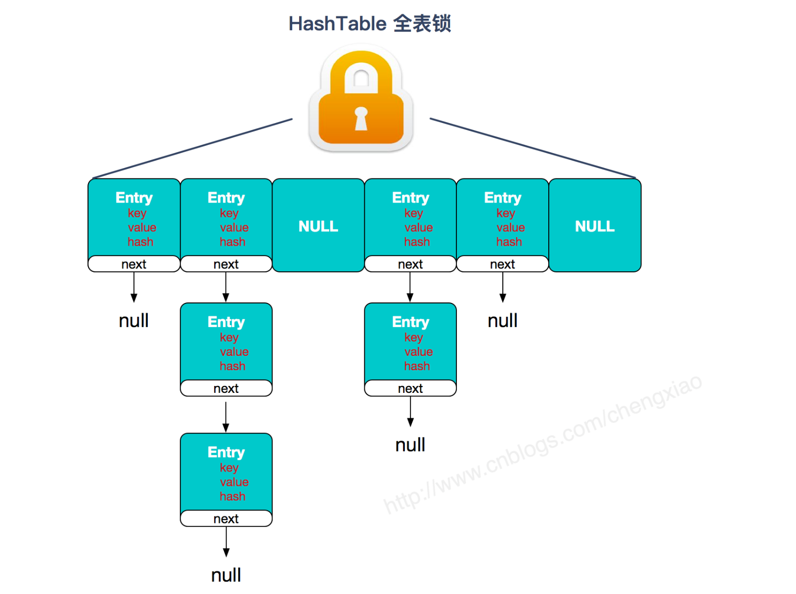


**JDK1.7的ConcurrentHashMap：**

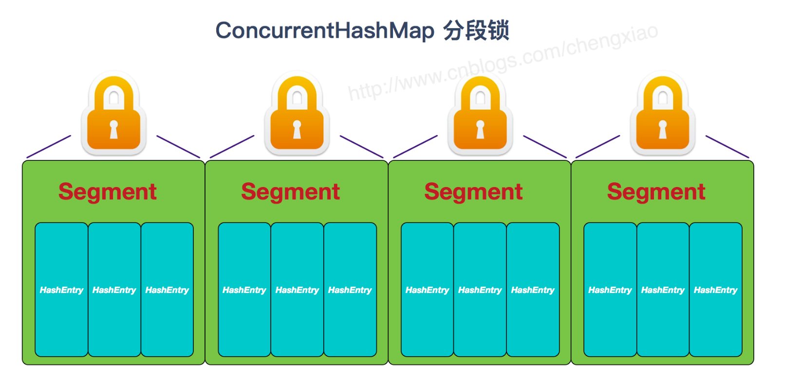


**JDK1.8的ConcurrentHashMap（TreeBin: 红黑二叉树节点 Node: 链表节点）：**

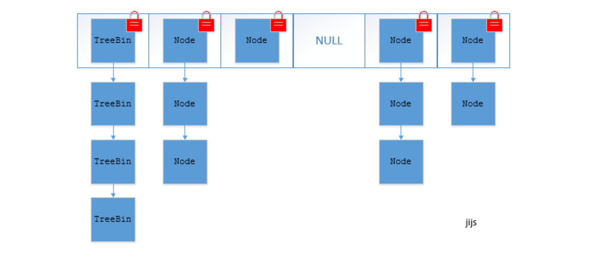

### 3.HashMap在执行put的时候，是如何避免重复的？

内容参考于：https://www.cnblogs.com/developer_chan/p/9153490.html

HashMap在进行put操作时，会有如下操作：（注意，下面所谓的头插法，是JDK1.7之前的，JDK1.8是尾插法）

1）在**key的hashCode相等**，且**key的内容也相同**的情况下（两次"Aa"），就会对value值进行**覆盖**。

2）在**key的hashCode相等**，但**key的内容不相同**的情况下（"Aa","BB"），会进行**链式存储**，并且是**头插法**，新加的值（"BB"）在链表头，最开始（"Aa"）的值在链表尾。

3）在key的hashCode不相等的情况，直接进行散列存储。

4）从上述调试过程也发现，HashMap主要是**以key为主**，value相当于key的一个附属值，因为value随key走的。

### 4.说一下ConcurrentHashMap

具体概念参考上面区别里面的。

项目中用到的：

```java
//撮合交易队列
public  static Map<String,LinkedBlockTrade> blockTradeMap = new ConcurrentHashMap<>();
```

```java
/**
* 聊天的地方用到啦 
* key 用户id
* value orderId
*/
public static ConcurrentHashMap<Integer, Session> merchant = new ConcurrentHashMap<>();
```


### 5.遍历key，遍历value，同时遍历key和value和其他操作

```java
/**
 * 测试HashMap  遍历key，遍历value，同时遍历key和value
 */
public class TestHashMapKeyAndValue {
	public static void main(String[] args) {
		HashMap<String, String> map = new HashMap<String, String>();
		// 键不能重复，值可以重复
		map.put("san", "张三");
		map.put("si", "李四");
		map.put("wu", "王五");
		map.put("wang", "老王");
		map.put("wang", "老王2");// 老王被覆盖
		map.put("lao", "老王");
		System.out.println("-------直接输出hashmap:-------");
		System.out.println(map);
		
		/**
		 * 遍历HashMap
		 */
		// 1.获取Map中的所有键
		System.out.println("-------foreach获取Map中所有的键:------");
		Set<String> keys = map.keySet();
		for (String key : keys) {
			System.out.print(key+"  ");
		}
		System.out.println();//换行
		
		// 2.获取Map中所有值
		System.out.println("-------foreach获取Map中所有的值:------");
		Collection<String> values = map.values();
		for (String value : values) {
			System.out.print(value+"  ");
		}
		System.out.println();//换行
		
		// 3.得到key的值的同时得到key所对应的值
		System.out.println("-------得到key的值的同时得到key所对应的值:-------");
		Set<String> keys2 = map.keySet();
		for (String key : keys2) {
			System.out.print(key + "：" + map.get(key)+"   ");

		}
		/**
		 * 如果既要遍历key又要value，那么建议这种方式，应为如果先获取keySet然后再执行map.get(key)，map内部会执行两次遍历。
		 * 一次是在获取keySet的时候，一次是在遍历所有key的时候。
		 */
		// 当我调用put(key,value)方法的时候，首先会把key和value封装到
		// Entry这个静态内部类对象中，把Entry对象再添加到数组中，所以我们想获取
		// map中的所有键值对，我们只要获取数组中的所有Entry对象，接下来
		// 调用Entry对象中的getKey()和getValue()方法就能获取键值对了
		Set<java.util.Map.Entry<String, String>> entrys = map.entrySet();
		for (java.util.Map.Entry<String, String> entry : entrys) {
			System.out.println(entry.getKey() + "--" + entry.getValue());
		}
	}
}
```

### 6.hashMap的底层实现原理

<!-- MarkdownTOC -->

- [HashMap 简介](#hashmap-简介)
- [底层数据结构分析](#底层数据结构分析)
  - [JDK1.8之前](#jdk18之前)
  - [JDK1.8之后](#jdk18之后)
- [HashMap源码分析](#hashmap源码分析)
  - [构造方法](#构造方法)
  - [put方法](#put方法)
  - [get方法](#get方法)
  - [resize方法](#resize方法)
- [HashMap常用方法测试](#hashmap常用方法测试)

<!-- /MarkdownTOC -->

#### HashMap 简介

HashMap 主要用来存放键值对，它基于哈希表的Map接口实现</font>，是常用的Java集合之一。 

JDK1.8 之前 HashMap 由 数组+链表 组成的，数组是 HashMap 的主体，链表则是主要为了解决哈希冲突而存在的（“拉链法”解决冲突）.JDK1.8 以后在解决哈希冲突时有了较大的变化，当链表长度大于阈值（默认为 8）时，将链表转化为红黑树（将链表转换成红黑树前会判断，如果当前数组的长度小于 64，那么会选择先进行数组扩容，而不是转换为红黑树），以减少搜索时间，具体可以参考 `treeifyBin`方法。

#### 底层数据结构分析

##### JDK1.8之前

JDK1.8 之前 HashMap 底层是 **数组和链表** 结合在一起使用也就是 **链表散列**。**HashMap 通过 key 的 hashCode 经过扰动函数处理过后得到 hash  值，然后通过 `(n - 1) & hash` 判断当前元素存放的位置（这里的 n 指的是数组的长度），如果当前位置存在元素的话，就判断该元素与要存入的元素的 hash 值以及 key 是否相同，如果相同的话，直接覆盖，不相同就通过拉链法解决冲突。**

**所谓扰动函数指的就是 HashMap 的 hash 方法。使用 hash 方法也就是扰动函数是为了防止一些实现比较差的 hashCode() 方法 换句话说使用扰动函数之后可以减少碰撞。**

**JDK 1.8 HashMap 的 hash 方法源码:**

JDK 1.8 的 hash方法 相比于 JDK 1.7 hash 方法更加简化，但是原理不变。

```java
      static final int hash(Object key) {
        int h;
        // key.hashCode()：返回散列值也就是hashcode
        // ^ ：按位异或
        // >>>:无符号右移，忽略符号位，空位都以0补齐
        return (key == null) ? 0 : (h = key.hashCode()) ^ (h >>> 16);
    }
```

对比一下 JDK1.7的 HashMap 的 hash 方法源码.

```java
static int hash(int h) {
    // This function ensures that hashCodes that differ only by
    // constant multiples at each bit position have a bounded
    // number of collisions (approximately 8 at default load factor).

    h ^= (h >>> 20) ^ (h >>> 12);
    return h ^ (h >>> 7) ^ (h >>> 4);
}
```

相比于 JDK1.8 的 hash 方法 ，JDK 1.7 的 hash 方法的性能会稍差一点点，因为毕竟扰动了 4 次。

所谓 **“拉链法”** 就是：将链表和数组相结合。也就是说创建一个链表数组，数组中每一格就是一个链表。若遇到哈希冲突，则将冲突的值加到链表中即可。

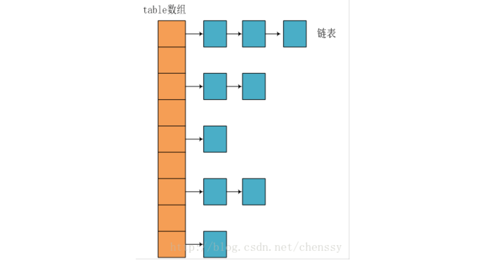

##### JDK1.8之后

相比于之前的版本，jdk1.8在解决哈希冲突时有了较大的变化，当链表长度大于阈值（默认为8）时，将链表转化为红黑树，以减少搜索时间。


**类的属性：**

```java
public class HashMap<K,V> extends AbstractMap<K,V> implements Map<K,V>, Cloneable, Serializable {
    // 序列号
    private static final long serialVersionUID = 362498820763181265L;    
    // 默认的初始容量是16
    static final int DEFAULT_INITIAL_CAPACITY = 1 << 4;   
    // 最大容量
    static final int MAXIMUM_CAPACITY = 1 << 30; 
    // 默认的填充因子
    static final float DEFAULT_LOAD_FACTOR = 0.75f;
    // 当桶(bucket)上的结点数大于这个值时会转成红黑树
    static final int TREEIFY_THRESHOLD = 8; 
    // 当桶(bucket)上的结点数小于这个值时树转链表
    static final int UNTREEIFY_THRESHOLD = 6;
    // 桶中结构转化为红黑树对应的table的最小大小
    static final int MIN_TREEIFY_CAPACITY = 64;
    // 存储元素的数组，总是2的幂次倍
    transient Node<k,v>[] table; 
    // 存放具体元素的集
    transient Set<map.entry<k,v>> entrySet;
    // 存放元素的个数，注意这个不等于数组的长度。
    transient int size;
    // 每次扩容和更改map结构的计数器
    transient int modCount;   
    // 临界值 当实际大小(容量*填充因子)超过临界值时，会进行扩容
    int threshold;
    // 加载因子
    final float loadFactor;
}
```

- **loadFactor加载因子**

  loadFactor加载因子是控制数组存放数据的疏密程度，loadFactor越趋近于1，那么   数组中存放的数据(entry)也就越多，也就越密，也就是会让链表的长度增加，loadFactor越小，也就是趋近于0，数组中存放的数据(entry)也就越少，也就越稀疏。

  **loadFactor太大导致查找元素效率低，太小导致数组的利用率低，存放的数据会很分散。loadFactor的默认值为0.75f是官方给出的一个比较好的临界值**。 

  给定的默认容量为 16，负载因子为 0.75。Map 在使用过程中不断的往里面存放数据，当数量达到了 16 * 0.75 = 12 就需要将当前 16 的容量进行扩容，而扩容这个过程涉及到 rehash、复制数据等操作，所以非常消耗性能。

- **threshold**

  **threshold = capacity * loadFactor**，**当Size>=threshold**的时候，那么就要考虑对数组的扩增了，也就是说，这个的意思就是 **衡量数组是否需要扩增的一个标准**。

**Node节点类源码:**

```java
// 继承自 Map.Entry<K,V>static class Node<K,V> implements Map.Entry<K,V> {       final int hash;// 哈希值，存放元素到hashmap中时用来与其他元素hash值比较       final K key;//键       V value;//值       // 指向下一个节点       Node<K,V> next;       Node(int hash, K key, V value, Node<K,V> next) {            this.hash = hash;            this.key = key;            this.value = value;            this.next = next;        }        public final K getKey()        { return key; }        public final V getValue()      { return value; }        public final String toString() { return key + "=" + value; }        // 重写hashCode()方法        public final int hashCode() {            return Objects.hashCode(key) ^ Objects.hashCode(value);        }        public final V setValue(V newValue) {            V oldValue = value;            value = newValue;            return oldValue;        }        // 重写 equals() 方法        public final boolean equals(Object o) {            if (o == this)                return true;            if (o instanceof Map.Entry) {                Map.Entry<?,?> e = (Map.Entry<?,?>)o;                if (Objects.equals(key, e.getKey()) &&                    Objects.equals(value, e.getValue()))                    return true;            }            return false;        }}
```

**树节点类源码:**

```java
static final class TreeNode<K,V> extends LinkedHashMap.Entry<K,V> {        TreeNode<K,V> parent;  // 父        TreeNode<K,V> left;    // 左        TreeNode<K,V> right;   // 右        TreeNode<K,V> prev;    // needed to unlink next upon deletion        boolean red;           // 判断颜色        TreeNode(int hash, K key, V val, Node<K,V> next) {            super(hash, key, val, next);        }        // 返回根节点        final TreeNode<K,V> root() {            for (TreeNode<K,V> r = this, p;;) {                if ((p = r.parent) == null)                    return r;                r = p;       }
```

#### HashMap源码分析

##### 构造方法

HashMap 中有四个构造方法，它们分别如下：

```java
    // 默认构造函数。    public HashMap() {        this.loadFactor = DEFAULT_LOAD_FACTOR; // all   other fields defaulted     }          // 包含另一个“Map”的构造函数     public HashMap(Map<? extends K, ? extends V> m) {         this.loadFactor = DEFAULT_LOAD_FACTOR;         putMapEntries(m, false);//下面会分析到这个方法     }          // 指定“容量大小”的构造函数     public HashMap(int initialCapacity) {         this(initialCapacity, DEFAULT_LOAD_FACTOR);     }          // 指定“容量大小”和“加载因子”的构造函数     public HashMap(int initialCapacity, float loadFactor) {         if (initialCapacity < 0)             throw new IllegalArgumentException("Illegal initial capacity: " + initialCapacity);         if (initialCapacity > MAXIMUM_CAPACITY)             initialCapacity = MAXIMUM_CAPACITY;         if (loadFactor <= 0 || Float.isNaN(loadFactor))             throw new IllegalArgumentException("Illegal load factor: " + loadFactor);         this.loadFactor = loadFactor;         this.threshold = tableSizeFor(initialCapacity);     }
```

**putMapEntries方法：**

```java
final void putMapEntries(Map<? extends K, ? extends V> m, boolean evict) {    int s = m.size();    if (s > 0) {        // 判断table是否已经初始化        if (table == null) { // pre-size            // 未初始化，s为m的实际元素个数            float ft = ((float)s / loadFactor) + 1.0F;            int t = ((ft < (float)MAXIMUM_CAPACITY) ?                    (int)ft : MAXIMUM_CAPACITY);            // 计算得到的t大于阈值，则初始化阈值            if (t > threshold)                threshold = tableSizeFor(t);        }        // 已初始化，并且m元素个数大于阈值，进行扩容处理        else if (s > threshold)            resize();        // 将m中的所有元素添加至HashMap中        for (Map.Entry<? extends K, ? extends V> e : m.entrySet()) {            K key = e.getKey();            V value = e.getValue();            putVal(hash(key), key, value, false, evict);        }    }}
```

##### put方法

HashMap只提供了put用于添加元素，putVal方法只是给put方法调用的一个方法，并没有提供给用户使用。

**对putVal方法添加元素的分析如下：**

- ①如果定位到的数组位置没有元素 就直接插入。
- ②如果定位到的数组位置有元素就和要插入的key比较，如果key相同就直接覆盖，如果key不相同，就判断p是否是一个树节点，如果是就调用`e = ((TreeNode<K,V>)p).putTreeVal(this, tab, hash, key, value)`将元素添加进入。如果不是就遍历链表插入(插入的是链表尾部)。

ps:下图有一个小问题，来自 [issue#608](https://github.com/Snailclimb/JavaGuide/issues/608)指出：直接覆盖之后应该就会 return，不会有后续操作。参考 JDK8 HashMap.java 658 行。

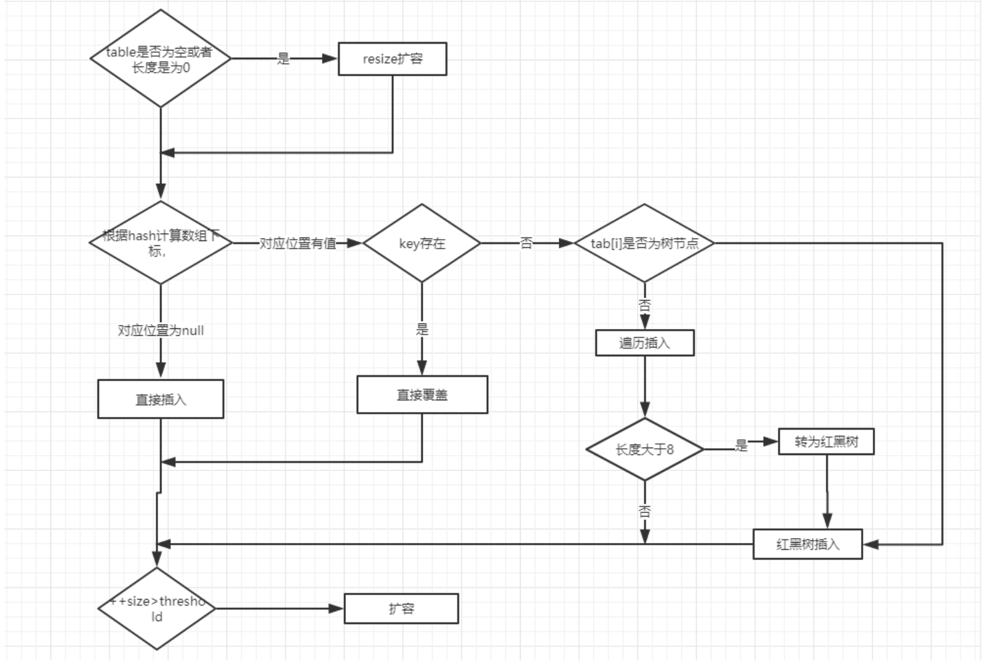


```java
public V put(K key, V value) {    return putVal(hash(key), key, value, false, true);}final V putVal(int hash, K key, V value, boolean onlyIfAbsent,                   boolean evict) {    Node<K,V>[] tab; Node<K,V> p; int n, i;    // table未初始化或者长度为0，进行扩容    if ((tab = table) == null || (n = tab.length) == 0)        n = (tab = resize()).length;    // (n - 1) & hash 确定元素存放在哪个桶中，桶为空，新生成结点放入桶中(此时，这个结点是放在数组中)    if ((p = tab[i = (n - 1) & hash]) == null)        tab[i] = newNode(hash, key, value, null);    // 桶中已经存在元素    else {        Node<K,V> e; K k;        // 比较桶中第一个元素(数组中的结点)的hash值相等，key相等        if (p.hash == hash &&            ((k = p.key) == key || (key != null && key.equals(k))))                // 将第一个元素赋值给e，用e来记录                e = p;        // hash值不相等，即key不相等；为红黑树结点        else if (p instanceof TreeNode)            // 放入树中            e = ((TreeNode<K,V>)p).putTreeVal(this, tab, hash, key, value);        // 为链表结点        else {            // 在链表最末插入结点            for (int binCount = 0; ; ++binCount) {                // 到达链表的尾部                if ((e = p.next) == null) {                    // 在尾部插入新结点                    p.next = newNode(hash, key, value, null);                    // 结点数量达到阈值，转化为红黑树                    if (binCount >= TREEIFY_THRESHOLD - 1) // -1 for 1st                        treeifyBin(tab, hash);                    // 跳出循环                    break;                }                // 判断链表中结点的key值与插入的元素的key值是否相等                if (e.hash == hash &&                    ((k = e.key) == key || (key != null && key.equals(k))))                    // 相等，跳出循环                    break;                // 用于遍历桶中的链表，与前面的e = p.next组合，可以遍历链表                p = e;            }        }        // 表示在桶中找到key值、hash值与插入元素相等的结点        if (e != null) {             // 记录e的value            V oldValue = e.value;            // onlyIfAbsent为false或者旧值为null            if (!onlyIfAbsent || oldValue == null)                //用新值替换旧值                e.value = value;            // 访问后回调            afterNodeAccess(e);            // 返回旧值            return oldValue;        }    }    // 结构性修改    ++modCount;    // 实际大小大于阈值则扩容    if (++size > threshold)        resize();    // 插入后回调    afterNodeInsertion(evict);    return null;} 
```

**我们再来对比一下 JDK1.7 put方法的代码**

**对于put方法的分析如下：**

- ①如果定位到的数组位置没有元素 就直接插入。
- ②如果定位到的数组位置有元素，遍历以这个元素为头结点的链表，依次和插入的key比较，如果key相同就直接覆盖，不同就采用头插法插入元素。

```java
public V put(K key, V value)    if (table == EMPTY_TABLE) {     inflateTable(threshold); }      if (key == null)        return putForNullKey(value);    int hash = hash(key);    int i = indexFor(hash, table.length);    for (Entry<K,V> e = table[i]; e != null; e = e.next) { // 先遍历        Object k;        if (e.hash == hash && ((k = e.key) == key || key.equals(k))) {            V oldValue = e.value;            e.value = value;            e.recordAccess(this);            return oldValue;         }    }    modCount++;    addEntry(hash, key, value, i);  // 再插入    return null;}
```


##### get方法

```java
public V get(Object key) {    Node<K,V> e;    return (e = getNode(hash(key), key)) == null ? null : e.value;}final Node<K,V> getNode(int hash, Object key) {    Node<K,V>[] tab; Node<K,V> first, e; int n; K k;    if ((tab = table) != null && (n = tab.length) > 0 &&        (first = tab[(n - 1) & hash]) != null) {        // 数组元素相等        if (first.hash == hash && // always check first node            ((k = first.key) == key || (key != null && key.equals(k))))            return first;        // 桶中不止一个节点        if ((e = first.next) != null) {            // 在树中get            if (first instanceof TreeNode)                return ((TreeNode<K,V>)first).getTreeNode(hash, key);            // 在链表中get            do {                if (e.hash == hash &&                    ((k = e.key) == key || (key != null && key.equals(k))))                    return e;            } while ((e = e.next) != null);        }    }    return null;}
```

##### resize方法

进行扩容，会伴随着一次重新hash分配，并且会遍历hash表中所有的元素，是非常耗时的。在编写程序中，要尽量避免resize。

```java
final Node<K,V>[] resize() {    Node<K,V>[] oldTab = table;    int oldCap = (oldTab == null) ? 0 : oldTab.length;    int oldThr = threshold;    int newCap, newThr = 0;    if (oldCap > 0) {        // 超过最大值就不再扩充了，就只好随你碰撞去吧        if (oldCap >= MAXIMUM_CAPACITY) {            threshold = Integer.MAX_VALUE;            return oldTab;        }        // 没超过最大值，就扩充为原来的2倍        else if ((newCap = oldCap << 1) < MAXIMUM_CAPACITY && oldCap >= DEFAULT_INITIAL_CAPACITY)            newThr = oldThr << 1; // double threshold    }    else if (oldThr > 0) // initial capacity was placed in threshold        newCap = oldThr;    else {         // signifies using defaults        newCap = DEFAULT_INITIAL_CAPACITY;        newThr = (int)(DEFAULT_LOAD_FACTOR * DEFAULT_INITIAL_CAPACITY);    }    // 计算新的resize上限    if (newThr == 0) {        float ft = (float)newCap * loadFactor;        newThr = (newCap < MAXIMUM_CAPACITY && ft < (float)MAXIMUM_CAPACITY ? (int)ft : Integer.MAX_VALUE);    }    threshold = newThr;    @SuppressWarnings({"rawtypes","unchecked"})        Node<K,V>[] newTab = (Node<K,V>[])new Node[newCap];    table = newTab;    if (oldTab != null) {        // 把每个bucket都移动到新的buckets中        for (int j = 0; j < oldCap; ++j) {            Node<K,V> e;            if ((e = oldTab[j]) != null) {                oldTab[j] = null;                if (e.next == null)                    newTab[e.hash & (newCap - 1)] = e;                else if (e instanceof TreeNode)                    ((TreeNode<K,V>)e).split(this, newTab, j, oldCap);                else {                     Node<K,V> loHead = null, loTail = null;                    Node<K,V> hiHead = null, hiTail = null;                    Node<K,V> next;                    do {                        next = e.next;                        // 原索引                        if ((e.hash & oldCap) == 0) {                            if (loTail == null)                                loHead = e;                            else                                loTail.next = e;                            loTail = e;                        }                        // 原索引+oldCap                        else {                            if (hiTail == null)                                hiHead = e;                            else                                hiTail.next = e;                            hiTail = e;                        }                    } while ((e = next) != null);                    // 原索引放到bucket里                    if (loTail != null) {                        loTail.next = null;                        newTab[j] = loHead;                    }                    // 原索引+oldCap放到bucket里                    if (hiTail != null) {                        hiTail.next = null;                        newTab[j + oldCap] = hiHead;                    }                }            }        }    }    return newTab;}
```

##### HashMap常用方法测试

```java
package map;import java.util.Collection;import java.util.HashMap;import java.util.Set;public class HashMapDemo {    public static void main(String[] args) {        HashMap<String, String> map = new HashMap<String, String>();        // 键不能重复，值可以重复        map.put("san", "张三");        map.put("si", "李四");        map.put("wu", "王五");        map.put("wang", "老王");        map.put("wang", "老王2");// 老王被覆盖        map.put("lao", "老王");        System.out.println("-------直接输出hashmap:-------");        System.out.println(map);        /**             * 遍历HashMap             */        // 1.获取Map中的所有键        System.out.println("-------foreach获取Map中所有的键:------");        Set<String> keys = map.keySet();        for (String key : keys) {            System.out.print(key+"  ");        }        System.out.println();//换行        // 2.获取Map中所有值        System.out.println("-------foreach获取Map中所有的值:------");        Collection<String> values = map.values();        for (String value : values) {            System.out.print(value+"  ");        }        System.out.println();//换行        // 3.得到key的值的同时得到key所对应的值        System.out.println("-------得到key的值的同时得到key所对应的值:-------");        Set<String> keys2 = map.keySet();        for (String key : keys2) {            System.out.print(key + "：" + map.get(key)+"   ");        }        /**             * 如果既要遍历key又要value，那么建议这种方式，应为如果先获取keySet然后再执行map.get(key)，map内部会执行两次遍历。             * 一次是在获取keySet的时候，一次是在遍历所有key的时候。             */        // 当我调用put(key,value)方法的时候，首先会把key和value封装到        // Entry这个静态内部类对象中，把Entry对象再添加到数组中，所以我们想获取        // map中的所有键值对，我们只要获取数组中的所有Entry对象，接下来        // 调用Entry对象中的getKey()和getValue()方法就能获取键值对了        Set<java.util.Map.Entry<String, String>> entrys = map.entrySet();        for (java.util.Map.Entry<String, String> entry : entrys) {            System.out.println(entry.getKey() + "--" + entry.getValue());        }        /**             * HashMap其他常用方法             */        System.out.println("after map.size()："+map.size());        System.out.println("after map.isEmpty()："+map.isEmpty());        System.out.println(map.remove("san"));        System.out.println("after map.remove()："+map);        System.out.println("after map.get(si)："+map.get("si"));        System.out.println("after map.containsKey(si)："+map.containsKey("si"));        System.out.println("after containsValue(李四)："+map.containsValue("李四"));        System.out.println(map.replace("si", "李四2"));        System.out.println("after map.replace(si, 李四2):"+map);    }}
```


### 6.1.Hashmap中value放在那里

放在Node节点里面  

```java
//Node 节点private static class Node<K, V> {    int hash;    K key;    V value;    Node<K, V> next;    public Node(int hash, K key, V value, Node<K, V> next) {        this.hash = hash;        this.key = key;        this.value = value;        this.next = next;    }    @Override    public String toString() {        return key + "=" + value;    }}
```


put的时候，参考Project里面的put方法。


### 7.HashMap的默认长度是多少？如果我new HashMap，指定其长度为15，那么其底层长度到底是多少？

默认长度（容量）为16，而且扩容以后长度始终是2的幂次数。

默认情况下HashMap的容量是16，但是，如果用户通过构造函数指定了一个数字作为容量，那么Hash会选择大于该数字的第一个2的幂作为容量。(3->4、7->8、9->16)

答案参考：https://blog.csdn.net/qq_27731689/article/details/95865083


### 8.hashmap键可以放空值进去吗？值可以为空吗？如果都为空之后再放新的为空的值进来会发生什么？

key和value都可以为空，如果两个键都为null的话，后面加进来的会覆盖掉前面一个。


### 9.Hashmap底层是如何实现的？什么情况下会变成红黑树？为什么阈值是8？

底层实现看上面。当阈值大于8的时候，会变为红黑树。


**TreeNodes占用空间是普通Nodes的两倍**，所以只有当bin包含足够多的节点时才会转成TreeNodes，而是否足够多就是由**TREEIFY_THRESHOLD**的值决定的。当bin中节点数变少时，又会转成普通的bin。并且我们查看源码的时候发现，链表长度达到8就转成红黑树，当长度降到6就转成普通bin。

当hashCode离散性很好的时候，树型bin用到的概率非常小，因为数据均匀分布在每个bin中，几乎不会有bin中链表长度会达到阈值。但是在随机hashCode下，离散性可能会变差，然而JDK又不能阻止用户实现这种不好的hash算法，因此就可能导致不均匀的数据分布。不过理想情况下随机hashCode算法下所有bin中节点的分布频率会遵循**泊松分布**，我们可以看到，一个bin中链表长度达到8个元素的概率为0.00000006，几乎是不可能事件。所以，之所以选择8，不是拍拍屁股决定的，而是根据概率统计决定的。由此可见，发展30年的Java每一项改动和优化都是非常严谨和科学的。

参考答案：https://mp.weixin.qq.com/s/QgkBRoADcO8Wgj0dHCc9dw


### 10.Hashmap的自动扩容机制？

参考上面resize（）。


### 11.Map的实现类，HashMap的底层怎么实现，如果hash冲突链表会一直增加下去吗？除了链表变红黑树还有其他原因导致HashMap底层数据结构变化吗？

**Map实现类**：**HashMap**，**HashTable**，**ConcurrentHashMap，TreeMap**（对Key进行排序，使用了TreeMap存储键值对，再使用iterator进行输出时，会发现其默认采用key由小到大的顺序输出键值对），**LinkedHashMap**（采用双向列表）

不会一直增加下去，当阈值达到8以后，会变成红黑树。


### 12.为什么HashSet和HashMap在put的时候除了判断hashcode还要判断equals

阿里开发手册P27：

1）只要重写equal方法就必须重写hashCode。

2）因为Set存储的是不重复的对象，依据hashCode和equal进行判断，所以Set必须重写这两个方法。

3）如果自定义对象作为Map的对象，那么必须重写hashCode和equal方法。


**说明：真是由于String重写了hashCode方法和equal方法，所以我们可以非常愉快的将String作为Map的key来使用。**


### 13.HashMap的查询和插入的时间复杂度

理想情况下才可以是O（1）。

用HashMap查找分四步：

1.判断key，根据key算出索引。

2.根据索引获得索引位置所对应的键值对链表。

3.遍历键值对链表，根据key找到对应的Entry键值对。

4.拿到value。

分析：

以上四步要保证HashMap的时间复杂度O(1)，需要保证每一步都是O(1)，现在看起来就第三步对链表的循环的时

间复杂度影响最大，链表查找的时间复杂度为O(n)，与链表长度有关。我们要保证那个链表长度为1，才可以说时

间复杂度能满足O(1)。但这么说来只有那个hash算法尽量减少冲突，才能使链表长度尽可能短，理想状态为1。因

此可以得出结论：HashMap的查找时间复杂度只有在最理想的情况下才会为O(1)，而要保证这个理想状态不是我

们开发者控制的。

参考：https://blog.csdn.net/donggua3694857/article/details/64127131/


### 14.树的结构了解吗，HashMap？红黑树？平衡二叉树怎么平衡，怎么调节平衡因子？

红黑树的特性:
1）每个节点或者是黑色，或者是红色。
2）根节点是黑色。
3）每个叶子节点（NIL）是黑色。 [注意：这里叶子节点，是指为空(NIL或NULL)的叶子节点！]
4）如果一个节点是红色的，则它的子节点必须是黑色的。
5）从一个节点到该节点的子孙节点的所有路径上包含相同数目的黑节点。[这里指到叶子节点的路径]


平衡二叉树：

它是一 棵空树或它的**左右两个子树的高度差的绝对值不超过1**，并且**左右两个子树都是一棵平衡二叉树**。这个方案很好的解决了二叉查找树退化成链表的问题，把插入，查找，删除的时间复杂度最好情况和最坏情况都维持在O(logN)。


**平衡二叉树的平衡因子：**

**左子树深度-右子树深度=平衡因子** 


怎么调节平衡因子？

常见四种LL，RR，LR，RL   参考：https://blog.csdn.net/weixin_40374341/article/details/87886807

### 15.集合框架


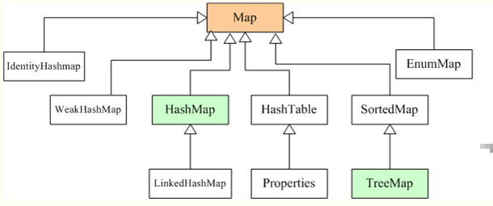

这个图显示，**而 Hashtable 类则继承Dictionary 类**，这句话是对的。（牛客上面原题）

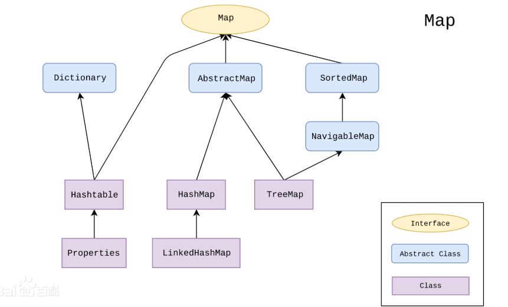

集合可以看作是一种容器，用来存储对象信息。所有集合类都位于java.util包下，但支持多线程的集合类位于java.util.concurrent包下。


数组与集合的区别如下：

1）数组长度不可变化而且无法保存具有映射关系的数据；集合类用于保存数量不确定的数据，以及保存具有映射关系的数据。

2）数组元素既可以是基本类型的值，也可以是对象；集合只能保存对象。

​		Java集合类主要由两个根接口Collection和Map派生出来的，Collection派生出了三个子接口：List、Set、Queue（Java5新增的队列），因此Java集合大致也可分成List、Set、Queue、Map四种接口体系，（**注意：Map不是Collection的子接口**）。

　　其中List代表了有序可重复集合，可直接根据元素的索引来访问；Set代表无序不可重复集合，只能根据元素本身来访问；Queue是队列集合；Map代表的是存储key-value对的集合，可根据元素的key来访问value。

　　上图中淡**绿色背景覆盖的是集合体系中常用的实现类**，分别是ArrayList、LinkedList、ArrayQueue、HashSet、TreeSet、HashMap、TreeMap等实现类。


### 16、ArrayList和HashMap是如何实现的？既然是数组实现的，为何数组长度固定，而ArrayList和HashMap不会越界？有了解过他们的这种自动扩容机制吗？

ArrayList是用数组实现的，HashMap是用数组+链表+红黑树实现。

不会越界，他们都有自动扩容机制。


HashMap的扩容机制：

resize（）方法，首先判断超没超过最大值，如果超过最大值就不在扩容啦，如果没有超过最大值，就进容量扩大到原来的两倍。

```java
// 没超过最大值，就扩充为原来的2倍else if ((newCap = oldCap << 1) < MAXIMUM_CAPACITY && oldCap >= DEFAULT_INITIAL_CAPACITY)            newThr = oldThr << 1; // double threshold  移位运算符是亮点    }
```

ArrayList的扩容机制：

```java
//将oldCapacity 右移一位，其效果相当于oldCapacity /2，//我们知道位运算的速度远远快于整除运算，整句运算式的结果就是将新容量更新为旧容量的1.5倍，	int newCapacity = oldCapacity + (oldCapacity >> 1);//然后检查新容量是否大于最小需要容量，若还是小于最小需要容量，那么就把最小需要容量当作数组的新容量，
```


### 17.list有100个元素，取前十个怎么取（sublist方法 用的index）


### 18. List,Set,Map三者的区别？

- **List(对付顺序的好帮手)：** List接口存储一组不唯一（可以有多个元素引用相同的对象），有序的对象

- **Set(注重独一无二的性质):** 不允许重复的集合。不会有多个元素引用相同的对象。

- **Map(用Key来搜索的专家):** 使用键值对存储。Map会维护与Key有关联的值。两个Key可以引用相同的对象，但Key不能重复，典型的Key是String类型，但也可以是任何对象。

  

### 19. ArrayList和HashMap的默认大小,各种集合常见扩容机制

**在 Java 7 中，ArrayList 的默认大小是 10 个元素，HashMap 的默认大小是16个元素（必须是2的幂）**

**这就是 Java 7 中 ArrayList 和 HashMap  类 的代码片段：**

```java
// from ArrayList.java JDK 1.7private  static  final  int  DEFAULT_CAPACITY = 10; //from HashMap.java JDK 7static  final  int  DEFAULT_INITIAL_CAPACITY = 1  << 4; // aka 16
```


**这里要讨论这些常用的默认初始容量和扩容的原因是：**

**当底层实现涉及到扩容时，容器或重新分配一段更大的连续内存（如果是离散分配则不需要重新分配，离散分配都是插入新元素时动态分配内存），要将容器原来的数据全部复制到新的内存上，这无疑使效率大大降低。**

**加载因子的系数小于等于1，意指  即当 元素个数 超过 容量长度\*加载因子的系数 时，进行扩容。**

**另外，扩容也是有默认的倍数的，不同的容器扩容情况不同。**

 

**List 元素是有序的、可重复**

**ArrayList、Vector默认初始容量为10**

**Vector：线程安全，但速度慢**

　　　　**底层数据结构是数组结构**

　　　　**加载因子为1：即当 元素个数 超过 容量长度 时，进行扩容**

　　　　**扩容增量：原容量的 1倍**

　　　　　　**如 Vector的容量为10，一次扩容后是容量为20**

**ArrayList：线程不安全，查询速度快**

　　　　**底层数据结构是数组结构**

　　　　**扩容增量：原容量的 0.5倍+1**

　　　　　　**如 ArrayList的容量为10，一次扩容后是容量为15*

 

**Set(集) 元素无序的、不可重复。**

**HashSet：线程不安全，存取速度快**

　　　　　**底层实现是一个HashMap（保存数据），实现Set接口**

　　　　　**默认初始容量为16（为何是16，见下方对HashMap的描述）**

　　　　　**加载因子为0.75：即当 元素个数 超过 容量长度的0.75倍 时，进行扩容**

　　　　　**扩容增量：原容量的 1 倍**

　　　　　　**如 HashSet的容量为16，一次扩容后是容量为32**

 

**Map是一个双列集合**

**HashMap：默认初始容量为16**

　　　　　**（为何是16：16是2^4，可以提高查询效率，另外，32=16<<1       -->至于详细的原因可另行分析，或分析源代码）**

　　　　　**加载因子为0.75：即当 元素个数 超过 容量长度的0.75倍 时，进行扩容**

　　　　　**扩容增量：原容量的 1 倍**

　　　　　**如 HashSet的容量为16，一次扩容后是容量为32**


### 20. ArrayList list = new ArrayList（20）需要扩容几次

```java
/*** 带初始容量参数的构造函数。（用户自己指定容量）*/public ArrayList(int initialCapacity) {    if (initialCapacity > 0) {//初始容量大于0        //创建initialCapacity大小的数组        this.elementData = new Object[initialCapacity];  //###这就是答案 扩容0次    } else if (initialCapacity == 0) {//初始容量等于0        //创建空数组        this.elementData = EMPTY_ELEMENTDATA;    } else {//初始容量小于0，抛出异常        throw new IllegalArgumentException("Illegal Capacity: "+                                           initialCapacity);    }}
```

这种是指定数组大小的创建，创建时直接分配其大小，没有扩充。一次性为创建了传入的数字的长度的数组，所以，扩充为0次。

### 

### 21. 单链表头尾翻转？

参考答案：    https://www.cnblogs.com/mwl523/p/10749144.html

提供了两种思路，这里用其中一种思路：

方法：就地反转法

**思路**

把当前链表的下一个节点pCur插入到头结点dummy的下一个节点中，就地反转。

dummy->1->2->3->4->5的就地反转过程：

dummy->2->1->3->4->5

dummy->3->2->1->4->5

dummy->4>-3->2->1->5

dummy->5->4->3->2->1

**解释**

**初始状态**


**过程**

pCur是需要反转的节点。

1. prev连接下一次需要反转的节点
2. 反转节点pCur
3. 纠正头结点dummy的指向
4. pCur指向下一次要反转的节点

**伪代码**

```java
1 prev.next = pCur.next;2 pCur.next = dummy.next;3 dummy.next = pCur;4 pCur = prev.next;
```


今天在leetcode看到一个单链表翻转的原题：

```java
public class ListNode { //运行的时候 要把这里注释掉    int val;    ListNode next;    ListNode(int x) {        val = x;    }}class Solution {    public int[] reversePrint(ListNode head) {        Stack<ListNode> stack = new Stack<>();        ListNode temp = head;        while (temp != null) {            stack.push(temp);            temp = temp.next;        }        int[] arr = new int[stack.size()];        for (int i = 0; i < arr.length; i++){            arr[i] = stack.pop().val;  //栈顶端的元素 同时出栈        }        return arr;    }
```


### 22.青蛙跳台阶问题和斐波那契数列（兔子出生问题）比较：

#### 递归思想：

斐波那契数列：

```java
public static int fibSeq(int n){    if(n<0){        throw new IllegalArgumentException("the param is less than 0");    }    if(n==0)        return 0;    if(n==1)        return 1;    return fibSeq(n-1);+fibSeq(n-2);}//王道的经典50道java题写法：private static int fun(int n){    if(n==1 || n==2)        return 1;    else        return fun(n-1)+fun(n-2);}
```

爬楼梯：

```
public static int fibSeq(int n){    if(n<0){        throw new IllegalArgumentException("the param is less than 0");    }    if(n==1)        return 1;    if(n==2)        return 2;    return fibSeq(n-1);+fibSeq(n-2);}
```


#### 动态规划思想：

斐波那契数列：

```java
public int fib(int n) { //动态规划做    int a = 0;    int b = 1;    int sum;    for (int i = 0;i<n;i++) {        sum = (a + b) % 1000000007;        a = b;        b = sum;    }    return a; }
```

青蛙跳台阶：

```java
public int fib(int n) { //动态规划做    int a = 1;    int b = 2;    int sum;    for (int i = 0;i<n;i++) {        sum = (a + b) % 1000000007;        a = b;        b = sum;    }    return a;
```

上面两个是不同的，主要体现在初始值a，b不同，Leetcode剑指offer上面指出：

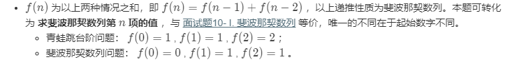

由实际情况可知，青蛙跳台阶，f(1)=1,f(2)=2,才推算出f（0）=1 （个人认为），而题中所写的a，b指的是这个里面的f（0），和f（1）。

斐波那契数列为什么开始是0和1？ 因为斐波那契数列前两项是默认指定的。（个人理解）


补充**动态规划**：

参考（写的非常好）：https://www.cnblogs.com/cthon/p/9251909.html


### 23.时间复杂度空间复杂度

时间复杂度：算法中基本操作重复执行的次数是问题规模n的某个函数，用T(n)表示。

记作**T(n)=Ｏ(f(n)),**称**Ｏ(f(n))** 为算法的渐进时间复杂度，简称时间复杂度。


空间复杂度：

一个算法的空间复杂度(Space Complexity)S(n)定义为该算法所耗费的存储空间。


### 25.ArrayList和LinkedList区别：

- **1. 是否保证线程安全：** `ArrayList` 和 `LinkedList` 都是不同步的，也就是不保证线程安全；

- **2. 底层数据结构：** `Arraylist` 底层使用的是 **`Object` 数组**；`LinkedList` 底层使用的是 **双向链表** 数据结构（JDK1.6之前为循环链表，JDK1.7取消了循环。注意双向链表和双向循环链表的区别，下面有介绍到！）

- **3. 插入和删除是否受元素位置的影响：**

  ① **`ArrayList` 采用数组存储，所以插入和删除元素的时间复杂度受元素位置的影响。** 比如：执行`add(E e) `方法的时候， `ArrayList` 会默认在将指定的元素追加到此列表的末尾，这种情况时间复杂度就是O(1)。但是如果要在指定位置 i 插入和删除元素的话（`add(int index, E element) `）时间复杂度就为 O(n-i)。因为在进行上述操作的时候集合中第 i 和第 i 个元素之后的(n-i)个元素都要执行向后位/向前移一位的操作。

  ② **`LinkedList` 采用链表存储，所以对于`add(E e)`方法的插入，删除元素时间复杂度不受元素位置的影响，近似 O(1)，如果是要在指定位置`i`插入和删除元素的话（`(add(int index, E element)`） 时间复杂度近似为`o(n))`因为需要先移动到指定位置再插入。**

- **4. 是否支持快速随机访问：** `LinkedList` 不支持高效的随机元素访问，而 `ArrayList` 支持。快速随机访问就是通过元素的序号快速获取元素对象(对应于`get(int index) `方法)。

- **5. 内存空间占用：** ArrayList的空 间浪费主要体现在在list列表的结尾会预留一定的容量空间，而LinkedList的空间花费则体现在它的每一个元素都需要消耗比ArrayList更多的空间（因为要存放直接后继和直接前驱以及数据）。


### 26.ArrayList 线程安全吗？为什么不安全？读过源码吗？

原码中add方法，没有加锁，如果现在数组中有9个元素，数组容量是10，那么多个线程同时操作的时候，会出现数组越界。

### 27.ArrayList和LinkedList区别，在同等数据量的情况下两者谁占的内存大？

LinkedList占用的内存大，以为链表我本身比数组占内存。

### 28.ArrayList底层原理是动态数组，查询效率比较高，但是在插入记录和删除记录的时候，效率会低一些。所以ArrayList可以初始化声明大小，和不声明有什么区别？

指定大小的话，就会用ArrayList默认的构造方法，不会再执行扩容机制（ArrayList扩容机制默认是1.5倍扩容）。

如果不指定大小的话，那么只能扩容，扩容设计到数组的复制等操作，很消耗性能。


### 29.ArrayList增加操作，扩容，为什么增删慢？

ArrayList执行`add(E e) `方法的时候， `ArrayList` 会默认在将指定的元素追加到此列表的末尾，这种情况时间复杂度就是O(1)。但是如果要在指定位置 i 插入和删除元素的话（`add(int index, E element) `）时间复杂度就为 O(n-i)。因为在进行上述操作的时候集合中第 i 和第 i 个元素之后的(n-i)个元素都要执行向后位/向前移一位的操作。删除也一样。


### 30.集合框架常用的数据结构

#### Collection

##### 1. List

- **Arraylist：** Object数组
- **Vector：** Object数组
- **LinkedList：** 双向链表(JDK1.6之前为循环链表，JDK1.7取消了循环)

##### 2. Set

- **HashSet（无序，唯一）:** 基于 HashMap 实现的，底层采用 HashMap 来保存元素
- **LinkedHashSet：** LinkedHashSet 继承于 HashSet，并且其内部是通过 LinkedHashMap 来实现的。有点类似于我们之前说的LinkedHashMap 其内部是基于 HashMap 实现一样，不过还是有一点点区别的
- **TreeSet（有序，唯一）：** 红黑树(自平衡的排序二叉树)

#### Map

- **HashMap：** JDK1.8之前HashMap由数组+链表组成的，数组是HashMap的主体，链表则是主要为了解决哈希冲突而存在的（“拉链法”解决冲突）。JDK1.8以后在解决哈希冲突时有了较大的变化，当链表长度大于阈值（默认为8）（将链表转换成红黑树前会判断，如果当前数组的长度小于 64，那么会选择先进行数组扩容，而不是转换为红黑树）时，将链表转化为红黑树，以减少搜索时间
- **LinkedHashMap：** LinkedHashMap 继承自 HashMap，所以它的底层仍然是基于拉链式散列结构即由数组和链表或红黑树组成。另外，LinkedHashMap 在上面结构的基础上，增加了一条双向链表，使得上面的结构可以保持键值对的插入顺序。同时通过对链表进行相应的操作，实现了访问顺序相关逻辑。详细可以查看：[《LinkedHashMap 源码详细分析（JDK1.8）》](https://www.imooc.com/article/22931)
- **Hashtable：** 数组+链表组成的，数组是 HashMap 的主体，链表则是主要为了解决哈希冲突而存在的
- **TreeMap：** 红黑树（自平衡的排序二叉树）

### 31.HashSet的实现

HashSet实现Set接口，由哈希表（实际上是一个HashMap实例）支持。它不保证set 的迭代顺序；特别是它不保证该顺序恒久不变，此类允许使用null元素。

**在HashSet中，元素都存到HashMap键值对的Key上面，而Value时有一个统一的值private static final Object PRESENT = new Object()。**


### 32.什么样的哈希函数是一个好的哈希函数，怎么样解决哈希冲突？

参考 ：https://blog.csdn.net/qq_40803710/article/details/80945617?depth_1-utm_source=distribute.pc_relevant.none-task-blog-BlogCommendFromBaidu-1&utm_source=distribute.pc_relevant.none-task-blog-BlogCommendFromBaidu-1

**哈希函数构造方法：**

**除留余数法**：哈希表长为m，p为小于等于m的最大素数，则哈希函数为 h（k）=k  %  p ，其中%为模p取余运算


**处理哈希冲突的方法**：

拉链法(HashMap的冲突处理方式，还有其它方法。


### 33.常见的数据结构有哪几种？

数据结构：是指相互之间存在着一种或多种关系的数据元素的集合和该集合中数据元素之间的关系组成。
包括三个组成成分：**数据的逻辑结构**、**物理结构（存储结构）**、**数据运算结构**。

数据的**逻辑结构**：
1、集合（数据之间无关系）
2、线性结构（一对一）
3、树形结构（一对多）
4、图形结构（多对多）

数据的**物理结构**：指数据在计算机存储空间的存放形式；
顺序存储、链表存储、索引存储、散列存储

**常用的数据结构**：
1、数组
2、栈（先进后出、线性表）
3、队列（先进先出、后进后出、线性表）
4、链表（每个节点包括两个部分：一个存储数据元素的数据域、另一个存储下一个节点地址的指针域）
5、树
6、图
7、堆（是一种动态的树形结构）
8、散列表


### 33.堆是什么数据结构？

堆可以看做是一种动态的树形结构。 常见有大顶堆小顶堆等。


### 34.什么是B+树，一些底层原理

B+树特征

B+ 树是一种树数据结构，是一个n叉树，每个节点通常有多个孩子，一颗B+树包含根节点、内部节点和叶子节点。B+ 树通常用于**数据库**和**操作系统的文件系统中**。

B+ 树的特点是能够保持数据稳定有序，其插入与修改拥有较稳定的对数时间复杂度。 B+ 树元素自底向上插入。


**一个m阶的B树具有如下几个特征：**

1.根结点至少有两个子女。

2.每个中间节点都至少包含`ceil(m / 2)`个孩子，最多有m个孩子。

3.每一个叶子节点都包含k-1个元素，其中 m/2 <= k <= m。

4.所有的叶子结点都位于同一层。

5.每个节点中的元素从小到大排列，节点当中k-1个元素正好是k个孩子包含的元素的值域分划。

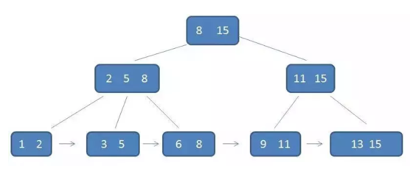


而**只有叶子节点才会有data，其他都是索引**。


**B+树的优势：**

1.单一节点存储更多的元素，使得查询的IO次数更少。

2.所有查询都要查找到叶子节点，查询性能稳定。

3.所有叶子节点形成有序链表，便于范围查询。


补充：这个文章讲的很好，通俗易懂。

https://blog.csdn.net/qq_26222859/article/details/80631121 （程序员小灰  图文）

### 35.B+树与B树的区别

- 有k个子结点的结点必然有k个关键码；
- 非叶结点仅具有索引作用，跟记录有关的信息均存放在叶结点中。
- 树的所有叶结点构成一个有序链表，可以按照关键码排序的次序遍历全部记录


### 36.B-树，B+树与B*树的优缺点比较

首先注意：B树就是B-树，"-"是个连字符号，不是减号。 

 B-树是一种**平衡**的多路**查找(又称排序)**树，在文件系统中有所应用。主要用作文件的索引。**其中的B就表示平衡(Balance) **

**B+树有一个最大的好处，方便扫库，B树必须用中序遍历的方法按序扫库**，而B+树直接从叶子结点挨个扫一遍就完了。 

**B+树支持range-query(区间查询)非常方便，而B树不支持**。这是数据库选用B+树的最主要原因。   

**B*树 是B+树的变体**，**在B+树的非根和非叶子结点再增加指向兄弟的指针**

参考：https://blog.csdn.net/bigtree_3721/article/details/73632405


### 37.B树的查询复杂度？

logB(N) 

参考：https://blog.csdn.net/houhouzhe/article/details/8556707


### 38.HashMap的插入流程是什么？并发情况是什么样的?

首先说，HashMap在高并发的时候会出现三个问题：

1）、同时put造成数据丢失

2）、扩容机制造成的数据丢失问题

3）、扩容机制造成死循环


这里其实只是第一个问题，就是同时put的时候会造成数据丢失。

在HashMap中会获取到数据存储位置后，调用addEntrty()方法，添加一个新的Entrty对象。
当多个线程需要put的数据hash值相同，需要放置在同一位置时，**并没有对put方法进行同步的实现**。所以，在调用Entrty方法的时候，**会造成只有最后执行的线程可以将其值放进map对象中**。

```java
public Object put(Object obj, Object obj1)      {          if(table == EMPTY_TABLE)              inflateTable(threshold);          if(obj == null)              return putForNullKey(obj1);          int i = hash(obj);          int j = indexFor(i, table.length);          for(Entry entry = table[j]; entry != null; entry = entry.next)          {              Object obj2;              if(entry.hash == i && ((obj2 = entry.key) == obj || obj.equals(obj2)))              {                  Object obj3 = entry.value;                  entry.value = obj1;                  entry.recordAccess(this);                  return obj3;              }          }      modCount++;      //在此处造成数据丢失    addEntry(i, obj, obj1, j);      return null;  }  
```

参考：https://blog.csdn.net/qq_37901489/article/details/88818356（三个问题及原因）


### 39.十万条 数据 List里面找 一个符合要求的 字段 怎么实现？

集合非有序的话, 效率怎么都不会高的 时间复杂度是O(n)。

**如果按照姓名排序,或者对姓名建立索引再二分查找 可以达到O(logn)**

### 40.我要遍历一个list，边遍历边删除怎么做

使用foreach会出现并发修改异常（java.util.ConcurrentModificationException）。

主要有以下3种方法：

1. **使用Iterator的remove()方法**
2. **使用for循环正序遍历**
3. **使用for循环倒序遍历**


第一种方法：使用Iterator的remove()方法，这一种不好记。

使用Iterator的remove()方法的实现方式如下所示：

```java
public static void main(String[] args) {    List<String> platformList = new ArrayList<>();    platformList.add("博客园");    platformList.add("CSDN");    platformList.add("掘金");    Iterator<String> iterator = platformList.iterator();    while (iterator.hasNext()) {        String platform = iterator.next();        if (platform.equals("博客园")) {            iterator.remove();        }    }    System.out.println(platformList);}
```

第三种方法：（这种方法好记，不用对索引做i--）

用for循环倒序：

```java
public static void main(String[] args) {    List<String> platformList = new ArrayList<>();    platformList.add("博客园");    platformList.add("CSDN");    platformList.add("掘金");    for (int i = platformList.size() - 1; i >= 0; i--) {        String item = platformList.get(i);        if (item.equals("掘金")) {            platformList.remove(i);        }    }    System.out.println(platformList);}
```


参考：https://www.cnblogs.com/zwwhnly/p/12530819.html


### 41.什么是红黑树 红黑树性质

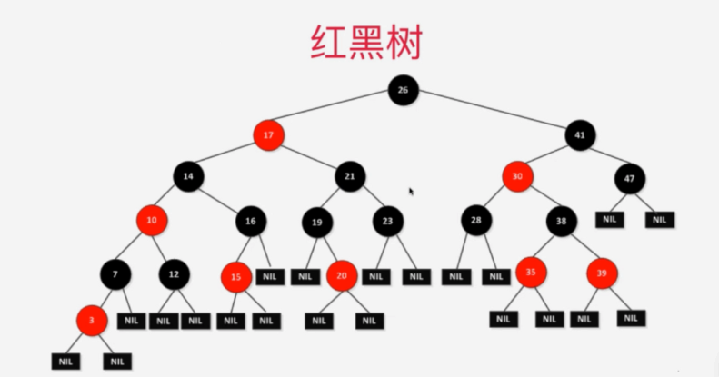

**红黑树定义和性质**

红黑树是一种含有红黑结点并能自平衡的二叉查找树。它必须满足下面性质：

- 性质1：每个节点要么是黑色，要么是红色。
- 性质2：根节点是黑色。
- 性质3：每个叶子节点（NIL）是黑色。
- 性质4：每个红色结点的两个子结点一定都是黑色。
- **性质5：任意一结点到每个叶子结点的路径都包含数量相同的黑结点。**


### 42.平衡树 平衡因子

参考第14个回答里面。


平衡二叉树：

它是一 棵空树或它的**左右两个子树的高度差的绝对值不超过1**，并且**左右两个子树都是一棵平衡二叉树**。这个方案很好的解决了二叉查找树退化成链表的问题，把插入，查找，删除的时间复杂度最好情况和最坏情况都维持在O(logN)。


**平衡二叉树的平衡因子：**

**左子树深度-右子树深度=平衡因子** 


### 43.汉诺塔问题 （递归问题）

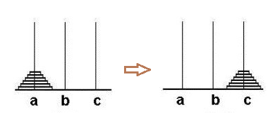


思路：

如果只有一个盘子，直接由a移动到c

如果是n个盘子：

1）、首先将前n-1个盘子移动到b上

2）、剩下的一个最大的移动到c上

3）、然后将剩下的n-1个移动从b移动到c上


```java
public static void move(int disk, char M, char N ){    System.out.println("第"+(++times)+"次移动, 盘子"+disk+ "  "+M+"------->"+N);}public static void hannoi(int n, char A, char B, char C){    if(n == 1){        move(n, A, C);    }else{        //移动上一关的步骤移动到B        hannoi(n - 1, A, C, B);        //把最大的盘子移动C塔        move(n, A, C);        //再把B上的上一关的盘子移动到C上就可以了        hannoi(n - 1, B, A, C);    }}
```


LeetCode项目中，有一个文件，Hanoi，就是代码。

汉诺塔小游戏：http://www.hannuota.cn/ （可以结合代码进行操作游戏）


### 44.二叉树，满二叉树，完全二叉树（虚谷伟业）

1 **二叉树**

[二叉树](https://baike.baidu.com/item/%E4%BA%8C%E5%8F%89%E6%A0%91)（百度百科）

(1)[完全二叉树](https://baike.baidu.com/item/%E5%AE%8C%E5%85%A8%E4%BA%8C%E5%8F%89%E6%A0%91)——若设二叉树的高度为h，除第 h 层外，其它各层 (1～h-1) 的结点数都达到最大个数，第h层有叶子结点，并且叶子结点都是从左到右依次排布，这就是完全二叉树。
    
(2)[满二叉树](https://baike.baidu.com/item/%E6%BB%A1%E4%BA%8C%E5%8F%89%E6%A0%91)——除了叶结点外每一个结点都有左右子叶且叶子结点都处在最底层的二叉树。
    
(3)[平衡二叉树](https://baike.baidu.com/item/%E5%B9%B3%E8%A1%A1%E4%BA%8C%E5%8F%89%E6%A0%91/10421057)——平衡二叉树又被称为AVL树（区别于AVL算法），它是一棵二叉排序树，且具有以下性质：它是一棵空树或它的左右两个子树的高度差的绝对值不超过1，并且左右两个子树都是一棵平衡二叉树。 

2 **完全二叉树**

[完全二叉树](https://baike.baidu.com/item/%E5%AE%8C%E5%85%A8%E4%BA%8C%E5%8F%89%E6%A0%91)（百度百科）
    
完全二叉树：叶节点只能出现在最下层和次下层，并且最下面一层的结点都集中在该层最左边的若干位置的二叉树。

3 **满二叉树**

[满二叉树](https://baike.baidu.com/item/%E6%BB%A1%E4%BA%8C%E5%8F%89%E6%A0%91)（百度百科，国内外的定义不同）

国内教程定义：一个二叉树，如果每一个层的结点数都达到最大值，则这个二叉树就是满二叉树。也就是说，如果一个二叉树的层数为K，且结点总数是(2^k) -1 ，则它就是满二叉树。

### 45.二叉树各种遍历时间复杂度

**非递归版：**

由于不管是先序遍历还是中序遍历以及后序遍历，我们都需要利用一个辅助栈来进行每个节点的存储打印，所以每个节点都要进栈和出栈，不过是根据那种遍历方式改变的是每个节点的进栈顺序，所以**时间复杂度为O(n)**，同样**空间复杂度也为O(n)**，n为结点数。

**层序遍历**是通过队列来进行每个节点的存储打印的，所以时间复杂度和空间复杂度也与前三种遍历方式一样。


递归版：

空间复杂度与系统堆栈有关，系统栈需要记住每个节点的值，所以空间复杂度为O(n)。时间复杂度应该为O(n)，根据公式T(n)=2T(n/2)+1=2(2T(n/4)+1)+1=2^logn+2^(logn-1)+...+2+1 ~= n，所以**时间复杂度为O(n)**。


### 46.二叉树前中后序遍历算法

LeetCode94：

题目

给定一个二叉树，返回它的中序 遍历。

示例:

输入: [1,null,2,3]

```java
   1    \     2    /   3
```

输出: [1,3,2]
进阶: 递归算法很简单，你可以通过迭代算法完成吗？


**递归写法：**

```java
//首先需要一个节点public class TreeNode {    int val;    TreeNode left;    TreeNode right;    TreeNode(int x) {        val = x;    }}//正式的代码  helper是一个辅助函数 这样的话，可以让代码更加清晰public List<Integer> inorderTraversal(TreeNode root) {    List<Integer> result = new ArrayList<>();    helper(root,result);    return result;}public void helper(TreeNode root,List<Integer> result){    if (root!= null){        if (root.left != null){            helper(root.left,result);        }        result.add(root.val);        if (root.right != null){            helper(root.right,result);        }    }}
```

复杂度分析

时间复杂度：O(n)O(n)。递归函数 T(n) = 2 \cdot T(n/2)+1T(n)=2⋅T(n/2)+1。
空间复杂度：最坏情况下需要空间O(n)O(n)，平均情况为O(\log n)O(logn)。


**非递归写法:**

```java
/**     * 前序遍历     * 非递归     */public void preOrder1(BinaryNode<AnyType> Node){    Stack<BinaryNode> stack = new Stack<>();    while(Node != null || !stack.Empty())    {        while(Node != null)        {            System.out.print(Node.element + "   ");            stack.push(Node);            Node = Node.left;        }        if(!stack.empty())        {            Node = stack.pop();            Node = Node.right;        }    }}/**     * 中序遍历     * 非递归     */public void midOrder1(BinaryNode<AnyType> Node){    Stack<BinaryNode> stack = new Stack<>();    while(Node != null || !stack.Empty())    {        while (Node != null)        {            stack.push(Node);            Node = Node.left;        }        if(!stack.empty())        {            Node = stack.pop();            System.out.print(Node.element + "   ");            Node = Node.right;        }    }}/**     * 后序遍历     * 非递归     */public void posOrder1(BinaryNode<AnyType> Node){    Stack<BinaryNode> stack1 = new Stack<>();    Stack<Integer> stack2 = new Stack<>();    int i = 1;    while(Node != null || !stack1.empty())    {        while (Node != null)        {            stack1.push(Node);            stack2.push(0);            Node = Node.left;        }        while(!stack1.empty() && stack2.peek() == i)        {            stack2.pop();            System.out.print(stack1.pop().element + "   ");        }        if(!stack1.empty())        {            stack2.pop();            stack2.push(1);            Node = stack1.peek();            Node = Node.right;        }    }}
```


参考：https://www.cnblogs.com/liuyang0/p/6271331.html  （比较全面）

https://blog.csdn.net/billy1900/article/details/86229656 （讲了为什么要用栈写）


### 47.可以把一个对象作为Map的key吗  

可以是可以，但是要重写HashCode 和equal 。阿里开发手册写的。不重写保证不了key的惟一性。


### 48.图是什么数据结构，怎么样存储？

图是一种多对多的存储结构。

图的存储：邻接矩阵，邻接表。


参考：https://www.cnblogs.com/moonlord/p/5938061.html


### 49.a 、b两个整数值，如何在不引入第三个变量的情况下，交换a 、b的值？

```java
a = a^b;b = b^a;a = a^b;
```


### 50.什么是二叉搜索树？图的搜索算法有哪些，底层都是怎么实现的？(深度优先和广度优先)

二叉树是一种树的特殊形式，它的每个节点最多两个孩子节点，分别为左孩子和右孩子。而二叉查找树在此基础上，还有一个特点，就是**每个节点比它左子树的节点值都要大，而比右子树的节点值都要小**。


图搜索算法：

深度优先算法，广度优先算法。

参考：https://blog.csdn.net/weixin_40953222/article/details/80544928


### 51.哈弗曼树 最短路径

### 52.双链表和单链表？有什么差别？单链表相对双链表的优势？

单链表只有一个指向下一结点的指针，也就是只能next。

双链表除了有一个指向下一结点的指针外，还有一个指向前一结点的指针，可以通过prev()快速找到前一结点，顾名思义，单链表只能单向读取。


工作中用单链表多，是因为：存储单链表省空间。存储双链表要更加空间。


### 53.两个已经按从小到大排好的数组（每个数组都是10个元素）并成一个数组（从小到大），设计一个算法，最多比较多少次，最少比较多少次，比较最多次数的条件是什么。

LeetCode88题。

```java
class Solution {    public void merge(int[] nums1, int m, int[] nums2, int n) {        System.arraycopy(nums2, 0, nums1, m, n);        Arrays.sort(nums1);   }}
```

System.arrayCopy(Object srcArray,int srcPos,Object destArray ,int destPos,int length)


关于**System.arraycopy()**参数说明：  

Object srcArray 原数组（要拷贝的数组）
int srcPos 要复制的原数组的起始位置（数组从0位置开始）
Object destArray 目标数组
int destPos 目标数组的起始位置
int length 原数组的长度


### ***54.各种排序算法：

手写快速排序，堆排序，选择排序，冒泡排序 ，快速排序什么情况下性能最好，什么情况下，性能最差？堆排序在什么情况下性能最好，什么情况下性能最糟糕？

```
。。。
```

### 常用排序

#### 冒泡排序

```java
public class BubbleSort {    public static void main(String[] args) {        int[] arr = {5, 1, 2, 9, 0, 8, 7, 6, 4, 3};        sort(arr);        System.out.println(Arrays.toString(arr));    }    public static void sort(int[] arr) {        if (arr == null || arr.length <= 1) return ;        // 冒泡的次数        for (int i = 0; i < arr.length - 1; i++) {            boolean isSorted = true; // 默认数组是有序的            for (int j = 0; j < arr.length - 1 - i; j++) {                if(arr[j] > arr[j+1]) {                    // 交换元素                    int temp = arr[j];                    arr[j] = arr[j+1];                    arr[j+1] = temp;                    isSorted = false;                }                System.out.println(Arrays.toString(arr));            }            if (isSorted) return ;        }    }}
```

#### 二分排序

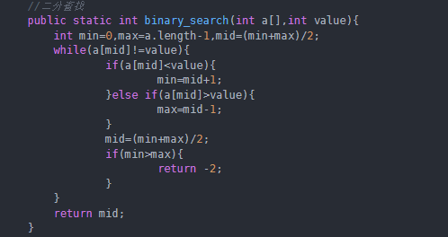


#### 快速排序

```java
public class QuickSort {    public static void sort(int[] arr) {        if (arr == null || arr.length <= 1) return ;        quickSort(arr, 0, arr.length - 1);    }    private static void quickSort(int[] arr, int low, int high) {        if (low >= high) return ;        // 分区操作        int index = partition(arr, low, high);        // 对左边进行快速排序        quickSort(arr, low, index - 1);        // 对右边进行快速排序        quickSort(arr, index + 1, high);    }    private static int partition(int[] arr, int low, int high) {        int pivot = arr[low];        int left = low;        int right = high;        while (left < right) {            while (left < right && arr[right] >= pivot) {                right--;            }            arr[left] = arr[right];            while (left < right && arr[left] <= pivot) {                left++;            }            arr[right] = arr[left];        }        arr[left] = pivot;        return left;    }    public static void main(String[] args) {        int[] arr = {5, 1, 2, 9, 0, 8, 7, 6, 4, 3};        System.out.println("------------------------------");        sort(arr);        // System.out.println(Arrays.toString(arr));    }}
```

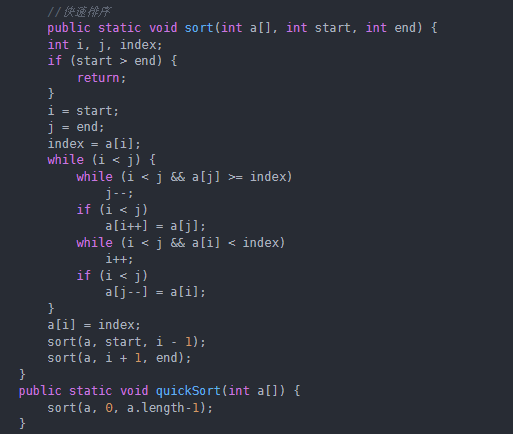

**

### ***存一个数据进去的过程是怎样的？(被四家公司问到过)


### 55.Arrays.sort的实现算法

**答：**Java1.8的快排是一种双轴快排，顾名思义：双轴快排是基于两个轴来进行比较，跟普通的选择一个点来作为轴点的快排是有很大的区别的，双轴排序利用了区间相邻的特性，对原本的快排进行了效率上的提高，很大程度上是利用了数学的一些特性。

算法步骤
1.对于很小的数组（长度小于27），会使用插入排序。
2.选择两个点P1,P2作为轴心，比如我们可以使用第一个元素和最后一个元素。
3.P1必须比P2要小，否则将这两个元素交换，现在将整个数组分为四部分：
（1）第一部分：比P1小的元素。
（2）第二部分：比P1大但是比P2小的元素。
（3）第三部分：比P2大的元素。
（4）第四部分：尚未比较的部分。
**在开始比较前，除了轴点，其余元素几乎都在第四部分，直到比较完之后第四部分没有元素。**
4.从第四部分选出一个元素a[K]，与两个轴心比较，然后放到第一二三部分中的一个。
5.移动L，K，G指向（？为什么？）。
6.重复 4 5 步，直到第四部分没有元素。
7.将P1与第一部分的最后一个元素交换。将P2与第三部分的第一个元素交换（？为什么？）。
8.递归的将第一二三部分排序。


### 56.循环list 删除里面元素

[Foreach删除元素（ArrayList）报错分析](https://www.cnblogs.com/qxynotebook/p/11253257.html)

普通循环：利用index实现

**增强型循环**：通过迭代器实现 

示例代码：

```java
public class ArrayListTest {     public static void main(String[] args) {        normalFor(getList());   //普通循环        iterator(getList());      //增强循环-迭代器        forEach(getList());     //增强循环-foreach方式    }     //普通循环    private static void normalFor(List<String> list) {        for (int i = 0 ; i < list.size() ; i++){            if ("b".equalsIgnoreCase(list.get(i)) || "c".equalsIgnoreCase(list.get(i))){                list.remove(i);            }        }        System.out.println("normalFor:"+JSONObject.toJSONString(list));    } 　　//增强循环-迭代器　　private static void iterator(List<String> list) {        Iterator iterator = list.iterator();        while (iterator.hasNext()){            String str = (String) iterator.next();            if ("b".equalsIgnoreCase(str) || "c".equalsIgnoreCase(str)){                iterator.remove();            }        }        System.out.println("iterator:"+JSONObject.toJSONString(list));    }　　 //增强循环-foreach方式    private static void forEach(List<String> list) {        for (String str : list){            if ("b".equalsIgnoreCase(str) || "c".equalsIgnoreCase(str)){                list.remove(str);            }        }        System.out.println("forEach:"+JSONObject.toJSONString(list));    }     private static List<String> getList(){        List<String> list = new ArrayList<>();        list.add("a");        list.add("b");        list.add("c");        list.add("d");        list.add("e");        return list;    }}
```

运行结果：

```java
normalFor:["a","c","d","e"]iterator:["a","d","e"]Exception in thread "main" java.util.ConcurrentModificationException　　at java.util.ArrayList$Itr.checkForComodification(ArrayList.java:909)　　at java.util.ArrayList$Itr.next(ArrayList.java:859)　　at com.qxy.collection.ArrayListTest.forEach(ArrayListTest.java:47)　　at com.qxy.collection.ArrayListTest.main(ArrayListTest.java:21) Process finished with exit code 1
```

从上边可以看出

| 类型             | 输出结果           |
| ---------------- | ------------------ |
| 普通循环         | 正常输出，结果错误 |
| 增强循环-迭代器  | 正常输出，结果正确 |
| 增强循环-foreach | 报异常             |

**普通循环**

普通循环，底层是数组，在remove操作时，被删除元素的后边所有的元素，会往前挪挪一位。咱们还是看图，比较直观

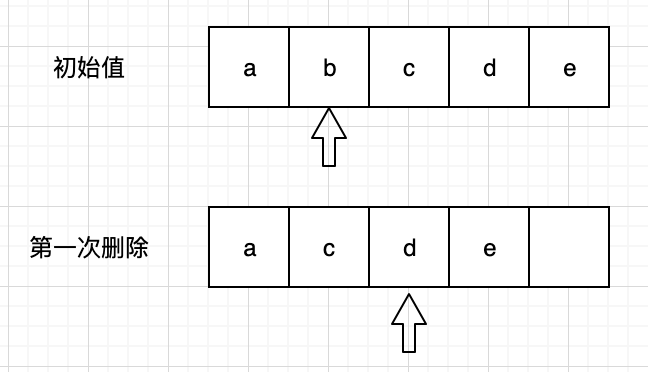

 

当第一次删除时，此时的 i = 1，b正常删除，c、d、e此时都往前挪了一位，然后执行了 i+1 变成了2，也就是d 的位置，一直往后都没匹配到c，所以导致c为正常删除。

 

**增强循环-迭代器**

在分析之前，我们先来看看反编译之后的代代码

```java
public class ArrayListTest {    ...    private static void iterator(List<String> list) {        Iterator iterator = list.iterator();        while(true) {            String str;            do {                if (!iterator.hasNext()) {                    System.out.println("iterator:" + JSONObject.toJSONString(list));                    return;                }                str = (String)iterator.next();            } while(!"b".equalsIgnoreCase(str) && !"c".equalsIgnoreCase(str));             iterator.remove();//不同的地方：调用迭代器的remove方法        }    }    private static void forEach(List<String> list) {        Iterator var1 = list.iterator();        while(true) {            String str;            do {                if (!var1.hasNext()) {                    System.out.println("forEach:" + JSONObject.toJSONString(list));                    return;                }                str = (String)var1.next();            } while(!"b".equalsIgnoreCase(str) && !"c".equalsIgnoreCase(str));             list.remove(str);//不同的地方：调用list的remove方法        }    } 　　...} 
```

 从上边的代码来看，迭代器 和 foreach 的方法很类似，唯一的区别就是 remove() 方法

**迭代器调用的是  Iterator 类的 remove 方法**

**foreach调用的是 ArrayList类 的remove方法**

那么我们去看下 他们各自 remove方法到底是怎么实现的

迭代器方式，那么需要先看 ArrayList.class

```java
public Iterator<E> iterator() {    return new Itr();} /** * An optimized version of AbstractList.Itr */private class Itr implements Iterator<E> {    int cursor;       // index of next element to return    int lastRet = -1; // index of last element returned; -1 if no such    int expectedModCount = modCount;　　//这个属性比较重要     Itr() {}    ...    public void remove() {        if (lastRet < 0)            throw new IllegalStateException();        checkForComodification();　　//第一步        try {            ArrayList.this.remove(lastRet);　　//第二步：调用list的remove方法            cursor = lastRet;            lastRet = -1;            expectedModCount = modCount;　　　　//第三步：modCount是remove方法去维护更新，由于第一步中校验 modCount 和 expectedModCount 是否相当等        } catch (IndexOutOfBoundsException ex) {            throw new ConcurrentModificationException();        }    }    ...    final void checkForComodification() {        if (modCount != expectedModCount)            throw new ConcurrentModificationException();    }}
```

可以看到，list.iterator() 返回的是一个 Itr对象（ArrayList私有的实例内部类），执行 iterator.remove() 方法时，

第一步：先调用 checkForComodification() 方法，此方法作用：modCount 和 expectedModCount 是否相当

第二步：也就是foreach方式中调用的remove方法，在ArrayList内部的remove方法，会更新modCount属性

第三步：将更新后的modCount重新赋值给expectedModCount变量，看这里！！！看这里！！！相比于有一个更新操作，才通过了上边第一步的校验！！！

到此，你可能还想看看，ArrayList类中的remove方法

```java
public E remove(int index) {    rangeCheck(index);     modCount++;    E oldValue = elementData(index);     int numMoved = size - index - 1;    if (numMoved > 0)        System.arraycopy(elementData, index+1, elementData, index,                         numMoved);    elementData[--size] = null; // clear to let GC do its work     return oldValue;}
```

看到此方法中，有一个modCount++的操作，也就是说，modCount会一直更新变化。

总结：jdk源码离我们那么近，但是，总是这样完美的擦肩而过，以后要多啃啃，不要错过！！！

 

Read the fucking manual and source code


在弄建投项目的时候：用到

```java
for (int i = 0; i < tenantProductSuitInfos.size(); i++) {			if (     tenantProductSuitInfoDTO.getTenantAdminName() != null && 			  !"".equals(tenantProductSuitInfoDTO.getTenantAdminName())            ) {				if (tenantProductSuitInfos.get(i).getTenantAdminName() != null) {					if (!tenantProductSuitInfos.get(i).getTenantAdminName()                        .contains(tenantProductSuitInfoDTO.getTenantAdminName())) {                         //包含的话说 会包含空字符串 去掉						tenantProductSuitInfos.remove(i);						i--; //这里注意 因为删除以后 后面的i 会往前顶 					}				}else {					tenantProductSuitInfos.remove(i);					i--; //这里注意 因为删除以后 后面的i 会往前顶 				}			}		}
```

参考：https://www.cnblogs.com/qxynotebook/p/11253257.html


### 57.还没有整理的

#### 用什么方式表示图？遍历图？

#### 介绍一下常用的排序算法？

#### 递归和迭代的区别，有没有用过？

#### 查找一个字符串中出现次数最多的字符（我先遍历字符串，把字符和对应的次数作为键值对存入Map，都存完了以后再遍历这个Map）

#### 10个元素，用二分查找的方法找出指定的元素，同时打印出比较的次数？

#### Iterator迭代器遍历一个names集合，同时自定义一个异常，如果name等于‘to’，就抛出这个自定义异常？

#### 手写一个栈，以及相应的方法（栈顶元素、底层数组、元素数量、无参构造方法、有参构造、push入栈、pop出栈、grow扩容）？

#### 数组与链表的区别？

#### 给一个天平，26个砝码，其中25个重量相同，只有一个超重，尝试描述一个时间复杂度最低的算法，找出超重砝码？

#### 给定字符串，去除字母并去重，输出结果。如输入"ABCD123E4F4G"，输入"[123, 4]"？

#### 树的中序遍历？

#### 给定一组数据(整数或浮点数)，求其连续数据之和最大的子数组，输出其和，及子数组的各数？


#### 思维·题·：

有三个篮子，1个篮子有苹果，1个篮子有香蕉，1个篮子有苹果和香蕉。

条件1：每个篮子上有且只有一个标签

条件2: 3个标签都是错误

问：只有一次机会，从三个篮子里拿出一个水果，找出正确的标签，可能吗？如果可能从哪个篮子拿，能够推出正确的标签

 

（我一开始就上去分类讨论，结果把自己给绕晕了，面试官说我太紧张了，其实我不紧张也想不出来）

正确的做法是找到那个标签上是苹果和香蕉的篮子，从篮子里面拿一个水果，如果是苹果，则该篮子是苹果，标香蕉的篮子是苹果和香蕉，标苹果的篮子是香蕉；如果是香蕉，则该篮子是香蕉，标苹果的那个篮子是苹果和香蕉，标香蕉的篮子是苹果


#### 怎样删除容器中符合条件的元素(没有写具体是哪个容器)？

#### 有一个天平，26个砝码，1个超重，25个质量相同，要找出超重的砝码至少称几次？

#### 说一下各个集合的底层分别都是由什么数据结构实现的？

#### 详细介绍一下你在哪些地方用到了数据结构，具体是怎么用的？（然后被狂批了一顿，说我想得太复杂了）？

#### list有100个元素，取前十个怎么取（sublist用的index）？

#### 在Java中，队列Queue是线程安全的吗？如何保证Queue线程安全？你知道几种队列？

#### 聚类算法了解吗？

#### 集合框架说一下，其中的Queue是接口吗？还是实现类？Queue的实现类记得吗？

#### 手写代码题（伪代码不得分）（10评委对100张照片打分，得到二维数组[100][10]，去掉一个最高和一个最低，剩下的相加除以8得到平均分，求每张照片的平均分，第二问求最公平的评委：平均值与每张照片打分的差的绝对值）

#### Java的栈和堆，分别用的什么数据结构;为什么要区分栈和堆存储。


#### 算法：

​	测零件强度，如果零件从1楼掉下碎了，强度就为1，如果从1楼掉下没碎，从二楼掉下碎了，强度就为2，以此类推，假设1<=强度<=100，问：

​	1）。如果零件有无数个，设计一个算法测零件强度，要求测试次数越少越好？

​	2）。如果零件只有一个，设计一个算法测零件强度，要求测试次数越少越好？

​	3）。如果零件有两个，设计一个算法测强度，要求测试次数越少越好？

大致记得这么多。。。


### List去重

参考：https://blog.csdn.net/yihuaiyan/article/details/94719541


## 加密算法

1.哪个类实现了md5算法，MD5算法加密过后的密文长度是几位？


2.针对项目技术问到了MD5和JWT的一些细节？MD5加随机盐值那如何两次登录验证密码是否一样？MD5的作用


3.可以说一下报装系统中开票，支付中用到的公钥私钥那种加密