# ComputerSkills


> 这里的有一些插件相关的文章由于年代很久远啦，我自己忘记了文章原来的出处，望大家见谅，如有侵权联系删除。
>
> 其他的大多数是自己碰到的小问题，顺便记录了下来。


## 目录

[TOC]


# Computer

### 固态硬盘使用篇   ：

#### 使用与保养

对于固态硬盘的使用和保养，最重要的一条就是：在[机械硬盘](https://baike.baidu.com/item/机械硬盘)时代养成的“良好习惯”，未必适合固态硬盘。

#### **一、不要使用碎片整理**

碎片整理是对付机械硬盘变慢的一个好方法，但对于固态硬盘来说这完全就是一种“折磨”。

消费级固态硬盘的擦写次数是有限制，碎片整理会大大减少固态硬盘的使用寿命。其实，固态硬盘的垃圾回收机制就已经是一种很好的“磁盘整理”，再多的整理完全没必要。Windows的“磁盘整理”功能是机械硬盘时代的产物，并不适用于SSD。

除此之外，使用固态硬盘最好禁用[win7](https://baike.baidu.com/item/win7)的预读([Superfetch](https://baike.baidu.com/item/Superfetch))和快速搜索(Windows Search)功能。这两个功能的实用意义不大，而禁用可以降低硬盘读写频率。

#### 二、**小分区 少分区**

还是由于固态硬盘的“垃圾回收机制”。在固态硬盘上彻底删除文件，是将无效数据所在的整个区域摧毁，过程是这样的：先把区域内有效数据集中起来，转移到空闲的位置，然后把“问题区域”整个清除。

这一机制意味着，分区时不要把SSD的容量都分满。例如一块128G的固态硬盘，厂商一般会标称120G，预留了一部分空间。但如果在分区的时候只分100G，留出更多空间，固态硬盘的性能表现会更好。这些保留空间会被自动用于固态硬盘内部的优化操作，如磨损平衡、垃圾回收和坏块映射。这种做法被称之为“小分区”。

“少分区”则是另外一种概念，关系到“4k对齐”对固态硬盘的影响。一方面主流SSD容量都不是很大，分区越多意味着浪费的空间越多，另一方面分区太多容易导致分区错位，在分区边界的磁盘区域性能可能受到影响。最简单地保持“4k对齐”的方法就是用Win7自带的分区工具进行分区，这样能保证分出来的区域都是4K对齐的。

#### **三、保留足够剩余空间**

固态硬盘存储越多性能越慢。**而如果某个分区长期处于使用量超过90%的状态**，固态硬盘崩溃的可能性将大大增加。

所以及时清理无用的文件，设置合适的虚拟内存大小，将电影音乐等大文件存放到机械硬盘非常重要，必须让固态硬盘分区保留足够的剩余空间。

#### **四、及时刷新固件**

“固件”好比主板上的[BIOS](https://baike.baidu.com/item/BIOS)，控制固态硬盘一切内部操作，不仅直接影响固态硬盘的性能、稳定性，也会影响到寿命。优秀的固件包含先进的算法能减少固态硬盘不必要的写入，从而减少闪存芯片的磨损，维持性能的同时也延长了固态硬盘的寿命。因此及时更新官方发布的最新固件显得十分重要。不仅能提升性能和稳定性，还可以修复之前出现的bug。

**五、学会使用恢复指令**

固态硬盘的[Trim](https://baike.baidu.com/item/Trim)重置指令可以把性能完全恢复到出厂[状态](https://baike.baidu.com/item/状态/33204)。但不建议过多使用，因为对固态硬盘来说，每做一次Trim重置就相当于完成了一次完整的擦写操作，对磁盘寿命会有影响。 [7] 

随着互联网的飞速发展，人们对数据信息的存储需求也在不断提升，现在多家存储厂商推出了自己的便携式固态硬盘，更有支持Type-C接口的移动固态硬盘和支持指纹识别的固态硬盘推出。


### 360系统备份  开机长按上下键

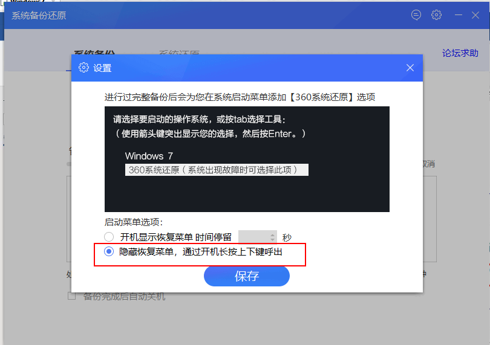


系统备份以后，E盘是看不到的


### 远程桌面:

win+r  mstsc


### 任务栏Idea图标变白解决方法

**方案1**：同时按Windows键+R键打开运行对话框，输入ie4uinit.exe -show然后回车即可修复。

**方案2**：打开计算机（Win7），此电脑（Win10）或任意文件夹，然后在地址栏输入cmd.exe /c ie4uinit.exe -show然后回车即可。

**方案3**：同时按Windows键+R键打开运行对话框，输入%APPDATA%\Microsoft\Internet Explorer\Quick Launch\User Pinned\TaskBar后回车键

　　　    在弹出的TaskBar文件夹中找到IDEA图标，右击  选中“从任务栏取消固定”，观察任务栏是否有变化，变正常直接锁定到任务栏。多试几次就好了。

 

我把前两个方案试了很多次不管用，但是有的小伙伴反应好使

我后来用方案3弄好了，希望对大家有帮助  


### 外接显示器

不想把声音传过去，声音留在本地主机上

参考：https://zhidao.baidu.com/question/366756219.html

控制面板-->硬件和声音-->声音-->管理音频设备-->播放，选择扬声器


# Plugins

## Chrome 

参考：http://www.cnplugins.com/zhuanti/intruduce-it-need-plugins.html

### 1.[Click&Clean](http://www.cnplugins.com/office/clickclean/)

Click&Clean插件可以监控浏览器的一些状态，很方便的清理缓存，历史记录等等.

EditThisCookie是一款可以管理Chrome浏览器中cookies的插件，用户可以利用EditThisCookie添加，删除，编辑，搜索，锁定和屏蔽cookies。EditThisCookie插件是一款为谷歌浏览器定制的非常强大的一款cookies管理[chrome插件](http://www.cnplugins.com/)。


### 3.[Postman-网页测试HTTP请求模式器](http://www.cnplugins.com/devtool/postman/)

postman插件是一款chrome插件，是谷歌浏览器的网页调试插件，这款插件可以利用Chrome插件的形式把各种模拟用户HTTP请求的数据发送到服务器，以便开发人员能够及时地作出正确的响应，或者是对产品发布之前的错误信息提前处理，进而保证产品上线之后的稳定性和安全性。[Postman](http://www.cnplugins.com/devtool/postman/)是一种网页调试与发送网页http请求的[chrome插件](http://www.cnplugins.com/)。我们可以用来很方便的模拟get或者post或者其他方式的请求来调试接口。

ZenHub是第一个也是唯一的项目管理套件的作品本身内GitHub上;提高您的工作流程，专为初创内置功能，快速移动的工程团队，以及开源社区。该产品是一款浏览器扩展，注入先进的功能，包括实时拖动和拖放发行任务板，通过 1按钮同行的反馈，并直接上传任何文件类型到GitHub的接口支持。

[Google学术搜索](http://www.cnplugins.com/google/google-scholar-button/)是谷歌公司提供的一项学术搜索的服务，用户可以使用[谷歌学术搜索](http://www.cnplugins.com/google/google-scholar-button/)的功能搜索到一些非常有用的论文，无论你是正在为毕业设计苦恼的大学生，需要开题的研究生或博士生还是要写论文时苦于查找文献的硕博生，用好这个工具对我们撰写毕业论文和学术论文非常有帮助。


### 6.[Power Zoom：鼠标悬停放大图片插件](http://www.cnplugins.com/photos/power-zoom/)

Power Zoom是一款可以把[chrome浏览器](http://chromecj.com/category/chrome/)中的任意照片，只需要使用鼠标悬停在图片上方就可以进行放大的谷歌浏。用户在使用chrome浏览网页的时候，如果遇到网页上的图片比较小的时候，就希望有个放大镜，特别是一些购物网站，用户有时候更加需要看清楚图片上的内容，如果网页的开发者提供了放大的功能还好，淘宝上部分图片就自带这个图片放大功能，但是也不是全部。具有同样功能的插件还有

### 7.[JSON-handle](http://www.cnplugins.com/devtool/json-handle/)

对JSON格式的内容进行浏览和编辑，以树形图样式展现JSON文档，并可实时编辑。很方便的解析json。
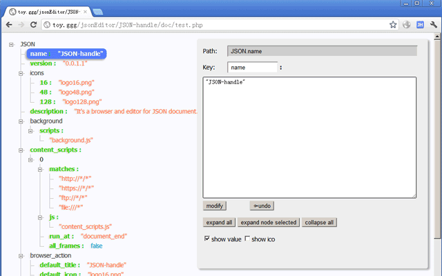

### 8. [Octotree ](http://www.cnplugins.com/devtool/octotree/)

个人认为这款插件是每个程序员必备的插件，在[github](http://www.cnplugins.com/tags/Github/)项目页左侧展示该项目的树结构。
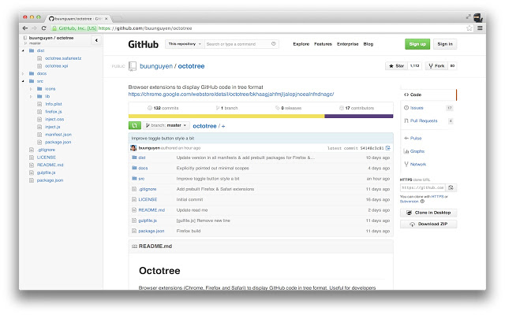

### 9.[smartUp Gestures-手势扩展插件](http://xn--smartup gestures--j714an54csg2c0w2avua85z/)

一个更好的手势类扩展。功能包括：鼠标手势，简易拖曳，超级拖曳，摇杆手势和滚轮手势。
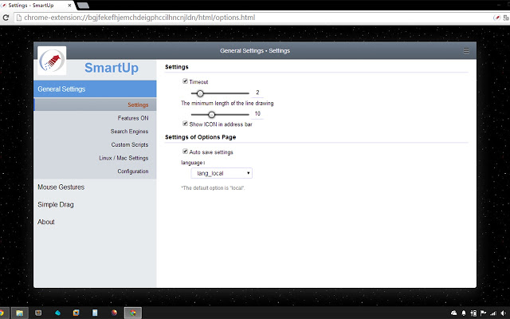

### 10.[Tampermonkey](http://www.cnplugins.com/office/tampermonkey/)([油猴](http://www.cnplugins.com/zhuanti/chrome-powerful-tampermonke))

Tampermonkey是第一个可以用来让 Chrome 支持更多 UserScript 的 [Chrome 插件](http://www.cnplugins.com/)扩展。一直号有“Chrome第二应用商店的”它可以加入更多的 Chrome 本身不支持的用户脚本功能它适用于基于 Blink 和 WebKit 的浏览器,像是 Chrome, Opera Next, Safari 和 Firefox 。

### 11.[Window Resizer](http://www.cnplugins.com/devtool/window-resizer/)  

可以快速调整浏览器窗口的尺寸，用于观察网站页面宽度 

### 12.[Holmes](http://www.cnplugins.com/search/holmes/)

一款更加方便的书签管理器插件。

### 13.[划词翻译](http://www.cnplugins.com/fuzhu/huacifanyi/)

支持谷歌、百度、有道、必应四大翻译和朗读引擎，可以方便的查看、复制和朗读不同引擎的翻译结果。 


ctrl + home / end 可以跳转到 控制台最前面和最后面

只有Home/End  跳转到一行的首尾

## 开发插件

大家好，我是 Guide 哥，一个三观比主角还正的技术人。

简单整理了一下自己日常经常使用的工具网站，分享给小伙伴们！

### 1.奶牛快传:用户体验更好的网盘工具。

https://cowtransfer.com/

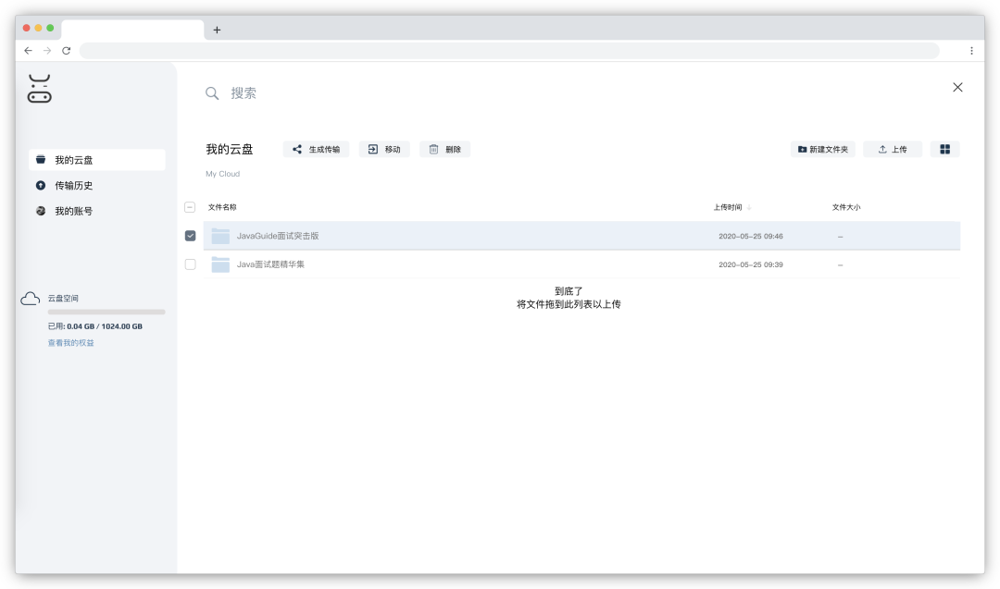

最近开始使用的一款网盘工具，和百度网盘类似，不过没有下载速度的限制，并且可以支持自定义分享文件的下载次数（需要开会员）。

还有一点让我觉得比较舒服的是，你给别人分享文件，别人无需登录即可直接下载。

就传输速度和体验感来说，奶牛快传真的没话说。缺点也比较明显，免费用户的容量容量只有 5 g并且单次传输上限是 2g，所以，可能需要付费才能更好的使用。

### 2.docsmall:压缩工具

https://docsmall.com/


我经常用来压缩图片、GIF、PDF，你们平时看到我放的 Gif 图片都是在这里压缩过一波的。

并且，还支持PDF合并和分割。不得不说这个网站做的简直不要太美观，体验感和好感 Max!!!

### 3.创客贴:平面设计作图神器

https://www.chuangkit.com/


我的公众号首页封面图就是通过这个网站制作的。通过这个网站你可以制作好看的海报、简历、新媒体文章的首页图等等，这个网站甚至还有很多免费且好看的 PPT插件，简直是神器。

### 4.Dimmy.club:手机电脑等设备的展示模型

https://dimmy.club/


可以让你的图片放在电脑、手机、ipad等模型中展示，大大提升了图片的档次。

### 5.BrowserFrame:浏览器展示模型

https://browserframe.com/


正如你们所看到的，本文所有的图片都是他通过这个网站在线转换的，相比直接展示要更加美观一些，节省了很多自己手动调整图片的时间。

### 6.Flourish:数据可视化

https://flourish.studio/

通过这个网站，你可以快速地把表格数据转换为各种各样好看的图表，并且还支持动态可视化。


### 7.PDF派:20个免费好用的PDF在线工具

https://www.pdfpai.com/

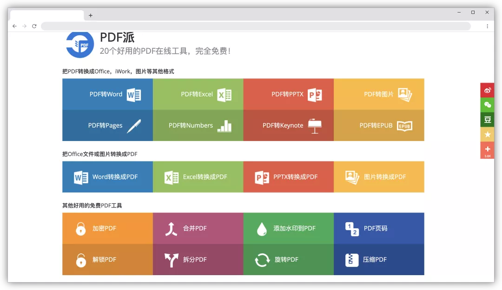

PDF在线工具挺多的，PDF派是我最喜欢的一个，功能强大稳定。

### 8.小码短连接:简单易用的渠道短链接统计工具

https://xiaomark.com/


非常好用的长链接转短链接工具，能够让链接看起来更简洁。并且，转换为短链接之后，还能在后台监测访问数据，如访问次数、访问人数。


### 9.Kapwing:一个用于创建图像，视频和GIF的协作平台

https://www.kapwing.com/

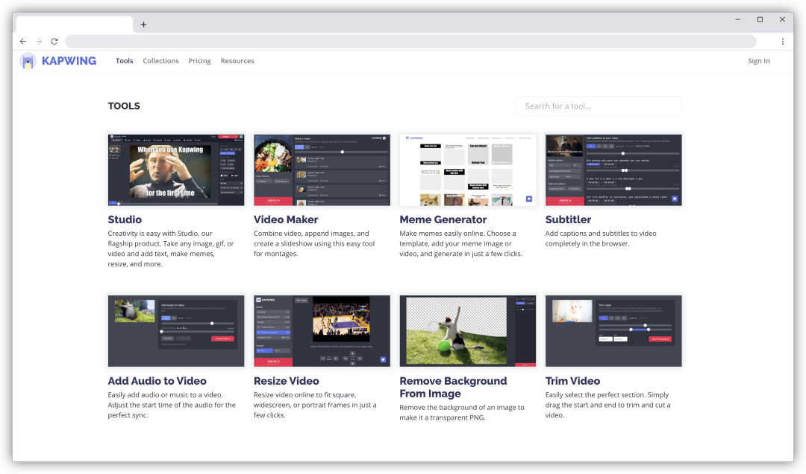

**神器网站！强烈推荐！**

Kapwing 是一个在线视频编辑网站，集成了很多在线小工具，当有视频编辑的需求手头却没有什么趁手的小工具的话，不妨用来应应急。网站并没有复杂的操作界面，已经把常见的需求做成了单独的小功能，即使没有视频编辑经验的小白，也能三秒上手。

### 10.removebg:抠图神器

https://www.remove.bg/zh


抠图神器，绝对的神器！

### 11.今日热榜:你关心的热点

https://tophub.today/

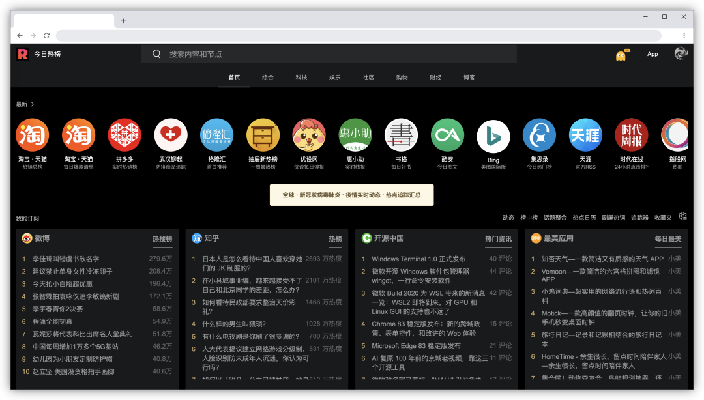

今日热榜提供各站热榜聚合：微信、今日头条、百度、知乎、V2EX、微博、贴吧、豆瓣、天涯、虎扑、Github、抖音...。追踪全网热点、简单高效阅读。

### 12.Apkpure:安卓安装包下载

https://apkpure.com/cn/


因为我的手机无法正常访问 Google Store，所以，很多安装包我都是通过这个网站来下载的。

### 13.crx4chrome:下载Chrome浏览器插件

https://www.crx4chrome.com/

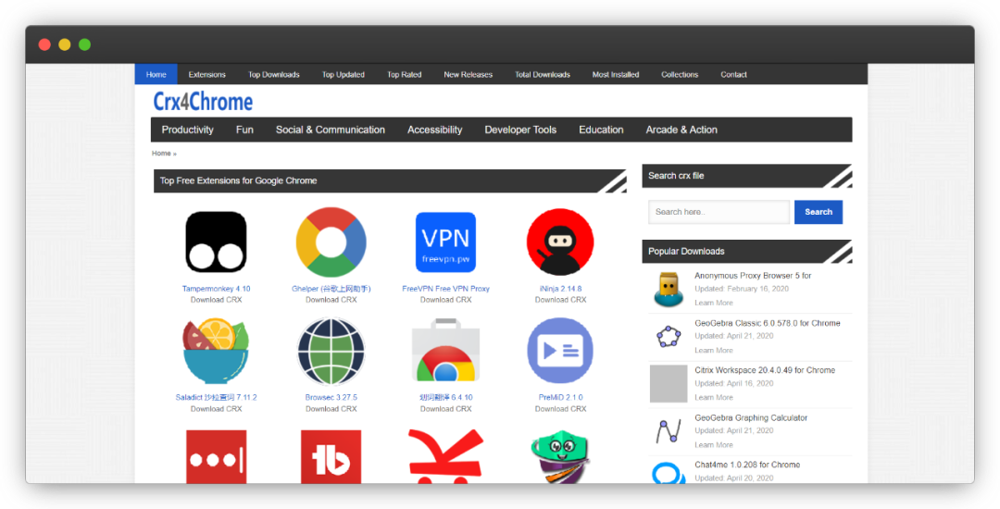

如果你无法访问谷歌商店的话，可以通过这个网站来下载你想要的Chrome浏览器插件，毕竟没有插件的 Chrome浏览器 ，失去了很大一项乐趣。

### 14.ProcessOn:在线绘图

https://www.processon.com/

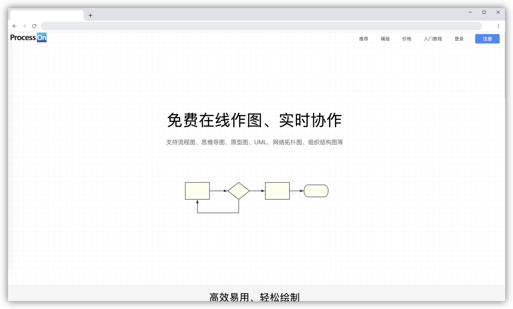

画图工具，支持流程图、思维导图、原型图、UML、网络拓扑图、组织结构图等。

### 15.draw.io:又一个画图工具

https://www.draw.io/

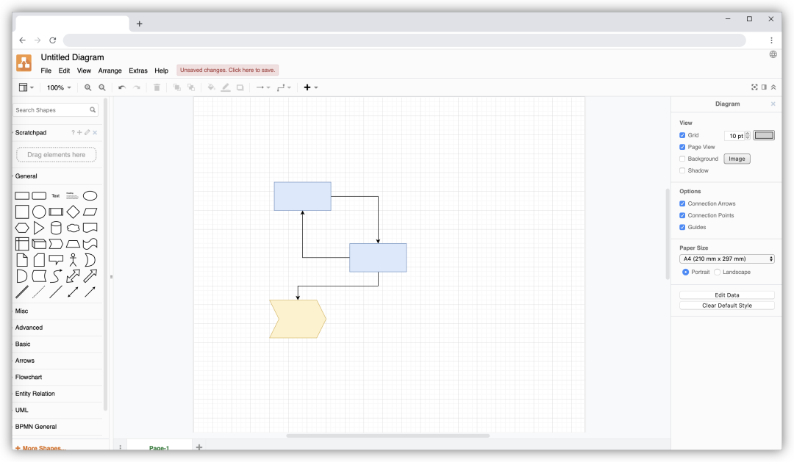

相比于 ProcessOn 我更喜欢这块画图工具，不光有在线版还有电脑版，并且可以将文件保存到多个位置。

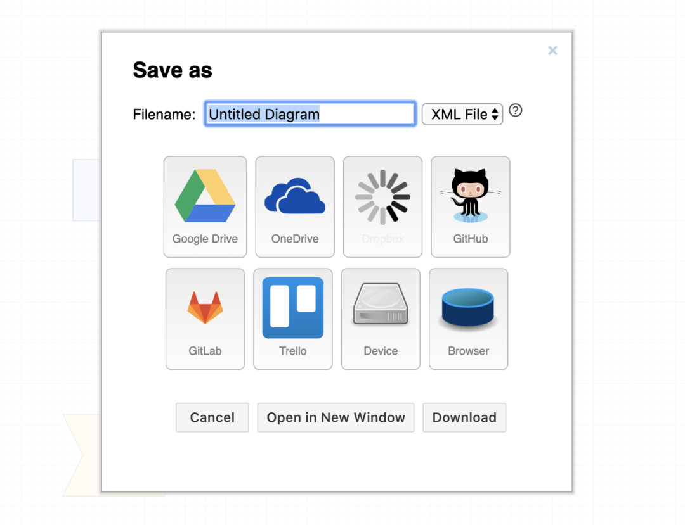

### 16.其他

1. **Carbon[1]** :生成漂亮的代码图片。
2. **图壳[2]** ：免费好用稳定的图床网站。
3. **龙轩导航[3]** :究极好用的导航网站（我平时用来追剧~~~）。
4. **excalidraw[4]** ：简洁大方的在线画图工具。
5. **mdnice[5]** :支持自定义样式的 Markdown 编辑器。支持微信公众号、知乎和稀土掘金的排版。
6. ......

今天就分享到这里吧！后面再想起来其他的在线工具类网站的话，我就直接补充在评论区了，也欢迎大家补充自己觉得不错的在线工具类网站，不论是技术类还是非技术类都可以！

2020-05-25 23：57

### 参考资料

[1]Carbon: *https://carbon.now.sh/*[2]图壳: *https://imgkr.com/*[4]excalidraw: *https://excalidraw.com/*


# MateBook X Pro  触摸板

1.单击：模拟鼠标左键单击。

2.连续单击两次：模拟鼠标左键双击。

3.两个手指同时单击：模拟鼠标右键单击。

4.三个手指同时单击：打开windows的搜索。

5.三个手指一起往上移动或者一起往左边或者右边移动：打开任务切换界面，按个动作打开的样式不同。

6.三个手指一起往下移动：显示桌面。

7.连续单击两次之后手指不离开触摸板：模拟鼠标拖拉。

8.两个手指在触摸板移动：模拟鼠标滚轮。

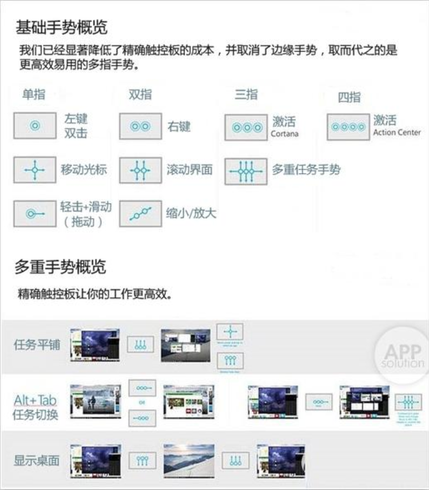


## 浏览器对post请求支持不行，所以要用postman


## stream wallpaper 存储位置

D:\Software\Steam\steamapps\workshop\content\431960


## XMind打开*.mmap格式文件

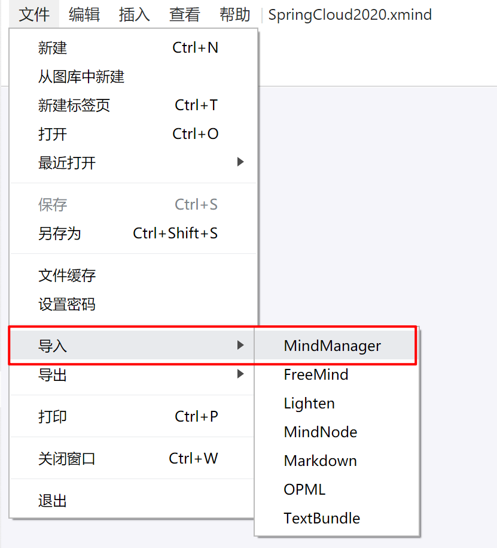


## gitee换手机号码 

需要修改 电脑git配置

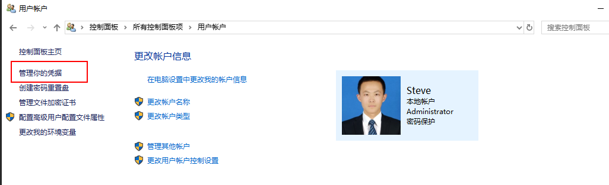


# software

## Navicat

### 15版本 连接不上 Oracle

ORA-28547: connection to server failed, probable Oracle Net admin error 

参考：https://www.cnblogs.com/taojietx/p/6627934.html


### 连接的数据库连接可以保存下来


### 15 激活

参考 https://www.cnblogs.com/poloyy/p/12231357.html


Navicat 可以说是众多程序猿小伙伴的忠爱了，因为界面简洁且操作简单，让我们爱不释手；最近Navicat Premium 15发布了， 让我们来看看如何安装永久激活版哦（简称白嫖版）

 

**2**|**0****Navicat Premium 15安装**

安装软件包和注册机放这自取了哈

**如果15装不了，就装里面的12，步骤都是一样的！**

**如果15装不了，就装里面的12，步骤都是一样的！**

**如果15装不了，就装里面的12，步骤都是一样的！**

**链接：https://pan.baidu.com/s/12cu5tG5OHKlXyONZcK9OYA** 

**提取码：kuqb** 

 

进入安装页面直接疯狂点下一步直到安装成功即可，当然你可以自己选择安装目录

[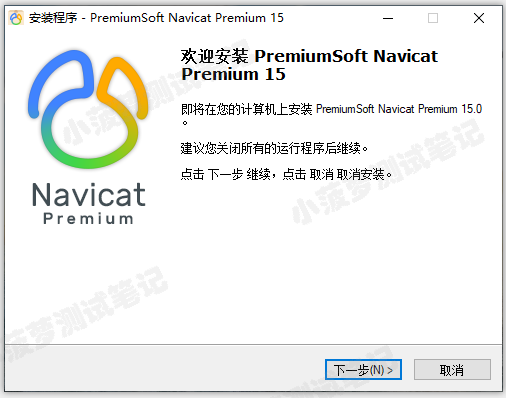](https://img2020.cnblogs.com/blog/1896874/202003/1896874-20200327115517304-182655447.png)

 

**3**|**0****Navicat Premium 15激活过程**

使用注册机先退出所有杀毒软件，再打开注册机，否则会一直报错哦！

[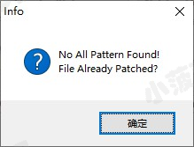](https://img2020.cnblogs.com/blog/1896874/202003/1896874-20200327115524557-1447945067.png)

 

**3**|**1****1.Patch**

[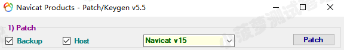](https://img2020.cnblogs.com/blog/1896874/202003/1896874-20200327115533340-2020498015.png)

 

**如果是Navicat 12就选 v12，其他选项和步骤不变！！**

**如果是Navicat 12就选 v12，其他选项和步骤不变！！**

**如果是Navicat 12就选 v12，其他选项和步骤不变！！**

 

在 1) Patch 中选择Backup、Host、**Navicat v15**这三个，默认也是选择了这三个；勾选这三个后点击Patch

点击Patch按钮并找到Navicat Premium 15的安装目录的navicat.exe文件

[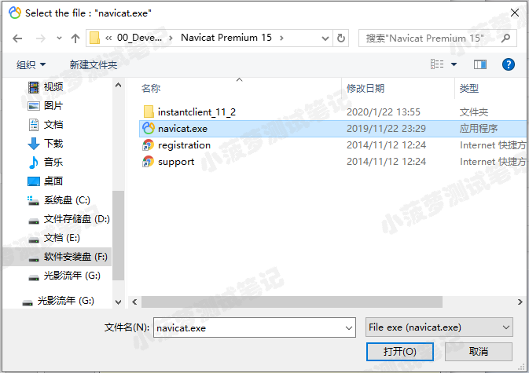](https://img2020.cnblogs.com/blog/1896874/202003/1896874-20200327115557378-1760378198.png)

 

出现以下提示说明Patch成功了，但别高兴的太早，这还只是第一步。

[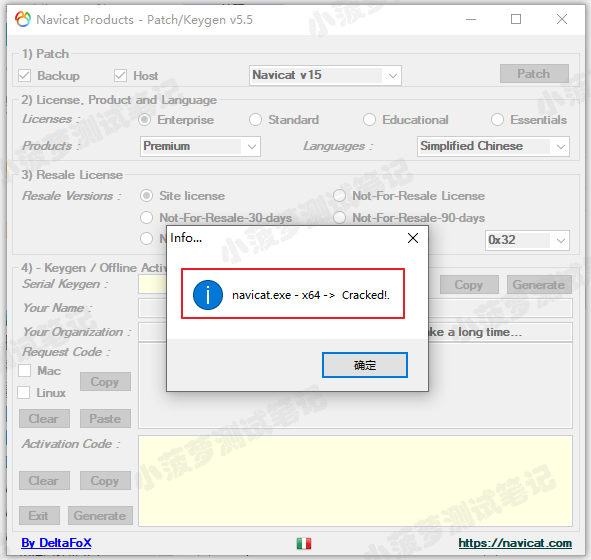](https://img2020.cnblogs.com/blog/1896874/202003/1896874-20200327115605885-1272856790.png)

 

**3**|**2****2.License. Product and Language**

License里选中Enterprise、在Produce里选择Premium、在Languages里选择Simplified Chinese(简体中文)

 

**3**|**3****3.Resale License**

保持默认选择即可

[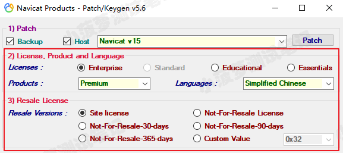](https://img2020.cnblogs.com/blog/1896874/202003/1896874-20200327115620201-435912506.png)

 

**3**|**4****4.Keygen / Offline Activation**

点击Generate按钮就会生成一个许可证秘钥，将许可证秘钥复制后就打开Navicat Premium 15

[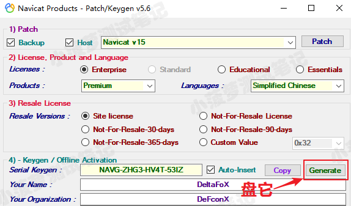](https://img2020.cnblogs.com/blog/1896874/202003/1896874-20200327115633085-1773552898.png)

 

**点击【注册】前，断网！！！**

**点击【注册】前，断网！！！**

**点击【注册】前，断网！！！**

然后打开Navicat Premium 15，一个是试用14天，一个是注册，这里我们点击注册

[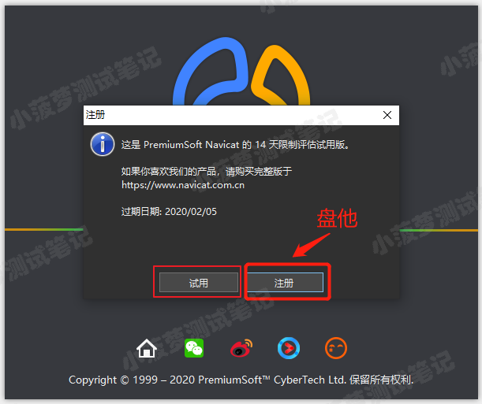](https://img2020.cnblogs.com/blog/1896874/202003/1896874-20200327115648212-1390083023.png)

 

粘贴刚刚注册机生成的许可证秘钥,然后点击激活

[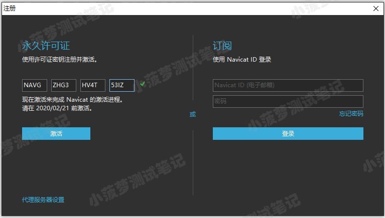](https://img2020.cnblogs.com/blog/1896874/202003/1896874-20200327115716187-2077730366.png)

 

 点击激活后会提示因为激活服务器暂时不可用,所以你的许可证未能激活，我们就选择手动激活。

[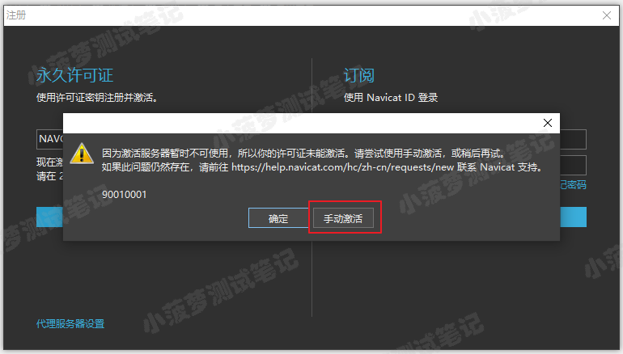](https://img2020.cnblogs.com/blog/1896874/202003/1896874-20200327115728842-2045621048.png)

 

点击手动激活后会生成一个请求码

复制请求码到注册机中的Request Code里面，之后点击Activation Code下面的Generate按钮就会生成一个激活码

[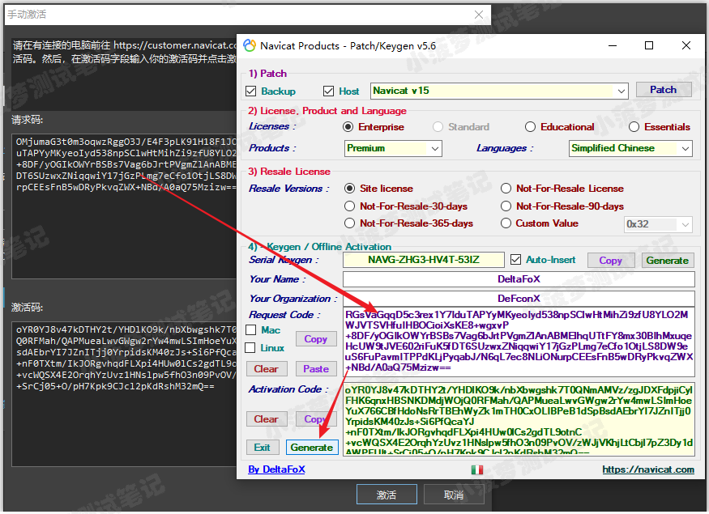](https://img2020.cnblogs.com/blog/1896874/202003/1896874-20200327115734477-1726587508.png)

 

将激活码复制到Navicat Premium 15中的激活码框框里，点击激活即可完成激活

[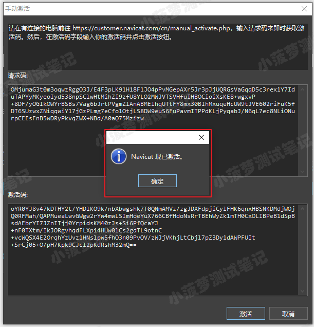](https://img2020.cnblogs.com/blog/1896874/202003/1896874-20200327115745119-137773072.png)

[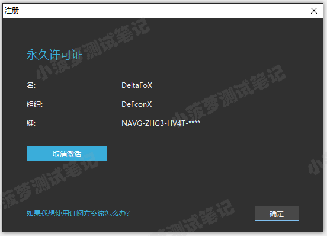](https://img2020.cnblogs.com/blog/1896874/202003/1896874-20200327115750878-606668771.png)

 

### 数据传输功能: 可以将一个表中的数据,传输到另一个表中.  高级

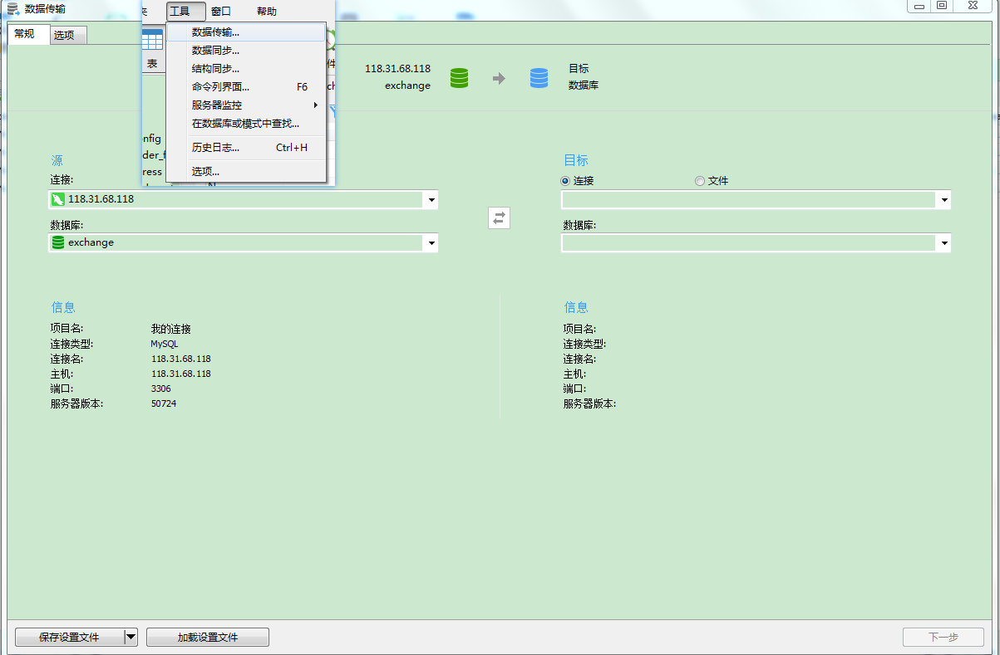

## Postman

Postman 上传图片

postman 上传excel

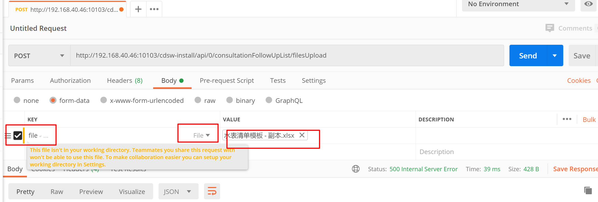


## IDEA

### 教育版邮箱激活

**感谢下单！新店冲销量需要支持！
激活之后2小时内给5★ 写个简短评价！即可获得一年售后服务！

您的订单1122326083493274392 发货数据如下：
激活链接：https://www.jetbrains.com/shop/eform/students/request?code=5ko6g9unlzhx0xwgmo6epl422

激活很简单 照着文字版操作正确不用2分钟

激活教程：
图文版： https://shimo.im/docs/G6q6jQ9yXRTqjhVg/ 
有不懂或者出现任何问题，打开图文版教程就有解决方法
因为有时候店主可能在敲代码  问题都整理在图文版了。

文字版：（不懂或者有问题看图文版）
1.打开激活链接
2.等页面完全加载完毕后，阅读条款拉到最下面点击 I Accept 
3.输入账号密码登录绑定激活，没有账号的在下面输入自己邮箱新注册一个账号。
（通过邮箱验证链接填写资料信息后才为注册成功）
4.最后页面出现 1 Licensed（一个许可证）表示账号已经激活。
（新注册的可能要再点一次授权链接才会出现。）
5.在软件激活界面选JB Account输入你的账号密码登录即可。

麻烦激活之后给个5★ 写个简短评价，可获得一年售后服务
感谢支持！！！**

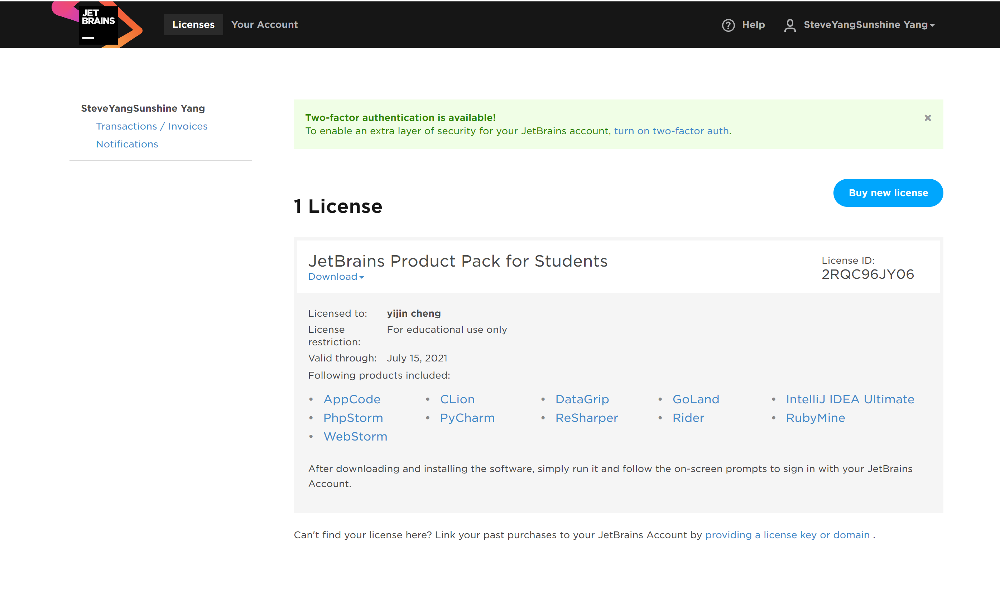


导入新的idea的设置以后,需要改两个地方,git的路径,jdk的路径.

### Maven的设置

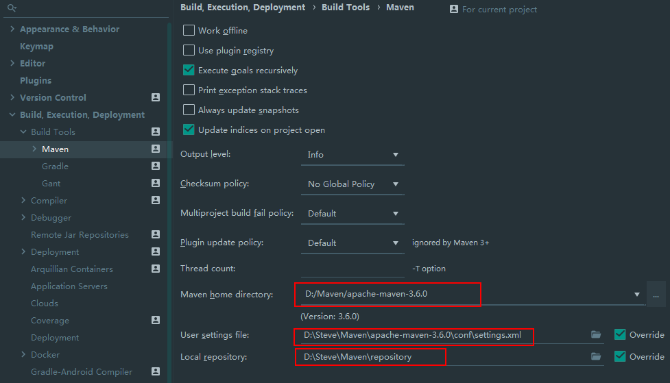

用之前的常用设置 可以整理一下


### Code Style设置tab为四个空格：

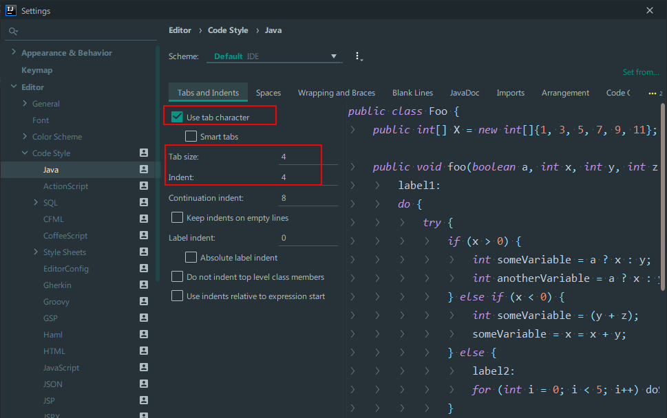


### Auto Impot自动清理无用的包

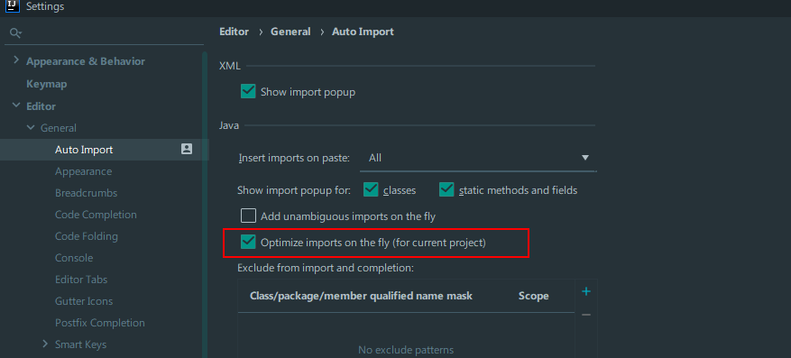


### ReFormat Code格式化所以代码

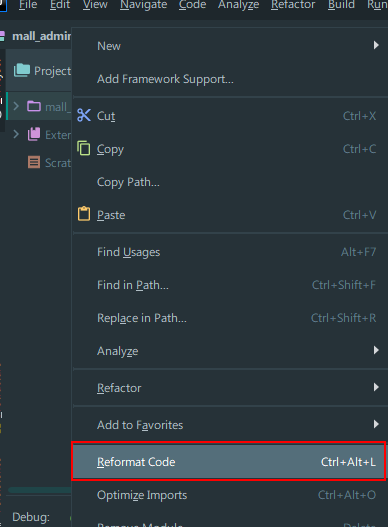

### IDEA提高开发效率的插件

#### Leetcode  刷题

设置完是这个这样子的, 记得要点击自定义模板 用邮箱登录。

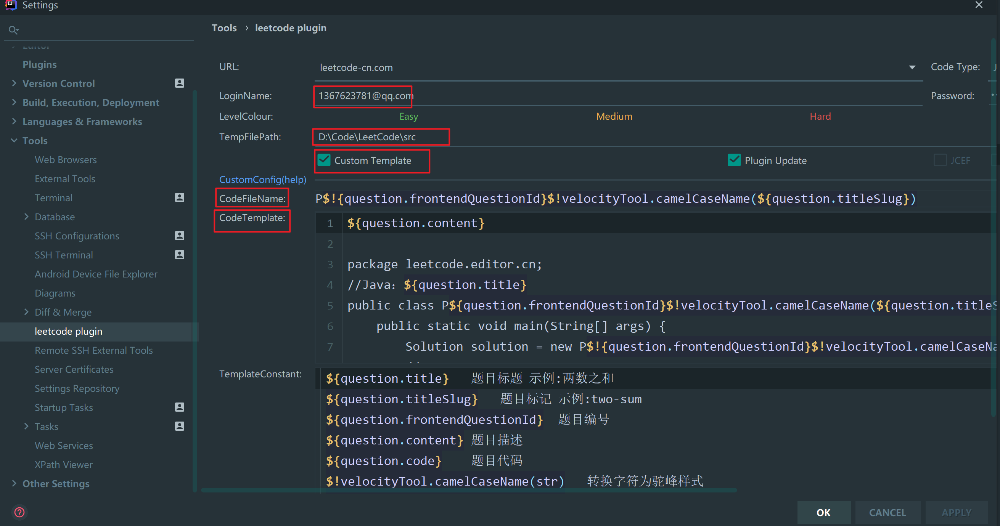


参考：https://www.cnblogs.com/hwtblog/p/11455581.html

**codeFileName** 指的是生成的模板文件的名字，我感觉我这样配置挺好的，如果有其他配置，可以自行研究

```java
P$!{question.frontendQuestionId}$!velocityTool.camelCaseName(${question.titleSlug})
```

**codeTemplate** 指的是模板内容了，官方给出的文档和这个也差不多，因为我优化了文件名字，文件内容也相应的做出了修改。

```java
${question.content}

package leetcode.editor.cn;
//Java：${question.title}
public class P${question.frontendQuestionId}$!velocityTool.camelCaseName(${question.titleSlug}){
    public static void main(String[] args) {
        Solution solution = new P$!{question.frontendQuestionId}$!velocityTool.camelCaseName(${question.titleSlug})().new Solution();
        // TO TEST
    }
    ${question.code}
}
```


#### SequenceDiagram 查看类的时序图

参考：https://www.cnblogs.com/-beyond/p/11408082.html

右键点击方法，点击这个插件，然后下面会出来这个方法和类的深度调用。

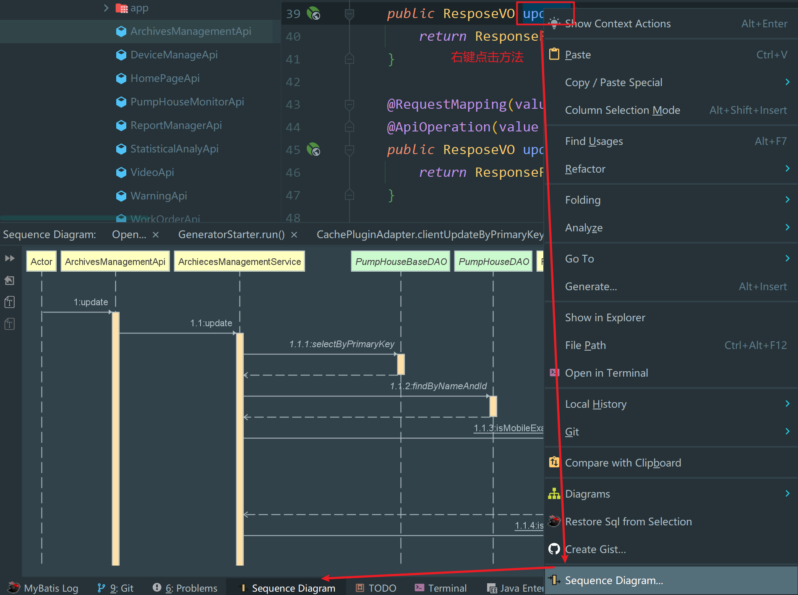


#### JClasslib 查看字节码文件的插件

使用：

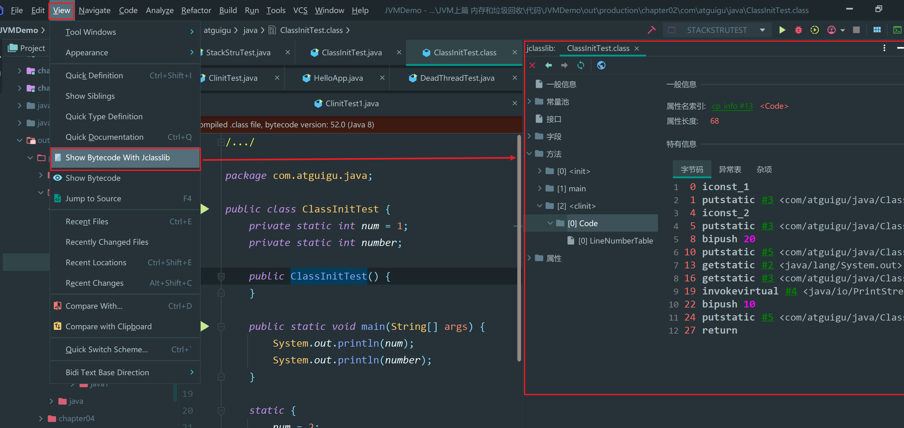


### Idea主题

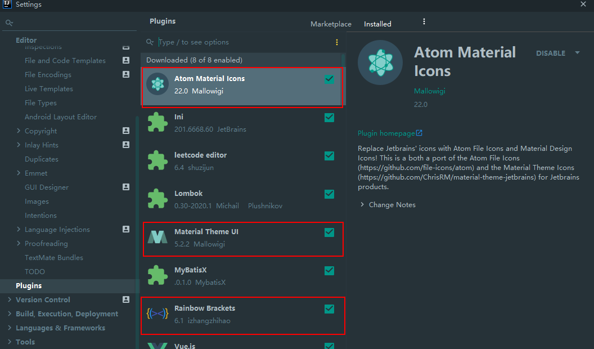

彩虹括号，Material Theme UI 还有Atom Material Icons，有了第三，才会在项目的最左边变成这个样子。

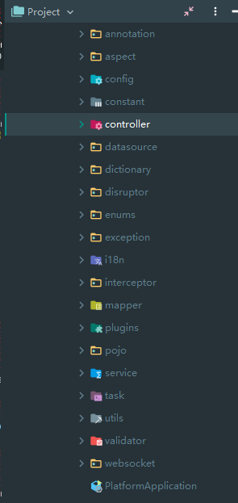

### 2020版 有全屏模式

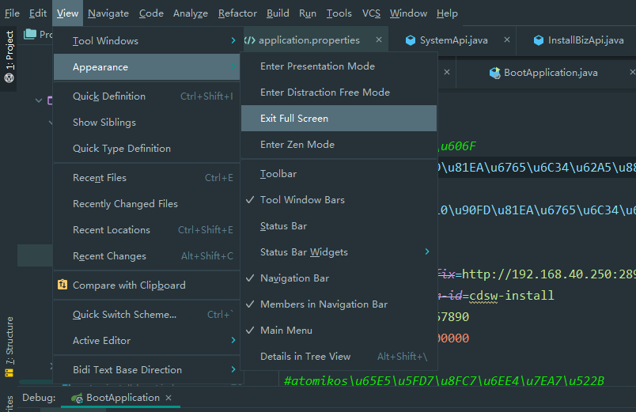

全屏和退出 都是这个。


### Idea设置忽略文件


### Idea插件

Idea 新插件 如果在软件里面安装不上 去官网下载 然后 放到Idea安装目录下面重启即可。

https://plugins.jetbrains.com/search?search=atom


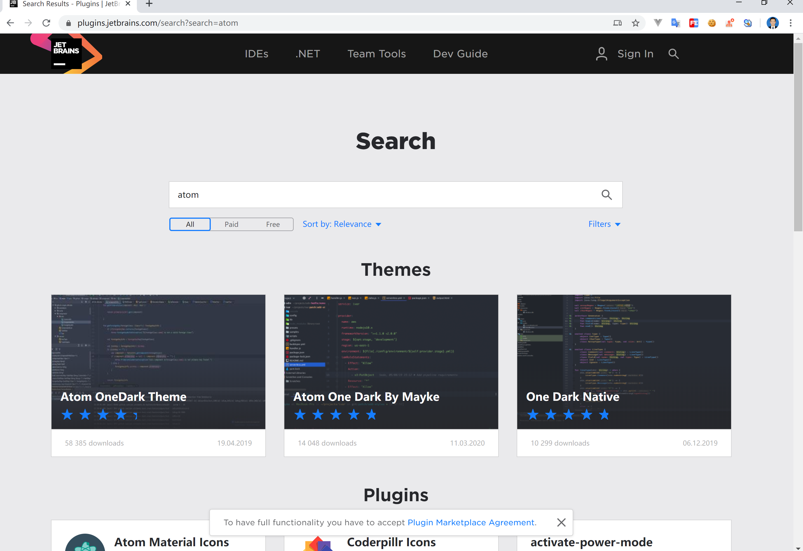


如果每一次启动idea都需要配置某些信息，比如maven

可以这样设置：

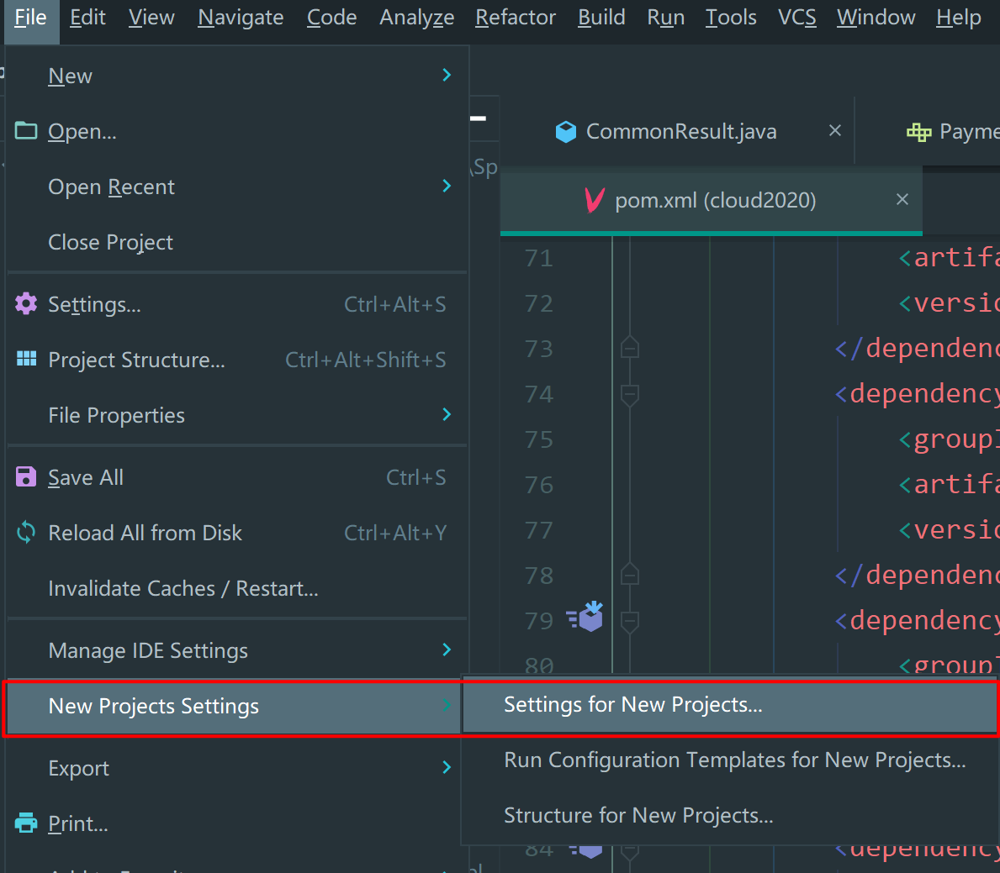

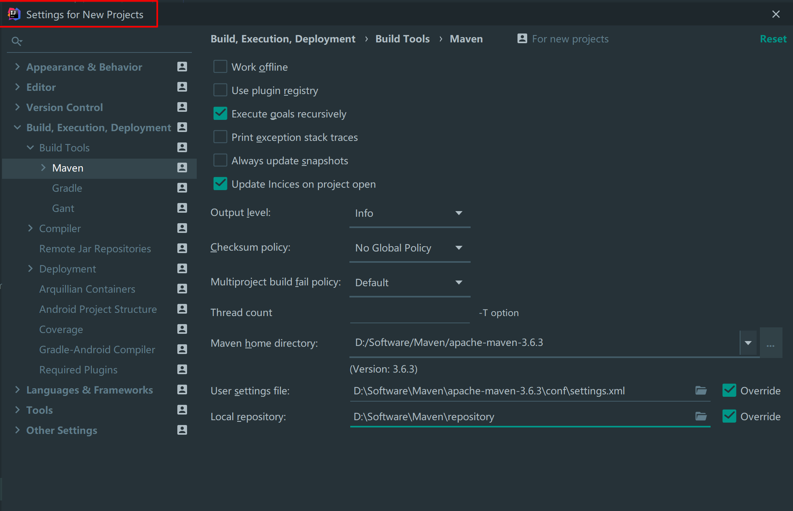


### Idea2020 打开Run Dashboard


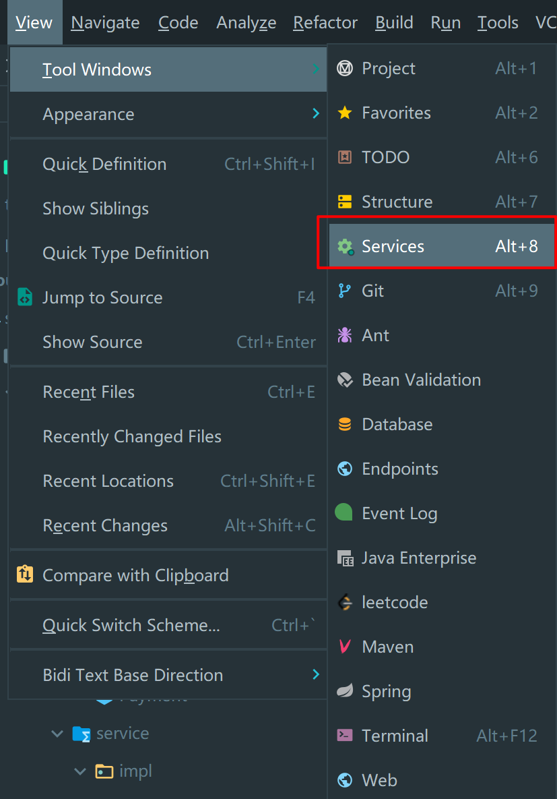


在新版idea里面叫services。


然后点击下面+号，添加springboot，然后就可以啦。

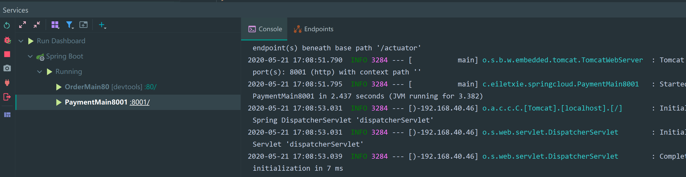

使用参考：https://blog.csdn.net/zhang1873310/article/details/105635877


### 热部署

这个是编译器热部署  并没有引入依赖

参考 https://blog.csdn.net/qq_16148137/article/details/99694566


### 工作流Activiti

Idea插件 查看工作流软件，actiBPM，这个软件在idea里面搜不到，可以去idea插件官网搜到。

参考 https://www.cnblogs.com/cat520/p/9322236.html

修改了Idea安装目录bin文件夹，然后还有idea软件里面配置，改成UTF-8


Ctrl+ Shift + F用不了 搜狗是是简体繁体切换  去掉。或者和qq冲突。


## FineReport

统计报表软件 


这软件安装完需要到官网注册 然后获取激活码 

### 第一章 软件介绍

#### 界面功能

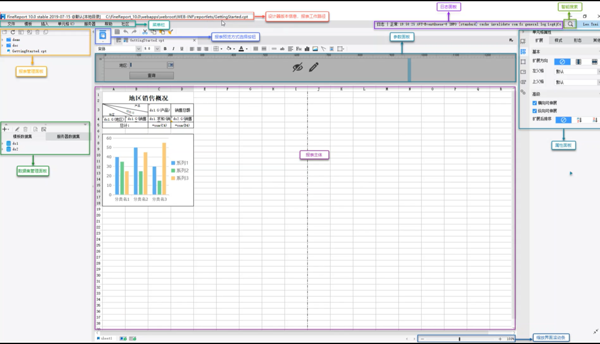


### 第二章 第一张报表

#### 报表设计流程

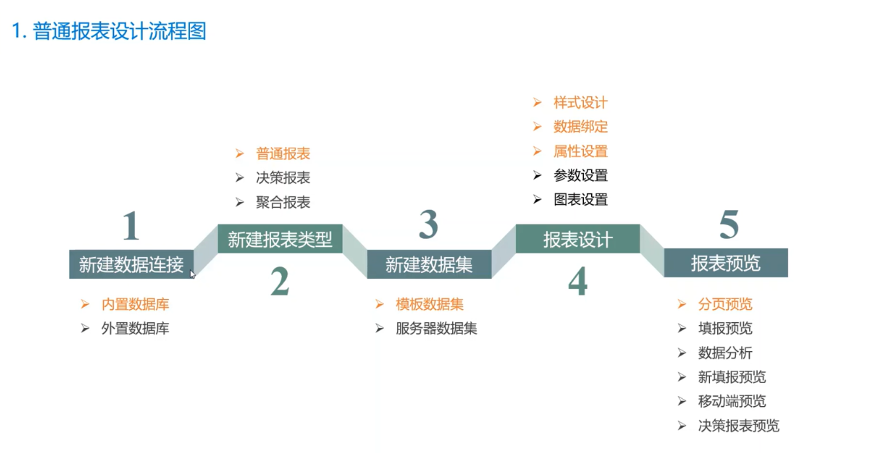

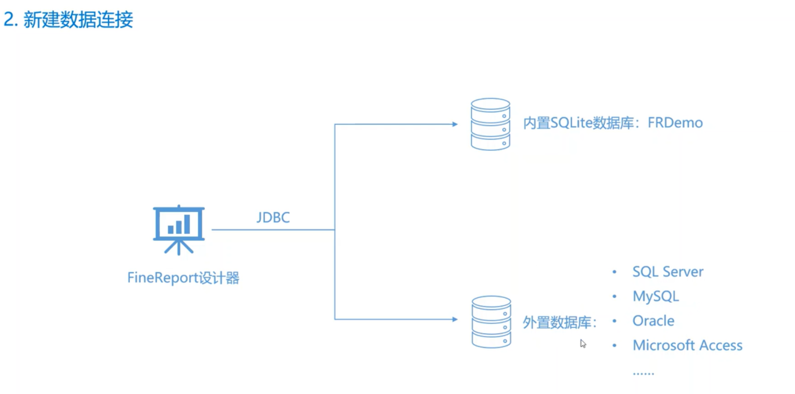

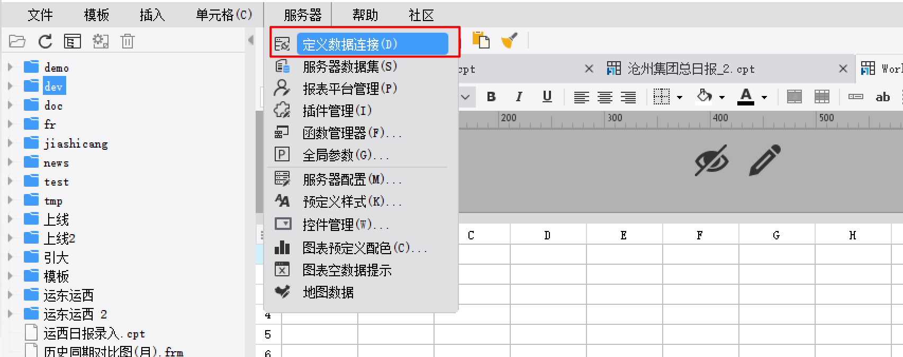

进来以后选择数据库。


这个连接Mysql的时候，软件原来就有


数据库查询：


这里可以使用数据库的正常查询语句 点击预览可以看结果 点击确定，就会把数据查出来，显示出来。


http://182.150.63.195:28989/jzpusw-install/api/0/install/concentrationControlList


这里还可以设计查询，只查询某一个地区的信息。

第一张报表制作好多还是很难 ，需要看看后面的。


### 第三章 报表属性设计基础

#### 单元格扩展

如果不扩展的话，会放在一个单元格里面


横向扩展以后，这个样子的


#### 两种报表样式


#### 行式报表

行市报表和数据库中样子差不多 只是加了标题栏


#### 交叉报表 第一个报表里面就是交叉报表


#### 父子格设置


#### 这里需要设置左父格 

##### 分组报表

单元格属性 扩展 左父格 默认


最后结果是这个样子的：


##### 自由报表 

自由报表 要让所有的格都跟随B3变化，B3为父格，右边属性扩展  左父格自定义都设置为B3 


出来的结果是这个样子的：


#### 层次坐标


绝对层次坐标不好理解，左父格要设置成无


## Cmder

参考：https://www.jianshu.com/p/5b7c985240a7


这个软件不需要安装，只需要配置一个环境变量就好了。

### 一、为什么要更换为cmder

在做项目时，有些时候我想复制控制台上面的代码时，**cmd**有的时候复制粘贴很麻烦，**Cmder**则不会，并且**Cmder**可以分屏多开窗口，可以设置窗口颜色,字体大小，并且很多快捷键和谷歌浏览器操作类似,等等很多功能。

### 二、官网下载地址:

> [http://cmder.net/](https://links.jianshu.com/go?to=http%3A%2F%2Fcmder.net%2F)

##### 关于下载

进入官网以后，有**mini版**和**完整版**，建议完整版，完整版功能更齐全，还可以使用`git`，下载好解压文件包以后就可以使用。


##### Cmder界面展示

启动Cmder界面如下，当然我设置了背景色，透明度，字体样式，隐藏标签栏栏，增加底部的状态栏，以及分屏功能。


Cmder界面展示

### 三、关于cmder的一些配置

#### 1. 配置环境变量:

在系统属性里面配置环境变量，将`Cmder.exe`所在文件路径添加至`Path`里


#### 2. 配置右键快捷启动:

以管理员身份打开`cmd`，执行以下命令即可，完了以后在任意地方点击右键即可使用cmder

```cpp
// 设置任意地方鼠标右键启动Cmder
Cmder.exe /REGISTER ALL
    
当电脑重新安装c盘，这里弄一下，它就会出现在鼠标右键，设置一下下面，就可以用啦。
```


鼠标右键启动Cmder

#### 3. 界面效果的设置

首先使用`windows+alt+p`进入界面设置
 背景色设置


 字体设置


 背景透明度


 隐藏标签栏


 显示底部状态栏


 将Cmder默认的命令提示符改为， 在中的内做如下修改"λ"替换成"$"

这个在Cmder\vendor\clink.lua


### 四、关于Cmder的一些常用快捷键


```css
Tab       自动路径补全
Ctrl+T    建立新页签
Ctrl+W    关闭页签
Ctrl+Tab  切换页签
Alt+F4    关闭所有页签
Alt+Shift+1 开启cmd.exe
Alt+Shift+2 开启powershell.exe
Alt+Shift+3 开启powershell.exe (系统管理员权限)
Ctrl+1      快速切换到第1个页签
Ctrl+n      快速切换到第n个页签( n值无上限)
Alt + enter 切换到全屏状态
Ctr+r       历史命令搜索
Tab         自动路径补全
Ctrl+T      建立新页签
Ctrl+W      关闭页签
Ctrl+Tab    切换页签
Alt+F4      关闭所有页签
Alt+Shift+1 开启cmd.exe
Alt+Shift+2 开启powershell.exe
Alt+Shift+3 开启powershell.exe (系统管理员权限)
Ctrl+1      快速切换到第1个页签
Ctrl+n      快速切换到第n个页签( n值无上限)
Alt + enter 切换到全屏状态
Ctr+r       历史命令搜索
Win+Alt+P   开启工具选项视窗
```

### 五、关于中文乱码问题：

将下面的4行命令添加到cmder/config/aliases文件末尾,如果还是不行参考前面字体设置，将前面提到的字体设置里面的Monospace的复选框不选中。还有就是养成良好的编码习惯文件命名最好不要有中文。


```dart
l=ls --show-control-chars 
la=ls -aF --show-control-chars 
ll=ls -alF --show-control-chars 
ls=ls --show-control-chars -F
```

## MobaXterm 

 支持cmder，还可以SSH，FTP，VNC，X server

### 参考文章

参考知乎上面的篇文章：

https://zhuanlan.zhihu.com/p/56341917

Baidu经验：https://jingyan.baidu.com/article/6dad5075223635a123e36ec9.html


csdn：https://blog.csdn.net/fighting_boss/article/details/79103822

思否：https://segmentfault.com/a/1190000000483148


### 打开多个终端窗口


点击左下角这个，会出来系统监控，各项参数指标。


### 过一段时间需要输入密码，这时候需要重新下载软件重置密码


https://mobaxterm.mobatek.net/resetmasterpassword.html


## Steam Wallpaper 

如果创意工坊 壁纸很少  只有一页，或者只有四五页。那么可以重置过滤器：


重置以后 壁纸就有有好多。

如果把下卖弄标签里面选中的去掉的话，壁纸也会有很多。


如果电脑里面有壁纸 ，在已安装里面没有出来，那么也可以重置过滤器。壁纸就会出来啦。 


## Typora

路径设置偏好设置：  

```
../media/pictures/${filename}.assets
```


## Nodejs

安装参考：https://blog.csdn.net/zjh_746140129/article/details/80460965


配置环境变量：

参考:https://www.cnblogs.com/coder-lzh/p/9232192.html （很好的文章 实操有效）

```
npm config set cache "D:\Software\Nodejs\node_cache"

npm config set prefix "D:\Software\Nodejs\node_global"

用户环境变量里面原来的npm路径
C:\Users\Sunshine\AppData\Roaming\npm
```


推荐博客：https://www.cnblogs.com/zhouyu2017/p/6485265.html

npm config list 获取npm配置信息 -------------

[回到顶部](https://www.cnblogs.com/coder-lzh/p/9232192.html#_labelTop)

###  主要写一下环境变量的配置

说明：这里的环境配置主要配置的是npm安装的全局模块所在的路径，以及缓存cache的路径，之所以要配置，是因为以后在执行类似：npm install express [-g] （后面的可选参数-g，g代表global全局安装的意思）的安装语句时，会将安装的模块安装到【C:\Users\用户名\AppData\Roaming\npm】路径中，占C盘空间。
例如：我希望将全模块所在路径和缓存路径放在我node.js安装的文件夹中，则在我安装的文件夹【D:\Develop\nodejs】下创建两个文件夹【node_global】及【node_cache】如下图：


创建完两个空文件夹之后，打开cmd命令窗口，输入

```
npm config set prefix "D:\Develop\nodejs\node_global"
npm config set cache "D:\Develop\nodejs\node_cache"
```


 

接下来设置环境变量，关闭cmd窗口，“我的电脑”-右键-“属性”-“高级系统设置”-“高级”-“环境变量”


 

 进入环境变量对话框，在【系统变量】下新建【NODE_PATH】，输入【D:\Develop\nodejs\node_global\node_modules】，将【用户变量】下的【Path】修改为【D:\Develop\nodejs\node_global】


 


 


 

###### 六、测试

配置完后，安装个module测试下，我们就安装最常用的express模块，打开cmd窗口，
输入如下命令进行模块的全局安装：

```
npm install express -g     # -g是全局安装的意思
```


 

```

```

 

上面ok之后 我们安装淘宝的cnpm镜像，因为国外的很慢。我们可以采用cnpm install 来代替npm安装 

```
$ npm install -g cnpm --registry=https://registry.npm.taobao.org
```

 

 

npm默认的仓库地址是在国外网站，速度较慢，建议大家设置到淘宝镜像。但是切换镜像是比较麻烦的。推荐一款切换镜像的工具：nrm

我们首先安装nrm，这里`-g`代表全局安装

```
npm install nrm -g
```

然后通过`nrm ls`命令查看npm的仓库列表,带*的就是当前选中的镜像仓库：


通过`nrm use taobao`来指定要使用的镜像源：


然后通过`nrm test npm`来测试速度：


注意：

- 有教程推荐大家使用cnpm命令，但是使用发现cnpm有时会有bug，不推荐。
- 安装完成请一定要重启下电脑！！！
- 安装完成请一定要重启下电脑！！！
- 安装完成请一定要重启下电脑！！！ 

很详细 。一次成功。


## DBConvert

可以将Oracle数据库转换为SostgreSql

官网参考：https://dbconvert.com/oracle/postgresql/

操作不太难，选好源Oracle数据库地址，选好目标PostgreSql地址，然后转换即可。


进行到这一步的时候，不要勾选右边**Overwrite exist**，否则在下一步会出错。


## VMware

激活码：

16版本

ZF3R0-FHED2-M80TY-8QYGC-NPKYF

VMware Workstation Pro 15 激活许可证

UY758-0RXEQ-M81WP-8ZM7Z-Y3HDA

VF750-4MX5Q-488DQ-9WZE9-ZY2D6

UU54R-FVD91-488PP-7NNGC-ZFAX6

YC74H-FGF92-081VZ-R5QNG-P6RY4

YC34H-6WWDK-085MQ-JYPNX-NZRA2

VMware Workstation Pro 14 激活许可证

FF31K-AHZD1-H8ETZ-8WWEZ-WUUVA

CV7T2-6WY5Q-48EWP-ZXY7X-QGUWD

VMware Workstation Pro 12 激活许可证

5A02H-AU243-TZJ49-GTC7K-3C61N

VF5XA-FNDDJ-085GZ-4NXZ9-N20E6

UC5MR-8NE16-H81WY-R7QGV-QG2D8

ZG1WH-ATY96-H80QP-X7PEX-Y30V4

AA3E0-0VDE1-0893Z-KGZ59-QGAVF

VMware Workstation Pro 10 激活许可证

1Z0G9-67285-FZG78-ZL3Q2-234JG

4C4EK-89KDL-5ZFP9-1LA5P-2A0J0

HY086-4T01N-CZ3U0-CV0QM-13DNU


## Ditto

粘贴板  

网址：https://ditto-cp.sourceforge.io/


## PowerToys

Wins工具集

下载地方 GitHub https://github.com/microsoft/PowerToys 

参考文章 程序羊 https://mp.weixin.qq.com/s/LUPa_uSEd91Pj08VwxsxEQ


## Wins工具 CodeSheep推荐

https://mp.weixin.qq.com/s/LUPa_uSEd91Pj08VwxsxEQ


# XShell连接

当连接不上虚拟机的Linux的时候，可能是没有关闭Linux的防火墙，或者连接ip错误。


# FTP连接

有好多人用的Xftp，360里面有，要安装，要激活，个人好像可以免费使用。

Java包里面有个FlashFXP，免安装，也可以使用，挺好用。


# KeyMap

## Wins 

```
Win7常规快捷bai键：
Win+1：打开/显示超级任du务栏第一个图标代zhi表的程序
Win+2：打开/显示超级任务栏第二个图标代表的程序（3、4、……如此类推）
Win+D：切换桌面显示窗口或者gadgets小工具
Win+E：打开explorer资源浏览器
Win+F：搜索文件或文件夹
Win+G：切换边栏小工具
Win+L：如果你连接到网络，则锁定计算机，如果没有连接到网络的，则切换用户
Win+M：快速显示桌面
Win+P：打开多功能显示面板（切换显示器）
Win+R：打开运行窗口
Win+T：切换显示任务栏信息，再次按下则会在任务栏上循环切换，Win+Shift+T 则是后退
Win+U：打开易用性辅助设置
Win+X：打开计算机移动中心
Win+Home：最小化 / 还原所有其他窗口
Win+Pause/Break：显示“系统属性”对话框
Win+Tab：3D切换窗口
Win+Space：桌面窗口透明化显示桌面，使用Aero Peek显示桌面
Win+CTRL+F：如果你在网络中的话，它能够搜索计算机
Win+CTRL+TAB：使用Windows Flip 3-D切换任务栏上的活动窗口
Win+Shift+← ：跳转左边的显示器
Win+Shift+→：跳转右边的显示器
Win+↑：最大化当前窗口
Win+↓：还原/最小化当前窗口
Win+←：当前窗口向左上下最大化
Win+→：当前窗口向右上下最大化
Win++：放大屏幕显示
Win+-：缩小屏幕显示
```


## **浏览器和Idea窗口切换 ctrl + tab**


## IDEA快捷键

  在使用IntelliJ Idea的时候，使用快捷键是必不可少的。掌握一些常用的快捷键能大大提高我们的开发效率。有些快捷键可以熟练的使用，但是还有另外一些快捷键虽然很好用，但是由于因为没有形成使用习惯或者没有理解快捷键的用法，甚至之前对一些快捷键根本没有概念，导致不会去使用。对于这些快捷键，如果能够用好，编辑代码的效率必能提高一个水平。所以在此梳理出来，加强自己的使用，形成习惯。

（注：有些操作的快捷键做了更改，和IntelliJ Idea默认的快捷键不一样）


—————Edit—————


—————-Find—————–


————–Navigate—————

*这里的快捷键用的频率还是很高的，但是之前用的最多的是Ctrl+F和Ctrl+Shift+F，后面相关的Find Usages基本上没有用过，后面应该多使用，有的时候相对Ctrl+F在文件内按字符串查找，还是更好用一些*

目前还不知道Previous Occurrence 和 Next Occurrence是怎么用的，在变量上使用没有反应。不过在Edit–Find菜单下有几个菜单项：Find Next \/ Move to Next Occurrence、Find Previous \/ Move to Previous Occurrence等。当选中变量的时候，需要首先点击“Find Word at Caret”，然后再点击上述选项才有用

———————-Code——————


—————————————–Completion——————————————


——————-Folding——————


———————————


———————————


————————————-Refactor——————————————–


啊

### 下面的部分是另一个帖子里面的

### 实用快捷键:

Ctrl+/ 或 Ctrl+Shift+/ 注释（// 或者/*...*/ ）
Ctrl+D 复制行
Ctrl+X 删除行
快速修复 alt+enter(modify/cast)
代码提示 alt+/
ctr+G 定位某一行
Shift+F6 重构-重命名 IDEA 批量修改变量名 点击变量名后按shift+F6
Ctrl+R 替换文本
Ctrl+F 查找文本

代码处F2 快速定位编译出错位置

Ctrl+E 最近打开的文件
Ctrl+J 自动代码

Ctrl+ home/end 抵达文件头部,底部

组织导入 ctr+alt+O
格式化代码 ctr+alt+L
大小写转化 ctr+shift+U

 

------

### IntelliJ Idea 常用快捷键列表

 

**Ctrl + Alt + U 查看类的继承关系**


Alt+回车导入包,自动修正
Ctrl+N   查找类
Ctrl+Shift+N 查找文件
Ctrl+Alt+L  格式化代码

Ctrl+Alt+O 优化导入的类和包
Alt+Insert 生成代码(如get,set方法,构造函数等)
Ctrl+E或者Alt+Shift+C  最近更改的代码
Ctrl+R 替换文本

Ctrl+F 查找文本
Ctrl+Shift+Space 自动补全代码
Ctrl+空格代码提示

Ctrl+Alt+Space 类名或接口名提示

Ctrl+P 方法参数提示

Ctrl+Shift+Alt+N 查找类中的方法或变量

Alt+Shift+C 对比最近修改的代码

 

Shift+F6  重构-重命名
Ctrl+Shift+先上键
Ctrl+X 删除行
Ctrl+D 复制行
Ctrl+/ 或 Ctrl+Shift+/  注释（// 或者/*...*/ ）
Ctrl+J  自动代码
Ctrl+E 最近打开的文件

Ctrl+H 显示类结构图

Ctrl+Q 显示注释文档
Alt+F1 查找代码所在位置
Alt+1 快速打开或隐藏工程面板

Ctrl+Alt+left/right 返回至上次浏览的位置
Alt+ left/right 切换代码视图

Alt+ Up/Down 在方法间快速移动定位

Ctrl+Shift+Up/Down代码向上/下移动。

F2 或Shift+F2 高亮错误或警告快速定位

 

代码标签输入完成后，按Tab，生成代码。

选中文本，按Ctrl+Shift+F7 ，高亮显示所有该文本，按Esc高亮消失。

Ctrl+W 选中代码，连续按会有其他效果

选中文本，按Alt+F3 ，逐个往下查找相同文本，并高亮显示。

Ctrl+Up/Down 光标跳转到第一行或最后一行下

Ctrl+B 快速打开光标处的类或方法 

Ctrl+O 查看该类可以重写哪些方法


### 查询快捷键

CTRL+N  查找类 
CTRL+SHIFT+N  查找文件 
CTRL+SHIFT+ALT+N 查找类中的方法或变量 
CIRL+B   找变量的来源 
CTRL+ALT+B  找所有的子类 
CTRL+SHIFT+B  找变量的类 
CTRL+G   定位行 
CTRL+F   在当前窗口查找文本 
CTRL+SHIFT+F  在指定窗口查找文本 
CTRL+R   在当前窗口替换文本 
CTRL+SHIFT+R  在指定窗口替换文本 
ALT+SHIFT+C  查找修改的文件 
CTRL+E   最近打开的文件 
F3   向下查找关键字出现位置 
SHIFT+F3  向上一个关键字出现位置 
F4   查找变量来源 
CTRL+ALT+F7  选中的字符查找工程出现的地方 
CTRL+SHIFT+O  弹出显示查找内容

 

### 自动代码

ALT+回车  导入包,自动修正 
CTRL+ALT+L  格式化代码 
CTRL+ALT+I  自动缩进 
CTRL+ALT+O  优化导入的类和包 
ALT+INSERT  生成代码(如GET,SET方法,构造函数等) 
CTRL+E 最近更改的代码 
CTRL+SHIFT+SPACE 自动补全代码 
CTRL+空格  代码提示 
CTRL+ALT+SPACE  类名或接口名提示 
CTRL+P   方法参数提示 
CTRL+J   自动代码 
**CTRL+ALT+T**  把选中的代码放在 TRY{} IF{} ELSE{}里   **还可以将语句加到try...catch语句中**

CTRL+ALT+M  抽取方法

**Ctrl + Alt  + V** 

假如输入,shiro权限管理相关:

```java
return new ShiroFilterFactoryBean();
```

按了快捷键以后:

```java
ShiroFilterFactoryBean shiroFilterFactoryBean = new ShiroFilterFactoryBean();
return shiroFilterFactoryBean;
```


### 复制快捷方式

CTRL+D  复制行 
CTRL+X   剪切,删除行  

**ctrl + alt + shift + c 复制类的包名  在Mybatis-plus代码生成器中有使用:**


 

### 其他快捷方式

CIRL+U  大小写切换 
CTRL+Z   倒退 
CTRL+SHIFT+Z  向前 
CTRL+ALT+F12  资源管理器打开文件夹 
ALT+F1   查找文件所在目录位置 
SHIFT+ALT+INSERT 竖编辑模式 
CTRL+/   注释//   
CTRL+SHIFT+/  注释/*...*/ 
CTRL+W   选中代码，连续按会有其他效果 
CTRL+B   快速打开光标处的类或方法 
ALT+ ←/→ 切换代码视图 
CTRL+ALT ←/→ 返回上次编辑的位置 
ALT+ ↑/↓ 在方法间快速移动定位 
SHIFT+F6  重构-重命名 
CTRL+H   显示类结构图 
CTRL+Q   显示注释文档 
ALT+1   快速打开或隐藏工程面板 
CTRL+SHIFT+UP/DOWN 代码向上/下移动。 
CTRL+UP/DOWN  光标跳转到第一行或最后一行下 
ESC   光标返回编辑框 
SHIFT+ESC  光标返回编辑框,关闭无用的窗口 
F1   帮助千万别按,很卡! 
书签帮助L(操作非数字键盘的数字!!!!!!!)

Ctrl +Shift+1-9 书签定位行为1-9 或者字母,

Ctrl + 1-9 自动跳转到锁定位的书签位置

Ctrl+ F9 重新编译, 删除缓存.实时更新

Ctrl+Shift+U 大小写切换


## Typora快捷键


## Sublime Text

### **选择类**

- Ctrl+D 选中光标所占的文本，继续操作则会选中下一个相同的文本。
- Alt+F3 选中文本按下快捷键，即可一次性选择全部的相同文本进行同时编辑。举个栗子：快速选中并更改所有相同的变量名、函数名等。
- Ctrl+L 选中整行，继续操作则继续选择下一行，效果和 Shift+↓ 效果一样。
- Ctrl+Shift+L 先选中多行，再按下快捷键，会在每行行尾插入光标，即可同时编辑这些行。
- Ctrl+Shift+M 选择括号内的内容（继续选择父括号）。举个栗子：快速选中删除函数中的代码，重写函数体代码或重写括号内里的内容。
- Ctrl+M 光标移动至括号内结束或开始的位置。
- Ctrl+Enter 在下一行插入新行。举个栗子：即使光标不在行尾，也能快速向下插入一行。
- Ctrl+Shift+Enter 在上一行插入新行。举个栗子：即使光标不在行首，也能快速向上插入一行。
- Ctrl+Shift+[ 选中代码，按下快捷键，折叠代码。
- Ctrl+Shift+] 选中代码，按下快捷键，展开代码。
- Ctrl+K+0 展开所有折叠代码。
- Ctrl+← 向左单位性地移动光标，快速移动光标。
- Ctrl+→ 向右单位性地移动光标，快速移动光标。
- shift+↑ 向上选中多行。
- shift+↓ 向下选中多行。
- Shift+← 向左选中文本。
- Shift+→ 向右选中文本。
- Ctrl+Shift+← 向左单位性地选中文本。
- Ctrl+Shift+→ 向右单位性地选中文本。
- Ctrl+Shift+↑ 将光标所在行和上一行代码互换（将光标所在行插入到上一行之前）。
- Ctrl+Shift+↓ 将光标所在行和下一行代码互换（将光标所在行插入到下一行之后）。
- Ctrl+Alt+↑ 向上添加多行光标，可同时编辑多行。
- Ctrl+Alt+↓ 向下添加多行光标，可同时编辑多行。


### 编辑类


- Ctrl+J 合并选中的多行代码为一行。举个栗子：将多行格式的CSS属性合并为一行。
- Ctrl+Shift+D  复制光标所在整行，插入到下一行。
- Tab 向右缩进。
- Shift+Tab 向左缩进。
- Ctrl+K+K 从光标处开始删除代码至行尾。
- Ctrl+Shift+K 删除整行。
- Ctrl+/ 注释单行。
- Ctrl+Shift+/ 注释多行。
- Ctrl+K+U 转换大写。
- Ctrl+K+L 转换小写。
- Ctrl+Z 撤销。
- Ctrl+Y 恢复撤销。
- Ctrl+U 软撤销，感觉和 Gtrl+Z 一样。
- Ctrl+F2 设置书签
- Ctrl+T 左右字母互换。
- F6 单词检测拼写


### **搜索类**


- Ctrl+F 打开底部搜索框，查找关键字。
- Ctrl+shift+F 在文件夹内查找，与普通编辑器不同的地方是sublime允许添加多个文件夹进行查找，略高端，未研究。
- Ctrl+P 打开搜索框。举个栗子：1、输入当前项目中的文件名，快速搜索文件，2、输入@和关键字，查找文件中函数名，3、输入：和数字，跳转到文件中该行代码，4、输入#和关键字，查找变量名。
- Ctrl+G 打开搜索框，自动带：，输入数字跳转到该行代码。举个栗子：在页面代码比较长的文件中快速定位。
- Ctrl+R 打开搜索框，自动带@，输入关键字，查找文件中的函数名。举个栗子：在函数较多的页面快速查找某个函数。
- Ctrl+： 打开搜索框，自动带#，输入关键字，查找文件中的变量名、属性名等。
- Ctrl+Shift+P 打开命令框。场景栗子：打开命名框，输入关键字，调用sublime text或插件的功能，例如使用package安装插件。
- Esc 退出光标多行选择，退出搜索框，命令框等。


### 显示类


- - Ctrl+Tab 按文件浏览过的顺序，切换当前窗口的标签页。
  - Ctrl+PageDown 向左切换当前窗口的标签页。
  - Ctrl+PageUp 向右切换当前窗口的标签页。
  - Alt+Shift+1 窗口分屏，恢复默认1屏（非小键盘的数字）
  - Alt+Shift+2 左右分屏-2列
  - Alt+Shift+3 左右分屏-3列
  - Alt+Shift+4 左右分屏-4列
  - Alt+Shift+5 等分4屏
  - Alt+Shift+8 垂直分屏-2屏
  - Alt+Shift+9 垂直分屏-3屏
  - Ctrl+K+B 开启/关闭侧边栏。
  - F11 全屏模式
  - Shift+F11 免打扰模式


## VScode

记住快捷键能够提高工作效率

Ctrl+Shift+P,F1 展示全局命令面板

Ctrl+P 快速打开最近打开的文件

Ctrl+Shift+N 打开新的编辑器窗口

Ctrl+Shift+W 关闭编辑器

Ctrl + X 剪切

Ctrl + C 复制

Alt + up/down 移动行上下

Shift + Alt up/down 在当前行上下复制当前行

Ctrl + Shift + K 删除行

Ctrl + Enter 在当前行下插入新的一行

Ctrl + Shift + Enter 在当前行上插入新的一行

Ctrl + Shift + | 匹配花括号的闭合处，跳转

Ctrl + ] 或 [ 行缩进

Home 光标跳转到行头

End 光标跳转到行尾

Ctrl + Home 跳转到页头

Ctrl + End 跳转到页尾

Ctrl + up/down 行视图上下偏移

Alt + PgUp/PgDown 屏视图上下偏移

Ctrl + Shift + [ 折叠区域代码

Ctrl + Shift + ] 展开区域代码

Ctrl + / 添加关闭行注释

Shift + Alt +A 块区域注释

Alt + Z 添加关闭词汇包含

**导航快捷键**

Ctrl + T 列出所有符号

Ctrl + G 跳转行

Ctrl + P 跳转文件

Ctrl + Shift + O 跳转到符号处

Ctrl + Shift + M 或 Ctrl + J 打开问题展示面板

F8 跳转到下一个错误或者警告

Shift + F8 跳转到上一个错误或者警告

Ctrl + Shift + Tab 切换到最近打开的文件

Alt + left / right 向后、向前

Ctrl + M 进入用Tab来移动焦点

Ctrl + F 查询

Ctrl + H 替换

F3 / Shift + F3 查询下一个/上一个

Alt + Enter 选中所有出现在查询中的

Ctrl + D 匹配当前选中的词汇或者行，再次选中-可操作

**多行光标快捷键**

Alt + Click 插入光标-支持多个

Ctrl + Alt + up/down 上下插入光标-支持多个

Ctrl + U 撤销最后一次光标操作

Shift + Alt + I 插入光标到选中范围内所有行结束符

Ctrl + I 选中当前行

Ctrl + Shift + L 选择所有出现在当前选中的行-操作

Ctrl + F2 选择所有出现在当前选中的词汇-操作

Shift + Alt + right 从光标处扩展选中全行

Shift + Alt + left 收缩选择区域

Shift + Alt + (drag mouse) 鼠标拖动区域，同时在多个行结束符插入光标

Ctrl + Shift + Alt + (Arrow Key) 也是插入多行光标的[方向键控制]

Ctrl + Shift + Alt + PgUp/PgDown 也是插入多行光标的[整屏生效]

Esc Esc 连续按两次Esc键取消多行光标

Shift + Alt + F 格式化代码

F12 跳转到定义处

Alt + F12 代码片段显示定义

Ctrl + K F12 在其他窗口打开定义处

Ctrl + . 快速修复部分可以修复的语法错误

Shift + F12 显示所有引用

F2 重命名符号

Ctrl + Shift + . / , 替换下个值

**编辑器管理快捷键**

Ctrl + F4, Ctrl + W 关闭编辑器

Ctrl + |切割编辑窗口

Ctrl + 1/2/3 切换焦点在不同的切割窗口

Ctrl + Shift + PgUp/PgDown 切换标签页的位置

**文件管理快捷键**

Ctrl + N 新建文件

Ctrl + O 打开文件

Ctrl + S 保存文件

Ctrl + Shift + S 另存为

Ctrl + F4 关闭当前编辑窗口

Ctrl + W 关闭所有编辑窗口

Ctrl + Shift + T 撤销最近关闭的一个文件编辑窗口

Ctrl + Enter 保持开启

Ctrl + Shift + Tab 调出最近打开的文件列表，重复按会切换

Ctrl + Tab 与上面一致，顺序不一致

Ctrl + P 复制当前打开文件的存放路径

Ctrl + R 打开当前编辑文件存放位置【文件管理器】

**显示快捷键**

F11 切换全屏模式

Ctrl + =/- 放大 / 缩小

Ctrl + B 侧边栏显示隐藏

Ctrl + Shift + E 资源视图和编辑视图的焦点切换

Ctrl + Shift + F 打开全局搜索

Ctrl + Shift + G 打开Git可视管理

Ctrl + Shift + D 打开DeBug面板

Ctrl + Shift + X 打开插件市场面板

Ctrl + Shift + H 在当前文件替换查询替换

Ctrl + Shift + J 开启详细查询

Ctrl + Shift + V 预览Markdown文件【编译后】

Ctrl + K v 在边栏打开渲染后的视图【新建】

**调试快捷键**

F9 添加解除断点

F5 启动调试、继续

F11 / Shift + F11 单步进入 / 单步跳出

F10 单步跳过

**集成终端快捷键**

Ctrl + ` 打开集成终端

Ctrl + Shift + ` 创建一个新的终端

Ctrl + C 复制所选

Ctrl + V 复制到当前激活的终端

Shift + PgUp / PgDown 页面上下翻屏

Ctrl + Home / End 滚动到页面头部或尾部


初始化html代码 

！+ tab  可以在页面生成HTML代码


# Blog

不要忘了博客的初衷,即使技术很菜也是可以分享的!加油!

 http://fangzh.top/2018/2018090522/

过程说明:https://blog.csdn.net/sinat_37781304/article/details/82729029 


里面可以写代码  写生活 写成都的美食。

## Hexo

Welcome to [Hexo](https://hexo.io/)! This is your very first post. Check [documentation](https://hexo.io/docs/) for more info. If you get any problems when using Hexo, you can find the answer in [troubleshooting](https://hexo.io/docs/troubleshooting.html) or you can ask me on [GitHub](https://github.com/hexojs/hexo/issues).

<!-- more -->

### Quick Start

#### Create a new post

```bash
$ hexo new "My New Post"
```

More info: [Writing](https://hexo.io/docs/writing.html)

#### Run server

```bash
$ hexo server

```

More info: [Server](https://hexo.io/docs/server.html)

#### Generate static files

```bash
$ hexo generate

```

More info: [Generating](https://hexo.io/docs/generating.html)

#### Deploy to remote sites

```bash
$ hexo deploy

```

More info: [Deployment](https://hexo.io/docs/deployment.html)


### 显示比例不合适,让变宽一些

### 要让文章截断,只显示一部分,需要将文章中加入

```markdown
<!-- more -->

```

### 修改hexo中title的图标:_config.yml


### 修改标题图标为透明

改了以后,提交到服务器,用不了,不知道为什么


还需要在image中,建立一个文件夹,放专门的图片!然后文章中,用的时候,需要将这些图片路径加上/image/...(图片文件夹路径)

如果为了让图片加载速度变快,可以将图片放在阿里云上,或者专门在阿里上买个对象存储!将照片上传上去,然后加载的时候会快一点!


## Halo 

在阿里云服务器上面高了一个 在docker里面弄 只是不能弄ssh 域名访问不了 不知道什么问题。


## 搭建一个文档类型的网站!免费且高速！

https://blog.csdn.net/qq_34337272/article/details/105511189


# DOS Order

## 进入D盘

```
d:
```


