# DataStructure

## 数据结构

>这一部分可以看王道考研数据结构
>
>可以做LeetCode上面习题
>
>牛客网剑指Offer也挺好
>
>我学的时候看的同学推荐的慕课网 玩转数据结构
>
>
>
>这一部分非常不完整，缺很多东西，后续会陆续加进来。
>
>下面的截图来自慕课网，玩转数据结构，如有侵权，请联系删除
>
>学习进度  慕课网 看到13-4结束。

## 0.绪论

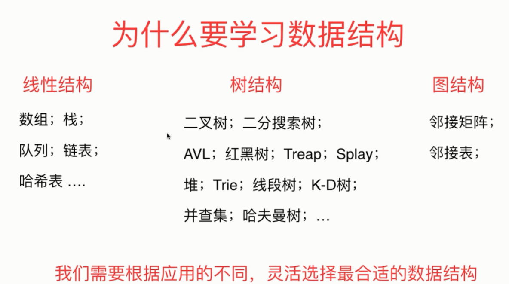

### 数据库中用到的数据结构

### 操作系统中用到的数据结构

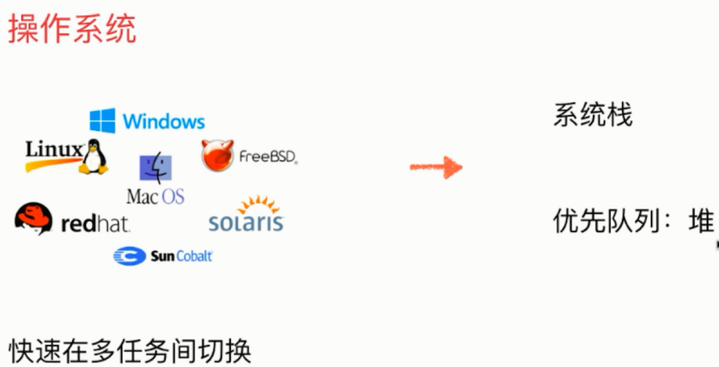

### 文件压缩用到的数据结构

### 通讯录中的数据结构

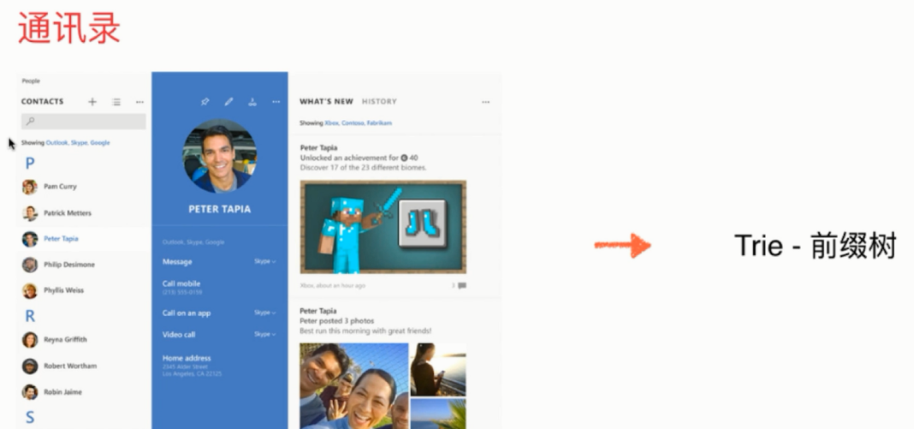

### 图论算法：（深度优先遍历，广度优先遍历）

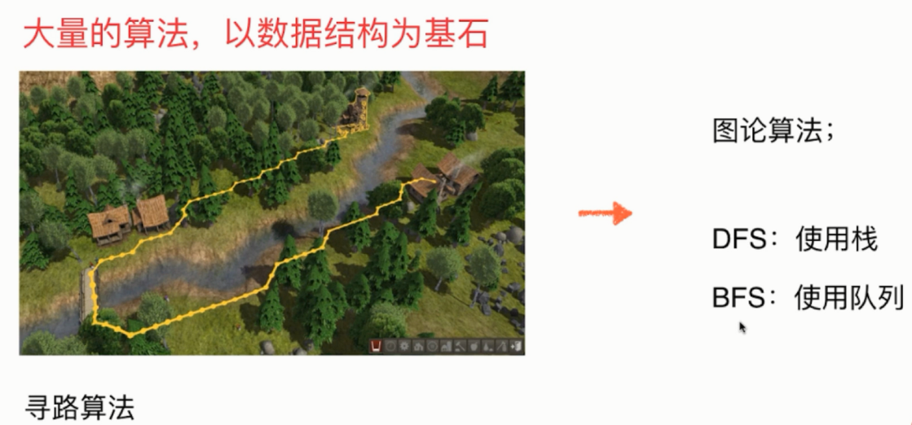

### 课程

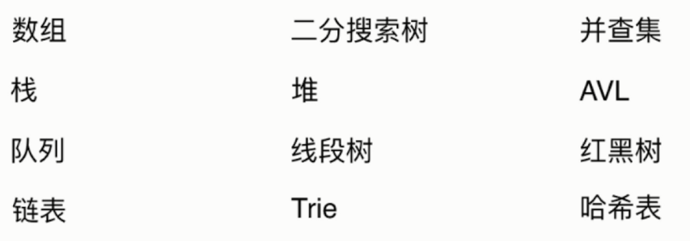

## 13.红黑树

红黑树的结构图：

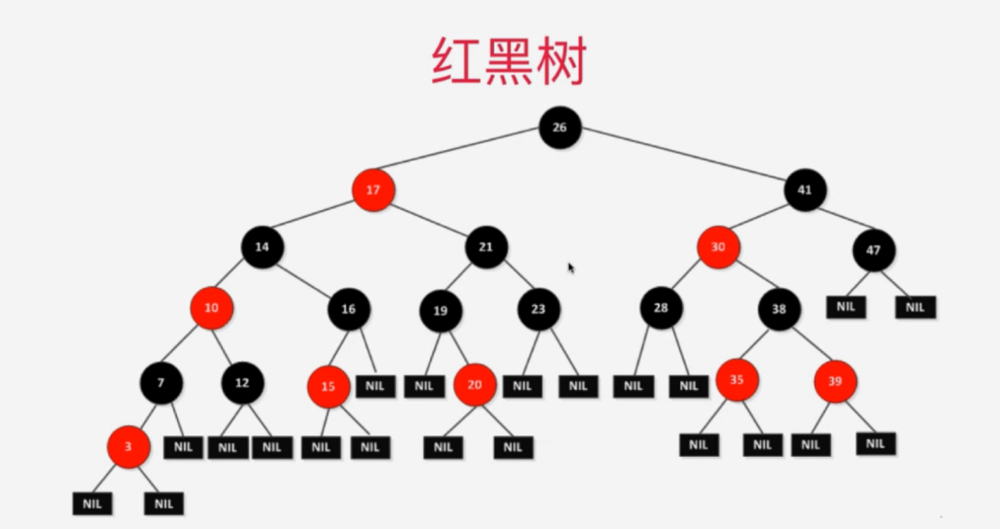

红黑树的性质：

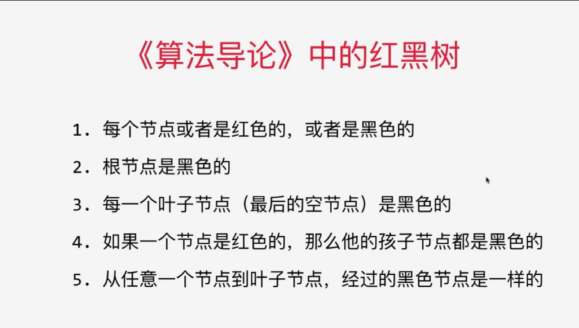

右边那本书，叫计算机程序设计艺术

学习红黑树之前，了解一下2-3树，红黑树和2-3树是等价的。

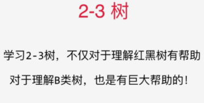

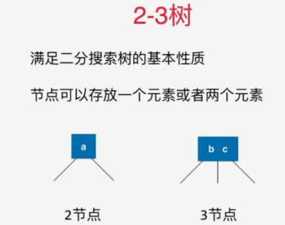

2-3树是一颗绝对平衡的树。

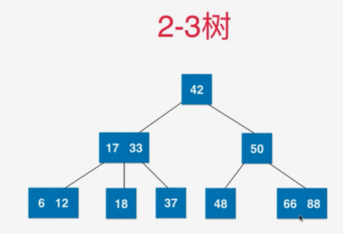

红黑树中添加一个元素：类比2-3树添加元素

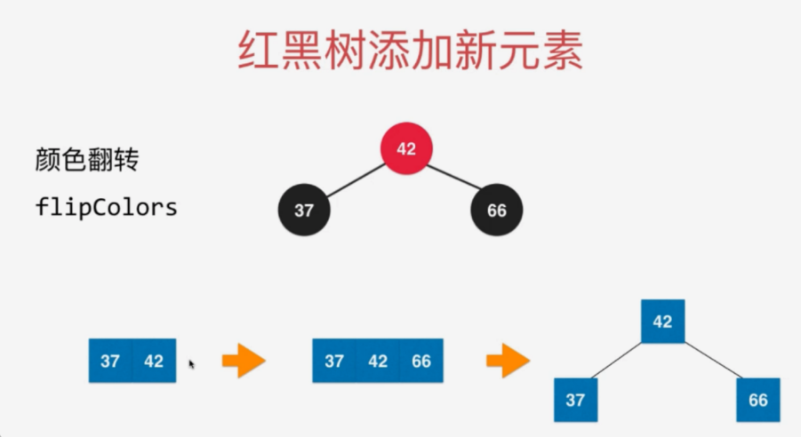

右旋转：

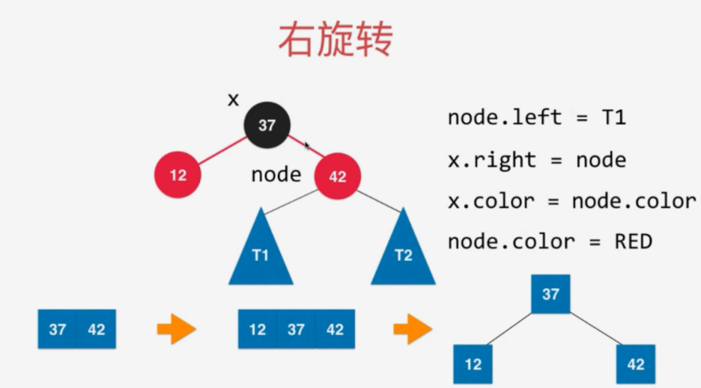

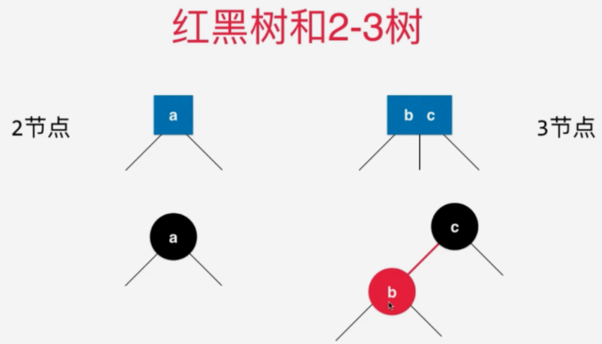

2-3树和红黑树是等价的

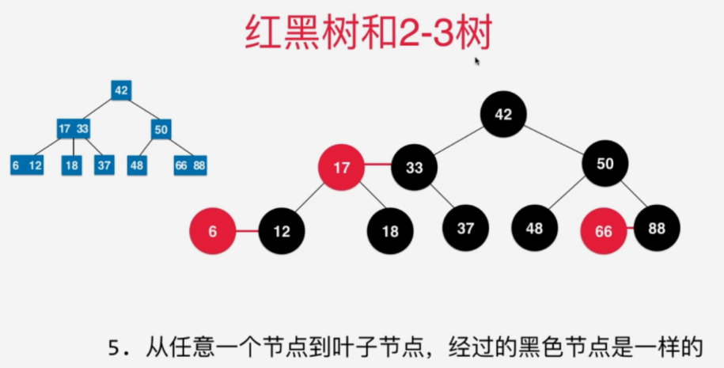

由上面性质5可以知道，红黑树是保持了“黑平衡”的二叉树，

严格意义上说不是平衡二叉树	

红黑树时间复杂度是O（logn）

将红黑树的一个博客!很详细!

https://blog.csdn.net/Sun_TTTT/article/details/65445754

简书上面讲红黑树的：https://www.jianshu.com/p/e136ec79235c

# Interview

> 这一部分在考研408或者面试，算是最重要的一部分，尤其进大厂，对这一部分要求很高。
>
> 后续会更新内容。

我自己碰见过的有问红黑树的。

