# DesignPatterns


## 目录

[TOC]

> 这里只是列举了简单几种，后续会加进来。

## 基本原则

### S 单一职责single

### O 开闭原则open

对新增开放

对修改封闭

### L 里氏替代原则

### I 接口隔离原则 isolation

### D 依赖倒置 depend

User user = new User（）；

## 单例

### 单例模式常见应用场景：

–Windows的Task Manager（**任务管理器**）就是很典型的单例模式

–windows的Recycle Bin（**回收站**）也是典型的单例应用。在整个系统运行过程中，回收站一直维护着仅有的一个实例。

–项目中，读取配置文件的类，一般也只有一个对象。没有必要每次使用配置文件数据，每次new一个对象去读取。

–**网站的计数器**，一般也是采用单例模式实现，否则难以同步。

–应用程序的**日志应用**，一般都何用单例模式实现，这一般是由于共享的日志文件一直处于打开状态，因为只能有一个实例去操作，否则内容不好追加。

–**数据库连接池**的设计一般也是采用单例模式，因为数据库连接是一种数据库资源。

–操作系统的文件系统，也是大的单例模式实现的具体例子，一个操作系统只能有一个**文件系统**。

–**Application** 也是单例的典型应用（Servlet编程中会涉及到）

–在Spring中，**每个Bean**默认就是单例的，这样做的优点是Spring容器可以管理

–在servlet编程中，每个**Servlet**也是单例

–在spring MVC框架/struts1框架中，控制器对象也是单例

### 单例模式的特点:

1、单例类只能有**一个**实例**。
2、单例类必须自己创建自己的唯一实例。**构造方法私有**
3、单例类必须给所有其他对象提供这一实例。

全局只包含一个自己的实例

特点

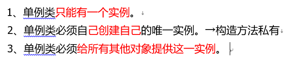

### 线程不安全的懒加载

有可能两个线程同时调用,就会是两个对象,所以线程不安全!

```java
public class Singleton1 {
     //1、单例类只能有一个实例。
    static Singleton1 singleton1;
    //2、单例类必须自己创建自己的唯一实例。→构造方法私有
    private Singleton1(){

    }
    //3、单例类必须给所有其他对象提供这一实例。
    public static Singleton1 getSingleton(){
        if (singleton1 == null) {
            singleton1 = new Singleton1();
        }
        return singleton1;
    }
}
```

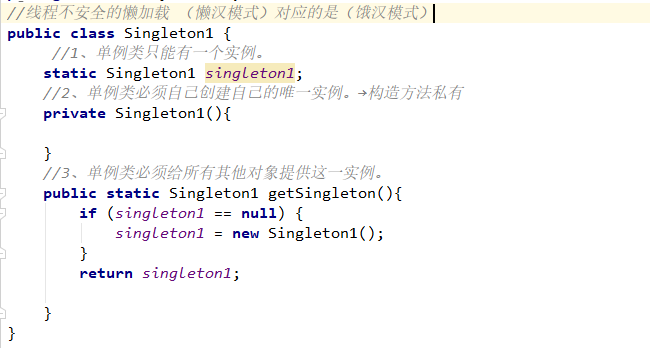

### 线程安全的懒加载

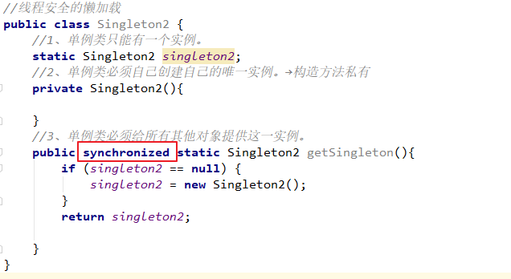

```java
public class Singleton2 {
    //1、单例类只能有一个实例。
    static Singleton2 singleton2;
    //2、单例类必须自己创建自己的唯一实例。→构造方法私有
    private Singleton2(){

    }
    //3、单例类必须给所有其他对象提供这一实例。
    public synchronized static Singleton2 getSingleton(){
        if (singleton2 == null) {
            singleton2 = new Singleton2();
        }
        return singleton2;
    }
}
```


```java
public class Singleton3 {
    //1、单例类只能有一个实例。
    static Singleton3 singleton3 = new Singleton3();
    //2、单例类必须自己创建自己的唯一实例。→构造方法私有
    private Singleton3(){
    }
    //3、单例类必须给所有其他对象提供这一实例。
    public static Singleton3 getSingleton(){
        return singleton3;
    }
}

```

### 线程安全的立即加载

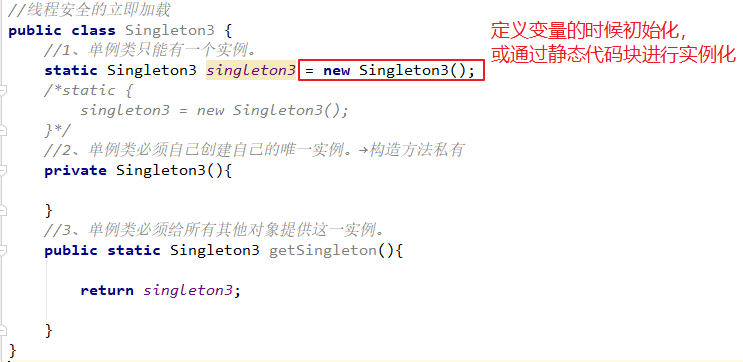

### 线程安全懒加载（内部类的实现）

内部类

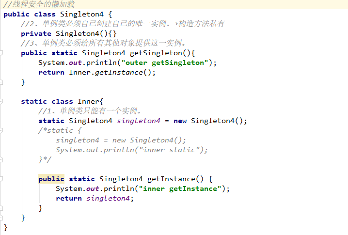

public class Singleton4 {
    //2、单例类必须自己创建自己的唯一实例。→构造方法私有
    private Singleton4(){}
    //3、单例类必须给所有其他对象提供这一实例。
    public static Singleton4 getSingleton(){
        System.out.println("outer getSingleton");
        return Inner.getInstance();
    }

```java
public class Singleton4 {
    //2、单例类必须自己创建自己的唯一实例。→构造方法私有
    private Singleton4(){}
    //3、单例类必须给所有其他对象提供这一实例。
    public static Singleton4 getSingleton(){
        System.out.println("outer getSingleton");
        return Inner.getInstance();
    }

    static class Inner{
        //1、单例类只能有一个实例。
        static Singleton4 singleton4 = new Singleton4();
        /*static {
            singleton4 = new Singleton4();
            System.out.println("inner static");
        }*/

        public static Singleton4 getInstance() {
            System.out.println("inner getInstance");
            return singleton4;
        }
    }


```

## 工厂

通过在工厂中实现实例的创建逻辑，对外隐藏实例的创建过程

### 简单工厂

通过给定的参数的不同，返回不同的实例

当我们去新增新的实例的时候，需要修改代码（和开闭原则有些许出入）

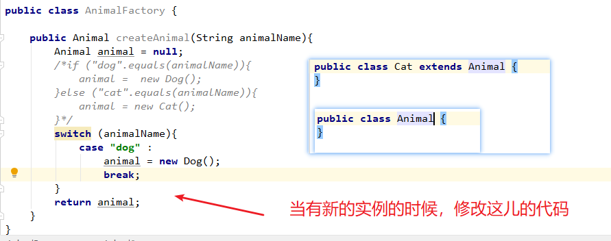

### 工厂方法

更加具体的工厂

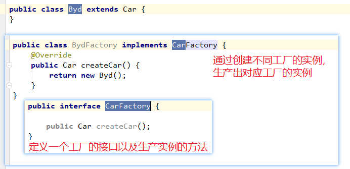

# 建造者Builder

侧重点：参数的设置

造人→头 arm leg

\---iq 150

\---胳膊180

\---腿 140

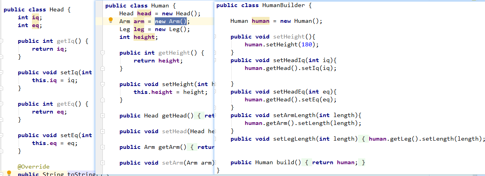

# 代理

## 静态代理

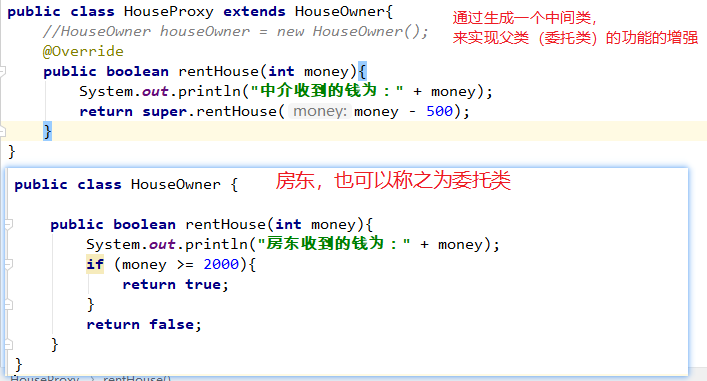

## 动态代理

生成代理对象

Jdk的动态代理：接口的接口的实现

Cglib动态代理

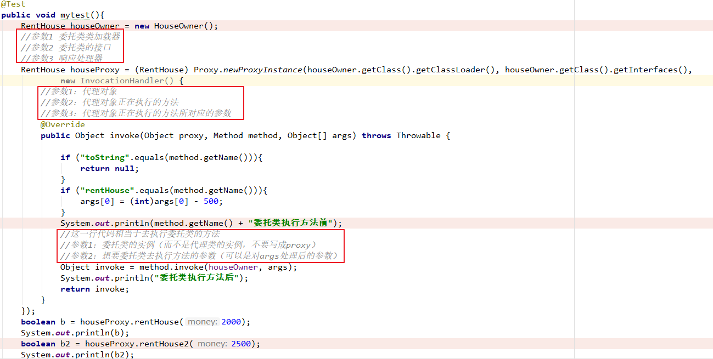

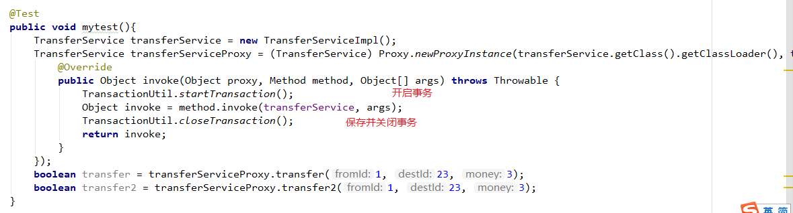


以后用maven就不需要导入jar包啦,只需要自己在pom.xml里面写依赖,然后他,自己就可以导入依赖啦!

还有,以后依赖也不用自己写,直接在Maven仓库查出来

https://mvnrepository.com/artifact

将下面的maven粘贴上就好!

还要注意的是,相应的依赖版本太新,不然不能用!会出现time zone异常,好像是区域不合适!

还有需要注意的是,配置文件必须要写在resources下面!


# Interview


## 1.单利模式相关

### 单利模式的介绍

单例的几种实现模式？

手写单例模式

单例模式是什么 ？使用场景是什么？会出现线程安全问题吗？为什么？

用Java写一个线程安全的单例模式。

18.试写出Singleton模式通常有几种实现


## 2.工厂模式相关

什么情况下用工厂模式，什么情况下用代理模式？

工厂模式和代理模式？


## 3.建造者模式相关


## 4.装饰者模式相关


## 5.常见模式具体应用

你知道的常见那些模式，一般用在哪些场景（可以结合项目或者框架说说对一些设计模式的理解）

你在项目中有用过设计模式吗？没有的话，描述一下线程安全的单例应该如何实

请说下你熟悉的设计模式？装饰者模式和普通的继承有什么区别？

常用的设计模式有哪些，简述面向对象思想和设计模式之间的关系？

详细介绍一下常见的设计模式。单例模式的懒加载和立即加载有什么区别？懒加载会导致什么问题，怎样解决？

常用设计模式， 单例、工厂、以及在项目中如何使用


编程题：

1.刘备入东吴成亲，诸葛亮给了赵云三个锦囊妙计，让他依计行事，第一个锦囊:见乔国老并把刘备娶亲的事情搞得东昊人尽皆知:第二个锦囊:用谎言(曹操打荆州)骗泡在柔乡里的刘备回去:第三个锦囊: 让孙夫人摆平东吴的追兵，她是孙权妹妹，东吴将领都敬她三分。(使用合适的设计模式实现)

