# Docker


> 这里是自己在B站看阳哥视频学习的这一部分内容。

## **Bilibili**

阳哥说啦，学习慢就是快，一步一步来。这个月多学一个本事，下个月少说一句求人的话。

先去做，不一定要学完了才去做。做着做着就会啦。

### docker介绍

可以看笔记中的脑图，或者html文件。JavaGuide中也有说明。

docker是基于go语言的云开源技术。


在开发人员开发完成之后，运维人员部署项目，这中间可能会因为环境和跑配置让项目跑不起来。


比如我买了一条鱼，店家给我，我回家自己搞鱼缸，自己搞水。最后这条鱼很可能因为环境不合适死掉。

那么正确的做法是，店家把鱼原来生活的鱼缸，水和鱼一起给我，我直接放在家里即可。鱼不会因为环境和配置而死掉。


以前的方式叫搬家，现在通过doker的方式叫搬楼。


其实Docker是缩小版的Linux，只要Linux的内核，硬件什么的不需要，共用宿主机的就好。所以Docker很小。


### docker三大技术

镜像   容器   仓库

类      实例  

仓库是存放镜像的地方，一个镜像可以有好多容器。（不知道对不对）


docker是简易版的linux，大部分linux命令在docker里面都可以运行。

### Ubuntu安装docker

在Linux文档中。


### docker常用命令

#### 帮助命令

```
docker version 
docker info   //这个信息更加详细
docker --help  //可以查看其它所有命令的说明
```

#### 镜像命令

##### 列出本地主机镜像

```shell
decker images 
docker images -a  #列出所有的本地镜像 
docker images -q  #只显示镜像ID 
docker images -qa #显示所有的镜像ID
docker images --digests :显示镜像的摘要信息
docker images --no-trunc :显示完整的镜像信息
docker images --digests  --no-trunc  显示的是更加详细的信息
```


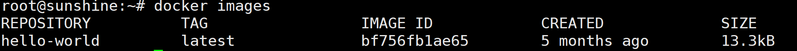


##### 搜索某个镜像

```shell
docker search 某个XXX镜像的名字
docker search tomcat #是在dockerhub上面搜索，但是下载是在阿里云上面下载
docker search -s 30 tomcat #意思是星星超过30再罗列 这个命令很有用的
docker search -s 30 --no-trunc tomcat #星星超过30 同时显示完整的镜像描述
```

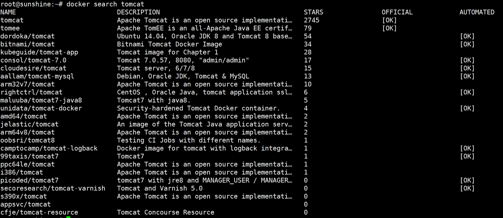

最上面两个，OFFICIAL 意思是官方版的。  

这个搜索出来的和在dockerhub上面搜索出来的是一样的，看星星都一样

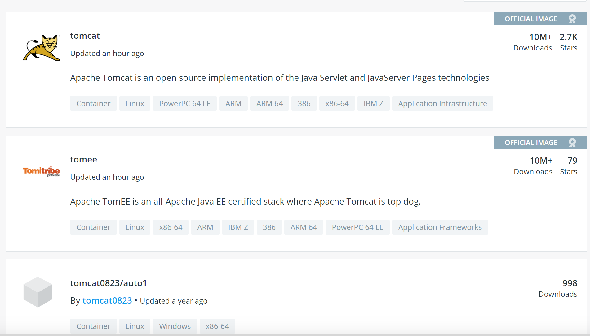


##### 拉取某个镜像 下载镜像

```
docker pull  某个XXX镜像的名字
docker pull tomcat 等价于 docker pull tomcat:latest
```

 

##### 删除某个镜像

```
docker rmi  某个XXX镜像的名字
docker rmi -f hello-workd 强制删除一个
docker rmi -f hello-world nginx 删除多个
```

直接删除的话，删不掉，可以强制删除。加 -f 

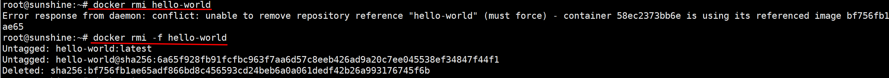


#### 容器命令

最神奇的地方就是docker可以拉取centos镜像。 虚拟机啊里面搞了个docker,然后上面有搞了个linux。俄罗斯套娃的感觉。

##### 操作之前先创建一个镜像

```
docker pull centos
```


##### 新建启动容器

有了镜像才有容器。

```
docker run -it 470671670cac  
docker run -it --name="docker-centos" centos 指定它的名字
docker run -it --name dockercentos centos  这样也是指定名字 和上一个差不多
```

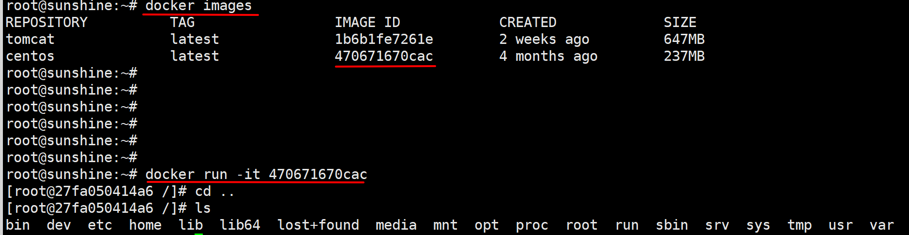

这样的话，就真的进入了centos里面，好神奇。


##### 列出正在运行的容器

```
docker ps 查看docker里面的进程
```

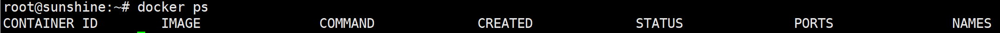


```
ctrl + p +q 退出容器，但是不结
再按docker ps 就可以看到现在运行的容器
```

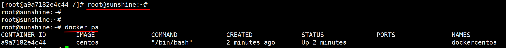

status 下面的up 就是正在运行


```
 docker ps -n 2 刚刚运行的两个容器
```

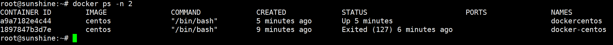


##### 退出容器

```
exit 退出容器停止
ctrl + p + q 退出容器不停止
```


##### 启动容器

```
docker start 1897847b3d7e （容器ID或者容器名）
```

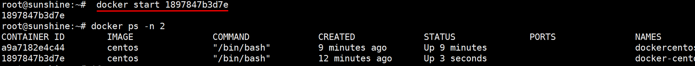


##### 重启容器

```
docker restart 容器ID或者容器名
```


##### 停止容器

```
docker stop 容器ID或者容器名
```


##### 强制停止容器

```
docker kill 容器ID或者容器名
```

用容器停止命令，虽然停啦。但是这个容器还是在的

可以用docker ps -n 2 还是可以看到曾经开启的容器。

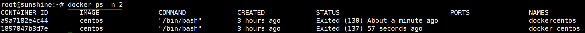


##### 删除已经停止的容器

```shell
docker rm 容器ID

#如果删除没有停止的容器
docker rm -f 容器ID
```


##### 高级命令

###### 启动守护式容器

```
docker run -d 容器名

```


###### 查看容器日志

```
docker logs -f -t --tail 3 4addd748ced6 

```


###### 查看容器内进程

```
docker top 容器ID

```

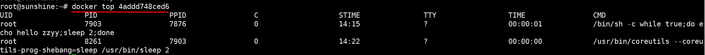


###### 查看容器内部细节

```
docker inspect 容器ID

```

返回结果是一对json串

```json
[
    {
        "Id": "4addd748ced617782a4c30885709467675b3955fb89add05e036e25321e096c0",
        "Created": "2020-06-04T06:15:25.404566676Z",
        "Path": "/bin/sh",
        "Args": [
            "-c",
            "while true;do echo hello zzyy;sleep 2;done"
        ],
        "State": {
            "Status": "running",
            "Running": true,
            "Paused": false,
            "Restarting": false,
            "OOMKilled": false,
            "Dead": false,
            "Pid": 7903,
            "ExitCode": 0,
            "Error": "",
            "StartedAt": "2020-06-04T06:15:28.285487056Z",
            "FinishedAt": "0001-01-01T00:00:00Z"
        },
        "Image": "sha256:470671670cac686c7cf0081e0b37da2e9f4f768ddc5f6a26102ccd1c6954c1ee",
        "ResolvConfPath": "/var/lib/docker/containers/4addd748ced617782a4c30885709467675b3955fb89add05e036e25321e096c0/resolv.conf",
        "HostnamePath": "/var/lib/docker/containers/4addd748ced617782a4c30885709467675b3955fb89add05e036e25321e096c0/hostname",
        "HostsPath": "/var/lib/docker/containers/4addd748ced617782a4c30885709467675b3955fb89add05e036e25321e096c0/hosts",
        "LogPath": "/var/lib/docker/containers/4addd748ced617782a4c30885709467675b3955fb89add05e036e25321e096c0/4addd748ced617782a4c30885709467675b3955fb89add05e036e25321e096c0-json.log",
        "Name": "/relaxed_hypatia",
        "RestartCount": 0,
        "Driver": "overlay2",
        "Platform": "linux",
        "MountLabel": "",
        "ProcessLabel": "",
        "AppArmorProfile": "docker-default",
        "ExecIDs": null,
        "HostConfig": {
            "Binds": null,
            "ContainerIDFile": "",
            "LogConfig": {
                "Type": "json-file",
                "Config": {}
            },
            "NetworkMode": "default",
            "PortBindings": {},
            "RestartPolicy": {
                "Name": "no",
                "MaximumRetryCount": 0
            },
            "AutoRemove": false,
            "VolumeDriver": "",
            "VolumesFrom": null,
            "CapAdd": null,
            "CapDrop": null,
            "Capabilities": null,
            "Dns": [],
            "DnsOptions": [],
            "DnsSearch": [],
            "ExtraHosts": null,
            "GroupAdd": null,
            "IpcMode": "private",
            "Cgroup": "",
            "Links": null,
            "OomScoreAdj": 0,
            "PidMode": "",
            "Privileged": false,
            "PublishAllPorts": false,
            "ReadonlyRootfs": false,
            "SecurityOpt": null,
            "UTSMode": "",
            "UsernsMode": "",
            "ShmSize": 67108864,
            "Runtime": "runc",
            "ConsoleSize": [
                0,
                0
            ],
            "Isolation": "",
            "CpuShares": 0,
            "Memory": 0,
            "NanoCpus": 0,
            "CgroupParent": "",
            "BlkioWeight": 0,
            "BlkioWeightDevice": [],
            "BlkioDeviceReadBps": null,
            "BlkioDeviceWriteBps": null,
            "BlkioDeviceReadIOps": null,
            "BlkioDeviceWriteIOps": null,
            "CpuPeriod": 0,
            "CpuQuota": 0,
            "CpuRealtimePeriod": 0,
            "CpuRealtimeRuntime": 0,
            "CpusetCpus": "",
            "CpusetMems": "",
            "Devices": [],
            "DeviceCgroupRules": null,
            "DeviceRequests": null,
            "KernelMemory": 0,
            "KernelMemoryTCP": 0,
            "MemoryReservation": 0,
            "MemorySwap": 0,
            "MemorySwappiness": null,
            "OomKillDisable": false,
            "PidsLimit": null,
            "Ulimits": null,
            "CpuCount": 0,
            "CpuPercent": 0,
            "IOMaximumIOps": 0,
            "IOMaximumBandwidth": 0,
            "MaskedPaths": [
                "/proc/asound",
                "/proc/acpi",
                "/proc/kcore",
                "/proc/keys",
                "/proc/latency_stats",
                "/proc/timer_list",
                "/proc/timer_stats",
                "/proc/sched_debug",
                "/proc/scsi",
                "/sys/firmware"
            ],
            "ReadonlyPaths": [
                "/proc/bus",
                "/proc/fs",
                "/proc/irq",
                "/proc/sys",
                "/proc/sysrq-trigger"
            ]
        },
        "GraphDriver": {
            "Data": {
                "LowerDir": "/var/lib/docker/overlay2/7bb758dbf8a0d7c5395a220706aa1dd7ba46ad5a65ad0ff7ae32890f6ca18e27-init/diff:/var/lib/docker/overlay2/878c448d416b98c84747a7fe0e9d142d6c0547bffee5b8f920d6926d606011a7/diff",
                "MergedDir": "/var/lib/docker/overlay2/7bb758dbf8a0d7c5395a220706aa1dd7ba46ad5a65ad0ff7ae32890f6ca18e27/merged",
                "UpperDir": "/var/lib/docker/overlay2/7bb758dbf8a0d7c5395a220706aa1dd7ba46ad5a65ad0ff7ae32890f6ca18e27/diff",
                "WorkDir": "/var/lib/docker/overlay2/7bb758dbf8a0d7c5395a220706aa1dd7ba46ad5a65ad0ff7ae32890f6ca18e27/work"
            },
            "Name": "overlay2"
        },
        "Mounts": [],
        "Config": {
            "Hostname": "4addd748ced6",
            "Domainname": "",
            "User": "",
            "AttachStdin": false,
            "AttachStdout": false,
            "AttachStderr": false,
            "Tty": false,
            "OpenStdin": false,
            "StdinOnce": false,
            "Env": [
                "PATH=/usr/local/sbin:/usr/local/bin:/usr/sbin:/usr/bin:/sbin:/bin"
            ],
            "Cmd": [
                "/bin/sh",
                "-c",
                "while true;do echo hello zzyy;sleep 2;done"
            ],
            "Image": "centos",
            "Volumes": null,
            "WorkingDir": "",
            "Entrypoint": null,
            "OnBuild": null,
            "Labels": {
                "org.label-schema.build-date": "20200114",
                "org.label-schema.license": "GPLv2",
                "org.label-schema.name": "CentOS Base Image",
                "org.label-schema.schema-version": "1.0",
                "org.label-schema.vendor": "CentOS",
                "org.opencontainers.image.created": "2020-01-14 00:00:00-08:00",
                "org.opencontainers.image.licenses": "GPL-2.0-only",
                "org.opencontainers.image.title": "CentOS Base Image",
                "org.opencontainers.image.vendor": "CentOS"
            }
        },
        "NetworkSettings": {
            "Bridge": "",
            "SandboxID": "e9b863c6b05b8c8dec325db0225ac6d3e9b7210d9cd4cfa503fb54debf7f2036",
            "HairpinMode": false,
            "LinkLocalIPv6Address": "",
            "LinkLocalIPv6PrefixLen": 0,
            "Ports": {},
            "SandboxKey": "/var/run/docker/netns/e9b863c6b05b",
            "SecondaryIPAddresses": null,
            "SecondaryIPv6Addresses": null,
            "EndpointID": "3583c8d997bba16b236b00489acb0332add54b90b7ee2157ae5bda26b3e20b66",
            "Gateway": "172.17.0.1",
            "GlobalIPv6Address": "",
            "GlobalIPv6PrefixLen": 0,
            "IPAddress": "172.17.0.2",
            "IPPrefixLen": 16,
            "IPv6Gateway": "",
            "MacAddress": "02:42:ac:11:00:02",
            "Networks": {
                "bridge": {
                    "IPAMConfig": null,
                    "Links": null,
                    "Aliases": null,
                    "NetworkID": "5c68d397ff8ac11416d1652c68d0ecb9fb72b9bfc31b27c5599887e57da42d13",
                    "EndpointID": "3583c8d997bba16b236b00489acb0332add54b90b7ee2157ae5bda26b3e20b66",
                    "Gateway": "172.17.0.1",
                    "IPAddress": "172.17.0.2",
                    "IPPrefixLen": 16,
                    "IPv6Gateway": "",
                    "GlobalIPv6Address": "",
                    "GlobalIPv6PrefixLen": 0,
                    "MacAddress": "02:42:ac:11:00:02",
                    "DriverOpts": null
                }
            }
        }
    }
]

```

###### 进入正在运行的容器并以命令行交互

```
docker attach 容器ID

```

ctrl + p + q 退出以后 

重新进去：

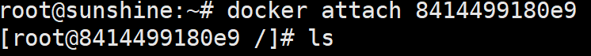


```
docker exec -it 031924a7c4db /bin/bash  #这个是进tomcat的目录 
docker exec -t 8414499180e9 ls -l /tmp 这种方式也可以 

```

只是这种方式事实上并没有进入

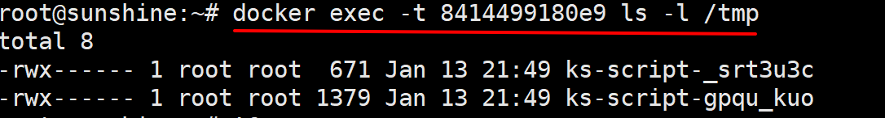

类似于隔山打牛的操作，操作完并没有停留在docker的centos中，而是在外边


###### 将容器内文件拷贝到主机上

```shell
docker cp  容器ID:容器内路径 目的主机路径
docker cp 容器ID:/tmp/yml.log /root 将容器中tmp下的文件拷贝到 /root目录下
事实上，yml.log好像是centos下的文件，Ubuntu下面是没有的。

//比如将nacos中sql文件拷到宿主机根目录
docker cp nacos:/home/nacos/conf/schema.sql /
//容器内路径是什么，还是需要进容器里面看一下。pwd命令

```


这个图很秀

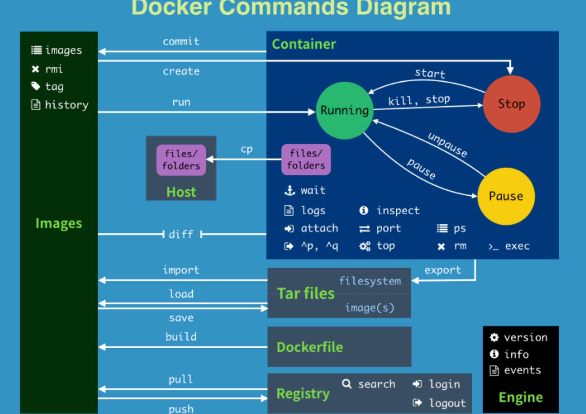

help里面的全部命令：

attach    Attach to a running container                 # 当前 shell 下 attach 连接指定运行镜像

build     Build an image from a Dockerfile              # 通过 Dockerfile 定制镜像

commit    Create a new image from a container changes   # 提交当前容器为新的镜像

cp        Copy files/folders from the containers filesystem to the host path   #从容器中拷贝指定文件或者目录到宿主机中

create    Create a new container                        # 创建一个新的容器，同 run，但不启动容器

diff      Inspect changes on a container's filesystem   # 查看 docker 容器变化

events    Get real time events from the server          # 从 docker 服务获取容器实时事件

exec      Run a command in an existing container        # 在已存在的容器上运行命令

export    Stream the contents of a container as a tar archive   # 导出容器的内容流作为一个 tar 归档文件[对应 import ]

history   Show the history of an image                  # 展示一个镜像形成历史

images    List images                                   # 列出系统当前镜像

import    Create a new filesystem image from the contents of a tarball # 从tar包中的内容创建一个新的文件系统映像[对应export]

info      Display system-wide information               # 显示系统相关信息

inspect   Return low-level information on a container   # 查看容器详细信息

kill      Kill a running container                      # kill 指定 docker 容器

load      Load an image from a tar archive              # 从一个 tar 包中加载一个镜像[对应 save]

login     Register or Login to the docker registry server    # 注册或者登陆一个 docker 源服务器

logout    Log out from a Docker registry server          # 从当前 Docker registry 退出

logs      Fetch the logs of a container                 # 输出当前容器日志信息

port      Lookup the public-facing port which is NAT-ed to PRIVATE_PORT    # 查看映射端口对应的容器内部源端口

pause     Pause all processes within a container        # 暂停容器

ps        List containers                               # 列出容器列表

pull      Pull an image or a repository from the docker registry server   # 从docker镜像源服务器拉取指定镜像或者库镜像

push      Push an image or a repository to the docker registry server    # 推送指定镜像或者库镜像至docker源服务器

restart   Restart a running container                   # 重启运行的容器

rm        Remove one or more containers                 # 移除一个或者多个容器

rmi       Remove one or more images             # 移除一个或多个镜像[无容器使用该镜像才可删除，否则需删除相关容器才可继续或 -f 强制删除]

run       Run a command in a new container              # 创建一个新的容器并运行一个命令

save      Save an image to a tar archive                # 保存一个镜像为一个 tar 包[对应 load]

search    Search for an image on the Docker Hub         # 在 docker hub 中搜索镜像

start     Start a stopped containers                    # 启动容器

stop      Stop a running containers                     # 停止容器

tag       Tag an image into a repository                # 给源中镜像打标签

top       Lookup the running processes of a container   # 查看容器中运行的进程信息

unpause   Unpause a paused container                    # 取消暂停容器

version   Show the docker version information           # 查看 docker 版本号

wait      Block until a container stops, then print its exit code   # 截取容器停止时的退出状态值


#### 为什么装完的tomcat很大？

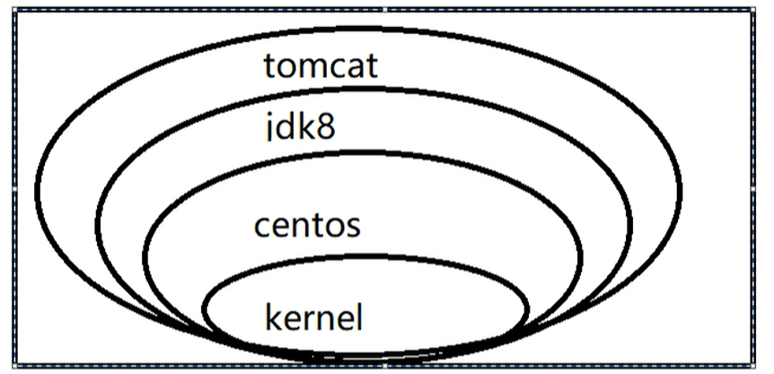

而且开始下载的镜像很大，他需要下载基本的一些base层的一些东西，后续下载其他的会越来越快，因为base层是共用的。


### docker镜像

#### docker启动tomcat

```
docker run -it -p 8888:8080 tomcat #8888是docker对外开放的端口  小写p的意思是指定端口

```

启动以后当然还需要在阿里云安全组里面开放8888端口。


然后笔记本登录浏览器发现404，页面显示

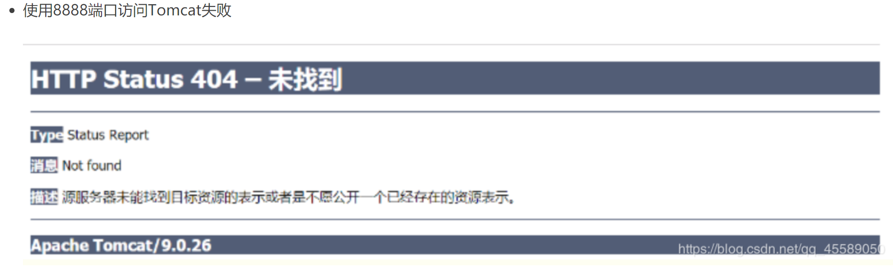

docker ps 显示 tomcat正在运行。那说明tomcat里面的webapps里面没东西。


进去正在运行的tomcat，看

```
docker exec -it 90a368628b84 /bin/bash
cd webapps

```

发现里面真的没有东西。所以才访问不到。


下一步要做的就是在webapps里面放上可以访问的页面。

```shell
root@90a368628b84:/usr/local/tomcat#  #这表示的是在虚拟机中
cp -r webapps.dist/. webapps 后面的是命令

```

意思是将webapps.dist下面所有的文件，全部复制到 webapps下面 


重启或者不重启，然后就可以访问啦。

参考：https://blog.csdn.net/qq_45589050/article/details/104559125


记录下激动人心的一刻：

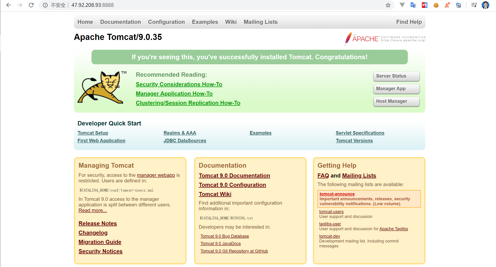


 随机分配端口  大写P

```
docker run -it -P tomcat  

```


#### docker镜像重新commit使他成为一个新的镜像

```shell
docker commit -m="without docs" -a="steve" 031924a7c4db sunshine/tomcat:1.2
              #提交的描述信息		作者   原来的tomcat镜像id  新镜像名：标签号

```

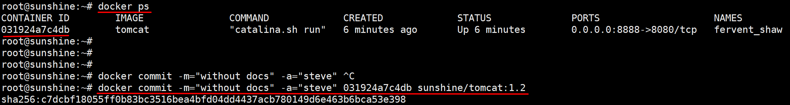


重新run

```shell
docker run -it -p 8888:8080 sunshine/tomcat:1.2 

```

就可以启动新打包的镜像，然后可以访问，美滋滋。


#### 在docker中运行多个tomcat

给他们分配不同的端口，这里分配两个就好

```shell
docker run -it -p 8888:8080 tomcat   第一个tomcat
docker run -it -p 8887:8080 tomcat   第二个tomcat

```

这时候有两个tomcat：

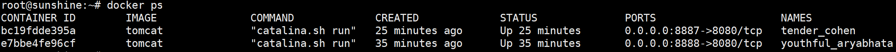


开放阿里云安全组端口：8884-8888端口都开放

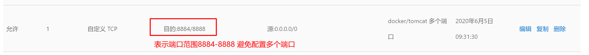


然后测试：

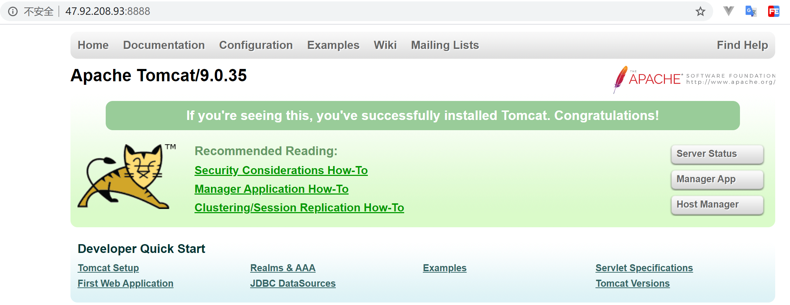

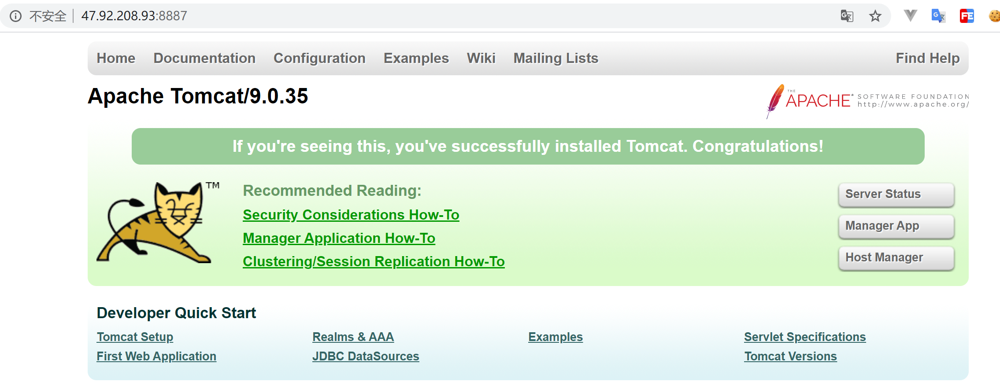

都是可以访问的，留下激动的泪水。	


这里有一个需要注意的：

使用高级命令里面的启动守护式命令：

```shell
docker run -d -p 8886:8080 tomcat

```

这种启动方式真好。安安静静的做一个美男子！真香。

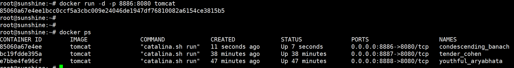


### docker容器数据卷

类似于redis中的快照，将数据持久化。


#### 数据卷

##### 直接添加数据卷

```shell
docker run -it -v /home/docker/myDateVolume:/home/docker/dataVolumeContainer centos
docker run -it -v /宿主机绝对路径目录:/容器内目录  镜像名   （注意：的左右是没有空格的）

```


测试宿主机和docker里面centos容器文件是否互通？

实际操作结果：

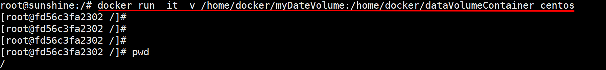

操作完以后再宿主机对应文件夹下创建文件1.txt并编辑，写上文件suzhuji，然后再centos容器里面对应文件夹下也可以看到想应的文件1.txt，打开发现里面有suzhuji几个字。

然后再在centos里面对应文件夹下1.txt下写centos，然后退出centos镜像，在宿主机文件夹下查看文件1.txt，发现里面有

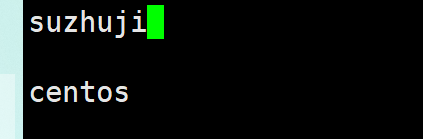

所以现在宿主机和centos镜像文件是一样的啦。


测试关掉centos容器，修改宿主机的文件，再次启动原来的centos容器。会不会重新加载原来的1.txt文件。

测试结果：

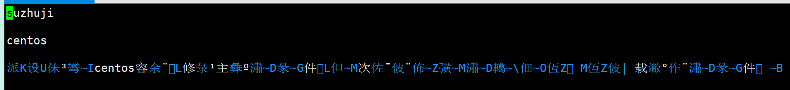

测试结果是centos容器里面可以再次加载1.txt文件的，只是在宿主机写的中文 在这里变成了乱码。


###### 命令 带权限添加

```
 docker run -it -v /宿主机绝对路径目录:/容器内目录:ro 镜像名
 docker run -it -v /home/docker/myDateVolume:/home/docker/dataVolumeContainer:ro centos
 
 #后面的ro是readonly 只读操作权限

```

加了只读权限以后 就不能再容器里面的文件夹下重新新建文件啦

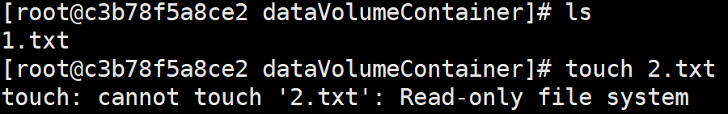

但是能不能编辑1.txt呢？

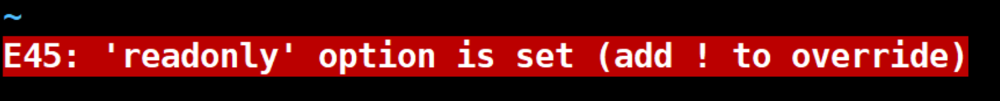

正常是不能操作的，但是加了！还是可以强制修改的。

加了权限以后，docker inspect以后，看json串，可以看到里面的权限是ro, readonly

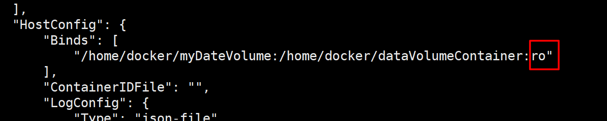


##### DockerFile添加 运行

```shell
cd /home/docker

vim Dockerfile

#将下面文件写到Dockfile文件中

# volume test
FROM centos
VOLUME ["/dataVolumeContainer1","/dataVolumeContainer2"]
CMD echo "finished,--------success1"
CMD /bin/bash

#然后运行 注意后面有一个点 .
docker build -f /home/docker/Dockerfile -t sunshine/centos .


```

实际操作：

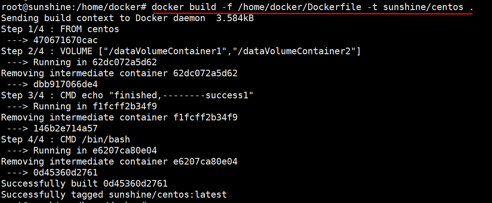


然后运行这个镜像

```
docker run -it sunshine/centos

```

进去以后在根目录看到开始创建的这两个文件夹 

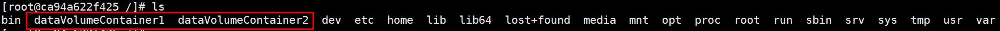

这两个文件夹是容器里面的数据卷。

那么宿主机上面的文件是那个呢？

可以通过

```
docker inspect ca94a622f425 来查询

```

```
[
    {
        "Id": "ca94a622f425e85e20bcf7ef665c6977788ca9a19838d9561597c34e932f6e65",
        "Created": "2020-06-05T06:49:59.294637708Z",
        "Path": "/bin/sh",
        "Args": [
            "-c",
            "/bin/bash"
        ],
        "State": {
            "Status": "running",
            "Running": true,
            "Paused": false,
            "Restarting": false,
            "OOMKilled": false,
            "Dead": false,
            "Pid": 19198,
            "ExitCode": 0,
            "Error": "",
            "StartedAt": "2020-06-05T06:50:02.267084641Z",
            "FinishedAt": "0001-01-01T00:00:00Z"
        },
        "Image": "sha256:0d45360d2761252ea72b28970c5bf513d741c07e4059ff7539b29f43cc1439f0",
        "ResolvConfPath": "/var/lib/docker/containers/ca94a622f425e85e20bcf7ef665c6977788ca9a19838d9561597c34e932f6e65/resolv.conf",
        "HostnamePath": "/var/lib/docker/containers/ca94a622f425e85e20bcf7ef665c6977788ca9a19838d9561597c34e932f6e65/hostname",
        "HostsPath": "/var/lib/docker/containers/ca94a622f425e85e20bcf7ef665c6977788ca9a19838d9561597c34e932f6e65/hosts",
        "LogPath": "/var/lib/docker/containers/ca94a622f425e85e20bcf7ef665c6977788ca9a19838d9561597c34e932f6e65/ca94a622f425e85e20bcf7ef665c6977788ca9a19838d9561597c34e932f6e65-json.log",
        "Name": "/hungry_dhawan",
        "RestartCount": 0,
        "Driver": "overlay2",
        "Platform": "linux",
        "MountLabel": "",
        "ProcessLabel": "",
        "AppArmorProfile": "docker-default",
        "ExecIDs": [
            "7d0d24c91ef096fef8fc9e9ba56d15667bda60c10e4a963734cf76094e9b8367",
            "0d3869221c8ca740be4d62e5bf275995c034e017cb492ae1eb5e5ad1e3d8e230"
        ],
        "HostConfig": {
            "Binds": null,
            "ContainerIDFile": "",
            "LogConfig": {
                "Type": "json-file",
                "Config": {}
            },
            "NetworkMode": "default",
            "PortBindings": {},
            "RestartPolicy": {
                "Name": "no",
                "MaximumRetryCount": 0
            },
            "AutoRemove": false,
            "VolumeDriver": "",
            "VolumesFrom": null,
            "CapAdd": null,
            "CapDrop": null,
            "Capabilities": null,
            "Dns": [],
            "DnsOptions": [],
            "DnsSearch": [],
            "ExtraHosts": null,
            "GroupAdd": null,
            "IpcMode": "private",
            "Cgroup": "",
            "Links": null,
            "OomScoreAdj": 0,
            "PidMode": "",
            "Privileged": false,
            "PublishAllPorts": false,
            "ReadonlyRootfs": false,
            "SecurityOpt": null,
            "UTSMode": "",
            "UsernsMode": "",
            "ShmSize": 67108864,
            "Runtime": "runc",
            "ConsoleSize": [
                0,
                0
            ],
            "Isolation": "",
            "CpuShares": 0,
            "Memory": 0,
            "NanoCpus": 0,
            "CgroupParent": "",
            "BlkioWeight": 0,
            "BlkioWeightDevice": [],
            "BlkioDeviceReadBps": null,
            "BlkioDeviceWriteBps": null,
            "BlkioDeviceReadIOps": null,
            "BlkioDeviceWriteIOps": null,
            "CpuPeriod": 0,
            "CpuQuota": 0,
            "CpuRealtimePeriod": 0,
            "CpuRealtimeRuntime": 0,
            "CpusetCpus": "",
            "CpusetMems": "",
            "Devices": [],
            "DeviceCgroupRules": null,
            "DeviceRequests": null,
            "KernelMemory": 0,
            "KernelMemoryTCP": 0,
            "MemoryReservation": 0,
            "MemorySwap": 0,
            "MemorySwappiness": null,
            "OomKillDisable": false,
            "PidsLimit": null,
            "Ulimits": null,
            "CpuCount": 0,
            "CpuPercent": 0,
            "IOMaximumIOps": 0,
            "IOMaximumBandwidth": 0,
            "MaskedPaths": [
                "/proc/asound",
                "/proc/acpi",
                "/proc/kcore",
                "/proc/keys",
                "/proc/latency_stats",
                "/proc/timer_list",
                "/proc/timer_stats",
                "/proc/sched_debug",
                "/proc/scsi",
                "/sys/firmware"
            ],
            "ReadonlyPaths": [
                "/proc/bus",
                "/proc/fs",
                "/proc/irq",
                "/proc/sys",
                "/proc/sysrq-trigger"
            ]
        },
        "GraphDriver": {
            "Data": {
                "LowerDir": "/var/lib/docker/overlay2/94e8f564c72c6eff5b4ef3dc7fcedd54e158f65485ea85efaa402d6e6ae03054-init/diff:/var/lib/docker/overlay2/878c448d416b98c84747a7fe0e9d142d6c0547bffee5b8f920d6926d606011a7/diff",
                "MergedDir": "/var/lib/docker/overlay2/94e8f564c72c6eff5b4ef3dc7fcedd54e158f65485ea85efaa402d6e6ae03054/merged",
                "UpperDir": "/var/lib/docker/overlay2/94e8f564c72c6eff5b4ef3dc7fcedd54e158f65485ea85efaa402d6e6ae03054/diff",
                "WorkDir": "/var/lib/docker/overlay2/94e8f564c72c6eff5b4ef3dc7fcedd54e158f65485ea85efaa402d6e6ae03054/work"
            },
            "Name": "overlay2"
        },
        "Mounts": [
            {
                "Type": "volume",
                "Name": "11d449b44b9fde9ba3fb4c4ab1718857ad8e6240968e350d194ff2f192335673",
                "Source": "/var/lib/docker/volumes/11d449b44b9fde9ba3fb4c4ab1718857ad8e6240968e350d194ff2f192335673/_data",
                "Destination": "/dataVolumeContainer1",
                "Driver": "local",
                "Mode": "",
                "RW": true,
                "Propagation": ""
            },
            {
                "Type": "volume",
                "Name": "593f0a560864115a8690e2942d186f2a0a1309f8ceaacfcd46bdb5d11ae5d33e",
                "Source": "/var/lib/docker/volumes/593f0a560864115a8690e2942d186f2a0a1309f8ceaacfcd46bdb5d11ae5d33e/_data",
                "Destination": "/dataVolumeContainer2",
                "Driver": "local",
                "Mode": "",
                "RW": true,
                "Propagation": ""
            }
        ],
        "Config": {
            "Hostname": "ca94a622f425",
            "Domainname": "",
            "User": "",
            "AttachStdin": true,
            "AttachStdout": true,
            "AttachStderr": true,
            "Tty": true,
            "OpenStdin": true,
            "StdinOnce": true,
            "Env": [
                "PATH=/usr/local/sbin:/usr/local/bin:/usr/sbin:/usr/bin:/sbin:/bin"
            ],
            "Cmd": [
                "/bin/sh",
                "-c",
                "/bin/bash"
            ],
            "Image": "sunshine/centos",
            "Volumes": {
                "/dataVolumeContainer1": {},
                "/dataVolumeContainer2": {}
            },
            "WorkingDir": "",
            "Entrypoint": null,
            "OnBuild": null,
            "Labels": {
                "org.label-schema.build-date": "20200114",
                "org.label-schema.license": "GPLv2",
                "org.label-schema.name": "CentOS Base Image",
                "org.label-schema.schema-version": "1.0",
                "org.label-schema.vendor": "CentOS",
                "org.opencontainers.image.created": "2020-01-14 00:00:00-08:00",
                "org.opencontainers.image.licenses": "GPL-2.0-only",
                "org.opencontainers.image.title": "CentOS Base Image",
                "org.opencontainers.image.vendor": "CentOS"
            }
        },
        "NetworkSettings": {
            "Bridge": "",
            "SandboxID": "f40e82249e5d75644e19cda14843b73c3ac3a056564dbfd40252cd85f10f4c47",
            "HairpinMode": false,
            "LinkLocalIPv6Address": "",
            "LinkLocalIPv6PrefixLen": 0,
            "Ports": {},
            "SandboxKey": "/var/run/docker/netns/f40e82249e5d",
            "SecondaryIPAddresses": null,
            "SecondaryIPv6Addresses": null,
            "EndpointID": "09b26d8b80e92bbcd808a6f64ea53f95efd849a4230ceaee3cdfcbffce7121f4",
            "Gateway": "172.17.0.1",
            "GlobalIPv6Address": "",
            "GlobalIPv6PrefixLen": 0,
            "IPAddress": "172.17.0.5",
            "IPPrefixLen": 16,
            "IPv6Gateway": "",
            "MacAddress": "02:42:ac:11:00:05",
            "Networks": {
                "bridge": {
                    "IPAMConfig": null,
                    "Links": null,
                    "Aliases": null,
                    "NetworkID": "5c68d397ff8ac11416d1652c68d0ecb9fb72b9bfc31b27c5599887e57da42d13",
                    "EndpointID": "09b26d8b80e92bbcd808a6f64ea53f95efd849a4230ceaee3cdfcbffce7121f4",
                    "Gateway": "172.17.0.1",
                    "IPAddress": "172.17.0.5",
                    "IPPrefixLen": 16,
                    "IPv6Gateway": "",
                    "GlobalIPv6Address": "",
                    "GlobalIPv6PrefixLen": 0,
                    "MacAddress": "02:42:ac:11:00:05",
                    "DriverOpts": null
                }
            }
        }
    }
]


```

在Mount中：就是在宿主机上对应的文件夹

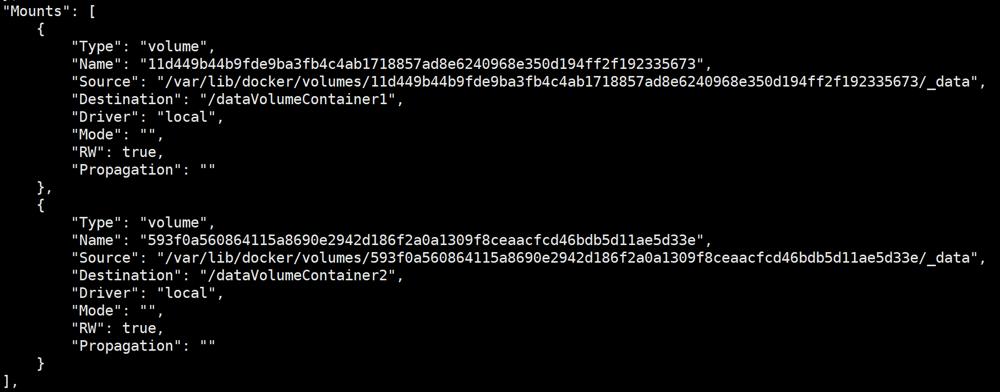


#### 数据卷容器


## Docker Install Software

### RabbitMQ

```shell
docker pull rabbitmq:3-management
docker images
docker run --name rabbitmq -p 15672:15672 -p 5672:5672 容器id

docker ps -a //查看所有的docker容器
docker start rabbitmq //启动容器

```


### Nginx

```
docker search nginx
docker pull nginx
docker ps
docker run --name nginx -p 8091:80 -d nginx

docker exec -it c03f449b206e /bin/bash

```

阿里云上面部署的第一个节点，是8091端口映射到nginx80端口。


**nginx容器进去里面，没有vim，需要：**

解决办法：apt-get  update  完成之后 apt-get install vim


### Mysql5.7

```
docker pull mysql:5.7
docker images
docker run --name mysql5.7 -p 3307:3306 -e MYSQL_ROOT_PASSWORD=123456 -d mysql:5.7

//如果某一个容器有问题 
docker rm 容器名
docker ps

```


### Nacos

```shell
docker pull nacos/nacos-server
docker images

//-env MODE=standalone 设置启动方式为单机模式
//--name 容器名称
//-p 端口映射为 8848
//nacos/nacos-server:1.0.0 本地镜像
docker run --env MODE=standalone --name nacos -d -p 8848:8848 nacos/nacos-server


//利用原来的nacos镜像 再开启两个容器，端口分配不一样
docker run  --env MODE=standalone --name nacos2 -d -p 8849:8848 nacos/nacos-server
docker run  --env MODE=standalone --name nacos3 -d -p 8850:8848 nacos/nacos-server


```

一定注意：首页 47.92.208.93:8848/nacos/index.html#/，直接Ip+端口是访问不了的。


### Oracle

```shell
docker pull rohitbasu77/oracle11g:latest
docker run -d --name oracle11g -p 40022:22 -p 41521:1521 -p 48080:8080 rohitbasu77/oracle11g:latest
# 注意在阿里云需要开放的端口是41521

    docker exec -it f54be5debb81 /bin/bash #进入容器
```


公司用的Oracle11g，所以在Docker里面装了个11g。

经过多次尝试，发现这个是可以用的11g

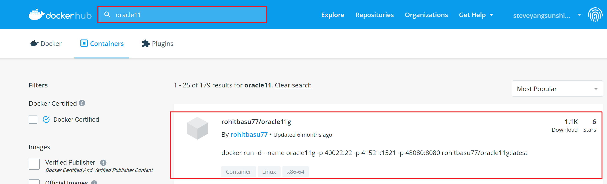


端口用41521就行，用navicat连接，也是用这个端口。

但是如果直接连接发现连接不上。

参考:https://blog.csdn.net/jdk_wangtaida/article/details/93172849?utm_medium=distribute.pc_relevant.none-task-blog-BlogCommendFromMachineLearnPai2-3.nonecase&depth_1-utm_source=distribute.pc_relevant.none-task-blog-BlogCommendFromMachineLearnPai2-3.nonecase


意思就是找这个文件，看这个名字，发现现在安装的这个名字是XE，所以用Navicat连接数据库的时候，需要写XE，不然连不上。

```shel
cd /u01/app/oracle/product/11.2.0/xe/network/admin#
```

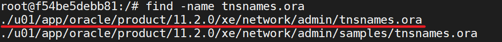

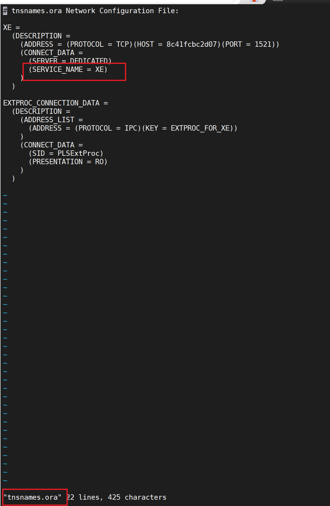


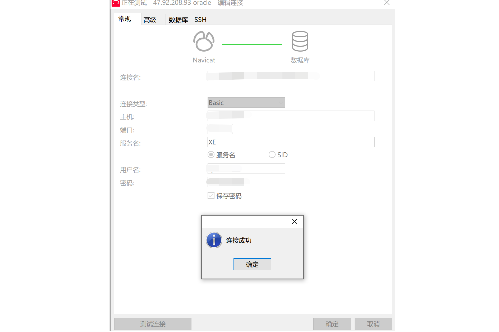


真是学无止境，加油。每个知识都很细节的。


### PostgreSql

参考：https://www.cnblogs.com/mingfan/p/11863509.html

#### 1、拉取postgresql镜像

```
docker pull postgresql
```

#### 2、创建本地卷，数据卷可以在容器之间共享和重用， 默认会一直存在，即使容器被删除（`docker volume inspect `pgdata可查看数据卷的本地位置）

```
docker volume create pgdata
```

#### 3、启动容器 

这里密码就是password，开放端口是5432

```
docker run --name postgres2 -e POSTGRES_PASSWORD=password -p 5432:5432 -v pgdata:/var/lib/postgresql/data -d postgres
```

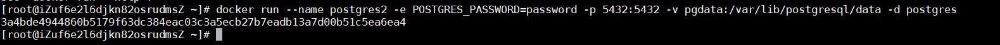

####  4、进入postgres容器执行sql

```
docker exec -it postgres2 bash
psql -h localhost -p 5432 -U postgres --password
```

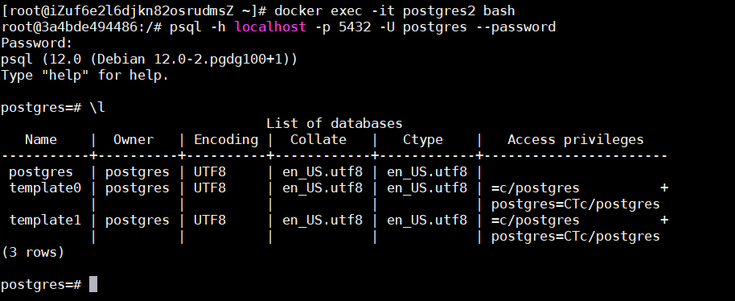

至此，postgresql安装成功。

但行好事，莫问前程 。