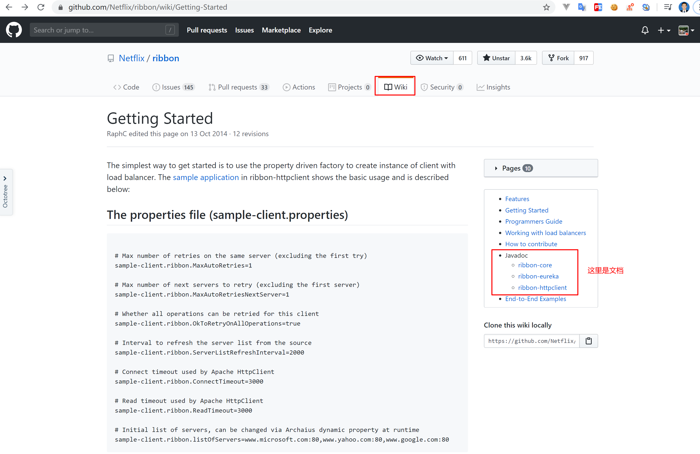
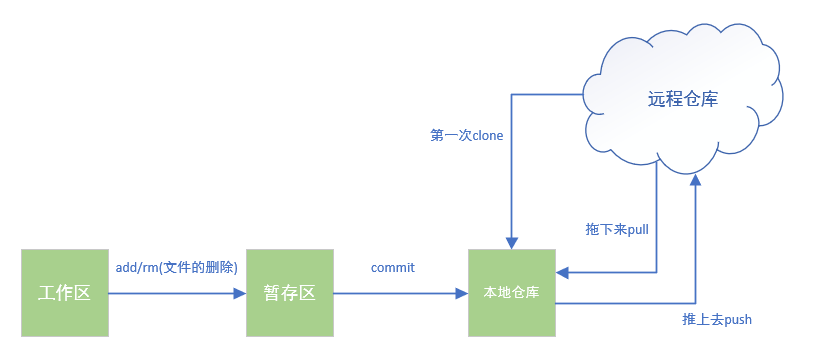
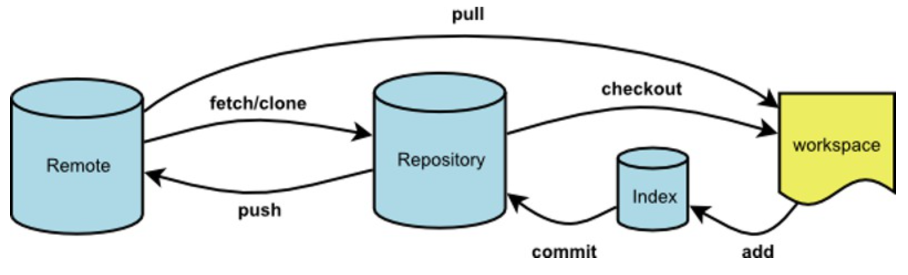
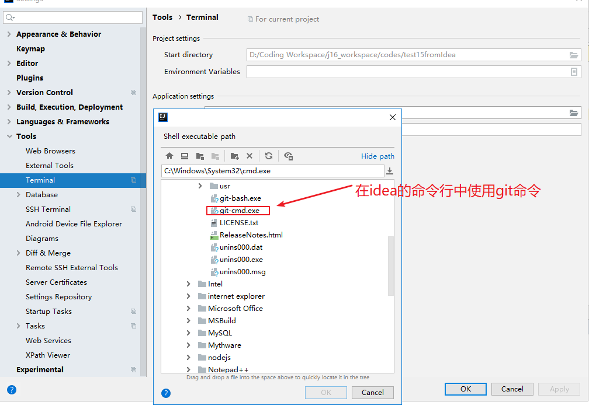

# Git

## 目录

[TOC]

版本控制，可以避免团队协作项目时，好多问题的出现!


> 大多数是自己总结的笔记
>
> 菜鸟笔记：https://www.runoob.com/git/git-branch.html

## Github 

### 如何看开源项目

https://github.com/Netflix/ribbon/wiki/Getting-Started

比如这个spring-cloud里面的 负载均衡ribbon




点开右边的文档，可以进去看到具体的文档。


### 修改自己github用户名和账号

Setting->Account


### 在Github上面搜索内容

GitHub，不用过多介绍。一个面向开源及私有软件项目的托管平台，因为只支持 git 作为唯一的版本库格式进行托管，故名 GitHub。

作为「全球最大的程序员“交友”社区」，程序员的你，真的可以把它的使用发挥到极致吗？

#### 搜索

##### 全局搜索

###### 傻瓜式搜索

比如我们要学习下秒杀（seckill）代码的实现，可以在整个 GitHub 站点全局搜索相关内容


但是这样的搜索范围太大，且项目质量参差不齐，所以在搜索结果页，还可以通过 Languages 选择实现语言，Sort 选择排序规则（按 Star 数量、Fork 数量、最近更新时间等）。

###### 精准搜索（技术范）


###### 1. 关键词限制搜索范围

公式：`搜索词 in:name(/description/readme)`

搜索项目名称和自述文件中包含秒杀的仓库   **seckill in:name,readme**

| 限定符            | 示例                                                         |
| :---------------- | :----------------------------------------------------------- |
| `in:name`         | **jquery in:name** 匹配仓库名称包含 "jquery" 的内容          |
| `in:description`  | **jquery in:name,description** 匹配仓库名或描述中包含 "jquery" 的内容(组合使用) |
| `in:readme`       | **jquery in:readme** readme文件中包含"jquery"                |
| `repo:owner/name` | **repo:octocat/hello-world** 查询某人的某个项目（查octocat 的 hello-world 仓库） |


###### 2.关键词查找

**搜索语法**：

- `>n`、`>=n`、`<n`、`<=n`：查询数量范围，可以是 starts、forks、topics......
- `n..*`、`*..n`：等同于 `>=n` 和 `<=n`
- `n..m`：取值范围 n 到 m

| **限定符**           | **示例**                                                     |
| :------------------- | :----------------------------------------------------------- |
| `stars:n`            | **stars:500** 匹配 500 个 stars 的项目 **stars:10..20** 匹配 starts 数量 10 到 20 的项目 |
| `followers:n`        | **node followers:>=10000** 匹配关注者大于等于 10000 的 node 仓库 |
| `forks:n`            | **seckill forks:5**  匹配有 5 个 forks 的秒杀项目            |
| `created:YYYY-MM-DD` | **seckill created:>2020-01-01** 创建时间在 2020-01-01 之后的秒杀项目 |
| `language:LANGUAGE`  | **seckill language:java** 匹配 java 语言编写的秒杀项目       |
| `user:name`          | **user:Jstarfish stars:>50** 匹配 Jstarfish 用户 stars 数大于 50 的仓库 |
| `location:LOCATION`  | **location:beijing** 匹配北京的朋友们                        |
| 互相组合使用         | **seckill stars:>=500 fork:true language:java** 匹配stars 数量大等于 500（包含 forks 数），且语言是 java 的秒杀项目 **location:beijing language:java** 北京做 Java 开发的大佬 |

比如搜索自己的：`javainterview stars:>30`


###### 3. awesome 加强搜索

```
awesome 关键字` ，awesome 系列，一般是用来收集学习，工具，书籍类相关的项目。比如我们要学习下 redis 相关的项目，包括框架、教程等，`awesome redis
```


这几个其实也够用了，官方还给出了所有你能想得到的搜索方式：

https://help.github.com/en/github/searching-for-information-on-github/searching-on-github


##### 项目内搜索

- 在项目页 输入小写 t
- github 快捷键 https://help.github.com/en/github/getting-started-with-github/keyboard-shortcuts


###### 文件搜索

进入仓库主页面，有个 **Find file**，可以按文件名搜索


#### 快捷键

- `s` 或 `/`    定位到搜索框
- g + 操作，表示跳转
- - `g d` 前往我的主页
  - `g n` 前往通知面板 About notifications
  - `g c` 前往代码界面 Code tab（以下均在仓库页面）
  - `g i` 前往问题界面 About issues
  - `g w` 前往 About Wike
- `t`  激活文件查找，和 Find file 一样
- `w`  切换分支
- `l` 浏览代码时，快速跳转到指定行

官方提供：https://help.github.com/en/github/getting-started-with-github/keyboard-shortcuts


#### 高亮显示代码

有时候我们要请教大佬，让大佬帮忙看看代码，可以使用高亮功能，在 GitHub 或 GitLab 中找到自己的代码，url 地址后加 `#L 数字` 表示高亮第几行，加 `#L 数字 -L数字` ，表示高亮代码区间（GitLab 上不需要第二个 L）


#### 查看 GitHub 热门趋势

https://github.com/trending  可以按语言，日期范围（本天、本周、本月）查看热度，有好多可供学习的热门项目。


#### 插件

最后再推荐一个查看 GitHub 代码的浏览器插件。

**octotree** 用于将 Github 项目代码以树形格式展示，可以像 IDE 一样，看代码。而且在展示的列表中，我们可以下载指定的文件，而不需要下载整个项目。


### 修改GitHub仓库语言

参考：https://blog.csdn.net/HaleyLiu123/article/details/76790658?utm_medium=distribute.pc_relevant.none-task-blog-BlogCommendFromMachineLearnPai2-2.control&depth_1-utm_source=distribute.pc_relevant.none-task-blog-BlogCommendFromMachineLearnPai2-2.control


## Git命令




### git init(初始化仓库)

```bash
# 初始化仓库
# JavaDemo是仓库名，初始化成功以后会出现一个文件夹JavaDemo
git init -bare JavaDemo

#当前文件夹作为git版本库
git init
```


### git clone 远程仓库地址

```bash
#从远程仓库拉取一个仓库下来作为本地仓库

#是最常用获取远程仓库的方式
git clone https://github.com/HappySnailSunshine/JavaInterview.git
```


### git status

```bash
#查看工作区修改了那些文件，还没有提交，或者新增了什么文件，还没有提交
git status 
```


### git add 文件名

```bash
#将工作区的文件提交到暂存区
#提价单个文件
git add demo.java

#提交当前文件夹下的全部文件
git add . 

#提交某个文件夹下的所有文件
git add src/*

#可以通过git status查看代码提交到暂存区的状态
```


### git commit –m “消息”

```bash
#将文件从暂存区提交到本地仓库
git commit –m “消息”
```


### git push

```bash
#将本地仓库的修改提交到远程仓库
#在实际工作中，如果多人协同开发，在git push 之前需要先git pull将最新的代码拉下来，如果有冲突就需要处理一下
git push
```


### git pull

```bash
#从远程仓库拉取最新的更新
git pull
```


### git fetch 

```bash
# 拉取远程仓库dev分支代码到 本地仓库
git fetch origin dev
```




`git fetch`是将远程主机的最新内容拉到本地，用户在检查了以后决定是否合并到工作本机分支中。

而`git pull` 则是将远程主机的最新内容拉下来后直接合并，即：`git pull = git fetch + git merge`，这样可能会产生冲突，需要手动解决。

参考：https://www.cnblogs.com/runnerjack/p/9342362.html


### git Config

需要配置邮箱和用户名

在第一次commit之前

1. 通过命令修改 git config –global user.name(email) 值
2. 修改user目录下的.gitconfig文件


### git log

提交日志

包含版本号 提交用户信息 和提交的message


### git reset（谨慎操作）

```bash
#git reset --hard 版本号（相较于下面两个更常用）

git reset --hard aa516174 

#回退一个版本
git reset –hard HEAD\^ 

#回退n个版本
git reset –hard HEAD\~n 
```


### git rm 删除

```bash
#将文件从暂存区和工作区中删除：
git rm <file>

#以下实例从暂存区和工作区中删除 runoob.txt 文件：
git rm runoob.txt 

#如果删除之前修改过并且已经放到暂存区域的话，则必须要用强制删除选项 -f。
#强行从暂存区和工作区中删除修改后的 runoob.txt 文件：
git rm -f runoob.txt 

#如果想把文件从暂存区域移除，但仍然希望保留在当前工作目录中，换句话说，仅是从跟踪清单中删除，使用 --cached 选项即可：
git rm --cached <file>

#以下实例从暂存区中删除 runoob.txt 文件：
git rm --cached runoob.txt

```

参考：https://www.runoob.com/git/git-rm.html


**如果想要删除已经提交到本地仓库的代码怎么弄？（即git commit 以后的代码）**

```bash
#只能强制回退  参考下面记一次事故
```


### 分支

```bash
#查看分支
git branch -a 

#切换分支
git checkout 分支名

#创建新分支
git checkout –b 分支名

#分支的合并
#比如说我们现在做的是dev要合并到master上，具体看下面实操

#首先切换到master分支上
#再在master上合并dev，git merge dev
#最后（解决冲突）提交git push
```


实操：在新的分支上面开一个分支

```bash
1.先克隆一个项目
git clone

2.再转移到分支中
$ git status
位于分支 master
您的分支与上游分支 'origin/master' 一致。
无文件要提交，干净的工作区

$ git checkout dev 
分支 dev 设置为跟踪来自 origin 的远程分支 dev。
切换到一个新分支 'dev'

3.再拉取最新的代码
git pull origin dev

4.再创建新的分支
git checkout -b dev-timeout
这个时候，分支的代码就是基于dev这个分支的

5.将分支推送到线上
$ git push origin dev-timeout 
(上次在分支操作，没有进行这一步，结果始终没有提交到gitlab上面，这里单纯git push 不行)
```

参考：https://www.cnblogs.com/hahajava/p/10318756.html


### git版本更新

#### 1.先查看当前安装的git版本

```bash
git --version
```

#### 2.更新

git版本是2.17.1之前的，使用

```
git update
```

git版本是2.17.1之后的，使用

```
git update-git-for-windows
```

#### 3.版本是2.14.1的，会报错

**git: 'update' is not a git command**

**git: 'update-git-for-windows' is not a git command**

解决方法：重新下载新版本安装包，覆盖安装即可

#### 4.镜像下载

git官网下载：https://git-scm.com/download/win  （特别慢！！）

git安装包 阿里镜像，下载速度超快。

网址：https://npm.taobao.org/mirrors/git-for-windows/


## 记一次事故：

公司代码有些比较老，也有很多没有的代码，我自己没事干，删了一些。

结果同导致同事代码跑不起来啦。

这时候需要代码回退。

```bash
#第一步 提交日志 可以上下翻页来看
git log 

#第二步 复制对应的版本号
#第三步 强制回退到对应版本 （注意：如果本地有修改代码，这里会覆盖，有必要的话提前保存一下）
git reset --hard 9897c32a759ecdc802f6160ff33fb9c91134062d

#第四步 然后提交，这个提交会覆盖回退的那些代码，就是说，后面提交的代码全部都没有啦
git push --force-with-lease origin master 

git push --force-with-lease #<远程主机名> <本地分支名>:<远程分支名> 完整的命令是这个样子的

git push --force-with-lease  origin  luquan-nacos  #比如回退到luquan-nacos分支就要这么写

#回退完了以后，查看日志
git log
```


参考：https://blog.csdn.net/WPwalter/article/details/80371264  

https://blog.csdn.net/asoar/article/details/84111841?utm_medium=distribute.pc_relevant.none-task-blog-BlogCommendFromMachineLearnPai2-1.nonecase&depth_1-utm_source=distribute.pc_relevant.none-task-blog-BlogCommendFromMachineLearnPai2-1.nonecase


## 冲突解决

多个用户维护同一部分的代码时发生冲突。

发生冲突时，首先拉取冲突下来git pull

手动解决冲突（修改代码）

重新执行代码提交流程（add → commit → push）


## 文件忽略的配置

```bash
# .gitignore文件内容
target/    #文件夹
.idea/   
.gitinore  #文件
*.iml      #文件

HELP.md
/target/
!.mvn/wrapper/maven-wrapper.jar

### STS ###
.apt_generated
.classpath
.factorypath
.project
.settings
.springBeans
.sts4-cache

### IntelliJ IDEA ###
.idea
*.iws
*.iml
*.ipr

### NetBeans ###
/nbproject/private/
/nbbuild/
/dist/
/nbdist/
/.nb-gradle/
/build/
/target/*

### VS Code ###
.vscode/

**/node_modules/**
/project4/**
**/*.log
```


## Idea中配置git的terminal




## 补充

### 快捷键

Shift+insert：粘贴

Ctrl+insert：复制


## github 每次登录需要输入账号密码

- 如果买次提交都需要用户名和密码登录的话，按照如下操作：(意思是讲HTTPS换成SSH 亲测有效)

```shell
 git remote rm origin
 git remote add origin git@github.com:JavaSudyGroup/JavaStudy.git
 git push -u origin master
```

​	参考：https://www.cnblogs.com/lxwphp/p/10702177.html


# Interview

1、Git代码被覆盖了怎么办？

2、用户的特征信息？

3、你们的git的开发模式是怎样的？是怎么管理不同的功能？

4、有两个不同的需求，你们是怎么处理git的？

5、你们团队中如果一个人提交错了，你们后面是怎么处理的

6、代码管理工具是什么？git用过没？你写了三四天代码然后push，冲突，你把别人代码覆盖了怎么解决？回答：回退，问：那你自己代码不要了？

7、删除提交到本地仓库的文件？


