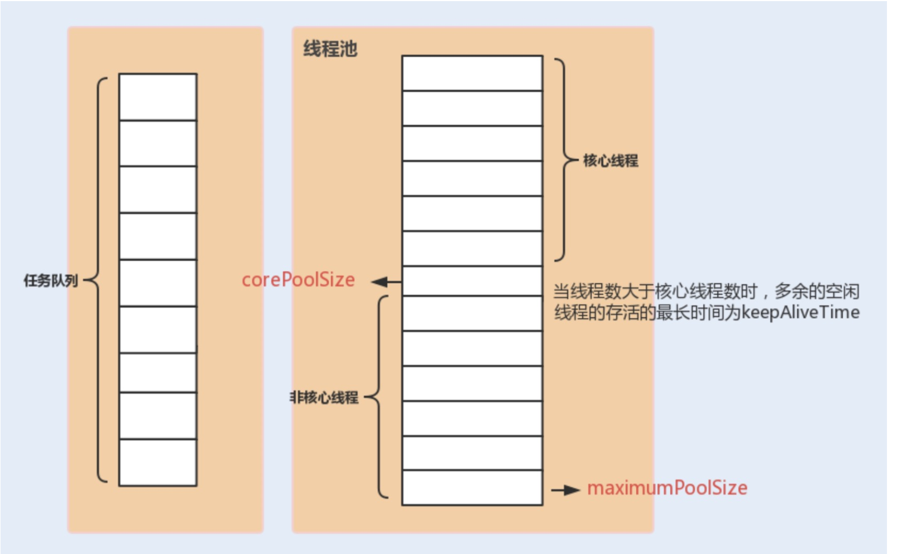
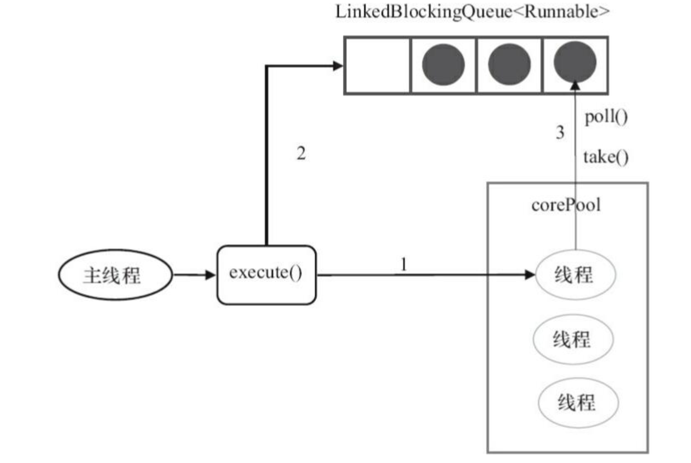
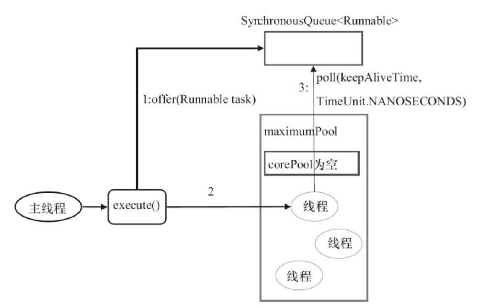
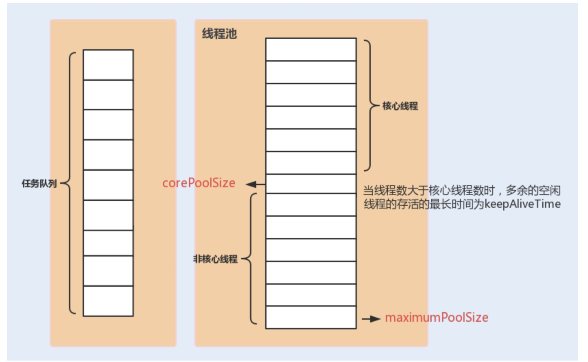
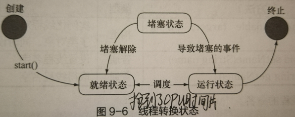
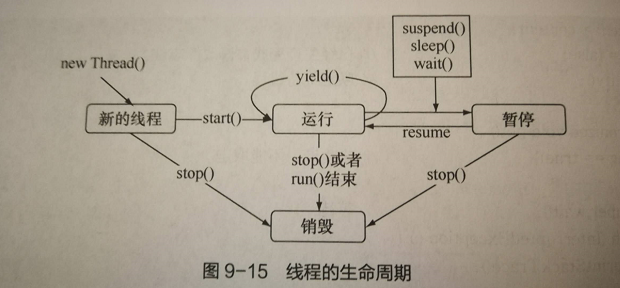

# JUC


## 目录

[TOC]

> 这里大多数问题是自己遇到的，问题答案大多数参考guide哥的文章。

## 并发 多线程


# Interview

## 1.进程和线程的区别

#### 1. 何为进程?

进程是程序的一次执行过程，是系统运行程序的基本单位，因此进程是动态的。系统运行一个程序即是一个进程从创建，运行到消亡的过程。

在 Java 中，当我们启动 main 函数时其实就是启动了一个 JVM 的进程，而 main 函数所在的线程就是这个进程中的一个线程，也称主线程。

如下图所示，在 windows 中通过查看任务管理器的方式，我们就可以清楚看到 window 当前运行的进程（.exe 文件的运行）。


#### 1. 何为线程?

线程与进程相似，但线程是一个比进程更小的执行单位。一个进程在其执行的过程中可以产生多个线程。与进程不同的是同类的多个线程共享进程的**堆**和**方法区**资源，但每个线程有自己的**程序计数器**、**虚拟机栈**和**本地方法栈**，所以系统在产生一个线程，或是在各个线程之间作切换工作时，负担要比进程小得多，也正因为如此，线程也被称为轻量级进程。

## 1.多线程创建的三种方式

#### 多线程的三种创建方式：（这个要会手写）

##### 1）继承Thread类，重写run（）方法

继承thread方法就可以i调用thread类的start方法,start方法调用java natvie start0();
这个是调用操作系统的方法,start方法

```java
public class MyThread extends Thread{
    @Override
    public void run() {
        // System.out.println("线程启动了");
        for (int i = 1; i <= 5; i++) {
            System.out.println(getName() + ": " + i);
        }
    }
}
public class MyThreadDemo {
    public static void main(String[] args) {
       MyThread thread = new MyThread();
        //thread.run();   //只是普通的方法调用(一个方法执行完,然后再执行一个方法),不会启动新线程
        thread.start();
        //thread.start(); // IllegalThreadStateException  线程多次启动，会报错
        //thread.start();
        /*new MyThread().start();
        new MyThread().start();*/

        for (int i = 1; i <= 5; i++) {
            System.out.println(Thread.currentThread().getName() + ":" + i);
        }
    }
}
```

运行结果：

```java
main:1
main:2
main:3
main:4
main:5
Thread-0: 1
Thread-0: 2
Thread-0: 3
Thread-0: 4
Thread-0: 5
```

##### 2）实现Runnable接口，重写run（）方法

```java
public class MyRunnable implements Runnable {
	private int ticket = 30;
	@Override
	public synchronized void run() {
		for (int i = 0; i < 10; i++) { //这里for的意思是，每个线程（窗口），最多可以卖这么多票
			if (this.ticket > 0) {
				System.out.println(Thread.currentThread().getName() + "正在卖票，剩下票数：" + --this.ticket);
			}
		}
	}
}
public class RunnableDemo1 {
    public static void main(String[] args) {
        //创建方式有点和第一种不一样
        Runnable runnable = new MyRunnable();
        Thread thread1 = new Thread(runnable,"窗口1：");  //看API中的构造方法,有一个Thread(Runnable target),将实现了Runnable的对象,可以放进去
        Thread thread2 = new Thread(runnable,"窗口2：");  
        Thread thread3 = new Thread(runnable,"窗口3：");  
        thread1.start();
        thread2.start();
        thread3.start();
    }
}
```

运行结果：

```java
窗口1：正在卖票，剩下票数：29
窗口1：正在卖票，剩下票数：28
窗口1：正在卖票，剩下票数：27
窗口1：正在卖票，剩下票数：26
窗口1：正在卖票，剩下票数：25
窗口1：正在卖票，剩下票数：24
窗口1：正在卖票，剩下票数：23
窗口1：正在卖票，剩下票数：22
窗口1：正在卖票，剩下票数：21
窗口1：正在卖票，剩下票数：20
窗口3：正在卖票，剩下票数：19
窗口3：正在卖票，剩下票数：18
窗口3：正在卖票，剩下票数：17
窗口3：正在卖票，剩下票数：16
窗口3：正在卖票，剩下票数：15
窗口3：正在卖票，剩下票数：14
窗口3：正在卖票，剩下票数：13
窗口3：正在卖票，剩下票数：12
窗口3：正在卖票，剩下票数：11
窗口3：正在卖票，剩下票数：10
窗口2：正在卖票，剩下票数：9
窗口2：正在卖票，剩下票数：8
窗口2：正在卖票，剩下票数：7
窗口2：正在卖票，剩下票数：6
窗口2：正在卖票，剩下票数：5
窗口2：正在卖票，剩下票数：4
窗口2：正在卖票，剩下票数：3
窗口2：正在卖票，剩下票数：2
窗口2：正在卖票，剩下票数：1
窗口2：正在卖票，剩下票数：0
```

thread类是runnable的接口子类,可以有效避免单继承的局限性
runnable接口可以很好的体现数据共享概念
如果继承thread类,那么就可以继承sart方法,runnable接口中,需要构建thread对象调用thread的start方法

##### 3）实现Callable口，重写call方法

```java
public class MyCallable implements Callable {
	private int ticket = 30;
	@Override
	public synchronized Object call() throws Exception {
		for (int i = 0; i < 10; i++) { //这里for循环的意思是，每个线程（窗口），最多可以买这么多票
			if (this.ticket > 0) {
				System.out.println(Thread.currentThread().getName() + ":正在卖票，剩下票数：" + --this.ticket);
			}
		}
		return "票卖完了";
	}
}
public class CallableDemo1 {
    public static void main(String[] args) {
        //创建方式有点和前两种都不一样
        MyCallable callable1 = new MyCallable();
        MyCallable callable2 = new MyCallable();
        MyCallable callable3 = new MyCallable();
        FutureTask<String> task1 = new FutureTask<String>(callable1);
        FutureTask<String> task2 = new FutureTask<String>(callable1);
        FutureTask<String> task3 = new FutureTask<String>(callable1);
        new Thread(task1,"窗口1：").start();
        new Thread(task2,"窗口2：").start();
        new Thread(task3,"窗口3：").start();
        try {
            System.out.println("窗口1返回的结果为：" + task1.get());
            System.out.println("窗口2返回的结果为：" + task2.get());
            System.out.println("窗口3返回的结果为：" + task3.get());
        } catch (InterruptedException e) {
            e.printStackTrace();
        } catch (ExecutionException e) {
            e.printStackTrace();
        }
    }
}
```

注意：**要想返回结果，这里必须要FutureTask实例对象的get（）方法，才可以得到线程返回来的结果。**

运行结果：

```java
窗口1：:正在卖票，剩下票数：29
窗口1：:正在卖票，剩下票数：28
窗口1：:正在卖票，剩下票数：27
窗口1：:正在卖票，剩下票数：26
窗口1：:正在卖票，剩下票数：25
窗口1：:正在卖票，剩下票数：24
窗口1：:正在卖票，剩下票数：23
窗口1：:正在卖票，剩下票数：22
窗口1：:正在卖票，剩下票数：21
窗口1：:正在卖票，剩下票数：20
窗口3：:正在卖票，剩下票数：19
窗口3：:正在卖票，剩下票数：18
窗口1返回的结果为：票卖完了
窗口3：:正在卖票，剩下票数：17
窗口3：:正在卖票，剩下票数：16
窗口3：:正在卖票，剩下票数：15
窗口3：:正在卖票，剩下票数：14
窗口3：:正在卖票，剩下票数：13
窗口3：:正在卖票，剩下票数：12
窗口3：:正在卖票，剩下票数：11
窗口3：:正在卖票，剩下票数：10
窗口2：:正在卖票，剩下票数：9
窗口2：:正在卖票，剩下票数：8
窗口2：:正在卖票，剩下票数：7
窗口2：:正在卖票，剩下票数：6
窗口2：:正在卖票，剩下票数：5
窗口2：:正在卖票，剩下票数：4
窗口2：:正在卖票，剩下票数：3
窗口2：:正在卖票，剩下票数：2
窗口2：:正在卖票，剩下票数：1
窗口2：:正在卖票，剩下票数：0
窗口2返回的结果为：票卖完了
窗口3返回的结果为：票卖完了
```


## 2.说说并发与并行的区别?

- **并发：** 同一时间段，多个任务都在执行 (单位时间内不一定同时执行)；
- **并行：** 单位时间内，多个任务同时执行。

## 3.怎么创建一个带返回参数的线程？或者说如果在主线程内要获取其他线程计算的结果应该怎么做？

带有返回参数的线程，就是上面线程的第三种方式，但是一定要用FrtureTask的实例对象的get（）方法，才可以得到线程的返回参数。


## 4、多线程呢？线程和线程池都用过吗？你们项目用过线程池吗？用的哪个线程池？怎么用的，举个例子？

Executors  读音：[ɪɡˈzekjətər]

#### 线程池的好处：

这里借用《Java 并发编程的艺术》提到的来说一下**使用线程池的好处**：

- **降低资源消耗**。通过重复利用已创建的线程降低线程创建和销毁造成的消耗。
- **提高响应速度**。当任务到达时，任务可以不需要的等到线程创建就能立即执行。
- **提高线程的可管理性**。线程是稀缺资源，如果无限制的创建，不仅会消耗系统资源，还会降低系统的稳定性，使用线程池可以进行统一的分配，调优和监控。


#### 项目中有用到多线程，用到多线程的地方：

**1.用户注册完以后，要绑定手机号或者邮箱** （ UserController里面）

如果绑定成功以后，要修改redis里面数据，还要发请求给理财系统那边，将用户信息补全

```java
ExecutorService executor = Executors.newFixedThreadPool(5);

executor.execute(new Runnable(){ //如果上面修改成功 那么要发送请求修改那边
    @Override
    public void run() {
        String body = "";
        switch (dto.getType()) {
            case BizConst.MOBILE:
                body = "json={\"jsonEntity\":\"{\\\"membersNo\\\":\\\""+user.getAccount()+"\\\",\\\"UserTel\\\":\\\""+dto.getUsername()+"\\\"}\",\"action\":\"edit\",\"keyid\":0}";
                break;
            case BizConst.EMAIL:
                body = "json={\"jsonEntity\":\"{\\\"membersNo\\\":\\\""+user.getAccount()+"\\\",\\\"Email\\\":\\\""+dto.getUsername()+"\\\"}\",\"action\":\"edit\",\"keyid\":0}";
                break;
        }
        //发送请求
        String re = cn.hutool.http.HttpUtil.post("https://api4test.utmz888.com/synHandler.ashx", body );
        JSONObject jsonObject = JSON.parseObject(re); 
        boolean state = jsonObject.getBoolean("Success");
    }
});
```


2.OTC商户 用户点击放款的时候    

购买你币币的人支付以后，一系列完成以后，用线程池里面的，对被购买的人发送短信，邮件，通知他，对方已经放款成功。

```java
ExecutorService pool = Executors.newFixedThreadPool(40);

 pool.submit(()->{
     UserEntity targetUser=userService.getById(targetUserId);
     smsUtils.send(targetUser.getMobile(),"对方已经放款",null,null);
 });
```

同样还有放币以后，也要给购买人发送短信

```java
pool.submit(()->{
	smsUtils.send(targetUser.getMobile(),"对方已经放币",null,null);
});
```

用多线程有一个好处就是，正常业务流程走完以后，启用多线程来发送这些比较没那么重要的请求，这样的话就不太影响主方法的进程，主方法继续往下走。


项目中的多线程基本就是这么用的多。

## 5.项目中用到的线程池是用的Spring配置方式还是自己 new 出来的？那你设置了核心和最大值吗？三个参数设置过没有？

#### 项目中用到的线程池：

自己new出来的。项目中用的线程池是Executors.newFixedThreadPool(5)。

但是阿里开发手册上面写的， Executors创建出来的线程池有弊端：

FixedThreadPool和SingleThread允许的请求队列长度为Integer.Max_value ,可能会堆积大量的请求，从而OOM。


#### 线程池常用的七个参数，重要的三个：

**`ThreadPoolExecutor` 3 个最重要的参数）**（先判断核心线程数-->然后判断队列，队列满了-->判断最大容量）

- **`corePoolSize` :** 核心线程数线程数定义了**最小可以同时运行的线程数量**。（即使这些线程处于空闲状态，这些线程也不会被销毁）
- **`maximumPoolSize` :** 当队列中存放的任务达到队列容量的时候，**当前可以同时运行的线程数量变为最大线程数**。
- **`workQueue`:** 当新任务来的时候会**先判断当前运行的线程数量是否达到核心线程数**，**如果达到的话，新任务就会被存放在队列中**。

`ThreadPoolExecutor`其他常见参数:

1. **`keepAliveTime`**:当线程池中的线程数量大于 `corePoolSize` 的时候，如果这时没有新的任务提交，核心线程外的线程不会立即销毁，而是会等待，直到等待的时间超过了 `keepAliveTime`才会被回收销毁；
2. **`unit`** : `keepAliveTime` 参数的时间单位。
3. **`threadFactory`** :executor 创建新线程的时候会用到。
4. **`handler`** :饱和策略。关于饱和策略下面单独介绍一下。

下面这张图可以加深你对线程池中各个参数的相互关系的理解（图片来源：《Java 性能调优实战》）：




按照阿里巴巴推荐的设置：

```java
import java.util.concurrent.ArrayBlockingQueue;
import java.util.concurrent.ThreadPoolExecutor;
import java.util.concurrent.TimeUnit;

public class ThreadPoolExecutorDemo {

    private static final int CORE_POOL_SIZE = 5;
    private static final int MAX_POOL_SIZE = 10;
    private static final int QUEUE_CAPACITY = 100;
    private static final Long KEEP_ALIVE_TIME = 1L;
    public static void main(String[] args) {

        //使用阿里巴巴推荐的创建线程池的方式
        //通过ThreadPoolExecutor构造函数自定义参数创建
        ThreadPoolExecutor executor = new ThreadPoolExecutor(
                CORE_POOL_SIZE,
                MAX_POOL_SIZE,
                KEEP_ALIVE_TIME,
                TimeUnit.SECONDS,
                new ArrayBlockingQueue<>(QUEUE_CAPACITY),
                new ThreadPoolExecutor.CallerRunsPolicy());

        for (int i = 0; i < 10; i++) {
            //创建WorkerThread对象（WorkerThread类实现了Runnable 接口）
            Runnable worker = new MyRunnable("" + i);
            //执行Runnable
            executor.execute(worker);
        }
        //终止线程池
        executor.shutdown();
        while (!executor.isTerminated()) {
        }
        System.out.println("Finished all threads");
    }
}
```

可以看到我们上面的代码指定了：

1. `corePoolSize`: 核心线程数为 5。
2. `maximumPoolSize` ：最大线程数 10
3. `keepAliveTime` : 等待时间为 1L。
4. `unit`: 等待时间的单位为 TimeUnit.SECONDS。
5. `workQueue`：任务队列为 `ArrayBlockingQueue`，并且容量为 100;
6. `handler`:饱和策略为 `CallerRunsPolicy`。


## 6.线程池中newCacheExecutorPool和newFixedExecutorPool的区别是什么？fix是什么意思？简单概述

这是两个Executors的两个方法，用于创建这两种线程池。

```java
ExecutorService pool = Executors.newFixedThreadPool(40);  //创建固定线程数的线程池

final static ExecutorService cachedThreadPool = Executors.newCachedThreadPool(); //创建根据需要创建线程的线程池

//其实还有一种
SingleThreadExecutor()  //这个是只有一个线程的线程池
```

详细的常用线程的区别，看一下JavaGuide中java线程池并发总结。


## 7. 线程池的几种配置方式，缺点是什么？

#### 1 FixedThreadPool

##### 1.1 介绍

`FixedThreadPool` 被称为可重用固定线程数的线程池。通过 Executors 类中的相关源代码来看一下相关实现：

```java
   /**
     * 创建一个可重用固定数量线程的线程池
     */
    public static ExecutorService newFixedThreadPool(int nThreads, ThreadFactory threadFactory) {
        return new ThreadPoolExecutor(nThreads, nThreads,
                                      0L, TimeUnit.MILLISECONDS,
                                      new LinkedBlockingQueue<Runnable>(),
                                      threadFactory);
    }
```

另外还有一个 `FixedThreadPool` 的实现方法，和上面的类似，所以这里不多做阐述：

```java
    public static ExecutorService newFixedThreadPool(int nThreads) {
        return new ThreadPoolExecutor(nThreads, nThreads,
                                      0L, TimeUnit.MILLISECONDS,
                                      new LinkedBlockingQueue<Runnable>());
    }
```

**从上面源代码可以看出新创建的 `FixedThreadPool` 的 `corePoolSize` 和 `maximumPoolSize` 都被设置为 nThreads，这个 nThreads 参数是我们使用的时候自己传递的。**

##### 1.2 执行任务过程介绍

`FixedThreadPool` 的 `execute()` 方法运行示意图（该图片来源：《Java 并发编程的艺术》）：



**上图说明：**

1. 如果当前运行的线程数小于 corePoolSize， 如果再来新任务的话，就创建新的线程来执行任务；
2. 当前运行的线程数等于 corePoolSize 后， 如果再来新任务的话，会将任务加入 `LinkedBlockingQueue`；
3. 线程池中的线程执行完 手头的任务后，会在循环中反复从 `LinkedBlockingQueue` 中获取任务来执行；

##### 1.3 为什么不推荐使用`FixedThreadPool`？

**`FixedThreadPool` 使用无界队列 `LinkedBlockingQueue`（队列的容量为 Intger.MAX_VALUE）作为线程池的工作队列会对线程池带来如下影响 ：**

1. 当线程池中的线程数达到 `corePoolSize` 后，新任务将在无界队列中等待，因此线程池中的线程数不会超过 corePoolSize；
2. 由于使用无界队列时 `maximumPoolSize` 将是一个无效参数，因为不可能存在任务队列满的情况。所以，通过创建 `FixedThreadPool`的源码可以看出创建的 `FixedThreadPool` 的 `corePoolSize` 和 `maximumPoolSize` 被设置为同一个值。
3. 由于 1 和 2，使用无界队列时 `keepAliveTime` 将是一个无效参数；
4. 运行中的 `FixedThreadPool`（未执行 `shutdown()`或 `shutdownNow()`）不会拒绝任务，在任务比较多的时候会导致 OOM（内存溢出）。

#### 2 SingleThreadExecutor 详解

##### 2.1 介绍

`SingleThreadExecutor` 是只有一个线程的线程池。下面看看**SingleThreadExecutor 的实现：**

```java
   /**
     *返回只有一个线程的线程池
     */
    public static ExecutorService newSingleThreadExecutor(ThreadFactory threadFactory) {
        return new FinalizableDelegatedExecutorService
            (new ThreadPoolExecutor(1, 1,
                                    0L, TimeUnit.MILLISECONDS,
                                    new LinkedBlockingQueue<Runnable>(),
                                    threadFactory));
    }
```

```java
   public static ExecutorService newSingleThreadExecutor() {
        return new FinalizableDelegatedExecutorService
            (new ThreadPoolExecutor(1, 1,
                                    0L, TimeUnit.MILLISECONDS,
                                    new LinkedBlockingQueue<Runnable>()));
    }
```

从上面源代码可以看出新创建的 `SingleThreadExecutor` 的 `corePoolSize` 和 `maximumPoolSize` 都被设置为 1.其他参数和 `FixedThreadPool` 相同。

##### 2.2 执行任务过程介绍

**`SingleThreadExecutor` 的运行示意图（该图片来源：《Java 并发编程的艺术》）：**


**上图说明;**

1. 如果当前运行的线程数少于 corePoolSize，则创建一个新的线程执行任务；
2. 当前线程池中有一个运行的线程后，将任务加入 `LinkedBlockingQueue`
3. 线程执行完当前的任务后，会在循环中反复从`LinkedBlockingQueue` 中获取任务来执行；

##### 2.3 为什么不推荐使用`SingleThreadExecutor`？

`SingleThreadExecutor` 使用无界队列 `LinkedBlockingQueue` 作为线程池的工作队列（队列的容量为 Intger.MAX_VALUE）。`SingleThreadExecutor` 使用无界队列作为线程池的工作队列会对线程池带来的影响与 `FixedThreadPool` 相同。说简单点就是可能会导致 OOM，

#### 3 CachedThreadPool 详解

##### 3.1 介绍

`CachedThreadPool` 是一个会根据需要创建新线程的线程池。下面通过源码来看看 `CachedThreadPool` 的实现：

```java
    /**
     * 创建一个线程池，根据需要创建新线程，但会在先前构建的线程可用时重用它。
     */
    public static ExecutorService newCachedThreadPool(ThreadFactory threadFactory) {
        return new ThreadPoolExecutor(0, Integer.MAX_VALUE,
                                      60L, TimeUnit.SECONDS,
                                      new SynchronousQueue<Runnable>(),
                                      threadFactory);
    }

```

```java
    public static ExecutorService newCachedThreadPool() {
        return new ThreadPoolExecutor(0, Integer.MAX_VALUE,
                                      60L, TimeUnit.SECONDS,
                                      new SynchronousQueue<Runnable>());
    }

```

`CachedThreadPool` 的`corePoolSize` 被设置为空（0），`maximumPoolSize`被设置为 Integer.MAX.VALUE，即它是无界的，这也就意味着如果主线程提交任务的速度高于 `maximumPool` 中线程处理任务的速度时，`CachedThreadPool` 会不断创建新的线程。极端情况下，这样会导致耗尽 cpu 和内存资源。

##### 3.2 执行任务过程介绍

**CachedThreadPool 的 execute()方法的执行示意图（该图片来源：《Java 并发编程的艺术》）：**



**上图说明：**

1. 首先执行 `SynchronousQueue.offer(Runnable task)` 提交任务到任务队列。如果当前 `maximumPool` 中有闲线程正在执行 `SynchronousQueue.poll(keepAliveTime,TimeUnit.NANOSECONDS)`，那么主线程执行 offer 操作与空闲线程执行的 `poll` 操作配对成功，主线程把任务交给空闲线程执行，`execute()`方法执行完成，否则执行下面的步骤 2；
2. 当初始 `maximumPool` 为空，或者 `maximumPool` 中没有空闲线程时，将没有线程执行 `SynchronousQueue.poll(keepAliveTime,TimeUnit.NANOSECONDS)`。这种情况下，步骤 1 将失败，此时 `CachedThreadPool` 会创建新线程执行任务，execute 方法执行完成；

##### 3.3 为什么不推荐使用`CachedThreadPool`？

`CachedThreadPool`允许创建的线程数量为 Integer.MAX_VALUE ，可能会创建大量线程，从而导致 OOM。


## 8.如何配置ThreadPool，主要有几个参数?

上面第七个说的三种是阿里手册不推荐的线程池创建方式。

#### 推荐的是：推荐使用 `ThreadPoolExecutor` 构造函数创建线程池

**在《阿里巴巴 Java 开发手册》“并发处理”这一章节，明确指出线程资源必须通过线程池提供，不允许在应用中自行显示创建线程。**

**为什么呢？** 

> **使用线程池的好处是减少在创建和销毁线程上所消耗的时间以及系统资源开销，解决资源不足的问题。如果不使用线程池，有可能会造成系统创建大量同类线程而导致消耗完内存或者“过度切换”的问题。**

**另外《阿里巴巴 Java 开发手册》中强制线程池不允许使用 Executors 去创建，而是通过 ThreadPoolExecutor 构造函数的方式，这样的处理方式让写的同学更加明确线程池的运行规则，规避资源耗尽的风险**

> Executors 返回线程池对象的弊端如下：
>
> - **`FixedThreadPool` 和 `SingleThreadExecutor`** ： 允许请求的队列长度为 Integer.MAX_VALUE,可能堆积大量的请求，从而导致 OOM。
> - **CachedThreadPool 和 ScheduledThreadPool** ： 允许创建的线程数量为 Integer.MAX_VALUE ，可能会创建大量线程，从而导致 OOM。


**`ThreadPoolExecutor` 3 个最重要的参数：**

- **`corePoolSize` :** 核心线程数线程数定义了**最小可以同时运行的线程数量**。
- **`maximumPoolSize` :** 当队列中存放的任务达到队列容量的时候，**当前可以同时运行的线程数量变为最大线程数**。
- **`workQueue`:** 当新任务来的时候会**先判断当前运行的线程数量是否达到核心线程数**，**如果达到的话，新任务就会被存放在队列中**。


`ThreadPoolExecutor`其他常见参数:

1. **`keepAliveTime`**:当线程池中的线程数量大于 `corePoolSize` 的时候，如果这时没有新的任务提交，核心线程外的线程不会立即销毁，而是会等待，直到等待的时间超过了 `keepAliveTime`才会被回收销毁；
2. **`unit`** : `keepAliveTime` 参数的时间单位。
3. **`threadFactory`** :executor 创建新线程的时候会用到。
4. **`handler`** :饱和策略。关于饱和策略下面单独介绍一下。

下面这张图可以加深你对线程池中各个参数的相互关系的理解（图片来源：《Java 性能调优实战》）：




## 9.Callable和Runable有什么区别，run()和start()有什么区别，join()和yield()有什么区别，execute()和submit（）的区别，shutdown（）和shutdownNow（）的区别，isTerminated()和isShutdown()区别，

#### 1 `Runnable` vs `Callable`

`Runnable`自 Java 1.0 以来一直存在，但`Callable`仅在 Java 1.5 中引入,目的就是为了来处理`Runnable`不支持的用例。**`Runnable` 接口**不会返回结果或抛出检查异常，但是**`Callable` 接口**可以。所以，如果任务不需要返回结果或抛出异常推荐使用 **`Runnable` 接口**，这样代码看起来会更加简洁。

工具类 `Executors` 可以实现 `Runnable` 对象和 `Callable` 对象之间的相互转换。（`Executors.callable（Runnable task`）或 `Executors.callable（Runnable task，Object resule）`）。

`Runnable.java`

```java
@FunctionalInterface
public interface Runnable {
   /**
    * 被线程执行，没有返回值也无法抛出异常
    */
    public abstract void run();
}

```

`Callable.java`

```java
@FunctionalInterface
public interface Callable<V> {
    /**
     * 计算结果，或在无法这样做时抛出异常。
     * @return 计算得出的结果
     * @throws 如果无法计算结果，则抛出异常
     */
    V call() throws Exception;
}


```

#### 2 `execute()` vs `submit()`

1. **`execute()`方法用于提交不需要返回值的任务，所以无法判断任务是否被线程池执行成功与否；**
2. **`submit()`方法用于提交需要返回值的任务。线程池会返回一个 `Future` 类型的对象，通过这个 `Future` 对象可以判断任务是否执行成功**，并且可以通过 `Future` 的 `get()`方法来获取返回值，`get()`方法会阻塞当前线程直到任务完成，而使用 `get（long timeout，TimeUnit unit）`方法则会阻塞当前线程一段时间后立即返回，这时候有可能任务没有执行完。

我们以**`AbstractExecutorService`**接口中的一个 `submit` 方法为例子来看看源代码：

```java
    public Future<?> submit(Runnable task) {
        if (task == null) throw new NullPointerException();
        RunnableFuture<Void> ftask = newTaskFor(task, null);
        execute(ftask);
        return ftask;
    }

```

上面方法调用的 `newTaskFor` 方法返回了一个 `FutureTask` 对象。

```java
    protected <T> RunnableFuture<T> newTaskFor(Runnable runnable, T value) {
        return new FutureTask<T>(runnable, value);
    }

```

我们再来看看`execute()`方法：

```java
    public void execute(Runnable command) {
      ...
    }

```

#### 3 `shutdown()`VS`shutdownNow()`

- **`shutdown（）`** :关闭线程池，线程池的状态变为 `SHUTDOWN`。线程池不再接受新任务了，但是队列里的任务得执行完毕。
- **`shutdownNow（）`** :关闭线程池，线程的状态变为 `STOP`。线程池会终止当前正在运行的任务，并停止处理排队的任务并返回正在等待执行的 List。

#### 4 `isTerminated()` VS `isShutdown()`

- **`isShutDown`** 当调用 `shutdown()` 方法后返回为 true。
- **`isTerminated`** 当调用 `shutdown()` 方法后，并且所有提交的任务完成后返回为 true

#### 5.run( ) VS  start（）

```java
public class CallableDemo1 {
    public static void main(String[] args) {
        //创建方式有点和前两种都不一样
        MyCallable callable1 = new MyCallable();
        MyCallable callable2 = new MyCallable();
        MyCallable callable3 = new MyCallable();
        FutureTask<String> task1 = new FutureTask<String>(callable1);
        FutureTask<String> task2 = new FutureTask<String>(callable1);
        FutureTask<String> task3 = new FutureTask<String>(callable1);
        new Thread(task1,"窗口1：").run();
        new Thread(task2,"窗口2：").run();
        new Thread(task3,"窗口3：").run();
        
        try {
            System.out.println("窗口1返回的结果为：" + task1.get());
            System.out.println("窗口2返回的结果为：" + task2.get());
            System.out.println("窗口3返回的结果为：" + task3.get());
        } catch (InterruptedException e) {
            e.printStackTrace();
        } catch (ExecutionException e) {
            e.printStackTrace();
        }
    }
}

```

看上面线程创建的第三种方式，如果把.start(),修改为.run(),结果会怎么呢？

```java
main:正在卖票，剩下票数：29
main:正在卖票，剩下票数：28
main:正在卖票，剩下票数：27
main:正在卖票，剩下票数：26
main:正在卖票，剩下票数：25
main:正在卖票，剩下票数：24
main:正在卖票，剩下票数：23
main:正在卖票，剩下票数：22
main:正在卖票，剩下票数：21
main:正在卖票，剩下票数：20
main:正在卖票，剩下票数：19
main:正在卖票，剩下票数：18
main:正在卖票，剩下票数：17
main:正在卖票，剩下票数：16
main:正在卖票，剩下票数：15
main:正在卖票，剩下票数：14
main:正在卖票，剩下票数：13
main:正在卖票，剩下票数：12
main:正在卖票，剩下票数：11
main:正在卖票，剩下票数：10
main:正在卖票，剩下票数：9
main:正在卖票，剩下票数：8
main:正在卖票，剩下票数：7
main:正在卖票，剩下票数：6
main:正在卖票，剩下票数：5
main:正在卖票，剩下票数：4
main:正在卖票，剩下票数：3
main:正在卖票，剩下票数：2
main:正在卖票，剩下票数：1
main:正在卖票，剩下票数：0
窗口1返回的结果为：票卖完了
窗口2返回的结果为：票卖完了
窗口3返回的结果为：票卖完了

```

就是说，调用start（）方法，其实执行的是异步操作，三个线程进行售票。

如果在main（）方法里面调用的是run（）方法，则进行的是同步操作，就是说，其实只有main方法在执行。

#### 6.join()  VS  yield()

线程的转换状态：


线程的生命周期：


由上面图可以看出：

**yield（）**（这个也叫礼让状态）方法和  sleep() 方法类似，也不会释放“锁标志”，区别在于，它没有参数，即yield()方法只是使当前线程重新回到可执行状态，所以执行yield()的线程有可能在进入到可执行状态后马上又被执行，另外yield()方法**只能使同优先级或者高优先级的线程得到执行机会**，这也和sleep()方法不同。
**join()** （这个也叫自闭状态）方法会使当前线程等待调用join()方法的线程结束后才能继续执行，例如：

```java
public class TestJoin {

    public static void main(String[] args) {
        Thread thread = new Thread(new JoinDemo());
        thread.start();

        for (int i = 0; i < 20; i++) {
            System.out.println("主线程第" + i + "次执行！");
            if (i >= 2)
                try {
                   // t1线程合并到主线程中，主线程停止执行过程，转而执行t1线程，直到t1执行完毕后继续。
                    thread.join();
                } catch (InterruptedException e) {
                    e.printStackTrace();
                }
        }
    }
}

class JoinDemo implements Runnable {

    @Override
    public void run() {
        for (int i = 0; i < 10; i++) {
            System.out.println("线程1第" + i + "次执行！");
        }
    }
}

```

运行结果：

```java
主线程第0次执行！
主线程第1次执行！
主线程第2次执行！
线程1第0次执行！
线程1第1次执行！
线程1第2次执行！
线程1第3次执行！
线程1第4次执行！
线程1第5次执行！
线程1第6次执行！
线程1第7次执行！
线程1第8次执行！
线程1第9次执行！
主线程第3次执行！
主线程第4次执行！
主线程第5次执行！
主线程第6次执行！
主线程第7次执行！
主线程第8次执行！
主线程第9次执行！
主线程第10次执行！
主线程第11次执行！
主线程第12次执行！
主线程第13次执行！
主线程第14次执行！
主线程第15次执行！
主线程第16次执行！
主线程第17次执行！
主线程第18次执行！
主线程第19次执行！

```


参考：https://www.cnblogs.com/aqiu-jiang/p/11850692.html

#### 7.sleep()  VS  wait() 

- 两者最主要的区别在于：**sleep 方法没有释放锁，而 wait 方法释放了锁** 。
- 两者都可以暂停线程的执行。
- Wait 通常被用于线程间交互/通信，sleep 通常被用于暂停执行。
- wait() 方法被调用后，线程不会自动苏醒，需要别的线程调用同一个对象上的 notify() 或者 notifyAll() 方法。sleep() 方法执行完成后，线程会自动苏醒。或者可以使用 wait(long timeout)超时后线程会自动苏醒。


## 10.线程池刚创建时具体有几个线程，什么时候会创建新线程？

#### 0个

```java
ExecutorService executorService = new ThreadPoolExecutor(2, 5, 0, TimeUnit.DAYS,
                new ArrayBlockingQueue<>(1), new ThreadFactory() {

```

就是上面这句话写了以后，其实是没有创建线程的。

创建线程的是任务提交的时候。

如果线程数量达到核心线程数，再增加新的任务，会先将任务挂起到就绪队列。如果就绪队列已满，才会创建新的线程。


#### 还有一些常见问题：

Q. 线程池是什么时候创建线程的？

*A.任务提交的时候*

Q.任务runnable task是先放到core到maxThread之间的线程，还是先放到队列？

*A.先放队列!!!*

Q. 队列中的任务是什么时候取出来的？

A. worker中 runWorker() 一个任务完成后，会取下一个任务

Q. 什么时候会触发reject策略？

A.队列满并且maxthread也满了， 还有新任务，默认策略是reject

Q. core到maxThread之间的线程什么时候会die?

A.  没有任务时，或者抛异常时。   

   core线程也会die的，core到maxThread之间的线程有可能会晋升到core线程区间，

   core max只是个计数，线程并不是创建后就固定在一个区间了

Q. task抛出异常，线程池中这个work thread还能运行其他任务吗?

A. 不能。 但是会创建新的线程, 新线程可以运行其他task。

对于 schedulerThreadPoolExecutor?   虽然有新线程，但是旧的循环任务不会再继续执行了， 开发实践推荐任务中捕获所有Exception


参考：https://www.cnblogs.com/yszzu/p/10122658.html  这篇文章写得很好，有原码分析。

## 11.线程的状态和生命周期

线程的转换状态：



线程的生命周期：




## 12.乐观锁和悲观锁区别，讲讲轻量级锁和CAS自旋锁？

#### 乐观锁：

总是假设最好的情况，每次去拿数据的时候都认为别人不会修改，所以不会上锁，但是在更新的时候会判断一下在此期间别人有没有去更新这个数据，可以使用版本号机制和CAS算法实现。乐观锁适用于多读的应用类型，这样可以提高吞吐量，像数据库提供的类似于write_condition机制，其实都是提供的乐观锁。在Java中java.util.concurrent.atomic包下面的原子变量类就是使用了乐观锁的一种实现方式CAS实现的。

#### 悲观锁：

总是假设最坏的情况，每次去拿数据的时候都认为别人会修改，所以每次在拿数据的时候都会上锁，这样别人想拿这个数据就会阻塞直到它拿到锁（共享资源每次只给一个线程使用，其它线程阻塞，用完后再把资源转让给其它线程）。传统的关系型数据库里边就用到了很多这种锁机制，比如行锁，表锁等，读锁，写锁等，都是在做操作之前先上锁。Java中synchronized和ReentrantLock等独占锁就是悲观锁思想的实现。


#### 乐观锁应用：

##### 1.版本号机制（项目中使用的是每次更新数据以后更新时间，判断时间是不是一样）

​		一般是在数据表中加上一个数据版本号version字段，表示数据被修改的次数，当数据被修改时，version值会加一。当线程A要更新数据值时，在读取数据的同时也会读取version值，在提交更新时，若刚才读取到的version值为当前数据库中的version值相等时才更新，否则重试更新操作，直到更新成功。

举一个简单的例子：

假设数据库中帐户信息表中有一个 version 字段，当前值为 1 ；而当前帐户余额字段（ balance ）为 $100 。当需要对账户信息表进行更新的时候，需要首先读取version字段。

操作员 A 此时将其读出（ version=1 ），并从其帐户余额中扣除 $50（ $100-$50 ）。
在操作员 A 操作的过程中，操作员B 也读入此用户信息（ version=1 ），并从其帐户余额中扣除 $20 （ $100-$20 ）。
操作员 A 完成了修改工作，提交更新之前会先看数据库的版本和自己读取到的版本是否一致，一致的话，就会将数据版本号加1（ version=2 ），连同帐户扣除后余额（ balance=$50 ），提交至数据库更新，此时由于提交数据版本大于数据库记录当前版本，数据被更新，数据库记录 version 更新为 2 。
操作员 B 完成了操作，提交更新之前会先看数据库的版本和自己读取到的版本是否一致，但此时比对数据库记录版本时发现，操作员 B 提交的数据版本号为 2 ，而自己读取到的版本号为1 ，不满足 “ 当前最后更新的version与操作员第一次读取的版本号相等 “ 的乐观锁策略，因此，操作员 B 的提交被驳回。
这样，就避免了操作员 B 用基于 version=1 的旧数据修改的结果覆盖操作员A 的操作结果的可能。

##### 2.CAS算法

即compare and swap（比较与交换），是一种有名的无锁算法。无锁编程，即不使用锁的情况下实现多线程之间的变量同步，也就是在没有线程被阻塞的情况下实现变量的同步，所以也叫非阻塞同步（Non-blocking Synchronization）。CAS算法涉及到三个操作数

需要读写的内存值 V
进行比较的值 A
拟写入的新值 B
当且仅当 V 的值等于 A时，CAS通过原子方式用新值B来更新V的值，否则不会执行任何操作（比较和替换是一个原子操作）。一般情况下是一个自旋操作，即不断的重试。

#### 乐观锁的缺点

ABA 问题是乐观锁一个常见的问题

##### 1 ABA 问题

如果一个变量V初次读取的时候是A值，并且在准备赋值的时候检查到它仍然是A值，那我们就能说明它的值没有被其他线程修改过了吗？很明显是不能的，因为在这段时间它的值可能被改为其他值，然后又改回A，那CAS操作就会误认为它从来没有被修改过。这个问题被称为CAS操作的 "ABA"问题。

JDK 1.5 以后的 AtomicStampedReference 类就提供了此种能力，其中的 compareAndSet 方法就是首先检查当前引用是否等于预期引用，并且当前标志是否等于预期标志，如果全部相等，则以原子方式将该引用和该标志的值设置为给定的更新值。


注：t1，t2线程是同时更新同一变量56的值

因为t1和t2线程都同时去访问同一变量56，所以他们会把主内存的值完全拷贝一份到自己的工作内存空间，所以t1和t2线程的预期值都为56。

假设t1在与t2线程竞争中线程t1能去更新变量的值，而其他线程都失败。（失败的线程并不会被挂起，而是被告知这次竞争中失败，并可以再次发起尝试）。t1线程去更新变量值改为57，然后写到内存中。此时对于t2来说，内存值变为了57，与预期值56不一致，就操作失败了（想改的值不再是原来的值）。

（上图通俗的解释是：CPU去更新一个值，但如果想改的值不再是原来的值，操作就失败，因为很明显，有其它操作先改变了这个值。）


参考：https://www.jianshu.com/p/21be831e851e（CAS算法）

https://blog.csdn.net/qq_34337272/article/details/81072874 （乐观锁和悲观锁）

上面是乐观锁和悲观锁。


#### JDK1.6 之后的底层优化（偏向锁，轻量级锁，自旋锁和自适应自旋，锁消除，锁粗化）

JDK1.6 对锁的实现引入了大量的优化，如偏向锁、轻量级锁、自旋锁、适应性自旋锁、锁消除、锁粗化等技术来减少锁操作的开销。

锁主要存在四中状态，依次是：无锁状态、偏向锁状态、轻量级锁状态、重量级锁状态，他们会随着竞争的激烈而逐渐升级。注意锁可以升级不可降级，这种策略是为了提高获得锁和释放锁的效率。

**①偏向锁**

**引入偏向锁的目的和引入轻量级锁的目的很像，他们都是为了没有多线程竞争的前提下，减少传统的重量级锁使用操作系统互斥量产生的性能消耗。但是不同是：轻量级锁在无竞争的情况下使用 CAS 操作去代替使用互斥量。而偏向锁在无竞争的情况下会把整个同步都消除掉**。

偏向锁的“偏”就是偏心的偏，它的意思是会偏向于第一个获得它的线程，如果在接下来的执行中，该锁没有被其他线程获取，那么持有偏向锁的线程就不需要进行同步！关于偏向锁的原理可以查看《深入理解Java虚拟机：JVM高级特性与最佳实践》第二版的13章第三节锁优化。

但是对于锁竞争比较激烈的场合，偏向锁就失效了，因为这样场合极有可能每次申请锁的线程都是不相同的，因此这种场合下不应该使用偏向锁，否则会得不偿失，需要注意的是，偏向锁失败后，并不会立即膨胀为重量级锁，而是先升级为轻量级锁。

**② 轻量级锁**

倘若偏向锁失败，虚拟机并不会立即升级为重量级锁，它还会尝试使用一种称为轻量级锁的优化手段(1.6之后加入的)。**轻量级锁不是为了代替重量级锁，它的本意是在没有多线程竞争的前提下，减少传统的重量级锁使用操作系统互斥量产生的性能消耗，因为使用轻量级锁时，不需要申请互斥量。另外，轻量级锁的加锁和解锁都用到了CAS操作。** 关于轻量级锁的加锁和解锁的原理可以查看《深入理解Java虚拟机：JVM高级特性与最佳实践》第二版的13章第三节锁优化。

**轻量级锁能够提升程序同步性能的依据是“对于绝大部分锁，在整个同步周期内都是不存在竞争的”，这是一个经验数据。如果没有竞争，轻量级锁使用 CAS 操作避免了使用互斥操作的开销。但如果存在锁竞争，除了互斥量开销外，还会额外发生CAS操作，因此在有锁竞争的情况下，轻量级锁比传统的重量级锁更慢！如果锁竞争激烈，那么轻量级将很快膨胀为重量级锁！**

**③  自旋锁和自适应自旋**

轻量级锁失败后，虚拟机为了避免线程真实地在操作系统层面挂起，还会进行一项称为自旋锁的优化手段。

互斥同步对性能最大的影响就是阻塞的实现，因为挂起线程/恢复线程的操作都需要转入内核态中完成（用户态转换到内核态会耗费时间）。

**一般线程持有锁的时间都不是太长，所以仅仅为了这一点时间去挂起线程/恢复线程是得不偿失的。** 所以，虚拟机的开发团队就这样去考虑：“我们能不能让后面来的请求获取锁的线程等待一会而不被挂起呢？看看持有锁的线程是否很快就会释放锁”。**为了让一个线程等待，我们只需要让线程执行一个忙循环（自旋），这项技术就叫做自旋**。

百度百科对自旋锁的解释：

> 何谓自旋锁？它是为实现保护共享资源而提出一种锁机制。其实，自旋锁与互斥锁比较类似，它们都是为了解决对某项资源的互斥使用。无论是互斥锁，还是自旋锁，在任何时刻，最多只能有一个保持者，也就说，在任何时刻最多只能有一个执行单元获得锁。但是两者在调度机制上略有不同。对于互斥锁，如果资源已经被占用，资源申请者只能进入睡眠状态。但是自旋锁不会引起调用者睡眠，如果自旋锁已经被别的执行单元保持，调用者就一直循环在那里看是否该自旋锁的保持者已经释放了锁，"自旋"一词就是因此而得名。

自旋锁在 JDK1.6 之前其实就已经引入了，不过是默认关闭的，需要通过`--XX:+UseSpinning`参数来开启。JDK1.6及1.6之后，就改为默认开启的了。需要注意的是：自旋等待不能完全替代阻塞，因为它还是要占用处理器时间。如果锁被占用的时间短，那么效果当然就很好了！反之，相反！自旋等待的时间必须要有限度。如果自旋超过了限定次数任然没有获得锁，就应该挂起线程。**自旋次数的默认值是10次，用户可以修改`--XX:PreBlockSpin`来更改**。

另外,**在 JDK1.6 中引入了自适应的自旋锁。自适应的自旋锁带来的改进就是：自旋的时间不在固定了，而是和前一次同一个锁上的自旋时间以及锁的拥有者的状态来决定，虚拟机变得越来越“聪明”了**。

**④ 锁消除**

锁消除理解起来很简单，它指的就是虚拟机即使编译器在运行时，如果检测到那些共享数据不可能存在竞争，那么就执行锁消除。锁消除可以节省毫无意义的请求锁的时间。

**⑤ 锁粗化**

原则上，我们在编写代码的时候，总是推荐将同步块的作用范围限制得尽量小，——直在共享数据的实际作用域才进行同步，这样是为了使得需要同步的操作数量尽可能变小，如果存在锁竞争，那等待线程也能尽快拿到锁。

大部分情况下，上面的原则都是没有问题的，但是如果一系列的连续操作都对同一个对象反复加锁和解锁，那么会带来很多不必要的性能消耗。


其实JavaGuide里面没有说清楚，在《深入理解JVM虚拟机》P400，后面还有一句话：

比如代码：

```java
public String concatString(String s1,String s2,String s3){
    StringBuffer sb = new StringBuffer();
    sb.append(s1);
    sb.append(s2);
    sb.append(s3);
    return sb.toString();
}

```

如果虚拟机探测到这样一串操作都是对一个对象加锁，那么将会把锁同步的范围扩展（粗化）到整个操作系统序列化的外部，会将锁扩展到第一个append（）之前，或者最后一个append（）之后，这样值只需要加一次锁即可。


## 12.为什么会出现线程安全问题？线程安全的含义？如何保证线程安全？

#### 面试碰到线程安全问题，首先回答线程的三个重要特性：

1. **原子性** : 一个的操作或者多次操作，要么所有的操作全部都得到执行并且不会收到任何因素的干扰而中断，要么所有的操作都执行，要么都不执行。`synchronized ` 可以保证代码片段的原子性。
2. **可见性**  ：当一个变量对共享变量进行了修改，那么另外的线程都是立即可以看到修改后的最新值。`volatile` 关键字可以保证共享变量的可见性。
3. **有序性** ：代码在执行的过程中的先后顺序，Java 在编译器以及运行期间的优化，代码的执行顺序未必就是编写代码时候的顺序。`volatile` 关键字可以禁止指令进行重排序优化。


#### Java如何保证线程原子性

##### 锁和同步

常用的保证Java操作原子性的工具是锁和同步方法（或者同步代码块）。使用锁，可以保证同一时间只有一个线程能拿到锁，也就保证了同一时间只有一个线程能执行申请锁和释放锁之间的代码。

```java
public void testLock () {
  lock.lock();
  try{
    int j = i;
    i = j + 1;
  } finally {
    lock.unlock();
  }
}

```


与锁类似的是同步方法或者同步代码块。使用非静态同步方法时，锁住的是当前实例；使用静态同步方法时，锁住的是该类的Class对象；使用静态代码块时，锁住的是`synchronized`关键字后面括号内的对象。下面是同步代码块示例

```java
public void testLock () {
  synchronized (anyObject){
    int j = i;
    i = j + 1;
  }
}

```


无论使用锁还是synchronized，本质都是一样，通过锁来实现资源的排它性，从而实际目标代码段同一时间只会被一个线程执行，进而保证了目标代码段的原子性。这是一种以牺牲性能为代价的方法。

##### CAS（compare and swap）

基础类型变量自增（i++）是一种常被新手误以为是原子操作而实际不是的操作。Java中提供了对应的原子操作类来实现该操作，并保证原子性，其本质是利用了CPU级别的CAS指令。由于是CPU级别的指令，其开销比需要操作系统参与的锁的开销小。AtomicInteger使用方法如下。

```java
AtomicInteger atomicInteger = new AtomicInteger();
for(int b = 0; b < numThreads; b++) {
  new Thread(() -> {
    for(int a = 0; a < iteration; a++) {
      atomicInteger.incrementAndGet();
    }
  }).start();
}

```

#### Java如何保证线程可见性

Java提供了`volatile`关键字来保证可见性。当使用volatile修饰某个变量时，它会保证对该变量的修改会立即被更新到内存中，并且将其它缓存中对该变量的缓存设置成无效，因此其它线程需要读取该值时必须从主内存中读取，从而得到最新的值。

#### Java如何保证线程有序性（顺序性）

上文讲过编译器和处理器对指令进行重新排序时，会保证重新排序后的执行结果和代码顺序执行的结果一致，所以重新排序过程并不会影响单线程程序的执行，却可能影响多线程程序并发执行的正确性。

Java中可通过`volatile`在一定程序上保证顺序性，另外还可以通过synchronized和锁来保证顺序性。

synchronized和锁保证顺序性的原理和保证原子性一样，都是通过保证同一时间只会有一个线程执行目标代码段来实现的。

除了从应用层面保证目标代码段执行的顺序性外，JVM还通过被称为happens-before原则隐式地保证顺序性。两个操作的执行顺序只要可以通过happens-before推导出来，则JVM会保证其顺序性，反之JVM对其顺序性不作任何保证，可对其进行任意必要的重新排序以获取高效率。


参考：http://www.jasongj.com/java/thread_safe/  （个人博客 写的还行）

## 13.死锁怎么产生，怎样避免死锁？

#### 产生死锁的四个必要条件：

互斥条件：进程要求对所分配的资源进行排它性控制，即在一段时间内某资源仅为一进程所占用。
请求和保持条件：当进程因请求资源而阻塞时，对已获得的资源保持不放。
不剥夺条件：进程已获得的资源在未使用完之前，不能剥夺，只能在使用完时由自己释放。
环路等待条件：在发生死锁时，必然存在一个进程--资源的环形链。

#### 解决死锁的基本方法

资源一次性分配：一次性分配所有资源，这样就不会再有请求了：（破坏请求条件）
只要有一个资源得不到分配，也不给这个进程分配其他的资源：（破坏请保持条件）
可剥夺资源：即当某进程获得了部分资源，但得不到其它资源，则释放已占有的资源（破坏不可剥夺条件）
资源有序分配法：系统给每类资源赋予一个编号，每一个进程按编号递增的顺序请求资源，释放则相反（破坏环路等待条件）


参数：https://blog.csdn.net/hd12370/article/details/82814348

## 14.i++线程安全吗？

如果这里的i是局部变量，肯定是安全的，其他线程调用不到它，这里主要讨论的是i是全局变量的时候，是不是线程安全的。

答案当然不是线程安全的。因为这个操作既不满足内存可见性，也不满足原子性。


先来看下面的示例来验证下 i++ 到底是不是线程安全的。

1000个线程，每个线程对共享变量 count 进行 1000 次 ++ 操作。

```java
public class ThreadSafeTest {
	static int count = 0;
	static CountDownLatch cd1 = new CountDownLatch(1000);

	public static void main(String[] args) throws InterruptedException {
		CountRunnable countRunnable = new CountRunnable();
		for (int i = 0; i < 1000; i++) {
			new Thread(countRunnable).start();
		}
		cd1.await();
		System.out.println(count);
	}

	static class CountRunnable implements Runnable {
		private void count() {
			for (int i = 0; i < 1000; i++) {
				count++;
			}
		}

		@Override
		public void run() {
			count();
			cd1.countDown();
		}
	}
}

```

上面的例子我们期望的结果应该是 1000000，但运行 N 遍，你会发现总是不为 1000000，至少你现在知道了 i++
操作它不是线程安全的了。

（上面代码亲自测试过，只有很少的时候才会出现1000000，多数时候都是比它小很多）

#### JMM 模型中对共享变量的读写原理。


**每个线程都有自己的工作内存，每个线程需要对共享变量操作时必须先把共享变量从主内存 load 到自己的工作内存，等完成对共享变量的操作时再 save 到主内存。**

问题就出在这了，如果一个线程运算完后还没刷到主内存，此时这个共享变量的值被另外一个线程从主内存读取到了，这个时候读取的数据就是脏数据了，它会覆盖其他线程计算完的值。。。

这也是经典的内存不可见问题，那么把 count 加上 volatile 让内存可见是否能解决这个问题呢？ 答案是：不能。因为
**volatile 只能保证可见性，不能保证原子性**。多个线程同时读取这个共享变量的值，就算保证其他线程修改的可见性，也不能保证线程之间读取到同样的值然后相互覆盖对方的值的情况。

关于多线程的几种关键概念请翻阅《多线程之原子性、可见性、有序性详解》这篇文章。

#### 解决方案

- 说了这么多，对于 i++ 这种线程不安全问题有没有其他解决方案呢？当然有，请参考以下几种解决方案。

  1、对 i++ 操作的方法加同步锁，同时只能有一个线程执行 i++ 操作；

  ```java
  private synchronized void count() {  //synchronized 关键字既可以保证可见性，也可以保证原子性
      for (int i = 0; i < 1000; i++) {
          count++;
      }
  }
  
  ```

  2、使用支持原子性操作的类，如 **java.util.concurrent.atomic.AtomicInteger**，它使用的是
  CAS 算法，效率优于第 1 种;

  ```java
  public class ThreadSafeTest {
  	//static int count = 0;
  	static AtomicInteger count = new AtomicInteger();
  	static CountDownLatch cd1 = new CountDownLatch(1000);
  
  	public static void main(String[] args) throws InterruptedException {
  		CountRunnable countRunnable = new CountRunnable();
  		for (int i = 0; i < 1000; i++) {
  			new Thread(countRunnable).start();
  		}
  		cd1.await();
  		System.out.println(count);
  	}
  
  	static class CountRunnable implements Runnable {
  		private void count() {
  			for (int i = 0; i < 1000; i++) {
  				//count++;
  				count.getAndIncrement();
  			}
  		}
  
  		@Override
  		public void run() {
  			count();
  			cd1.countDown();
  		}
  	}
  }
  
  ```


参考：https://segmentfault.com/a/1190000015401766 （segmentfault上面一篇好文章）

上面解决方法用到， CountDownLatch  参考：https://www.jianshu.com/p/e233bb37d2e6 见下面文章


## 15.CountDownLatch 并发工具类

#### 1.背景：

- countDownLatch是在java1.5被引入，跟它一起被引入的工具类还有CyclicBarrier、Semaphore、concurrentHashMap和BlockingQueue。
- 存在于java.util.cucurrent包下。

#### 2.概念

- **CountDownLatch这个类使一个线程等待其他线程各自执行完毕后再执行。**（上面如果把这个类去掉，执行结果就永远不可能是1000000，结果要比这个小的多）
- 是通过一个计数器来实现的，计数器的初始值是线程的数量。每当一个线程执行完毕后，计数器的值就-1，当计数器的值为0时，表示所有线程都执行完毕，然后在闭锁上等待的线程就可以恢复工作了。

#### 3.源码

- countDownLatch类中只提供了一个构造器：


```cpp
//参数count为计数值
public CountDownLatch(int count) {  };  

```

- 类中有三个方法是最重要的：


```java
//调用await()方法的线程会被挂起，它会等待直到count值为0才继续执行
public void await() throws InterruptedException { };   
//和await()类似，只不过等待一定的时间后count值还没变为0的话就会继续执行
public boolean await(long timeout, TimeUnit unit) throws InterruptedException { };  
//将count值减1
public void countDown() { };  

```

#### 4.示例

*普通示例：*


```csharp
public class CountDownLatchTest {

    public static void main(String[] args) {
        final CountDownLatch latch = new CountDownLatch(2);
        System.out.println("主线程开始执行…… ……");
        //第一个子线程执行
        ExecutorService es1 = Executors.newSingleThreadExecutor();
        es1.execute(new Runnable() {
            @Override
            public void run() {
                try {
                    Thread.sleep(3000);
                    System.out.println("子线程："+Thread.currentThread().getName()+"执行");
                } catch (InterruptedException e) {
                    e.printStackTrace();
                }
                latch.countDown();
            }
        });
        es1.shutdown();

        //第二个子线程执行
        ExecutorService es2 = Executors.newSingleThreadExecutor();
        es2.execute(new Runnable() {
            @Override
            public void run() {
                try {
                    Thread.sleep(3000);
                } catch (InterruptedException e) {
                    e.printStackTrace();
                }
                System.out.println("子线程："+Thread.currentThread().getName()+"执行");
                latch.countDown();
            }
        });
        es2.shutdown();
        System.out.println("等待两个线程执行完毕…… ……");
        try {
            latch.await();
        } catch (InterruptedException e) {
            e.printStackTrace();
        }
        System.out.println("两个子线程都执行完毕，继续执行主线程");
    }
}

```

结果集：

```undefined
主线程开始执行…… ……
等待两个线程执行完毕…… ……
子线程：pool-1-thread-1执行
子线程：pool-2-thread-1执行
两个子线程都执行完毕，继续执行主线程

```

*模拟并发示例：*

```csharp
public class Parallellimit {
    public static void main(String[] args) {
        ExecutorService pool = Executors.newCachedThreadPool();
        CountDownLatch cdl = new CountDownLatch(100);
        for (int i = 0; i < 100; i++) {
            CountRunnable runnable = new CountRunnable(cdl);
            pool.execute(runnable);
        }
    }
}

 class CountRunnable implements Runnable {
    private CountDownLatch countDownLatch;
    public CountRunnable(CountDownLatch countDownLatch) {
        this.countDownLatch = countDownLatch;
    }
    @Override
    public void run() {
        try {
            synchronized (countDownLatch) {
                /*** 每次减少一个容量*/
                countDownLatch.countDown();
                System.out.println("thread counts = " + (countDownLatch.getCount()));
            }
            countDownLatch.await();
            System.out.println("concurrency counts = " + (100 - countDownLatch.getCount()));
        } catch (InterruptedException e) {
            e.printStackTrace();
        }
    }
}

```

> ***CountDownLatch和CyclicBarrier区别：**
> 1.countDownLatch是一个计数器，线程完成一个记录一个，计数器递减，只能只用一次
> 2.CyclicBarrier的计数器更像一个阀门，需要所有线程都到达，然后继续执行，计数器递增，提供reset功能，可以多次使用

参考：https://www.jianshu.com/p/e233bb37d2e6


## 16.线程池里面有10个线程，有100个任务要执行，线程池方100个任务要怎么办？

题目比较笼统，假如核心线程数有10个，最大容许100，队列容量100，那么：

当新任务来的时候会**先判断当前运行的线程数量是否达到核心线程数**，**如果达到的话，新任务就会被存放在队列中**，一次出队列执行任务。


## 17.换一个简单地，两个线程同时去操作一个hashset会出现什么问题？

这个问题相当于问HashSet是不是线程安全的？而HashSet底层是HashMap实现的，即使把值放到了HashMap的key的位置，所以问题转换为HashMap是不是线程安全的？肯定不是啊，你个瓜娃子。


## 18.如果需要实现主线程阻塞，等待其他线程都执行完之后，主线程才继续执行，怎么做？

答案在第10个里面。 

用这个主线程调用join（）方法。


## 19.什么情况下线程会阻塞？线程会暂停？

#### 什么是线程阻塞？

在某一时刻某一个线程在运行一段代码的时候，这时候另一个线程也需要运行，但是在运行过程中的那个线程执行完成之前，另一个线程是无法获取到CPU执行权的（调用sleep方法是进入到睡眠暂停状态，但是CPU执行权并没有交出去，而调用wait方法则是将CPU执行权交给另一个线程），这个时候就会造成线程阻塞。

为什么会出现线程阻塞？

#### 1.睡眠状态：

当一个线程执行代码的时候调用了sleep方法后，线程处于睡眠状态，需要设置一个睡眠时间，此时有其他线程需要执行时就会造成线程阻塞，而且sleep方法被调用之后，线程不会释放锁对象，但是锁还在该线程手里,等睡眠一段时间后，该线程就会进入就绪状态，典型的“占着茅坑不拉屎”；

#### 2.等待状态：

当一个线程正在运行时，调用了wait方法，此时该线程需要交出CPU执行权，也就是将锁释放出去，交给另一个线程，该线程进入等待状态，但与睡眠状态不一样的是，进入等待状态的线程不需要设置睡眠时间，但是需要执行notify方法或者notifyall方法来对其唤醒，自己是不会主动醒来的，等被唤醒之后，该线程也会进入就绪状态，但是进入仅需状态的该线程手里是没有执行权的，也就是没有锁，而睡眠状态的线程一旦苏醒，进入就绪状态时是自己还拿着锁的。等待状态的线程苏醒后，就是典型的“物是人非，大权旁落“；

#### 3.礼让状态：

当一个线程正在运行时，调用了yield方法之后，该线程会将执行权礼让给同等级的线程或者比它高一级的线程优先执行，此时该线程有可能只执行了一部分而此时把执行权礼让给了其他线程，这个时候也会进入阻塞状态，但是该线程会随时可能又被分配到执行权，这就很”中国化的线程“了，比较讲究谦让；

#### 4.自闭状态：

当一个线程正在运行时，调用了一个join方法，此时该线程会进入阻塞状态，另一个线程会运行，直到运行结束后，原线程才会进入就绪状态。这个比较像是”走后门“，本来该先把你的事情解决完了再解决后边的人的事情，但是这时候有走后门的人，那就会停止给你解决，而优先把走后门的人事情解决了；

#### 5.suspend() 和 resume() ：

这两个方法是配套使用的，suspend() 是让线程进入阻塞状态，它的解药就是resume()，没有resume()它自己是不会恢复的，由于这种比较容易出现死锁现象，所以jdk1.5之后就已经被废除了，这对就是相爱相杀的一对。


参考：https://www.cnblogs.com/JonaLin/p/11570858.html

## 20.是不是线程越多，效率就越高，为什么？怎样确定线程的最大数量？除了从业务层面上确定，还可以从系统层面上确定，你有了解过吗？

肯定不是线程越多越好。

系统层面也要考虑，业务层面也要考虑。当然首先考虑的是系统层面。


**如果是IO密集型应用，则线程池大小设置为2N+1；**    读写多。

**如果是CPU密集型应用，则线程池大小设置为N+1； **  计算量大。

N代表CPU的核数。

假设我的服务器是4核的，且一般进行大数据运算，cpu消耗较大，那么线程池数量设置为5为最优。

（现在很多项目线程池滥用，注意分配线程数量，建议不要动态创建线程池，尽量将线程池配置在配置文件中，这样方便以后整体的把控和后期维护。每个核心业务线程池要互相独立，互不影响。）

```XML
spring:
<bean class="org.springframework.scheduling.concurrent.ThreadPoolTaskExecutor"
      id="userPrivacyDataObtainThreadPool">
    <!-- 核心线程数 -->
    <property value="6" name="corePoolSize"/>
    <!-- 最大线程数 -->
    <property value="10" name="maxPoolSize"/>
    <!-- 队列最大长度 >=mainExecutor.maxSize -->
    <property value="200" name="queueCapacity"/>
    <!-- 线程池维护线程所允许的空闲时间 -->
    <property value="300" name="keepAliveSeconds"/>
    <!-- 线程池对拒绝任务(无线程可用)的处理策略 -->
    <property name="rejectedExecutionHandler">
        <bean class="java.util.concurrent.ThreadPoolExecutor$AbortPolicy"/>
    </property>
</bean>

```

项目中定时任务：

```xml
<!--项目内定时任务 -->
<bean id="scheduler" class="org.springframework.scheduling.concurrent.ThreadPoolTaskScheduler">
    <!-- 设置线程池容量，也是最大并发线程数 -->
    <property name="poolSize" value="2" />
    <!-- 当任务被取消的同时从当前调度器移除 -->
    <property name="removeOnCancelPolicy" value="true" />
    <!--  线程名前缀 -->
    <property name="threadNamePrefix" value="cashpay-scheduler-" />
    <!--  设置线程池中任务的等待时间，如果超过这个时候还没有销毁就强制销毁 -->
    <property name="awaitTerminationSeconds" value="60" />
    <!-- 当调度器shutdown被调用时等待当前被调度的任务完成 -->
    <property name="waitForTasksToCompleteOnShutdown" value="true" />
    <!-- 线程池对拒绝任务(无线程可用)的处理策略 -->
    <property name="rejectedExecutionHandler">
        <bean class="java.util.concurrent.ThreadPoolExecutor$AbortPolicy"/>
    </property>
</bean>

```

参考：https://blog.csdn.net/wangpeng322/article/details/80737583?depth_1-utm_source=distribute.pc_relevant.none-task-blog-BlogCommendFromBaidu-1&utm_source=distribute.pc_relevant.none-task-blog-BlogCommendFromBaidu-1

## 21.ThreadLocal的底层原理，什么时候清除线程的key和value？在什么场景使用threadlocal? Threadload怎么实现的？

(面试官提供的思路是要先思考为什么用这个技术？这个技术的相对优势在于哪里？再深层次一点这个技术的底层是如何实现的？)

#### ThreadLocal简介

通常情况下，我们创建的变量是可以被任何一个线程访问并修改的。**如果想实现每一个线程都有自己的专属本地变量该如何解决呢？** JDK中提供的`ThreadLocal`类正是为了解决这样的问题。 **`ThreadLocal`类主要解决的就是让每个线程绑定自己的值，可以将`ThreadLocal`类形象的比喻成存放数据的盒子，盒子中可以存储每个线程的私有数据。**

**如果你创建了一个`ThreadLocal`变量，那么访问这个变量的每个线程都会有这个变量的本地副本，这也是`ThreadLocal`变量名的由来。他们可以使用 `get（）` 和 `set（）` 方法来获取默认值或将其值更改为当前线程所存的副本的值，从而避免了线程安全问题。**

再举个简单的例子： 

比如有两个人去宝屋收集宝物，这两个共用一个袋子的话肯定会产生争执，但是给他们两个人每个人分配一个袋子的话就不会出现这样的问题。如果把这两个人比作线程的话，那么ThreadLocal就是用来这两个线程竞争的。

再比如：（自己举的例子）

阿里开发手册也用这个例子：

SimpleDateFormat这个类时线程不安全的类，

```java
private static final ThreadLocal<DateFormat> df = new ThreadLocal<DateFormat>(){
    @Override
    protected SimpleDateFormat initialValue()
    {
        return new SimpleDateFormat("yyyyMMdd HHmm");
    }
};

```

如果每个线程需要的时间格式不一样，又相互不影响，那怎么搞？就用上面这个呀


#### ThreadLocal示例

相信看了上面的解释，大家已经搞懂 ThreadLocal 类是个什么东西了。

```java
import java.text.SimpleDateFormat;
import java.util.Random;

public class ThreadLocalExample implements Runnable{

     // SimpleDateFormat 不是线程安全的，所以每个线程都要有自己独立的副本
    private static final ThreadLocal<SimpleDateFormat> formatter = ThreadLocal.withInitial(() -> new SimpleDateFormat("yyyyMMdd HHmm"));

    public static void main(String[] args) throws InterruptedException {
        ThreadLocalExample obj = new ThreadLocalExample();
        for(int i=0 ; i<10; i++){
            Thread t = new Thread(obj, ""+i);
            Thread.sleep(new Random().nextInt(1000));
            t.start();
        }
    }

    @Override
    public void run() {
        System.out.println("Thread Name= "+Thread.currentThread().getName()+" default Formatter = "+formatter.get().toPattern());
        try {
            Thread.sleep(new Random().nextInt(1000));
        } catch (InterruptedException e) {
            e.printStackTrace();
        }
        //formatter pattern is changed here by thread, but it won't reflect to other threads
        formatter.set(new SimpleDateFormat());

        System.out.println("Thread Name= "+Thread.currentThread().getName()+" formatter = "+formatter.get().toPattern());
    }

}


```

Output:

```
Thread Name= 0 default Formatter = yyyyMMdd HHmm
Thread Name= 0 formatter = yy-M-d ah:mm
Thread Name= 1 default Formatter = yyyyMMdd HHmm
Thread Name= 2 default Formatter = yyyyMMdd HHmm
Thread Name= 1 formatter = yy-M-d ah:mm
Thread Name= 3 default Formatter = yyyyMMdd HHmm
Thread Name= 2 formatter = yy-M-d ah:mm
Thread Name= 4 default Formatter = yyyyMMdd HHmm
Thread Name= 3 formatter = yy-M-d ah:mm
Thread Name= 4 formatter = yy-M-d ah:mm
Thread Name= 5 default Formatter = yyyyMMdd HHmm
Thread Name= 5 formatter = yy-M-d ah:mm
Thread Name= 6 default Formatter = yyyyMMdd HHmm
Thread Name= 6 formatter = yy-M-d ah:mm
Thread Name= 7 default Formatter = yyyyMMdd HHmm
Thread Name= 7 formatter = yy-M-d ah:mm
Thread Name= 8 default Formatter = yyyyMMdd HHmm
Thread Name= 9 default Formatter = yyyyMMdd HHmm
Thread Name= 8 formatter = yy-M-d ah:mm
Thread Name= 9 formatter = yy-M-d ah:mm

```

从输出中可以看出，Thread-0已经改变了formatter的值，但仍然是thread-2默认格式化程序与初始化值相同，其他线程也一样。


#### ThreadLocal的优势：

他们可以使用 `get（）` 和 `set（）` 方法来获取默认值或将其值更改为当前线程所存的副本的值，从而避免了线程安全问题。


#### ThreadLocal原理，或者说是底层实现

从 `Thread`类源代码入手。

```java
public class Thread implements Runnable {
 ......
//与此线程有关的ThreadLocal值。由ThreadLocal类维护
ThreadLocal.ThreadLocalMap threadLocals = null;

//与此线程有关的InheritableThreadLocal值。由InheritableThreadLocal类维护
ThreadLocal.ThreadLocalMap inheritableThreadLocals = null;
 ......
}

```

从上面`Thread`类 源代码可以看出`Thread` 类中有一个 `threadLocals` 和 一个  `inheritableThreadLocals` 变量，它们都是 `ThreadLocalMap`  类型的变量,我们可以把 `ThreadLocalMap`  理解为`ThreadLocal` 类实现的定制化的 `HashMap`。默认情况下这两个变量都是null，只有当前线程调用 `ThreadLocal` 类的 `set`或`get`方法时才创建它们，实际上调用这两个方法的时候，我们调用的是`ThreadLocalMap`类对应的 `get()`、`set() `方法。

`ThreadLocal`类的`set()`方法

```java
    public void set(T value) {
        Thread t = Thread.currentThread();
        ThreadLocalMap map = getMap(t);
        if (map != null)
            map.set(this, value);
        else
            createMap(t, value);
    }
    ThreadLocalMap getMap(Thread t) {
        return t.threadLocals;
    }

```

通过上面这些内容，我们足以通过猜测得出结论：**最终的变量是放在了当前线程的 `ThreadLocalMap` 中，并不是存在 `ThreadLocal` 上，ThreadLocal 可以理解为只是ThreadLocalMap的封装，传递了变量值。**

**每个Thread中都具备一个ThreadLocalMap，而ThreadLocalMap可以存储以ThreadLocal为key的键值对。** 比如我们在同一个线程中声明了两个 `ThreadLocal` 对象的话，会使用 `Thread`内部都是使用仅有那个`ThreadLocalMap` 存放数据的，`ThreadLocalMap`的 key 就是 `ThreadLocal`对象，value 就是 `ThreadLocal` 对象调用`set`方法设置的值。`ThreadLocal` 是 map结构是为了让每个线程可以关联多个 `ThreadLocal`变量。这也就解释了ThreadLocal声明的变量为什么在每一个线程都有自己的专属本地变量。

```java
public class Thread implements Runnable {
 ......
//与此线程有关的ThreadLocal值。由ThreadLocal类维护
ThreadLocal.ThreadLocalMap threadLocals = null;

//与此线程有关的InheritableThreadLocal值。由InheritableThreadLocal类维护
ThreadLocal.ThreadLocalMap inheritableThreadLocals = null;
 ......
}

```

**ThreadLocalMap是ThreadLocal的静态内部类**。


## 22.volatile关键字，使用场景？

#### 讲一下Java内存模型

在 JDK1.2 之前，Java的内存模型实现总是从**主存**（即共享内存）读取变量，是不需要进行特别的注意的。而在当前的 Java 内存模型下，线程可以把变量保存**本地内存**（比如机器的寄存器）中，而不是直接在主存中进行读写。这就可能造成一个线程在主存中修改了一个变量的值，而另外一个线程还继续使用它在寄存器中的变量值的拷贝，造成**数据的不一致**。


要解决这个问题，就需要把变量声明为**volatile**，这就指示 JVM，这个变量是不稳定的，每次使用它都到主存中进行读取。

说白了， **volatile** 关键字的主要作用就是保证变量的可见性然后还有一个作用是防止指令重排序。


#### 并发编程的三个重要特性

1. **原子性** : 一个的操作或者多次操作，要么所有的操作全部都得到执行并且不会收到任何因素的干扰而中断，要么所有的操作都执行，要么都不执行。`synchronized ` 可以保证代码片段的原子性。
2. **可见性**  ：当一个变量对共享变量进行了修改，那么另外的线程都是立即可以看到修改后的最新值。`volatile` 关键字可以保证共享变量的可见性。
3. **有序性** ：代码在执行的过程中的先后顺序，Java 在编译器以及运行期间的优化，代码的执行顺序未必就是编写代码时候的顺序。`volatile` 关键字可以禁止指令进行重排序优化。

#### 说说 synchronized 关键字和 volatile 关键字的区别

`synchronized` 关键字和 `volatile` 关键字是两个互补的存在，而不是对立的存在：

- **volatile关键字**是线程同步的**轻量级实现**，所以**volatile性能肯定比synchronized关键字要好**。但是**volatile关键字只能用于变量而synchronized关键字可以修饰方法以及代码块**。synchronized关键字在JavaSE1.6之后进行了主要包括为了减少获得锁和释放锁带来的性能消耗而引入的偏向锁和轻量级锁以及其它各种优化之后执行效率有了显著提升，**实际开发中使用 synchronized 关键字的场景还是更多一些**。
- **多线程访问volatile关键字不会发生阻塞，而synchronized关键字可能会发生阻塞**
- **volatile关键字能保证数据的可见性，但不能保证数据的原子性。synchronized关键字两者都能保证。**
- **volatile关键字主要用于解决变量在多个线程之间的可见性，而 synchronized关键字解决的是多个线程之间访问资源的同步性。**

#### 使用场景

1）项目中的使用场景：

个人理解的意思是，这个连接influxDB这个是公用的，所有线程都可以得到，对所有线程都是可见的。

```java
volatile InfluxDB influxDB;

InfluxDB getInstance() {
    if (influxDB == null) {
        synchronized (InfluxDB.class){
            if(influxDB==null) {
                influxDB = InfluxDBFactory.connect(host,username,password);
            }
        }
    }

    return influxDB;
}

```

2）作为状态标志：

也许实现 volatile 变量的规范使用仅仅是使用一个布尔状态标志，用于指示发生了一个重要的一次性事件，例如完成初始化或请求停机。

```java
volatile boolean shutdownRequested;
...
public void shutdown() { 
    shutdownRequested = true; 
}

public void doWork() { 
    while (!shutdownRequested) { 
        // do stuff
    }
}

```

线程1执行doWork()的过程中，可能有另外的线程2调用了shutdown，所以boolean变量必须是volatile。

而如果使用 synchronized 块编写循环要比使用 volatile 状态标志编写麻烦很多。由于 volatile 简化了编码，并且状态标志并不依赖于程序内任何其他状态，因此此处非常适合使用 volatile。

这种类型的状态标记的一个公共特性是：通常只有一种状态转装换；
 shutdownRequested 标志从false 转换为true，然后程序停止。这种模式可以扩展到来回转换的状态标志，但是只有在转换周期不被察觉的情况下才能扩展（从false 到true，再转换到false）。此外，还需要某些原子状态转换机制，例如原子变量。


参考：https://www.jianshu.com/p/5584600d2569（简书上面的，五个场景，其他四个场景，看原文吧）

## 23.Lock和synchronized的区别，synchronized的底层实现原理，synchronized方法能否被继承，能否被重写，能否为静态的？如果可以被继承，其修饰符是否可以修改？

其实这里的Lock是个接口。

```java
import java.util.concurrent.locks.Lock;
import java.util.concurrent.locks.ReentrantLock;

Lock lock = new ReentrantLock();

```

#### 应该说是 synchronized和ReentrantLock 的区别：

**① 两者都是可重入锁**

两者都是可重入锁。“可重入锁”概念是：自己可以再次获取自己的内部锁。比如一个线程获得了某个对象的锁，此时这个对象锁还没有释放，当其再次想要获取这个对象的锁的时候还是可以获取的，如果不可锁重入的话，就会造成死锁。同一个线程每次获取锁，锁的计数器都自增1，所以要等到锁的计数器下降为0时才能释放锁。

**② synchronized 依赖于 JVM 而 ReentrantLock 依赖于 API**

synchronized 是依赖于 JVM 实现的，前面我们也讲到了 虚拟机团队在 JDK1.6 为 synchronized 关键字进行了很多优化，但是这些优化都是在虚拟机层面实现的，并没有直接暴露给我们。ReentrantLock 是 JDK 层面实现的（也就是 API 层面，需要 lock() 和 unlock() 方法配合 try/finally 语句块来完成），所以我们可以通过查看它的源代码，来看它是如何实现的。

**③ ReentrantLock 比 synchronized 增加了一些高级功能**

相比synchronized，ReentrantLock增加了一些高级功能。主要来说主要有三点：**①等待可中断；②可实现公平锁；③可实现选择性通知（锁可以绑定多个条件）**

- **ReentrantLock提供了一种能够中断等待锁的线程的机制**，通过lock.lockInterruptibly()来实现这个机制。也就是说正在等待的线程可以选择放弃等待，改为处理其他事情。
- **ReentrantLock可以指定是公平锁还是非公平锁。而synchronized只能是非公平锁。所谓的公平锁就是先等待的线程先获得锁。** ReentrantLock默认情况是非公平的，可以通过 ReentrantLock类的`ReentrantLock(boolean fair)`构造方法来制定是否是公平的。
- synchronized关键字与wait()和notify()/notifyAll()方法相结合可以实现等待/通知机制，ReentrantLock类当然也可以实现，但是需要借助于Condition接口与newCondition() 方法。Condition是JDK1.5之后才有的，它具有很好的灵活性，比如可以实现多路通知功能也就是在一个Lock对象中可以创建多个Condition实例（即对象监视器），**线程对象可以注册在指定的Condition中，从而可以有选择性的进行线程通知，在调度线程上更加灵活。 在使用notify()/notifyAll()方法进行通知时，被通知的线程是由 JVM 选择的，用ReentrantLock类结合Condition实例可以实现“选择性通知”** ，这个功能非常重要，而且是Condition接口默认提供的。而synchronized关键字就相当于整个Lock对象中只有一个Condition实例，所有的线程都注册在它一个身上。如果执行notifyAll()方法的话就会通知所有处于等待状态的线程这样会造成很大的效率问题，而Condition实例的signalAll()方法 只会唤醒注册在该Condition实例中的所有等待线程。

如果你想使用上述功能，那么选择ReentrantLock是一个不错的选择。

**④ 性能已不是选择标准**

在JDK1.6之前，synchronized 的性能是比 ReenTrantLock 差很多。具体表示为：synchronized 关键字吞吐量随线程数的增加，下降得非常严重。而ReenTrantLock 基本保持一个比较稳定的水平。我觉得这也侧面反映了， synchronized 关键字还有非常大的优化余地。后续的技术发展也证明了这一点，我们上面也讲了在 JDK1.6 之后 JVM 团队对 synchronized 关键字做了很多优化。**JDK1.6 之后，synchronized 和 ReenTrantLock 的性能基本是持平了。所以网上那些说因为性能才选择 ReenTrantLock 的文章都是错的！JDK1.6之后，性能已经不是选择synchronized和ReenTrantLock的影响因素了！而且虚拟机在未来的性能改进中会更偏向于原生的synchronized，所以还是提倡在synchronized能满足你的需求的情况下，优先考虑使用synchronized关键字来进行同步！优化后的synchronized和ReenTrantLock一样，在很多地方都是用到了CAS操作**。


#### synchronized关键字最主要的三种使用方式的总结

- **修饰实例方法，作用于当前对象实例加锁，进入同步代码前要获得当前对象实例的锁**
- **修饰静态方法，作用于当前类对象加锁，进入同步代码前要获得当前类对象的锁** 。也就是给当前类加锁，会作用于类的所有对象实例，因为静态成员不属于任何一个实例对象，是类成员（ static 表明这是该类的一个静态资源，不管new了多少个对象，只有一份，所以对该类的所有对象都加了锁）。所以如果一个线程A调用一个实例对象的非静态 synchronized 方法，而线程B需要调用这个实例对象所属类的静态 synchronized 方法，是允许的，不会发生互斥现象，**因为访问静态 synchronized 方法占用的锁是当前类的锁，而访问非静态 synchronized 方法占用的锁是当前实例对象锁**。
- **修饰代码块，指定加锁对象，对给定对象加锁，进入同步代码块前要获得给定对象的锁。** 和 synchronized 方法一样，synchronized(this)代码块也是锁定当前对象的。synchronized 关键字加到 static 静态方法和 synchronized(class)代码块上都是是给 Class 类上锁。这里再提一下：synchronized关键字加到非 static 静态方法上是给对象实例上锁。另外需要注意的是：尽量不要使用 synchronized(String a) 因为JVM中，字符串常量池具有缓冲功能！

下面我已一个常见的面试题为例讲解一下 synchronized 关键字的具体使用。

面试中面试官经常会说：“单例模式了解吗？来给我手写一下！给我解释一下双重检验锁方式实现单例模式的原理呗！”


**双重校验锁实现对象单例（线程安全）**

```java
public class Singleton {

    private volatile static Singleton uniqueInstance;

    private Singleton() {
    }

    public static Singleton getUniqueInstance() {
       //先判断对象是否已经实例过，没有实例化过才进入加锁代码
        if (uniqueInstance == null) {
            //类对象加锁
            synchronized (Singleton.class) {
                if (uniqueInstance == null) {
                    uniqueInstance = new Singleton();
                }
            }
        }
        return uniqueInstance;
    }
}

```

另外，需要注意 uniqueInstance 采用 volatile 关键字修饰也是很有必要。

uniqueInstance 采用 volatile 关键字修饰也是很有必要的， uniqueInstance = new Singleton(); 这段代码其实是分为三步执行：

1. 为 uniqueInstance 分配内存空间
2. 初始化 uniqueInstance
3. 将 uniqueInstance 指向分配的内存地址

但是由于 JVM 具有指令重排的特性，执行顺序有可能变成 1->3->2。指令重排在单线程环境下不会出现问题，但是在多线程环境下会导致一个线程获得还没有初始化的实例。例如，线程 T1 执行了 1 和 3，此时 T2 调用 getUniqueInstance() 后发现 uniqueInstance 不为空，因此返回 uniqueInstance，但此时 uniqueInstance 还未被初始化。

使用 volatile 可以禁止 JVM 的指令重排，保证在多线程环境下也能正常运行。


### synchronized 能否被继承，能否被重写

因此，对"关键字synchronized不能被继承"，完整描述应该是：

1、子类继承父类时，如果没有重写父类中的同步方法，子类同一对象，在不同线程并发调用该方法时，具有同步效果。

2、子类继承父类，并且重写父类中的同步方法，但没有添加关键字synchronized，子类同一对象，在不同线程并发调用该方法时，不再具有同步效果，这种情形即是"关键字synchronized不能被继承"的转述。(貌似很多人在这一点上存在疑惑)。


## 25.线程间通信

单机环境下线程间怎么通信，考虑一下同步问题（假设背景是 一万个用户点击按钮排队领取奖品，要先到先得，你要弄一个多线程程序，做到又快又保证先到先得

**一，介绍**

本总结我对于JAVA多线程中线程之间的通信方式的理解，主要以代码结合文字的方式来讨论线程间的通信，故摘抄了书中的一些示例代码。

 

**二，线程间的通信方式**

**①同步**

这里讲的同步是指多个线程通过synchronized关键字这种方式来实现线程间的通信。

参考示例：

```java
public class MyObject {

    synchronized public void methodA() {
        //do something....
    }

    synchronized public void methodB() {
        //do some other thing
    }
}

public class ThreadA extends Thread {

    private MyObject object;
//省略构造方法
    @Override
    public void run() {
        super.run();
        object.methodA();
    }
}

public class ThreadB extends Thread {

    private MyObject object;
//省略构造方法
    @Override
    public void run() {
        super.run();
        object.methodB();
    }
}

public class Run {
    public static void main(String[] args) {
        MyObject object = new MyObject();

        //线程A与线程B 持有的是同一个对象:object
        ThreadA a = new ThreadA(object);
        ThreadB b = new ThreadB(object);
        a.start();
        b.start();
    }
}

```

由于线程A和线程B持有同一个MyObject类的对象object，尽管这两个线程需要调用不同的方法，但是它们是同步执行的，比如：**线程B需要等待线程A执行完了methodA()方法之后，它才能执行methodB()方法。这样，线程A和线程B就实现了 通信。**

**这种方式，本质上就是“共享内存”式的通信。多个线程需要访问同一个共享变量，谁拿到了锁（获得了访问权限），谁就可以执行。**

 

**②while轮询的方式**

代码如下：

```jaVA
 1 import java.util.ArrayList;
 2 import java.util.List;
 3 
 4 public class MyList {
 5 
 6     private List<String> list = new ArrayList<String>();
 7     public void add() {
 8         list.add("elements");
 9     }
10     public int size() {
11         return list.size();
12     }
13 }
14 
15 import mylist.MyList;
16 
17 public class ThreadA extends Thread {
18 
19     private MyList list;
20 
21     public ThreadA(MyList list) {
22         super();
23         this.list = list;
24     }
25 
26     @Override
27     public void run() {
28         try {
29             for (int i = 0; i < 10; i++) {
30                 list.add();
31                 System.out.println("添加了" + (i + 1) + "个元素");
32                 Thread.sleep(1000);
33             }
34         } catch (InterruptedException e) {
35             e.printStackTrace();
36         }
37     }
38 }
39 
40 import mylist.MyList;
41 
42 public class ThreadB extends Thread {
43 
44     private MyList list;
45 
46     public ThreadB(MyList list) {
47         super();
48         this.list = list;
49     }
50 
51     @Override
52     public void run() {
53         try {
54             while (true) {
55                 if (list.size() == 5) {
56                     System.out.println("==5, 线程b准备退出了");
57                     throw new InterruptedException();
58                 }
59             }
60         } catch (InterruptedException e) {
61             e.printStackTrace();
62         }
63     }
64 }
65 
66 import mylist.MyList;
67 import extthread.ThreadA;
68 import extthread.ThreadB;
69 
70 public class Test {
71 
72     public static void main(String[] args) {
73         MyList service = new MyList();
74 
75         ThreadA a = new ThreadA(service);
76         a.setName("A");
77         a.start();
78 
79         ThreadB b = new ThreadB(service);
80         b.setName("B");
81         b.start();
82     }
83 }

```

在这种方式下，线程A不断地改变条件，线程ThreadB不停地通过while语句检测这个条件(list.size()==5)是否成立 ，从而实现了线程间的通信。但是**这种方式会浪费CPU资源**。之所以说它浪费资源，是因为JVM调度器将CPU交给线程B执行时，它没做啥“有用”的工作，只是在不断地测试 某个条件是否成立。*就类似于现实生活中，某个人一直看着手机屏幕是否有电话来了，而不是： 在干别的事情，当有电话来时，响铃通知TA电话来了。*关于线程的轮询的影响，[可参考：](http://www.cnblogs.com/hapjin/p/5467984.html)[JAVA多线程之当一个线程在执行死循环时会影响另外一个线程吗？](http://www.cnblogs.com/hapjin/p/5467984.html)

这种方式还存在另外一个问题：

轮询的条件的可见性问题，关于内存可见性问题，可参考：[JAVA多线程之volatile 与 synchronized 的比较](http://www.cnblogs.com/hapjin/p/5492880.html)中的第一点“**一，volatile关键字的可见性**”

线程都是先把变量读取到本地线程栈空间，然后再去再去修改的本地变量。因此，如果线程B每次都在取本地的 条件变量，那么尽管另外一个线程已经改变了轮询的条件，它也察觉不到，这样也会造成死循环。

 

**③wait/notify机制**

代码如下：

```java
 1 import java.util.ArrayList;
 2 import java.util.List;
 3 
 4 public class MyList {
 5 
 6     private static List<String> list = new ArrayList<String>();
 7 
 8     public static void add() {
 9         list.add("anyString");
10     }
11 
12     public static int size() {
13         return list.size();
14     }
15 }
16 
17 
18 public class ThreadA extends Thread {
19 
20     private Object lock;
21 
22     public ThreadA(Object lock) {
23         super();
24         this.lock = lock;
25     }
26 
27     @Override
28     public void run() {
29         try {
30             synchronized (lock) {
31                 if (MyList.size() != 5) {
32                     System.out.println("wait begin "
33                             + System.currentTimeMillis());
34                     lock.wait();
35                     System.out.println("wait end  "
36                             + System.currentTimeMillis());
37                 }
38             }
39         } catch (InterruptedException e) {
40             e.printStackTrace();
41         }
42     }
43 }
44 
45 
46 public class ThreadB extends Thread {
47     private Object lock;
48 
49     public ThreadB(Object lock) {
50         super();
51         this.lock = lock;
52     }
53 
54     @Override
55     public void run() {
56         try {
57             synchronized (lock) {
58                 for (int i = 0; i < 10; i++) {
59                     MyList.add();
60                     if (MyList.size() == 5) {
61                         lock.notify();
62                         System.out.println("已经发出了通知");
63                     }
64                     System.out.println("添加了" + (i + 1) + "个元素!");
65                     Thread.sleep(1000);
66                 }
67             }
68         } catch (InterruptedException e) {
69             e.printStackTrace();
70         }
71     }
72 }
73 
74 public class Run {
75 
76     public static void main(String[] args) {
77 
78         try {
79             Object lock = new Object();
80 
81             ThreadA a = new ThreadA(lock);
82             a.start();
83 
84             Thread.sleep(50);
85 
86             ThreadB b = new ThreadB(lock);
87             b.start();
88         } catch (InterruptedException e) {
89             e.printStackTrace();
90         }
91     }
92 }

```

线程A要等待某个条件满足时(list.size()==5)，才执行操作。线程B则向list中添加元素，改变list 的size。

A,B之间如何通信的呢？也就是说，线程A如何知道 list.size() 已经为5了呢？

这里用到了Object类的 wait() 和 notify() 方法。

当条件未满足时(list.size() !=5)，线程A调用wait() 放弃CPU，并进入阻塞状态。---不像②while轮询那样占用CPU

当条件满足时，线程B调用 notify()通知 线程A，所谓通知线程A，就是唤醒线程A，并让它进入可运行状态。

这种方式的一个好处就是CPU的利用率提高了。

但是也有一些缺点：比如，线程B先执行，一下子添加了5个元素并调用了notify()发送了通知，而此时线程A还执行；当线程A执行并调用wait()时，那它永远就不可能被唤醒了。因为，线程B已经发了通知了，以后不再发通知了。这说明：**通知过早，会打乱程序的执行逻辑。**

 

**④管道通信**就是使用java.io.PipedInputStream 和 java.io.PipedOutputStream进行通信

具体就不介绍了。分布式系统中说的两种通信机制：共享内存机制和消息通信机制。感觉前面的①中的synchronized关键字和②中的while轮询 “属于” 共享内存机制，由于是轮询的条件使用了volatile关键字修饰时，这就表示它们通过判断这个“共享的条件变量“是否改变了，来实现进程间的交流。

而管道通信，更像消息传递机制，也就是说：通过管道，将一个线程中的消息发送给另一个。


参考：https://www.cnblogs.com/lgyxrk/p/10404839.html 

## 26.高并发怎么优化处理？高并发高可用的一些概念知识

#### 高并发的优化：

1.硬件升级
普通的P4服务器一般最多能支持每天10万独立IP，如果访问量比这个还要大， 那么必须首先配置一台更高性能的专用服务器才能解决问题 ，否则怎么优化都不可能彻底解决性能问题。

2.负载均衡
它是根据某种负载策略把请求分发到集群中的每一台服务器上，让整个服务器群来处理网站的请求。
公司比较有钱的，可以购买专门负责负载均衡的硬件（如：F5）,效果肯定会很好。对于大部分公司，会选择廉价有效的方法扩展整个系统的架构，来增加服务器的吞吐量和处理能力，以及承载能力。

3.服务器集群
服务器集群就是指将N台服务器集中起来一起进行同一种服务，它们之间通过网络实现通信。让N台服务器之间相互协作，共同承载一个网站的请求压力。
在客户端看来就像是只有一个服务器。集群可以利用多个计算机进行并行计算从而获得很高的计算速度，也可以用多个计算机做备份，从而使得任何一个机器坏了整个系统还是能正常运行。

4.数据库读写分离
基本的原理是让主数据库处理事务性增、改、删操作（INSERT、UPDATE、DELETE），而从数据库处理SELECT查询操作。

5.数据库分表技术（垂直分割，水平分割）
当一张的数据达到几百万时，你查询一次所花的时间会变多，如果有联合查询的话，很有可能会死在那儿了。分表的目的就在于此，减小数据库的负担，缩短查询时间。

6.表建立相应的索引
使用索引可快速访问数据库表中的特定信息。

7.页面静态化
前台实现完全的静态化最好，可以完全不用访问数据库。

8.缓存技术（MemCache、Redis）
缓存技术就是另一个解决方案，就是将动态数据存储到缓存文件中，动态网页直接调用 这些文件，而不必再访问数据库。还有二级缓存等啥的。

9.禁止外部盗链
外部网站的图片或者文件盗链往往会带来大量的负载压力，因此应该严格限制外部对于自身的图片或者文件盗链

10.控制大文件的下载
大文件的下载会占用很大的流量，并且对于非SCSI硬盘来说，大量文件下载会消耗 CPU，使得网站响应能力下降。因此，尽量不要提供超过2M的大文件下载，如果需要提供，建议将大文件放在另外一台服务器上。

参考：https://blog.csdn.net/weixin_41648325/article/details/91901950


#### 高并发，高可用的概念：

**高并发（**High Concurrency）是互联网分布式系统架构设计中必须考虑的因素之一，它通常是指，通过设计保证系统能够同时并行处理很多请求。

**高可用HA****（**High Availability）是分布式系统架构设计中必须考虑的因素之一，它通常是指，通过设计减少系统不能提供服务的时间。

假设系统一直能够提供服务，我们说系统的可用性是100%。

如果系统每运行100个时间单位，会有1个时间单位无法提供服务，我们说系统的可用性是99%。

很多公司的高可用目标是4个9，也就是99.99%，这就意味着，系统的年停机时间为8.76个小时。

参考：https://www.cnblogs.com/xuwc/p/9138585.html

## 27.Java1.5以后新增的并发包了解吗？ 不了解的话，你知道多线程是怎么处理的吗？

这问题太大。


## 28.如果我想新建两个线程循环打印A和B，该怎么做？如果不用Thread.sleep()，该怎么做？

```java
public class CyclicPrint {
	private ExecutorService executorService = Executors.newFixedThreadPool(2);
	private boolean printA = true;

	private synchronized void printA() throws InterruptedException {
		while (!printA) wait();
		System.out.println("A");
		printA = false;
		notifyAll();
	}

	private synchronized void printB() throws InterruptedException {
		while (printA) wait();
		System.out.println("B");
		printA = true;
		notifyAll();
	}

	private Thread a = new Thread(() -> {
		while (!Thread.interrupted()) {
			try {
				printA();
			} catch (InterruptedException e) {
				e.printStackTrace();
			}
		}
	});
	private Thread b = new Thread(() -> {
		while (!Thread.interrupted()) {
			try {
				printB();
			} catch (InterruptedException e) {
				e.printStackTrace();
			}
		}
	});

	public CyclicPrint() throws InterruptedException {
		executorService.execute(a);
		executorService.execute(b);
		Thread.sleep(1000);
		executorService.shutdownNow();
	}

	public static void main(String[] args) throws InterruptedException {
		new CyclicPrint();
	}
}

```

## 29.公平锁和非公平锁的性能差异

答：在公平的锁上，线程按照他们发出请求的**顺序获取锁**，但在非公平锁上，则允许‘插队’：当一个线程请求非公平锁时，如果在发出请求的同时该锁变成可用状态，那么这个线程会跳过队列中所有的等待线程而获得锁。

**非公平锁性能高于公平锁性能的原因**：在恢复一个被挂起的线程与该线程真正运行之间存在着严重的延迟。


补充：
1.非公平锁的优点在于吞吐量比公平锁大。

2.对于**Synchronized**而言，也是一种非公平锁


## 30.并发量有多少？吞吐量用英文表示 还有一个？

## 31.再说一个更简单的，有一个静态整形变量，两个线程都对这个变量去进行自增操作，类似于统计网站的用户数量，会出现什么问题？怎样避免这种问题？

## 32.回答是把自增的操作放到synchronized的代码块里面，用字节码文件对象加锁

## 33.为什么要用字节码文件对象加锁？

## 34.PageHelper的底层原理？(面试官说是通过ThreadLocal实现的)

## 35.关于Pagehelper的实现

## 36.轮巡适用于什么样的场景？（是不是线程间通信的知识点）

## 37.synchronized加在普通方法和加在静态方法上有什么不同

## 38.如何保证优惠券不被两个人同时使用

## 39.怎么防范表单重复提交？如果是分布式呢（是不是乐观锁？）


# 高并发


## 1.常见的高并发解决方案，这个时候你就可以针对项目进行举例，谈谈你自己的理解。

## 2.同时有1万个请求，不用秒杀令牌和令牌桶，如何限流？

## 3.限流怎么做？

## 4.讲一讲怎么限流的，讲了令牌桶与漏桶法

## 5.实际场景：如果让你做一个学校的一卡通系统，面对开学这种场景大量请求的涌入，怎么处理


6.对高并发有哪些理解，怎么样处理？


