# JavaEE


> 这里内容是自己学习笔记

# HTTP&Tomcat

## HTTP

HyperText Transport Protocol超文本传输协议

协议：规范。两台计算机之间进行通信需要遵循的一个规范

传输：双向的。浏览器（发送方）和服务器（接收方）之间进行传输。

超文本：区别于普通文本。还有音频，视频，图片等资源。

HyperText Markup Language 超文本标记语言

有千丝万缕的关系。http其实最早产生就是用来传输html的。


HTTP/0.9 HTTP/1.0 HTTP/1.1 HTTP/2（google） HTTP/3（google）

长连接，短连接

### HTTP请求报文

http请求过程，随便访问www.baidu.com为例。

服务端会返回一个响应，响应的内容是一个html页面。浏览器拿到html页面，会对html进行解析，发现如果还需要css样式文件，js文件，图片资源等，浏览器会自行再发送http请求，去请求相关的资源。


完整的http请求报文：


#### 请求行

三部分组成：请求方式 请求资源名称 HTTP版本号

#### 请求方式

Get请求

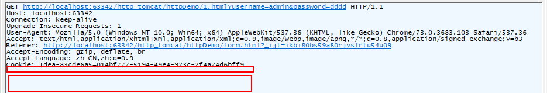

Post请求

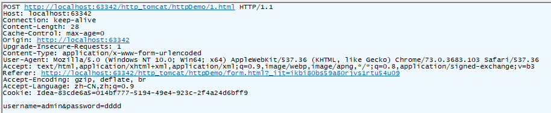

Get请求和post请求区别：get请求提交数据放在地址栏中拼接，数据一般不超过1k

> Post请求提交数据是放在请求正文中。 略微安全一些。传输的
> 数据没有大小限制。传输过程明文传输。

最常用的是Get请求和post请求方式，还有一些其他的请求方式，可能服务器不会接受此方法。

HEAD：只返回除了响应正文的部分，即响应头。部分服务器可能支持，也可能不支持。

OPTIONS:当前url所支持的方法

DELETE:向服务器发送一个删除资源的请求

PUT:向服务器发送一个提交文件的请求

需要掌握get请求和post请求，其他请求方式了解一下即可。

#### 请求头

请求头（浏览器发送给服务器，是给服务器看的）就是浏览器在和服务器商议通讯细节（可以理解为双方签订一个合同，然后又拟定了一份补充协议，就是对合同的进一步说明）。我支持什么方式，我希望怎么来传输数据等等。

Accept请求头：type/sub-type text/html

MIME类型：Multipurpose Internet Mail Extensions 媒体类型

MIME：针对html文档而言：text/html;

> 针对图片等：image/png;image/gif等

> 声音资源：audio/mp3等

> 视频：video/mp4、mkv、avi

这里面引出一个MIME类型的概念，

后面我们会发送http响应，如果是普通文档，你设置它的类型是text/html没有问题，但是如果是一个静态资源，比如图片，设置类型是text/html就会引起一系列问题，比如图片无法正常加载。

Referer：指明从哪个页面跳转过来。Form表单地址是1.html，如果现在我想知道用户是从form.html跳转过来还是直接访问1.html，有什么办法可以区分？？？

直接访问1.html

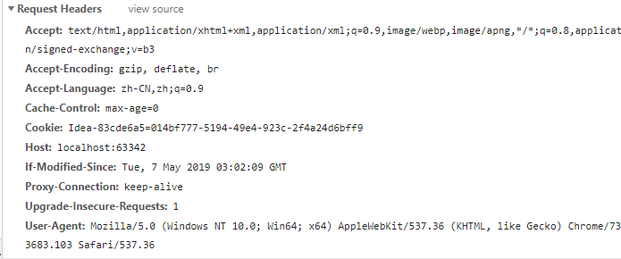

通过form表单跳转到1.hmtl

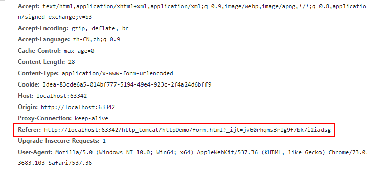

编写一个程序，当有referer请求头的时候，可以显示该资源，如果没有，则不显示。

Cookie：缓存，一般与服务器端发送的set-Cookie响应头成对出现。

### HTTP响应报文

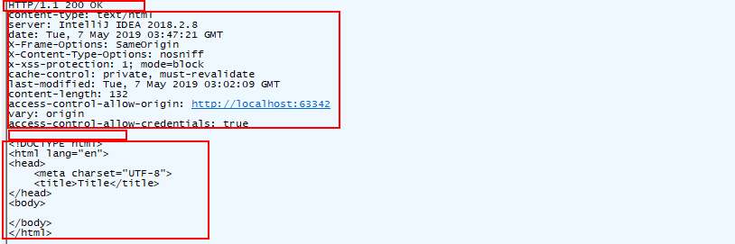

#### 响应行

#### 版本协议

#### 状态码

##### 200 OK

##### 302/307重定向

以访问www.bing.com为例，查看整个重定向过程，http:www.bing.com重定向到https:www.bing.com，之后再次重定向到https:cn.bing.com。

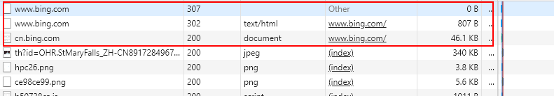

##### 404 Not Found

##### 500服务器内部错误

#### 描述

#### 响应头

是服务器发送回客户端的，是给客户端看的，也就是浏览器看的

##### Location

指示了新的资源的路径，与重定向状态码搭配使用302/307搭配。

##### Content-Type

**Content-Type:**

text/html; charset=utf-8

用来表示资源的类型，比如html文档。浏览器看到这个字段，就会把当前的资源当做content-type里面的内容来解析。假如资源是图片，但是content-type是text/html,那很有可能会发生图片无法正常显示。

##### Refresh

Refresh: 1;url=http://www.cskaoyan.com

说的意思是间隔1s后，向url地址发送http请求。如果没有url，则表示每隔1s刷新当前页面。

##### Set-Cookie

服务端将生成的cookie发送给浏览器端，浏览器再次访问服务器时，会带上cookie请求头

##### Content-Disposition

默认情况下，浏览器对于可以打开的文件（html，js，css，图片），默认执行打开操作，无法打开的文件，则执行下载操作。

运用这个响应头，可以将浏览器可以打开的文件执行下载操作。

HTTP协议是什么？是一个在计算机网络中两点之间用以传输文本，音频，视频，图片等资源的规范。包含两部分：请求、响应

请求报文：

请求行：请求方法 请求资源 版本号

请求头

空行

请求正文

响应报文：

响应行：版本号 状态码 描述

响应头

空行

响应正文

## Tomcat

### 什么叫服务器？

服务器可以指机器，也可以指软件。主要指软件。为什么要有服务器？服务器的作用是什么？

服务器可以把自身电脑上的资源发布到网络中，供其他用户访问。

### 自己Demo一个服务器

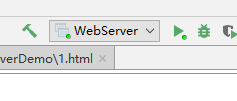

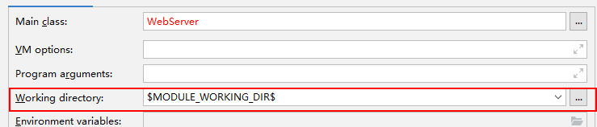

设置Module的工作目录。

### Tomcat

#### 安装

直接解压缩放在某个目录下即可。建议不要放在中文名称目录内，且目录内不要出现空格，以免出现一些不必要的问题。建议放在某个盘符的根目录下即可。

#### 启动

1.Tomcat目录/bin目录，执行startup.bat。

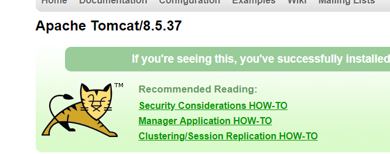

看到这个界面，表示tomcat启动成功。

需要注意的是，必须配置JAVA_HOME或者JRE_HOME。否则tomcat无法正常启动。

2.在bin目录下，启动cmd，输入startup，同样可以启动tomcat/shutdown关闭tomcat。

停止tomcat：启动shutdown.bat或者在启动的对话框里面输入ctrl + c

#### 修改端口号

Conf目录下server.xml

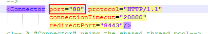

80端口号在访问的时候默认可以省略，不带端口号。

#### Tomcat目录结构

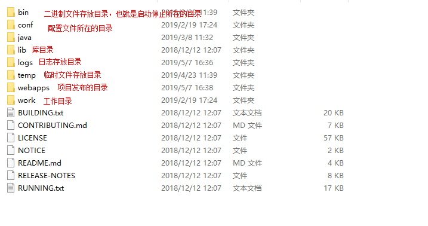

#### 新建应用

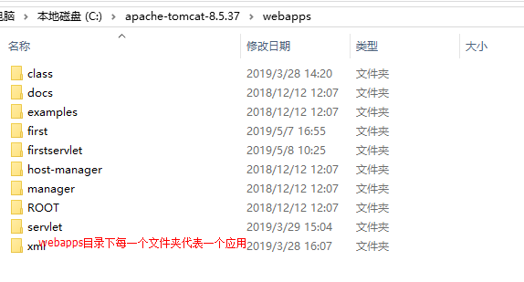

##### 直接部署

访问webapps目录下的应用，通过域名+端口号/应用名/资源名来访问，其中有一个需要特别注意，ROOT项目，该项目在访问的时候，不需要输入应用名。

##### 最简单，丢到webapps目录下

在webapps目录下，新建一个目录，该目录名称就是你的应用名，在里面添加你说需要供他人访问的静态或者动态web资源。

Localhost:port/应用名/资源名称

##### 打成war包，扔进webapps目录下

War：web application archive。类似于一种压缩格式。Tomcat启动的时候会自动解压缩。

之后访问方法同上。

#### 虚拟映射

什么叫虚拟映射？？正常情况下，我们发布应用发布到webapps目录下就可以了，但是如果我不想把应用放到该目录下，我可以通过某种方式将其他目录下的应用关联到该webapps目录下，等同于在webapps目录下。

##### 在Host节点下新增Context节点

正常情况下，仅需要将待发布的web应用放到webapps目录下即可完成发布，但是如果应用的位置不在webapps目录下，位于其他盘符等，如果不想将该应用放到webapps目录下，则可以使用Context节点配置。

比如在D盘有一个应用，我需要发布到网络上，新增Context节点，path表示该应用的应用名，（和放在webapp目录下略有不同，文件夹的名称即为应用名称），docBase指向的是该应用所在的位置。


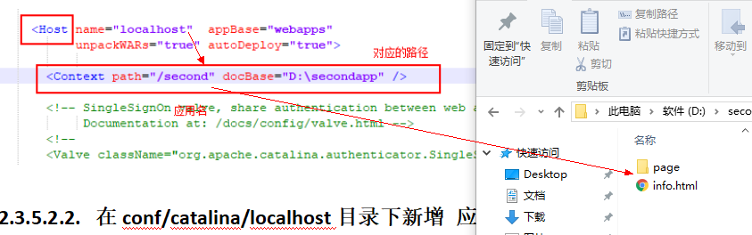

##### 在conf/catalina/localhost目录下新增 应用名.xml文件

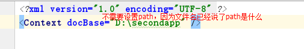

直接输入ip地址可以访问到个人主页？？？

首先端口号要改。

应用名可以省略，说明应用名是ROOT

不输入资源名称，设置一个welcome-file-list

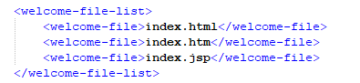

在conf/web.xml文件中，有一个welcome-file-list,这里面的页面会在你应用没有指定具体的资源名称时，依次加载对应的文件。

## IDEA的Web项目配置详情

**IDEA 的项目配置和Web部署详解**

在使用IDEA的时候，我们随便点击一个项目，右键选择Open Module Setting
，则可以看到如下的模块设置页面。

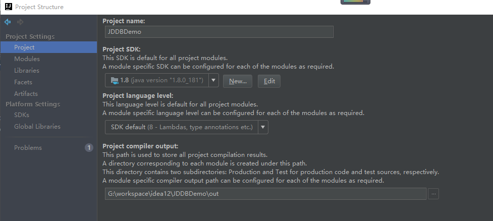

里面有五个配置，分别为：Project，modules, Libraries , Facets, Artifacts 。

那么他们分别是干嘛用的呢？下面稍微解释一下。

## 1.Project

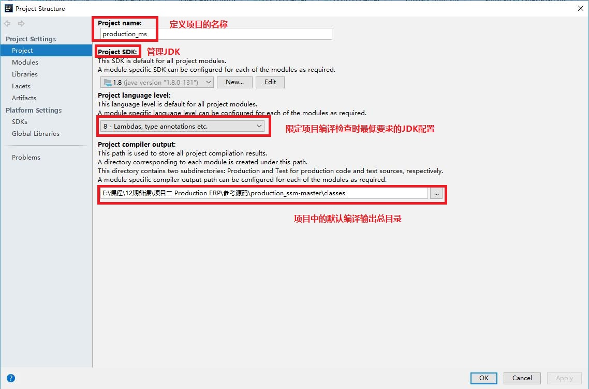

### 1.1 Project name

定义工程的名称；（一个Project里有多个module，每个module都可以是一个单独的应用）

### 1.2 Project SDK

设置该项目使用的JDK，也可以在此处新添加其他版本的JDK；

### 1.3 Project language level

这个和JDK的类似，区别在于，假如你设置了JDK1.8，却只用到1.6的特性，那么这里可以设置语言等级为1.6，这个是限定项目编译检查时最低要求的JDK特性；

### 1.4 Project compiler output

项目中的默认编译输出总目录，实际上每个模块可以自己设置特殊的输出目录（Modules -
(project) - Paths - Use module compile output path），所以这个设置有点鸡肋。

## 2.Modules

2.1 增删module

一个项目中可以有多个子项目，每个子项目相当于一个模块。一般我们项目只是单独的一个，IntelliJ
IDEA 默认也是单子项目的形式，所以只需要配置一个模块。

### 2.2 module配置

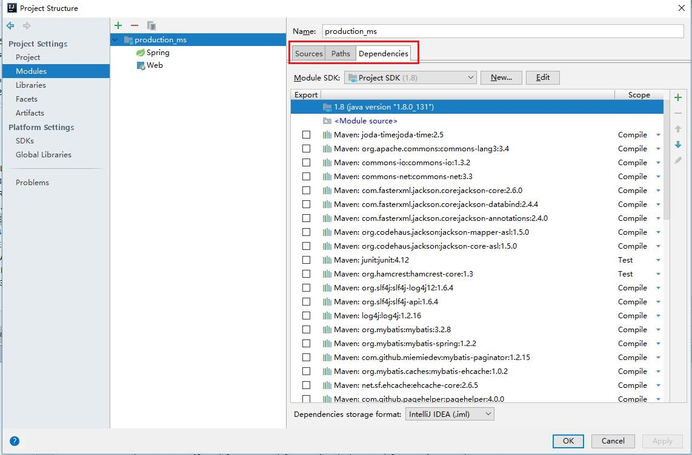

每个子项目都对应了Sources、Paths、Dependencies 三大配置选项：

- **Sources：**显示项目的目录资源，那些是项目部署的时候需要的目录，不同颜色代表不同的类型；
- **Paths：**可以指定项目的编译输出目录，即项目类和测试类的编译输出地址（替换掉了Project的默认输出地址）
- **Dependencies：**项目的依赖

### 2.2.1 Modules→Sources

显示项目的目录资源，那些是项目部署的时候需要的目录，不同颜色代表不同的类型

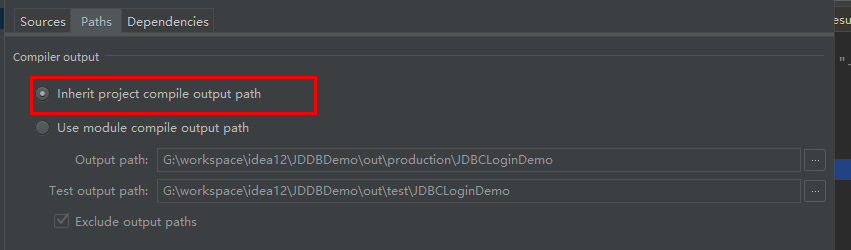

### 2.2.2 Modules→Paths

可以指定项目的编译输出目录，即项目类和测试类的编译输出地址（替换掉了Project的默认输出地址）

### 2.2.3 Modules→Dependencies

添加或者删除或者编辑当前module的依赖

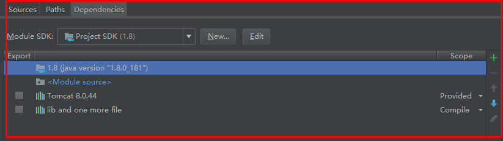

## 3、Library 

这里是project级别的依赖库，这里的库可以被其他的module引用。

## 4、Facts


官方的解释是：

When you select a framework (a facet) in the element selector pane, the settings
for the framework are shown in the right-hand part of the dialog.

（当你在左边选择面板点击某个技术框架，右边将会显示这个框架的一些设置）

facet里的部署文件描述符  
可以帮助我们的项目自动生成 WEB-INF 目录以及里面的web.xml

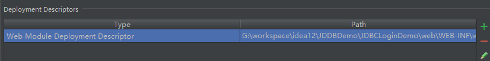

下面的 web 资源目录用于指定我们 web项目那个文件夹 存放我们的web资源。

通常是web目录。部署的时候会把该目录的所有内容复制到 对应的out目录文件夹里。

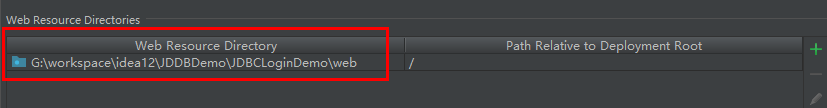

## 5、 Artifacts

### 使用


描述的是 你的编译结果和各种资源文件，怎么组织在一起，最终打包发布。

先理解下它的含义，来看看官方定义的artifacts：

An artifact is an assembly of your project assets that you put together to
test, deploy or distribute your software solution or its part. Examples are a
collection of compiled Java classes or a Java application packaged in a Java
archive, a Web application as a directory structure or a Web application
archive, etc.

即编译后的Java类，Web资源等的整合，用以测试、部署等工作。再白话一点，就是说某个module要如何打包，例如war
exploded、war、jar、ear等等这种打包形式。某个module有了 Artifacts
就可以部署到应用服务器中了。

*（*

*jar：Java
ARchive，通常用于聚合大量的Java类文件、相关的元数据和资源（文本、图片等）文件到一个文件，以便分发Java平台应用软件或库；*

*war：Web application ARchive，一种JAR文件，其中包含用来分发的JSP、Java
Servlet、Java类、XML文件、标签库、静态网页（HTML和相关文件），以及构成Web应用程序的其他资源；*

*exploded：在这里你可以理解为展开，不压缩的意思。也就是war、jar等产出物没压缩前的目录结构。建议在开发的时候使用这种模式，便于修改了文件的效果立刻显现出来。*

*）*

默认情况下，IDEA的 Modules 和 Artifacts 的
output目录已经设置好了，不需要更改，打成war包的时候会自动在
WEB-INF目录下生成classes，然后把编译后的文件放进去。

### 一些补充

其实，实际上，当你点击运行tomcat时，默认就开始做以下事情：

- 编译，IDEA在保存/自动保存后不会做编译，不像Eclipse的保存即编译，因此在运行server前会做一次编译。编译后class文件存放在指定的项目编译输出目录下；
- 根据artifact中的设定对目录结构进行创建；
- 拷贝web资源的根目录下的所有文件到artifact的目录下；
- 拷贝编译输出目录下的classes目录到artifact下的WEB-INF下；
- 拷贝lib目录下所需的jar包到artifact下的WEB_INF下；
- 运行server，运行成功后，如有需要，会自动打开浏览器访问指定url。


还有idea配置完tomcat以后啊，

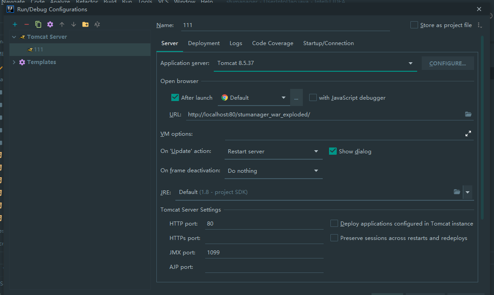

还要点击一下这个

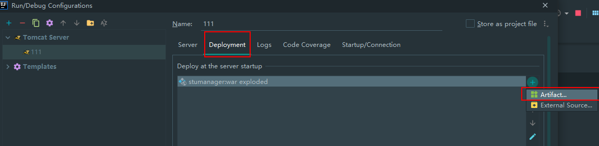

# Servlet

## 什么是Servlet

Servlet = Server + applet

Servlet是接口，规范，相应的类由谁来实现？？？Web服务器、tomcat：Servlet容器

To implement this interface,

you can write a generic servlet that extends javax.servlet.GenericServlet  
or an HTTP servlet that extends javax.servlet.http.HttpServlet.

## 手动实现servlet，不借助IDE

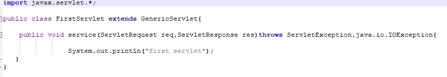

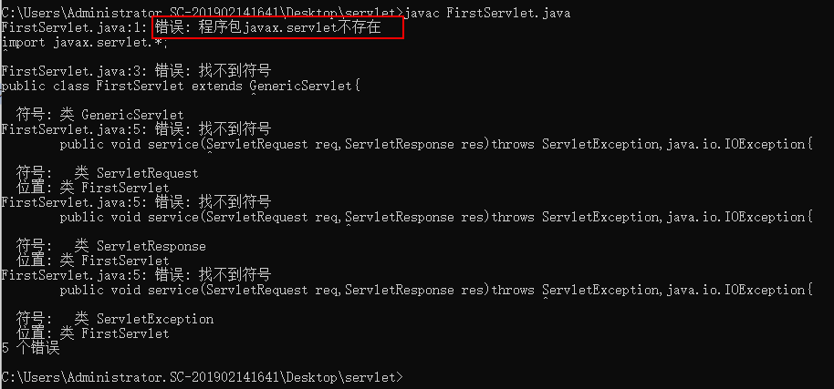

应该如何解决？？Javax.servlet不存在。

类加载过程

1. Bootstrap类加载器：负责加载Java的核心类库，JAVA_HOME/jre/下面的类
2. Extension类加载器：负责加载JAVA/jre/lib/ext下面的类
3. System类加载器：负责将命令中的classpath或者CLASSPATH环境变量指定的类库加载到内存中。

需要导包（不是import）

方式一：

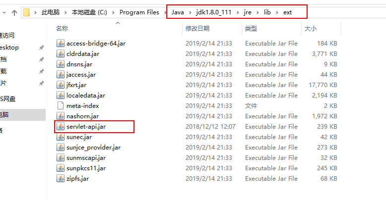

方式二：

Javac -classpath jar包的路径 java文件

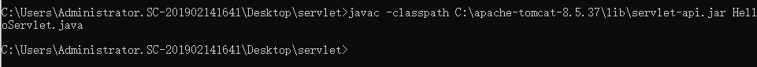

## Servlet的执行过程

1. 在浏览器上输入<http://localhost/firstservlet/first>，发生什么事情？？
2. 首先被监听80端口号的connector HTTP 1.1接收，接收之后将请求转发给Engine处理。
3. Engine将请求匹配给虚拟主机localhost，如果没有找到，也是匹配给它，这个是默认的虚拟主机。
4. 虚拟主机接收到请求，然后将请求的路径变成/firstservlet/first，之后在该host节点下去搜寻Context节点，应用名
5. 找到firstservlet应用，将请求转发给该应用，/first，之后再去web.xml中去搜索/first，通过url-pattern找到servlet-name，再通过name找到相应的class文件，之后加载该class文件。
6. 检查是否有该servlet的实例，有的话，则不会再次执行init方法，没有的话，则创建一个实例对象，执行init方法。
7. tomcat创建一个用于封装HTTP请求消息的HttpServletRequest对象和一个代表HTTP响应消息的HttpServletResponse对象，然后调用Servlet的service()方法并将请求和响应对象作为参数传递进去。
8. WEB应用程序被停止或重新启动之前，Servlet引擎将卸载Servlet，并在卸载之前调用Servlet的destroy()方法。

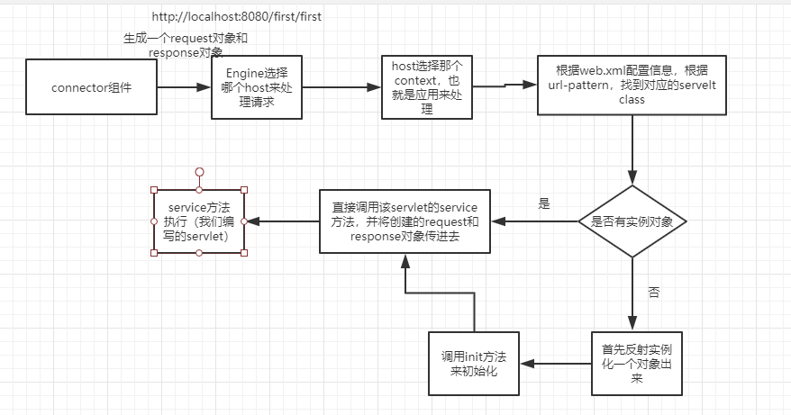

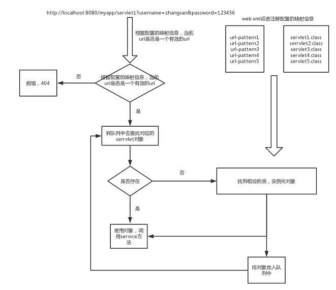

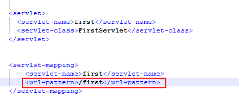

提出一个问题：当我们访问静态html页面的时候，会不会有servlet参与？？

## IDEA和tomcat整合（新建JAVA EE项目）

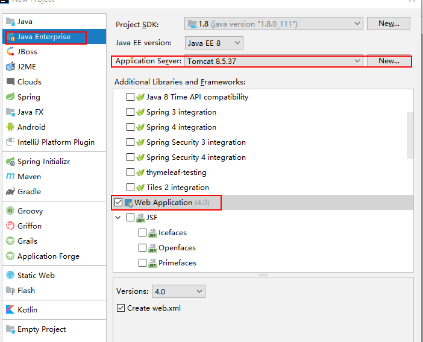

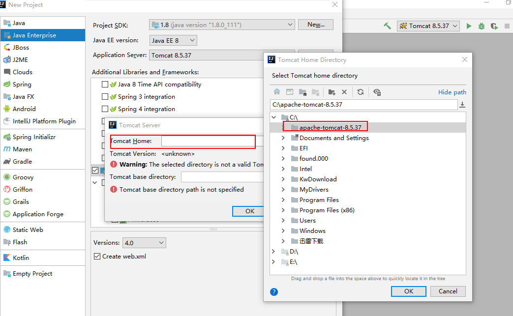

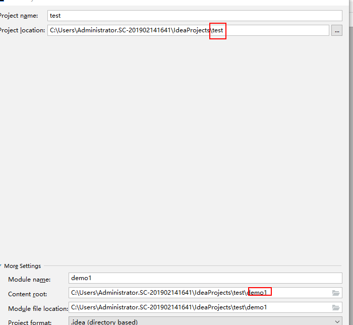

设置web开发路径

Open Module Settings


把当前module的输出路径修改到WEB-INF下的classes路径下

设置全局字符编码格式：

选择File settings

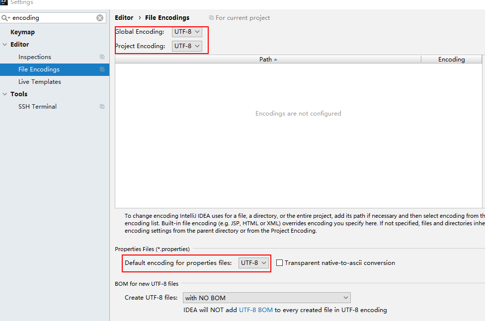

启动/部署：

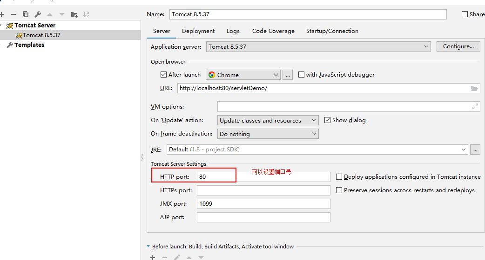

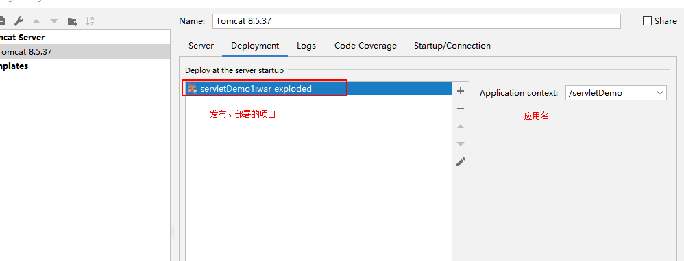

选择debug模式，


再次选择会出现四个选项

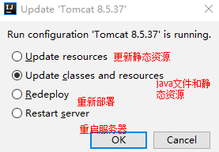

## 开发Servlet的第二种方式

继承HttpServlet

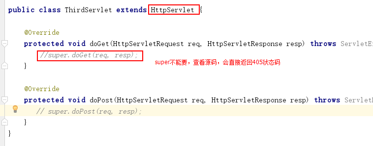

有一个疑问？？Service方法会在每次执行的时候都调用？继承HttpServlet没有service方法？？？

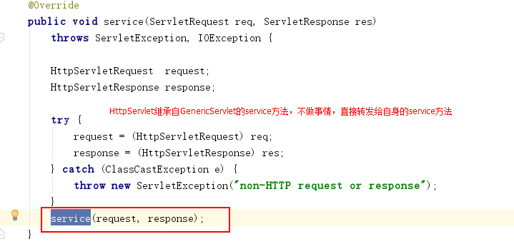

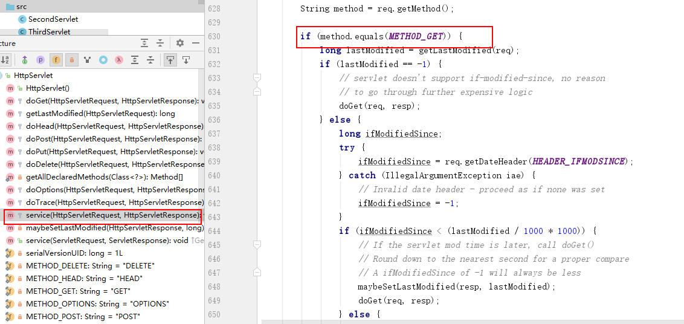

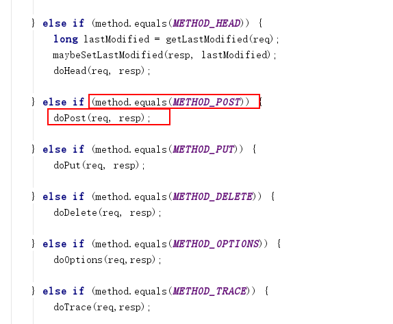

优点：相较于继承GenericServlet，对于不同的请求方式，做了更细致的分发。

设置仅可用post方式提交，get方式不处理。

## Servlet创建的第三种方式

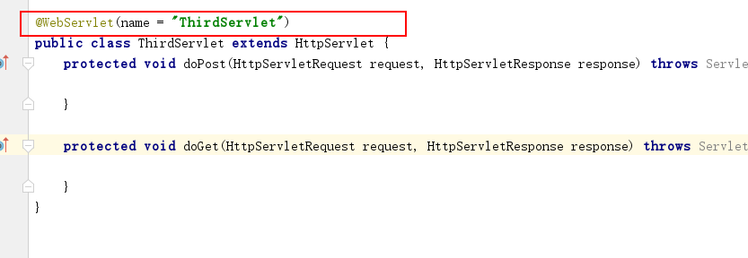

通过注解的方式创建servlet。


Name对应web.xml中的servlet-name节点，urlPatterns对应url-pattern节点。

可以进一步精简为

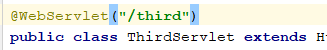

## 把SE项目改装为EE项目

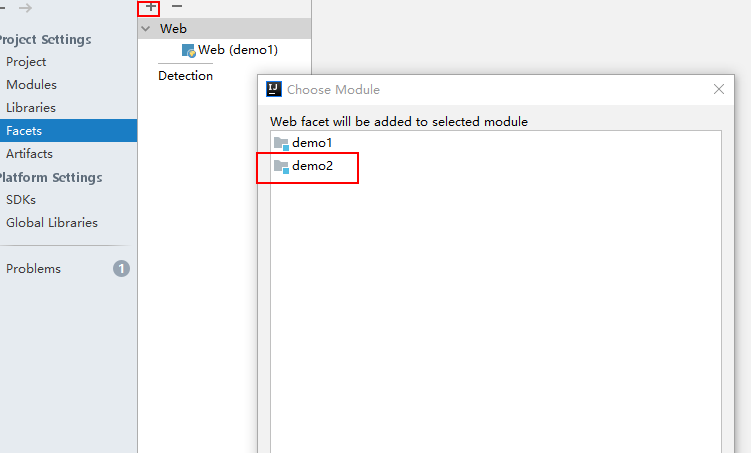

给SE项目添加Facet，选择Web属性，默认情况下不需要修改

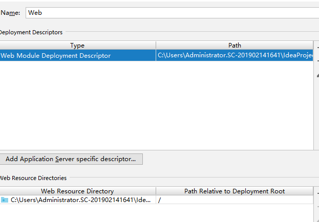

之后需要设置Artifact，将项目如何包装起来

选择Web Application：Exploded

设置成功之后，在tomcat中添加该artifact

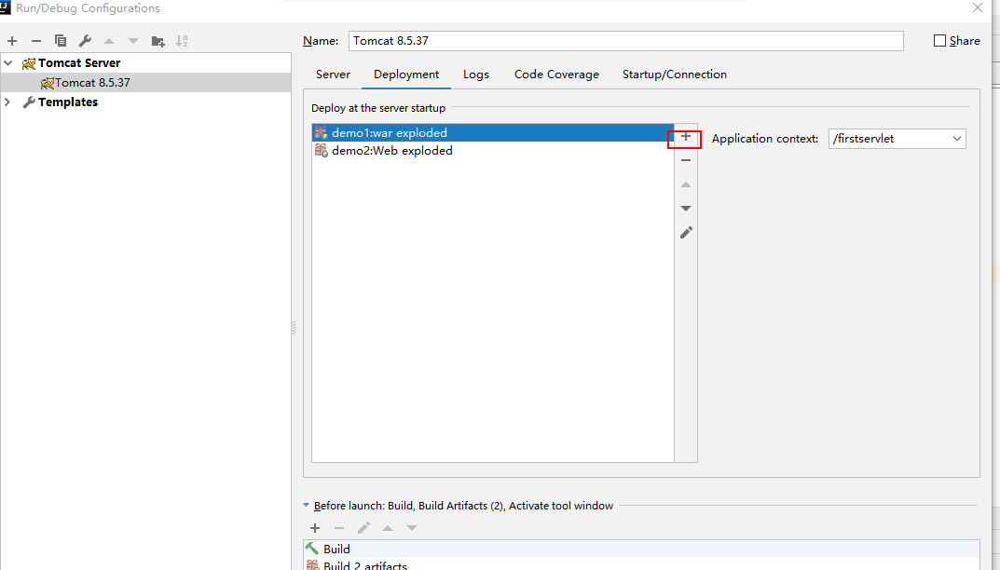

右边设置项目的应用名

## IDEA如何和tomcat关联起来

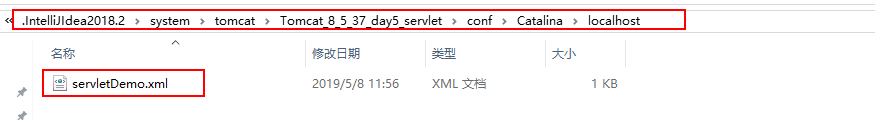

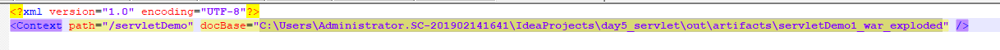

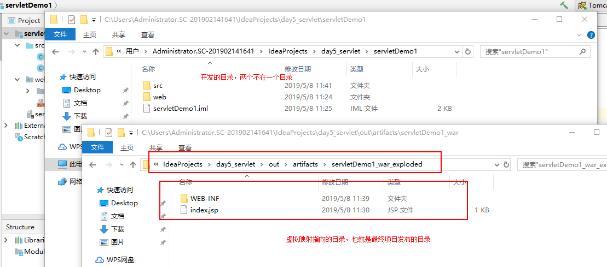

上面是老师写的目录总览图,

下面是自己写的步骤首先再IDEA里面打开,tomcat,debug

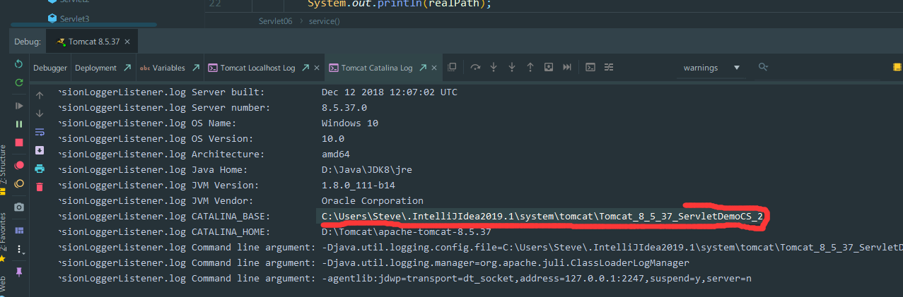

找到上面图中的地址,然后复制到文件夹中,就可以找到一个目录

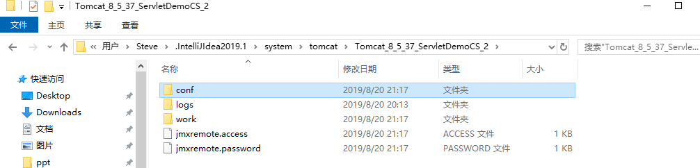

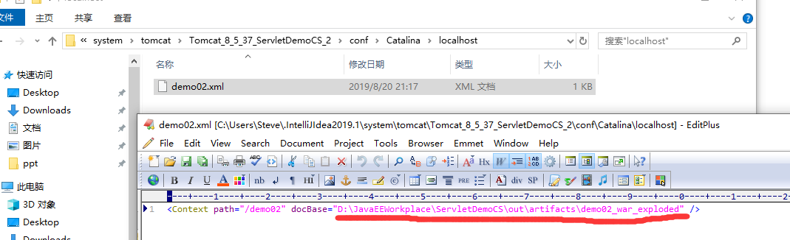

然后进去到conf--\> Catalina --
-\>demo02.xml,在里面可以看到这个文件映射到的实际目录为图中画横线的目录.

复制划横线的目录,就可以找到相应的文件夹

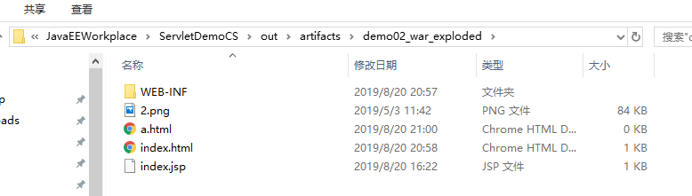

就可以找到对应的文件夹!这个文件夹相当于tomcat目录下的webapp里面的文件!

这也是IDEA牛的地方,他没有在原装的tomcat目录下的文件下乱改!eclipse就步行!

IDEA的目录下有一个conf目录，里面的文件是从tomcat的conf目录复制过来的，它用这套配置文件重新开启了一个tomcat实例，所以它不会对tomcat产生任何的影响。

### IDEA的最终项目部署目录和开发目录之间的区别

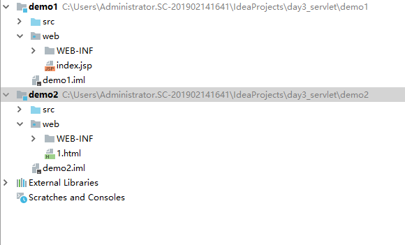

开发过程中，我们见到的目录称之为开发目录。

最终根据应用名.xml文件中配置的docBase目录，我们称之为项目的部署目录，

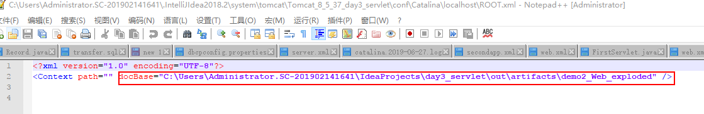

这两个目录不是同一个。在开发的过程中需要注意，如果开发目录有某个文件，而最终访问的时候始终报404，这个时候需要去部署目录确认是否有该文件。

## Servlet的生命周期

创建：正常情况下，servlet在第一次访问的时候被创建，被谁创建？？Tomcat。

但是，可以通过设置一个参数，让servlet在项目加载的时候自动创建。

Load-on-startup可以更改servlet的生命周期的创建阶段

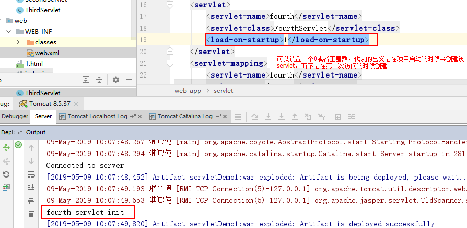

这个有什么用呢？

或者说第一次访问的时候创建，有什么好处？懒加载。什么时候用，什么时候创建。

对于一些需要经常访问的servlet，或者说需要在项目启动的时候做一些加载，可以将servlet的load-on-startup设置为一个非负数，这样，则可以减轻服务器的部分压力。

正常情况下，默认-1，表示初次访问的时候才会加载。数字大小表示加载的先后顺序，越小则越先加载。

## Url映射的问题

Url-pattern的写法：

固定两种写法：

一种 /。。。。/。。。。，以/开头 /\*

第二种\*.后缀


两个小问题：

多个servlet可以配置同一个url吗？？？不能

一个servlet可以配置多个url吗？？？可以。

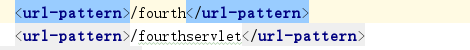

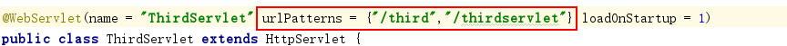

### Url冲突匹配的问题

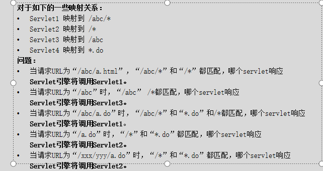

/开头的url-pattern优先级高于\*.后缀的优先级

都是/开头的url-pattern，满足什么规律？精准匹配，匹配程度越高，执行谁。

这个时候，如果项目中存在html或者图片，则被/\*匹配到，无法显示正常的网页、资源

比较特殊的url映射，一个是/\*，另外一个是/

访问localhost,实际上访问的是localhost/index.jsp。

/它只能处理静态资源。

/\*的优先级要高于/，如果想要/起作用，则不能有/\*存在。

当有/存在的情况下，html页面，图片仍然访问不到，jsp可以访问到。

访问静态资源的时候，有没有servlet参与？？？？？？

有，肯定有。/的逻辑是不是就是去项目中搜索你要加载的资源，如果找到，则以流的形式写回浏览器端，如果找不到，则报404。

### DefaultServlet

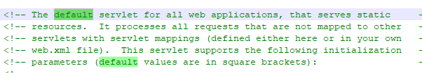

Url-pattern就是/。如果你的项目中又新建一个/的servlet，则会覆盖掉tomcat提供的默认servlet。

DefaultServlet的作用就是用来处理静态资源文件，处理的逻辑就是找到相应的资源，然后以流的形式写回浏览器端。

对于我们而言，在开发过程中，不要设置/\*和/的url-pattern。

## ServletConfig

简单了解一下即可，可以在init方法中获取该servlet定义的一些初始化参数。

## ServletContext对象

非常重要。

### 共享数据

SetAttribute getAttribute removeAttribute

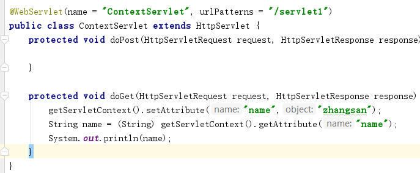

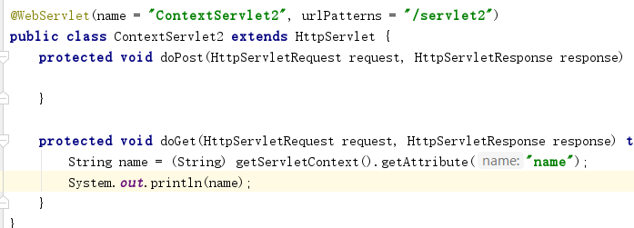

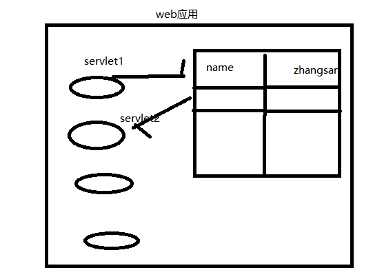

有什么作用？？？统计一个网站某一个页面的历史访问次数，应该怎么做？

ServletContext

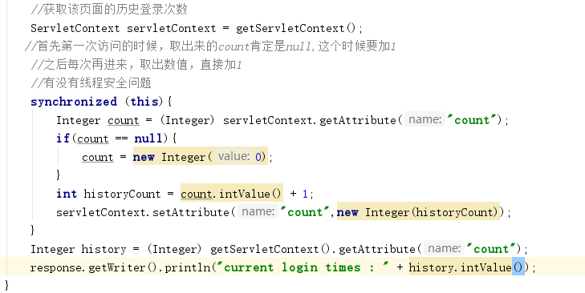

### 获取全局性的初始化参数

和ServletConfig比较类似。

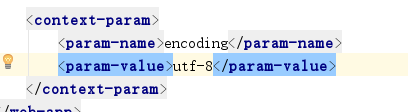

Web.xml定义一个context-param节点，所有的servlet均可以获取到该初始化参数。与ServletConfig不同。ServletConfig初始化参数的标签叫init-param，这个标签是存在于servlet内部的，所以仅当前servlet可以获取到该初始化参数。

### 获取EE项目的文件路径

SE项目路径和EE项目路径的区别：一定要会

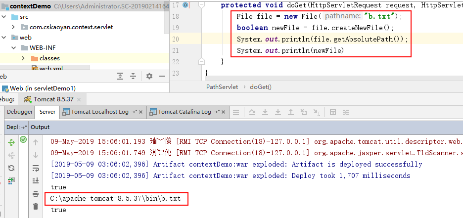

相对路径，相对的是谁的路径？Jdk里面如何描述相对路径的？？相对路径指的是相对java虚拟机调用的目录。在哪个目录下调用jvm，就相对的是哪个路径。

如何调用jvm？？？Main方法入口。。。。

EE阶段，我们没有main方法入口。


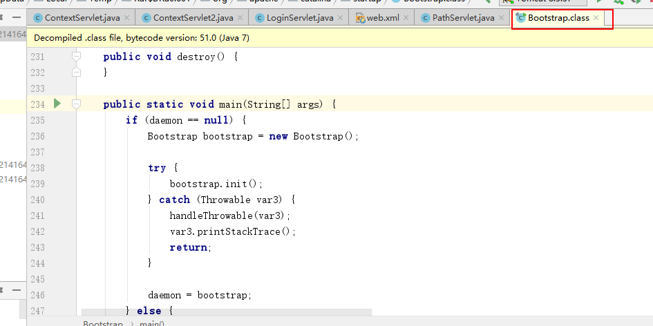

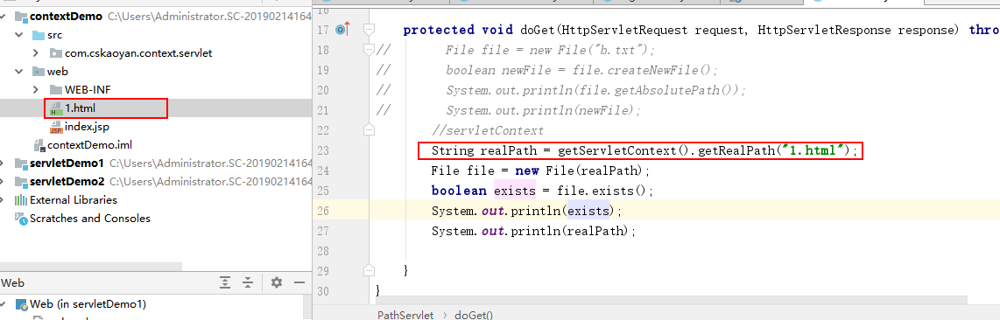

但是我们却不希望自己新建的文件在bin目录下，有几个原因：不方便；后面的项目文件会覆盖前面的项目文件；所有的文件都存放在bin目录下，bin目录会显得很乱。

最希望的是就在当前的项目内部新建一个文件。

# ServletRequest

ServletRequest由谁创建的？Tomcat，tomcat创建了两个对象，一个request对象，一个response对象，在调用servlet的service方法时，作为参数，将这两个对象穿进去。

ServletReuqest对象就是代表了请求报文。就是对请求报文的封装。

请求报文的结构：

**请求行：请求方法 请求资源名称 版本协议**

**请求头**

**空行**

**请求正文**

通过ServletRequest可以获取到请求报文的各个结构。

多次请求同一个url，每次都会新创建一个request对象和response对象。

## ServletRequest和HttpServletRequest关系

public interface **HttpServletRequest**

extends
[ServletRequest](http://tomcat.apache.org/tomcat-8.0-doc/servletapi/javax/servlet/ServletRequest.html)

## 通过request获取请求信息

### 获取请求行、请求头

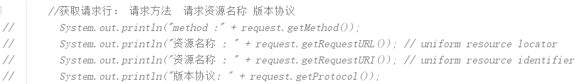

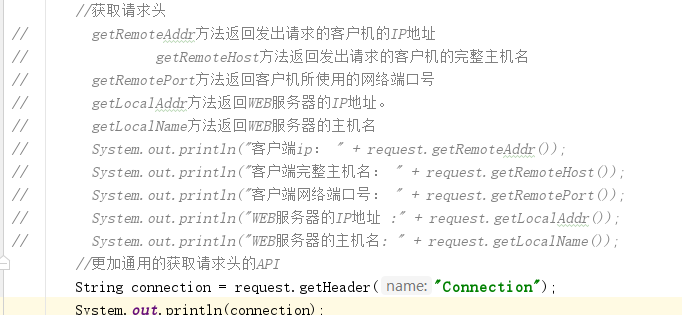

### 获取请求参数

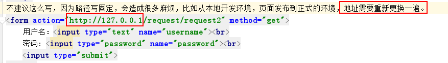

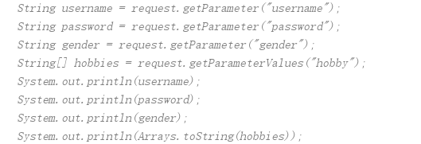

还可以利用*getParanmeterNames和getParameterValues这两个API来更方便的获取请求参数*

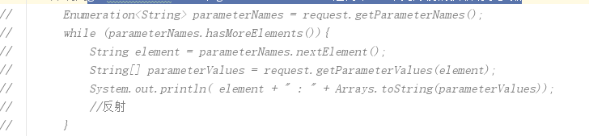

得到的参数，一般情况下，我们会将它封装到一个java
bean对象中，可以利用工具类来完成

导包：

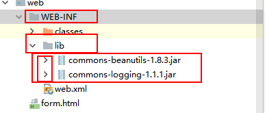

将所需要的包放入WEB-INF目录下的lib目录中，之后选中导入的包，点击右键，选择Add as
library，添加到依赖。

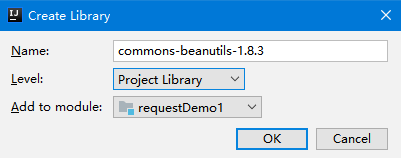

这里面设置Library级别为project，也就是说其他的Module如果需要这个jar包，不需要再次导包，直接依赖即可。比如再新建一个module

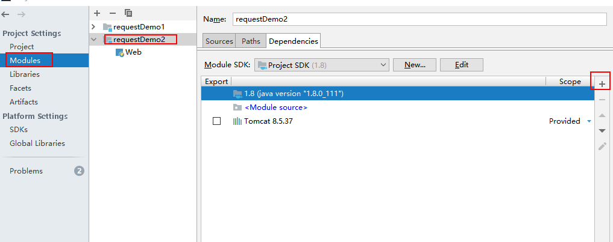

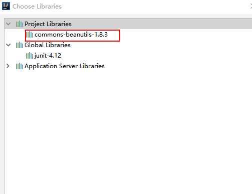

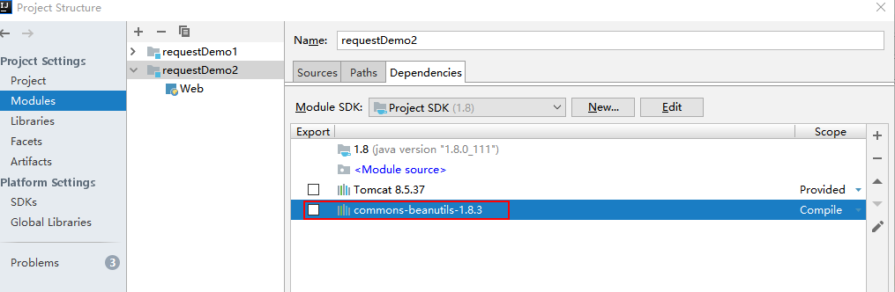

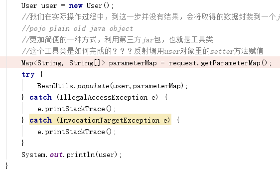

### 中文乱码问题

Tomcat中文乱码，字符编码改为UTF-8

Win + R 输入regedit，到如下地址，新增字符串值

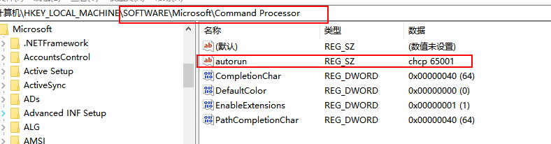

打开tomcat的startup.bat文件

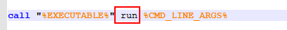

将start改为run

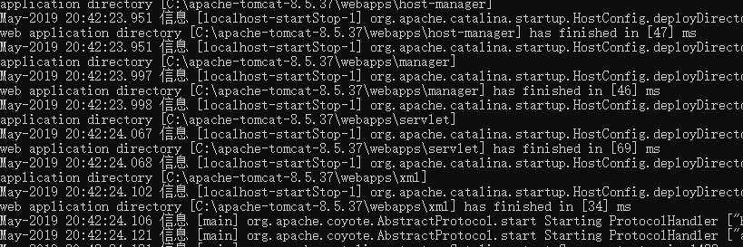

IDEA tomcat控制台中文乱码问题

找到IDEA的安装目录，bin目录，根据自己的操作系统64位/32位，修改

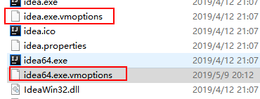

在末尾添加

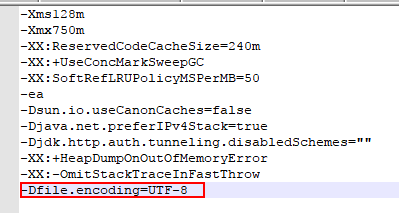

同时每个EE项目设置

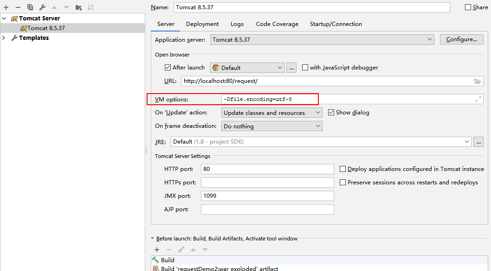

#### Post方式

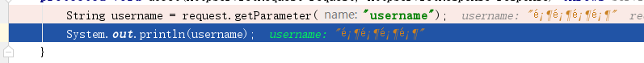

解决方案？编解码不一致，浏览器提交的数据是什么编码格式UTF-8，服务器在解码的时候，使用的不是UTF-8.

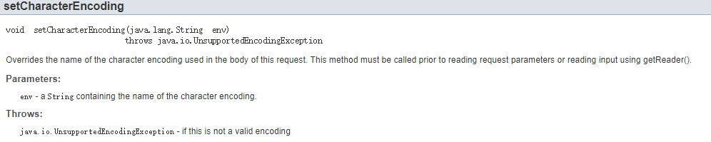

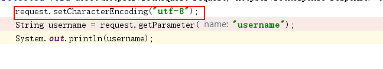

其中，setCharacterEncoding必须要在获取参数之前调用。

其中，这个方法适用的范围仅仅针对请求正文有效。

#### Get方式

如果前端提交的数据字符编码格式是UTF-8.则没有乱码问题。服务器在处理get请求时，字符编码格式UTF-8.

可以设置tomcat的conf
server.xml文件connector节点增加URIEndoing=“GBK”，可以设置tomcat的get请求字符编码格式为GBK，但是不推荐。

其中，这些设置是针对tomcat8版本，更早期的版本不适用这个规则。

### Form表单地址的书写

#### 写全地址

<http://127.0.0.1/servlet1>

**这种方式不推荐，原因：在公司开发软件的过程中，会涉及到多个环境，开发环境，测试环境，生产环境。**

#### 以/开头写法

写法：/应用名/资源名。

#### 相对当前页面的写法，不以/开头

当前form表单地址：

<http://localhost/request/form.html>

它所需要提到的servlet的地址：

<http://localhost/request/servlet1>

## request请求转发和包含

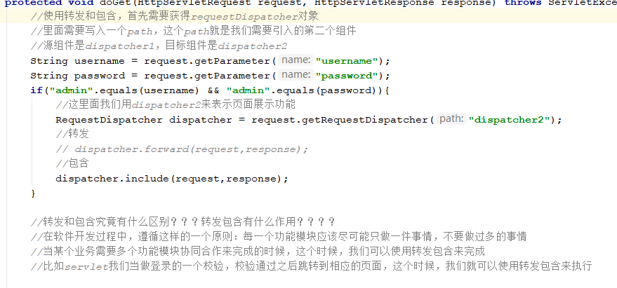

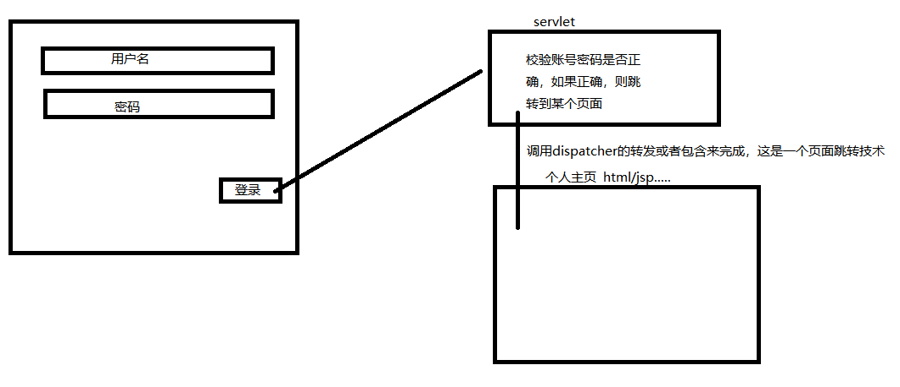

### 通过RequestDispatcher对象来转发

转发：一次请求，


请求由谁发送的？？应该由浏览器发送，所以只发送了一次请求。

转发是服务器的内部行为，和浏览器没有任何关系。

源组件：dispatcher1

目标组件： dispatcher2

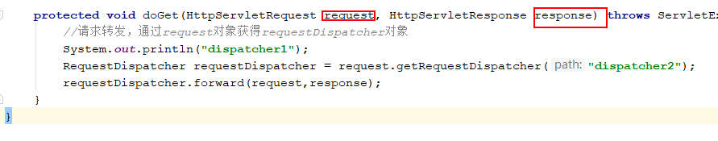

源组件和目标组件共享同一个request对象和response对象。

#### 转发和包含的区别

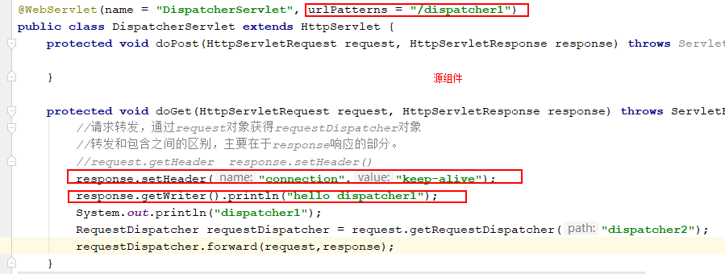

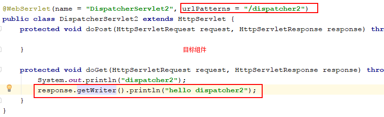

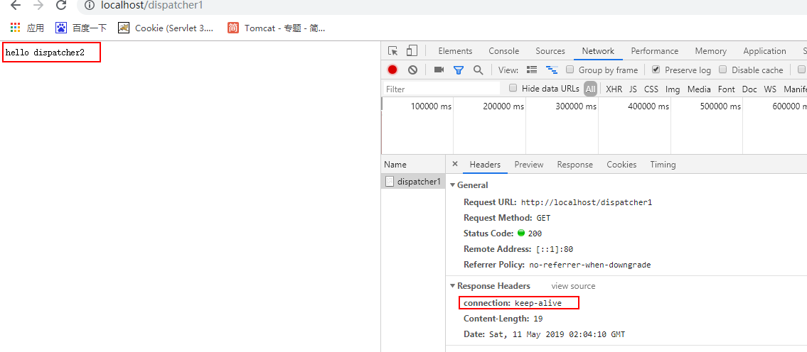

源组件的响应体数据没有保留下来

转发：（源组件）留头（响应头）不留体（响应体）。

源组件做了初步处理之后，将请求转发给目标组件，之后源组件对于响应正文的数据不再参与进来，全权由目标组件来完成。但是它可以写入响应头信息。

包含：（源组件）留头（响应头）也留体（响应体）。（目标组件）不留响应头

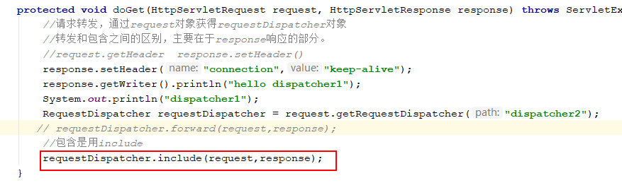

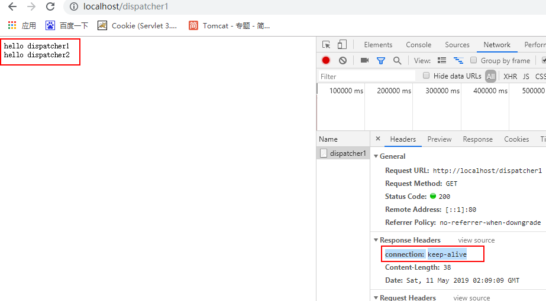

#### 用途

最常用的地方就是用于servlet向jsp/html页面跳转，比如登录页面，登录成功，跳转到success页面，登录失败跳转到fail页面。

#### 执行过程

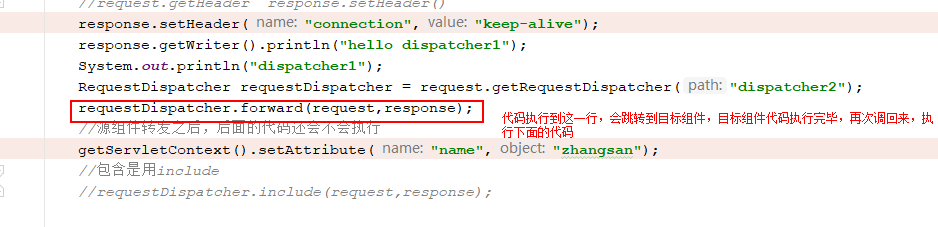

转发包含两个组件的执行过程：执行到forward/include行代码，执行完毕，跳转至目标组件执行，目标组件代码执行完之后，再次回到源组件继续执行forward/include行后面的代码。

#### Dispatcher路径写法

##### 第一种以/开头

唯一的一个特例：/资源名，不要写应用名

什么时候加/应用名，什么时候不用加？？？

看执行主体？如果是浏览器，浏览器不知道你的应用名是什么，所以不可能帮你补全应用名，这个时候就需要加

如果是服务器，服务器知道你的应用名，所以就不用加。

##### 第二种不以/开头

相对于当前的资源路径

Localhost/request3

Localhost/success.jsp

### Request域

一个范围，ServletContext域，也是一个范围。

Context域范围：整个web应用下的资源都可以访问到

Request域范围：针对同一个request对象内有效。所有共享同一个request对象的组件，都可以共享request域。转发的源组件和目标组件共享request域吗？？？？？

Servlet跳转到jsp页面的话，可以共享同一个request域对象数据。


# ServletResponse

Request是对请求报文的封装，response就是对响应报文的封装。

响应报文的结构：

响应行：版本协议 状态码 描述原因

响应头

响应空行

响应体

操纵response对象来控制整个响应报文的信息。

程序员可以编写代码来修改response对象，之后，tomcat读取response对象里的内容，同时再追加一些响应信息，之后将response对象转变为响应报文，通过流的形式传回客户端。

Response.setStatus 设置相应的状态码

Response.setHeader(name,value)通用的一个形式 设置响应头

Response.getWriter() /getOutputStream() 设置响应体

## 常见的API

Response.setStatus 设置相应的状态码

Response.setHeader(name,value)通用的一个形式 设置响应头

Response.getWriter() /getOutputStream()

## 输出中文乱码问题

服务端发送的数据使用的是什么字符编码格式？

浏览器接收使用的字符编码格式是什么？？？与操作系统有关，简体中文版windows操作系统，默认使用的字符编码格式是GBK。

Response.setCharacterEncoding()

服务端改成GBK可以暂时解决问题，但是如果默认字符编码格式不是GBK，同样存在乱码问题，所以，应该设置一种更加通用的格式，UTF-8.

存在的一个问题，如何去告诉浏览器让它去使用utf-8去解码。？？？？

解决方案：

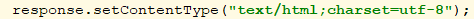

包含两层意思：1规范服务端的数据采用utf-8进行编码

> 2.设置一个响应头Content-Type：text/html;charset=utf-8

> 这个头表示什么意思呢？？

> 响应头给浏览器看的，浏览器看到这个响应头，知道它是一个html页面，然后字符编码格式是utf-8.所以浏览器会采用utf-8进行解码。

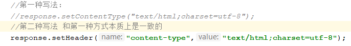

第三种

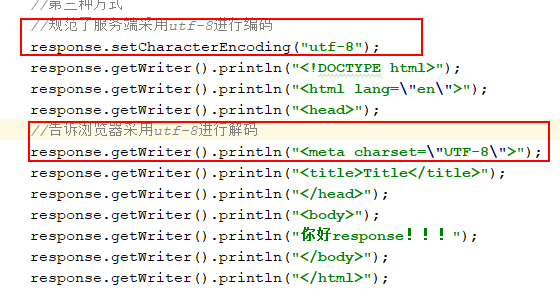

第三种方式也就是jsp的原理。

## 字节流

### 字节流传输文件

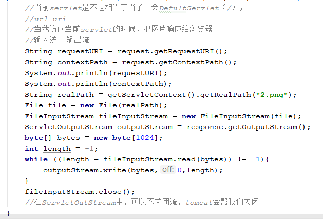

### 字节流输出中文

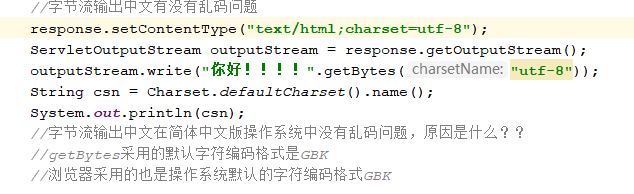

## 设置响应头，定时刷新

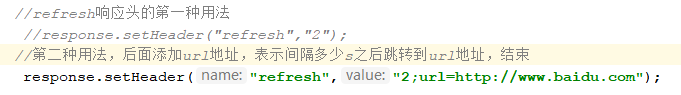

最常用的用法用于页面跳转

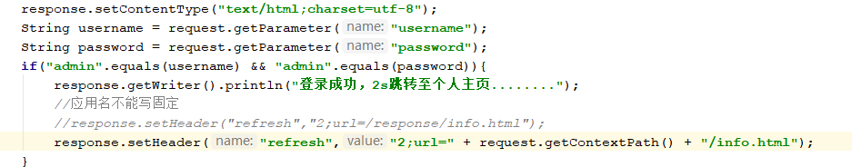

## 重定向

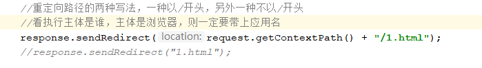

第二种方式：

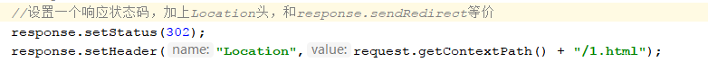

### 重定向、定时刷新页面、转发和包含

1. 转发和包含是服务器介导的，执行主体是服务器

重定向、refresh刷新是浏览器介导的，执行主体是浏览器

1. 转发和包含地址栏不会发生变化，浏览器只发出一次请求

重定向、refresh地址栏会发生变化，浏览器会发送两次请求

1. 转发和包含是request介导的，重定向、refresh是response介导的
2. 转发和包含只可以访问当前应用下的资源，重定向、refresh可以访问其他服务器资源

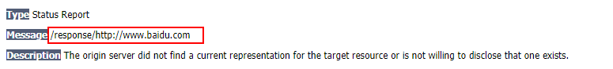

1. 转发和包含可以共享同一request域，重定向、refresh不可以。

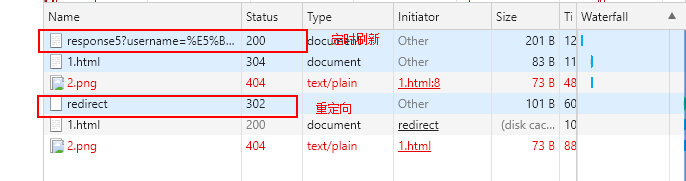

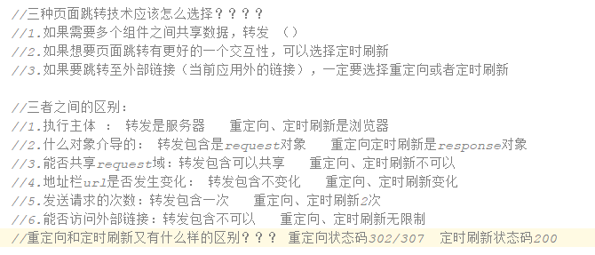

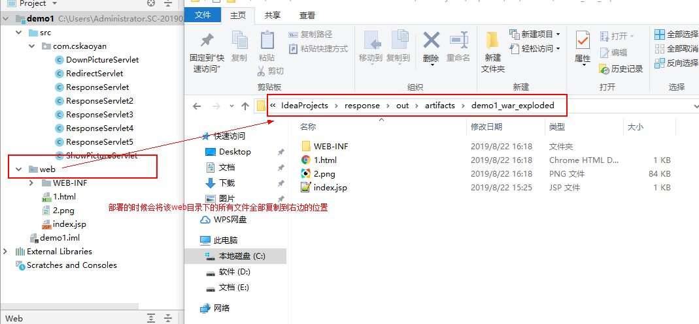

## 文件下载

浏览器对于自身可以打开的文件执行的是打开操作，对于无法打开的文件，比如exe文件，则执行下载操作。可以通过设置某一个响应头，让浏览器不打开资源，比如png，而只执行下载功能。

Content-Disposition

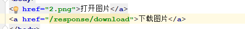

点击打开图片超链接，发生了什么事：

请求的资源名称http://localhost/response/2.png。服务器调用DefultServlet来处理该请求，最终的结果就是返回图片的流信息，然后浏览器加载出来。

访问/response/download

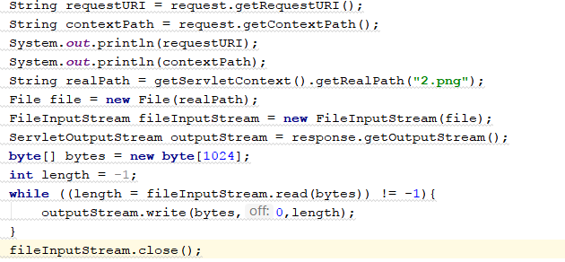

这段代码，仅仅是找到当前服务器上的资源，然后写入响应正文中。

浏览器在接收到响应报文时，会加载响应正文里面的内容。

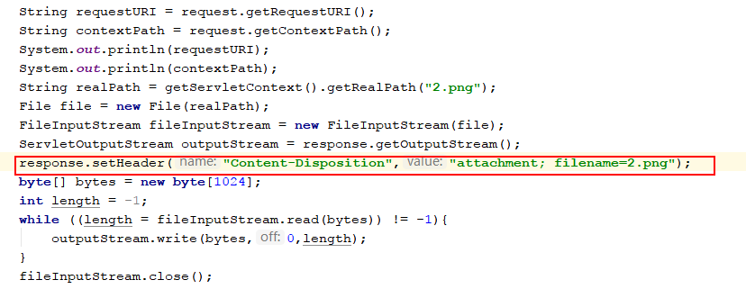

当添加了该响应头，浏览器在接收到资源的时候，不会去执行打开操作，执行以附件的形式下载到本地。

## 各种路径地址写法总结

Form表单地址路径action，a标签href，img的src属性，css，js，重定向，定时刷新
凡是浏览器作为执行主体的，/开头的路径的写法都是/应用名/资源名，

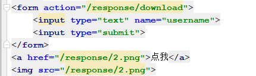

GetRealPth(path),getRequestDispatcher（path）,执行主体是服务器，那也就是/开头的写法，/资源名。

Localhost/response/1.html

Localhost/response/servlet1

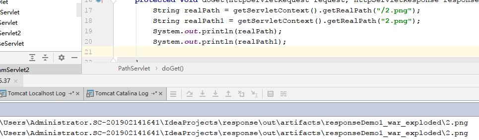

getRequestDispatcher(path)

/资源名，不需要加应用名

Response.sendRedirect(url);

Refresh url= Location =

/应用名/资源名

执行主体，浏览器，就加应用名

## WEB-INF目录限制

限制的是浏览器，无法访问该目录下的内容，但是对于服务器而言，它是完全开放的。

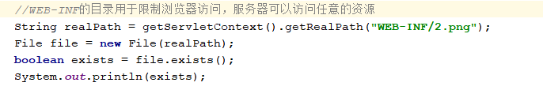

# Cookie和Session

## Cookie

### 会话

会话就是指一次交谈。对于web应用而言，举例，比如从你打开www.taobao.com开始，到最后浏览结束，关闭页面，这一整个过程，我们称之为一次会话。不可避免会产生一些用户特有的数据信息。

但是又由于http协议是无状态协议？？？？服务器无法区分请求是不同用户发起的还是同一用户发起的多次请求。

会话解决技术？？？？Cookie Session

### Cookie

Cookie是客户端技术，服务器产生的cookie通过set-Cookie响应头发送回浏览器，浏览器再次访问该服务器时，会带上该cookie信息。这样就可以解保存用户自身数据。

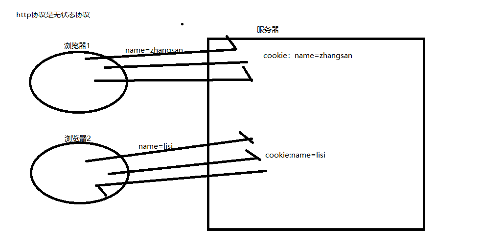

#### Cookie使用

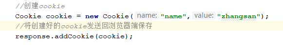

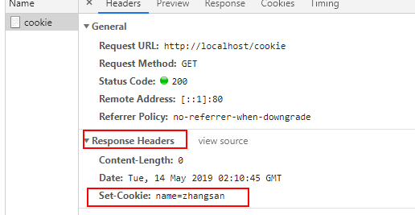

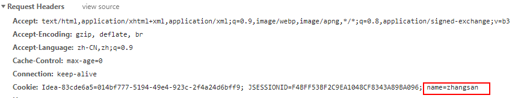

### Cookie显示上次登录时间

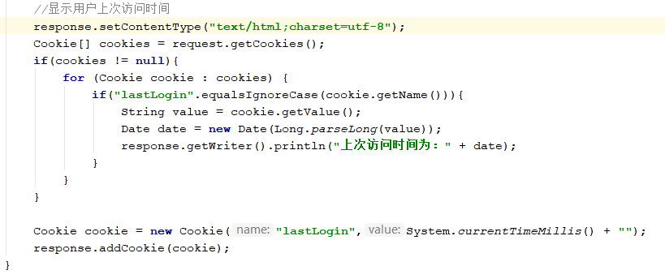

### Cookie的存活时间

Cookie默认情况下，当你关闭浏览器，则保存的cookie失效。默认是保存在浏览器的内存中，浏览器关闭，则cookie消失。

如果想要让cookie长久保存，应该怎么办？？？？

Cookie.setMaxAge(),单位是秒（int）

正数表示cookie将在多少秒之后失效。

负数表示cookie存在于浏览器内存中，浏览器关闭，则失效。没有设置的情况下，默认就是该情形。

0表示该cookie将被删除

#### 设置MaxAge为正数

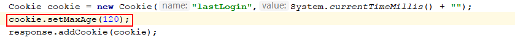

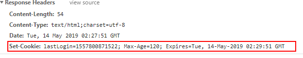

关闭浏览器再次打开该服务器，cookie仍然存在。

#### 设置MaxAge为0

删除cookie时，如果cookie设置了相应的path，则还应该保持path和新建cookie时的path一致，否则无法删除cookie。

此时cookie无法被删除，因为删除cookie必须要保证路径一致才可以。

### 不同浏览器之间能否共享cookie

不能。Cookie仅保存在浏览器自身内部，不会共享。

### 设置cookie的path

如果不设置，则默认访问当前域名下所有资源时，都会带上该cookie，设置了path之后，则访问相应的路径下的资源才会带上cookie

假如一个cookie的path是/demo/cookie，那么它能否区分一个应用名即demo，然后资源名是cookie，还有一个应用名是/，资源名是/demo/cookie

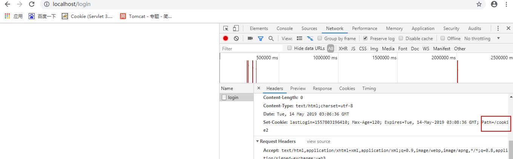

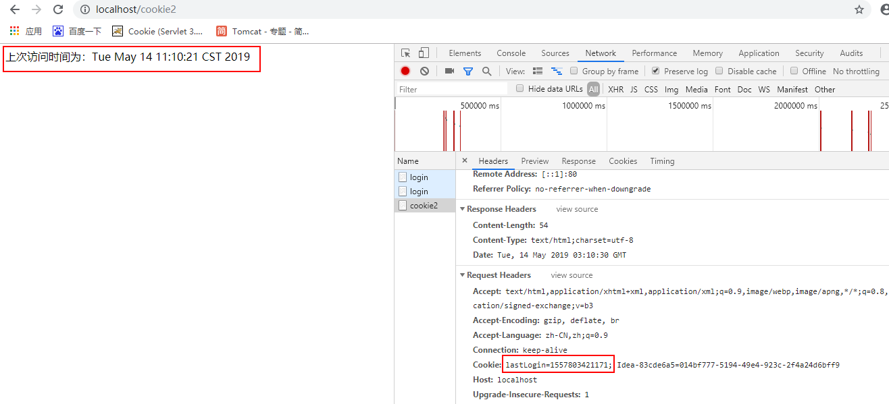

### 设置cookie的domain

也就是设置cookie的域名，（localhost）设置除本身域名之外的cookie，chrome浏览器会阻止。

Chrome浏览器查看cookie

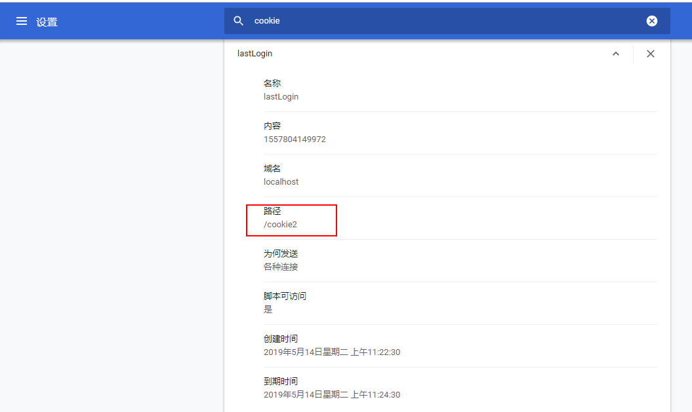

## Session

服务端技术。服务器在其内存中开辟了一块区域，给每个用户的浏览器使用，用以存放一些数据信息。

它是如何识别出每一个浏览器的？？？？

首先，浏览器第一次访问服务器时，服务器会给当前的浏览器新建一个session对象，session对象有一个ID，也就是JSESSIONID，之后，服务器会将ID以cookie的形式发送回浏览器端。

浏览器端保存该cookie，再次访问的时候，带上该cookie。服务器接收到该cookie，提取出里面的JSESSIONID的值，然后找到对象session对象的内容。

### Session的使用

#### Session的创建

Request.getSession()/getSession(boolean)

服务器区分不同浏览器完全是依靠JSESSIONID的值。如果当前浏览器没有JSESSIONID或者携带一个失效的ID，则服务器会给当前浏览器再新建一个session（只有访问request.getSession()方法时才会新建），并且把session的id
JSESSIONID以cookie的形式返回给浏览器端。

getSession()方法返回一个session，如果当前没有session，则创建一个。

getSession（create）,如果create是true的话，有则返回一个session对象，没有则创建一个。如果为false的情形，有则返回一个，没有则不会创建，返回null。

第一次访问：

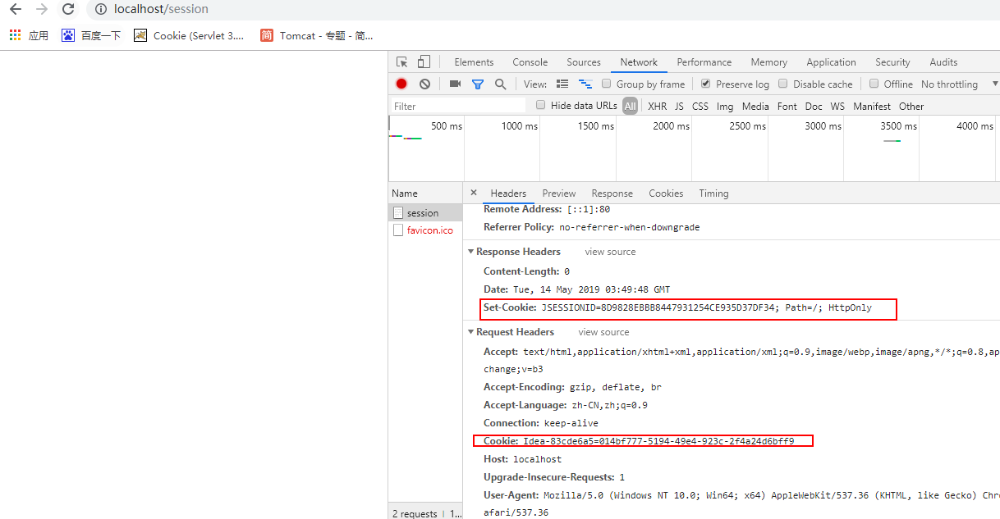

会发送一个响应头，里面是JSESSIONID=value值

再次访问：

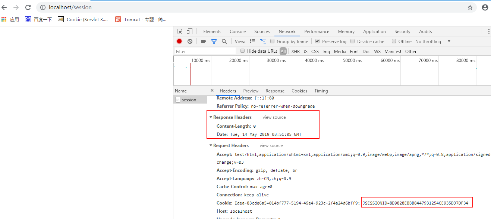

GetSession(create)有参

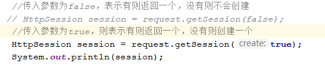

### 关闭浏览器，重新再访问，会创建新的session吗

本质上来说仍然是cookie的问题？因为JSESSIONID是保存在cookie中的。

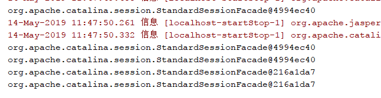

会重新创建一个新的session对象

假如重新打开浏览器，仍然可以看到原来的数据，应该做哪些操作。？？？

### 整个session执行过程

第一次请求，没有带上cookie，则服务器会给当前的浏览器新建一个session对象，同时把session的ID值，也就是JSESSIONID以响应头的形式发送给浏览器set-Cookie。

第二次请求，浏览器会带啥cookie，服务器在拿到cookie之后，解析出里面的JSESSIONID，找到相应的session，因为session已经存在，则不会再新建session了。

为什么关闭浏览器之后，服务器又会重新新建一个session对象？？？？

因为session的传递依赖于cookie，cookie默认的存在形式是存活在浏览器内存中，所以当关闭浏览器再次重新打开，则cookie失效，等价于第一次请求。

### Session的用法

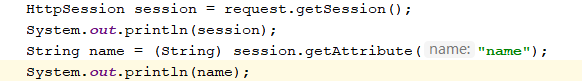

### Session的生命周期

Session的生命周期，request.getSession()方法调用，且当前浏览器不存在session的时候，会创建。

服务器关闭，session会死亡吗？？？？

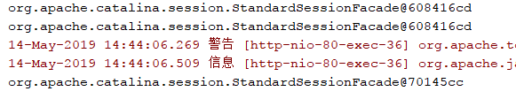

进入localhost/manager管理系统，将当前页面从服务器中卸载出去，之后再次加载进来，再次访问当前session，发现session会重新创建一个。

那session里面的数据会丢失吗？？？？

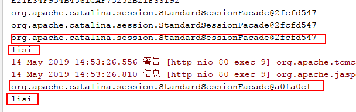

关闭服务器，session对象会销毁，重新打开服务器，会重新创建一个session对象，但是session中保存的内容不会丢失。

为什么不会丢失？？？？序列化、反序列化

将应用从当前服务器内卸载，发现

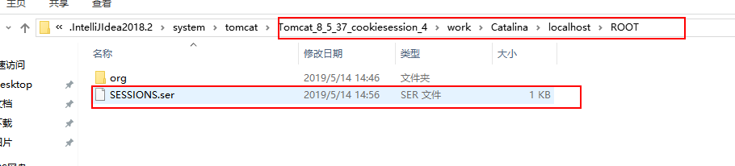

在该目录下，会新生成一个SESSIONS.ser文件，该文件就是session的序列化文件。

再次重新加载应用，sessions.ser文件会反序列化回到内存中。所以虽然session对象会重新创建一个，但是session中保存的内容不会丢失。

千万注意一点，不要直接关闭服务器来测试。

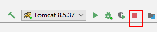

对于session中的数据而言，session数据的丢失不是服务器的关闭，而是session的有效期（默认情况下是30分钟有效期，30分钟内无人访问该session，则session失效）和主动调用session.invalidate();


在tomcat的conf/web.xml文件中，可以更改全局性的session有效期设置

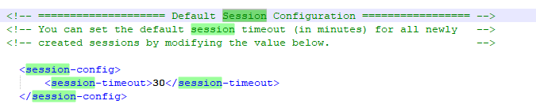

### 关闭服务器，session会重新创建吗

Session对象会重新创建，但是session中的内容不会丢失。

### 配置tomcat的manager管理系统

Localhost/manager,要求输入用户名和密码

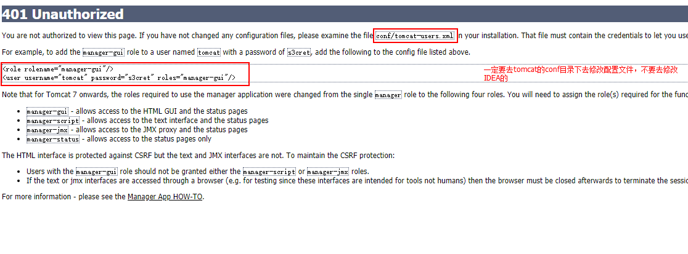

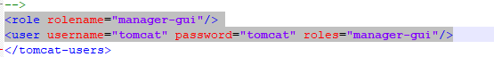

加上该节点即可。

### Session域

Session setAttribute/ getAttribute /removeAttribute

Session域 Context域 Request域

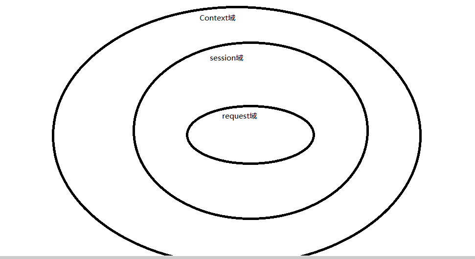

Context域：当前应用下所有的资源均可以使用的一个域

Session域：同一个浏览器，都可以访问的一个域（用户登录成功之后，将用户名放入session域中，接着进入个人主页，显示欢迎你，xxxxx，这个数据从session中获取。）

Request域：同一次请求内的资源可以访问，转发：源组件和目标组件之间。

### 综合案例-购物车

首页：展示商品，可以进行点击商品，查看详情

详情页：可以返回首页，添加到购物车

添加购物车：将商品添加到购物车

查看购物车：查看当前购物车内商品

### Session依赖于cookie，但是如果浏览器禁用了cookie怎么办

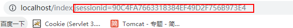

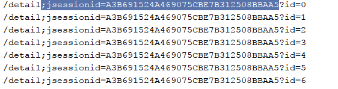

Response.encodeURL可以对url进行重写，与之前url地址的区别在于;JSESSIONID=、、、、。

# FileUpload

思路：上传的文件会在请求报文中，请求报文被tomcat封装到request对象中，因此，我们只需要从request对象中取出请求报文的请求体，也就是我们上传的文件。

Request.getInputStream();接下来就是常规的IO操作。

文件上传：


## 文件上传遇到的问题

### 仅上传文件名，不上传文件内容

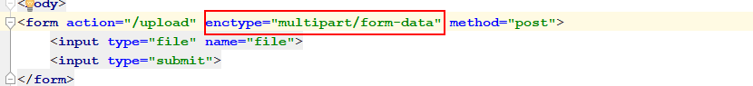

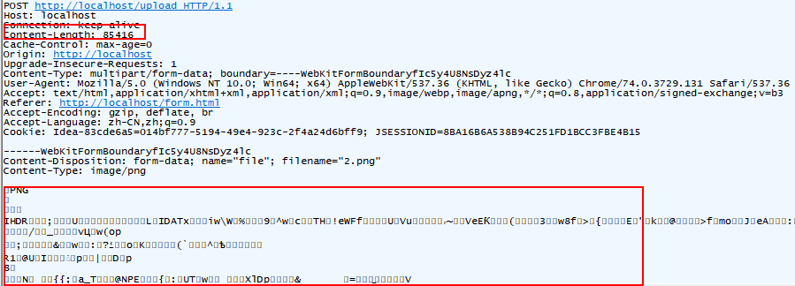

### 写代码处理上传，图片无法打开

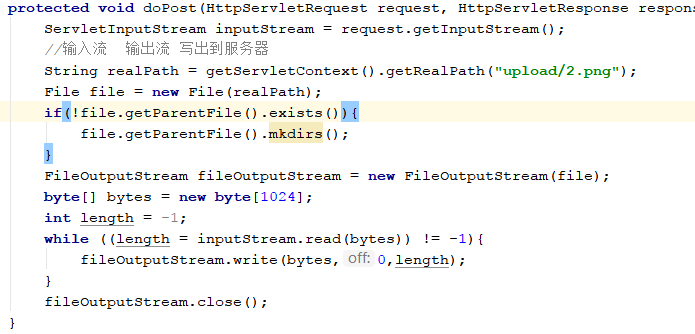

图片无法打开，已经损坏。原因？？？

使用一个txt文本进行上传，发现文件多了一部分内容。

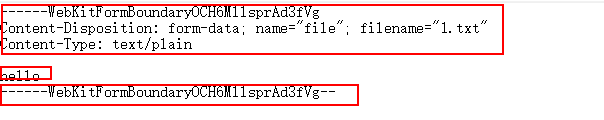

当文件上传和普通form表单数据一起提交的时候，表单数据被写入到文件中，因为我们没有写代码来进行分割。

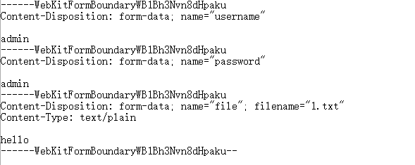

除此之外，还有什么？？？数据结构？？？？

添加multipart/form-data之后的请求报文结构

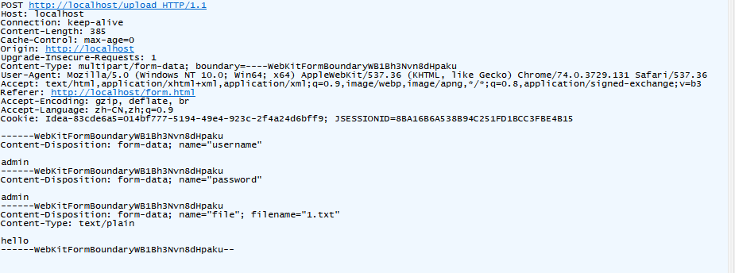

把multipart/form-data去掉

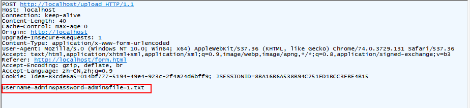

### 添加multipart/form-data之后，request.getParameter API不再适用

原因？？？数据结构发生了变化，所以无法再获取到参数。

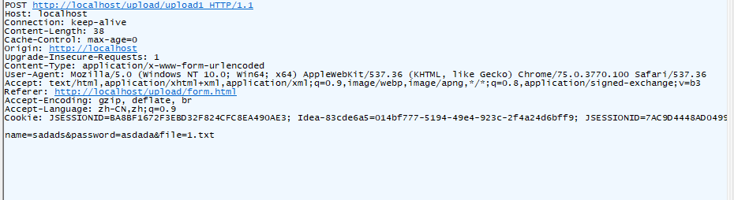

没有添加multipart属性之前，请求正文的数据组织形式，添加之后

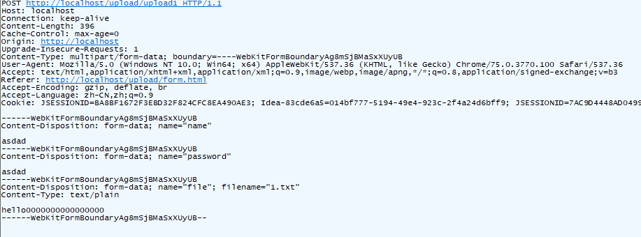

变成了这种形式。通过比较请求正文中的数据结构，是不是可以得出原因啊？

### 文件上传面临的问题

必须要添加multipart/form-data,不添加则不能上传文件。

添加之后，必须手动来处理普通form表单上数据和文件数据。

可以利用WebKitFormBoundary来进行分割出各部分数据，方向是对的，但是执行起来很有难度，因此，我们采用一个三方组件，jar包来完成文件上传。

## Commons-FileUpload

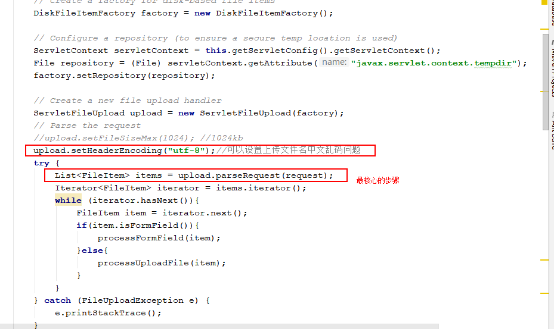

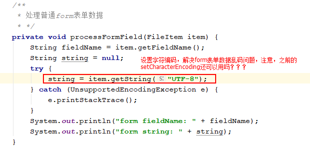

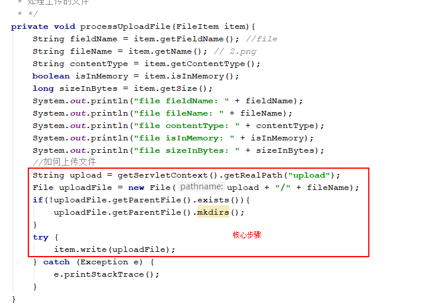

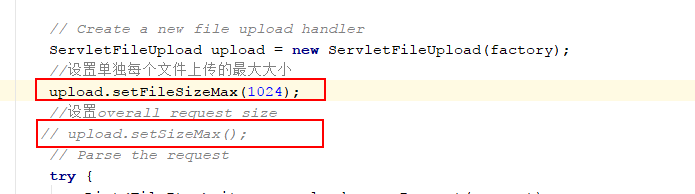

### 文件同名问题

（一份文件，服务器会保留多份，改名保存） 图片，头像

#### 怎么解决同名问题？

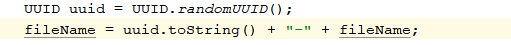

仅提供一个参考，不唯一，可以设置当前的时间前缀

### 同一目录下文件数过多的问题

同一目录下文件数过多，会导致文件读取很慢

Hashcode 散列

首先得到文件名的Hashcode，转为16进制的字符串。

接着将每一位的字符串分别新建一个文件夹 ，一共8级目录，每一级目录16个最多

最后，在相应的目录下存放对应的文件。

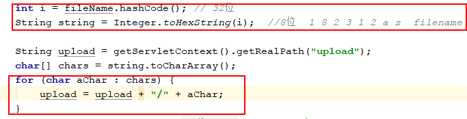


# JSP

## JSP全称

Java Server Pages。和html最大的区别在于，jsp可以开发动态web资源。

Jsp特点：

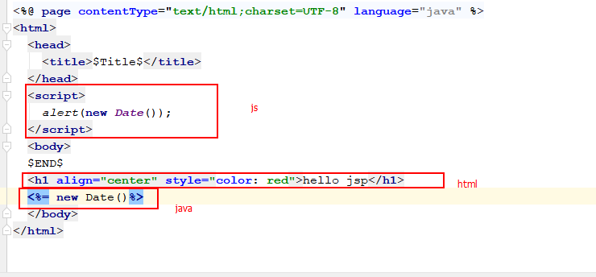

既可以在页面里写html，js等，也可以写java代码。

## Jsp原理

本质上来说，就是一个servlet，但是它是如何做到的？？

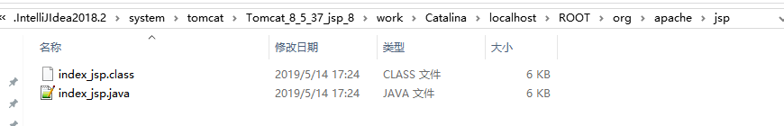

Jsp本质上来说，就是一个servlet，servlet的话，那就需要有java文件，class文件，文件路径

当在浏览器上访问某个jsp页面时，tomcat首先去寻找相应的jsp页面，然后jsp引擎将其翻译为java文件（servlet），java文件再编译为class字节码文件，然后tomcat调用该servlet的service方法，执行结果返回给浏览器端。

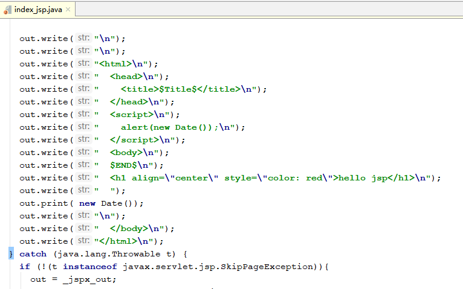

在index_jsp.java文件中，发现了如上代码

## JSP本质上就是servlet，为什么还需要有jsp

分工合作的思想，各司其职。代码便于维护，且界面比较美观。

## JSP语法

### Jsp表达式

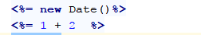

经过翻译之后的代码：

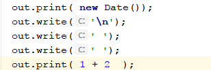

所以jsp表达式后面不能带;

### Jsp脚本片段

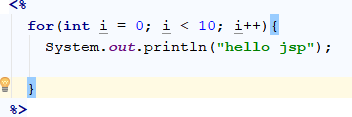

翻译之后：

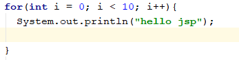

最终结果不会显示在客户端。

哪些能显示在客户端，哪些不能显示，就看会不会调用out.write方法。

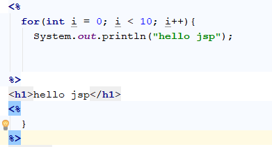

Jsp脚本片段的特点，每个片段可以不是完整的，但是经过组合之后，必须是一个完整的符合java语法结构的代码。Jsp脚本片段里嵌套html代码，循环输出。

### Jsp声明

无论jsp表达式还是jsp脚本片段里面的代码，都会被翻译到jspservice方法内部，而声明中的代码会被翻译到jsp
java文件的成员变量/方法。

### 三者之间的区别

Jsp表达式\<%=%\> ,里面的内容会被翻译成out.print()发送到客户端,所以不能有分号

Jsp脚本片段
\<%%\>,里面的内容会被原封不动的翻译到_jspService方法中，所以必须要有分号。

Jsp声明\<%!
%\>,里面的内容会被翻译到_jspService方法外部，成为一个成员变量或者方法。遵循java语法规范

### 注释

\<%----\> jsp注释，jsp翻译成java代码的时候，就会把该注释忽略掉

\<!----\>html注释，会被保留到html页面

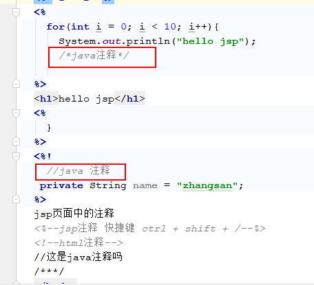

Java注释，只能写在jsp脚本片段里，以及jsp声明中。Jsp表达式内不能有注释。

### JSP三大指令

#### Page指令

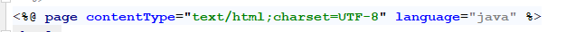

Import指令：

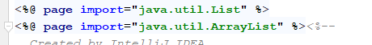

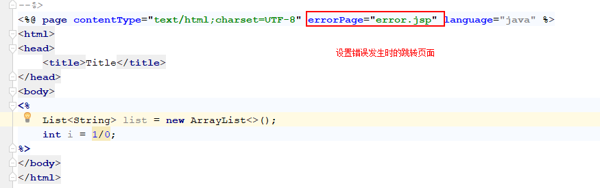

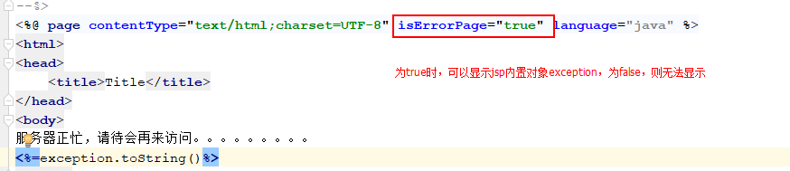

#### Include指令

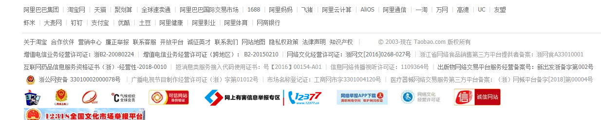

比如在网站的末尾，有一块固定显示区域。每个页面的这块内容都相同，这个时候，就可以采用include指令来把这个页面包含进来。

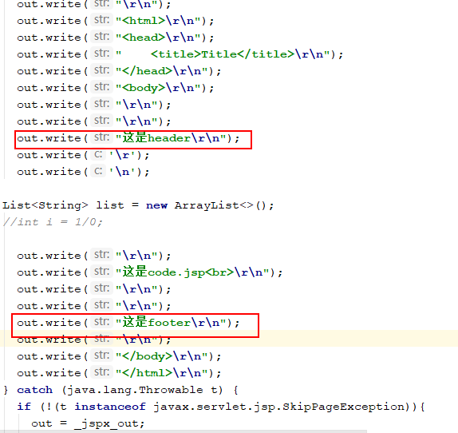

这种引入页面的方式称之为静态引入，把整个页面的内容囊括进来，在源文件里面进行编译。最终只会保留一个java文件。

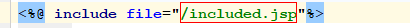

路径的写法：两种，以/开头的写法：/资源名，应用名省略，类比于requestDispatcher

> 不以/开头的写法：相对当前资源。

指令是给JSP引擎（JSP转为java的一段程序）看的。

静态引入的时候，会将被被引入文件的内容原封不同的写入到引入文件中，

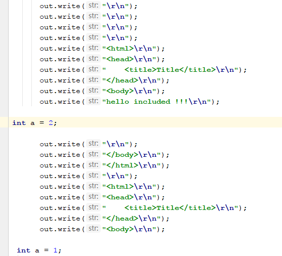

这里面有重复定义的变量，则会报错。

#### 动态引入

\<jsp:include\> ,会将两个jsp文件分别先翻译成java文件，之后通过

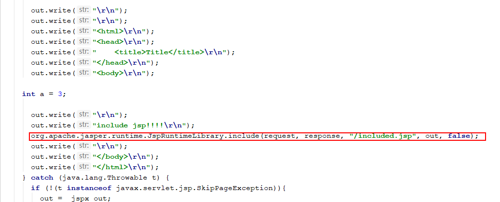

通过RuntimeLibrary.include将included.jsp响应的结果保存到out对象中，之后out对象一并发出响应。完成最终页面的显示。类比requestDispatcher.include方法。

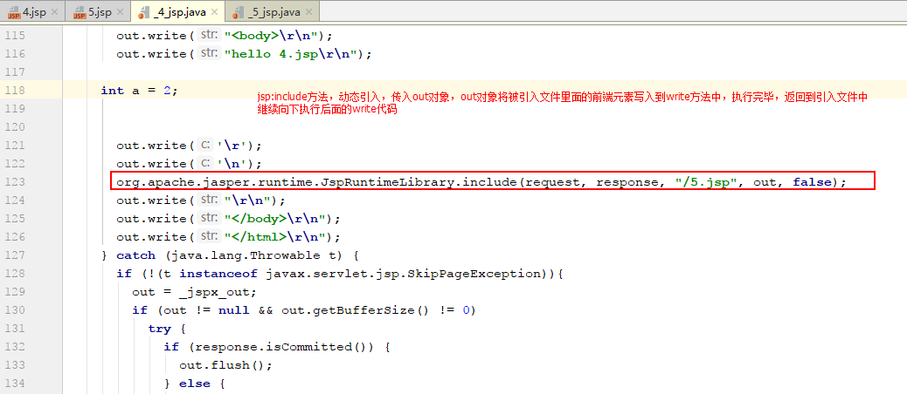

路径的写法，也是和requestDispatcher相一致。

### JSP九大内置对象

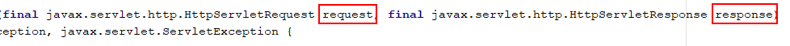

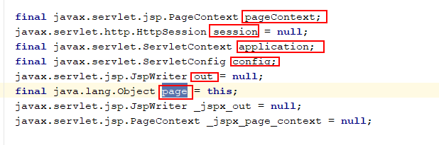

Exception只有当设置isErrorPage=true的情况下才会有

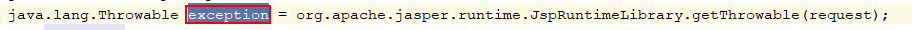

Servlet中有三个域：Context，session，request

Jsp中有四个域：pageContext，request，session，application（Context）

通过pageContext对象可以获取到其他八大对象。

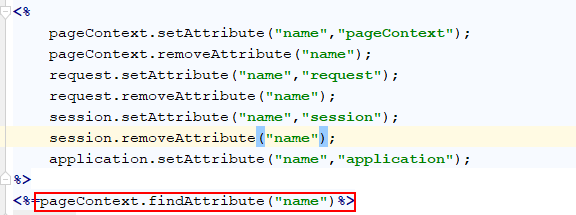

FindAttribute方法和getAttribute方法略有不同，如果在当前的pageContext域中找不到内容，则会去更广的一个域内去继续寻找，找到则结束，找不到则到appliation域为止。

PageContext.getAttribute（name）方法仅会在当前域内查找，如果调用的是PageContext.getAttribute（name，scope），name就会在对应的域里面去查找。

FindAttribute方法与前面的方法略有不同，该方法会从pageContext域开始从小到大域依次去通过相应的key去取value值，如果取到，这结束，如果取不到则返回null。

PageContext \< request \< session \< application

PageContext域作用范围，当前jsp页面

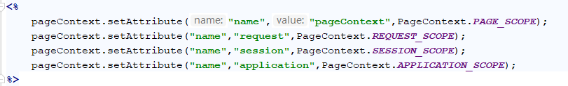

可以通过pageContext域给其他三个域赋值。

#### Out对象

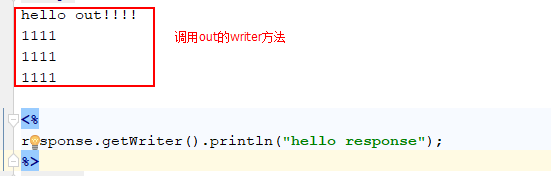

最终执行结果：


怎么理解：

Out.writer方法，首先将写的结果放进out对象自身的缓冲区内，缓冲区再一定条件下会刷新到response的缓冲区内，所以直接调用response.getWriter方法写入的内容，要先于out对象的内容，即便out对象输出的内容写在页面的前面。


Page指令有一个buffer属性，可以更改它的缓冲区设置，none则不缓冲在JspWriter对象的缓冲区内，直接写入response的缓冲区。

# EL表达式

## EL表达式是什么？为了解决什么问题

Expression
Language,作用就是为了简化jsp表达式获取数据的不方便性。Jsp表达式必须有懂java的开发人员来完成，但是jsp设想是可以应用到各种语言。

\${变量名}

EL表达式只能从域对象中获取数据。

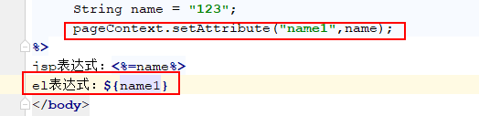

EL表达式在获取数据时，其实执行的是pageContext.findAttribute() 这个API

会依次从pageContext域，request域，session，application取出数据。取到数据则不会继续取下去。

但是可以通过指定特点的域中去取数据，比如sessionScope.key 或者requestScope.key

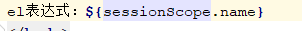

## EL表达式获取java bean属性

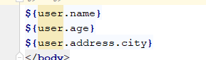

如何做到的？？通过反射调用bean中提供的相应的getter方法来获取

## EL表达式获取list

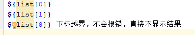

List[index]

## EL表达式获取map

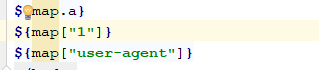

默认形式是map.key来获取，如果key是数字，或者key中包含-，这个时候就无法获取到相应的结果，就需要用[]括起来。  
需要特别注意的是，这个规律不仅仅针对map，其他的el表达式获取数据同样遵循这个规律。

## EL表达式运算符

Empty运算符， 三目运算符

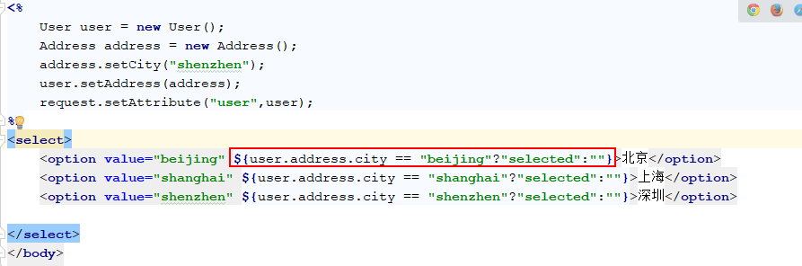

## EL表达式内11个隐式对象

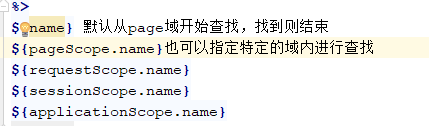

输入一个url为<http://localhost/el5.jsp?username=zhangsan>

通过\${param.username}可以获取到请求参数，该EL表达式其实就等价于request.getParameter(“username”)

需要记住的是第一个pageContext对象，pageContext对象可以获取jsp的九大内置对象。

# JSTL

## JSTL是什么？？

Jsp standard tag
library。JSTL的出现就是为了解决jsp语法和EL表达式无法进行条件判断，以及循环遍历等缺陷而产生的。

## JSTL使用

需要导包

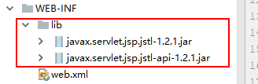

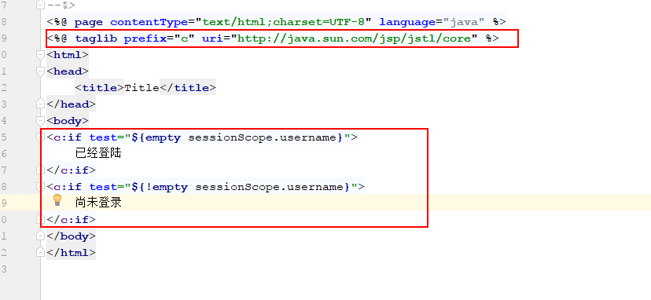

之后用taglib指令引入类库，我们最常使用的是core核心类库。Uri地址需要选择较长的那个，最新版本。

## Linster&Filter

## Listener

> Listener是Java Web三大组件之一，Servlet，Listener，Filter。

> 监听器用于监听Web常用对象HttpServletRequest，HttpSession，ServletContext。监听对象的生命周期以及属性变化（添加，删除，替换等）。

> 现实世界中的监听器：

> 监听谁：明星艺人

> 监听器：朝阳区人民群众

> 监听事件：吸毒

> 回调函数：报警

> 在说Listener之前，必须要先说一个概念，接口回调。在java中，无论什么种类，什么样的Listener形式，本质上，都是接口回调。

## 接口回调

> 在计算机程序设计中，回调函数，或简称回调，是指通过函数参数传递到其它代码的，某一块可执行代码的引用。这一设计允许了底层代码调用在高层定义的子程序。

> 人话：

> 我们先来举例说明一下什么是接口回调。比如说老板对员工说，先给你安排一个任务，任务完成了之后，给我发消息，我来看看你做的怎么样，再安排一个新的任务给你。

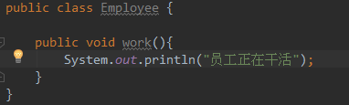

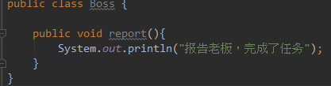

> 员工在做完手头的项目时，应该怎么做，是不是要:

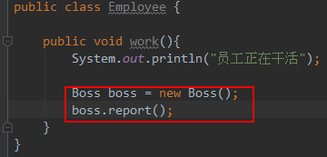

> 但是现在这里面有一个问题，就是这样写的话，会有一个问题，假如这个老板发生了变动，换成了另外一个直接的主管，那之前一批员工的直属领导是不是全都得变动，又或者员工发生了职位调动，这个直属关系也不在了。那这个时候，要一行一行去解决这些代码问题。

> 那有什么解决办法呢？我们新建一个接口

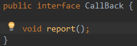

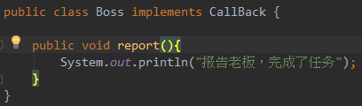

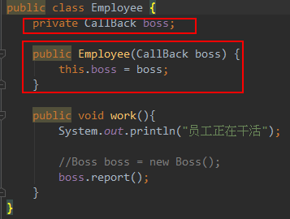

> Boss和Employee就通过接口完成了回调。

## 自己实现一个Listener

需要监听的对象：MyServletContext

监听器接口：Listener

监听器实现：MyListener

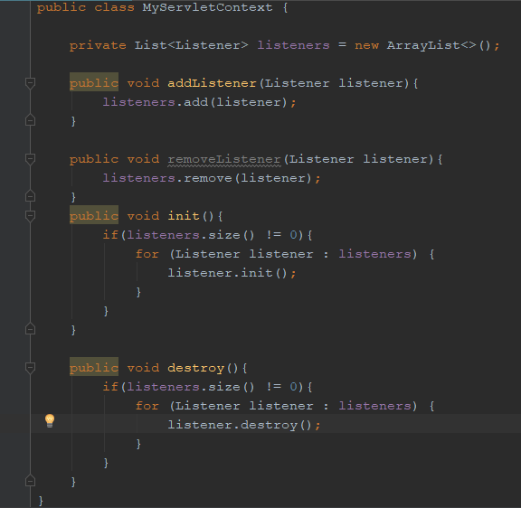


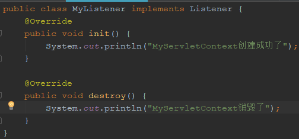

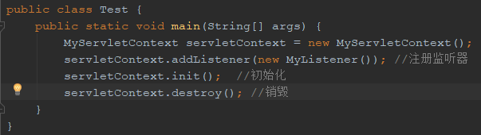

## Web Listener

> Servlet共提供了三种类型8个监听器。

### 三个域对象创建和销毁的监听器

#### ServletContextListener

> Listener的类型虽然有很多种，但是使用方式都是一样的。要想注册一个listener，首先编写一个类实现listener接口。

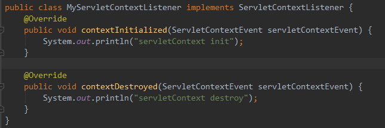

> 这样是不是就可以了呢？因为web服务器不知道有这么一个listener？你得告诉服务器我新增了一个监听器。在web.xml中注册监听器的信息。

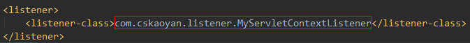

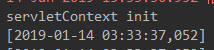

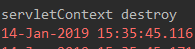

> 作用：完成一些初始化工作。

#### HttpSessionListener

> 访问html会创建session吗？jsp？servlet?

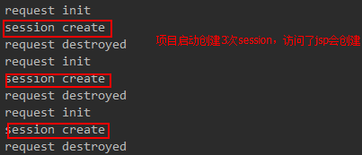

> 应用名为/时，IDEA内部会创建两次session。


> 创建两次问题？IDEA应用内置了一个浏览器，也会执行一次，打开外部浏览器也会一次。

> 作用：统计在线人数。

> 应用名为/，创建session三次

> 有相应应用名，创建session两次

> 去掉index.jsp，一次session都没创建

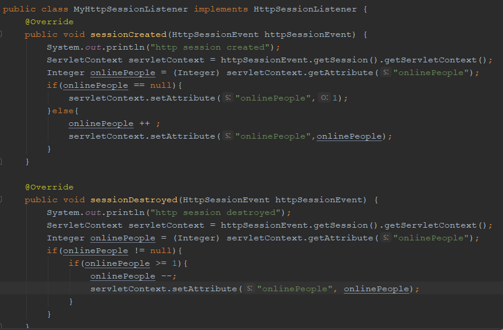

#### ServletRequestListener

### 三个域对象的属性变更的监听器

#### ServletContextAttributeListener

#### ServletRequestAttributeListener

#### HttpSessionAttributeListener

> 三个监听器很类似。

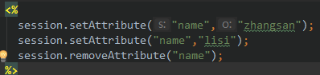

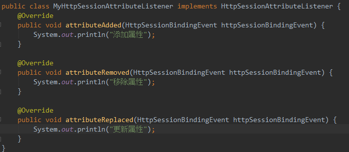

> web.xml注册listener。

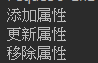

### 监听HttpSession对象中JavaBean状态的改变

> 这两个Listener的使用方式和之前的有很大不同，不需要通过注册web.xml.直接在相应的entity中实现相应的接口。

#### HttpSessionBindingListener

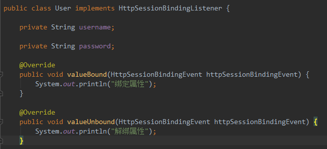

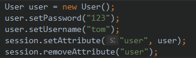

#### HttpSessionActivationListener

> 监听session中的是活化（反序列化）还是钝化（序列化）。

> 钝化（序列化）：内存中的数据存储到硬盘中。

活化（反序列化）：把硬盘中的数据读取到内存中。

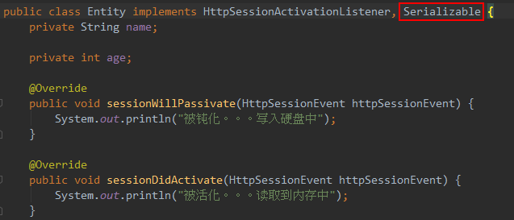

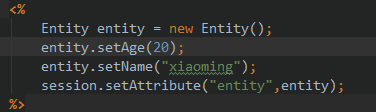

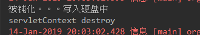

深坑，大坑，被活化，需要更改tomcat的context.xml文件，IDEA会复制tomcat中的配置文件到单个项目中使用。（session的位置不能为IDEA默认的work/catalina.....会删除目录）

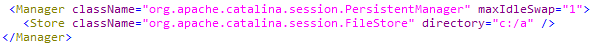

tomcat的context.xml设置这么一句话。

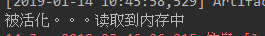

方法二：新建META-INF文件夹，新建context.xml

内容同上。

Session钝化、活化的意义？

内存中的session很多，如果很长一段时间没有使用内存中的session，占着稀缺的内存资源很浪费，可以让session中的值存到硬盘中。等再需要使用的时候，重新加载到内存中。

## Filter

## 什么是Filter

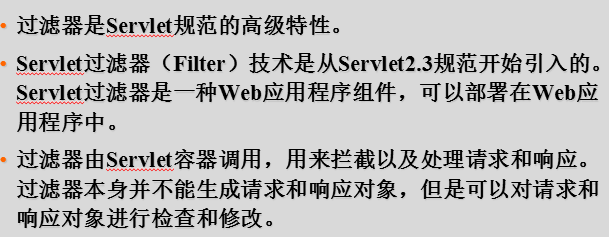

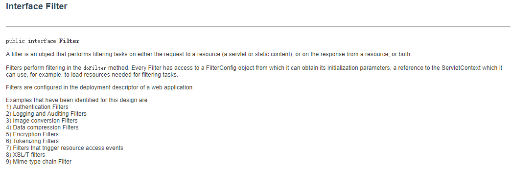

> 我们先简单介绍一下，后面还是用代码来理解Filter。

> 在说代码之前，我们先来简单讲述一下Filter的工作原理，它在web开发中所处的位置。

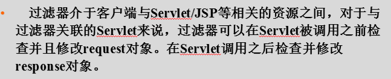

> 从这我们可以看出Filter所处的位置，画图讲述。是不是位于tomcat容器中，然后位于servlet/jsp的前面。

> 下面我们来看一下代码如何使用。

## Filter使用

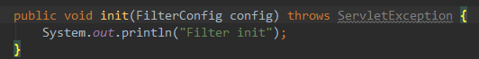

> Filter有三个方法，init,destroy和doFilter，init和destroy是不是和servlet很相似啊？Filter的init方法在什么时候执行呢？也是在项目启动的时候。我们可以看到在init方法中有一个参数FilterConfig对象，可以获取一些初始化的参数。

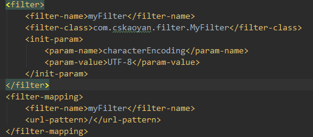

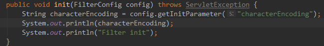

> Filter的配置也同servlet很类似。

> destroy方法呢？正常关闭服务器，是不是也会执行destroy的方法啊？自此也证明了destroy同servlet一样，在应用关闭的时候销毁。

> 对于Filter而言，最重要、核心的一个方法就是doFilter。

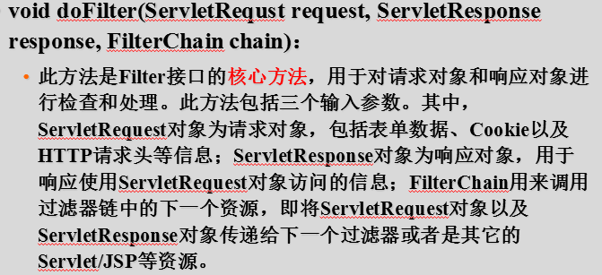

> 那如何才能让filter执行呢？(filter设定url-pattern为/filter，新建一个servlet，url
> /servlet，在doFilter里面加log，访问servlet，这个时候会执行吗？最终的结果是不是并不会执行啊？为什么不会执行呢？是不是filter的url-pattern和servlet的没有产生一点关联？那怎么才能产生关联呢？把filter的url-pattern设置为servlet的url，是不是就可以了。

> 我们再看doFilter方法中的三个参数

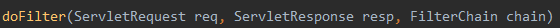

ServletRequest和ServletResponse请求，响应对象，我们是不是可以获取到请求以及响应信息中的一些参数啊？获取到有什么用呢？比如说我们可以设置一下request对象以及response对象的编码格式，那可能会有疑问，这个servlet不是也可以做吗，为什么要用filter来完成呢？为什么呢？

## filter的作用

用servlet来处理的话，是不是每个servlet都要做相应的处理，而如果配置了一个全局的filter的话，是不是只需要这一个filter就可以了?还可以做些什么呢？我们知道能做些什么事，就明白filter的作用了。

filter，它的名字是不是就是过滤器啊，那是不是可以过滤掉一些信息啊？举个例子，比如你的网站留言里面好多诸如游泳健身了解一下等广告信息时，你是不是可以选择屏蔽不显示，这个是不是也可以用filter来做。

> 设置自动登录是不是也可以啊？某些页面仅登录可见?这些功能是不是都可以用Filter来实现啊？

## filter的执行过程

> 好的，接下来，我们看一下第三个参数FilterChain，（不加第三个参数，filter不会放行到servlet）用来调用过滤器链中的下一个资源，将ServletRequest对象以及ServletResponse对象传给下一个过滤器或者JSP等。从这里我们可以得出一个信息，那就是filter可以设置多个，可以组成串执行。从最开始的Filter开始依次往后传，传给下一个filter，如果没有filter，那就将Request和Response对象传给Servlet或者JSP等。我们来看一下FilterChain这个参数有什么用？我们刚刚知道filter是可以组成串联的吧，接下来我们就编写3个filter来看看。

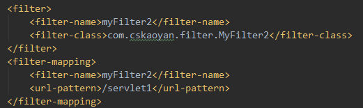

> 3个filter配置相同的匹配路径。doFilter前后各加上log，问，最终这三个log的执行顺序是什么样的？

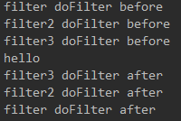

怎么理解这一过程呢？我们画图讲述。

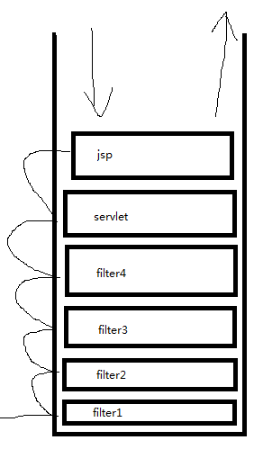

> 我们首先执行Filter1的doFilter方法，也就是说该方法入栈了，之后调用FilterChain的doFilter方法，这个方法的作用就是调用这一链上的其他资源入栈。如果是filter的话，就是继续执行下一filter
> 的doFilter方法，当遇到后面filter的FilterChain的doFilter方法时，重复刚刚的动作，继续调用下一个链上的资源，如果还是filter，那么和之前的过程一样。如果没有filter了，那么调用Servlet或者JSP，当执行完毕之后，出栈，重新返回上一栈，然后依次往下执行。代码上的表现形式就是入栈时，依次执行FilterChain.doFilter方法以前的代码，出栈时，反向依次执行FilterChain.doFilter方法后面的代码。我们也可以在IDEA的debug模式下，查看这一过程。

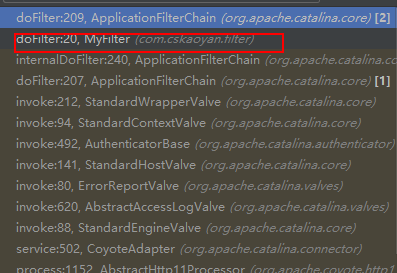

## 多个filter先后执行顺序

> 注解配置的filter，得看字母表先后顺序

> xml配置，看url-mapping的先后顺序

## filter的匹配规则

> 参照servlet /xxx x.do / /\*

## JavaEE串讲:

## HTTP:

请求报文 :

请求行 :  请求方法,资源名,版本号 

请求头:

空行 

请求正文 


相应报文:

响应行:版本号 状态码 描述

相应头

空行 

相应正文


## tomact

部署应用的几种方式

1:直接部署 : 直接放在webapps目录下或者打成war包

2.虚拟映射:在conf/server.xml中Host节点下配置Context节点;

在conf/catalina/localhost中新建应用名.xml文件,里面配置Context节点信息<Context path(可以省略)=docBase(指向的是你的应用的根目录)>


tomcat目录结构:

connector -->engne --> host-->app1


每一个应用:

1.在web.xml中或者在注解中定义的servlet或者Filter会被应用扫描,扫描完毕之后,将他们对应的url-pattern和相应的class字节码做一个映射

2.请求/servlet1到达该应用时,首先来匹配那些组件可参与进来,这些组件的url-pattern是否能够与当时访问url产生关联

3.将产生关联的一系列组件组成一个链表的形式,其中Filter在前,servlet或者JSP在最后

4.tomcat开始调用整个链表上的资源,从第一个FIlter开始,执行到chian.doFilter方法之后,跳转至下一个资源(如果还有Filter,那重复执行),如果后面没有Filter,则执行servlet的service方法,其中ServletRequest对象和ServletResponse对象贯穿整个系列.

5.servler的service方法执行完毕之后,再次反向调用该链上的所有资源,其中Filter的话,依次执行chain.doFilter方法下面的代码

6.所有组件执行完毕之后,tomcat读取ServletResponse对象里面的内容,然后将其转换成对应的相应报文的格式,来完成整个Http请求过程


细致分析Servlet的Service方法执行过程中,一些比较重要的对象

ServletContext对象:

​		当应用在启动的时候,会新建唯一的一个context对象,该对象可以理解为就代表了当前的应用.可以作为一个全局性存取数据的场所,无论什么组件,均可以使用!

​		该对象重要的API:

​		getRealPath():获取web应用下资源文件的绝对路径(和se项目有很大的不同)

​		setAttribute/getAttribute/removeAttribute:   域API,存取数据


ServletConfig对象:

​		它的作用范围是某个servlet组件,也就是说仅该servlet可以使用该对象

​		获取servlet初始化参数(仅仅可以获取对应servlet对象的初始化参数)


ServletRequest对象:

​		就是请求报文的封装.提供了非常全面的API来获取请求报文的方方面面.

​				1.客户机和当前服务机的参数

​				2.获取客户端提交过来的请求参数(非常重要)request.getParameter系列

​				3.提交过来的参数中文乱码问题:request.setCharacterEncoding(utf-8)

​				4.请求的转发包含:只要是用于将多个组件协同来处理某个请求

​						转发和包含之间的区别和联系:

​								1.转发:源组件先对请求做一些处理,接着将请求转发给目标组件,由目标组件来作为最后的相应.  特点:对于源组件而言,留头不留体.允许源组件可以对最终的相应作出一些相应头的贡献,但是相应体有目标组件来生成.

​								2.包含:源组件将目标组件包含到自身中来,协同一起发出最终的相应.特点:源组件的话. 留头也留体. 不仅仅相应头可以留下,相应体也能留下.

​								转发只要用在servlet转发到jsp然后显示结果.  包含的话,主要用在一个jsp页面包含(引用) 其他页面,协同完成相应. header.jsp  footer.jsp

​				5.Request域:

​						作用范围有多大?对一次请求内有效. 就是转发包含的源组件和目标组件可以共享.比如在servlet中存放某些数据,然后转发到jsp页面 .jsp可以取出数据.

​		

​		该对象里面的数据将来会被tomcat读取,然后发送给客户端,作出相应.

​		比较核心的功能:

​		1.输出字符流数据:输出中文可能乱码问题

response.setContentType(text/heml;charset=utf-8)

​		2.字节流输出文件:reponse对象提供OutputStream,所以需要开发人员自行提供inputStream.  常规IO操作

​		3.定时刷新,重定向: 用于页面跳转 . 要与之前学的转发包含注意区分!


Java WEB中各种标签路径的写法:

​		两种:以/开头,推荐的写法 ,相对于的是应用目录(看执行主体:服务器则不需要加应用名,直接写/资源名 ;  执行主体是浏览器,则/应用名/资源名)

​		不以/开头 相对的是当前的资源


又由于Http协议是无状态协议(没有记忆功能,无法存储一些数据),但是在实际应用过程中,不可避免需要存储一些用户数据,所以引入了会话技术:

cookie:

​		客户端技术:存储的数据存放于浏览器端. 大小有限制,一般情况下存储一些不敏感的数据.

​		使用过程:

​				1.用构造函数新建一个cookie,同时制定key和value值

​				2.通过response.addCookie可以将该cookie添加到相应头中

​				3.利用request.getCookie可以获取到请求报文中所有的cookie

​				4.默认情况下cookie仅存在于浏览器内存中,关闭浏览器则失效

​				5.若要持久化保存cookie,则需要设置一个setMaxAge,设置一个正数,表示存活时间为多少秒

​				6.如果删除cookie,则需要设置MaxAge为0,同时需要特别注意:如果cookie创建的时候指明了path.则删除的时候要和新建的时候path一致.path的话,当访问的url是是指的path路径时,带上该cookie

session:

​		服务端技术. 保存在服务器的一块内存区域中.存储大小不受限制. 因为保存在服务端,所以安全性相较于cookie有很大提升.

​		session的使用:

​				1.通过request.getSession来新建一个Httpsession对象,但是此时可以不在里面存储数据,这点和cookie有区别.

​				2.session作为一个域. 可以存取数据.

​		session执行过程:

​				1.通过request.getSession 来创建一个session对象时,会将session对象的唯一标识ID,通过setCookie相应头发送给浏览器

​				2.浏览器再次访问带上该标识,tomcat会帮助我们做一些事情,取出JSESSIONID的cookie,然后去找该id值的session对象.

​				3.之后如果使用了session.getAttrbute方法,取出相应的session对象中的数据

​		session 的生命周期:

​				1.创建:request.getSession ,session 对象的创建和存放数据是两个独立的步骤

​				2.销毁:session对象的销毁:关闭服务器,session对象会销毁,但是里面的数据可以保留下来,其中如果将一个bean序列化,要实现Serializable接口,否则反序列化时取法取出数据;   session有效期. 对于session中的数据,主动调用session.invalidata方法或者session.removeAttibute,session有效期到,其他方法,数据不会丢失.

​		思想:就是读取request对象的inputStream,然后写入到web根目录下等.

​		首先: form表单方法必须要为post方法,其次要有entype=multipart/form-data,之后服务器端需要引入一个commons-FileUpload组件来解析请求.其中需要注意的是:在这个时候,request.getParamer系列API不再适用.也就是说,如果这个时候,想获取普通form表单数据,需要适用组件来获取.


JSP:Jsp的执行过程:

​		本质上来说就是servlet. 当访问某个jsp时,请求其实是交给tomcat内部的一个JSP引擎(本质上来说也是servlet,url-patern为*.jsp) ,他的处理过程就是将jsp页面转换成对应的java文件. 然后编译成class字节码文件,最后执行该文件的_japService方法.

​		jsp脚本片段里面的代码会原封不动的翻译到_jspService方法里

​		jsp声明里面的代码会被翻译到 _jspService方法外部

JSP九大内置对象:可以直接使用,位于_jspService方法内.

​			 		pageContext域,利用该对象可以获取其他八大对象. 作用范围,当前页面					resquest域

​					session域

​					application域(context)

​					response,config,exception,out(它的输出和response输出的区别,buffer),page

​		

​		数据库部分:

​				SQL书写

​				JDBC:java的数据库连接. JDBC代码怎么写

​				... ...


​			事务的四个特性:ACID

​			原子性:不可分割的最小单位

​			一致性:从一个一致性状态转变到另一个一致性状态.

​			隔离性:并发访问事务时,数据库提供的各个事务之间的相互不受影响.(最重要的一个特性)

​			持久性

​			隔离性做的不够好,会有以下三种问题:

​					脏读(一个事务读取到另一个事务未提交的数据)

​					不可重复读(一个事务读取到另一个事务提交的数据)

​					虚读(一个事务读取到另一个事务新增的数据)

转发包含重定向之间的区别:

三种页面跳转技术应该怎么选择？？？？
1.如果需要多个组件之间共享数据，转发 （）
2.如果想要页面跳转有更好的一个交互性，可以选择定时刷新
3.如果要跳转至外部链接（当前应用外的链接），一定要选择重定向或者定时刷新


三者之间的区别:

1.执行主体 ： 转发是服务器                                重定向、定时刷新是浏览器

2.什么对象介导的： 转发包含是request对象    重定向定时刷新是response对象

3.能否共享request域：转发包含可以共享         重定向、定时刷新不可以

4.地址栏url是否发生变化： 转发包含不变化     重定向、定时刷新变化

5.发送请求的次数：转发包含一次                       重定向、定时刷新2次

6.能否访问外部链接：转发包含不可以               重定向、定时刷新无限制

重定向和定时刷新又有什么样的区别？？？      重定向状态码302/307  定时刷新状态码200


浏览器端相应乱码:

response.setContentType("text/html ; charset=utf-8")

response.setHeader("content-type;text/html;charset=utf-8")

# MVC

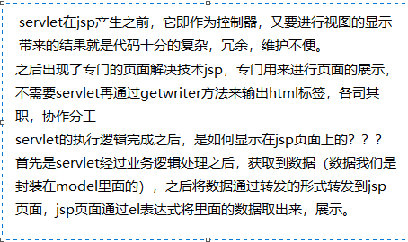

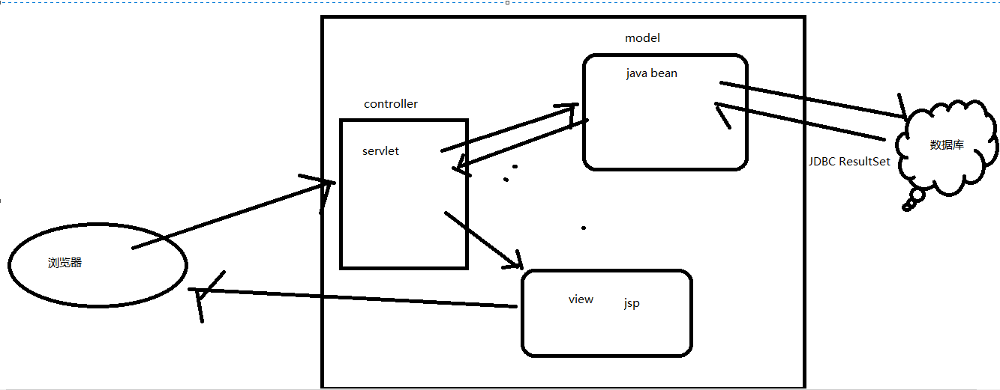

mvc三层架构：

首先浏览器访问服务器，这个时候sevlet作为控制器，进行一个业务逻辑的处理，将请求转发给模型，模型去到数据库中取出对应的数据（对应于JDBC的代码），之后模型取到数据之后，将结果交给servlet，servlet再次将结果转发给jsp来展示（对应于servlet通过将结果塞进相应的域中，然后转发到jsp页面的代码。），jsp页面渲染数据，最终呈现出最终的页面（对应于jsp通过jstl标签，el表达式来渲染数据这部分代码。）

## 用mvc对登陆功能进行重构

### 再分割出一个dao层

业务逻辑层再分出来一个dao层，专门用以对数据库的操作访问。专门用来和数据库打交道。

有一个问题？里面的方法需要静态方法吗？？

分层之后，最好该项目架构是可扩展性的。可扩展性表现在什么地方？？如果我现在有一个dao层的实现，后面又有了一个新的dao层的实现，实现的具体代码逻辑不同，这个时候，怎么变换方便？？制定一个标准。

### 还可以进一步分割出一个service层

比如，京东的订单页面，查询一个表得到的结果无法在页面中进行渲染，需要查询多个表，然后将这些数据进行重新一个组装，组装成前端页面所需要的格式，那这些操作在哪个层里完成？？？

Dao层：不合适，只用来操作sql语句。每个模块做的功能越少越好，只有每个模块的功能足够少（单一职责），才可以用来复用。

Controller层：转发，中转，获取数据之后，封装到模型中，之后模型去访问数据库取出数据，交给controller层，然后转发给视图层。

Service层：业务层。业务层的主要职责，就是将dao层执行的结果进行进一步的组装，组装成前端所需要的格式，然后将结果传给controller层，controller层再将结果转发给view。

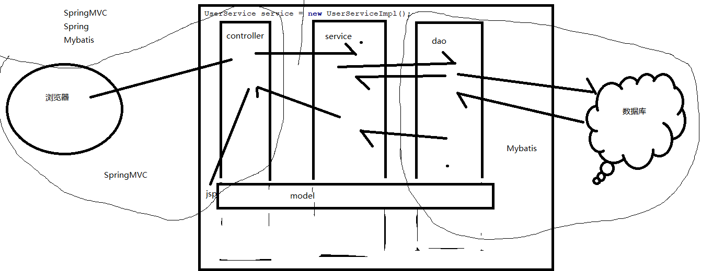

1. 首先先将数据保存在json文件中，实现用户的注册登录逻辑
2. 之后将逻辑更改，然后将数据保存到Mysql数据库中，这个时候需要做变更

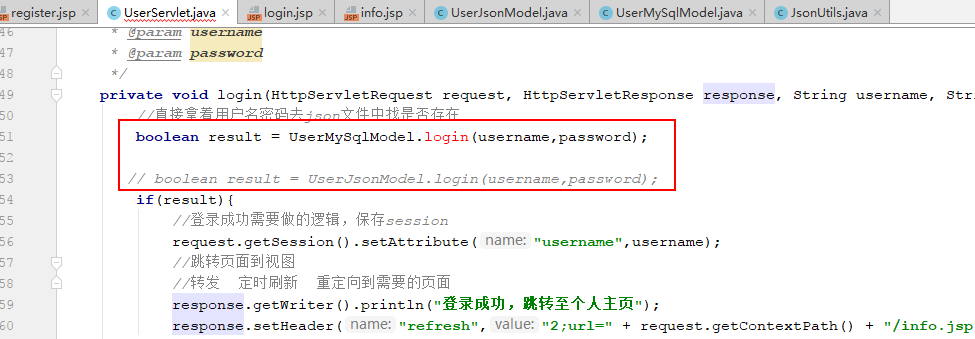

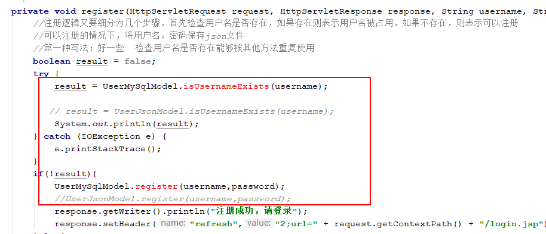

这个时候，Model层代码发生变更，controller层代码跟着受影响，需要做很大的调整。解耦。各个模块之间的耦合程度应当尽可能的低。

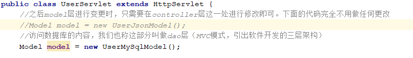

之后根据之前所学的面向接口编程的思想，新建一个接口，然后规定各种API的名称，UserJsonModel和UserMysqlModel分别实现该接口，这样的话，controller层因Model变更所做的变更只需要一行代码即可。

与数据库交互的这一层的话，我们又称为dao层，所以将UserMysqlModel改为UserDao

在之后进行项目重构，当我们想实现一个分页显示用户信息的时候，发现现有的controller和dao层两层不能够很好的表现出该功能，

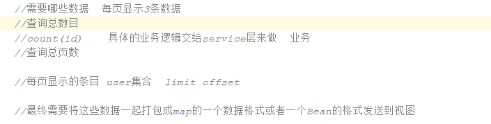

Controller层的职责：进行前端数据校验，然后转发给其他层来进行处理，处理的结果返回，根据结果再将请求分发到相应的视图

视图：显示模型的数据

Dao层：专门用来和数据库进行交互。

进一步引出三层架构的最后一层service层，也称为业务层。本着解耦的思想，所以service层也应当是接口。

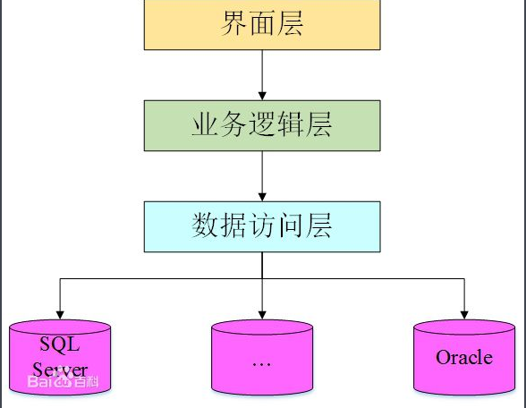

三层架构:

三层架构(3-tier architecture)
通常意义上的三层架构就是将整个业务应用划分为：界面层（User Interface
layer）、业务逻辑层（Business Logic Layer）、数据访问层（Data access
layer）。区分层次的目的即为了“[高内聚低耦合](https://baike.baidu.com/item/%E9%AB%98%E5%86%85%E8%81%9A%E4%BD%8E%E8%80%A6%E5%90%88/5227009)”的思想。在软件体系架构设计中，分层式结构是最常见，也是最重要的一种结构。微软推荐的分层式结构一般分为三层，从下至上分别为：数据访问层、业务逻辑层（又或称为领域层）、表示层。

## MVC和三层架构:

三层架构和MVC

三层架构 (3-tier application)
是将整个业务应用划分为：表现层（UI）、业务逻辑层（BLL）、数据访问层（DAL）。区分层次的目的即为了“高内聚，低耦合”的思想。 

1、表现层（UI）：展现给用户的界面，即用户在使用一个系统的时候的所见所得。    

2、业务逻辑层（BLL）：对数据层的操作，对数据业务逻辑处理。    

3、数据访问层（DAL）：直接操作数据库，针对数据的增添、删除、修改、更新、查找等。

MVC是
Model-View-Controller，严格说这三个加起来才是三层架构中的UI层，也就是说，MVC把三层架构中的UI层再度进行了分化，分成了控制器、视图、实体。控制器完成页面逻辑，通过实体来与界面层完成通话，而C层直接与三层中的BLL进行对话。

MVC 可以是三层中的一个表现层框架，属于表现层。三层和mvc可以共存。
三层是基于业务逻辑来分的，是一个架构设计，而MVC是基于页面来分的，是一种设计模式。


# Interview

## 1.Servlet相关

### 1.servlet生命周期：


三个阶段：

1.init()：仅执行一次，负责在装载Servlet时初始化Servlet对象

2.service() ：核心方法，一般HttpServlet中会有get,post两种处理方式。在调用doGet和doPost方法时会构造  	servletRequest和servletResponse请求和响应对象作为参数。

3.destory()：在停止并且卸载Servlet时执行，负责释放资源

初始化阶段：Servlet启动，会读取配置文件中的信息（加载Servlet类和对应的.class文件），构造指定的Servlet对象，创建ServletConfig对象，将ServletConfig作为参数来调用init()方法。


### Servlet的生命周期，jsp的底层原理，servlet和jsp的区别

### 

### Servlet和filter执行先后顺序


## 2.forward和redirect是最常问的两个问题（.jsp的知识）

forward，服务器获取跳转页面内容传给用户，用户地址栏不变

redirect，是服务器向用户发送转向的地址，redirect后地址栏变成新的地址

牛客一个问题：

```html
<html>  
     <head><title> 跳转  </title> </head> 
     <body>  
         <jsp:forward page="index.htm"/>     
     </body>
 </html> 
```

如果运行以上jsp文件，地址栏的内容为：

```java
http://127.0.0.1:8080/myjsp/forward.jsp
```


## 3.HTTP错误码


## 4.会话技术Cookie，Session相关

### Cookie、Session

要在session对象中保存属性，可以使用：

```java
session.setAttribute(“key”，”value”)
```


**session.setAttribute()和session.getAttribute()配对使用**，作用域是整个会话期间，在所有的页面都使用这些数据的时候使用。request.getAttribute()表示从request范围取得设置的属性，必须要先setAttribute设置属性，才能通过getAttribute来取得，

设置与取得的为Object对象类型。其实表单控件中的Object的 name与value是存放在一个哈希表中的，所以在这里给出Object的name会到哈希表中找出对应它的value。setAttribute()的参数是String和Object。


###  Cookie和Session的区别？

### session如何保存元素

### Cookie和Session的区别，Session怎样识别同一次会话是同一个人？

### Cookie和Session有什么区别，Session具体是什么含义，它是怎么知道两次会话是同一个人的？

### seesion的同步问题怎么解决的？（微服务里面）

### 你们的token是用来干嘛的？session和cookies


## 5.过滤器 拦截器相关

### interceptor和filter在哪里用的，是做什么的 

### filter和拦截器哪个先执行，为什么

### 过滤，监听的区别


## 6.重定向

### Forward和redirect的区别

​				


