# JavaSE

## Java简介


### Java发展

### JDK安装配置


## 程序基本概念


### 注释

### 标识符和关键字

### 数据类型划分


#### 整型

#### 浮点数

#### 字符型

#### 布尔型

#### String型


### 运算符


#### 基本运算符

#### 三目运算符

#### 逻辑运算符

#### 位运算符


### 程序逻辑控制

#### 分支

#### 循环

### 方法


#### 重载

#### 递归调用


## 面向对象基本概念

### 类和对象

### 封装

### 构造方法

### 匿名对象

### 简单Java类

### 数组


#### 一般数组

#### 二维数组

#### 对象数组

### String类的基本概念

### String的常用方法


#### 字符串比较

#### 查找

#### 替换

#### 截取

#### 拆分

### this关键字

#### 调用本类属性

#### 调用本类方法

#### 表示当前对象


### 引用传递

### static关键字

#### static定义属性

#### static定义方法

#### 主方法

#### static的实际应用


### 代码块

#### 普通代码块

#### 构造块

#### 静态代码块


### 内部类


### 链表


## 面向对象高级知识


### 封装

### 继承

### 多态

### 抽象类

### final关键字

### 接口

### Object类

### 匿名内部类

### 基本数据类型的包装类

#### 装箱和拆箱操作

#### 数据类型转换


## 包的控制访问权限


### 包的定义导入

### jar命令

### 访问控制权限

### 命名规范


## 异常的捕获以及处理


#### 异常处理流程

#### throws关键字

#### throw关键字

#### assert关键字

#### 自定义异常

#### 项目中全局异常处理


## 多线程

### 线程进程

### 多线程的实现

### 多线程的操作

#### 线程的命名

#### 线程休眠

#### 线程优先级

### 线程的同步和死锁

### 线程间经典操作案例--生产者消费者案例

### 线程的生命周期


## Java常用类库

### StringBuffer类


### Runtime类


### System类


### 对象克隆


### 数字操作类

#### Math类

#### Random类

#### 大数字操作类


### 日期处理类

#### Date类

#### 日期格式化类--SimpleDateFormat

#### Calendar类


### 比较器

#### Arrays类

比较器Comparable类

数据结构 BinaryTree


### 正则表达式


### 反射机制

认识反射

Class类对象实例化

反射实例化对象

使用反射调用构造

反射的调用方法

反射调用成员

### 国际化


## Java IO流

文件流

字节流和字符流

转换流

打印流

System对IO的支持

字符缓冲流

扫描流

对象实例化


## Java网络编程

## Java类集框架（集合）


## 反射

## 注解

### @SuppressWarnings

参考：https://www.cnblogs.com/fsjohnhuang/p/4040785.html


## Java8 新特性


### 可变参数

### foreach循环

### 静态导入

### 泛型

### 枚举


进度：lambda 第四个 看了一点 ，Stream API 看完  Lambda和Stream 都是从练习题开始没看。


- Lambda表达式
- 函数式接口
- 方法引用与构造器引用
- Stream API
- 接口中默认方法与静态方法
- 新时间日期API
- 其他新特性


### 新特性简介

- 速度更快 （HashMap）
- 代码更少（增加了新的语法Lambda表达式）
- 强大的Stream API  （意味着在Java中操作数据就像操作sql一样方便）
- 便于并行
- 最大化减少空指针异常 Optional

其中最核心的是Labbda表达式，和Stream API


### Lambda表达式

是一个匿名函数，我们可以把Lambda表达式理解为**一段可以传递的代码**（将代码像数据一样进行传递），可以写出更高效灵活的代码。


在学习这部分的时候，Demo中有一个：

```java
List<Employee> employees = filterEmployee(employeeList,(e) -> e.getSalary() <= 5000);
		employees.forEach(System.out::println);
```

下面的双冒号：：

参考：https://blog.csdn.net/lsmsrc/article/details/41747159?utm_medium=distribute.pc_relevant_t0.none-task-blog-BlogCommendFromMachineLearnPai2-1.nonecase&depth_1-utm_source=distribute.pc_relevant_t0.none-task-blog-BlogCommendFromMachineLearnPai2-1.nonecase


小总结：

在使用过程中，发现双冒号后面的方法必须要加static才可以用双冒号引用。


#### Lambda表达式六种格式

```java
/**
 * 一：Lambda表达式基础语法：Java8中引入一个新的操作符 “->” 该操作符为箭头操作符或者Lambda操作符
 * <p>
 * 左侧：Lambda的参数列表
 * 右侧：Lambda表达式中所需要执行的功能，即Lambda体
 * <p>
 * 语法格式一：无参数，无返回值
 * () -> System.out.println("hello lambda");
 * <p>
 * 语法格式二： 有一个参数，并且无返回值
 * (x) -> System.out.println(x);
 * <p>
 * 语法格式三： 若只有一个参数，小括号可以不写
 * x -> System.out.println(x);
 * <p>
 * 语法格式四： 有两个以上的参数，有返回值，并且 Lambda体重有多条语句
 * Comparable<Integer> comparable = (x, y) -> { //有多条语句lambda体必须要有大括号
 * 	System.out.println("函数事接口");
 * 	return Integer.compare(x,y);
 * };
 * 
 * 语法格式五： 若lambda体中只有一条语句，return和大括号都可以省略不写
 * 
 * 语法格式六： Lambda 表达式的参数列表的数据类型可以省略不写，因为JVM编译器可以通过上下文推断出,数据类型，即“类型推断”
 */
```


#### 口诀

上联：左右遇一括号省 

下联：左侧推断类型省

横批：能省则省


解释：

上联：箭头左边和右边，如果左边只有一个参数，或者右边只有一个语句，则左边小括号和右边大括号是可以省略的。

下联：箭头左边参数类型可以省略，因为他可以根据上下文推断出来。


#### Lambda 表达式需要“函数式接口”的支持

函数式接口：接口中只有一个抽象方法接口，成为函数式接口，可以使用注解@FunctionInterface 修饰，可以检查是否是函数式接口。

```java
/**
 * 策略模式
 * @author Steve
 * @date 2020/7/13-17:23
 */
@FunctionalInterface  //加了这个注解，下面只能有一个，如果有两个就会报错
public interface MyPredicate<T> {
	public boolean test(T t);
	
	//public boolean test2(T t);
}
```

报错：

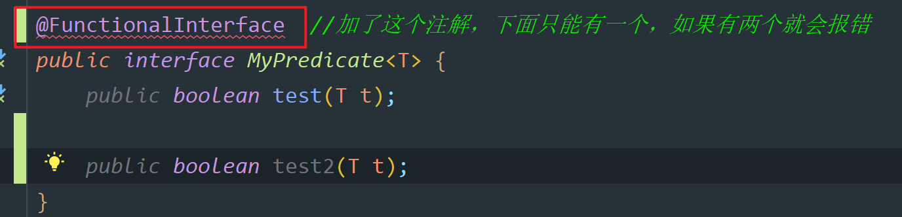


### Stream API

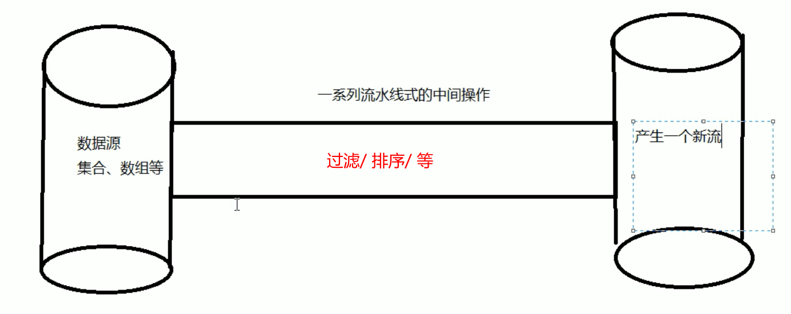

进行一系列的操作以后，原来的数据源是没有发生变化的。


“集合讲究的是数据，流讲究的是计算”


#### 注意

- Stream 自己不会存储元素。
- Stream 不会改变源对象。相反，他们会返回一个持有结果的新Stream。
- Stream  操作是延迟进行的。这意味着他们会等到需要结果的时候才执行。


#### Stream 的操作三个步骤

- 创建Stream 

一个数据源（如： 集合、数组），获取一个流

- 中间操作

一个中间操作链，对数据源的数据进行处理

- 终止操作

一个终止操作，执行中间操作链，并产生结果


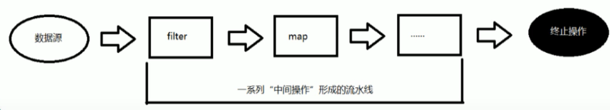


##### 创建Stream

```java
	//创建 Stream
	@Test
	public void test1() {
		//1. 可以通过Collection 协力集合提供的stream（）或者 parallelStream（）\

		List<String> list = new ArrayList<>();
		Stream<String> stream = list.stream();

		//2. 通过Arrays中的静态方法 stream() 获取数组流
		Employee[] employees = new Employee[10];
		Stream<Employee> stream2 = Arrays.stream(employees);

		//3. 通过Stream 类中的静态方法of（）
		Stream<String> stream3 = Stream.of("aa", "bb", "cc");

		//4. 创建无限流
		//迭代
		Stream<Integer> stream4 = Stream.iterate(0, (x) -> x + 2);
		//stream4.forEach(System.out::println);

		//生成
		Stream.generate(() -> Math.random())
				.limit(5)
				.forEach(System.out::println);
	}
```

##### 中间操作

###### 筛选和切片

* filter--接收Lambda ，从流中排除某种元素。
* limit -- 截断流，使其元素不超过给定数量。
* skip（n） -- 跳过元素, 返回一个扔掉了前n个元素的流，若流中元素不满足n个，则返回一个空流，与limit互补
* distinct -- 筛选，通过流所生成元素的hashCode 和 equals() 去除重复元素

多个**中间操作**可以连接起来形成一个流水线，除非流水线上触发终止操作，否则**中间操作不会执行任何的大处理！而在终止操作时一次性全部处理，称为“惰性求值”**。

```java
List<Employee> employeeList = Arrays.asList(
			new Employee("张三", 18, 4000),
			new Employee("李四", 28, 20000),
			new Employee("王五", 38, 30000),
			new Employee("马六", 48, 40000),
			new Employee("田七", 58, 50000)
	);
```

没有最终操作，不会打印任何信息：

```java
@Test
public void test1(){
    Stream stream = employeeList.stream()
        .filter((e) -> {
            System.out.println("stream API 中间操作");
            return e.getAge() > 35;
        });  //中间操作 不会有任何输出
}
```

有最终操作，会打印出信息：

```java
@Test
public void test1(){
    Stream stream = employeeList.stream()
        .filter((e) -> {
            System.out.println("stream API 中间操作");
            return e.getAge() > 35;
        });  //中间操作 不会有任何输出

    stream.forEach(System.out::println);  //只有最终操作 才会输出结果
}
```

这是下面这个有最终操作打印出来的结果。

```
stream API 中间操作
stream API 中间操作
stream API 中间操作
Employee(name=王五, age=38, salary=30000.0)
stream API 中间操作
Employee(name=马六, age=48, salary=40000.0)
stream API 中间操作
Employee(name=田七, age=58, salary=50000.0)
```


###### 映射

* map - 接受lambda，将元素转换成其他形式或者提取消息。接受一个函数作为参数，该函数会被应用到每个元素上，并将其映射成一个新的元素。
* flatMap -- 接收一个函数作为参数，将流中的每个值，都换成另一个流，然后把所有的流连接成一个流


感觉映射也是中间操作，如果没有foreach，它也输出不了结果。


map - 接受lambda，将元素转换成其他形式或者提取消息。**接受一个函数作为参数**，该函数会被应用到每个元素上，并将其映射成一个新的元素。* flatMap -- 接收一个函数作为参数，将流中的每个值，都换成另一个流，然后把所有的流连接成一个流。


```java
List<String> list = Arrays.asList("aaa","bbb","ccc","ddd","eee");
		list.stream()
				.map(s -> s.toUpperCase())
				.forEach(System.out::println);
```


###### 排序

* sorted() -- 自然排序 (comparable)
*  sorted(Compparator com) -- 定制排序 Compparator


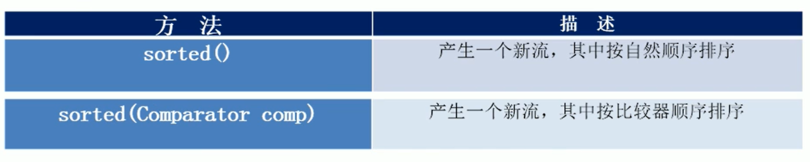

```java
@Test
	public void test7() {
		List<String> list = Arrays.asList("ccc", "bbb", "aaa", "ddd", "eee");

		list.stream()
				.sorted()
				.forEach(System.out::println);

		System.out.println("---------------------------------");

		employeeList.stream()  //自定义stream 
				.sorted((e1, e2) -> {
					if (e1.getAge().equals(e2.getAge())) {
						return e1.getName().compareTo(e2.getName());
					}else {
						return e1.getAge().compareTo(e2.getAge());
						//return -e1.getAge().compareTo(e2.getAge()); 如果想倒过来，加一个-
					}
				}).forEach(System.out::println);

	}
```


##### 最终操作 终止操作


###### 查找和匹配

- allMatch --  检查是否匹配所有元素
-  anyMatch -- 检查是否至少匹配一个元素
- noneMatch -- 检查是否没有匹配所有元素
-  findFirst -- 返回第一个元素
-  findAny -- 返回当前流中元素的总个数
- count -- 返回流中元素总个数
-  max -- 返回流中最大值
- min -- 返回流中最小值


Optional<> 容器，如果返回结果可能为空，就需要让这个容器进行包装。

取里面元素:

```java
System.out.println(optional.get());
```


```java
@Test
	public void test7() {
		boolean flag1 = employeeList.stream()
				.allMatch(e -> e.getStatus().equals(Employee.Status.BUSY));

		System.out.println(flag1);
		System.out.println("-------------------------------------------------");
		
		boolean flag2 = employeeList.stream()
				.anyMatch(e -> e.getStatus().equals(Employee.Status.BUSY));

		System.out.println(flag2);
		System.out.println("--------------------------------------------------");
		
		boolean flag3 = employeeList.stream()
				.noneMatch(e -> e.getStatus().equals(Employee.Status.BUSY));

		System.out.println(flag3);
		System.out.println("--------------------------------------------------");

		Optional<Employee> operation = employeeList.stream()  //按照工资排序，然后获取第一个
				.sorted((e1,e2) -> Double.compare(e1.getSalary(),e2.getSalary()))
				.findFirst();
		System.out.println(operation.get());
		System.out.println("---------------------------------------------------");
		
		Optional<Employee> optional = employeeList.parallelStream() //并行流  多个线程找,谁找到算谁的   //随便找一个当前处于空闲状态的人 
				.filter(e -> e.getStatus().equals(Employee.Status.FREE))
				.findAny();
		System.out.println(optional.get());
	}
```


###### 规约

* reduce(T identity, BinaryOperator) / reduce(BinaryOperator) -- 可以将流中元素反复结合起来得到一个值*
* 个人感觉 这个东西特别像SQL里面的聚合函数 


```java
@Test
	public void test10() {
		List<Integer> list = Arrays.asList(1, 2, 3, 4, 5, 6, 7, 8, 9, 10);

		Integer sum = list.stream()
				.reduce(0, (x, y) -> x + y);
		//计算过程：
		//首先他把初始值0作为x，上面的1作为y，然后相加，然后将结果作为x，将上面的2作为y，依次进行计算
		System.out.println(sum);

		System.out.println("----------------------------------------------------------");
		
		Optional<Double> salarySum = employeeList.stream()  //计算所有人工资总和 
				.map(Employee::getSalary)
				.reduce(Double::sum);
		System.out.println(salarySum.get());
		//那为什么上面的返回结果是Integer，下面的返回结果是Optional呢？
		//原因是：Java将有可能为空的都封装进了Optional，上面的有初始值，所以不为空，下面这个是可能为空的，所以要
	}
```


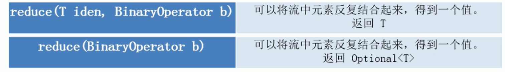

备注：map和reduce的连接通常被称为map-reduce 模式，因为Google用它来进行网络搜索而出名。


###### 收集

- collect -- 将流转换成其他形式。接受一个Collection接口的实现，用于给Stream中元素做汇总的方法。


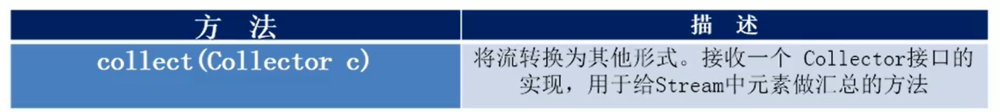

Collector接口中方法的实现决定了如何对流执行收集操作（如收集到List，Set，Map）。但是**Collectors**实用类提供了很多静态方法，**可以方便的创建常见收集器实例**。


```java
List<Employee> employeeList = Arrays.asList(
			new Employee("张三", 18, 4000.0, Employee.Status.FREE),
			new Employee("李四", 28, 20000.0, Employee.Status.BUSY),
			new Employee("王五", 38, 30000.0, Employee.Status.VOCATION),
			new Employee("马六", 48, 40000.0, Employee.Status.BUSY),
			new Employee("田七", 12, 50000.0, Employee.Status.FREE),
			new Employee("田七", 12, 50000.0, Employee.Status.FREE)
	);

	/**
	 * 收集
	 * collect -- 将流转换成其他形式。接受一个Collection接口的实现，用于给Stream中元素做汇总的方法。
	 */
	
	//字符串连接
	@Test
	public void test17(){
		String str = employeeList.stream()
				.map(Employee::getName)
				//.collect(Collectors.joining(",")); //中间加，
				.collect(Collectors.joining(",","==","==")); //首位加==
				//.collect(Collectors.joining()); //啥也不加，连在一起
		System.out.println(str);
	}
	
	//还有一种简单的 获取方式 类似聚合函数结果的方式
	@Test
	public void test16(){
		DoubleSummaryStatistics collect = employeeList.stream()
				.collect(Collectors.summarizingDouble(Employee::getSalary));
		
		//可以获取和 平均值 最大最小值等
		System.out.println(collect.getSum());
		System.out.println(collect.getAverage());
		System.out.println(collect.getMax());
	}
	
	//分区  满足条件的一个区，不满足条件的一个区
	@Test
	public void test15(){
		Map<Boolean,List<Employee>> map = employeeList.stream()
				.collect(Collectors.partitioningBy((employee -> employee.getSalary() > 8000)));

		System.out.println(map);
	}
	
	//多级分组
	@Test
	public void test14(){
		Map<Employee.Status,Map<String,List<Employee>>> map = employeeList.stream()
				.collect(Collectors.groupingBy(Employee::getStatus,Collectors.groupingBy((e) -> {
					if (e.getAge() < 35){
						return "青年";
					}else if(e.getAge() < 50){
						return "中年";
					}else {
						return "老年";
					}
				})));
		System.out.println(map);
		
	}

	//分组
	@Test
	public void test13() {
		Map<Employee.Status, List<Employee>> map = employeeList.stream()
				.collect(Collectors.groupingBy(Employee::getStatus));
		
		//第一种遍历map的方式，取key
		Set<Employee.Status> keySet = map.keySet();
		for (Employee.Status key : keySet) {
			System.out.println(key + "--" + map.get(key));
		}

		System.out.println("----------------------------------------------");
		
		//第二种方式
		Set<Map.Entry<Employee.Status,List<Employee>>> entries = map.entrySet();
		for (Map.Entry<Employee.Status,List<Employee>> entry: entries){
			System.out.println(entry.getKey() +"---" + entry.getValue());
		}
	}

	/**
	 * 类似聚合函数
	 */
	@Test
	public void test12() {

		//总数
		Long count = employeeList.stream()
				.collect(Collectors.counting());
		System.out.println(count);

		System.out.println("-----------------------------------------");

		//平均值
		Double ave = employeeList.stream()
				.collect(Collectors.averagingDouble(Employee::getSalary));
		System.out.println(ave);

		System.out.println("-----------------------------------------");

		//总和
		Double salarySum = employeeList.stream()
				.collect(Collectors.summingDouble(Employee::getSalary));

		System.out.println(salarySum);

		System.out.println("------------------------------------------");

		//最大值  工资最大的Employee
		Optional<Employee> maxEmployee = employeeList.stream()
				.collect(Collectors.maxBy((e1, e2) -> Double.compare(e1.getSalary(), e2.getSalary())));

		System.out.println(maxEmployee);
		System.out.println("--------------------------------------------");

		//获取工资最小的值
		Optional<Double> minSalary = employeeList.stream()
				.map(Employee::getSalary)
				.collect(Collectors.minBy(Double::compare));
		System.out.println(minSalary.get());
	}

	/**
	 * 转换成其他集合
	 */
	@Test
	public void test11() {
		List<String> employeeList1 = employeeList.stream()
				.map(Employee::getName)
				.collect(Collectors.toList());
		System.out.println(employeeList1);

		System.out.println("------------------------------");

		Set<String> employeeList2 = employeeList.stream()
				.map(Employee::getName)
				.collect(Collectors.toSet());
		System.out.println(employeeList2);

		System.out.println("-------------------------------");

		Set<String> employeeList3 = employeeList.stream()
				.map(Employee::getName)
				.collect(Collectors.toCollection(HashSet::new));
		System.out.println(employeeList3);
	}
```


### Optional

**定义：**Optional<T> 类 (java.util.Optional) 是一个容器类，代表一个值存在或不存在，原来用 null 表示一个值不存在，现在用 Optional 可以更好的表达这个概念；并且可以避免空指针异常

常用方法：

- Optional.of(T t)：创建一个 Optional 实例
- Optional.empty(T t)：创建一个空的 Optional 实例
- Optional.ofNullable(T t)：若 t 不为 null，创建 Optional 实例，否则空实例
- isPresent()：判断是否包含某值
- orElse(T t)：如果调用对象包含值，返回该值，否则返回 t
- orElseGet(Supplier s)：如果调用对象包含值，返回该值，否则返回 s 获取的值
- map(Function f)：如果有值对其处理，并返回处理后的 Optional，否则返回 Optional.empty()
- flatmap(Function mapper)：与 map 相似，要求返回值必须是 Optional

Optional.of(T t)：

```java
@Test
public void test01(){
    Optional<Employee> op = Optional.of(new Employee());
    Employee employee = op.get();
}
```

Optional.empty(T t)：

```java
@Test
public void test02(){
    Optional<Employee> op = Optional.empty();
    Employee employee = op.get();
}
```

Optional.ofNullable(T t)：

```java
@Test
public void test03(){
    Optional<Employee> op = Optional.ofNullable(new Employee());
    Employee employee = op.get();
}
```

isPresent()：

```java
@Test
public void test03(){
    Optional<Employee> op = Optional.ofNullable(new Employee());
    if (op.isPresent()) {
        Employee employee = op.get();
    }
}
```

不再一一例举......


公司代码里面有这个：

设置流程管理人员用到这个

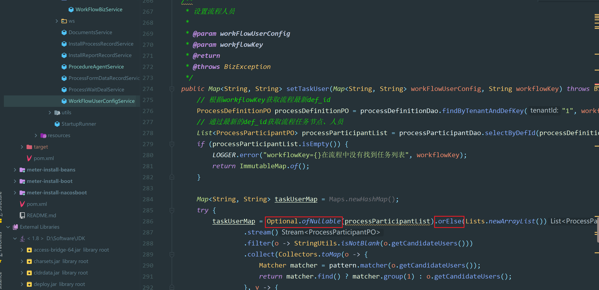


# Interview

## JaveSE

### 1.代码执行顺序:

 静态代码块>构造代码块>构造函数


### 2.运算符相关

#### 1.&和&&有什么区别？|和||有什么区别？

（1）首先名称是不同的

＆＆逻辑与　　｜｜逻辑或　　它们都是逻辑运算符

＆　按位与　　｜　按位或　　它们都是位运算符


（2）&& 和|| 有短路功能

＆＆逻辑与　也叫做短路与　因为只要当前项为假，它就不往后判断了，直接认为表达式为假

｜｜逻辑或　也叫做短路或　因为只要当前项为真，它也不往后判断了，直接认为表达式为真


#### 2.1&2 和 true&&false 两个分别输出什么

0              false


### 3.Java对象相关

#### 1.Java创建对象的四种方式？

参考：https://www.cnblogs.com/yunche/p/9530927.html

（1）使用new创建对象

（2）使用反射的机制创建对象 （这两种方式都是反射里面的）

- 使用Class类的newInstance方法

```java
/**
 * 使用Class类的newInstance方法
 */
public class NewClass {
	public static void main(String[] args) {
		try {
			Class heroClass = Class.forName("com.atiguigu.test.Hello");
			Hello h = (Hello) heroClass.newInstance();
			h.sayWorld();
		} catch (ClassNotFoundException e) {
			e.printStackTrace();
		} catch (IllegalAccessException e) {
			e.printStackTrace();
		} catch (InstantiationException e) {
			e.printStackTrace();
		}
	}
}
```


- 使用Constructor类的newInstance方法

```java
import java.lang.reflect.Constructor;
import java.lang.reflect.InvocationTargetException;

/**
 * 使用Constructor类的newInstance方法
 */
public class NewClass2 {
	public static void main(String[] args) {
		try {
			//获取类对象
			Class heroClass = Class.forName("com.atiguigu.test.Hello");

			//获取构造器
			Constructor constructor = heroClass.getConstructor();
			Hello h = (Hello) constructor.newInstance();
			h.sayWorld();
		} catch (NoSuchMethodException e) {
			e.printStackTrace();
		} catch (InvocationTargetException e) {
			e.printStackTrace();
		} catch (IllegalAccessException e) {
			e.printStackTrace();
		} catch (InstantiationException e) {
			e.printStackTrace();
		} catch (ClassNotFoundException e) {
			e.printStackTrace();
		}
	}
}
```


（3）采用clone （原来的对象，必须实现Cloneable接口）

```java
/**
 * 待创建的类
 * 克隆测试 
 */
public class Hello implements Cloneable, Serializable {
	public void sayWorld() {
		System.out.println("Hello world!");
	}
	
	public static void main(String[] args) {
		Hello h1 = new Hello();
		try {
			Hello h2 = (Hello) h1.clone();
			h2.sayWorld();
		} catch (CloneNotSupportedException e) {
			e.printStackTrace();
		}
	}
}
```


（4）采用序列化机制 （要使用序列化，原来的对象必须实现Serializable接口）

```java
/**
 * 序列化与反序列化对象
 * 序列化 需要将原来的Hello实现Serializable接口
 * 这里还用到一些 流的知识
 */
public class Serialize {
	public static void main(String[] args) {
		Hello h = new Hello();

		//准备一个文件用于存储该对象的信息
		File f = new File("hello.obj");

		//这里Try后面为什么会有东西 （）里面的？
		try (FileOutputStream fos = new FileOutputStream(f);
			 ObjectOutputStream oos = new ObjectOutputStream(fos);
			 FileInputStream fis = new FileInputStream(f);
			 ObjectInputStream ois = new ObjectInputStream(fis)
		) {
			//序列化对象，写入到磁盘中
			oos.writeObject(h);
			//反序列化对象
			Hello newHello = (Hello) ois.readObject();

			//测试方法
			newHello.sayWorld();
		} catch (FileNotFoundException e) {
			e.printStackTrace();
		} catch (IOException e) { 
			e.printStackTrace();
		} catch (ClassNotFoundException e) {
			e.printStackTrace();
		}
	}
}
```

（5）在交易所项目中，有一些创建对象是建造者模式 buider 不知道这算不算是 新的方式？？？


#### 2.Java对象的生命周期？（这个不太懂，是哪一部分知识？）

在Java中，对象的生命周期包含下面几个阶段：

- 创建阶段(Created)
- 应用阶段(In Use)
- 不可见阶段(Invisible)
-  不可达阶段(Unreachable)
- 收集阶段(Collected)

- 终结阶段(Finalized)


对象空间重分配阶段(De-allocated)

参考：https://www.cnblogs.com/mengfanrong/p/4007456.html

https://zhuanlan.zhihu.com/p/104056490


#### 3.new出来的对象保存在哪？

放在堆里面。


### 4.子类不可以继承父类的构造方法

子类不可以继承父类的构造方法，只可以调用父类的构造方法。子类中所有的构造函数都会默认访问父类中的空参数构造函数，这是因为子类的构造函数内第一行都有默认的super（）语句。super（）表示子类在初始化时调用父类的空参数的构造函数来完成初始化。


### 5.Java用 **监视器**机制实现了进程之间的同步操作。


### 7 .以下哪个式子有可能在某个进制下成立（）？

正确答案: A   你的答案: B (错误)

```java
A 13*14=204
B 12*34=568
C 14*14=140
D 1+1=3
```

设为x进制

```java
13=1*x^1+3*x^0=x+3
14=1*x^1+4*x^0=x+4
204=2*x^2+4*x^0=2X^2+4
```

左右相等 解方程。


### 8.关于Java中的类方法和实例方法：（牛客）

**类方法**就是**静态方法**。其它的就是实例方法。

实例方法可以对当前对象的实例变量进行操作，也可以对类变量进行操作，但**类方法不能访问实例变量**。**实例方法必须由实例对象来调用**

而**类方法除了可由实例对象调用外，还可以由类名直接调用**。


另外，在类方法中不能使用 this 或 super。 关于类方法的使用，有如下一些限制：

1 在类方法中不能引用对象变量。

2 **在类方法中不能使用super、this关键字**。

3 类方法不能调用类中的对象方法。


与类方法相比，实例方法几乎没有什么限制：

1 实例方法可以引用对象变量（这是显然的），也可以引用类变量。

2 **实例方法中可以使用super、this关键字**。

3 实例方法中可以调用类方法。


### 9.Java语言本身 概念，特性

#### 1.Java是编译型语言还是解释型语言？

概念：

- 编译型语言：把做好的源程序全部编译成二进制代码的可运行程序。然后，可直接运行这个程序。
- 解释型语言：把做好的源程序翻译一句，然后执行一句，直至结束！

 

区别：

- 编译型语言，执行速度快、效率高；依赖编译器、跨平台性差些。如C、C++
- 解释型语言，执行速度慢、效率低；依赖解释器、跨平台性好。如Python

 

**通俗的讲，编译语言是在编译后可以直接运行，而解释语言的执行需要一个解释环境。**

 **java很特殊，java程序也需要编译，但是没有直接编译称为机器语言，而是编译称为字节码，然后用解释方式执行字节码。**

参考：https://blog.csdn.net/xxb2008/article/details/7924676


#### 2.JAVA如何跨平台的

主要是JVM

参考：https://www.cnblogs.com/lujiahua/p/11404611.html


### 10.变量，静态变量

#### 1.静态变量、实例变量的区别？

参考下面的5。


#### 2.说一下static关键字，static环境下能不能访问非static变量，为什么？

代码测试：

```java
public class StaticTest {
	private static String str1 = "aaaaa";
	private String str2 = "bbbbb";

	public StaticTest() {
	}

	public void print1(){
		System.out.println(str1);
		System.out.println(str2);
	}
	
	public static void print2(){
		System.out.println(str1);
		System.out.println(str2);
		print1();
	}
}
```

结果：

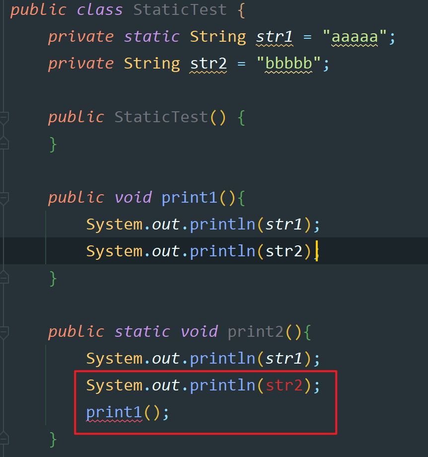

结论：static修饰的方法（静态方法），不能调用非static修饰的方法（非静态变量），也不能使用非static修饰的变量（非静态变量）


#### 3.如果想限制类本身对静态成员的访问，应该使用哪个关键字修饰？

不会。


#### 4.静态变量static在不同的实例中地址是否一样？他们储存在什么区域？

JDK8以前，存放在方法区中。JDK8以后取消了永久代，取而代之的是元空间。永久代中的数据进行了迁移，迁移到了堆中。详细参考JVM中内容。

参考：https://www.cnblogs.com/chanchan/p/7726724.html


#### 5.Static变量也称作静态变量，静态变量和非静态变量的区别是

静态变量被所有的对象所共享，在内存中只有一个副本，它当且仅当在类初次加载时会被初始化。

而非静态变量是对象所拥有的，在创建对象的时候被初始化，存在多个副本，各个对象拥有的副本互不影响。


### 11.数据一致性问题

1.对于先后提交数据，如何保证先提交的数据不被后提交的数据覆盖(数据一致性问题)？ 

（1）如果服务是单体，不是分布式架构

如何保证数据一致性？上面问题是不是可以理解为 接口幂等性问题？乐观锁？

（2）如果服务是分布式架构，高并发下 如何保证数据 一致性？


### 13.IO流相关

参考资料：菜鸟教程 https://www.runoob.com/java/java-files-io.html

1.Java的IO类型有哪些，能详细讲讲吗？

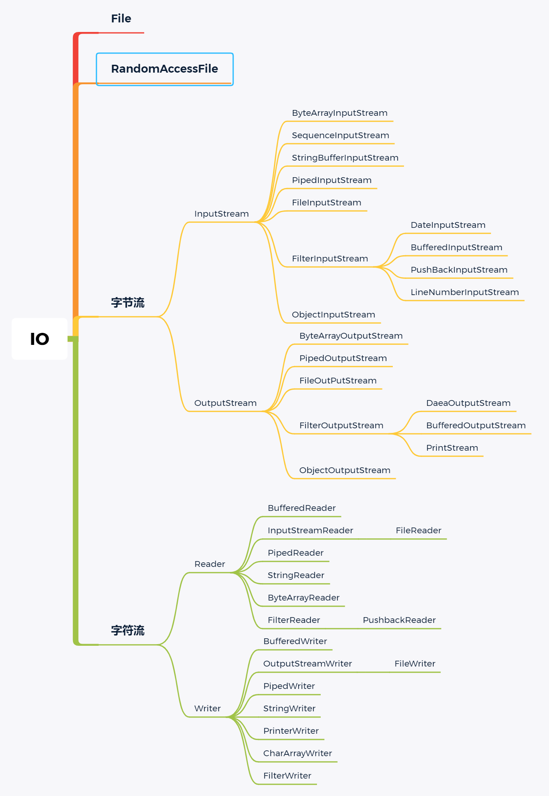

下面每个流代码在JavaSE中，Day30_IO03

- **字节流**
-  **InputStream**
- **ByteArrayInputStream**  字节数组输入流在内存中创建一个字节数组缓冲区，从输入流读取的数据保存在该字节数组缓冲区中。参考文章：https://www.runoob.com/java/java-bytearrayinputstream.html
    - **SequenceInputStream**  合并流，将与之相连接的流集组合成一个输入 流并从第一个输入流开始读取， 直到到达文件末尾，接着从第二个输入流读取，依次类推，直到到达 包含的最后一个输入流的文件末 尾为止。 合并流的作用是将多个源合并合一个源。 可接收枚举类所封闭的多个字节流对象。参考：https://www.cnblogs.com/stone1022/p/4050702.html
- StringBufferInputStream  这个类在JDK8中已经不推荐使用啦
    - **PipedInputStream** 管道流，它们的作用是让多线程可以通过管道进行线程间的通讯。在使用管道通信时，必须将PipedOutputStream和PipedInputStream配套使用。 参考：https://www.cnblogs.com/skywang12345/p/io_04.html 
    - **FileInputStream** 文件字节输入流，意思指对文件数据以字节的形式进行读取操作如读取图片视频等。参考：https://blog.csdn.net/ai_bao_zi/article/details/81097898
    - **ObjectInputStream** 反序列化流，将之前使用 ObjectOutputStream 序列化的原始数据恢复为对象，以流的方式读取对象。和下面的序列化是一对。实现序列化和反序列化的Bean必须实现序列化接口Serializable。参考：https://www.cnblogs.com/niujifei/p/11499141.html
    - **FilterInputStream** “封装其它的输入流，并为它们提供额外的功能”。它的常用的子类有BufferedInputStream和DataInputStream。子类都是继承自FilterInputStream。
      - **DateInputStream（稍微重要一点）** 数据输入流允许应用程序以与机器无关方式从底层输入流中读取基本 Java 数据类型。参考：https://www.runoob.com/java/java-datainputstream.html  
      - **BufferedInputStream（稍微重要一点）**继承于FilterInputStream，提供缓冲输入流功能。缓冲输入流相对于普通输入流的优势是，它提供了一个缓冲数组，每次调用read方法的时候，它首先尝试从缓冲区里读取数据，若读取失败（缓冲区无可读数据），则选择从物理数据源（譬如文件）读取新数据（这里会尝试尽可能读取多的字节）放入到缓冲区中，最后再将缓冲区中的内容部分或全部返回给用户.由于从缓冲区里读取数据远比直接从物理数据源（譬如文件）读取速度快。参考：https://www.cnblogs.com/firstdream/p/8668006.html
      - **PushBackInputStream**
      - **LineNumberInputStream**
    
  - **OutputStream** 输出流和上面的对应。
- **ByteArrayOutputStream**
  - **PipedOutputStream**
    - **FileOutPutStream**
    - **FilterOutputStream**
      - **DaeaOutputStream**
      - **BufferedOutputStream**
      - **PrintStream**
    - **ObjectOutputStream** 对象的**序列化流**，作用：把对象转成字节数据的输出到文件中保存，对象的输出过程称为序列化，可实现对象的持久存储。和上面的反序列化是一对。实现序列化和反序列化的Bean必须实现序列化接口Serializable。参考：https://www.cnblogs.com/niujifei/p/11499074.html
  
- 字符流

  - **Reader**
    - **BufferedReader**
    - **InputStreamReader**
      - **FileReader**
    - **PipedReader**
    - **StringReader**
    - **ByteArrayReader**
    - **FilterReader**
      - **PushbackReader**
  - **Writer**
    - **BufferedWriter**
    - **OutputStreamWriter**
      - **FileWriter**
    - **PipedWriter**
    - **StringWriter**
    - **PrinterWriter**
    - **CharArrayWriter**
    - **FilterWriter**


2.IO下面有哪些框架，netty听说过吗？

3.Socket 怎么和 IO 分开写的 ？（现在很多都把网络抽象成了IO）

4.在系统中如何去查找一个文件


### 14.循环

手写 循环的几种方式 迭代器  for foreach while do while()


### 17.异常相关、Error

你们项目中的异常 怎么处理  抛了异常事务怎么保证？自定义的异常 全局异常处理？

Java中有哪几类异常，请列举？

异常都继承自那个类？

编译时异常？运行时异常？

自定义异常必须继承自Exception吗，可以自定义错误(Error)吗？

介绍一下Error，编译期异常，运行时异常的区别？

try catch finally里面在catch里面和finally都有return会按哪一个return

子类能够抛出比父类更多的异常吗，子类的权限修饰符范围能比父类更大吗，为什么？

Java的异常类型

介绍一下异常机制


### 18.abstract能否被final修饰？为什么？

### 19.==和equals（）的区别

参考：https://www.cnblogs.com/qianguyihao/p/3929585.html


笔试题：

应用程序的main方法中有以下语句，则输出的结果( )

String s1=new String（ ” xyz ” ）;

String s2=new String（ ” xyz ” ）;

Boolean b1=s1.equals(s2);

Boolean b2=(s1==s2);

System .out.print(b1+ ” ” +b2); 


答案：true false

解析：

**Java当中的数据类型和“==”的含义：**

- 基本数据类型（也称原始数据类型） ：byte,short,char,int,long,float,double,boolean。他们之间的比较，应用双等号（==）,比较的是他们的值。
- 引用数据类型：当他们用（==）进行比较的时候，比较的是他们在内存中的存放地址（确切的说，是**堆内存**地址）。

注：对于第二种类型，除非是同一个new出来的对象，他们的比较后的结果为true，否则比较后结果为false。因为每new一次，都会重新开辟堆内存空间。


 **== 的作用：**
　　基本类型：比较的就是值是否相同
　　引用类型：比较的就是地址值是否相同

**equals 的作用:**
　　引用类型：默认情况下，比较的是地址值。
注：不过，我们可以根据情况自己重写该方法。一般重写都是自动生成，比较对象的成员变量值是否相同


### 26.接口和抽象类相关

26.抽象类和接口的区别

接口和抽象类有什么区别？

接口和抽象类在架构上有什么区别？(接口是规范和协议，抽象类是设计模式)

抽象类（abstract class）和接口（interface）的异同？

接口与抽象类的区别？


27.A的无参构造方法给变量a赋值；B继承A，构造方法给变量b赋值；C继承b，构造方法给c赋值；new一个C，打印a+b+c，有个陷阱，打印值前面有个空串" "；

### 28.基本数据类型相关、引用数据类型相关

大概是Integer直接指定值、创建new Integer()，互相比较==和equals

 8个基本类型，int和Integer有什么区别？Integer对值的缓存机制？(-128~+127会缓存，超过此范围会重新new对象)

自动装箱和自动拆箱发生在什么时期？(编译器)

常用的基础数据类型

自动拆箱和装箱，为什么要有基本数据类型的包装类

Java基本类型有哪些，占多少字节


Short s1 = 1;s1 = s1+1有错吗？s1+=1有错吗?

int和integer有什么区别？

byte n =10+127这个写法错在哪里？

byte b =(byte)140;sout(b)输出多少？

用最有效率的方法计算2*8?

Java的基本数据类型 自动装箱知道吗 ？

Float f = 3.4 正确吗 ？

int 和 Integer 的区别 ？

常用的基本数据类型有哪些，基本类型和封装类型有什么区别，封装类型有哪些方法？

浮点型数据赋值的时候，不能直接赋值？

列举Java中的引用类型

3.Math.round（-11.6）取值结果是什么


#### 自动数据类型转换：

由低到高自动转，由高到低需要强制类型转换。

自动转换按从低到高的顺序转换。不同类型数据间的优先关系如下：
低 ---------------------------------------------> 高
byte,short,char-> int -> long -> float -> doub


#### 1.String，StringBuffer，StringBuilder区别：

String不适合用于频繁修改字符串的操作上，因为每次修改都会new一个新对象，耗费内存。想·

|                            String                            |                         StringBuffer                         |  StringBuilder   |
| :----------------------------------------------------------: | :----------------------------------------------------------: | :--------------: |
| String的值是不可变的，这就导致每次对String的操作都会生成新的String对象，不仅效率低下，而且浪费大量优先的内存空间 | StringBuffer是可变类，和线程安全的字符串操作类，任何对它指向的字符串的操作都不会产生新的对象。每个StringBuffer对象都有一定的缓冲区容量，当字符串大小没有超过容量时，不会分配新的容量，当字符串大小超过容量时，会自动增加容量 | 可变类，速度更快 |
|                           值不可变                           |                             可变                             |       可变       |
|                                                              |                           线程安全                           |    线程不安全    |
|                                                              |                       多线程操作字符串                       | 单线程操作字符串 |

String类的特点？

String的常量池有什么操作？

String，StringBuffer，StringBuilder的区别？

String与StringBuffer的区别？

String，StringBuilder，StringBuffer的区别？

string有哪些基本方法？

string类常用的方法

stringbuffer和stringbuilder的区别

int和Integer的区别

int占几个字节？其他类型都几个字节？

StringBuffer和StringBuilder有什么区别，多线程的环境下用哪个，多线程的环境下private方法可以用StringBuilder吗？

Java基本数据类型有哪些？String属于基本数据类型吗？

string和stringbuilder,stringbuffer，"a"+=1 原理

Sting常量和StringBuffer作为参数传入方法的问题

使用String的基本方法，找出a字符串中b字符串出现的次数？（最少说出三种方法）？

电话号用分号间隔怎么一行行输出？

String类，StringBuffer，StringBuilder的区别，为啥String一旦new出来后就不允许修改（主要是效率和内存两方面考虑）


### 29.Object类相关

Object类你的理解，常用覆写的方法

Object类的方法

Object的equals()方法，hashCode()方法的联系

两个对象equals则必有两个对象hashCode相等


30.JAVA SE和JAVA EE的区别

java standard edition：java标准版，就是一般Java程序的开发就可以，可以看做是JavaEE的子集。它允许开发和部署在桌面，服务器 ，嵌入式环境和实施环境中使用的java应用程序。

java enterprise edition：java企业版，多用于企业级开发， 包括web开发等。企业版本帮助开发和部署可移植、健壮、可伸缩的安全的服务端java应用。java EE是在java SE基础上构建的提供WEB服务，组件模型、管理和通信API。


### 30.重载重写相关

重载和重写的区别是什么？

重载返回值类型是否需要一致

重写方法子类的返回值和异常类型（回答问题不能说好像，很不自信！）

重载和重写是什么意思


### 31.关键字相关

final关键字，finally？

finalize？

static关键字是什么意思，静态代码块是在什么时候执行？

接口中default关键字是什么意思？

final关键字的用法（修饰类，方法，变量？

Java中static和final关键字的作用？

除了finally之外还有什么会保证资源一定会释放？

final关键字的用法

java类的修饰符（public protect default privarte）的区别？

15.break和continue的区别

#### 14.权限修饰符

| public | protected | 默认 | private |
| ------ | --------- | ---- | ------- |
|        |           |      |         |


### 32.Json相关

json的数据格式 用到了哪些符号？

还有Json 和对象 字符串之间的转换


### 33.集合相关 数据结构 算法

如果要对集合中的数据进行排序，需要实现哪个接口，需要传什么参数？

排序中的稳定性是什么，怎样保证集合中的排序算法的稳定性？

常用的集合有哪些，怎么样对list内的数据进行排序，排序是怎么实现的，需要实现哪个接口，需要传哪些参数？

判断字符串是否以abc打头

将字符串"To or not to be"反转成"eb ot ton ro oT";

set与vector的区别？


### 34.对象三大特性相关

解释一下面向对象的三大特性，以及不同的权限修饰符的限制范围？

父类变量子类对象，调用方法会执行哪一个？如果非要子类执行父类的方法怎么办？

-----我回答的向上转型，总感觉不对


面向对象的特征有哪些方面？

说一下你对面向对象的理解


#### 封装


#### 继承

B类继承A类，B类重写了A类的C方法，A a=new B( ); a.C( );执行的是父类方法还是子类方法？

B类继承A类，C类中有两个重载的方法，传入参数分别是A对象和B对象，问最后重载方法执行的是父类变量还是子类变量？

在创建派生类的过程中首先创建基类对象，才能创建派生类。

创建基类即默认调用其构造方法，在方法调用成员方法，由于派生类中重写了此方法，则被调用的方法是派生类中的方法，但因为此时派生类还没有构造，所以构造方法值为零。

先成员变量再构造方法，先父类再子类（多态表现：有同名方法执行子类的）

结论：执行构造方法时（创建对象），执行的是父类的构造方法，而执行成员方法时，执行的是子类的成员方法。


#### 多态

多态有哪些实现方式？

多态是怎么实现的？

JAVA多态的理解？

多态的一些内容（编译看左边，运行看右边）


### 35.值传递、引用传递

Java中的传递是值传递还是引用传递？

什么是值传递，什么是引用传递？

值传递，引用传递的本质

参数传递的区别（基本类型，引用类型）


#### 1.引用数据类型是引用传递（call by reference），基本数据类型是值传递（call by value）

**值传递不可以改变原变量的内容和地址**--->原因是java方法的形参传递都是传递原变量的副本，在方法中改变的是副本的值，而不是原变量的值

**引用传递不可以改变原变量的地址，但可以改变原变量的内容**--->原因是当副本的引用改变时，原变量 的引用并没有发生变化，当副本改变内容时，由于副本引用指向的是原变量的地址空间，所以，原变量的内容发生变化。


结论：1.值传递不可以改变原变量的内容和地址；

​           2.引用传递不可以改变原变量的地址，但可以改变原变量的内容；


### 36.日期类相关

Date转换为格式（yyyy-MM-dd）的日期字符串

输出现在的时间，并把它转换成"2019-1-1 12:00:00"的格式。


### 38.Switch

switch能够作用于哪些数据类型？

switch能否作用在byte上，能否作用在long上，能否作用在String上？


### 42.正则表达式

写正则表达式(手机号，身份证，还有一个忘了)


### 43.XML相关

我看简历上很少有人写xml的，你说一下你对xml的了解。了解过配置文件的加载过程吗？


try return ；

​     finally return；

system.out.println("hello")的调用过程

说一下编译和运行的区别？


### 牛客笔试题相关

#### 1.下列哪个说法是正确的（D） 20201222

```java
A ConcurrentHashMap使用synchronized关键字保证线程安全
B HashMap实现了Collction接口
C Array.asList方法返回java.util.ArrayList对象
D SimpleDateFormat是线程不安全的
```


解析：

A、这个选项吧，没有给出具体环境，现在jdk1.8及以后的版本 ConcurrentHashmap是采用CAS+synchronized关键字来保证线程安全性，在jdk1.7及之前的版本是采用分段锁机制来保证线程安全性。这种选项具体纠结其实没太大意义，可能就是能区分出来看没看过源码的人吧。


B、从图中可以看出，Map接口也属于Java Collections Framework，因为Map这种映射的结构比较特殊，所以Map接口是单独的，而Set、Queue、List都是继承于Collection接口。这个选项是考察大家对Java集合框架的熟悉情况。

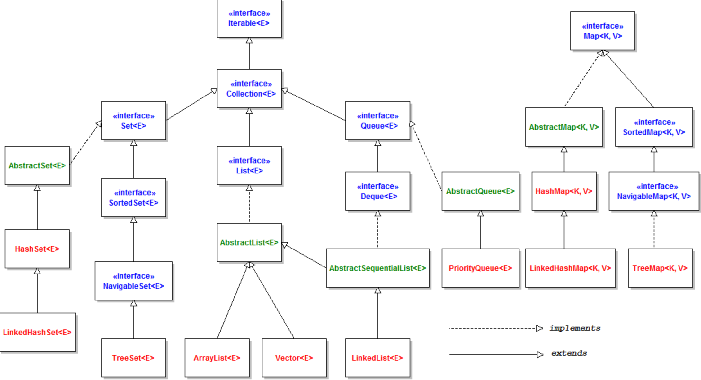


C 他调用的是自己内部的一个ArrayList

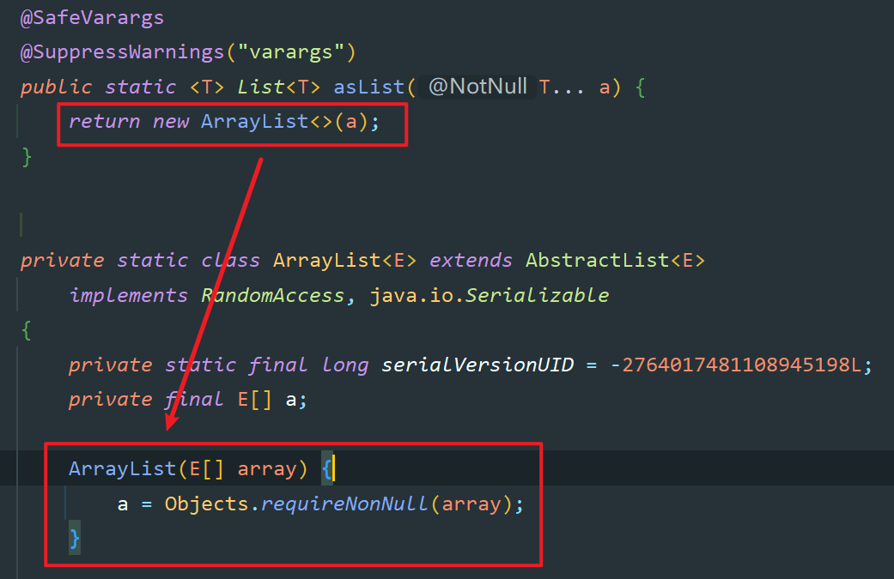

D 对的，并不是线程安全的。阿里开发手册有一节讲ThreadLocal说过，要放在里面。


#### 2.在Java语言中，下列关于字符集编码（Character set encoding）和国际化（i18n）的问题，哪些是正确的？

正确答案 CD

```
每个中文字符占用2个字节，每个英文字符占用1个字节        //这个有争议
假设数据库中的字符是以GBK编码的，那么显示数据库数据的网页也必须是GBK编码的。   //编码是可以转换的
Java的char类型，通常以UTF-16 Big Endian的方式保存一个字符。
实现国际化应用常用的手段是利用ResourceBundle类
```


## Java8新特性

Java 8有哪些新特性，你觉得最好用的是哪个，有用过8的集合流吗？

### Lambda表达式

3.Java中Lambda表达式的使用举例

### Stream流

Stream流用过吗


当然这里还可以把其他的说说，还有Java第一行代码中的新特性。

用的jdk里有哪些新特性


## 注解

### Interview

####  Java的注解，怎么用，

#### controller层有哪些注解？怎么获取请求url上的参数？

#### 事务的注解时哪个？需要加在什么地方？

#### 前端有个字段假如刚好是 class（Java 里面的关键字），那你这边后台数据是怎么接收的？（答：应该有个注解可以指定别名，但是忘了...面试官说：是有那么一个注解..（其实这答案是我猜的...））

#### RequestMapping的路径规范

#### 先按照大的分类模块进行分，再具体到功能

#### 在公司做什么工作，有没有写controller中的逻辑，然后写逻辑的时候从前端传参数过来，参数前面加什么注解，传数据的时候分        为json和图片视频，处理起来有什么区别？

#### 如何理解java注解？


## 反射

### Interview

####  Java反射，都在什么场景运用，怎么用的？

#### 反射怎么样取到私有对象？

#### 反射怎么取泛型？(继承的时候可以取出泛型)？

#### Java中产生死锁的条件？

#### 线程和进程的区别，Java线程有几种状态

#### java怎样实现多线程

#### 反射中有一个经典问题：泛型擦除，简单介绍一下

#### 你对反射怎么样理解的？

#### 手写反射方法的代码

#### 你什么时候会使用反射，反射的原理？

#### 反射用过吗？你在什么情况下会用到反射？

#### 反射你觉得最好是用还是不用？(回答的最好不用，然后他问为什么不用？)

#### 反射谈谈你的理解，具体的方法是哪些？类的类型机制？Java反射为什么比较慢？里面有哪些类，哪些参数？获取字段等的方法都是哪些？

#### 反射如果一个泛型实例化了，如果找出他的类型


## 深拷贝 浅拷贝 

参考 https://www.cnblogs.com/mikeCao/p/8710837.html


两者区别主要是看是不是原来对象的实体复制。如果是，那么是深拷贝，如果不是，只是原来的对象引用，那么就是浅拷贝。

浅拷贝是引用，原来对象改变了，自己也变啦，拿人手短。

深拷贝实体拷贝，原对象变不变和自己没关系。自食其力。


