#  Linux

## 目录

[TOC]


## 操作技巧

在 Linux 里面Vim操作任何文件，都提前拷贝一份，这是好习惯。

```shell
cp application.properties application.properties.init
```


> 下面Linux命令这一部分知识是在文件系统这一部分是

# Linux文件系统

## Linux文件系统简介

**在Linux操作系统中，所有被操作系统管理的资源，例如网络接口卡、磁盘驱动器、打印机、输入输出设备、普通文件或是目录都被看作是一个文件。**

也就是说在LINUX系统中有一个重要的概念：**一切都是文件**。其实这是UNIX哲学的一个体现，而Linux是重写UNIX而来，所以这个概念也就传承了下来。在UNIX系统中，把一切资源都看作是文件，包括硬件设备。UNIX系统把每个硬件都看成是一个文件，通常称为设备文件，这样用户就可以用读写文件的方式实现对硬件的访问。


## Linux文件系统目录

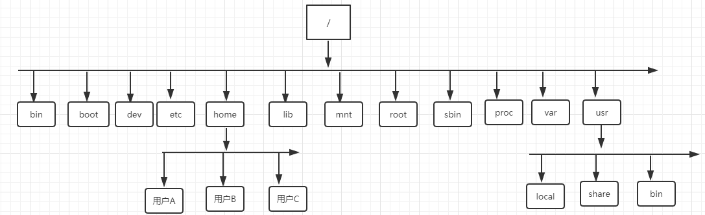


- **/**：根目录，所有的目录、文件、设备都在/之下，/就是Linux文件系统的组织者，也是最上级的领导者。
- **/bin**：就是二进制（binary）英文缩写。在一般的系统当中，都可以在这个目录下找到linux常用的命令。系统所需要的那些命令位于此目录。
- **/boot**：Linux的内核及引导系统程序所需要的文件目录。
- **/dev**：是设备（device)的英文缩写。这个目录对所有的用户都十分重要。因为在这个目录中包含了所有linux系统中使用的外部设备。但是这里并不是放的外部设备的驱动程序。这一点和常用的windows,dos操作系统不一样。它实际上是一个访问这些外部设备的端口。可以非常方便地去访问这些外部设备，和访问一个文件，一个目录没有任何区别。
- **/home**：如果建立一个用户，用户名是"xx",那么在/home目录下就有一个对应的/home/xx路径，用来存放用户的主目录。家目录
- **/lib**：是库（library）英文缩写。这个目录是用来存放系统动态连接共享库的。几乎所有的应用程序都会用到这个目录下的共享库。因此，千万不要轻易对这个目录进行什么操作，一旦发生问题，系统就不能工作了；
- **/proc**：虚拟文件系统目录，是系统内存的映射。可直接访问这个目录来获取系统信息；
- **/root**：Linux超级权限用户root的家目录；
- **/sbin**：这个目录是用来存放系统管理员的系统管理程序。大多是涉及系统管理的命令的存放，是超级权限用户root的可执行命令存放地，普通用户无权限执行这个目录下的命令，sbin中包含的都是root权限才能执行的；
- **/usr**： 用于存放系统应用程序，这是linux系统中占用硬盘空间最大的目录。用户的很多应用程序和文件都存放在这个目录下。Unix software resource usr。
- **/usr/local**：这里主要存放那些手动安装的软件，即不是通过或apt-get安装的软件。它和/usr目录具有相类似的目录结构。
- **/usr/share** ：系统共用的东西存放地，比如 /usr/share/fonts是字体目录，/usr/share/do和/usr/share/man帮助文件。
- **/etc**：  存放系统管理和配置文件；
- **/opt：** 额外安装的可选应用程序包所放置的位置。一般情况下，我们可以把tomcat等都安装到这里
- **/mnt：** 系统管理员安装临时文件系统的安装点，系统提供这个目录是让用户临时挂载其他的文件系统；
- **/tmp：** 用于存放各种临时文件，是公用的临时文件存储点；
- **/var：** 用于存放运行时需要改变数据的文件，也是某些大文件的溢出区，比方说各种服务的日志文件（系统启动日志等。）等；（现在服务器总共40G 这个就占一半还多 其中里面的Docker占20多G 可怕）
- **/lost+found：**  这个目录平时是空的，系统非正常关机而留下“无家可归”的文件（windows下叫什么.chk）就在这里。


## Linux中# 和 $ 的区别

【#】代表 root权限
【$】代表普通用户

 

如果更改了/etc/profile , 或~/.bashrc等文档，可以用任何符号来代替它们。

linux窗口下的【root@locate~】其中的【~】代表代表用户的家目录（root为/root，一般user则为/home/username）；【./】和【.】代表当前目录；【../】代表上级目录


> 参考自：韩顺平老师的Linux课程
>
> guide哥的文章：https://github.com/Snailclimb/JavaGuide.git
>
> 还有B站上面黑马的Python课程中的Linux部分
>
> 《鸟哥Linux私房菜》
>
> 有些是自己工作学习中的总结

# Linux 命令

命令大全：https://man.linuxde.net/ （国外的）

菜鸟教程：https://www.runoob.com/linux/linux-command-manual.html


## 终端命令总结

###  终端命令格式

```bash
command [-options] [parameter]
```

说明：

* `command`：命令名，相应功能的英文单词或单词的缩写
* `[-options]`：选项，可用来对命令进行控制，也可以省略
* `parameter`：传给命令的参数，可以是 **零个**、**一个** 或者 **多个**

> `[]` 代表可选 


### 查阅命令帮助信息（知道）

> 提示
>
> * 现阶段只需要 **知道** 通过以下两种方式可以查询命令的帮助信息
> * 先学习**常用命令**及**常用选项**的使用即可，工作中如果遇到问题可以借助 **网络搜索**

#### 2.1 `--help`

```bash
command --help
```

说明：

* 显示 `command` 命令的帮助信息

#### 2.2 man

```bash
man command
```

说明：

* 查阅 `command` 命令的使用手册

> `man` 是 **manual** 的缩写，是 Linux 提供的一个 **手册**，包含了绝大部分的命令、函数的详细使用说明

使用 `man` 时的操作键：

| 操作键   | 功能                 |
| -------- | -------------------- |
| 空格键   | 显示手册页的下一屏   |
| Enter 键 | 一次滚动手册页的一行 |
| b        | 回滚一屏             |
| f        | 前滚一屏             |
| q        | 退出                 |
| /word    | 搜索 **word** 字符串 |

### Tab自动提示

按两下的话，会提示出问题所在

## apt命令

Advanced Packaging Tool（apt）是Linux下的一款安装包[管理工具](https://baike.baidu.com/item/管理工具)，是一个客户/[服务器系统](https://baike.baidu.com/item/服务器系统/2997788)。

https://baike.baidu.com/item/apt/20109246?fr=aladdin


常用命令

```bash
apt-cache search # ——（package 搜索包）

apt-cache show #——（package 获取包的相关信息，如说明、大小、版本等）

sudo [apt-get](https://baike.baidu.com/item/apt-get) install # ——（package 安装包）

sudo apt-get reinstall # —–（package - - reinstall 重新安装包）

sudo apt-get -f install # —–（强制安装?#”-f = –fix-missing”当是修复安装吧…）

sudo [apt-get](https://baike.baidu.com/item/apt-get) remove #—–（package 删除包）

sudo apt-get remove --purge # ——（package 删除包，包括删除配置文件等）

sudo apt-get autoremove --purge # —-(package 删除包及其依赖的软件包配置文件等（只对6.10有效，强烈推荐））

sudo apt-get update #——更新源

sudo apt-get upgrade #——更新已安装的包

sudo apt-get dist-upgrade # ———升级系统

sudo [apt-get](https://baike.baidu.com/item/apt-get) dselect-upgrade #——使用 dselect 升级

apt-cache depends #——-(package 了解使用依赖）

apt-cache rdepends # ——（package 了解某个具体的依赖?#当是查看该包被哪些包依赖吧…）

sudo apt-get build-dep # ——（package 安装相关的编译环境）

apt-get source #——（package 下载该包的[源代码](https://baike.baidu.com/item/源代码))

sudo apt-get clean && sudo apt-get autoclean # ——–清理下载文件的存档 && 只清理过时的包

sudo [apt-get](https://baike.baidu.com/item/apt-get) check #——-检查是否有损坏的依赖

apt-get install# ——（下载 以及所有依赖的包裹，同时进行包裹的安装或升级。如果某个包裹被设置了 hold （停止标志，就会被搁在一边（即不会被升级）。更多 hold 细节请看下面。）

apt-get remove [--purge]# ——（移除 以及任何倚赖这个包裹的其它包裹。）

--purge 指明这个包裹应该被完全清除 (purged) ，更多信息请看 dpkg -P。

apt-get update# ——（升级来自 Debian 镜像的包裹列表，如果你想安装当天的任何软件，至少每天运行一次，而且每次修改了/etc/apt/sources.list 后，必须执行。）

apt-get upgrade [-u]# ——（升级所有已经安装的包裹为最新可用版本。不会安装新的或移除老的包裹。形前端（其中一些在使用前得先安装）。这里 dselect 无疑是最强大的，也是最古老，最难驾驭。）
```


## 进入超级用户 

su root

## 目录切换命令

- **`cd usr`：**   切换到该目录下usr目录  
- **`cd ..（或cd../）`：**  切换到上一层目录 
- **`cd /`：**   切换到系统根目录  
- **`cd ~`：**   切换到用户主目录 
- **`cd -`：**   切换到上一个操作所在目录

**善于使用tab健 去补全路径的名称。**

### 相对路径和绝对路径

* **相对路径** 在输入路径时，最前面不是 **/** 或者 **~**，表示相对 **当前目录** 所在的目录位置
* **绝对路径** 在输入路径时，最前面是 **/** 或者 **~**，表示从 **根目录/家目录** 开始的具体目录位置

例如：不管现在在哪个目录下，我要到我的home目录 `cd /home/`  这里的是绝对路径

## 目录的操作命令(增删改查)

- `tree 查看目录树形结构`  
  - 如果命令用不了，就需要安装 `apt install tree`
  - `tree -d` 只显示目录
  - 

- **`mkdir 目录名称`：** 增加目录

  - -p或--parents 若所要建立目录的上层目录目前尚未建立，则会一并建立上层目录；
    - 例如当前目录下创建/a/b/c  `mkdir -p a/b/c`
  - --version 显示版本信息。

- **`ls或者ll`**（ll是ls -l的别名，ll命令可以看到该目录下的所有目录和文件的详细信息）：查看目录信息

  - ls ：查看目标目录下的文件或目录名称（不包括隐藏文件）
  - ls -a：查看目标目录下的文件或目录的名称（包括隐藏文件）
  - ls -l：查看目标目录下的文件或名称的详细信息
  - ll 会列出该文件下的所有文件信息，包括隐藏的文件
  - ll -h 配合 -l 以人性化的方式显示文件大小

- **`find 目录 参数`：** 寻找目录（查）

  示例：

  - 列出当前目录及子目录下所有文件和文件夹: `find .`
  - 在`/home`目录下查找以.txt结尾的文件名:`find /home -name "*.txt"`
  - 同上，但忽略大小写: `find /home/ -iname "*.txt"`
  - 当前目录及子目录下查找所有以.txt和.pdf结尾的文件:`find . \( -name "*.txt" -o -name "*.pdf" \)`或`find . -name "*.txt" -o -name "*.pdf" `
  - `find /home/ -name "*t*"` 在/home/目录下找名字带有t的文件

- **`mv 目录名称 新目录名称`：** 修改目录的名称（改）

  注意：mv的语法不仅可以对目录进行重命名而且也可以对各种文件，压缩包等进行  重命名的操作。mv命令用来对文件或目录重新命名，或者将文件从一个目录移到另一个目录中。后面会介绍到mv命令的另一个用法。

  例如：将当前目录下文件123.txt 重命名为321.txt`mv 123.txt 321.txt`

  | 选项 | 含义           |
  | ---- | -------------- |
  | -i   | 覆盖文件前提示 |

- **`mv 目录名称 目录的新位置`：**  移动目录的位置---剪切（改）

  注意：mv语法不仅可以对目录进行剪切操作，对文件和压缩包等都可执行剪切操作。另外mv与cp的结果不同，mv好像文件“搬家”，文件个数并未增加。而cp对文件进行复制，文件个数增加了。

  | 选项 | 含义           |
  | ---- | -------------- |
  | -i   | 覆盖文件前提示 |

- **`cp -r 目录名称 目录拷贝的目标位置`：** 拷贝目录（改），-r代表递归拷贝 

  注意：cp命令不仅可以拷贝目录还可以拷贝文件，压缩包等，拷贝文件和压缩包时不  用写-r递归 (recursive 递归)

  | 选项 | 含义                                                         |
  | ---- | ------------------------------------------------------------ |
  | -i   | 覆盖文件前提示                                               |
  | -r   | 若给出的源文件是目录文件，则 cp 将递归复制该目录下的所有子目录和文件，目标文件必须为一个目录名 |

- **`rm [-rf] 目录`:** 删除目录（删）

  注意：rm不仅可以删除目录，也可以删除其他文件或压缩包，为了增强大家的记忆，  无论删除任何目录或文件，都直接使用`rm -rf` 目录/文件/压缩包，如果不加`-rf`删除的只能是空目录。

  - -p或--parents：删除指定目录后，若该目录的上层目录已变成空目录，则将其一并删除；
  - 注意：子目录被删除之前应该是空目录。就是说，该目录中的所有文件必须用rm命令全部，另外，当前工作目录必须在被删除目录之上，不能是被删除目录本身，也不能是被删除目录的子目录。

- **`pwd`**：查看当前目录，通常配合ls (Print Working Directory)


## 文件的操作命令(增删改查)

- **`touch 文件名称`:**  文件的创建（增），如果文件**不存在**则创建一个空白文件，如果文件**存在**则可以修改末次修改时间

  - touch  1.log　2.log 一次建立了两个1和2 日志文件

  - touch  1.log 一次创建一个文件

  - \-c 文件不存在时不创建新文件，如果存在，就会更新时间，证明它被人动过

  - -t 使用指定时间更新作为指定文件相对时间戳记的新值.此处的time规定为如下形式的十进制数：[[CC]YY]MMDDhhmm[.SS]

    这里，CC为年数中的前两位，即“世纪数”；YY为年数的后两位，即某世纪中的年数。如果不给出CC的值，则touch将把年数CCYY限定在1969--2068之内，MM为月数，DD为天数，hh为小时数，mm为分钟数，SS为秒数。

- **`cat/more/less/tail/head 文件名称`** 文件的查看（查）

  - **`cat`：** 查看显示整个文件内容

    - `cat` 命令可以用来 **查看文件内容**、**创建文件**、**文件合并**、**追加文件内容** 等功能
    - `cat` 会一次显示所有的内容，适合 **查看内容较少** 的文本文件

    | 选项 | 含义               |
    | ---- | ------------------ |
    | -b   | 对非空输出行编号   |
    | -n   | 对输出的所有行编号 |

    > Linux 中还有一个 `nl` 的命令和 `cat -b` 的效果等价

  - **`more`：** 可以显示百分比，回车可以向下一行， 空格可以向下一页，q可以退出查看，显示一屏（分屏显示）

    - 空格：下一屏

      Enter：下一行

      b：上一页

      q：退出

  - **`less`：** 可以使用键盘上的PgUp和PgDn向上 和向下翻页，q结束查看

  - **`tail-10` ：** 查看文件的后10行，Ctrl+C结束

    - tail –c 10 查看文件的最后10个字符
    - 其中，**tail -20f 文件名可动态查看文件
    - **Ctrl+c结束查看**

  - **`head`**：查看文件的前几行

  注意：命令 tail -f 文件 可以对某个文件进行动态监控，例如tomcat的日志文件，  会随着程序的运行，日志会变化，可以使用tail -f catalina-2016-11-11.log 监控 文 件的变化 

- **`vim 文件`：**  修改文件的内容（改）

  vim编辑器是Linux中的强大组件，是vi编辑器的加强版，vim编辑器的命令和快捷方式有很多，但此处不一一阐述，大家也无需研究的很透彻，使用vim编辑修改文件的方式基本会使用就可以了。

  **在实际开发中，使用vim编辑器主要作用就是修改配置文件，下面是一般步骤：**

   vim 文件------>进入文件----->命令模式------>按i进入编辑模式----->编辑文件  ------->按Esc进入底行模式----->输入：wq/q! （输入wq代表写入内容并退出，即保存；输入q!代表强制退出不保存。）

- **`rm -rf 文件`：** 删除文件（删）

  同目录删除：熟记 `rm -rf` 文件 即可

  - rm 在ubuntu中所带的默认参数是-f，即强制删除，若想要询问删除则加参数-i

  - 当删除的是目录时必须加参数 -rf，在ubuntu中-r即可

  - 不进入回收站 rm –rf /

  
| 选项 | 含义                                                  |
| ---- | ----------------------------------------------------- |
| -f   | 强制删除，忽略不存在的文件，无需提示                  |
| -r   | 递归地删除目录下的内容，**删除文件夹** 时必须加此参数 |

- **`stat`** 用于显示文件的状态信息。stat命令的输出信息比[ls](http://man.linuxde.net/ls)命令的输出信息要更详细。

  - -L：支持符号连接；
  - -f：显示文件系统状态而非文件状态；
  - -t：以简洁方式输出信息；
  - --help：显示指令的帮助信息；
  - --version：显示指令的版本信息。

- **`cp `** 文件复制操作   cp application.properties application.properties.init 

  - 当source为目录（文件夹）时，必须加参数 -r 即 cp src目录 destination；
  - 当source 为目录时，同时destination中如果有同名目录，则需要加-f 或
    -i参数，ubuntu中默认为-f force

- **`mv`** source(目录或文件名) desc（目录或文件）移动或者重命名文件

  - 若desc是目录名称就只完成移动功能，否则，可以完成重命名的功能。


**如果要查看日志的话**：

```shell
less logs/log.log 查看日志 可以上下翻页
```

## 压缩文件的操作命令

**1）打包并压缩文件：**

Linux中的打包文件一般是以.tar结尾的，压缩的命令一般是以.gz结尾的。

而一般情况下打包和压缩是一起进行的，打包并压缩后的文件的后缀名一般.tar.gz。
命令：**`tar -zcvf 打包压缩后的文件名 要打包压缩的文件`**
其中：

- -z：调用gzip压缩命令进行压缩
- -c：打包文件，创建一个tar文件
- -v：显示运行过程
- -f：指定文件名
- -t：查看压缩文件的内容
- -x：解开tar文件

比如：假如test目录下有三个文件分别是：aaa.txt bbb.txt ccc.txt，如果我们要打包test目录并指定压缩后的压缩包名称为test.tar.gz可以使用命令：**`tar -zcvf test.tar.gz aaa.txt bbb.txt ccc.txt`或：`tar -zcvf test.tar.gz       /test/`**

**2）解压压缩包：**

命令：tar [-xvf] 压缩文件

其中：x：代表解压

示例：

1 将/test下的test.tar.gz解压到当前目录下可以使用命令：**`tar -xvf test.tar.gz`**

2 将/test下的test.tar.gz解压到根目录/usr下:**`tar -xvf test.tar.gz -C /usr`**（- C代表指定解压的位置 大写）


## 查找命令

- **`grep`**: 查找内容  `grep options pattern file`
  
  * Linux 系统中 `grep` 命令是一种强大的文本搜索工具
  * `grep`允许对文本文件进行 **模式**查找，所谓模式查找，又被称为正则表达式，在就业班会详细讲解
  
  | 选项 | 含义                                     |
  | ---- | ---------------------------------------- |
  | -n   | 显示匹配行及行号                         |
  | -v   | 显示不包含匹配文本的所有行（相当于求反） |
  | -i   | 忽略大小写                               |
  
  * 常用的两种模式查找
  
  | 参数 | 含义                        |
  | ---- | --------------------------- |
  | ^a   | 行首，搜寻以 **a** 开头的行 |
  | a$   | 行尾，搜寻以 **a** 结束的行 |
  
  - Pattern 即正则表达式，正则表达式要用 单或双引号括起来。
  - 例子：
    - `grep asdf 1.txt `查找以asdf开头的字符串，在文件1.txt中
    - `grep a* 1.txt` 查出来的 只有全是a的。比如：aaaaa
    - `grep -i hello 123.txt ` 在文件123.txt中忽略大小写查找 hello
    - `grep -in “hello python” 123.txt` 在文件123.txt中忽略大小写查找hello python ，并且显示行号，需要注意的是这里要加双引号
    - `grep ^a 123.txt`在文件123.txt中查找行首以a开头的
    - `grep a$ 123.txt`在文件123.txt中查找行尾以a结束的
  
- **`|`** 管道命令  它能将经由前一个命令的标准输出，作为管道后一个命令的标准输入。

  * Linux 允许将 **一个命令的输出** 可以**通过管道** 做为 **另一个命令的输入**
  * 可以理解现实生活中的管子，管子的一头塞东西进去，另一头取出来，这里 `|` 的左右分为两端，左端塞东西（写），右端取东西（读）

  常用的管道命令有：

  * `more`：分屏显示内容
  * `grep`：在命令执行结果的基础上查询指定的文本
  * 例子：
    - `ps -aux | grep java` 查找进程中带java的
    - `ls -lha ~ | more` 将家目录下全部目录，人性化显示（包括文件大小），通过管道通过more分屏显示
    - `ls -lha ~ | grep install `查询家目录下包含install的文件

- **`find 起始目录 查找条件`** 查找文件
  
  - **-name 指明按照文件名查找（可使用正则） find -name "test" 查找出来都是test文件名**
  - -empty 查找大小为0的文件或空目录  find -empty 查找空文件
  - -type 查找类型为指定类型的文件或目录（类型d代表目录，f代表普通文件）find -type f -name test
  - -user ‘xx’ 查找名为xx的用户的所有文件   find -type d -name test -user root
  - -maxdepth 限制文件查找的范围，即在几层子目录之内查找(maxdepth需要在前面) find -maxdepth 1 type d -name test 


查找服务器上面的比较大的文件和目录

```shell
#下面的都亲测有效
#查找比较大的文件
find . -type f -size +800M #查询在当前目录下 大小超过800的文件
find . -type f -size +800M  -print0 | xargs -0 ls -l #满足上面一个同时 打印出文件属性和信息

find . -type f -size +800M  -print0 | xargs -0 du -h #显示文件大小
find . -type f -size +800M  -print0 | xargs -0 du -h | sort -nr #满足上面一个同时 排序


#查找比较大的文件夹
du -h --max-depth=1 
du -h --max-depth=2 | sort -n #深度为2 同时排序
du -hm --max-depth=2 | sort -nr | head -12  #深度为2 同时排序 并且我只要前面12个
```

参考：https://www.cnblogs.com/kerrycode/p/4391859.html


## Linux的文件权限命令

 操作系统中每个文件都拥有特定的权限、所属用户和所属组。权限是操作系统用来限制资源访问的机制，在Linux中权限一般分为读(readable)、写(writable)和执行(excutable)，分为三组。分别对应文件的属主(owner)，属组(group)和其他用户(other)，通过这样的机制来限制哪些用户、哪些组可以对特定的文件进行什么样的操作。通过 **`ls -l`** 命令我们可以  查看某个目录下的文件或目录的权限

### 在root目录下`ls -l`

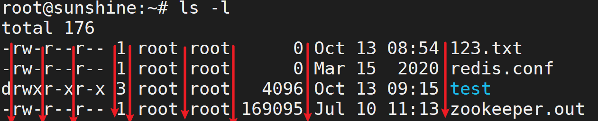

从左到右表示：

- -表示文件，d表示文件夹
- 所属用户的权限
- 所属组的权限
- 其他用户权限
- 硬链接数，通俗地讲，就是有多少种方式，可以访问到当前目录／文件
- 第一个root是文件的拥有者
- 第二个root是文件所属的组
- 后面的0 0那一列代表文件大小
- 再后面表示时间
- 最后面代表文件名或者文件夹名


### **硬链接数扩展**

就拿上面的test文件夹来说有三种方式可以到达：

- `cd /root/test`  绝对路径到达
- `cd .`  自己的本路径
- 在test子目录中 `cd ..`

那么如果test下面有两个子目录，那么这里的硬链接数就为4。也就是说，硬链接数可以反映一个目录的子目录数。


第一列的内容的信息解释如下：


> 下面将详细讲解文件的类型、Linux中权限以及文件有所有者、所在组、其它组具体是什么？


### 文件权限概念和基础

**文件的类型：**

- d： 代表目录（没有d的就是文件）
- -： 代表文件
- l： 代表软链接（可以认为是window中的快捷方式）

**Linux中权限分为以下几种：**

- r：代表权限是可读，r也可以用数字4表示
- w：代表权限是可写，w也可以用数字2表示
- x：代表权限是可执行，x也可以用数字1表示

**文件和目录权限的区别：**

 对文件和目录而言，读写执行表示不同的意义。

 对于文件：

| 权限名称 |                可执行操作 |
| :------- | ------------------------: |
| r        | 可以使用cat查看文件的内容 |
| w        |        可以修改文件的内容 |
| x        |  可以将其运行为二进制文件 |

 对于目录：

| 权限名称 |               可执行操作 |
| :------- | -----------------------: |
| r        |       可以查看目录下列表 |
| w        | 可以创建和删除目录下文件 |
| x        |       可以使用cd进入目录 |

**需要注意的是超级用户可以无视普通用户的权限，即使文件目录权限是000，依旧可以访问。**
**在linux中的每个用户必须属于一个组，不能独立于组外。在linux中每个文件有所有者、所在组、其它组的概念。**

- **所有者**

  一般为文件的创建者，谁创建了该文件，就天然的成为该文件的所有者，用ls ‐ahl命令可以看到文件的所有者 也可以使用chown 用户名  文件名来修改文件的所有者 。

- **文件所在组**

  当某个用户创建了一个文件后，这个文件的所在组就是该用户所在的组 用ls ‐ahl命令可以看到文件的所有组 也可以使用chgrp  组名  文件名来修改文件所在的组。 

- **其它组**

  除开文件的所有者和所在组的用户外，系统的其它用户都是文件的其它组 

> 我们再来看看如何修改文件/目录的权限。

**修改文件/目录的权限的命令：`chmod`**

示例：修改/test下的aaa.txt的权限为属主有全部权限，属主所在的组有读写权限，
其他用户只有读的权限

**`chmod u=rwx,g=rw,o=r aaa.txt`**

**`chmod -R u=rwx,g=rwx,o=rwx ./log`** // 递归给log目录下的所有文件授权


上述示例还可以使用数字表示：

chmod 764 aaa.txt


### `chmod` 简单使用（重要）

#### 操作文件权限

* `chmod` 可以修改 **用户／组** 对 **文件／目录** 的权限 
* 记忆：`change mode -> chmod`
* 命令格式如下：

```bash
chmod +/-rwx 文件名|目录名
```

> 提示：以上方式会一次性修改 `拥有者` / `组` 权限，有关 `chmod` 的高级用法，后续会讲


举例子：有一个文件aaa.txt，原来的文件权限是读写，用chmod命令将读写权限去掉，然后就是下面---------，这个文件现在不可以读写。上面路色的aaa文件，表示可以执行的文件，就是在命令行直接可以运行比如想运行这个文件，就可以`./aaa`，这个表示当前文件夹下执行aaa，`.`表示当前目录。

```bash
chmod -rw aaa.txt
```

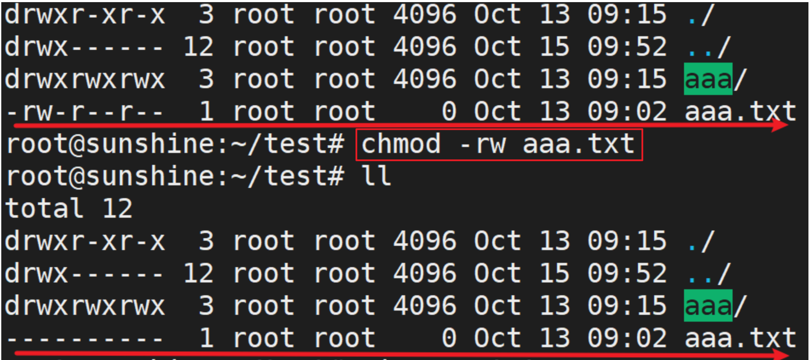


如果想把读写权限加回来的话：

```bash
chmod +rw aaa.txt
```


#### 操作目录权限

##### 去掉可执行权限：

如果是普通用户，当把一个目录的可执行权限去掉以后，`cd aaa`、`ls aaa`等这些命令是不能执行的，我这里还可以执行时因为我这里是超级用户root权限，估计是权限比较大。

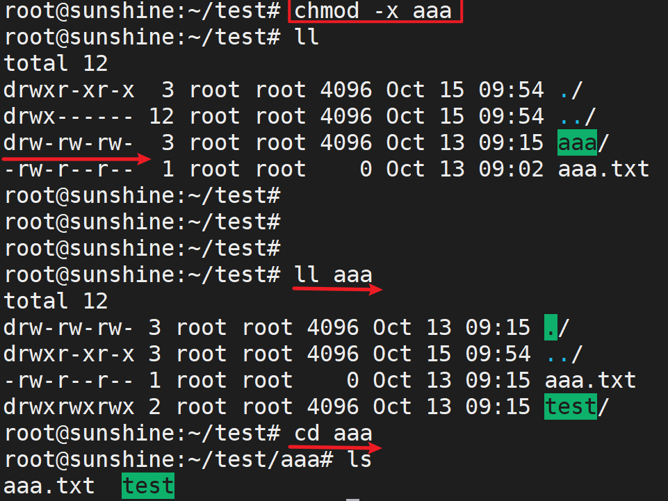


##### 去掉读写权限

如果是一般用户，去掉文件的读写权限，是不能用`ls aaa`、`touch bbb.txt`命令的，但是我的是超级用户，还是可以用。卧槽，无情！

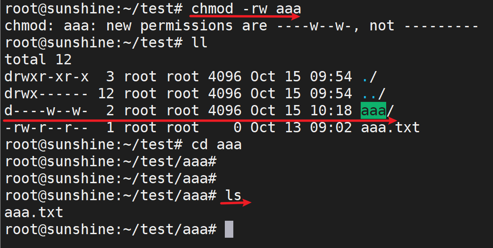

###  超级用户

* Linux 系统中的 `root` 账号通常 **用于系统的维护和管理**，对操作系统的所有资源 **具有所有访问权限**
* 在大多数版本的 Linux 中，都不推荐 **直接使用 root 账号登录系统**
* 在 Linux 安装的过程中，系统会自动创建一个用户账号，而这个默认的用户就称为“标准用户”

#### sudo

* `su` 是 `substitute user` 的缩写，表示 **使用另一个用户的身份** （刚开始学这个还以为这个是super user的意思呢，哈哈无知）
* `sudo` 命令用来以其他身份来执行命令，预设的身份为 `root`
* 用户使用 `sudo` 时，必须先输入密码，之后有 **5 分钟的有效期限**，超过期限则必须重新输入密码

> 若其未经授权的用户企图使用 `sudo`，则会发出警告邮件给管理员


### **补充一个比较常用的东西:**

假如我们装了一个zookeeper，我们每次开机到要求其自动启动该怎么办？

1. 新建一个脚本zookeeper
2. 为新建的脚本zookeeper添加可执行权限，命令是:`chmod +x zookeeper`
3. 把zookeeper这个脚本添加到开机启动项里面，命令是：` chkconfig --add  zookeeper`
4. 如果想看看是否添加成功，命令是：`chkconfig --list`

## Vim 编辑器(更加详细的操作 下面有单独的Vi)

**Vi Vim 三种模式转换图** 

这个和上面的vim内容有点出入!以上面为主!

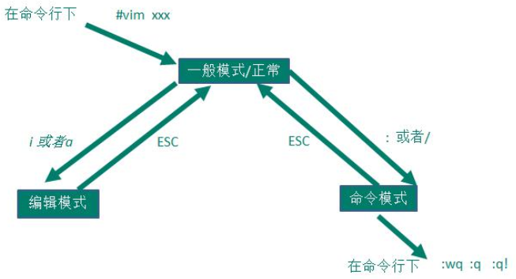

在任何状态下，按下Esc切换到命令模式，此模式下可以使用，指定插入位置，删除指定内容（dd），复制（yy），粘贴（pp），撤销（u）等命令。

在git的使用中!git push,有时候如果发生冲突,进入Vim中,需要退出来一般按:wq即可!


- Vim有三种模式：命令行模式，插入模式，底行模式
- 命令模式：使用vim命令打开一个文本文件，默认是命令模式。
- 底行模式：在命令模式下，按下：（冒号）切换到底行模式，在底行模式下，可以执行保存，退出等命令。
- 插入（编辑）模式：在命令模式下，按a或i或o（大小写都可以，但意义不同）可切换到插入模式，在此模式下，我们可以编辑文件内容。


**命令状态下：演示如下命令**：

- i在关标位置开始插入字符。 Insert
- I在光标所在行的最前面开始加字。
- a在光标位置后开始加字。
- A 在光标所在行的最后面开始加字。
- o在光标下加一空白行并开始加字。
- O 在光标上加一空白行并开始加字。
- Shift+h(H):光标移到屏幕的第一行
- Shift+l(L):光标移到屏幕的最后一行
- w:向后移动一个单词
- :number :指定到某一行
- b:向前移动一个单词
- dd：删除一行
- yy或Y :可以把一行文本拷贝到寄存器中
- Pp或p :粘贴一行

为了方便演示，在介绍一个命令wget -P 指定目录
资源地址，下载某资源到指定目录（就下载百度首页的html）


## 重定向、输入输入

### echo 文字内容

* `echo` 会在终端中显示参数指定的文字，通常会和 **重定向** 联合使用
  - `echo hello ` 会在终端中显示出hello，其实就是讲参数显示出来


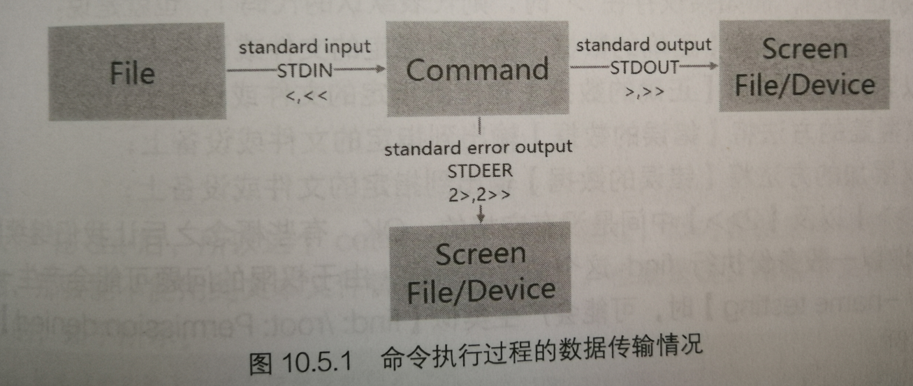

图片是鸟哥私房菜里面的图片，这个画的很好。

图片中，上面两个代表标准输入，标准输出。下面代表标准错误输出。

- **`标准输入（stdin）`**：代码0，使用 < 或者 <<
- **`标准输出（stdout）`**：代码1，使用 > 或者 >>
- **`标准错误输出（stderr）`**：代码2，使用2> 或者2>>


- **`>`**: 将某命令的标准输出重定向到另外的地方，通常是别的文件中。
  - ls -l \> a 将当前某目录下的文件或目录的详细信息，保存到a文件中
- **`>>`** : 和 \>不同的是，这种重定向表示，在目标原有的基础上，**追加新增的内容，而不是覆盖原有的内容**
- **`<<`** : 表示从键盘输入（标准输入），以\<\<后面的内容作为结束符  cat > d << ”oo“ 查找文件，表示由cat将输入的信息直接输出到d文件中，以oo结束（输入两个不代表追加，代表结束 ）
- **`<`** :将标准输入流即键盘输入，转化为\<之后的的数据源，比如文件 cat > file < ~/.bashrc , 这种就表示由文件中输入，而不是键盘输入。


小总结：

向右的有四种，一个箭头的不追加，两个的追加。

箭头向左的，有两种，两个的表示以一个字符结尾。一个一般直接表示输入。


例子：` tree >> 321.txt` 将当前目录下的树，重定向追加到321.txt文件末尾

​			`echo hello > b.txt` 创建b.txt文件的同时，向文件中写入hello内容。


## 常见的系统命令

```shell
date #查看系统时间
date -s "yyyy-MM-dd HH:mm:ss"

clear #清理屏幕 清理所有的
ctrl + l # 清屏 这个好用 只清理当前屏幕 往上翻页 数据还在 
```


* 本节内容主要是为了方便通过远程终端维护服务器时，查看服务器上当前 **系统日期和时间** ／ **磁盘空间占用情况** ／ **程序执行情况**
* 本小结学习的终端命令基本都是查询命令，通过这些命令对系统资源的使用情况有个了解

### 目标

* 时间和日期
  * `date`
  * `cal`
* 磁盘和目录空间
  * `df`
  * `du`
* 进程信息
  * `ps`
  * `top`
  * `kill`

### 时间和日期

| 序号 | 命令 | 作用                                             |
| ---- | ---- | ------------------------------------------------ |
| 01   | date | 查看系统时间                                     |
| 02   | cal  | `calendar` 查看日历，`-y` 选项可以查看一年的日历 |

### 磁盘信息

| 序号 | 命令           | 作用                                                         |
| ---- | -------------- | ------------------------------------------------------------ |
| 01   | df -h          | `disk free` 显示磁盘剩余空间 （这个主要看根目录占用情况）    |
| 02   | du -h [目录名] | `disk usage` 显示目录下的文件大小（并且在最后显示出总的占用情况） |

* 选项说明

| 参数 | 含义                       |
| ---- | -------------------------- |
| -h   | 以人性化的方式显示文件大小 |

### 进程信息

* 所谓 **进程**，通俗地说就是 **当前正在执行的一个程序**

| 序号 | 命令               | 作用                                  |
| ---- | ------------------ | ------------------------------------- |
| 01   | ps aux             | `process status` 查看进程的详细状况   |
| 02   | top                | **动态**显示运行中的进程并且排序      |
| 03   | kill [-9] 进程代号 | 终止指定代号的进程，`-9` 表示强行终止 |

> `ps` 默认只会显示当前用户通过终端启动的应用程序

* `ps` 选项说明

| 选项 | 含义                                     |
| ---- | ---------------------------------------- |
| a    | 显示终端上的所有进程，包括其他用户的进程 |
| u    | 显示进程的详细状态                       |
| x    | 显示没有控制终端的进程                   |

> 提示：使用 `kill` 命令时，最好只终止由当前用户开启的进程，而不要终止 `root` 身份开启的进程，否则可能导致系统崩溃

>* 要退出 `top` 可以直接输入 `q`


## 查看进程信息

这个博客里面 有详细的查看进程 下面那个个不全 

```shell
#查看进程
ps -aux  #这个命令查出来的信息比较全面
ps -ef #查看所有进程 process status
ps -ef | grep xxx #查看所有满足筛选条件的进程
ps -aux | grep java #这个也可以查看满足条件的进程


#结束进程
Kill xxx：结束进程号为xxx的进程
Kill -9 xxx：强制结束进程号为xxx的进程
```

参考：https://blog.csdn.net/MaxineZhou/article/details/80468608?depth_1-utm_source=distribute.pc_relevant.none-task-blog-BlogCommendFromMachineLearnPai2-2&utm_source=distribute.pc_relevant.none-task-blog-BlogCommendFromMachineLearnPai2-2


## 网络管理

```shell
#查看网络设置
ifconfig 
ifconfig 网卡名称 down  用网卡
ifconfig 网卡名称 up  用网卡

#查看网络是否通
ping www.baidu.com 

#查看网络端口
netstat -ano | grep 3306 

#显示进程名称
sudo netstat -anp |grep 3306 
```


## 用户管理

> 提示：**创建用户** / **删除用户** / **修改其他用户密码** 的终端命令都需要通过 `sudo` 执行

### 创建用户／设置密码／删除用户

| 序号 | 命令                           | 作用         | 说明                                                         |
| ---- | ------------------------------ | ------------ | ------------------------------------------------------------ |
| 01   | useradd -m -g 组 新建用户名    | 添加新用户   | `-m `自动建立用户家目录      `-g` 指定用户所在的组，否则会建立一个和同名的组 |
| 02   | passwd 用户名                  | 设置用户密码 | 如果是普通用户，直接用 passwd 可以修改自己的账户密码         |
| 03   | userdel -r 用户名              | 删除用户     | `-r` 选项会自动删除用户家目录                                |
| 04   | cat /etc/passwd \| grep 用户名 | 确认用户信息 | 新建用户后，用户信息会保存在` /etc/passwd` 文件中            |

> 提示：
>
> * 创建用户时，如果忘记添加 `-m` 选项指定新用户的家目录 —— 最简单的方法就是**删除用户，重新创建**
> * 创建用户时，默认会创建一个和**用户名**同名的**组名**
> * 用户信息保存在 `/etc/passwd` 文件中


```bash
#创建用户steve，并创建家目录，指定所属组为dev，如果不是root用户创建，前面需要加sudo
useradd -m -g dev steve

#然后就需要指定这个用户的密码，否则是用不了的
passwd steve 
#然后输入两次密码 然后用ssh就可以登录啦 这里输入的密码是中银

#退出登录
exit

#查看密码文件
cat -n /etc/passwd
```


### 查看用户信息

| 序号 | 命令        | 作用                                                   |
| ---- | ----------- | ------------------------------------------------------ |
| 01   | id [用户名] | 查看用户 UID 和 GID 信息（uid表示用户代号，gid组代号） |
| 02   | who         | 查看当前所有登录的用户列表                             |
| 03   | whoami      | 查看当前登录用户的账户名                               |

- #### id

```bash
#查看steve的信息 
id steve
#结果：uid=1000(steve) gid=1001(dev) groups=1001(dev)

#只输入id，则这时候显示的是当前用户的信息
id
#结果：uid=0(root) gid=0(root) groups=0(root)

#查看steve的密码文件
cat -n /etc/passwd | grep steve
#结果：30  steve:x:1000:1001::/home/steve:/bin/sh

#查看dev组
cat -n /etc/group | grep dev
```

- who、whoami

```bash
#查看我是谁？当点登录账户名
whoami
#结果：root

#查看当前登录的所有用户列表
who
#结果： 后面的时间实上次登录时间，和登录ip地址
#root     pts/0        2020-10-15 13:47 (182.150.63.195)
#steve    pts/1        2020-10-15 13:47 (182.150.63.195)

```


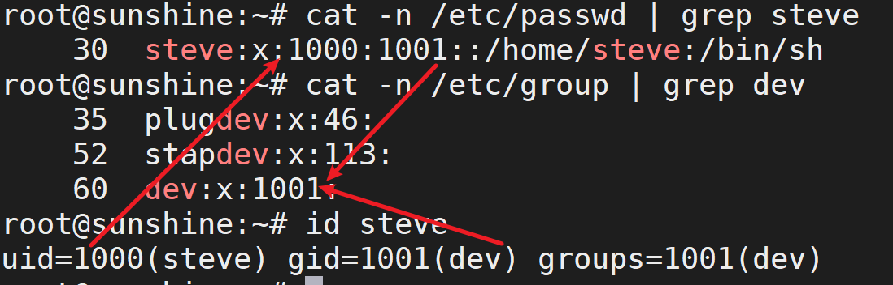

#### passwd 

##### 命令

- `passwd 用户名`:更改或创建用户的密码
- `passwd -S 用户名` :显示用户账号密码信息
- `passwd -d 用户名`:  清除用户密码

##### passwd文件

`/etc/passwd` 文件存放的是用户的信息，由 6 个分号组成的 7 个信息，分别是

1. 用户名
2. 密码（x，表示加密的密码）
3. UID（用户标识）
4. GID（组标识）
5. 用户全名或本地帐号
6. 家目录
7. 登录使用的 Shell，就是登录之后，使用的终端命令，`ubuntu` 默认是 `dash`

#### usermod

* `usermod` 可以用来设置 **用户** 的 **主组** ／ **附加组** 和 **登录 Shell**，命令格式如下：
* **主组**：通常在新建用户时指定，在 `etc/passwd` 的第 4 列 **GID 对应的组**
* **附加组**：在 `etc/group` 中最后一列表示该组的用户列表，用于指定 **用户的附加权限**

> 提示：设置了用户的附加组之后，需要**重新登录**才能生效！

```bash
# 修改用户的主组（passwd 中的 GID）注意这里是小写g
usermod -g 组 用户名 

# 修改用户的附加组 注意这里是大写G
usermod -G 组 用户名

# 修改用户登录 Shell
usermod -s /bin/bash 用户名
```

修改用户登录shell这个非常重要，默认创建了用户使用的是dash，需要修改成bash。不然的话，用shell软件出来的没有颜色，白白一堆。下面这个样子的：

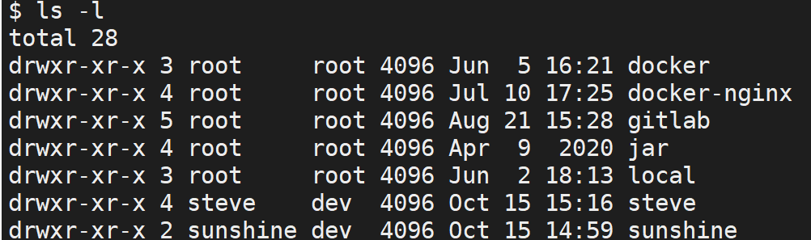


```bash
#修改steve用户的shell
usermod -s /bin/bash steve
```


修改完了需要exit退出以后重新登录。修改了以后就好看多啦，进入的时候也好看，目录也有颜色啦。

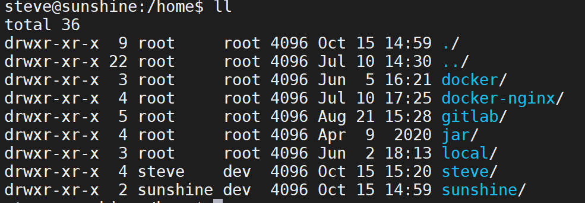

> 注意：默认使用 `useradd` 添加的用户是没有权限使用 `sudo` 以 `root` 身份执行命令的，可以使用以下命令，将用户添加到 `sudo` 附加组中

```bash
usermod -G sudo 用户名
```


自己测试

```bash
#刚开始刚新建的用户steve，是这样的只有主组
id
#结果：uid=1000(steve) gid=1001(dev) groups=1001(dev)

#然后自己修改用户steve的附加组 修改为sudo
usermod -G sudo steve

#查看是否修改附加组成功
cat -n /etc/group | grep sudo
#结果：21  sudo:x:27:steve
#说明修改成功啦 

#修改完之后，使用steve账户，来创建新的用户的时候还是不行
sudo useradd -m -g dev sunshine
#结果：
#[sudo] password for steve:
#steve is not in the sudoers file.  This incident will be reported.

#这时候就需要  重新连接一下 
#再次操作 就可以创建用户sunshine啦，这里密码是中银
```


#### which（重要）

菜鸟教程：https://www.runoob.com/linux/linux-comm-which.html


菜鸟教程的解释是：

Linux which命令用于查找文件。

which指令会在环境变量$PATH设置的目录里查找符合条件的文件。


用自己的话说是：

which可以查找那些命令的所在的位置。


> 提示
>
> * `/etc/passwd` 是用于保存用户信息的文件
> * `/usr/bin/passwd` 是用于修改用户密码的程序

* `which` 命令可以查看执行命令所在位置，例如：

```bash
which ls

# 输出
# /bin/ls

which useradd

# 输出
# /usr/sbin/useradd
```

which搜索出来的命令，是红色的。类似可执行文件。

##### 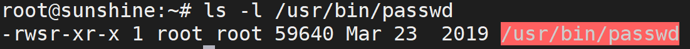

有一些是绿色的

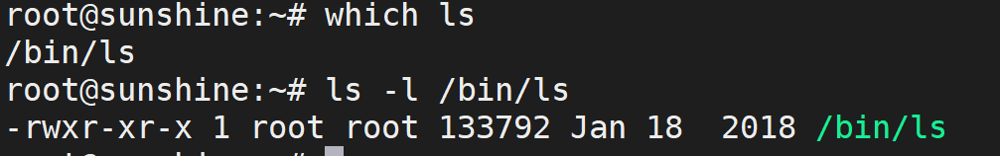


##### `bin` 和 `sbin`

* 在 `Linux` 中，绝大多数可执行文件都是保存在 `/bin`、`/sbin`、`/usr/bin`、`/usr/sbin`
* `/bin`（`binary`）是二进制执行文件目录，主要用于具体应用
* `/sbin`（`system binary`）是系统管理员专用的二进制代码存放目录，主要用于系统管理
* `/usr/bin`（`user commands for applications`）后期安装的一些软件
* `/usr/sbin`（`super user commands for applications`）超级用户的一些管理程序

> 提示：
>
> * `cd` 这个终端命令是内置在系统内核中的，没有独立的文件，因此用 `which` 无法找到 `cd` 命令的位置

### 切换用户

| 序号 | 命令        | 作用                   | 说明                                     |
| ---- | ----------- | ---------------------- | ---------------------------------------- |
| 01   | su - 用户名 | 切换用户，并且切换目录 | - 可以切换到用户家目录，否则保持位置不变 |
| 02   | exit        | 退出当前登录账户       |                                          |

* `su` 不接用户名，可以切换到 `root`，但是不推荐使用，因为不安全
* `exit` 示意图如下：


自己实际操作：

```bash
#当前是root用户，当前在/root目录下，执行下面命令，切换成steve用户，但是当前还在原来的目录/root，这时候会发现用不了ls命令等，需要cd ..(因为steve用户不能操作root家目录)
su steve

#如果想直接进入steve家目录，前后都有空格。（所以一般还是用这个命令操作起来方便一点）
su - steve 
```


## 修改文件权限

| 序号 | 命令  | 作用       |
| ---- | ----- | ---------- |
| 01   | chown | 修改拥有者 |
| 02   | chgrp | 修改组     |
| 03   | chmod | 修改权限   |

* 命令格式如下：

```bash
# 修改文件|目录的拥有者
chown 用户名 文件名|目录名

# 递归修改文件|目录的组
chgrp -R 组名 文件名|目录名

# 递归修改文件权限
chmod -R 755 文件名|目录名
```

* `chmod` 在设置权限时，可以简单地使用三个数字分别对应 **拥有者** ／ **组** 和 **其他** 用户的权限

```bash
# 直接修改文件|目录的 读|写|执行 权限，但是不能精确到 拥有者|组|其他
chmod +/-rwx 文件名|目录名
```


* 常见数字组合有（`u`表示用户／`g`表示组／`o`表示其他）：
  * `777` ===> `u=rwx,g=rwx,o=rwx` 
  * `755` ===> `u=rwx,g=rx,o=rx`
  * `644` ===> `u=rw,g=r,o=r`

### `chmod` 演练目标

1. 将 `01.py` 的权限修改为 `u=rwx,g=rx,o=r` 
2. 将 `123.txt` 的权限修改为 `u=rw,g=r,o=-` 
3. 将 `test` 目录以及目录下的 **所有** 文件权限修改为 `u=rwx,g=rwx,o=rx` 

```bash
#上面依次为：
chmod 754 01.py
chmod 640 123.txt
chmod -R 775 test
```


## 用户组的管理

每个用户都有一个用户组，系统可以对一个用户组中的所有用户进行集中管理。不同Linux 系统对用户组的规定有所不同，如Linux下的用户属于与它同名的用户组，这个用户组在创建用户时同时创建。

用户组的管理涉及用户组的添加、删除和修改。组的增加、删除和修改实际上就是对/etc/group文件的更新。


### 基本概念

> 提示：**创建组** / **删除组** 的终端命令都需要通过 `sudo` 执行

| 序号 | 命令                      | 作用                      |
| ---- | ------------------------- | ------------------------- |
| 01   | groupadd 组名             | 添加组                    |
| 02   | groupdel 组名             | 删除组                    |
| 03   | cat /etc/group            | 确认组信息                |
| 04   | chgrp -R 组名 文件/目录名 | 递归修改文件/目录的所属组 |
| 05   | groupmod 选项 用户组      | 修改用户组的属性          |

> 提示：
>
> * 组信息保存在 `/etc/group` 文件中
> * `/etc` 目录是专门用来保存 **系统配置信息** 的目录


* 在实际应用中，可以预先针对 **组** 设置好权限，然后 **将不同的用户添加到对应的组中**，从而**不用依次为每一个用户设置权限**


查找所有组：

```bash
cat /etc/group #在任何地方

cat group #在本目录下时
```

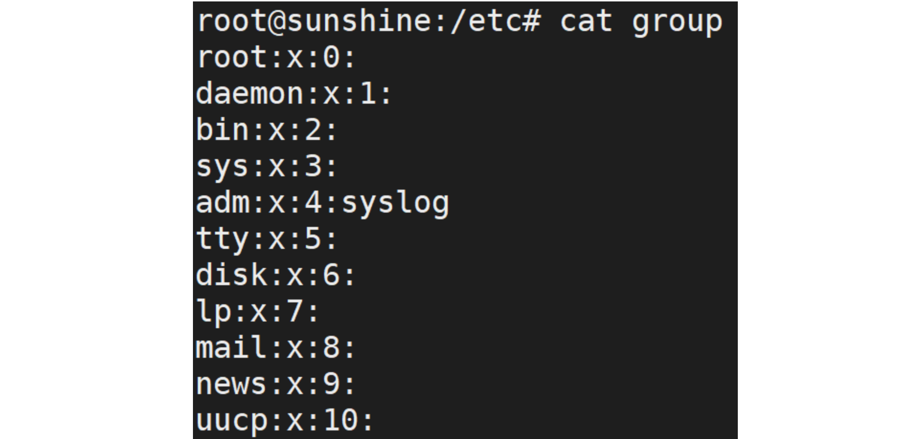


### 演练目标

1. 在 `python` 用户的桌面文件夹下创建 `Python学习` 目录
2. 新建 `dev` 组
3. 将 `Python学习` 目录的组修改为 `dev`

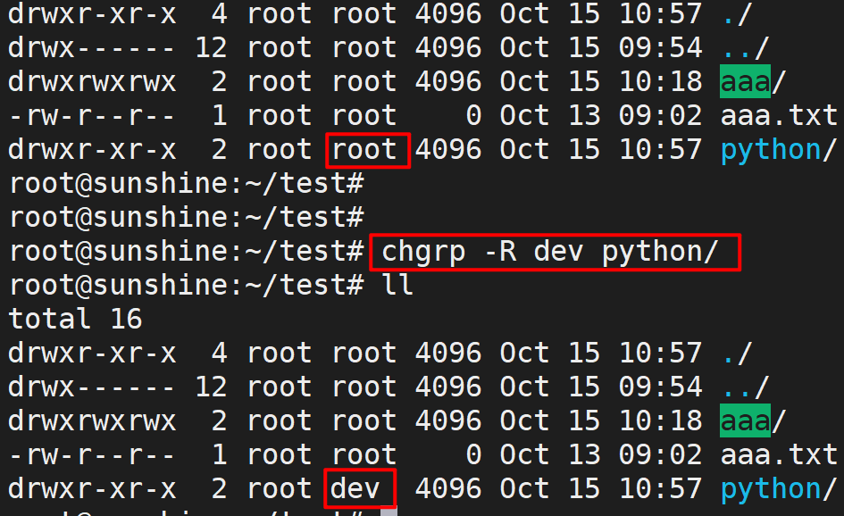


## 远程管理常用命令

### 目标

* 关机/重启
  * `shutdown`
* 查看或配置网卡信息
  * `ifconfig`
  * `ping`
* 远程登录和复制文件
  * `ssh`
  * `scp`

### 01. 关机/重启 

| 序号 | 命令               | 对应英文 | 作用           |
| ---- | ------------------ | -------- | -------------- |
| 01   | shutdown 选项 时间 | shutdown | 关机／重新启动 |

#### 1.1 `shutdown`

* `shutdown` 命令可以 **安全** **关闭** 或者 **重新启动系统**

| 选项 | 含义     |
| ---- | -------- |
| -r   | 重新启动 |

> 提示：
>
> * **不指定选项和参数**，默认表示 **1 分钟**之后 **关闭电脑**
> * 远程维护服务器时，最好不要关闭系统，而应该重新启动系统

* 常用命令示例

```bash
# 重新启动操作系统，其中 now 表示现在
$ shutdown -r now

# 立刻关机，其中 now 表示现在
$ shutdown now

# 系统在今天的 20:25 会关机
$ shutdown 20:25

# 系统再过十分钟后自动关机
$ shutdown +10

# 取消之前指定的关机计划
$ shutdown -c
```

### 02. 查看或配置网卡信息

| 序号 | 命令        | 对应英文                      | 作用                              |
| ---- | ----------- | ----------------------------- | --------------------------------- |
| 01   | ifconfig    | configure a network interface | 查看/配置计算机当前的网卡配置信息 |
| 02   | ping ip地址 | ping                          | 检测到目标 ip地址 的连接是否正常  |

#### 2.1 网卡 和 IP 地址

##### 网卡

* 网卡是一个专门负责网络通讯的硬件设备
* **IP 地址**是设置在网卡上的地址信息

> 我们可以把 **电脑** 比作 **电话**，**网卡** 相当于 **SIM 卡**，**IP 地址** 相当于 **电话号码**

##### IP 地址

* **每台联网的电脑上**都有 **IP 地址**，**是保证电脑之间正常通讯的重要设置**

> 注意：每台电脑的 IP 地址不能相同，否则会出现 IP 地址冲突，并且没有办法正常通讯
>
> 提示：有关 **IP 地址**的详细内容，在就业班会详细讲解！

#### 2.2 `ifconfig`

* `ifconfig` 可以查看／配置计算机当前的网卡配置信息

```bash
# 查看网卡配置信息
$ ifconfig

# 查看网卡对应的 IP 地址
$ ifconfig | grep inet
```

> 提示：一台计算机中有可能会有一个 **物理网卡** 和 **多个虚拟网卡**，在 Linux 中物理网卡的名字通常以 `ensXX` 表示

* `127.0.0.1` 被称为 **本地回环/环回地址**，一般用来测试本机网卡是否正常

#### 2.3 `ping`

```bash
# 检测到目标主机是否连接正常
$ ping IP地址

# 检测本地网卡工作正常
$ ping 127.0.0.1
```

* `ping` 一般用于检测当前计算机到目标计算机之间的网络 **是否通畅**，**数值越大，速度越慢**

> * `ping` 的工作原理与潜水艇的声纳相似，`ping` 这个命令就是取自 **声纳的声音** 
> * 网络管理员之间也常将 `ping` 用作动词 —— **ping 一下计算机X，看他是否开着**

原理：网络上的机器都有 **唯一确定的 IP 地址**，我们给**目标 IP 地址**发送一个数据包，对方就要返回一个数据包，根据返回的数据包以及时间，我们可以确定目标主机的存在

> 提示：在 Linux 中，想要终止一个终端程序的执行，绝大多数都可以使用 `CTRL + C`

### 03. 远程登录和复制文件

| 序号 | 命令                                              | 对应英文     | 作用           |
| ---- | ------------------------------------------------- | ------------ | -------------- |
| 01   | ssh 用户名@ip                                     | secure shell | 关机／重新启动 |
| 02   | scp 用户名@ip:文件名或路径 用户名@ip:文件名或路径 | secure copy  | 远程复制文件   |

#### 3.1 `ssh` 基础（重点）

在 Linux 中 SSH 是 **非常常用** 的工具，通过 **SSH 客户端** 我们可以连接到运行了 **SSH 服务器** 的远程机器上


* **SSH 客户端**是一种使用 `Secure Shell（SSH）` 协议连接到远程计算机的软件程序
* `SSH` 是目前较可靠，**专为远程登录会话和其他网络服务** 提供安全性的协议
  * 利用 `SSH 协议` 可以有效**防止远程管理过程中的信息泄露**
  * 通过 `SSH 协议` 可以对所有传输的数据进行加密，也能够防止 DNS 欺骗和 IP 欺骗
* `SSH` 的另一项优点是传输的数据可以是经过压缩的，所以可以加快传输的速度

##### 1) 域名 和 端口号

##### 域名

* 由一串 **用点分隔** 的名字组成，例如：`www.itcast.cn`
* 是 **IP 地址** 的别名，方便用户记忆

##### 端口号

* **IP 地址**：通过 **IP 地址** 找到网络上的 **计算机**
* **端口号**：通过 **端口号** 可以找到 **计算机上运行的应用程序**
  * **SSH 服务器** 的默认端口号是 `22`，如果是默认端口号，在连接的时候，可以省略

* 常见服务端口号列表：

| 序号 | 服务       | 端口号 |
| ---- | ---------- | ------ |
| 01   | SSH 服务器 | 22     |
| 02   | Web 服务器 | 80     |
| 03   | HTTPS      | 443    |
| 04   | FTP 服务器 | 21     |

> 提示：有关 **端口号**的详细内容，在就业班会详细讲解！

##### 2) SSH 客户端的简单使用

```bash
ssh [-p port] user@remote

#MAC上面默认是可以使用终端shell连接服务器的
#但是Wins上面也是可以连接的，例如默认端口为22
ssh root@47.92.208.93  

#如果是其他端口
ssh -p 22 root@47.92.208.93  

#注意
bash是一种unix默认的一种shell，MAC现在也是用的这个
```

* `user` 是在远程机器上的用户名，如果不指定的话默认为当前用户
* `remote` 是远程机器的地址，可以是 **IP**／**域名**，或者是 **后面会提到的别名**
* `port` 是 **SSH Server 监听的端口**，如果不指定，就为默认值 `22`

> 提示：
>
> * 使用 `exit` 退出当前用户的登录
>
> 注意：
>
> * `ssh` 这个终端命令只能在 `Linux` 或者 `UNIX` 系统下使用
> * 如果在 `Windows` 系统中，可以安装 `PuTTY` 或者 `XShell` 客户端软件即可
>
> 提示：
>
> * 在工作中，SSH 服务器的端口号很有可能**不是 22**，如果遇到这种情况就需要使用 `-p` 选项，指定正确的端口号，否则无法正常连接到服务器


用wins命令终端连接到服务器上是这样子的：

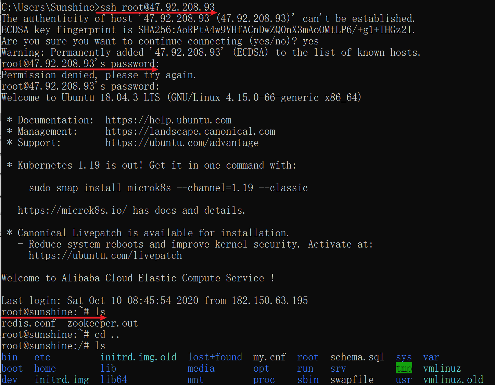


##### 3) Windows 下 SSH 客户端的安装

* `Putty` http://www.chiark.greenend.org.uk/~sgtatham/putty/latest.html
* `XShell` http://xshellcn.com

> 建议从官方网站下载正式的安装程序

#### 3.2 `scp`（掌握） 

* scp 就是 `secure copy`，是一个在 Linux 下用来进行 **远程拷贝文件** 的命令
* 它的**地址格式与 ssh 基本相同**，**需要注意的是**，在指定端口时用的是**大写的** `-P` 而不是小写的
* **这个类似FTP软件的操作，也类似cp拷贝命令**


```bash
# 把本地当前目录下的 01.py 文件 复制到 远程 家目录下的 Desktop/01.py
# 注意：`:` 后面的路径如果不是绝对路径，则以用户的家目录作为参照路径
scp -P port 01.py user@remote:Desktop/01.py

# 把远程 家目录下的 Desktop/01.py 文件 复制到 本地当前目录下的 01.py
scp -P port user@remote:Desktop/01.py 01.py

# 加上 -r 选项可以传送文件夹
# 把当前目录下的 demo 文件夹 复制到 远程 家目录下的 Desktop  相当于上传
scp -r demo user@remote:Desktop

# 把远程 家目录下的 Desktop 复制到 当前目录下的 demo 文件夹  相当于下载
scp -r user@remote:Desktop demo
```


```bash
#自己测试有效的命令
#上面第一个 将本地桌面文件aaa.txt拷贝到服务器上面/root/test/目录下的aaa.txt
scp -P 22 aaa.txt root@47.92.208.93:test/aaa.txt

#上面第三个 递归上传 将本地桌面文件夹aaa上传到服务器上面/root/test目录下
scp -P 22 -r aaa root@47.92.208.93:test

#上面第四个 递归下载 将家root目录下的test文件复制到当前目录下 aaa 文件夹 
scp -P 22 -r root@47.92.208.93:test aaa
```


| 选项 | 含义                                                         |
| ---- | ------------------------------------------------------------ |
| -r   | 若给出的源文件是目录文件，则 scp 将递归复制该目录下的所有子目录和文件，目标文件必须为一个目录名 |
| -P   | 若远程 SSH 服务器的端口不是 22，需要使用大写字母 -P 选项指定端口 |

> 注意：
>
> * `scp` 这个终端命令只能在 `Linux` 或者 `UNIX` 系统下使用
> * 如果在 `Windows` 系统中，可以安装 `PuTTY`，使用 `pscp` 命令行工具或者安装 `FileZilla` 使用 `FTP` 进行文件传输

##### `FileZilla`

* 官方网站：https://www.filezilla.cn/download/client
* `FileZilla` 在传输文件时，使用的是 `FTP 服务` 而不是 `SSH 服务`，因此端口号应该设置为 `21`

#### 3.3 SSH 高级（知道）

* 免密码登录
* 配置别名

> 提示：有关 SSH 配置信息都保存在用户家目录下的 `.ssh` 目录下

##### 1）免密码登录

###### 步骤

* 配置公钥
  * 执行 `ssh-keygen` 即可生成 SSH 钥匙，一路回车即可
* 上传公钥到服务器
  * 执行 `ssh-copy-id -p port user@remote`，可以让远程服务器记住我们的公钥

###### 示意图


> 非对称加密算法 （感觉反过来啦，两个人一人拿一个，既可以加密，又可以解密，美滋滋）
>
> * 使用 **公钥** 加密的数据，需要使用 **私钥** 解密
> * 使用 **私钥** 加密的数据，需要使用 **公钥** 解密

##### 2) 配置别名 

每次都输入 `ssh -p port user@remote`，时间久了会觉得很麻烦，特别是当 `user`, `remote` 和 `port` 都得输入，而且还不好记忆

而 **配置别名** 可以让我们进一步偷懒，譬如用：`ssh mac` 来替代上面这么一长串，那么就在 `~/.ssh/config` 里面追加以下内容：

```
Host mac
    HostName ip地址
    User itheima
    Port 22
```

**保存之后，即可用 `ssh mac` 实现远程登录了，`scp` 同样可以使用**


在wins上面的.ssh上面配置了config以后，ssh 命令连接不上阿里云服务器。不知道为什么! 以后尝试一下mac电脑。

```
Host aliyun
    HostName 47.92.208.93
    User root
    Port 22
```


##### 3）wins连接Ubuntu免密登录（这个是自己写的）

上面的操作是用Ubuntu来连接Mac电脑的时候。

现在我想用我的Wins来连接我的Ubuntu服务器：

- 首先在wins上面的Cmder上面执行

  ```bash
  ssh-keygen.exe -t rsa
  ```

然后出来一堆东西 按三下回车 参考下图绿色

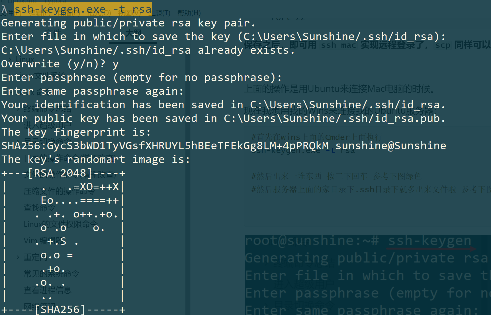


- 然后本地家目录就多出文件 参考下图黑色

上面的是私钥，下面的是公钥

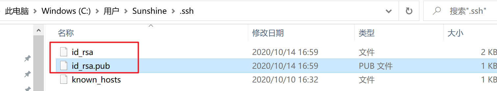


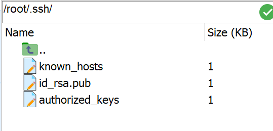


- 然后将公钥id_res.pub 放到服务器上面家目录下.ssh目录下

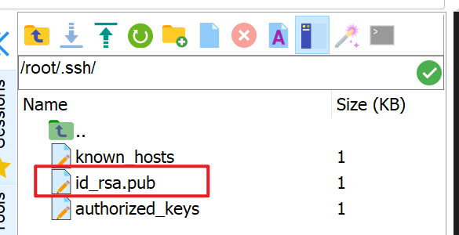

- 最后一步，将公钥追加到权限文件

```bash
 #如果.ssh没有这个文件 创建这个文件
 touch authorized_keys 
 
 #然后将公钥里面文件 追加到这个文件里面
cat id_rsa.pub >> authorized_keys

#然后就成功啦，以后登录服务器就不要密码啦。
```

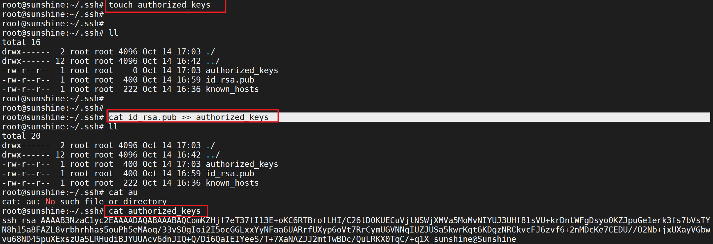


参考：https://blog.csdn.net/yidichaxiang/article/details/104641253?utm_medium=distribute.pc_relevant_t0.none-task-blog-BlogCommendFromMachineLearnPai2-1.edu_weight&depth_1-utm_source=distribute.pc_relevant_t0.none-task-blog-BlogCommendFromMachineLearnPai2-1.edu_weight


## 其他命令

### 目标

* 查找文件
  * `find`
* 软链接
  * `ln`
* 打包和压缩
  * `tar`
* 软件安装
  * `apt-get`

###  查找文件

* `find` 命令功能非常强大，通常用来在 **特定的目录下** **搜索** 符合条件的文件

| 序号 | 命令                     | 作用                                            |
| ---- | ------------------------ | ----------------------------------------------- |
| 01   | find [路径] -name "*.py" | 查找指定路径下扩展名是 `.py` 的文件，包括子目录 |

* 如果省略路径，表示在当前文件夹下查找
* 之前学习的通配符，在使用 `find` 命令时同时可用
* 有关 `find` 的高级使用，在就业班会讲

#### 演练目标

* 1. 搜索桌面目录下，文件名包含 `1` 的文件

```bash
find -name "*1*"
```

* 2. 搜索桌面目录下，所有以 `.txt` 为扩展名的文件

```bash
find -name "*.txt"
```

* 3. 搜索桌面目录下，以数字 `1` 开头的文件

```bash
find -name "1*"
```


自己测试：

```bash
find /home/ -name "*t*"   #在/home/目录下找名字带有t的文件
find -name "*.txt"        #在当前目录搜索以.txt结尾的文件
```

### 软链接

| 序号 | 命令                          | 作用                                                         |
| ---- | ----------------------------- | ------------------------------------------------------------ |
| 01   | ln -s 被链接的源文件 链接文件 | 建立文件的软链接，用通俗的方式讲**类似于** Windows 下的**快捷方式** |

* 注意：

* 1. 没有 `-s` 选项建立的是一个 **硬链接文件** 

    * 两个文件占用相同大小的硬盘空间，**工作中几乎不会建立文件的硬链接**

* 2. **源文件要使用绝对路径**，不能使用相对路径，这样可以方便移动链接文件后，仍然能够正常使用

#### 演练目标

* 将桌面目录下的 `01.py` **移动**到 `demo/b/c` 目录下

* 在桌面目录下新建 `01.py` 的 **软链接** `FirstPython`
    * 分别使用 **相对路径** 和 **绝对路径** 建立 `FirstPython` 的软链接

* 将 `FirstPython` **移动**到 `demo` 目录下，对比使用 **相对路径** 和 **绝对路径** 的区别


自己测试

```bash
#用绝对路径的方式给下面这个路径下的01.py文件创建软连接，软连接新生成的文件名叫做01_juedui
ln -s /root/test/python/b/c/01.py 01_juedui

#用相对路径的方式给01.py这个文件创建软链接，软链接新生成的文件名叫做01_xiangdui
ln -s 01.py 01_xiangdui

#结果（注意这次两个链接都能用，颜色都一样）
#root@sunshine:~/test/python/b/c# ll
#drwxr-xr-x 2 root root 4096 Oct 16 09:57 ./
#drwxr-xr-x 3 root root 4096 Oct 16 09:54 ../
#lrwxrwxrwx 1 root root   27 Oct 16 09:57 01_juedui -> /root/test/python/b/c/01.py
#-rw-r--r-- 1 root root    0 Oct 16 09:56 01.py
#lrwxrwxrwx 1 root root    5 Oct 16 09:57 01_xiangdui -> 01.py

#将文件及下面这两个链接文件，都移动到python目录下，结果如下图（注意这次两个颜色不一样，绝对路径还可以用，相对路径已经不可以用了）
mv 01* /root/test/python/

#试验两个链接是否可用 结果如下：
cat 01_juedui   
cat 01_xiangdui
```


将相对和绝对路径软链接移动到python目录下结果： 

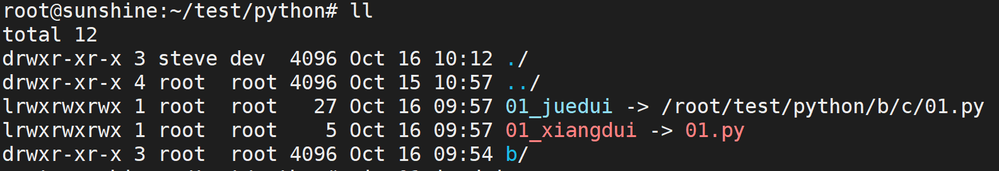


测试移动位置以后，绝对路径和相对路径的软链接都是否可用，结果是绝对路径可用，相对路径不可用。

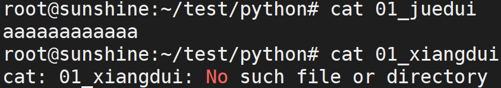


#### 硬链接简介（知道）

* 在使用 `ln` 创建链接时，如果没有 `-s` 选项，会创建一个 **硬链接**，而不是软链接

##### 硬链接演练

* 在 `~/Desktop/demo` 目录下建立 `~/Desktop/demo/b/c/01.py` 的硬链接 `01_hard`
* 使用 `ls -l` 查看文件的**硬链接数**（硬链接——有多少种方式可以访问文件或者目录）
* 删除 `~/Desktop/demo/b/c/01.py`，并且使用 `tree` 来确认 `demo` 目录下的三个链接文件


自己测试

```bash
#在当前路径下，创建硬链接（其实就是在软链接创建方式基础上去掉-s）
ln /root/test/python/b/c/01.py 01_head

#然后删除/python/b/c 下面的01.py文件
rm b/c/01.py

#然后查看两个软链接和一个硬链接 如下图：
#结果硬链接还是可以用，两个软链接用不了啦。（这硬链接是真的硬）
```


查看两个软链接和一个硬链接

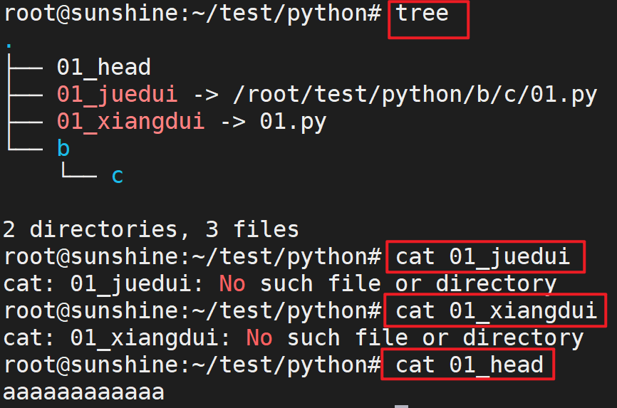


##### 文件软硬链接的示意图


> 在 Linux 中，**文件名** 和 **文件的数据** 是分开存储的

* 提示：
  * 在 Linux 中，只有文件的 `硬链接数 == 0` 才会被删除
  * 使用 `ls -l` 可以查看一个文件的硬链接的数量
  * 在日常工作中，几乎不会建立文件的硬链接，知道即可

### 打包压缩

* **打包压缩** 是日常工作中备份文件的一种方式
* 在不同操作系统中，常用的打包压缩方式是不同的
  * `Windows` 常用 `rar`
  * `Mac` 常用 `zip`
  * `Linux` 常用 `tar.gz`

#### 打包 ／ 解包

* `tar` 是 Linux 中最常用的 **备份**工具，此命令可以 **把一系列文件** 打包到 **一个大文件中**，也可以把一个 **打包的大文件恢复成一系列文件**
* `tar` 的命令格式如下：

```bash
# 打包文件
tar -cvf 打包文件.tar 被打包的文件／路径...

# 解包文件
tar -xvf 打包文件.tar

#总结记忆
#打包和解包 命令前面不同之处就是 一个是c一个是x
```

* `tar` 选项说明

| 选项 | 含义                                                         |
| ---- | ------------------------------------------------------------ |
| c    | 生成档案文件，创建打包文件（是不是create呢？）               |
| x    | 解开档案文件                                                 |
| v    | 列出归档解档的详细过程，显示进度                             |
| f    | 指定档案文件名称，f 后面一定是 .tar 文件，所以必须放选项最后 |

> 注意：`f` 选项必须放在最后，其他选项顺序可以随意

##### 打包解包演练

1. 删除桌面下的所有内容
2. 在桌面下新建三个空白文件 `01.py`、`02.py`、`03.py`
3. 将这三个文件打一个 `py.tar` 的包
4. 新建 `tar` 目录，并且将 `py.tar` 移动到 `tar` 目录下
5. 解包 `py.tar`


自己测试：

```bash
#首先删除要测试目录下所有文件
rm -rf *

#创建三个文件01.py、02.py、03.py
touch 01.py
... ...

#将三个文件打包到一个文件，名字叫做py.tar,这里的tar命令只负责打包，并不负责压缩
tar -cvf py.tar 01.py 02.py 03.py

#创建tar目录
mkdir tar

#将py.tar移动到tar目录下
mv py.tar tar/

#解包py.tar
tar -xvf py.tar

```


#### 压缩／解压缩

#### gzip

* `tar` 与 `gzip` 命令结合可以使用实现文件 **打包和压缩**
  * `tar` 只负责打包文件，但不压缩
  * 用 `gzip` 压缩 `tar` 打包后的文件，其扩展名一般用 `xxx.tar.gz`

> 在 `Linux` 中，最常见的压缩文件格式就是 `xxx.tar.gz`

* 在 `tar` 命令中有一个选项 **-z** 可以调用 `gzip`，从而可以方便的实现压缩和解压缩的功能

* 命令格式如下：

```bash
# 压缩文件
tar -zcvf 打包文件.tar.gz 被压缩的文件／路径...

# 解压缩文件
tar -zxvf 打包文件.tar.gz

# 解压缩到指定路径
tar -zxvf 打包文件.tar.gz -C 目标路径

#总结记忆
#压缩和解压缩命令和上面的打包和解包命令 只有可选项多了个-z，多了一个z，文件后缀多了个.gz。执行的时候，就是先解压缩，然后解包；先压缩后打包。
```

| 选项 | 含义                                           |
| ---- | ---------------------------------------------- |
| -C   | 解压缩到指定目录，注意：要解压缩的目录必须存在 |


类似上面打包解包，这里自己测试压缩，解压缩

```bash
#将三个.py文件压缩打包
tar -zcvf py.tar.gz *.py

#创建文件gz
mkdir gz

#将压缩文件移动到gz文件夹
 mv py.tar.gz gz

#解压缩
tar -zxvf py.tar.gz
```


#### bzip2(two)

* `tar` 与 `bzip2` 命令结合可以使用实现文件 **打包和压缩**（用法和 `gzip` 一样）
  * `tar` 只负责打包文件，但不压缩，
  * 用 `bzip2` 压缩 `tar` 打包后的文件，其扩展名一般用 `xxx.tar.bz2`

* 在 `tar` 命令中有一个选项 **-j** 可以调用 `bzip2`，从而可以方便的实现压缩和解压缩的功能

* 命令格式如下：

```bash
# 压缩文件
tar -jcvf 打包文件.tar.bz2 被压缩的文件／路径...

# 解压缩文件
tar -jxvf 打包文件.tar.bz2

#总结记忆
#这个和前几个相比，可选项是-j（这个念钩，避免和g发音一样，混淆），文件后缀.bz2 
```


| 选项 | 含义                                           |
| ---- | ---------------------------------------------- |
| -C   | 解压缩到指定目录，注意：要解压缩的目录必须存在 |


还是上面的例子，自己测试

```bash
#压缩
tar -jcvf py.tar.bz2 *.py

#建立新目录bz2
mkdir bz2

#将压缩文件移动到bz2
mv py.tar.bz2 bz2/

#进入bz2文件里面解压缩
tar -jxcf py.tar.bz2

#或者可以在bz2外层，指定解压到bz2文件夹也行 (-C 指定解压到目录，必须存在)
tar -jxvf py.tar.bz2 -C bz2
```


### 软件安装

### 通过 apt 安装／卸载软件

* apt 是 `Advanced Packaging Tool`，是 Linux 下的一款安装包管理工具
* 可以在终端中方便的 **安装**／**卸载**／**更新软件包**

```bash
# 1. 安装软件
$ sudo apt install 软件包

# 2. 卸载软件
$ sudo apt remove 软件名

# 3. 更新已安装的包
$ sudo apt upgrade 
```

#### 安装演练

```bash
# 一个小火车提示
$ sudo apt install sl

# 一个比较漂亮的查看当前进程排名的软件
$ sudo apt install htop
```

### 配置软件源

* 如果希望在 `ubuntu` 中安装软件，**更加快速**，可以通过设置**镜像源**，选择一个访问网速更快的服务器，来提供软件下载／安装服务
* 提示：更换服务器之后，需要一个相对比较长时间的更新过程，需要耐心等待。更新完成后，再安装软件都会从新设置的服务器下载软件了

> 所谓镜像源，就是**所有服务器的内容是相同的（镜像）**，但是根据所在位置不同，国内服务器通常速度会更快一些！


# `vi`  终端中的编辑器

## 目标

* `vi` 简介
* 打开和新建文件
* 三种工作模式
* 常用命令
* 分屏命令
* 常用命令速查图

## 01. `vi` 简介

### 1.1 学习 `vi` 的目的

* 在工作中，要对 **服务器** 上的文件进行 **简单** 的修改，可以使用 `ssh` 远程登录到服务器上，并且使用 `vi` 进行快速的编辑即可
* 常见需要修改的文件包括：
  * **源程序**
  * **配置文件**，例如 `ssh` 的配置文件 `~/.ssh/config`

> * 在没有图形界面的环境下，要编辑文件，`vi` 是最佳选择！
> * 每一个要使用 Linux 的程序员，都应该或多或少的学习一些 `vi` 的常用命令

### 1.2 vi 和 vim

* 在很多 `Linux` 发行版中，直接把 `vi` 做成 `vim` 的软连接

#### vi

* `vi` 是 `Visual interface` 的简称，是 `Linux` 中 **最经典** 的文本编辑器
* `vi` 的核心设计思想 —— **让程序员的手指始终保持在键盘的核心区域，就能完成所有的编辑操作**


* `vi` 的特点：
  * **没有图形界面** 的 **功能强大** 的编辑器
  * 只能是编辑 **文本内容**，不能对字体、段落进行排版
  * **不支持鼠标操作**
  * **没有菜单**
  * **只有命令**
* `vi` 编辑器在 **系统管理**、**服务器管理** 编辑文件时，**其功能永远不是图形界面的编辑器能比拟的**

#### `vim`

**vim = vi improved**

* `vim` 是从 `vi` 发展出来的一个文本编辑器，支持 **代码补全**、**编译** 及 **错误跳转** 等方便编程的功能特别丰富，在程序员中被广泛使用，被称为 **编辑器之神**

#### 查询软连接命令（知道）

* 在很多 `Linux` 发行版中直接把 `vi` 做成 `vim` 的软连接

```bash
# 查找 vi 的运行文件

$ which vi
$ ls -l /usr/bin/vi
$ ls -l /etc/alternatives/vi
$ ls -l /usr/bin/vim.basic

# 查找 vim 的运行文件
$ which vim
$ ls -l /usr/bin/vim
$ ls -l /etc/alternatives/vim
$ ls -l /usr/bin/vim.basic 
```

## 02. 打开和新建文件

* 在终端中输入 `vi` **在后面跟上文件名** 即可

```bash
$ vi 文件名
```

* 如果文件已经存在，会直接打开该文件
* 如果文件不存在，会新建一个文件

### 2.1 打开文件并且定位行

* 在日常工作中，有可能会遇到 **打开一个文件，并定位到指定行** 的情况
* 例如：在开发时，**知道某一行代码有错误**，可以 **快速定位** 到出错代码的位置

* 这个时候，可以使用以下命令打开文件

```bash
$ vi 文件名 +行数
```

> 提示：如果只带上 `+` 而不指定行号，会直接定位到文件**末尾**

### 2.2 异常处理

* 如果 `vi` 异常退出，在磁盘上可能会保存有 **交换文件**
* 下次再使用 `vi` 编辑该文件时，会看到以下屏幕信息，按下字母 `d` 可以 **删除交换文件** 即可

> 提示：按下键盘时，注意关闭输入法


## 03. 三种工作模式

* `vi` 有三种基本工作模式：

  1. **命令模式**
     * **打开文件首先进入命令模式**，是使用 `vi` 的 **入口**
     * 通过 **命令** 对文件进行常规的编辑操作，例如：**定位**、**翻页**、**复制**、**粘贴**、**删除**……
     * 在其他图形编辑器下，通过 **快捷键** 或者 **鼠标** 实现的操作，都在 **命令模式** 下实现
  2. **末行模式** —— 执行 **保存**、**退出** 等操作 
     * 要退出 `vi` 返回到控制台，需要在末行模式下输入命令
     * **末行模式** 是 `vi` 的 **出口**
  3. **编辑模式** —— 正常的编辑文字


> 提示：在 `Touch Bar` 的 Mac 电脑上 ，按 `ESC` 不方便，可以使用 `CTRL + [` 替代

### 末行模式命令

| 命令 |     英文     | 功能                           |
| :--: | :----------: | ------------------------------ |
|  w   |    write     | 保存                           |
|  q   |     quit     | 退出，如果没有保存，不允许退出 |
|  q!  |     quit     | 强行退出，不保存退出           |
|  wq  | write & quit | 保存并退出                     |
|  x   |              | 保存并退出                     |

### 注意 设置高亮和行号

**：**如果vi打开文件没有显示行号，在末行模式输入

```bash
:set number    #出现行号
:set nonumber  #不出现行号
#参考：https://www.cnblogs.com/star520/p/9081357.html

:set hls　#找开高亮
:set nohls　#关闭高亮
#参考：https://www.cnblogs.com/bass6/p/6128791.html

```


## 04. 常用命令

### 补充

在学习这一内容的时候，弹幕说可以设置vimrc的内容，可以自定义。

参考：https://stackoverflow.com/questions/10921441/where-is-my-vimrc-file


自己的Ubuntu电脑，这个文件在这个地方`/usr/share/vim/vimrc` 


### 命令线路图

0. 重复次数
   * 在命令模式下，**先输入一个数字**，**再跟上一个命令**，可以让该命令 **重复执行指定次数** 
1. 移动和选择（**多练**）
   * `vi` 之所以快，关键在于 **能够快速定位到要编辑的代码行**
   * **移动命令** 能够 和 **编辑操作** 命令 **组合使用**
2. 编辑操作
   * **删除**、**复制**、**粘贴**、**替换**、**缩排**
3. 撤销和重复
4. 查找替换
5. 编辑

#### 学习提示

1. `vi` 的命令较多，**不要期望一下子全部记住**，个别命令忘记了，只是会影响编辑速度而已
2. 在使用 `vi` 命令时，注意 **关闭中文输入法**

### 4.1 移动（基本）

* 要熟练使用 `vi`，首先应该学会怎么在 **命令模式** 下样快速移动光标
* **编辑操作命令**，能够和 **移动命令** 结合在一起使用

#### 1) 上、下、左、右

| 命令 | 功能 |  手指  |
| :--: | ---- | :----: |
|  h   | 向左 |  食指  |
|  j   | 向下 |  食指  |
|  k   | 向上 |  中指  |
|  l   | 向右 | 无名指 |


#### 2) 行内移动

| 命令 | 英文 | 功能                           |
| :--: | :--: | ------------------------------ |
|  w   | word | 向后移动一个单词               |
|  b   | back | 向前移动一个单词               |
|  0   |      | 行首                           |
|  ^   |      | 行首，第一个不是空白字符的位置 |
|  $   |      | 行尾                           |

#### 3) 行数移动

|  命令  | 英文 | 功能                 |
| :----: | :--: | -------------------- |
|   gg   |  go  | 文件顶部             |
|   G    |  go  | 文件末尾             |
| 数字gg |  go  | 移动到 数字 对应行数 |
| 数字G  |  go  | 移动到 数字 对应行数 |
| :数字  |      | 移动到 数字 对应行数 |

#### 4) 屏幕移动

|   命令   |  英文   | 功能     |
| :------: | :-----: | -------- |
| Ctrl + b |  back   | 向上翻页 |
| Ctrl + f | forward | 向下翻页 |
|    H     |  Head   | 屏幕顶部 |
|    M     | Middle  | 屏幕中间 |
|    L     |   Low   | 屏幕底部 |

### 4.2 移动（程序）

#### 1) 段落移动

* `vi` 中使用 空行 来区分段落
* 在程序开发时，通常 **一段功能相关的代码会写在一起** —— 之间没有空行

| 命令 | 功能   |
| :--: | ------ |
|  {   | 上一段 |
|  }   | 下一段 |

#### 2) 括号切换

* 在程序世界中，`()`、`[]`、`{}` 使用频率很高，而且 **都是成对出现的**

| 命令 | 功能           |
| :--: | -------------- |
|  %   | 括号匹配及切换 |

#### 3) 标记（这个厉害了）

* 在开发时，某一块代码可能**需要稍后处理**，例如：编辑、查看
* 此时先使用 `m` 增加一个标记，这样可以 **在需要时快速地跳转回来** 或者 **执行其他编辑操作**
* **标记名称** 可以是 `a~z` 或者 `A~Z` 之间的任意 **一个** 字母
* 添加了标记的 **行如果被删除**，**标记同时被删除**
* 如果 **在其他行添加了相同名称的标记**，**之前添加的标记也会被替换掉**

| 命令 | 英文 | 功能                                             |
| :--: | :--: | ------------------------------------------------ |
|  mx  | mark | 添加标记 x，x 是 a~z 或者 A~Z 之间的任意一个字母 |
|  'x  |      | 直接定位到标记 x 所在位置                        |

### 4.3 选中文本（可视模式）

* 学习 `复制` 命令前，应该先学会 **怎么样选中 要复制的代码**
* 在 `vi` 中要选择文本，需要先使用 `Visual` 命令切换到 **可视模式**
* `vi` 中提供了 **三种** 可视模式，可以方便程序员选择 **选中文本的方式**
* 按 `ESC` 可以放弃选中，返回到 **命令模式**

|   命令   | 模式       | 功能                               |
| :------: | ---------- | ---------------------------------- |
|    v     | 可视模式   | 从光标位置开始按照正常模式选择文本 |
|    V     | 可视行模式 | 选中光标经过的完整行               |
| Ctrl + v | 可视块模式 | 垂直方向选中文本                   |

* **可视模式**下，可以和 **移动命令** 连用，例如：`ggVG` 能够选中所有内容

### 4.4 撤销和恢复撤销（这个需要用 ）

* 在学习编辑命令之前，先要知道怎样撤销之前一次 **错误的** 编辑动作！

|   命令   | 英文 | 功能           |
| :------: | :--: | -------------- |
|    u     | undo | 撤销上次命令   |
| CTRL + r | redo | 恢复撤销的命令 |

### 4.5 删除文本

|    命令     |  英文  | 功能                              |
| :---------: | :----: | --------------------------------- |
|      x      |  cut   | 删除光标所在字符，或者选中文字    |
| d(移动命令) | delete | 删除移动命令对应的内容            |
|     dd      | delete | 删除光标所在行，可以 ndd 复制多行 |
|      D      | delete | 删除至行尾                        |

> 提示：如果使用 **可视模式** 已经选中了一段文本，那么无论使用 `d` 还是 `x`，都可以删除选中文本

* 删除命令可以和 **移动命令** 连用，以下是常见的组合命令：

```bash
* dw        # 从光标位置删除到单词末尾
* d0        # 从光标位置删除到一行的起始位置
* d}        # 从光标位置删除到段落结尾
* ndd       # 从光标位置向下连续删除 n 行
* d代码行G   # 从光标所在行 删除到 指定代码行 之间的所有代码
* d'a       # 从光标所在行 删除到 标记a 之间的所有代码

5x #删除五个字母
```

### 4.6 复制、粘贴

* `vi` 中提供有一个 **被复制文本的缓冲区**
  * **复制** 命令会将选中的文字保存在缓冲区 
  * **删除** 命令删除的文字会被保存在缓冲区
  * 在需要的位置，使用 **粘贴** 命令可以将缓冲区的文字插入到光标所在位置

|    命令     | 英文  | 功能                        |
| :---------: | :---: | --------------------------- |
| y(移动命令) | copy  | 复制                        |
|     yy      | copy  | 复制一行，可以 nyy 复制多行 |
|      p      | paste | 粘贴                        |

**提示**

* 命令 `d`、`x` 类似于图形界面的 **剪切操作** —— `CTRL + X`
* 命令 `y` 类似于图形界面的 **复制操作** —— `CTRL + C`
* 命令 `p` 类似于图形界面的 **粘贴操作** —— `CTRL + V`
* `vi` 中的 **文本缓冲区同样只有一个**，如果后续做过 **复制、剪切** 操作，之前缓冲区中的内容会被替换

**注意**

* `vi` 中的 **文本缓冲区** 和系统的 **剪贴板** 不是同一个
* 所以在其他软件中使用 `CTRL + C` 复制的内容，不能在 `vi` 中通过 `P` 命令粘贴（剪贴板和缓冲区不通）
* 可以在 **编辑模式** 下使用 **鼠标右键粘贴**

### 4.7 替换

| 命令 |  英文   | 功能                   | 工作模式 |
| :--: | :-----: | ---------------------- | -------- |
|  r   | replace | 替换当前字符           | 命令模式 |
|  R   | replace | 替换当前行光标后的字符 | 替换模式 |

* `R` 命令可以进入 **替换模式**，替换完成后，按下 `ESC` 可以回到 **命令模式**
* **替换命令** 的作用就是不用进入 **编辑模式**，对文件进行 **轻量级的修改**

### 4.8 缩排和重复执行（太秀啦  再也不用打四个空格啦）

| 命令 | 功能                        |
| :--: | --------------------------- |
|  >>  | 向右增加缩进                |
|  <<  | 向左减少缩进                |
|  .   | 重复上次命令（这个也很秀o） |

* **缩排命令** 在开发程序时，**统一增加代码的缩进** 比较有用！
  * 一次性 **在选中代码前增加 4 个空格**，就叫做 **增加缩进**
  * 一次性 **在选中代码前删除 4 个空格**，就叫做 **减少缩进**
* 在 **可视模式** 下，缩排命令只需要使用 **一个** `>` 或者 `<` 

> 在程序中，**缩进** 通常用来表示代码的归属关系
>
> * 前面空格越少，代码的级别越高
> * 前面空格越多，代码的级别越低

### 4.9 查找

#### 常规查找

| 命令 | 功能     |
| :--: | -------- |
| /str | 查找 str |

**注意**：

1. 输完`/str`以后回车，就可以按n/N
2. 如果没有高亮显示搜索出来的内容末行模式输入`set hls`,这样就可以高亮啦。

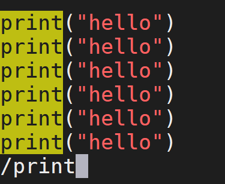

* 查找到指定内容之后，使用 `Next` 查找下一个出现的位置：
  * `n`: 查找下一个
  * `N`: 查找上一个
* 如果不想看到高亮显示，可以随便查找一个文件中不存在的内容即可

#### 单词快速匹配

| 命令 | 功能                     |
| :--: | ------------------------ |
|  *   | 向后查找当前光标所在单词 |
|  #   | 向前查找当前光标所在单词 |

* 在开发中，通过单词快速匹配，可以快速看到这个单词在其他什么位置使用过

### 4.10 查找并替换(这个虽然不好记，但是经常用得到)

* 在 `vi` 中查找和替换命令需要在 **末行模式** 下执行
* 记忆命令格式：

```
:%s///g
```

#### 1) 全局替换

* **一次性**替换文件中的 **所有出现的旧文本**
* 命令格式如下：

```bash
:%s/旧文本/新文本/g
```

#### 2) 可视区域替换

* **先选中** 要替换文字的 **范围** （进入可视化模式 选择替换代码部分）
* 命令格式如下：

```bash
:s/旧文本/新文本/g
```

首先进入可以化模式以后，选中区域。

然后进入末行模式，前面的`'<,'>` 是自己出来的。

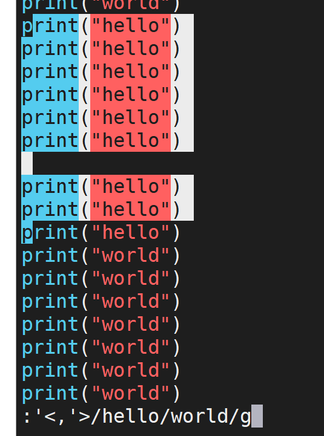


#### 3) 确认替换

* 如果把末尾的 `g` 改成 `gc` 在替换的时候，会有提示！**推荐使用！**

```
:%s/旧文本/新文本/gc
```

1. `y` - `yes` 替换
2. `n` - `no` 不替换
3. `a` - `all` 替换所有
4. `q` - `quit` 退出替换
5. `l` - `last` 最后一个，并把光标移动到行首
6. `^E` 向下滚屏
7. `^Y` 向上滚屏

### 4.11 插入命令

* 在 `vi` 中除了常用的 `i` 进入 **编辑模式** 外，还提供了以下命令同样可以进入编辑模式：

| 命令 |  英文  | 功能                   |  常用  |
| :--: | :----: | ---------------------- | :----: |
|  i   | insert | 在当前字符前插入文本   |  常用  |
|  I   | insert | 在行首插入文本         | 较常用 |
|  a   | append | 在当前字符后添加文本   |        |
|  A   | append | 在行末添加文本         | 较常用 |
|  o   |        | 在当前行后面插入一空行 |  常用  |
|  O   |        | 在当前行前面插入一空行 |  常用  |


这张图片厉害了，赞！


#### 演练 1 —— 编辑命令和数字连用 （厉害了 可以弄很多代码）

* 在开发中，可能会遇到连续输入 `N` 个同样的字符

> 在 `Python` 中有简单的方法，但是其他语言中通常需要自己输入

* 例如：`**********` 连续 10 个星号

要实现这个效果可以在 **命令模式** 下

1. 输入 `10`，表示要重复 10 次
2. 输入 `i` 进入 **编辑模式**
3. 输入 `*` 也就是重复的文字
4. 按下 `ESC` 返回到 **命令模式**，返回之后 `vi` 就会把第 `2、3` 两步的操作重复 `10` 次

> 提示：正常开发时，在 **进入编辑模式之前，不要按数字**

#### 演练 2 —— 利用 可视块 给多行代码增加注释 （这个也厉害了）

* 在开发中，可能会遇到一次性给多行代码 **增加注释** 的情况

> 在 `Python` 中，要给代码增加注释，可以在代码前增加一个 `# `

要实现这个效果可以在 **命令模式** 下

1. 移动到要添加注释的 **第 1 行代码**，按 `^` 来到行首
2. 按 `CTRL + v` 进入 **可视块** 模式
3. 使用 `j` 向下连续选中要添加的代码行
4. 输入 `I` 进入 **编辑模式**，并在 **行首插入**，注意：一定要使用 **I**
5. 输入 `# ` 也就是注释符号
6. 按下 `ESC` 返回到 **命令模式**，返回之后 `vi` 会在之前选中的每一行代码 **前** 插入 `# `

## 05. 分屏命令

* 属于 `vi` 的高级命令 —— 可以 **同时编辑和查看多个文件**

### 5.1 末行命令扩展

**末行命令** 主要是针对文件进行操作的：**保存**、**退出**、**保存&退出**、**搜索&替换**、**另存**、**新建**、**浏览文件**

|   命令    | 英文  | 功能                                           |
| :-------: | :---: | ---------------------------------------------- |
|   :e .    | edit  | 会打开内置的文件浏览器，浏览要当前目录下的文件 |
| :n 文件名 |  new  | 新建文件                                       |
| :w 文件名 | write | 另存为，但是仍然编辑当前文件，并不会切换文件   |

自己操作：

`:e .` 进入当前页面，使用`j/k`上下移动，回车可以vim进入对应文，操作如下图：及

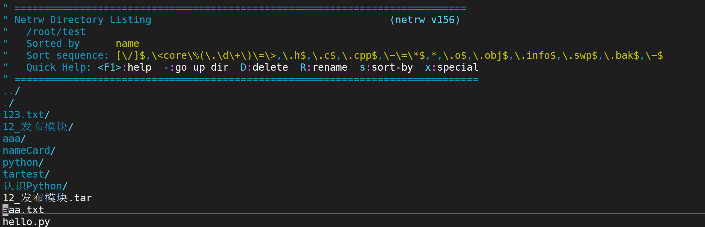

```bash
#末行模式
:n bbb.py  #新建一个文件
:w ccc.py  #将当前文件另存为ccc.py
```


> 提示：切换文件之前，必须保证当前这个文件已经被保存！

* 已经学习过的 **末行命令**：

|   命令   |     英文     | 功能                           |
| :------: | :----------: | ------------------------------ |
|    :w    |    write     | 保存                           |
|    :q    |     quit     | 退出，如果没有保存，不允许退出 |
|   :q!    |     quit     | 强行退出，不保存退出           |
|   :wq    | write & quit | 保存并退出                     |
|    :x    |              | 保存并退出                     |
| :%s///gc |              | 确认搜索并替换                 |

> 在实际开发中，可以使用 `w` 命令 **阶段性的备份代码** （这个很有用，写一段时间，使用`:w`另存为一个阶段文件。）

### 5.2 分屏命令

* 使用 **分屏命令**，可以 **同时编辑和查看多个文件**

|     命令      |      英文      | 功能         |
| :-----------: | :------------: | ------------ |
| :sp [文件名]  |     split      | 横向增加分屏 |
| :vsp [文件名] | vertical split | 纵向增加分屏 |

自己测试：

```bash
:vsp .   #竖向分屏，同时显示当前文件夹下内容  可以选择    
```


#### 1) 切换分屏窗口

> 分屏窗口都是基于 `CTRL + W` 这个快捷键的，`w` 对应的英文单词是 `window`

| 命令 |  英文   | 功能                                                         |
| :--: | :-----: | ------------------------------------------------------------ |
|  w   | window  | 切换到下一个窗口                                             |
|  r   | reverse | 互换窗口（这个如果想要关掉 先按ctrl + w 然后再加c，一切基于ctrl + w） |
|  c   |  close  | 关闭当前窗口，但是不能关闭最后一个窗口                       |
|  q   |  quit   | 退出当前窗口，如果是最后一个窗口，则关闭 vi                  |
|  o   |  other  | 关闭其他窗口                                                 |

#### 2) 调整窗口大小

> 分屏窗口都是基于 `CTRL + W` 这个快捷键的，`w` 对应的英文单词是 `window`

| 命令 | 英文 | 功能         |
| :--: | :--: | ------------ |
|  +   |      | 增加窗口高度 |
|  -   |      | 减少窗口高度 |
|  >   |      | 增加窗口宽度 |
|  <   |      | 减少窗口宽度 |
|  =   |      | 等分窗口大小 |

> 调整窗口宽高的命令可以和数字连用，例如：`5 CTRL + W +` 连续 5 次增加高度

## 06. 常用命令速查图


### vimrc

* `vimrc` 是 `vim` 的配置文件，可以设置 vim 的配置，包括：**热键**、**配色**、**语法高亮**、**插件** 等
* `Linux` 中 `vimrc` 有两个位置，**家目录下的配置文件优先级更高**

```
/etc/vim/vimrc
~/.vimrc
```

* 常用的插件有：
  * 代码补全
  * 代码折叠
  * 搜索
  * Git 集成
  * ……
* 网上有很多高手已经配置好的针对 `python` 开发的 `vimrc` 文件，可以下载过来直接使用，或者等大家多 `Linux` 比较熟悉后，再行学习！


## 07 . 10个比较酷炫的Linux命令

https://mp.weixin.qq.com/s/JbjCUPZieJyph_Ny6UrLMQ

这几个命令都非常的酷炫。有小火车，有黑客代码。


# JDK命令 

安装JDK的时候，bin下面有很多命令。

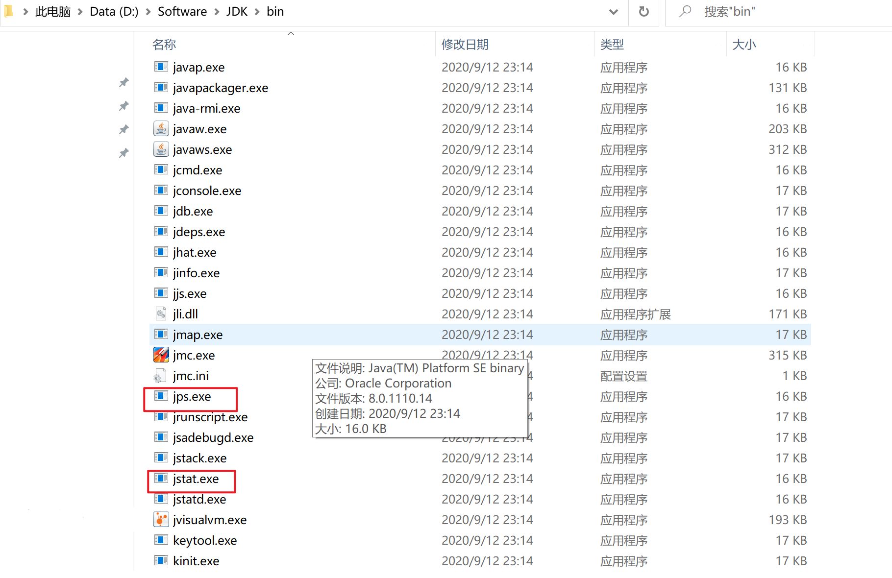

## jsp

Jdk中提供了好多可用命令

jps是jdk提供的一个查看当前java进程的小工具， 可以看做是JavaVirtual Machine Process Status Tool的缩写。非常简单实用。

​    命令格式：jps [options ] [ hostid ] 

​    [options]选项 ：
-q：仅输出VM标识符，不包括classname,jar name,arguments in main method 
-m：输出main method的参数 
-l：输出完全的包名，应用主类名，jar的完全路径名 
-v：输出jvm参数 
-V：输出通过flag文件传递到JVM中的参数(.hotspotrc文件或-XX:Flags=所指定的文件 
-Joption：传递参数到vm,例如:-J-Xms512m

​    [hostid]：

[protocol:][[//]hostname][:port][/servername]

​    命令的输出格式 ：
lvmid [ [ classname| JARfilename | "Unknown"] [ arg* ] [ jvmarg* ] ]


总结，自己测试，要想用这个命令，电脑或者服务器必须得安装jdk 才可以查看。

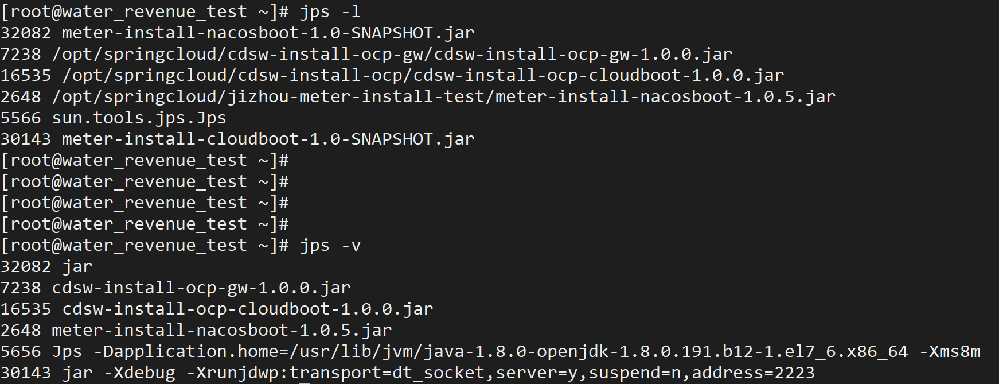


## jstat

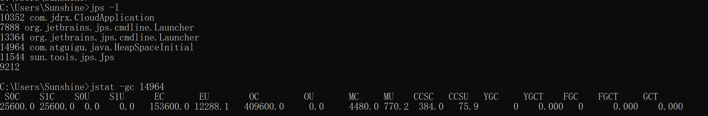


可以查看某一个进程堆内存占用情况和其他情况。


## jinfo

查看当前运行代码中，老年代和年轻代比例

```bash
jps -l
jinfo -flag NewRatio 5156(进程号，是通过上面的命令查出来的)
```


## javap

```jvm
javap -v -p MethodInnerStrucTest.class
```

反编译，-p  将类中的私有属性也进行反编译。


# Linux Install Software

自从学了Docker，就用Docker装啦，装啥都很快。

## Jdk

- 首先，测试本地是否已经安装了jdk，利用java或javac命令来确认。
- 未发现本机安装有jdk，此时，从oracle官网下载linux版本的jdk

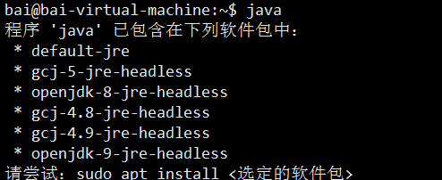

- 利用winscp工具，将下载好的jdk上传到家目录下

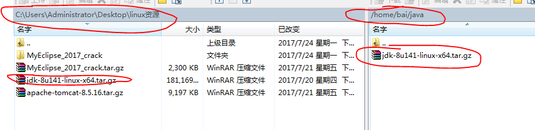

- 将jdk所在的tar文件解压到 \~/java目录中

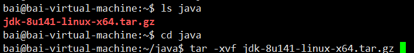

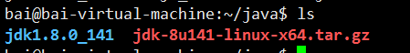

- 将java目录移动到/usr/local/ 目录下

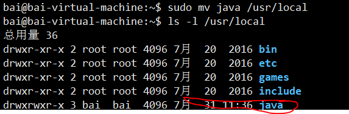

- 在/etc/profile 中配置环境变量


**进去以后 首先需要按i 转换成插入模式**

然后才可以编辑配置文件、

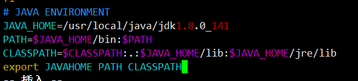

**编辑完：wq**


- 使配置文件立即生效，并测试配置的环境变量


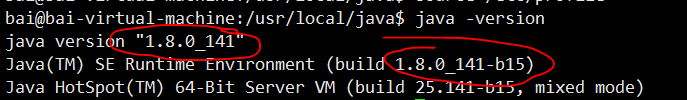

如果不小心把冒号写成了分号

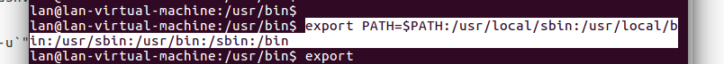

如果你需要在linux下配置IDEA 或者linux下编译程序

- 修改系统默认的javc命令配置（可选）


- 修改系统默认的java命令配置（可选）

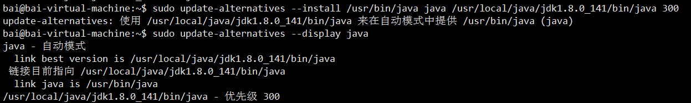

## Tomcat

- 下载tomcat 8.x的linux版本的包
- 通过winscp把tomcat所在的tar文件，传到建目录下的tomcat文件夹中


- 解压并抽取该包


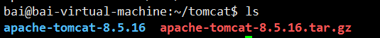

- 将tomcat文件夹移动到/usr/local/目录下
- 启动tomcat，和windows中一样，主要是使用tomcat的bin目录中的startup工具

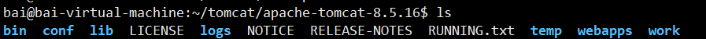

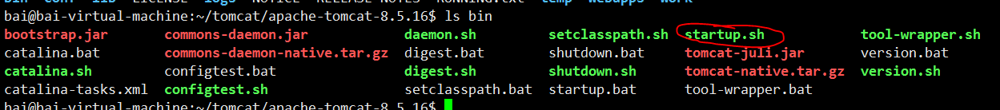

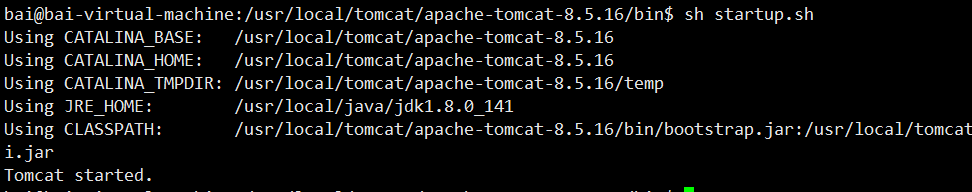

执行shell脚本

./startup.sh

- 测试tomcat服务器，在windows上连接成功

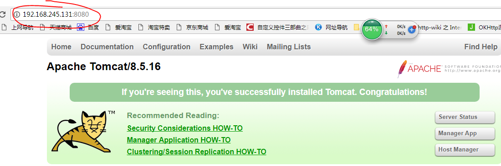

- 关闭tomcat

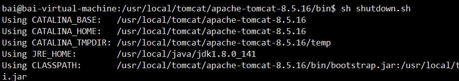

./shutdown.sh

sh shutdown.sh

## Mysql

- 首先检查是否本地有安装mysql

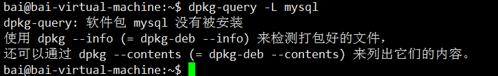

- 本地没有安装mysql，使用apt工具来安装mysql

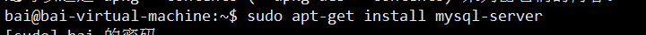

回去服务器获取安装程序，并开始安装。

过一会儿，弹出如下界面：

设置mysql的密码 :123456

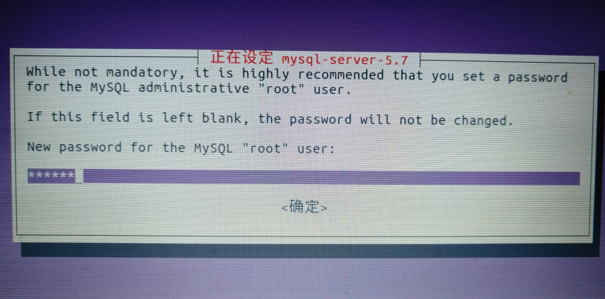

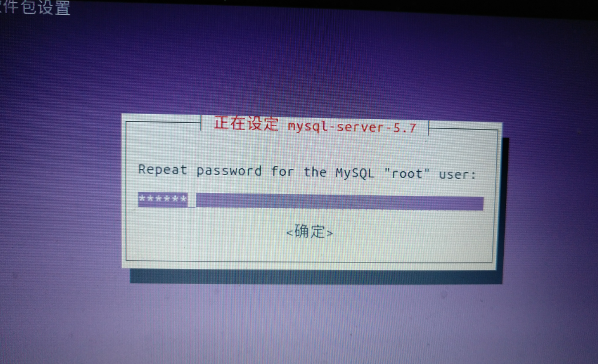

- 启动mysql测试是否安装成功

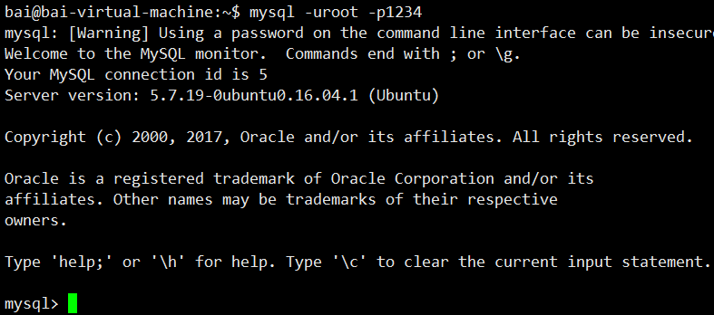

> 一般情况下数据库服务器是一台单独的服务，所以需要设置下远程连接。

### 配置远程访问(可选)

- 紧接着，设置在远程访问linux的mysql，这个设置分为2个部分，

> 第1部分是要修改mysql的配置文件，使得除本机之外的ip可以访问到数据库；

> 第2个部分是要在mysql中修改，给予root用户从别的主机上访问数据库的权限。

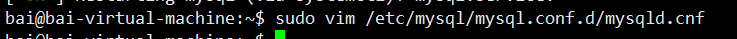

此处，将bind-address修改为0.0.0.0，原本是127.0.0.1即本机

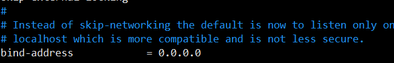

重启mysql服务，使配置生效

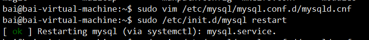

进入mysql，给远程连接授予权限

修改为自己的用户密码 (这里密码1234必须改成自己的密码！)


**2020/1/19 实际测试，如果没有下面这一句 用navicat 连接不上**  

进 mysql里面 

```java
mysql -uroot -p123456

```

```
mysql> grant all privileges on *.* to 'root'@'%' identified by '123456' with grant option ;

```

弄完以后 要**重新启动一下mysql**

```
sudo /etc/init.d/mysql restart

```


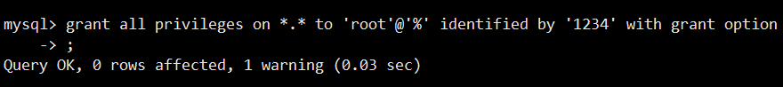

查询设置的结果：

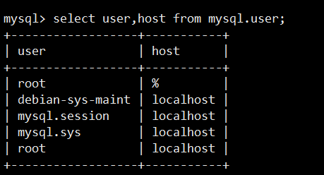

使配置文件，立即生效

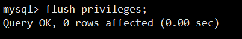

在windows上用yog客户端连接，linux上的mysql服务器

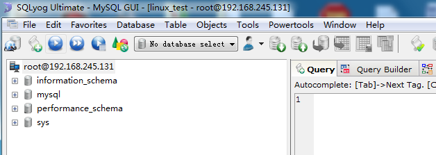

如下配置：mysql是否为开机启动

- 查看mysql是否为开机启动，为此，简单起见，我们使用一t个服务管理程序sysv--rc-conf

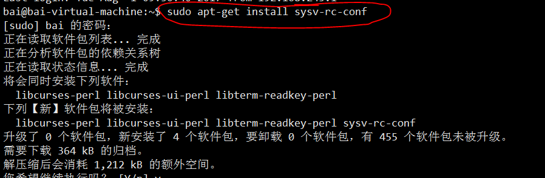

- 启动该工具，查看mysql的运行状态，
- 可以通过查看3306端口号
- 或者查看mysql进程有没有启动
- 可以看到多用户状态下（运行级别2-5），mysql已经开启开机启动

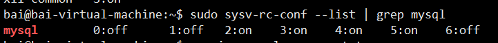

[Linux](http://lib.csdn.net/base/linux) 系统任何时候都运行在一个指定的运行级上，不同的运行级的程序和服务都不同，所要完成的工作和要达到的目的都不同，系统可以在这些运行级之间进行切换，以完成不同工作。

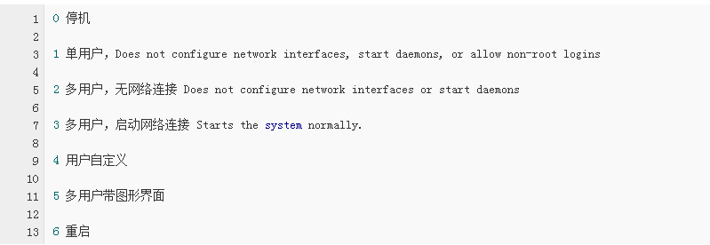

来看一下，我们当前的运行级别

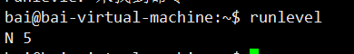


## Redis

### 一、在阿里云服务器上安装redis:

　　1.下载　　wget http://download.redis.io/releases/redis-4.0.9.tar.gz

　　2.解压　　tar xzf redis-4.0.9.tar.gz

　　3.跳转目录　　cd redis-4.0.10

　　4.安装　　make

　　5.启动服务端：src/redis-server

　　6.启动客户端：src/redis-cli

### 二、在阿里云服务器上添加安全规则:

　　1.实例---更多---网络安全组---安全组配置

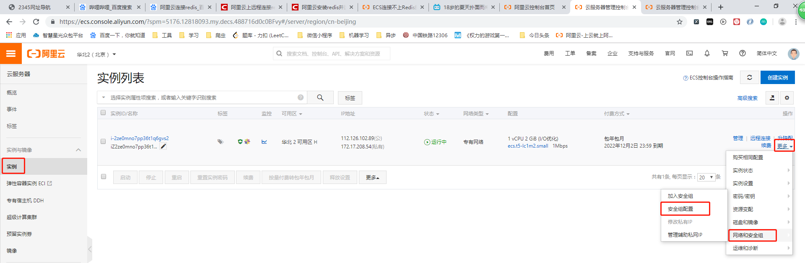

　　2.配置安全规则

　　　　　　　　　　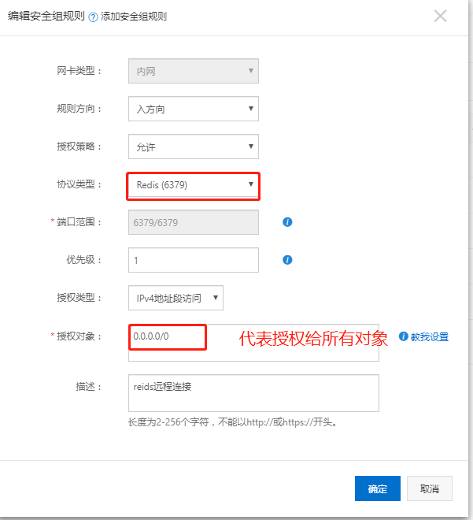

### 三、配置redis.conf

　　1.进入配置文件  vim redis.conf

　　2.注释掉绑定ip bind 127.0.0.1   #不注释的话就是默认只允许本地访问

　　3.将保护模式改成no  daemonize yes   设置为no

 

### 四、给redis设置密码，命令如下：

　　1.127.0.0.1:6379> config get requirepass

​        　　1) "requirepass"

​        　　2) ""

 

　　2.为以上显示说明没有密码，那么现在来设置密码：

​     　　127.0.0.1:6379> config set requirepass dyydyy //密码是dyydyy

​      　　OK

​     　　127.0.0.1:6379> 

 

　　3.再次查看当前redis就提示需要密码：

​       　　127.0.0.1:6379> config get requirepass

​       　　(error) NOAUTH Authentication required.

​       　　127.0.0.1:6379>

​       　　*注意：阿里云上部署的redis需要设置密码，这样本地redis的客户端Redis Desktop Manager才可以连上，添加的时候要填写密码。

　　4.使用密码连接，跳转至src下   cd src，执行命令：./redis-cli -h 127.0.0.1 -p 6379 -a 密码

 

### 五、本地redis的客户端Redis Desktop Manager测试连接，添加的时候要填写密码

　　　　　　　　　　　　　　　　　　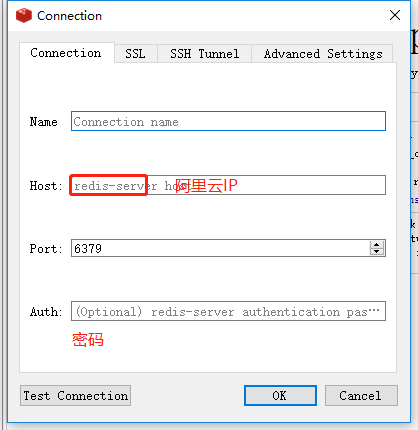


## Nginx

首先需要,弄两个以上的tomcat ,使用cp -r apache-tomcat-8.5.16 tomcat2 ,如果需要复制文件夹,中间必须加-r,否则不能复制!


### 开启两个tomcat:

需要修改几个地方:1.首先需要修改端口为8090


2.然后需要修改server port

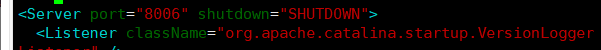

这两个地方需要修改,然后就可以通过浏览器访问啦!


配置Nginx 首先需要配置这个地方:

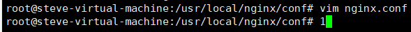

打开配置两个地方:首先打开,配置这个,这里upstream后面名字是随便起得!这里起域名翻转是为了不重复

​                                                  !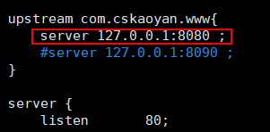

还需要在location里面加这一句话:意思是进行转发,代理

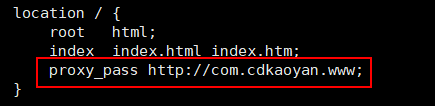

然后将nginx下面的nginx.conf下面修改成两个tomcat,

然后输入命令重新加载nginx, 

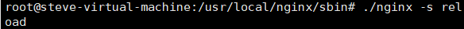

加了这句,在使用的时候,可以抓包,不然不能抓包!

这两句话,一句表示增加响应头,一句表示增加相应状态!

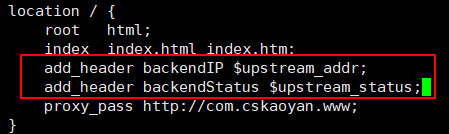

加了这两句话然后执行 ./nginx -s reload, 就可以重新加载啦!

报文里面加了相应头!和状态码!

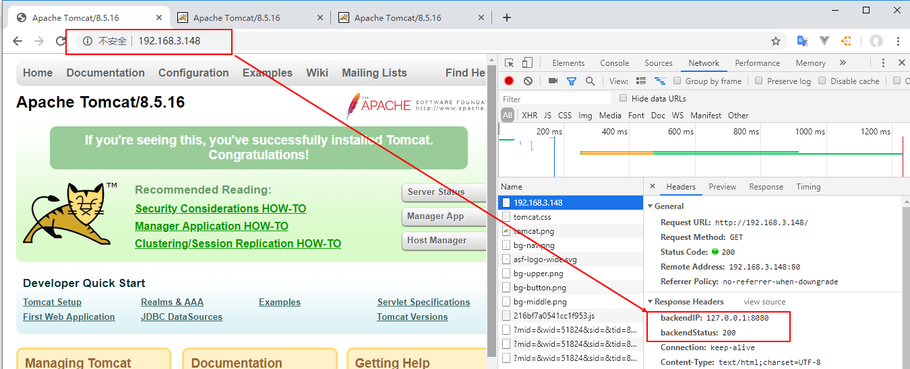


用vim时候,如果某一步操作错误,强制退出**:q!**

这样的话,不会修改原来文件的东西!不会保存!

再次进入重新编辑即可!

## 集群的session共享

### Session共享问题

使用了Nginx和集群，对客户端的请求做了负载均衡，从系统的吞吐量的角度来看，这无疑是很好的，但是，随之而来的一个问题，就是session共享的问题：

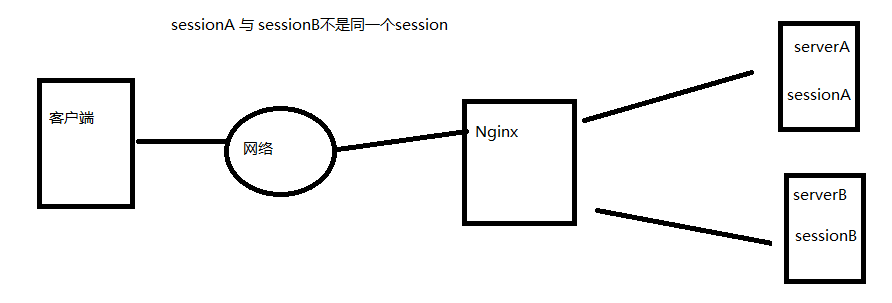

如图，在浏览器的一次会话中，两次访问Nginx代理的集群，Nginx分别把这两次请求，分配给了不同的服务器来处理，于是出现了这样一个问题：

- 首先，session只产生和存在于单个服务器中。
- 明明是逻辑上的一次会话，因为实际访问了两台不同的服务器，所以两台服务器会分别为针对它们各自的请求而新建会话（假设两台服务器都是被该浏览器第一次访问）。
- 于是，一次会话的信息，实际上被两个服务器中的两个session所存储，每个session实际只存储，这次会话的部分信息。
- 这种情况下，我们通过nginx访问同一个页面多次，可能会访问不同服务器上的同一个页面，session不同步的问题会导致用户必须在同一个页面登录两次。

## Session共享问题的解决

### Session sticky

这种解决方案的思路，比较简单，就是用一个hash算法，将对某ip的访问映射到一台确定的服务器上，这样针对某ip的访问就固定到一台确定的服务器，不同的ip访问不同的服务器。

同时，这种解决方案也有一定的局限性：

- 一旦tomcat所在的某台服务器重新启动，那么与这台服务器相关的会话信息就会丢失，如果用户此时再次访问相同网页，需要重新登录。高可用不满足。
- 代理服务器需要计算，保存，维护ip和相应服务器之间的映射关系，内存消耗大。

### Session Replication 高可用

这种解决方案的思路是，每个服务器上，都有集群中其他服务器中session数据的副本，同时增加服务器之间的数据同步功能，通过服务器之间的同步保证session数据在各个服务器之间的一致性。

这种解决方案，不再像session
sticky中那样要求Nginx服务器做一些处理，但是这种方式的局限性也很大：

- 一旦session数据发生变化，所有的服务器都需要同步变化的session数据，而这种同步会消耗带宽。
- 同时，由于每台服务器都存储了其他所有服务器上的session副本，
  冗余数据也占用了服务器的存储空间

<https://www.2cto.com/net/201701/584323.html>

两个关键配置：

两个Tomcat的server.xml


两个应用的web.xml


访问的url

<http://192.168.5.75/Session2/test>

### Session数据集中控制

这种解决方案的思路是，将所有服务器上的session数据集中存储和管理，这样一来，所有的服务器的session在集群中只需要有一份。

这种解决方案，由于session并不存储在本地，对session的访问需要通过网络，这样可能就会产生访问的延时，以及不稳定性，不过我们通信基本都是发生在内网，问题不大，如果集中存储Session的机器或者集群有问题，就会影响我们的应用。

Redis 内存数据库 Nosql

### Cookie based

这种解决方案的思路是，将session数据保存到cookie中，当浏览器访问服务器的时候，服务器可以从cookie中再生成相应的session信息。

这种方式，也有其局限性：

- Cookie长度的限制：我们都知道Cookie是有长度限制的，而这回限制Session数据的长度。
- 安全性。Session数据本来都是服务端数据，而这个方案是让这些服务端数据写到了到了外部网络以及客户端，因此存在安全性上的问题，我们可以对写入Cookie的Session数据做加密，不过对于数据安全来说，物理上不能接触才是安全的。
- 带宽消耗：这里指的不是内部Web服务器之间的带宽消耗，而是我们数据中心的整体外部带宽的消耗


## Ubuntu搭建Zookeeper服务


### 1、下载安装包

官方下载地址http://apache.fayea.com/zookeeper/

### 2、安装

安装前确保系统已安装过JDK，[JDK安装过程可参照](https://www.cnblogs.com/kingsonfu/p/9801556.html)

2.1 解压下载好的tar.gz安装包到某个目录下，可使用命令：

```shell
tar -zxvf zookeeper-3.5.4-beta.tar.gz

```

2.2 进入解压目录的conf目录，复制配置文件zoo_sample.cfg并命名为zoo.cfg，相关命令为：

```shell
cp zoo_sample.cfg zoo.cfg

```

2.3 编辑zoo.cfg文件

```shell
vi zoo.cfg

```

主要修改如下：

```shell
# 增加dataDir和dataLogDir目录，目录自己创建并指定，用作数据存储目录和日志文件目录
dataDir=/home/local/zk/data
dataLogDir=/home/local/zk/logs
# 指定server地址，server.id=hostname:port:port。第一个端口用于集合体中的 follower 以侦听 leader；第二个端口用于 Leader 选举。第一个hostname即为本服务器地址
server.1=192.168.242.131:2888:3888

```

2.4 修改好zoo.cfg配置之后，在创建好的data目录中添加myid文件，里面的内容设置为zoo.cfg中配置的server.1中的数字，即1，有多台可以进行类似配置。

2.5 配置系统环境变量

```shell
vi /etc/profile

```

添加

```shell
export ZOOKEEPER_HOME=/home/kinson/zk 
PATH=$ZOOKEEPER_HOME/bin:$PATH

```

使添加的配置其生效

```shell
source /etc/profile

```

2.6 服务启动及客户端相连，最好是在root用户下启动

```shell
zkServer.sh start

```

启动完之后可以查看启动状态

```shell
zkServer.sh status

```

客户端连接

```shell
zkCli.sh -server localhost:2181

```

连接成功如下图：

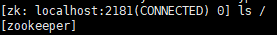

之后就可以使用一些基础命令，比如 ls，create，delete，get 来测试了。

### 3、ZK常用命令

3.1 ZK服务命令

```shell
# 启动ZK服务       
zkServer.sh start
# 查看ZK服务状态 
zkServer.sh status
# 停止ZK服务       
zkServer.sh stop
# 重启ZK服务       
zkServer.sh restart

```

3.2 ZK客户端命令

```shell
# 显示根目录下、文件： 
ls /  #使用ls命令来查看当前ZooKeeper中所包含的内容
# 显示根目录下、文件： 
ls2 /  #查看当前节点数据并能看到更新次数等数据
# 创建文件，并设置初始内容：
create /zk "kinson"  #创建一个新的znode节点"zk"以及与它关联的字符串
# 获取文件内容： 
get /zk  # 确认 znode 是否包含我们所创建的字符串
# 修改文件内容： 
set /zk "king"  #对zk所关联的字符串进行设置
# 删除文件 
delete /zk  #将znode节点zk删除
# 退出客户端： 
quit
# 帮助命令： 
help

```


参考：https://www.cnblogs.com/kingsonfu/p/10631332.html

https://blog.csdn.net/weixin_40570311/article/details/98641035

## Ubuntu安装Docker

### Ubuntu 14.04 16.04 (使用apt-get进行安装)

```shell
# step 1: 安装必要的一些系统工具
sudo apt-get update
sudo apt-get -y install apt-transport-https ca-certificates curl software-properties-common
# step 2: 安装GPG证书
curl -fsSL http://mirrors.aliyun.com/docker-ce/linux/ubuntu/gpg | sudo apt-key add -
# Step 3: 写入软件源信息
sudo add-apt-repository "deb [arch=amd64] http://mirrors.aliyun.com/docker-ce/linux/ubuntu $(lsb_release -cs) stable"
# Step 4: 更新并安装 Docker-CE
sudo apt-get -y update
sudo apt-get -y install docker-ce

注意：其他注意事项在下面的注释中
# 安装指定版本的Docker-CE:
# Step 1: 查找Docker-CE的版本:
# apt-cache madison docker-ce
#   docker-ce | 17.03.1~ce-0~ubuntu-xenial | http://mirrors.aliyun.com/docker-ce/linux/ubuntu xenial/stable amd64 Packages
#   docker-ce | 17.03.0~ce-0~ubuntu-xenial | http://mirrors.aliyun.com/docker-ce/linux/ubuntu xenial/stable amd64 Packages
# Step 2: 安装指定版本的Docker-CE: (VERSION 例如上面的 17.03.1~ce-0~ubuntu-xenial)
# sudo apt-get -y install docker-ce=[VERSION]

# 通过经典网络、VPC网络内网安装时，用以下命令替换Step 2、Step 3中的命令
# 经典网络：
# curl -fsSL http://mirrors.aliyuncs.com/docker-ce/linux/ubuntu/gpg | sudo apt-key add -
# sudo add-apt-repository "deb [arch=amd64] http://mirrors.aliyuncs.com/docker-ce/linux/ubuntu $(lsb_release -cs) stable"
# VPC网络：
# curl -fsSL http://mirrors.cloud.aliyuncs.com/docker-ce/linux/ubuntu/gpg | sudo apt-key add -
# sudo add-apt-repository "deb [arch=amd64] http://mirrors.cloud.aliyuncs.com/docker-ce/linux/ubuntu $(lsb_release -cs) stable"

```


### CentOS 7 (使用yum进行安装)

```shell
# step 1: 安装必要的一些系统工具
sudo yum install -y yum-utils device-mapper-persistent-data lvm2
# Step 2: 添加软件源信息
sudo yum-config-manager --add-repo http://mirrors.aliyun.com/docker-ce/linux/centos/docker-ce.repo
# Step 3: 更新并安装 Docker-CE
sudo yum makecache fast
sudo yum -y install docker-ce
# Step 4: 开启Docker服务
sudo service docker start

注意：其他注意事项在下面的注释中
# 官方软件源默认启用了最新的软件，您可以通过编辑软件源的方式获取各个版本的软件包。例如官方并没有将测试版本的软件源置为可用，你可以通过以下方式开启。同理可以开启各种测试版本等。
# vim /etc/yum.repos.d/docker-ce.repo
#   将 [docker-ce-test] 下方的 enabled=0 修改为 enabled=1
#
# 安装指定版本的Docker-CE:
# Step 1: 查找Docker-CE的版本:
# yum list docker-ce.x86_64 --showduplicates | sort -r
#   Loading mirror speeds from cached hostfile
#   Loaded plugins: branch, fastestmirror, langpacks
#   docker-ce.x86_64            17.03.1.ce-1.el7.centos            docker-ce-stable
#   docker-ce.x86_64            17.03.1.ce-1.el7.centos            @docker-ce-stable
#   docker-ce.x86_64            17.03.0.ce-1.el7.centos            docker-ce-stable
#   Available Packages
# Step2 : 安装指定版本的Docker-CE: (VERSION 例如上面的 17.03.0.ce.1-1.el7.centos)
# sudo yum -y install docker-ce-[VERSION]
# 注意：在某些版本之后，docker-ce安装出现了其他依赖包，如果安装失败的话请关注错误信息。例如 docker-ce 17.03 之后，需要先安装 docker-ce-selinux。
# yum list docker-ce-selinux- --showduplicates | sort -r
# sudo yum -y install docker-ce-selinux-[VERSION]

# 通过经典网络、VPC网络内网安装时，用以下命令替换Step 2中的命令
# 经典网络：
# sudo yum-config-manager --add-repo http://mirrors.aliyuncs.com/docker-ce/linux/centos/docker-ce.repo
# VPC网络：
# sudo yum-config-manager --add-repo http://mirrors.could.aliyuncs.com/docker-ce/linux/centos/docker-ce.repo

```


### 安装校验

```shell
root@iZbp12adskpuoxodbkqzjfZ:$ docker version
Client:
 Version:      17.03.0-ce
 API version:  1.26
 Go version:   go1.7.5
 Git commit:   3a232c8
 Built:        Tue Feb 28 07:52:04 2017
 OS/Arch:      linux/amd64

Server:
 Version:      17.03.0-ce
 API version:  1.26 (minimum version 1.12)
 Go version:   go1.7.5
 Git commit:   3a232c8
 Built:        Tue Feb 28 07:52:04 2017
 OS/Arch:      linux/amd64
 Experimental: false

```

启动docker服务：

```
# service docker start

```


### 配置阿里云镜像

需要登录阿里云https://cr.console.aliyun.com/cn-hangzhou/instances/mirrors 开发者镜像

然后选择镜像加速器

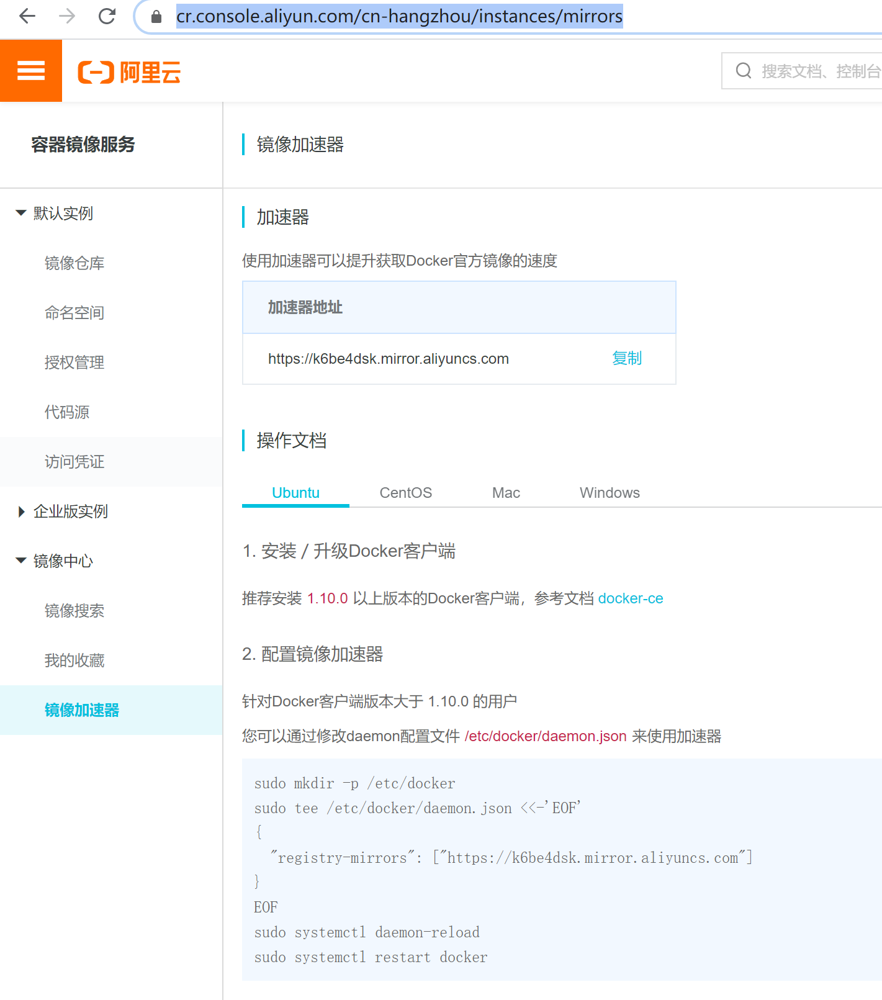

然后按照下面的进行操作。


检查加速镜像是否生效： （这个命令在Ubuntu上面看不出来是否用的阿里云镜像），用下面的命令

```
ps -ef|grep docker

```

CentOS测试出来是这个样子的 可以看到阿里云镜像

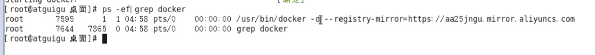

但是乌班图测试出来是这个2样子的，看不出来是否用的阿里云镜像

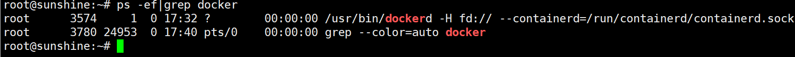


自己测试发现上面这个看不出来，用下面这个命令

```
docker info 使用这个可以看得出来，仓库配置的是阿里云的加速仓库。

```

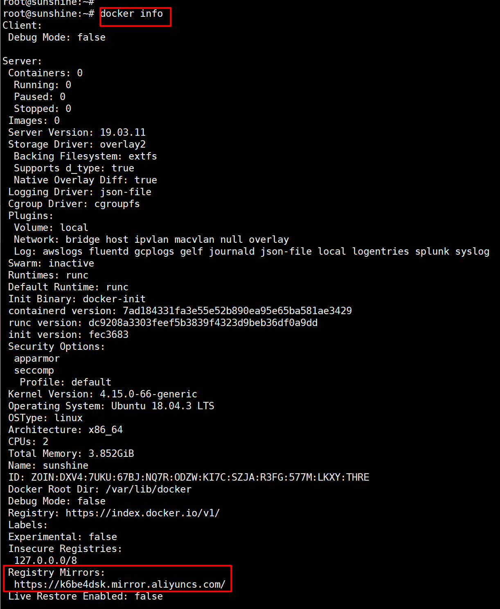


### 参考资料

其他关于旧版本Docker卸载以及测试开发版本Docker安装的帮助，可以参考官方文档的说明进行安装

- [CentOS帮助链接](https://yq.aliyun.com/go/articleRenderRedirect?url=https%3A%2F%2Fdocs.docker.com%2Fengine%2Finstallation%2Flinux%2Fdocker-ce%2Fcentos%2F)
- [Ubuntu帮助链接](https://yq.aliyun.com/go/articleRenderRedirect?url=https%3A%2F%2Fdocs.docker.com%2Fengine%2Finstallation%2Flinux%2Fdocker-ce%2Fubuntu%2F)
- [Debian帮助链接](https://yq.aliyun.com/go/articleRenderRedirect?url=https%3A%2F%2Fdocs.docker.com%2Fengine%2Finstallation%2Flinux%2Fdocker-ce%2Fdebian%2F)
- [Fedora帮助链接](https://yq.aliyun.com/go/articleRenderRedirect?url=https%3A%2F%2Fdocs.docker.com%2Fengine%2Finstallation%2Flinux%2Fdocker-ce%2Ffedora%2F)

### 源站使用问题

云栖社区文章下的评论不会实时通知，所以更新文章的时候才发现有用户在使用中遇到了各种各样的问题。
目前源站每日凌晨更新，如果有源站使用问题例如文件损坏、文件不存在、版本滞后超过两天等问题，请发送邮件至 hyzhou.zhy@alibaba-inc.com，邮件标题包含“Docker CE 镜像源站”。附上安装机器的网络环境，执行命令以及错误提示信息。或者直接扫码联系钉钉账户最佳。


参考：

https://blog.csdn.net/xie1xiao1jun/article/details/79413436

https://yq.aliyun.com/articles/110806


### 运行HelloWorld 

```
docker run hello-workd

```

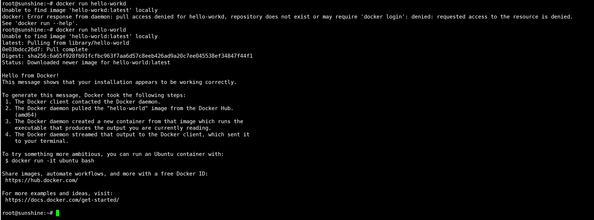


# Ailiyun Linux

## 1.商城项目springboot项目jar包放到了home/jar下面


## 2、springboot打成的jar如何在Linux上持久运行

首先呢？你本地要有一个springboot的项目，如果没有可以参考我的这篇博客写一个,[springboot入门程序](https://www.cnblogs.com/youcong/p/8098861.html)

然后呢？你要有一个虚拟机搭建一个Linux服务器或者是远程服务器(阿里云或者腾讯云、百度云、美团云等)。

再然后，你还要有一个winscp，winscp官网地址为:https://winscp.net/eng/docs/lang:chs(你可以去官网下载)

最后将springboot打包(确保本地运行没有问题)，利用winscp上传到Linux上。

通过该命令运行jar包:

```html
nohup java -jar blog.jar > system.log 2>&1 &

```

下面我们对这条命令进行分析

nohub一般形式为如下:

nohub command &

但是当你退出账户时，仍然会停止对应的进程。

所以这就需要你在后面添加 2>&1 &(相当于正常退出，仍保持命令在后台运行)

上面这个command正好对上java -jar blog.jar > system.log

“>” 输出重定向，通常用于输出日志

使用命令：ps -a可以查看Java程序运行的进程号，用于停止程序，不过当程序有好几个的时候，用命令：ps -ef|grep java这个命令会将搜索Java相关的所以进程号，根据jar包名称找到需要停止的进程号，使用命令：kill -9 11759杀死进程，11759是进程号。（PS：杀死进程时一定要注意不要看错了进程号，以免杀错！！）


## 3.每一次部署项目  记得要去阿里云打开这个项目对应的端口 

**切记**

## 4.Vue项目打包成移动端APP

https://blog.csdn.net/Li_dengke/article/details/101385345

## 5.修改阿里云服务器名

- 查看当前主机名：**hostname**

[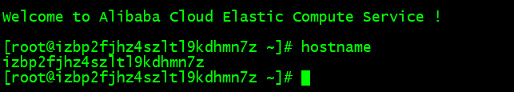](https://upload-images.jianshu.io/upload_images/16853007-f7e6264b63fcd4ee.png?imageMogr2/auto-orient/strip|imageView2/2/w/1240)

- 修改主机名：**hostnamectl set-hostname 修改后的主机名**

[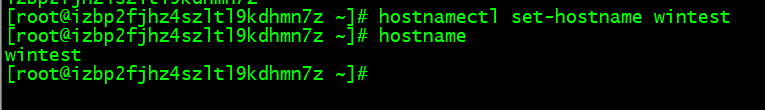](https://upload-images.jianshu.io/upload_images/16853007-49be845eef42f030.png?imageMogr2/auto-orient/strip|imageView2/2/w/1240)

修改后，再次输入 **hostname** 可发现主机名已经被修改了，但当前会话界面的还是原来的名称，这里我们只需要重新建立会话连接，或者直接重启服务器就行了

- 重启服务器

[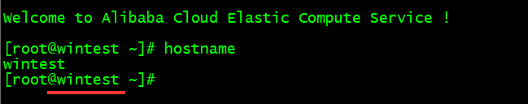](https://upload-images.jianshu.io/upload_images/16853007-c6396079fc7b69aa.png?imageMogr2/auto-orient/strip|imageView2/2/w/1240)

OK，到这里已成功完成了主机名的修改，大功告成！


## 6.查看阿里云服务器cpu 内存使用

**查看CPU使用**

```shell
top

```


**查看内存**

```shell
free -m

```

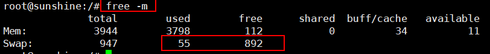


阿里云买新域名，记得要实名注册和解析

阿里云OSS，记得要设置 Access key ，简历bucket

同时可以用软件OSSBrowser管理图片

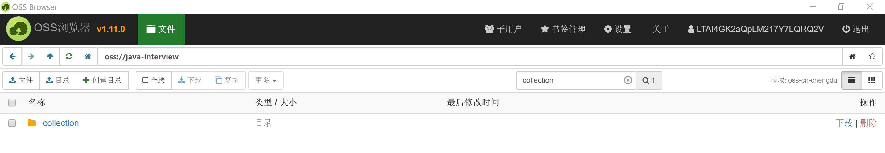

这是参考说明文档。里面很详细。


## 7 CDN 

### 不知道这是不是阿里云服务器里面的知识，先放在这里

开通**CDN**,加载速度会很快!会将资源放置在离你最近的节点上面!


## 8.OSS

wins使用OSS客户端，需要注意


点进来以后，获取到这两部分，才可以登录客户端，或者使用。


# VMware

## CnetOS 7 

安装虚拟机15，系统之家下载系统，安装CentOs7。

看CodeSheep，结合https://blog.csdn.net/babyxue/article/details/80970526


### 搞好以后，网络需要选桥接

```
su root  //root

dhclient  //用这个讲虚拟机的地址固定下来  以后使用方便

ifconfig //这时候就有IP地址啦
```

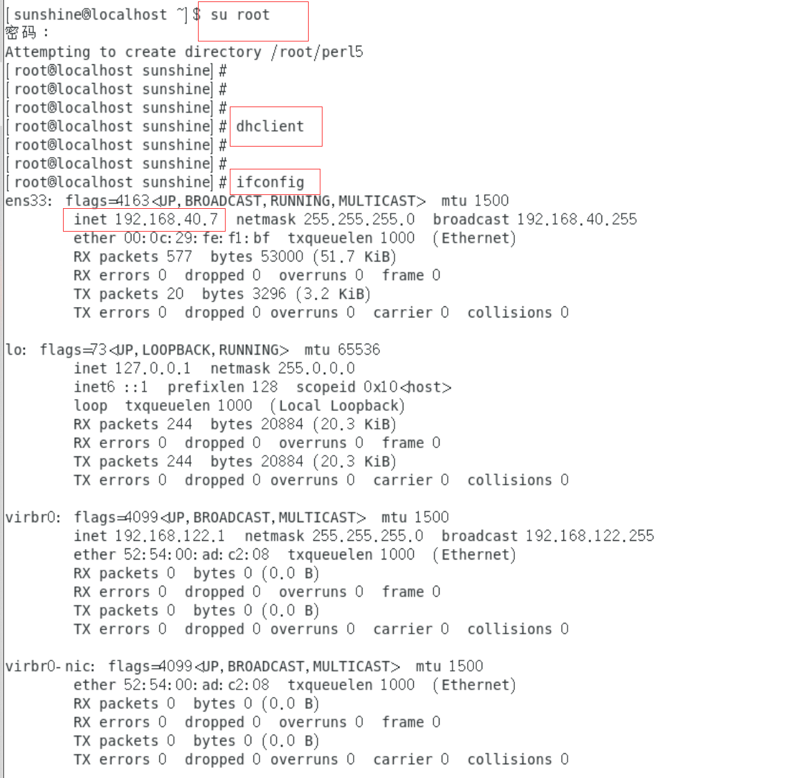


接下来的操作是让虚拟机的IP固定下来，不要变化。方便后面使用，所以要在网卡里面写死。

修改网卡:

```
vim /etc/sysconfig/network-scripts/ifcfg-ens33 
```

如果不知道是那个文件夹下 可以快速两下tab 文件提示 ：


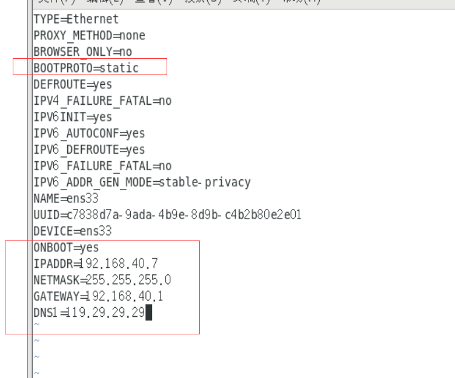


上面设置的信息依次是 IP地址，子网掩码，网关，DNS服务解析

设置好了 ，重启网络

```
systemctl restart network.service
```


### centos7 关闭防火墙

```shell
sudo systemctl stop firewalld 临时关闭

sudo systemctl disable firewalld ，然后reboot 永久关闭

sudo systemctl status  firewalld 查看防火墙状态。
```


## Ubuntu

### 桌面版

#### 修改屏幕显示比例:

虚拟机上装ubuntu,修改屏幕显示比例 ,中间的x是字母x!


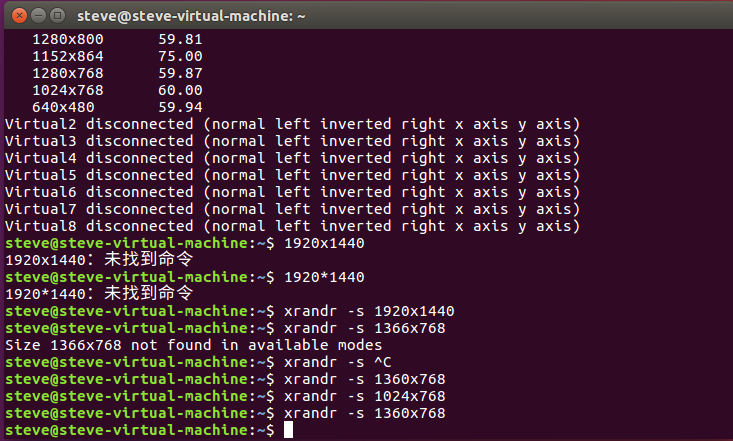


# Interview

### 1.Linux下如何启动springboot的包？

```html
nohup java -jar blog.jar > system.log 2>&1 &

```

下面我们对这条命令进行分析

nohub一般形式为如下:

nohub command &

但是当你退出账户时，仍然会停止对应的进程。

所以这就需要你在后面添加 2>&1 &(相当于正常退出，仍保持命令在后台运行)

上面这个command正好对上java -jar blog.jar > system.log

“>” 输出重定向，通常用于输出日志


### 2.linux命令（怎么查看linux中当前各个进程占用的系统资源）

```shell
ps -aux

```


### 3.说几个常用的linux命令 ,五个以上，用途

1.目录切换

```java
cd 文件夹 //进入某一个文件夹
cd .. //返回上一级目录

```

2.目录操作 

```shell
mkdir //增加目录
ll/ls //查看目录下文件
rmdir //删除文件

```

3.文件操作

```shell
1. touch 文件名称   //文件的创建（增）
2. cat/more/less/tail 文件名称  //文件的查看（查）

```

4.压缩和解压

（1）压缩

Linux中的打包文件一般是以.tar结尾的，压缩的命令一般是以.gz结尾的。

而一般情况下打包和压缩是一起进行的，打包并压缩后的文件的后缀名一般.tar.gz。
命令：**`tar -zcvf 打包压缩后的文件名 要打包压缩的文件`**
其中：

  z：调用gzip压缩命令进行压缩

  c：打包文件

  v：显示运行过程

  f：指定文件名

比如：假如test目录下有三个文件分别是：aaa.txt bbb.txt ccc.txt，如果我们要打包test目录并指定压缩后的压缩包名称为test.tar.gz可以使用命令：**`tar -zcvf test.tar.gz aaa.txt bbb.txt ccc.txt`或：`tar -zcvf test.tar.gz       /test/`**

（2）解压

命令：tar [-xvf] 压缩文件

其中：x：代表解压

示例：

1 将/test下的test.tar.gz解压到当前目录下可以使用命令：**`tar -xvf test.tar.gz`**

2 将/test下的test.tar.gz解压到根目录/usr下:**`tar -xvf test.tar.gz -C /usr`**（- C代表指定解压的位置）

5.网络管理

```shell
ifconfig 查看ip地址
ping 地址 查看连接情况

```


### 4.linux命令查看服务器性能

**（1）查看CPU使用**

```shell
top
```


**（2）查看内存**

```shell
free -m

```


参考：https://blog.csdn.net/guoxiaojie_415/article/details/80526667?utm_medium=distribute.pc_relevant.none-task-blog-BlogCommendFromBaidu-4&depth_1-utm_source=distribute.pc_relevant.none-task-blog-BlogCommendFromBaidu-4 （写的算好的一篇  有参考其他）

https://netflixtechblog.com/linux-performance-analysis-in-60-000-milliseconds-accc10403c55 （国外的一个，需要梯子）

**（3）uptime 查看负载**


几个负载分别是1min，5min，15min的平均负载


### 5.Linux改变文件所属组的命令，生成文件的命令

https://www.cnblogs.com/klb561/p/9170616.html

[root@localhost ~]# chgrp group1 install.log

\#修改install.log文件的所属组为group1


[root@localhost user]# touch test

\#由root用户新建文件test


### 6.熟悉Linux什么指令？ 说一下如何把文件中的abc替换为def；说一下如何找出某文件夹下所有包含“abc”的文件？

参考：https://blog.csdn.net/Olivia_Vang/article/details/104091358?utm_medium=distribute.pc_relevant_t0.none-task-blog-BlogCommendFromMachineLearnPai2-1&depth_1-utm_source=distribute.pc_relevant_t0.none-task-blog-BlogCommendFromMachineLearnPai2-1


### 7.Linux系统是32位还是64位查询命令


参考：https://www.cnblogs.com/nucdy/p/5658488.html 

### 8.Linux 方面，查日志：cat 命令，如果根据日期查怎么查，日志文件很大，快速定位错误日志(只给一个模糊时间)，我又说了 grep 和 管道符，面试官说这不是最好的。

下面这个是查询错误：

```shell
cat -n system.log | grep "error" //grep是搜索的意思  -n的意思是显示行号（大日志显示行号 很有必要）

```


查出来是这样的。

参考：https://www.cnblogs.com/woshixiangshang/p/11585306.html   （博客园上面的，写的还行）


**其实还有好多种查日志的方法：** （也很重要）

上面的cat命令显示全部，不太好，

还有more和less操作，都表示一页一页翻页，但是less操作起来好一点。

less空格和Pgdown向下翻页，pageup向上翻页