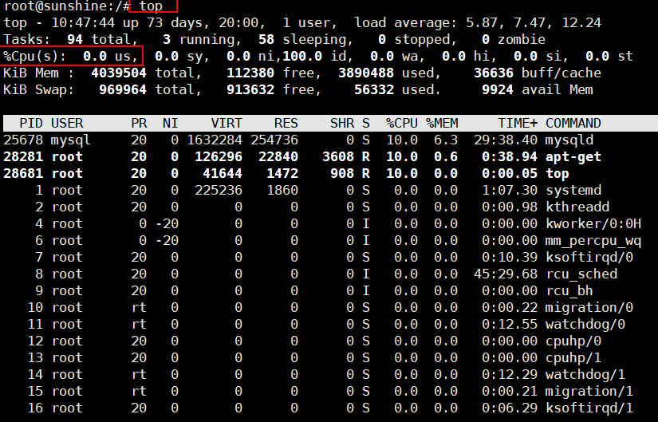
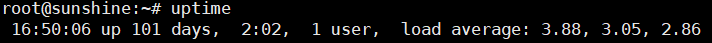
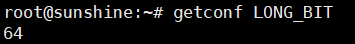
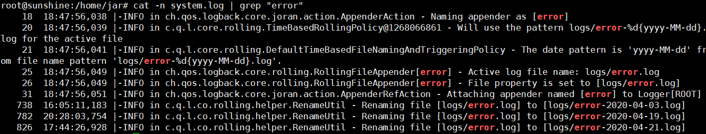

#  Linux


# Interview

### 1.Linux下如何启动springboot的包？

```html
nohup java -jar blog.jar > system.log 2>&1 &

```

下面我们对这条命令进行分析

nohub一般形式为如下:

nohub command &

但是当你退出账户时，仍然会停止对应的进程。

所以这就需要你在后面添加 2>&1 &(相当于正常退出，仍保持命令在后台运行)

上面这个command正好对上java -jar blog.jar > system.log

“>” 输出重定向，通常用于输出日志


### 2.linux命令（怎么查看linux中当前各个进程占用的系统资源）

```shell
ps -aux

```


### 3.说几个常用的linux命令 ,五个以上，用途

1.目录切换

```java
cd 文件夹 //进入某一个文件夹
cd .. //返回上一级目录

```

2.目录操作 

```shell
mkdir //增加目录
ll/ls //查看目录下文件
rmdir //删除文件

```

3.文件操作

```shell
1. touch 文件名称   //文件的创建（增）
2. cat/more/less/tail 文件名称  //文件的查看（查）

```

4.压缩和解压

（1）压缩

Linux中的打包文件一般是以.tar结尾的，压缩的命令一般是以.gz结尾的。

而一般情况下打包和压缩是一起进行的，打包并压缩后的文件的后缀名一般.tar.gz。
命令：**`tar -zcvf 打包压缩后的文件名 要打包压缩的文件`**
其中：

  z：调用gzip压缩命令进行压缩

  c：打包文件

  v：显示运行过程

  f：指定文件名

比如：假如test目录下有三个文件分别是：aaa.txt bbb.txt ccc.txt，如果我们要打包test目录并指定压缩后的压缩包名称为test.tar.gz可以使用命令：**`tar -zcvf test.tar.gz aaa.txt bbb.txt ccc.txt`或：`tar -zcvf test.tar.gz       /test/`**

（2）解压

命令：tar [-xvf] 压缩文件

其中：x：代表解压

示例：

1 将/test下的test.tar.gz解压到当前目录下可以使用命令：**`tar -xvf test.tar.gz`**

2 将/test下的test.tar.gz解压到根目录/usr下:**`tar -xvf test.tar.gz -C /usr`**（- C代表指定解压的位置）

5.网络管理

```shell
ifconfig 查看ip地址
ping 地址 查看连接情况

```


### 4.linux命令查看服务器性能

**（1）查看CPU使用**

```shell
top
```



**（2）查看内存**

```shell
free -m

```


参考：https://blog.csdn.net/guoxiaojie_415/article/details/80526667?utm_medium=distribute.pc_relevant.none-task-blog-BlogCommendFromBaidu-4&depth_1-utm_source=distribute.pc_relevant.none-task-blog-BlogCommendFromBaidu-4 （写的算好的一篇  有参考其他）

https://netflixtechblog.com/linux-performance-analysis-in-60-000-milliseconds-accc10403c55 （国外的一个，需要梯子）

**（3）uptime 查看负载**



几个负载分别是1min，5min，15min的平均负载


### 5.Linux改变文件所属组的命令，生成文件的命令

https://www.cnblogs.com/klb561/p/9170616.html

[root@localhost ~]# chgrp group1 install.log

\#修改install.log文件的所属组为group1


[root@localhost user]# touch test

\#由root用户新建文件test


### 6.熟悉Linux什么指令？ 说一下如何把文件中的abc替换为def；说一下如何找出某文件夹下所有包含“abc”的文件？

参考：https://blog.csdn.net/Olivia_Vang/article/details/104091358?utm_medium=distribute.pc_relevant_t0.none-task-blog-BlogCommendFromMachineLearnPai2-1&depth_1-utm_source=distribute.pc_relevant_t0.none-task-blog-BlogCommendFromMachineLearnPai2-1


### 7.Linux系统是32位还是64位查询命令



参考：https://www.cnblogs.com/nucdy/p/5658488.html 

### 8.Linux 方面，查日志：cat 命令，如果根据日期查怎么查，日志文件很大，快速定位错误日志(只给一个模糊时间)，我又说了 grep 和 管道符，面试官说这不是最好的。

下面这个是查询错误：

```shell
cat -n system.log | grep "error" //grep是搜索的意思  -n的意思是显示行号（大日志显示行号 很有必要）
```



查出来是这样的。

参考：https://www.cnblogs.com/woshixiangshang/p/11585306.html   （博客园上面的，写的还行）


**其实还有好多种查日志的方法：** （也很重要）

上面的cat命令显示全部，不太好，

还有more和less操作，都表示一页一页翻页，但是less操作起来好一点。

less空格和Pgdown向下翻页，pageup向上翻页