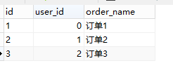
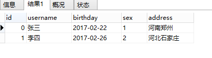
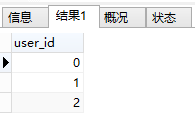
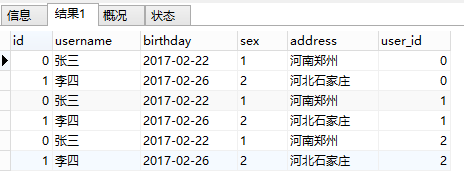
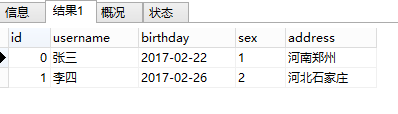
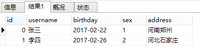
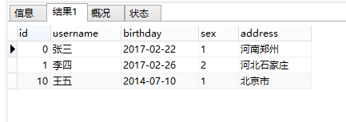

# MySql


# Interview

## 1.数据库连接

**executeUpdate(sql)**

用于执行给定 SQL 语句，该语句可能为 INSERT、UPDATE 或 DELETE 语句，或者不返回任何内容的 SQL 语句。

返回值是更新的条数。

**executeQuery（sql）**

这个方法被用来执行 SELECT 语句，返回代表查询结果的ResultSet对象。


## 2.关系型数据库和非关系数据库的区别?(建议可以通过举例子介绍)

**什么是关系型数据库？**

- 关系型数据库是依据**关系模型**来创建的数据库。
- 所谓关系模型就是“一对一、一对多、多对多”等关系模型，关系模型就是指二维表格模型,因而一个关系型数据库就是由二维表及其之间的联系组成的一个数据组织。
- 关系型数据可以很好地存储一些关系模型的数据，比如一个老师对应多个学生的数据（“多对多”），一本书对应多个作者（“一对多”），一本书对应一个出版日期（“一对一”）
- 关系模型是我们生活中能经常遇见的模型，存储这类数据一般用关系型数据库
- 关系模型包括数据结构（数据存储的问题，二维表）、操作指令集合（SQL语句）、完整性约束(表内数据约束、表与表之间的约束)。

数据的存储形式：

 

关系的处理形式：

 

下面是一个E-R图，是多个模型一起用的情况：


**常见的关系型数据库：**

Oracle、DB2、PostgreSQL、Microsoft SQL Server、Microsoft Access、MySQL

**关系型数据库的特点：**

安全（因为存储在磁盘中，不会说突然断电数据就没有了）、

容易理解（建立在关系模型上）、

但不节省空间（因为建立在关系模型上，就要遵循某些规则，好比数据中某字段值即使为空仍要分配空间）


**什么是非关系型数据库？**

- 非关系型数据库主要是基于“**非关系模型**”的数据库（由于关系型太大，所以一般用“非关系型”来表示其他类型的数据库）
- 非关系型模型比如有：
  - 列模型：存储的数据是一列列的。关系型数据库以一行作为一个记录，列模型数据库以一列为一个记录。（这种模型，数据即索引，IO很快，主要是一些分布式数据库）
  - 键值对模型：存储的数据是一个个“键值对”，比如name:liming,那么name这个键里面存的值就是liming
  - 文档类模型：以一个个文档来存储数据，有点类似“键值对”。

**常见非关系模型数据库：**

列模型：Hbase


键值对模型：redis,MemcacheDB


文档类模型：mongoDB

**非关系型数据库的特点：**

效率高（因为存储在内存中）、

但不安全（断电丢失数据，但其中redis可以同步数据到磁盘中），现在很多非关系型数据库都开始支持转存到磁盘中。

 

参考：https://www.cnblogs.com/ranyonsue/p/10333203.html

## 3.数据库命名规范：

- 所有数据库对象名称必须使用小写字母并用下划线分割
- 所有数据库对象名称禁止使用 MySQL 保留关键字（如果表名中包含关键字查询时，需要将其用单引号括起来）
- 数据库对象的命名要能做到见名识意，并且最后不要超过 32 个字符
- 临时库表必须以 tmp_为前缀并以日期为后缀，备份表必须以 bak_为前缀并以日期 (时间戳) 为后缀
- 所有存储相同数据的列名和列类型必须一致（一般作为关联列，如果查询时关联列类型不一致会自动进行数据类型隐式转换，会造成列上的索引失效，导致查询效率降低


## 4.SQL索引是什么，索引优化，索引为什么会失效？

#### 首先说什么是索引?

**索引是一种用于快速查询和检索数据的数据结构。常见的索引结构有: B树， B+树和Hash。**

索引的作用就相当于目录的作用。打个比方: 我们在查字典的时候，如果没有目录，那我们就只能一页一页的去找我们需要查的那个字，速度很慢。如果有目录了，我们只需要先去目录里查找字的位置，然后直接翻到那一页就行了。


那索引为什么会失效？可以用下面第一条来回答。

30%这个范围。 其他的就不知道啦，后续仔细研究（***********）

#### 索引优化规则

王道当时有一个文档：Mysql索引及其优化（王道的文档，有些粗略，没讲模糊查询左右之分）

**1）如果MySQL估计使用索引比全表扫描还慢，则不会使用索引。**

返回数据的比例是重要的指标，比例越低越容易命中索引。记住这个范围值——30%，后面所讲的内容都是建立在返回数据的比例在30%以内的基础上。

**2）前导模糊查询不能命中索引。**

name列创建普通索引：


前导模糊查询不能命中索引：

EXPLAIN SELECT * FROM user WHERE name LIKE '%s%';


非前导模糊查询则可以使用索引，可优化为使用非前导模糊查询：

EXPLAIN SELECT * FROM user WHERE name LIKE 's%';


**3）数据类型出现隐式转换的时候不会命中索引，特别是当列类型是字符串，一定要将字符常量值用引号引起来。**

EXPLAIN SELECT * FROM user WHERE name=1;


EXPLAIN SELECT * FROM user WHERE name='1';


**4）复合索引的情况下，查询条件不包含索引列最左边部分（不满足最左原则），不会命中符合索引。**

（是不是相当于没有B+树的上面一层，自然找不到下面一层？ 有待考究 ）

name,age,status列创建复合索引：

ALTER TABLE user ADD INDEX index_name (name,age,status);


user表索引详情：

SHOW INDEX FROM user;


根据最左原则，可以命中复合索引index_name：

EXPLAIN SELECT * FROM user WHERE name='swj' AND status=1;


注意，最左原则并不是说是查询条件的顺序：

EXPLAIN SELECT * FROM user WHERE status=1 AND name='swj';


而是查询条件中是否包含索引最左列字段：

EXPLAIN SELECT * FROM user WHERE status=2 ;


**5）union、in、or都能够命中索引，建议使用in。**

union:

EXPLAIN SELECT*FROM user WHERE status=1

UNION ALL

SELECT*FROM user WHERE status = 2;


in:

EXPLAIN SELECT * FROM user WHERE status IN (1,2);


or:

EXPLAIN SELECT*FROM user WHERE status=1OR status=2;


查询的CPU消耗：or>in>union。

**6）用or分割开的条件，如果or前的条件中列有索引，而后面的列中没有索引，那么涉及到的索引都不会被用到。**

EXPLAIN SELECT * FROM payment WHERE customer_id = 203 OR amount = 3.96;


因为or后面的条件列中没有索引，那么后面的查询肯定要走全表扫描，在存在全表扫描的情况下，就没有必要多一次索引扫描增加IO访问。

**7）负向条件查询不能使用索引，可以优化为in查询。**

负向条件有：**!=、<>、not in、not exists、not like**等。

status列创建索引：

ALTER TABLE user ADD INDEX index_status (status);


user表索引详情：

SHOW INDEX FROM user;


负向条件不能命中缓存：

EXPLAIN SELECT * FROM user WHERE status !=1 AND status != 2;


可以优化为in查询，但是前提是区分度要高，返回数据的比例在30%以内：

EXPLAIN SELECT * FROM user WHERE status IN (0,3,4);


**8）范围条件查询可以命中索引。范围条件有：<、<=、>、>=、between等。**

status,age列分别创建索引：

ALTER TABLE user ADD INDEX index_status (status);


ALTER TABLE user ADD INDEX index_age (age);


user表索引详情：

SHOW INDEX FROM user;


范围条件查询可以命中索引：

EXPLAIN SELECT * FROM user WHERE status>5;


范围列可以用到索引（联合索引必须是最左前缀），但是范围列后面的列无法用到索引，索引最多用于一个范围列，如果查询条件中有两个范围列则无法全用到索引：

EXPLAIN SELECT * FROM user WHERE status>5 AND age<24;


如果是范围查询和等值查询同时存在，优先匹配等值查询列的索引：

EXPLAIN SELECT * FROM user WHERE status>5 AND age=24;


**8）数据库执行计算不会命中索引。**

EXPLAIN SELECT * FROM user WHERE age>24;


EXPLAIN SELECT * FROM user WHERE age+1>24;


计算逻辑应该尽量放到业务层处理，节省数据库的CPU的同时最大限度的命中索引。

**9）利用覆盖索引进行查询，避免回表。**

被查询的列，数据能从索引中取得，而不用通过行定位符row-locator再到row上获取，即“被查询列要被所建的索引覆盖”，这能够加速查询速度。

user表的索引详情：


因为status字段是索引列，所以直接从索引中就可以获取值，不必回表查询：

Using Index代表从索引中查询：

EXPLAIN SELECT status FROM user where status=1;


当查询其他列时，就需要回表查询，这也是为什么要避免SELECT*的原因之一：

EXPLAIN SELECT * FROM user where status=1;


**10）建立索引的列，不允许为null。**

单列索引不存null值，复合索引不存全为null的值，如果列允许为null，可能会得到“不符合预期”的结果集，所以，请使用not null约束以及默认值。

remark列建立索引：

ALTER TABLE user ADD INDEX index_remark (remark);


IS NULL可以命中索引：

EXPLAIN SELECT * FROM user WHERE remark IS NULL;


IS NOT NULL不能命中索引：

EXPLAIN SELECT * FROM user WHERE remark IS NOT NULL;


虽然IS NULL可以命中索引，但是NULL本身就不是一种好的数据库设计，应该使用NOT NULL约束以及默认值。


a. 更新十分频繁的字段上不宜建立索引：因为更新操作会变更B+树，重建索引。这个过程是十分消耗数据库性能的。

b. 区分度不大的字段上不宜建立索引：类似于性别这种区分度不大的字段，建立索引的意义不大。因为不能有效过滤数据，性能和全表扫描相当。另外返回数据的比例在30%以外的情况下，优化器不会选择使用索引。

c. 业务上具有唯一特性的字段，即使是多个字段的组合，也必须建成唯一索引。虽然唯一索引会影响insert速度，但是对于查询的速度提升是非常明显的。另外，即使在应用层做了非常完善的校验控制，只要没有唯一索引，在并发的情况下，依然有脏数据产生。

d. 多表关联时，要保证关联字段上一定有索引。

e. 创建索引时避免以下错误观念：索引越多越好，认为一个查询就需要建一个索引；宁缺勿滥，认为索引会消耗空间、严重拖慢更新和新增速度；抵制唯一索引，认为业务的唯一性一律需要在应用层通过“先查后插”方式解决；过早优化，在不了解系统的情况下就开始优化。


小结：

**对于自己编写的SQL查询语句，要尽量使用EXPLAIN命令分析一下，做一个对SQL性能有追求的程序员。衡量一个程序员是否靠谱，SQL能力是一个重要的指标。作为后端程序员，深以为然。**


参考：https://www.cnblogs.com/gdjk/p/10668868.html （这篇文章写得真好，美团的一位工程师）


补充：

#### explain

**用法：在select语句前加上explain**
显示mysql如何使用索引来处理select语句以及连接表，可以帮助选择更好的索引和写出更优化的查询语句

参考CS的文档，还有：https://www.jianshu.com/p/f29a619b3ee8


## 5.联合索引

由多列属性组成的索引。

下面为创建和删除所有的操作：

```sql
#联合索引
ALTER TABLE litemall_user ADD INDEX index_name_username (username,parent_id)
#索引一旦创建，就不能再修改，只能通过下面删除
DROP INDEX index_name_username ON litemall_user;
```


## 6.MySQL的分库分表，以及SQL语句优化、

#### **数据库分表：**

维度：

##### **垂直拆分**

 垂直分库（根据业务不同与微服务类似单独服务对应单独库）
 垂直分表

垂直分表是基于数据库中的”列”进行，某个表字段较多，可以新建一张扩展表，将不经常用或字段长度较大的字段拆分出去到扩展表中。在字段很多的情况下（例如一个大表有100多个字段），通过”大表拆小表”，更便于开发与维护，也**能避免跨页问题**，MySQL底层是通过数据页存储的，**一条记录占用空间过大会导致跨页，造成额外的性能开销**。另外数据库以行为单位将数据加载到内存中，这样表中字段长度较短且访问频率较高，内存能加载更多的数据，命中率更高，减少了磁盘IO，从而提升了数据库性能。

拆分字段的操作建议在数据库设计阶段就做好。如果是在发展过程中拆分，则需要改写以前的查询语句，会额外带来一定的成本和风险，建议谨慎。

 **垂直拆分优缺点：**

 **优点：**
解决业务系统层面的耦合，业务清晰
与微服务的治理类似，也能对不同业务的数据进行分级管理、维护、监控、扩展等
高并发场景下，垂直切分一定程度的提升IO、数据库连接数、单机硬件资源的瓶颈
 缺点：
部分表无法join，只能通过接口聚合方式解决，提升了开发的复杂度
依然存在单表数据量过大的问题（需要水平切分）
分布式事务处理复杂


##### 水平拆分

（根据表内数据内在的逻辑关系，将同一个表按不同的条件分散到多个数据库或多个表中，每个表中只包含一部分数据，从而使得单个表的数据量变小，达到分布式的效果。）

 **水平拆分优缺点：**
 优点：
不存在单库数据量过大、高并发的性能瓶颈，提升系统稳定性和负载能力
应用端改造较小，不需要拆分业务模块
“冷热数据分离”实现方案
 缺点：
跨分片事务难以保证
跨分片的复杂查询如join关联查询
数据多次扩展难度和维护量极大


##### 数据分片规则

 冷热数据隔离（近6个月或者1年的数据作为热数据，历史数据作为冷数据再进行时间维度拆分）
 地域区域或者其他拆分方式
 userNo范围分表，比如0~500w用户在user1表，501w-1000w在user2表等
 优点：
单表大小可控
天然便于水平扩展，后期如果想对整个分片集群扩容时，只需要添加节点即可，无需对其他分片的数 据进行迁移
使用分片字段进行范围查找时，连续分片可快速定位分片进行快速查询，有效避免跨分片查询的问题
 缺点：
热点数据成为性能瓶颈。连续分片可能存在数据热点


还有一种很好地操作：

##### 数据库读写分离 ，弄一个主从数据库


##### hash取模mod的切分方式

 优点：根据主键id进行数据切分，达到数据均匀分布，使用一致性hash算法可以避免后期扩展问题
 缺点：跨分片聚合操作


#### SQL优化：

其实就是上面的，索引优化。


## 7. 主键索引和普通索引的区别。

#### 主键索引(Primary Key)

**数据表的主键列使用的就是主键索引。**

**一张数据表有只能有一个主键，并且主键不能为null，不能重复。**

**在mysql的InnoDB的表中，当没有显示的指定表的主键时，InnoDB会自动先检查表中是否有唯一索引的字段，如果有，则选择该字段为默认的主键，否则InnoDB将会自动创建一个6Byte的自增主键。**

#### 二级索引(辅助索引)

**二级索引又称为辅助索引，是因为二级索引的叶子节点存储的数据是主键。也就是说，通过二级索引，可以定位主键的位置。**

唯一索引，普通索引，前缀索引等索引属于二级索引。

**PS:不懂的同学可以暂存疑，慢慢往下看，后面会有答案的，也可以自行搜索。**

1. **唯一索引(Unique Key)** ：唯一索引也是一种约束。**唯一索引的属性列不能出现重复的数据，但是允许数据为NULL，一张表允许创建多个唯一索引。**建立唯一索引的目的大部分时候都是为了该属性列的数据的唯一性，而不是为了查询效率。
2. **普通索引(Index)** ：**普通索引的唯一作用就是为了快速查询数据，一张表允许创建多个普通索引，并允许数据重复和NULL。**
3. **前缀索引(Prefix)** ：前缀索引只适用于字符串类型的数据。前缀索引是对文本的前几个字符创建索引，相比普通索引建立的数据更小，
   因为只取前几个字符。
4. **全文索引(Full Text)** ：全文索引主要是为了检索大文本数据中的关键字的信息，是目前搜索引擎数据库使用的一种技术。Mysql5.6之前只有MYISAM引擎支持全文索引，5.6之后InnoDB也支持了全文索引。 

二级索引:

.png)

## 8.Mysql索引。有哪几种，作用，适用于什么场景。你们的项目中何处用了MySQL索引？用了哪一种？

#### 索引类型：

除了**主键索引**，还有下面：

1. 唯一索引(Unique Key)** ：唯一索引也是一种约束。**唯一索引的属性列不能出现重复的数据，但是允许数据为NULL，一张表允许创建多个唯一索引。**建立唯一索引的目的大部分时候都是**为了该属性列的数据的唯一性，而不是为了查询效率**。
2. **普通索引(Index)** ：**普通索引的唯一作用就是为了快速查询数据，一张表允许创建多个普通索引，并允许数据重复和NULL。**
3. **前缀索引(Prefix)** ：前缀索引只适用于字符串类型的数据。前缀索引是对文本的前几个字符创建索引，相比普通索引建立的数据更小，
   因为只取前几个字符。
4. **全文索引(Full Text)** ：全文索引主要是为了检索大文本数据中的关键字的信息，是目前搜索引擎数据库使用的一种技术。Mysql5.6之前只有MYISAM引擎支持全文索引，5.6之后InnoDB也支持了全文索引。 


#### 交易所项目中用到的索引：

对account用的是唯一索引，是为了避免重复。

对下面的email，authority，mobile等用的是一般索引，是为了查询快。


用户钱包里面也用了索引：对user_id,symbol   做了联合索引 （这两个是有规律，稳定的，不变的）


#### 商城项目里面用到的索引：

商城里面也是只有user表里面用了一个索引：


## 9.讲一下你对MySQL的理解，主键索引和非主键索引的存储结构和存储内容分别都是什么？用过联合索引吗？

首先MySQL是关系型数据库，然后说一下关系型数据库。。。非关系型数据库。


#### 主键索引和非主键索引有什么区别？

例如对于下面这个表(其实就是上面的表中增加了一个k字段),且ID是主键。


 

主键索引和非主键索引的示意图如下：


 

其中R代表一整行的值。

从图中不难看出，主键索引和非主键索引的区别是：非主键索引的叶子节点存放的是**主键的值**，而主键索引的叶子节点存放的是**整行数据**，其中非主键索引也被称为**二级索引**，而主键索引也被称为**聚簇索引**。

根据这两种结构我们来进行下查询，看看他们在查询上有什么区别。

1、如果查询语句是 select * from table where ID = 100,即主键查询的方式，则只需要搜索 ID 这棵 B+树。

2、如果查询语句是 select * from table where k = 1，即非主键的查询方式，则先搜索k索引树，得到ID=100,再到ID索引树搜索一次，这个过程也被称为回表。

现在，知道他们的区别了吧？


参考：https://www.cnblogs.com/heishuichenzhou/p/10813463.html （写的挺好的）


这里再说一下聚集索引和非聚集索引：

#### 聚集索引

**聚集索引即索引结构和数据一起存放的索引。主键索引属于聚集索引。**

在 Mysql 中，InnoDB引擎的表的 `.ibd`文件就包含了该表的索引和数据，对于 InnoDB 引擎表来说，该表的索引(B+树)的每个非叶子节点存储索引，叶子节点存储索引和索引对应的数据。

##### 聚集索引的优点

聚集索引的查询速度非常的快，因为整个B+树本身就是一颗多叉平衡树，叶子节点也都是有序的，定位到索引的节点，就相当于定位到了数据。

##### 聚集索引的缺点

1. **依赖于有序的数据** ：因为B+树是多路平衡树，如果索引的数据不是有序的，那么就需要在插入时排序，如果数据是整型还好，否则类似于字符串或UUID这种又长又难比较的数据，插入或查找的速度肯定比较慢。
2. **更新代价大** ： 如果对索引列的数据被修改时，那么对应的索引也将会被修改，
   而且况聚集索引的叶子节点还存放着数据，修改代价肯定是较大的，
   所以对于主键索引来说，主键一般都是不可被修改的。

#### 非聚集索引

**非聚集索引即索引结构和数据分开存放的索引。**

**二级索引属于非聚集索引。**

> MYISAM引擎的表的.MYI文件包含了表的索引，
> 该表的索引(B+树)的每个叶子非叶子节点存储索引，
> 叶子节点存储索引和索引对应数据的指针，指向.MYD文件的数据。
>
> **非聚集索引的叶子节点并不一定存放数据的指针，
> 因为二级索引的叶子节点就存放的是主键，根据主键再回表查数据。**

##### 非聚集索引的优点

**更新代价比聚集索引要小** 。非聚集索引的更新代价就没有聚集索引那么大了，非聚集索引的叶子节点是不存放数据的

##### 非聚集索引的缺点

1. 跟聚集索引一样，非聚集索引也依赖于有序的数据
2. **可能会二次查询(回表)** :这应该是非聚集索引最大的缺点了。 当查到索引对应的指针或主键后，可能还需要根据指针或主键再到数据文件或表中查询。

这是Mysql的表的文件截图:


聚集索引和非聚集索引:


#### 联合索引

联合索引即由多列属性组成索引。

##### 最左前缀原则

假设创建的联合索引由三个字段组成: 

```text
ALTER TABLE table ADD INDEX index_name (num,name,age)
```

那么当查询的条件有为:num / (num AND name) / (num AND name AND age)时，索引才生效。所以在创建联合索引时，尽量把查询最频繁的那个字段作为最左(第一个)字段。查询的时候也尽量以这个字段为第一条件。


## 10.如果SQL查询很慢，如何排查并优化？如果主从分离之后，查询还是很慢，比如数据库有几百万的数据，这个时候应该怎么办？

#### 排查优化：

1.看一下索引，建的合适不

```sql
show index from litemall_user
```


2.然后执行一个查询语句，看一下

```sql
explain SELECT * from litemall_user where username = "steve"
```

看一下建的索引用上了没有？


3.还可以看看type，SQl优化的目标是，至少要达到range级别，要求是ref级别，最好是consts级别。（阿里开发手册，索引规约）

4.然后要结合那十几个索引优化规则看一下Sql写的合适不。


#### 主从分离：

##### 主从分离原理


 

　　**1.第一步**：Master（主服务器）将操作记录到binary log（二进制日志文件当中）【即每个事务更新数据完成之前先把操作记录在日志文件中，Mysql将事务串行的写入二进制日志文件中】，写入日志文件完成之后，Master通知存储引擎提交事务（注：对数据的操作成为一次二进制的日志事件【binary log event】）；

　　**2.第二步**：slave（从服务器）把binary log拷贝到relay log（中介日志）【相当于缓存作用，存储在从服务器的缓存中】，首先slave会开始一个工作线程（I/O线程），I/O线程会在Master上打开一个普通的连接，然后读取binary log事件，如果已经跟上master，就会睡眠，并等待Master产生新的事件，I/O线程将读取的这些事件写入到relay log；

　　**3.第三步**：slave从做中介日志事件（relay log），sql线程读取relay log事件并执行更新从服务器上的数据，使其与Master上的数据一致。

　　**总结**：主服务器把操作记录到binary log——>从服务器将binary log中的数据同步到relay log（中介日志中）——>从服务器读取中介日志执行同步数据


具体的配置流程，参考：https://www.cnblogs.com/lyq-biu/p/10857766.html


##### 主从分离以后还是很慢，考虑分表？还是还有其他更加好的操作？（然后再细致的研究）

分表，怎么分？就是上面说的垂直，水平，热度，哈希等。


## 11.什么是事务？事务的特性？并发事务带来的问题？事务的隔离级别? 什么叫可重复度？Mysql怎么解决不可重复读和幻读？ Mysql默认是哪个隔离级别？事务的传播形式？

#### 什么是事务?

事务是逻辑上的一组操作，要么都执行，要么都不执行。

事务最经典也经常被拿出来说例子就是转账了。假如小明要给小红转账1000元，这个转账会涉及到两个关键操作就是：将小明的余额减少1000元，将小红的余额增加1000元。万一在这两个操作之间突然出现错误比如银行系统崩溃，导致小明余额减少而小红的余额没有增加，这样就不对了。事务就是保证这两个关键操作要么都成功，要么都要失败。

#### 事务的特性（ACID）：


1. **原子性：** 事务是最小的执行单位，不允许分割。事务的原子性确保动作要么全部完成，要么完全不起作用；
2. **一致性：** 执行事务前后，数据保持一致，例如转账业务中，无论事务是否成功，转账者和收款人的总额应该是不变的；
3. **隔离性：** 并发访问数据库时，一个用户的事务不被其他事务所干扰，各并发事务之间数据库是独立的；
4. **持久性：** 一个事务被提交之后。它对数据库中数据的改变是持久的，即使数据库发生故障也不应该对其有任何影响。


#### 并发事务带来的问题：

在典型的应用程序中，多个事务并发运行，经常会操作相同的数据来完成各自的任务（多个用户对统一数据进行操作）。并发虽然是必须的，但可能会导致以下的问题。

- **脏读（Dirty read）:** 当一个事务正在访问数据并且对数据进行了修改，而这种修改还没有提交到数据库中，这时另外一个事务也访问了这个数据，然后使用了这个数据。因为这个数据是还没有提交的数据，那么另外一个事务读到的这个数据是“脏数据”，依据“脏数据”所做的操作可能是不正确的。
- **丢失修改（Lost to modify）:** 指在一个事务读取一个数据时，另外一个事务也访问了该数据，那么在第一个事务中修改了这个数据后，第二个事务也修改了这个数据。这样第一个事务内的修改结果就被丢失，因此称为丢失修改。	例如：事务1读取某表中的数据A=20，事务2也读取A=20，事务1修改A=A-1，事务2也修改A=A-1，最终结果A=19，事务1的修改被丢失。
- **不可重复读（Unrepeatableread）:** 指在一个事务内多次读同一数据。在这个事务还没有结束时，另一个事务也访问该数据。那么，在第一个事务中的两次读数据之间，由于第二个事务的修改导致第一个事务两次读取的数据可能不太一样。这就发生了在一个事务内两次读到的数据是不一样的情况，因此称为不可重复读。
- **幻读（Phantom read）:** 幻读与不可重复读类似。它发生在一个事务（T1）读取了几行数据，接着另一个并发事务（T2）插入了一些数据时。在随后的查询中，第一个事务（T1）就会发现多了一些原本不存在的记录，就好像发生了幻觉一样，所以称为幻读。

**不可重复度和幻读区别：**

不可重复读的重点是修改，幻读的重点在于新增或者删除。

例1（同样的条件, 你读取过的数据, 再次读取出来发现值不一样了 ）：事务1中的A先生读取自己的工资为     1000的操作还没完成，事务2中的B先生就修改了A的工资为2000，导        致A再读自己的工资时工资变为  2000；这就是不可重复读。

 例2（同样的条件, 第1次和第2次读出来的记录数不一样 ）：假某工资单表中工资大于3000的有4人，事务1读取了所有工资大于3000的人，共查到4条记录，这时事务2 又插入了一条工资大于3000的记录，事务1再次读取时查到的记录就变为了5条，这样就导致了幻读。

#### **事务隔离级别**

- **SQL 标准定义了四个隔离级别：**

  - **READ-UNCOMMITTED(读取未提交)：** 最低的隔离级别，允许读取尚未提交的数据变更，**可能会导致脏读、幻读或不可重复读**。
  - **READ-COMMITTED(读取已提交)：** 允许读取并发事务已经提交的数据，**可以阻止脏读，但是幻读或不可重复读仍有可能发生**。
  - **REPEATABLE-READ(可重复读)：**  对同一字段的多次读取结果都是一致的，除非数据是被本身事务自己所修改，**可以阻止脏读和不可重复读，但幻读仍有可能发生**。
  - **SERIALIZABLE(可串行化)：** 最高的隔离级别，完全服从ACID的隔离级别。所有的事务依次逐个执行，这样事务之间就完全不可能产生干扰，也就是说，**该级别可以防止脏读、不可重复读以及幻读**。

  ------

  |     隔离级别     | 脏读 | 不可重复读 | 幻影读 |
  | :--------------: | :--: | :--------: | :----: |
  | READ-UNCOMMITTED |  √   |     √      |   √    |
  |  READ-COMMITTED  |  ×   |     √      |   √    |
  | REPEATABLE-READ  |  ×   |     ×      |   √    |
  |   SERIALIZABLE   |  ×   |     ×      |   ×    |

  MySQL InnoDB 存储引擎的默认支持的隔离级别是 **REPEATABLE-READ（可重读）**。我们可以通过`SELECT @@tx_isolation;`命令来查看,MySQL 8.0 该命令改为`SELECT @@transaction_isolation;`

  ```sql
  mysql> SELECT @@tx_isolation;
  +-----------------+
  | @@tx_isolation  |
  +-----------------+
  | REPEATABLE-READ |
  +-----------------+
  ```

  实际操作：

  

  这里需要注意的是：与 SQL 标准不同的地方在于InnoDB 存储引擎在 **REPEATABLE-READ（可重读）**事务隔离级别下使用的是Next-Key Lock 锁算法，因此可以避免幻读的产生，这与其他数据库系统(如 SQL Server)是不同的。所以说InnoDB 存储引擎的默认支持的隔离级别是 **REPEATABLE-READ（可重读）** 已经可以完全保证事务的隔离性要求，即达到了 SQL标准的**SERIALIZABLE(可串行化)**隔离级别。

  因为隔离级别越低，事务请求的锁越少，所以大部分数据库系统的隔离级别都是**READ-COMMITTED(读取提交内容):**，但是你要知道的是InnoDB 存储引擎默认使用 **REPEATABLE-READ（可重读）**并不会有任何性能损失。

  InnoDB 存储引擎在 **分布式事务** 的情况下一般会用到**SERIALIZABLE(可串行化)**隔离级别。

#### 什么叫可重复读？

事务隔离级别第三条。

**REPEATABLE-READ(可重复读)：**  **对同一字段的多次读取结果都是一致的**，除非数据是被本身事务自己所修改，**可以阻止脏读和不可重复读，但幻读仍有可能发生**。

#### Mysql怎么解决不可重复读和幻读？默认什么隔离级别？

首先序列化是都可以避免这两种的。

**SERIALIZABLE(可串行化)：** 最高的隔离级别，完全服从ACID的隔离级别。所有的事务依次逐个执行，这样事务之间就完全不可能产生干扰，也就是说，**该级别可以防止脏读、不可重复读以及幻读**。


**但是Mysql默认用的可重复读**，也可以避免这两种问题，原因是：

与 SQL 标准不同的地方在于InnoDB 存储引擎在 **REPEATABLE-READ（可重读）**事务隔离级别下使用的是Next-Key Lock 锁算法，因此可以避免幻读的产生。

InnoDB 存储引擎在 **分布式事务** 的情况下一般会用到**SERIALIZABLE(可串行化)**隔离级别。


#### 事务的传播形式：

传播方式： 

​      **新建事务**

​      required

​      required_new   - 挂起当前

​      **非事务方式运行**

​      supports

​      not_supported  - 挂起当前

​      never  

​      **嵌套事务：**

​      nested

​      **抛异常**

​      mandatory   

​      never

 

Spring定义了一下几种事务传播方式：

PROPAGATION_REQUIRED        支持当前事务，如果当前没有事务，就**新建一个事务**。这是最常见的选择。

PROPAGATION_SUPPORTS            支持当前事务，如果当前没有事务，就以**非事务方式**执行。

PROPAGATION_MANDATORY         支持当前事务，如果当前没有事务，就**抛出异常**。

 

PROPAGATION_REQUIRES_NEW     **新建事务**，如果当前存在事务，**把当前事务挂起**。

PROPAGATION_NOT_SUPPORTED   以**非事务方式**执行操作，如果当前存在事务，就**把当前事务挂起。**

PROPAGATION_NEVER                 以**非事务方式**执行，如果当前存在事务，则**抛出异常**。

PROPAGATION_NESTED            如果当前事务存在，则以**嵌套事务**的方式执行。否则就按照它自己的事务方式执行。

 参考：https://www.iteye.com/blog/uule-1420799


## 12.组合索引（联合索引）A,B两字段怎么用？A,B,AB 为什么这么做？

组合索引遵循最左前缀原则（但是如果Mysql版本8.0以后据说不遵循这个原则，为什么，需要考究）

至于为什么呢？看了一个网上的辩论：https://bbs.csdn.net/topics/390727789

有一个老哥举了一个例子：

```java
//假设数据 表T (a,b,c) rowid 为物理位置
rowid a b c
(1) 1 1 1
(2) 2 1 13
(3) 2 2 14
(4) 1 3 3
(5) 2 3 12
(6) 1 2 5
(7) 2 3 9
(8) 1 2 2
(9) 1 3 6
(10) 2 2 11
(11) 2 2 8
(12) 1 1 7
(13) 2 3 15
(14) 1 1 4
(15) 2 1 10

当你创建一个索引 create index xxx on t(a,b), 则索引文件逻辑上等同于如下
a b rowid
1 1 1
1 1 12
1 1 14
1 2 6
1 2 8
1 3 4
1 3 9
2 1 2
2 1 15
2 2 3
2 2 10
2 2 11
2 3 5
2 3 7
2 3 13
```

当select * from T where a=1 and b=3 的时候， 数据库系统可以直接从索引文件中直接二分法找到A=1的记录，然后再B=3的记录。
但如果你 where b=3 则需要遍历这个索引表的全部！  


自己个人理解就和查字典一样，加入你查a开始的单词，如果你没有参考目录，从a的范围内找，那只能遍历整本字典啦。

再往底层来说就是：索引在B+树里面存着，只有叶子节点有数据，上面的非叶子节点只充当一个索引的角色，如果你没有显示第一层索引，直接从第二次开始，就肯定用不到索引，只能遍历。因为没有第一层的话，第二次是无序的。


## 13.怎样判断索引是否有生效，mysql的定时计划任务有用过吗？

用explainpan加载sql语句之前判断，

如果没有生效：


如果生效啦：


定时任务：

用event_scheduler（时间）

```sql
#查看定时任务是否开启
show variables like "%event_sche%";
#如果没有开启就 开启定时任务
set global event_scheduler=1;
#关闭定时任务
set global event_scheduler=0;
```

详细操作：参考：https://jingyan.baidu.com/article/e75aca853cf6b9142fdac64f.html


## 14.Mysql底层是什么数据结构，说一下你对B+树的理解，为什么数据库底层不用平衡二叉树，而要用B+树呢？(因为B+树查找快速，而且只有3层，可以减少IO次数)

Mysql底层用的数据结构是B+树和哈希表，不过多数是B+树。说B+树之前先说一下B树。

哈希表只查一个数据的时候还行，查范围就不行啦。

**一个m阶的B树具有如下几个特征：**（B+树的阶数m表示一个节点最多能有m个子节点，也就是每个节点上最多的键值个数）（这里下面的图，m应该表示的是3）

1.根结点至少有两个子女。

2.每个中间节点都至少包含`ceil(m / 2)`个孩子，最多有m个孩子。 （ceil是向上取整，这里是ceil（1.5）= 2）

3.每一个叶子节点都包含k-1个元素，其中 m/2 <= k <= m。 （1.5<=k<=3）

4.所有的叶子结点都位于同一层。

5.每个节点中的元素从小到大排列，节点当中k-1个元素正好是k个孩子包含的元素的值域分划。


#### B+树与B树的区别

- 有k个子结点的结点必然有k个关键码；
- 非叶结点仅具有索引作用，跟记录有关的信息均存放在叶结点中。
- 树的所有叶结点构成一个有序链表，可以按照关键码排序的次序遍历全部记录。

#### 为什么不用平衡二叉树？

因为随着数据量的增多，二叉树的高度会很高，查询就变慢啦。


#### 那为什么要用B+树呢？

以InnoDB为例：

数据是放在主键索引上面，也就是说实际上在每个节点上还会存放所有的数据

使用B树存放数据之后实际是这样子的，会在每个对应的索引列的值上存放上对应的数据


而B+树则不同，它只会在叶子节点上面挂载数据，非叶子节点不会存放数据，数据只会存在叶子节点上面，非叶子节点只存放索引列的数据

 

这样一个节点就可以存放很多个索引列数据，一次IO就可以拿到很多数据，mysql默认的一个节点16K的大小，可以通过show global status like "Innodb_page_size" 看到该值是16384，每次IO读取16K大小的数据，以索引列是bigInt类型为例，大小8字节，每一条数据还有一个指向下一层的指针6字节，16384/（8+6）=1170，一个节点就大约可以存1170条数据。

以一个**层高为3的树**为例，叶子节点存放数据之后大小1KB，那么这个树可以存放 1170 *1170 *16 =21,902,400,**大约2200万条数据**。所以在这种千万级的表中通过主键索引查找一条数据，最多3次IO就可以找到一条数据。而很多时候树的根节点基本都是在内存中，所以多数时候只需要2次IO。

叶子节点之间也有双向指针连接，提高区间范围性能，范围查找。

创建索引的时候，可以选择索引数据类型，一个是btree一个是hash，hash查找当然也快，但是当遇到范围查找的时候hash就尴尬了，所以根据实际业务需求来看是用btree还是hash。

参考：https://www.cnblogs.com/nijunyang/p/11406688.html


## 15.数据库的索引是什么意思，什么时候需要创建索引，索引是不是越多越好，like关键字会触发索引吗？建立索引需要注意的事情。

#### 什么是索引?

**索引是一种用于快速查询和检索数据的数据结构。常见的索引结构有: B树， B+树和Hash。**

索引的作用就相当于目录的作用。打个比方: 我们在查字典的时候，如果没有目录，那我们就只能一页一页的去找我们需要查的那个字，速度很慢。如果有目录了，我们只需要先去目录里查找字的位置，然后直接翻到那一页就行了。

#### 什么时候需要创建索引？

**1.数据量很大，需要建索引，数据库本来有主键索引**

**2.被频繁查询的字段**

我们创建索引的字段应该是查询操作非常频繁的字段。

**3.被作为条件查询的字段** 

被作为WHERE条件查询的字段，应该被考虑建立索引。

**4.被经常频繁用于连接的字段**

经常用于连接的字段可能是一些外键列，对于外键列并不一定要建立外键，只是说该列涉及到表与表的关系。对于频繁被连接查询的字段，可以考虑建立索引，提高多表连接查询的效率。

#### 什么时候不需要创建索引？

**1.被频繁更新的字段应该慎重建立索引**

虽然索引能带来查询上的效率，但是维护索引的成本也是不小的。
如果一个字段不被经常查询，反而被经常修改，那么就更不应该在这种字段上建立索引了。

**2.不被经常查询的字段没有必要建立索引**

**3.尽可能的考虑建立联合索引而不是单列索引**

因为索引是需要占用磁盘空间的，可以简单理解为每个索引都对应着一颗B+树。如果一个表的字段过多，索引过多，那么当这个表的数据达到一个体量后，索引占用的空间也是很多的，且修改索引时，耗费的时间也是较多的。如果是联合索引，多个字段在一个索引上，那么将会节约很大磁盘空间，且修改数据的操作效率也会提升。

**4.注意避免冗余索引**

冗余索引指的是索引的功能相同，能够命中 就肯定能命中 ，那么 就是冗余索引如（name,city ）和（name ）这两个索引就是冗余索引，能够命中后者的查询肯定是能够命中前者的 在大多数情况下，都应该尽量扩展已有的索引而不是创建新索引。

**5.考虑在字符串类型的字段上使用前缀索引代替普通索引**

前缀索引仅限于字符串类型，较普通索引会占用更小的空间，所以可以考虑使用前缀索引带替普通索引。

#### 索引是不是越多越好？

当然不是越多越好，建索引需要占用内存，需要维护，如果数据量还很小的话，用索引查询反而很慢。

#### like关键字会不会触发索引？

左模糊，前模糊不会触发索引，右模糊会触发索引。


#### 建索引规则，主要是阿里开发手册

1）业务上唯一特性的字段，即使是多个字段，也要建立唯一索引

2）超过三个表就禁止join啦，多表查询是，关联字段建索引

3）页面搜多禁止左模糊和全模糊，会使索引失效

4）用覆盖索引进行查询操作（翻字典，索引里面有，就不用翻里面的啦）

5）分页查询，如果数据量很大，用子查询优化

6）SQL性能优化的目标至少要达到range级别等


## 16.数据库的第三范式是什么？

数据库其实有好多范式。

#### 范式的简介

范式是关系数据库理论的基础，也是我们在设计数据库结构过程中所要遵循的规则和指导方法。目前有迹可寻的共有8种范式，依次是：1NF，2NF，3NF，BCNF，4NF，5NF，DKNF，6NF。通常所用到的只是前三个范式，即：第一范式（1NF），第二范式（2NF），第三范式（3NF）。

数据往往种类繁多，而且每种数据之间又互相关联，因此，在设计数据库时，所需要满足的范式越多，那表的层次及结构也就越复杂，最终造成数据的处理困难。这样，还不如不满足这些范式呢。所以在使用范式的时候也要细细斟酌，是否一定要使用该范式，必须根据实际情况做出选择。**一般情况下，我们使用前三个范式已经够用了，不再使用更多范式，就能完成对数据的优化，达到最优效果。**

#### 通俗的理解

**第一范式就是属性不可分割**，每个字段都应该是不可再拆分的。比如一个字段是姓名（NAME），在国内的话通常理解都是姓名是一个不可再拆分的单位，这时候就符合第一范式；但是在国外的话还要分为FIRST NAME和LAST NAME，这时候姓名这个字段就是还可以拆分为更小的单位的字段，就不符合第一范式了。

第二范式就是要求表中要有主键，表中其他其他字段都依赖于主键，因此**第二范式只要记住主键约束**就好了。比如说有一个表是学生表，学生表中有一个值唯一的字段学号，那么学生表中的其他所有字段都可以根据这个学号字段去获取，依赖主键的意思也就是相关的意思，因为学号的值是唯一的，因此就不会造成存储的信息对不上的问题，即学生001的姓名不会存到学生002那里去。

第三范式就是要求表中不能有其他表中存在的、存储相同信息的字段，通常实现是在通过外键去建立关联，因此**第三范式只要记住外键约束就好了**。比如说有一个表是学生表，学生表中有学号，姓名等字段，那如果要把他的系编号，系主任，系主任也存到这个学生表中，那就会造成数据大量的冗余，一是这些信息在系信息表中已存在，二是系中有1000个学生的话这些信息就要存1000遍。因此第三范式的做法是在学生表中增加一个系编号的字段（外键），与系信息表做关联。


## 17.Mysql有哪两种引擎，各自有什么特点？

#### 一些常用命令

**查看MySQL提供的所有存储引擎**

```sql
mysql> show engines;

```


从上图我们可以查看出 MySQL 当前默认的存储引擎是InnoDB,并且**在5.7版本所有的存储引擎中只有 InnoDB 是事务性存储引擎，也就是说只有 InnoDB 支持事务**。

**查看MySQL当前默认的存储引擎**

我们也可以通过下面的命令查看默认的存储引擎。

```sql
mysql> show variables like '%storage_engine%';
```

**查看表的存储引擎**

```sql
show table status like "table_name" ;
```


#### MyISAM和InnoDB区别  (读音：my ser mu  记忆：my is am 我是单复数)

MyISAM是MySQL的默认数据库引擎（5.5版之前）。虽然性能极佳，而且提供了大量的特性，包括全文索引、压缩、空间函数等，但MyISAM不支持事务和行级锁，而且最大的缺陷就是崩溃后无法安全恢复。不过，5.5版本之后，MySQL引入了InnoDB（事务性数据库引擎），MySQL 5.5版本后默认的存储引擎为InnoDB。

大多数时候我们使用的都是 InnoDB 存储引擎，但是在某些情况下使用 MyISAM 也是合适的比如读密集的情况下。（如果你不介意 MyISAM 崩溃恢复问题的话）。

**两者的对比：**

1. **是否支持行级锁** : MyISAM 只有表级锁(table-level locking)，而InnoDB 支持行级锁(row-level locking)和表级锁,默认为行级锁。
2. **是否支持事务和崩溃后的安全恢复： MyISAM** 强调的是性能，每次查询具有原子性,其执行速度比InnoDB类型更快，但是不提供事务支持。但是**InnoDB** 提供事务支持事务，外部键等高级数据库功能。 具有事务(commit)、回滚(rollback)和崩溃修复能力(crash recovery capabilities)的事务安全(transaction-safe (ACID compliant))型表。
3. **是否支持外键：** MyISAM不支持，而InnoDB支持。
4. **是否支持MVCC**（多版本并发控制） ：仅 InnoDB 支持。应对高并发事务, MVCC比单纯的加锁更高效;MVCC只在 `READ COMMITTED` 和 `REPEATABLE READ` 两个隔离级别下工作;MVCC可以使用 乐观(optimistic)锁 和 悲观(pessimistic)锁来实现;各数据库中MVCC实现并不统一。推荐阅读：[MySQL-InnoDB-MVCC多版本并发控制](https://segmentfault.com/a/1190000012650596)
5. ......

《MySQL高性能》上面有一句话这样写到:

> 不要轻易相信“MyISAM比InnoDB快”之类的经验之谈，这个结论往往不是绝对的。在很多我们已知场景中，InnoDB的速度都可以让MyISAM望尘莫及，尤其是用到了聚簇索引，或者需要访问的数据都可以放入内存的应用。

一般情况下我们选择 InnoDB 都是没有问题的，但是某些情况下你并不在乎可扩展能力和并发能力，也不需要事务支持，也不在乎崩溃后的安全恢复问题的话，选择MyISAM也是一个不错的选择。但是一般情况下，我们都是需要考虑到这些问题的。


## 18.SQL语句中的having是怎么用的？ where后面可以直接跟having吗？

#### where 过滤行，having过滤分组

```sql
select cust_id,count(*) as ordersfrom ordersgroup by cust_idhaving count(*) >= 2
```

还有一种理解是：

where在数据分组之前过滤，having在数据分组之后过滤


#### where后面可以直接跟having吗？

```sql
#where 和 having 一起用select vend_id,count(*) as num_prodsfrom productswhere prod_price >= 10group by vend_idhaving count(*) >= 2
```

当然不能直接跟，中间需要group by ,因为having 是对分组进行过滤，只有分组了，才能过滤。


## 19.Mysql数据库中有1000条数据和5百万数据分别分页查询，其效率有区别吗？Mysql取第一页和取最后一页的数据的性能有区别吗？

当然有区别，区别还很大。

分页中偏移量越大查询越慢。

下面用到的SQL：

```sql
#分页  展示2条记录 偏移量是1explain select * from litemall_user LIMIT 1 OFFSET 20000#分页优化  用覆盖索引explain select id from litemall_user limit 1 OFFSET 20000 #将上面两种合二为一explain SELECT * FROM litemall_user WHERE id >=(select id from litemall_user limit 1 OFFSET 20) limit 20
```


正常的在数据库有四万左右数据量的情况下，查三万条，数据偏移量为20，结果用上17秒


用覆盖索引：查出来只需要1秒多


将覆盖索引放入里面，


实际参考自：https://www.cnblogs.com/scotth/p/7995856.html （这篇文章写得还挺好的）


## 20.在SQL中，哪个字符用于连接不同的声明？ 在SQL中，哪个功能可以用于截取字符串？

#### 字符串连接函数：

（1）SELECT CONCAT('My', 'S', 'QL');       结果 'MySQL'

#### 字符串截取函数：

（1）SELECT  SUBSTR('MySQL', 2, 2);      结果：'yS'


## 21.SQL的条件约束有哪些，CHECK和DEFAULT是条件约束吗？

数据库常见的有五种约束：

Primary Key 约束、 Foreign Key 约束、 Unique 约束、 Default 约束和 Check 约束。


上面五种约束，可能是其他数据库，好像SQL Server的约束。（然后确定一下）


其实还有一种约束是 NOT NULL约束（非空约束）

参考：https://www.cnblogs.com/PatrickLiu/p/10607235.html


## 22.Mysql的常用数据类型有哪些，主键ID是用的哪种类型，存储金额用的是哪个类型，你们具体设置的数据长度是多少？

主键id 用int 长度是11 

金额 用decimal  对应bean对象里面的 Bigdecimal   数据库设置，长度20，小数点后8位 

参考：https://www.cnblogs.com/zzqc/p/9198614.html （常用的数据类型）


## 23.连接查询是用的哪个关键字，内连接、外连接、左连接和右连接具体有什么区别，

连接查询使用关键字是：JOIN ... ON

#### 内连接：两个饼的交集

```SQL
SELECT * FROM customer c INNER JOIN orders o ON c.id = o.customer.id
```

#### 外连接：左外连接，右外连接

```sql
SELECT * FROM customer c LEFT JOIN orders o ON c.id = o.customer.id   #左连接SELECT * FROM customer c RIGHT JOIN orders o ON c.id = o.customer.id  #右连接
```


## 24.聚簇索引 索引放在什么节点上

这个也叫聚合索引，聚合索引就是索引和数据放在一起，主键索引就是一种聚合索引。

对于 InnoDB 引擎表来说，该表的**索引(B+树)的每个非叶子节点存储索引**，**叶子节点存储索引和索引对应的数据**。


## 25.怎么把这样一张表，查成下面这个结果（case... when）

year   month    amount

1991    1               1.1

1991    2               1.2

1991    3               1.3

1992     1              2.1

1992     2               2.2

1992      3              2.3

查成下面这个结果:

year      m1     m2       m3

1991     1.1      1.2        1.3

1992     2.1      2.2       2.3


使用的是**case when**  （特别相当于if else）

```sql
SELECT 	year,	MAX(case month when 1 then amount else 0 end) as 'm1',	MAX(case month when 2 then amount else 0 end) as 'm2',	MAX(case month when 3 then amount else 0 end) as 'm3'		from test 	GROUP BY year
```


参考：https://www.cnblogs.com/kirinboy/archive/2010/01/11/1644108.html （类似的一个题）

https://zhidao.baidu.com/question/127721814.html （百度）


## 26.如果要减少大量数据的查询时间，在不能用增加查询条件和分库分表的情况下该怎么做？

建索引呗。

建索引需要注意的点：

#### 选择合适的字段

##### 1.不为NULL的字段

索引字段的数据应该尽量不为NULL，因为对于数据为NULL的字段，数据库较难优化。如果字段频繁被查询，但又避免不了为NULL，建议使用0,1,true,false这样语义较为清晰的短值或短字符作为替代。

##### 2.被频繁查询的字段

我们创建索引的字段应该是查询操作非常频繁的字段。

##### 3.被作为条件查询的字段 

被作为WHERE条件查询的字段，应该被考虑建立索引。

##### 4.被经常频繁用于连接的字段

经常用于连接的字段可能是一些外键列，对于外键列并不一定要建立外键，只是说该列涉及到表与表的关系。对于频繁被连接查询的字段，可以考虑建立索引，提高多表连接查询的效率。

#### 不合适创建索引的字段

##### 1.被频繁更新的字段应该慎重建立索引

虽然索引能带来查询上的效率，但是维护索引的成本也是不小的。
如果一个字段不被经常查询，反而被经常修改，那么就更不应该在这种字段上建立索引了。

##### 2.不被经常查询的字段没有必要建立索引

##### 3.尽可能的考虑建立联合索引而不是单列索引

因为索引是需要占用磁盘空间的，可以简单理解为每个索引都对应着一颗B+树。如果一个表的字段过多，索引过多，那么当这个表的数据达到一个体量后，索引占用的空间也是很多的，且修改索引时，耗费的时间也是较多的。如果是联合索引，多个字段在一个索引上，那么将会节约很大磁盘空间，且修改数据的操作效率也会提升。

##### 4.注意避免冗余索引

冗余索引指的是索引的功能相同，能够命中 就肯定能命中 ，那么 就是冗余索引如（name,city ）和（name ）这两个索引就是冗余索引，能够命中后者的查询肯定是能够命中前者的 在大多数情况下，都应该尽量扩展已有的索引而不是创建新索引。

##### 5.考虑在字符串类型的字段上使用前缀索引代替普通索引

前缀索引仅限于字符串类型，较普通索引会占用更小的空间，所以可以考虑使用前缀索引带替普通索引。

## 27.你们运用mysql的时候，有没有遇到什么难题？

最近遇到修改sql_mode的问题。网上教程多为CentOS，我的为Ubuntu，linux结构不一样。（外网找的）


## 28.写sql将数据库中表中重复的数据删除掉，只保留id号最小的那条记录， 数据库表T有id，year，mouth，amount这五列。

```sql
DELETE FROM	test WHERE	year IN 	(SELECT year FROM ( SELECT year FROM test GROUP BY year HAVING COUNT( year ) > 1) a ) 		AND id NOT IN 	(SELECT id FROM (SELECT MAX(id) as id FROM test GROUP BY year HAVING COUNT( year ) > 1) b )
```


## 29.Sql聚合函数有哪些，以聚合函数为条件要用什么关键字来查询？

|   函数    |       说明       |
| :-------: | :--------------: |
|  AVG（）  | 返回某列的平均值 |
| COUNT（） |  返回某列的行数  |
|  MAX（）  | 返回某列的最大值 |
|  MIN（）  | 返回某列的最小值 |
|  SUM（）  |   返回某列的和   |

不能将聚合函数直接跟到where后面，只能这样用：

```sql
#以聚合函数为条件 需要用什么关键字SELECT SUM(amount)	from test GROUP BY year HAVING SUM(amount) > 4 
```

关于聚合函数 作为条件，在S《MySQL必知必会》上面p88有。

## 30.sql分组的关键字是什么

```sql
GROUP BY
```

## 31.备份的Sql语句,sql复制表的语句

#### SQL语句备份：

下面第一句 

```sql
--完整备份 Backup Database NorthwindCS To disk='G:\Backup\NorthwindCS_Full_20070908.bak' --差异备份 Backup Database NorthwindCS To disk='G:\Backup\NorthwindCS_Diff_20070908.bak' With Differential --日志备份，默认截断日志 Backup Log NorthwindCS To disk='G:\Backup\NorthwindCS_Log_20070908.bak' --日志备份，不截断日志 Backup Log NorthwindCS To disk='G:\Backup\NorthwindCS_Log_20070908.bak' With No_Truncate --截断日志不保留 Backup Log NorthwindCS With No_Log --或者 Backup Log NorthwindCS With Truncate_Only --截断之后日志文件不会变小 --有必要可以进行收缩 --文件备份 Exec Sp_Helpdb NorthwindCS --查看数据文件 Backup Database NorthwindCS File='NorthwindCS' --数据文件的逻辑名 To disk='G:\Backup\NorthwindCS_File_20070908.bak' --文件组备份 Exec Sp_Helpdb NorthwindCS --查看数据文件 Backup Database NorthwindCS FileGroup='Primary' --数据文件的逻辑名 To disk='G:\Backup\NorthwindCS_FileGroup_20070908.bak' With init --分割备份到多个目标 --恢复的时候不允许丢失任何一个目标 Backup Database NorthwindCS To disk='G:\Backup\NorthwindCS_Full_1.bak' ,disk='G:\Backup\NorthwindCS_Full_2.bak' --镜像备份 --每个目标都是相同的 Backup Database NorthwindCS To disk='G:\Backup\NorthwindCS_Mirror_1.bak' Mirror To disk='G:\Backup\NorthwindCS_Mirror_2.bak' With Format --第一次做镜像备份的时候格式化目标 --镜像备份到本地和远程 Backup Database NorthwindCS To disk='G:\Backup\NorthwindCS_Mirror_1.bak' Mirror To disk='\\192.168.1.200\Backup\NorthwindCS_Mirror_2.bak' With Format --每天生成一个备份文件 Declare @Path Nvarchar(2000) Set @Path ='G:\Backup\NorthwindCS_Full_' +Convert(Nvarchar,Getdate(),112)+'.bak' Backup Database NorthwindCS To http://www.hack58.net/Article/html/3/7/2008/mailtdisk=@Path --从NoRecovery或者 --Standby模式恢复数据库为可用 Restore Database NorthwindCS_Bak With Recovery --查看目标备份中的备份集 Restore HeaderOnly From Disk ='G:\Backup\NorthwindCS_Full_20070908.bak' --查看目标备份的第一个备份集的信息 Restore FileListOnly From Disk ='G:\Backup\NorthwindCS_Full_20070908_2.bak' With File=1 --查看目标备份的卷标 Restore LabelOnly From Disk ='G:\Backup\NorthwindCS_Full_20070908_2.bak' --备份设置密码保护备份 Backup Database NorthwindCS To disk='G:\Backup\NorthwindCS_Full_20070908.bak' With Password = '123',init Restore Database NorthwindCS From disk='G:\Backup\NorthwindCS_Full_20070908.bak' With Password = '123' 
```

参考：https://www.cnblogs.com/liubaolongcool/archive/2012/06/27/2565401.html


#### sql语句复制一张表

1、复制表结构及数据到新表

```sql
CREATE TABLE 新表 SELECT * FROM 旧表
```

1 这种方法会将oldtable中所有的内容都拷贝过来，当然我们可以用delete from newtable;来删除。
不过这种方法的一个最不好的地方就是新表中没有了旧表的primary key、Extra（auto_increment）等属性。需要自己用”alter”添加，而且容易搞错。

2、只复制表结构到新表

```sql
CREATE TABLE 新表 SELECT * FROM 旧表 WHERE 1=2 或CREATE TABLE 新表 LIKE 旧表 
```

3、复制旧表的数据到新表(假设两个表结构一样)

```sql
INSERT INTO 新表 SELECT * FROM 旧表 
```

4、复制旧表的数据到新表(假设两个表结构不一样)

```sql
INSERT INTO 新表(字段1,字段2,.......) SELECT 字段1,字段2,...... FROM 旧表 
```

5、这样会将旧表的创建命令列出。我们只需要将该命令拷贝出来，更改table的名字，就可以建立一个完全一样的表

```sql
show create table 旧表; 
```

#### update更新表

1、set一个字段（把表student中的sname改为’张三’,条件是学号是13的，不加where条件的会把sno字段全改了）

```sql
update stutest t set t.Sname ='张三' where sno='13'
```

2、set一个字段（把表student中的sname改为’张三’ sage改为’22’,条件是学号是13的，不加where条件的会把sno字段全改了）

```sql
update stutest t set t.Sname ='张三',t.Sage ='22' where sno='13'
```

3、set null值（把表student中的sname改为null sage改为null,前提是字段要允许为空。条件是学号是13的，不加where条件的会把sno字段全改了）

```sql
update stutest t set t.ssss =null,t.aaaa =null where sno='13'
```

4、将stu1表中的一些数据更新到stu2表中.(stu1表和stu2表的字段名称可以不同)

4、将stu1表中的一些数据更新到stu2表中.(stu1表和stu2表的字段名称可以不同)

```sql
update stu1 t,stu2 tt set tt.Sno = t.Sno,tt.Sname = t.Sname,tt.Ssex = t.Ssex,tt.Sage = t.sage,tt.Sdept = t.sdept where t.Sno=tt.sno
```

参考：https://blog.csdn.net/yybk426/article/details/78888518


## 32.sql随机查10个数据的语句。

```sql
#随机查询两条数据SELECT * FROM test ORDER BY RAND() LIMIT 2
```


## 33.用sql查询表a中id重复三次以上的记录。

表这样的：


```sql
#查询表中id重复三次以上的数据select id from test group by id having count(id) >= 3;
```

查询结果：


## 34.项目的数据库是怎么设计的 （也很重要）

1.在设计表之前，要对产品需求什么的进行深刻的了解，业务不清楚的地方，要和项目组的人讨论，讨论确定一个好的可行性方案，一定要把业务搞清楚。如果有可能的话，将项目未来要发生的情况也考虑进去一点。


2.设计表要遵循的规则:

三大范式，分别可以理解为唯一约束，主键约束，外键约束。各个表的功能尽可能单一。外键约束尽量不要出现冗余的表信息。

对于以下：

一对一，正常放一个表，

一对多，多的那边放一的那边的id，

多对多，引入中间表。比如shiro权限管理那块，就需要两个中间表。


3.设计表的规范：要做什么，不做什么。

首先阿里的Java规范：

1）表是否的用is_hot表示，

2）表名字段名，必须用数字加小写字母，但是不要数字开头

3）表名不要复数名词，

4）不要用保留字

5）索引名，主键索引名pk_ , 唯一索引uk_ , 普通索引名idx_

6）小数类型用decimal，禁止使用float，double等

7）如果存储的字段为定长的，用char，如果不确定长度用varchar（不预先分配长度），超过5000，太长的话用test（还要独立弄出来一张表，用主键对应）

8）表必备三字段，id，create_time, update_time 

9） 索引什么的加上 （如果数据量大的话） 


个人经验：有些值设置上默认值，避免空指针。


参考：https://www.jianshu.com/p/d12998e0c495

https://www.cnblogs.com/huanghuanghui/p/sqltable.html

## 35.现在有张销售表，有一列是日期，要查某一年里、每隔2天的数据，怎么写？(一脸懵逼)

只有这个：https://blog.csdn.net/qq_36500199/article/details/80539764

## 36.怎么实现数据库的分表分库读写分离

搞一个主从数据库，参考第十条。


## 37.Java如何处理数据库的大字段

如果字符大小超过5000，数据库要将这个字段单独提取出去，用主键来对应，存为text类型。


## 38.如果controller try catch了异常，事务怎么办，A方法调用B方法有用到事务吗

如果全局try  catch，事务就不能回滚啦。需要在finnally里面手动回滚。

```java
try catch中需要手动回滚事务，使用Transactional 加 TransactionAspectSupport.currentTransactionStatus().setRollbackOnly();
```

参考 ： https://blog.csdn.net/qq_21870555/article/details/80923389?utm_source=blogxgwz9


## 39.如果让你设计一个朋友圈需要几张表？

关系型数据库需要几个表：

用户表，用户信息

评论表，qq，微信朋友圈评论方式不一样

时间轴 就是朋友圈信息表，按照时间逆序排序的


非关系型数据库能不能搞？加上redis，性能会好一些

## 40.数据库分页有哪几种方式和优缺点？

网上答案五花八门。

下面这个还能看。

#### 1.最基本的分页方式：

```sql
SELECT ... FROM ... WHERE ... ORDER BY ... LIMIT ...1
```

在中小数据量的情况下，这样的SQL足够用了，唯一需要注意的问题就是确保使用了索引：
举例来说，如果实际SQL类似下面语句，那么在category_id, id两列上建立复合索引比较好：

```sql
SELECT * FROM articles WHERE category_id = 123 ORDER BY id LIMIT 50, 101
```

#### 2.子查询的分页方式：

随着数据量的增加，页数会越来越多，查看后几页的SQL就可能类似：

```sql
SELECT * FROM articles WHERE category_id = 123 ORDER BY id LIMIT 10000, 10
```

一言以蔽之，就是越往后分页，LIMIT语句的偏移量就会越大，速度也会明显变慢。
此时，我们可以通过子查询的方式来提高分页效率，大致如下：

```sql
SELECT * FROM articles WHERE  id >=    (SELECT id FROM articles  WHERE category_id = 123 ORDER BY id LIMIT 10000, 1) LIMIT 10，12
```

#### 3. JOIN分页方式

```sql
SELECT * FROM `content` AS t1    JOIN (SELECT id FROM `content` ORDER BY id desc LIMIT ".($page-1)*$pagesize.", 1) AS t2    WHERE t1.id <= t2.id ORDER BY t1.id desc LIMIT $pagesize;123
```

经过我的测试，join分页和子查询分页的效率基本在一个等级上，消耗的时间也基本一致。


优缺点比较：

第一种方式数据量很大的话，偏移量很大的话，会很慢。后两种方式快很多。

参考：https://blog.csdn.net/tiantang_1986/article/details/89668691

## 41.JDBC的操作数据库的步骤，JDBC连接数据库需要哪些参数？数据库连接池需要哪些参数？

#### JDBC连接数据库步骤：

1.加载数据库驱动

2.创建数据库连接

3.创建jdbc statement对象

4，执行sql，释放资源


```java
package com.jckb;import java.sql.Connection;import java.sql.DriverManager;import java.sql.PreparedStatement;import java.sql.ResultSet;import java.sql.SQLException;/** * jdbc编程步骤:  * 1、加载数据库驱动  * 2、创建并获取数据库链接  * 3、创建jdbc statement对象  * 4、设置sql语句 * 5、设置sql语句中的参数(使用preparedStatement)  * 6、通过statement执行sql并获取结果  * 7、对sql执行结果进行解析处理 * 8、释放资源(resultSet、preparedstatement、connection) *  */public class TestJDBC {    public static void main(String[] args)   {        Connection con=null;        PreparedStatement ps =null;        ResultSet rs=null;        try {            //加载数据库驱动            Class.forName("com.mysql.jdbc.Driver");            //通过驱动管理类获取数据库链接            con = DriverManager.getConnection("jdbc:mysql://localhost:3306/student", "root", "root");            String sql="select stu.name,stu.age,stu.id from student stu where id = ? ";            //执行sql语句            ps = con.prepareStatement(sql);            ps.setInt(1, 8);            //遍历查询结果集            rs = ps.executeQuery();            while(rs.next()){                System.out.println("姓名： "+rs.getString("name")+" 年龄："+rs.getInt("age")+" id: "+rs.getInt("id"));            }        } catch (ClassNotFoundException e) {            e.printStackTrace();        } catch (SQLException e){            e.printStackTrace();        }finally{            //关闭资源            try{                if(rs != null){                    rs.close();                }                if(ps != null){                    ps.close();                }                if(con != null){                    con.close();                }            }catch(SQLException e){                e.printStackTrace();            }        }    }}
```

#### 数据库连接池：

目前数据库连接池种类繁多，不同种类基本的配置属性大同小异，例如**c3p0**、Proxool、DDConnectionBroker、DBPool、XAPool、**Druid**、**dbcp**，这里我们以dbcp为例说说主要的配置项：

```yml
#最大连接数量：连接池在同一时间能够分配的最大活动连接的数量,，如果设置为非正数则表示不限制，默认值8maxActive=15#最小空闲连接：连接池中容许保持空闲状态的最小连接数量，低于这个数量将创建新的连接，如果设置为0则不创建，默认值0minIdle=5#最大空闲连接：连接池中容许保持空闲状态的最大连接数量，超过的空闲连接将被释放，如果设置为负数表示不限制，默认值8maxIdle=10#初始化连接数：连接池启动时创建的初始化连接数量，默认值0initialSize=5#连接被泄露时是否打印logAbandoned=true#是否自动回收超时连接removeAbandoned=true #超时时间(以秒数为单位)removeAbandonedTimeout=180# 最大等待时间:当没有可用连接时，连接池等待连接被归还的最大时间(以毫秒计数)，超过时间则抛出异常，如果设置为-1表示无限等待，默认值无限maxWait=3000#在空闲连接回收器线程运行期间休眠的时间值(以毫秒为单位).timeBetweenEvictionRunsMillis=10000#在每次空闲连接回收器线程(如果有)运行时检查的连接数量numTestsPerEvictionRun=8#连接在池中保持空闲而不被空闲连接回收器线程minEvictableIdleTimeMillis=10000#用来验证从连接池取出的连接validationQuery=SELECT 1#指明是否在从池中取出连接前进行检验testOnBorrow=true#testOnReturn  false  指明是否在归还到池中前进行检验testOnReturn=true#设置为true后如果要生效,validationQuery参数必须设置为非空字符串testWhileIdle
```

数据库连接池：参考：https://www.fangzhipeng.com/javainterview/2019/07/15/mysql-connector-pool.html

## 42.一般对SQL优化是怎么操作的？如果子查询多了 怎么定位那个子查询

看上面第四个。从里到外面。

## 43.各种sql连表查询

- **连接查询**

交叉连接(cross join)

不带on子句，返回连接表中所有数据行的笛卡儿积（没啥用，但是这是其他查询的基础）

内连接

返回连接表中符合连接条件及查询条件的数据行

SELECT * FROM customer  c INNER JOIN orders  o ON c.id=o.customer_id; 

外连接

|-- 左外连接

|-- 右外连接

分为左外连接（left out join）、右外连接（right outer join）

与内连接不同的，外连接不仅返回连接表中符合连接条件及查询条件的数据行

也返回左表（左外连接时）或右表（右外连接时）中仅符合查询条件但不符连接条件的数据行

格式：

Select * from TABLE1 join_type TABLE2  [on (join_condition)] +[where(query_condition)];


- **子查询**

子查询也叫嵌套查询

是指在where子句或from子句中又嵌入select查询语句（一般写在where字句）

SELECT * FROM orders WHERE customer_id=(SELECT id FROM customer WHERE name LIKE ‘%郭靖%');


- **联合查询**

联合查询能够合并两条查询语句的查询结果，去掉其中的重复数据行，然后返并没有重复数据行的查询结果。

联合查询使用union关键字

SELECT * FROM orders WHERE price>100 UNION SELECT * FROM orders WHERE customer_id=1;

- **报表查询**

报表查询对数据行进行分组统计

select …  from … [where…] [ group by … [having… ]] [ order by … ]


44.COUNT(column_name) 计算指定列下的总行数，计算时会忽略值为NULL的行

GROUP BY {column_names} HAVING <filter_condition>;

聚合函数和group by 分组一起使用的时候，聚合函数会对每一个分组进行单独计算

在使用group by之后，再单独查询某个字段没有任何意义

## 44.说一下数据库的引擎、锁，数据库死锁怎么解决，如何尽可能的避免死锁呢？

1）以固定的顺序访问表和行。即按顺序申请锁，这样就不会造成互相等待的场面。

2）大事务拆小。大事务更倾向于死锁，如果业务允许，将大事务拆小。

3）在同一个事务中，尽可能做到一次锁定所需要的所有资源，减少死锁概率。

4）降低隔离级别。如果业务允许，将隔离级别调低也是较好的选择，比如将隔离级别从RR调整为RC，可以避免掉很多因为gap锁造成的死锁。

5）为表添加合理的索引。如果不走索引将会为表的每一行记录添加上锁，死锁的概率大大增大。


## 45.MySQL如果部署在不同的服务器上，应该如何查询？

参考 ： https://blog.csdn.net/wangliang369/article/details/83689737

## 46.在InnoDB中，主键索引和普通索引的查询过程区别

主键索引是聚合索引，数据和索引在一起放着。查询很快。

#### 聚合索引

**聚集索引即索引结构和数据一起存放的索引。主键索引属于聚集索引。**

在 Mysql 中，InnoDB引擎的表的 `.ibd`文件就包含了该表的索引和数据，对于 InnoDB 引擎表来说，该表的索引(B+树)的每个非叶子节点存储索引，叶子节点存储索引和索引对应的数据。

##### 聚集索引的优点

聚集索引的查询速度非常的快，因为整个B+树本身就是一颗多叉平衡树，叶子节点也都是有序的，定位到索引的节点，就相当于定位到了数据。

##### 聚集索引的缺点

1. **依赖于有序的数据** ：因为B+树是多路平衡树，如果索引的数据不是有序的，那么就需要在插入时排序，如果数据是整型还好，否则类似于字符串或UUID这种又长又难比较的数据，插入或查找的速度肯定比较慢。
2. **更新代价大** ： 如果对索引列的数据被修改时，那么对应的索引也将会被修改，
   而且况聚集索引的叶子节点还存放着数据，修改代价肯定是较大的，
   所以对于主键索引来说，主键一般都是不可被修改的。

#### 非聚集索引

**非聚集索引即索引结构和数据分开存放的索引。**

**二级索引属于非聚集索引。**

> MYISAM引擎的表的.MYI文件包含了表的索引，
> 该表的索引(B+树)的每个叶子非叶子节点存储索引，
> 叶子节点存储索引和索引对应数据的指针，指向.MYD文件的数据。
>
> **非聚集索引的叶子节点并不一定存放数据的指针，
> 因为二级索引的叶子节点就存放的是主键，根据主键再回表查数据。**

##### 非聚集索引的优点

**更新代价比聚集索引要小** 。非聚集索引的更新代价就没有聚集索引那么大了，非聚集索引的叶子节点是不存放数据的

##### 非聚集索引的缺点

1. 跟聚集索引一样，非聚集索引也依赖于有序的数据
2. **可能会二次查询(回表)** :这应该是非聚集索引最大的缺点了。 当查到索引对应的指针或主键后，可能还需要根据指针或主键再到数据文件或表中查询。

## 47. 你知道MySQL的字段类型有哪些吗？char和varchar的区别，datetime和timestamp的精确度区别

#### char定长，varchar不定长。

#### Date


#### DateTime


#### TimeStamp


#### Time


#### Date,DateTime,TimeStamp和Time 比较:

Date,DateTime，Time 这里就不比较了，三者显示以及精度都不一样，需要大家根据具体需求，具体选择。

那么，DateTime和TimeStamp都是年月日时分秒，为什么还有这两个类型呢？
1、精度：DateTime和TimeStamp都可以精确到毫秒（我目前使用的5.5的mysql，所以只能精确到秒，据说高版本的可以用TIMESTAMP(3)与 DATETIME(3)精确到毫秒。），但是用的很少，一般精确到毫秒都是用Timestamp，另外关于Timestamp的10位和13位的区别请参考我的另一篇文章java时间戳 10位和13位分别是怎么来的？
2、DateTime和TimeStamp最大的区别只是用的场景不同，如果你的应用 是用于不同时区（就是国内和国外同时使用），这时候如果用dateTime就会出现各种各样的问题，但是如果使用**TimeStamp就不会出现这种时差的问题**。

误区:之前我也也为datetime和TimeStamp是一样的，因为他们在数据库存的时间都是YYYY-MM-DD HH:mm:ss格式的，但是**TimeStamp类型存的是10位或者13位的时间戳**，不要被表现骗了，使用

```sql
select UNIX_TIMESTAMP(TIME) date from table即可获取时间戳里面具体存的什么
```


#### 简单说：

主键不能为空
而唯一可以为空
相同的就是  都不允许重复


#### 详细的说：

1.主键约束（PRIMARY KEY）

1) 主键用于唯一地标识表中的每一条记录，可以定义一列或多列为主键。 
2) 是不可能（或很难）更新． 
3) 主键列道上没有任何两行具有相同值（即重复值），不允许空（NULL）．
4) 主健可作外健，唯一内索引容不可；


2.唯一性约束（UNIQUE）
1) 唯一性约束用来限制不受主键约束的列上的数据的唯一性，用于作为访问某行的可选手段，一个表上可以放置多个唯一性约束．
2) 只要唯一就可以更新． 
3) 即表中任意两行在  指定列上都不允许有相同的值，允许空（NULL）．
4) 一个表上可以放置多个唯一性约束


参考：https://wenwen.sogou.com/z/q706838355.htm

## ***49.Oracle写过存储过程吗？  存储过程结合上个项目 重点看看  

挺难的 ，然后有时间，仔细看看

https://www.bilibili.com/video/BV1st411Y74h?p=9    bilibili

https://www.cnblogs.com/geaozhang/p/6797357.html  听说写的很好，但是看不懂

## 49.有设计过数据库表吗？做某个功能需要创建某张新的表

我这里回答的没有，其实应该说参与过的，当时犹豫了，面试官也没有接着往下问的欲望了


上面是学长的回答，面试是要说设计过。

## 50.你对SQL优化有哪些心得？（确定查询条件，分库分表，建立索引）

## ***51.分库分表具体是怎么操作的？(当时没有回答出来。面试官说他们采用的是Sharding-JDBC，进行逻辑上的分表) 如果一台服务器上有多个数据源，该怎么操作？

怎么操作？

## 52.数据库最多有多少条数据？

个人感觉上亿，上千万数据就要分表等操作啦。

而且和硬件性能上线有关系

google说，用不着考虑上限，一般达不到。

参考：https://segmentfault.com/q/1010000008041070


## 53.数据库怎么通过关键字去优化？

```sql
explain
```

参考：https://blog.csdn.net/qq_36622496/article/details/90638765

## 54.sql删除test表第10到100条数据

```sql
DELETE FROM	test WHERE	id IN (SELECT id FROM ( SELECT id FROM test LIMIT 90 OFFSET 10) a ) 
```

上面这个是测试成功的，测试数据就三条，删除以后还有两条

```sql
DELETE FROM	test WHERE	id IN (SELECT id FROM ( SELECT id FROM test LIMIT 2 OFFSET 1) a ) 
```

## 55.用mysql多表查询的时候，当数据量很大时，它会查询的很慢，你们是怎么解决这个问题的？

阿里开发手册：超过三个表禁止join，在用join的时候，要保证被关联的字段建索引。

参考：https://www.cnblogs.com/101key/p/9564048.html 很全，但是多数写的都是sql优化的问题。

## **56、写SQL语句（EE阶段Day15作业3的第十题扩展） 看一下王道的作业

## 57.where……having……group by……order by它们的顺序应该是怎样的？ 

select-->from-->**where**-->**group by**-->**having**-->**order by**-->limit

## 58.在MySQL中创建用户表，字段包含用户名，密码和其他必要字段，预计用户量亿级，请给出简要表结构

亿级，加些索引吧。

## 59.有一张表，有年龄、姓名、性别三个字段，如果再性别上加索引，这种做法合适吗？

不合适，性别只有两种，种类少，区分区小，建索引，效果不好。

建索引有一个规约就是，在经常查询的列后面建索引。性别不经常查，不用建索引。

## 60.有A、B两个字段已经有联合索引了，然后我只查B这一个字段，这时候还需要加索引吗？

只查B索引没用上，再建一个索引，索引冗余，建议把A也用上。

## 61.A表中有三条数据，B表中有三条数据，它们两个表做连接的笛卡尔乘积是多少？ 交叉连接（cross join），就是笛卡尔积

#### 笛卡尔积：

例如，A={a,b}, B={0,1,2}，则

A×B={(a, 0), (a, 1), (a, 2), (b, 0), (b, 1), (b, 2)}

B×A={(0, a), (0, b), (1, a), (1, b), (2, a), (2, b)}

## 62.exists和in的区别？

### 表展示

　　　　首先，查询中涉及到的两个表，一个user和一个order表，具体表的内容如下：

　　　　user表：

　　　　

　　　　order表：

　　　　

 

### in

　　　　确定给定的值是否与子查询或列表中的值相匹配。in在查询的时候，首先查询子查询的表，然后将内表和外表做一个笛卡尔积，然后按照条件进行筛选。所以相对内表比较小的时候，in的速度较快。

　　　　具体sql语句如下：

```sql
 1 SELECT 2     * 3 FROM 4     `user` 5 WHERE 6     `user`.id IN ( 7         SELECT 8             `order`.user_id 9         FROM10             `order`11     )
```

　　　　这条语句很简单，通过子查询查到的user_id 的数据，去匹配user表中的id然后得到结果。该语句执行结果如下：

　　　　

　　　　它的执行流程是什么样子的呢？让我们一起来看一下。

　　　　首先，在数据库内部，查询子查询，执行如下代码：

```sql
SELECT`order`.user_idFROM`order`
```

　　　　执行完毕后，得到结果如下：

　　　　

　　　　此时，将查询到的结果和原有的user表做一个笛卡尔积，结果如下：

　　　　

　　　　此时，再根据我们的user.id IN order.user_id的条件，将结果进行筛选（既比较id列和user_id 列的值是否相等，将不相等的删除）。最后，得到两条符合条件的数据。
　　　　

### exists

　　　　指定一个子查询，检测行的存在。遍历循环外表，然后看外表中的记录有没有和内表的数据一样的。匹配上就将结果放入结果集中。

　　　　具体sql语句如下：

```sql
 1 SELECT 2     `user`.* 3 FROM 4     `user` 5 WHERE 6     EXISTS ( 7         SELECT 8             `order`.user_id 9         FROM10             `order`11         WHERE12             `user`.id = `order`.user_id13     )
```

　　　　这条sql语句的执行结果和上面的in的执行结果是一样的。

　　　　

　　　　但是，不一样的是它们的执行流程完全不一样：

　　　　使用exists关键字进行查询的时候，首先，我们先查询的不是子查询的内容，而是查我们的主查询的表，也就是说，我们先执行的sql语句是：

　　　　 SELECT `user`.* FROM `user` 

　　　　得到的结果如下：

　　　　

　　　　然后，根据表的每一条记录，执行以下语句，依次去判断where后面的条件是否成立：

```sql
EXISTS (        SELECT            `order`.user_id        FROM            `order`        WHERE            `user`.id = `order`.user_id    )
```

　　　　如果成立则返回true不成立则返回false。如果返回的是true的话，则该行结果保留，如果返回的是false的话，则删除该行，最后将得到的结果返回。

### 区别及应用场景

　　　　in 和 exists的区别: 如果子查询得出的结果集记录较少，主查询中的表较大且又有索引时应该用in, 反之如果外层的主查询记录较少，子查询中的表大，又有索引时使用exists。其实我们区分in和exists主要是造成了驱动顺序的改变(这是性能变化的关键)，如果是exists，那么以外层表为驱动表，先被访问，如果是IN，那么先执行子查询，所以我们会以驱动表的快速返回为目标，那么就会考虑到索引及结果集的关系了 ，另外IN时不对NULL进行处理。

　　　　in 是把外表和内表作hash 连接，而exists是对外表作loop循环，每次loop循环再对内表进行查询。一直以来认为exists比in效率高的说法是不准确的。

### not in 和not exists

　　　　如果查询语句使用了not in 那么内外表都进行全表扫描，没有用到索引；而not extsts 的子查询依然能用到表上的索引。所以无论那个表大，用not exists都比not in要快。

参考：https://www.cnblogs.com/zhuyeshen/p/10955417.html   这篇文章写得很好


## 数据库用的是MySQL？了解Oracle吗？你们的表最多有多少个字段？

## 你们的数据库中记录最多的表有多少条记录？考虑过分库分表吗？

## 有N个作者，每个作者有多个作品，每个作品可以有多个标签(标签名唯一)，但同一个作品同一个标签只能打一次?

## 请设计相应的数据表?

## 统计每个标签有多少个作品?

## 查询共有多少个作者其作品带有标签名为“现代”的标签?

## 事务是怎么处理的？

## 对全表扫描有没有了解？

## tabA有1千万条记录。select * from tabA by recordtime需要很长时间，如何优化这个查询？

## 如何防止表单重复提交？

## 数据库持久层框架都用过哪些？

## 数据源配置文件，解释几个property的意义?

## char和vachar的区别?

## in 和 existis 区别?


参考: https://www.cnblogs.com/netserver/archive/2008/12/25/1362615.html

 https://www.cnblogs.com/xuanhai/p/5810918.html 


## SQL中函数str()

str()函数简介

str()函数用于将数值型数据转换为字符串。

 

str()函数语法

select str(数字类型的表达式[,表达式总长度][,小数点后面的位数])

表达式总长度和小数点后面的位数为可选择参数。

 

str()函数实例

要求：将244533.3344转换为长度为11位，小数点后有3位的字符串

语句如下：select str(244533.3344,11,3)


要求：将上表的学校、年龄合并为一列“学生信息”输出，年龄后加“岁”

个人认为这样的语句常见：

select 姓名,(学校+(str(年龄)+'岁'))as 学生信息 from Table_2  

## 创建语句

常用的创建数据库对象有：

- 创建数据库： CREATE DATABASE, CREATE SCHEMA
- 创建表：        CREATE TABLE
- 创建视图：     CREATE VIEW
- 创建索引：      CREATE INDEX

拓展：SQL语言主要包括四类语句：数据定义语言DDL, 数据操控语言DML, 数据控制语言DCL, 事务控制语言TCL


