# MySql

## 目录

[TOC]

> 常用Sql命令，原文地址：https://shockerli.net/post/1000-line-mysql-note/
>

## 常用Sql命令

<!-- TOC -->

- [基本操作](#基本操作)
- [数据库操作](#数据库操作)
- [表的操作](#表的操作)
- [数据操作](#数据操作)
- [字符集编码](#字符集编码)
- [数据类型(列类型)](#数据类型列类型)
- [列属性(列约束)](#列属性列约束)
- [建表规范](#建表规范)
- [SELECT](#select)
- [UNION](#union)
- [子查询](#子查询)
- [连接查询(join)](#连接查询join)
- [TRUNCATE](#truncate)
- [备份与还原](#备份与还原)
- [视图](#视图)
- [事务(transaction)](#事务transaction)
- [锁表](#锁表)
- [触发器](#触发器)
- [SQL编程](#sql编程)
- [存储过程](#存储过程)
- [用户和权限管理](#用户和权限管理)
- [表维护](#表维护)
- [杂项](#杂项)

<!-- /TOC -->

### 基本操作

```mysql
/* Windows服务 */
-- 启动MySQL
    net start mysql
-- 创建Windows服务
    sc create mysql binPath= mysqld_bin_path(注意：等号与值之间有空格)
/* 连接与断开服务器 */
mysql -h 地址 -P 端口 -u 用户名 -p 密码
SHOW PROCESSLIST -- 显示哪些线程正在运行
SHOW VARIABLES -- 显示系统变量信息
```

### 数据库操作

```mysql
/* 数据库操作 */ ------------------
-- 查看当前数据库
    SELECT DATABASE();
-- 显示当前时间、用户名、数据库版本
    SELECT now(), user(), version();
-- 创建库
    CREATE DATABASE[ IF NOT EXISTS] 数据库名 数据库选项
    数据库选项：
        CHARACTER SET charset_name
        COLLATE collation_name
-- 查看已有库
    SHOW DATABASES[ LIKE 'PATTERN']
-- 查看当前库信息
    SHOW CREATE DATABASE 数据库名
-- 修改库的选项信息
    ALTER DATABASE 库名 选项信息
-- 删除库
    DROP DATABASE[ IF EXISTS] 数据库名
        同时删除该数据库相关的目录及其目录内容
```

### 表的操作 

```mysql
-- 创建表
    CREATE [TEMPORARY] TABLE[ IF NOT EXISTS] [库名.]表名 ( 表的结构定义 )[ 表选项]
        每个字段必须有数据类型
        最后一个字段后不能有逗号
        TEMPORARY 临时表，会话结束时表自动消失
        对于字段的定义：
            字段名 数据类型 [NOT NULL | NULL] [DEFAULT default_value] [AUTO_INCREMENT] [UNIQUE [KEY] | [PRIMARY] KEY] [COMMENT 'string']
-- 表选项
    -- 字符集
        CHARSET = charset_name
        如果表没有设定，则使用数据库字符集
    -- 存储引擎
        ENGINE = engine_name
        表在管理数据时采用的不同的数据结构，结构不同会导致处理方式、提供的特性操作等不同
        常见的引擎：InnoDB MyISAM Memory/Heap BDB Merge Example CSV MaxDB Archive
        不同的引擎在保存表的结构和数据时采用不同的方式
        MyISAM表文件含义：.frm表定义，.MYD表数据，.MYI表索引
        InnoDB表文件含义：.frm表定义，表空间数据和日志文件
        SHOW ENGINES -- 显示存储引擎的状态信息
        SHOW ENGINE 引擎名 {LOGS|STATUS} -- 显示存储引擎的日志或状态信息
    -- 自增起始数
    	AUTO_INCREMENT = 行数
    -- 数据文件目录
        DATA DIRECTORY = '目录'
    -- 索引文件目录
        INDEX DIRECTORY = '目录'
    -- 表注释
        COMMENT = 'string'
    -- 分区选项
        PARTITION BY ... (详细见手册)
-- 查看所有表
    SHOW TABLES[ LIKE 'pattern']
    SHOW TABLES FROM  库名
-- 查看表结构
    SHOW CREATE TABLE 表名 （信息更详细）
    DESC 表名 / DESCRIBE 表名 / EXPLAIN 表名 / SHOW COLUMNS FROM 表名 [LIKE 'PATTERN']
    SHOW TABLE STATUS [FROM db_name] [LIKE 'pattern']
-- 修改表
    -- 修改表本身的选项
        ALTER TABLE 表名 表的选项
        eg: ALTER TABLE 表名 ENGINE=MYISAM;
    -- 对表进行重命名
        RENAME TABLE 原表名 TO 新表名
        RENAME TABLE 原表名 TO 库名.表名 （可将表移动到另一个数据库）
        -- RENAME可以交换两个表名
    -- 修改表的字段机构（13.1.2. ALTER TABLE语法）
        ALTER TABLE 表名 操作名
        -- 操作名
            ADD[ COLUMN] 字段定义       -- 增加字段
                AFTER 字段名          -- 表示增加在该字段名后面
                FIRST               -- 表示增加在第一个
            ADD PRIMARY KEY(字段名)   -- 创建主键
            ADD UNIQUE [索引名] (字段名)-- 创建唯一索引
            ADD INDEX [索引名] (字段名) -- 创建普通索引
            DROP[ COLUMN] 字段名      -- 删除字段
            MODIFY[ COLUMN] 字段名 字段属性     -- 支持对字段属性进行修改，不能修改字段名(所有原有属性也需写上)
            CHANGE[ COLUMN] 原字段名 新字段名 字段属性      -- 支持对字段名修改
            DROP PRIMARY KEY    -- 删除主键(删除主键前需删除其AUTO_INCREMENT属性)
            DROP INDEX 索引名 -- 删除索引
            DROP FOREIGN KEY 外键    -- 删除外键
-- 删除表
    DROP TABLE[ IF EXISTS] 表名 ...
-- 清空表数据
    TRUNCATE [TABLE] 表名
-- 复制表结构
    CREATE TABLE 表名 LIKE 要复制的表名
-- 复制表结构和数据
    CREATE TABLE 表名 [AS] SELECT * FROM 要复制的表名
-- 检查表是否有错误
    CHECK TABLE tbl_name [, tbl_name] ... [option] ...
-- 优化表
    OPTIMIZE [LOCAL | NO_WRITE_TO_BINLOG] TABLE tbl_name [, tbl_name] ...
-- 修复表
    REPAIR [LOCAL | NO_WRITE_TO_BINLOG] TABLE tbl_name [, tbl_name] ... [QUICK] [EXTENDED] [USE_FRM]
-- 分析表
    ANALYZE [LOCAL | NO_WRITE_TO_BINLOG] TABLE tbl_name [, tbl_name] ...
```

### 数据操作

```mysql
/* 数据操作 */ ------------------
-- 增
    INSERT [INTO] 表名 [(字段列表)] VALUES (值列表)[, (值列表), ...]
        -- 如果要插入的值列表包含所有字段并且顺序一致，则可以省略字段列表。
        -- 可同时插入多条数据记录！
        REPLACE 与 INSERT 完全一样，可互换。
    INSERT [INTO] 表名 SET 字段名=值[, 字段名=值, ...]
-- 查
    SELECT 字段列表 FROM 表名[ 其他子句]
        -- 可来自多个表的多个字段
        -- 其他子句可以不使用
        -- 字段列表可以用*代替，表示所有字段
-- 删
    DELETE FROM 表名[ 删除条件子句]
        没有条件子句，则会删除全部
-- 改
    UPDATE 表名 SET 字段名=新值[, 字段名=新值] [更新条件]
```

### 字符集编码

```mysql
/* 字符集编码 */ ------------------
-- MySQL、数据库、表、字段均可设置编码
-- 数据编码与客户端编码不需一致
SHOW VARIABLES LIKE 'character_set_%'   -- 查看所有字符集编码项
    character_set_client        客户端向服务器发送数据时使用的编码
    character_set_results       服务器端将结果返回给客户端所使用的编码
    character_set_connection    连接层编码
SET 变量名 = 变量值
    SET character_set_client = gbk;
    SET character_set_results = gbk;
    SET character_set_connection = gbk;
SET NAMES GBK;  -- 相当于完成以上三个设置
-- 校对集
    校对集用以排序
    SHOW CHARACTER SET [LIKE 'pattern']/SHOW CHARSET [LIKE 'pattern']   查看所有字符集
    SHOW COLLATION [LIKE 'pattern']     查看所有校对集
    CHARSET 字符集编码     设置字符集编码
    COLLATE 校对集编码     设置校对集编码
```

### 数据类型(列类型)

```mysql
/* 数据类型（列类型） */ ------------------
1. 数值类型
-- a. 整型 ----------
    类型         字节     范围（有符号位）
    tinyint     1字节    -128 ~ 127      无符号位：0 ~ 255
    smallint    2字节    -32768 ~ 32767
    mediumint   3字节    -8388608 ~ 8388607
    int         4字节
    bigint      8字节
    int(M)  M表示总位数
    - 默认存在符号位，unsigned 属性修改
    - 显示宽度，如果某个数不够定义字段时设置的位数，则前面以0补填，zerofill 属性修改
        例：int(5)   插入一个数'123'，补填后为'00123'
    - 在满足要求的情况下，越小越好。
    - 1表示bool值真，0表示bool值假。MySQL没有布尔类型，通过整型0和1表示。常用tinyint(1)表示布尔型。
-- b. 浮点型 ----------
    类型             字节     范围
    float(单精度)     4字节
    double(双精度)    8字节
    浮点型既支持符号位 unsigned 属性，也支持显示宽度 zerofill 属性。
        不同于整型，前后均会补填0.
    定义浮点型时，需指定总位数和小数位数。
        float(M, D)     double(M, D)
        M表示总位数，D表示小数位数。
        M和D的大小会决定浮点数的范围。不同于整型的固定范围。
        M既表示总位数（不包括小数点和正负号），也表示显示宽度（所有显示符号均包括）。
        支持科学计数法表示。
        浮点数表示近似值。
-- c. 定点数 ----------
    decimal -- 可变长度
    decimal(M, D)   M也表示总位数，D表示小数位数。
    保存一个精确的数值，不会发生数据的改变，不同于浮点数的四舍五入。
    将浮点数转换为字符串来保存，每9位数字保存为4个字节。
2. 字符串类型
-- a. char, varchar ----------
    char    定长字符串，速度快，但浪费空间
    varchar 变长字符串，速度慢，但节省空间
    M表示能存储的最大长度，此长度是字符数，非字节数。
    不同的编码，所占用的空间不同。
    char,最多255个字符，与编码无关。
    varchar,最多65535字符，与编码有关。
    一条有效记录最大不能超过65535个字节。
        utf8 最大为21844个字符，gbk 最大为32766个字符，latin1 最大为65532个字符
    varchar 是变长的，需要利用存储空间保存 varchar 的长度，如果数据小于255个字节，则采用一个字节来保存长度，反之需要两个字节来保存。
    varchar 的最大有效长度由最大行大小和使用的字符集确定。
    最大有效长度是65532字节，因为在varchar存字符串时，第一个字节是空的，不存在任何数据，然后还需两个字节来存放字符串的长度，所以有效长度是65535-1-2=65532字节。
    例：若一个表定义为 CREATE TABLE tb(c1 int, c2 char(30), c3 varchar(N)) charset=utf8; 问N的最大值是多少？ 答：(65535-1-2-4-30*3)/3
-- b. blob, text ----------
    blob 二进制字符串（字节字符串）
        tinyblob, blob, mediumblob, longblob
    text 非二进制字符串（字符字符串）
        tinytext, text, mediumtext, longtext
    text 在定义时，不需要定义长度，也不会计算总长度。
    text 类型在定义时，不可给default值
-- c. binary, varbinary ----------
    类似于char和varchar，用于保存二进制字符串，也就是保存字节字符串而非字符字符串。
    char, varchar, text 对应 binary, varbinary, blob.
3. 日期时间类型
    一般用整型保存时间戳，因为PHP可以很方便的将时间戳进行格式化。
    datetime    8字节    日期及时间     1000-01-01 00:00:00 到 9999-12-31 23:59:59
    date        3字节    日期         1000-01-01 到 9999-12-31
    timestamp   4字节    时间戳        19700101000000 到 2038-01-19 03:14:07
    time        3字节    时间         -838:59:59 到 838:59:59
    year        1字节    年份         1901 - 2155
datetime    YYYY-MM-DD hh:mm:ss
timestamp   YY-MM-DD hh:mm:ss
            YYYYMMDDhhmmss
            YYMMDDhhmmss
            YYYYMMDDhhmmss
            YYMMDDhhmmss
date        YYYY-MM-DD
            YY-MM-DD
            YYYYMMDD
            YYMMDD
            YYYYMMDD
            YYMMDD
time        hh:mm:ss
            hhmmss
            hhmmss
year        YYYY
            YY
            YYYY
            YY
4. 枚举和集合
-- 枚举(enum) ----------
enum(val1, val2, val3...)
    在已知的值中进行单选。最大数量为65535.
    枚举值在保存时，以2个字节的整型(smallint)保存。每个枚举值，按保存的位置顺序，从1开始逐一递增。
    表现为字符串类型，存储却是整型。
    NULL值的索引是NULL。
    空字符串错误值的索引值是0。
-- 集合（set） ----------
set(val1, val2, val3...)
    create table tab ( gender set('男', '女', '无') );
    insert into tab values ('男, 女');
    最多可以有64个不同的成员。以bigint存储，共8个字节。采取位运算的形式。
    当创建表时，SET成员值的尾部空格将自动被删除。
```

### 列属性(列约束)

```mysql
/* 列属性（列约束） */ ------------------
1. PRIMARY 主键
    - 能唯一标识记录的字段，可以作为主键。
    - 一个表只能有一个主键。
    - 主键具有唯一性。
    - 声明字段时，用 primary key 标识。
        也可以在字段列表之后声明
            例：create table tab ( id int, stu varchar(10), primary key (id));
    - 主键字段的值不能为null。
    - 主键可以由多个字段共同组成。此时需要在字段列表后声明的方法。
        例：create table tab ( id int, stu varchar(10), age int, primary key (stu, age));
2. UNIQUE 唯一索引（唯一约束）
    使得某字段的值也不能重复。
3. NULL 约束
    null不是数据类型，是列的一个属性。
    表示当前列是否可以为null，表示什么都没有。
    null, 允许为空。默认。
    not null, 不允许为空。
    insert into tab values (null, 'val');
        -- 此时表示将第一个字段的值设为null, 取决于该字段是否允许为null
4. DEFAULT 默认值属性
    当前字段的默认值。
    insert into tab values (default, 'val');    -- 此时表示强制使用默认值。
    create table tab ( add_time timestamp default current_timestamp );
        -- 表示将当前时间的时间戳设为默认值。
        current_date, current_time
5. AUTO_INCREMENT 自动增长约束
    自动增长必须为索引（主键或unique）
    只能存在一个字段为自动增长。
    默认为1开始自动增长。可以通过表属性 auto_increment = x进行设置，或 alter table tbl auto_increment = x;
6. COMMENT 注释
    例：create table tab ( id int ) comment '注释内容';
7. FOREIGN KEY 外键约束
    用于限制主表与从表数据完整性。
    alter table t1 add constraint `t1_t2_fk` foreign key (t1_id) references t2(id);
        -- 将表t1的t1_id外键关联到表t2的id字段。
        -- 每个外键都有一个名字，可以通过 constraint 指定
    存在外键的表，称之为从表（子表），外键指向的表，称之为主表（父表）。
    作用：保持数据一致性，完整性，主要目的是控制存储在外键表（从表）中的数据。
    MySQL中，可以对InnoDB引擎使用外键约束：
    语法：
    foreign key (外键字段） references 主表名 (关联字段) [主表记录删除时的动作] [主表记录更新时的动作]
    此时需要检测一个从表的外键需要约束为主表的已存在的值。外键在没有关联的情况下，可以设置为null.前提是该外键列，没有not null。
    可以不指定主表记录更改或更新时的动作，那么此时主表的操作被拒绝。
    如果指定了 on update 或 on delete：在删除或更新时，有如下几个操作可以选择：
    1. cascade，级联操作。主表数据被更新（主键值更新），从表也被更新（外键值更新）。主表记录被删除，从表相关记录也被删除。
    2. set null，设置为null。主表数据被更新（主键值更新），从表的外键被设置为null。主表记录被删除，从表相关记录外键被设置成null。但注意，要求该外键列，没有not null属性约束。
    3. restrict，拒绝父表删除和更新。
    注意，外键只被InnoDB存储引擎所支持。其他引擎是不支持的。

```

### 建表规范

```mysql
/* 建表规范 */ ------------------
    -- Normal Format, NF
        - 每个表保存一个实体信息
        - 每个具有一个ID字段作为主键
        - ID主键 + 原子表
    -- 1NF, 第一范式
        字段不能再分，就满足第一范式。
    -- 2NF, 第二范式
        满足第一范式的前提下，不能出现部分依赖。
        消除复合主键就可以避免部分依赖。增加单列关键字。
    -- 3NF, 第三范式
        满足第二范式的前提下，不能出现传递依赖。
        某个字段依赖于主键，而有其他字段依赖于该字段。这就是传递依赖。
        将一个实体信息的数据放在一个表内实现。
```

### SELECT 

```mysql
/* SELECT */ ------------------
SELECT [ALL|DISTINCT] select_expr FROM -> WHERE -> GROUP BY [合计函数] -> HAVING -> ORDER BY -> LIMIT
a. select_expr
    -- 可以用 * 表示所有字段。
        select * from tb;
    -- 可以使用表达式（计算公式、函数调用、字段也是个表达式）
        select stu, 29+25, now() from tb;
    -- 可以为每个列使用别名。适用于简化列标识，避免多个列标识符重复。
        - 使用 as 关键字，也可省略 as.
        select stu+10 as add10 from tb;
b. FROM 子句
    用于标识查询来源。
    -- 可以为表起别名。使用as关键字。
        SELECT * FROM tb1 AS tt, tb2 AS bb;
    -- from子句后，可以同时出现多个表。
        -- 多个表会横向叠加到一起，而数据会形成一个笛卡尔积。
        SELECT * FROM tb1, tb2;
    -- 向优化符提示如何选择索引
        USE INDEX、IGNORE INDEX、FORCE INDEX
        SELECT * FROM table1 USE INDEX (key1,key2) WHERE key1=1 AND key2=2 AND key3=3;
        SELECT * FROM table1 IGNORE INDEX (key3) WHERE key1=1 AND key2=2 AND key3=3;
c. WHERE 子句
    -- 从from获得的数据源中进行筛选。
    -- 整型1表示真，0表示假。
    -- 表达式由运算符和运算数组成。
        -- 运算数：变量（字段）、值、函数返回值
        -- 运算符：
            =, <=>, <>, !=, <=, <, >=, >, !, &&, ||,
            in (not) null, (not) like, (not) in, (not) between and, is (not), and, or, not, xor
            is/is not 加上ture/false/unknown，检验某个值的真假
            <=>与<>功能相同，<=>可用于null比较
d. GROUP BY 子句, 分组子句
    GROUP BY 字段/别名 [排序方式]
    分组后会进行排序。升序：ASC，降序：DESC
    以下[合计函数]需配合 GROUP BY 使用：
    count 返回不同的非NULL值数目  count(*)、count(字段)
    sum 求和
    max 求最大值
    min 求最小值
    avg 求平均值
    group_concat 返回带有来自一个组的连接的非NULL值的字符串结果。组内字符串连接。
e. HAVING 子句，条件子句
    与 where 功能、用法相同，执行时机不同。
    where 在开始时执行检测数据，对原数据进行过滤。
    having 对筛选出的结果再次进行过滤。
    having 字段必须是查询出来的，where 字段必须是数据表存在的。
    where 不可以使用字段的别名，having 可以。因为执行WHERE代码时，可能尚未确定列值。
    where 不可以使用合计函数。一般需用合计函数才会用 having
    SQL标准要求HAVING必须引用GROUP BY子句中的列或用于合计函数中的列。
f. ORDER BY 子句，排序子句
    order by 排序字段/别名 排序方式 [,排序字段/别名 排序方式]...
    升序：ASC，降序：DESC
    支持多个字段的排序。
g. LIMIT 子句，限制结果数量子句
    仅对处理好的结果进行数量限制。将处理好的结果的看作是一个集合，按照记录出现的顺序，索引从0开始。
    limit 起始位置, 获取条数
    省略第一个参数，表示从索引0开始。limit 获取条数
h. DISTINCT, ALL 选项
    distinct 去除重复记录
    默认为 all, 全部记录
```

###  UNION

```mysql
/* UNION */ ------------------
    将多个select查询的结果组合成一个结果集合。
    SELECT ... UNION [ALL|DISTINCT] SELECT ...
    默认 DISTINCT 方式，即所有返回的行都是唯一的
    建议，对每个SELECT查询加上小括号包裹。
    ORDER BY 排序时，需加上 LIMIT 进行结合。
    需要各select查询的字段数量一样。
    每个select查询的字段列表(数量、类型)应一致，因为结果中的字段名以第一条select语句为准。
```

### 子查询

```mysql
/* 子查询 */ ------------------
    - 子查询需用括号包裹。
-- from型
    from后要求是一个表，必须给子查询结果取个别名。
    - 简化每个查询内的条件。
    - from型需将结果生成一个临时表格，可用以原表的锁定的释放。
    - 子查询返回一个表，表型子查询。
    select * from (select * from tb where id>0) as subfrom where id>1;
-- where型
    - 子查询返回一个值，标量子查询。
    - 不需要给子查询取别名。
    - where子查询内的表，不能直接用以更新。
    select * from tb where money = (select max(money) from tb);
    -- 列子查询
        如果子查询结果返回的是一列。
        使用 in 或 not in 完成查询
        exists 和 not exists 条件
            如果子查询返回数据，则返回1或0。常用于判断条件。
            select column1 from t1 where exists (select * from t2);
    -- 行子查询
        查询条件是一个行。
        select * from t1 where (id, gender) in (select id, gender from t2);
        行构造符：(col1, col2, ...) 或 ROW(col1, col2, ...)
        行构造符通常用于与对能返回两个或两个以上列的子查询进行比较。
    -- 特殊运算符
    != all()    相当于 not in
    = some()    相当于 in。any 是 some 的别名
    != some()   不等同于 not in，不等于其中某一个。
    all, some 可以配合其他运算符一起使用。
```

### 连接查询(join)

```mysql
/* 连接查询(join) */ ------------------
    将多个表的字段进行连接，可以指定连接条件。
-- 内连接(inner join)
    - 默认就是内连接，可省略inner。
    - 只有数据存在时才能发送连接。即连接结果不能出现空行。
    on 表示连接条件。其条件表达式与where类似。也可以省略条件（表示条件永远为真）
    也可用where表示连接条件。
    还有 using, 但需字段名相同。 using(字段名)
    -- 交叉连接 cross join
        即，没有条件的内连接。
        select * from tb1 cross join tb2;
-- 外连接(outer join)
    - 如果数据不存在，也会出现在连接结果中。
    -- 左外连接 left join
        如果数据不存在，左表记录会出现，而右表为null填充
    -- 右外连接 right join
        如果数据不存在，右表记录会出现，而左表为null填充
-- 自然连接(natural join)
    自动判断连接条件完成连接。
    相当于省略了using，会自动查找相同字段名。
    natural join
    natural left join
    natural right join
select info.id, info.name, info.stu_num, extra_info.hobby, extra_info.sex from info, extra_info where info.stu_num = extra_info.stu_id;
```

### TRUNCATE 

```mysql
/* TRUNCATE */ ------------------
TRUNCATE [TABLE] tbl_name
清空数据
删除重建表
区别：
1，truncate 是删除表再创建，delete 是逐条删除
2，truncate 重置auto_increment的值。而delete不会
3，truncate 不知道删除了几条，而delete知道。
4，当被用于带分区的表时，truncate 会保留分区
```

### 备份与还原

```mysql
/* 备份与还原 */ ------------------
备份，将数据的结构与表内数据保存起来。
利用 mysqldump 指令完成。
-- 导出
mysqldump [options] db_name [tables]
mysqldump [options] ---database DB1 [DB2 DB3...]
mysqldump [options] --all--database
1. 导出一张表
　　mysqldump -u用户名 -p密码 库名 表名 > 文件名(D:/a.sql)
2. 导出多张表
　　mysqldump -u用户名 -p密码 库名 表1 表2 表3 > 文件名(D:/a.sql)
3. 导出所有表
　　mysqldump -u用户名 -p密码 库名 > 文件名(D:/a.sql)
4. 导出一个库
　　mysqldump -u用户名 -p密码 --lock-all-tables --database 库名 > 文件名(D:/a.sql)
可以-w携带WHERE条件
-- 导入
1. 在登录mysql的情况下：
　　source  备份文件
2. 在不登录的情况下
　　mysql -u用户名 -p密码 库名 < 备份文件
```

### 视图

```mysql
什么是视图：
    视图是一个虚拟表，其内容由查询定义。同真实的表一样，视图包含一系列带有名称的列和行数据。但是，视图并不在数据库中以存储的数据值集形式存在。行和列数据来自由定义视图的查询所引用的表，并且在引用视图时动态生成。
    视图具有表结构文件，但不存在数据文件。
    对其中所引用的基础表来说，视图的作用类似于筛选。定义视图的筛选可以来自当前或其它数据库的一个或多个表，或者其它视图。通过视图进行查询没有任何限制，通过它们进行数据修改时的限制也很少。
    视图是存储在数据库中的查询的sql语句，它主要出于两种原因：安全原因，视图可以隐藏一些数据，如：社会保险基金表，可以用视图只显示姓名，地址，而不显示社会保险号和工资数等，另一原因是可使复杂的查询易于理解和使用。
-- 创建视图
CREATE [OR REPLACE] [ALGORITHM = {UNDEFINED | MERGE | TEMPTABLE}] VIEW view_name [(column_list)] AS select_statement
    - 视图名必须唯一，同时不能与表重名。
    - 视图可以使用select语句查询到的列名，也可以自己指定相应的列名。
    - 可以指定视图执行的算法，通过ALGORITHM指定。
    - column_list如果存在，则数目必须等于SELECT语句检索的列数
-- 查看结构
    SHOW CREATE VIEW view_name
-- 删除视图
    - 删除视图后，数据依然存在。
    - 可同时删除多个视图。
    DROP VIEW [IF EXISTS] view_name ...
-- 修改视图结构
    - 一般不修改视图，因为不是所有的更新视图都会映射到表上。
    ALTER VIEW view_name [(column_list)] AS select_statement
-- 视图作用
    1. 简化业务逻辑
    2. 对客户端隐藏真实的表结构
-- 视图算法(ALGORITHM)
    MERGE       合并
        将视图的查询语句，与外部查询需要先合并再执行！
    TEMPTABLE   临时表
        将视图执行完毕后，形成临时表，再做外层查询！
    UNDEFINED   未定义(默认)，指的是MySQL自主去选择相应的算法。
```

### 事务(transaction) 

```mysql
事务是指逻辑上的一组操作，组成这组操作的各个单元，要不全成功要不全失败。
    - 支持连续SQL的集体成功或集体撤销。
    - 事务是数据库在数据完整性方面的一个功能。
    - 需要利用 InnoDB 或 BDB 存储引擎，对自动提交的特性支持完成。
    - InnoDB被称为事务安全型引擎。
-- 事务开启
    START TRANSACTION; 或者 BEGIN;
    开启事务后，所有被执行的SQL语句均被认作当前事务内的SQL语句。
-- 事务提交
    COMMIT;
-- 事务回滚
    ROLLBACK;
    如果部分操作发生问题，映射到事务开启前。
-- 事务的特性
    1. 原子性（Atomicity）
        事务是一个不可分割的工作单位，事务中的操作要么都发生，要么都不发生。
    2. 一致性（Consistency）
        事务前后数据的完整性必须保持一致。
        - 事务开始和结束时，外部数据一致
        - 在整个事务过程中，操作是连续的
    3. 隔离性（Isolation）
        多个用户并发访问数据库时，一个用户的事务不能被其它用户的事物所干扰，多个并发事务之间的数据要相互隔离。
    4. 持久性（Durability）
        一个事务一旦被提交，它对数据库中的数据改变就是永久性的。
-- 事务的实现
    1. 要求是事务支持的表类型
    2. 执行一组相关的操作前开启事务
    3. 整组操作完成后，都成功，则提交；如果存在失败，选择回滚，则会回到事务开始的备份点。
-- 事务的原理
    利用InnoDB的自动提交(autocommit)特性完成。
    普通的MySQL执行语句后，当前的数据提交操作均可被其他客户端可见。
    而事务是暂时关闭“自动提交”机制，需要commit提交持久化数据操作。
-- 注意
    1. 数据定义语言（DDL）语句不能被回滚，比如创建或取消数据库的语句，和创建、取消或更改表或存储的子程序的语句。
    2. 事务不能被嵌套
-- 保存点
    SAVEPOINT 保存点名称 -- 设置一个事务保存点
    ROLLBACK TO SAVEPOINT 保存点名称 -- 回滚到保存点
    RELEASE SAVEPOINT 保存点名称 -- 删除保存点
-- InnoDB自动提交特性设置
    SET autocommit = 0|1;   0表示关闭自动提交，1表示开启自动提交。
    - 如果关闭了，那普通操作的结果对其他客户端也不可见，需要commit提交后才能持久化数据操作。
    - 也可以关闭自动提交来开启事务。但与START TRANSACTION不同的是，
        SET autocommit是永久改变服务器的设置，直到下次再次修改该设置。(针对当前连接)
        而START TRANSACTION记录开启前的状态，而一旦事务提交或回滚后就需要再次开启事务。(针对当前事务)

```

### 锁表

```mysql
/* 锁表 */
表锁定只用于防止其它客户端进行不正当地读取和写入
MyISAM 支持表锁，InnoDB 支持行锁
-- 锁定
    LOCK TABLES tbl_name [AS alias]
-- 解锁
    UNLOCK TABLES
```

### 触发器

```mysql
/* 触发器 */ ------------------
    触发程序是与表有关的命名数据库对象，当该表出现特定事件时，将激活该对象
    监听：记录的增加、修改、删除。
-- 创建触发器
CREATE TRIGGER trigger_name trigger_time trigger_event ON tbl_name FOR EACH ROW trigger_stmt
    参数：
    trigger_time是触发程序的动作时间。它可以是 before 或 after，以指明触发程序是在激活它的语句之前或之后触发。
    trigger_event指明了激活触发程序的语句的类型
        INSERT：将新行插入表时激活触发程序
        UPDATE：更改某一行时激活触发程序
        DELETE：从表中删除某一行时激活触发程序
    tbl_name：监听的表，必须是永久性的表，不能将触发程序与TEMPORARY表或视图关联起来。
    trigger_stmt：当触发程序激活时执行的语句。执行多个语句，可使用BEGIN...END复合语句结构
-- 删除
DROP TRIGGER [schema_name.]trigger_name
可以使用old和new代替旧的和新的数据
    更新操作，更新前是old，更新后是new.
    删除操作，只有old.
    增加操作，只有new.
-- 注意
    1. 对于具有相同触发程序动作时间和事件的给定表，不能有两个触发程序。
-- 字符连接函数
concat(str1,str2,...])
concat_ws(separator,str1,str2,...)
-- 分支语句
if 条件 then
    执行语句
elseif 条件 then
    执行语句
else
    执行语句
end if;
-- 修改最外层语句结束符
delimiter 自定义结束符号
    SQL语句
自定义结束符号
delimiter ;     -- 修改回原来的分号
-- 语句块包裹
begin
    语句块
end
-- 特殊的执行
1. 只要添加记录，就会触发程序。
2. Insert into on duplicate key update 语法会触发：
    如果没有重复记录，会触发 before insert, after insert;
    如果有重复记录并更新，会触发 before insert, before update, after update;
    如果有重复记录但是没有发生更新，则触发 before insert, before update
3. Replace 语法 如果有记录，则执行 before insert, before delete, after delete, after insert
```

### SQL编程

```mysql
/* SQL编程 */ ------------------
--// 局部变量 ----------
-- 变量声明
    declare var_name[,...] type [default value]
    这个语句被用来声明局部变量。要给变量提供一个默认值，请包含一个default子句。值可以被指定为一个表达式，不需要为一个常数。如果没有default子句，初始值为null。
-- 赋值
    使用 set 和 select into 语句为变量赋值。
    - 注意：在函数内是可以使用全局变量（用户自定义的变量）
--// 全局变量 ----------
-- 定义、赋值
set 语句可以定义并为变量赋值。
set @var = value;
也可以使用select into语句为变量初始化并赋值。这样要求select语句只能返回一行，但是可以是多个字段，就意味着同时为多个变量进行赋值，变量的数量需要与查询的列数一致。
还可以把赋值语句看作一个表达式，通过select执行完成。此时为了避免=被当作关系运算符看待，使用:=代替。（set语句可以使用= 和 :=）。
select @var:=20;
select @v1:=id, @v2=name from t1 limit 1;
select * from tbl_name where @var:=30;
select into 可以将表中查询获得的数据赋给变量。
    -| select max(height) into @max_height from tb;
-- 自定义变量名
为了避免select语句中，用户自定义的变量与系统标识符（通常是字段名）冲突，用户自定义变量在变量名前使用@作为开始符号。
@var=10;
    - 变量被定义后，在整个会话周期都有效（登录到退出）
--// 控制结构 ----------
-- if语句
if search_condition then
    statement_list   
[elseif search_condition then
    statement_list]
...
[else
    statement_list]
end if;
-- case语句
CASE value WHEN [compare-value] THEN result
[WHEN [compare-value] THEN result ...]
[ELSE result]
END
-- while循环
[begin_label:] while search_condition do
    statement_list
end while [end_label];
- 如果需要在循环内提前终止 while循环，则需要使用标签；标签需要成对出现。
    -- 退出循环
        退出整个循环 leave
        退出当前循环 iterate
        通过退出的标签决定退出哪个循环
--// 内置函数 ----------
-- 数值函数
abs(x)          -- 绝对值 abs(-10.9) = 10
format(x, d)    -- 格式化千分位数值 format(1234567.456, 2) = 1,234,567.46
ceil(x)         -- 向上取整 ceil(10.1) = 11
floor(x)        -- 向下取整 floor (10.1) = 10
round(x)        -- 四舍五入去整
mod(m, n)       -- m%n m mod n 求余 10%3=1
pi()            -- 获得圆周率
pow(m, n)       -- m^n
sqrt(x)         -- 算术平方根
rand()          -- 随机数
truncate(x, d)  -- 截取d位小数
-- 时间日期函数
now(), current_timestamp();     -- 当前日期时间
current_date();                 -- 当前日期
current_time();                 -- 当前时间
date('yyyy-mm-dd hh:ii:ss');    -- 获取日期部分
time('yyyy-mm-dd hh:ii:ss');    -- 获取时间部分
date_format('yyyy-mm-dd hh:ii:ss', '%d %y %a %d %m %b %j'); -- 格式化时间
unix_timestamp();               -- 获得unix时间戳
from_unixtime();                -- 从时间戳获得时间
-- 字符串函数
length(string)          -- string长度，字节
char_length(string)     -- string的字符个数
substring(str, position [,length])      -- 从str的position开始,取length个字符
replace(str ,search_str ,replace_str)   -- 在str中用replace_str替换search_str
instr(string ,substring)    -- 返回substring首次在string中出现的位置
concat(string [,...])   -- 连接字串
charset(str)            -- 返回字串字符集
lcase(string)           -- 转换成小写
left(string, length)    -- 从string2中的左边起取length个字符
load_file(file_name)    -- 从文件读取内容
locate(substring, string [,start_position]) -- 同instr,但可指定开始位置
lpad(string, length, pad)   -- 重复用pad加在string开头,直到字串长度为length
ltrim(string)           -- 去除前端空格
repeat(string, count)   -- 重复count次
rpad(string, length, pad)   --在str后用pad补充,直到长度为length
rtrim(string)           -- 去除后端空格
strcmp(string1 ,string2)    -- 逐字符比较两字串大小
-- 流程函数
case when [condition] then result [when [condition] then result ...] [else result] end   多分支
if(expr1,expr2,expr3)  双分支。
-- 聚合函数
count()
sum();
max();
min();
avg();
group_concat()
-- 其他常用函数
md5();
default();
--// 存储函数，自定义函数 ----------
-- 新建
    CREATE FUNCTION function_name (参数列表) RETURNS 返回值类型
        函数体
    - 函数名，应该合法的标识符，并且不应该与已有的关键字冲突。
    - 一个函数应该属于某个数据库，可以使用db_name.funciton_name的形式执行当前函数所属数据库，否则为当前数据库。
    - 参数部分，由"参数名"和"参数类型"组成。多个参数用逗号隔开。
    - 函数体由多条可用的mysql语句，流程控制，变量声明等语句构成。
    - 多条语句应该使用 begin...end 语句块包含。
    - 一定要有 return 返回值语句。
-- 删除
    DROP FUNCTION [IF EXISTS] function_name;
-- 查看
    SHOW FUNCTION STATUS LIKE 'partten'
    SHOW CREATE FUNCTION function_name;
-- 修改
    ALTER FUNCTION function_name 函数选项
--// 存储过程，自定义功能 ----------
-- 定义
存储存储过程 是一段代码（过程），存储在数据库中的sql组成。
一个存储过程通常用于完成一段业务逻辑，例如报名，交班费，订单入库等。
而一个函数通常专注与某个功能，视为其他程序服务的，需要在其他语句中调用函数才可以，而存储过程不能被其他调用，是自己执行 通过call执行。
-- 创建
CREATE PROCEDURE sp_name (参数列表)
    过程体
参数列表：不同于函数的参数列表，需要指明参数类型
IN，表示输入型
OUT，表示输出型
INOUT，表示混合型
注意，没有返回值。
```

### 存储过程

```mysql
/* 存储过程 */ ------------------
存储过程是一段可执行性代码的集合。相比函数，更偏向于业务逻辑。
调用：CALL 过程名
-- 注意
- 没有返回值。
- 只能单独调用，不可夹杂在其他语句中
-- 参数
IN|OUT|INOUT 参数名 数据类型
IN      输入：在调用过程中，将数据输入到过程体内部的参数
OUT     输出：在调用过程中，将过程体处理完的结果返回到客户端
INOUT   输入输出：既可输入，也可输出
-- 语法
CREATE PROCEDURE 过程名 (参数列表)
BEGIN
    过程体
END
```

### 用户和权限管理

```mysql
/* 用户和权限管理 */ ------------------
-- root密码重置
1. 停止MySQL服务
2.  [Linux] /usr/local/mysql/bin/safe_mysqld --skip-grant-tables &
    [Windows] mysqld --skip-grant-tables
3. use mysql;
4. UPDATE `user` SET PASSWORD=PASSWORD("密码") WHERE `user` = "root";
5. FLUSH PRIVILEGES;
用户信息表：mysql.user
-- 刷新权限
FLUSH PRIVILEGES;
-- 增加用户
CREATE USER 用户名 IDENTIFIED BY [PASSWORD] 密码(字符串)
    - 必须拥有mysql数据库的全局CREATE USER权限，或拥有INSERT权限。
    - 只能创建用户，不能赋予权限。
    - 用户名，注意引号：如 'user_name'@'192.168.1.1'
    - 密码也需引号，纯数字密码也要加引号
    - 要在纯文本中指定密码，需忽略PASSWORD关键词。要把密码指定为由PASSWORD()函数返回的混编值，需包含关键字PASSWORD
-- 重命名用户
RENAME USER old_user TO new_user
-- 设置密码
SET PASSWORD = PASSWORD('密码')  -- 为当前用户设置密码
SET PASSWORD FOR 用户名 = PASSWORD('密码') -- 为指定用户设置密码
-- 删除用户
DROP USER 用户名
-- 分配权限/添加用户
GRANT 权限列表 ON 表名 TO 用户名 [IDENTIFIED BY [PASSWORD] 'password']
    - all privileges 表示所有权限
    - *.* 表示所有库的所有表
    - 库名.表名 表示某库下面的某表
    GRANT ALL PRIVILEGES ON `pms`.* TO 'pms'@'%' IDENTIFIED BY 'pms0817';
-- 查看权限
SHOW GRANTS FOR 用户名
    -- 查看当前用户权限
    SHOW GRANTS; 或 SHOW GRANTS FOR CURRENT_USER; 或 SHOW GRANTS FOR CURRENT_USER();
-- 撤消权限
REVOKE 权限列表 ON 表名 FROM 用户名
REVOKE ALL PRIVILEGES, GRANT OPTION FROM 用户名   -- 撤销所有权限
-- 权限层级
-- 要使用GRANT或REVOKE，您必须拥有GRANT OPTION权限，并且您必须用于您正在授予或撤销的权限。
全局层级：全局权限适用于一个给定服务器中的所有数据库，mysql.user
    GRANT ALL ON *.*和 REVOKE ALL ON *.*只授予和撤销全局权限。
数据库层级：数据库权限适用于一个给定数据库中的所有目标，mysql.db, mysql.host
    GRANT ALL ON db_name.*和REVOKE ALL ON db_name.*只授予和撤销数据库权限。
表层级：表权限适用于一个给定表中的所有列，mysql.talbes_priv
    GRANT ALL ON db_name.tbl_name和REVOKE ALL ON db_name.tbl_name只授予和撤销表权限。
列层级：列权限适用于一个给定表中的单一列，mysql.columns_priv
    当使用REVOKE时，您必须指定与被授权列相同的列。
-- 权限列表
ALL [PRIVILEGES]    -- 设置除GRANT OPTION之外的所有简单权限
ALTER   -- 允许使用ALTER TABLE
ALTER ROUTINE   -- 更改或取消已存储的子程序
CREATE  -- 允许使用CREATE TABLE
CREATE ROUTINE  -- 创建已存储的子程序
CREATE TEMPORARY TABLES     -- 允许使用CREATE TEMPORARY TABLE
CREATE USER     -- 允许使用CREATE USER, DROP USER, RENAME USER和REVOKE ALL PRIVILEGES。
CREATE VIEW     -- 允许使用CREATE VIEW
DELETE  -- 允许使用DELETE
DROP    -- 允许使用DROP TABLE
EXECUTE     -- 允许用户运行已存储的子程序
FILE    -- 允许使用SELECT...INTO OUTFILE和LOAD DATA INFILE
INDEX   -- 允许使用CREATE INDEX和DROP INDEX
INSERT  -- 允许使用INSERT
LOCK TABLES     -- 允许对您拥有SELECT权限的表使用LOCK TABLES
PROCESS     -- 允许使用SHOW FULL PROCESSLIST
REFERENCES  -- 未被实施
RELOAD  -- 允许使用FLUSH
REPLICATION CLIENT  -- 允许用户询问从属服务器或主服务器的地址
REPLICATION SLAVE   -- 用于复制型从属服务器（从主服务器中读取二进制日志事件）
SELECT  -- 允许使用SELECT
SHOW DATABASES  -- 显示所有数据库
SHOW VIEW   -- 允许使用SHOW CREATE VIEW
SHUTDOWN    -- 允许使用mysqladmin shutdown
SUPER   -- 允许使用CHANGE MASTER, KILL, PURGE MASTER LOGS和SET GLOBAL语句，mysqladmin debug命令；允许您连接（一次），即使已达到max_connections。
UPDATE  -- 允许使用UPDATE
USAGE   -- “无权限”的同义词
GRANT OPTION    -- 允许授予权限
```

### 表维护

```mysql
/* 表维护 */
-- 分析和存储表的关键字分布
ANALYZE [LOCAL | NO_WRITE_TO_BINLOG] TABLE 表名 ...
-- 检查一个或多个表是否有错误
CHECK TABLE tbl_name [, tbl_name] ... [option] ...
option = {QUICK | FAST | MEDIUM | EXTENDED | CHANGED}
-- 整理数据文件的碎片
OPTIMIZE [LOCAL | NO_WRITE_TO_BINLOG] TABLE tbl_name [, tbl_name] ...
```

### 杂项

```mysql
/* 杂项 */ ------------------
1. 可用反引号（`）为标识符（库名、表名、字段名、索引、别名）包裹，以避免与关键字重名！中文也可以作为标识符！
2. 每个库目录存在一个保存当前数据库的选项文件db.opt。
3. 注释：
    单行注释 # 注释内容
    多行注释 /* 注释内容 */
    单行注释 -- 注释内容     (标准SQL注释风格，要求双破折号后加一空格符（空格、TAB、换行等）)
4. 模式通配符：
    _   任意单个字符
    %   任意多个字符，甚至包括零字符
    单引号需要进行转义 \'
5. CMD命令行内的语句结束符可以为 ";", "\G", "\g"，仅影响显示结果。其他地方还是用分号结束。delimiter 可修改当前对话的语句结束符。
6. SQL对大小写不敏感
7. 清除已有语句：\c
```


### SQL 中if null  : 

```sql
SELECT CASE
WHEN state = 6 THEN 6
          WHEN state = 5 THEN 5
          WHEN IFNULL(pic_back, '''') != '''' AND IFNULL(pic_hold, '''') != '''' AND IFNULL(pic_face, '''') != '''' AND
              state = 4 THEN 4
          WHEN IFNULL(first_name, '''') != '''' AND IFNULL(last_name, '''') != '''' AND IFNULL(id_type, '''') != '''' AND
              IFNULL(id_no, '''') != '''' AND IFNULL(country, '''') != ''''
              OR (IFNULL(pic_back, '''') = '''' OR IFNULL(pic_face, '''') = '''' OR IFNULL(pic_hold, '''') = '''' OR
                  state = 3) THEN 3
          ELSE 0 END step,tuk.*
        FROM t_user_kyc tuk
        WHERE tuk.user_id = 200 AND tuk.state != 6
```


> 注意：
>
> 默认语句是MySql语句 ，如果是其他数据库语句会有特殊说明；
>
> 即使是同样一种数据库，不同版本有些语句也有差异，比如group by 后面字段等；
>
> 参考自《SQL基础教程 第二版》；

# 一、SQL概述 

## DBMS种类

数据库管理系统DBMS，DBMS分五类：

- 层次数据库
- 关系型数据库
- 面向对象数据库
- XML数据库
- 键值存储数据库

但是一般我们只会分为两类：关系型数据库，和非关系型数据库。


**关系型数据库**（RDBMS）有代表性的有五种：

- Oracle Databese：甲骨文公司的数据库
- SQL Server：微软公司的数据库
- DB2：IBM公司的数据库
- PostgreSQL：开源的数据库
- MySQL：开源的数据库


## SQL种类

### DDL（Date Definition Language，数据库定义语言）

用来创建或者删除用来存储数据用的数据库以及数据库中的表等对象，DDL包含以下几种指令：

- CREATE 创建数据库或者表等对象
- DROP 删除数据库或者表等对象
- ALTER 修改数据库或者表等对象的结构


### DML（Date Manipulation Language，数据库操纵语言）

用来查询或者变更表中的数据，DML包含以下几种指令：

- SELECT 查询表中的数据
- INSERT 向表中插入新数据
- UPDATE 更新表中的数据
- DELETE 删除表中的数据


### DCL （Date Control Language，数据库控制语言）

用来确认或者取消对数据库中的数据进行的变更。除此之外，还可以对RDBMS的用户对否有权限操作数据库中的对象（数据库表等）进行设定。DCL包含以下几种指令：

- COMMIT  确认对数据库中的数据进行变更
- ROLLBACK 取消对数据库中的数据进行变更
- GRANT 赋予用户操作缺陷
- REVOKE 取消用户的操作权限


## 标准SQL

### 数据库相关

Mysql 不区分大小写。

```sql
-- MySql
Show databases
--Oracle、PostgreSql 没有这个

--创建数据库
create database mydb;

--创建数据库并设置字符 utf8
create database mydb2 character set utf8;

--创建数据库，并判断（如果不存在再创建）
create database if not exists mydb3;

--字符集 不区分大小写
create database mydb1 character set utf8 collate utf8_general_ci;

--字符集 区分大小写
create database mydb1 character set utf8 collate utf8_bin;
```


```sql
--使用数据库
use mydb;

--创建表
create table t_order (name carchar(2));

--插入几条数据
insert into t_order values ('a')
insert into t_order values ('b')
insert into t_order values ('A')
insert into t_order values ('B')

--查询数据 如果创建数据库是字符集一种是区分大小写，一种是不区分大小写，查询结果不一样
select * from t_order order by name asc;

--结果 utf8_general_ci
A
a
B
b

--结果 utf8_bin
A
B
a
b

--结果 不指定字符集
a
A
b
B


--删除数据库
drop database mydb1;

--修改数据库
alter database mydb2 character set utf8;
```


### 表相关

```sql
--使用数据库 在操作表之前一定要先选择数据库
use mydb2;

--显示表 显示所有表
show tables;

--显示具体表
desc t_order;


```


#### 创建表

```sql
--什么情况下符号 `` 一定要写？ 关键字一定要加 ``   

--创建表 这里order是表名
create table `order`(id int);

--展示表结构
show create table `order`;

--自己测试Mysql activiti是数据库，后面是表
show create table activiti.ACT_EVT_LOG;
```


##### 整型

```sql
create table int_test(name1 tinyint, name2 smallint, name3 int);
```


##### 浮点型

```sql
--正确的浮点数插入
insert into float_test calues(1234.567, 1234.567)

--错误的浮点数插入 第一个数字太大啦
insert into float_test calues(12345.678, 1234.567)

--其中DECIMAL需要特别注意，float，double在存储数据的时候会有精度丢失，如果想保障绝对的精度，可以使用DECIMAL，内部使用字符串来存储。  
```


##### 日期型

```sql
--当前时区 偏移10小时
set time_zone = `+10:00`

--Datetime与时区无关，timestamp与时区有关，时区变化，相应的时间数据会发生变化。
--插入时间 当前时间
insert into time_test (t1) values(now())

--如果时间类型是datetime，默认是null，timestamp默认值是当前时间，而且还与时区有关。
```


##### 字符类型

> Varchar（M） char（M）区别：

- Char表示固定长度，即创建表的时候，指定多大，那就占多大空间
- Varchar表示不定长，创建表的时候，指定的大小为该字段所能容纳的最大空间，具体占用多大空间和存储的数据有关。

```sql
--前面固定长度 后面变长
create table char_test(name1 char(5), name2 varchar(5));

--Enmu类和Set类型
--Enum类可以理解为从备选中任选其一。Set类型可以理解为从备选项中选择一个或者多个，但是不能是备选项之外的。 
create table enum_test(
name1 enum('male','femal','unknown'),
name2 set('java','c','python')
);

--会执行错误
insert into enmu_test values('a','b') 
insert into enmu_test values('male','b') 
insert into enmu_test values('male,gemale','java') 
insert into enmu_test values('male','java,c,python,kk') 

--执行正确
insert into enmu_test values('male','java') 
insert into enmu_test values('male','java,c') 
insert into enmu_test values('male','java,c,python') 
```


##### 二进制类型

数据库可以存放二进制，但是基本不会有人在数据库里面存放二进制，为什么？比如可以存放图片，音频，视频，但是存放在数据库里十分占用空间，而且也不是很便利，直接将资源保存在相应的服务器硬盘中，之后将本地地址保存在数据库内即可。比如每个人可以上传用户头像，如何将头像与每个用户关联起来。


#### 修改表

```sql
--增加新列
alter table stuff add image varchar(300), add province varchar(20);

--修改列字段类型
alter table stuff modify job varchar(60)

--删除某列
alter table stuff drop image;

--修改表名
rename table stuff to user;

--修改表字符集
alter table t_user character set gbk;

--修改表某列的名称 
--MySql
alter table t_user CHANGE `name` realName VARCHAR(30)
--PostgreSQL
alter table product RENAME product_name1 TO product_name

--修改表的默认值
alter table stuff modify salary double default 0;
alter table stuff change salary salary salary double default 0;
alter tavle stuff change salary salary double default 0,change gender gender varchar(10) default 'male';

--各个数据库之间语句有区别
--需求添加一列可以存储100位可变长字符串的product_name_pinyin列
--DB2 PostgreSQL MySQL
ALTER TABLE Product ADD COLUMN product_name_pinyin VARCHAR(100);

--Oracle
ALTER TABLE Product ADD (product_name_pinyin VARCHAR2(100));

--SQL Server
ALTER TABLE Product ADD product_name_pinyin VARCHAR(100);
```


其中需要注意change和modify的区别:

- Change语法： change col_name new_col_name datatype

- Modify语法： modify column datatype

- Change既可以修改列的名称，也可以修改列的字段类型

- Modify只可以,修改列的字段类型。


- Modify和change都可以修改表的默认值。


#### 删除表

```sql
drop table user;
```


### 表内数据相关

#### 注释

- --    行注释
- /*   */    多行注释


#### 新增、修改、删除

```sql
--新增数据
insert into stuff values (1,'zhangsan','male','1995-10-1 12:20:21','2021-10-1 12:20:21',‘java’,12000,'')

--表名之后没有带列名，则需要将所有的数据都给填充，且数据类型要与定义的表结构一致。或者可以指定相应的列名，单独赋值。

--如果上面的有八个字段，如果写成下面这样会报错
--表名后面没有跟字段名称，则意味着全部字段都将被赋值，所以，values后面的数值不仅数量要一一对应，数据类型也应该一一对应。
insert into stuff values (1,'zhangsan')


--修改字段
update sruff set salary = 5000;
update stuff set salary = 3000 where name = 'zhangsan'
update stuff set salary = 3000,job = 'ccc' where name = 'lisi'

insert into stuff (id,name,gender,salary) values (3,"sunshine",'male',10000)
update stuff set salary = salary + 10000 where name = 'steve'


--删除数据  工作这种用的少 大多数都有更新删除标志 del_flag，并不会真正物理上的删除，只会逻辑上的删除
delete from stuff where id = 1;

```


#### 查询数据 重点

（工作大多数都是干这个事情）


进行各种语句操作之前，首先制造一些数据：

```sql
--SQL Server PostgreSQL
-- DML:插入数据
BEGIN TRANSACTION;
INSERT INTO Product VALUES ('0001', 'T恤' ,'衣服', 1000, 500, '2009-09-20');
INSERT INTO Product VALUES ('0002', '打孔器', '办公用品', 500, 320, '2009-09-11');
INSERT INTO Product VALUES ('0003', '运动T恤', '衣服', 4000, 2800, NULL);
INSERT INTO Product VALUES ('0004', '菜刀', '厨房用具', 3000, 2800, '2009-09-20');
INSERT INTO Product VALUES ('0005', '高压锅', '厨房用具', 6800, 5000, '2009-01-15');
INSERT INTO Product VALUES ('0006', '叉子', '厨房用具', 500, NULL, '2009-09-20');
INSERT INTO Product VALUES ('0007', '擦菜板', '厨房用具', 880, 790, '2008-04-28');
INSERT INTO Product VALUES ('0008', '圆珠笔', '办公用品', 100, NULL, '2009-11-11');
COMMIT;

--如果是MySql的话，需要把上面的这个修改为：
START TRANSACTION;
```


##### SELECT语句基础

注意实际工作中 select 后面不写*， 这样会导致不能命中索引，要写出具体字段名称。

###### 为列设定别名

```sql
--为列设定别名
SELECT 
	product_id   AS id,
    product_name  AS name,
    purchase_price AS price
FROM Product;

--为列设定中文别名 需要双引号
SELECT 
	product_id     AS "商品编号",
    product_name   AS "商品名称",
    purchase_price AS "进货单价"
FROM Product;
```


###### 为列添加常数

```sql
--为列添加常数 string，number，date三列数据表中没有的，相当于三列常数
SELECT
    '商品' AS string, 
    38 AS number, 
    '2009-02-24' AS date,
    product_id, 
    product_name
FROM Product;
```


###### DISTINCT 去除重复行

```sql
--NULL如果存在多行时，也会被合并成一行
SELECT 
	DISTINCT product_type
FROM Product;

--多列之前使用DISTINCT 
--如果是两个字段 product_type 和 regist_date 都一样的数据会合并到一起  
SELECT 
	DISTINCT product_type, 
	regist_date
FROM Product;


--以前的例子 
--去重 distinct
select distinct class from student;
select distinct chinese from student;

--某个网站做了一个登录统计的表，用户每次登录App，都会留下一条记录，现在该网站想统计一下日活（一天之内多少人登录）。
create table login(
id int,
user_id varchar(200),
login_time datetime,
device carchar(20)
);

insert into login values (1, '0001',now(),'ios');
insert into login values (2, '0001',now(),'android');
insert into login values (3, '0001',now(),'web');
insert into login values (4, '0002',now(),'ios');
insert into login values (5, '0002',now(),'ios');

select distinct user_id from login where login_time > '2021-01-01 10:10:10' and login_time < '2021-01-02 10:10:10';
```

注意：DISTINCT关键字只能放在第一列之前，如果放在后面会报错。


###### where子句

```sql
SELECT 
	product_name, 
	product_type
 FROM Product
 WHERE product_type = '衣服';
```


##### 算数运算符

四则运算

- +
- -
- *
- /

```sql
--乘法
SELECT product_name, sale_price,
      sale_price * 2 AS “sale_price_x2"
FROM Product;

--Sql里面是可以进行四则运算的，但是有一种说法是在Sql里面四则运算会影响Sql性能，这一点我自己也不是很清楚，后续需要往深入研究学习
```


NULL和进行四则运算：

- 5 + NULL
- 10 - NULL
- 1 * NULL
- 4 / NULL
- NULL / 9
- NULL / 0

上面结果都是NULL。

结论：**所有包含NULL的计算，结果肯定是NULL**；


##### 比较运算符

- `=` 相等
- `<>` 不相等
- `>=`  大于等于
- `>` 大于
- `<=` 小于等于
- `<`  小于

```sql
--不等于 价格不等于500
SELECT 
	product_name, 
	product_type
 	FROM Product
 WHERE sale_price <> 500;
 
 --也可以对日期类进行比较运算符
 SELECT 
 product_name, 
 product_type, 
 regist_date
  	FROM Product
 WHERE regist_date < '2009-09-27';
 
 --where后面也可以进行比较运算 和 算数运算
 SELECT product_name, sale_price, purchase_price
  	 FROM Product
 WHERE sale_price - purchase_price >= 500;
 
```


注意：

1、对字符类型进行比较运算符。

- ​	假如表中char类型字段，'1', '11' , '2', ‘22’，'3'
- ​	如果判定字段 a > 1，结果是22，3 ，是没有11的。
- ​	因为字符型数据，是按照数据字典进行排序的，并不是按照数字大小排序的。

2、不能对NULL 使用比较运算符，只能下面这样

- IS NULL
- IS NOT NULL

​		

##### FROM子句

可以省略where子句的RDBMS：SQL Server、PostgreSQL、MySql

不可以省略where子句的RDBMS：Oracle


##### 逻辑运算符

- AND
- OR

```sql
--AND
SELECT product_name, purchase_price
  	FROM Product
WHERE product_type = '厨房用具'
AND sale_price >= 3000;

--OR
SELECT product_name, purchase_price
  FROM Product
 WHERE product_type = '厨房用具'
    OR sale_price >= 3000;
```

注意：AND运算符的优先级要高于OR运算符。如果两个混用的时候，必要的情况下要加括号（）。


##### 其他运算符

```sql
--运算符 
--不等于null
select * from student where english < > null;
select * from student where english is not null;

--等于null
select * from student english is null;

--between
select * from student where math between 80 and 90;

--in
select * from student where class in ('class1','class2')
 
--like   在SQL优化的时候经常会问一个问题，下面哪一种可以命中索引？前导模糊不能命中索引（字符前面有% 索引不能命中）
select * from t_student where name like '%阳光%'
select * from t_student where name like '阳光%'
select * from t_student where name like '%阳光'

-- -只匹配一个字符
select * from t_student where name like '_阳_';
```


**通配符 % \_分别代表什么意思：**

- %：匹配一个，多个或者没有。只要包含所要查询的内容，即可匹配到
- \_：表示仅匹配一个字符


```sql


--限制结果 分页 
--显示三条记录，偏移设置为2 
--第一种用法
select * from t_students limit 3 offset 2;

--第二种用法 显示三条记录，偏移量是1
select * from t_student limit 1,3


--Order by：排序
--正序排列
select * from student order by math asc;

--逆序排列
select * from student order by math desc;

--多列排序
--首先按照第一列的要求进行排序，第一列排序完之后再细微调整第二列，也就是优先级由高到低的过程。
select * from srudent order by math,chinese,english;

--首先保障第一列的排序，之后第二列，最后第三列。
select * from student order by math desc,chinese desc,english desc;

--总分逆序排列
select * from student order by (chinese + english + math) desc;

--总分逆序前三名
select * from student order by (chinese + english + math) desc limit 3 offset 0;

--显示 姓名，总分，并且按照总分逆序排列
select name，Chinese + english + math as total from student order by total desc;


--聚合函数 count在计算的时候会忽略值为null的行
select count(id) from t_studnets;
select count(chinese) from t_students;

select name,(chinese + english + math) as total, (chinese + english + math)/3 as avg from student;

select avg(chinese) as avg_chinese, avg(math) as avg_math, avg(english) as avg_english from student;


--分组 group by
--聚合函数和group by 分组一起使用的时候，聚合函数会对每一个分组进行单独计算。
select count(id),class as count from t_students group by class;
--结果
count(id) count
6          一班
1          三班
2          二班
1		   五班
1          四班

--having 给分组添加筛选条件 （where 只能给单行筛选）
select count(id) as number,class as count from t_student group by class having number > 2;
--结果
count(id) count
6          一班

--当你在使用group by之后，再单独查询某个字段没有任何意义（除了group by该字段）
select count(id) as number,class,name from t_student group by class;
--结果
number class   name
6		一班    东邪
1       三班    南帝
2       二班    西毒
1       五班    中神通
1       四班    北丐

select count(id),as number,class,group_concat(name) from t_student group by class;
--结果
number class   name
6		一班    东邪，郭靖，黄蓉，梅超风，小黄，小黄鸭
1       三班    南帝
2       二班    西毒，黄药师
1       五班    中神通
1       四班    北丐

--上面这个mysql可以执行，在Oracle中必须用下面这个才可以执行
select count(id) as number from student group by chass;
select count(id) as number, class from student group by class;


-- 需求 首先添加一个条件，仅选出各科成绩都及格的学生，之后，对学生进行分组，统计各个班级的人数。
select class,count(id) as number,group_coucat(name) from t_student where chinese > 60 and english > 60 and math > 60 group by class having number >1;
--结果
class number   name
一班	   2      东邪，黄蓉，
二班     2      西毒，黄药师

select class,count(id) as number,group_coucat(name) from t_student where chinese > 60 and english > 60 and math > 60 group by class ;
--结果
class number   name
一班	   2      东邪，黄蓉，
三班	   1	  南帝
二班     2      西毒，黄药师
五班     1      中神通

--子查询分组
select 
count(a.id) as number,
a.class 
from (select 
      * 
      from student where chinese >= 60 and english >= 60 and math >=60) a 
group by class having number > 2;

--sql执行顺序
select class,count(id) as number from student group by class having number < 10 order by number desc;
```


##### Having 和where区别

- Where语句在分组之前，执行完where语句再去对数据进行分组

- Having语句在分组之后，执行完分组之后，再对分组数据进行一个过滤筛选。


##### Select语句执行顺序 （重要）

从上到下是写sql语句时正确的语法结构，括号里面的数字代表该条sql语句在服务器内部执行的先后顺序。

```
(5)select column_name,...
(1)from table_name,...
(2)where ...
(3)group by ...
(4)having ...
(6)order by ...  
```


#### 聚合函数

- COUNT  记录数（行数）
- SUM  总和
- AVG   平均值
- MAX   最大值
- MIN   最小值

```sql
--计算行数 所有列，其中包含NULL的数据
SELECT 
COUNT(*)
FROM Product;

--只计算某一个列  这里会自动去除掉值为NULL的列
SELECT COUNT(purchase_price)
FROM product;

--合计
SELECT SUM(sale_price)
 	FROM Product;
 	 
SELECT SUM(sale_price), SUM(purchase_price)
 	FROM Product;
 	
--平均值
SELECT AVG(sale_price)
 	FROM Product;
 	
SELECT AVG(sale_price), AVG(purchase_price)
 	 FROM Product;
 	 
--最大值 最小值
SELECT MAX(sale_price), MIN(purchase_price)
 	FROM Product;	
 	
--聚合函数去除重复值  DISTINCT
SELECT DISTINCT COUNT(product_type)
  	FROM Product;

SELECT SUM(sale_price), SUM(DISTINCT sale_price)
  	FROM Product;

```

 注意：

1、聚合函数和会不会包含NULL

- 聚合函数会将NULL的值排除在外
- COUNT（*） 不会排除NULL

2、聚合函数适用范围

- MAX、MIN  适用于任何数据类型（比如对日期也可以使用）
- SUM、AVG  只能对数值型列使用


#### 分组 

GROUP BY  后面的列称为**聚合键** 或者 **分组列** 

```sql
SELECT 
    product_type, 
    COUNT(*)
 FROM Product
 GROUP BY product_type;
 
--聚合键中如果 包含空行，结果中会以不确定（NULL）显示出来

--group by 和 where 一起用
SELECT purchase_price, COUNT(*)
  	FROM Product
 WHERE product_type = '衣服'
 GROUP BY purchase_price;
```

注意：

1、GROUP BY  和 WHERE 一起用，SQL执行顺序：

 FROM -> WHERE -> GROUP BY  -> SELECT


2、与集合函数和GROUP BY子句有关的常见错误

- 在SELECT子句中书写了多余的列

  ```sql
  --目前只有MySQL认同这种写法，其他数据库Oracle、PG这种写法会报错
  SELECT
      product_name, 
      purchase_price, COUNT(*)
  FROM Product
  GROUP BY purchase_price;
  ```

  

- 在GROUP BY中多些了别的**别名**

  ```sql
  --这个之所以会报错，是由于执行顺序导致的，因为SELECT子句在最后执行，所以GROUP BY子句找不到
  SELECT 
      product_name, 
      purchase_price, COUNT(*)
  FROM Product
  GROUP BY purchase_price;
  ```

  

- GROUP BY子句结果能排序吗

  - 结果是随机的

- 在WHERE 中使用聚合函数（会报错，后面用HAVING）

  ```sql
  SELECT product_type, COUNT(*)
     FROM Product
  WHERE COUNT(*) = 2
  GROUP BY product_type;
  ```

只有SELECT子句和HAVING子句（以及ORDER BY子句）中能够使用聚合函数。

 

#### HAVING

为聚合结果指定条件

```sql
--对数量过滤
SELECT 
    product_type, 
    COUNT(*)
FROM Product
GROUP BY product_type
HAVING COUNT(*) = 2;

--对平均值过滤
SELECT product_type, AVG(sale_price)
  FROM Product
 GROUP BY product_type
HAVING AVG(sale_price) >= 2500;
```


使用HAVING子句的时候SELECT语句的顺序为：

SELECT->FROM->WHERE->GROUP BY->HAVING


HAVING子句能够使用的三种子句：

- 常数
- 聚合函数
- GROUP BY子句中指定的列名（聚合键）


WHERE子句和HAVING子句对比：

- WHERE子句-----指定**列**所对应的条件
- HAVING子句-----指定**组**所对应的条件
- WHERE子句要比HAVING子句处理速度要快，返回结果所需时间更短


#### 排序

ORDER BY 啥都不写默认ASC，如果需要逆序，用DESC

- ASC
- DESC

```sql
--默认不写的话就是升序
SELECT product_id, product_name, sale_price, purchase_price
  FROM Product
ORDER BY sale_price;

--逆序
SELECT product_id, product_name, sale_price, purchase_price
  FROM Product
ORDER BY sale_price DESC;

--使用多个排序键 如果多个排序键，优先使用最左面的键
SELECT product_id, product_name, sale_price, purchase_price
  FROM Product
ORDER BY sale_price, product_id;

--ORDER BY 后面可以别名
SELECT product_id AS id, product_name, sale_price AS sp, purchase_price
  FROM Product
ORDER BY sp, id;

--ORDER BY 后面可以使用聚合函数
SELECT product_type, COUNT(*)
  FROM Product
 GROUP BY product_type
ORDER BY COUNT(*);

-- 通过列名指定
SELECT product_id, product_name, sale_price, purchase_price
  FROM Product
ORDER BY sale_price DESC, product_id;

-- 通过列编号指定 （不推荐，可读性差）
product_id, product_name, sale_price, purchase_price
  FROM Product
ORDER BY 3 DESC, 1;
```

注意：

- 使用NULL的列作为排序键的时候，NULL值会在开头或者结尾处进行汇总。

  


### 数据完整性

#### 实体完整性

##### 主键约束

主键可以理解为用来标识数据库内每一条数据。比如，如果有一个学生表，班级里有多位同学都叫李明，这个时候如何区分每一位同学？


```sql
--新建表的时候创建 新建主键
create table t_user (id int primary key, name varchar(20));

--修改表 如果原来没有主键 则创建主键 
alter table t_user modify id int primary key;

--查看表信息
desc t_user;

--删除主键：
alter table table_name drop primary key;

--Mysql专属 设置主键，并且同时自增    Oracle和PgSql是通过序列来实现自增的
alter table student modify id int primary key auto_increment;

--创建表的时候 创建主键
create table stu(
	id int primary key auto_increament,
    name varchar(20)
)

--修改主键自增
alter table t_user modify id int auto increment;

```


##### Unique

```sql
--unique约束   设置约束类型为unique，不可以插入相同的数据，但是可以插入null
alter table stu add email varchar(50) unique;
--在插入数据的时候 邮箱不能重复

--删除唯一性约束
alter table t_user drop index email;


```

注意：

唯一性约束，可以同时插入多个null数据。


##### Not null

```sql
alter table t_user modify name varchar(20) not null;


--删除非空约束
alter table t_user modify name varchar(20);
```


##### 外键约束

比如有两张表，一张学生选课表，另外一张课程表，学生选择的课程必须是课程表中出现的课程，这个时候可以用外键来约束。如果不是课程表内的课程，则无法插入。

```sql
--新建外键
--第一种方式：在创建表的时候添加外键
create table students(
	id int primary key auto_increment,
    name varchar(20),
    cid int,
    sonstraint srtudent_course_FK foreign key (cid) references couese(id)
)

create table course(
	id int primary key auto_increment,
    cname varchar(20)
)

--第二种方式：表创建完之后，再添加外键
alter table studnets add constraint student_course_FK foreign key (cid) references couese(id);

--删除外键  删除外键的时候，需要用到新建外键时取的名称。
alter table strudent drop foreign key student_course_FK;
```


关于外键的优劣?

- 其实工作中，用外键的情况很少
- 优点：外键可以起到约束作用，可以避免很多脏数据产生
- 缺点：使用了外键性能差一些，对数据库的开销远远大于益处。


### 多表设计

#### 一对多

班级和学生。

一对多，应该在多的一方添加外键约束或者**添加新的字段**记录一所表示的的数据的id或者其他，这样可以极大地减少数据的冗余，也就是非必要数据重复。


#### 多对多

用户购物：商品表和用户表：一个商品可能被多个用户购买，一个用户可以购买多个商品。

学生选课：学生表和课程表：一个学生可以选择多门课程，一个课程可以被很多学生选择。


总结：多对多需要中间表，比较常见的是系统的角色和用户之间，需要建立中间表，记录两者之间的关系。还有比如shiro，角色 用户 资源  面试老会碰到需要建立几个数据库表，当然是五张表（有两张中间表）。


#### 一对一

可以将另外一张表里面的字段直接写入表内，很不常用。


### 多表查询

很多情形下，所需要的数据在一张表内无法全部得到，这个时候就需要用到多表联立查询的方式来查询。为什么需要多表查询？有时候一张表的数据无法满足我们的需求，这个时候就需要从多张表里面找出相应的数据，然后展示。


#### 交叉连接

返回所有结果的笛卡尔积。交叉连接基本没有使用的场景，但是交叉连接的结果作为其他连接查询的基础。

```sql
Select * from table1 cross join table2;
```


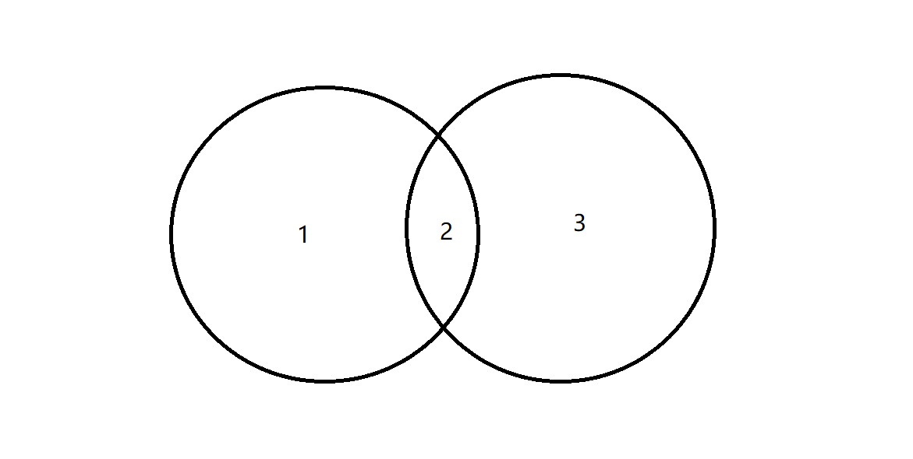

注意：下面内连接和外连接都是对上图中 1  2  3 部分进行操作，部分3 也叫幽灵订单。


#### 内连接

```sql
--内连接就是查询上图的 2
select 
	* 
from costomer c 
inner join orders o c.id = o.customer_id;

--隐式内连接
select * from customer c,orders o where c.id = o.customer_id;
```


#### 外连接

```sql
--左外连接 就是查询上图的 1 + 2
select * from customer c left join orders o on c.id=o.customer_id

--左连接的意义
--可以查询出当前系统内每个人的订单情况（大数据杀熟）（左表的数据会被全部展示出来）

--右外连接 就是查询上图的 2 + 3
select * from customer c right join orders o on c.id = o.customer_id;
--不仅返回符合查询条件的数据，还返回右表中不符合条件的其他数据（右表中的数据会全部展示出来。）
```


##### 连接查询扩展

```sql
--只查询上图的 部分1 
select 
	* 
from customer c 
lift join orders o on c.id = o.customer_id
where o.customer_id is null;


--只查询上图中 部分3 也就是幽灵订单
select
	* 
from customer c
right join orders o on c.id = o.customer_id where c.id is null;


--查询 上图全部部分 1 + 2 + 3
Select 
	* 
from customer c 
left join orders o on c.id = o.customer_id union
```


#### 子查询

```sql
select * from orders whree customer_id = (select id from customer where name = '阳光')


```


### 数据库三大范式

#### 第一范式

每列应当保证原子性。即不可以再进行分割。

比如收货地址，如果需要经常统计到省份或者城市信息，则该列的设计就不符合第一范式的要求，仍然可以进一步拆分为省份，城市。


#### 第二范式

表：学号、课程号、姓名、学分;

学分依赖课程，姓名依赖学号

这个时候，如果删除一条学分数据，会导致相应的课程数据也会被删除。同时这张表还存在数据冗余的情况。

如果数据存在部分依赖的情形，需要将字段进行拆分，拆成多个表。


需要重新拆分表：

学生表：学号、姓名

课程表：课程号

选课表：课程号、学号、学分。


#### 第三范式

不要存在冗余数据。

表: 学号, 姓名, 年龄, 学院名称, 学院电话

学生表：学号、姓名、年龄、学院号

学院表：学院名称、学院电话、学院号

每一张表在设计的时候，都应该遵循着，只关注最小的一块功能，如统计学生信息，就仅停留在学生信息中，不要过多去延伸。分工而治的思想。


# 二:JDBC

这一部分看原来的笔记，这里暂时没写。


# 三:Transaction 事务

## 什么叫事务？

事务指逻辑上的一组操作，组成这组操作的各个单元，要么全部成功，要么全部不成功。

## 事务的操作

Mysql默认情况下是自动提交事务的。


Mysql数据库在默认情况下是自动提交事务的，这点需要与oracle数据库做一个区分。Oracle数据库执行完之后，需要手动执行commit操作。

开启事务的方式：

```sql
--设置事务不自动提交
start transaction;

--对数据update修改省略 

--回滚，撤销当前对数据库的操作
rollback; 
```


### 事务的四个特性

#### ACID：原子性，一致性，隔离性，持久性。


1.**原子性**： 事务是最小的执行单位，不允许分割。事务的原子性确保动作要么全部完成，要么完全不起作用；

2.**一致性**： 执行事务前后，数据保持一致；

3.**隔离性**： 并发访问数据库时，一个用户的事物不被其他事物所干扰，各并发事务之间数据库是独立的；

4.**持久性**:  一个事务被提交之后。它对数据库中数据的改变是持久的，即使数据库发生故障也不应该对其有任何影响。


#### 隔离性做的不够好（对应于不同的隔离等级），会有哪些问题产生：

脏读：一个事务读取到了另外一个事务未提交的数据。

不可重复读：一个事务读取到了另外一个事务已经提交的数据（导致前后两次读取到的数据不一致）。

虚读：一个事务读取到了另外一个事务新增的数据。

脏读是最低级的，虚读是最高级的。


**不可重复度和幻读区别：**

不可重复读的重点是修改，幻读的重点在于新增或者删除。


#### 于此同时，数据库提供了四种不同级别的隔离等级：

Read uncommitted ：以上三种情况均不能避免

Read committed：可避免脏读的发生

Repeatable read：可避免脏读，不可重复读发生

Serializable：可避免所有问题发生（串行化，一个一个走）


数据库操作事务隔离级别：

```sql
--查看当前数据库的隔离级别
select @@transaction_isolation;

--Mysql 默认事务隔离级别
REPEATABLE-READ

--更改全局数据库隔离级别
set global transaction isolation level read uncommitted;
```


注意：

- mysql的Repeatable
- read可以避免虚读的发生。与sql标准委员会制定的标准略有不同。


# 四:DBUtils


# 五:ConnectionPool 数据库连接池 

## 什么是数据库连接池，为什么需要？

在之前的JDBC操作中，每次都需要手动去创建一个连接，并且在使用完成之后，关闭该连接。但是在真实的生产环境中，连接的创建是非常消耗性能的，花费时间较久，在多用户并发访问的时候，极容易出现数据库内存溢出，系统宕机。

解决方案，就是新建一个数据库连接池，预先在连接池里面存放一些数据库连接，当用户访问的时候，直接去连接池中去拿一个连接，而不是新创建一个。同时使用完之后，也不是直接关闭销毁，而是放回连接池。

数据库连接池和我们之前学的JDBC的操作流程有没有互相违背的地方？

JDBC中一致强调要及释放资源，关闭connection对象。连接池又说要用一个池子来保存连接，避免新建一个连接。


## 自己实现的数据库连接池存在的问题

很多API没有实现

没有扩容机制

也没有回收连接机制，存在连接池中也是一种资源浪费

## 第三方开源的数据库连接池

> 后续需要将这一部分代码放进来。

### DBCP

数据库连接池做了什么事情？简化了从之前注册驱动到获取连接这部分代码，使得代码更加健壮，能够适用真实的并发环境。

### C3P0

它能够读取到配置文件，如何读取到的？？？？

配置文件必须放到src目录下，且配置文件的名称必须为c3p0-config.xml

### Druid


> 索引这一部分可以结合guide哥的笔记看，他那个写的很全。
>
> https://snailclimb.gitee.io/javaguide/#/docs/database/MySQL

# 六.数据库索引


## 1.数据库索引是什么?他是怎么工作的?

我们通过一个简单的例子来开始教程，解释为什么我们需要数据库索引。假设我们有一个数据库表 Employee， 这个表有三个字段（列）分别是 Employee_Name、Employee_Age 和Employee_Address。假设表Employee 有上千行数据。

现在假设我们要从这个表中查找出所有名字是‘Jesus’的雇员信息。我们决定使用下面的查询语句：

```
SELECT * FROM Employee 
WHERE Employee_Name = 'Jesus'
123
```

### 如果表中没有所以会发生什么？

一旦我们运行这个查询，在查找名字为Jesus的雇员的过程中，究竟会发生什么？数据库不得不Employee表中的每一行并确定雇员的名字（Employee_Name）是否为 ‘Jesus’。由于我们想要得到每一个名字为Jesus的雇员信息，在查询到第一个符合条件的行后，不能停止查询，因为可能还有其他符合条件的行。所以，必须一行一行的查找直到最后一行-这就意味数据库不得不检查上千行数据才能找到所以名字为Jesus的雇员。这就是所谓的**全表扫描**。

### 数据库索引是怎样提升性能的？

你可能会想为如此简单的事情做全表扫描效率欠佳-数据库是不是应该更聪明一点呢？这就像用人眼从头到尾浏览整张表-很慢也不优雅（原文：not at all sleek，不知如何翻译才好）。但是，你可以能根据文章标题已经猜到，这就是索引派上用场的时候。**使用索引的全部意义就是通过缩小一张表中需要查询的记录/行的数目来加快搜索的速度**。

### 什么是索引？

一个索引是存储的表中一个特定列的值数据结构（最常见的是B-Tree）。索引是在表的列上创建。所以，要记住的关键点是索引包含一个表中列的值，并且这些值存储在一个数据结构中。**请记住记住这一点：索引是一种数据结构 。**

### 什么样的数据结构可以作为索引？

**B-Tree** 是最常用的用于索引的数据结构。因为它们是时间复杂度低， 查找、删除、插入操作都可以可以在对数时间内完成。另外一个重要原因存储在B-Tree中的数据是**有序的**。数据库管理系统（RDBMS）通常决定索引应该用哪些数据结构。但是，在某些情况下，你在创建索引时可以指定索引要使用的数据结构。

### 哈希表索引是怎么工作的？

哈希表是另外一种你可能看到用作索引的数据结构-这些索引通常被称为哈希索引。使用哈希索引的原因是，在寻找值时哈希表效率极高。所以，如果使用哈希索引，对于比较字符串是否相等的查询能够极快的检索出的值。例如之前我们讨论过的这个查询(SELECT * FROM Employee WHERE Employee_Name = ‘Jesus’) 就可以受益于创建在Employee_Name 列上的哈希索引。哈系索引的工作方式是将列的值作为索引的键值（key），和键值相对应实际的值（value）是指向该表中相应行的指针。因为哈希表基本上可以看作是关联数组，一个典型的数据项就像“Jesus => 0x28939″，而0x28939是对内存中表中包含Jesus这一行的引用。在哈系索引的中查询一个像“Jesus”这样的值，并得到对应行的在内存中的引用，明显要比扫描全表获得值为“Jesus”的行的方式快很多。

### 哈希索引的缺点

哈希表是无顺的数据结构，对于很多类型的查询语句哈希索引都无能为力。举例来说，假如你想要找出所有小于40岁的员工。你怎么使用使用哈希索引进行查询？这不可行，因为哈希表只适合查询键值对-也就是说查询相等的查询（例：like “WHERE name = ‘Jesus’）。哈希表的键值映射也暗示其键的存储是无序的。这就是为什么哈希索引通常不是数据库索引的默认数据结构-**因为在作为索引的数据结构时，其不像B-Tree那么灵活**

### 还有什么其他类型的索引？

使用R-Tree作为数据结构的索引通常用来为空间问题提供帮助。例如，一个查询要求“查询出所有距离我两公里之内的星巴克”，如果数据库表使用R- Tree索引，这类查询的效率将会提高。
另一种索引是位图索引（bitmap index）， 这类索引适合放在包含布尔值(true 和 false)的列上，但是这些值（表示true或false的值）的许多实例-基本上都是[选择性（selectivity）](http://www.programmerinterview.com/index.php/database-sql/selectivity-in-sql-databases/)低的列。

### 索引是怎么提升性能的？

因为索引基本上是用来存储列值的数据结构，这使查找这些列值更加快速。如果索引使用最常用的数据结构-B-Tree-那么其中的数据是有序的。有序的列值可以极大的提升性能。下面解释原因。

假设我们在 Employee_Name这一列上创建一个B-Tree索引。这意味着当我们用之前的SQL查找姓名是‘Jesus’的雇员时，不需要再扫描全表。而是用索引查找去查找名字为‘Jesus’的雇员，因为索引已经按照按字母顺序排序。索引**已经排序**意味着查询一个名字会快很多，因为名字少字母为‘J’的员工都是排列在一起的。另外重要的一点是，索引同时存储了表中相应行的指针以获取其他列的数据。

### 数据库索引里究竟存的是什么？

你现在已经知道数据库索引是创建在表的某列上的，并且存储了这一列的所有值。但是，需要理解的重点是**数据库索引并不存储这个表中其他列（字段）的值**。举例来说，如果我们在Employee_Name列创建索引，那么列Employee_Age和Employee_Address上的值并不会存储在这个索引当中。如果我们确实把其他所有字段也存储在个这个索引中，那就成了拷贝一整张表做为索引-这样会占用太大的空间而且会十分低效。

### 索引存储了指向表中某一行的指针

如果我们在索引里找到某一条记录作为索引的列的值，如何才能找到这一条记录的其它值呢？这是很简单 - 数据库索引同时存储了指向表中的相应行的指针。指针是指一块内存区域， 该内存区域记录的是对硬盘上记录的相应行的数据的引用。因此，索引中除了存储列的值，还存储着一个指向在行数据的索引。也就是说，索引中的Employee_Name这列的某个值（或者节点）可以描述为 (“Jesus”, 0x82829)， 0x82829 就是包含 “Jesus”那行数据在硬盘上的地址。如果没有这个引用，你就只能访问到一个单独的值（“Jesus”），而这样没有意义，因为你不能获取这一行记录的employee的其他值-例如地址（address）和年龄（age）。

### 数据库怎么知道什么时候使用索引？

当这个SQL （`SELECT * FROM Employee WHERE Employee_Name = ‘Jesus’` ）运行时，数据库会检查在查询的列上是否有索引。假设Employee_Name列上确实创建了索引，数据库会接着检查使用这个索引做查询是否合理 - 因为有些场景下，使用索引比起全表扫描会更加低效。如果想要了解更多这些场景，请阅读这篇文章：[Selectivity in SQL](http://www.programmerinterview.com/index.php/database-sql/selectivity-in-sql-databases/)

### 你能强制数据库使用索引吗？

通常来说， 你不会告诉数据库什么时候使用索引 - 数据库自己决定。然而，值得注意的是在大多数数据库中（像Oracle 和 MYSQL）， 你实际上可以制订你想要使用的索引。

### 如何在使用SQL创建索引：

之前的例子中，在Employee_Name列上创建索引的SQL如下：

```
CREATE INDEX name_index
ON Employee (Employee_Name)12
```

### 如何创建联合索引

我们可以在雇员表上创建两个列的联合索引，SQL如下：

```
CREATE INDEX name_index
ON Employee (Employee_Name, Employee_Age)12
```

### 把数据库索引类比成什么比较好呢?

一个非常好的类比是把数据库索引看作是书的索引。如果你有一本关于狗的书，你想要找关于‘黄金猎犬’的那部分。当你可以通过在书背的索引找到哪几页有关于‘黄金猎犬’信息的时候，你为什么要翻完正本书 - 这相当于数据库中的全表扫描。同样的，就像一本书的索引包含页码一样，数据库的索引包含了指针，指向你在SQL中想要查询的值所在的行。

### 使用数据库索引会有什么代价？

那么，使用数据库索引有什么缺点呢？其一，索引会占用空间 - 你的表越大，索引占用的空间越大。其二，性能损失（主要值更新操作），当你在表中添加、删除或者更新行数据的时候， 在索引中也会有相同的操作。**记住：建立在某列（或多列）索引需要保存该列最新的数据**。

**基本原则是只如果表中某列在查询过程中使用的非常频繁，那就在该列上创建索引**。

### **原文链接：**

下面这个链接是外网的,英文的,好像还挺权威!

http://www.programmerinterview.com/index.php/database-sql/what-is-an-index/


想要了解更多索引相关的知识，请参考一下链接：
http://www.programmerinterview.com/index.php/database-sql/what-is-an-index/
http://www.programmerinterview.com/index.php/database-sql/selectivity-in-sql-databases/
http://www.programmerinterview.com/index.php/database-sql/cardinality-in-sql/
http://use-the-index-luke.com/sql/preface#

## 2.数据库索引及基本优化入门


## （1）前言

   经常在面试中发现很多人工作了好多年了，项目经验也不少，用过各种数据库，但大都不知道这些SQL语句背后的基本原理，更别说数据库优化了。平时做项目只知道实现功能，懒得学习，懒得思考，懒得看书（其实本人也是，不要找借口说这是China国情，项目是给boss做的，但技术和成长是你自己的）。

   本篇文章主要讲述数据库索引的基本原理，及基本的数据库优化的知识。所有知识均为本人自己学习的总结以及网络。此篇文章主要是为公司内部人员培训所用的，整理出来只是希望和大家分享、交流，因本人技术有限，若有遗漏、错误，希望多多指正、交流。

------

 

## （2）基础知识

### 2.1 页

   数据库文件存储是已页为存储单元的，一个页是8K（8192Byte），一个页就可以存放N行数据。我们常用的页类型就是数据页和索引页。一个页中除了存放基本数据之外还需要存放一些其他的数据，如页的信息、偏移量等，如下图所示。

   虽然SQLServer是以页为单位存储数据，但是其分配空间是以一个盘区为单位的（8个页=64K），这样做的目的主要是为提高I/O的性能。

 

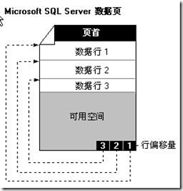

### 2.2 B树

   B树即二叉搜索树，所有非叶子节点最低拥有两个子节点，基本信息如下图所示。都是小的元素放左边，大的元素放右边。比如说要查找某个元素，其时间复杂度就对应该元素的深度，如要查询9，从根节点开始，只要比较三次就找到他了，其查询效率是非常高的。

   子节点：最多两个子节点（指针分别指向Left和Right）

阶数（节点子节点个数）：2

深度：就是层数，各个叶子节点不一定一样，如节点21的深度为4，40的深度为3

 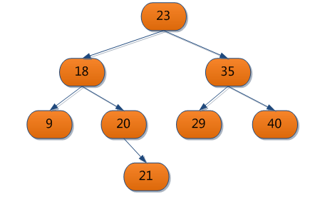

### 2.2 B-树

B-树是一中多路搜索树，其阶数可以自定义（>2)，是很多数据及文件系统应用的一种索引结构，基本特征如：

1) 阶数（M）>2，即孩子数量大于2个

2) 每个结点存放至少M/2-1（取上整）和至多M-1个关键字；（至少2个关键字）

3) 非叶子结点上的多个关键字是按照顺序排列的：K[1], K[2], …, K[M-1]；且K[i] < K[i+1]；

4) 所有叶子节点都位于同一层，因此叶子节点的深度都是一样的

5) 非叶子结点的关键字个数=指向儿子的指针个数-1；

6) 非叶子结点的指针：P[1], P[2], …, P[M]；其中P[1]指向关键字小于K[1]的子树，P[M]指向关键字大于K[M-1]的子树，其它P[i]指向关键字属于(K[i-1], K[i])的子树；

如下图是一个三阶的B-树，节点[18]有两个指针分别指向其2个子节点。

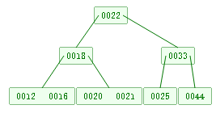

 

这时如果要插入一个值17，其处理步骤：

1) 从根节点进入，17小于22，进入左边的节点[18];

2) [18]不是叶子节点，继续向下搜索，17小于18，进入其左边的子节点[12,16];

3) [12,16]为叶子节点，插入到该节点；

4) 节点[12,16,17]元素大于2了（3阶树的节点关键字数量应>3/2-1,<3-1），因此该节点需要分裂，分裂中间的元素16到父节点18中去；

5) 12,17分裂成了两个子节点了；

分裂后的效果如下图

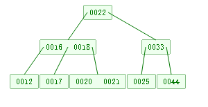

   以上图片效果来自一个外国大学里面的的在线版B-树的测试，网站：http://www.cs.usfca.edu/~galles/visualization/BTree.html ，大家可以去这个网站测试，效果很直观，外国人就是牛。本人以前用C#+GDI实现过类似的效果，结果还是可以的，就是当树太大的时候，布局不好处理了。

了解华登区块狗加Holy_song_myth

 

### 2.3 B+树

B+树是B-树的变体，也是一种多路搜索树，一棵m 阶的B+树和m 阶的B-树的差异在于： 

l 非叶子节点的子节点和其关键字相同，即节点有三个元素（关键字），他就肯定有三个子节点； 

l 非叶子节点的子节点P[i]，指向关键字值属于[K[i], K[i+1])的子树（B-树是开区间）； 

l 所有叶子节点增加一个链指针； 

l 所有关键字的数据都在叶子节点中；

 如下图所示，图片来自网络（http://www.cnblogs.com/chjw8016/archive/2011/03/08/1976891.html）。

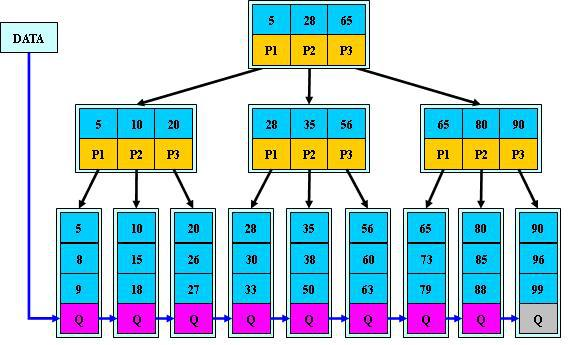

 

------

 

## （3）索引存储

   B+树和B-树是数据库广发应用的索引存储结构，它可以极大的提高数据查找的效率。关于B-树、B+树的原理与应用的详细可以参考文档：http://blog.csdn.net/hguisu/article/details/7786014

前面2.1中我们讲了SQLServer中使用页为存储单元的，那么在建立索引时，其索引节点就是页了，然后树的键值就是存放到这些页（节点）中的。就是说表中的数据行就是存放到页上的，一个表有多个页构成，这些页以树的结构存放。

### 3.1 聚集索引

   如下图为聚集索引的存储结构（图片来自网络）。其中可以看出页有两种：Index Rows（索引页）、data rows（数据页），所有非叶子节点都存放着索引项，数据行是存放在叶子节点中的，只有叶子节点才真实存放着表中的每一行数据，而其他非叶子节点的页都存放着聚集索引的键值。因此查询数据的时间复杂度都是一样的，就是该树的深度。

   在4.2中有说明，聚集索引决定了表数据的存储顺序，具体可以参考4.2。若表没有创建聚集索引，则表数据时一个无序的堆结构。

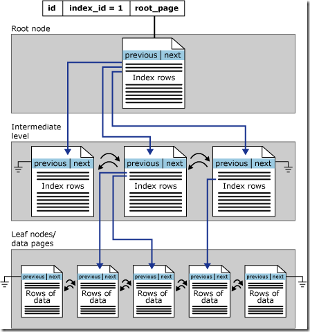

### 3.2 非聚集索引

   与非聚集索引的存储结构唯一不一样的，就是非聚集索引中不存储真正的数据行，因为在聚集索引中已经存放了数据，非聚集索引只包含一个指向数据行的指针即可。如下图所示（图片来源：http://www.cnblogs.com/ashou706/archive/2010/06/08/1754164.html）：

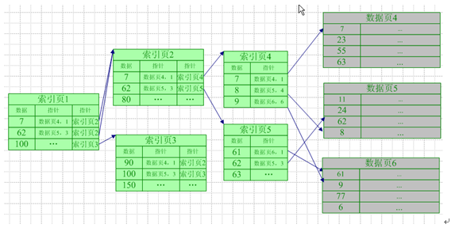

 

------

 

### （4）数据库优化

   数据库优化的一个重要参数指标就是“逻辑读”（Logical Reads），可以使用命令SET STATISTICS IO ON来打开消息提示，如下图所示。

**逻辑读（Logical Reads)：**我们在查询数据时，数据时从缓冲区（内存）中读取的，而不是直接从磁盘读取数据的。数据库会预先把数据读取到数据缓冲区中，存放到8K字节的页中。逻辑读就是从缓冲区中读取页的页数，这个才是真正反映查询效率的指标，一般情况下，一个查询的逻辑读越小，其效率越高、速度就越快。同时，同样的SQL查询同样数据集，每次的逻辑读是一样的。

   **物理读取（Physical Reads)：**真正的从磁盘读取数据到期缓冲区，在SQLServer执行查询前，会先检查其需要的数据是否在缓冲区中，若不在，就会从磁盘读取数据到缓冲区。这一块是数据库本身的职责，我们在做查询优化的时候不用太关注的，只要给数据库服务器提供足够的内存就OK了。

   **预读（Read-Ahead Reads)：**数据库为优化查询，预先读取一部分数据，这个值在优化中可以不用关注。由于存储介质的特性，磁盘本身存取就比主存慢很多，再加上机械运动耗费，磁盘的存取速度往往是主存的几百分分之一，因此为了提高效率，要尽量减少磁盘I/O。为了达到这个目的，磁盘往往不是严格按需读取，而是每次都会预读，即使只需要一个字节，磁盘也会从这个位置开始，顺序向后读取一定长度的数据放入内存。由于磁盘顺序读取的效率很高（不需要寻道时间，只需很少的旋转时间），因此对于具有局部性的程序来说，预读可以提高I/O效率。

   数据优化的一个主要手段就是查看SQL的执行计划，通过查看具体SQL执行过程，可以看出索引的使用是否正确，了解查询中性能问题在哪，从而解决问题。

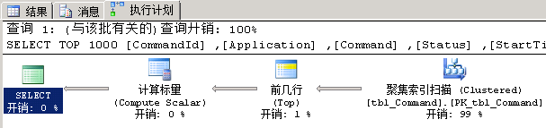

 

#### 4.1 T-SQL优化基本常识

1.在Where条件中尽量不要在=号左边进行函数、运算符、或表达式计算，如Where DATEDIFF(DD,StartTime,GetDate())=6  ；或Where Num/2=100;

2.在Where中尽量避免出现！=或<>操作符；

3.在Where中尽量避免对字段进行null值判定；

4.使用Like关键字进行模糊查找时，不要使用前置百分号，如Like ‘%123%’；

5.数据库字段的长度尽量的小（保证应用的前提下）；

6.不要使用Selecte*，不要使用*号来查询数据；

7.尽量避免使用游标，游标的效率是很差的，可以使用While循环来代替；

8.尽量避免返回大量数据（查询数据(Select)优化，分页处理等）；

9.使用Exists代替in和not in；

#### 4.2 聚集索引

   聚集索引决定了表数据的物理存储顺序，也就是说表的物理存储时根据聚集索引结构进行顺序存储的，因此一个表只能有一个聚集索引，SQLServer的聚集索引属性如下图。

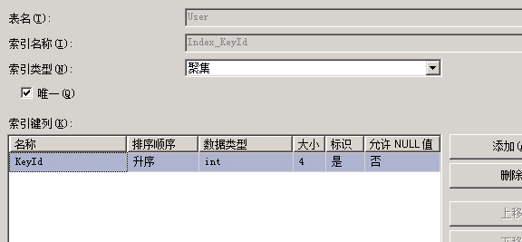

 

该索引的的创建脚本：


```html
/****** Object:  Index [Index_KeyId]    Script Date: 08/12/2013 15:25:59 ******/CREATE UNIQUE CLUSTERED INDEX [Index_KeyId] ON [dbo].[User] (    [KeyId] ASC)WITH (PAD_INDEX  = OFF, STATISTICS_NORECOMPUTE  = OFF, SORT_IN_TEMPDB = OFF, IGNORE_DUP_KEY = OFF, DROP_EXISTING = OFF, ONLINE = OFF, ALLOW_ROW_LOCKS  = ON, ALLOW_PAGE_LOCKS  = ON) ON [PRIMARY]GO
```


 

　　因此我们可以得出一个个结论：根据聚集索引的查找效率是比较高的。若表没有建立聚集索引，则表的数据存储是乱的，数据就是一个堆，没有任何顺序可言，对表的查询经常会扫描全表，造成性能较低。一般我们在实际使用中，大多会对主键建立聚集索引，一般这么做就足够了，但实际应用应该尊从一个原则就是“频繁使用的、排序的字段上”，如果要深究的话，可以参见文章结尾的参考目录其他同学的文章。 

　　对应与聚集索引，所有其他的索引可以统称为非聚集索引，非聚集索引的创建会单独创建索引文件来存储索引结构，因此在创建其他索引的时候也要注意硬盘空间。比如一个表的容量是2000w行，大概有800Mb，创建的一个非聚集索引可能数据立马增加好几个G。具体如下4.3、4.4所述。 

### 4.3 覆盖索引

   覆盖索引就是在原本索引的基础上，把Select中需要的字段放到索引包含列中，这样就不需要再到数据表中读取数据了，这个就叫做覆盖索引了。 比如，我们查询User表中的字段UserName、Age，其中UserName上创建了非聚集索引，查询语句及索引脚本如下：


```html
Select UserName,Age from [User] where UserName ='Ryan'--UserName的索引CREATE UNIQUE NONCLUSTERED INDEX [Index_UserName] ON [dbo].[User] (    [UserName] ASC)WITH (PAD_INDEX  = OFF, STATISTICS_NORECOMPUTE  = OFF, SORT_IN_TEMPDB = OFF, IGNORE_DUP_KEY = OFF, DROP_EXISTING = OFF, ONLINE = OFF, ALLOW_ROW_LOCKS  = ON, ALLOW_PAGE_LOCKS  = ON) ON [PRIMARY]GO
```


通过UserName条件查询到数据后，还需要Age字段的值，该非聚集索引没有她的数据，还要到数据页中取其Age数据（就是图中的键查找），这样会造成额外的开销，查询计划如下图。

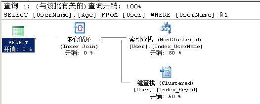

若把Age放到该索引的包含列中，该索引就会包含Age的值，查询的时候就可以直接返回UserName、Age的值了，UserName、Age的覆盖索引脚本及SQLServer的管理视图如下：

 


```html
CREATE UNIQUE NONCLUSTERED INDEX [Index_UserName] ON [dbo].[User] (    [UserName] ASC)INCLUDE ( [Age]) WITH (PAD_INDEX  = OFF, STATISTICS_NORECOMPUTE  = OFF, SORT_IN_TEMPDB = OFF, IGNORE_DUP_KEY = OFF, DROP_EXISTING = OFF, ONLINE = OFF, ALLOW_ROW_LOCKS  = ON, ALLOW_PAGE_LOCKS  = ON) ON [PRIMARY]GO
```


创建了覆盖索引后的查询效率明显高了，执行计划如下图，其中就没有了循环键查找了：

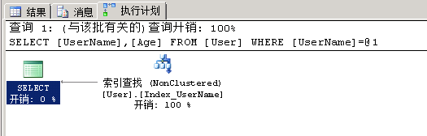

关于覆盖索引更详细的文章，可以参考文章：[SQL Server 查询性能优化——覆盖索引](http://www.cnblogs.com/chillsrc/archive/2012/09/04/2671092.html)

 

### 4.4 复合索引

在上面的索引例子中都只是在一个键上建立索引，但实际情况中往往一个查询会有多个查询条件，如下的sql语句中，多了条件Password：

```html
Select UserName,Age from [User] where UserName ='Ryan' and Password='123456'
```

该索引中是没有关于Password字段的任何信息，因此查询也会引发键查找，查询计划如下图

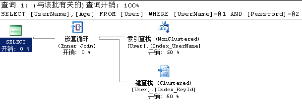

对于这种情况，复合索引的用途就来了，简单来所，复合索引就是在多个列上建立索引。Sql脚本及SqlServer的索引属性视图如下：


```html
CREATE UNIQUE NONCLUSTERED INDEX [Index_UserName] ON [dbo].[User] (    [UserName] ASC,    [Password] ASC)INCLUDE ( [Age]) WITH (PAD_INDEX  = OFF, STATISTICS_NORECOMPUTE  = OFF, SORT_IN_TEMPDB = OFF, IGNORE_DUP_KEY = OFF, DROP_EXISTING = OFF, ONLINE = OFF, ALLOW_ROW_LOCKS  = ON, ALLOW_PAGE_LOCKS  = ON) ON [PRIMARY]GO
```


创建复合索引后再次执行刚的查询，观看查询计划，查询有明显的改善：

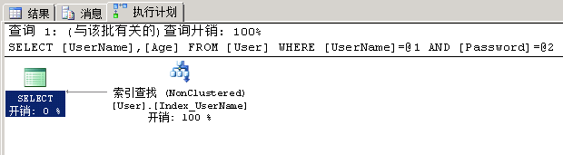

在使用复合索引时，应注意多个索引键的顺序问题，这个是会影响查询效率的，一般的原则是唯一性高的放前面，还有就是SQl语句中Where条件的顺序应该和索引顺序一致。

### 4.5 页填充因子

   通过前面的了解我们知道数据时存放到树上的页中，当插入数据时，如果该页已经存储满了，就要进行页的拆分，频繁的拆分，会产生较多的索引碎片，影响修改和查询数据的效率。

   填充因子就是用来描述这种页中填充数据的一个比例，一般默认是100%填充的。如果我们修改填充因子为80%，那么页在存储数据时，就会剩余20%的剩余空间，这样在下次插入的时候就不会拆分页了。 那么是不是我们可以把填充因子设置第一点，留更多的剩余空间，不是很好嘛？当然也不好，填充因子设置的低，会需要分配更多的存储空间，叶子节点的深度会增加，这样是会影响查询效率的，因此，这是要根据实际情况而定的。那么一般我们是怎么设置填充因子的呢，主要根据表的读写比例而定的。如果读的多，填充因子可以设置高一点，如100%，读写各一半，可以80~90%；更改多可以设置50~70%。SQlServer的的索引属性中有一个设置填充因子的项，如下图。

更详细的信息可以参考：http://www.cnblogs.com/cxd4321/archive/2010/08/16/1800677.html

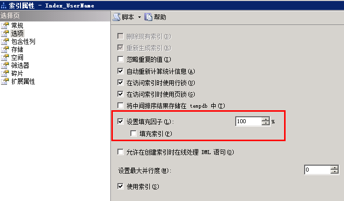

### 4.6 索引碎片

   我们在前面了解到索引的结构就是B树，当树在增加、删除的时候，会触发页的拆分或合并，这种频繁的操作会产生索引碎片，造成索引不连续，当索引碎片曾多时，是会影响查询效率的。因此，访问使用的是随机的i/o，而不是有顺序的i/o，这样访问索引页会变得更慢。因此要定期的清理索引碎片，一般的方法就是重建索引。关于索引碎片的整理，可参考：http://www.cnblogs.com/mywebname/archive/2007/11/13/958463.html 


### 4.7 索引优化注意事项

Ø 建立索引的字段尽量的小，最好是数值；

Ø 尽量在唯一性高的字段上创建索引，不要在性别这种唯一性很低的字段上创建索引；

了解华登区块狗加Holy_song_myth


> Sql优化 这一部分没学完，后续需要重新整理一下这里笔记，现在很乱
>
> https://www.bilibili.com/video/av29072634/?p=5
>
> 这一部分，后续需要看看敖丙，3y，guide哥的文章，完善一下这一部分。

# 七.数据库SQL优化 

自己找的 面试题里面也有优化

这个视频是在bilibili上面找的https://www.bilibili.com/video/av29072634/?p=5! 讲的还行!笔记在github上面,星里面!下载下来的笔记在总结里面!

## (1).MySQL版本：

5.x:
5.0-5.1:早期产品的延续，升级维护
5.4 - 5.x :  MySQL整合了三方公司的新存储引擎 （推荐5.5）
	

安装：rpm -ivh rpm软件名
	如果安装时 与某个软件  xxx冲突，则需要将冲突的软件卸载掉：
		yun -y remove xxx
	安装时 有日志提示我们可以修改密码：/usr/bin/mysqladmin -u root password 'new-password'

注意： 
		如果提示“GPG keys...”安装失败，解决方案：
		rpm -ivh rpm软件名  --force --nodoeps
	
验证：
mysqladmin --version

启动mysql应用： service mysql start
关闭： service mysql stop
重启： service mysql restart

在计算机reboot后 登陆MySQL :  mysql
可能会报错：   "/var/lib/mysql/mysql.sock不存在"  
--原因：是Mysql服务没有启动
解决 ：  启动服务： 1.每次使用前 手动启动服务   /etc/init.d/mysql start
	  	 2.开机自启   chkconfig mysql on     ,  chkconfig mysql off    
	检查开机是否自动启动： ntsysv		
	
给mysql 的超级管理员root 增加密码：/usr/bin/mysqladmin -u root password root
				
登陆：
mysql -u root -p

数据库存放目录：
ps -ef|grep mysql  可以看到：
	数据库目录：     datadir=/var/lib/mysql 
	pid文件目录： --pid-file=/var/lib/mysql/bigdata01.pid

​	MySQL核心目录：
​		/var/lib/mysql :mysql 安装目录
​		/usr/share/mysql:  配置文件
​		/usr/bin：命令目录（mysqladmin、mysqldump等）
​		/etc/init.d/mysql启停脚本
​		
  MySQL配置文件
​		 my-huge.cnf	高端服务器  1-2G内存
​		 my-large.cnf   中等规模
​		 my-medium.cnf  一般
​		 my-small.cnf   较小
​		但是，以上配置文件mysql默认不能识别，默认只能识别 /etc/my.cnf
​		采用 my-huge.cnf ：
​		cp /usr/share/mysql/my-huge.cnf /etc/my.cnf
​		注意：mysql5.5默认配置文件/etc/my.cnf；Mysql5.6 默认配置文件/etc/mysql-default.cnf
​		
默认端口3306
mysql字符编码：
​	sql  :  show variables like '%char%' ;
​	可以发现部分编码是 latin,需要统一设置为utf-8
​	设置编码：
​	vi /etc/my.cnf:
​	[mysql]
​	default-character-set=utf8
​	[client]
​	default-character-set=utf8
​	
​	[mysqld]
​	character_set_server=utf8
​	character_set_client=utf8
​	collation_server=utf8_general_ci

重启Mysql:  service mysql restart
	sql  :  show variables like '%char%' ;
注意事项：修改编码 只对“之后”创建的数据库生效，因此 我们建议 在mysql安装完毕后，第一时间 统一编码。

mysql:清屏    ctrl+L    , system clear

## (2).原理

  MYSQL逻辑分层 ：连接层 服务层 引擎层 存储层

​	  InnoDB(默认) ：事务优先 （适合高并发操作；行锁）
 	 MyISAM ：性能优先  （表锁）

查询数据库引擎：  支持哪些引擎？ show engines ;
		查看当前使用的引擎   show variables like '%storage_engine%' ;

指定数据库对象的引擎：
create table tb(
		id int(4) auto_increment ,
		name varchar(5),
		dept varchar(5) ,
		primary key(id)		
)ENGINE=MyISAM AUTO_INCREMENT=1
 DEFAULT CHARSET=utf8   ;

## (3).SQL优化

​	原因：性能低、执行时间太长、等待时间太长、SQL语句欠佳（连接查询）、索引失效、服务器参数设置不合理（缓冲、线程数）


**SQL编写过程和执行过程不一样!**

**a.SQL ：**
	编写过程：(sinstinct去重!)
		select dinstinct  ..from  ..join ..on ..where ..group by ...having ..order by ..limit ..

​	解析过程：			
​		from .. on.. join ..where ..group by ....having ...select dinstinct ..order by limit ...


**b.SQL优化， 主要就是 在优化索引**
	索引： 相当于书的目录
	索引： index是帮助MYSQL高效获取数据的数据结构。索引是数据结构（树：B树(默认)、Hash树...）

​	索引的**弊端**：
​		1.**索引本身很大**， 可以存放在内存/硬盘（通常为 硬盘）
​		2.索引不是所有情况均适用： a.少量数据  b.频繁更新的字段   c.很少使用的字段
​		3.索引会降低增删改的效率（增删改  查）

​	**优势**：1提高查询效率（降低IO使用率）
​	      2.降低CPU使用率 （...order by age desc,因为 B树索引 本身就是一个 好排序的结构，因此在排序时  可以直接使用）

**这里要用到数据结构的B树!**

假如第一个为索引的第一个节点!

B树:

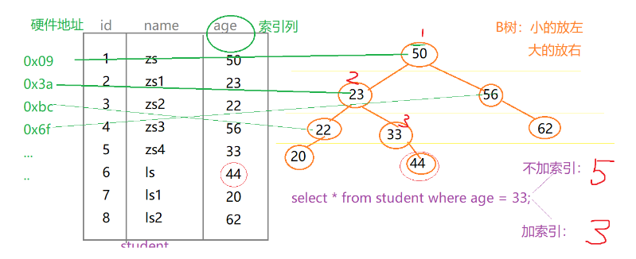

B树索引原理:

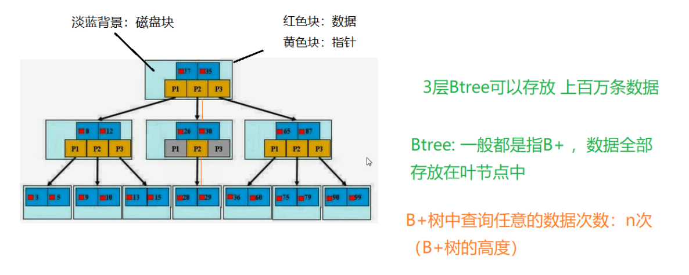

### **SQL解析顺序:**

这里是原文链接!https://www.cnblogs.com/annsshadow/p/5037667.html

　　一直是想知道一条SQL语句是怎么被执行的，它执行的顺序是怎样的，然后查看总结各方资料，就有了下面这一篇博文了。

　　本文将从MySQL总体架构--->查询执行流程--->语句执行顺序来探讨一下其中的知识。


#### **一、MySQL架构总览：**

　　架构最好看图，再配上必要的说明文字。

　　下图根据参考书籍中一图为原本，再在其上添加上了自己的理解。

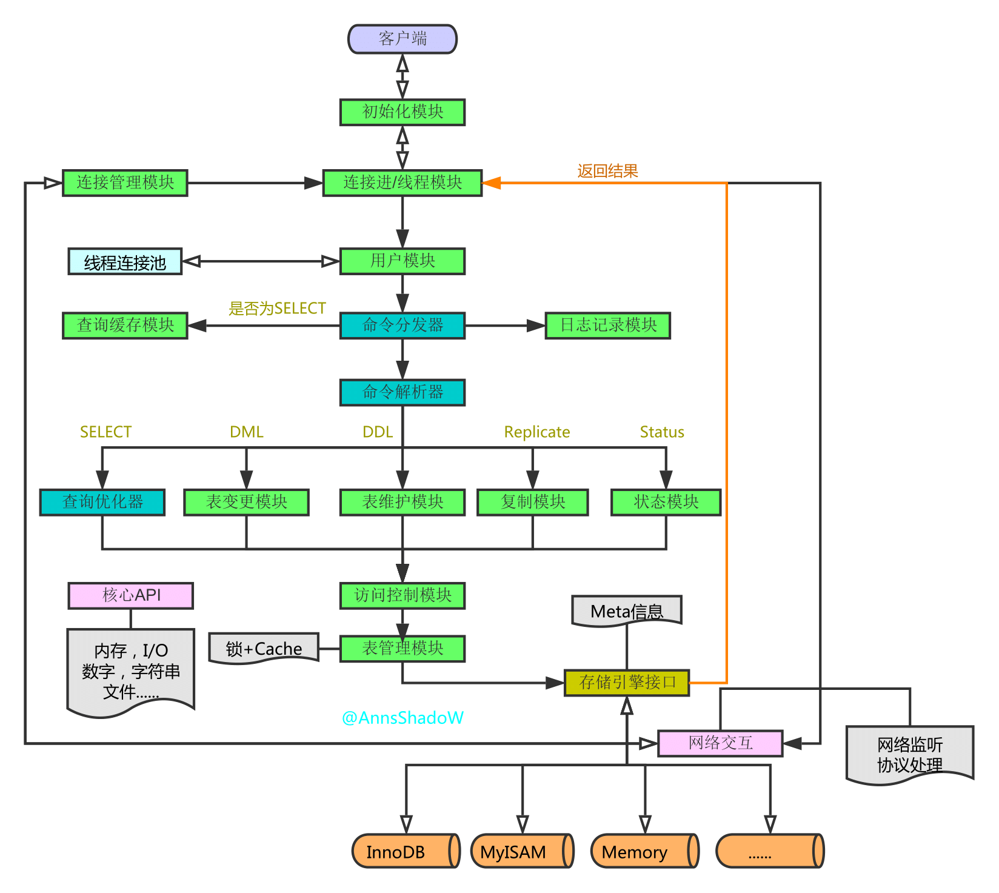

 

　　从上图中我们可以看到，整个架构分为两层，上层是MySQLD的被称为的‘SQL Layer’，下层是各种各样对上提供接口的存储引擎，被称为‘Storage Engine Layer’。其它各个模块和组件，从名字上就可以简单了解到它们的作用，这里就不再累述了。

 

#### **二、查询执行流程**

　　下面再向前走一些，容我根据自己的认识说一下查询执行的流程是怎样的：

**1.连接**

　　1.1客户端发起一条Query请求，监听客户端的‘连接管理模块’接收请求

　　1.2将请求转发到‘连接进/线程模块’

　　1.3调用‘用户模块’来进行授权检查

　　1.4通过检查后，‘连接进/线程模块’从‘线程连接池’中取出空闲的被缓存的连接线程和客户端请求对接，如果失败则创建一个新的连接请求

 

**2.处理**

　　2.1先查询缓存，检查Query语句是否完全匹配，接着再检查是否具有权限，都成功则直接取数据返回

　　2.2上一步有失败则转交给‘命令解析器’，经过词法分析，语法分析后生成解析树

　　2.3接下来是预处理阶段，处理解析器无法解决的语义，检查权限等，生成新的解析树

　　2.4再转交给对应的模块处理

　　2.5如果是SELECT查询还会经由‘查询优化器’做大量的优化，生成执行计划

　　2.6模块收到请求后，通过‘访问控制模块’检查所连接的用户是否有访问目标表和目标字段的权限

　　2.7有则调用‘表管理模块’，先是查看table cache中是否存在，有则直接对应的表和获取锁，否则重新打开表文件

　　2.8根据表的meta数据，获取表的存储引擎类型等信息，通过接口调用对应的存储引擎处理

　　2.9上述过程中产生数据变化的时候，若打开日志功能，则会记录到相应二进制日志文件中

 

**3.结果**

　　3.1Query请求完成后，将结果集返回给‘连接进/线程模块’

　　3.2返回的也可以是相应的状态标识，如成功或失败等

　　3.3‘连接进/线程模块’进行后续的清理工作，并继续等待请求或断开与客户端的连接

 

**一图小总结**

**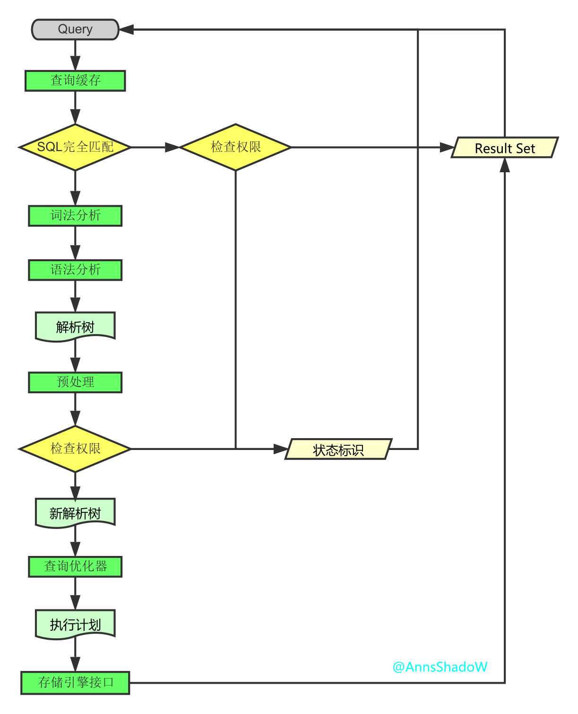**

 

 

**三、SQL解析顺序**

　　接下来再走一步，让我们看看一条SQL语句的前世今生。

　　首先看一下示例语句

[](javascript:void(0);)

```
SELECT DISTINCT
    < select_list >
FROM
    < left_table > < join_type >
JOIN < right_table > ON < join_condition >
WHERE
    < where_condition >
GROUP BY
    < group_by_list >
HAVING
    < having_condition >
ORDER BY
    < order_by_condition >
LIMIT < limit_number >

```

[](javascript:void(0);)

　　然而它的执行顺序是这样的

[](javascript:void(0);)

```
 1 FROM <left_table>
 2 ON <join_condition>
 3 <join_type> JOIN <right_table>
 4 WHERE <where_condition>
 5 GROUP BY <group_by_list>
 6 HAVING <having_condition>
 7 SELECT 
 8 DISTINCT <select_list>
 9 ORDER BY <order_by_condition>
10 LIMIT <limit_number>

```

[](javascript:void(0);)

　　虽然自己没想到是这样的，不过一看还是很自然和谐的，从哪里获取，不断的过滤条件，要选择一样或不一样的，排好序，那才知道要取前几条呢。

既然如此了，那就让我们一步步来看看其中的细节吧。

 

**准备工作**

　　1.创建测试数据库

```
create database testQuery

```

　　2.创建测试表

[](javascript:void(0);)

```
CREATE TABLE table1
(
    uid VARCHAR(10) NOT NULL,
    name VARCHAR(10) NOT NULL,
    PRIMARY KEY(uid)
)ENGINE=INNODB DEFAULT CHARSET=UTF8;

CREATE TABLE table2
(
    oid INT NOT NULL auto_increment,
    uid VARCHAR(10),
    PRIMARY KEY(oid)
)ENGINE=INNODB DEFAULT CHARSET=UTF8;

```

[](javascript:void(0);)

　　3.插入数据

```
INSERT INTO table1(uid,name) VALUES('aaa','mike'),('bbb','jack'),('ccc','mike'),('ddd','mike');

INSERT INTO table2(uid) VALUES('aaa'),('aaa'),('bbb'),('bbb'),('bbb'),('ccc'),(NULL);

```

　　4.最后想要的结果

[](javascript:void(0);)

```
SELECT
    a.uid,
    count(b.oid) AS total
FROM
    table1 AS a
LEFT JOIN table2 AS b ON a.uid = b.uid
WHERE
    a. NAME = 'mike'
GROUP BY
    a.uid
HAVING
    count(b.oid) < 2
ORDER BY
    total DESC
LIMIT 1;

```

[](javascript:void(0);)

 

！现在开始SQL解析之旅吧！

 

**1. FROM**

当涉及多个表的时候，左边表的输出会作为右边表的输入，之后会生成一个虚拟表VT1。

(1-J1)笛卡尔积

计算两个相关联表的笛卡尔积(CROSS JOIN) ，生成虚拟表VT1-J1。

[](javascript:void(0);)

```
mysql> select * from table1,table2;
+-----+------+-----+------+
| uid | name | oid | uid  |
+-----+------+-----+------+
| aaa | mike |   1 | aaa  |
| bbb | jack |   1 | aaa  |
| ccc | mike |   1 | aaa  |
| ddd | mike |   1 | aaa  |
| aaa | mike |   2 | aaa  |
| bbb | jack |   2 | aaa  |
| ccc | mike |   2 | aaa  |
| ddd | mike |   2 | aaa  |
| aaa | mike |   3 | bbb  |
| bbb | jack |   3 | bbb  |
| ccc | mike |   3 | bbb  |
| ddd | mike |   3 | bbb  |
| aaa | mike |   4 | bbb  |
| bbb | jack |   4 | bbb  |
| ccc | mike |   4 | bbb  |
| ddd | mike |   4 | bbb  |
| aaa | mike |   5 | bbb  |
| bbb | jack |   5 | bbb  |
| ccc | mike |   5 | bbb  |
| ddd | mike |   5 | bbb  |
| aaa | mike |   6 | ccc  |
| bbb | jack |   6 | ccc  |
| ccc | mike |   6 | ccc  |
| ddd | mike |   6 | ccc  |
| aaa | mike |   7 | NULL |
| bbb | jack |   7 | NULL |
| ccc | mike |   7 | NULL |
| ddd | mike |   7 | NULL |
+-----+------+-----+------+
28 rows in set (0.00 sec)

```

[](javascript:void(0);)

 

(1-J2)ON过滤

基于虚拟表VT1-J1这一个虚拟表进行过滤，过滤出所有满足ON 谓词条件的列，生成虚拟表VT1-J2。

注意：这里因为语法限制，使用了'WHERE'代替，从中读者也可以感受到两者之间微妙的关系；

[](javascript:void(0);)

```
mysql> SELECT
    -> *
    -> FROM
    -> table1,
    -> table2
    -> WHERE
    -> table1.uid = table2.uid
    -> ;
+-----+------+-----+------+
| uid | name | oid | uid  |
+-----+------+-----+------+
| aaa | mike |   1 | aaa  |
| aaa | mike |   2 | aaa  |
| bbb | jack |   3 | bbb  |
| bbb | jack |   4 | bbb  |
| bbb | jack |   5 | bbb  |
| ccc | mike |   6 | ccc  |
+-----+------+-----+------+
6 rows in set (0.00 sec)

```

[](javascript:void(0);)

 

(1-J3)添加外部列

如果使用了外连接(LEFT,RIGHT,FULL)，主表（保留表）中的不符合ON条件的列也会被加入到VT1-J2中，作为外部行，生成虚拟表VT1-J3。

[](javascript:void(0);)

```
mysql> SELECT
    -> *
    -> FROM
    -> table1 AS a
    -> LEFT OUTER JOIN table2 AS b ON a.uid = b.uid;
+-----+------+------+------+
| uid | name | oid  | uid  |
+-----+------+------+------+
| aaa | mike |    1 | aaa  |
| aaa | mike |    2 | aaa  |
| bbb | jack |    3 | bbb  |
| bbb | jack |    4 | bbb  |
| bbb | jack |    5 | bbb  |
| ccc | mike |    6 | ccc  |
| ddd | mike | NULL | NULL |
+-----+------+------+------+
7 rows in set (0.00 sec)

```

[](javascript:void(0);)

 

下面从网上找到一张很形象的关于‘SQL JOINS'的解释图，如若侵犯了你的权益，请劳烦告知删除，谢谢。

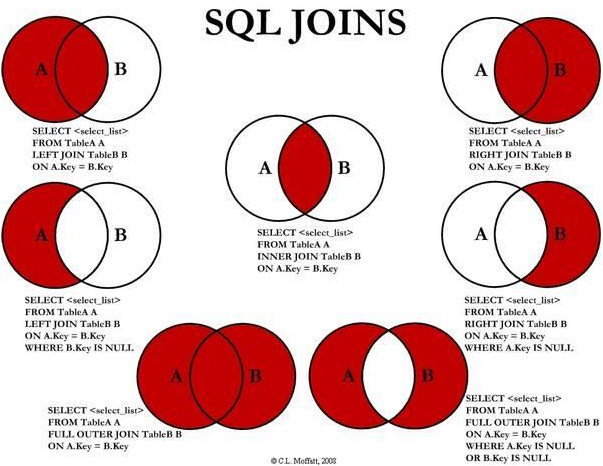

 

 

**2. WHERE**

对VT1过程中生成的临时表进行过滤，满足WHERE子句的列被插入到VT2表中。

注意：

此时因为分组，不能使用聚合运算；也不能使用SELECT中创建的别名；

与ON的区别：

如果有外部列，ON针对过滤的是关联表，主表（保留表）会返回所有的列；

如果没有添加外部列，两者的效果是一样的；

应用：

对主表的过滤应该放在WHERE；

对于关联表，先条件查询后连接则用ON，先连接后条件查询则用WHERE；

[](javascript:void(0);)

```
mysql> SELECT
    -> *
    -> FROM
    -> table1 AS a
    -> LEFT OUTER JOIN table2 AS b ON a.uid = b.uid
    -> WHERE
    -> a. NAME = 'mike';
+-----+------+------+------+
| uid | name | oid  | uid  |
+-----+------+------+------+
| aaa | mike |    1 | aaa  |
| aaa | mike |    2 | aaa  |
| ccc | mike |    6 | ccc  |
| ddd | mike | NULL | NULL |
+-----+------+------+------+
4 rows in set (0.00 sec)

```

[](javascript:void(0);)

 

**3. GROUP BY**

这个子句会把VT2中生成的表按照GROUP BY中的列进行分组。生成VT3表。

注意：

其后处理过程的语句，如SELECT,HAVING，所用到的列必须包含在GROUP BY中，对于没有出现的，得用聚合函数；

原因：

GROUP BY改变了对表的引用，将其转换为新的引用方式，能够对其进行下一级逻辑操作的列会减少；

我的理解是：

根据分组字段，将具有相同分组字段的记录归并成一条记录，因为每一个分组只能返回一条记录，除非是被过滤掉了，而不在分组字段里面的字段可能会有多个值，多个值是无法放进一条记录的，所以必须通过聚合函数将这些具有多值的列转换成单值；

[](javascript:void(0);)

```
mysql> SELECT
    -> *
    -> FROM
    -> table1 AS a
    -> LEFT OUTER JOIN table2 AS b ON a.uid = b.uid
    -> WHERE
    -> a. NAME = 'mike'
    -> GROUP BY
    -> a.uid;
+-----+------+------+------+
| uid | name | oid  | uid  |
+-----+------+------+------+
| aaa | mike |    1 | aaa  |
| ccc | mike |    6 | ccc  |
| ddd | mike | NULL | NULL |
+-----+------+------+------+
3 rows in set (0.00 sec)

```

[](javascript:void(0);)

 

**4. HAVING**

这个子句对VT3表中的不同的组进行过滤，只作用于分组后的数据，满足HAVING条件的子句被加入到VT4表中。

[](javascript:void(0);)

```
mysql> SELECT
    -> *
    -> FROM
    -> table1 AS a
    -> LEFT OUTER JOIN table2 AS b ON a.uid = b.uid
    -> WHERE
    -> a. NAME = 'mike'
    -> GROUP BY
    -> a.uid
    -> HAVING
    -> count(b.oid) < 2;
+-----+------+------+------+
| uid | name | oid  | uid  |
+-----+------+------+------+
| ccc | mike |    6 | ccc  |
| ddd | mike | NULL | NULL |
+-----+------+------+------+
2 rows in set (0.00 sec)

```

[](javascript:void(0);)

 

**5. SELECT**

这个子句对SELECT子句中的元素进行处理，生成VT5表。

(5-J1)计算表达式 计算SELECT 子句中的表达式，生成VT5-J1

(5-J2)DISTINCT

寻找VT5-1中的重复列，并删掉，生成VT5-J2

如果在查询中指定了DISTINCT子句，则会创建一张内存临时表（如果内存放不下，就需要存放在硬盘了）。这张临时表的表结构和上一步产生的虚拟表VT5是一样的，不同的是对进行DISTINCT操作的列增加了一个唯一索引，以此来除重复数据。

[](javascript:void(0);)

```
mysql> SELECT
    -> a.uid,
    -> count(b.oid) AS total
    -> FROM
    -> table1 AS a
    -> LEFT OUTER JOIN table2 AS b ON a.uid = b.uid
    -> WHERE
    -> a. NAME = 'mike'
    -> GROUP BY
    -> a.uid
    -> HAVING
    -> count(b.oid) < 2;
+-----+-------+
| uid | total |
+-----+-------+
| ccc |     1 |
| ddd |     0 |
+-----+-------+
2 rows in set (0.00 sec)

```

[](javascript:void(0);)

 

**6.ORDER BY**

从VT5-J2中的表中，根据ORDER BY 子句的条件对结果进行排序，生成VT6表。

注意：

唯一可使用SELECT中别名的地方；

[](javascript:void(0);)

```
mysql> SELECT
    -> a.uid,
    -> count(b.oid) AS total
    -> FROM
    -> table1 AS a
    -> LEFT OUTER JOIN table2 AS b ON a.uid = b.uid
    -> WHERE
    -> a. NAME = 'mike'
    -> GROUP BY
    -> a.uid
    -> HAVING
    -> count(b.oid) < 2
    -> ORDER BY
    -> total DESC;
+-----+-------+
| uid | total |
+-----+-------+
| ccc |     1 |
| ddd |     0 |
+-----+-------+
2 rows in set (0.00 sec)

```

[](javascript:void(0);)

 

**7.LIMIT**

LIMIT子句从上一步得到的VT6虚拟表中选出从指定位置开始的指定行数据。

注意：

offset和rows的正负带来的影响；

当偏移量很大时效率是很低的，可以这么做：

采用子查询的方式优化，在子查询里先从索引获取到最大id，然后倒序排，再取N行结果集

采用INNER JOIN优化，JOIN子句里也优先从索引获取ID列表，然后直接关联查询获得最终结果

[](javascript:void(0);)

```
mysql> SELECT
    -> a.uid,
    -> count(b.oid) AS total
    -> FROM
    -> table1 AS a
    -> LEFT JOIN table2 AS b ON a.uid = b.uid
    -> WHERE
    -> a. NAME = 'mike'
    -> GROUP BY
    -> a.uid
    -> HAVING
    -> count(b.oid) < 2
    -> ORDER BY
    -> total DESC
    -> LIMIT 1;
+-----+-------+
| uid | total |
+-----+-------+
| ccc |     1 |
+-----+-------+
1 row in set (0.00 sec)

```

[](javascript:void(0);)

 

至此SQL的解析之旅就结束了，上图总结一下：

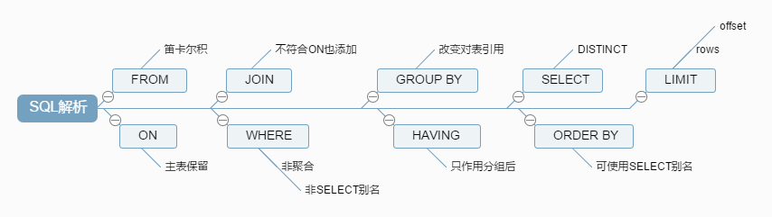

 

**参考书籍：**

《MySQL性能调优与架构实践》

《MySQL技术内幕：SQL编程》

 

**尾声：**

　　嗯，到这里这一次的深入了解之旅就差不多真的结束了，虽然也不是很深入，只是一些东西将其东拼西凑在一起而已，参考了一些以前看过的书籍，大师之笔果然不一样。而且在这过程中也是get到了蛮多东西的，最重要的是更进一步意识到，计算机软件世界的宏大呀~

　　另由于本人才疏学浅，其中难免存在纰漏错误之处，若发现劳烦告知修改，感谢~

 　　如需转载，请保留AnnsShadoW和本文地址http://www.cnblogs.com/annsshadow/p/5037667.html

## (4).索引

​	**分类：**
​		主键索引：  不能重复。id    不能是null
​		唯一索引  ：不能重复。id    可以是null
​		单值索引  ： 单列， age ;一个表可以多个单值索引,name。
​		复合索引  ：多个列构成的索引 （相当于 二级目录 ：  z: zhao）  (name,age)   (a,b,c,d,...,n)
​	**创建索引：**

方式一：

​		建索引语句:

​		**create 索引类型  索引名  on 表(字段)**
​		单值：
​		create index   dept_index on  tb(dept);

实际操作 : 这是数据库中的一个表,mybatis中的!现在要给gender加一个索引!


对应的语句是:

```sql
create index  gender_index on `user`(gender)

```

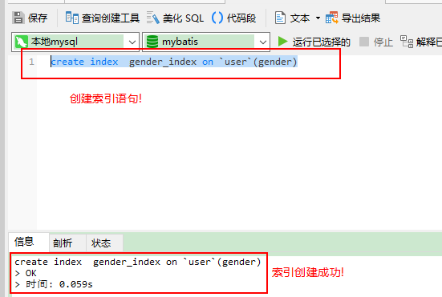

这里的gender_index是索引的名字! 这里的 user的是这个数据库中的表名叫user,gender这一个是要加索引的列!		


唯一：

​		create **unique** index  name_index on tb(name) ;
​		复合索引
​		create index dept_name_index on tb(dept,name);

方式二：alter table 表名 索引类型  索引名（字段）
	

```
单值：
alter table tb add index dept_index(dept) ;
唯一：
alter table tb add unique index name_index(name);
复合索引
alter table tb add index dept_name_index(dept,name);

```

​	注意：如果一个字段是primary key，则改字段默认就是 主键索引	

​	删除索引：
​	drop index 索引名 on 表名 ;
​	drop index name_index on tb ;

​	查询索引：
​	show index from 表名 ;
​	show index from 表名 \G

## (5).SQL性能问题

​	a.分析SQL的执行计划  : explain   ，可以模拟SQL优化器执行SQL语句，从而让开发人员 知道自己编写的SQL状况
​	b.MySQL查询优化其会干扰我们的优化

```
优化方法，官网：https://dev.mysql.com/doc/refman/5.5/en/optimization.html

```

​	
​	查询执行计划：  explain +SQL语句
​			explain  select  * from tb ;

 id : 编号				
 select_type ：查询类型
 table ：表
 type   ：类型
 possible_keys ：预测用到的索引 
 key  ：实际使用的索引
 key_len ：实际使用索引的长度     
 ref  :表之间的引用
 rows ：通过索引查询到的数据量 
 Extra     :额外的信息

准备数据：
create table course
(
cid int(3),
cname varchar(20),
tid int(3)
);
create table teacher
(
tid int(3),
tname varchar(20),
tcid int(3)
);

create table teacherCard
(
tcid int(3),
tcdesc varchar(200)
);

insert into course values(1,'java',1);
insert into course values(2,'html',1);
insert into course values(3,'sql',2);
insert into course values(4,'web',3);

insert into teacher values(1,'tz',1);
insert into teacher values(2,'tw',2);
insert into teacher values(3,'tl',3);

insert into teacherCard values(1,'tzdesc') ;
insert into teacherCard values(2,'twdesc') ;
insert into teacherCard values(3,'tldesc') ;

查询课程编号为2  或 教师证编号为3  的老师信息
explain +sql:
(1)id: id值相同，从上往下 顺序执行。  t3-tc3-c4

```
			  tc3--c4-t6

```

表的执行顺序  因数量的个数改变而改变的原因： 笛卡儿积

```
	a 	 b  	 c
	4	3	 2   =  			2*3=6 * 4   =24
							3*4=12* 2   =24

```

数据小的表 优先查询；


id值不同：id值越大越优先查询 (本质：在嵌套子查询时，先查内层 再查外层)

查询教授SQL课程的老师的描述（desc）
explain select tc.tcdesc from teacherCard tc,course c,teacher t where c.tid = t.tid
and t.tcid = tc.tcid and c.cname = 'sql' ;

将以上 多表查询 转为子查询形式：

explain select tc.tcdesc from teacherCard tc where tc.tcid = 
(select t.tcid from teacher t where  t.tid =  
	(select c.tid from course c where c.cname = 'sql')
);

子查询+多表： 
explain select t.tname ,tc.tcdesc from teacher t,teacherCard tc where t.tcid= tc.tcid
and t.tid = (select c.tid from course c where cname = 'sql') ;

id值有相同，又有不同： id值越大越优先；id值相同，从上往下 顺序执行

(2)select_type:查询类型
PRIMARY:包含子查询SQL中的 主查询 （最外层）
SUBQUERY：包含子查询SQL中的 子查询 （非最外层）
simple:简单查询（不包含子查询、union）
derived:衍生查询(使用到了临时表)
	a.在from子查询中只有一张表
		explain select  cr.cname 	from ( select * from course where tid in (1,2) ) cr ;

```
b.在from子查询中， 如果有table1 union table2 ，则table1 就是derived,table2就是union
	explain select  cr.cname 	from ( select * from course where tid = 1  union select * from course where tid = 2 ) cr ;

```

union:上例
union result :告知开发人员，那些表之间存在union查询

system > const > eq_ref > ref > fulltext > ref_or_null > index_merge > unique_subquery > index_subquery > range > index > ALL


(3)type:索引类型、类型
	system>const>eq_ref>ref>range>index>all   ，要对type进行优化的前提：有索引

其中：system,const只是理想情况；实际能达到 ref>range

system（忽略）: 只有一条数据的系统表 ；或 衍生表只有一条数据的主查询
	
create table test01
(
	tid int(3),
	tname varchar(20)
);

insert into test01 values(1,'a') ;
commit;
增加索引
alter table test01 add constraint tid_pk primary key(tid) ;
explain select * from (select * from test01 )t where tid =1 ;

const:仅仅能查到一条数据的SQL ,用于Primary key 或unique索引  （类型 与索引类型有关）
explain select tid from test01 where tid =1 ;
alter table test01 drop primary key ;
create index test01_index on test01(tid) ;

eq_ref:唯一性索引：对于每个索引键的查询，返回匹配唯一行数据（有且只有1个，不能多 、不能0）
select ... from ..where name = ... .常见于唯一索引 和主键索引。

 alter table teacherCard add constraint pk_tcid primary key(tcid);
alter table teacher add constraint uk_tcid unique index(tcid) ;

explain select t.tcid from teacher t,teacherCard tc where t.tcid = tc.tcid ;

以上SQL，用到的索引是 t.tcid,即teacher表中的tcid字段；
如果teacher表的数据个数 和 连接查询的数据个数一致（都是3条数据），则有可能满足eq_ref级别；否则无法满足。

ref：非唯一性索引，对于每个索引键的查询，返回匹配的所有行（0，多）
准备数据：
 insert into teacher values(4,'tz',4) ;
 insert into teacherCard values(4,'tz222');

测试：
alter table teacher add index index_name (tname) ;
explain select * from teacher 	where tname = 'tz';

range：检索指定范围的行 ,where后面是一个范围查询(between   ,> < >=,     特殊:in有时候会失效 ，从而转为 无索引all)
alter table teacher add index tid_index (tid) ;
explain select t.* from teacher t where t.tid in (1,2) ;
explain select t.* from teacher t where t.tid <3 ;


index：查询全部索引中数据
explain select tid from teacher ; --tid 是索引， 只需要扫描索引表，不需要所有表中的所有数据

all：查询全部表中的数据
explain select cid from course ;  --cid不是索引，需要全表所有，即需要所有表中的所有数据

system/const: 结果只有一条数据
eq_ref:结果多条；但是每条数据是唯一的 ；
ref：结果多条；但是每条数据是是0或多条 ；

（4）possible_keys ：可能用到的索引，是一种预测，不准。

alter table  course add index cname_index (cname);

explain select t.tname ,tc.tcdesc from teacher t,teacherCard tc
 where t.tcid= tc.tcid
and t.tid = (select c.tid from course c where cname = 'sql') ;

如果 possible_key/key是NULL，则说明没用索引

explain select tc.tcdesc from teacherCard tc,course c,teacher t where c.tid = t.tid
and t.tcid = tc.tcid and c.cname = 'sql' ;

（5） key ：实际使用到的索引

（6）key_len ：索引的长度 ;
    作用：用于判断复合索引是否被完全使用  （a,b,c）。
create table test_kl
(
	name char(20) not null default ''
);
alter table test_kl add index index_name(name) ;
explain select * from test_kl where name ='' ;   -- key_len :60
在utf8：1个字符站3个字节  

alter table test_kl add column name1 char(20) ;  --name1可以为null

alter table test_kl add index index_name1(name1) ;
explain select * from test_kl where name1 ='' ; 
--如果索引字段可以为Null,则会使用1个字节用于标识。

drop index index_name on test_kl ;
drop index index_name1 on test_kl ;

增加一个复合索引 
alter table test_kl add index name_name1_index (name,name1) ; 

explain select * from test_kl where name1 = '' ; --121
explain select * from test_kl where name = '' ; --60

varchar(20)
alter table test_kl add column name2 varchar(20) ; --可以为Null 
alter table test_kl add index name2_index (name2) ;

explain select * from test_kl where name2 = '' ;  --63
20*3=60 +  1(null)  +2(用2个字节 标识可变长度)  =63

utf8:1个字符3个字节
gbk:1个字符2个字节
latin:1个字符1个字节

(7) ref : 注意与type中的ref值区分。
	作用： 指明当前表所 参照的 字段。
		select ....where a.c = b.x ;(其中b.x可以是常量，const)

alter table course  add index tid_index (tid) ;

```
explain select * from course c,teacher t where c.tid = t.tid  and t.tname ='tw' ;

```

(8)rows: 被索引优化查询的 数据个数 (实际通过索引而查询到的 数据个数)
	explain select * from course c,teacher t  where c.tid = t.tid
	and t.tname = 'tz' ;

（9）Extra：
	(i).using filesort ： 性能消耗大；需要“额外”的一次排序（查询）  。常见于 order by 语句中。
排序：先查询

10个人 根据年龄排序。

create table test02
(
	a1 char(3),
	a2 char(3),
	a3 char(3),
	index idx_a1(a1),
	index idx_a2(a2),
	index idx_a3(a3)
);

explain select * from test02 where a1 ='' order by a1 ;

a1:姓名  a2：年龄

explain select * from test02 where a1 ='' order by a2 ; --using filesort
小结：对于单索引， 如果排序和查找是同一个字段，则不会出现using filesort；如果排序和查找不是同一个字段，则会出现using filesort；
	避免： where哪些字段，就order by那些字段2

复合索引：不能跨列（最佳左前缀）
drop index idx_a1 on test02;
drop index idx_a2 on test02;
drop index idx_a3 on test02;

alter table test02 add index idx_a1_a2_a3 (a1,a2,a3) ;
explain select *from test02 where a1='' order by a3 ;  --using filesort
explain select *from test02 where a2='' order by a3 ; --using filesort
explain select *from test02 where a1='' order by a2 ;
explain select *from test02 where a2='' order by a1 ; --using filesort
	小结：避免： where和order by 按照复合索引的顺序使用，不要跨列或无序使用。

```
(ii). using temporary:性能损耗大 ，用到了临时表。一般出现在group by 语句中。
explain select a1 from test02 where a1 in ('1','2','3') group by a1 ;
explain select a1 from test02 where a1 in ('1','2','3') group by a2 ; --using temporary
避免：查询那些列，就根据那些列 group by .

(iii). using index :性能提升; 索引覆盖（覆盖索引）。原因：不读取原文件，只从索引文件中获取数据 （不需要回表查询）
	只要使用到的列 全部都在索引中，就是索引覆盖using index

例如：test02表中有一个复合索引(a1,a2,a3)
	explain select a1,a2 from test02 where a1='' or a2= '' ; --using index   
	
	drop index idx_a1_a2_a3 on test02;

	alter table test02 add index idx_a1_a2(a1,a2) ;
	explain select a1,a3 from test02 where a1='' or a3= '' ;

```

​		
​		如果用到了索引覆盖(using index时)，会对 possible_keys和key造成影响：
​		a.如果没有where，则索引只出现在key中；
​		b.如果有where，则索引 出现在key和possible_keys中。
​	
​		explain select a1,a2 from test02 where a1='' or a2= '' ;
​		explain select a1,a2 from test02  ;
​	
​	(iii).using where （需要回表查询）
​		假设age是索引列
​		但查询语句select age,name from ...where age =...,此语句中必须回原表查Name，因此会显示using where.
​		
​	explain select a1,a3 from test02 where a3 = '' ; --a3需要回原表查询

```
(iv). impossible where ： where子句永远为false
	explain select * from test02 where a1='x' and a1='y'  ;

```

## (6).优化案例

​	单表优化、两表优化、三表优化
​	（1）单表优化
create table book
(
​	bid int(4) primary key,
​	name varchar(20) not null,
​	authorid int(4) not null,
​	publicid int(4) not null,
​	typeid int(4) not null 
);

insert into book values(1,'tjava',1,1,2) ;
insert into book values(2,'tc',2,1,2) ;
insert into book values(3,'wx',3,2,1) ;
insert into book values(4,'math',4,2,3) ;	
commit;	

```
查询authorid=1且 typeid为2或3的	bid
explain select bid from book where typeid in(2,3) and authorid=1  order by typeid desc ;

(a,b,c)
(a,b)

优化：加索引
alter table book add index idx_bta (bid,typeid,authorid);

索引一旦进行 升级优化，需要将之前废弃的索引删掉，防止干扰。
drop index idx_bta on book;

根据SQL实际解析的顺序，调整索引的顺序：
alter table book add index idx_tab (typeid,authorid,bid); --虽然可以回表查询bid，但是将bid放到索引中 可以提升使用using index ;

再次优化（之前是index级别）：思路。因为范围查询in有时会实现，因此交换 索引的顺序，将typeid in(2,3) 放到最后。
drop index idx_tab on book;
alter table book add index idx_atb (authorid,typeid,bid);
explain select bid from book where  authorid=1 and  typeid in(2,3) order by typeid desc ;

```

​	
​	--小结：	a.最佳做前缀，保持索引的定义和使用的顺序一致性  b.索引需要逐步优化  c.将含In的范围查询 放到where条件的最后，防止失效。
​	
​	本例中同时出现了Using where（需要回原表）; Using index（不需要回原表）：原因，where  authorid=1 and  typeid in(2,3)中authorid在索引(authorid,typeid,bid)中，因此不需要回原表（直接在索引表中能查到）；而typeid虽然也在索引(authorid,typeid,bid)中，但是含in的范围查询已经使该typeid索引失效，因此相当于没有typeid这个索引，所以需要回原表（using where）；
​	例如以下没有了In，则不会出现using where
​	explain select bid from book where  authorid=1 and  typeid =3 order by typeid desc ;
​	
​	还可以通过key_len证明In可以使索引失效。
​	
​	（2）两表优化

create table teacher2
(
	tid int(4) primary key,
	cid int(4) not null
);

insert into teacher2 values(1,2);
insert into teacher2 values(2,1);
insert into teacher2 values(3,3);

create table course2
(
	cid int(4) ,
	cname varchar(20)
);

insert into course2 values(1,'java');
insert into course2 values(2,'python');
insert into course2 values(3,'kotlin');
commit;

左连接：
	explain select *from teacher2 t left outer join course2 c
	on t.cid=c.cid where c.cname='java';
	  

```
索引往哪张表加？   -小表驱动大表  
	          -索引建立经常使用的字段上 （本题 t.cid=c.cid可知，t.cid字段使用频繁，因此给该字段加索引） [一般情况对于左外连接，给左表加索引；右外连接，给右表加索引]
小表：10
大表：300
where   小表.x 10 = 大表.y 300;  --循环了几次？10
	
	大表.y 300=小表.x 10	--循环了300次

```

```
小表:10
大表:300

select ...where 小表.x10=大表.x300 ;
for(int i=0;i<小表.length10;i++)
{
	for(int j=0;j<大表.length300;j++)
	{
		...
	}
}

```

```
select ...where 大表.x300=小表.x10 ;
for(int i=0;i<大表.length300;i++)
{
	for(int j=0;j<小表.length10;j++)
	{
		...
	}
}

```

--以上2个FOR循环，最终都会循环3000次；但是 对于双层循环来说：一般建议 将数据小的循环 放外层；数据大的循环放内存。


```
--当编写 ..on t.cid=c.cid 时，将数据量小的表 放左边（假设此时t表数据量小）

alter table teacher2 add index index_teacher2_cid(cid) ;
alter table course2 add index index_course2_cname(cname);

```

```
Using join buffer:extra中的一个选项，作用：Mysql引擎使用了 连接缓存。

```

（3）三张表优化A B C
	a.小表驱动大表  b.索引建立在经常查询的字段上

示例：
create table test03
(
  a1 int(4) not null,
  a2 int(4) not null,
  a3 int(4) not null,
  a4 int(4) not null
);
alter table test03 add index idx_a1_a2_a3_4(a1,a2,a3,a4) ;

```
explain select a1,a2,a3,a4 from test03 where a1=1 and a2=2 and a3=3 and a4 =4 ; --推荐写法，因为 索引的使用顺序（where后面的顺序） 和 复合索引的顺序一致

explain select a1,a2,a3,a4 from test03 where a4=1 and a3=2 and a2=3 and a1 =4 ; --虽然编写的顺序 和索引顺序不一致，但是 sql在真正执行前 经过了SQL优化器的调整，结果与上条SQL是一致的。
--以上 2个SQL，使用了 全部的复合索引

explain select a1,a2,a3,a4 from test03 where a1=1 and a2=2 and a4=4 order by a3; 
--以上SQL用到了a1 a2两个索引，该两个字段 不需要回表查询using index ;而a4因为跨列使用，造成了该索引失效，需要回表查询 因此是using where；以上可以通过 key_len进行验证

explain select a1,a2,a3,a4 from test03 where a1=1 and a4=4 order by a3; 
--以上SQL出现了 using filesort(文件内排序，“多了一次额外的查找/排序”) ：不要跨列使用( where和order by 拼起来，不要跨列使用)

```

```
explain select a1,a2,a3,a4 from test03 where a1=1 and a4=4 order by a2 , a3; --不会using filesort

```

​	
​	--总结：i.如果 (a,b,c,d)复合索引  和使用的顺序全部一致(且不跨列使用)，则复合索引全部使用。如果部分一致(且不跨列使用)，则使用部分索引。
​	select a,c where  a = and b= and d= 
​		ii.where和order by 拼起来，不要跨列使用 

​	
​	using temporary:需要额外再多使用一张表. 一般出现在group by语句中；已经有表了，但不适用，必须再来一张表。
解析过程：			
from .. on.. join ..where ..group by ....having ...select dinstinct ..order by limit ...
​	a.
​		explain select * from test03 where a2=2 and a4=4 group by a2,a4 ;--没有using temporary
​	b.
​		explain select * from test03 where a2=2 and a4=4 group by a3 ;

## (7).避免索引失效的一些原则 

​	（1）复合索引
​	a.复合索引，不要跨列或无序使用（最佳左前缀）
​	(a,b,c)  
​	b.复合索引，尽量使用全索引匹配
​	(a,b,c)  
​	（2）不要在索引上进行任何操作（计算、函数、类型转换），否则索引失效
​		select ..where A.x = .. ;  --假设A.x是索引
​		不要：select ..where A.x*3 = .. ;
​		explain select * from book where authorid = 1 and typeid = 2 ;--用到了at2个索引
​		explain select * from book where authorid = 1 and typeid*2 = 2 ;--用到了a1个索引
​		explain select * from book where authorid*2 = 1 and typeid*2 = 2 ;----用到了0个索引
​		explain select * from book where authorid*2 = 1 and typeid = 2 ;----用到了0个索引,原因：对于复合索引，如果左边失效，右侧全部失效。(a,b,c)，例如如果 b失效，则b c同时失效。
​	
 		drop index idx_atb on book ; 
​		alter table book add index idx_authroid (authorid) ;
​		alter table book add index idx_typeid (typeid) ;
​		explain select * from book where authorid*2 = 1 and typeid = 2 ;
​	（3）复合索引不能使用不等于（!=  <>）或is null (is not null)，否则自身以及右侧所有全部失效。
​		复合索引中如果有>，则自身和右侧索引全部失效。

```
explain select * from book where authorid = 1 and typeid =2 ;

-- SQL优化，是一种概率层面的优化。至于是否实际使用了我们的优化，需要通过explain进行推测。

explain select * from book where authorid != 1 and typeid =2 ;
explain select * from book where authorid != 1 and typeid !=2 ;

```

​	
​	体验概率情况(< > =)：原因是服务层中有SQL优化器，可能会影响我们的优化。
​	drop index idx_typeid on book;
​	drop index idx_authroid on book;
​	alter table book add index idx_book_at (authorid,typeid);
​	explain select * from book where authorid = 1 and typeid =2 ;--复合索引at全部使用
​	explain select * from book where authorid > 1 and typeid =2 ; --复合索引中如果有>，则自身和右侧索引全部失效。
​	explain select * from book where authorid = 1 and typeid >2 ;--复合索引at全部使用
​	----明显的概率问题---
​	explain select * from book where authorid < 1 and typeid =2 ;--复合索引at只用到了1个索引
​	explain select * from book where authorid < 4 and typeid =2 ;--复合索引全部失效
​	
​	--我们学习索引优化 ，是一个大部分情况适用的结论，但由于SQL优化器等原因  该结论不是100%正确。
​	--一般而言， 范围查询（> <  in），之后的索引失效。
​	
​	（4）补救。尽量使用索引覆盖（using index）
​			（a,b,c）
​	select a,b,c from xx..where a=  .. and b =.. ;
​	
​	(5) like尽量以“常量”开头，不要以'%'开头，否则索引失效
​	select * from xx where name like '%x%' ; --name索引失效
​	
​	explain select * from teacher  where tname like '%x%'; --tname索引失效
​	
​	explain select * from teacher  where tname like 'x%';
​	 
​	explain select tname from teacher  where tname like '%x%'; --如果必须使用like '%x%'进行模糊查询，可以使用索引覆盖 挽救一部分。

```
（6）尽量不要使用类型转换（显示、隐式），否则索引失效
explain select * from teacher where tname = 'abc' ;
explain select * from teacher where tname = 123 ;//程序底层将 123 -> '123'，即进行了类型转换，因此索引失效

（7）尽量不要使用or，否则索引失效
explain select * from teacher where tname ='' or tcid >1 ; --将or左侧的tname 失效。

```

## (8).一些其他的优化方法

​	（1）
​	exist和in
​	select ..from table where exist (子查询) ;
​	select ..from table where 字段 in  (子查询) ;

```
如果主查询的数据集大，则使用In   ,效率高。
如果子查询的数据集大，则使用exist,效率高。	

exist语法： 将主查询的结果，放到子查需结果中进行条件校验（看子查询是否有数据，如果有数据 则校验成功）  ，
	    如果 复合校验，则保留数据；

select tname from teacher where exists (select * from teacher) ; 
--等价于select tname from teacher

```

​	
​	select tname from teacher where exists (select * from teacher where tid =9999) ;
​	
​	in:
​	select ..from table where tid in  (1,3,5) ;

```
（2）order by 优化
using filesort 有两种算法：双路排序、单路排序 （根据IO的次数）
MySQL4.1之前 默认使用 双路排序；双路：扫描2次磁盘（1：从磁盘读取排序字段 ,对排序字段进行排序（在buffer中进行的排序）   2：扫描其他字段 ）
	--IO较消耗性能
MySQL4.1之后 默认使用 单路排序  ： 只读取一次（全部字段），在buffer中进行排序。但种单路排序 会有一定的隐患 （不一定真的是“单路|1次IO”，有可能多次IO）。原因：如果数据量特别大，则无法 将所有字段的数据 一次性读取完毕，因此 会进行“分片读取、多次读取”。
	注意：单路排序 比双路排序 会占用更多的buffer。
		单路排序在使用时，如果数据大，可以考虑调大buffer的容量大小：  set max_length_for_sort_data = 1024  单位byte

如果max_length_for_sort_data值太低，则mysql会自动从 单路->双路   （太低：需要排序的列的总大小超过了max_length_for_sort_data定义的字节数）

提高order by查询的策略：
a.选择使用单路、双路 ；调整buffer的容量大小；
b.避免select * ...  
c.复合索引 不要跨列使用 ，避免using filesort
d.保证全部的排序字段 排序的一致性（都是升序 或 降序）

```

​	

## (9).SQL排查 - 慢查询日志:MySQL提供的一种日志记录，用于记录MySQL种响应时间超过阀值的SQL语句 （long_query_time，默认10秒）

​		慢查询日志默认是关闭的；建议：开发调优是 打开，而 最终部署时关闭。
​	

```
检查是否开启了 慢查询日志 ：   show variables like '%slow_query_log%' ;

临时开启：
	set global slow_query_log = 1 ;  --在内存种开启
	exit
	service mysql restart

永久开启：
	/etc/my.cnf 中追加配置：
	vi /etc/my.cnf 
	[mysqld]
	slow_query_log=1
	slow_query_log_file=/var/lib/mysql/localhost-slow.log

```

​	
​	慢查询阀值：
​		show variables like '%long_query_time%' ;
​	
​	临时设置阀值：
​		set global long_query_time = 5 ; --设置完毕后，重新登陆后起效 （不需要重启服务）
​	
​	永久设置阀值：
​			
​		/etc/my.cnf 中追加配置：
​		vi /etc/my.cnf 
​		[mysqld]
​		long_query_time=3

```
select sleep(4);
select sleep(5);
select sleep(3);
select sleep(3);
--查询超过阀值的SQL：  show global status like '%slow_queries%' ;

(1)慢查询的sql被记录在了日志中，因此可以通过日志 查看具体的慢SQL。
cat /var/lib/mysql/localhost-slow.log

(2)通过mysqldumpslow工具查看慢SQL,可以通过一些过滤条件 快速查找出需要定位的慢SQL
mysqldumpslow --help
s：排序方式
r:逆序
l:锁定时间
g:正则匹配模式		

```

```
--获取返回记录最多的3个SQL
	mysqldumpslow -s r -t 3  /var/lib/mysql/localhost-slow.log

--获取访问次数最多的3个SQL
	mysqldumpslow -s c -t 3 /var/lib/mysql/localhost-slow.log

--按照时间排序，前10条包含left join查询语句的SQL
	mysqldumpslow -s t -t 10 -g "left join" /var/lib/mysql/localhost-slow.log

语法：
	mysqldumpslow 各种参数  慢查询日志的文件

```

## (10).分析海量数据

```
a.模拟海量数据  存储过程（无return）/存储函数（有return）
create database testdata ;
use testdata

```

create table dept
(
dno int(5) primary key default 0,
dname varchar(20) not null default '',
loc varchar(30) default ''
)engine=innodb default charset=utf8;

create table emp
(
eid int(5) primary key,
ename varchar(20) not null default '',
job varchar(20) not null default '',
deptno int(5) not null default 0
)engine=innodb default charset=utf8;
	通过存储函数 插入海量数据：
	创建存储函数：
		randstring(6)  ->aXiayx  用于模拟员工名称

```
delimiter $ 
create function randstring(n int)   returns varchar(255) 
begin
	declare  all_str varchar(100) default 'abcdefghijklmnopqrstuvwxyzABCDEFGHIJKLMNOPQRSTUVWXYZ' ;
	declare return_str varchar(255) default '' ;
	declare i int default 0 ; 
	while i<n		 
	do									
		set return_str = concat(  return_str,      substring(all_str,   FLOOR(1+rand()*52)   ,1)       );
		set i=i+1 ;
	end while ;
	return return_str;
	
end $ 

```

--如果报错：You have an error in your SQL syntax，说明SQL语句语法有错，需要修改SQL语句；

 如果报错This function has none of DETERMINISTIC, NO SQL, or READS SQL DATA in its declaration and binary logging is enabled (you *might* want to use the less safe log_bin_trust_function_creators variable)
	是因为 存储过程/存储函数在创建时 与之前的 开启慢查询日志冲突了 
	解决冲突：
	临时解决( 开启log_bin_trust_function_creators )
		show variables like '%log_bin_trust_function_creators%';
		set global log_bin_trust_function_creators = 1;
	永久解决：
	/etc/my.cnf 
	[mysqld]
	log_bin_trust_function_creators = 1

```
--产生随机整数
create function ran_num() returns int(5)
begin
	declare i int default 0;
	set i =floor( rand()*100 ) ;
	return i ;

end $

```


```
--通过存储过程插入海量数据：emp表中  ，  10000,   100000
create procedure insert_emp( in eid_start int(10),in data_times int(10))
begin 
	declare i int default 0;
	set autocommit = 0 ;
	
	repeat
		
		insert into emp values(eid_start + i, randstring(5) ,'other' ,ran_num()) ;
		set i=i+1 ;
		until i=data_times
	end repeat ;
	commit ;
end $

```

```
--通过存储过程插入海量数据：dept表中  
	create procedure insert_dept(in dno_start int(10) ,in data_times int(10))
	begin
		declare i int default 0;
		set autocommit = 0 ;
		repeat
		
			insert into dept values(dno_start+i ,randstring(6),randstring(8)) ;
			set i=i+1 ;
			until i=data_times
		end repeat ;
	commit ;

```

```
	end$

```

```
--插入数据
	delimiter ; 
	call insert_emp(1000,800000) ;
	call insert_dept(10,30) ;

```

​	
​	b.分析海量数据:
​	（1）profiles
​	show profiles ; --默认关闭
​	show variables like '%profiling%';
​	set profiling = on ; 
​	show profiles  ：会记录所有profiling打开之后的  全部SQL查询语句所花费的时间。缺点：不够精确，只能看到 总共消费的时间，不能看到各个硬件消费的时间（cpu  io ）
​	
​	(2)--精确分析:sql诊断
​	 show profile all for query 上一步查询的的Query_Id
​	 show profile cpu,block io for query 上一步查询的的Query_Id
​	
​	(3)全局查询日志 ：记录开启之后的 全部SQL语句。 （这次全局的记录操作 仅仅在调优、开发过程中打开即可，在最终的部署实施时 一定关闭）
​		show variables like '%general_log%';
​		
​		--执行的所有SQL记录在表中
​		set global general_log = 1 ;--开启全局日志
​		set global log_output='table' ; --设置 将全部的SQL 记录在表中
​	
​		--执行的所有SQL记录在文件中
​		set global log_output='file' ;
​		set global general_log = on ;
​		set global general_log_file='/tmp/general.log' ;

```
	开启后，会记录所有SQL ： 会被记录 mysql.general_log表中。
		select * from  mysql.general_log ;

```

## (11).锁机制 ：解决因资源共享 而造成的并发问题。

​	示例：买最后一件衣服X
​	A:  	X	买 ：  X加锁 ->试衣服...下单..付款..打包 ->X解锁
​	B:	X       买：发现X已被加锁，等待X解锁，   X已售空

```
分类：
操作类型：
	a.读锁（共享锁）： 对同一个数据（衣服），多个读操作可以同时进行，互不干扰。
	b.写锁（互斥锁）： 如果当前写操作没有完毕（买衣服的一系列操作），则无法进行其他的读操作、写操作

操作范围：
	a.表锁 ：一次性对一张表整体加锁。如MyISAM存储引擎使用表锁，开销小、加锁快；无死锁；但锁的范围大，容易发生锁冲突、并发度低。
	b.行锁 ：一次性对一条数据加锁。如InnoDB存储引擎使用行锁，开销大，加锁慢；容易出现死锁；锁的范围较小，不易发生锁冲突，并发度高（很小概率 发生高并发问题：脏读、幻读、不可重复度、丢失更新等问题）。
	c.页锁		

```

示例：

```
（1）表锁 ：  --自增操作 MYSQL/SQLSERVER 支持；oracle需要借助于序列来实现自增

```

create table tablelock
(
id int primary key auto_increment , 
name varchar(20)
)engine myisam;

insert into tablelock(name) values('a1');
insert into tablelock(name) values('a2');
insert into tablelock(name) values('a3');
insert into tablelock(name) values('a4');
insert into tablelock(name) values('a5');
commit;

```
增加锁：
locak table 表1  read/write  ,表2  read/write   ,...

查看加锁的表：
show open tables ;

会话：session :每一个访问数据的dos命令行、数据库客户端工具  都是一个会话

===加读锁：
	会话0：
		lock table  tablelock read ;
		select * from tablelock; --读（查），可以
		delete from tablelock where id =1 ; --写（增删改），不可以

		select * from emp ; --读，不可以
		delete from emp where eid = 1; --写，不可以
		结论1：
		--如果某一个会话 对A表加了read锁，则 该会话 可以对A表进行读操作、不能进行写操作； 且 该会话不能对其他表进行读、写操作。
		--即如果给A表加了读锁，则当前会话只能对A表进行读操作。

	会话1（其他会话）：
		select * from tablelock;   --读（查），可以
		delete from tablelock where id =1 ; --写，会“等待”会话0将锁释放

```

```
	会话1（其他会话）：
		select * from emp ;  --读（查），可以
		delete from emp where eno = 1; --写，可以
		结论2：
		--总结：
			会话0给A表加了锁；其他会话的操作：a.可以对其他表（A表以外的表）进行读、写操作
							b.对A表：读-可以；  写-需要等待释放锁。
	释放锁: unlock tables ;

```


```
===加写锁：
	会话0：
		lock table tablelock write ;

		当前会话（会话0） 可以对加了写锁的表  进行任何操作（增删改查）；但是不能 操作（增删改查）其他表
	其他会话：
		对会话0中加写锁的表 可以进行增删改查的前提是：等待会话0释放写锁

```

MySQL表级锁的锁模式
MyISAM在执行查询语句（SELECT）前，会自动给涉及的所有表加读锁，
在执行更新操作（DML）前，会自动给涉及的表加写锁。
所以对MyISAM表进行操作，会有以下情况：
a、对MyISAM表的读操作（加读锁），不会阻塞其他进程（会话）对同一表的读请求，
但会阻塞对同一表的写请求。只有当读锁释放后，才会执行其它进程的写操作。
b、对MyISAM表的写操作（加写锁），会阻塞其他进程（会话）对同一表的读和写操作，
只有当写锁释放后，才会执行其它进程的读写操作。


分析表锁定：
	查看哪些表加了锁：   show open tables ;  1代表被加了锁
	分析表锁定的严重程度： show status like 'table%' ;
			Table_locks_immediate :即可能获取到的锁数
			Table_locks_waited：需要等待的表锁数(如果该值越大，说明存在越大的锁竞争)
	一般建议：
		Table_locks_immediate/Table_locks_waited > 5000， 建议采用InnoDB引擎，否则MyISAM引擎

​	

（2）行表（InnoDB）
create table linelock(
id int(5) primary key auto_increment,
name varchar(20)
)engine=innodb ;
insert into linelock(name) values('1')  ;
insert into linelock(name) values('2')  ;
insert into linelock(name) values('3')  ;
insert into linelock(name) values('4')  ;
insert into linelock(name) values('5')  ;

--mysql默认自动commit;	oracle默认不会自动commit ;

为了研究行锁，暂时将自动commit关闭;  set autocommit =0 ; 以后需要通过commit

```
会话0： 写操作
	insert into linelock values(	'a6') ;
   
会话1： 写操作 同样的数据
	update linelock set name='ax' where id = 6;

对行锁情况：
	1.如果会话x对某条数据a进行 DML操作（研究时：关闭了自动commit的情况下），则其他会话必须等待会话x结束事务(commit/rollback)后  才能对数据a进行操作。
	2.表锁 是通过unlock tables，也可以通过事务解锁 ; 行锁 是通过事务解锁。

```

​		

```
行锁，操作不同数据：

会话0： 写操作

	insert into linelock values(8,'a8') ;
会话1： 写操作， 不同的数据
	update linelock set name='ax' where id = 5;
	行锁，一次锁一行数据；因此 如果操作的是不同数据，则不干扰。

```

```
行锁的注意事项：
a.如果没有索引，则行锁会转为表锁
show index from linelock ;
alter table linelock add index idx_linelock_name(name);

```

​	
​	会话0： 写操作
​		update linelock set name = 'ai' where name = '3' ;
​		
​	会话1： 写操作， 不同的数据
​		update linelock set name = 'aiX' where name = '4' ;

​	
​	会话0： 写操作
​		update linelock set name = 'ai' where name = 3 ;
​		
​	会话1： 写操作， 不同的数据
​		update linelock set name = 'aiX' where name = 4 ;
​		
​	--可以发现，数据被阻塞了（加锁）
​	-- 原因：如果索引类 发生了类型转换，则索引失效。 因此 此次操作，会从行锁 转为表锁。
​	
​	b.行锁的一种特殊情况：间隙锁：值在范围内，但却不存在
​	 --此时linelock表中 没有id=7的数据
​	 update linelock set name ='x' where id >1 and id<9 ;   --即在此where范围中，没有id=7的数据，则id=7的数据成为间隙。
​	间隙：Mysql会自动给 间隙 加索 ->间隙锁。即 本题 会自动给id=7的数据加 间隙锁（行锁）。
​	行锁：如果有where，则实际加索的范围 就是where后面的范围（不是实际的值）

​	
​	如何仅仅是查询数据，能否加锁？ 可以   for update 
​	研究学习时，将自动提交关闭：
​		set autocommit =0 ;
​		start transaction ;
​		begin ;
​	 select * from linelock where id =2 for update ;
​	
​	通过for update对query语句进行加锁。
​	
​	行锁：
​	InnoDB默认采用行锁；
​	缺点： 比表锁性能损耗大。
​	优点：并发能力强，效率高。
​	因此建议，高并发用InnoDB，否则用MyISAM。
​	
​	行锁分析：
​	  show status like '%innodb_row_lock%' ;
​		 Innodb_row_lock_current_waits :当前正在等待锁的数量  
​		  Innodb_row_lock_time：等待总时长。从系统启到现在 一共等待的时间
​		 Innodb_row_lock_time_avg  ：平均等待时长。从系统启到现在平均等待的时间
​		 Innodb_row_lock_time_max  ：最大等待时长。从系统启到现在最大一次等待的时间
​		 Innodb_row_lock_waits ：	等待次数。从系统启到现在一共等待的次数

## (12).主从复制  （集群在数据库的一种实现）

​	windows:mysql 主
​	linux:mysql从

```
安装windows版mysql:
	如果之前计算机中安装过Mysql，要重新再安装  则需要：先卸载 再安装
	先卸载：
		通过电脑自带卸载工具卸载Mysql (电脑管家也可以)
		删除一个mysql缓存文件C:\ProgramData\MySQL
		删除注册表regedit中所有mysql相关配置
		--重启计算机
		
	安装MYSQL：
		安装时，如果出现未响应：  则重新打开D:\MySQL\MySQL Server 5.5\bin\MySQLInstanceConfig.exe

	图形化客户端： SQLyog, Navicat

```

```
	如果要远程连接数据库，则需要授权远程访问。 
	授权远程访问 :(A->B,则再B计算机的Mysql中执行以下命令)
	GRANT ALL PRIVILEGES ON *.* TO 'root'@'%' IDENTIFIED BY 'root' WITH GRANT OPTION;
	FLUSH PRIVILEGES;

	如果仍然报错：可能是防火墙没关闭 ：  在B关闭防火墙  service iptables stop 

```


```
实现主从同步（主从复制）：图
	1.master将改变的数 记录在本地的 二进制日志中（binary log） ；该过程 称之为：二进制日志件事
	2.slave将master的binary log拷贝到自己的 relay log（中继日志文件）中
	3.中继日志事件，将数据读取到自己的数据库之中
MYSQL主从复制 是异步的，串行化的， 有延迟

master:slave = 1:n

配置： 
windows(mysql: my.ini)
  linux(mysql: my.cnf)

配置前，为了无误，先将权限(远程访问)、防火墙等处理：
	关闭windows/linux防火墙： windows：右键“网络”   ,linux: service iptables stop
	Mysql允许远程连接(windowos/linux)：
		GRANT ALL PRIVILEGES ON *.* TO 'root'@'%' IDENTIFIED BY 'root' WITH GRANT OPTION;
		FLUSH PRIVILEGES;

```

主机（以下代码和操作 全部在主机windows中操作）：
my.ini
[mysqld]
#id
server-id=1
#二进制日志文件（注意是/  不是\）
log-bin="D:/MySQL/MySQL Server 5.5/data/mysql-bin"
#错误记录文件
log-error="D:/MySQL/MySQL Server 5.5/data/mysql-error"
#主从同步时 忽略的数据库
binlog-ignore-db=mysql
#(可选)指定主从同步时，同步哪些数据库
binlog-do-db=test	

windows中的数据库 授权哪台计算机中的数据库 是自己的从数据库：	
 GRANT REPLICATION slave,reload,super ON *.* TO 'root'@'192.168.2.%' IDENTIFIED BY 'root';
 flush privileges ; 

```
查看主数据库的状态（每次在左主从同步前，需要观察 主机状态的最新值）
	show master status;  （mysql-bin.000001、 107）

```

从机（以下代码和操作 全部在从机linux中操作）：

my.cnf
[mysqld]
server-id=2
log-bin=mysql-bin
replicate-do-db=test

linux中的数据 授权哪台计算机中的数控 是自己的主计算机
CHANGE MASTER TO 
MASTER_HOST = '192.168.2.2', 
MASTER_USER = 'root', 
MASTER_PASSWORD = 'root', 
MASTER_PORT = 3306,
master_log_file='mysql-bin.000001',
master_log_pos=107;
	如果报错：This operation cannot be performed with a running slave; run STOP SLAVE first
	解决：STOP SLAVE ;再次执行上条授权语句

开启主从同步：
	从机linux:
	start slave ;
	检验  show slave status \G	主要观察： Slave_IO_Running和 Slave_SQL_Running，确保二者都是yes；如果不都是yes，则看下方的 Last_IO_Error。
本次 通过 Last_IO_Error发现错误的原因是 主从使用了相同的server-id， 检查:在主从中分别查看serverid:  show variables like 'server_id' ;
	可以发现，在Linux中的my.cnf中设置了server-id=2，但实际执行时 确实server-id=1，原因：可能是 linux版Mysql的一个bug，也可能是 windows和Linux版本不一致造成的兼容性问题。
	解决改bug： set global server_id =2 ;

```
stop slave ;
 set global server_id =2 ;
start slave ;
 show slave status \G

演示：
主windows =>从

windows:
将表，插入数据  
观察从数据库中该表的数据

```

数据库+后端

```
spring boot（企业级框架,目前使用较多）  

```


# Interview

## 1.数据库连接

**executeUpdate(sql)**

用于执行给定 SQL 语句，该语句可能为 INSERT、UPDATE 或 DELETE 语句，或者不返回任何内容的 SQL 语句。

返回值是更新的条数。

**executeQuery（sql）**

这个方法被用来执行 SELECT 语句，返回代表查询结果的ResultSet对象。


## 2.关系型数据库和非关系数据库的区别?(建议可以通过举例子介绍)

**什么是关系型数据库？**

- 关系型数据库是依据**关系模型**来创建的数据库。
- 所谓关系模型就是“一对一、一对多、多对多”等关系模型，关系模型就是指二维表格模型,因而一个关系型数据库就是由二维表及其之间的联系组成的一个数据组织。
- 关系型数据可以很好地存储一些关系模型的数据，比如一个老师对应多个学生的数据（“多对多”），一本书对应多个作者（“一对多”），一本书对应一个出版日期（“一对一”）
- 关系模型是我们生活中能经常遇见的模型，存储这类数据一般用关系型数据库
- 关系模型包括数据结构（数据存储的问题，二维表）、操作指令集合（SQL语句）、完整性约束(表内数据约束、表与表之间的约束)。

数据的存储形式：

 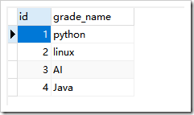

关系的处理形式：

 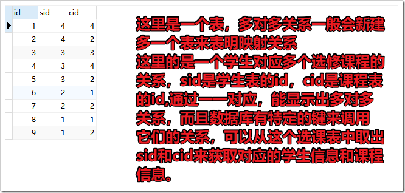

下面是一个E-R图，是多个模型一起用的情况：

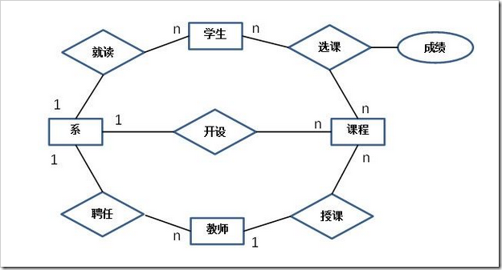

**常见的关系型数据库：**

Oracle、DB2、PostgreSQL、Microsoft SQL Server、Microsoft Access、MySQL

**关系型数据库的特点：**

安全（因为存储在磁盘中，不会说突然断电数据就没有了）、

容易理解（建立在关系模型上）、

但不节省空间（因为建立在关系模型上，就要遵循某些规则，好比数据中某字段值即使为空仍要分配空间）


**什么是非关系型数据库？**

- 非关系型数据库主要是基于“**非关系模型**”的数据库（由于关系型太大，所以一般用“非关系型”来表示其他类型的数据库）
- 非关系型模型比如有：
  - 列模型：存储的数据是一列列的。关系型数据库以一行作为一个记录，列模型数据库以一列为一个记录。（这种模型，数据即索引，IO很快，主要是一些分布式数据库）
  - 键值对模型：存储的数据是一个个“键值对”，比如name:liming,那么name这个键里面存的值就是liming
  - 文档类模型：以一个个文档来存储数据，有点类似“键值对”。

**常见非关系模型数据库：**

列模型：Hbase

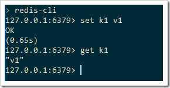

键值对模型：redis,MemcacheDB

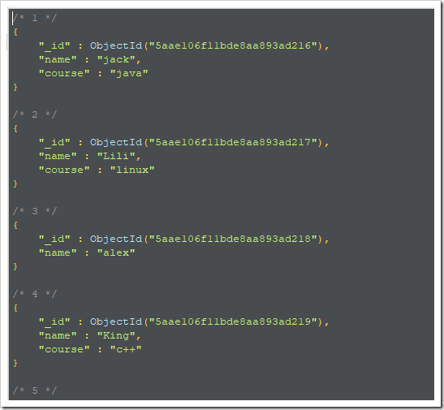
文档类模型：mongoDB

**非关系型数据库的特点：**

效率高（因为存储在内存中）、

但不安全（断电丢失数据，但其中redis可以同步数据到磁盘中），现在很多非关系型数据库都开始支持转存到磁盘中。

 

参考：https://www.cnblogs.com/ranyonsue/p/10333203.html

## 3.数据库命名规范：

- 所有数据库对象名称必须使用小写字母并用下划线分割
- 所有数据库对象名称禁止使用 MySQL 保留关键字（如果表名中包含关键字查询时，需要将其用单引号括起来）
- 数据库对象的命名要能做到见名识意，并且最后不要超过 32 个字符
- 临时库表必须以 tmp_为前缀并以日期为后缀，备份表必须以 bak_为前缀并以日期 (时间戳) 为后缀
- 所有存储相同数据的列名和列类型必须一致（一般作为关联列，如果查询时关联列类型不一致会自动进行数据类型隐式转换，会造成列上的索引失效，导致查询效率降低


## 4.SQL索引是什么，索引优化，索引为什么会失效？

#### 首先说什么是索引?

**索引是一种用于快速查询和检索数据的数据结构。常见的索引结构有: B树， B+树和Hash。**

索引的作用就相当于目录的作用。打个比方: 我们在查字典的时候，如果没有目录，那我们就只能一页一页的去找我们需要查的那个字，速度很慢。如果有目录了，我们只需要先去目录里查找字的位置，然后直接翻到那一页就行了。


那索引为什么会失效？可以用下面第一条来回答。

30%这个范围。 其他的就不知道啦，后续仔细研究（***********）

#### 索引优化规则

王道当时有一个文档：Mysql索引及其优化（王道的文档，有些粗略，没讲模糊查询左右之分）

**1）如果MySQL估计使用索引比全表扫描还慢，则不会使用索引。**

返回数据的比例是重要的指标，比例越低越容易命中索引。记住这个范围值——30%，后面所讲的内容都是建立在返回数据的比例在30%以内的基础上。

**2）前导模糊查询不能命中索引。**

name列创建普通索引：

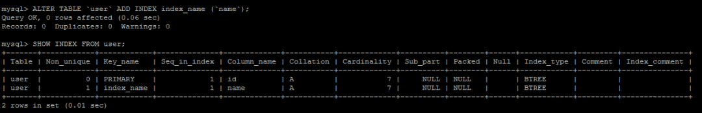

前导模糊查询不能命中索引：

EXPLAIN SELECT * FROM user WHERE name LIKE '%s%';

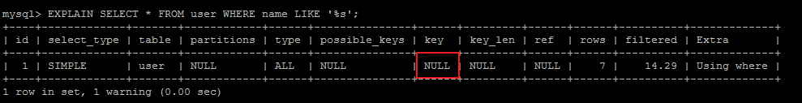

非前导模糊查询则可以使用索引，可优化为使用非前导模糊查询：

EXPLAIN SELECT * FROM user WHERE name LIKE 's%';

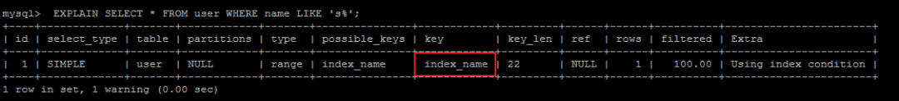

**3）数据类型出现隐式转换的时候不会命中索引，特别是当列类型是字符串，一定要将字符常量值用引号引起来。**

EXPLAIN SELECT * FROM user WHERE name=1;

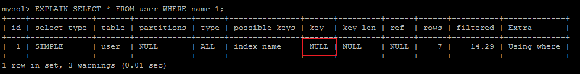

EXPLAIN SELECT * FROM user WHERE name='1';

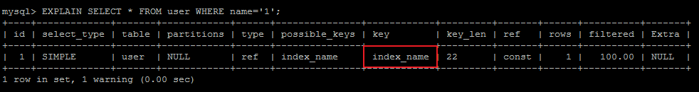

**4）复合索引的情况下，查询条件不包含索引列最左边部分（不满足最左原则），不会命中符合索引。**

（是不是相当于没有B+树的上面一层，自然找不到下面一层？ 有待考究 ）

name,age,status列创建复合索引：

ALTER TABLE user ADD INDEX index_name (name,age,status);

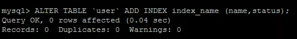

user表索引详情：

SHOW INDEX FROM user;

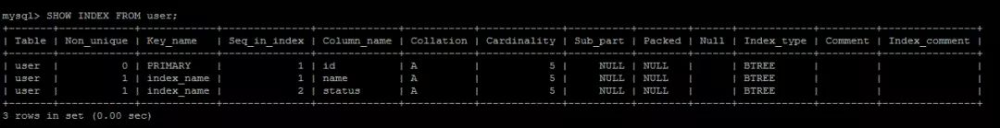

根据最左原则，可以命中复合索引index_name：

EXPLAIN SELECT * FROM user WHERE name='swj' AND status=1;

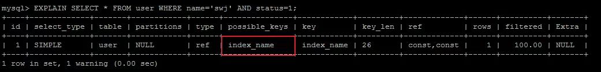

注意，最左原则并不是说是查询条件的顺序：

EXPLAIN SELECT * FROM user WHERE status=1 AND name='swj';

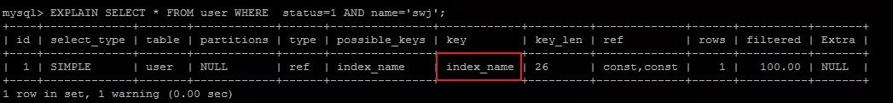

而是查询条件中是否包含索引最左列字段：

EXPLAIN SELECT * FROM user WHERE status=2 ;

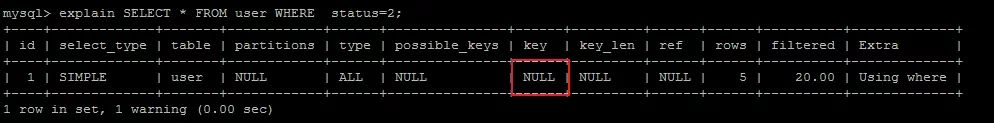

**5）union、in、or都能够命中索引，建议使用in。**

union:

EXPLAIN SELECT*FROM user WHERE status=1

UNION ALL

SELECT*FROM user WHERE status = 2;

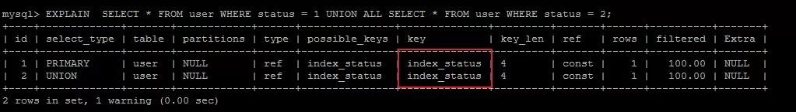

in:

EXPLAIN SELECT * FROM user WHERE status IN (1,2);

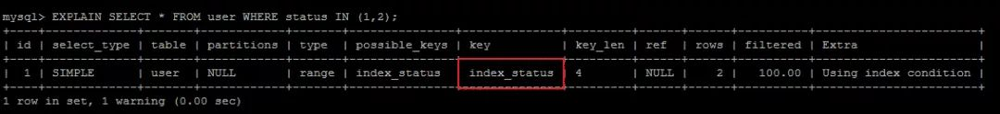

or:

EXPLAIN SELECT*FROM user WHERE status=1OR status=2;

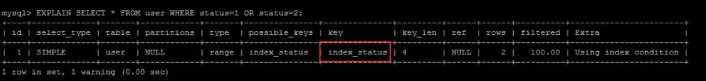

查询的CPU消耗：or>in>union。

**6）用or分割开的条件，如果or前的条件中列有索引，而后面的列中没有索引，那么涉及到的索引都不会被用到。**

EXPLAIN SELECT * FROM payment WHERE customer_id = 203 OR amount = 3.96;

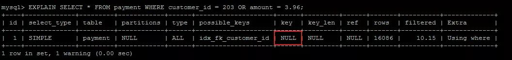

因为or后面的条件列中没有索引，那么后面的查询肯定要走全表扫描，在存在全表扫描的情况下，就没有必要多一次索引扫描增加IO访问。

**7）负向条件查询不能使用索引，可以优化为in查询。**

负向条件有：**!=、<>、not in、not exists、not like**等。

status列创建索引：

ALTER TABLE user ADD INDEX index_status (status);


user表索引详情：

SHOW INDEX FROM user;

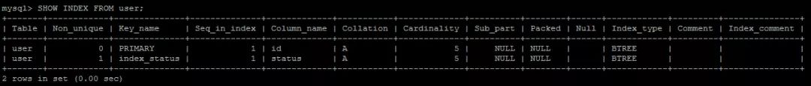

负向条件不能命中缓存：

EXPLAIN SELECT * FROM user WHERE status !=1 AND status != 2;

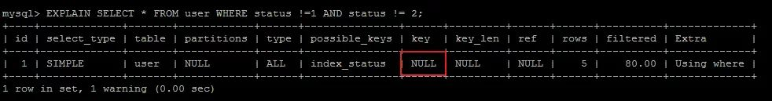

可以优化为in查询，但是前提是区分度要高，返回数据的比例在30%以内：

EXPLAIN SELECT * FROM user WHERE status IN (0,3,4);

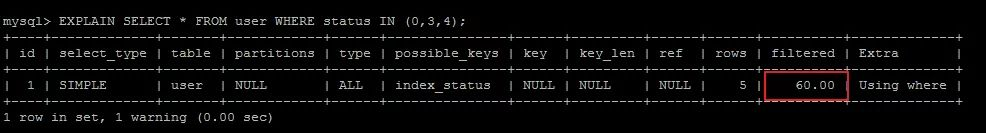

**8）范围条件查询可以命中索引。范围条件有：<、<=、>、>=、between等。**

status,age列分别创建索引：

ALTER TABLE user ADD INDEX index_status (status);

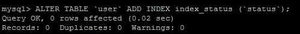

ALTER TABLE user ADD INDEX index_age (age);

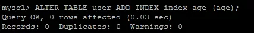

user表索引详情：

SHOW INDEX FROM user;

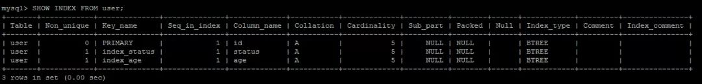

范围条件查询可以命中索引：

EXPLAIN SELECT * FROM user WHERE status>5;

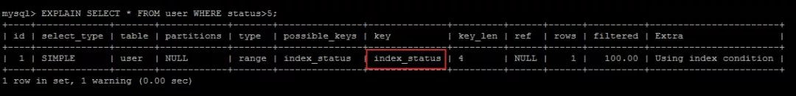

范围列可以用到索引（联合索引必须是最左前缀），但是范围列后面的列无法用到索引，索引最多用于一个范围列，如果查询条件中有两个范围列则无法全用到索引：

EXPLAIN SELECT * FROM user WHERE status>5 AND age<24;

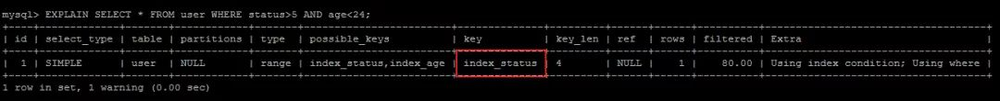

如果是范围查询和等值查询同时存在，优先匹配等值查询列的索引：

EXPLAIN SELECT * FROM user WHERE status>5 AND age=24;

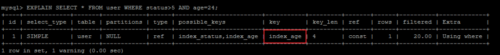

**8）数据库执行计算不会命中索引。**

EXPLAIN SELECT * FROM user WHERE age>24;


EXPLAIN SELECT * FROM user WHERE age+1>24;


计算逻辑应该尽量放到业务层处理，节省数据库的CPU的同时最大限度的命中索引。

**9）利用覆盖索引进行查询，避免回表。**

被查询的列，数据能从索引中取得，而不用通过行定位符row-locator再到row上获取，即“被查询列要被所建的索引覆盖”，这能够加速查询速度。

user表的索引详情：


因为status字段是索引列，所以直接从索引中就可以获取值，不必回表查询：

Using Index代表从索引中查询：

EXPLAIN SELECT status FROM user where status=1;


当查询其他列时，就需要回表查询，这也是为什么要避免SELECT*的原因之一：

EXPLAIN SELECT * FROM user where status=1;


**10）建立索引的列，不允许为null。**

单列索引不存null值，复合索引不存全为null的值，如果列允许为null，可能会得到“不符合预期”的结果集，所以，请使用not null约束以及默认值。

remark列建立索引：

ALTER TABLE user ADD INDEX index_remark (remark);


IS NULL可以命中索引：

EXPLAIN SELECT * FROM user WHERE remark IS NULL;


IS NOT NULL不能命中索引：

EXPLAIN SELECT * FROM user WHERE remark IS NOT NULL;


虽然IS NULL可以命中索引，但是NULL本身就不是一种好的数据库设计，应该使用NOT NULL约束以及默认值。


a. 更新十分频繁的字段上不宜建立索引：因为更新操作会变更B+树，重建索引。这个过程是十分消耗数据库性能的。

b. 区分度不大的字段上不宜建立索引：类似于性别这种区分度不大的字段，建立索引的意义不大。因为不能有效过滤数据，性能和全表扫描相当。另外返回数据的比例在30%以外的情况下，优化器不会选择使用索引。

c. 业务上具有唯一特性的字段，即使是多个字段的组合，也必须建成唯一索引。虽然唯一索引会影响insert速度，但是对于查询的速度提升是非常明显的。另外，即使在应用层做了非常完善的校验控制，只要没有唯一索引，在并发的情况下，依然有脏数据产生。

d. 多表关联时，要保证关联字段上一定有索引。

e. 创建索引时避免以下错误观念：索引越多越好，认为一个查询就需要建一个索引；宁缺勿滥，认为索引会消耗空间、严重拖慢更新和新增速度；抵制唯一索引，认为业务的唯一性一律需要在应用层通过“先查后插”方式解决；过早优化，在不了解系统的情况下就开始优化。


小结：

**对于自己编写的SQL查询语句，要尽量使用EXPLAIN命令分析一下，做一个对SQL性能有追求的程序员。衡量一个程序员是否靠谱，SQL能力是一个重要的指标。作为后端程序员，深以为然。**


参考：https://www.cnblogs.com/gdjk/p/10668868.html （这篇文章写得真好，美团的一位工程师）


补充：

#### explain

**用法：在select语句前加上explain**
显示mysql如何使用索引来处理select语句以及连接表，可以帮助选择更好的索引和写出更优化的查询语句

参考CS的文档，还有：https://www.jianshu.com/p/f29a619b3ee8


## 5.联合索引

由多列属性组成的索引。

下面为创建和删除所有的操作：

```sql
#联合索引
ALTER TABLE litemall_user ADD INDEX index_name_username (username,parent_id)
#索引一旦创建，就不能再修改，只能通过下面删除
DROP INDEX index_name_username ON litemall_user;
```


## 6.MySQL的分库分表，以及SQL语句优化、

#### **数据库分表：**

维度：

##### **垂直拆分**

 垂直分库（根据业务不同与微服务类似单独服务对应单独库）
 垂直分表

垂直分表是基于数据库中的”列”进行，某个表字段较多，可以新建一张扩展表，将不经常用或字段长度较大的字段拆分出去到扩展表中。在字段很多的情况下（例如一个大表有100多个字段），通过”大表拆小表”，更便于开发与维护，也**能避免跨页问题**，MySQL底层是通过数据页存储的，**一条记录占用空间过大会导致跨页，造成额外的性能开销**。另外数据库以行为单位将数据加载到内存中，这样表中字段长度较短且访问频率较高，内存能加载更多的数据，命中率更高，减少了磁盘IO，从而提升了数据库性能。

拆分字段的操作建议在数据库设计阶段就做好。如果是在发展过程中拆分，则需要改写以前的查询语句，会额外带来一定的成本和风险，建议谨慎。

 **垂直拆分优缺点：**

 **优点：**
解决业务系统层面的耦合，业务清晰
与微服务的治理类似，也能对不同业务的数据进行分级管理、维护、监控、扩展等
高并发场景下，垂直切分一定程度的提升IO、数据库连接数、单机硬件资源的瓶颈
 缺点：
部分表无法join，只能通过接口聚合方式解决，提升了开发的复杂度
依然存在单表数据量过大的问题（需要水平切分）
分布式事务处理复杂


##### 水平拆分

（根据表内数据内在的逻辑关系，将同一个表按不同的条件分散到多个数据库或多个表中，每个表中只包含一部分数据，从而使得单个表的数据量变小，达到分布式的效果。）

 **水平拆分优缺点：**
 优点：
不存在单库数据量过大、高并发的性能瓶颈，提升系统稳定性和负载能力
应用端改造较小，不需要拆分业务模块
“冷热数据分离”实现方案
 缺点：
跨分片事务难以保证
跨分片的复杂查询如join关联查询
数据多次扩展难度和维护量极大


##### 数据分片规则

 冷热数据隔离（近6个月或者1年的数据作为热数据，历史数据作为冷数据再进行时间维度拆分）
 地域区域或者其他拆分方式
 userNo范围分表，比如0~500w用户在user1表，501w-1000w在user2表等
 优点：
单表大小可控
天然便于水平扩展，后期如果想对整个分片集群扩容时，只需要添加节点即可，无需对其他分片的数 据进行迁移
使用分片字段进行范围查找时，连续分片可快速定位分片进行快速查询，有效避免跨分片查询的问题
 缺点：
热点数据成为性能瓶颈。连续分片可能存在数据热点


还有一种很好地操作：

##### 数据库读写分离 ，弄一个主从数据库


##### hash取模mod的切分方式

 优点：根据主键id进行数据切分，达到数据均匀分布，使用一致性hash算法可以避免后期扩展问题
 缺点：跨分片聚合操作


#### SQL优化：

其实就是上面的，索引优化。


## 7. 主键索引和普通索引的区别。

#### 主键索引(Primary Key)

**数据表的主键列使用的就是主键索引。**

**一张数据表有只能有一个主键，并且主键不能为null，不能重复。**

**在mysql的InnoDB的表中，当没有显示的指定表的主键时，InnoDB会自动先检查表中是否有唯一索引的字段，如果有，则选择该字段为默认的主键，否则InnoDB将会自动创建一个6Byte的自增主键。**

#### 二级索引(辅助索引)

**二级索引又称为辅助索引，是因为二级索引的叶子节点存储的数据是主键。也就是说，通过二级索引，可以定位主键的位置。**

唯一索引，普通索引，前缀索引等索引属于二级索引。

**PS:不懂的同学可以暂存疑，慢慢往下看，后面会有答案的，也可以自行搜索。**

1. **唯一索引(Unique Key)** ：唯一索引也是一种约束。**唯一索引的属性列不能出现重复的数据，但是允许数据为NULL，一张表允许创建多个唯一索引。**建立唯一索引的目的大部分时候都是为了该属性列的数据的唯一性，而不是为了查询效率。
2. **普通索引(Index)** ：**普通索引的唯一作用就是为了快速查询数据，一张表允许创建多个普通索引，并允许数据重复和NULL。**
3. **前缀索引(Prefix)** ：前缀索引只适用于字符串类型的数据。前缀索引是对文本的前几个字符创建索引，相比普通索引建立的数据更小，
   因为只取前几个字符。
4. **全文索引(Full Text)** ：全文索引主要是为了检索大文本数据中的关键字的信息，是目前搜索引擎数据库使用的一种技术。Mysql5.6之前只有MYISAM引擎支持全文索引，5.6之后InnoDB也支持了全文索引。 

二级索引:

.png)

## 8.Mysql索引。有哪几种，作用，适用于什么场景。你们的项目中何处用了MySQL索引？用了哪一种？

#### 索引类型：

除了**主键索引**，还有下面：

1. 唯一索引(Unique Key)** ：唯一索引也是一种约束。**唯一索引的属性列不能出现重复的数据，但是允许数据为NULL，一张表允许创建多个唯一索引。**建立唯一索引的目的大部分时候都是**为了该属性列的数据的唯一性，而不是为了查询效率**。
2. **普通索引(Index)** ：**普通索引的唯一作用就是为了快速查询数据，一张表允许创建多个普通索引，并允许数据重复和NULL。**
3. **前缀索引(Prefix)** ：前缀索引只适用于字符串类型的数据。前缀索引是对文本的前几个字符创建索引，相比普通索引建立的数据更小，
   因为只取前几个字符。
4. **全文索引(Full Text)** ：全文索引主要是为了检索大文本数据中的关键字的信息，是目前搜索引擎数据库使用的一种技术。Mysql5.6之前只有MYISAM引擎支持全文索引，5.6之后InnoDB也支持了全文索引。 


#### 交易所项目中用到的索引：

对account用的是唯一索引，是为了避免重复。

对下面的email，authority，mobile等用的是一般索引，是为了查询快。


用户钱包里面也用了索引：对user_id,symbol   做了联合索引 （这两个是有规律，稳定的，不变的）


#### 商城项目里面用到的索引：

商城里面也是只有user表里面用了一个索引：


## 9.讲一下你对MySQL的理解，主键索引和非主键索引的存储结构和存储内容分别都是什么？用过联合索引吗？

首先MySQL是关系型数据库，然后说一下关系型数据库。。。非关系型数据库。


#### 主键索引和非主键索引有什么区别？

例如对于下面这个表(其实就是上面的表中增加了一个k字段),且ID是主键。


 

主键索引和非主键索引的示意图如下：


 

其中R代表一整行的值。

从图中不难看出，主键索引和非主键索引的区别是：非主键索引的叶子节点存放的是**主键的值**，而主键索引的叶子节点存放的是**整行数据**，其中非主键索引也被称为**二级索引**，而主键索引也被称为**聚簇索引**。

根据这两种结构我们来进行下查询，看看他们在查询上有什么区别。

1、如果查询语句是 select * from table where ID = 100,即主键查询的方式，则只需要搜索 ID 这棵 B+树。

2、如果查询语句是 select * from table where k = 1，即非主键的查询方式，则先搜索k索引树，得到ID=100,再到ID索引树搜索一次，这个过程也被称为回表。

现在，知道他们的区别了吧？


参考：https://www.cnblogs.com/heishuichenzhou/p/10813463.html （写的挺好的）


这里再说一下聚集索引和非聚集索引：

#### 聚集索引

**聚集索引即索引结构和数据一起存放的索引。主键索引属于聚集索引。**

在 Mysql 中，InnoDB引擎的表的 `.ibd`文件就包含了该表的索引和数据，对于 InnoDB 引擎表来说，该表的索引(B+树)的每个非叶子节点存储索引，叶子节点存储索引和索引对应的数据。

##### 聚集索引的优点

聚集索引的查询速度非常的快，因为整个B+树本身就是一颗多叉平衡树，叶子节点也都是有序的，定位到索引的节点，就相当于定位到了数据。

##### 聚集索引的缺点

1. **依赖于有序的数据** ：因为B+树是多路平衡树，如果索引的数据不是有序的，那么就需要在插入时排序，如果数据是整型还好，否则类似于字符串或UUID这种又长又难比较的数据，插入或查找的速度肯定比较慢。
2. **更新代价大** ： 如果对索引列的数据被修改时，那么对应的索引也将会被修改，
   而且况聚集索引的叶子节点还存放着数据，修改代价肯定是较大的，
   所以对于主键索引来说，主键一般都是不可被修改的。

#### 非聚集索引

**非聚集索引即索引结构和数据分开存放的索引。**

**二级索引属于非聚集索引。**

> MYISAM引擎的表的.MYI文件包含了表的索引，
> 该表的索引(B+树)的每个叶子非叶子节点存储索引，
> 叶子节点存储索引和索引对应数据的指针，指向.MYD文件的数据。
>
> **非聚集索引的叶子节点并不一定存放数据的指针，
> 因为二级索引的叶子节点就存放的是主键，根据主键再回表查数据。**

##### 非聚集索引的优点

**更新代价比聚集索引要小** 。非聚集索引的更新代价就没有聚集索引那么大了，非聚集索引的叶子节点是不存放数据的

##### 非聚集索引的缺点

1. 跟聚集索引一样，非聚集索引也依赖于有序的数据
2. **可能会二次查询(回表)** :这应该是非聚集索引最大的缺点了。 当查到索引对应的指针或主键后，可能还需要根据指针或主键再到数据文件或表中查询。

这是Mysql的表的文件截图:


聚集索引和非聚集索引:


#### 联合索引

联合索引即由多列属性组成索引。

##### 最左前缀原则

假设创建的联合索引由三个字段组成: 

```text
ALTER TABLE table ADD INDEX index_name (num,name,age)
```

那么当查询的条件有为:num / (num AND name) / (num AND name AND age)时，索引才生效。所以在创建联合索引时，尽量把查询最频繁的那个字段作为最左(第一个)字段。查询的时候也尽量以这个字段为第一条件。


## 10.如果SQL查询很慢，如何排查并优化？如果主从分离之后，查询还是很慢，比如数据库有几百万的数据，这个时候应该怎么办？

#### 排查优化：

1.看一下索引，建的合适不

```sql
show index from litemall_user
```


2.然后执行一个查询语句，看一下

```sql
explain SELECT * from litemall_user where username = "steve"
```

看一下建的索引用上了没有？


3.还可以看看type，SQl优化的目标是，至少要达到range级别，要求是ref级别，最好是consts级别。（阿里开发手册，索引规约）

4.然后要结合那十几个索引优化规则看一下Sql写的合适不。


#### 主从分离：

##### 主从分离原理


 

　　**1.第一步**：Master（主服务器）将操作记录到binary log（二进制日志文件当中）【即每个事务更新数据完成之前先把操作记录在日志文件中，Mysql将事务串行的写入二进制日志文件中】，写入日志文件完成之后，Master通知存储引擎提交事务（注：对数据的操作成为一次二进制的日志事件【binary log event】）；

　　**2.第二步**：slave（从服务器）把binary log拷贝到relay log（中介日志）【相当于缓存作用，存储在从服务器的缓存中】，首先slave会开始一个工作线程（I/O线程），I/O线程会在Master上打开一个普通的连接，然后读取binary log事件，如果已经跟上master，就会睡眠，并等待Master产生新的事件，I/O线程将读取的这些事件写入到relay log；

　　**3.第三步**：slave从做中介日志事件（relay log），sql线程读取relay log事件并执行更新从服务器上的数据，使其与Master上的数据一致。

　　**总结**：主服务器把操作记录到binary log——>从服务器将binary log中的数据同步到relay log（中介日志中）——>从服务器读取中介日志执行同步数据


具体的配置流程，参考：https://www.cnblogs.com/lyq-biu/p/10857766.html


##### 主从分离以后还是很慢，考虑分表？还是还有其他更加好的操作？（然后再细致的研究）

分表，怎么分？就是上面说的垂直，水平，热度，哈希等。


## 11.什么是事务？事务的特性？并发事务带来的问题？事务的隔离级别? 什么叫可重复度？Mysql怎么解决不可重复读和幻读？ Mysql默认是哪个隔离级别？事务的传播形式？

#### 什么是事务?

事务是逻辑上的一组操作，要么都执行，要么都不执行。

事务最经典也经常被拿出来说例子就是转账了。假如小明要给小红转账1000元，这个转账会涉及到两个关键操作就是：将小明的余额减少1000元，将小红的余额增加1000元。万一在这两个操作之间突然出现错误比如银行系统崩溃，导致小明余额减少而小红的余额没有增加，这样就不对了。事务就是保证这两个关键操作要么都成功，要么都要失败。

#### 事务的特性（ACID）：


1. **原子性：** 事务是最小的执行单位，不允许分割。事务的原子性确保动作要么全部完成，要么完全不起作用；
2. **一致性：** 执行事务前后，数据保持一致，例如转账业务中，无论事务是否成功，转账者和收款人的总额应该是不变的；
3. **隔离性：** 并发访问数据库时，一个用户的事务不被其他事务所干扰，各并发事务之间数据库是独立的；
4. **持久性：** 一个事务被提交之后。它对数据库中数据的改变是持久的，即使数据库发生故障也不应该对其有任何影响。


#### 并发事务带来的问题：

在典型的应用程序中，多个事务并发运行，经常会操作相同的数据来完成各自的任务（多个用户对统一数据进行操作）。并发虽然是必须的，但可能会导致以下的问题。

- **脏读（Dirty read）:** 当一个事务正在访问数据并且对数据进行了修改，而这种修改还没有提交到数据库中，这时另外一个事务也访问了这个数据，然后使用了这个数据。因为这个数据是还没有提交的数据，那么另外一个事务读到的这个数据是“脏数据”，依据“脏数据”所做的操作可能是不正确的。
- **丢失修改（Lost to modify）:** 指在一个事务读取一个数据时，另外一个事务也访问了该数据，那么在第一个事务中修改了这个数据后，第二个事务也修改了这个数据。这样第一个事务内的修改结果就被丢失，因此称为丢失修改。	例如：事务1读取某表中的数据A=20，事务2也读取A=20，事务1修改A=A-1，事务2也修改A=A-1，最终结果A=19，事务1的修改被丢失。
- **不可重复读（Unrepeatableread）:** 指在一个事务内多次读同一数据。在这个事务还没有结束时，另一个事务也访问该数据。那么，在第一个事务中的两次读数据之间，由于第二个事务的修改导致第一个事务两次读取的数据可能不太一样。这就发生了在一个事务内两次读到的数据是不一样的情况，因此称为不可重复读。
- **幻读（Phantom read）:** 幻读与不可重复读类似。它发生在一个事务（T1）读取了几行数据，接着另一个并发事务（T2）插入了一些数据时。在随后的查询中，第一个事务（T1）就会发现多了一些原本不存在的记录，就好像发生了幻觉一样，所以称为幻读。

**不可重复度和幻读区别：**

不可重复读的重点是修改，幻读的重点在于新增或者删除。

例1（同样的条件, 你读取过的数据, 再次读取出来发现值不一样了 ）：事务1中的A先生读取自己的工资为     1000的操作还没完成，事务2中的B先生就修改了A的工资为2000，导        致A再读自己的工资时工资变为  2000；这就是不可重复读。

 例2（同样的条件, 第1次和第2次读出来的记录数不一样 ）：假某工资单表中工资大于3000的有4人，事务1读取了所有工资大于3000的人，共查到4条记录，这时事务2 又插入了一条工资大于3000的记录，事务1再次读取时查到的记录就变为了5条，这样就导致了幻读。

#### **事务隔离级别**

- **SQL 标准定义了四个隔离级别：**

  - **READ-UNCOMMITTED(读取未提交)：** 最低的隔离级别，允许读取尚未提交的数据变更，**可能会导致脏读、幻读或不可重复读**。
  - **READ-COMMITTED(读取已提交)：** 允许读取并发事务已经提交的数据，**可以阻止脏读，但是幻读或不可重复读仍有可能发生**。
  - **REPEATABLE-READ(可重复读)：**  对同一字段的多次读取结果都是一致的，除非数据是被本身事务自己所修改，**可以阻止脏读和不可重复读，但幻读仍有可能发生**。
  - **SERIALIZABLE(可串行化)：** 最高的隔离级别，完全服从ACID的隔离级别。所有的事务依次逐个执行，这样事务之间就完全不可能产生干扰，也就是说，**该级别可以防止脏读、不可重复读以及幻读**。

  ------

  |     隔离级别     | 脏读 | 不可重复读 | 幻影读 |
  | :--------------: | :--: | :--------: | :----: |
  | READ-UNCOMMITTED |  √   |     √      |   √    |
  |  READ-COMMITTED  |  ×   |     √      |   √    |
  | REPEATABLE-READ  |  ×   |     ×      |   √    |
  |   SERIALIZABLE   |  ×   |     ×      |   ×    |

  MySQL InnoDB 存储引擎的默认支持的隔离级别是 **REPEATABLE-READ（可重读）**。我们可以通过`SELECT @@tx_isolation;`命令来查看,MySQL 8.0 该命令改为`SELECT @@transaction_isolation;`

  ```sql
  mysql> SELECT @@tx_isolation;
  +-----------------+
  | @@tx_isolation  |
  +-----------------+
  | REPEATABLE-READ |
  +-----------------+
  ```

  实际操作：

  

  这里需要注意的是：与 SQL 标准不同的地方在于InnoDB 存储引擎在 **REPEATABLE-READ（可重读）**事务隔离级别下使用的是Next-Key Lock 锁算法，因此可以避免幻读的产生，这与其他数据库系统(如 SQL Server)是不同的。所以说InnoDB 存储引擎的默认支持的隔离级别是 **REPEATABLE-READ（可重读）** 已经可以完全保证事务的隔离性要求，即达到了 SQL标准的**SERIALIZABLE(可串行化)**隔离级别。

  因为隔离级别越低，事务请求的锁越少，所以大部分数据库系统的隔离级别都是**READ-COMMITTED(读取提交内容):**，但是你要知道的是InnoDB 存储引擎默认使用 **REPEATABLE-READ（可重读）**并不会有任何性能损失。

  InnoDB 存储引擎在 **分布式事务** 的情况下一般会用到**SERIALIZABLE(可串行化)**隔离级别。

#### 什么叫可重复读？

事务隔离级别第三条。

**REPEATABLE-READ(可重复读)：**  **对同一字段的多次读取结果都是一致的**，除非数据是被本身事务自己所修改，**可以阻止脏读和不可重复读，但幻读仍有可能发生**。

#### Mysql怎么解决不可重复读和幻读？默认什么隔离级别？

首先序列化是都可以避免这两种的。

**SERIALIZABLE(可串行化)：** 最高的隔离级别，完全服从ACID的隔离级别。所有的事务依次逐个执行，这样事务之间就完全不可能产生干扰，也就是说，**该级别可以防止脏读、不可重复读以及幻读**。


**但是Mysql默认用的可重复读**，也可以避免这两种问题，原因是：

与 SQL 标准不同的地方在于InnoDB 存储引擎在 **REPEATABLE-READ（可重读）**事务隔离级别下使用的是Next-Key Lock 锁算法，因此可以避免幻读的产生。

InnoDB 存储引擎在 **分布式事务** 的情况下一般会用到**SERIALIZABLE(可串行化)**隔离级别。


#### 事务的传播形式：

传播方式： 

​      **新建事务**

​      required

​      required_new   - 挂起当前

​      **非事务方式运行**

​      supports

​      not_supported  - 挂起当前

​      never  

​      **嵌套事务：**

​      nested

​      **抛异常**

​      mandatory   

​      never

 

Spring定义了一下几种事务传播方式：

PROPAGATION_REQUIRED        支持当前事务，如果当前没有事务，就**新建一个事务**。这是最常见的选择。

PROPAGATION_SUPPORTS            支持当前事务，如果当前没有事务，就以**非事务方式**执行。

PROPAGATION_MANDATORY         支持当前事务，如果当前没有事务，就**抛出异常**。

 

PROPAGATION_REQUIRES_NEW     **新建事务**，如果当前存在事务，**把当前事务挂起**。

PROPAGATION_NOT_SUPPORTED   以**非事务方式**执行操作，如果当前存在事务，就**把当前事务挂起。**

PROPAGATION_NEVER                 以**非事务方式**执行，如果当前存在事务，则**抛出异常**。

PROPAGATION_NESTED            如果当前事务存在，则以**嵌套事务**的方式执行。否则就按照它自己的事务方式执行。

 参考：https://www.iteye.com/blog/uule-1420799


## 12.组合索引（联合索引）A,B两字段怎么用？A,B,AB 为什么这么做？

组合索引遵循最左前缀原则（但是如果Mysql版本8.0以后据说不遵循这个原则，为什么，需要考究）

至于为什么呢？看了一个网上的辩论：https://bbs.csdn.net/topics/390727789

有一个老哥举了一个例子：

```java
//假设数据 表T (a,b,c) rowid 为物理位置
rowid a b c
(1) 1 1 1
(2) 2 1 13
(3) 2 2 14
(4) 1 3 3
(5) 2 3 12
(6) 1 2 5
(7) 2 3 9
(8) 1 2 2
(9) 1 3 6
(10) 2 2 11
(11) 2 2 8
(12) 1 1 7
(13) 2 3 15
(14) 1 1 4
(15) 2 1 10

当你创建一个索引 create index xxx on t(a,b), 则索引文件逻辑上等同于如下
a b rowid
1 1 1
1 1 12
1 1 14
1 2 6
1 2 8
1 3 4
1 3 9
2 1 2
2 1 15
2 2 3
2 2 10
2 2 11
2 3 5
2 3 7
2 3 13
```

当select * from T where a=1 and b=3 的时候， 数据库系统可以直接从索引文件中直接二分法找到A=1的记录，然后再B=3的记录。
但如果你 where b=3 则需要遍历这个索引表的全部！  


自己个人理解就和查字典一样，加入你查a开始的单词，如果你没有参考目录，从a的范围内找，那只能遍历整本字典啦。

再往底层来说就是：索引在B+树里面存着，只有叶子节点有数据，上面的非叶子节点只充当一个索引的角色，如果你没有显示第一层索引，直接从第二次开始，就肯定用不到索引，只能遍历。因为没有第一层的话，第二次是无序的。


## 13.怎样判断索引是否有生效，mysql的定时计划任务有用过吗？

用explainpan加载sql语句之前判断，

如果没有生效：


如果生效啦：


定时任务：

用event_scheduler（时间）

```sql
#查看定时任务是否开启
show variables like "%event_sche%";
#如果没有开启就 开启定时任务
set global event_scheduler=1;
#关闭定时任务
set global event_scheduler=0;
```

详细操作：参考：https://jingyan.baidu.com/article/e75aca853cf6b9142fdac64f.html


## 14.Mysql底层是什么数据结构，说一下你对B+树的理解，为什么数据库底层不用平衡二叉树，而要用B+树呢？(因为B+树查找快速，而且只有3层，可以减少IO次数)

Mysql底层用的数据结构是B+树和哈希表，不过多数是B+树。说B+树之前先说一下B树。

哈希表只查一个数据的时候还行，查范围就不行啦。

**一个m阶的B树具有如下几个特征：**（B+树的阶数m表示一个节点最多能有m个子节点，也就是每个节点上最多的键值个数）（这里下面的图，m应该表示的是3）

1.根结点至少有两个子女。

2.每个中间节点都至少包含`ceil(m / 2)`个孩子，最多有m个孩子。 （ceil是向上取整，这里是ceil（1.5）= 2）

3.每一个叶子节点都包含k-1个元素，其中 m/2 <= k <= m。 （1.5<=k<=3）

4.所有的叶子结点都位于同一层。

5.每个节点中的元素从小到大排列，节点当中k-1个元素正好是k个孩子包含的元素的值域分划。


#### B+树与B树的区别

- 有k个子结点的结点必然有k个关键码；
- 非叶结点仅具有索引作用，跟记录有关的信息均存放在叶结点中。
- 树的所有叶结点构成一个有序链表，可以按照关键码排序的次序遍历全部记录。

#### 为什么不用平衡二叉树？

因为随着数据量的增多，二叉树的高度会很高，查询就变慢啦。


#### 那为什么要用B+树呢？

以InnoDB为例：

数据是放在主键索引上面，也就是说实际上在每个节点上还会存放所有的数据

使用B树存放数据之后实际是这样子的，会在每个对应的索引列的值上存放上对应的数据


而B+树则不同，它只会在叶子节点上面挂载数据，非叶子节点不会存放数据，数据只会存在叶子节点上面，非叶子节点只存放索引列的数据

 

这样一个节点就可以存放很多个索引列数据，一次IO就可以拿到很多数据，mysql默认的一个节点16K的大小，可以通过show global status like "Innodb_page_size" 看到该值是16384，每次IO读取16K大小的数据，以索引列是bigInt类型为例，大小8字节，每一条数据还有一个指向下一层的指针6字节，16384/（8+6）=1170，一个节点就大约可以存1170条数据。

以一个**层高为3的树**为例，叶子节点存放数据之后大小1KB，那么这个树可以存放 1170 *1170 *16 =21,902,400,**大约2200万条数据**。所以在这种千万级的表中通过主键索引查找一条数据，最多3次IO就可以找到一条数据。而很多时候树的根节点基本都是在内存中，所以多数时候只需要2次IO。

叶子节点之间也有双向指针连接，提高区间范围性能，范围查找。

创建索引的时候，可以选择索引数据类型，一个是btree一个是hash，hash查找当然也快，但是当遇到范围查找的时候hash就尴尬了，所以根据实际业务需求来看是用btree还是hash。

参考：https://www.cnblogs.com/nijunyang/p/11406688.html


## 15.数据库的索引是什么意思，什么时候需要创建索引，索引是不是越多越好，like关键字会触发索引吗？建立索引需要注意的事情。

#### 什么是索引?

**索引是一种用于快速查询和检索数据的数据结构。常见的索引结构有: B树， B+树和Hash。**

索引的作用就相当于目录的作用。打个比方: 我们在查字典的时候，如果没有目录，那我们就只能一页一页的去找我们需要查的那个字，速度很慢。如果有目录了，我们只需要先去目录里查找字的位置，然后直接翻到那一页就行了。

#### 什么时候需要创建索引？

**1.数据量很大，需要建索引，数据库本来有主键索引**

**2.被频繁查询的字段**

我们创建索引的字段应该是查询操作非常频繁的字段。

**3.被作为条件查询的字段** 

被作为WHERE条件查询的字段，应该被考虑建立索引。

**4.被经常频繁用于连接的字段**

经常用于连接的字段可能是一些外键列，对于外键列并不一定要建立外键，只是说该列涉及到表与表的关系。对于频繁被连接查询的字段，可以考虑建立索引，提高多表连接查询的效率。

#### 什么时候不需要创建索引？

**1.被频繁更新的字段应该慎重建立索引**

虽然索引能带来查询上的效率，但是维护索引的成本也是不小的。
如果一个字段不被经常查询，反而被经常修改，那么就更不应该在这种字段上建立索引了。

**2.不被经常查询的字段没有必要建立索引**

**3.尽可能的考虑建立联合索引而不是单列索引**

因为索引是需要占用磁盘空间的，可以简单理解为每个索引都对应着一颗B+树。如果一个表的字段过多，索引过多，那么当这个表的数据达到一个体量后，索引占用的空间也是很多的，且修改索引时，耗费的时间也是较多的。如果是联合索引，多个字段在一个索引上，那么将会节约很大磁盘空间，且修改数据的操作效率也会提升。

**4.注意避免冗余索引**

冗余索引指的是索引的功能相同，能够命中 就肯定能命中 ，那么 就是冗余索引如（name,city ）和（name ）这两个索引就是冗余索引，能够命中后者的查询肯定是能够命中前者的 在大多数情况下，都应该尽量扩展已有的索引而不是创建新索引。

**5.考虑在字符串类型的字段上使用前缀索引代替普通索引**

前缀索引仅限于字符串类型，较普通索引会占用更小的空间，所以可以考虑使用前缀索引带替普通索引。

#### 索引是不是越多越好？

当然不是越多越好，建索引需要占用内存，需要维护，如果数据量还很小的话，用索引查询反而很慢。

#### like关键字会不会触发索引？

左模糊，前模糊不会触发索引，右模糊会触发索引。


#### 建索引规则，主要是阿里开发手册

1）业务上唯一特性的字段，即使是多个字段，也要建立唯一索引

2）超过三个表就禁止join啦，多表查询是，关联字段建索引

3）页面搜多禁止左模糊和全模糊，会使索引失效

4）用覆盖索引进行查询操作（翻字典，索引里面有，就不用翻里面的啦）

5）分页查询，如果数据量很大，用子查询优化

6）SQL性能优化的目标至少要达到range级别等


## 16.数据库的第三范式是什么？

数据库其实有好多范式。

#### 范式的简介

范式是关系数据库理论的基础，也是我们在设计数据库结构过程中所要遵循的规则和指导方法。目前有迹可寻的共有8种范式，依次是：1NF，2NF，3NF，BCNF，4NF，5NF，DKNF，6NF。通常所用到的只是前三个范式，即：第一范式（1NF），第二范式（2NF），第三范式（3NF）。

数据往往种类繁多，而且每种数据之间又互相关联，因此，在设计数据库时，所需要满足的范式越多，那表的层次及结构也就越复杂，最终造成数据的处理困难。这样，还不如不满足这些范式呢。所以在使用范式的时候也要细细斟酌，是否一定要使用该范式，必须根据实际情况做出选择。**一般情况下，我们使用前三个范式已经够用了，不再使用更多范式，就能完成对数据的优化，达到最优效果。**

#### 通俗的理解

**第一范式就是属性不可分割**，每个字段都应该是不可再拆分的。比如一个字段是姓名（NAME），在国内的话通常理解都是姓名是一个不可再拆分的单位，这时候就符合第一范式；但是在国外的话还要分为FIRST NAME和LAST NAME，这时候姓名这个字段就是还可以拆分为更小的单位的字段，就不符合第一范式了。

第二范式就是要求表中要有主键，表中其他其他字段都依赖于主键，因此**第二范式只要记住主键约束**就好了。比如说有一个表是学生表，学生表中有一个值唯一的字段学号，那么学生表中的其他所有字段都可以根据这个学号字段去获取，依赖主键的意思也就是相关的意思，因为学号的值是唯一的，因此就不会造成存储的信息对不上的问题，即学生001的姓名不会存到学生002那里去。

第三范式就是要求表中不能有其他表中存在的、存储相同信息的字段，通常实现是在通过外键去建立关联，因此**第三范式只要记住外键约束就好了**。比如说有一个表是学生表，学生表中有学号，姓名等字段，那如果要把他的系编号，系主任，系主任也存到这个学生表中，那就会造成数据大量的冗余，一是这些信息在系信息表中已存在，二是系中有1000个学生的话这些信息就要存1000遍。因此第三范式的做法是在学生表中增加一个系编号的字段（外键），与系信息表做关联。


## 17.Mysql有哪两种引擎，各自有什么特点？

#### 一些常用命令

**查看MySQL提供的所有存储引擎**

```sql
mysql> show engines;

```


从上图我们可以查看出 MySQL 当前默认的存储引擎是InnoDB,并且**在5.7版本所有的存储引擎中只有 InnoDB 是事务性存储引擎，也就是说只有 InnoDB 支持事务**。

**查看MySQL当前默认的存储引擎**

我们也可以通过下面的命令查看默认的存储引擎。

```sql
mysql> show variables like '%storage_engine%';

```

**查看表的存储引擎**

```sql
show table status like "table_name" ;

```


#### MyISAM和InnoDB区别  (读音：my ser mu  记忆：my is am 我是单复数)

MyISAM是MySQL的默认数据库引擎（5.5版之前）。虽然性能极佳，而且提供了大量的特性，包括全文索引、压缩、空间函数等，但MyISAM不支持事务和行级锁，而且最大的缺陷就是崩溃后无法安全恢复。不过，5.5版本之后，MySQL引入了InnoDB（事务性数据库引擎），MySQL 5.5版本后默认的存储引擎为InnoDB。

大多数时候我们使用的都是 InnoDB 存储引擎，但是在某些情况下使用 MyISAM 也是合适的比如读密集的情况下。（如果你不介意 MyISAM 崩溃恢复问题的话）。

**两者的对比：**

1. **是否支持行级锁** : MyISAM 只有表级锁(table-level locking)，而InnoDB 支持行级锁(row-level locking)和表级锁,默认为行级锁。
2. **是否支持事务和崩溃后的安全恢复： MyISAM** 强调的是性能，每次查询具有原子性,其执行速度比InnoDB类型更快，但是不提供事务支持。但是**InnoDB** 提供事务支持事务，外部键等高级数据库功能。 具有事务(commit)、回滚(rollback)和崩溃修复能力(crash recovery capabilities)的事务安全(transaction-safe (ACID compliant))型表。
3. **是否支持外键：** MyISAM不支持，而InnoDB支持。
4. **是否支持MVCC**（多版本并发控制） ：仅 InnoDB 支持。应对高并发事务, MVCC比单纯的加锁更高效;MVCC只在 `READ COMMITTED` 和 `REPEATABLE READ` 两个隔离级别下工作;MVCC可以使用 乐观(optimistic)锁 和 悲观(pessimistic)锁来实现;各数据库中MVCC实现并不统一。推荐阅读：[MySQL-InnoDB-MVCC多版本并发控制](https://segmentfault.com/a/1190000012650596)
5. ......

《MySQL高性能》上面有一句话这样写到:

> 不要轻易相信“MyISAM比InnoDB快”之类的经验之谈，这个结论往往不是绝对的。在很多我们已知场景中，InnoDB的速度都可以让MyISAM望尘莫及，尤其是用到了聚簇索引，或者需要访问的数据都可以放入内存的应用。

一般情况下我们选择 InnoDB 都是没有问题的，但是某些情况下你并不在乎可扩展能力和并发能力，也不需要事务支持，也不在乎崩溃后的安全恢复问题的话，选择MyISAM也是一个不错的选择。但是一般情况下，我们都是需要考虑到这些问题的。


## 18.SQL语句中的having是怎么用的？ where后面可以直接跟having吗？

#### where 过滤行，having过滤分组

```sql
select cust_id,count(*) as orders
from orders
group by cust_id
having count(*) >= 2

```

还有一种理解是：

where在数据分组之前过滤，having在数据分组之后过滤


#### where后面可以直接跟having吗？

```sql
#where 和 having 一起用
select vend_id,count(*) as num_prods
from products
where prod_price >= 10
group by vend_id
having count(*) >= 2

```

当然不能直接跟，中间需要group by ,因为having 是对分组进行过滤，只有分组了，才能过滤。


## 19.Mysql数据库中有1000条数据和5百万数据分别分页查询，其效率有区别吗？Mysql取第一页和取最后一页的数据的性能有区别吗？

当然有区别，区别还很大。

分页中偏移量越大查询越慢。

下面用到的SQL：

```sql
#分页  展示2条记录 偏移量是1
explain select * from litemall_user LIMIT 1 OFFSET 20000

#分页优化  用覆盖索引
explain select id from litemall_user limit 1 OFFSET 20000 

#将上面两种合二为一
explain SELECT * FROM litemall_user WHERE id >=(select id from litemall_user limit 1 OFFSET 20) limit 20

```


正常的在数据库有四万左右数据量的情况下，查三万条，数据偏移量为20，结果用上17秒


用覆盖索引：查出来只需要1秒多


将覆盖索引放入里面，


实际参考自：https://www.cnblogs.com/scotth/p/7995856.html （这篇文章写得还挺好的）


## 20.在SQL中，哪个字符用于连接不同的声明？ 在SQL中，哪个功能可以用于截取字符串？

#### 字符串连接函数：

（1）SELECT CONCAT('My', 'S', 'QL');       结果 'MySQL'

#### 字符串截取函数：

（1）SELECT  SUBSTR('MySQL', 2, 2);      结果：'yS'


## 21.SQL的条件约束有哪些，CHECK和DEFAULT是条件约束吗？

数据库常见的有五种约束：

Primary Key 约束、 Foreign Key 约束、 Unique 约束、 Default 约束和 Check 约束。


上面五种约束，可能是其他数据库，好像SQL Server的约束。（然后确定一下）


其实还有一种约束是 NOT NULL约束（非空约束）

参考：https://www.cnblogs.com/PatrickLiu/p/10607235.html


## 22.Mysql的常用数据类型有哪些，主键ID是用的哪种类型，存储金额用的是哪个类型，你们具体设置的数据长度是多少？

主键id 用int 长度是11 

金额 用decimal  对应bean对象里面的 Bigdecimal   数据库设置，长度20，小数点后8位 

参考：https://www.cnblogs.com/zzqc/p/9198614.html （常用的数据类型）


## 23.连接查询是用的哪个关键字，内连接、外连接、左连接和右连接具体有什么区别，

连接查询使用关键字是：JOIN ... ON

#### 内连接：两个饼的交集

```SQL
SELECT * FROM customer c INNER JOIN orders o ON c.id = o.customer.id

```

#### 外连接：左外连接，右外连接

```sql
SELECT * FROM customer c LEFT JOIN orders o ON c.id = o.customer.id   #左连接
SELECT * FROM customer c RIGHT JOIN orders o ON c.id = o.customer.id  #右连接

```


## 24.聚簇索引 索引放在什么节点上

这个也叫聚合索引，聚合索引就是索引和数据放在一起，主键索引就是一种聚合索引。

对于 InnoDB 引擎表来说，该表的**索引(B+树)的每个非叶子节点存储索引**，**叶子节点存储索引和索引对应的数据**。


## 25.怎么把这样一张表，查成下面这个结果（case... when）

year   month    amount

1991    1               1.1

1991    2               1.2

1991    3               1.3

1992     1              2.1

1992     2               2.2

1992      3              2.3

查成下面这个结果:

year      m1     m2       m3

1991     1.1      1.2        1.3

1992     2.1      2.2       2.3


使用的是**case when**  （特别相当于if else）

```sql
SELECT 
	year,
	MAX(case month when 1 then amount else 0 end) as 'm1',
	MAX(case month when 2 then amount else 0 end) as 'm2',
	MAX(case month when 3 then amount else 0 end) as 'm3'
	
	from test 
	GROUP BY year

```


参考：https://www.cnblogs.com/kirinboy/archive/2010/01/11/1644108.html （类似的一个题）

https://zhidao.baidu.com/question/127721814.html （百度）


## 26.如果要减少大量数据的查询时间，在不能用增加查询条件和分库分表的情况下该怎么做？

建索引呗。

建索引需要注意的点：

#### 选择合适的字段

##### 1.不为NULL的字段

索引字段的数据应该尽量不为NULL，因为对于数据为NULL的字段，数据库较难优化。如果字段频繁被查询，但又避免不了为NULL，建议使用0,1,true,false这样语义较为清晰的短值或短字符作为替代。

##### 2.被频繁查询的字段

我们创建索引的字段应该是查询操作非常频繁的字段。

##### 3.被作为条件查询的字段 

被作为WHERE条件查询的字段，应该被考虑建立索引。

##### 4.被经常频繁用于连接的字段

经常用于连接的字段可能是一些外键列，对于外键列并不一定要建立外键，只是说该列涉及到表与表的关系。对于频繁被连接查询的字段，可以考虑建立索引，提高多表连接查询的效率。

#### 不合适创建索引的字段

##### 1.被频繁更新的字段应该慎重建立索引

虽然索引能带来查询上的效率，但是维护索引的成本也是不小的。
如果一个字段不被经常查询，反而被经常修改，那么就更不应该在这种字段上建立索引了。

##### 2.不被经常查询的字段没有必要建立索引

##### 3.尽可能的考虑建立联合索引而不是单列索引

因为索引是需要占用磁盘空间的，可以简单理解为每个索引都对应着一颗B+树。如果一个表的字段过多，索引过多，那么当这个表的数据达到一个体量后，索引占用的空间也是很多的，且修改索引时，耗费的时间也是较多的。如果是联合索引，多个字段在一个索引上，那么将会节约很大磁盘空间，且修改数据的操作效率也会提升。

##### 4.注意避免冗余索引

冗余索引指的是索引的功能相同，能够命中 就肯定能命中 ，那么 就是冗余索引如（name,city ）和（name ）这两个索引就是冗余索引，能够命中后者的查询肯定是能够命中前者的 在大多数情况下，都应该尽量扩展已有的索引而不是创建新索引。

##### 5.考虑在字符串类型的字段上使用前缀索引代替普通索引

前缀索引仅限于字符串类型，较普通索引会占用更小的空间，所以可以考虑使用前缀索引带替普通索引。

## 27.你们运用mysql的时候，有没有遇到什么难题？

最近遇到修改sql_mode的问题。网上教程多为CentOS，我的为Ubuntu，linux结构不一样。（外网找的）


## 28.写sql将数据库中表中重复的数据删除掉，只保留id号最小的那条记录， 数据库表T有id，year，mouth，amount这五列。

```sql
DELETE 
FROM
	test 
WHERE
	year IN 
	(SELECT year FROM ( SELECT year FROM test GROUP BY year HAVING COUNT( year ) > 1) a ) 
	
	AND id NOT IN 
	(SELECT id FROM (SELECT MAX(id) as id FROM test GROUP BY year HAVING COUNT( year ) > 1) b )

```


## 29.Sql聚合函数有哪些，以聚合函数为条件要用什么关键字来查询？

|   函数    |       说明       |
| :-------: | :--------------: |
|  AVG（）  | 返回某列的平均值 |
| COUNT（） |  返回某列的行数  |
|  MAX（）  | 返回某列的最大值 |
|  MIN（）  | 返回某列的最小值 |
|  SUM（）  |   返回某列的和   |

不能将聚合函数直接跟到where后面，只能这样用：

```sql
#以聚合函数为条件 需要用什么关键字
SELECT SUM(amount)	from test GROUP BY year HAVING SUM(amount) > 4 

```

关于聚合函数 作为条件，在S《MySQL必知必会》上面p88有。

## 30.sql分组的关键字是什么

```sql
GROUP BY

```

## 31.备份的Sql语句,sql复制表的语句

#### SQL语句备份：

下面第一句 

```sql
--完整备份 
Backup Database NorthwindCS 
To disk='G:\Backup\NorthwindCS_Full_20070908.bak' 

--差异备份 
Backup Database NorthwindCS 
To disk='G:\Backup\NorthwindCS_Diff_20070908.bak' 
With Differential 

--日志备份，默认截断日志 
Backup Log NorthwindCS 
To disk='G:\Backup\NorthwindCS_Log_20070908.bak' 

--日志备份，不截断日志 
Backup Log NorthwindCS 
To disk='G:\Backup\NorthwindCS_Log_20070908.bak' 
With No_Truncate 

--截断日志不保留 
Backup Log NorthwindCS 
With No_Log 

--或者 
Backup Log NorthwindCS 
With Truncate_Only 
--截断之后日志文件不会变小 
--有必要可以进行收缩 

--文件备份 
Exec Sp_Helpdb NorthwindCS --查看数据文件 
Backup Database NorthwindCS 
File='NorthwindCS' --数据文件的逻辑名 
To disk='G:\Backup\NorthwindCS_File_20070908.bak' 

--文件组备份 
Exec Sp_Helpdb NorthwindCS --查看数据文件 
Backup Database NorthwindCS 
FileGroup='Primary' --数据文件的逻辑名 
To disk='G:\Backup\NorthwindCS_FileGroup_20070908.bak' 
With init 

--分割备份到多个目标 
--恢复的时候不允许丢失任何一个目标 
Backup Database NorthwindCS 
To disk='G:\Backup\NorthwindCS_Full_1.bak' 
,disk='G:\Backup\NorthwindCS_Full_2.bak' 

--镜像备份 
--每个目标都是相同的 
Backup Database NorthwindCS 
To disk='G:\Backup\NorthwindCS_Mirror_1.bak' 
Mirror 
To disk='G:\Backup\NorthwindCS_Mirror_2.bak' 
With Format --第一次做镜像备份的时候格式化目标 

--镜像备份到本地和远程 
Backup Database NorthwindCS 
To disk='G:\Backup\NorthwindCS_Mirror_1.bak' 
Mirror 
To disk='\\192.168.1.200\Backup\NorthwindCS_Mirror_2.bak' 
With Format 

--每天生成一个备份文件 
Declare @Path Nvarchar(2000) 
Set @Path ='G:\Backup\NorthwindCS_Full_' 
+Convert(Nvarchar,Getdate(),112)+'.bak' 

Backup Database NorthwindCS 
To http://www.hack58.net/Article/html/3/7/2008/mailtdisk=@Path 


--从NoRecovery或者 
--Standby模式恢复数据库为可用 
Restore Database NorthwindCS_Bak 
With Recovery 

--查看目标备份中的备份集 
Restore HeaderOnly 
From Disk ='G:\Backup\NorthwindCS_Full_20070908.bak' 

--查看目标备份的第一个备份集的信息 
Restore FileListOnly 
From Disk ='G:\Backup\NorthwindCS_Full_20070908_2.bak' 
With File=1 

--查看目标备份的卷标 
Restore LabelOnly 
From Disk ='G:\Backup\NorthwindCS_Full_20070908_2.bak' 

--备份设置密码保护备份 
Backup Database NorthwindCS 
To disk='G:\Backup\NorthwindCS_Full_20070908.bak' 
With Password = '123',init 

Restore Database NorthwindCS 
From disk='G:\Backup\NorthwindCS_Full_20070908.bak' 
With Password = '123' 

```

参考：https://www.cnblogs.com/liubaolongcool/archive/2012/06/27/2565401.html


#### sql语句复制一张表

1、复制表结构及数据到新表

```sql
CREATE TABLE 新表 SELECT * FROM 旧表

```

1 这种方法会将oldtable中所有的内容都拷贝过来，当然我们可以用delete from newtable;来删除。
不过这种方法的一个最不好的地方就是新表中没有了旧表的primary key、Extra（auto_increment）等属性。需要自己用”alter”添加，而且容易搞错。

2、只复制表结构到新表

```sql
CREATE TABLE 新表 SELECT * FROM 旧表 WHERE 1=2 或CREATE TABLE 新表 LIKE 旧表 

```

3、复制旧表的数据到新表(假设两个表结构一样)

```sql
INSERT INTO 新表 SELECT * FROM 旧表 

```

4、复制旧表的数据到新表(假设两个表结构不一样)

```sql
INSERT INTO 新表(字段1,字段2,.......) SELECT 字段1,字段2,...... FROM 旧表 

```

5、这样会将旧表的创建命令列出。我们只需要将该命令拷贝出来，更改table的名字，就可以建立一个完全一样的表

```sql
show create table 旧表; 

```

#### update更新表

1、set一个字段（把表student中的sname改为’张三’,条件是学号是13的，不加where条件的会把sno字段全改了）

```sql
update stutest t set t.Sname ='张三' where sno='13'

```

2、set一个字段（把表student中的sname改为’张三’ sage改为’22’,条件是学号是13的，不加where条件的会把sno字段全改了）

```sql
update stutest t set t.Sname ='张三',t.Sage ='22' where sno='13'

```

3、set null值（把表student中的sname改为null sage改为null,前提是字段要允许为空。条件是学号是13的，不加where条件的会把sno字段全改了）

```sql
update stutest t set t.ssss =null,t.aaaa =null where sno='13'

```

4、将stu1表中的一些数据更新到stu2表中.(stu1表和stu2表的字段名称可以不同)

4、将stu1表中的一些数据更新到stu2表中.(stu1表和stu2表的字段名称可以不同)

```sql
update stu1 t,stu2 tt set tt.Sno = t.Sno,tt.Sname = t.Sname,tt.Ssex = t.Ssex,tt.Sage = t.sage,tt.Sdept = t.sdept where t.Sno=tt.sno

```

参考：https://blog.csdn.net/yybk426/article/details/78888518


## 32.sql随机查10个数据的语句。

```sql
#随机查询两条数据
SELECT * FROM test ORDER BY RAND() LIMIT 2

```


## 33.用sql查询表a中id重复三次以上的记录。

表这样的：


```sql
#查询表中id重复三次以上的数据
select id from test group by id having count(id) >= 3;

```

查询结果：


## 34.项目的数据库是怎么设计的 （也很重要）

1.在设计表之前，要对产品需求什么的进行深刻的了解，业务不清楚的地方，要和项目组的人讨论，讨论确定一个好的可行性方案，一定要把业务搞清楚。如果有可能的话，将项目未来要发生的情况也考虑进去一点。


2.设计表要遵循的规则:

三大范式，分别可以理解为唯一约束，主键约束，外键约束。各个表的功能尽可能单一。外键约束尽量不要出现冗余的表信息。

对于以下：

一对一，正常放一个表，

一对多，多的那边放一的那边的id，

多对多，引入中间表。比如shiro权限管理那块，就需要两个中间表。


3.设计表的规范：要做什么，不做什么。

首先阿里的Java规范：

1）表是否的用is_hot表示，

2）表名字段名，必须用数字加小写字母，但是不要数字开头

3）表名不要复数名词，

4）不要用保留字

5）索引名，主键索引名pk_ , 唯一索引uk_ , 普通索引名idx_

6）小数类型用decimal，禁止使用float，double等

7）如果存储的字段为定长的，用char，如果不确定长度用varchar（不预先分配长度），超过5000，太长的话用test（还要独立弄出来一张表，用主键对应）

8）表必备三字段，id，create_time, update_time 

9） 索引什么的加上 （如果数据量大的话） 


个人经验：有些值设置上默认值，避免空指针。


参考：https://www.jianshu.com/p/d12998e0c495

https://www.cnblogs.com/huanghuanghui/p/sqltable.html

## 35.现在有张销售表，有一列是日期，要查某一年里、每隔2天的数据，怎么写？(一脸懵逼)

只有这个：https://blog.csdn.net/qq_36500199/article/details/80539764

## 36.怎么实现数据库的分表分库读写分离

搞一个主从数据库，参考第十条。


## 37.Java如何处理数据库的大字段

如果字符大小超过5000，数据库要将这个字段单独提取出去，用主键来对应，存为text类型。


## 38.如果controller try catch了异常，事务怎么办，A方法调用B方法有用到事务吗

如果全局try  catch，事务就不能回滚啦。需要在finnally里面手动回滚。

```java
try catch中需要手动回滚事务，使用Transactional 加 TransactionAspectSupport.currentTransactionStatus().setRollbackOnly();

```

参考 ： https://blog.csdn.net/qq_21870555/article/details/80923389?utm_source=blogxgwz9


## 39.如果让你设计一个朋友圈需要几张表？

关系型数据库需要几个表：

用户表，用户信息

评论表，qq，微信朋友圈评论方式不一样

时间轴 就是朋友圈信息表，按照时间逆序排序的


非关系型数据库能不能搞？加上redis，性能会好一些

## 40.数据库分页有哪几种方式和优缺点？

网上答案五花八门。

下面这个还能看。

#### 1.最基本的分页方式：

```sql
SELECT ... FROM ... WHERE ... ORDER BY ... LIMIT ...
1

```

在中小数据量的情况下，这样的SQL足够用了，唯一需要注意的问题就是确保使用了索引：
举例来说，如果实际SQL类似下面语句，那么在category_id, id两列上建立复合索引比较好：

```sql
SELECT * FROM articles WHERE category_id = 123 ORDER BY id LIMIT 50, 10
1

```

#### 2.子查询的分页方式：

随着数据量的增加，页数会越来越多，查看后几页的SQL就可能类似：

```sql
SELECT * FROM articles WHERE category_id = 123 ORDER BY id LIMIT 10000, 10

```

一言以蔽之，就是越往后分页，LIMIT语句的偏移量就会越大，速度也会明显变慢。
此时，我们可以通过子查询的方式来提高分页效率，大致如下：

```sql
SELECT * FROM articles WHERE  id >=   
 (SELECT id FROM articles  WHERE category_id = 123 ORDER BY id LIMIT 10000, 1) LIMIT 10，
12

```

#### 3. JOIN分页方式

```sql
SELECT * FROM `content` AS t1    
JOIN (SELECT id FROM `content` ORDER BY id desc LIMIT ".($page-1)*$pagesize.", 1) AS t2    
WHERE t1.id <= t2.id ORDER BY t1.id desc LIMIT $pagesize;
123

```

经过我的测试，join分页和子查询分页的效率基本在一个等级上，消耗的时间也基本一致。


优缺点比较：

第一种方式数据量很大的话，偏移量很大的话，会很慢。后两种方式快很多。

参考：https://blog.csdn.net/tiantang_1986/article/details/89668691

## 41.JDBC的操作数据库的步骤，JDBC连接数据库需要哪些参数？数据库连接池需要哪些参数？

#### JDBC连接数据库步骤：

1.加载数据库驱动

2.创建数据库连接

3.创建jdbc statement对象

4，执行sql，释放资源


```java
package com.jckb;

import java.sql.Connection;
import java.sql.DriverManager;
import java.sql.PreparedStatement;
import java.sql.ResultSet;
import java.sql.SQLException;

/**
 * jdbc编程步骤: 
 * 1、加载数据库驱动 
 * 2、创建并获取数据库链接 
 * 3、创建jdbc statement对象 
 * 4、设置sql语句
 * 5、设置sql语句中的参数(使用preparedStatement) 
 * 6、通过statement执行sql并获取结果 
 * 7、对sql执行结果进行解析处理
 * 8、释放资源(resultSet、preparedstatement、connection)
 * 
 */
public class TestJDBC {

    public static void main(String[] args)   {
        Connection con=null;
        PreparedStatement ps =null;
        ResultSet rs=null;
        try {
            //加载数据库驱动
            Class.forName("com.mysql.jdbc.Driver");
            //通过驱动管理类获取数据库链接
            con = DriverManager.getConnection("jdbc:mysql://localhost:3306/student", "root", "root");
            String sql="select stu.name,stu.age,stu.id from student stu where id = ? ";
            //执行sql语句
            ps = con.prepareStatement(sql);
            ps.setInt(1, 8);
            //遍历查询结果集
            rs = ps.executeQuery();
            while(rs.next()){
                System.out.println("姓名： "+rs.getString("name")+" 年龄："+rs.getInt("age")+" id: "+rs.getInt("id"));
            }
        } catch (ClassNotFoundException e) {
            e.printStackTrace();
        } catch (SQLException e){
            e.printStackTrace();
        }finally{
            //关闭资源
            try{
                if(rs != null){
                    rs.close();
                }
                if(ps != null){
                    ps.close();
                }
                if(con != null){
                    con.close();
                }
            }catch(SQLException e){
                e.printStackTrace();
            }
        }
    }
}

```

#### 数据库连接池：

目前数据库连接池种类繁多，不同种类基本的配置属性大同小异，例如**c3p0**、Proxool、DDConnectionBroker、DBPool、XAPool、**Druid**、**dbcp**，这里我们以dbcp为例说说主要的配置项：

```yml
#最大连接数量：连接池在同一时间能够分配的最大活动连接的数量,，如果设置为非正数则表示不限制，默认值8
maxActive=15
#最小空闲连接：连接池中容许保持空闲状态的最小连接数量，低于这个数量将创建新的连接，如果设置为0则不创建，默认值0
minIdle=5
#最大空闲连接：连接池中容许保持空闲状态的最大连接数量，超过的空闲连接将被释放，如果设置为负数表示不限制，默认值8
maxIdle=10
#初始化连接数：连接池启动时创建的初始化连接数量，默认值0
initialSize=5
#连接被泄露时是否打印
logAbandoned=true
#是否自动回收超时连接
removeAbandoned=true 
#超时时间(以秒数为单位)
removeAbandonedTimeout=180
# 最大等待时间:当没有可用连接时，连接池等待连接被归还的最大时间(以毫秒计数)，超过时间则抛出异常，如果设置为-1表示无限等待，默认值无限
maxWait=3000
#在空闲连接回收器线程运行期间休眠的时间值(以毫秒为单位).
timeBetweenEvictionRunsMillis=10000
#在每次空闲连接回收器线程(如果有)运行时检查的连接数量
numTestsPerEvictionRun=8
#连接在池中保持空闲而不被空闲连接回收器线程
minEvictableIdleTimeMillis=10000
#用来验证从连接池取出的连接
validationQuery=SELECT 1
#指明是否在从池中取出连接前进行检验
testOnBorrow=true
#testOnReturn  false  指明是否在归还到池中前进行检验
testOnReturn=true
#设置为true后如果要生效,validationQuery参数必须设置为非空字符串
testWhileIdle

```

数据库连接池：参考：https://www.fangzhipeng.com/javainterview/2019/07/15/mysql-connector-pool.html

## 42.一般对SQL优化是怎么操作的？如果子查询多了 怎么定位那个子查询

看上面第四个。从里到外面。

## 43.各种sql连表查询

- **连接查询**

交叉连接(cross join)

不带on子句，返回连接表中所有数据行的笛卡儿积（没啥用，但是这是其他查询的基础）

内连接

返回连接表中符合连接条件及查询条件的数据行

SELECT * FROM customer  c INNER JOIN orders  o ON c.id=o.customer_id; 

外连接

|-- 左外连接

|-- 右外连接

分为左外连接（left out join）、右外连接（right outer join）

与内连接不同的，外连接不仅返回连接表中符合连接条件及查询条件的数据行

也返回左表（左外连接时）或右表（右外连接时）中仅符合查询条件但不符连接条件的数据行

格式：

Select * from TABLE1 join_type TABLE2  [on (join_condition)] +[where(query_condition)];


- **子查询**

子查询也叫嵌套查询

是指在where子句或from子句中又嵌入select查询语句（一般写在where字句）

SELECT * FROM orders WHERE customer_id=(SELECT id FROM customer WHERE name LIKE ‘%郭靖%');


- **联合查询**

联合查询能够合并两条查询语句的查询结果，去掉其中的重复数据行，然后返并没有重复数据行的查询结果。

联合查询使用union关键字

SELECT * FROM orders WHERE price>100 UNION SELECT * FROM orders WHERE customer_id=1;

- **报表查询**

报表查询对数据行进行分组统计

select …  from … [where…] [ group by … [having… ]] [ order by … ]


44.COUNT(column_name) 计算指定列下的总行数，计算时会忽略值为NULL的行

GROUP BY {column_names} HAVING <filter_condition>;

聚合函数和group by 分组一起使用的时候，聚合函数会对每一个分组进行单独计算

在使用group by之后，再单独查询某个字段没有任何意义

## 44.说一下数据库的引擎、锁，数据库死锁怎么解决，如何尽可能的避免死锁呢？

1）以固定的顺序访问表和行。即按顺序申请锁，这样就不会造成互相等待的场面。

2）大事务拆小。大事务更倾向于死锁，如果业务允许，将大事务拆小。

3）在同一个事务中，尽可能做到一次锁定所需要的所有资源，减少死锁概率。

4）降低隔离级别。如果业务允许，将隔离级别调低也是较好的选择，比如将隔离级别从RR调整为RC，可以避免掉很多因为gap锁造成的死锁。

5）为表添加合理的索引。如果不走索引将会为表的每一行记录添加上锁，死锁的概率大大增大。


## 45.MySQL如果部署在不同的服务器上，应该如何查询？

参考 ： https://blog.csdn.net/wangliang369/article/details/83689737

## 46.在InnoDB中，主键索引和普通索引的查询过程区别

主键索引是聚合索引，数据和索引在一起放着。查询很快。

#### 聚合索引

**聚集索引即索引结构和数据一起存放的索引。主键索引属于聚集索引。**

在 Mysql 中，InnoDB引擎的表的 `.ibd`文件就包含了该表的索引和数据，对于 InnoDB 引擎表来说，该表的索引(B+树)的每个非叶子节点存储索引，叶子节点存储索引和索引对应的数据。

##### 聚集索引的优点

聚集索引的查询速度非常的快，因为整个B+树本身就是一颗多叉平衡树，叶子节点也都是有序的，定位到索引的节点，就相当于定位到了数据。

##### 聚集索引的缺点

1. **依赖于有序的数据** ：因为B+树是多路平衡树，如果索引的数据不是有序的，那么就需要在插入时排序，如果数据是整型还好，否则类似于字符串或UUID这种又长又难比较的数据，插入或查找的速度肯定比较慢。
2. **更新代价大** ： 如果对索引列的数据被修改时，那么对应的索引也将会被修改，
   而且况聚集索引的叶子节点还存放着数据，修改代价肯定是较大的，
   所以对于主键索引来说，主键一般都是不可被修改的。

#### 非聚集索引

**非聚集索引即索引结构和数据分开存放的索引。**

**二级索引属于非聚集索引。**

> MYISAM引擎的表的.MYI文件包含了表的索引，
> 该表的索引(B+树)的每个叶子非叶子节点存储索引，
> 叶子节点存储索引和索引对应数据的指针，指向.MYD文件的数据。
>
> **非聚集索引的叶子节点并不一定存放数据的指针，
> 因为二级索引的叶子节点就存放的是主键，根据主键再回表查数据。**

##### 非聚集索引的优点

**更新代价比聚集索引要小** 。非聚集索引的更新代价就没有聚集索引那么大了，非聚集索引的叶子节点是不存放数据的

##### 非聚集索引的缺点

1. 跟聚集索引一样，非聚集索引也依赖于有序的数据
2. **可能会二次查询(回表)** :这应该是非聚集索引最大的缺点了。 当查到索引对应的指针或主键后，可能还需要根据指针或主键再到数据文件或表中查询。

## 47. 你知道MySQL的字段类型有哪些吗？char和varchar的区别，datetime和timestamp的精确度区别

#### char定长，varchar不定长。

#### Date


#### DateTime


#### TimeStamp


#### Time


#### Date,DateTime,TimeStamp和Time 比较:

Date,DateTime，Time 这里就不比较了，三者显示以及精度都不一样，需要大家根据具体需求，具体选择。

那么，DateTime和TimeStamp都是年月日时分秒，为什么还有这两个类型呢？
1、精度：DateTime和TimeStamp都可以精确到毫秒（我目前使用的5.5的mysql，所以只能精确到秒，据说高版本的可以用TIMESTAMP(3)与 DATETIME(3)精确到毫秒。），但是用的很少，一般精确到毫秒都是用Timestamp，另外关于Timestamp的10位和13位的区别请参考我的另一篇文章java时间戳 10位和13位分别是怎么来的？
2、DateTime和TimeStamp最大的区别只是用的场景不同，如果你的应用 是用于不同时区（就是国内和国外同时使用），这时候如果用dateTime就会出现各种各样的问题，但是如果使用**TimeStamp就不会出现这种时差的问题**。

误区:之前我也也为datetime和TimeStamp是一样的，因为他们在数据库存的时间都是YYYY-MM-DD HH:mm:ss格式的，但是**TimeStamp类型存的是10位或者13位的时间戳**，不要被表现骗了，使用

```sql
select UNIX_TIMESTAMP(TIME) date from table即可获取时间戳里面具体存的什么

```


#### 简单说：

主键不能为空
而唯一可以为空
相同的就是  都不允许重复


#### 详细的说：

1.主键约束（PRIMARY KEY）

1) 主键用于唯一地标识表中的每一条记录，可以定义一列或多列为主键。 
2) 是不可能（或很难）更新． 
3) 主键列道上没有任何两行具有相同值（即重复值），不允许空（NULL）．
4) 主健可作外健，唯一内索引容不可；


2.唯一性约束（UNIQUE）
1) 唯一性约束用来限制不受主键约束的列上的数据的唯一性，用于作为访问某行的可选手段，一个表上可以放置多个唯一性约束．
2) 只要唯一就可以更新． 
3) 即表中任意两行在  指定列上都不允许有相同的值，允许空（NULL）．
4) 一个表上可以放置多个唯一性约束


参考：https://wenwen.sogou.com/z/q706838355.htm

## ***49.Oracle写过存储过程吗？  存储过程结合上个项目 重点看看  

挺难的 ，然后有时间，仔细看看

https://www.bilibili.com/video/BV1st411Y74h?p=9    bilibili

https://www.cnblogs.com/geaozhang/p/6797357.html  听说写的很好，但是看不懂

## 49.有设计过数据库表吗？做某个功能需要创建某张新的表

我这里回答的没有，其实应该说参与过的，当时犹豫了，面试官也没有接着往下问的欲望了


上面是学长的回答，面试是要说设计过。

## 50.你对SQL优化有哪些心得？（确定查询条件，分库分表，建立索引）

## ***51.分库分表具体是怎么操作的？(当时没有回答出来。面试官说他们采用的是Sharding-JDBC，进行逻辑上的分表) 如果一台服务器上有多个数据源，该怎么操作？

怎么操作？

## 52.数据库最多有多少条数据？

个人感觉上亿，上千万数据就要分表等操作啦。

而且和硬件性能上线有关系

google说，用不着考虑上限，一般达不到。

参考：https://segmentfault.com/q/1010000008041070


## 53.数据库怎么通过关键字去优化？

```sql
explain

```

参考：https://blog.csdn.net/qq_36622496/article/details/90638765

## 54.sql删除test表第10到100条数据

```sql
DELETE 
FROM
	test 
WHERE
	id IN (SELECT id FROM ( SELECT id FROM test LIMIT 90 OFFSET 10) a ) 

```

上面这个是测试成功的，测试数据就三条，删除以后还有两条

```sql
DELETE 
FROM
	test 
WHERE
	id IN (SELECT id FROM ( SELECT id FROM test LIMIT 2 OFFSET 1) a ) 

```

## 55.用mysql多表查询的时候，当数据量很大时，它会查询的很慢，你们是怎么解决这个问题的？

阿里开发手册：超过三个表禁止join，在用join的时候，要保证被关联的字段建索引。

参考：https://www.cnblogs.com/101key/p/9564048.html 很全，但是多数写的都是sql优化的问题。

## **56、写SQL语句（EE阶段Day15作业3的第十题扩展） 看一下王道的作业

## 57.where……having……group by……order by它们的顺序应该是怎样的？ 

select-->from-->**where**-->**group by**-->**having**-->**order by**-->limit

## 58.在MySQL中创建用户表，字段包含用户名，密码和其他必要字段，预计用户量亿级，请给出简要表结构

亿级，加些索引吧。

## 59.有一张表，有年龄、姓名、性别三个字段，如果再性别上加索引，这种做法合适吗？

不合适，性别只有两种，种类少，区分区小，建索引，效果不好。

建索引有一个规约就是，在经常查询的列后面建索引。性别不经常查，不用建索引。

## 60.有A、B两个字段已经有联合索引了，然后我只查B这一个字段，这时候还需要加索引吗？

只查B索引没用上，再建一个索引，索引冗余，建议把A也用上。

## 61.A表中有三条数据，B表中有三条数据，它们两个表做连接的笛卡尔乘积是多少？ 交叉连接（cross join），就是笛卡尔积

#### 笛卡尔积：

例如，A={a,b}, B={0,1,2}，则

A×B={(a, 0), (a, 1), (a, 2), (b, 0), (b, 1), (b, 2)}

B×A={(0, a), (0, b), (1, a), (1, b), (2, a), (2, b)}

## 62.exists和in的区别？

### 表展示

　　　　首先，查询中涉及到的两个表，一个user和一个order表，具体表的内容如下：

　　　　user表：

　　　　

　　　　order表：

　　　　

 

### in

　　　　确定给定的值是否与子查询或列表中的值相匹配。in在查询的时候，首先查询子查询的表，然后将内表和外表做一个笛卡尔积，然后按照条件进行筛选。所以相对内表比较小的时候，in的速度较快。

　　　　具体sql语句如下：

```sql
 1 SELECT
 2     *
 3 FROM
 4     `user`
 5 WHERE
 6     `user`.id IN (
 7         SELECT
 8             `order`.user_id
 9         FROM
10             `order`
11     )

```

　　　　这条语句很简单，通过子查询查到的user_id 的数据，去匹配user表中的id然后得到结果。该语句执行结果如下：

　　　　

　　　　它的执行流程是什么样子的呢？让我们一起来看一下。

　　　　首先，在数据库内部，查询子查询，执行如下代码：

```sql
SELECT
`order`.user_id
FROM
`order`

```

　　　　执行完毕后，得到结果如下：

　　　　

　　　　此时，将查询到的结果和原有的user表做一个笛卡尔积，结果如下：

　　　　

　　　　此时，再根据我们的user.id IN order.user_id的条件，将结果进行筛选（既比较id列和user_id 列的值是否相等，将不相等的删除）。最后，得到两条符合条件的数据。
　　　　

### exists

　　　　指定一个子查询，检测行的存在。遍历循环外表，然后看外表中的记录有没有和内表的数据一样的。匹配上就将结果放入结果集中。

　　　　具体sql语句如下：

```sql
 1 SELECT
 2     `user`.*
 3 FROM
 4     `user`
 5 WHERE
 6     EXISTS (
 7         SELECT
 8             `order`.user_id
 9         FROM
10             `order`
11         WHERE
12             `user`.id = `order`.user_id
13     )

```

　　　　这条sql语句的执行结果和上面的in的执行结果是一样的。

　　　　

　　　　但是，不一样的是它们的执行流程完全不一样：

　　　　使用exists关键字进行查询的时候，首先，我们先查询的不是子查询的内容，而是查我们的主查询的表，也就是说，我们先执行的sql语句是：

　　　　 SELECT `user`.* FROM `user` 

　　　　得到的结果如下：

　　　　

　　　　然后，根据表的每一条记录，执行以下语句，依次去判断where后面的条件是否成立：

```sql
EXISTS (
        SELECT
            `order`.user_id
        FROM
            `order`
        WHERE
            `user`.id = `order`.user_id
    )

```

　　　　如果成立则返回true不成立则返回false。如果返回的是true的话，则该行结果保留，如果返回的是false的话，则删除该行，最后将得到的结果返回。

### 区别及应用场景

　　　　in 和 exists的区别: 如果子查询得出的结果集记录较少，主查询中的表较大且又有索引时应该用in, 反之如果外层的主查询记录较少，子查询中的表大，又有索引时使用exists。其实我们区分in和exists主要是造成了驱动顺序的改变(这是性能变化的关键)，如果是exists，那么以外层表为驱动表，先被访问，如果是IN，那么先执行子查询，所以我们会以驱动表的快速返回为目标，那么就会考虑到索引及结果集的关系了 ，另外IN时不对NULL进行处理。

　　　　in 是把外表和内表作hash 连接，而exists是对外表作loop循环，每次loop循环再对内表进行查询。一直以来认为exists比in效率高的说法是不准确的。

### not in 和not exists

　　　　如果查询语句使用了not in 那么内外表都进行全表扫描，没有用到索引；而not extsts 的子查询依然能用到表上的索引。所以无论那个表大，用not exists都比not in要快。

参考：https://www.cnblogs.com/zhuyeshen/p/10955417.html   这篇文章写得很好


## 数据库用的是MySQL？了解Oracle吗？你们的表最多有多少个字段？

## 你们的数据库中记录最多的表有多少条记录？考虑过分库分表吗？

## 有N个作者，每个作者有多个作品，每个作品可以有多个标签(标签名唯一)，但同一个作品同一个标签只能打一次?

## 请设计相应的数据表?

## 统计每个标签有多少个作品?

## 查询共有多少个作者其作品带有标签名为“现代”的标签?

## 事务是怎么处理的？

## 对全表扫描有没有了解？

## tabA有1千万条记录。select * from tabA by recordtime需要很长时间，如何优化这个查询？

## 如何防止表单重复提交？

## 数据库持久层框架都用过哪些？

## 数据源配置文件，解释几个property的意义?

## char和vachar的区别?

## in 和 existis 区别?


参考: https://www.cnblogs.com/netserver/archive/2008/12/25/1362615.html

 https://www.cnblogs.com/xuanhai/p/5810918.html 


## SQL中函数str()

str()函数简介

str()函数用于将数值型数据转换为字符串。

 

str()函数语法

select str(数字类型的表达式[,表达式总长度][,小数点后面的位数])

表达式总长度和小数点后面的位数为可选择参数。

 

str()函数实例

要求：将244533.3344转换为长度为11位，小数点后有3位的字符串

语句如下：select str(244533.3344,11,3)


要求：将上表的学校、年龄合并为一列“学生信息”输出，年龄后加“岁”

个人认为这样的语句常见：

select 姓名,(学校+(str(年龄)+'岁'))as 学生信息 from Table_2  

## 创建语句

常用的创建数据库对象有：

- 创建数据库： CREATE DATABASE, CREATE SCHEMA
- 创建表：        CREATE TABLE
- 创建视图：     CREATE VIEW
- 创建索引：      CREATE INDEX

拓展：SQL语言主要包括四类语句：数据定义语言DDL, 数据操控语言DML, 数据控制语言DCL, 事务控制语言TCL


