# NIO

## Java NIO 简介

Java NIO（New IO）是从Java 1.4版本开始引入的一个新的IO API，可以替代标准的Java IO API。

NIO与原来的IO有同样的作用和目的，但是使用的方式完全不同，NIO支持面向缓冲区的、基于通道的IO操作。

NIO将以更加高效的方式进行文件的读写操作。


## Java NIO 与 IO 的主要区别

|            IO             |              NIO              |
| :-----------------------: | :---------------------------: |
| 面向流（Stream Oriented） | 面向缓冲区（Buffer Oriented） |
|   阻塞IO（Blocking IO）   | 非阻塞IO （Non Blocking IO）  |
|            无             |      选择器（Selectors）      |


## 缓冲区(Buffer)和通道(Channel)

### 对缓冲区和通道的理解

 Java NIO系统的核心在于：通道(Channel)和缓冲区(Buffer)。通道表示打开到 IO 设备(例如：文件、套接字)的连

接。若需要使用 NIO 系统，需要获取用于连接 IO 设备的通道以及用于容纳数据的缓冲区。然后操作缓冲区，对数

据进行处理。


**通道理解为铁路**，铁路本身是不能运输东西的， 需要火车。缓冲区理解为火车，而且缓冲区是**双向的**。

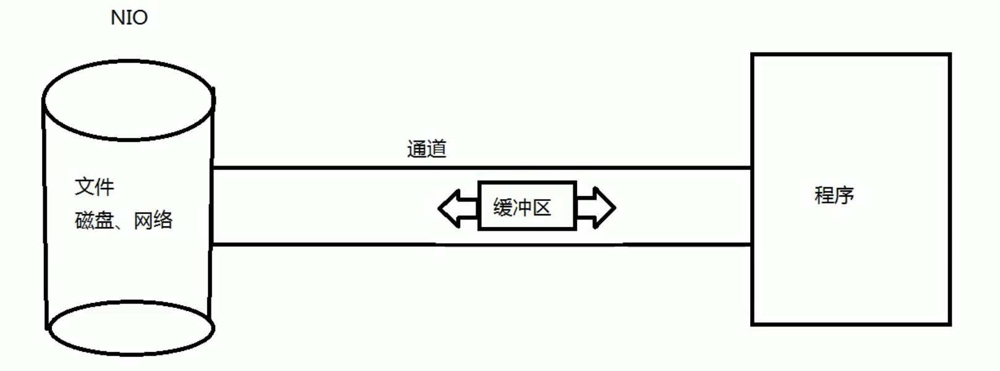

**简而言之，Channel负责传输，Buffer负责存储。**


### 缓冲区类型

- 缓冲区（Buffer） ）：一个用于特定基本数据类型的容器。由 java.nio 包定义的，所有缓冲区都是 Buffer 抽

  象类的子类。

-  Java NIO 中的 Buffer 主要用于与 NIO 通道进行交互，数据是从通道读入缓冲区，从缓冲区写入通道中的。


Buffer 就像一个数组，可以保存多个相同类型的数据。根据数据类型不同(boolean 除外) ，有以下 Buffer 常用子

类：

- ByteBuffer
- CharBuffer
- ShortBuffer
- IntBuffer
- LongBuffer
- FloatBuffer
- DoubleBuffer

上述 Buffer 类 他们都采用相似的方法进行管理数据，只是各自管理的数据类型不同而已。都是通过如下方法获取

一个 Buffer对象：

**static XxxBuffer allocate(int capacity)** : 创建一个容量为capacity 的 XxxBuffer 对象


### 缓冲区的基本属性

Buffer 中的重要概念：

- 容量 (capacity) ：表示 Buffer 最大数据容量，缓冲区容量不能为负，并且创建后不能更改。
- 限制 (limit) ：第一个不应该读取或写入的数据的索引，即位于 limit 后的数据不可读写。缓冲区的限制不能为负，并且不能大于其容量。
- 位置 (position)： ：下一个要读取或写入的数据的索引。缓冲区的位置不能为负，并且不能大于其限制记 
- 标记 (mark) 与重置 (reset) ：标记是一个索引，通过 Buffer 中的 mark() 方法指定 Buffer 中一个特定的 position，之后可以通过调用 reset() 方法恢复到这个 position。
  - 标记 、 位置 、 限制 、 容量遵守以下不变式： 0 <= mark <= position <= limit <= capacity	 


示意图：

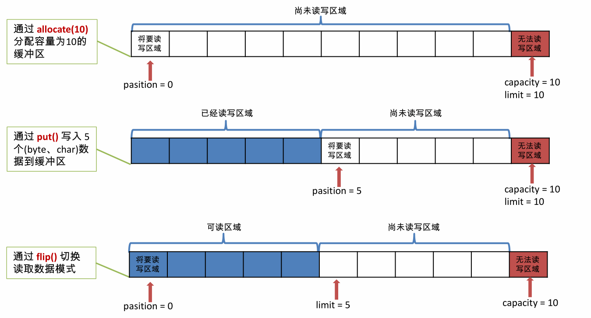

代码示例：

```java
@Test
	public void test1(){
		String str = "abcde";
		
		//1. 分配一个指定大小的缓冲区
		ByteBuffer buffer = ByteBuffer.allocate(1024);  //指定大小 

		System.out.println("-----------------------allocte--------------------");
		System.out.println(buffer.position());
		System.out.println(buffer.limit());
		System.out.println(buffer.capacity());
		
		//2. 利用put（） 存入数据到缓冲区中
		buffer.put(str.getBytes());

		System.out.println("-------------------------put----------------------");
		System.out.println(buffer.position());
		System.out.println(buffer.limit());
		System.out.println(buffer.capacity());
		
		//3. 切换成读取数据的模式 
		buffer.flip();

		System.out.println("-------------------------flip----------------------");
		System.out.println(buffer.position());
		System.out.println(buffer.limit());
		System.out.println(buffer.capacity());
		
		//4. 利用get（）读取缓冲区中的数据
		byte[] dst = new byte[buffer.limit()];
		
		System.out.println("-------------------------get()----------------------");
		buffer.get(dst);
		System.out.println(new String(dst,0, dst.length));
		
		System.out.println(buffer.position());
		System.out.println(buffer.limit());
		System.out.println(buffer.capacity());
		
		//5. rewind()  ；可重复度
		buffer.rewind();

		System.out.println("-------------------------rewind()----------------------");
		System.out.println(buffer.position());
		System.out.println(buffer.limit());
		System.out.println(buffer.capacity());
		
		//6. clear() : 清空缓冲区, 但是缓冲区中的数据依然存在，但是处于 “被遗忘状” 态
		buffer.clear();

		System.out.println("-------------------------cleat----------------------");
		System.out.println(buffer.position());
		System.out.println(buffer.limit());
		System.out.println(buffer.capacity());

		System.out.println((char) buffer.get());
	}
```


输出结果：

```java
----------------------allocte--------------------
0
1024
1024
-------------------------put----------------------
5
1024
1024
-------------------------flip----------------------
0
5
1024
-------------------------get()----------------------
abcde
5
5
1024
-------------------------rewind()----------------------
0
5
1024
-------------------------cleat----------------------
0
1024
1024
a
```


### Buffer 的常用方法

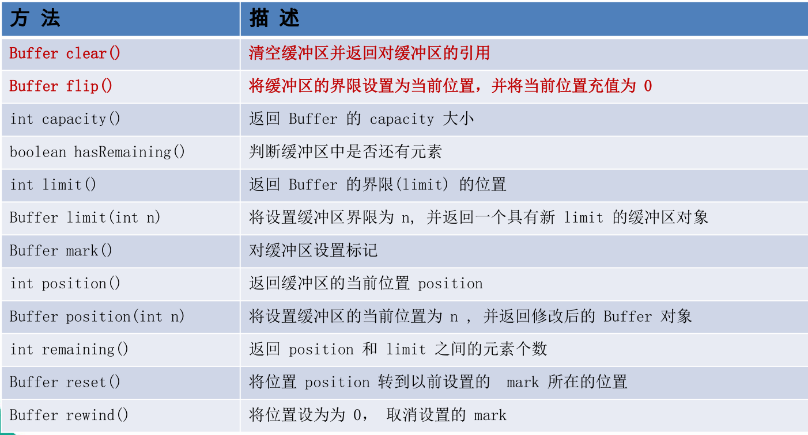


### 缓冲区的数据操作

 Buffer 所有子类提供了两个用于数据操作的方法：get()与 put() 方法。

-  取 获取 Buffer 中的数据

  - get() ：读取单个字节
  - get(byte[] dst)：批量读取多个字节到 dst 中
  - get(int index)：读取指定索引位置的字节(不会移动 position)

  

- 放到 入数据到 Buffer 中 中
  - put(byte b)：将给定单个字节写入缓冲区的当前位置
  - put(byte[] src)：将 src 中的字节写入缓冲区的当前位置
  - put(int index, byte b)：将指定字节写入缓冲区的索引位置(不会移动 position)


### 直接与非直接缓冲区

- 字节缓冲区要么是直接的，要么是非直接的。如果为直接字节缓冲区，则 Java 虚拟机会尽最大努力直接在机 此缓冲区上执行本机 I/O 操作。也就是说，在每次调用基础操作系统的一个本机 I/O 操作之前（或之后），虚拟机都会尽量避免将缓冲区的内容复制到中间缓冲区中（或从中间缓冲区中复制内容）。

- 直接字节缓冲区可以通过调用此类的 allocateDirect() 工厂方法 来创建。此方法返回的 缓冲区进行分配和取消分配所需成本通常高于非直接缓冲区 。直接缓冲区的内容可以驻留在常规的垃圾回收堆之外，因此，它们对应用程序的内存需求量造成的影响可能并不明显。所以，建议将直接缓冲区主要分配给那些易受基础系统的机 本机 I/O 操作影响的大型、持久的缓冲区。一般情况下，最好仅在直接缓冲区能在程序性能方面带来明显好处时分配它们。
- 直接字节缓冲区还可以过 通过FileChannel 的 map() 方法 将文件区域直接映射到内存中来创建 。该方法返回MappedByteBuffer 。Java 平台的实现有助于通过 JNI 从本机代码创建直接字节缓冲区。如果以上这些缓冲区中的某个缓冲区实例指的是不可访问的内存区域，则试图访问该区域不会更改该缓冲区的内容，并且将会在访问期间或稍后的某个时间导致抛出不确定的异常。
- 字节缓冲区是直接缓冲区还是非直接缓冲区可通过调用其 isDirect() 方法来确定。提供此方法是为了能够在性能关键型代码中执行显式缓冲区管理 。


#### 非直接缓冲区

左边：OS（操作系统）                                                                             右边: JVM 

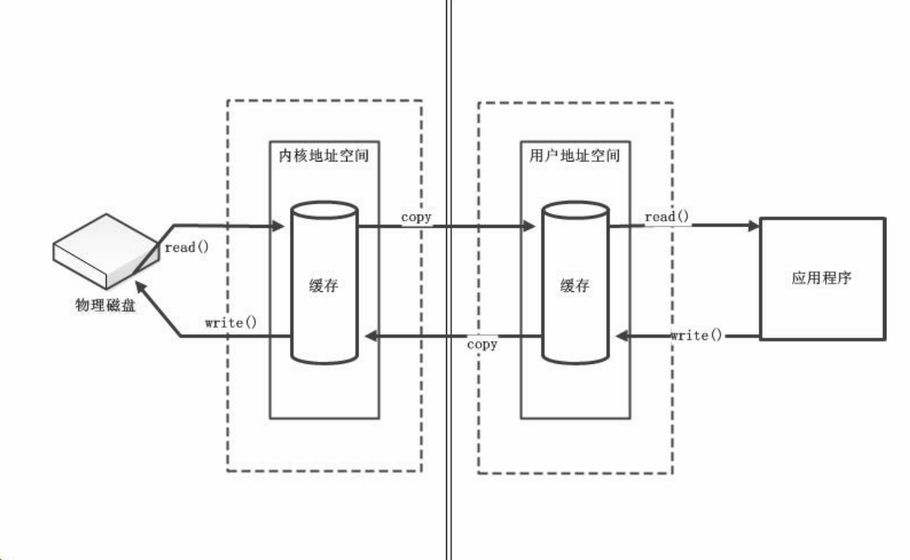

#### 直接缓冲区

这种方式消耗的资源比较大，不太容易控制。

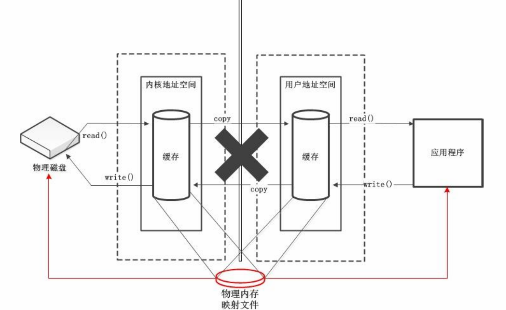


## 通道(Channel)

通道（Channel）：由 java.nio.channels 包定义的。Channel 表示 IO 源与目标打开的连接。Channel 类似于传统的“流”。只不过 

Channel本身不能直接访问数据，Channel 只能与Buffer 进行交互。


开始的样子：

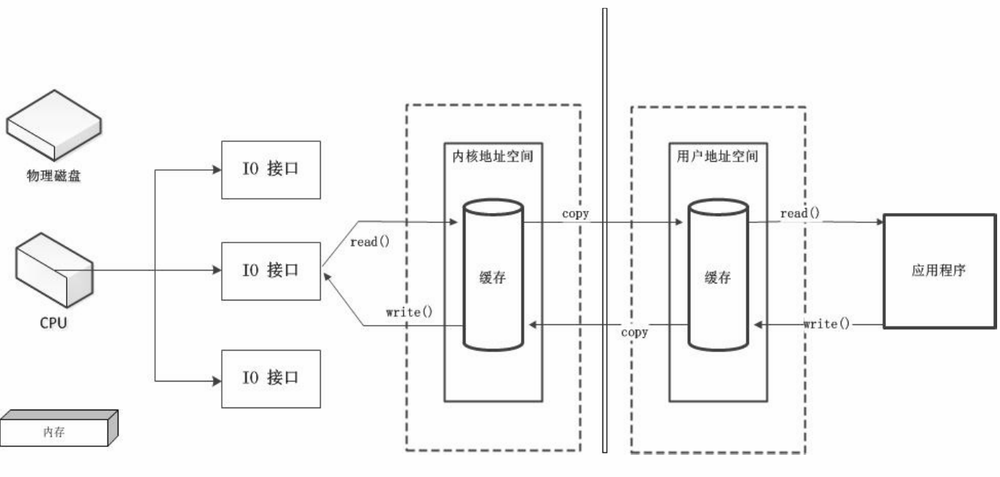


DMA：

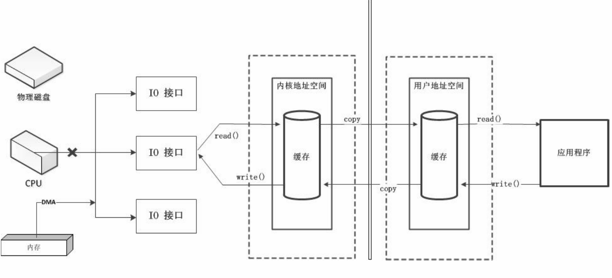

Channel：


### 通道的主要实现类

Java 为 为 Channel 接口提供的最主要实现类如下：

- FileChannel：用于读取、写入、映射和操作文件的通道。
- DatagramChannel：通过 UDP 读写网络中的数据通道。
- SocketChannel：通过 TCP 读写网络中的数据。
- ServerSocketChannel：可以监听新进来的 TCP 连接，对每一个新进来的连接都会创建一个 SocketChannel。

### 获取通道 

获取通道的一种方式是对支持通道的对象调用

getChannel() 方法。支持通道的类如下：

- FileInputStream
- FileOutputStream
- RandomAccessFile
- DatagramSocket
- Socket
- ServerSocket

获取通道的其他方式是使用 Files 类的静态方法 newByteChannel() 获取字节通道。或者通过通道的静态方法 open() 打开并返回指定通道。


### 通道之间的数据传输

- 将 Buffer 中数据写入 Channel
- 从 Channel 读取数据到 Buffer

### 分散（Scatter）与聚集（Gather）

-  分散读取（Scattering Reads）是指从 Channel 中读取的数据“分散”到多个 Buffer 中。

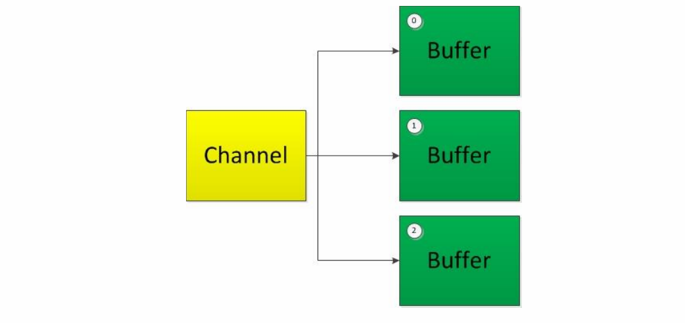

注意：按照缓冲区的顺序，从 Channel 中读取的数据依次将 Buffer 填满。


-  聚集写入（Gathering Writes）是指将多个 Buffer 中的数据“聚集”到 Channel。

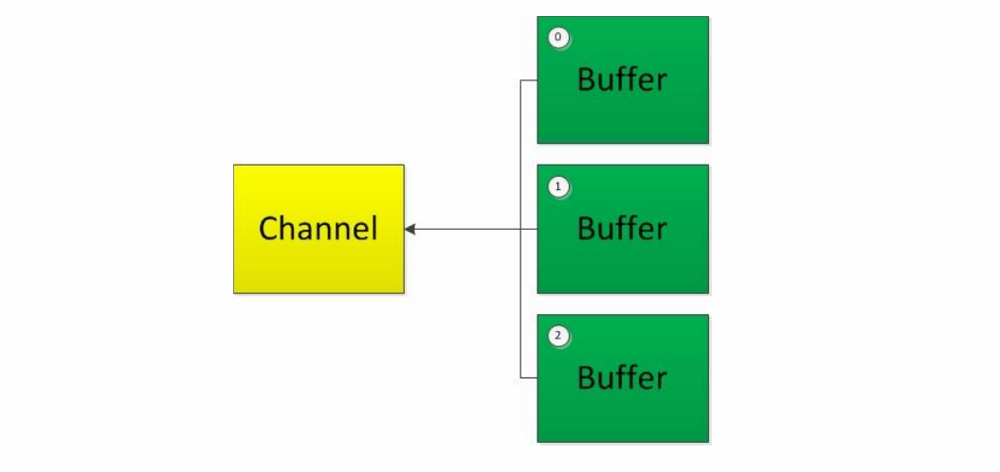

注意：按照缓冲区的顺序，写入 position 和 limit 之间的数据到 Channel 。


**FileChannel 的常用方法**

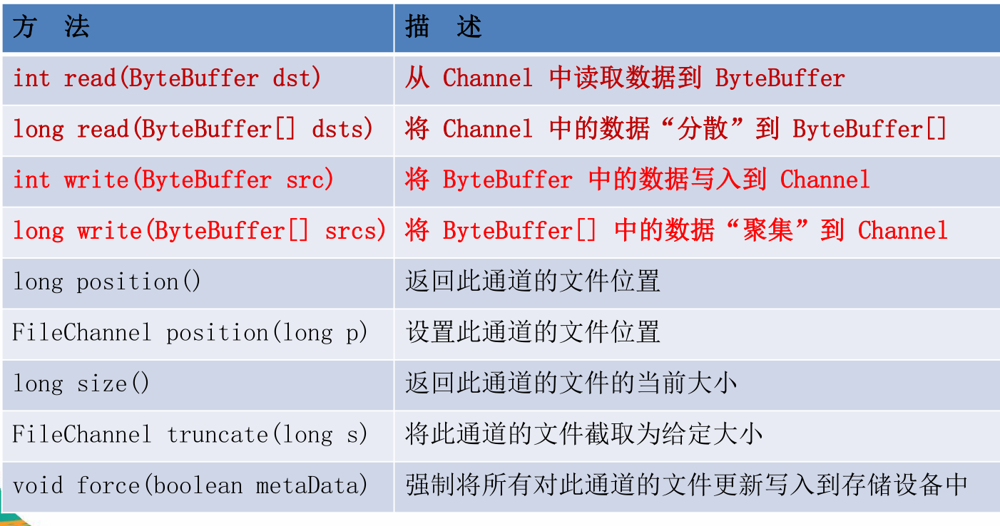


### 字符集 ： CharSet

### 代码

```java
package com.jdrx.nio;

import org.junit.Test;

import java.io.FileInputStream;
import java.io.FileOutputStream;
import java.io.IOException;
import java.io.RandomAccessFile;
import java.nio.ByteBuffer;
import java.nio.CharBuffer;
import java.nio.MappedByteBuffer;
import java.nio.channels.FileChannel;
import java.nio.charset.CharacterCodingException;
import java.nio.charset.Charset;
import java.nio.charset.CharsetDecoder;
import java.nio.charset.CharsetEncoder;
import java.nio.file.Paths;
import java.nio.file.StandardOpenOption;
import java.util.Map;
import java.util.Set;

/**
 * 一: 通道（Channel）： 用于源节点与目标节点的连接，在Java NIO 中负责缓冲区中数据的传输，Channel本身不存储数据，因此需要配合缓冲区进行传输
 * <p>
 * 二： 通道的主要实现类
 * java.nio.channels.Channel 接口：
 * |--FileChannel          	文件通道，专门用于操作本地文件     用于本地IO
 * |--SocketChannel        	套接字 用于TCP传输    			后三个用于网络IO
 * |--ServerSocketChannel  	套接字 用于TCP传输
 * |--DatagramChannel			UDP
 * <p>
 * 三：获取通道
 * 1. Java 针对支持通道的类提供了getChannel（）方法
 * 本地IO：
 * FileInputStream/FileOutputStream
 * RandomAccessFile
 * <p>
 * 网络IO：
 * Socket
 * ServerSocket
 * DatagramSocket
 * <p>
 * 2.  在JDK1.7 中 NIO.2 针对各个通道提供了静态方法 open（）
 * 3.  在JDK1.7 中 NIO.2 的Files 工具类的newByteChannel（）
 * <p>
 * <p>
 * 四: 通道之间的数据传输
 * transferFrom()
 * transferTo()
 * <p>
 * 五：分散（Scatter）与聚集（Gather）
 * 分散读取（Scattering Reads）: 将通道中的数据分散到多个缓冲区中 一个写完写下一个
 * 聚集写入（Gathering Writes）: 将多个缓冲区中的数据聚集到通道中 一个读完读下一个
 * <p>
 * 六： 字符集 ： CharSet
 * 编码：字符串 -> 字节数组
 * 解码: 字节数组 -> 字符串
 *
 * @author Steve
 * @date 2020/8/4-17:01
 */
public class TestChannel {

	//操作字符集
	@Test
	public void test6() throws CharacterCodingException {
		Charset cs1 = Charset.forName("GBK");

		//获取编码器
		CharsetEncoder ce = cs1.newEncoder();

		//获取解码器
		CharsetDecoder cd = cs1.newDecoder();

		CharBuffer charBuffer = CharBuffer.allocate(1024); //缓冲区
		
		charBuffer.put("NIO威武");
		charBuffer.flip();

		//编码
		ByteBuffer buffer = ce.encode(charBuffer);

		for (int i = 0; i < buffer.limit(); i++) {
			System.out.println(buffer.get());
		}
		
		//解码
		buffer.flip();
		CharBuffer charBuffer2 = cd.decode(buffer);
		System.out.println(charBuffer2.toString());

		System.out.println("------------------------");
		
		//如果按照UTF-8 解码 则会出现乱码 
		//Charset cs2 = Charset.forName("UTF-8");  //乱码
		Charset cs2 = Charset.forName("GBK");      //正常
		buffer.flip();
		CharBuffer charBuffer3 = cs2.decode(buffer);
		System.out.println(charBuffer3.toString());

	}

	//获取所有字符集
	@Test
	public void test5() {
		Map<String, Charset> map = Charset.availableCharsets();
		Set<Map.Entry<String, Charset>> entries = map.entrySet();
		for (Map.Entry<String, Charset> entry : entries) {
			System.out.println(entry.getKey() + "=" + entry.getValue());
		}
	}

	//分散和聚集
    //聚集 原来是操作缓冲区，现在是操作缓冲区数组
	@Test
	public void test4() throws IOException {
		RandomAccessFile raf1 = new RandomAccessFile("1.txt", "rw");

		//1. 获取通道
		FileChannel channel1 = raf1.getChannel();

		//2. 分配指定大小的缓冲区
		ByteBuffer buffer1 = ByteBuffer.allocate(100);
		ByteBuffer buffer2 = ByteBuffer.allocate(1024);

		//3. 分散读取
		ByteBuffer[] buffers = {buffer1, buffer2};
		channel1.read(buffers);

		for (ByteBuffer buffer : buffers) {
			buffer.flip();
		}

		System.out.println(new String(buffers[0].array(), 0, buffers[0].limit()));
		System.out.println("-------------------------");
		System.out.println(new String(buffers[1].array(), 0, buffers[1].limit()));

		//4. 聚集写入
		RandomAccessFile raf2 = new RandomAccessFile("2.txt", "rw");
		FileChannel channel2 = raf2.getChannel();

		channel2.write(buffers);
	}


	//通道之间的数据出传输
	@Test
	public void test3() throws IOException {
		//时间: 137 这种方式更快
		Long start = System.currentTimeMillis();
		FileChannel inChannel = FileChannel.open(Paths.get("D:/1.avi"), StandardOpenOption.READ);
		FileChannel outChannel = FileChannel.open(Paths.get("D:/2.avi"), StandardOpenOption.WRITE, StandardOpenOption.READ, StandardOpenOption.CREATE);

		//inChannel.transferTo(0,inChannel.size(),outChannel);
		outChannel.transferFrom(inChannel, 0, inChannel.size());

		inChannel.close();
		outChannel.close();

		Long end = System.currentTimeMillis();
		System.out.println("耗费时间为：" + (end - start));
	}

	//2. 直接缓冲区完成文件的复制（内存映射文件）
	@Test
	public void test2() throws IOException {
		Long start = System.currentTimeMillis();

		//时间: 217 这种方式明显要快很多
		FileChannel inChannel = FileChannel.open(Paths.get("D:/1.avi"), StandardOpenOption.READ);
		//读 写 如果没有就创建 （StandardOpenOption.CREATE_NEW 如果文件已存在就报错，StandardOpenOption.CREATE 如果文件已存在不会报错）
		FileChannel outChannel = FileChannel.open(Paths.get("D:/2.avi"), StandardOpenOption.WRITE, StandardOpenOption.READ, StandardOpenOption.CREATE);

		//内存映射文件  只要ByteBuffer支持，其他的不支持
		MappedByteBuffer inMappedBuf = inChannel.map(FileChannel.MapMode.READ_ONLY, 0, inChannel.size());
		MappedByteBuffer outMappedBuf = outChannel.map(FileChannel.MapMode.READ_WRITE, 0, inChannel.size());

		//直接对缓冲区进行数据的读写操作
		byte[] dst = new byte[inMappedBuf.limit()];
		inMappedBuf.get(dst);
		outMappedBuf.put(dst);

		inChannel.close();
		outChannel.close();

		Long end = System.currentTimeMillis();
		System.out.println("耗费时间为：" + (end - start));
	}

	//1. 利用通道完成文件的复制  非直接缓冲区
	@Test
	public void test1() throws Exception {

		Long start = System.currentTimeMillis();

		FileInputStream fileInputStream = null;
		FileOutputStream fileOutputStream = null;
		FileChannel inChannel = null;
		FileChannel outChannel = null;
		try {
			/*fileInputStream = new FileInputStream("1.jpg");
			fileOutputStream = new FileOutputStream("2.jpg");*/

			//时间：1167
			fileInputStream = new FileInputStream("D:/1.avi");
			fileOutputStream = new FileOutputStream("D:/2.avi");

			//1. 获取通道
			inChannel = fileInputStream.getChannel();
			outChannel = fileOutputStream.getChannel();

			//2. 分配指定大小的缓冲区 
			ByteBuffer buffer = ByteBuffer.allocate(1024);  //非直接缓冲区

			//3. 将通道中的数据存入缓冲区中
			while (inChannel.read(buffer) != -1) {
				buffer.flip(); //切换成读取数模式

				//4. 将缓冲区中的数据，写入通道中 
				outChannel.write(buffer);
				buffer.clear(); //清空缓冲区，但是缓冲区数据还在，只是出于被遗忘态 
			}
		} catch (IOException e) {
			e.printStackTrace();
		} finally {
			//流啊 	全部关掉 通道关掉
			if (inChannel != null) {
				try {
					inChannel.close();
				} catch (IOException e) {
					e.printStackTrace();
				}
			}
			if (outChannel != null) {
				try {
					outChannel.close();
				} catch (IOException e) {
					e.printStackTrace();
				}
			}
			if (fileInputStream != null) {
				try {
					fileInputStream.close();
				} catch (IOException e) {
					e.printStackTrace();
				}
			}
			if (fileOutputStream != null) {
				try {
					fileOutputStream.close();
				} catch (IOException e) {
					e.printStackTrace();
				}
			}
		}

		Long end = System.currentTimeMillis();
		System.out.println("耗费时间为：" + (end - start));
	}
}
```


## NIO 的非阻塞式网络通信

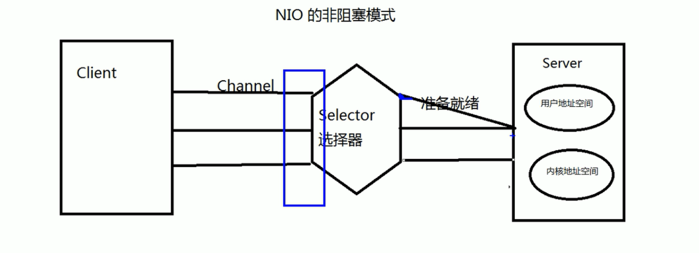

选择器左边是阻塞的还是非阻塞的呢？ 右边阻塞还是非阻塞？


### 阻塞与非阻塞

- 传统的 IO 流都是阻塞式的。也就是说，当一个线程调用 read() 或 write()时，该线程被阻塞，直到有一些数据被读取或写入，该线程在此期间不能执行其他任务。因此，在完成网络通信进行 IO 操作时，由于线程会阻塞，所以服务器端必须为每个客户端都提供一个独立的线程进行处理，当服务器端需要处理大量客户端时，性能急剧下降。
- Java NIO 是非阻塞模式的。当线程从某通道进行读写数据时，若没有数据可用时，该线程可以进行其他任务。线程通常将非阻塞 IO 的空闲时间用于在其他通道上执行 IO 操作，所以单独的线程可以管理多个输入和输出通道。因此，NIO 可以让服务器端使用一个或有限几个线程来同时处理连接到服务器端的所有客户端。


### 选择器(Selector) 9 15分钟

选择器（Selector） 是 SelectableChannle 对象的多路复用器，Selector 可以同时监控多个 SelectableChannel 的 IO 状况，也就是说，

利用 Selector可使一个单独的线程管理多个 Channel。Selector 是非阻塞 IO 的核心。

SelectableChannle 的结构如下图：

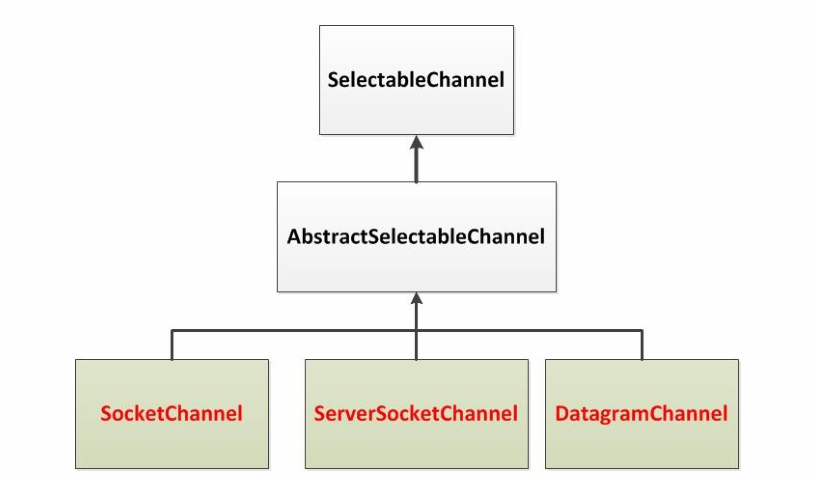


### 选择器的应用

- 创建 Selector ：通过调用 Selector.open() 方法创建一个 Selector。

- 向选择器注册通道：SelectableChannel.register(Selector sel, int ops)

- 当调用 register(Selector sel, int ops) 将通道注册选择器时，选择器对通道的监听事件，需要通过第二个参数 ops 指定。

- 可以监听的事件类型（用 可使用 SelectionKey 的四个常量 表示）：

  - 读 : SelectionKey.OP_READ （1）
  - 写 : SelectionKey.OP_WRITE （4）
  - 连接 : SelectionKey.OP_CONNECT （8）
  - 接收 : SelectionKey.OP_ACCEPT （16）


- 注册一个事件，则可以使用“位或”操作符连接。

### SocketChannel、ServerSocketChannel、DatagramChannel


## 管道(Pipe)


## Java NIO2 (Path、Paths 与 Files )


# Netty

> 后续会加进来。


# Interview

### 1.讲一下java中的三大IO，NIO是怎样实现多路复用的？

### 2.IO和NIO的区别？非阻塞是什么意思？ AIO 了解吗？

### 3.为什么NIO能够达到非阻塞的效果？

### 4.NIO有多个Channel怎么样区别？

### 5.NIO和BIO有什么区别

### 6.阻塞IO和非阻塞IO了解吗？