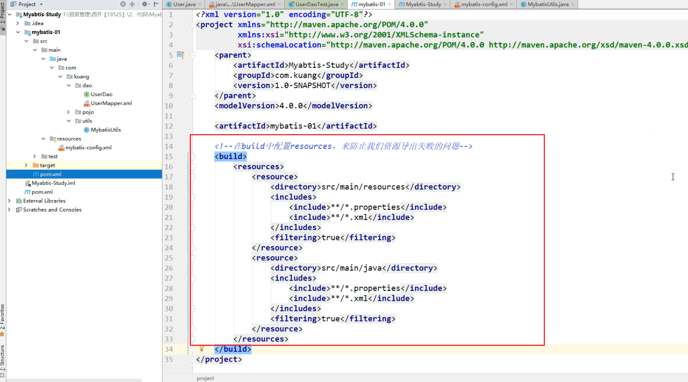
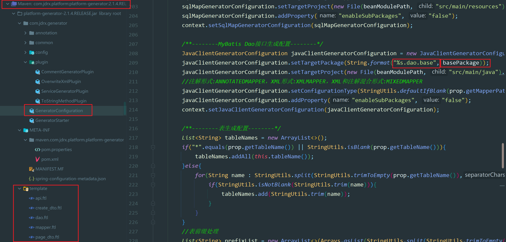

# NewKnowledge

> 这里主要记录自己平时工作学习中不会的知识，和疑惑点。
>
> 后续学习过程的时候，也有一个大概方向。

每学完一个新知识，找一些题，检测一下学的怎么样。

也不能光学新知识。应该多学Java基础，基本功很重要。

## 2019

1. sql 中 case when 函数 then 相当于if else 函数   重点看一下
2. 数据库 **存储过程**  就是函数
3. mybatis-plus

## 2020

1. MangoDB 学一下
2. NoSql
3. 数据库，学一下存储结构，游标
4. Guava  工具 谷歌 下面的包 项目中有使用 然后好好研究一下。
5. Shell脚本学一下  结合公司服务器脚本  JavaGuide里面也有（和linux在一起） 
7. es 项目中官网咨询用到，然后细细研究一下
8. DDD  今天说起一个ddd业务相关 什么技术 然后研究一下
9. 哔哩哔哩上面的springboot视频  有好多东西的 比如监控中心 actuator
10. 设计模式
11. 再有时间 重新搞一下hola博客。现在ssh没弄好，其他的都可以。
12. 看完SpringCloud以后  看一下 尚硅谷大厂面试题。 Java工程师面试突击第1季-中华石杉老师  记住这个 哔哩哔哩可以搜到
13. Nginx 集群 尚硅谷
14. Jenkins 是一个集成测试工具，学一下Jenkins 减少重复部署操作。
15. 尚硅谷韩顺平的netty
16. 韩顺平数据结构 
17. websocket 好像在公司pc消息推送的代码里面有  
18. Spring 注解驱动开发 尚硅谷的，同时参考Guide哥写的那篇注解文章，好好总结一下
19. 最近学Drools 用到maven里面 exclusions  maven里面的知识，然后学maven看一下。
20. Netty 然后学一下这个，需要看一下韩顺平的设计模式。学netty 之前 需要先学NIO  ，还要学一下 用到的两个设计模式
22. 看一下 王道408 课程 计算机网络 操作系统 计算机组成原理 数据结构
24. 更新一下 typora ThinkInJava 在JavaSE中 
25. 看Spring注解驱动的时候，格外关注一下  @Autowired 什么时候不可以注入。 肯定不是什么时候都能注入。
26. 学完 Nio 然后 学一下 mybatis，详细了解一下里面的知识。还有高级部分mybatis。
27. 学一下Oracle 和Mysql 不一样。
28. 这几天新建了一个分支，感觉对git有一些不熟，然后看一个。分支创建，提交到远程等。
29. 学mybatis的时候，遇到一个maven过滤问题。就是如果资源不在resource 下面。需要配置一下。然后重新学一下Maven，仔细看一下，下面**图1**。
30. 总结mybatis的时候，面试题里面有问jpa,持久化接口 哔哩哔哩有一个课，还有 Spring jpa
31. 现在的项目中jta，分布式事务，哔哩哔哩有一个课，还行还不错。
32. 搜索引擎使用然后总结一下，github搜索也总结一下，发一篇文章。 就是如何在浏览器搜索内容。
33. 触发器 navicat看触发器
34. 缓存redis 放入数据 取出来数据
36. 工程台账建立一个视图 可以加快速度，有时间看看存储过程。
38. 大数据量的数据库tidb 文档 https://docs.pingcap.com/zh/tidb/stable
41. 公司代码里面 自己开发的生成器 （二供，绵阳BZ），用到了下面的模板模式，template，然后研究一下，下面**图2**.
42. 学习Optional到11分钟 https://www.bilibili.com/video/BV14W411u7Ly?p=15，有时间，接着学。
48. 项目中用到将服务注册到dubbo，dubbo.registry.register-enabled=false 这句话没起作用。
49. 项目中 开票收费的时候 遇到很多加密解密，签名验证等，然后研究一下。
50. 研究一下vimrc 自定义自己的写代码vim样式
51. 画一个vi的思维导图，命令行模式，底行模式等，总结一下。
53. 整理一下fastjson文档，或者看那一下大概结构，每次用得时候需要百度，不太好，json字符串转换 阿里的fastjson 转换为数组，数组转换为json。w3cschool  菜鸟教程
54. 整理一下google书签。没用的删了。
55. 在学习JVM的时候，Java内存架构，用到一些计算机组成原理的知识，然后看一下。
56. Java代码运行完 有个编译器常量折叠？是什么？
58. maven中央仓库  nexus  https://www.sonatype.com/nexus/repository-pro，细细的探究一下 maven，jar包嵌套什么的，很复杂。
59. 有机会看看CodeSheep推荐的关于服务器的一个文章。
46. k8s 有时间学一下

## 2021

1. 好好整理自己的博客
2. 认真写每一篇文章，注意版权意识，尊重原创。

图1：

 图2

