# Nginx

## 目录

[TOC]

> 自己学习笔记
>
> 可以在自己服务器安装一个集群完，推荐Docker安装，方便。

## Docker 安装 Nginx

```
docker search nginx
docker pull nginx
docker ps
docker run --name nginx -p 8091:80 -d nginx
```


阿里云上面部署的第一个节点，是8091端口映射到nginx80端口。


## 新版的Nginx配置文件

```shell
/etc/nginx/nginx.config  这个下面，包含了一个目录

/etc/nginx/conf.d 这个下面才是配置文件
/etc/nginx/conf.d/default.conf  配置端口，负载均衡，都在这里。
```


为了不在nginx中安装vim，这里采用映射的方式，首先将容器里面的文件复制到宿主机，以后改宿主机上面配置就可以啦。

```shell
//首先将nginx容器里面的配置文件文件都拷贝出来
docker cp nginx:/etc/nginx/nginx.conf /home/docker-nginx/

docker cp nginx:/var/log/nginx /home/docker-nginx/log

/home/docker-nginx# mkdir conf.d 首先去这个目录下创建一个文件夹
docker cp nginx:/etc/nginx/conf.d/default.conf /home/docker-nginx/conf.d/
```

复制过来是这个样子的：

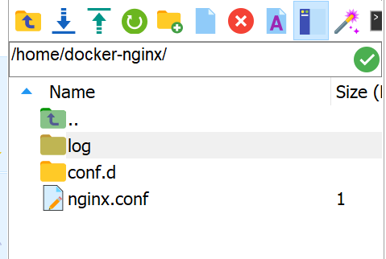

```shell
启动 默认是80端口
docker run --name nginx -p 8091:80 -v /home/docker-nginx/nginx.conf:/etc/nginx/nginx.conf -v /home/docker-nginx/log:/var/log/nginx -v /home/docker-nginx/conf.d/default.conf:/etc/nginx/conf.d/default.conf -d nginx


docker run --name nginx -p 8091:80 -v /home/docker-nginx/nginx.conf:/etc/nginx/nginx.conf -v /home/docker-nginx/conf.d/default.conf:/etc/nginx/conf.d/default.conf -d nginx
```

解释下上面的命令：

--name  给你启动的容器起个名字，以后可以使用这个名字启动或者停止容器

-p 映射端口，将docker宿主机的80端口和容器的80端口进行绑定

-v 挂载文件用的，第一个-v 表示将你本地的nginx.conf覆盖你要起启动的容器的nginx.conf文件，第二个表示将日志文件进行挂载，就是把nginx服务器的日志写到你docker宿主机的/home/docker-nginx/log/下面

第三个-v 表示的和第一个-v意思一样的。

-d 表示启动的是哪个镜像


我个人更喜欢第二种映射的方式，麻烦的是需要自己准备好nginx.conf 和default.conf文件，我是直接从容器里面复制的，然后根据自己的需要改的


映射成功啦，庆祝一下

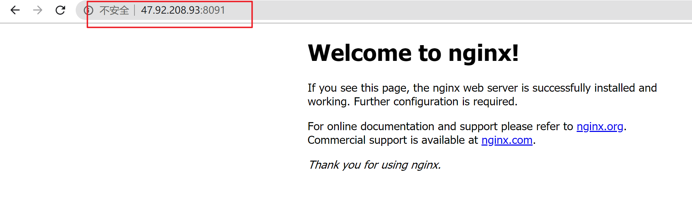


```
   upstream cluster{
        server 47.92.208.93:8848;
        server 47.92.208.93:8849;
        server 47.92.208.93:8850;
    }

  location / {
        #root   /usr/share/nginx/html;
        #index  index.html index.htm;
        proxy_pass http://cluster;
  }
```

**需要注意的点**，upstream cluster{} 在nginx.conf里面写，下面的localtion / {} 在conf.d/fefault.conf写。

这里搞了一下午。（^-^）


还有需要注意的一点是，用-d启动docker，如果没启动起来，去掉试试，就会报错误信息。


## Nginx 基本知识

### Nginx简介

Nginx (发音为[eng ine
x])专为性能优化而开发，其最知名的优点是它的稳定性和低系统资源消耗，以及对并发连接的高处理能力(单台物理服务器可支持30000～50000个并发连接，tomcat通常是几百，不超过1000个)，
是一个高性能的 HTTP 和反向代理服务器，也是一个IMAP/POP3/SMTP 代理服务器。


注：c10k问题，是指10000个客户端（client）同时访问服务器，即高并发连接服务器的问题。

关于Nginx服务器，除了其高效性和稳定性的优点之外，我们最常使用的主要是其反向代理和负载均衡,以及动静分离功能。

Nginx http server PK Tomcat http server & servlet container

### 正向代理

通常，我们可以通过ip地址来直接访问网络中的某台确定的主机（更确切的说应该是通过socket套接字来访问确定中的某个确定的进程）。

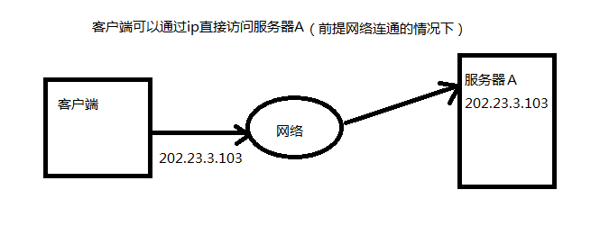

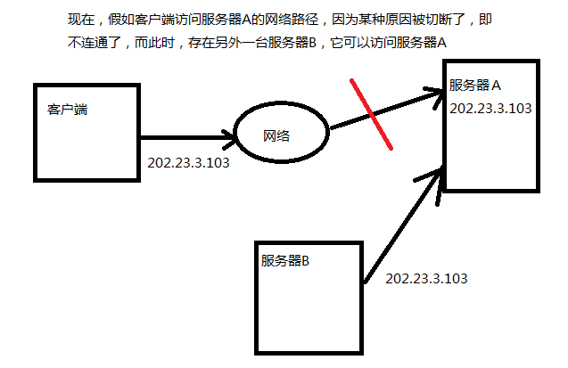

假设服务器B，能够将客户端的请求转发给服务器A，同时服务器B又能够将服务器A的响应转发给客户端，那么显而易见，我们就可以通过访问服务器B，从而达到访问服务器A的目的。

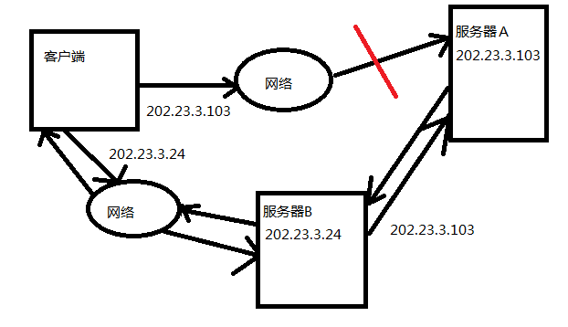

现在，我们再来看客户端访问服务器A的过程，客户端通过服务器B同样达到了访问服务器A的目的，但是，请注意此时:服务器B似乎是作为客户端访问服务器A的一个“媒介”，而发挥作用这种情况下。

### 反向代理

与正向代理服务器不同，反向代理服务器的作用，不在仅仅是充当能够访问到目标服务器的“媒介”或者说，是作为客户端访问目标服务器的代理。

反向代理是在服务器端（如Web服务器）作为代理使用，而不是客户端。客户端通过正向代理可以访问很多不同的资源，而反向代理是很多客户端都通过它访问不同后端服务器上的资源，而不需要知道这些后端服务器的存在，而以为所有资源都来自于这个反向代理服务器。

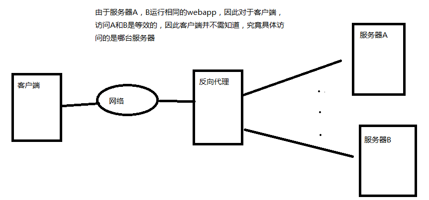

### 负载均衡 load balancing

在上图中，我们可以看到，服务器A，B之间的功能完全相同，可以相互替代，通过将原本由一个服务器负责处理的任务，分担给多台服务器，从而减小了各个服务器的并发压力，同时扩展了服务器的带宽，从而提高了吞吐量——这就是负载均衡。


在上图中的多台服务器，实际上指的就是集群。


集群和分布式的关系：

小饭店原来只有一个厨师，切菜，洗菜，备料，炒菜，全干。后来客人多了，厨房一个厨师忙不过来了，又请了一个厨师，两个厨师都能抄一样的菜，这两个厨师的关系就是集群。

为了让厨师专心炒菜，把菜做到极致，又请了个配菜师负责切菜，备料，备菜，厨师和配菜师的关系是分布式，后来发现，一个配菜师也忙不过来，又请了一个配菜师，这两个配菜师的关系就是集群。

### 动静分离

对于一些基本很少发生变化的静态资源，可以直接放在Nginx服务器上，当客户端访问这些静态资源时，Nginx就可以直接返回给客户端，而不用在访问服务器集群，从而节省了部分请求和响应的时间。

这样一来，当客户端访问Nginx服务器时，当客户端访问静态资源时，Nginx就将静态资源直接返回给客户端，当客户端访问的是动态资源的时候，Nginx才会访问集群，这样一来，就实现了动态资源和静态资源的分离，从而提高了系统的吞吐量。

CDN

Content Delivery Network

### Nginx安装和使用

### 安装Nginx

- 首先，将下载好的Nginx的tar包，通过winscp传送到自己的家目录下，并解压

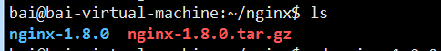

- 进入nginx-1.8.0目录，配置nginx（所本身需要的依赖集有

  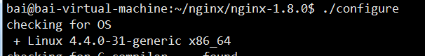

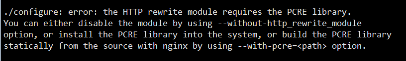

可以看到，我们缺少的nginx的HTTP rewright模块所需要的库,PCRE library

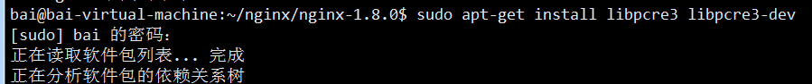

在此配置nginx，命令如下图


发现，要配置nginx还需要zlib库

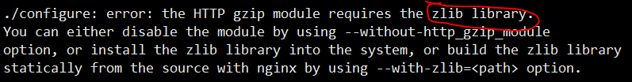

于是，在下载zlib库

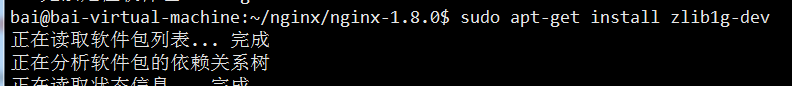

注意：此处是zlib1g，不是zliblg，此处是数字1不是小写字母l

再次，配置Nginx，如下图

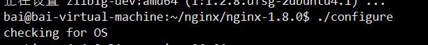

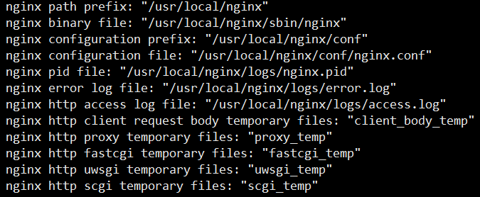

- 在当前目录下使用make命令

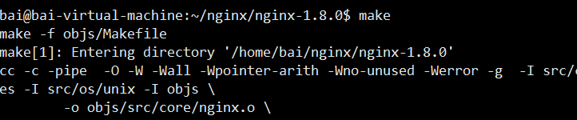

- 在使用make install命令

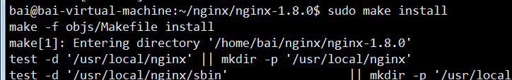

- 启动Nginx


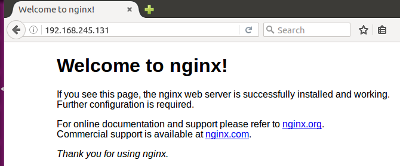

### Nginx配置反向代理


首先得有一个tomcat，比如启动监听8080端口。

在配置反向代理。

可以实现通过nginx来访问tomcat

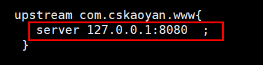

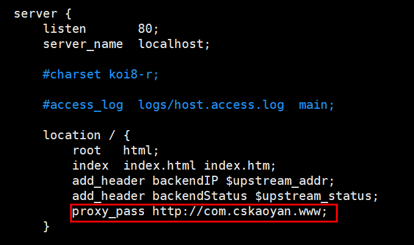

没有做任何配置之前访问80端口是nginx的页面。

配置了反向代理之后，访问的是tomcat的页面。

### nginx配置集群

紧接着，给nginx配置集群,在这之前，首先确保，liunx上已经有开启两个tomcat服务器

两个tomcat的配置需要修改。

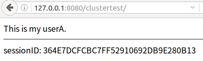


- 配置nginx的代理的集群

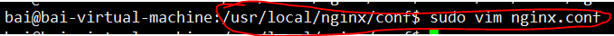

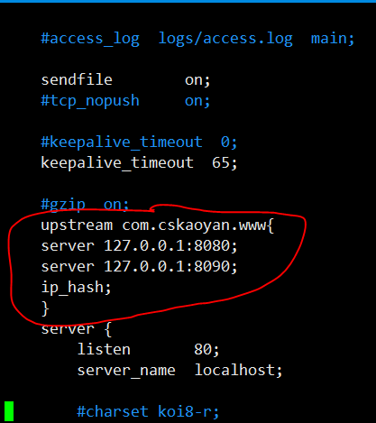

默认选项，当weight不指定时，各服务器weight相同，

每个请求按时间顺序逐一分配到不同的后端服务器，如果后端服务器down掉，能自动剔除。

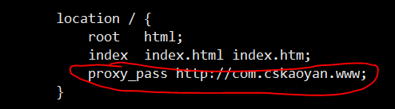

- Nginx重启一下使配置文件生效


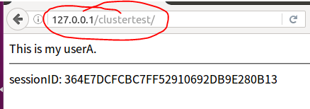

### Nginx基本操作及配置

### nginx启动、重启、关闭操作介绍

**启动nginx:  **


./nginx

**重启nginx：**

./nginx -s reload ：修改配置后重新加载生效

nginx -s reopen ：重新打开日志文件

nginx -t -c /path/to/nginx.conf 测试nginx配置文件是否正确

**关闭nginx：**

./nginx -s stop :快速停止nginx

quit ：完整有序的停止nginx

**其他的停止nginx 方式：**

ps -ef \| grep nginx

kill -QUIT 主进程号 ：从容停止Nginx

kill -TERM 主进程号 ：快速停止Nginx

pkill -9 nginx ：强制停止Nginx

### 负载均衡策略Nginx负载均衡选项upstream用法举例

1、轮询(weight=1)

默认选项，当weight不指定时，各服务器weight相同，  
每个请求按时间顺序逐一分配到不同的后端服务器，如果后端服务器down掉，能自动剔除。  

upstream bakend {  
server 192.168.1.10;  
server 192.168.1.11;  
}

2、weight  
指定轮询几率，weight和访问比率成正比，用于后端服务器性能不均的情况。  
如果后端服务器down掉，能自动剔除。  
比如以下配置，则1.11服务器的访问量为1.10服务器的两倍。  

upstream bakend {  
server 192.168.1.10 weight=1;  
server 192.168.1.11 weight=2;  
}

3、ip_hash  
每个请求按访问ip的hash结果分配，这样每个访客固定访问一个后端服务器，可以解决session不能跨服务器的问题。  
如果后端服务器down掉，要手工down掉。  

upstream resinserver{  
ip_hash;  
server 192.168.1.10:8080;  
server 192.168.1.11:8080;  
}

这个操作完,在配置中加了ip_hash那句话以后!

重启nginx!

然后重新抓包:

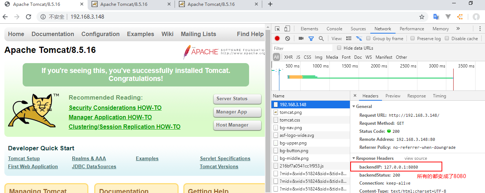

4、fair（第三方插件）  
按后端服务器的响应时间来分配请求，响应时间短的优先分配。  

upstream resinserver{  
server 192.168.1.10:8080;  
server 192.168.1.11:8080;  
fair;  
}

5、url_hash（第三方插件）  
按访问url的hash结果来分配请求，使每个url定向到同一个后端服务器，后端服务器为缓存服务器时比较有效。  
在upstream中加入hash语句，hash_method是使用的hash算法。  

upstream resinserver{  
server 192.168.1.10:8080 ;  
server 192.168.1.11:8080;  
hash \$request_uri;  
hash_method crc32;  
}  

设备的状态有:  
1、down 表示单前的server暂时不参与负载  
2、weight 权重,默认为1。 weight越大，负载的权重就越大。  
3、max_fails
允许请求失败的次数默认为1。当超过最大次数时，返回proxy_next_upstream
模块定义的错误  
4、fail_timeout max_fails次失败后，暂停的时间。  
5、 backup 备用服务器,
其它所有的非backup机器down或者忙的时候，请求backup机器。所以这台机器压力会最轻。-

介绍了这么多，下面来看一个负载均衡实例：

upstream tel_img_stream {

> ip_hash;

> server 192.168.11.68:20201;

> server 192.168.11.69:20201 weight=100 down;

> server 192.168.11.70:20201 weight=100;

> server 192.168.11.71:20201 weight=100 backup;

> server 192.168.11.72:20201 weight=100 max_fails=3 fail_timeout=30s;

}

说明:

1)、down 表示当前的server暂时不参与负载

2)、weight 默认为1.weight越大，负载的权重就越大。

3)、backup：
其它所有的非backup机器down或者忙的时候，请求backup机器。所以这台机器压力会最轻。

4)、上例中192.168.11.72:20201 设置最大失败次数为 3，也就是最多进行 3
次尝试，且超时时间为 30秒。max_fails 的默认值为 1，fail_timeout 的默认值是 10s。

注意，当upstream中只有一个 server 时，max_fails 和 fail_timeout
参数可能不会起作用。

### 查看web请求被落地到哪台服务器

使用Nginx反向代理多台服务器实行负载均衡的时候，如何查看某一个请求Nginx具体给到到哪台服务器上处理的呢？

1. server {
2. listen 80;
3. server_name localhost;
4. location / {
5. \#root html;
6. \#index index.html index.htm;
7. add_header backendIP \$upstream_addr;
8. add_header backendCode \$upstream_status;
9. proxy_pass http://com.cskaoyan.www; \#要与upstream 标红的名称保持一致
10. }
11. }

**重启Nginx，重新访问，在浏览器中F12查看request的Headers信息，可以看到当前服务器的IP**

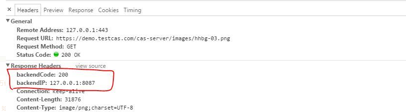

### 动静分离

本地动静分离反向代理配置

2 所有静态资源文件都交给nginx直接处理。

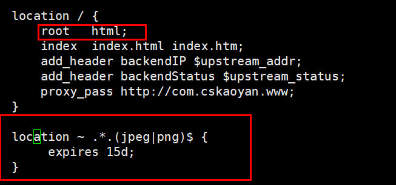

上面那个15d,是15天的意思!

**[plain]** [view
plain](https://blog.csdn.net/happydream_C/article/details/54943802) [copy](https://blog.csdn.net/happydream_C/article/details/54943802)

1. location \~ .\*.(htm\|html\|gif\|jpg\|jpeg\|png\|bmp\|swf\|ioc\|rar\|zip\|txt\|flv\|mid\|doc
2. \|ppt\|pdf\|xls\|mp3\|wma)\$ {   
3. expires 15d;   
4. }  
5. location \~ .\*.(js\|css)?\$ {   
6. expires 1h;   
7. }  

      3 定义错误提示页面      

**[plain]** [view
plain](https://blog.csdn.net/happydream_C/article/details/54943802) [copy](https://blog.csdn.net/happydream_C/article/details/54943802)

1. error_page   500 502 503 504 /50x.html;  
2. location = /50x.html {  
3. }   


### 修改nginx原来的端口80为81

参考：https://blog.csdn.net/YLD10/article/details/80242487?utm_medium=distribute.pc_relevant.none-task-blog-BlogCommendFromMachineLearnPai2-1.nonecase&depth_1-utm_source=distribute.pc_relevant.none-task-blog-BlogCommendFromMachineLearnPai2-1.nonecase


# Interview

## Nginx如何部署项目？能否实现热部署，不要让服务器宕机

## nginx 反向代理。

## Nginx怎么做到接口防刷

## Nginx负载均衡怎么配置

## nginx怎么实现负载均衡

## Nginx了解吗？会部署项目吗？**

## nginx 需要你们自己配置的吗？你是怎么配置的？

## zookeeper 和 nginx 怎么关联起来的？

## Nginx 413 Request Entity Too Large是怎么回事

## nginx都有什么作用

## 正向代理和反向代理