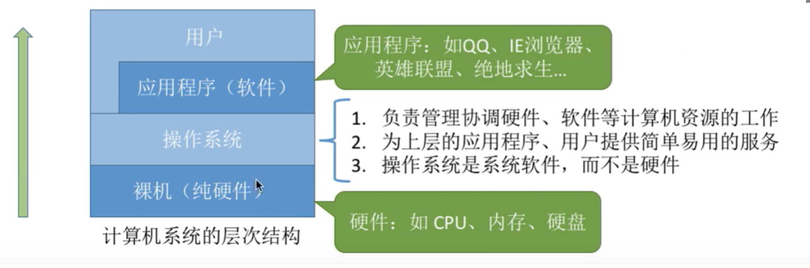
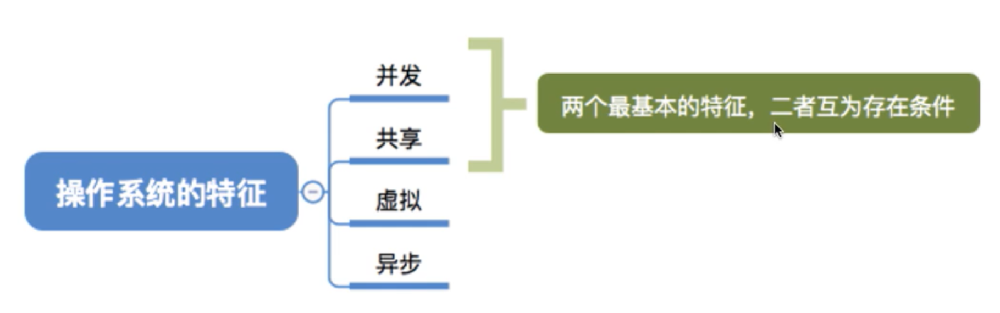
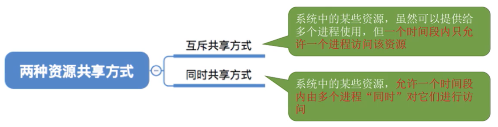
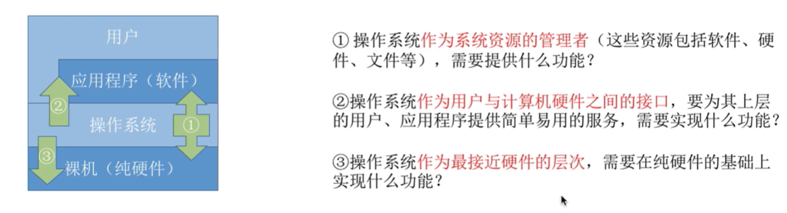
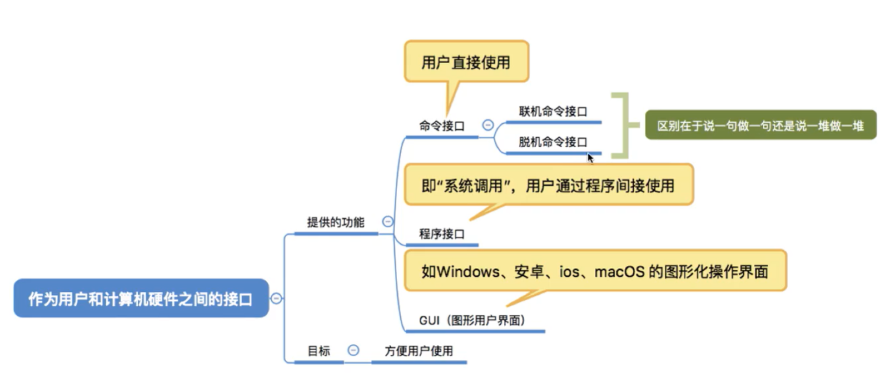
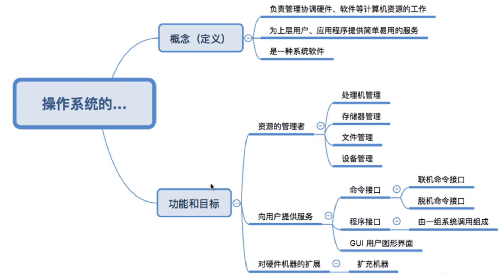

# OS

## Operating System 操作系统

> 这一部分知识，学习主要参考王道考研视频操作系统，王道考研教材；
>
> 下面一些图片来自于视频截图，是笔者在学习过程中的记录。
>
> 这一部分还没有完结，后续会继续更新。

>学习进度 看到视频第二个 五分钟

## 计算机操作系统概述 

### 操作系统的基本概念

#### 概念

#### 特征

##### 并发

并发：同时

并行：交错

##### 共享

##### 虚拟

##### 异步

#### 目标和功能

问题？

#### 重点回顾

后面章节要学习的重点就是中间：资源管理者这一部分里面的内容。

### 操作系统的发展和分类

### 操作系统的运行环境

### 操作系统的体系结构

# Interview

文件管理相关问的多