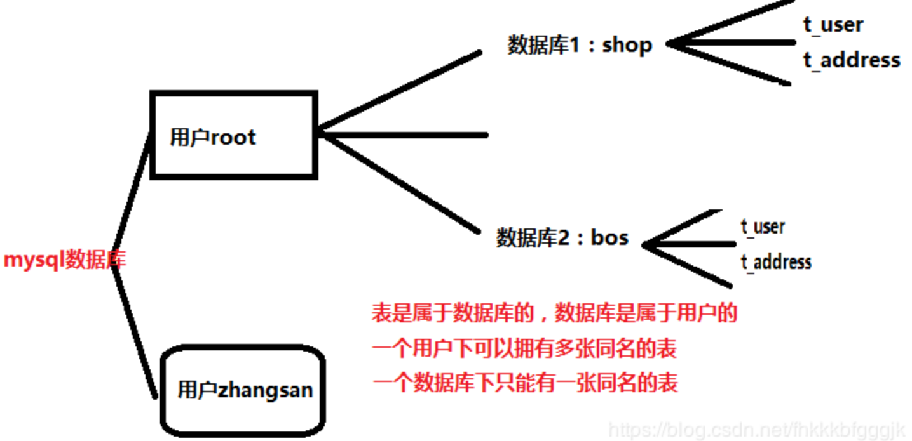
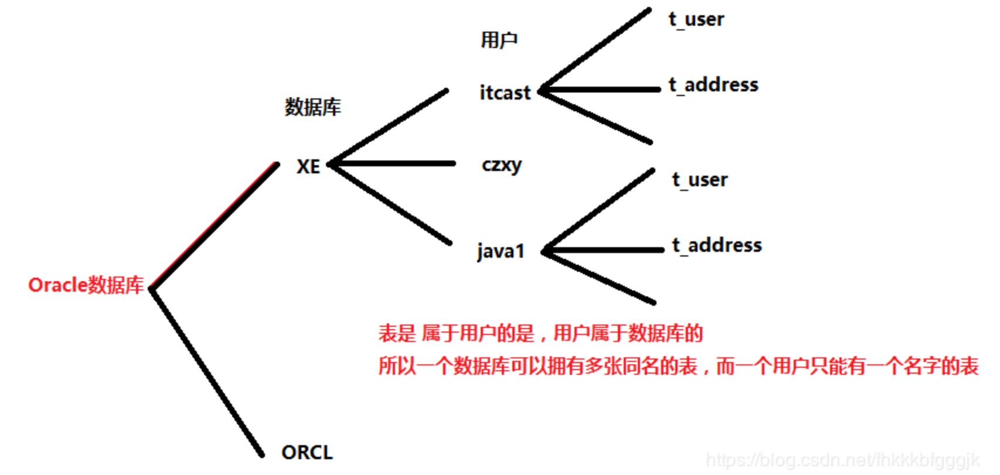

# Oracle

## 目录

<!-- TOC -->

[TOC]

<!-- /TOC -->

> 这一部分内容我忘记了参考的文章。 有些是我写的，有很多不是我写的。当时看到觉得很好，就保存下来了。方便后续查阅。

## Oracle和Mysql区别





Oracle的结构和PostgreSql 很像，公司用PostgreSql很多。好多资料上也是这个数据库，除了Mysql以外算是用的也挺多的一个数据库。


## navicat创建Oracle表

参考 https://www.cnblogs.com/sugarwxx/p/12696852.html


# 一、概述

数据库就是用户存放数据、访问数据、操作数据的存储仓库用户的各种数据被存放在数据库中。在需要的时候可以被有权限的用户查询、统计,新的数据可以被添加进去,不需要的数据可以被别除,一些旧的数据可以被修改。所以:数据库就是组织在一起的数据集合

数据库管理系统( Database Management System,DBMS）就是管理一个数据库的软件。

**RDBMS**是所有数据的知识库,并对数据的存储、安全、一致性、并发操作、恢复和访问负责；

**RDBMS**有一个数据词典(有时被称为系统目录),用于贮存它拥有的每个事物的相关信息,例如名字、结构、位置和类型,这种关于数据的数据也被称为**元数据( metadata)**；

## 1.数据库发展

手工管理阶段：

-   数据不被保存。这个时候基本上没有文件的概念,也没有专门的软件系统对文件进行管理。这时,通常一组数据与一个程序直接对应

文件管理阶段：

-   数据以文件的形式存在,有大量的数据需要保存,此时已使用了文件系统,有操作系统存储数据并负责逻辑与物理存储结构的转换。此时的典型特点是,数据量大,数据和程序缺乏独立性,数据还是直接面向应用的,也就是一个应用对应与一组数据,应用之间不能共享数据

数据管理阶段：

-   数据量增大,同时有大量的用户需要共享数据。此时为了解决这种多用户,多应用共享数据的需求,需要专『门的数据库管理系统

## 2.数据库的类型

**数据模型**是**数据库系统的核心和基础**，通常由**数据结构**,**数据操作**和**完整性约束**3部分组成.各种DBMS软件都是基于某种数据模型的,所以通常也安装数据模型的特点将传统的数据系统分成网络性数据库,层次性数据库,关系型数据库

### 1.关系型数据库的组成

-   多个表数据之同存在着关系
-   在这些表上的数据操作依赖于关系
-   关系用来描述多个表之间的数据依存,包括了一对一、一对多、多对多的关系
-   这些关系在 Oracle数据库中表现为主键、外键这些约東条件
-   RDBMS就是一个建立在这些关系模型基础上的
-   Oracle从7.3的版本就完全支持关系型数据库

### 2.oracle数据库的特点

-   支持大数据库、多用户的高性能的事务处理
-   Oracle遵守数据存取语言、操作系统、用户接口和网络通信协议的工业标准(SQL)
-   实施安全性控制和完整性控制
-   支持分布式数据库和分布处理
-   具有可移植性、可兼容性和可连接性
-   全球化、跨平台的数据库

## 3.数据库安全

用户:

-   数据库中的用户,用于组织和管理数据库对象的。通常一个应用软件的数据库对象被存放在一个数据库用户下。使用数据库用户连接数据库后,可以对这些数据库对象进行操作

方案:

-   一组数据库对象的集合。一个方案对应一个唯一的数据库用户,方案名和用户名完全相同。在访问数据库对象的时候,可以才用“方案名.对象名”的方式进行访问

权限:

-   权限决定了数据库用户在数据库中可以作什么。如果用户没有权限,那么对数据库就不能进行任何操作。权限由高权限用户授予

角色:

-   一组命名的权限,用于简化对权限的管理操作。可以次将多个权限(一个用户的权限)授予一个或多个用户

## 4.数据库文件与存储

数据文件:

-   用于存放数据的操作系统文件。数据库包含一个或多个数据文件

表空间:

-   数据被存储在文件中,但是在数据库中数据文件组织在一起,被按照表空间的方式来进行管理。表空间是一个或多个数据文件的集合，在数据库中的存储空间表现为表空间，在操作系统中表现为数据文件。 一个数据库包含一个或多个表空间

控制文件:

-   数据库的核心文件,存放着数据库的重要信息。例如数据库的名称和数据库的结构(数据文件,重做日志文件的名称和目录)

重做日志文件:

-   记录数据库中数据变化的文件。所有数据的修改都被记录在日子文件中,主要用于保证数据库的可恢复性

初始化参数文件：

-   存在数据库初始化参数的文件。用于设置关于数据库的一些参数，在数据库启动的时候需要读取，并根据初始化参数的设置分配数据库的内存空间；

## 5.数据库网络访问

数据库名:数据库的名称

实例名:数据库的内存区域和后台进程集合的总称

服务名:数据库在操作系统上被当作一个服务对待

连接字符串:

-   通过网络访问远端服务器上的数据库时,用于描述数据库访问地址的字符串。通常的结构是:“主机名(或IP):端口号:服务名”,例如:192.168.2.200:1521:orcl

监听器:

-   在服务器端运行的一个进程。用于监听客户端到数据库的连接请求。在通过网络访问时必须启动

---

---

# 二、数据库管理

 说明：因为在win7中安装的Oracle11g没有发现有图形管理用户，也能不好重建OEM，就戒指跳过了使用图形界面的方式来管理用户等操作了，直接使用命令的方式来操作；

转自：https://blog.csdn.net/ly510587/article/details/95459299

oracle数据库的权限系统分为系统权限与对象权限。

-   系统权限( database system privilege )
    可以让用户执行特定的命令集。例如，create table权限允许用户创建表，grant any privilege 权限允许用户授予任何系统权限。
-   对象权限( database object privilege )
    可以让用户能够对各个对象进行某些操作。例如delete权限允许用户删除表或视图的行，select权限允许用户通过select从表、视图、序列(sequences)或快照(snapshots)中查询信息。


## 1.登录系统管理员

>   先是打开sqlplus，
>
>   再输入 `sqlplus /nolog` 或 `connect / as sysdba` 或 `system/as sysdba`


## 2.创建、删除、修改用户

>  创建用户：----
>
>  ```sql
>  create user username identified by password;
>  ```
>
>  例如：
>
>  ```sql
>  alter user user1 identified by 234556;
>  ```
>
>  ---
>
>  删除用户：----
>
>  ```sql
>  drop user user1;
>  
>  ```
>
>  修改用户：----
>
>  ```sql
>  alter user user1 identified by 234556;
>  ```


## 3.授权、撤销授权

oracle提供三种标准角色（role）:connect/resource和dba.

connect role(连接角色)

>   临时用户，特指不需要建表的用户，通常只赋予他们connect role.
>
>   connect是使用oracle简单权限，这种权限只对其他用户的表有访问权限，包括select/insert/update和delete等。
>   拥有connect role 的用户还能够创建表、视图、序列（sequence）、簇（cluster）、同义词(synonym)、回话（session）和其他 数据的链（link)。

resource role(资源角色)

>   更可靠和正式的数据库用户可以授予resource role。
>
>   resource提供给用户另外的权限以创建他们自己的表、序列、过程(procedure)、触发器(trigger)、索引(index)和簇(cluster)。

dba role(数据库管理员角色)

>   dba role拥有所有的系统权限
>
>   包括无限制的空间限额和给其他用户授予各种权限的能力。

---

为用户授权：

```sql
grant connect, resource to user1;
```

撤销用户权限：

```sql
revoke connect, resource from user;
```

## 4.常用查询

>   1.查看所有用户：
>    select * from dba_users;
>    select * from all_users;
>    select * from user_users;
>
>   2.查看用户或角色系统权限(直接赋值给用户或角色的系统权限)：
>    select * from dba_sys_privs;
>    select * from user_sys_privs;
>
>   3.查看角色(只能查看登陆用户拥有的角色)所包含的权限
>   sql>select * from role_sys_privs;
>
>   4.查看用户对象权限：
>    select * from dba_tab_privs;
>    select * from all_tab_privs;
>    select * from user_tab_privs;
>
>   5.查看所有角色：
>    select * from dba_roles;
>
>   6.查看用户或角色所拥有的角色：
>    select * from dba_role_privs;
>    select * from user_role_privs;
>
>   7.查看哪些用户有sysdba或sysoper系统权限(查询时需要相应权限)
>   select * from V$PWFILE_USERS
>
>   比如我要查看用户 wzsb的拥有的权限：
>   SQL> select * from dba_sys_privs where grantee='WZSB';
>
>   GRANTEE                        PRIVILEGE                         ADMIN_OPTION
>
>   ------------------------------ ---------------------------------------- ------------
>
>   WZSB                           CREATE TRIGGER                           NO
>   WZSB                           UNLIMITED TABLESPACE                     NO
>
>   ==========
>
>   比如我要查看用户 wzsb的拥有的角色：
>   SQL> select * from dba_role_privs where grantee='WZSB';
>
>   GRANTEE   GRANTED_ROLE   ADMIN_OPTION  DEFAULT_ROLE
>
>   ------------------------------ ------------------------------ ------------ ------------
>
>   WZSB       DBA             NO              YES
>
>   ==========
>
>   查看一个用户所有的权限及角色
>   select privilege from dba_sys_privs where grantee='WZSB'
>   union
>   select privilege from dba_sys_privs where grantee in 
>   (select granted_role from dba_role_privs where grantee='WZSB' );


# 三、SQL语句 -- 查询

>   SQL语句分为三种类型：
>
>   DML: Data Manipulation Language数据操纵语言
>
>   DDL: Data Definition Language数据定义语言
>
>   DCL: Data Control Language数据控制语言

DML用于查询与修改数据记录,包括如下SQL语句：

-   INSERT:添加数据到数据库中
-   UPDATE:修改数据库中的数据
-   DELETE:删除数据库中的数据
-   SELECT:选择(查询)数据
    -    SELECT是SQL语言的基础,最为重要。

DDL用于定义数据库的结构,比如创建、修改或删除数据库对象,包括如下SQL语句:

-   CREATE TABLE:创建数据库表
-   ALTER TABLE:更改表结构、添加、删除、修改列长度
-   DROP TABLE:删除表
-   CREATE INDEX:在表上建立索引
-   DROP INDEX:删除索引
-   ....

DCL用来控制数据库的访问,包括如下SQL语句:

-   GRANT:授予访问权限
-   REVOKE:撤销访问权限
-   COMMIT:提交事务处理
-   ROLLBACK:事务处理回退
-   SAVEPOINT:设置保存点
-   LOCK:对数据库的特定部分进行锁定
-   ....

---

---

## 1.简单查询

基本的查询语句框架：

```sql
select .... from ....;
```


**数字和日期**可以使用的算术运算符：

| 操作符 | 描述 |
| ------ | ---- |
| +      | 加   |
| -      | 减   |
| *      | 乘   |
| /      | 除   |

**空值不同于0或空格，凡是空值参与的运算，结果都为空值（null）**

**空值不同于0或空格，凡是空值参与的运算，结果都为空值（null）**

### 1.取别名

给查询的结果取别名，有三中方式：

-   直接在要查询的字段后面加上想要取的别名，注意，字段和别名之间要有空格；
-   在字段后面加上as和别名，注意，字段、as和别名之间要有空格；
-   这种方式也是前面两种方式的改变，因为在Oracle中，默认是将所有的表名、字段名等转换成大写的，但是我们想要的别名是小写，前面的两种方式就不能解决了，方法：直接给别名加上引号即可，这样设置的别名是什么，结果就是什么了；
-   若查询结果中的字段是由多个单词组成的，那么我们也是要用引号把单词括起来；

> 取个例子：
>
> ```sql
> select id, name as na, name "na" from account;
> ```
>
> ID	   NA	   na
> \---------------------
> 21fjj	jiodf	jiodf
> djoi32	wwwj	wwwj

============

### 2.连接符

把列与列，列与字符连接在一起；用 `||` 表示；作用：可以用来“合成”列；

类似在java中字符串的拼接；

作用：查询到的结果都是用一列一列来表示的，那么能不能够让多个结果列合成一个列显示出来那？

>   ```sql
>   select id || '---' || name as na from account;
>   ```
>
>   na
>   \---------------------
>   21fjj---jiodf
>   djoi32---wwwj

===========

### 3.字符串

-   字符串可以是 SELECT 列表中的一个字符、数字、日期
-   日期和字符只能在**单引号**中出现。
-   每当返回一行时,字符串被输出一次。

>   select id || '2020-2-15' || name as na from account;

### 4.重复行

默认情况下,查询会返回全部行,包括重复行。

若想去除掉重复的数据，可以使用 **distinct** 关键字：

>   select distinct id  from account;

### 5.按条件查询

>   基本框架：
>
>   select count from account where count > 300;
>   select count,name from account where name = 'wwj';

#### 1.字符和日期

-   字符和日期要包含在**单引号**中。
-   **字符`大小写敏感`,日期格式敏感**。
-   默认的日期格式是 DD-MON月-RR-->: 7-6月-1996

>   select count,name from account where date = '7-6月-1996';
>
>   --可以使用一个函数来给时间格式化：
>
>   select count,name from account where to_char(myDate, 'yyy-mm-dd')= '1990-2-1';
>   select count,name from account where to_char(myDate, 'yyy')= '1990';
>
>   select count,name from account where to_char(myDate, 'yyy-mm-dd') between '1908-2-2' and '1990-2-1';

#### 2.比较符运算符

>   操作符		   含义
>
>   =				等于（不是==）
>   \>				大于
>   \>=				大于、等于
>   <				小于
>   <=				小于、等于
>   <>				不等于（也可以是!=）
>   :=				赋值符号
>   BETWEEN ...AND...		在两个值之间（包含边界）
>   IN(...)				  等于值列表中的一个
>   LIKE					 模糊查询
>   IS NULL				  空值
>
>   -----

>   select count from account where count between 300 and 5000;
>   select count from account where count >= 300 and count <= 5000;
>
>   select * from account where id = 1 or id = 3;
>   select * from account where id IN(1,3);
>
>   select * from account where name LIKE '%j%';
>   select * from account where name LIKE '%d\_';
>   select * from account where name LIKE '%d\\_' escape '\\'; --说明：使用关键字和转义符将通配符符号的作用取消
>
>   select * from account where name is NULL;
>   select * from account where name is NOT NULL;

#### 3.逻辑运算符

>   操作符			 含义
>
>   and				逻辑并
>   or				 逻辑或
>   Not				逻辑否

### 6.排序

-   使用 ORDER BY 子句排序
    -   **ASC**( ascend):**升序**
    -   **DESC**( descend):**降序**
-   ORDER BY 子句在 SELECT 语句的**结尾**。
-   可以有多层排序，只用在后面使用逗号隔开，并指定每一层的排序规则；

>   select * from account order by id DESC;
>   select * from account where count > 100 order by count ASC;
>   select * from account order by id DESC,name asc; // 先是按数量降序排序，再按名字升序排序

---

## 2.单行函数

单行函数：

-   操作数据对象
-   参数返回一个结果
-   **只对一行进行变换**
-   **每行返回一个结果**
-   可以转换数据类型
-   可以嵌套
-   参数可以是一列或一个值

多行函数：

-   既是查询到的多行结果集，但是只返回一个结果

目标：

-   在 SELECT语句中使用字符,数字,日期和**转换函数**以及通用函数
-   使用**条件表达式**

### 1.字符函数

#### 1.大小写控制函数

作用：因为Oracle默认是大小写敏感的，所以当我们在写查询条件的时候，不知道是要写小写还是大写，也许就是因为大小写这个问题导致查询不出结果；

>   select * from account where lower(name) LIKE '%j%';	-- 这是将字段name的所有结果转换成小写，再和我们定义的查询条件进行比较；
>
>   select * from account where upper(name) LIKE '%J%';	-- 这是将字段name的所有结果转换成大写，再和我们定义的查询条件进行比较；


#### 2.字符控制函数

>   concat('hello', 'world')			helloworld		// 连接字符
>   substr('helloworld',1,5)			hello			// 从1开始，输出5个
>   lengte('helloworld')				10			// 返回字符串的个数
>   instr('helloworld','w')			 6 			// 判断指定字符出现的位置
>   lpad(salary,10,'\*')				 \*\*\**\*24000	// 
>   rpad(salary,10,'\*')				 24000\*\*\*\*\*
>   trim('H' from 'Helloworld')		 elloworld	// 去除收尾指定的字符
>   replaace('abcd','b','m')			amcd		// 替换所有符合的字符
>
>   ----

### 2.数字函数

**四舍五入：round()**:

>   select round(435.467,2) from dual;		结果：435.47
>   取小数点后两位，进行四舍五入
>
>   select round(435.467) from dual;		结果：435
>   取小数点，进行四舍五入
>
>   select round(435.467，-2) from dual;		结果：400
>   取小数点前两位，进行四舍五入
>
>   ---

**截断： trunc()**：

>   select trunc(435.467,2) from dual;		 结果：435.46
>   从小数点后两位截断，不进行四舍五入
>
>   select trunc(435.467) from dual;			结果：435
>   从小数点截断，不进行四舍五入
>
>   select trunc(435.467，-1) from dual;		结果：430
>   从小数点前一位截断，不进行四舍五入
>
>   ---

**取余：mod()**:

>   select mod(1100，300) from dual;		结果：200

---

---

### 3.日期函数

Oracle中的日期型数据实际含有两个值：**日期和时间**。

#### 1.日期的数学运算

-   在日期上加上或减去一个数字结果仍为日期。
-   两个日期相减返回日期之间相差的**天数**。
    -   日期之间不允许做加法运算,无意义
-   可以用数字除24来向日期中加上或减去天数。

自定义日期格式，可以使用 **to_char(myDate, 'yyy-mm-dd hh-mi-ss)** 函数；可以看条件查询的字符和日期节点；

| 函数           | 描述                             |
| -------------- | -------------------------------- |
| months_between | 两个日期相差的月数               |
| add_months     | 向指定日期中加上若干月数         |
| next_day       | 指定日期的下一个星期* 对应的日期 |
| last_day       | 本月的最后一天                   |
| round          | 日期四舍五入                     |
| trunc          | 日期截断                         |

>   select months_between(sysdate, mydate) from dual; //结果是相差的约束
>
>   select sysdate, add_months(sysdate, 3) from dual; //当前日期加3个月
>
>   select sysdate, next_day(sysdate, '星期三') from dual; // 下个星期三对应日期
>
>   select sysdate, last_day(sysdate)-1 from dual; // 本月的倒数第二天
>
>   select sysdate, round(sysdate,'month|year|mm|...')-1 from dual;

---

### 4.转换函数

#### 1.隐式

自动完成数据类型的转换；

dae <--> varcha2/char <--> number


#### 2.显式

>   ​	 <-- to_date			  <-- to_char	
>
>   date <------------> character <------------> number
>   		to_char -->			to_unmber -->

>   select * from dual where to_char(myDate, 'yyyy-mm-dd')= '1990-2-1';
>
>   select * from dual where to_char(myDate, 'yyyy"年"mm"月"dd"日"')= '1990年2月1日';
>
>   select * from dual where to_date('1990-2-1', 'yyyy-mm-dd')= myDate;
>
>   // to_char; `0`表示零，`9`表示数字；`$`表示美元符，`L`表示本地货币符号；`.`表示小数点；`,`表示千位符；
>
>   select to_date(345432234.4234, '999，999，999，999.999') from  dual;
>   select to_date(345432234.4234, '$000，000，000，000.000') from  dual; 美元
>   select to_date(345432234.4234, 'L000，000，000，000.000') from  dual; 本地
>
>   // to_unmber	-- 将字符转换成数字再做运算
>
>   select to_unmber('L345432234.4234', '999，999，999，999.999') + 8 from  dual;

----

### 5.通用函数

这些函数**适用于任何数据类型,同时也适用于空值**:

-   nvl(expr1,expr2)
-   nvl2(expr1,expr2,expr3)
-   nullif(expr1,expr2)
-   coalesce(expr1,expr2,....,exprn)

**nvl函数**：

-   当要查询的值为null是，将空值转换成一个已知的值:
    -   可以使用的数据类型有日期、字符、数字。
    -   函数的一般形式:
        -   nvl(nullZhi,0)
        -   nvl(nullZhi,'erwe')
        -   nvl(nullZhi,'01-JAN-97')

>   select numbetOne+nvl(numberTwo,0) as number from mytable;

**nvl2(expr1,expr2,expr3)函数**：

-   和nvl函数相似，当expr1不为null时，返回expr2；为null时，返回expr3；

**nullif(expr1,expr2)**：

-   相等返回null，不等返回expr1；

**coalesce(expr1,expr2,....,exprn)**：

-   COALESCE与NVL相比的优点在于 COALESCE可以同时处理交替的多个值。
-   如果第一个表达式为空,则返回下一个表达式,对其他的参数进行 COALESCE

### 6.条件表达式

-   在SQL语句中使用IF-THEN-ELSE逻辑
-   使用两种方法
    -   CASE表达式
    -   DECODE函数

#### 1.case表达式

```sql
case expr when comparison1 then return_expr1 
[when comparison2 then return_expr2 
when comparison3 then return_expr3 
else else_expr] 
end
```

例子：

>   练习:查询部门号为10.20,30的员工信息,若部门号为10.则打印其工资的1.1倍,20号部门.则打印其工资的12倍,30号部门打印其工资的1.3倍数;
>
>   ```sql
>   select id,name,case department_id when 10 then salary * 1.1 
>   when 10 then salary * 1.1  
>   when 20 then salary * 1.2 
>   else salary * 1.3 end as new_salary
>   from emp
>   where department_id in (10,20,30);
>   ```

---

#### 2.DECODE函数

>   上面case表达式的例子：
>
>   ```sql
>   select id,name,decode(department_id,10,salary*1.1,20,salary*1.2,salary*1.3) as new_salary
>   from emp
>   where department_id in (10,20,30);
>   ```

---

---

## 3.多表查询

目标：

-   使用**等值**和**不等值**连接在 SELECT语句中查询多个表中的数据。
-   使用**自连接**。
-   使用**外连接**查询不满足连接条件的数据。

**笛卡尔集**：（就是查询结果为多个表的记录总数相乘）

-   笛卡尔集会在下面条件下产生:
    -   省略连接条件	
    -   连接条件无效
    -   所有表中的所有行互相连接
-   为了避免笛卡尔集,可以在 WHERE加入**有效**的连接条件。

### 1.等值连接

>   select a.id,a.name,a.count,e.name,e.par
>   from account a,emp e
>   where a.emp_id = e.id;

**连接n个表,至少需要n-1个连接条件。例如:连接三个表,至少需要两个连接条件**。

### 2.外连接

内连接:合并具有同一列的两个以上的表的行,**结果集中不包含一个表与另一个表不匹配的行**；

外连接:两个表在连接过程中除了返回满足连接条件的行以外还返回左(或右)表中不满足条件的行,这种连接称为左(或右)外连接。没有匹配的行时,结果表中相应的列为空(ULD).外连接的 WHERE子句条件类似于内部连接,但连接条件中没有匹配行的表的列后面要加外连接运算符,即用圆括号括起来的加号(+).

>   左外连接
>
>   select a.id,a.name,a.count,e.name,e.par
>   from account a,emp e
>   where a.emp_id = e.id(+);
>
>   结果：返回account表中的所有结果集，即使emp表的id值为null

>   右外连接
>
>   select a.id,a.name,a.count,e.name,e.par
>   from account a,emp e
>   where a.emp_id(+) = e.id;

### 3.自然连接

-   NATURAL JOIN子句,**会以两个表中具有相同名字的列为条件创建等值连接**。
-   在表中查询满足等值条件的数据。
-   如果只是列名相同而**数据类型不同**,则会产生错误。

>   select id,name,count,parname,par
>   from account  natural join emp 
>
>   结果：上面连接是以id作为连接点；
>
>   自然连接的优缺点：优点是自动查询多个表的相同字段作为连接点；缺点是作为连接点的字段必须是名字、类型相同，而且还要确定多个表中相同的字段有多少个，若有多个相同的字段，则会进行多次判断查询；
>
>   既然有问题，那就要解决问题了，在连接中，既使有多个字段相同，但我们也是可以指定要连接的字段的：
>
>   select id,name,count,parname,par
>   from account join emp 
>   using(id);
>
>   不过使用这中方式还是不怎么保险，可以使用下面的几种方式；
>
>   ---

自然连接除了上面的有局限性的连接方式外，还具有等值连接、外连接的功能；

#### 1.等值连接

>   select a.id,a.name,a.count,e.name,e.par
>   from account a join emp e
>   on a.emp_id = e.id
>   join car c
>   on e.carId = c.id;

#### 2.外连接

>   左外连接
>
>   select a.id,a.name,a.count,e.name,e.par
>   from account a left outer join emp e
>   on a.emp_id = e.id;

>   右外连接
>
>   select a.id,a.name,a.count,e.name,e.par
>   from account a right outer join emp e
>   on a.emp_id = e.id;

>   满外连接（有左有右）
>
>   select a.id,a.name,a.count,e.name,e.par
>   from account a full outer join emp e
>   on a.emp_id = e.id;

#### 3.自表连接

也就是把一个表当成是多个表来写连接信息；

## 4.分组函数

分组函数就是多行函数；

**分组函数作用于一组数据,并对一组数据返回一个值**。

目标：

-   了解组函数。
-   描述组函数的用途。
-   使用 `GROUP BY` 子句对数据分组。
-   使用 `HAVING` 子句过滤分组结果集

### 1.组函数

>   avg			平均值 ---返回值不为空的记录；
>   count		  总数---返回值不为空的记录；
>   max			最大值
>   min			最小值
>   stddev		 方差（标准差）
>   sum			求和
>
>   可以使用nvl函数使分组函数无法忽略空值：nvl(expr,1/0/*)

**distinct 关键字**：

-   count(distinct expr) -- 返回expr非空且不重复的记录总数

### 2.GROUP BY

>   例子：求出emp表中各部门的平均工资：
>
>   select empId,avg(salary)
>   from emp
>   group by empId;

>   例子：求出emp表中各部门的不同工种的平均工资：
>
>   select empId,jobId,avg(salary)
>   from emp
>   group by empId,jobId;

总结：select要查询的列，只要不是函数，就应该出现相爱group by 子句中；反过来说，出现在group by 子句中的可以不出现在select查询的列中；所有包含于 SELECT列表中,而未包含于组函数中的列都必须包含于 GROUP BY子句中。

**不能在 WHERE子句中使用组函数。**

**可以在 HAVING子句中使用组函数。**

### 3.HAVING

>   例子：求出emp表中各部门中平均工资大于6000的部门，以及其平均工资：
>
>   select empId,avg(salary)
>   from emp
>   group by empId
>   having avg(salary) > 6000;

**不能在 WHERE子句中使用组函数。**

**可以在 HAVING子句中使用组函数。**

having子句相当于给分组添加条件；

---

## 5.子查询

目标：

-   描述子查询可以解决的问题。
-   定义子查询。
-   列出子查询的类型。
-   书写单行子查询和多行子查询。

>   select select_list
>   from table1
>   where expr operator (
>   						select select_list2
>   						from table2)
>
>   总结:
>
>   -   子查询(内查询)在主查询之前一次执行完成；
>   -   子查询的结果被主查询(外查询)使用。

注意事项：

-   **子查询要包含在括号内。**
-   **将子查询放在比较条件的右侧。**
-   单行操作符对应单行子查询,多行操作符对应多行子查询。

### 1.子查询的类型

**单行子查询**：子查询只返回一条记录；

-   单行子查询使用的比较符：`=、>、>=、<、<=、<>`
-   若要使用分组函数进行判断条件的话，则使用having函数

**多行子查询**：子查询返回多条记录；

-   使用多行比较操作符：`in、 any、 all`	
    -   in 		---含义：等于列表中的**任意一个**
    -   any      ---含义：和子查询返回的**某一个**值比较
    -   all      ---含义：和子查询返回的**所有值**比较

>   多行比较操作符案例：-------
>
>   返回其它部门中比 job_id为'T_PROG'部门**任一**工资低的员工的员工号、姓名、 job_id以及 salary
>
>   select id,name,job_id,salary
>   from emp
>   where job_id <> 'T_PROG' and salary < any (
>   										select  salary
>   										from emp
>   										where job_id = 'T_PROG')

---

---

# 四、SQL语句 -- 创建和管理表

>   SQL语句分为三种类型：
>
>   DML: Data Manipulation Language数据操纵语言
>
>   DDL: Data Definition Language数据定义语言
>
>   DCL: Data Control Language数据控制语言

DML用于查询与修改数据记录,包括如下SQL语句：

-   INSERT:添加数据到数据库中
-   UPDATE:修改数据库中的数据
-   DELETE:删除数据库中的数据
-   SELECT:选择(查询)数据
    -    SELECT是SQL语言的基础,最为重要。

DDL用于定义数据库的结构,比如创建、修改或删除数据库对象,包括如下SQL语句:

-   CREATE TABLE:创建数据库表
-   ALTER TABLE:更改表结构、添加、删除、修改列长度
-   DROP TABLE:删除表
-   CREATE INDEX:在表上建立索引
-   DROP INDEX:删除索引
-   ....

DCL用来控制数据库的访问,包括如下SQL语句:

-   GRANT:授予访问权限
-   REVOKE:撤销访问权限
-   COMMIT:提交事务处理
-   ROLLBACK:事务处理回退
-   SAVEPOINT:设置保存点
-   LOCK:对数据库的特定部分进行锁定
-   ....

---

目标：

-   描述主要的数据库对象
-   创建表
-   描述各种数据类型
-   修改表的定义
-   删除,重命名和清空表

## 1.数据库对象

| 对象      | 描述                             |
| --------- | -------------------------------- |
| 表-table  | 基本的数据存储集合，由行和列组成 |
| 视图-view | 从表中抛出的逻辑上相关的数据集合 |
| 序列      | 提供有规律的数值                 |
| 索引      | 提高查询的效率                   |
| 同义词    | 给对象起别名                     |

表：

-   用户定义的表：
    -   用户自己创建并维护的一组表
    -   包含了用户所需的信息
    -   如, SELECT FROM user tables;查看用户创建的表
-   数据字典:
    -   由 Oracle Server自动创建的一组表
    -   包含数据库信息

## 2.创建表

表名和列名命名规则：

-   必须**以字母开头**
-   必须在1-30个字符之间
-   必须只能包含A-2,a-z,0-9,_,$ 和 #
-   必须不能和用户定义的其他对象重名
-   必须不能是 oracle的保留字

具备条件：

-   CREATE TABLE权限
-   存储空间

必须指定:

-   表名
-   列名,数据类型,尺寸

**创建表的两种方式**：

一：白手起家，从零创建表，所有的元素都是自定义的

>   create table tableName(
>   id number(10),
>   name varchar2(20)
>   salary number(10,2)
>   );

二：使用子查询创建表，创建和已有表中部分或全部字段相同的表----可以连数据都复制，但是我们可以添加条件，使得只要表结果而不要数据；

>   create table tableName
>   as 
>   select id,name,date 
>   from emp
>   where 2=1;

---

## 3.数据类型

| 数据类型       | 描述                                   |
| -------------- | -------------------------------------- |
| varchar2(size) | 可变长字符数据                         |
| char(size)     | 定长字符数据                           |
| number(p,s)    | 可变长数值数据                         |
| date           | 日期型数据                             |
| long           | 可变长字符数据，最大可达到2G           |
| clob           | 字符数据，最大可达到4G                 |
| raw(long raw)  | 原始的二进制数据                       |
| blob           | 二进制数据，最大可达到4G               |
| bfile          | 存储玩不文件的二进制数据，最大可达到4G |
| rowid          | 行地址                                 |

## 4.修改表的定义

使用 `ALTER TABLE` 语句可以:

-   ·追加新的列
-   ·修改现有的列
-   ·为新追加的列定义默认值
-   ·删除一个列
-   ·重命名表的一个列名

**创建表**：

- >   create table tableName(
  >   id number(10),
  >   name varchar2(20)
  >   salary number(10,2)
  >   );

**追加新的列**：

- >   修改  表    表名  操作 列名  修改目标  
  >
  >   alter table test1 add(email VARCHAR2(20));

**修改现有的列**:

- >   alter table test1 modify(id NUMBER(15));

**定义默认值**：

- >   设置默认值为2000
  >
  >   alter table test1 modify(salary number(20,2) DEFAULT 2000);

**删除一个列**：

- >   alter table test1 drop column email;

**重命名表的一个列名**：

- >   alter table test1 rename column salary to sal;

## 5.删除表

-   数据和结构都被删除
-   所有正在运行的相关事务被提交
-   所有相关索引被删除
-   DROP TABLE语句不能回滚

>   drop table tableName;
>
>   例如：drop table test1;

## 6.清空表

- 删除表中所有的数据

- 释放表的存储空间

- TRUNCATE语句**不能回滚**

- 可以使用 **DELETE** 语句删除数据,可以回滚

  - >   delete from emp;
    >
    >   select * from emp;
    >
    >   rollback;
    >
    >   select * from emp;

>   清空表语法：
>
>   truncate table tableName;
>
>   例子：truncate table test1;

## 7.修改对象的名称

执行 `RENAME` 语句改变表,视图,序列,或同义同的名称；

但必须是对象的拥有者；

语法：

>   rename dept to detail_dept;
>
>   例子：rename test1 to test2;

---

---

# 五、SQL语句 -- 数据处理

目标：

-   使用DML语句
-   向表中插入数据
-   更新表中数据
-   从表中删除数据
-   控制事务
    -   事务是由完成若干项工作的DML语句组成的

先创建一个表做实例：

- >   create table tableName(
  >   id number(10),
  >   name varchar2(20)
  >   salary number(10,2)
  >   );

## 1.添加数据

-   使用 `INSERT` 语句向表中插入数据。
-   使用这种语法一次只能向表中插入**一条**数据。
-   为每上列添加一个新值。
-   按列的默认顺序列出各个列的值。
-   在 `INSERT`子句中随意列出列名和他们的值
-   字符和日期型数据应包含在**单引号**中。

**语法一**：

- >   insert into tableName[(column [,column...])] values (value [,value...]);
  >
  >   
  >
  >   例子：
  >
  >   insert into test1 VALUES(1,'wwj',3000)	// 若不指定列，则默认是安照列的顺序添加值，允许为空的列可以设为null；
  >
  >   
  >
  >   insert into test1(id,name,salary ) VALUES(1,'wwj',3000) // 按照指定的列名顺序添加值

**语法二**：

我们也是可以想创建表那样，将已有的表的数据复制的指定的表中；

**不必书写VALUES子句。子查询中的值列表应与 INSERT子句中的列名对应**；

- >   insert into test1(id,name,salary) select id,name,salary from test1 where id < 3;

---

## 2.更新数据

-   使用 UPDATE语句更新数据。
-   可以**一次**更新**多条**数据。

语法：

- >   update tableName set column=value [,column=value2,...] [where condition]

---

## 3.删除数据

-   使用 `DELETE`语句从表中删除数据。
-   如果省略HERE子句,则表中的全部数据将被删除；

语法：

- >   delete from tableName [where conditin]
  >
  >   例子：delete from test1 where id=2;

----

# 六、SQL语句 -- 数据库事务

-   事务:**一组逻辑操作单元使数据从一种状态变换到另一种状态**。
-   数据库事务由以下的部分组成:
    -   **一个或多个DM语句**
    -   一个DDL( Data Definition Language-数据定义语言)语句
    -   一个DCL( Data Control Language-数据控制语言)语句

一个事务的始终：

-   以第一个DML语句的执行作为开始
-   以下面的其中之一作为结束
    -   **commit或 ROLLBACK语句**
    -   DDL語句(自动提交)
    -   用户会话正常结東
    -   系统异常终止

回滚：

- 使用 SAVEPOINT语句在当前事务中创建保存点。

- 使用 ROLLBACK TO SAVEPOINN语句回滚到创建的保存点。

- >   例子：
  >
  >   sevepoint a;
  >
  >   DML语句。。。;
  >
  >   sevepoint b;
  >
  >   DML语句。。。;
  >
  >   rollback to sevepoint b;


提交或回滚前的数据状态：

-   改变前的数据状态是可以恢复的
-   执行DML操作的用户可以通过 SELECT语句查询之前的修正
-   **其他用户不能看到当前用户所做的改变,直到当前用户结束事务。**
-   **DML语句所涉及到的行被锁定,其他用户不能操作。**

提交后的数据状态：

-   数据的改变已经被保存到数据库中；
-   改变前的数据已经丢失
-   所有用户可以看到
-   **结果锁被释放,其他用户可以操作涉及到的数据。**
-   所有保存点被释放。

---

---

# 七、SQL语句 -- 约束

约束 -- constraint

目标：

-   描述约束
-   创建和维护约束

---

-   约束是表级的强制规定
-   有以下五种约束:
    -   not null			不为空
    -   unique               唯一，就是整个表中该列的值不能重复
    -   primary key          主键
    -   foreign key          外键
    -   check                检查条件

注意事项：

-   如果不指定约束名, Oracle server自动按照 SYS_Cn 的格式指定约束名
-   **创建**和**修改**约束
    -   **建表的同时**
    -   **建表之后**
-   可以在表级或列级定义约束
-   可以通过数据字典视图查看约束

表级约束和列级约束：

-   作用范围:
    -   ①**列级约束**只能作用在一个列上
    -   ②**表级约束**可以作用在多个列上(当然表级约東也可以作用在一个列上)
-   定义方式:列约東必须跟在列的定义后面,表约束不与列一起,而是单独定义。
-   **非空( not null)约束只能定义在列上**
-   使用 `constraint` 关键字来定义约束的名字

## 1.在创建表时定义约束

### 1.not null

```sql
create table test2(
    id number(20) constraint test2_id_nn not null, -- 定义约束，和使用constraint关键字定义约束名
    name varchar2(20) not null,
    age number(20)
)
```

### 2.unique

唯一约東,允许出现多个空值,null;

```sql
create table test3(
-- 列级约束
id number(20) constraint id_unique UNIQUE,
name varchar2(20) UNIQUE,
age number(20),
email VARCHAR2(10),
-- 表级约束
constraint email_uk unique(email)
)
```

### 3.primary key

列不允许为空，不允许出现重复值

```sql
create table test5(
    -- 列级约束
    id number(20) constraint test5_pk primary key, -- 设置主键
    name varchar2(20) UNIQUE,
    age number(20),
    email VARCHAR2(10),
    -- 表级约束
    -- primary key(id)
)
```

### 4.foreign key

外键

```sql
create table test6(
    -- 列级约束
    id number(20) constraint test6_pk primary key, -- 设置主键
    name varchar2(20) UNIQUE,
    age number(20),
    email VARCHAR2(10),
    depar_id number(20),
    -- 表级约束
    -- 说明，定义列depar_id为外键，其名名为test6_fk，同时是相对于test6表（相当于是父表了）的id列对应的；
    constraint test6_fk foreign key(depar_id) references test6(id)
)
```

在插入一条数据时，不允许外键的值不再对应的表（test6）的对应的列（id）中；

- FOREIGN KEY:在表级指定子表中的列

- REFERENCES:标示在父表中的列

- **ON DELETE CASCADE(级联删除)**:当父表中的列被別除时,子表中相对应的列也被删除

- **ON DELETE SET NULL(级联置空)**:当父表中的列被別除时,子表中相应的列置空

  ```sql
  create table test6(
      -- 列级约束
      id number(20) constraint test6_pk primary key, -- 设置主键
      name varchar2(20) UNIQUE,
      age number(20),
      email VARCHAR2(10),
      depar_id number(20),
      -- 表级约束
      -- 说明，定义列depar_id为外键，其名名为test6_fk，同时是相对于test6表（相当于是父表了）的id列对应的；并设置级联置空
      constraint test6_fk foreign key(depar_id) references test6(id) ON DELETE SET NULL
  )
  ```

  

### 5.check

定义每一行必须满足的条件；

语法：

>   ....,salary number(2) constraint emp_sal_min check (salaary > 0), ....

---

## 2.建表之后修改约束

添加约束语法：

>   使用 `ALTER TABLE` 语句:
>
>   -   添加或删除约束,**但是不能修改约東**
>   -   有效化或无效化约束
>   -   **添加 NOT NULL约束要使用 MODTEY语句**
>       -   alter table test2 modify(id number(20) not null)

**添加或删除约束语法**：

- ```sql
  删除：
  alter table talbeName drop constraint constraintName;
  添加：
  alter table tableName add [constraint constraintName] constraintType(columnName);
  ```

**有效化或无效化约束**:

- 在 `ALTER TABLE`语句中使用 `DISABLE` 子句将约束无效化。

- ```sql
  无效化:
  alter table tableName disable constraint constraintName;
  ```

- 在 `ALTER TABLE`语句中使用 `ENABLE` 子句将约束有效化。

- ```sql
  无效化:
  alter table tableName enable constraint constraintName;
  ```

---

# 八、视图

参考视频：修改视图以后是可以修改原表的数据的。

数据库对象有那些？：

| 对象          | 描述                                 |
| ------------- | ------------------------------------ |
| 表-table      | 基本的数据存储集合，由行和列组成     |
| **视图-view** | **从表中抛出的逻辑上相关的数据集合** |
| 序列          | 提供有规律的数值                     |
| 索引          | 提高查询的效率                       |
| 同义词        | 给对象起别名                         |

目标：

-   描述视图
-   创建和修改视图的定义,删除视图
-   从视图中查询数据
-   通过视图插入,修改和删除数据
-   使用“Top-N”分析

通俗解说视图：

>   什么是视图？视图有什么好处？在说视图之前，先说这么一个案例，在一家公司中，有老板和员工这两种角色，现有一个表A，表内存储员工的姓名、部门...和评价，其中只有评价只有老板才能看到，员工不能看到那么怎么才能完成上面的要求呢？通过上面的学习，我们可以通过创建表来完成要求，即是使用`create table tableName as select...` 的语句来复制表A创建表B，其中表B是员工能看到的信息（姓名、部门...），这样我们就完成了上面说的要求了：老板查看表A，员工查看表B。但是，这样有一个很严峻的问题，那就是这两个表是独立的，它们之间没有联系，即使修改一个表的数据也对另一个表没有影响，如辞退一名员工，既是在表A中删除一条数据，但是这样的操作对于表B来说是一点影响都没有的，被删除的员工信息还是原原本本的存储在表B中。。。。为了解决这个问题，视图就应运而生了，视图的公用类似上面创建表B的过程，不过不是真的把表B给创建出来，而是使用了一种映射关系的技术，把表B给映射成视图B，视图B不是想表B真实那样，是一种虚表，而表B是和表A有着直接的关系的，可以是看成视图B继承了表A，视图B中的数据都是从表A中直接获取，而不单独保存。。。。这样，我们上面的问题就解决了，老板能看所有信息，员工不能看到评价信息，即使是老板删除了一条数据，员工所用看到的数据也相应的被删除了！

概念：

-   视图是一种虚表。
-   **视图建立在已有表的基础上**,视图赖以建立的这些表称为**基表**。
-   向视图提供数据内容的语句为 `SELECT`语句,可以将视图理解为**存储起来的 SELECT语句**；
-   视图向用户提供基表数据的另一种表现形式；

好处：

-   控制数据访问
-   简化查询 ---- 既是把查询多个表的结果集映射成视图
-   避免重复访问相同的数据

## 1.创建、修改和删除

**创建视图语法**:

```sql
--创建视图语法：
create view viewName as select columnName [,columnName as aliasName...] fron tableName [where ...];
```

**修改视图语法**：

- 使用 `CREATE OR REPLACE VIEW` 子句修改视图;

- CREATE VIEW 子句中各列的别名应和子查询中各列相对应

- ```sql
  create or replace view viewName as select ....
  --说明：也就说视图修改，和创建视图语法类似，只不过是在create后面加上or replace；
  ```

**删除视图语法**：

```sql
drop view viewName;
```


## 2.视图的增删改查

```sql
--增  ，和操作表一样
insert into viewName [(columnName [,columnName...])] values(columnName [,columnName...]) [where ...];
--删  ，和操作表一样
delete from viewName [where ...];
--改  ，和操作表一样
update viewName set columnName=columnValue [,columnName=columnValue...] [where ...];
--查  ，和操作表一样
select columnName from viewName [where ...];
```

## 3.屏蔽DML操作

-   可以使用 `with read only` 选项屏蔽对视图的DML操作
-   任何DML操作都会返回一个 Oracle server错误

说明，执行此操作后，用户就只能进行查询操作，而不能进行增删改操作了；

方法：

- ```sql
  -- 语法
  create or replace view viewName as select .... with read only;
  ```

- 或

- ```sql
  -- 语法
  create view viewName as select .... with read only;
  ```

取消此屏蔽操作方法：

```sql
-- 语法
create or replace view viewName as select .... ;
-- 只要使用修改操作，并且不要 with read only 子句即可
```

## 4.视图类别

分简单视图和复杂视图：

| 特性     | 简单视图 | 复杂视图   |
| -------- | -------- | ---------- |
| 表的数量 | 一个     | 一个或多个 |
| 函数     | 没有     | **有**     |
| 分组     | 没有     | **有**     |
| DML操作  | 可以     | 有是可以   |

**区分是简单视图还是复杂视图，主要靠有没有分组函数**；

### 1.视图中使用DML操作规定

- 可以在简单视图中执行DML操作

- 当视图定义中包含以下元素之一时，不能使用 delete、update、insert：

  - 组函数

  - GROUP BY 子句

  - DISTINCT 关键字

  - rownum 伪列  --- 查询数据库后的结果集自动的行数；说明: rownum伪列数据表本身并没有这样的列,是 oracle数据库为每个数据表“加上的”列可以标识行号。默认情况下 rownum按主索引来排序,若没有主素引则自然排序

    - >   select rownum,id,name from test1;

## 5.top-n分析

分页技术的底层实现；可以只获取所有查询到的结果集中的部分记录，即只截取想要的记录；

### 1.分页

案例：

>   查询找所有结果中总数量最高的前六个：
>
>   ```sql
>   -- 例子
>   select rownum,id,name,count from (
>   	select id,name,count from view1 order by count DESC
>   )
>   where rownum <= 6;
>   ```

**对rownum只能使用 <或 <= ,而用 = , > ,>= 都将不能返回任何数据。**

**对rownum只能使用 <或 <= ,而用 = , > ,>= 都将不能返回任何数据。**

**对rownum只能使用 <或 <= ,而用 = , > ,>= 都将不能返回任何数据。**

针对于伪列不能使用 = , > ,>= 比较符的问题，我们有几种解决方法：

1.居然伪列不能够使用 = , > ,>= 比较符，那么我们把结果集的伪列变成真实的列，那么不久解决了问题么，嘿嘿嘿嘿：

```sql
-- 例子
select num,id,name,count from(
    select rownum as num,id,name,count from (
        select id,name,count from view1 order by count DESC
    )
    where rownum <= 6
)
where num <= 6 and num >3;
```

# 九、其他数据库对象

| 对象       | 描述                             |
| ---------- | -------------------------------- |
| 表-table   | 基本的数据存储集合，由行和列组成 |
| 视图-view  | 从表中抛出的逻辑上相关的数据集合 |
| **序列**   | **提供有规律的数值**             |
| **索引**   | **提高查询的效率**               |
| **同义词** | **给对象起别名**                 |

## 1.序列

序列:可供多个用户用来产生唯一数值的数据库对象

-   自动提供唯一的数值
-   共享对象
-   **主要用于提供主键值**
-   将序列值装入内存可以提高访问效率

### 1.创建序列

```sql
-- 语法：
create sequence sequenceName
[increment by n] 	-- 每次增长的数值
[start with n] 		-- 	从那一个值开始
[{maxvaluee n | nomaxvalue}]		-- 最大值
[{minvaluee n | nominvalue}]	-- 最小值
[{cycle | nocycle}] 	-- 是否需要循环
[{cache n | nocache}];	 -- 是否缓存登录
```

例子：

```sql
create sequence empseq
increment by 10 -- 每次增长10
start with 10 -- 从10开始增长
maxvalue 100 -- 提供的最大值
cycle -- 需要循环
nocache -- 不需要缓存登录
```

### 2.使用序列

序列不向表、视图那样，使用`select子 * from ...` 来查询等操作，序列只能使用内部提供的两个方法：nextval、currval

```sql
SELECT empseq.nextval from account;	-- 表示下一个值
SELECT empseq.currval from test1;	-- 表示当前值
```

若想在**创建序列之后**使用序列，则必须先调用empseq.nextval方法，才能使用empseq.currval方法；

居然序列主要是提供的主键值，那么我们在想数据库添加数据时就能直接的使用序列来作为主键了：

```sql
insert into emp values(empseq.nextval,'wwj',333);
```

注意：

-   将序列值装入内存可提高访问效率
-   序列在下列情况下出现**裂缝**:
    -   回滚
    -   系统异常
    -   多个表同时使用同一序列
-   如果不将序列的值装入内存( NOCACHE),可使用表 `USER_SEQUENCES`查看序列当前的有效值

### 3.修改序列

和修改表一样：

```sql
-- 例子
alter sequence empseq
increment by 10 -- 每次增长10
start with 10 -- 从10开始增长
maxvalue 100 -- 提供的最大值
cycle -- 需要循环
nocache; -- 不需要缓存登录
```

注意事项：

-   必须是序列的拥有者或对序列有 ALTER权限
-   只有将来的序列值会被改变
-   改变序列的**初始值**只能通过删除序列之后重建序列的方法实现

### 4.删除序列

```sql
-- 语法
drop sequence sequenceName;
```

---

## 2.索引

-   一种独立于表的模式对象,可以存储在与表不同的磁盘或表空间中
-   素引被删除或损坏,不会对表产生影响,其影响的只是**查询**的速度
-   素引一旦建立,orac1e管理系统会对其进行自动维护,而且由orac1e管理系统决定何时使用素引。用户不用在查询语句中指定使用哪个素引
-   在除一个表时,所有基于该表的素引会自动被除
-   通过指针**加速orac1e服务器的查询速度**
-   通过快速定位数据的方法,减少磁盘1/O

### 1.创建索引

-   自动创建:在定义 `PRIMARY KEY`或`UNIQUE`约束后系统自动在相应的列上创建**唯一性**素引
-   手动创建:用户可以在其它列上创建非唯一的索引,以加速查询

什么时候创建索引:

-   以下情况可以创建索引:
-   列中数据值分布范围很广，即数值范围大
-   列经常在 WHERE 子句或连接条件中出现
-   表经常被访问而且数据量很大,访问的数据大概占数据总量的2%到4%

什么下列情况不要创建素引:

-   表很小
-   列不经常作为连接条件或出现在 WHERE子句中
-   查询的数据大于2%到4%
-   表经常更新

```sql
-- 语法
create index indexName on tableName(columnName);
--例子：
create index test1_index on test1(id);
```

### 2.删除索引

```sql
-- 语法
drop index indexName;
```

---

## 3.同义词

同义词 -- synonyn

使用同义词访问相同的对象:

-   方便访问其它用户的对象
-   缩短对象名字的长度

语法：

```sql
create [public] synonyn synonynName for object;
drop synonyn synonynname;
```

例子：

```sql
create synonyn t for test1;
select * from t where id = 2;
```

---

---

# 十、控制用户权限

目标：

-   创建用户
-   创建角色
-   使用 `grant`和 `revoke`语句赋予和回收权限
-   创建数据库联接

权限：

-   数据库安全性:
    -   系统安全性
    -   数据安全性
-   系统权限:对于数据库的权限
    -   超过一百多种有效的权限
    -   数据库管理员具有高级权限以完成管理任务,例如:
        -   创建新用户
        -   除用用户
        -   删除表
        -   备份表
        -   .....
-   对象权限:操作数据库对象的权限


## 1.创建新用户

```sql
-- 语法：
create user userName indentified by password;
--例子：创建一个名为zhangsan的用户，密码为123456
create user zhagnsan indentified by 123456;
```

### 1.修改密码

**DBA可以创建用户和修改密码**

用户本人可以使用 ALTER USER语句修改密码

```sql
-- 语法
alter user userName indentified by password;
-- 例子
alter user zhangsan indentified by 66666666;
```


## 2.权限

以应用程序开发者为例,一般具有下列系统权限:

-   **CREATE SESSION (创建会话)**
-   CREATE TABLE (创建表)
-   CREATE SEQUENCE (创建序列)
-   CREATE VIEW (创建视图)
-   CREATE PROCEDURE (创建过程)

### 1.赋予系统权限

语法：

```sql
grant privilege [,privilege... ] to user [,ser |role,public... ];
```

#### 1.赋予连接权限

>   -- 例子
>
>   grant create session to zhagnsan;

#### 2.赋予用户表空间

用户拥有 create table权限之外,还需要分配相应的表空间才可开辟存储空间用于创建的表

>   -- 例子
>
>   alter user zhangsan quota unlimited to users;
>
>   -- 将用户zhangsan添加到users表空间，同时有附加项为 unlimited(无限)
>
>   alter user zhangsan quota 5m to users;
>
>   -- 将用户zhangsan添加到users表空间，同时有附加项为 5m 的使用空间

#### 3.撤销系统权限

```sql
--语法：
revoke privilege [,privilege... ] from user [,ser |role,public... ];
```


### 2.分配对象权限

对象权限：

-   不同的对象具有不同的对象权限
-   **对象的拥有者拥有所有权限**
-   **对象的拥有者可以向外分配权限**

语法：

```sql
grant objct_priv [(columns)] on object to {user|role|public};
-- 说明：将object对象的objct_priv权限授权给{user|role|public}
-- 例子：
grant select on scott.emp to test; --授权test查找scott.emp表的权限
```

#### 1.撤销对象权限

```sql
--语法
revoke {privilege [, privilege...]|all} --on object --from {user[, user...]|role|public} -- [cascade constraints];
-- 例子：
revoke update(sal,mgr) on scott.emp from test;	-- 从test用户中撤销scott.emp表的跟新权限
```


## 3.角色

### 1.创建角色

>   create role roleName;
>
>   --例子：
>
>   create role managerRole;


### 2.给角色赋予权限

>   -- 例子
>
>   grant create table,create view to managerRole;


### 3.将角色赋予用户

>   -- 例子
>
>   grant managerRole to zhangsan,test1;


### 4.删除角色

>   drop role roleName;
>
>   -- 例子：删除角色managerRole
>
>   drop role managerRole;

---

---

# 十一、SET 运算符

目标：

-   描述SET操作符
-   将多个查询用SET操作符连接组成一个新的查询
    -   UNION/UNION ALL
    -   INTERSEC
    -   MINUS

set操作符说明：

1.  union：
    -   并集；例如现有A和B俩个集合，其中A集合有1、2、3，而B集合有2、4，使用了 A union B 操作符后，合并的结果为1、2、3、4；
2.  union all：
    -   合并所有；例如现有A和B俩个集合，其中A集合有1、2、3，而B集合有2、4，使用了A union all B 操作符后，合并的结果为1、2、3、2、4；
3.  intersect：
    -   交集；例如现有A和B俩个集合，其中A集合有1、2、3，而B集合有2、4，使用了 A intersect B 操作符后，合并的结果为2；
4.  minus：
    -   差集；例如现有A和B俩个集合，其中A集合有1、2、3，而B集合有2、4，使用了 A minus B 操作符后，合并的结果为1、3；

例子：

```sql
select id as id,salary as sal from test1	-- 取别名是以上面的为准
union
select id,salary from test2 	-- 在下面取别名无效
order by 1 desc;
```

注意事项：

-   在 SELECT列表中的列名和表达式在**数量**和**数据类型**上要相对应
-   括号可以改变执行的顺序
-   ORDER BY子句:
    -   只能在语句的最后出现
    -   可以使用第一个查询中的列名,别名或相对位置
-   除 UNION ALI之外,系统会自动将重复的记录删除
-   系统将第一个查询的列名显示在输出中
-   除 UNTON ALL之外,系统自动按照第一个查询中的第一个列的升序排列

---

----

# 十二、高级子查询

目标：

-   书写多列子查询
-   在 from 子句中使用子查询
-   在sql中使用单列子查询 
-   书写相关子查询
-   使用 exists 和 exists 操作符
-   使用子查询更新和删除数据
-   使用网with子句

总结：就是子查询能在sql语句中的任何位置都能使用；

子查询是嵌套在SL语句中的另一个 SELECT语句

## 1.多列子查询

主查询与子查询返回的**多个列**进行比较

例子：

```sql
-- 例子：查询与147好或174好员工的manager_id和depar_id相同的其他员工的emp_id,manager_id,depar_id;
select emp_id,manager_id,depar_id 
from emp
where manager_id in (
    select manager_id from emp where emp_id in (147,174)
)
and depar_id in (
    select depar_id from emp where emp_id in (147,174)
)
and emp_id not in ()(147,174);

-- *************** 上面使用的是单列子查询的方法，下面使用多列子查询的方法，看看有什么不同

select emp_id,manager_id,depar_id 
from emp
where (manager_id,depar_id) in (
    select manager_id,depar_id from emp where emp_id in (147,174)
)
and emp_id not in ()(147,174);
```

## 2.在 from 子句中使用子查询

说明：一般的from子句后面跟着的都是一个实体的表，但是，我们也是可以将查询得到的结果集当成是一个表；

```sql
--例子：
select id,name from account aa (
    select * from test1
) as tt
where tt.id = aa.id;
```

---

## 3.相关子查询

相关子查询按照一行接一行的顺序执行,**主查询的每一行都执行一次子查询**

```sql
-- 例子：查询员工的emp_id,last_name，要求按照员工的depar_name排序
select emp_id,last_name
from emp
order by (
    select depar_name
    from depar
    where emp.depar_id = depar.depar_id
) asc
```

## 4.exists操作符

-   EXISTS操作符检查在子查询中是否存在满足条件的行
-   如果在子查询中存在满足条件的行:
    -   不在子查询中继续查找
    -   条件返回TRUE
-   如果在子查询中不存在满足条件的行
    -   条件返回 FALSE
    -   继续在子查询中查找

```sql
--例子：查询公司管理者的emp_id，last_name，job_id，depar_id信息；其中员工表中有管理者的id号
select emp_id,last_name,job_id,depar_id
from emp
where exists (
    select 'A'
    from emp e
    where emp.emp_id = e.manager_id
)
```

**not exists 和exists作用相反；**

## 5.相关更新

使用相关子查询依据一个表中的数据更新另一个表的数据

```sql
--语法
update tableName aliasl1 set column = (
	select expr from tableName aliasl2 
    where aliasl1.column = aliasl2.column
);
```

## 6.相关删除

使用相关子查询依据一个表中的数据删刷除另一个表的数据

语法和相关更新类似；

## 7.with子句

-   使用WITH子句,可以避免在 SELECT语句中重复书写相同的语句块
-   with子句将该子句中的语句块执行一次并存储到用户的临时表空间中
-   使用with子句可以提高查询效率

```sql
--例子：查询公司中比big的工资高的员工信息
with emp_big as (
    select salary
    from emp
    where last_name = 'big'  -- 这还是简单的，当查询条件多的时候，这个就发挥大作用了
)
select emp_id,salary
from emp
where salary > (
	select salary
    from emp_big
);
```

----


# SQL 常用

```sql
-- if else 版的sql
-- case when then else end  

SELECT
    report.id as installId,
    report.install_no as installNo,
    report.unit_name as projectName,
    report.water_address as unitAddress,
    report.business_environment_project as businessEnvironmentProject,
    report.del_flag,
    design.job_number as jobNamber,
    contract.create_at as signDate,
    budget.money as money,
    (CASE WHEN report.business_environment_project = '0' THEN contract.breaks_money ELSE budget.breaks_money END) breaksMoney
from t_install_report_record report
LEFT JOIN t_process_design design on report.id = design.install_id and design.del_flag = 0
LEFT JOIN t_biz_contract contract on report.id = contract.install_id and contract.del_flag = 0
LEFT JOIN t_process_budget budget on report.id = budget.install_id and budget.del_flag = 0
```

参考：https://blog.csdn.net/konglongaa/article/details/80250253

https://blog.csdn.net/xuxurui007/article/details/8479953?utm_medium=distribute.pc_relevant.none-task-blog-BlogCommendFromBaidu-2.control&depth_1-utm_source=distribute.pc_relevant.none-task-blog-BlogCommendFromBaidu-2.control


# Interview

select 1 和 select * 区别：

https://www.cnblogs.com/sharpest/p/11106504.html


in 和 exists 


学习网站：https://www.bilibili.com/video/BV17b411V75B?p=2

Oracle 数据库-sql plsql - Java 学习 - 尚硅谷