# PythonOOP

> 这一部分是在B站学习黑马的Python课程的时候，老师的笔记，放在这里，是为了方便查阅。
>
> 有一些是笔者自己在学习过程中做的记录。


# 面向对象(OOP)基本概念

**面向对象编程** —— `Object Oriented Programming` 简写 `OOP`

## 目标

* 了解 **面向对象** 基本概念

## 01. 面向对象基本概念

* 我们之前学习的编程方式就是 **面向过程** 的
* **面相过程** 和 **面相对象**，是两种不同的 **编程方式**
* 对比 **面向过程** 的特点，可以更好地了解什么是 **面向对象**

### 1.1 过程和函数（科普）

* **过程** 是早期的一个编程概念
* **过程** 类似于函数，只能执行，但是没有返回值
* **函数** 不仅能执行，还可以返回结果

### 1.2 面相过程 和 面相对象 基本概念

#### 1) **面相过程** —— **怎么做**？

1. 把完成某一个需求的 `所有步骤` `从头到尾` 逐步实现
2. 根据开发需求，将某些 **功能独立** 的代码 **封装** 成一个又一个 **函数**
3. 最后完成的代码，就是顺序地调用 **不同的函数**

**特点**

1. 注重 **步骤与过程**，不注重职责分工
2. 如果需求复杂，代码会变得很复杂
3. **开发复杂项目，没有固定的套路，开发难度很大！**


#### 2) **面向对象** —— **谁来做**？

> 相比较函数，**面向对象** 是 **更大** 的 **封装**，根据 **职责** 在 **一个对象中 封装 多个方法**

1. 在完成某一个需求前，首先确定 **职责** —— **要做的事情（方法）**
2. 根据 **职责** 确定不同的 **对象**，在 **对象** 内部封装不同的 **方法**（多个）
3. 最后完成的代码，就是顺序地让 **不同的对象** 调用 **不同的方法**

**特点**

1. 注重 **对象和职责**，不同的对象承担不同的职责
2. 更加适合应对复杂的需求变化，**是专门应对复杂项目开发，提供的固定套路**
3. **需要在面向过程基础上，再学习一些面向对象的语法**

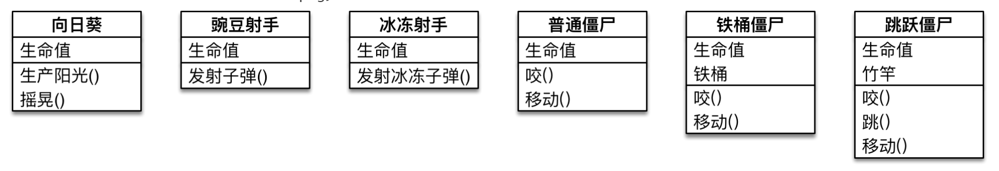

# 类和对象

## 目标

* 类和对象的概念
* 类和对象的关系
* 类的设计

## 01. 类和对象的概念

**类** 和 **对象** 是 **面向对象编程的 两个 核心概念**

### 1.1 类

* **类** 是对一群具有 **相同 特征** 或者 **行为** 的事物的一个统称，是抽象的，**不能直接使用**
  * **特征** 被称为 **属性**
  * **行为** 被称为 **方法**
* **类** 就相当于制造飞机时的**图纸**，是一个 **模板**，是 **负责创建对象的**

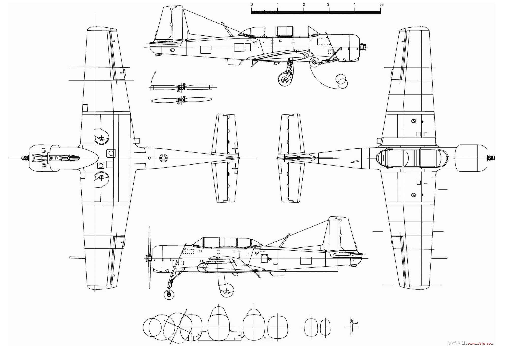

### 1.2 对象

* **对象** 是 **由类创建出来的一个具体存在**，可以直接使用
* 由 **哪一个类** 创建出来的 **对象**，就拥有在 **哪一个类** 中定义的：
  * 属性
  * 方法
* **对象** 就相当于用 **图纸** **制造** 的飞机

> 在程序开发中，应该 **先有类，再有对象**


## 02. 类和对象的关系

* **类是模板**，**对象** 是根据 **类** 这个模板创建出来的，应该 **先有类，再有对象**
* **类** 只有一个，而 **对象** 可以有很多个
  * **不同的对象** 之间 **属性** 可能会各不相同
* **类** 中定义了什么 **属性和方法**，**对象** 中就有什么属性和方法，**不可能多，也不可能少**

## 03. 类的设计

在使用面相对象开发前，应该首先分析需求，确定一下，程序中需要包含哪些类！


在程序开发中，要设计一个类，通常需要满足一下三个要素：

1. **类名** 这类事物的名字，**满足大驼峰命名法**
2. **属性** 这类事物具有什么样的特征
3. **方法** 这类事物具有什么样的行为

### 大驼峰命名法

`CapWords`

1. 每一个单词的首字母大写
2. 单词与单词之间没有下划线

### 3.1 类名的确定

**名词提炼法** 分析 **整个业务流程**，出现的 **名词**，通常就是找到的类

### 3.2 属性和方法的确定

* 对 **对象的特征描述**，通常可以定义成 **属性**
* **对象具有的行为**（动词），通常可以定义成 **方法**

> 提示：需求中没有涉及的属性或者方法在设计类时，不需要考虑

### 练习 1

**需求**

* **小明** 今年 **18 岁**，**身高 1.75**，每天早上 **跑** 完步，会去 **吃** 东西
* **小美** 今年 **17 岁**，**身高 1.65**，小美不跑步，小美喜欢 **吃** 东西 

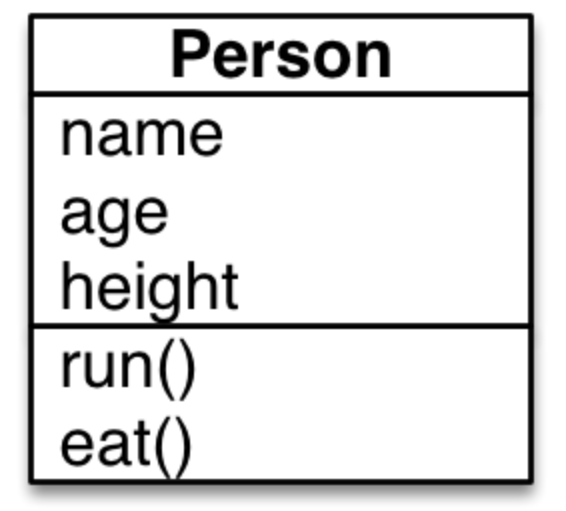

### 练习 2

**需求**

* 一只 **黄颜色** 的 **狗狗** 叫 **大黄**
* 看见生人 **汪汪叫**
* 看见家人 **摇尾巴**

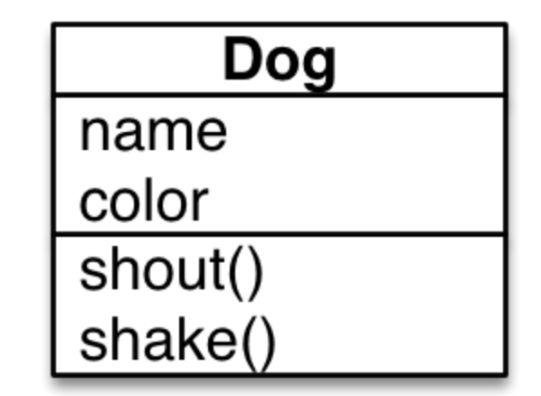


# 面相对象基础语法

## 目标

* `dir` 内置函数
* 定义简单的类（只包含方法）
* 方法中的 `self` 参数
* 初始化方法
* 内置方法和属性

## 01. `dir` 内置函数（知道）

* 在 `Python` 中 **对象几乎是无所不在的**，我们之前学习的 **变量**、**数据**、**函数** 都是对象

在 `Python` 中可以使用以下两个方法验证：

1. 在 **标识符** / **数据** 后输入一个 `.`，然后按下 `TAB` 键，`iPython` 会提示该对象能够调用的 **方法列表**
2. 使用内置函数 `dir` 传入 **标识符** / **数据**，可以查看对象内的 **所有属性及方法**

**提示** `__方法名__` 格式的方法是 `Python` 提供的 **内置方法 / 属性**，稍后会给大家介绍一些常用的 内置方法 / 属性

| 序号 |   方法名   | 类型 | 作用                                         |
| :--: | :--------: | :--: | -------------------------------------------- |
|  01  | `__new__`  | 方法 | **创建对象**时，会被 **自动** 调用           |
|  02  | `__init__` | 方法 | **对象被初始化**时，会被 **自动** 调用       |
|  03  | `__del__`  | 方法 | **对象被从内存中销毁**前，会被 **自动** 调用 |
|  04  | `__str__`  | 方法 | 返回**对象的描述信息**，`print` 函数输出使用 |

**提示** 利用好 `dir()` 函数，在学习时很多内容就不需要死记硬背了


自己测试：

```python
In [5]: def demo():
   ...:     print("这是一个测试函数！")
   ...:

In [6]: demo()
这是一个测试函数！

#注意这里输出结果是一个列表
In [8]: dir(demo)
Out[8]:
['__annotations__',
 '__call__',
 '__class__',
 '__closure__',
 '__code__',
 '__defaults__',
 '__delattr__',
 '__dict__',
 '__dir__',
 '__doc__',
 '__eq__',
 '__format__',
 '__ge__',
 '__get__',
 '__getattribute__',
 '__globals__',
 '__gt__',
 '__hash__',
 '__init__',
 '__init_subclass__',
 '__kwdefaults__',
 '__le__',
 '__lt__',
 '__module__',
 '__name__',
 '__ne__',
 '__new__',
 '__qualname__',
 '__reduce__',
 '__reduce_ex__',
 '__repr__',
 '__setattr__',
 '__sizeof__',
 '__str__',
 '__subclasshook__']

```


## 02. 定义简单的类（只包含方法）

> **面向对象** 是 **更大** 的 **封装**，在 **一个类中 封装 多个方法**，这样 **通过这个类创建出来的对象，就可以直接调用这些方法了**！

### 2.1 定义只包含方法的类

* 在 `Python` 中要定义一个只包含方法的类，语法格式如下：

```python
class 类名:

    def 方法1(self, 参数列表):
        pass
    
    def 方法2(self, 参数列表):
        pass
```

* **方法** 的定义格式和之前学习过的**函数** 几乎一样
* 区别在于第一个参数必须是 `self`，大家暂时先记住，稍后介绍 `self`

> 注意：**类名** 的 命名规则 要符合 **大驼峰命名法**

### 2.2 创建对象

* 当一个类定义完成之后，要使用这个类来创建对象，语法格式如下：

```python
对象变量 = 类名()
```

### 2.3 第一个面向对象程序

**需求**

* **小猫** 爱 **吃** 鱼，**小猫** 要 **喝** 水

**分析**

1. 定义一个猫类 `Cat`
2. 定义两个方法 `eat` 和 `drink`
3. 按照需求 —— 不需要定义属性

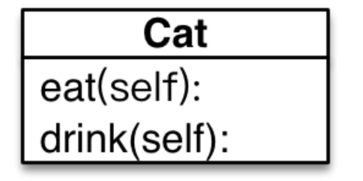

```python
class Cat:
    """这是一个猫类"""

    def eat(self):
        print("小猫爱吃鱼")

    def drink(self):
        print("小猫在喝水")

tom = Cat()
tom.drink()
tom.eat()
```

#### 引用概念的强调

> 在面向对象开发中，**引用**的概念是同样适用的！

* 在 `Python` 中使用类 **创建对象之后**，`tom` 变量中 仍然记录的是 **对象在内存中的地址**
* 也就是 `tom` 变量 **引用** 了 **新建的猫对象**
* 使用 `print` 输出 **对象变量**，默认情况下，是能够输出这个变量 **引用的对象** 是 **由哪一个类创建的对象**，以及 **在内存中的地址**（**十六进制表示**）

> 提示：在计算机中，通常使用 **十六进制** 表示 **内存地址**
>
> * **十进制** 和 **十六进制** 都是用来表达数字的，只是表示的方式不一样
> * **十进制** 和 **十六进制** 的数字之间可以来回转换

* `%d` 可以以 **10 进制** 输出数字
* `%x` 可以以 **16 进制** 输出数字

#### 案例进阶 —— 使用 Cat 类再创建一个对象

```python
lazy_cat = Cat()
lazy_cat.eat()
lazy_cat.drink()
```

> 提问：`tom` 和 `lazy_cat` 是同一个对象吗？

## 03. 方法中的 `self` 参数

### 3.1 案例改造 —— 给对象增加属性

* 在 `Python` 中，要 **给对象设置属性**，非常的容易，**但是不推荐使用**
  * 因为：对象属性的封装应该封装在类的内部
* 只需要在 **类的外部的代码** 中直接通过 `.` 设置一个属性即可

> 注意：这种方式虽然简单，但是不推荐使用！

```python
tom.name = "Tom"
...

lazy_cat.name = "大懒猫"
```

### 3.2 使用 `self` 在方法内部输出每一只猫的名字

> 由 **哪一个对象** 调用的方法，方法内的 `self` 就是 **哪一个对象的引用**

* 在类封装的方法内部，`self` 就表示 **当前调用方法的对象自己**
* **调用方法时**，程序员不需要传递 `self` 参数
* **在方法内部**
  * 可以通过 `self.` **访问对象的属性**
  * 也可以通过 `self.` **调用其他的对象方法**
* 改造代码如下：

```python
class Cat:

    def eat(self):
        print("%s 爱吃鱼" % self.name)

tom = Cat()
tom.name = "Tom"
tom.eat()

lazy_cat = Cat()
lazy_cat.name = "大懒猫"
lazy_cat.eat()
```

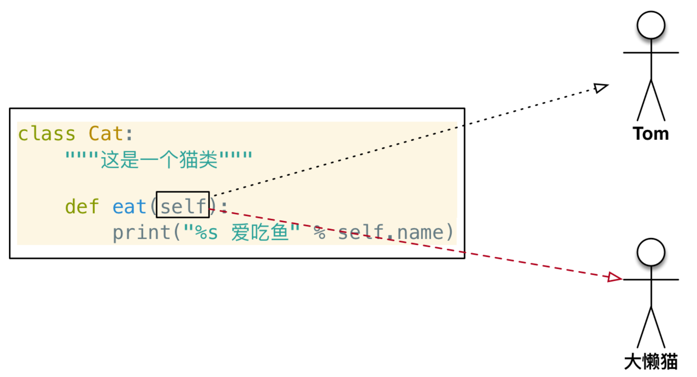

* 在 **类的外部**，通过 `变量名.` 访问对象的 **属性和方法**
* 在 **类封装的方法中**，通过 `self.` 访问对象的 **属性和方法**

## 04. 初始化方法

### 4.1 之前代码存在的问题 —— 在类的外部给对象增加属性

* 将案例代码进行调整，**先调用方法 再设置属性**，观察一下执行效果

```python
tom = Cat()
tom.drink()
tom.eat()
tom.name = "Tom"
print(tom)
```

* 程序执行报错如下：

```
AttributeError: 'Cat' object has no attribute 'name'
属性错误：'Cat' 对象没有 'name' 属性
```

**提示**

* 在日常开发中，不推荐在 **类的外部** 给对象增加属性
  * 如果**在运行时，没有找到属性，程序会报错**
* 对象应该包含有哪些属性，应该 **封装在类的内部**

### 4.2 初始化方法

* 当使用 `类名()` 创建对象时，会 **自动** 执行以下操作：
  1. 为对象在内存中 **分配空间** —— 创建对象
  2. 为对象的属性 **设置初始值** —— 初始化方法(`init`)
* 这个 **初始化方法** 就是 `__init__` 方法，`__init__` 是对象的**内置方法**

> `__init__` 方法是 **专门** 用来定义一个类 **具有哪些属性的方法**！

在 `Cat` 中增加 `__init__` 方法，验证该方法在创建对象时会被自动调用

```python
class Cat:
    """这是一个猫类"""

    def __init__(self):
        print("初始化方法")
```

### 4.3 在初始化方法内部定义属性

* 在 `__init__` 方法内部使用 `self.属性名 = 属性的初始值` 就可以 **定义属性**
* 定义属性之后，再使用 `Cat` 类创建的对象，都会拥有该属性

```python
class Cat:

    def __init__(self):

        print("这是一个初始化方法")
        
        # 定义用 Cat 类创建的猫对象都有一个 name 的属性
        self.name = "Tom"

    def eat(self):
        print("%s 爱吃鱼" % self.name)

# 使用类名()创建对象的时候，会自动调用初始化方法 __init__
tom = Cat()

tom.eat()

```

### 4.4 改造初始化方法 —— 初始化的同时设置初始值

* 在开发中，如果希望在 **创建对象的同时，就设置对象的属性**，可以对 `__init__` 方法进行 **改造**
  1. 把希望设置的属性值，定义成 `__init__` 方法的参数
  2. 在方法内部使用 `self.属性 = 形参` 接收外部传递的参数
  3. 在创建对象时，使用 `类名(属性1, 属性2...)` 调用

```python
class Cat:

    def __init__(self, name):
        print("初始化方法 %s" % name)
        self.name = name
    ...
    
tom = Cat("Tom")
...

lazy_cat = Cat("大懒猫")
...
```

## 05. 内置方法和属性

| 序号 |  方法名   | 类型 | 作用                                         |
| :--: | :-------: | :--: | -------------------------------------------- |
|  01  | `__del__` | 方法 | **对象被从内存中销毁**前，会被 **自动** 调用 |
|  02  | `__str__` | 方法 | 返回**对象的描述信息**，`print` 函数输出使用 |

### 5.1 `__del__` 方法（知道）

* 在 `Python` 中
  * 当使用 `类名()` 创建对象时，为对象 **分配完空间**后，**自动** 调用 `__init__` 方法
  * 当一个 **对象被从内存中销毁** 前，会 **自动** 调用 `__del__` 方法

* **应用场景**
  * `__init__` 改造初始化方法，可以让创建对象更加灵活
  * `__del__` 如果希望在对象被销毁前，再做一些事情，可以考虑一下 `__del__` 方法

* **生命周期**
  * 一个对象从调用 `类名()` 创建，生命周期开始
  * 一个对象的 `__del__` 方法一旦被调用，生命周期结束
  * 在对象的生命周期内，可以访问对象属性，或者让对象调用方法

```python
class Cat:

    def __init__(self, new_name):

        self.name = new_name

        print("%s 来了" % self.name)

    def __del__(self):

        print("%s 去了" % self.name)

# tom 是一个全局变量
tom = Cat("Tom")
print(tom.name)

# del 关键字可以删除一个对象
del tom

print("-" * 50)

```

说明：

```python
#如果是用__del__删除，则是等print("-" * 50)，执行完毕以后才会执行。

#如果是用del来删除，则不等其他是否执行完毕，执行到这句话就立即删除。
```

  


### 5.2 `__str__` 方法

* 在 `Python` 中，使用 `print` 输出 **对象变量**，默认情况下，会输出这个变量 **引用的对象** 是 **由哪一个类创建的对象**，以及 **在内存中的地址**（**十六进制表示**）
* 如果在开发中，希望使用 `print` 输出 **对象变量** 时，能够打印 **自定义的内容**，就可以利用 `__str__` 这个内置方法了

> 注意：`__str__` 方法**必须返回一个字符串**

```python
class Cat:

    def __init__(self, new_name):

        self.name = new_name

        print("%s 来了" % self.name)

    def __del__(self):

        print("%s 去了" % self.name)

    def __str__(self):
        return "我是小猫：%s" % self.name

tom = Cat("Tom")
print(tom)

```


# 面向对象封装案例

## 目标

* 封装
* 小明爱跑步
* 存放家具

### 01. 封装

1. **封装** 是面向对象编程的一大特点
2. 面向对象编程的 **第一步** —— 将 **属性** 和 **方法** **封装** 到一个抽象的 **类** 中
3. **外界** 使用 **类** 创建 **对象**，然后 **让对象调用方法**
4. **对象方法的细节** 都被 **封装** 在 **类的内部**

## 02. 小明爱跑步

**需求**

1. **小明** **体重** `75.0` 公斤
2. 小明每次 **跑步** 会减肥 `0.5` 公斤
3. 小明每次 **吃东西** 体重增加 `1` 公斤

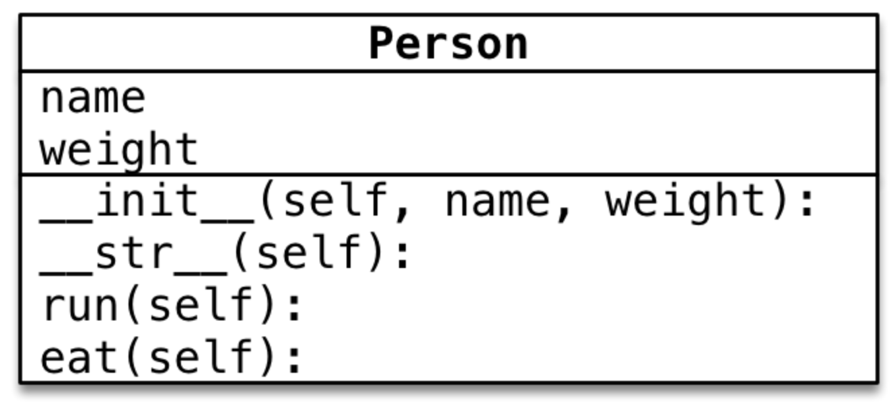

> 提示：在 **对象的方法内部**，是可以 **直接访问对象的属性** 的！

* 代码实现：

```python
class Person:
    """人类"""

    def __init__(self, name, weight):

        self.name = name
        self.weight = weight

    def __str__(self):

        return "我的名字叫 %s 体重 %.2f 公斤" % (self.name, self.weight)

    def run(self):
        """跑步"""

        print("%s 爱跑步，跑步锻炼身体" % self.name)
        self.weight -= 0.5

    def eat(self):
        """吃东西"""

        print("%s 是吃货，吃完这顿再减肥" % self.name)
        self.weight += 1


xiaoming = Person("小明", 75)

xiaoming.run()
xiaoming.eat()
xiaoming.eat()

print(xiaoming)

```

### 2.1 小明爱跑步扩展 —— 小美也爱跑步

**需求**

1. **小明** 和 **小美** 都爱跑步
2. **小明** **体重** `75.0` 公斤
3. **小美** **体重** `45.0` 公斤
4. 每次 **跑步** 都会减少 `0.5` 公斤
5. 每次 **吃东西** 都会增加 `1` 公斤

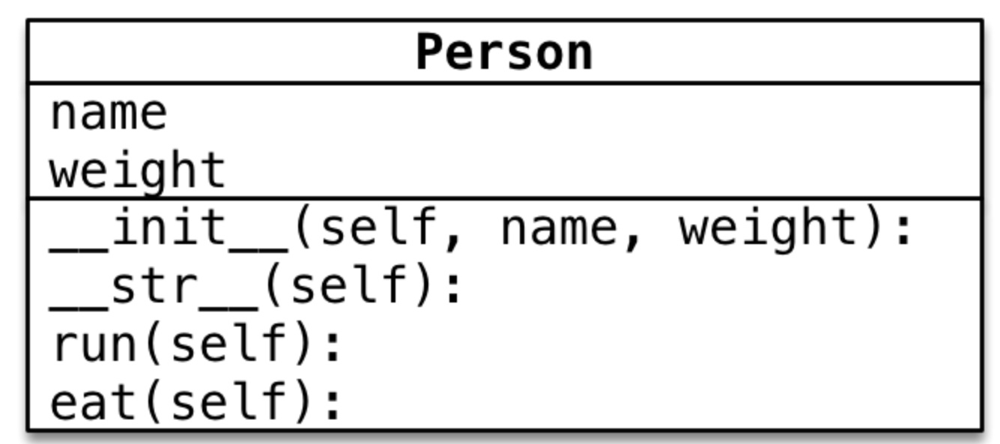

**提示**

1. 在 **对象的方法内部**，是可以 **直接访问对象的属性** 的
2. **同一个类** 创建的 **多个对象** 之间，**属性** 互不干扰！


## 03. 摆放家具

**需求**

1. **房子(House)** 有 **户型**、**总面积** 和 **家具名称列表**
   * 新房子没有任何的家具
2. **家具(HouseItem)** 有 **名字** 和 **占地面积**，其中
   *  **席梦思(bed)** 占地 `4` 平米
   *  **衣柜(chest)** 占地 `2` 平米
   *  **餐桌(table)** 占地 `1.5` 平米
3. 将以上三件 **家具** **添加** 到 **房子** 中
4. 打印房子时，要求输出：**户型**、**总面积**、**剩余面积**、**家具名称列表**

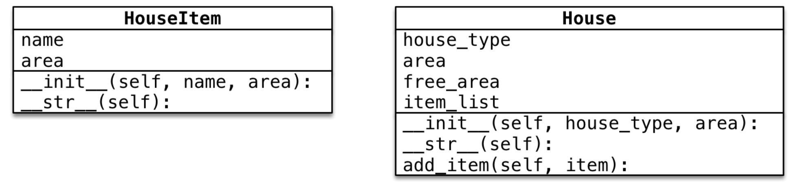

**剩余面积**

1. 在创建房子对象时，定义一个 **剩余面积的属性**，**初始值和总面积相等**
2. 当调用 `add_item` 方法，向房间 **添加家具** 时，让 **剩余面积** -= **家具面积**

**思考**：应该先开发哪一个类？

**答案** —— **家具类**

1. 家具简单
2. 房子要使用到家具，**被使用的类**，通常应该先开发

### 3.1 创建家具

```python
class HouseItem:

    def __init__(self, name, area):
        """

        :param name: 家具名称
        :param area: 占地面积
        """
        self.name = name
        self.area = area

    def __str__(self):
        return "[%s] 占地面积 %.2f" % (self.name, self.area)


# 1. 创建家具
bed = HouseItem("席梦思", 4)
chest = HouseItem("衣柜", 2)
table = HouseItem("餐桌", 1.5)

print(bed)
print(chest)
print(table)

```

**小结**

1. 创建了一个 **家具类**，使用到 `__init__` 和 `__str__` 两个内置方法
2. 使用 **家具类** 创建了 **三个家具对象**，并且 **输出家具信息**

### 3.2 创建房间

```python
class House:

    def __init__(self, house_type, area):
        """

        :param house_type: 户型
        :param area: 总面积
        """
        self.house_type = house_type
        self.area = area
        
        # 剩余面积默认和总面积一致
        self.free_area = area
        # 默认没有任何的家具
        self.item_list = []

    def __str__(self):

        # Python 能够自动的将一对括号内部的代码连接在一起
        return ("户型：%s\n总面积：%.2f[剩余：%.2f]\n家具：%s"
                % (self.house_type, self.area,
                   self.free_area, self.item_list))

    def add_item(self, item):

        print("要添加 %s" % item)

...

# 2. 创建房子对象
my_home = House("两室一厅", 60)

my_home.add_item(bed)
my_home.add_item(chest)
my_home.add_item(table)

print(my_home)
```

**小结**

1. 创建了一个 **房子类**，使用到 `__init__` 和 `__str__` 两个内置方法
2. 准备了一个 `add_item` 方法 **准备添加家具**
3. 使用 **房子类** 创建了 **一个房子对象**
4. 让 **房子对象** 调用了三次 `add_item` 方法，将 **三件家具** 以实参传递到 `add_item` 内部

### 3.3 添加家具

**需求**

* 1> **判断** **家具的面积** 是否 **超过剩余面积**，**如果超过**，提示不能添加这件家具
* 2> 将 **家具的名称** 追加到 **家具名称列表** 中
* 3> 用 **房子的剩余面积** - **家具面积**

```python
    def add_item(self, item):

        print("要添加 %s" % item)
        # 1. 判断家具面积是否大于剩余面积
        if item.area > self.free_area:
            print("%s 的面积太大，不能添加到房子中" % item.name)

            return

        # 2. 将家具的名称追加到名称列表中
        self.item_list.append(item.name)

        # 3. 计算剩余面积
        self.free_area -= item.area
```

### 3.4 小结

* 主程序只负责创建 **房子** 对象和 **家具** 对象
* 让 **房子** 对象调用 `add_item` 方法 **将家具添加到房子**中
* **面积计算**、**剩余面积**、**家具列表** 等处理都被 **封装** 到 **房子类的内部**


# 面向对象封装案例 II

## 目标

* 士兵突击案例
* 身份运算符

**封装**

1. **封装** 是面向对象编程的一大特点
2. 面向对象编程的 **第一步** —— 将 **属性** 和 **方法** **封装** 到一个抽象的 **类** 中
3. **外界** 使用 **类** 创建 **对象**，然后 **让对象调用方法**
4. **对象方法的细节** 都被 **封装** 在 **类的内部**

> 一个对象的 **属性** 可以是 **另外一个类创建的对象**

## 01. 士兵突击

**需求**

1. **士兵** **许三多** 有一把 **AK47**
2. **士兵** 可以 **开火**
3. **枪** 能够 **发射** 子弹
4. **枪** 装填 **装填子弹** —— **增加子弹数量**

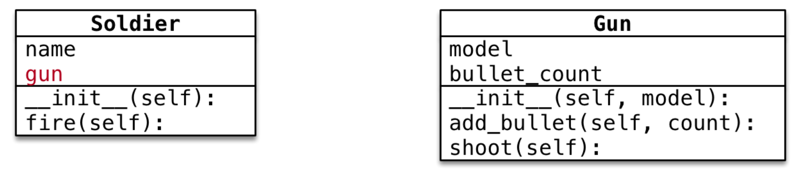

### 1.1 开发枪类

**`shoot` 方法需求**

* 1> 判断是否有子弹，没有子弹无法射击
* 2> 使用 `print` 提示射击，并且输出子弹数量

```python
class Gun:

    def __init__(self, model):

        # 枪的型号
        self.model = model
        # 子弹数量
        self.bullet_count = 0

    def add_bullet(self, count):

        self.bullet_count += count

    def shoot(self):

        # 判断是否还有子弹
        if self.bullet_count <= 0:
            print("没有子弹了...")

            return

        # 发射一颗子弹
        self.bullet_count -= 1
        
        print("%s 发射子弹[%d]..." % (self.model, self.bullet_count))

# 创建枪对象
ak47 = Gun("ak47")
ak47.add_bullet(50)
ak47.shoot()

```

### 1.2 开发士兵类

> 假设：每一个新兵 都 **没有枪**

**定义没有初始值的属性**

在定义属性时，如果 **不知道设置什么初始值**，可以设置为 `None`

* `None` **关键字** 表示 **什么都没有**
* 表示一个 **空对象**，**没有方法和属性，是一个特殊的常量**
* 可以将 `None` 赋值给任何一个变量

**`fire` 方法需求**

* 1> 判断是否有枪，没有枪没法冲锋
* 2> 喊一声口号
* 3> 装填子弹
* 4> 射击

```python
class Soldier:

    def __init__(self, name):

        # 姓名
        self.name = name
        # 枪，士兵初始没有枪 None 关键字表示什么都没有
        self.gun = None

    def fire(self):

        # 1. 判断士兵是否有枪
        if self.gun is None:
            print("[%s] 还没有枪..." % self.name)

            return

        # 2. 高喊口号
        print("冲啊...[%s]" % self.name)

        # 3. 让枪装填子弹
        self.gun.add_bullet(50)

        # 4. 让枪发射子弹
        self.gun.shoot()
```

**小结**

1. 创建了一个 **士兵类**，使用到 `__init__` 内置方法
2. 在定义属性时，如果 **不知道设置什么初始值**，可以设置为 `None`
3. 在 **封装的** 方法内部，还可以让 **自己的** **使用其他类创建的对象属性** 调用已经 **封装好的方法** 

## 02. 身份运算符

身份运算符用于 **比较** 两个对象的 **内存地址** 是否一致 —— **是否是对同一个对象的引用**

* 在 `Python` 中针对 `None` 比较时，建议使用 `is` 判断

| 运算符 | 描述                                      | 实例                            |
| ------ | ----------------------------------------- | ------------------------------- |
| is     | is 是判断两个标识符是不是引用同一个对象   | x is y，类似 id(x) == id(y)     |
| is not | is not 是判断两个标识符是不是引用不同对象 | x is not y，类似 id(a) != id(b) |

### is 与 == 区别：

`is` 用于判断 **两个变量 引用对象是否为同一个** 
`==` 用于判断 **引用变量的值** 是否相等

```python
>>> a = [1, 2, 3]
>>> b = [1, 2, 3]
>>> b is a 
False
>>> b == a
True
```


# 私有属性和私有方法

## 01. 应用场景及定义方式

**应用场景**

* 在实际开发中，**对象** 的 **某些属性或方法** 可能只希望 **在对象的内部被使用**，而 **不希望在外部被访问到**
* **私有属性** 就是 **对象** 不希望公开的 **属性**
* **私有方法** 就是 **对象** 不希望公开的 **方法**

**定义方式**

* 在 **定义属性或方法时**，在 **属性名或者方法名前** 增加 **两个下划线**，定义的就是 **私有** 属性或方法

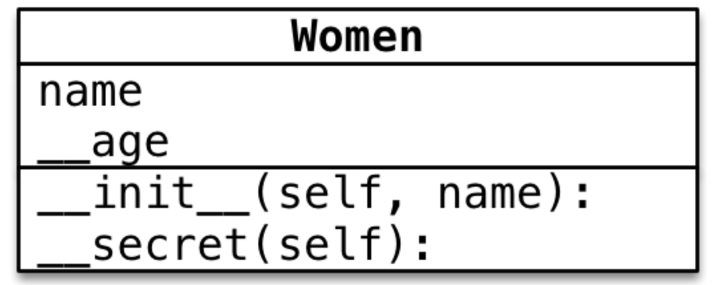

```python
class Women:

    def __init__(self, name):

        self.name = name
        # 不要问女生的年龄
        self.__age = 18

    def __secret(self):
        print("我的年龄是 %d" % self.__age)


xiaofang = Women("小芳")
# 私有属性，外部不能直接访问
# print(xiaofang.__age)

# 私有方法，外部不能直接调用
# xiaofang.__secret()

```

## 02. 伪私有属性和私有方法（科普）

> 提示：在日常开发中，**不要使用这种方式**，**访问对象的 私有属性 或 私有方法**

`Python` 中，并没有 **真正意义** 的 **私有**

* 在给 **属性**、**方法** 命名时，实际是对 **名称** 做了一些特殊处理，使得外界无法访问到
* **处理方式**：在 **名称** 前面加上 `_类名` => `_类名__名称`

```python
# 私有属性，外部不能直接访问到
print(xiaofang._Women__age)

# 私有方法，外部不能直接调用
xiaofang._Women__secret()

```


# 继承

## 目标

* 单继承
* 多继承

**面向对象三大特性**

1. **封装** 根据 **职责** 将 **属性** 和 **方法** **封装** 到一个抽象的 **类** 中
2. **继承** **实现代码的重用**，相同的代码不需要重复的编写
3. **多态** 不同的对象调用相同的方法，产生不同的执行结果，**增加代码的灵活度**

## 01. 单继承

### 1.1 继承的概念、语法和特点

**继承的概念**：**子类** 拥有 **父类** 的所有 **方法** 和 **属性**

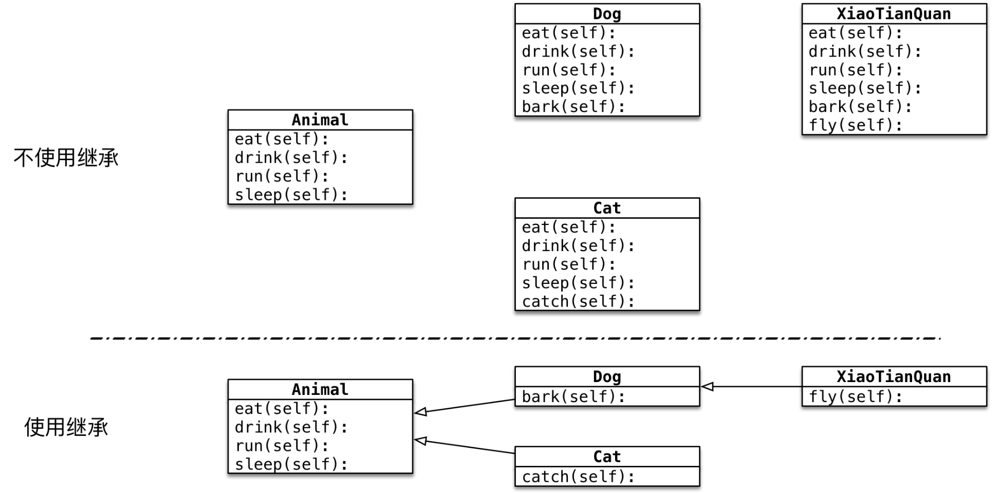

#### 1) 继承的语法

```python
class 类名(父类名):

    pass
```

* **子类** 继承自 **父类**，可以直接 **享受** 父类中已经封装好的方法，不需要再次开发
* **子类** 中应该根据 **职责**，封装 **子类特有的** **属性和方法**

#### 2) 专业术语

* `Dog` 类是 `Animal` 类的**子类**，`Animal` 类是 `Dog` 类的**父类**，`Dog` 类从 `Animal` 类**继承**
* `Dog` 类是 `Animal` 类的**派生类**，`Animal` 类是 `Dog` 类的**基类**，`Dog` 类从 `Animal` 类**派生**

#### 3) 继承的传递性

* `C` 类从 `B` 类继承，`B` 类又从 `A` 类继承
* 那么 `C` 类就具有 `B` 类和 `A` 类的所有属性和方法

**子类** 拥有 **父类** 以及 **父类的父类** 中封装的所有 **属性** 和 **方法**

**提问**

**哮天犬** 能够调用 `Cat` 类中定义的 `catch` 方法吗？

**答案**

**不能**，因为 **哮天犬** 和 `Cat` 之间没有 **继承** 关系

### 1.2 方法的重写

* **子类** 拥有 **父类** 的所有 **方法** 和 **属性**
* **子类** 继承自 **父类**，可以直接 **享受** 父类中已经封装好的方法，不需要再次开发

**应用场景**

* 当 **父类** 的方法实现不能满足子类需求时，可以对方法进行 **重写(override)**

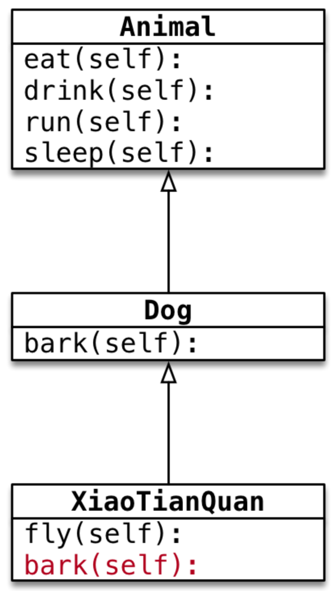

**重写** 父类方法有两种情况：

1. **覆盖** 父类的方法
2. 对父类方法进行 **扩展**

#### 1) 覆盖父类的方法

* 如果在开发中，**父类的方法实现** 和 **子类的方法实现**，**完全不同**
* 就可以使用 **覆盖** 的方式，**在子类中** **重新编写** 父类的方法实现

> 具体的实现方式，就相当于在 **子类中** 定义了一个 **和父类同名的方法并且实现**

重写之后，在运行时，**只会调用** 子类中重写的方法，而不再会调用 **父类封装的方法**

#### 2) 对父类方法进行 **扩展**

* 如果在开发中，**子类的方法实现** 中 **包含** **父类的方法实现**
  * **父类原本封装的方法实现** 是 **子类方法的一部分**
* 就可以使用 **扩展** 的方式
  1. **在子类中** **重写** 父类的方法
  2. 在需要的位置使用 `super().父类方法` 来调用父类方法的执行
  3. 代码其他的位置针对子类的需求，编写 **子类特有的代码实现**

##### 关于 `super`

* 在 `Python` 中 `super` 是一个 **特殊的类**
* `super()` 就是使用 `super` 类创建出来的对象
* **最常** 使用的场景就是在 **重写父类方法时**，调用 **在父类中封装的方法实现**

##### 调用父类方法的另外一种方式（知道）

> 在 `Python 2.x` 时，如果需要调用父类的方法，还可以使用以下方式：

```python
父类名.方法(self)
```

* 这种方式，目前在 `Python 3.x` 还支持这种方式
* 这种方法 **不推荐使用**，因为一旦 **父类发生变化**，方法调用位置的 **类名** 同样需要修改

**提示**

* 在开发时，`父类名` 和 `super()` 两种方式不要混用
* 如果使用 **当前子类名** 调用方法，会形成递归调用，**出现死循环**


### 1.3 父类的 私有属性 和 私有方法

1. **子类对象** **不能** 在自己的方法内部，**直接** 访问 父类的 **私有属性** 或 **私有方法**
2. **子类对象** 可以通过 **父类** 的 **公有方法** **间接** 访问到 **私有属性** 或 **私有方法**

> * **私有属性、方法** 是对象的隐私，不对外公开，**外界** 以及 **子类** 都不能直接访问
> * **私有属性、方法** 通常用于做一些内部的事情

**示例**

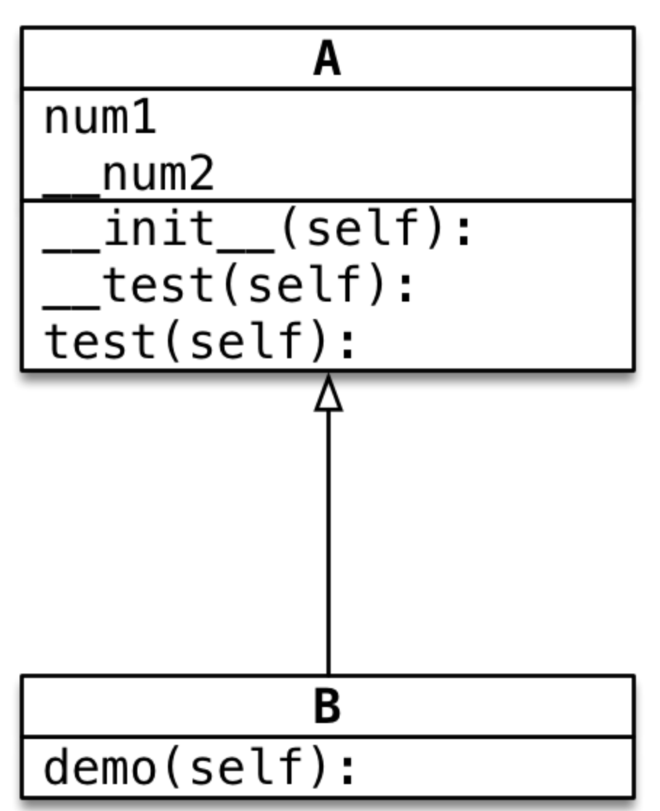

* `B` 的对象不能直接访问 `__num2` 属性
* `B` 的对象不能在 `demo` 方法内访问 `__num2` 属性
* `B` 的对象可以在 `demo` 方法内，调用父类的 `test` 方法
* 父类的 `test` 方法内部，能够访问 `__num2` 属性和 `__test` 方法

## 02. 多继承

**概念**

* **子类** 可以拥有 **多个父类**，并且具有 **所有父类** 的 **属性** 和 **方法**
* 例如：**孩子** 会继承自己 **父亲** 和 **母亲** 的 **特性**

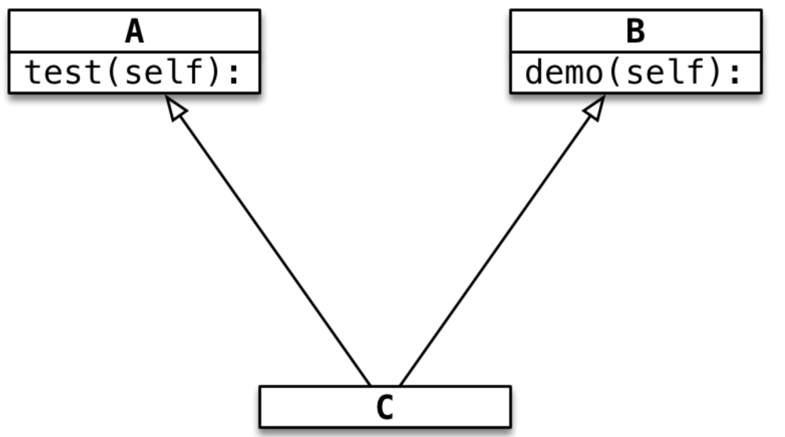

**语法**

```python
class 子类名(父类名1, 父类名2...)
    pass
```

### 2.1 多继承的使用注意事项

**问题的提出**

* 如果 **不同的父类** 中存在 **同名的方法**，**子类对象** 在调用方法时，会调用 **哪一个父类中**的方法呢？

> 提示：**开发时，应该尽量避免这种容易产生混淆的情况！** —— 如果 **父类之间** 存在 **同名的属性或者方法**，应该 **尽量避免** 使用多继承

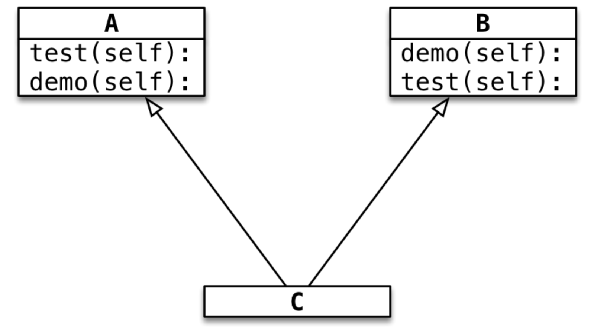

#### Python 中的 MRO —— 方法搜索顺序（知道）

* `Python` 中针对 **类** 提供了一个 **内置属性** `__mro__` 可以查看 **方法** 搜索顺序
* MRO 是 `method resolution order`，主要用于 **在多继承时判断 方法、属性 的调用 路径**

```python
print(C.__mro__)
```

**输出结果**

```
(<class '__main__.C'>, <class '__main__.A'>, <class '__main__.B'>, <class 'object'>)
```

* 在搜索方法时，是按照 `__mro__` 的输出结果 **从左至右** 的顺序查找的
* 如果在当前类中 **找到方法，就直接执行，不再搜索**
* 如果 **没有找到，就查找下一个类** 中是否有对应的方法，**如果找到，就直接执行，不再搜索**
* 如果找到最后一个类，还没有找到方法，程序报错

### 2.2 新式类与旧式（经典）类

> `object` 是 `Python` 为所有对象提供的 **基类**，提供有一些内置的属性和方法，可以使用 `dir` 函数查看

* **新式类**：以 `object` 为基类的类，**推荐使用**
* **经典类**：不以 `object` 为基类的类，**不推荐使用**

* 在 `Python 3.x` 中定义类时，如果没有指定父类，会 **默认使用** `object` 作为该类的 **基类** —— `Python 3.x` 中定义的类都是 **新式类**
* 在 `Python 2.x` 中定义类时，如果没有指定父类，则不会以 `object` 作为 **基类**

> **新式类** 和 **经典类** 在多继承时 —— **会影响到方法的搜索顺序**

为了保证编写的代码能够同时在 `Python 2.x` 和 `Python 3.x` 运行！
今后在定义类时，**如果没有父类，建议统一继承自 `object`**

```python
class 类名(object):
    pass
```


# 多态

## 目标

* 多态

**面向对象三大特性**

1. **封装** 根据 **职责** 将 **属性** 和 **方法** **封装** 到一个抽象的 **类** 中

   * 定义类的准则 

2. **继承** **实现代码的重用**，相同的代码不需要重复的编写

   * 设计类的技巧 
   * 子类针对自己特有的需求，编写特定的代码

3. **多态** 不同的 **子类对象** 调用相同的 **父类方法**，产生不同的执行结果

   * **多态** 可以 **增加代码的灵活度**
   * 以 **继承** 和 **重写父类方法** 为前提
   * 是调用方法的技巧，**不会影响到类的内部设计**

   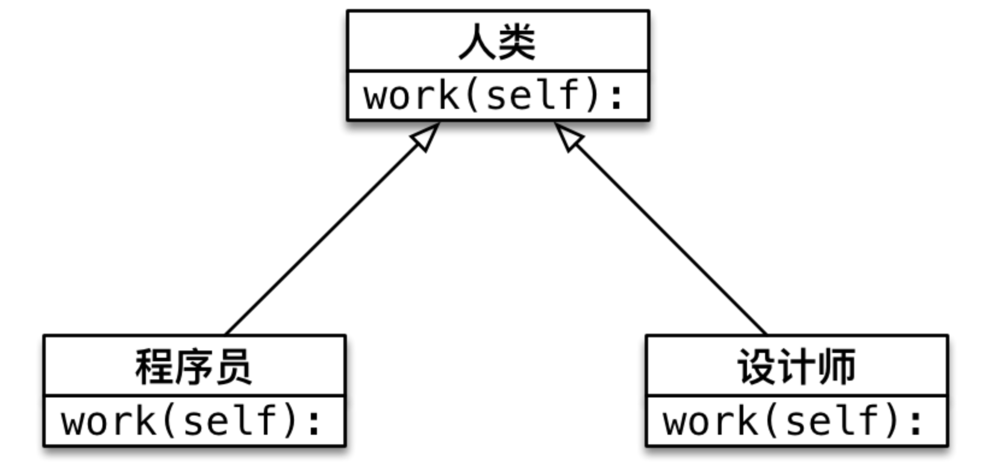

## 多态案例演练

**需求**

1. 在 `Dog` 类中封装方法 `game`
   * 普通狗只是简单的玩耍
2. 定义 `XiaoTianDog` 继承自 `Dog`，并且重写 `game` 方法
   * 哮天犬需要在天上玩耍
3. 定义 `Person` 类，并且封装一个 **和狗玩** 的方法
   * 在方法内部，直接让 **狗对象** 调用 `game` 方法

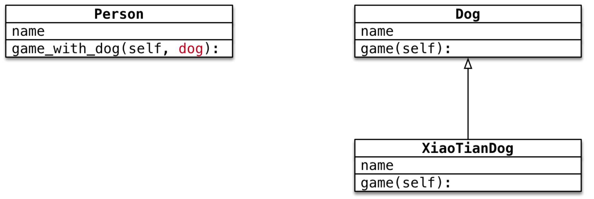

**案例小结**

* `Person` 类中只需要让 **狗对象** 调用 `game` 方法，而不关心具体是 **什么狗**
  * `game` 方法是在 `Dog` 父类中定义的
* 在程序执行时，传入不同的 **狗对象** 实参，就会产生不同的执行效果

> **多态** 更容易编写出出通用的代码，做出通用的编程，以适应需求的不断变化！

```python
class Dog(object):

    def __init__(self, name):
        self.name = name

    def game(self):
        print("%s 蹦蹦跳跳的玩耍..." % self.name)


class XiaoTianDog(Dog):

    def game(self):
        print("%s 飞到天上去玩耍..." % self.name)


class Person(object):

    def __init__(self, name):
        self.name = name

    def game_with_dog(self, dog):

        print("%s 和 %s 快乐的玩耍..." % (self.name, dog.name))

        # 让狗玩耍
        dog.game()


# 1. 创建一个狗对象
# wangcai = Dog("旺财")
wangcai = XiaoTianDog("飞天旺财")

# 2. 创建一个小明对象
xiaoming = Person("小明")

# 3. 让小明调用和狗玩的方法
xiaoming.game_with_dog(wangcai)
        
```


# 类属性和类方法

## 目标

* 类的结构
* 类属性和实例属性
* 类方法和静态方法

## 01. 类的结构

### 1.1 术语 —— 实例

1. 使用面相对象开发，**第 1 步** 是设计 **类**
2. 使用 **类名()** 创建对象，**创建对象** 的动作有两步：
   * 1) 在内存中为对象 **分配空间**
   * 2) 调用初始化方法 `__init__` 为 **对象初始化**
3. 对象创建后，**内存** 中就有了一个对象的 **实实在在** 的存在 —— **实例**

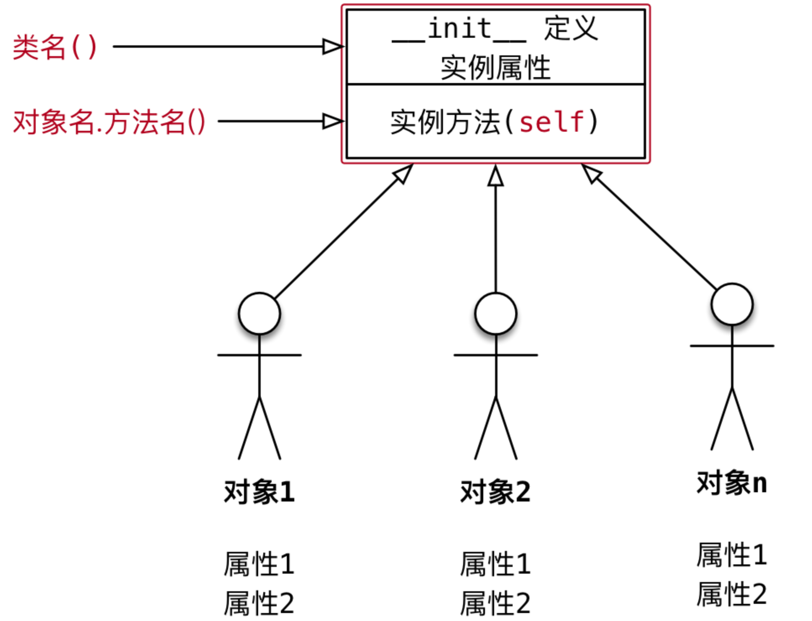

因此，通常也会把：

1. 创建出来的 **对象** 叫做 **类** 的 **实例**
2. 创建对象的 **动作** 叫做 **实例化**
3. **对象的属性** 叫做 **实例属性**
4. **对象调用的方法** 叫做 **实例方法**

在程序执行时：

1. 对象各自拥有自己的 **实例属性**
2. 调用对象方法，可以通过 `self.` 
   * 访问自己的属性
   * 调用自己的方法

**结论**

* **每一个对象** 都有自己 **独立的内存空间**，**保存各自不同的属性**
* **多个对象的方法**，**在内存中只有一份**，在调用方法时，**需要把对象的引用** 传递到方法内部

### 1.2 类是一个特殊的对象

> `Python` 中 **一切皆对象**：
>
> * `class AAA:` 定义的类属于 **类对象**
> * `obj1 = AAA()` 属于 **实例对象**

* 在程序运行时，**类** 同样 **会被加载到内存**
* 在 `Python` 中，**类** 是一个特殊的对象 —— **类对象**
* 在程序运行时，**类对象** 在内存中 **只有一份**，使用 **一个类** 可以创建出 **很多个对象实例**
* 除了封装 **实例** 的 **属性** 和 **方法**外，**类对象** 还可以拥有自己的 **属性** 和 **方法**
  1. **类属性**
  2. **类方法**
* 通过 **类名.** 的方式可以 **访问类的属性** 或者 **调用类的方法**

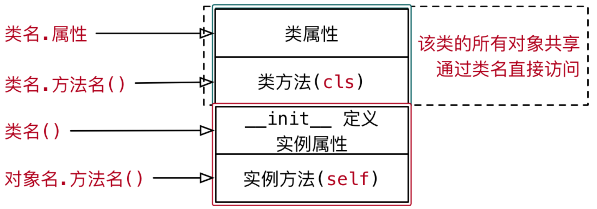

## 02. 类属性和实例属性

### 2.1 概念和使用

* **类属性** 就是给 **类对象** 中定义的 **属性**
* 通常用来记录 **与这个类相关** 的特征
* **类属性** **不会用于**记录 **具体对象的特征**

**示例需求**

* 定义一个 **工具类**
* 每件工具都有自己的 `name`
* **需求** —— 知道使用这个类，创建了多少个工具对象？

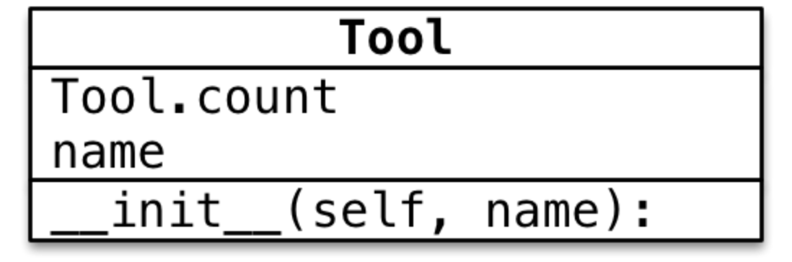

```python
class Tool(object):

    # 使用赋值语句，定义类属性，记录创建工具对象的总数
    count = 0

    def __init__(self, name):
        self.name = name

        # 针对类属性做一个计数+1
        Tool.count += 1


# 创建工具对象
tool1 = Tool("斧头")
tool2 = Tool("榔头")
tool3 = Tool("铁锹")

# 知道使用 Tool 类到底创建了多少个对象?
print("现在创建了 %d 个工具" % Tool.count)

```

### 2.2 属性的获取机制（科普）

* 在 `Python` 中 **属性的获取** 存在一个 **向上查找机制**

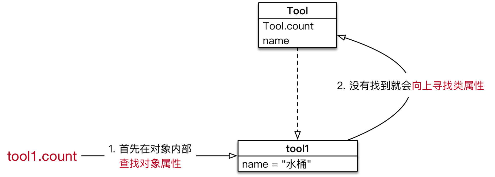

* 因此，要访问类属性有两种方式：
  1. **类名.类属性**
  2. **对象.类属性** （不推荐）

**注意**

* 如果使用 `对象.类属性 = 值` 赋值语句，只会 **给对象添加一个属性**，而不会影响到 **类属性的值**

## 03. 类方法和静态方法

### 3.1 类方法

* **类属性** 就是针对 **类对象** 定义的属性
  * 使用 **赋值语句** 在 `class` 关键字下方可以定义 **类属性**
  * **类属性** 用于记录 **与这个类相关** 的特征
* **类方法** 就是针对 **类对象** 定义的方法
  * 在 **类方法** 内部可以直接访问 **类属性** 或者调用其他的 **类方法**

**语法如下**

```python
@classmethod
def 类方法名(cls):
    pass
```

* 类方法需要用 **修饰器** `@classmethod` 来标识，**告诉解释器这是一个类方法**
* 类方法的 **第一个参数** 应该是 `cls`
  * 由 **哪一个类** 调用的方法，方法内的 `cls` 就是 **哪一个类的引用**
  * 这个参数和 **实例方法** 的第一个参数是 `self` 类似
  * **提示** 使用其他名称也可以，不过习惯使用 `cls`

3. 通过 **类名.** 调用 **类方法**，**调用方法时**，不需要传递 `cls` 参数
4. **在方法内部**
   * 可以通过 `cls.` **访问类的属性**
   * 也可以通过 `cls.` **调用其他的类方法**

**示例需求**

* 定义一个 **工具类**
* 每件工具都有自己的 `name`
* **需求** —— 在 **类** 封装一个 `show_tool_count` 的类方法，输出使用当前这个类，创建的对象个数

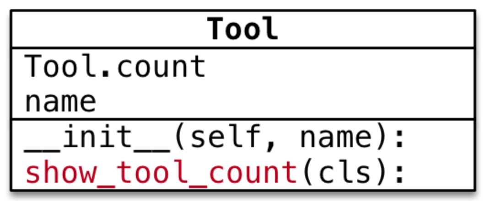

```python
@classmethod
def show_tool_count(cls):
    """显示工具对象的总数"""
    print("工具对象的总数 %d" % cls.count)
```

> 在类方法内部，可以直接使用 `cls` 访问 **类属性** 或者 **调用类方法**

### 3.2 静态方法

* 在开发时，如果需要在 **类** 中封装一个方法，这个方法：
  * 既 **不需要** 访问 **实例属性** 或者调用 **实例方法**
  * 也 **不需要** 访问 **类属性** 或者调用 **类方法**

* 这个时候，可以把这个方法封装成一个 **静态方法**

**语法如下**

```python
@staticmethod
def 静态方法名():
    pass
```

* **静态方法** 需要用 **修饰器** `@staticmethod` 来标识，**告诉解释器这是一个静态方法**
* 通过 **类名.** 调用 **静态方法**

```python
class Dog(object):
    
    # 狗对象计数
    dog_count = 0
    
    @staticmethod
    def run():
        
        # 不需要访问实例属性也不需要访问类属性的方法
        print("狗在跑...")

    def __init__(self, name):
        self.name = name
        
```

### 3.3 方法综合案例

**需求**

1. 设计一个 `Game` 类
2. 属性：
   * 定义一个 **类属性** `top_score` 记录游戏的 **历史最高分**
   * 定义一个 **实例属性** `player_name` 记录 **当前游戏的玩家姓名**
3. 方法：
   * **静态方法** `show_help` 显示游戏帮助信息 （既不需要访问实例属性，也不需要访问实例方法。也不需要类属性和类方法。）
   * **类方法** `show_top_score` 显示历史最高分 （针对类对象定义的方法，在类方法内部直接可以调用类属性和其他累方法）
   * **实例方法** `start_game` 开始当前玩家的游戏
4. 主程序步骤
   * 1) 查看帮助信息
   * 2) 查看历史最高分
   * 3) 创建游戏对象，开始游戏

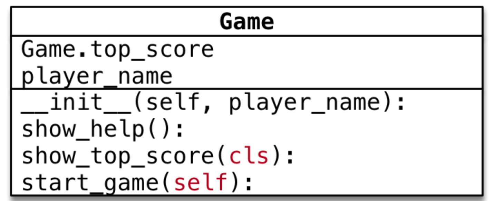

#### 案例小结

1. **实例方法** —— 方法内部需要访问 **实例属性**
   * **实例方法** 内部可以使用 **类名.** 访问类属性
2. **类方法** —— 方法内部 **只** 需要访问 **类属性**
3. **静态方法** —— 方法内部，不需要访问 **实例属性** 和 **类属性**

**提问**

如果方法内部 即需要访问 **实例属性**，又需要访问 **类属性**，应该定义成什么方法？

**答案**

* 应该定义 **实例方法**
* 因为，**类只有一个**，在 **实例方法** 内部可以使用 **类名.** 访问类属性

```python
class Game(object):

    # 游戏最高分，类属性
    top_score = 0

    @staticmethod
    def show_help():
        print("帮助信息：让僵尸走进房间")
        
    @classmethod
    def show_top_score(cls):
        print("游戏最高分是 %d" % cls.top_score)

    def __init__(self, player_name):
        self.player_name = player_name

    def start_game(self):
        print("[%s] 开始游戏..." % self.player_name)
        
        # 使用类名.修改历史最高分
        Game.top_score = 999

# 1. 查看游戏帮助
Game.show_help()

# 2. 查看游戏最高分
Game.show_top_score()

# 3. 创建游戏对象，开始游戏
game = Game("小明")

game.start_game()

# 4. 游戏结束，查看游戏最高分
Game.show_top_score()

```


# 单例

## 目标

* 单例设计模式
* `__new__` 方法
* Python 中的单例

## 01. 单例设计模式

* 设计模式
  * **设计模式** 是 **前人工作的总结和提炼**，通常，被人们广泛流传的设计模式都是针对 **某一特定问题** 的成熟的解决方案
  * 使用 **设计模式** 是为了可重用代码、让代码更容易被他人理解、保证代码可靠性

* 单例设计模式
  * **目的** —— 让 **类** 创建的对象，在系统中 **只有** **唯一的一个实例**
  * 每一次执行 `类名()` 返回的对象，**内存地址是相同的**

### 单例设计模式的应用场景

* **音乐播放** 对象
* **回收站** 对象
* **打印机** 对象
* ……

## 02. `__new__` 方法

* 使用 **类名()** 创建对象时，`Python` 的解释器 **首先** 会 调用 `__new__` 方法为对象 **分配空间**
* `__new__` 是一个 由 `object` 基类提供的 **内置的静态方法**，主要作用有两个：
  * 1) 在内存中为对象 **分配空间**
  * 2) **返回** 对象的引用
* `Python` 的解释器获得对象的 **引用** 后，将引用作为 **第一个参数**，传递给 `__init__` 方法

> 重写 `__new__` 方法 的代码非常固定！

* 重写 `__new__` 方法 **一定要** `return super().__new__(cls)` 
* 否则 Python 的解释器 **得不到** 分配了空间的 **对象引用**，**就不会调用对象的初始化方法**
* 注意：`__new__` 是一个静态方法，在调用时需要 **主动传递** `cls` 参数

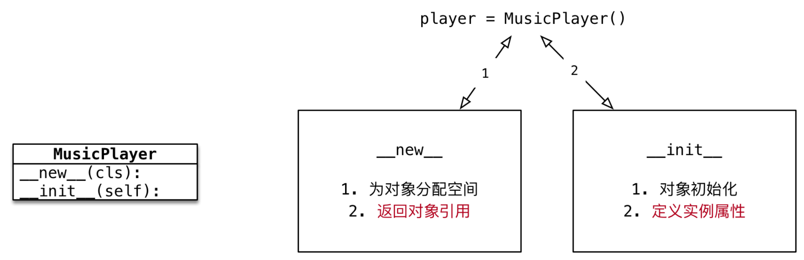

**示例代码**

```python
class MusicPlayer(object):

    def __new__(cls, *args, **kwargs):
        # 如果不返回任何结果，
        return super().__new__(cls)

    def __init__(self):
        print("初始化音乐播放对象")

player = MusicPlayer()

print(player)

```

## 03. Python 中的单例

* **单例** —— 让 **类** 创建的对象，在系统中 **只有** **唯一的一个实例**
  1. 定义一个 **类属性**，初始值是 `None`，用于记录 **单例对象的引用**
  2. 重写 `__new__` 方法
  3. 如果 **类属性** `is None`，调用父类方法分配空间，并在类属性中记录结果
  4. 返回 **类属性** 中记录的 **对象引用**

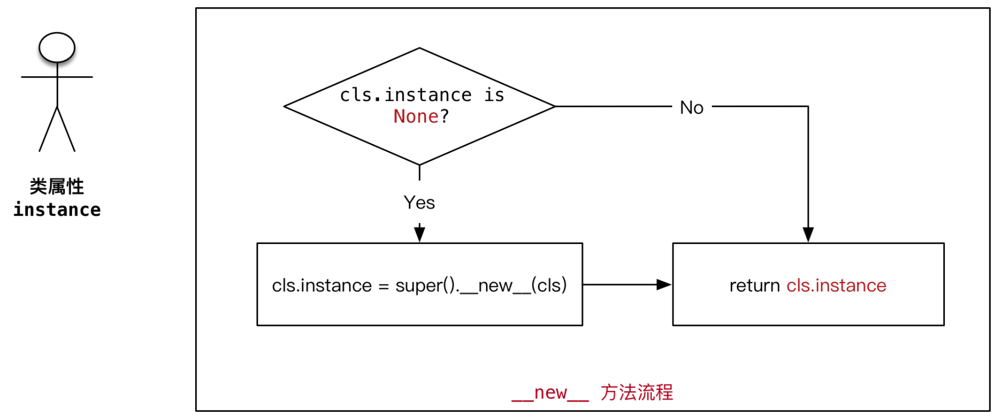


```python
class MusicPlayer(object):

    # 定义类属性记录单例对象引用
    instance = None

    def __new__(cls, *args, **kwargs):

        # 1. 判断类属性是否已经被赋值
        if cls.instance is None:
            cls.instance = super().__new__(cls)

        # 2. 返回类属性的单例引用
        return cls.instance

```

### 只执行一次初始化工作

* 在每次使用 `类名()` 创建对象时，`Python` 的解释器都会自动调用两个方法：
  * `__new__` 分配空间
  * `__init__` 对象初始化
* 在上一小节对 `__new__` 方法改造之后，每次都会得到 **第一次被创建对象的引用**
* 但是：**初始化方法还会被再次调用**

**需求**

* 让 **初始化动作** 只被 **执行一次**

**解决办法**

1. 定义一个类属性 `init_flag` 标记是否 **执行过初始化动作**，初始值为 `False`
2. 在 `__init__` 方法中，判断 `init_flag`，如果为 `False` 就执行初始化动作
3. 然后将 `init_flag` 设置为 `True`
4. 这样，再次 **自动** 调用 `__init__` 方法时，**初始化动作就不会被再次执行** 了

```python
class MusicPlayer(object):

    # 记录第一个被创建对象的引用
    instance = None
    # 记录是否执行过初始化动作
    init_flag = False

    def __new__(cls, *args, **kwargs):

        # 1. 判断类属性是否是空对象
        if cls.instance is None:
            # 2. 调用父类的方法，为第一个对象分配空间
            cls.instance = super().__new__(cls)

        # 3. 返回类属性保存的对象引用
        return cls.instance

    def __init__(self):

        if not MusicPlayer.init_flag:
            print("初始化音乐播放器")

            MusicPlayer.init_flag = True


# 创建多个对象
player1 = MusicPlayer()
print(player1)

player2 = MusicPlayer()
print(player2)

```


# 异常

## 目标

* 异常的概念
* 捕获异常
* 异常的传递
* 抛出异常

## 01. 异常的概念

* 程序在运行时，如果 `Python 解释器` **遇到** 到一个错误，**会停止程序的执行，并且提示一些错误信息**，这就是 **异常**
* **程序停止执行并且提示错误信息** 这个动作，我们通常称之为：**抛出(raise)异常**

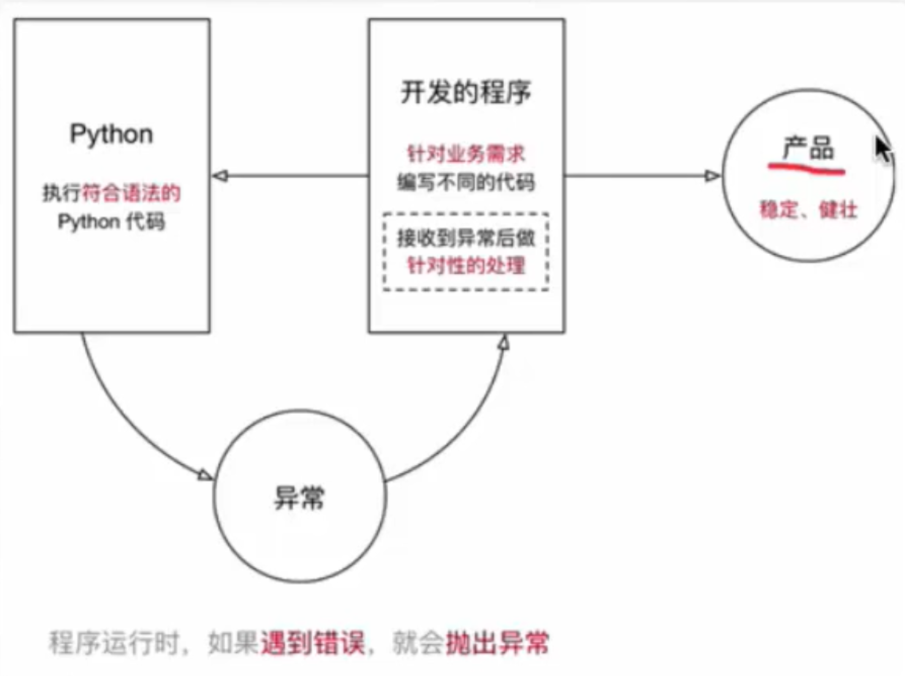

> 程序开发时，很难将 **所有的特殊情况** 都处理的面面俱到，通过 **异常捕获** 可以针对突发事件做集中的处理，从而保证程序的 **稳定性和健壮性**

## 02. 捕获异常

### 2.1 简单的捕获异常语法

* 在程序开发中，如果 **对某些代码的执行不能确定是否正确**，可以增加 `try(尝试)` 来 **捕获异常**
* 捕获异常最简单的语法格式：

```python
try:
    尝试执行的代码
except:
    出现错误的处理
```

* `try` **尝试**，下方编写要尝试代码，不确定是否能够正常执行的代码
* `except` **如果不是**，下方编写尝试失败的代码


#### 简单异常捕获演练 —— 要求用户输入整数

```python
try:
    # 提示用户输入一个数字
    num = int(input("请输入数字："))
except:
    print("请输入正确的数字")
```

### 2.2 错误类型捕获

* 在程序执行时，可能会遇到 **不同类型的异常**，并且需要 **针对不同类型的异常，做出不同的响应**，这个时候，就需要捕获错误类型了

* 语法如下：

```python
try:
    # 尝试执行的代码
    pass
except 错误类型1:
    # 针对错误类型1，对应的代码处理
    pass
except (错误类型2, 错误类型3):
    # 针对错误类型2 和 3，对应的代码处理
    pass
except Exception as result:
    print("未知错误 %s" % result)
```

* 当 `Python` 解释器 **抛出异常** 时，**最后一行错误信息的第一个单词，就是错误类型**（如下图）

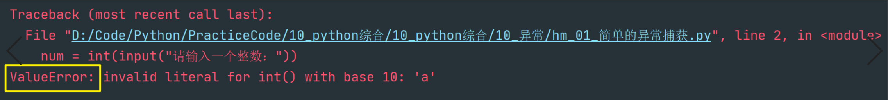

#### 异常类型捕获演练 —— 要求用户输入整数

**需求**

1. 提示用户输入一个整数
2. 使用 `8` 除以用户输入的整数并且输出

```python
try:
    num = int(input("请输入整数："))
    result = 8 / num
    print(result)
except ValueError:
    print("请输入正确的整数")
except ZeroDivisionError:
    print("除 0 错误")

```

#### 捕获未知错误

* 在开发时，**要预判到所有可能出现的错误**，还是有一定难度的
* 如果希望程序 **无论出现任何错误**，都不会因为 `Python` 解释器 **抛出异常而被终止**，可以再增加一个 `except`

语法如下：

```python
except Exception as result:
    print("未知错误 %s" % result)
```

### 2.3 异常捕获完整语法

* 在实际开发中，为了能够处理复杂的异常情况，完整的异常语法如下：

> 提示：
>
> * 有关完整语法的应用场景，在后续学习中，**结合实际的案例**会更好理解
> * 现在先对这个语法结构有个印象即可

```python
try:
    # 尝试执行的代码
    pass
except 错误类型1:
    # 针对错误类型1，对应的代码处理
    pass
except 错误类型2:
    # 针对错误类型2，对应的代码处理
    pass
except (错误类型3, 错误类型4):
    # 针对错误类型3 和 4，对应的代码处理
    pass
except Exception as result:
    # 打印错误信息
    print(result)
else:
    # 没有异常才会执行的代码
    pass
finally:
    # 无论是否有异常，都会执行的代码
    print("无论是否有异常，都会执行的代码")
```

* `else` 只有在没有异常时才会执行的代码
* `finally` 无论是否有异常，都会执行的代码

* 之前一个演练的 **完整捕获异常** 的代码如下：

```python
try:
    num = int(input("请输入整数："))
    result = 8 / num
    print(result)
except ValueError:
    print("请输入正确的整数")
except ZeroDivisionError:
    print("除 0 错误")
except Exception as result:
    print("未知错误 %s" % result)
else:
    print("正常执行")
finally:
    print("执行完成，但是不保证正确")

```

## 03. 异常的传递

* **异常的传递** —— 当 **函数/方法** 执行 **出现异常**，会 **将异常传递** 给 函数/方法 的 **调用一方**
* 如果 **传递到主程序**，仍然 **没有异常处理**，程序才会被终止

> 提示

* 在开发中，可以在主函数中增加 **异常捕获**
* 而在主函数中调用的其他函数，只要出现异常，都会传递到主函数的 **异常捕获** 中
* 这样就不需要在代码中，增加大量的 **异常捕获**，能够保证代码的整洁

**需求**

1. 定义函数 `demo1()` **提示用户输入一个整数并且返回**
2. 定义函数 `demo2()` 调用 `demo1()`
3. 在主程序中调用 `demo2()`

```python
def demo1():
    return int(input("请输入一个整数："))


def demo2():
    return demo1()

try:
    print(demo2())
except ValueError:
    print("请输入正确的整数")
except Exception as result:
    print("未知错误 %s" % result)

```

## 04. 抛出 `raise` 异常

### 4.1 应用场景

* 在开发中，除了 **代码执行出错** `Python` 解释器会 **抛出** 异常之外
* 还可以根据 **应用程序** **特有的业务需求** **主动抛出异常**

**示例**

* 提示用户 **输入密码**，如果 **长度少于 8**，抛出 **异常**

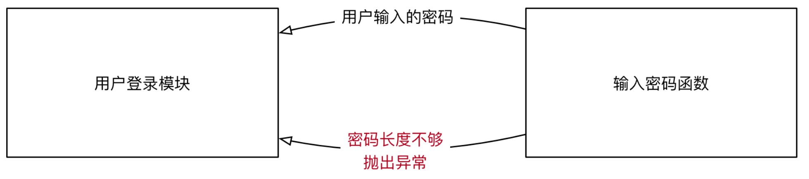

**注意**

* 当前函数 **只负责** 提示用户输入密码，如果 **密码长度不正确，需要其他的函数进行额外处理**
* 因此可以 **抛出异常**，由其他需要处理的函数 **捕获异常**

### 4.2 抛出异常

* `Python` 中提供了一个 `Exception` **异常类**
* 在开发时，如果满足 **特定业务需求时**，希望 **抛出异常**，可以：
  1. **创建** 一个 `Exception` 的 **对象**
  2. 使用 `raise` **关键字** 抛出 **异常对象**

**需求**

* 定义 `input_password` 函数，提示用户输入密码
* 如果用户输入长度 < 8，抛出异常
* 如果用户输入长度 >=8，返回输入的密码

```python
def input_password():

    # 1. 提示用户输入密码
    pwd = input("请输入密码：")

    # 2. 判断密码长度，如果长度 >= 8，返回用户输入的密码
    if len(pwd) >= 8:
        return pwd

    # 3. 密码长度不够，需要抛出异常
    # 1> 创建异常对象 - 使用异常的错误信息字符串作为参数
    ex = Exception("密码长度不够")

    # 2> 抛出异常对象
    raise ex


try:
    user_pwd = input_password()
    print(user_pwd)
except Exception as result:
    print("发现错误：%s" % result)

```


# 模块和包

## 目标

* 模块
* 包
* 发布模块

## 01. 模块

### 1.1 模块的概念

> **模块是 Python 程序架构的一个核心概念**

* 每一个以扩展名 `py` 结尾的 `Python` 源代码文件都是一个 **模块**
* **模块名** 同样也是一个 **标识符**，需要符合标识符的命名规则
* 在模块中定义的 **全局变量** 、**函数**、**类** 都是提供给外界直接使用的 **工具**
* **模块** 就好比是 **工具包**，要想使用这个工具包中的工具，就需要先 **导入** 这个模块

### 1.2 模块的两种导入方式

#### 1）import 导入

```python
import 模块名1, 模块名2 
```

> 提示：在导入模块时，每个导入应该独占一行

```python
import 模块名1
import 模块名2 
```

* **导入之后**
  * 通过 `模块名.` 使用 **模块提供的工具** —— **全局变量**、**函数**、**类**

##### 使用 `as` 指定模块的别名

> **如果模块的名字太长**，可以使用 `as` 指定模块的名称，以方便在代码中的使用

```python
import 模块名1 as 模块别名
```

> 注意：**模块别名** 应该符合 **大驼峰命名法**

#### 2）from...import 导入

* 如果希望 **从某一个模块** 中，导入 **部分** 工具，就可以使用 `from ... import` 的方式
* `import 模块名` 是 **一次性** 把模块中 **所有工具全部导入**，并且通过 **模块名/别名** 访问

```python
# 从 模块 导入 某一个工具
from 模块名1 import 工具名
```

* 导入之后
  * **不需要** 通过 `模块名.`
  * 可以直接使用 **模块提供的工具** —— **全局变量**、**函数**、**类**

**注意**

> 如果 **两个模块**，存在 **同名的函数**，那么 **后导入模块的函数**，会 **覆盖掉先导入的函数**

* 开发时 `import` 代码应该统一写在 **代码的顶部**，更容易及时发现冲突
* 一旦发现冲突，可以使用 `as` 关键字 **给其中一个工具起一个别名**

##### from...import *（知道）

```python
# 从 模块 导入 所有工具
from 模块名1 import *
```

**注意**

> 这种方式不推荐使用，因为函数重名并没有任何的提示，出现问题不好排查。
>
> 后导入的会把开始导入的覆盖掉。

### 1.3 模块的搜索顺序[扩展]

`Python` 的解释器在 **导入模块** 时，会：

1. 搜索 **当前目录** 指定模块名的文件，**如果有就直接导入**
2. 如果没有，再搜索 **系统目录** 

> 在开发时，给文件起名，不要和 **系统的模块文件** **重名**

`Python` 中每一个模块都有一个内置属性 `__file__` 可以 **查看模块** 的 **完整路径**

**示例**

```python
import random

# 生成一个 0～10 的数字
rand = random.randint(0, 10)

print(rand)

```

> 注意：如果当前目录下，存在一个 `random.py` 的文件，程序就无法正常执行了！

* 这个时候，`Python` 的解释器会 **加载当前目录** 下的 `random.py` 而不会加载 **系统的** `random` 模块

### 1.4 原则 —— 每一个文件都应该是可以被导入的

* 一个 **独立的 `Python` 文件** 就是一个 **模块**
* 在导入文件时，文件中 **所有没有任何缩进的代码** 都会被执行一遍！

**实际开发场景**

* 在实际开发中，每一个模块都是独立开发的，大多都有专人负责
* **开发人员** 通常会在 **模块下方** **增加一些测试代码**
  * 仅在模块内使用，而被导入到其他文件中不需要执行

#### `__name__` 属性

> * `__name__` 属性可以做到，测试模块的代码 **只在测试情况下被运行**，而在 **被导入时不会被执行**！

* `__name__` 是 `Python` 的一个内置属性，记录着一个 **字符串**
* 如果 **是被其他文件导入的**，`__name__` 就是 **模块名**
* 如果 **是当前执行的程序** `__name__` 是 **`__main__`**

**在很多 `Python` 文件中都会看到以下格式的代码**：

```python
# 导入模块
# 定义全局变量
# 定义类
# 定义函数

# 在代码的最下方
def main():
    # ...
    pass

# 根据 __name__ 判断是否执行下方代码
if __name__ == "__main__":
    main()

```

## 02. 包（Package）

### 概念

* **包** 是一个 **包含多个模块** 的 **特殊目录**
* 目录下有一个 **特殊的文件** `__init__.py`
* 包名的 **命名方式** 和变量名一致，**小写字母** + `_`

**好处**

* 使用 `import 包名` 可以一次性导入 **包** 中 **所有的模块**

### 案例演练

1. 新建一个 `hm_message` 的 **包**
2. 在目录下，新建两个文件 `send_message` 和 `receive_message`
3. 在 `send_message` 文件中定义一个 `send` 函数
4. 在 `receive_message` 文件中定义一个 `receive` 函数
5. 在外部直接导入 `hm_message` 的包

### `__init__.py`

* 要在外界使用 **包** 中的模块，需要在 `__init__.py` 中指定 **对外界提供的模块列表**

```python
# 从 当前目录 导入 模块列表
from . import send_message
from . import receive_message
```

## 03. 发布模块（知道）

* 如果希望自己开发的模块，**分享** 给其他人，可以按照以下步骤操作

### 3.1 制作发布压缩包步骤

#### 1) 创建 setup.py

* `setup.py` 的文件

```python
from distutils.core import setup

setup(name="hm_message",  # 包名
      version="1.0",  # 版本
      description="itheima's 发送和接收消息模块",  # 描述信息
      long_description="完整的发送和接收消息模块",  # 完整描述信息
      author="itheima",  # 作者
      author_email="itheima@itheima.com",  # 作者邮箱
      url="www.itheima.com",  # 主页
      py_modules=["hm_message.send_message",
                  "hm_message.receive_message"])

```

有关字典参数的详细信息，可以参阅官方网站：

https://docs.python.org/2/distutils/apiref.html

#### 2) 构建模块

```bash
$ python3 setup.py build
```

#### 3) 生成发布压缩包

```bash
$ python3 setup.py sdist
```

> 注意：要制作哪个版本的模块，就使用哪个版本的解释器执行！


如果要想在wins下面操作的话，首先需要给Python解释器安装路径放在环境变量path中

然后命令不变，只是要用python不能用python3。

但是这里还是放到linux服务器执行好一点。

### 3.2 安装模块

```bash
$ tar -zxvf hm_message-1.0.tar.gz 

$ sudo python3 setup.py install
```


自己测试，是可以使用的

```python
#安装过程 后面出来一个路径
root@sunshine:~/test/12_发布模块/dist/hm_message-1.0# python3 setup.py install
running install
running build
running build_py
creating build
creating build/lib
creating build/lib/hm_message
copying hm_message/__init__.py -> build/lib/hm_message
copying hm_message/send_message.py -> build/lib/hm_message
copying hm_message/receive_message.py -> build/lib/hm_message
running install_lib
creating /usr/local/lib/python3.6/dist-packages/hm_message
copying build/lib/hm_message/receive_message.py -> /usr/local/lib/python3.6/dist-packages/hm_message
copying build/lib/hm_message/__init__.py -> /usr/local/lib/python3.6/dist-packages/hm_message
copying build/lib/hm_message/send_message.py -> /usr/local/lib/python3.6/dist-packages/hm_message
byte-compiling /usr/local/lib/python3.6/dist-packages/hm_message/receive_message.py to receive_message.cpython-36.pyc
byte-compiling /usr/local/lib/python3.6/dist-packages/hm_message/__init__.py to __init__.cpython-36.pyc
byte-compiling /usr/local/lib/python3.6/dist-packages/hm_message/send_message.py to send_message.cpython-36.pyc
running install_egg_info
Writing /usr/local/lib/python3.6/dist-packages/hm_message-1.0.egg-info  #这里是安装路径


#安装好了以后 ipython进入

In [1]: import hm_message

In [2]: hm_message.send_message.send("hello")
正在发送 hello...

#查看文件安装的路径
In [3]: hm_message.__file__
Out[3]: '/usr/local/lib/python3.6/dist-packages/hm_message/__init__.py'

```

**卸载模块**

直接从安装目录下，把安装模块的 **目录** 删除就可以

```python
$ cd /usr/local/lib/python3.5/dist-packages/
$ sudo rm -r hm_message*
```

### 3.3 `pip` 安装第三方模块

* **第三方模块** 通常是指由 **知名的第三方团队** **开发的** 并且被 **程序员广泛使用** 的 `Python` 包 / 模块
  * 例如 `pygame` 就是一套非常成熟的 **游戏开发模块**
* `pip` 是一个现代的，通用的 `Python` 包管理工具
* 提供了对 `Python` 包的查找、下载、安装、卸载等功能

安装和卸载命令如下：

```bash
# 将模块安装到 Python 2.x 环境
$ sudo pip install pygame
$ sudo pip uninstall pygame

# 将模块安装到 Python 3.x 环境
$ sudo pip3 install pygame
$ sudo pip3 uninstall pygame
```

#### 在 `Mac` 下安装 `iPython`

```bash
$ sudo pip install ipython
```

#### 在 `Linux` 下安装 `iPython`

```bash
$ sudo apt install ipython
$ sudo apt install ipython3
```


# 文件

## 目标

* 文件的概念
* 文件的基本操作
* 文件/文件夹的常用操作
* 文本文件的编码方式

## 01. 文件的概念

### 1.1 文件的概念和作用

* 计算机的 **文件**，就是存储在某种 **长期储存设备** 上的一段 **数据**
* 长期存储设备包括：硬盘、U 盘、移动硬盘、光盘...

**文件的作用**

将数据长期保存下来，在需要的时候使用

|                          CPU                          |                             内存                             |                             硬盘                             |
| :---------------------------------------------------: | :----------------------------------------------------------: | :----------------------------------------------------------: |
|  |  |  |

### 1.2 文件的存储方式

* 在计算机中，文件是以 **二进制** 的方式保存在磁盘上的

#### 文本文件和二进制文件

* 文本文件
  * 可以使用 **文本编辑软件** 查看
  * 本质上还是二进制文件
  * 例如：python 的源程序

* 二进制文件
  * 保存的内容 不是给人直接阅读的，而是 **提供给其他软件使用的**
  * 例如：图片文件、音频文件、视频文件等等
  * 二进制文件不能使用 **文本编辑软件** 查看

## 02. 文件的基本操作

### 2.1 操作文件的套路

在 **计算机** 中要操作文件的套路非常固定，一共包含**三个步骤**：

1. 打开文件
2. 读、写文件
   * **读** 将文件内容读入内存
   * **写** 将内存内容写入文件
3. 关闭文件

### 2.2 操作文件的函数/方法

* 在 `Python` 中要操作文件需要记住 1 个函数和 3 个方法

| 序号 | 函数/方法 | 说明                           |
| ---- | --------- | ------------------------------ |
| 01   | open      | 打开文件，并且返回文件操作对象 |
| 02   | read      | 将文件内容读取到内存           |
| 03   | write     | 将指定内容写入文件             |
| 04   | close     | 关闭文件                       |

* `open` 函数负责打开文件，并且返回文件对象
* `read`/`write`/`close` 三个方法都需要通过 **文件对象** 来调用

### 2.3 read 方法 —— 读取文件

* `open` 函数的第一个参数是要打开的文件名（文件名区分大小写）
  * 如果文件 **存在**，返回 **文件操作对象**
  * 如果文件 **不存在**，会 **抛出异常**
* `read` 方法可以一次性 **读入** 并 **返回** 文件的 **所有内容**
* `close` 方法负责 **关闭文件**
  * 如果 **忘记关闭文件**，**会造成系统资源消耗，而且会影响到后续对文件的访问**
* **注意**：`read` 方法执行后，会把 **文件指针** 移动到 **文件的末尾**

```python
# 1. 打开 - 文件名需要注意大小写
file = open("README")

# 2. 读取
text = file.read()
print(text)

# 3. 关闭
file.close()
```

**提示**

* 在开发中，通常会先编写 **打开** 和 **关闭** 的代码，再编写中间针对文件的 **读/写** 操作！

#### 文件指针（知道）

* **文件指针** 标记 **从哪个位置开始读取数据**
* **第一次打开** 文件时，通常 **文件指针会指向文件的开始位置**
* 当执行了 `read` 方法后，**文件指针** 会移动到 **读取内容的末尾**
  * 默认情况下会移动到 **文件末尾**

**思考**

* 如果执行了一次 `read` 方法，读取了所有内容，那么再次调用 `read` 方法，还能够获得到内容吗？

**答案**

* 不能
* 第一次读取之后，文件指针移动到了文件末尾，再次调用不会读取到任何的内容

### 2.4 打开文件的方式

* `open` 函数默认以 **只读方式** 打开文件，并且返回文件对象

语法如下：

```python
f = open("文件名", "访问方式")
```

| 访问方式 | 说明                                                         |
| :------: | ------------------------------------------------------------ |
|    r     | 以**只读**方式打开文件。文件的指针将会放在文件的开头，这是**默认模式**。如果文件不存在，抛出异常 |
|    w     | 以**只写**方式打开文件。如果文件存在会被覆盖。如果文件不存在，创建新文件 |
|    a     | 以**追加**方式打开文件。如果该文件已存在，文件指针将会放在文件的结尾。如果文件不存在，创建新文件进行写入 |
|    r+    | 以**读写**方式打开文件。文件的指针将会放在文件的开头。如果文件不存在，抛出异常 |
|    w+    | 以**读写**方式打开文件。如果文件存在会被覆盖。如果文件不存在，创建新文件 |
|    a+    | 以**读写**方式打开文件。如果该文件已存在，文件指针将会放在文件的结尾。如果文件不存在，创建新文件进行写入 |

**提示**

* 频繁的移动文件指针，**会影响文件的读写效率**，开发中更多的时候会以 **只读**、**只写** 的方式来操作文件

**写入文件示例**

```python
# 打开文件
f = open("README", "w")

f.write("hello python！\n")
f.write("今天天气真好")

# 关闭文件
f.close()

```

### 2.5 按行读取文件内容

* `read` 方法默认会把文件的 **所有内容** **一次性读取到内存**
* 如果文件太大，对内存的占用会非常严重

#### `readline` 方法

* `readline` 方法可以一次读取一行内容
* 方法执行后，会把 **文件指针** 移动到下一行，准备再次读取

**读取大文件的正确姿势**

```python
# 打开文件
file = open("README")

while True:
    # 读取一行内容
    text = file.readline()

    # 判断是否读到内容
    if not text:
        break

    # 每读取一行的末尾已经有了一个 `\n`
    print(text, end="")

# 关闭文件
file.close()

```

### 2.6 文件读写案例 —— 复制文件

**目标**

用代码的方式，来实现文件复制过程

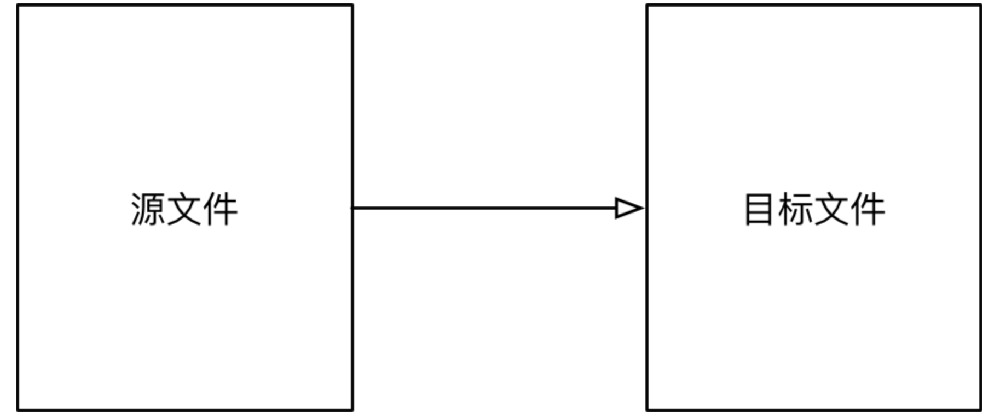


#### 小文件复制

* 打开一个已有文件，读取完整内容，并写入到另外一个文件

```python
# 1. 打开文件
file_read = open("README")
file_write = open("README[复件]", "w")

# 2. 读取并写入文件
text = file_read.read()
file_write.write(text)

# 3. 关闭文件
file_read.close()
file_write.close()

```

#### 大文件复制

* 打开一个已有文件，逐行读取内容，并顺序写入到另外一个文件

```python
# 1. 打开文件
file_read = open("README")
file_write = open("README[复件]", "w")

# 2. 读取并写入文件
while True:
    # 每次读取一行
    text = file_read.readline()

    # 判断是否读取到内容
    if not text:
        break

    file_write.write(text)

# 3. 关闭文件
file_read.close()
file_write.close()

```

## 03. 文件/目录的常用管理操作

* 在 **终端** / **文件浏览器**、 中可以执行常规的 **文件** / **目录** 管理操作，例如：
  * 创建、重命名、删除、改变路径、查看目录内容、……
* 在 `Python` 中，如果希望通过程序实现上述功能，需要导入 `os` 模块

### 文件操作

| 序号 | 方法名 | 说明       | 示例                              |
| ---- | ------ | ---------- | --------------------------------- |
| 01   | rename | 重命名文件 | `os.rename(源文件名, 目标文件名)` |
| 02   | remove | 删除文件   | `os.remove(文件名)`               |

### 目录操作

| 序号 | 方法名     | 说明           | 示例                      |
| ---- | ---------- | -------------- | ------------------------- |
| 01   | listdir    | 目录列表       | `os.listdir(目录名)`      |
| 02   | mkdir      | 创建目录       | `os.mkdir(目录名)`        |
| 03   | rmdir      | 删除目录       | `os.rmdir(目录名)`        |
| 04   | getcwd     | 获取当前目录   | `os.getcwd()`             |
| 05   | chdir      | 修改工作目录   | `os.chdir(目标目录)`      |
| 06   | path.isdir | 判断是否是文件 | `os.path.isdir(文件路径)` |

> 提示：文件或者目录操作都支持 **相对路径** 和 **绝对路径**

## 04. 文本文件的编码格式（科普）

* 文本文件存储的内容是基于 **字符编码** 的文件，常见的编码有 `ASCII` 编码，`UNICODE` 编码等

> Python 2.x 默认使用 `ASCII` 编码格式
> Python 3.x 默认使用 `UTF-8` 编码格式

### 4.1 ASCII 编码和 UNICODE 编码

#### `ASCII` 编码

* 计算机中只有 `256` 个 `ASCII` 字符
* 一个 `ASCII` 在内存中占用 **1 个字节** 的空间
  * `8` 个 `0/1` 的排列组合方式一共有 `256` 种，也就是 `2 ** 8`

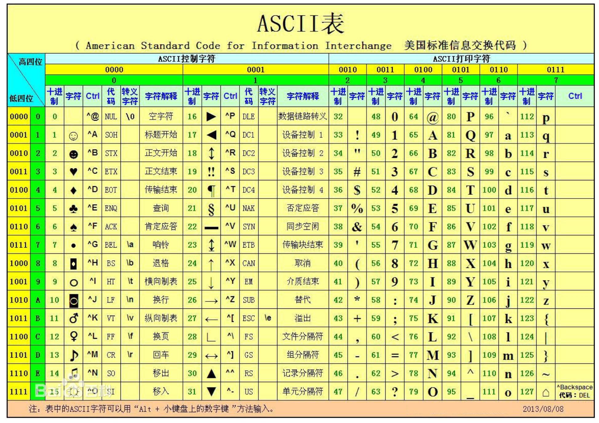

#### `UTF-8` 编码格式

* 计算机中使用 **1~6 个字节** 来表示一个 `UTF-8` 字符，涵盖了 **地球上几乎所有地区的文字**
* 大多数汉字会使用 **3 个字节** 表示
* `UTF-8` 是 `UNICODE` 编码的一种编码格式

### 4.2 Ptyhon 2.x 中如何使用中文

> Python 2.x 默认使用 `ASCII` 编码格式
> Python 3.x 默认使用 `UTF-8` 编码格式

* 在 Python 2.x 文件的 **第一行** 增加以下代码，解释器会以 `utf-8` 编码来处理 python 文件

```python
# *-* coding:utf8 *-*
```

> 这方式是官方推荐使用的！

* 也可以使用 

```python
# coding=utf8
```

#### unicode 字符串（这个好神奇）

* 在 `Python 2.x` 中，即使指定了文件使用 `UTF-8` 的编码格式，但是在遍历字符串时，仍然会 **以字节为单位遍历** 字符串
* 要能够 **正确的遍历字符串**，在定义字符串时，需要 **在字符串的引号前**，增加一个小写字母 `u`，告诉解释器这是一个 `unicode` 字符串（使用 `UTF-8` 编码格式的字符串）

```python
# *-* coding:utf8 *-*

# 在字符串前，增加一个 `u` 表示这个字符串是一个 utf8 字符串
hello_str = u"你好世界"

print(hello_str)

for c in hello_str:
    print(c)

```


# `eval` 函数

`eval()` 函数十分强大 —— **将字符串** 当成 **有效的表达式** 来求值 并 **返回计算结果**

```python
# 基本的数学计算
In [1]: eval("1 + 1")
Out[1]: 2

# 字符串重复
In [2]: eval("'*' * 10")
Out[2]: '**********'

# 将字符串转换成列表
In [3]: type(eval("[1, 2, 3, 4, 5]"))
Out[3]: list

# 将字符串转换成字典
In [4]: type(eval("{'name': 'xiaoming', 'age': 18}"))
Out[4]: dict
```

## 案例 - 计算器

**需求**

1. 提示用户输入一个 **加减乘除混合运算**
2. 返回计算结果

```python
input_str = input("请输入一个算术题：")

print(eval(input_str))

```

## 不要滥用 `eval` 

> 在开发时千万不要使用 `eval` 直接转换 `input` 的结果 （这个蛮可怕的）

```python
__import__('os').system('ls')
```

* 等价代码

```python
import os

os.system("终端命令")
```

* 执行成功，返回 0
* 执行失败，返回错误信息


# 项目实战 —— 飞机大战

## 目标

* 强化 **面向对象** 程序设计
* 体验使用 `pygame` 模块进行 **游戏开发**

## 实战步骤

1. `pygame` 快速体验
2. **飞机大战** 实战

## 确认模块 —— pygame

* `pygame` 就是一个 Python 模块，专为电子游戏设计
* 官方网站：https://www.pygame.org/
  * **提示**：要学习第三方模块，通常最好的参考资料就在官方网站

| 网站栏目         | 内容                                            |
| ---------------- | ----------------------------------------------- |
| `GettingStarted` | 在各平台安装模块的说明                          |
| `Docs`           | `pygame` 模块所有 **类** 和 **子类** 的参考手册 |

### 安装 pygame

```bash
$ sudo pip3 install pygame
```

### 验证安装

```bash
$ python3 -m pygame.examples.aliens
```


# pygame 快速入门

## 目标

1. 项目准备
2. 使用 `pygame` 创建图形窗口
3. 理解 **图像** 并实现图像绘制
4. 理解 **游戏循环** 和 **游戏时钟**
5. 理解 **精灵** 和 **精灵组**

## 项目准备

1. 新建 **飞机大战** 项目
2. 新建一个 `hm_01_pygame入门.py`
3. 导入 **游戏素材图片**

**游戏的第一印象**

* 把一些 **静止的图像** 绘制到 **游戏窗口** 中
* 根据 **用户的交互** 或其他情况，**移动** 这些图像，产生动画效果
* 根据 **图像之间** 是否发生重叠，判断 **敌机是否被摧毁** 等其他情况

## 01. 使用 `pygame` 创建图形窗口

### 小节目标

1. 游戏的初始化和退出
2. 理解游戏中的坐标系
3. 创建游戏主窗口
4. 简单的游戏循环

> 可以将图片素材 **绘制** 到 **游戏的窗口** 上，开发游戏之前需要先知道 **如何建立游戏窗口**！

### 1.1 游戏的初始化和退出

* 要使用 `pygame` 提供的所有功能之前，需要调用 `init` 方法
* 在游戏结束前需要调用一下 `quit` 方法 

| 方法            | 说明                                                         |
| --------------- | ------------------------------------------------------------ |
| `pygame.init()` | 导入并初始化所有 `pygame` 模块，使用其他模块之前，必须先调用 `init` 方法 |
| `pygame.quit()` | 卸载所有 `pygame` 模块，在游戏结束之前调用！                 |

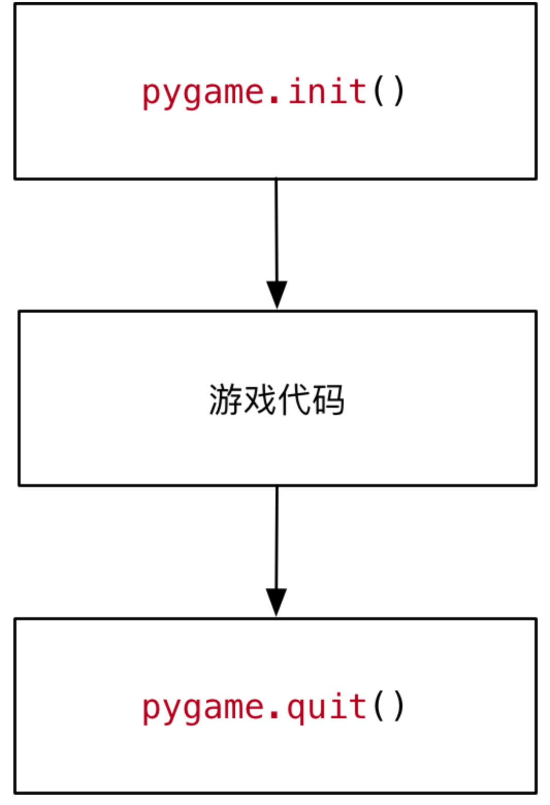

```python
import pygame

pygame.init()

# 游戏代码...

pygame.quit()

```

### 1.2 理解游戏中的坐标系

* **坐标系**
  * **原点** 在 **左上角** `(0, 0)`
  * **x 轴** 水平方向向 **右**，逐渐增加
  * **y 轴** 垂直方向向 **下**，逐渐增加

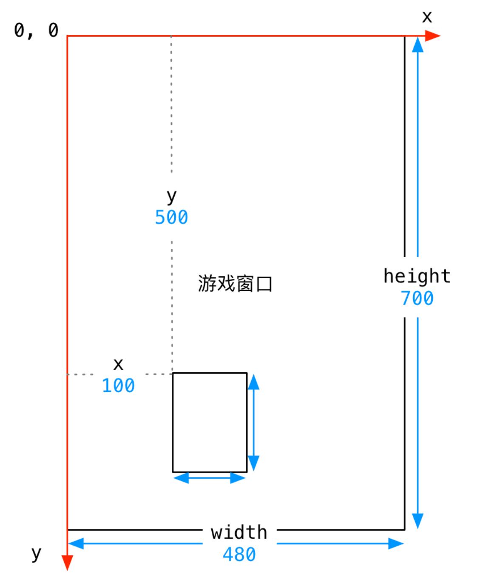

* 在游戏中，**所有可见的元素** 都是以 **矩形区域** 来描述位置的
  * 要描述一个矩形区域有四个要素：`(x, y) (width, height)`

* `pygame` 专门提供了一个类 `pygame.Rect` 用于描述 **矩形区域**

```python
Rect(x, y, width, height) -> Rect
```

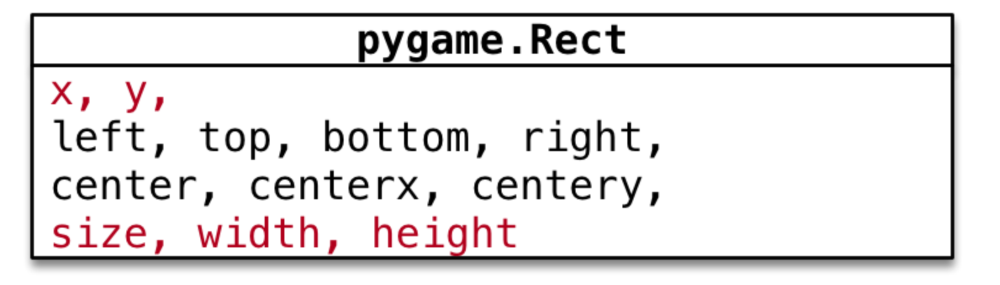

**提示**

* `pygame.Rect` 是一个比较特殊的类，内部只是封装了一些数字计算
* 不执行 `pygame.init()` 方法同样能够直接使用

#### 案例演练

**需求**

1. 定义 `hero_rect` 矩形描述 **英雄的位置和大小**
2. 输出英雄的 **坐标原点**（`x` 和 `y`）
3. 输出英雄的 **尺寸**（**宽度** 和 **高度**）

```python
hero_rect = pygame.Rect(100, 500, 120, 126)

print("坐标原点 %d %d" % (hero_rect.x, hero_rect.y))
print("英雄大小 %d %d" % (hero_rect.width, hero_rect.height))
# size 属性会返回矩形区域的 (宽, 高) 元组
print("英雄大小 %d %d" % hero_rect.size)
```

### 1.3 创建游戏主窗口

* `pygame` 专门提供了一个 **模块** `pygame.display` 用于创建、管理 **游戏窗口**

| 方法                        | 说明                       |
| --------------------------- | -------------------------- |
| `pygame.display.set_mode()` | 初始化游戏显示窗口         |
| `pygame.display.update()`   | 刷新屏幕内容显示，稍后使用 |

**`set_mode` 方法**

```python
set_mode(resolution=(0,0), flags=0, depth=0) -> Surface
```

* **作用** —— 创建游戏显示窗口
* **参数**
  * `resolution` 指定屏幕的 `宽` 和 `高`，默认创建的窗口大小和屏幕大小一致
  * `flags` 参数指定屏幕的附加选项，例如是否全屏等等，默认不需要传递
  * `depth` 参数表示颜色的位数，默认自动匹配
* **返回值**
  * **暂时** 可以理解为 **游戏的屏幕**，**游戏的元素** 都需要被绘制到 **游戏的屏幕** 上

* **注意**：必须使用变量记录 `set_mode` 方法的返回结果！因为：后续所有的图像绘制都基于这个返回结果

```python
# 创建游戏主窗口
screen = pygame.display.set_mode((480, 700))
```

### 1.4 简单的游戏循环

* 为了做到游戏程序启动后，**不会立即退出**，通常会在游戏程序中增加一个 **游戏循环**
* 所谓 **游戏循环** 就是一个 **无限循环**
* 在 **创建游戏窗口** 代码下方，增加一个无限循环
  * 注意：**游戏窗口不需要重复创建**

```python
# 创建游戏主窗口
screen = pygame.display.set_mode((480, 700))

# 游戏循环
while True:
    pass
```

## 02. 理解 **图像** 并实现图像绘制

* 在游戏中，能够看到的 **游戏元素** 大多都是 **图像**
  * **图像文件** 初始是保存在磁盘上的，如果需要使用，**第一步** 就需要 **被加载到内存**
* 要在屏幕上 **看到某一个图像的内容**，需要按照三个步骤：
  1. 使用 `pygame.image.load()` **加载图像的数据**
  2. 使用 **游戏屏幕** 对象，调用 `blit` 方法 将图像绘制到指定位置
  3. 调用 `pygame.display.update()` 方法更新整个屏幕的显示


> 提示：要想在屏幕上看到绘制的结果，就一定要调用 `pygame.display.update()` 方法

### 代码演练 I —— 绘制背景图像

**需求**

1. 加载 `background.png` 创建背景
2. 将 **背景** 绘制在屏幕的 `(0, 0)` 位置
3. 调用屏幕更新显示背景图像

```python
# 绘制背景图像
# 1> 加载图像
bg = pygame.image.load("./images/background.png")

# 2> 绘制在屏幕
screen.blit(bg, (0, 0))

# 3> 更新显示
pygame.display.update()
```

### 代码演练 II —— 绘制英雄图像

**需求**

1. 加载 `me1.png` 创建英雄飞机
2. 将 **英雄飞机** 绘制在屏幕的 `(200, 500)` 位置
3. 调用屏幕更新显示飞机图像

```python
# 1> 加载图像
hero = pygame.image.load("./images/me1.png")

# 2> 绘制在屏幕
screen.blit(hero, (200, 500))

# 3> 更新显示
pygame.display.update()
```

**透明图像** 

* `png` 格式的图像是支持 **透明** 的
* 在绘制图像时，**透明区域** 不会显示任何内容
* 但是如果**下方已经有内容**，会 **透过** **透明区域** 显示出来

### 理解 `update()` 方法的作用

> 可以在 `screen` 对象完成 **所有** `blit` 方法之后，**统一调用一次** `display.update` 方法，同样可以在屏幕上 **看到最终的绘制结果**

* 使用 `display.set_mode()` 创建的 `screen` **对象** 是一个 **内存中的屏幕数据对象**
  * 可以理解成是 **油画** 的 **画布**
* `screen.blit` 方法可以在 **画布** 上绘制很多 **图像**
  * 例如：**英雄**、**敌机**、**子弹**...
  * **这些图像** 有可能 会彼此 **重叠或者覆盖**
* `display.update()` 会将 **画布** 的 **最终结果** 绘制在屏幕上，这样可以 **提高屏幕绘制效率**，**增加游戏的流畅度**

**案例调整**

```python
# 绘制背景图像
# 1> 加载图像
bg = pygame.image.load("./images/background.png")

# 2> 绘制在屏幕
screen.blit(bg, (0, 0))

# 绘制英雄图像
# 1> 加载图像
hero = pygame.image.load("./images/me1.png")

# 2> 绘制在屏幕
screen.blit(hero, (200, 500))

# 3> 更新显示 - update 方法会把之前所有绘制的结果，一次性更新到屏幕窗口上
pygame.display.update()
```

## 03. 理解 **游戏循环** 和 **游戏时钟**

> 现在 **英雄飞机** 已经被绘制到屏幕上了，**怎么能够让飞机移动呢** ？

### 3.1 游戏中的动画实现原理

* 跟 **电影** 的原理类似，游戏中的动画效果，本质上是 **快速** 的在屏幕上绘制 **图像**
  * 电影是将多张 **静止的电影胶片** **连续、快速**的播放，产生连贯的视觉效果！
* 一般在电脑上 **每秒绘制 60 次**，就能够达到非常 **连续** **高品质** 的动画效果
  * 每次绘制的结果被称为 **帧 Frame**


### 3.2 **游戏循环**

#### 游戏的两个组成部分

> **游戏循环的开始** 就意味着 **游戏的正式开始**

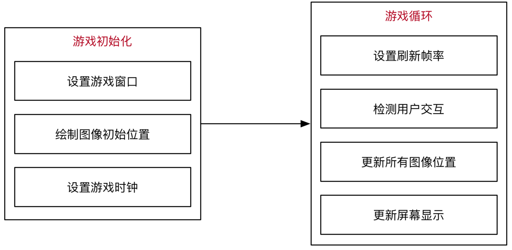

#### 游戏循环的作用

1. 保证游戏 **不会直接退出**
2. **变化图像位置** —— 动画效果
   * 每隔 `1 / 60 秒` 移动一下所有图像的位置
   * 调用 `pygame.display.update()` 更新屏幕显示
3. **检测用户交互** —— 按键、鼠标等...

### 3.3 游戏时钟

* `pygame` 专门提供了一个类 `pygame.time.Clock` 可以非常方便的设置屏幕绘制速度 —— **刷新帧率**
* 要使用 **时钟对象** 需要两步：
  * 1）在 **游戏初始化** 创建一个 **时钟对象**
  * 2）在 **游戏循环** 中让时钟对象调用 `tick(帧率)` 方法 
* `tick` 方法会根据 **上次被调用的时间**，自动设置 **游戏循环** 中的延时

```python
# 3. 创建游戏时钟对象
clock = pygame.time.Clock()
i = 0

# 游戏循环
while True:

    # 设置屏幕刷新帧率
    clock.tick(60)

    print(i)
    i += 1
```

### 3.4 英雄的简单动画实现

**需求**

1. 在 **游戏初始化** 定义一个 `pygame.Rect` 的变量记录英雄的初始位置
2. 在 **游戏循环** 中每次让 **英雄** 的 `y - 1` —— 向上移动 
3. `y <= 0` 将英雄移动到屏幕的底部

> 提示：
>
> * 每一次调用 `update()` 方法之前，需要把 **所有的游戏图像都重新绘制一遍**
> * 而且应该 **最先** 重新绘制 **背景图像**

```python
# 4. 定义英雄的初始位置
hero_rect = pygame.Rect(150, 500, 102, 126)

while True:

    # 可以指定循环体内部的代码执行的频率
    clock.tick(60)

    # 更新英雄位置
    hero_rect.y -= 1

    # 如果移出屏幕，则将英雄的顶部移动到屏幕底部
    if hero_rect.y <= 0:
        hero_rect.y = 700

    # 绘制背景图片
    screen.blit(bg, (0, 0))
    # 绘制英雄图像
    screen.blit(hero, hero_rect)

    # 更新显示
    pygame.display.update()
```

#### 作业

1. 英雄向上飞行，当 **英雄完全从上方飞出屏幕后**
2. 将飞机移动到屏幕的底部

```python
if hero_rect.y + hero_rect.height <= 0:
    hero_rect.y = 700
```

**提示**

* `Rect` 的属性 `bottom = y + height` 

```python
if hero_rect.bottom <= 0:
    hero_rect.y = 700
```

### 3.5 在游戏循环中 监听 事件 

#### 事件 `event`

* 就是游戏启动后，**用户针对游戏所做的操作**
* 例如：**点击关闭按钮**，**点击鼠标**，**按下键盘**...

#### 监听

* 在 **游戏循环** 中，判断用户 **具体的操作**

> 只有 **捕获** 到用户具体的操作，才能有针对性的做出响应

#### 代码实现

* `pygame` 中通过 `pygame.event.get()` 可以获得 **用户当前所做动作** 的 **事件列表**
  * 用户可以同一时间做很多事情
* 提示：**这段代码非常的固定**，几乎所有的 `pygame` 游戏都 **大同小异**！

```python
# 游戏循环
while True:

    # 设置屏幕刷新帧率
    clock.tick(60)

    # 事件监听
    for event in pygame.event.get():

        # 判断用户是否点击了关闭按钮
        if event.type == pygame.QUIT:
            print("退出游戏...")

            pygame.quit()

            # 直接退出系统
            exit()
```

## 04. 理解 **精灵** 和 **精灵组**

### 4.1 精灵 和 精灵组

* 在刚刚完成的案例中，**图像加载**、**位置变化**、**绘制图像** 都需要程序员编写代码分别处理
* 为了简化开发步骤，`pygame` 提供了两个类
  * `pygame.sprite.Sprite` —— 存储 **图像数据 image** 和 **位置 rect** 的 **对象**
  * `pygame.sprite.Group`

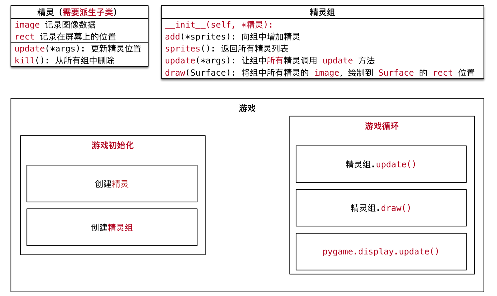

#### 精灵

* 在游戏开发中，通常把 **显示图像的对象** 叫做精灵 `Sprite`
* **精灵** 需要 有 **两个重要的属性**
  * `image` 要显示的图像
  * `rect` 图像要显示在屏幕的位置
* 默认的 `update()` 方法什么事情也没做
  * 子类可以重写此方法，在每次刷新屏幕时，更新精灵位置

* **注意**：`pygame.sprite.Sprite` 并没有提供 `image` 和 `rect` 两个属性
  * 需要程序员从 `pygame.sprite.Sprite` 派生子类
  * 并在 **子类** 的 **初始化方法** 中，设置 `image` 和 `rect` 属性

#### 精灵组

* 一个 **精灵组** 可以包含多个 **精灵** 对象
* 调用 **精灵组** 对象的 `update()` 方法
  * 可以 **自动** 调用 **组内每一个精灵** 的 `update()` 方法
* 调用 **精灵组** 对象的 `draw(屏幕对象)` 方法
  * 可以将 **组内每一个精灵** 的 `image` 绘制在 `rect` 位置

```python
Group(*sprites) -> Group
```

> 注意：仍然需要调用 `pygame.display.update()` 才能在屏幕看到最终结果

### 4.2 派生精灵子类

1. 新建 `plane_sprites.py` 文件
2. 定义 `GameSprite` 继承自 `pygame.sprite.Sprite`

**注意**

* 如果一个类的 **父类** 不是 `object`
* 在重写 **初始化方法** 时，**一定要** 先 `super()` 一下父类的 `__init__` 方法
* **保证父类中实现的 `__init__` 代码能够被正常执行**

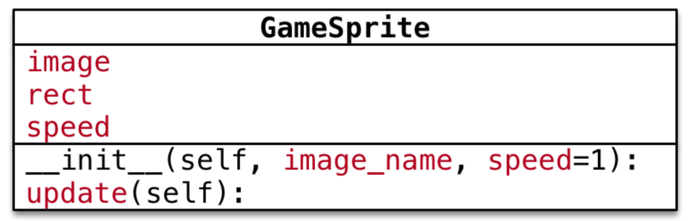

**属性**

* `image` 精灵图像，使用 `image_name` 加载
* `rect` 精灵大小，默认使用图像大小
* `speed` 精灵移动速度，默认为 `1`

**方法**

* `update` 每次更新屏幕时在游戏循环内调用
  * 让精灵的 `self.rect.y += self.speed`

**提示**

* `image` 的 `get_rect()` 方法，可以返回 **pygame.Rect(0, 0, 图像宽, 图像高)** 的对象

```python
import pygame


class GameSprite(pygame.sprite.Sprite):
    """游戏精灵基类"""
    
    def __init__(self, image_name, speed=1):
        
        # 调用父类的初始化方法
        super().__init__()
        
        # 加载图像
        self.image = pygame.image.load(image_name)
        # 设置尺寸
        self.rect = self.image.get_rect()
        # 记录速度
        self.speed = speed

    def update(self, *args):
        
        # 默认在垂直方向移动
        self.rect.y += self.speed
        
```

### 4.3 使用 游戏精灵 和 精灵组 创建敌机

**需求**

* 使用刚刚派生的 **游戏精灵** 和 **精灵组** 创建 敌机 并且实现敌机动画

**步骤**

1. 使用 `from` 导入 `plane_sprites` 模块 
   * `from` 导入的模块可以 **直接使用**
   * `import` 导入的模块需要通过 **模块名.** 来使用
2. 在 **游戏初始化** 创建 **精灵对象** 和 **精灵组对象**
3. 在 **游戏循环中** 让 **精灵组** 分别调用 `update()` 和 `draw(screen)` 方法

**职责**

* 精灵
  * 封装 **图像 image**、**位置 rect** 和 **速度 speed**
  * 提供 `update()` 方法，根据游戏需求，**更新位置 rect**
* 精灵组
  * 包含 **多个** **精灵对象**
  * `update` 方法，让精灵组中的所有精灵调用 `update` 方法更新位置
  * `draw(screen)` 方法，在 `screen` 上绘制精灵组中的所有精灵

#### 实现步骤

* 1) 导入 `plane_sprites` 模块

```python
from plane_sprites import *
```

* 2) 修改初始化部分代码

```python
# 创建敌机精灵和精灵组
enemy1 = GameSprite("./images/enemy1.png")
enemy2 = GameSprite("./images/enemy1.png", 2)
enemy2.rect.x = 200
enemy_group = pygame.sprite.Group(enemy1, enemy2)
```

* 3) 修改游戏循环部分代码

```python
# 让敌机组调用 update 和 draw 方法
enemy_group.update()
enemy_group.draw(screen)

# 更新屏幕显示
pygame.display.update()
```


# 游戏框架搭建

**目标** —— 使用 **面相对象** 设计 **飞机大战游戏类**

## 目标

* 明确主程序职责
* 实现主程序类
* 准备游戏精灵组

## 01. 明确主程序职责

* 回顾 **快速入门案例**，一个游戏主程序的 **职责** 可以分为两个部分：
  * 游戏初始化
  * 游戏循环
* 根据明确的职责，设计 `PlaneGame` 类如下：

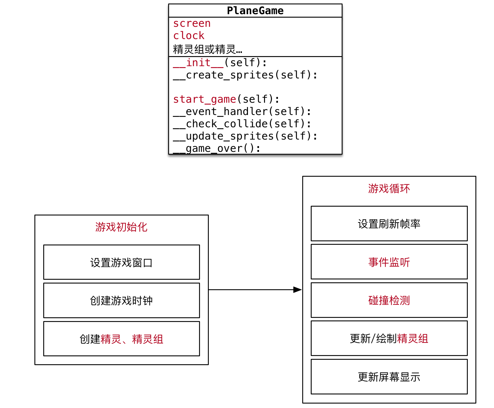

> **提示** 根据 **职责** 封装私有方法，可以避免某一个方法的代码写得太过冗长
>
> 如果某一个方法编写的太长，既不好阅读，也不好维护！

* **游戏初始化** ——  `__init__()` 会调用以下方法： 

| 方法                     | 职责                 |
| ------------------------ | -------------------- |
| `__create_sprites(self)` | 创建所有精灵和精灵组 |

* **游戏循环** —— `start_game()` 会调用以下方法：

| 方法                     | 职责                                   |
| ------------------------ | -------------------------------------- |
| `__event_handler(self)`  | 事件监听                               |
| `__check_collide(self)`  | 碰撞检测 —— 子弹销毁敌机、敌机撞毁英雄 |
| `__update_sprites(self)` | 精灵组更新和绘制                       |
| `__game_over()`          | 游戏结束                               |

## 02. 实现飞机大战主游戏类

### 2.1 明确文件职责


* `plane_main` 
  1. 封装 **主游戏类**
  2. 创建 **游戏对象**
  3. **启动游戏**
* `plane_sprites`
  * 封装游戏中 **所有** 需要使用的 **精灵子类**
  * 提供游戏的 **相关工具**

#### 代码实现

* 新建 `plane_main.py` 文件，并且设置为可执行
* 编写 **基础代码**

```python
import pygame
from plane_sprites import *


class PlaneGame(object):
    """飞机大战主游戏"""

    def __init__(self):
        print("游戏初始化")

    def start_game(self):
        print("开始游戏...")


if __name__ == '__main__':
    # 创建游戏对象
    game = PlaneGame()

    # 开始游戏
    game.start_game()

```

### 2.3 游戏初始化部分

* 完成 `__init__()` 代码如下：

```python
def __init__(self):
    print("游戏初始化")
    
    # 1. 创建游戏的窗口
    self.screen = pygame.display.set_mode((480, 700))
    # 2. 创建游戏的时钟
    self.clock = pygame.time.Clock()
    # 3. 调用私有方法，精灵和精灵组的创建
    self.__create_sprites()

def __create_sprites(self):
    pass
```

#### 使用 常量 代替固定的数值

> * 常量 —— 不变化的量
> * 变量 —— 可以变化的量

**应用场景**

* 在开发时，可能会需要使用 **固定的数值**，例如 **屏幕的高度** 是 `700`
* 这个时候，建议 **不要** 直接使用固定数值，而应该使用 **常量**
* 在开发时，为了保证代码的可维护性，尽量不要使用 **魔法数字** 

**常量的定义**

* 定义 **常量** 和 定义 **变量** 的语法完全一样，都是使用 **赋值语句**
* **常量** 的 **命名** 应该 **所有字母都使用大写**，**单词与单词之间使用下划线连接**

**常量的好处**

* 阅读代码时，通过 **常量名** **见名之意**，不需要猜测数字的含义
* 如果需要 **调整值**，只需要 **修改常量定义** 就可以实现 **统一修改**

> 提示：Python 中并没有真正意义的常量，只是通过命名的约定 —— 所有字母都是大写的就是常量，开发时不要轻易的修改！

**代码调整**

* 在 `plane_sprites.py` 中增加常量定义

```python
import pygame

# 游戏屏幕大小
SCREEN_RECT = pygame.Rect(0, 0, 480, 700)
```

* 修改 `plane_main.py` 中的窗口大小

```python
self.screen = pygame.display.set_mode(SCREEN_RECT.size)
```

### 2.4 游戏循环部分

* 完成 `start_game()` 基础代码如下：

```python
def start_game(self):
    """开始游戏"""
    
    print("开始游戏...")
       
    while True:
    
        # 1. 设置刷新帧率
        self.clock.tick(60)
        
        # 2. 事件监听
        self.__event_handler()
        
        # 3. 碰撞检测
        self.__check_collide()
        
        # 4. 更新精灵组
        self.__update_sprites()
        
        # 5. 更新屏幕显示
        pygame.display.update()

def __event_handler(self):
    """事件监听"""
    
    for event in pygame.event.get():
    
        if event.type == pygame.QUIT:
            PlaneGame.__game_over()

def __check_collide(self):
    """碰撞检测"""
    pass

def __update_sprites(self):
    """更新精灵组"""
    pass
    
@staticmethod
def __game_over():
   """游戏结束"""

   print("游戏结束")
   pygame.quit()
   exit()
```

## 03. 准备游戏精灵组

### 3.1 确定精灵组


### 3.2 代码实现

* 创建精灵组方法

```python
def __create_sprites(self):
    """创建精灵组"""
    
    # 背景组
    self.back_group = pygame.sprite.Group()
    # 敌机组
    self.enemy_group = pygame.sprite.Group()
    # 英雄组
    self.hero_group = pygame.sprite.Group()

```

* 更新精灵组方法

```python
def __update_sprites(self):
    """更新精灵组"""
    
    for group in [self.back_group, self.enemy_group, self.hero_group]:
    
        group.update()
        group.draw(self.screen)
```


# 游戏背景

## 目标

* 背景交替滚动的思路确定
* 显示游戏背景

## 01. 背景交替滚动的思路确定

运行 **备课代码**，**观察** 背景图像的显示效果：

* 游戏启动后，**背景图像** 会 **连续不断地** **向下方** 移动
* 在 **视觉上** 产生英雄的飞机不断向上方飞行的 **错觉** —— 在很多跑酷类游戏中常用的套路
  * **游戏的背景** 不断变化
  * **游戏的主角** 位置保持不变

### 1.1 实现思路分析

 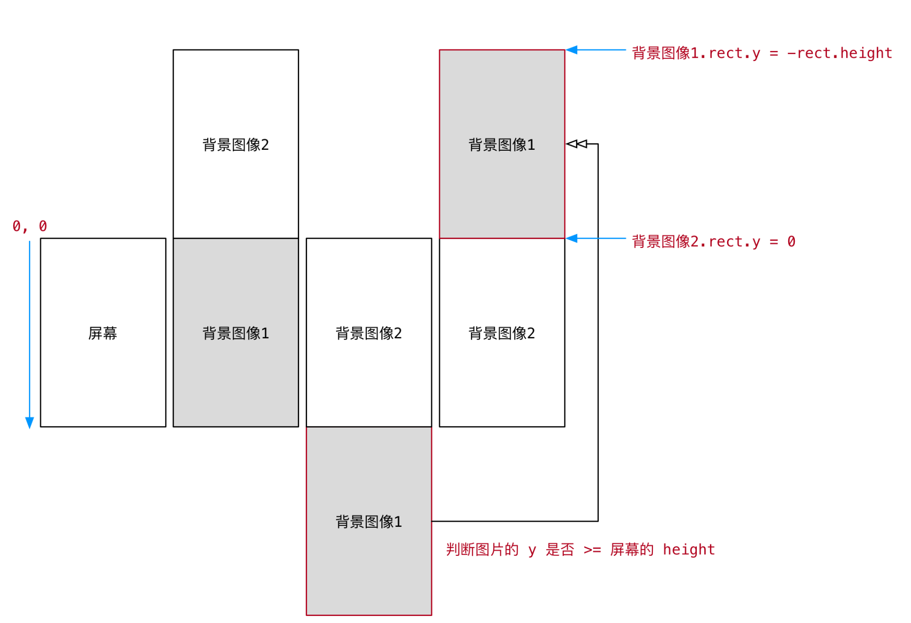

**解决办法**

1. 创建两张背景图像精灵
   * 第 `1` 张 **完全和屏幕重合**
   * 第 `2` 张在 **屏幕的正上方**
2. 两张图像 **一起向下方运动**
   * `self.rect.y += self.speed`
3. 当 **任意背景精灵** 的 `rect.y >= 屏幕的高度` 说明已经 **移动到屏幕下方**
4. 将 **移动到屏幕下方的这张图像** 设置到 **屏幕的正上方**
   * `rect.y = -rect.height`  

### 1.2 设计背景类

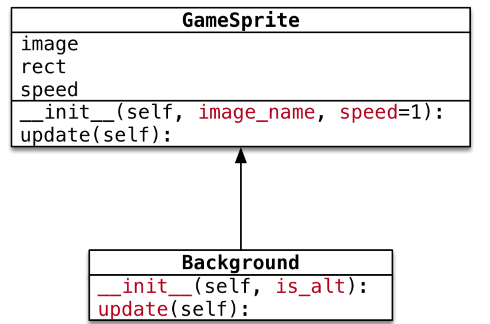

* **初始化方法**
  * 直接指定 **背景图片**
  * `is_alt` 判断是否是另一张图像
    * `False` 表示 **第一张图像**，需要与屏幕重合
    * `True` 表示 **另一张图像**，在屏幕的正上方
* **update()** 方法
  * 判断 **是否移动出屏幕**，如果是，将图像设置到 **屏幕的正上方**，从而实现 **交替滚动**

> **继承** 如果父类提供的方法，不能满足子类的需求：
>
> * 派生一个子类
> * 在子类中针对特有的需求，重写父类方法，并且进行扩展

## 02. 显示游戏背景

### 2.1 背景精灵的基本实现

* 在 `plane_sprites` 新建 `Background` 继承自 `GameSprite`

```python
class Background(GameSprite):
    """游戏背景精灵"""

    def update(self):

        # 1. 调用父类的方法实现
        super().update()

        # 2. 判断是否移出屏幕，如果移出屏幕，将图像设置到屏幕的上方
        if self.rect.y >= SCREEN_RECT.height:
            self.rect.y = -self.rect.height

```

### 2.2 在 `plane_main.py` 中显示背景精灵

1. 在 `__create_sprites` 方法中创建 **精灵** 和 **精灵组**
2. 在 `__update_sprites` 方法中，让 **精灵组** 调用 `update()` 和 `draw()` 方法

> `__create_sprites` 方法

```python
def __create_sprites(self):

    # 创建背景精灵和精灵组
    bg1 = Background("./images/background.png")
    bg2 = Background("./images/background.png")
    bg2.rect.y = -bg2.rect.height
    
    self.back_group = pygame.sprite.Group(bg1, bg2)
```

> `__update_sprites` 方法

```python
def __update_sprites(self):

    self.back_group.update()
    self.back_group.draw(self.screen)
```

### 2.3 利用初始化方法，简化背景精灵创建

> 思考 —— 上一小结完成的代码存在什么样的问题？能否简化？

* 在主程序中，创建的**两个背景精灵**，**传入了相同的图像文件路径**
* 创建 **第二个 背景精灵** 时，**在主程序中**，设置背景精灵的图像位置

> 思考 —— 精灵 **初始位置** 的设置，应该 **由主程序负责**？还是 **由精灵自己负责**？

**答案** —— **由精灵自己负责**

* 根据面向对象设计原则，应该将对象的职责，封装到类的代码内部
* 尽量简化程序调用一方的代码调用

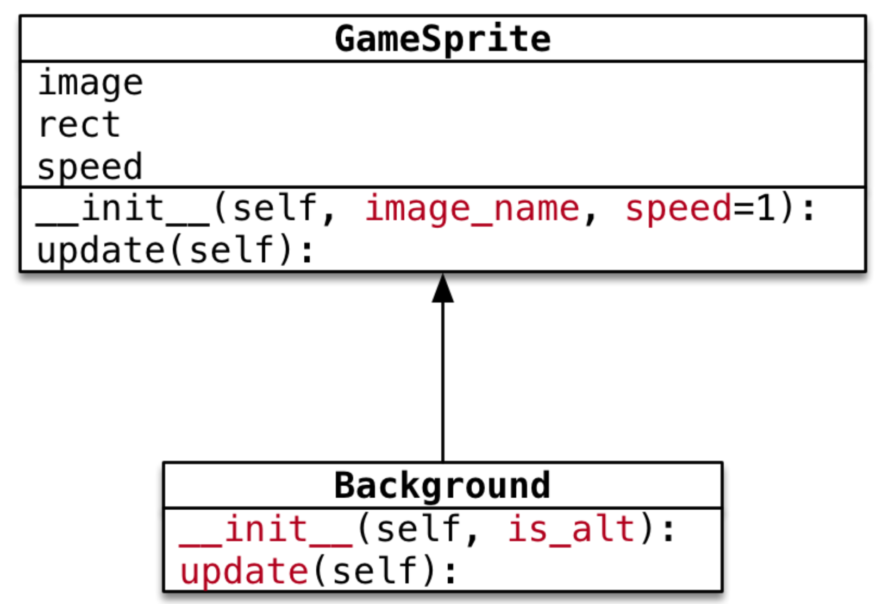

* **初始化方法**
  * 直接指定 **背景图片**
  * `is_alt` 判断是否是另一张图像
    * `False` 表示 **第一张图像**，需要与屏幕重合
    * `True` 表示 **另一张图像**，在屏幕的正上方

在 `plane_sprites.py` 中实现 `Background` 的 **初始化方法**

```python
def __init__(self, is_alt=False):

    image_name = "./images/background.png"
    super().__init__(image_name)
       
    # 判断是否交替图片，如果是，将图片设置到屏幕顶部
    if is_alt:
        self.rect.y = -self.rect.height     
```

* 修改 `plane_main` 的 `__create_sprites` 方法

```python
# 创建背景精灵和精灵组
bg1 = Background()
bg2 = Background(True)

self.back_group = pygame.sprite.Group(bg1, bg2)
```


# 敌机出场

## 目标

* 使用 **定时器** 添加敌机
* 设计 `Enemy` 类

## 01. 使用定时器添加敌机

运行 **备课代码**，**观察** 敌机的 **出现规律**：

1. 游戏启动后，**每隔 1 秒** 会 **出现一架敌机**
2. 每架敌机 **向屏幕下方飞行**，飞行 **速度各不相同**
3. 每架敌机出现的 **水平位置** 也不尽相同
4. 当敌机 **从屏幕下方飞出**，不会再飞回到屏幕中

### 1.1 定时器

* 在 `pygame` 中可以使用 `pygame.time.set_timer()` 来添加 **定时器**
* 所谓 **定时器**，就是 **每隔一段时间**，去 **执行一些动作**

```python
set_timer(eventid, milliseconds) -> None
```

* `set_timer` 可以创建一个 **事件**
* 可以在 **游戏循环** 的 **事件监听** 方法中捕获到该事件
* 第 1 个参数 **事件代号** 需要基于常量 `pygame.USEREVENT` 来指定
  * `USEREVENT` 是一个整数，再增加的事件可以使用 `USEREVENT + 1` 指定，依次类推...
* 第 2 个参数是 **事件触发** 间隔的 **毫秒值**

**定时器事件的监听**

* 通过 `pygame.event.get()` 可以获取当前时刻所有的 **事件列表**
* **遍历列表** 并且判断 `event.type` 是否等于 `eventid`，如果相等，表示 **定时器事件** 发生

### 1.2 定义并监听创建敌机的定时器事件

`pygame` 的 **定时器** 使用套路非常固定：

1. 定义 **定时器常量** —— `eventid`
2. 在 **初始化方法** 中，调用 `set_timer` 方法 **设置定时器事件**
3. 在 **游戏循环** 中，**监听定时器事件**

#### 1) 定义事件

* 在 `plane_sprites.py` 的顶部定义 **事件常量**

```python
# 敌机的定时器事件常量
CREATE_ENEMY_EVENT = pygame.USEREVENT
```

* 在 `PlaneGame` 的 **初始化方法** 中 **创建用户事件**

```python
# 4. 设置定时器事件 - 每秒创建一架敌机
pygame.time.set_timer(CREATE_ENEMY_EVENT, 1000)
```

#### 2) 监听定时器事件

* 在 `__event_handler` 方法中增加以下代码：

```python
def __event_handler(self):
    
    for event in pygame.event.get():
    
        # 判断是否退出游戏
        if event.type == pygame.QUIT:
            PlaneGame.__game_over()
        elif event.type == CREATE_ENEMY_EVENT:
            print("敌机出场...")
```

## 02. 设计 `Enemy` 类

1. 游戏启动后，**每隔 1 秒** 会 **出现一架敌机**
2. 每架敌机 **向屏幕下方飞行**，飞行 **速度各不相同**
3. 每架敌机出现的 **水平位置** 也不尽相同
4. 当敌机 **从屏幕下方飞出**，不会再飞回到屏幕中

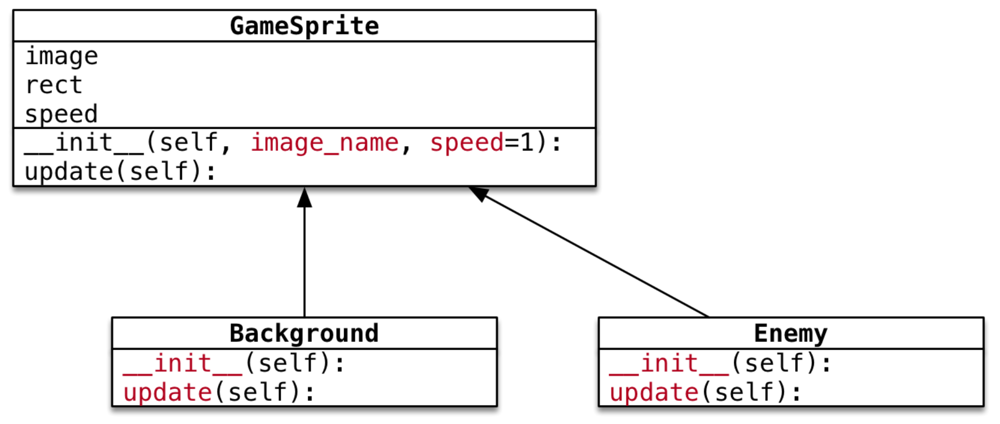

* **初始化方法**
  * 指定 **敌机图片**
  * **随机** 敌机的 **初始位置** 和 **初始速度**
* 重写 **update()** 方法
  * 判断 **是否飞出屏幕**，如果是，从 **精灵组** 删除

### 2.1 敌机类的准备

* 在 `plane_sprites` 新建 `Enemy` 继承自 `GameSprite`
* 重写 **初始化方法**，直接指定 **图片名称**
* 暂时 **不实现** **随机速度** 和 **随机位置** 的指定
* 重写 `update` 方法，判断是否飞出屏幕

```python
class Enemy(GameSprite):
    """敌机精灵"""
    
    def __init__(self):
        
        # 1. 调用父类方法，创建敌机精灵，并且指定敌机的图像
        super().__init__("./images/enemy1.png")

        # 2. 设置敌机的随机初始速度

        # 3. 设置敌机的随机初始位置
    
    def update(self):
        
        # 1. 调用父类方法，让敌机在垂直方向运动
        super().update()
        
        # 2. 判断是否飞出屏幕，如果是，需要将敌机从精灵组删除
        if self.rect.y >= SCREEN_RECT.height:
            print("敌机飞出屏幕...")    
```

### 2.2 创建敌机

**演练步骤**

1. 在 `__create_sprites`，添加 **敌机精灵组**
   * 敌机是 **定时被创建的**，因此在初始化方法中，不需要创建敌机
2. 在 `__event_handler`，创建敌机，并且 **添加到精灵组**
   * 调用 **精灵组** 的 `add` 方法可以 **向精灵组添加精灵**
3. 在 `__update_sprites`，让 **敌机精灵组** 调用 `update` 和 `draw` 方法

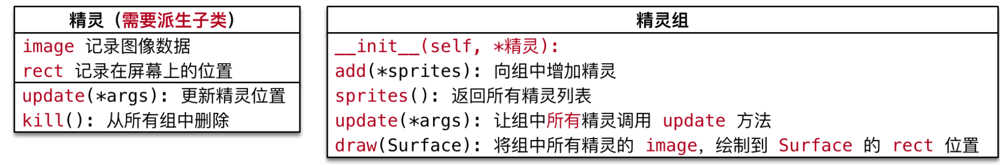

**演练代码**

* 修改 `plane_main` 的 `__create_sprites` 方法

```python
# 敌机组
self.enemy_group = pygame.sprite.Group()
```

* 修改 `plane_main` 的 `__update_sprites` 方法

```python
self.enemy_group.update()
self.enemy_group.draw(self.screen)
```

* 定时出现敌机

```python
elif event.type == CREATE_ENEMY_EVENT:
    self.enemy_group.add(Enemy())
```

### 2.3 随机敌机位置和速度

#### 1) 导入模块

* 在导入模块时，**建议** 按照以下顺序导入

```python
1. 官方标准模块导入
2. 第三方模块导入
3. 应用程序模块导入
```

* 修改 `plane_sprites.py` 增加 `random` 的导入

```python
import random
```

#### 2) 随机位置

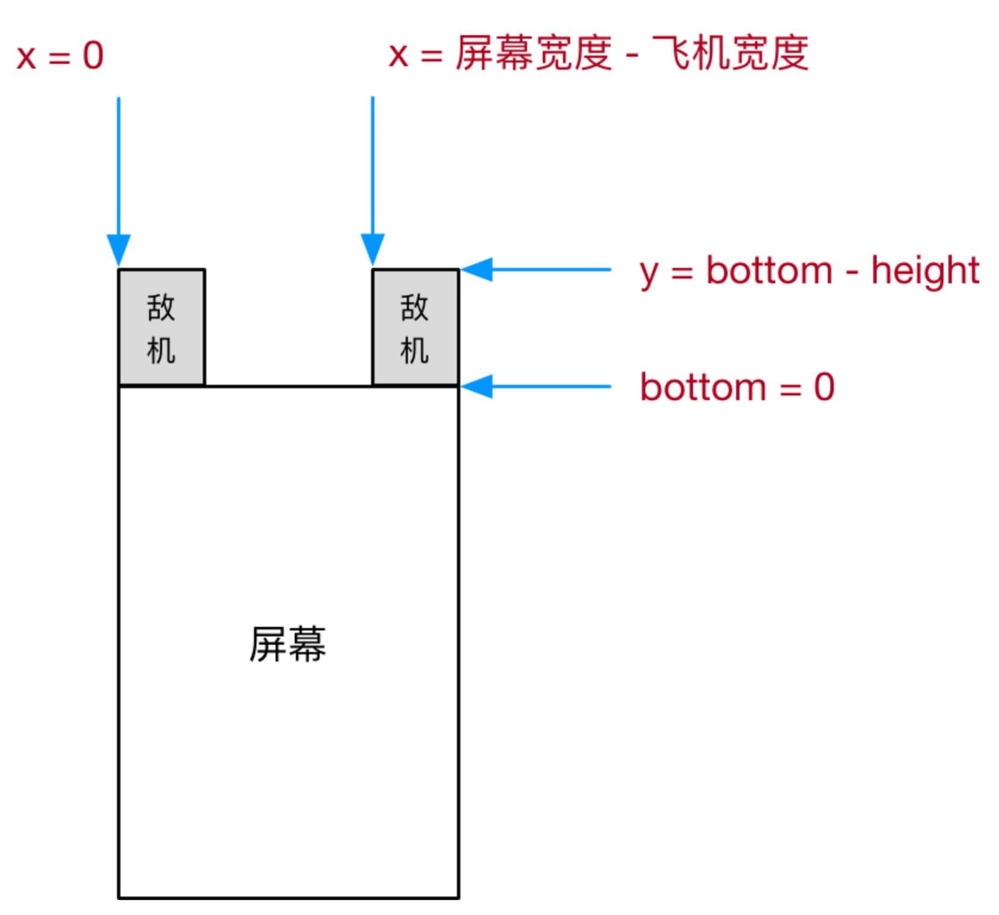

使用 `pygame.Rect` 提供的 `bottom` 属性，在指定敌机初始位置时，会比较方便

*  `bottom = y + height`
*  `y = bottom - height`

#### 3) 代码实现

* 修改 **初始化方法**，随机敌机出现 **速度** 和 **位置**

```python
def __init__(self):

    # 1. 调用父类方法，创建敌机精灵，并且指定敌机的图像
    super().__init__("./images/enemy1.png")

    # 2. 设置敌机的随机初始速度 1 ~ 3
    self.speed = random.randint(1, 3)

    # 3. 设置敌机的随机初始位置
    self.rect.bottom = 0
    
    max_x = SCREEN_RECT.width - self.rect.width
    self.rect.x = random.randint(0, max_x)
```

### 2.4 移出屏幕销毁敌机

* 敌机移出屏幕之后，如果 **没有撞到英雄**，敌机的历史使命已经终结
* 需要从 **敌机组** 删除，否则会造成 **内存浪费**

#### 检测敌机被销毁

* `__del__` 内置方法会在对象被销毁前调用，在开发中，可以用于 **判断对象是否被销毁**

```python
def __del__(self):
    print("敌机挂了 %s" % self.rect)
```

#### 代码实现

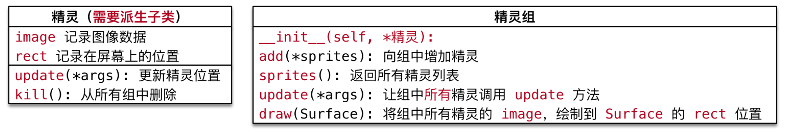

* 判断敌机是否飞出屏幕，如果是，调用 `kill()` 方法从所有组中删除

```python
def update(self):
    super().update()
    
    # 判断敌机是否移出屏幕
    if self.rect.y >= SCREEN_RECT.height:
        # 将精灵从所有组中删除
        self.kill()
```


# 英雄登场

## 目标

* 设计 **英雄** 和 **子弹** 类
* 使用 `pygame.key.get_pressed()` 移动英雄
* 发射子弹

## 01. 设计 **英雄** 和 **子弹** 类

### 英雄需求

1. 游戏启动后，**英雄** 出现在屏幕的 **水平中间** 位置，距离 **屏幕底部** `120` **像素**
2. **英雄** 每隔 `0.5` 秒发射一次子弹，每次 **连发三枚子弹**
3. **英雄** 默认不会移动，需要通过 **左/右** 方向键，控制 **英雄** 在水平方向移动

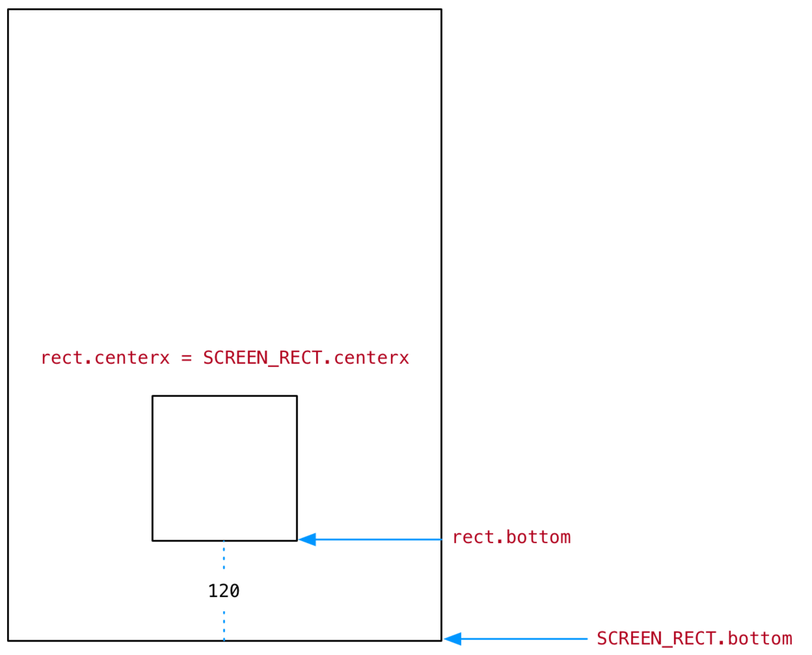

### 子弹需求

1. **子弹** 从 **英雄** 的正上方发射 **沿直线** 向 **上方** 飞行
2. **飞出屏幕后**，需要从 **精灵组** 中删除

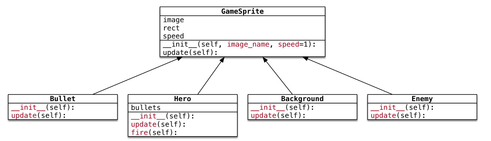

### Hero —— 英雄

* **初始化方法**
  * 指定 **英雄图片**
  * **初始速度 = 0** —— 英雄默认静止不动
  * 定义 `bullets` **子弹精灵组** 保存子弹精灵
* 重写 **update()** 方法
  * 英雄需要 **水平移动**
  * 并且需要保证不能 **移出屏幕**
* 增加 `bullets` 属性，记录所有 **子弹精灵**
* 增加 `fire` 方法，用于发射子弹

### Bullet —— 子弹

* **初始化方法**
  * 指定 **子弹图片**
  * **初始速度 = -2** —— 子弹需要向上方飞行
* 重写 **update()** 方法
  * 判断 **是否飞出屏幕**，如果是，从 **精灵组** 删除

## 02. 创建英雄

### 2.1 准备英雄类

* 在 `plane_sprites` 新建 `Hero` 类
* 重写 **初始化方法**，直接指定 **图片名称**，并且将初始速度设置为 `0`
* 设置 **英雄的初始位置**

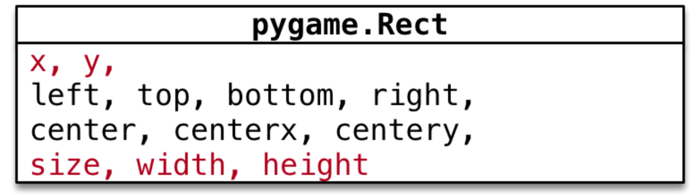

* `centerx = x + 0.5 * width`
* `centery = y + 0.5 * height`
* `bottom = y + height`

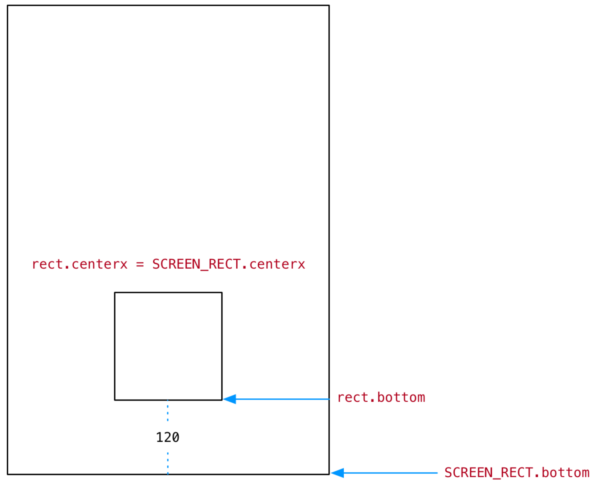

```python
class Hero(GameSprite):
    """英雄精灵"""

    def __init__(self):

        super().__init__("./images/me1.png", 0)

        # 设置初始位置
        self.rect.centerx = SCREEN_RECT.centerx
        self.rect.bottom = SCREEN_RECT.bottom - 120
```

### 2.2 绘制英雄

1. 在 `__create_sprites`，添加 **英雄精灵** 和 **英雄精灵组**
   * 后续要针对 **英雄** 做 **碰撞检测** 以及 **发射子弹**
   * 所以 **英雄** 需要 **单独定义成属性**
2. 在 `__update_sprites`，让 **英雄精灵组** 调用 `update` 和 `draw` 方法

#### 代码实现

* 修改 `__create_sprites` 方法如下：

```python
# 英雄组
self.hero = Hero()
self.hero_group = pygame.sprite.Group(self.hero)
```

* 修改 `__update_sprites` 方法如下：

```python
self.hero_group.update()
self.hero_group.draw(self.screen)
```

## 03. 移动英雄位置

> 在 `pygame` 中针对 **键盘按键的捕获**，有 **两种** 方式

* **第一种方式** 判断 `event.type == pygame.KEYDOWN`
* **第二种方式** 
  1. 首先使用 `pygame.key.get_pressed()` 返回 **所有按键元组**
  2. 通过 **键盘常量**，判断元组中 **某一个键是否被按下** —— 如果被按下，对应数值为 `1`

**提问** 这两种方式之间有什么区别呢？

* 第一种方式

```python
elif event.type == pygame.KEYDOWN and event.key == pygame.K_RIGHT:
    print("向右移动...")
```

* 第二种方式

```python
# 返回所有按键的元组，如果某个键被按下，对应的值会是1
keys_pressed = pygame.key.get_pressed()
# 判断是否按下了方向键
if keys_pressed[pygame.K_RIGHT]:
    print("向右移动...")
```

**结论**

* **第一种方式** `event.type` 用户 **必须要抬起按键** 才算一次 **按键事件**，**操作灵活性会大打折扣**
* **第二种方式** 用户可以按住方向键不放，就能够实现持续向某一个方向移动了，**操作灵活性更好**

### 3.1 移动英雄位置

**演练步骤**

1. 在 `Hero` 类中重写 `update` 方法
   * 用 **速度** `speed` 和 **英雄** `rect.x` 进行叠加
   * **不需要调用父类方法** —— 父类方法只是实现了单纯的垂直运动
2. 在 `__event_handler` 方法中根据 **左右方向键** 设置英雄的 **速度**
   * **向右** => `speed = 2`
   * **向左** => `speed = -2`
   * **其他** => `speed = 0`

**代码演练**

* 在 `Hero` 类，重写 `update()` 方法，**根据速度水平移动** 英雄的飞机

```python
def update(self):

    # 飞机水平移动
    self.rect.x += self.speed
```

* 调整键盘按键代码

```python
# 获取用户按键
keys_pressed = pygame.key.get_pressed()

if keys_pressed[pygame.K_RIGHT]:
    self.hero.speed = 2
elif keys_pressed[pygame.K_LEFT]:
    self.hero.speed = -2
else:
    self.hero.speed = 0
```

### 3.2 控制英雄运动边界

* 在 `Hero` 类的 `update()` 方法判断 **英雄** 是否超出 **屏幕边界**


* `right = x + width` 利用 `right` 属性可以非常容易的针对右侧设置精灵位置

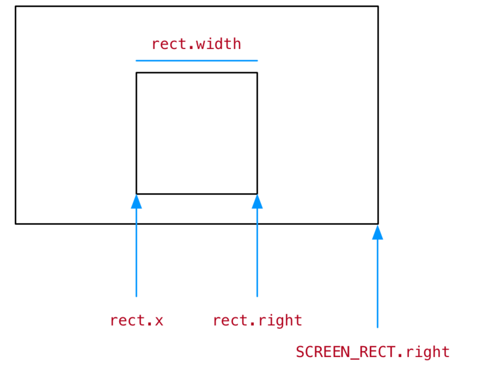

```python
def update(self):

    # 飞机水平移动
    self.rect.x += self.speed
    
    # 判断屏幕边界
    if self.rect.left < 0:
        self.rect.left = 0
    if self.rect.right > SCREEN_RECT.right:
        self.rect.right = SCREEN_RECT.right
```

## 04. 发射子弹

### 需求回顾 —— 英雄需求

1. 游戏启动后，**英雄** 出现在屏幕的 **水平中间** 位置，距离 **屏幕底部** `120` **像素**
2. **英雄** 每隔 `0.5` 秒发射一次子弹，每次 **连发三枚子弹**
3. **英雄** 默认不会移动，需要通过 **左/右** 方向键，控制 **英雄** 在水平方向移动

### 4.1 添加发射子弹事件

`pygame` 的 **定时器** 使用套路非常固定：

1. 定义 **定时器常量** —— `eventid`
2. 在 **初始化方法** 中，调用 `set_timer` 方法 **设置定时器事件**
3. 在 **游戏循环** 中，**监听定时器事件**

**代码实现**

* 在 `Hero` 中定义 `fire` 方法

```python
def fire(self):
    print("发射子弹...")
```

* 在 `plane_main.py` 的顶部定义 **发射子弹** 事件常量

```python
# 英雄发射子弹事件
HERO_FIRE_EVENT = pygame.USEREVENT + 1
```

* 在 `__init__` 方法末尾中添加 **发射子弹** 事件

```python
# 每隔 0.5 秒发射一次子弹
pygame.time.set_timer(HERO_FIRE_EVENT, 500)
```

* 在 `__event_handler` 方法中让英雄发射子弹

```python
elif event.type == HERO_FIRE_EVENT:
    self.hero.fire()
```

### 4.2 定义子弹类

#### 需求回顾 —— 子弹需求

1. **子弹** 从 **英雄** 的正上方发射 **沿直线** 向 **上方** 飞行
2. **飞出屏幕后**，需要从 **精灵组** 中删除

#### Bullet —— 子弹

* **初始化方法**
  * 指定 **子弹图片**
  * **初始速度 = -2** —— 子弹需要向上方飞行
* 重写 **update()** 方法
  * 判断 **是否飞出屏幕**，如果是，从 **精灵组** 删除

#### 定义子弹类

* 在 `plane_sprites` 新建 `Bullet` 继承自 `GameSprite`
* 重写 **初始化方法**，直接指定 **图片名称**，并且设置 **初始速度**
* 重写 `update()` 方法，判断子弹 **飞出屏幕从精灵组删除**

```python
class Bullet(GameSprite):
    """子弹精灵"""
    
    def __init__(self):
        
        super().__init__("./images/bullet1.png", -2)
 
    def update(self):
    
        super().update()
        
        # 判断是否超出屏幕，如果是，从精灵组删除
        if self.rect.bottom < 0:
            self.kill()
```

### 4.3 发射子弹

**演练步骤**

1. 在 `Hero` 的 **初始化方法** 中创建 **子弹精灵组** 属性
2. 修改 `plane_main.py` 的 `__update_sprites` 方法，让 **子弹精灵组** 调用 `update` 和 `draw` 方法
3. 实现 `fire()` 方法
   * 创建子弹精灵
   * 设置初始位置 —— 在 **英雄的正上方**
   * 将 **子弹** 添加到精灵组

**代码实现**

* 初始化方法

```python
# 创建子弹的精灵组
self.bullets = pygame.sprite.Group()
```

* 修改 `fire()` 方法

```python
def fire(self):

    # 1. 创建子弹精灵
    bullet = Bullet()
    
    # 2. 设置精灵的位置
    bullet.rect.bottom = self.rect.y - 20
    bullet.rect.centerx = self.rect.centerx
    
    # 3. 将精灵添加到精灵组
    self.bullets.add(bullet)
```

#### 一次发射三枚子弹

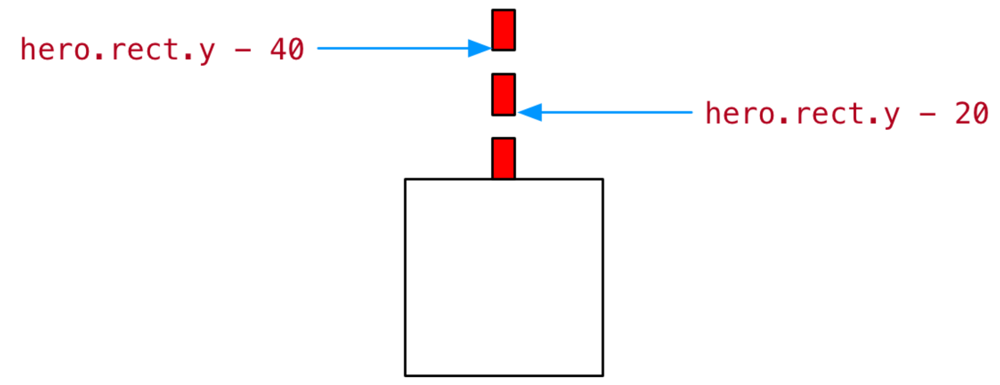

* 修改 `fire()` 方法，一次发射三枚子弹

```python
def fire(self):

    for i in (1, 2, 3):
        # 1. 创建子弹精灵
        bullet = Bullet()
        
        # 2. 设置精灵的位置
        bullet.rect.bottom = self.rect.y - i * 20
        bullet.rect.centerx = self.rect.centerx
        
        # 3. 将精灵添加到精灵组
        self.bullets.add(bullet)
```


# 碰撞检测

## 目标

* 了解碰撞检测方法
* 碰撞实现

## 01. 了解碰撞检测方法

* `pygame` 提供了 **两个非常方便** 的方法可以实现碰撞检测：

### pygame.sprite.groupcollide()

* **两个精灵组** 中 **所有的精灵** 的碰撞检测

```python
groupcollide(group1, group2, dokill1, dokill2, collided = None) -> Sprite_dict
```

* 如果将 `dokill` 设置为 `True`，则 **发生碰撞的精灵将被自动移除**
* `collided` 参数是用于 **计算碰撞的回调函数**
  * 如果没有指定，则每个精灵必须有一个 `rect` 属性

### pygame.sprite.spritecollide()

* 判断 **某个精灵** 和 **指定精灵组** 中的精灵的碰撞

```python
spritecollide(sprite, group, dokill, collided = None) -> Sprite_list
```

* 如果将 `dokill` 设置为 `True`，则 **指定精灵组** 中 **发生碰撞的精灵将被自动移除**
* `collided` 参数是用于 **计算碰撞的回调函数**
  * 如果没有指定，则每个精灵必须有一个 `rect` 属性
* 返回 **精灵组** 中跟 **精灵** 发生碰撞的 **精灵列表**

## 02. 碰撞实现

```python
def __check_collide(self):

    # 1. 子弹摧毁敌机
    pygame.sprite.groupcollide(self.hero.bullets, self.enemy_group, True, True)
    
    # 2. 敌机撞毁英雄
    enemies = pygame.sprite.spritecollide(self.hero, self.enemy_group, True)
    
    # 判断列表时候有内容
    if len(enemies) > 0:
    
        # 让英雄牺牲
        self.hero.kill()
        
        # 结束游戏
        PlaneGame.__game_over()
```


