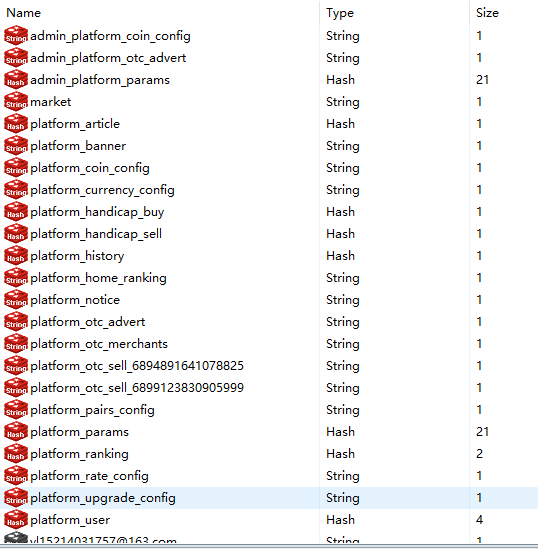
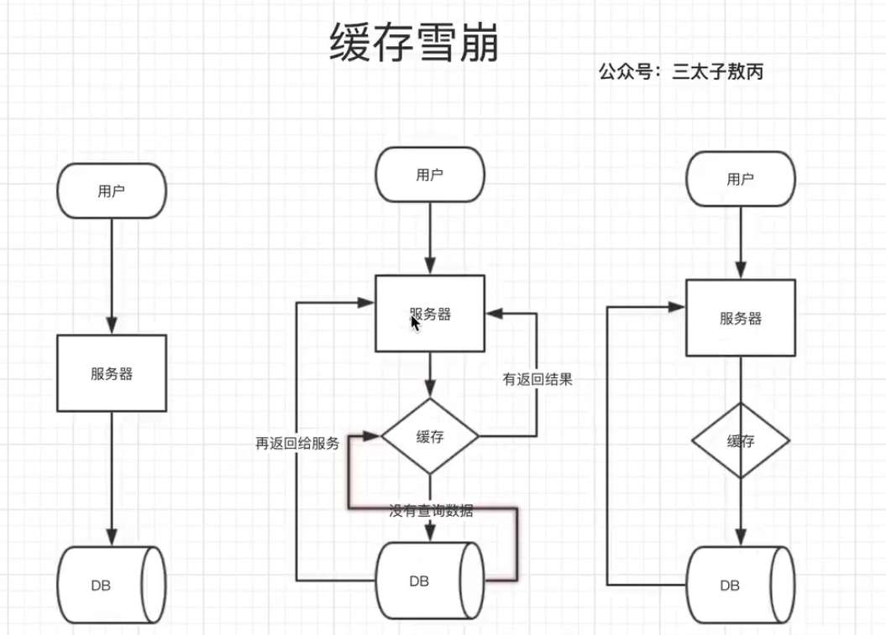
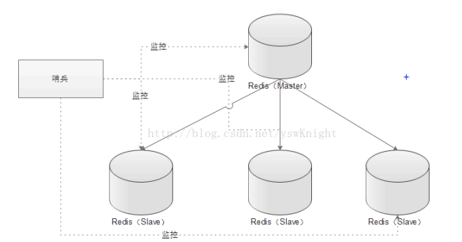
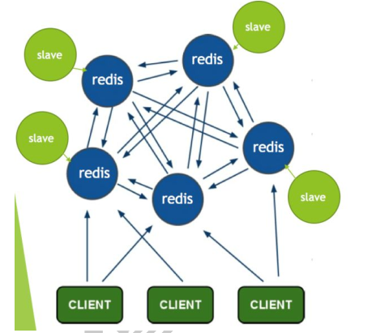
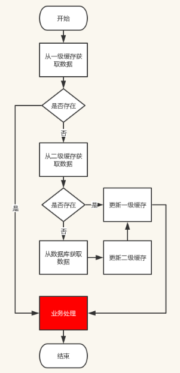

# Redis


# Interview

简单来说 redis 就是一个数据库，不过与传统数据库不同的是 **redis 的数据是存在内存中的**，所以读写速度非常快，因此 redis 被广泛应用于**缓存方向**。另外，redis 也经常用来做**分布式锁**。redis 提供了多种数据类型来支持不同的业务场景。除此之外，redis 支持事务 、持久化、LUA脚本、LRU驱动事件、多种集群方案。 


### 1.Redis数据类型，及其底层原理？zset底层是怎么样对数据进行排序的？

Redis支持五种数据类型：string（字符串），hash（哈希），list（列表），set（集合）及zset(sorted set：有序集合)

#### 1）、**字符串string**

string字符串是一种**动态的字符串**，使用者可以动态修改，类似于Java中的ArrayList

你会发现同样一组结构 Redis 使用泛型定义了好多次，**为什么不直接使用 int 类型呢？**

因为当字符串比较短的时候，len 和 alloc 可以使用 byte 和 short 来表示，**Redis 为了对内存做极致的优化，不同长度的字符串使用不同的结构体来表示。**（亮点）

##### 对字符串的基本操作

安装好 Redis，我们可以使用 `redis-cli` 来对 Redis 进行命令行的操作，当然 Redis 官方也提供了在线的调试器，你也可以在里面敲入命令进行操作：[http://try.redis.io/#run](http://try.redis.io/#run)

###### 设置和获取键值对

```console
> SET key value
OK
> GET key
"value"
```

正如你看到的，我们通常使用 `SET` 和 `GET` 来设置和获取字符串值。

值可以是任何种类的字符串（包括二进制数据），例如你可以在一个键下保存一张 `.jpeg` 图片，只需要注意不要超过 512 MB 的最大限度就好了。

当 key 存在时，`SET` 命令会覆盖掉你上一次设置的值：

```console
> SET key newValue
OK
> GET key
"newValue"
```

另外你还可以使用 `EXISTS` 和 `DEL` 关键字来查询是否存在和删除键值对：

```console
> EXISTS key
(integer) 1
> DEL key
(integer) 1
> GET key
(nil)
```

###### 批量设置键值对

```console
> SET key1 value1
OK
> SET key2 value2
OK
> MGET key1 key2 key3    # 返回一个列表
1) "value1"
2) "value2"
3) (nil)
> MSET key1 value1 key2 value2
> MGET key1 key2
1) "value1"
2) "value2"
```

###### 过期和 SET 命令扩展

可以对 key 设置过期时间，到时间会被自动删除，这个功能常用来控制缓存的失效时间。*(过期可以是任意数据结构)*

```console
> SET key value1
> GET key
"value1"
> EXPIRE name 5    # 5s 后过期
...                # 等待 5s
> GET key
(nil)
```

等价于 `SET` + `EXPIRE` 的 `SETNX` 命令：

```console
> SETNX key value1
...                # 等待 5s 后获取
> GET key
(nil)

> SETNX key value1  # 如果 key 不存在则 SET 成功
(integer) 1
> SETNX key value1  # 如果 key 存在则 SET 失败
(integer) 0
> GET key
"value"             # 没有改变 
```

###### 计数

如果 value 是一个整数，还可以对它使用 `INCR` 命令进行 **原子性** 的自增操作，这意味着及时多个客户端对同一个 key 进行操作，也决不会导致竞争的情况：

```console
> SET counter 100
> INCR count
(interger) 101
> INCRBY counter 50
(integer) 151
```

###### 返回原值的 GETSET 命令

对字符串，还有一个 `GETSET` 比较让人觉得有意思，它的功能跟它名字一样：为 key 设置一个值并返回原值：

```console
> SET key value
> GETSET key value1
"value"
```

这可以对于某一些需要隔一段时间就统计的 key 很方便的设置和查看，例如：系统每当由用户进入的时候你就是用 `INCR` 命令操作一个 key，当需要统计时候你就把这个 key 使用 `GETSET` 命令重新赋值为 0，这样就达到了统计的目的。

#### 2）、**列表list**

列表list相当于java中的LinkedList，插入和删除非常快，时间复杂度O（1），索引定位很慢O（n）

##### 链表的基本操作

- `LPUSH` 和 `RPUSH` 分别可以向 list 的左边（头部）和右边（尾部）添加一个新元素；
- `LRANGE` 命令可以从 list 中取出一定范围的元素；
- `LINDEX` 命令可以从 list 中取出指定下表的元素，相当于 Java 链表操作中的 `get(int index)` 操作；

示范：

```console
> rpush mylist A(integer) 1> rpush mylist B(integer) 2> lpush mylist first(integer) 3> lrange mylist 0 -1    # -1 表示倒数第一个元素, 这里表示从第一个元素到最后一个元素，即所有1) "first"2) "A"3) "B"
```

#### 

#### 3）、**字典hash**

字典hash类似于java中的HashMap，内部实现也类似，是通过“数组+列表”的实现来解决部分哈希冲突。

正常情况下，当元素数量达到第一个数组的长度，就会扩容，扩容为原来的两倍，（和HashMap一样）

##### 字典的基本操作

hash 也有缺点，hash 结构的存储消耗要高于单个字符串，所以到底该使用 hash 还是字符串，需要根据实际情况再三权衡：

```shell
> HSET books java "think in java"    # 命令行的字符串如果包含空格则需要使用引号包裹(integer) 1> HSET books python "python cookbook"(integer) 1> HGETALL books    # key 和 value 间隔出现1) "java"2) "think in java"3) "python"4) "python cookbook"> HGET books java"think in java"> HSET books java "head first java"  (integer) 0        # 因为是更新操作，所以返回 0> HMSET books java "effetive  java" python "learning python"    # 批量操作OK
```

## 

#### 4）、**集合set**

集合相当于java中的HashSet，他内部的键值对是无序的惟一的，他的内部实现相当于一个字典，字典中所有的value都是一个value

##### 集合 set 的基本使用

由于该结构比较简单，我们直接来看看是如何使用的：

```shell
> SADD books java(integer) 1> SADD books java    # 重复(integer) 0> SADD books python golang(integer) 2> SMEMBERS books    # 注意顺序，set 是无序的 1) "java"2) "python"3) "golang"> SISMEMBER books java    # 查询某个 value 是否存在，相当于 contains(integer) 1> SCARD books    # 获取长度(integer) 3> SPOP books     # 弹出一个"java"
```

## 

#### 5）、**有序列表zset**

这可能是redis最具特色的一个结构，它类似于 Java 中 **SortedSet** 和 **HashMap** 的结合体，一方面它是一个 set，保证了内部 value 的唯一性，另一方面它可以为每个 value 赋予一个 score 值，用来代表排序的权重。


底层实现是一个**跳跃表**：

跳跃表就类似于这样的机制，最下面一层所有的元素都会串起来，都是员工，然后每隔几个元素就会挑选出一个代表，再把这几个代表使用另外一级指针串起来。然后再在这些代表里面挑出二级代表，再串起来。**最终形成了一个金字塔的结构。**

想一下你目前所在的地理位置：亚洲 > 中国 > 某省 > 某市 > ....，**就是这样一个结构！**


##### 有序列表 zset 基础操作

```console
> ZADD books 9.0 "think in java"> ZADD books 8.9 "java concurrency"> ZADD books 8.6 "java cookbook"> ZRANGE books 0 -1     # 按 score 排序列出，参数区间为排名范围1) "java cookbook"2) "java concurrency"3) "think in java"> ZREVRANGE books 0 -1  # 按 score 逆序列出，参数区间为排名范围1) "think in java"2) "java concurrency"3) "java cookbook"> ZCARD books           # 相当于 count()(integer) 3> ZSCORE books "java concurrency"   # 获取指定 value 的 score"8.9000000000000004"                # 内部 score 使用 double 类型进行存储，所以存在小数点精度问题> ZRANK books "java concurrency"    # 排名(integer) 1> ZRANGEBYSCORE books 0 8.91        # 根据分值区间遍历 zset1) "java cookbook"2) "java concurrency"> ZRANGEBYSCORE books -inf 8.91 withscores  # 根据分值区间 (-∞, 8.91] 遍历 zset，同时返回分值。inf 代表 infinite，无穷大的意思。1) "java cookbook"2) "8.5999999999999996"3) "java concurrency"4) "8.9000000000000004"> ZREM books "java concurrency"             # 删除 value(integer) 1> ZRANGE books 0 -11) "java cookbook"2) "think in java"
```


### 2.Redis 持久化策略（存储策略）

（怎么保证 redis 挂掉之后再重启数据可以进行恢复）

很多时候我们需要持久化数据也就是将内存中的数据写入到硬盘里面，大部分原因是为了之后重用数据（比如重启机器、机器故障之后恢复数据），或者是为了防止系统故障而将数据备份到一个远程位置。


**持久化通用的两种方式**:

**1）、快照（snapshotting，RDB）**(某一时刻对数据的备份)    

类似拍照片把那瞬间的数据保存在了**dump.rdb**文件中（打开看到这个文件其实是二进制文件）

这种是redis默认采用的一种持久化方式。在redis.conf配置文件中默认有此下配置：

```j
save 900 1           #在900秒(15分钟)之后，如果至少有1个key发生变化，Redis就会自动触发BGSAVE命令创建快照。save 300 10          #在300秒(5分钟)之后，如果至少有10个key发生变化，Redis就会自动触发BGSAVE命令创建快照。save 60 10000        #在60秒(1分钟)之后，如果至少有10000个key发生变化，Redis就会自动触发BGSAVE命令创建快照。
```


**2）、追加文件（append-only file,AOF**）

与快照持久化相比，AOF持久化 的实时性更好，因此已成为主流的持久化方案。

追加文件这种持久化方式，默认是没有开启的，如果要开启，需要在config里面设置

```conf
appendonly yes
```

在Redis的配置文件中存在三种不同的 AOF 持久化方式，它们分别是：

```conf
appendfsync always    #每次有数据修改发生时都会写入AOF文件,这样会严重降低Redis的速度appendfsync everysec  #每秒钟同步一次，显示地将多个写命令同步到硬盘appendfsync no        #让操作系统决定何时进行同步
```

为了兼顾数据和写入性能，用户可以考虑 appendfsync everysec选项 ，让Redis每秒同步一次AOF文件，Redis性能几乎没受到任何影响。而且这样即使出现系统崩溃，用户最多只会丢失一秒之内产生的数据。


参考：https://www.jianshu.com/p/ae47d69f92eb


### 3. Redis的存储策略（持久化策略），你们项目中用的是哪一种

RDB和AOF两个都用

- **RDB**

优点：数据全，并且数据存放整齐

缺点：每次都能保存所有数据，短时间比较消耗性能


- **AOF**

 缺点：消耗性能（因为每次改变都要执行日志），磁盘存储零散

优点：实时性，不容易丢失数据

 

### 4. Redis的使用场景，那些地方用到Redis？

1）、第一做缓存，因为用户第一次访问数据库的时候，是比较慢的，所以第一次访问完以后，会将数据查出来放到缓存中，以后查的时候就会非常快。 （高性能）

2）、直接操作缓存能够承受的请求是远远大于直接访问数据库的，所以我们可以考虑把数据库中的部分数据转移到缓存中去，这样用户的一部分请求会直接到缓存这里而不用经过数据库。（高并发）


上面两个是比较笼统的对redis的概括。



具体的使用：

1、注册，修改密码等，短信放redis中

2、登录上去以后，当前登录用户的信息，钱包等 信息，都放到redis中，啥时候用的时候再取出来

3、系统的一些配置，在项目启动的时候，放到redis中

4、交易的各种币种的汇率等

5、交易历史

6、交易对信息（谁和谁交易）

7、通知等

8、商户信息


### 5.缓存雪崩和缓存穿透问题解决方案

#### **缓存雪崩** 

上次看敖丙画这个图，然后自己画一个




**什么是缓存雪崩？**

简介：缓存同一时间大面积的失效，所以，后面的请求都会落到数据库上，造成数据库短时间内承受大量请求而崩掉。

**有哪些解决办法？**（三太子敖丙 过期时间设置不一样，随机值，就不会同一时间同时雪崩）

（中华石杉老师在他的视频中提到过，视频地址在最后一个问题中有提到）：

- 事前：尽量保证整个 redis 集群的高可用性，发现机器宕机尽快补上。选择合适的内存淘汰策略。
- 事中：本地ehcache缓存 + hystrix限流&降级，避免MySQL崩掉
- 事后：利用 redis 持久化机制保存的数据尽快恢复缓存


#### **缓存穿透** 

**什么是缓存穿透？**

缓存穿透说简单点就是大量请求的 key 根本不存在于缓存中，导致请求直接到了数据库上，根本没有经过缓存这一层。举个例子：某个黑客故意制造我们缓存中不存在的 key 发起大量请求，导致大量请求落到数据库。下面用图片展示一下(这两张图片不是我画的，为了省事直接在网上找的，这里说明一下)：

**正常缓存处理流程：**


**缓存穿透情况处理流程：**


------

**有哪些解决办法？**

最基本的就是首先做好参数校验，一些不合法的参数请求直接抛出异常信息返回给客户端。比如查询的数据库 id 不能小于 0、传入的邮箱格式不对的时候直接返回错误消息给客户端等等。

**1）缓存无效 key** : 如果缓存和数据库都查不到某个 key 的数据就写一个到 redis 中去并设置过期时间，具体命令如下：`SET key value EX 10086`。这种方式可以解决请求的 key 变化不频繁的情况，如果黑客恶意攻击，每次构建不同的请求key，会导致 redis 中缓存大量无效的 key 。很明显，这种方案并不能从根本上解决此问题。如果非要用这种方式来解决穿透问题的话，尽量将无效的 key 的过期时间设置短一点比如 1 分钟。

另外，这里多说一嘴，一般情况下我们是这样设计 key 的： `表名:列名:主键名:主键值`。

 如果用 Java 代码展示的话，差不多是下面这样的：

```java
public Object getObjectInclNullById(Integer id) {    // 从缓存中获取数据    Object cacheValue = cache.get(id);    // 缓存为空    if (cacheValue == null) {        // 从数据库中获取        Object storageValue = storage.get(key);        // 缓存空对象        cache.set(key, storageValue);        // 如果存储数据为空，需要设置一个过期时间(300秒)        if (storageValue == null) {            // 必须设置过期时间，否则有被攻击的风险            cache.expire(key, 60 * 5);        }        return storageValue;    }    return cacheValue;}
```

**2）布隆过滤器：**布隆过滤器是一个非常神奇的数据结构，通过它我们可以非常方便地判断一个给定数据是否存在与海量数据中。我们需要的就是判断 key 是否合法，有没有感觉布隆过滤器就是我们想要找的那个“人”。具体是这样做的：**把所有可能存在的请求的值都存放在布隆过滤器中**，当用户请求过来，我会先判断用户发来的请求的值是否存在于布隆过滤器中。不存在的话，直接返回请求参数错误信息给客户端，存在的话才会走下面的流程。总结一下就是下面这张图(这张图片不是我画的，为了省事直接在网上找的)：


更多关于布隆过滤器的内容可以看我的这篇原创：[《不了解布隆过滤器？一文给你整的明明白白！》](https://github.com/Snailclimb/JavaGuide/blob/master/docs/dataStructures-algorithms/data-structure/bloom-filter.md) ，强烈推荐，个人感觉网上应该找不到总结的这么明明白白的文章了。


### 6.redis是如何配置的？ 你们的redis有集群吗？ 有主从关系吗？


redis配置，现在还没有搞集群。准备等用户量大的时候搞集群。

redis集群参考：https://www.cnblogs.com/silent2012/p/10697896.html（写的很好）

这个里面三主三从。也可以设置四主四从。


### 7.redis内存淘汰策略（内存淘汰机制）


如果redis的内存占用过多的时候，此时会进行内存淘汰，有如下一些策略：

 

noeviction：当内存不足以容纳新写入数据时，新写入操作会报错，这个一般没人用吧

allkeys-lru：当内存不足以容纳新写入数据时，在键空间中，移除最近最少使用的key（这个是最常用的）

allkeys-random：当内存不足以容纳新写入数据时，在键空间中，随机移除某个key，这个一般没人用吧

volatile-lru：当内存不足以容纳新写入数据时，在设置了过期时间的键空间中，移除最近最少使用的key（这个一般不太合适）

volatile-random：当内存不足以容纳新写入数据时，在设置了过期时间的键空间中，随机移除某个key

volatile-ttl：当内存不足以容纳新写入数据时，在设置了过期时间的键空间中，有更早过期时间的key优先移除

 

参考：https://www.cnblogs.com/mengchunchen/p/10039467.html （说是中华石杉的）


### 8.上面提到的Hystrix限流，降级

限流，降级，熔断

参考：https://www.jianshu.com/p/857d90a0afba（这个是转载自阿里的大牛）

https://blog.csdn.net/qq_17522211/article/details/84559987


### 9.MangoDB和Redis的区别？

项目中用的是MongoDB，但是为什么用其实当时选型的时候也没有太多考虑，只是认为**数据量比较大**，所以采用MongoDB。

最近又想起为什么用MongoDB，就查阅一下，汇总汇总：

之前也用过redis，当时是用来存储一些热数据，量也不大，但是操作很频繁。现在项目中用的是MongoDB，目前是百万级的数据，将来会有千万级、亿级。

就Redis和MongoDB来说，大家一般称之为**Redis缓存、MongoDB数据库**。这也是有道有理有根据的，

Redis主要把数据存储在内存中，其“缓存”的性质远大于其“数据存储“的性质，其中数据的增删改查也只是像变量操作一样简单；

MongoDB却是一个“存储数据”的系统，增删改查可以添加很多条件，就像SQL数据库一样灵活，这一点在面试的时候很受用。

点击查看：[MongoDB语法与现有关系型数据库SQL语法比较](https://www.cnblogs.com/java-spring/p/9488200.html)


**Mongodb与Redis应用指标对比**

**MongoDB和Redis都是NoSQL**，采用结构型数据存储。二者在使用场景中，存在一定的区别，这也主要由于
二者在内存映射的处理过程，持久化的处理方法不同。MongoDB建议集群部署，更多的考虑到集群方案，Redis
更偏重于进程顺序写入，虽然支持集群，也仅限于主-从模式。

 

|    指标    |                       MongoDB(v2.4.9)                        |                        Redis(v2.4.17)                        |                           比较说明                           |
| :--------: | :----------------------------------------------------------: | :----------------------------------------------------------: | :----------------------------------------------------------: |
|  实现语言  |                             C++                              |                            C/C++                             |                              -                               |
|    协议    |                      BSON、自定义二进制                      |                           类Telnet                           |                              -                               |
|    性能    |                      依赖内存，TPS较高                       |                     依赖内存，TPS非常高                      |                       Redis优于MongoDB                       |
|  可操作性  | 丰富的数据表达、索引；最类似于关系数据库，支持丰富的查询语言 |                      数据丰富，较少的IO                      |                       MongoDB优于Redis                       |
| 内存及存储 | 适合大数据量存储，依赖系统虚拟内存管理，采用镜像文件存储；内存占有率比较高，官方建议独立部署在64位系统（32位有最大2.5G文件限制，64位没有改限制） | Redis2.0后增加虚拟内存特性，突破物理内存限制；数据可以设置时效性，类似于memcache |                  不同的应用角度看，各有优势                  |
|   可用性   | 支持master-slave,replicaset（内部采用paxos选举算法，自动故障恢复）,auto sharding机制，对客户端屏蔽了故障转移和切分机制 | 依赖客户端来实现分布式读写；主从复制时，每次从节点重新连接主节点都要依赖整个快照,无增量复制；不支持自动sharding,需要依赖程序设定一致hash机制 | MongoDB优于Redis；单点问题上，MongoDB应用简单，相对用户透明，Redis比较复杂，需要客户端主动解决。（MongoDB 一般会使用replica sets和sharding功能结合，replica sets侧重高可用性及高可靠性，而sharding侧重于性能、易扩展） |
|   可靠性   | 从1.8版本后，采用binlog方式（MySQL同样采用该方式）支持持久化，增加可靠性 | 依赖快照进行持久化；AOF增强可靠性；增强可靠性的同时，影响访问性能 |                       MongoDB优于Redis                       |
|   一致性   |                 不支持事物，靠客户端自身保证                 |       支持事物，比较弱，仅能保证事物中的操作按顺序执行       |                       Redis优于MongoDB                       |
|  数据分析  |                内置数据分析功能（mapreduce）                 |                            不支持                            |                       MongoDB优于Redis                       |
|  应用场景  |                    海量数据的访问效率提升                    |                    较小数据量的性能及运算                    |                       MongoDB优于Redis                       |


参考自：https://www.cnblogs.com/java-spring/p/9488227.html


**上面的表数据太多啦，简单来说：**

1.首先开发语言，MangoDB和redis都是用c++开发的。

2.性能方面，他俩都是依赖内存，但是Redis的TPS（系统的吞吐量）更高。

3.可操作性性，MangoDB有最丰富的数据表达，最类似于关系型数据库，支持丰富的查询语句，

而Redis数据丰富，但是较少的IO，这一点MangDB要好于Redis

4.使用场景，MangoDB用于海量数据访问效率提升，Redis较小数据量，MangoDB要好

5.一致性，Redis支持事务，MangoDB不支持事务


### 10.Redis里有哪些命令？  主要看上面第一个

1）、对字符串操作：

#### 设置和获取键值对

```console
> SET key valueOK> GET key"value"
```

另外你还可以使用 `EXISTS` 和 `DEL` 关键字来查询是否存在和删除键值对：

```console
> EXISTS key(integer) 1> DEL key(integer) 1> GET key(nil)
```

#### 批量设置键值对

```console
> SET key1 value1OK> SET key2 value2OK> MGET key1 key2 key3    # 返回一个列表1) "value1"2) "value2"3) (nil)> MSET key1 value1 key2 value2> MGET key1 key21) "value1"2) "value2"
```

#### 过期和 SET 命令扩展

可以对 key 设置过期时间，到时间会被自动删除，这个功能常用来控制缓存的失效时间。*(过期可以是任意数据结构)*

```console
> SET key value1> GET key"value1"> EXPIRE name 5    # 5s 后过期...                # 等待 5s> GET key(nil)
```

#### 链表的基本操作

- `LPUSH` 和 `RPUSH` 分别可以向 list 的左边（头部）和右边（尾部）添加一个新元素；
- `LRANGE` 命令可以从 list 中取出一定范围的元素；
- `LINDEX` 命令可以从 list 中取出指定下表的元素，相当于 Java 链表操作中的 `get(int index)` 操作；

示范：

```console
> rpush mylist A(integer) 1> rpush mylist B(integer) 2> lpush mylist first(integer) 3> lrange mylist 0 -1    # -1 表示倒数第一个元素, 这里表示从第一个元素到最后一个元素，即所有1) "first"2) "A"3) "B"
```


### 11.Redis怎么实现分布式锁？Redis的分布式锁是哪个命令？

**为什么要用分布式锁？**

在Java中，关于锁我想大家都很熟悉。在并发编程中，我们通过锁，来避免由于竞争而造成的数据不一致问题。通

常，我们以`synchronized 、Lock`来使用它。

但是Java中的锁，只能保证在同一个JVM进程内中执行。如果在分布式集群环境下呢？


**实现分布式锁的命令：**

SETNX 关键字，设置参数如果存在返回 0，如果不存在返回 value 和 1

expire 关键字，为 key 设置过期时间，解决死锁。

delete 关键字，删除 key，释放锁


**实现思想**

（1）获取锁的时候，使用 setnx 加锁，并使用 expire 命令为锁添加一个超时时间，超过该

时间则自动释放锁，锁的 value 值为一个随机生成的 UUID，通过此在释放锁的时候进行判

断。

（2）获取锁的时候还设置一个获取的超时时间，若超过这个时间则放弃获取锁。

（3）释放锁的时候，通过 UUID 判断是不是该锁，若是该锁，则执行 delete 进行锁释放。 


参考：帅老师发的文档

https://www.jianshu.com/p/47fd7f86c848（简书 开始讲的简单易懂）

https://www.cnblogs.com/williamjie/p/9395659.html （可以实现一下）


### 12.Redis只是用来当作缓存吗？当然不是

redis应用场景总结redis平时我们用到的地方蛮多的，下面就了解的应用场景做个总结：

#### 1、热点数据的缓存

由于redis访问速度块、支持的数据类型比较丰富，所以redis很适合用来存储热点数据，另外结合expire，我们可以设置过期时间然后再进行缓存更新操作，这个功能最为常见，我们几乎所有的项目都有所运用。

#### 2、限时业务的运用

redis中可以使用expire命令设置一个键的生存时间，到时间后redis会删除它。利用这一特性可以运用在限时的优惠活动信息、手机验证码等业务场景。

#### 3、计数器相关问题

redis由于incrby命令可以实现原子性的递增，所以可以运用于高并发的秒杀活动、分布式序列号的生成、具体业务还体现在比如限制一个手机号发多少条短信、一个接口一分钟限制多少请求、一个接口一天限制调用多少次等等。

#### 4、排行榜相关问题

关系型数据库在排行榜方面查询速度普遍偏慢，所以可以借助redis的SortedSet进行热点数据的排序。

在奶茶活动中，我们需要展示各个部门的点赞排行榜， 所以我针对每个部门做了一个SortedSet,然后以用户的openid作为上面的username,以用户的点赞数作为上面的score, 然后针对每个用户做一个hash,通过zrangebyscore就可以按照点赞数获取排行榜，然后再根据username获取用户的hash信息，这个当时在实际运用中性能体验也蛮不错的。

#### 5、分布式锁 

这个主要利用redis的setnx命令进行，setnx："set if not exists"就是如果不存在则成功设置缓存同时返回1，否则返回0 ，这个特性在俞你奔远方的后台中有所运用，因为我们服务器是集群的，定时任务可能在两台机器上都会运行，所以在定时任务中首先 通过setnx设置一个lock，如果成功设置则执行，如果没有成功设置，则表明该定时任务已执行。 当然结合具体业务，我们可以给这个lock加一个过期时间，比如说30分钟执行一次的定时任务，那么这个过期时间设置为小于30分钟的一个时间 就可以，这个与定时任务的周期以及定时任务执行消耗时间相关。

当然我们可以将这个特性运用于其他需要分布式锁的场景中，结合过期时间主要是防止死锁的出现。

#### 6、延时操作 

这个目前我做过相关测试，但是还没有运用到我们的实际项目中，下面我举个该特性的应用场景。 比如在订单生产后我们占用了库存，10分钟后去检验用户是够真正购买，如果没有购买将该单据设置无效，同时还原库存。 由于redis自2.8.0之后版本提供Keyspace Notifications功能，允许客户订阅Pub/Sub频道，以便以某种方式接收影响Redis数据集的事件。 所以我们对于上面的需求就可以用以下解决方案，我们在订单生产时，设置一个key，同时设置10分钟后过期， 我们在后台实现一个监听器，监听key的实效，监听到key失效时将后续逻辑加上。 当然我们也可以利用rabbitmq、activemq等消息中间件的延迟队列服务实现该需求。

#### 7、分页、模糊搜索

redis的set集合中提供了一个zrangebylex方法，语法如下：

ZRANGEBYLEX key min max [LIMIT offset count]

通过ZRANGEBYLEX zset - + LIMIT 0 10 可以进行分页数据查询，其中- +表示获取全部数据

zrangebylex key min max 这个就可以返回字典区间的数据，利用这个特性可以进行模糊查询功能，这个也是目前我在redis中发现的唯一一个支持对存储内容进行模糊查询的特性。

前几天我通过这个特性，对学校数据进行了模拟测试，学校数据60万左右，响应时间在700ms左右，比mysql的like查询稍微快一点，但是由于它可以避免大量的数据库io操作，所以总体还是比直接mysql查询更利于系统的性能保障。

#### 8、点赞、好友等相互关系的存储

Redis set对外提供的功能与list类似是一个列表的功能，特殊之处在于set是可以自动排重的，当你需要存储一个列表数据，又不希望出现重复数据时，set是一个很好的选择，并且set提供了判断某个成员是否在一个set集合内的重要接口，这个也是list所不能提供的。 又或者在微博应用中，每个用户关注的人存在一个集合中，就很容易实现求两个人的共同好友功能。

这个在奶茶活动中有运用，就是利用set存储用户之间的点赞关联的，另外在点赞前判断是否点赞过就利用了sismember方法，当时这个接口的响应时间控制在10毫秒内，十分高效。

#### 9、队列 

由于redis有list push和list pop这样的命令，所以能够很方便的执行队列操作。


参考：https://www.jianshu.com/p/40dbc78711c8（感觉写的很好）


### 13 Redis 是如何配置的？说一下 redis 的集群模式、哨兵模式

#### 常见和比较重要的配置

1， port:6379 指定访问 redis 服务的端口
2， bind： 0.0.0.0 指定 redis 绑定的主机地址，配置为 0.0.0.0 表示为外网也可以访问
3， timeout：指定客户端连接 redis 服务器时，当闲置的时间为多少时关闭连接
4， loglevel：指定 redis 数据库的日志级别，常用的日志级别有 debug、 verbose、 notice、
warning，不进行修改的情况下默认的是 notice
5， save <s> <c> : 指定 redis 数据库多少时间内（s）就有多少次<c>更新操作（insert、
update 和 delete）时就把缓存中的数据同步到本地库，比如 save 600 2，指的是 10 分
钟内有 2 次更新操作，就同步到本地库，也就是持久化到本地磁盘。
6， dir 指本地数据文件存放的目录
7， requirepass：指定 redis 的访问密码
8， maxmemory：指定 redis 的最大内存。 Redis 在启动时会把数据加载到内存中，当到达
最大内存时， redis 会自动清除已经到期和即将到期的 key 值
9， appendonly：指定 redis 是否开启日志记录功能。由于 redis 时利用 save 命令异步的方
式更新数据到本地库，所以不开启日志记录功能，可能会导致在出现生产事故时，导致
部分数据未更新到本地库。
10， vm-enabled: 指定 redis 是否启用虚拟内存机制

#### redis 的集群模式

**1， 主从复制模式：**
Slave 从节点服务启动并连接到 Master 之后，它将主动发送一个 SYNC 命令。Master
服务主节点收到同步命令后将启动后台存盘进程，同时收集所有接收到的用于修改
数据集的命令，在后台进程执行完毕后， Master 将传送整个数据库文件到 Slave，
以完成一次完全同步。而 Slave 从节点服务在接收到数据库文件数据之后将其存盘
并加载到内存中。此后， Master 主节点继续将所有已经收集到的修改命令，和新的
修改命令依次传送给 Slaves， Slave 将在本次执行这些数据修改命令，从而达到最
终的数据同步。

**2， 哨兵模式：**

哨兵(sentinel) 是一个分布式系统,你可以在一个架构中运行多个哨兵(sentinel) 进
程,这些进程使用流言协议(gossipprotocols)来接收关于 Master 是否下线的信息,并使用
投票协议(agreement protocols)来决定是否执行自动故障迁移,以及选择哪个 Slave 作为
新的 Master。
每个哨兵(sentinel) 会向其它哨兵(sentinel)、 master、 slave 定时发送消息,以确认对
方是否” 活” 着,如果发现对方在指定时间(可配置)内未回应,则暂时认为对方已挂(所谓
的” 主观认为宕机” Subjective Down,简称 sdown).
若“哨兵群” 中的多数 sentinel,都报告某一 master 没响应,系统才认为该 master"彻
底死亡"(即:客观上的真正 down 机,Objective Down,简称 odown),通过一定的 vote 算法,
从剩下的 slave 节点中,选一台提升为 master,然后自动修改相关配置。
虽然哨兵(sentinel) 释出为一个单独的可执行文件 redis-sentinel ,但实际上它只是
一个运行在特殊模式下的 Redis 服务器，你可以在启动一个普通 Redis 服务器时通过
给定 --sentinel 选项来启动哨兵(sentinel)。

**3， Cluster 集群模式：**



自动将数据进行分片，每个节点上放一部分数据，如何放的呢？
Redis-Cluster 采用无中心结构，每个节点保存数据和整个集群状态，每个节点都和其他
所有节点连接，其结构图如如下：

结构特点：
1， 所有的 redis 节点彼此互联（PING-PONG 机制），内部使用二进制协议优化传输速
度和带宽。
2， 节点的 fail 是通过集群中超过半数的节点检测失效时才失效。
3， 客户端与 redis 节点直连，中间不需要 proxy 层，客户端不需要连接所有集群的所有
节点，连接集群中任意一个可用节点即可。
4， Redis-cluster 把所有的物理节点映射到 16384 个哈希槽（hash slot）上，不一定是
平均分配， cluster 负责维护 node<->slot<->value。
5， 当有数据需要存储的时候， redis 通过 CRC16 算法计算出 key 的值，然后把这个值
对 16384 取余，得到的结果在哪个节点负责的范围内就会把值存入哪个节点。
6， 如上图，每个 master 都是一个节点，而 slave 是该 master 的备份，当 redis 的一个
master 节点挂了， slave 会顶替掉 master，如何一个节点的 master 和 slave 都挂了，
那么则认为该 redis 集群挂了，因为有一部分数据丢失了，也有一部分数据永远也存
取不了了。 


### 14.Redis是单线程的，为什么能够抗住高并发？为什么单线程还那么快？

Redis高并发快总结：

1.Redis是**纯内存数据库**，一般都是简单的存取操作，线程占用的时间很多，时间的花费主要集中在IO上，所以读取速度快。

2.再说一下IO，Redis使用的是**非阻塞IO，IO多路复用**，使用了单线程来轮询描述符，将数据库的开、关、读、写都转换成了事件，减少了线程切换时上下文的切换和竞争。

3.Redis采用了单线程的模型，保证了每个操作的原子性，也**减少了线程的上下文切换和竞争**。

4.另外，**数据结构**也帮了不少忙，Redis全程使用hash结构，读取速度快，还有一些特殊的数据结构，对数据存储进行了优化，如压缩表，对短数据进行压缩存储，再如，跳表，使用有序的数据结构加快读取的速度。

5.还有一点，Redis采用自己实现的事件分离器，效率比较高，内部采用非阻塞的执行方式，吞吐能力比较大。


参考：https://blog.csdn.net/u011663149/article/details/85307615


### 15.如果有两台Redis，怎么样把其中一台Redis里的数据备份到另一台上？

#### 1、aof 导入方式。

因为这种方式比较简单，所以我就先介绍它。

分两步来实现，第一步先让源 Redis 生成 AOF 数据文件。

```shell

```

dir 目录，可以通过 config get dir 目录获得。

```shell

```


通过上面的命令，我们可以看到我本地的 dir 目录是：/usr/local/var/db/redis。

现在我们来做第二步操作，让目标 Redis 实例导入 aof 数据。

```shell

```

上面的第一个命令，执行后，如果出现以下内容，则表示导入 aof 数据成功。

```shell

```


我这里是测试，数据比较少，所以提示有 5 个导入成功了。

AOF 的缺点也很明显，就是速度慢，并且如果内容多的话，文件也比较大。而且开启 AOF 后，QPS 会比 RDB 模式写的 QPS 低。还有就是 AOF 是一个定时任务，可能会出现数据丢失的情况。

#### 2、通过我的 xttblog_redis_mv.sh 脚本来实现。

我的脚本内容如下：

```shell

```

大家在使用的时候，只需要替换 IP 即可。

这个脚本同样有一个问题就是使用了 keys *，然后一个一个遍历，如果是生产环境，不建议这样使用！当然我的脚本也是可以再进行优化的！

#### 3、使用 redis-dump 工具。

Redis-Dump 是一个用于 Redis 数据导入 / 导出的工具，是基于 Ruby 实现的,可以方便的进行 redis 的数据备份。这个工具需要先安装，以我的 Mac 为例，安装教程如下：

```shell

```

目前我发现，淘宝的镜像已经出现 bad response Not Found 404 了，被告知镜像维护站点已迁往 Ruby China 镜像。

```shell

```

安装完成后，就可以使用 redis-dump 工具进行数据的导入导出了！

```shell

```

cat 源Redis数据文件.json | redis-load -u :password@目标RedisIp:6379

Linux 系统或者 Window 系统也都类似，安装 redis-dump 工具完成后直接使用 redis-dump 导出，redis-load 导入即可完成数据的备份与迁移。

redis-dump 工具很强大，建议大家到官网上多看看它的官方文档。

#### 4、rdb 文件迁移

redis-dump 麻烦就麻烦在需要进行安装，如果我的 Redis 已经有备份机制，比如有 rdb 文件，那么我们直接迁移 rdb 文件就可以达到同样的目的。

首先，我们可以先关闭源 Redis 实例的 aof 功能。如果不关闭 aof，Redis 默认用 aof 文件来恢复数据。

```shell

```

然后使用 save 命令把数据固化到 rdb 文件中。

```shell

```

save 完成后，还是通过 config get dir 命令获得保存的 RDB 数据文件位置。

接下来，我们需要杀死 redis 进程。杀掉当前 redis 的进程，否则下一步的复制 rdb 文件，rdb 处于打开的状态，复制的文件，会占用同样的句柄。

```shell

```

然后复制源 redis 的 rdb 文件到目标 Redis 的 dir 数据目录，名字为你要迁移的 redis 的 rdb 文件名。

复制完成后，重启目标 Redis 实例，数据就迁移完成了。 重启完成后可以验证一下数据是否成功的复制了。


参考：https://www.jb51.net/article/179745.htm


### 16.Redis存的key是什么？如果是username，那可以查到其他人的订单，怎么防止这种情况？

我的理解是在Redis的key后面拼接一段无规则符号，即使是知道username，其他人也查不出你的订单。（个人理解，不知道有没有更好地办法）


### 17.redis，如果来了无效数据（存下来），如果无效数据非常多怎么处理

首先设置过期时间：（但是是随机删除。为什么要随机删除？因为下面定期删除里面说啦）

如果假设你设置了一批 key 只能存活1个小时，那么接下来1小时后，redis是怎么对这批key进行删除的？

**定期删除+惰性删除。**

通过名字大概就能猜出这两个删除方式的意思了。

- **定期删除**：redis默认是每隔 100ms 就**随机抽取**一些设置了过期时间的key，检查其是否过期，如果过期就删除。注意这里是随机抽取的。为什么要随机呢？你想一想假如 redis 存了几十万个 key ，每隔100ms就遍历所有的设置过期时间的 key 的话，就会给 CPU 带来很大的负载！
- **惰性删除** ：定期删除可能会导致很多过期 key 到了时间并没有被删除掉。所以就有了惰性删除。假如你的过期 key，靠定期删除没有被删除掉，还停留在内存里，除非你的系统去查一下那个 key，才会被redis给删除掉。这就是所谓的惰性删除，也是够懒的哈！

但是仅仅通过设置过期时间还是有问题的。我们想一下：如果定期删除漏掉了很多过期 key，然后你也没及时去查，也就没走惰性删除，此时会怎么样？如果大量过期key堆积在内存里，导致redis内存块耗尽了。怎么解决这个问题呢？ **redis 内存淘汰机制。**


**淘汰机制：**

**redis 提供 6种数据淘汰策略：**

1. **volatile-lru**：从已设置过期时间的数据集（server.db[i].expires）中挑选最近最少使用的数据淘汰
2. **volatile-ttl**：从已设置过期时间的数据集（server.db[i].expires）中挑选将要过期的数据淘汰
3. **volatile-random**：从已设置过期时间的数据集（server.db[i].expires）中任意选择数据淘汰
4. **allkeys-lru**：当内存不足以容纳新写入数据时，在键空间中，移除最近最少使用的key（这个是最常用的）
5. **allkeys-random**：从数据集（server.db[i].dict）中任意选择数据淘汰
6. **no-eviction**：禁止驱逐数据，也就是说当内存不足以容纳新写入数据时，新写入操作会报错。这个应该没人使用吧！

4.0版本后增加以下两种：

7. **volatile-lfu**：从已设置过期时间的数据集(server.db[i].expires)中挑选最不经常使用的数据淘汰
8. **allkeys-lfu**：当内存不足以容纳新写入数据时，在键空间中，移除最不经常使用的key


### 18.Redis和memcache的比较：

**一 性能对比：**

由于 redis 只使用单核，而 memcached 可以使用多核，所以平均每一个核上 redis 在存储小数据时比memcached 性能更高。而在 100k 以上的数据中，memcached 性能要高于 redis，虽然 redis 最近也在存储大数据的性能上进行优化，但是比起 memcached，还是稍有逊色。

**二 为啥 redis 单线程模型也能效率这么高？**

纯内存操作
核心是基于非阻塞的 IO 多路复用机制
单线程反而避免了多线程的频繁上下文切换问题

**三 其他不同**

数据类型不同，redis有五种(list set string hash zset),memcached只有一种string
Redis支持数据的备份，即master-slave模式的数据备份。
Redis支持数据的持久化，可以将内存中的数据保持在磁盘中，重启的时候可以再次加载进行使用。
内存的使用率上memcached数据结构简单 只有一种string ,不用记录数据的类型

### 19.Redis实现序列化：

**什么是序列化：**

序列化：把对象转化为可传输的字节序列过程称为序列化。

反序列化：把字节序列还原为对象的过程称为反序列化。

**为什么要序列化：**

序列化最终的目的是为了对象可以跨平台存储，和进行网络传输。而我们进行跨平台存储和网络传输的方式就是IO，而我们的IO支持的数据格式就是字节数组。

因为我们单方面的只把对象转成字节数组还不行，因为没有规则的字节数组我们是没办法把对象的本来面目还原回来的，所以我们必须在把对象转成字节数组的时候就制定一种规则（序列化），那么我们从IO流里面读出数据的时候再以这种规则把对象还原回来（反序列化）。

如果我们要把一栋房子从一个地方运输到另一个地方去，序列化就是我把房子拆成一个个的砖块放到车子里，然后留下一张房子原来结构的图纸，反序列化就是我们把房子运输到了目的地以后，根据图纸把一块块砖头还原成房子原来面目的过程

**什么情况下需要序列化：**

通过上面我想你已经知道了凡是需要进行“跨平台存储”和”网络传输”的数据，都需要进行序列化。

本质上存储和网络传输 都需要经过 把一个对象状态保存成一种跨平台识别的字节格式，然后其他的平台才可以通过字节信息解析还原对象信息。

**序列化的方式：**

序列化只是一种拆装组装对象的规则，那么这种规则肯定也可能有多种多样，比如现在常见的序列化方式有：

JDK（不支持跨语言）、JSON、XML、Hessian、Kryo（不支持跨语言）、Thrift、Protostuff、FST（不支持跨语言）

**Java序列化**

java 实现序列化很简单，只需要实现Serializable 接口即可。

```java
public class User implements Serializable{ //年龄 private int age; //名字 private String name ;  public int getAge() { return age;    } public void setAge(int age) { this.age = age;    }  public String getName() { return name;    }  public void setName(String name) { this.name = name;    }}
```

注意: JAVA序列化中常见的问题

- 问题一：static 属性不能被序列化

 原因：序列化保存的是对象的状态，静态变量属于类的状态，因此 序列化并不保存静态变量。

- 问题二：Transient 属性不会被序列化
- 问题三：序列化版本号serialVersionUID

 所有实现序列化的对象都必须要有个版本号，这个版本号可以由我们自己定义，当我们没定义的时候JDK工具会按照我们对象的属性生成一个对应的版本号。使用JDK生成的serialVersionUID，只要对象有一丁点改变serialVersionUID就会随着变更。因此建议自己手动定义该版本号。

**Redis序列化**

当你用Redis的key和value时，value对于redis来讲就是个byte array。你要自己负责把你的数据结构转换成byte array，等读取时再读出来。

> 一个特例是字符串，因为字符串自己几乎就已经是byte array了，所以不需要自己处理。

Spring的redisTemplate默认会使用java serialization做序列化。你也可以用StringRedisTemplate，那么你set的所有数据都会被toString一下再存到redis里。但这个toString不一定能反解析的回来。如果使用 java原生序列化方式，可能会有远程代码执行问题，因此建议使用其他序列化方式代替。


参考：https://www.cnblogs.com/lemos/p/11081448.html （写的很好）


### 20.Redis的核心功能

做缓存，解决高并发问题等。


### 21.Redis三级缓存

没有找到三级缓存，找到了二级缓存。


1，了解数据存储的位置的不同

数据库：存储在磁盘上

redis:存储在内存上

ehcache:应用内缓存

 

缓存的目的：是为了将数据从一个较慢的介质上读取出来，放到一个较快的介质上，为了下次读取的时候更加的快。

数据存入在书库库中，每次获取数据都有IO交互，所以放入到Redis中。Redis 存放数据在内存中。

Redis 也还不够快，网络IO 传输，连接池等，所以放到ehcache 这样的应用内缓存中。

2，一级缓存：ehcache 二级缓存：redis




### 22.Redis 如何模糊查询？

```
scan
```


参考：https://blog.csdn.net/fly910905/article/details/78942357


### 23.优化项目中的redis代码，使用Hash和List结构·····


### 24.用户修改用户信息，该怎么保证redis缓存和数据库中数据一致？

### 25.Java中用到缓存的主要是哪些场合？


# Redis 实际应用

将大对象放入缓存中，有两种方式，第一种转换成json串，第二种

参考：https://www.jianshu.com/p/c22954a9c37d


