# Shiro


## 目录

[TOC]

> 自己学习笔记
>
> 稍微大一点公司专门有一个一体化管理平台，专门管理用户，角色，还有各种权限
>
> 小项目才会用这个来权限校验

# 认证（ren）

Subject

Credential

# 授权（shou）

Permission

认证是授权的前提


### **商城项目shiro:**

```java
package org.linlinjava.litemall.admin.shiro;


import org.apache.shiro.authc.*;
import org.apache.shiro.authz.AuthorizationException;
import org.apache.shiro.authz.AuthorizationInfo;
import org.apache.shiro.authz.SimpleAuthorizationInfo;
import org.apache.shiro.realm.AuthorizingRealm;
import org.apache.shiro.subject.PrincipalCollection;
import org.linlinjava.litemall.core.util.bcrypt.BCryptPasswordEncoder;
import org.linlinjava.litemall.db.domain.LitemallAdmin;
import org.linlinjava.litemall.db.service.LitemallAdminService;
import org.linlinjava.litemall.db.service.LitemallPermissionService;
import org.linlinjava.litemall.db.service.LitemallRoleService;
import org.springframework.beans.factory.annotation.Autowired;
import org.springframework.util.Assert;
import org.springframework.util.StringUtils;

import java.util.List;
import java.util.Set;

public class AdminAuthorizingRealm extends AuthorizingRealm {

    @Autowired
    private LitemallAdminService adminService;
    @Autowired
    private LitemallRoleService roleService;
    @Autowired
    private LitemallPermissionService permissionService;

    //授权
    @Override
    protected AuthorizationInfo doGetAuthorizationInfo(PrincipalCollection principals) {
        if (principals == null) {
            throw new AuthorizationException("PrincipalCollection method argument cannot be null.");
        }

        LitemallAdmin admin = (LitemallAdmin) getAvailablePrincipal(principals);
       	//首先获取roleId
        Integer[] roleIds = admin.getRoleIds();
        //利用admin中roleId将role查出来
        Set<String> roles = roleService.queryByIds(roleIds);
        //然后将权限查出来
        Set<String> permissions = permissionService.queryByRoleIds(roleIds);
        //然后将角色和权限放到info中返回
        SimpleAuthorizationInfo info = new SimpleAuthorizationInfo();
        info.setRoles(roles);
        info.setStringPermissions(permissions);
        return info;
    }

    //认证
    @Override
    protected AuthenticationInfo doGetAuthenticationInfo(AuthenticationToken token) throws AuthenticationException {

        UsernamePasswordToken upToken = (UsernamePasswordToken) token;
        String username = upToken.getUsername();
        String password = new String(upToken.getPassword());

        if (StringUtils.isEmpty(username)) {
            throw new AccountException("用户名不能为空");
        }
        if (StringUtils.isEmpty(password)) {
            throw new AccountException("密码不能为空");
        }

        List<LitemallAdmin> adminList = adminService.findAdmin(username);
        Assert.state(adminList.size() < 2, "同一个用户名存在两个账户");
        if (adminList.size() == 0) {
            throw new UnknownAccountException("找不到用户（" + username + "）的帐号信息");
        }
        LitemallAdmin admin = adminList.get(0);

        BCryptPasswordEncoder encoder = new BCryptPasswordEncoder();
        if (!encoder.matches(password, admin.getPassword())) {
            throw new UnknownAccountException("找不到用户（" + username + "）的帐号信息");
        }

        return new SimpleAuthenticationInfo(admin, password, getName());
    }

}
```


然后在ShiroConfig将上面写的注入到Spring容器当中: 便于其他地方使用

```java
利用admin中roleid将role查出来package org.linlinjava.litemall.admin.config;

import org.apache.shiro.mgt.SecurityManager;
import org.apache.shiro.realm.Realm;
import org.apache.shiro.session.mgt.SessionManager;
import org.apache.shiro.spring.security.interceptor.AuthorizationAttributeSourceAdvisor;
import org.apache.shiro.spring.web.ShiroFilterFactoryBean;
import org.apache.shiro.web.mgt.DefaultWebSecurityManager;
import org.linlinjava.litemall.admin.shiro.AdminAuthorizingRealm;
import org.linlinjava.litemall.admin.shiro.AdminWebSessionManager;
import org.springframework.aop.framework.autoproxy.DefaultAdvisorAutoProxyCreator;
import org.springframework.context.annotation.Bean;
import org.springframework.context.annotation.Configuration;
import org.springframework.context.annotation.DependsOn;

import java.util.LinkedHashMap;
import java.util.Map;

@Configuration
public class ShiroConfig {

    @Bean
    public Realm realm() {
        return new AdminAuthorizingRealm();
    }

    @Bean
    public ShiroFilterFactoryBean shiroFilterFactoryBean(SecurityManager securityManager) {
        ShiroFilterFactoryBean shiroFilterFactoryBean = new ShiroFilterFactoryBean();
        shiroFilterFactoryBean.setSecurityManager(securityManager);
        Map<String, String> filterChainDefinitionMap = new LinkedHashMap<String, String>();
        filterChainDefinitionMap.put("/admin/auth/login", "anon");
        filterChainDefinitionMap.put("/admin/auth/401", "anon");
        filterChainDefinitionMap.put("/admin/auth/index", "anon");
        filterChainDefinitionMap.put("/admin/auth/403", "anon");
        filterChainDefinitionMap.put("/admin/index/index", "anon");

        filterChainDefinitionMap.put("/admin/**", "authc");
        shiroFilterFactoryBean.setLoginUrl("/admin/auth/401");
        shiroFilterFactoryBean.setSuccessUrl("/admin/auth/index");
        shiroFilterFactoryBean.setUnauthorizedUrl("/admin/auth/403");
        shiroFilterFactoryBean.setFilterChainDefinitionMap(filterChainDefinitionMap);
        return shiroFilterFactoryBean;
    }

    @Bean
    public SessionManager sessionManager() {

        return new AdminWebSessionManager();
    }

    @Bean
    public DefaultWebSecurityManager defaultWebSecurityManager() {
        DefaultWebSecurityManager securityManager = new DefaultWebSecurityManager();
        securityManager.setRealm(realm());
        securityManager.setSessionManager(sessionManager());
        return securityManager;
    }

    @Bean
    public AuthorizationAttributeSourceAdvisor authorizationAttributeSourceAdvisor(SecurityManager securityManager) {
        AuthorizationAttributeSourceAdvisor authorizationAttributeSourceAdvisor =
                new AuthorizationAttributeSourceAdvisor();
        authorizationAttributeSourceAdvisor.setSecurityManager(securityManager);
        return authorizationAttributeSourceAdvisor;
    }

    @Bean
    @DependsOn("lifecycleBeanPostProcessor")
    public static DefaultAdvisorAutoProxyCreator defaultAdvisorAutoProxyCreator() {
        DefaultAdvisorAutoProxyCreator creator = new DefaultAdvisorAutoProxyCreator();
        creator.setProxyTargetClass(true);
        return creator;
    }
}

```


### 从shiro中拿到用户信息

1.在用户登录的时候将信息放到shiro中:

```java
/*
     *  { username : value, password : value }
     */
    @PostMapping("/login")
    public Object login(@RequestBody String body, HttpServletRequest request) {
        String username = JacksonUtil.parseString(body, "username");
        String password = JacksonUtil.parseString(body, "password");

        if (StringUtils.isEmpty(username) || StringUtils.isEmpty(password)) {
            return ResponseUtil.badArgument();
        }

        Subject currentUser = SecurityUtils.getSubject();  //这里第一步//
        try {
            currentUser.login(new UsernamePasswordToken(username, password));
        } catch (UnknownAccountException uae) {
            logHelper.logAuthFail("登录", "用户帐号或密码不正确");
            return ResponseUtil.fail(ADMIN_INVALID_ACCOUNT, "用户帐号或密码不正确");
        } catch (LockedAccountException lae) {
            logHelper.logAuthFail("登录", "用户帐号已锁定不可用");
            return ResponseUtil.fail(ADMIN_INVALID_ACCOUNT, "用户帐号已锁定不可用");

        } catch (AuthenticationException ae) {
            logHelper.logAuthFail("登录", "认证失败");
            return ResponseUtil.fail(ADMIN_INVALID_ACCOUNT, "认证失败");
        }

        currentUser = SecurityUtils.getSubject();         //这里第二步//
        LitemallAdmin admin = (LitemallAdmin) currentUser.getPrincipal();
        
        admin.setLastLoginIp(IpUtil.getIpAddr(request));
        admin.setLastLoginTime(LocalDateTime.now());
        
        adminService.updateById(admin);

        //根据username 将admin中的storeId查出来
        LitemallAdmin litemallAdmin = adminService.findAdmin(username).get(0);
        admin.setStoreId(litemallAdmin.getStoreId());   //这里将店铺id放到shiro,其他地方就可以拿出来使用啦
        
        logHelper.logAuthSucceed("登录");

        // userInfo
        Map<String, Object> adminInfo = new HashMap<String, Object>();
        adminInfo.put("nickName", admin.getUsername());
        adminInfo.put("avatar", admin.getAvatar());
        
        //根据传入的username来判断是不是店铺管理员
        /*if (username.contains("store")) {
            String token = (String) currentUser.getSession().getId();
            redisPlugin.set(StrUtil.concat(Boolean.TRUE, RedisConst.ADMIN_LOGIN_SIGN, token), litemallAdmin2, RedisConst.LOGIN_VALID_TIMESTAMP);
        }*/
        
        Map<Object, Object> result = new HashMap<Object, Object>();
        
        result.put("token", currentUser.getSession().getId());
        result.put("adminInfo", adminInfo);
        return ResponseUtil.ok(result);
    }
```


2.在shiro中拿出里面的信息:

```java
//根据username 来查询 对应店铺id
        Subject currentUser = SecurityUtils.getSubject();
        LitemallAdmin admin = (LitemallAdmin) currentUser.getPrincipal();
       //LitemallAdmin admin = getAdmin(request);
        String storeId = admin.getStoreId();
```


### 具体使用:

将需要用到shiro的方法,上面加注解,加描述,需要注意的是 这里只能用GetMapping或者PostMapping

不能用RequestMapping

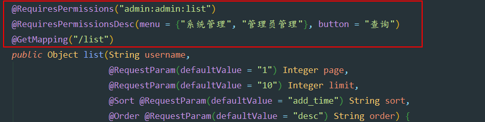


```java
@RequiresPermissions("admin:admin:list")
@RequiresPermissionsDesc(menu = {"系统管理", "管理员管理"}, button = "查询")
@GetMapping("/list")
```


# 基本模型

用户 权限 多对多

# 通用模型

3+2

用户 角色 权限

多对多 多对多

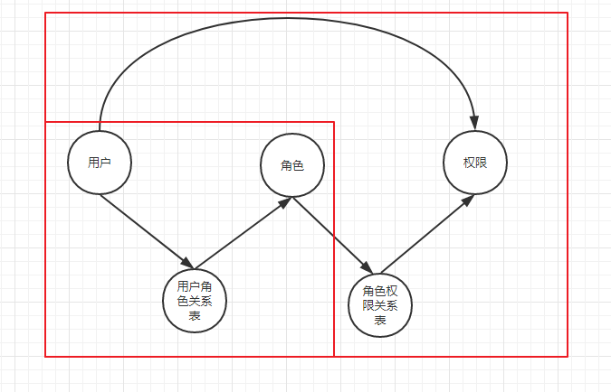

正常情况 这个shiro需要五张表  三张单表,两张中间表 

但是商城项目,是三张表:

角色表role作为桥梁:用户表和权限表各自加一个roleId

这是用户表(admin):

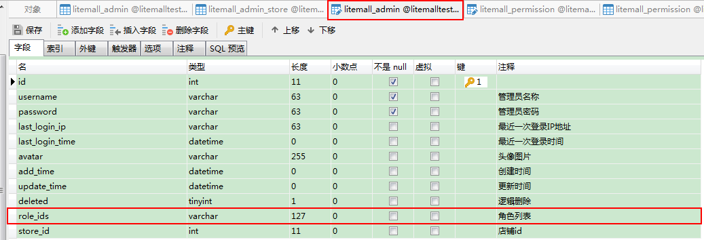

这是权限表:

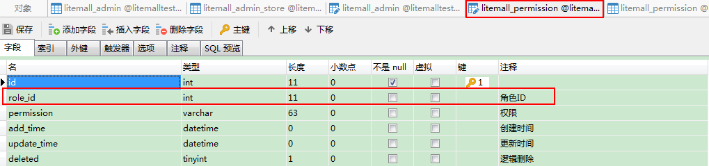

通过roleId桥梁将三张表连接起来


# 核心组件

SecurityManager： Authenticator Authorizer

Realm（域）是使用shiro的核心组件，在realm中获取认证和授权信息（来源于数据库）

# 入门案例

## 案例1

使用shiro的认证功能，SE

### 导包

Shiro-core commons-logging junit

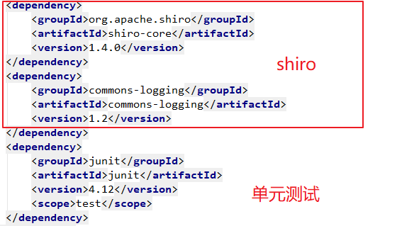

商城项目中用的是Spring-boot对shiro的整合包

```xml
<dependency>
    <groupId>org.apache.shiro</groupId>
    <artifactId>shiro-spring-boot-web-starter</artifactId>
</dependency>
```


### 代码

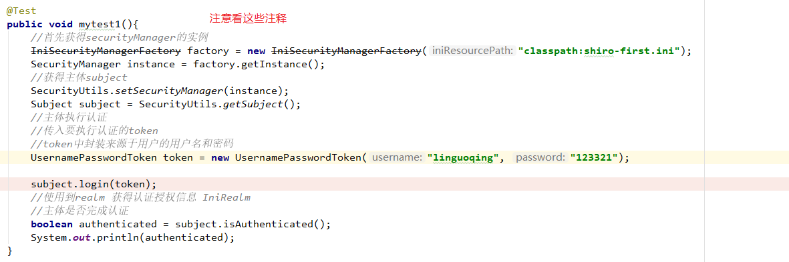

最终执行IniRealm的doGetAuthenticationInfo方法这个方法

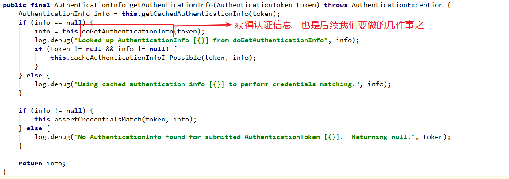

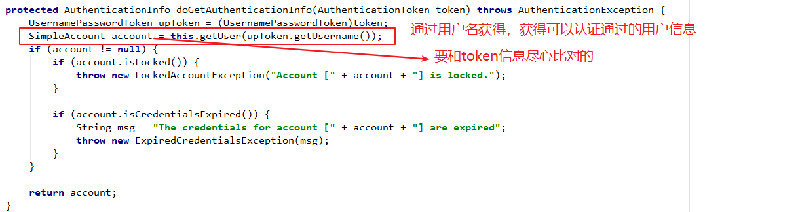

## 案例2（自定义的Realm）

自定义Realm，自行处理 认证信息

配置自定义的realm（继承AuthorizingRealm）

在ini配置文件中配置SecurityManager使用的realm为自定义的realm

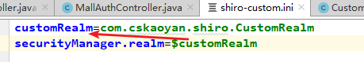

重写AuthorizingRealm中的doGetAuthenticationInfo（认证）和doGetAuthorizationInfo（授权）的方法

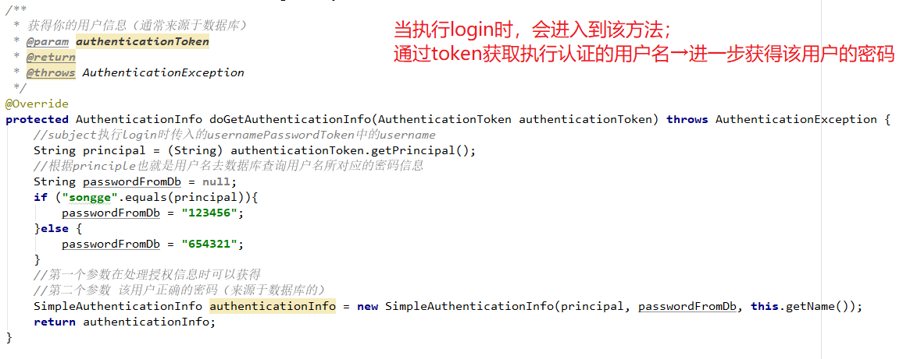

当执行鉴权操作时会进入到doGetAuthorizationInfo方法中执行，获得（查询）该用户所拥有的权限

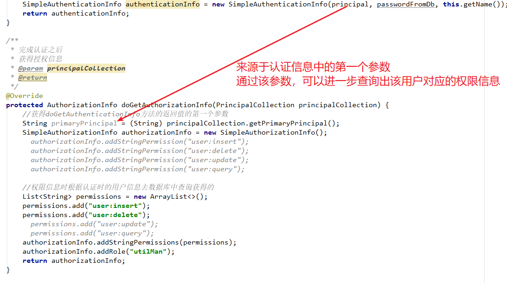

# Springboot整合shiro

## 导包

Shiro-spring（core、web）

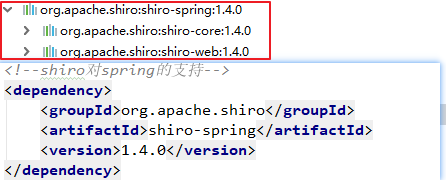

## 注册组件

shiroFilterFactoryBean、SecurityManager、自定义Realm

### ShiroFilterFactoryBean

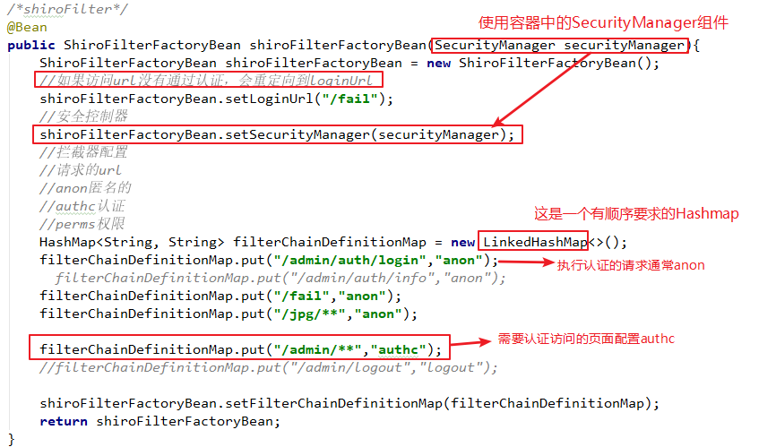

### SecurityManager(安全管理器)

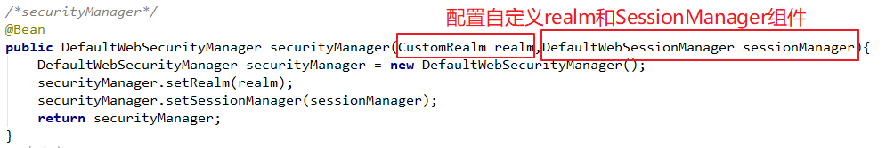

### 自定义Realm

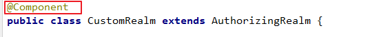

## 声明式的配置

### 导包aspectj-weaver

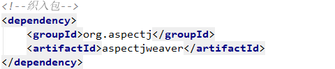

### @EnableAspectjAutoProxy

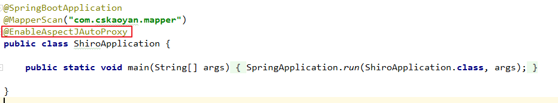

### AuthorizationAttributeSourceAdvisor

注册组件

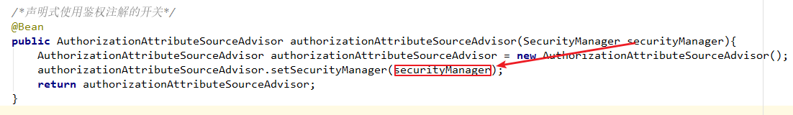

### 使用

在RequestMapping对应的方法上使用注解

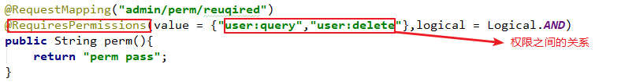

## 整合商城项目

### CorsConfig

之前做过的部分


### 自定义的sessionManager

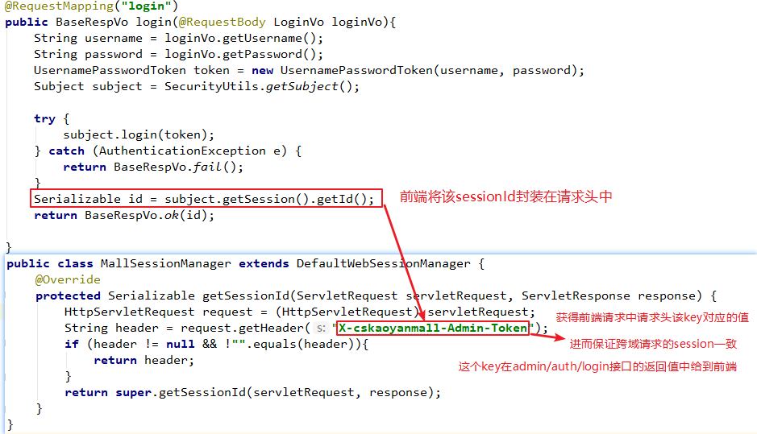

配置给SecurityManager

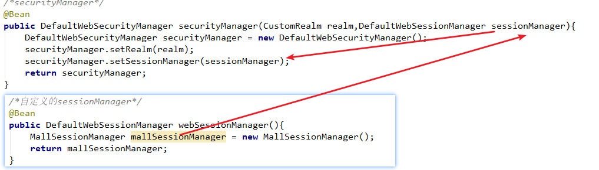

### 在自定义realm执行查询

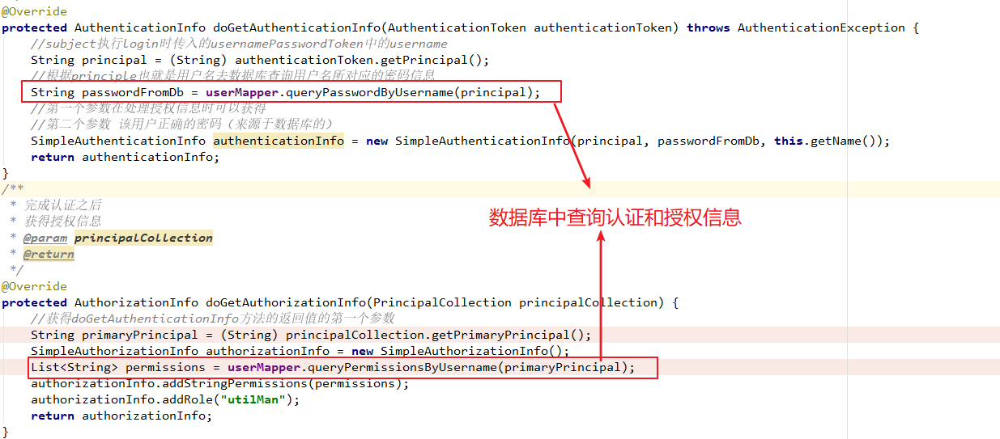

### 认证通过后可以拿到认证信息

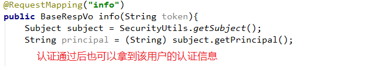


# Shiro 中的 SecurityUtils

[


在 Shiro 中 `SecurityUtils` 是一个抽象类。并且没有任何子类。在其中声明了一个静态属性，三个静态方法。

## 静态属性 securityManager


```cpp
private static SecurityManager securityManager;
```

用来存储当前应用中全局唯一的一个SecurityManager。

有两个静态方法是为此静态属性服务器，也就是下面这两个：


```tsx
public static void setSecurityManager(SecurityManager securityManager) {
    SecurityUtils.securityManager = securityManager;
}

public static SecurityManager getSecurityManager() throws UnavailableSecurityManagerException {
    SecurityManager securityManager = ThreadContext.getSecurityManager();
    if (securityManager == null) {
        securityManager = SecurityUtils.securityManager;
    }
    if (securityManager == null) {
        String msg = "No SecurityManager accessible to the calling code, either bound to the " +
                ThreadContext.class.getName() + " or as a vm static singleton.  This is an invalid application " +
                "configuration.";
        throw new UnavailableSecurityManagerException(msg);
    }
    return securityManager;
}
```

## getSubject 静态方法

这个是 Shiro 中最核心的方法了，用来获取 Subject.


```csharp
public static Subject getSubject() {
    Subject subject = ThreadContext.getSubject();
    if (subject == null) {
        subject = (new Subject.Builder()).buildSubject();
        ThreadContext.bind(subject);
    }
    return subject;
}
```

上述方法中，第二行（`Subject subject = ThreadContext.getSubject();`）获取到的Subject其实是第五行（`ThreadContext.bind(subject);`）绑定的。

如果没有之前的绑定则得到`null`，然后就会走第四行（`subject = (new Subject.Builder()).buildSubject();`）获取。步骤如下：

1. 调用Subject.Builder类的无参构造方法。如下代码：


```cpp
    public Builder() {
        this(SecurityUtils.getSecurityManager());
    }
```

在这个无参构造方法中，以当前应用全局唯一的`SecurityManager`对象为参调用了构造方法。如下：


```kotlin
    public Builder(SecurityManager securityManager) {
        if (securityManager == null) {
            throw new NullPointerException("SecurityManager method argument cannot be null.");
        }
        this.securityManager = securityManager;
        this.subjectContext = newSubjectContextInstance();
        if (this.subjectContext == null) {
            throw new IllegalStateException("Subject instance returned from 'newSubjectContextInstance' " +
                    "cannot be null.");
        }
        this.subjectContext.setSecurityManager(securityManager);
    }
```

其实这些都不重要，至此我们知道了 `Subject.Builder` 对象中的`SecurityManager`对象，其实就是当前应用全局唯一的`SecurityManager`对象。

注：以后在Shiro中，只要看到`SecurityManager`对象，你就认为它是当前应用全局唯一的那个`SecurityManager`对象就行了。

1. 调用 `Subject.Builder` 对象的`buildSubject`方法。


```kotlin
    public Subject buildSubject() {
        return this.securityManager.createSubject(this.subjectContext);
    }
```

其实里面是调用了`SecurityManager`对象的`createSubject`方法的，至于那个`subjectContext`参数，我们可以暂时不用理会。（在不同的应用环境下`subjectContext`是不一样的，如Web环境下它默认是`DefaultWebSubjectContext`）


```cpp
//  DefaultSecurityManager 中的 createSubject 方法
public Subject createSubject(SubjectContext subjectContext) {
    //create a copy so we don't modify the argument's backing map:
    SubjectContext context = copy(subjectContext);

    //ensure that the context has a SecurityManager instance, and if not, add one:
    context = ensureSecurityManager(context);

    //Resolve an associated Session (usually based on a referenced session ID), and place it in the context before
    //sending to the SubjectFactory.  The SubjectFactory should not need to know how to acquire sessions as the
    //process is often environment specific - better to shield the SF from these details:
    context = resolveSession(context);

    //Similarly, the SubjectFactory should not require any concept of RememberMe - translate that here first
    //if possible before handing off to the SubjectFactory:
    context = resolvePrincipals(context);

    Subject subject = doCreateSubject(context);

    //save this subject for future reference if necessary:
    //(this is needed here in case rememberMe principals were resolved and they need to be stored in the
    //session, so we don't constantly rehydrate the rememberMe PrincipalCollection on every operation).
    //Added in 1.2:
    save(subject);

    return subject;
}
```

复制`SubjectContext` 对象之后执行的 `context = ensureSecurityManager(context);`是为了确保在`SubjectContext`对象中已经注入了当前应该用全局唯一的`SecurityManager`对象：


```kotlin
//  DefaultSecurityManager 中的 ensureSecurityManager 方法
protected SubjectContext ensureSecurityManager(SubjectContext context) {
    if (context.resolveSecurityManager() != null) {
        log.trace("Context already contains a SecurityManager instance.  Returning.");
        return context;
    }
    log.trace("No SecurityManager found in context.  Adding self reference.");
    context.setSecurityManager(this);
    return context;
}
```

也就是说，在`SubjectContext`中的`SecurityManager`也正是当前应该用全局唯一的`SecurityManager`对象。

由`createSubject`方法可知，在创建 `Subject` 前完成了以下两步工作：

1. 解析了`Session`（`context = resolveSession(context);`）；
2. 解析了`Principals`（`context = resolvePrincipals(context);`）。

创建`Subject`之后，又执行了`save(subject);`。如果继续扒代码你会发现，这一步其实是把`Subject`存储到了`Session`中。具体代码如下所示：


```cpp
// DefaultSecurityManager 中的 save 方法
protected void save(Subject subject) {
    this.subjectDAO.save(subject);
}

// SubjectDAO 接口的默认实现类 DefaultSubjectDAO 中的 save 方法
public Subject save(Subject subject) {
    if (isSessionStorageEnabled(subject)) {
        saveToSession(subject);
    } else {
        log.trace("Session storage of subject state for Subject [{}] has been disabled: identity and " +
                "authentication state are expected to be initialized on every request or invocation.", subject);
    }

    return subject;
}

// SubjectDAO 接口的默认实现类 DefaultSubjectDAO 中的 saveToSession方法
protected void saveToSession(Subject subject) {
    //performs merge logic, only updating the Subject's session if it does not match the current state:
    mergePrincipals(subject);
    mergeAuthenticationState(subject);
}
```


注意:

使用的时候 方法前面要写GetMapping 或者PostMapping

不能写RequestMapping


## Shiro的Subject对象详解

### 什么是Subject对象

通常我们会将Subject对象理解为一个用户，同样的它也有可能是一个三方程序，它是一个抽象的概念，可以理解为任何与系统交互的“东西”都是Subject。

### 如何获得Subject对象

首先创建一个初始化文件

shiro.ini

[users]
root=123,admin,person
manage=123,campaign

[roles]
admin=*
person = xiaoming:*
campaign = xiaoming:drive:car
users用户

用户名=密码,角色

roles角色

角色=权限

```java
    //1、获取SecurityManager工厂，此处使用Ini配置文件初始化SecurityManager
    Factory<SecurityManager> factory = new IniSecurityManagerFactory("classpath:shiro.ini");
    //2、得到SecurityManager实例 并绑定给SecurityUtils
    SecurityManager securityManager = factory.getInstance();
    SecurityUtils.setSecurityManager(securityManager);
    //获得当前正在执行的subject
    Subject subject = SecurityUtils.getSubject();
```

获得Subject对象
Subject subject = SecurityUtils.getSubject(); 
通过SecurityUtils.getSubject()可以获得当前的Subject

### 得到Subject能干嘛

### 获得Session对象

Session session = subject.getSession();
session.setAttribute( "someKey", "aValue" ); 
这里的Session并不是HttpSession，而是shiro为我们提供的，它的操作与HttpSession一样，他们最大的区别就是shiro session不需要依赖http服务器，下图是shiro Session的实现类。


默认情况下shiro Session的实现的是DelegatingSession，我们看一下它默认的setAttribute的实现


看一下NativeSessionManager


这里注明了这是shiro提供的本地会话工厂，如我们之前所说，它并不需要依赖于http服务器。而当我们整合HTTP服务器时，shiro Session会自动实现HttpServletSession，再来看一下HttpServletSession的实现


这里的httpSession的全包名是javax.servlet.http.HttpSession，也就是说它可以正常操作httpSession

之前说了Subject可以理解为当前用户，那么我怎么知道你是当前用户呢，当然是需要登录。

```java
//创建一个用户
UsernamePasswordToken token = new UsernamePasswordToken("root","123");
//是否记住用户
token.setRememberMe(true);
//登录
subject.login(token);
登录失败要如何做处理呢，可以这样做处理

```


```java
    //登录
    try {
        subject.login(token);
        //没有抛异常则登录成功
    } catch ( UnknownAccountException uae ) {
        System.out.println("用户名不存在");
    } catch ( IncorrectCredentialsException ice ) {
        System.out.println("密码错误");
    } catch ( LockedAccountException lae ) {
        System.out.println("用户被锁定，不能登录");
    } catch ( AuthenticationException ae ) {
        System.out.println("严重的错误");
    }

```

得到当前登录的用户名

```java
        String currentUser = subject.getPrincipal().toString();
        System.out.println("当前登录的用户是："+currentUser);

```

校验当前用户的权限

```java
        //判断用户是否是拥有某种角色
        boolean isRole = subject.hasRole( "admin" );
        //是否拥有某种功能
        boolean isPer = subject.isPermitted("xiaoming:run");

```

最后是退出登录
          

```java
  //退出登录
            subject.logout();

```


### 最终代码

```java
@Test
    public void testSubject() {
        //1、获取SecurityManager工厂，此处使用Ini配置文件初始化SecurityManager
        Factory<SecurityManager> factory = new IniSecurityManagerFactory("classpath:shiro.ini");
        //2、得到SecurityManager实例 并绑定给SecurityUtils
        SecurityManager securityManager = factory.getInstance();
        SecurityUtils.setSecurityManager(securityManager);
        //获得当前正在执行的subject
        Subject subject = SecurityUtils.getSubject();
        //获得shiro sessino实例
        Session session = subject.getSession();
        //创建一个用户
        UsernamePasswordToken token = new UsernamePasswordToken("root","123");
        //是否记住用户
        token.setRememberMe(true);
        //登录
        try {
            subject.login(token);
            //没有抛异常则登录成功
            String currentUser = subject.getPrincipal().toString();
            System.out.println("当前登录的用户是："+currentUser);
            //判断用户是否是拥有某种角色
            boolean isRole = subject.hasRole( "admin" );
            //是否拥有某种功能
            boolean isPer = subject.isPermitted("xiaoming:run");
            //退出登录
            subject.logout();
        } catch ( UnknownAccountException uae ) {
            System.out.println("用户名不存在");
        } catch ( IncorrectCredentialsException ice ) {
            System.out.println("密码错误");
        } catch ( LockedAccountException lae ) {
            System.out.println("用户被锁定，不能登录");
        } catch ( AuthenticationException ae ) {
            System.out.println("严重的错误");
        }
    }

```

shiro.ini

```java
[users]
root=123,admin,person
manage=123,campaign

[roles]
admin=*
person = xiaoming:*
campaign = xiaoming:drive:car

```


AuthenticatingRealm-------->用于认证方法的Realm

AuthorizingRealm--------->用于授权和认证的realm一般使用这个

AuthorizingRealm继承于AuthenticatingRealm但是没有实现父类的doGetAuthenticationInfo方法


# Interview

认证流程  

Shiro的表是怎么设计的？它授权的过程是怎样的？

Shiro做权限管理需要那几张表？

Shiro怎么实现的，实现原理

权限控制这边，商品和分类是关联的，现在我要添加一个商品， 你有添加商品的权限，但是没有添加分类的权限，这个权限控制你是怎么实现的？

后台管理系统权限表如何设计？

Shiro里面有一个remember me的功能思路是怎么做的？

Shiro框架需要哪几个数据表？

Shiro权限的实现

项目中的shiro是怎么使用的？权限怎么设置，怎么设置用户和权限的关系？

Shrio，如果是手机号和验证码你怎么做