# SpringCloud

## 目录

[TOC]


> 学习进度：111 一分55

# Bilibili 尚硅谷 阳哥

看bilibili老是SpringCloud，语言少了，思维就出来了，多行动。

Say Say easy, Do Do hard .  


看56Hystrix 阳哥说了一句，不要学安装什么软件啥的，只学安装时最傻逼的，进公司人家都安装好啦，要学的是原理是基本的知识。


还是要看一下 之前的springboot的知识哔哩哔哩上面的springboot  里面actuator监控检查。


学习三板斧：

理论，实操，小总结。


## 基础项目搭建

### SpringBoot和SpringCloud版本对于情况

参考：https://www.cnblogs.com/zhuwenjoyce/p/10261079.html

官网：https://start.spring.io/actuator/info

```json
{
"git": {
"commit": {
"time": "2020-05-20T08:34:33Z",
"id": "ff14f94"
},
"branch": "ff14f94eaa9ae4cb899f91870bcf7489225567ff"
},
"build": {
"version": "0.0.1-SNAPSHOT",
"artifact": "start-site",
"name": "start.spring.io website",
"versions": {
"initializr": "0.9.0.BUILD-SNAPSHOT",
"spring-boot": "2.3.0.RELEASE"
},
"group": "io.spring.start",
"time": "2020-05-20T08:48:13.153Z"
},
"bom-ranges": {
"codecentric-spring-boot-admin": {
"2.0.6": "Spring Boot >=2.0.0.M1 and <2.1.0.M1",
"2.1.6": "Spring Boot >=2.1.0.M1 and <2.2.0.M1",
"2.2.3": "Spring Boot >=2.2.0.M1"
},
"solace-spring-cloud": {
"1.0.0": "Spring Boot >=2.2.0.RELEASE and <2.3.0.M1"
},
"spring-cloud": {
"Finchley.M2": "Spring Boot >=2.0.0.M3 and <2.0.0.M5",
"Finchley.M3": "Spring Boot >=2.0.0.M5 and <=2.0.0.M5",
"Finchley.M4": "Spring Boot >=2.0.0.M6 and <=2.0.0.M6",
"Finchley.M5": "Spring Boot >=2.0.0.M7 and <=2.0.0.M7",
"Finchley.M6": "Spring Boot >=2.0.0.RC1 and <=2.0.0.RC1",
"Finchley.M7": "Spring Boot >=2.0.0.RC2 and <=2.0.0.RC2",
"Finchley.M9": "Spring Boot >=2.0.0.RELEASE and <=2.0.0.RELEASE",
"Finchley.RC1": "Spring Boot >=2.0.1.RELEASE and <2.0.2.RELEASE",
"Finchley.RC2": "Spring Boot >=2.0.2.RELEASE and <2.0.3.RELEASE",
"Finchley.SR4": "Spring Boot >=2.0.3.RELEASE and <2.0.999.BUILD-SNAPSHOT",
"Finchley.BUILD-SNAPSHOT": "Spring Boot >=2.0.999.BUILD-SNAPSHOT and <2.1.0.M3",
"Greenwich.M1": "Spring Boot >=2.1.0.M3 and <2.1.0.RELEASE",
"Greenwich.SR5": "Spring Boot >=2.1.0.RELEASE and <2.1.15.BUILD-SNAPSHOT",
"Greenwich.BUILD-SNAPSHOT": "Spring Boot >=2.1.15.BUILD-SNAPSHOT and <2.2.0.M4",
"Hoxton.SR4": "Spring Boot >=2.2.0.M4 and <2.3.1.BUILD-SNAPSHOT",
"Hoxton.BUILD-SNAPSHOT": "Spring Boot >=2.3.1.BUILD-SNAPSHOT"
},
"spring-cloud-services": {
"2.0.3.RELEASE": "Spring Boot >=2.0.0.RELEASE and <2.1.0.RELEASE",
"2.1.7.RELEASE": "Spring Boot >=2.1.0.RELEASE and <2.2.0.RELEASE",
"2.2.3.RELEASE": "Spring Boot >=2.2.0.RELEASE and <2.3.0.M1"
},
"vaadin": {
"10.0.17": "Spring Boot >=2.0.0.M1 and <2.1.0.M1",
"14.2.0": "Spring Boot >=2.1.0.M1"
},
"spring-statemachine": {
"2.0.0.M4": "Spring Boot >=2.0.0.RC1 and <=2.0.0.RC1",
"2.0.0.M5": "Spring Boot >=2.0.0.RC2 and <=2.0.0.RC2",
"2.0.1.RELEASE": "Spring Boot >=2.0.0.RELEASE"
},
"azure": {
"2.0.10": "Spring Boot >=2.0.0.RELEASE and <2.1.0.RELEASE",
"2.1.10": "Spring Boot >=2.1.0.RELEASE and <2.2.0.M1",
"2.2.4": "Spring Boot >=2.2.0.M1"
},
"wavefront": {
"2.0.0-RC1": "Spring Boot >=2.1.0.RELEASE and <2.3.1.BUILD-SNAPSHOT",
"2.0.0-SNAPSHOT": "Spring Boot >=2.3.1.BUILD-SNAPSHOT"
},
"solace-spring-boot": {
"1.0.0": "Spring Boot >=2.2.0.RELEASE and <2.3.0.M1"
},
"spring-cloud-alibaba": {
"2.2.1.RELEASE": "Spring Boot >=2.2.0.RELEASE and <2.3.0.M1"
}
},
"dependency-ranges": {
"okta": {
"1.2.1": "Spring Boot >=2.1.2.RELEASE and <2.2.0.M1",
"1.4.0": "Spring Boot >=2.2.0.M1"
},
"mybatis": {
"2.0.1": "Spring Boot >=2.0.0.RELEASE and <2.1.0.RELEASE",
"2.1.2": "Spring Boot >=2.1.0.RELEASE"
},
"geode": {
"1.2.7.RELEASE": "Spring Boot >=2.2.0.M5 and <2.3.0.M1",
"1.3.0.RC1": "Spring Boot >=2.3.0.M1 and <2.3.1.BUILD-SNAPSHOT",
"1.3.0.BUILD-SNAPSHOT": "Spring Boot >=2.3.1.BUILD-SNAPSHOT"
},
"camel": {
"2.22.4": "Spring Boot >=2.0.0.M1 and <2.1.0.M1",
"2.25.1": "Spring Boot >=2.1.0.M1 and <2.2.0.M1",
"3.3.0": "Spring Boot >=2.2.0.M1"
}
}
}
```


### 说起SpringCloud那些方面，可以说说这些方面。


服务注册中心：Eureka 不更新啦

如果技术用老的，那么用zookeeper，最好用的是Nacos

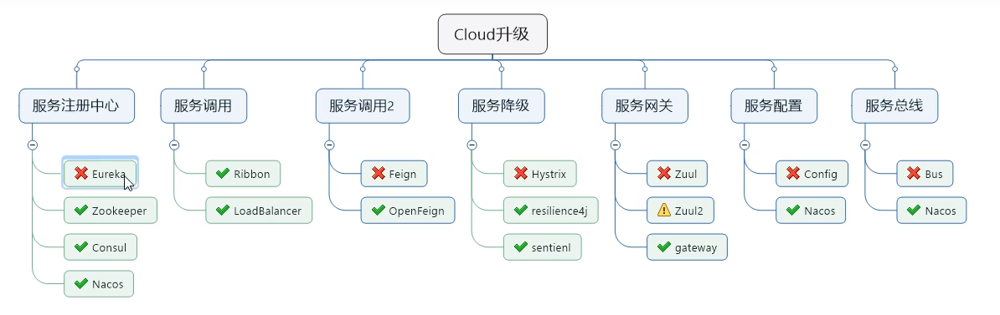

### 代码构建

约定>配置>编码


### 构建项目流程 

- 建module
- 改POM
- 写YML
- 主启动
- 业务类


注意：改POM的时候

父pom文件写了对于的版本号，如果子module里面写了版本号，则用子module的版本，如果子模块没      	写，则用父模块的版本号。


### 代码自动热部署

开发阶段，可以开，当代码很少的时候 可以开。

​	其实感觉开了这个以后，一直重启，电脑会很热。还是不要用的好。

生产环境，热部署不可以开。

代码重新修改以后，系统会重启

- 在子工程pom中添加依赖：

```xml
<!--热部署 当项目启动页以后 会重新启动系统-->
<dependency>
    <groupId>org.springframework.boot</groupId>
    <artifactId>spring-boot-devtools</artifactId>
    <scope>runtime</scope>
    <optional>true</optional>
</dependency>
```

- 在父工程pom中添加一个插件：

```xml
<!--添加热部署以后 添加了一个插件-->
    <build>
        <plugins>
            <plugin>
                <groupId>org.springframework.boot</groupId>
                <artifactId>spring-boot-maven-plugin</artifactId>
                <configuration>
                    <fork>true</fork>
                    <addResources>true</addResources>
                </configuration>
            </plugin>
        </plugins>
    </build>
```

- 然后修改设置 compiler  ABCD


- ctrl+ shift + alt  + /

  

  下面这几个打钩：


- 然后重启idea


### 消费

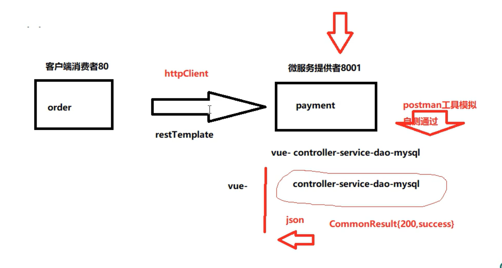

restTemplate的官方文档：

```
https://docs.spring.io/spring-framework/docs/5.2.2.RELEASE/javadoc-api/org/springframework/web/client/RestTemplate.html
```


## Eureka服务注册与发现

### 单机Eureka

Eureka模块 要导入依赖，注意这里是server

```xml
<!-- eureka-server 这里引入的是server 其他地方引入的是client-->
<dependency>
    <groupId>org.springframework.cloud</groupId>
    <artifactId>spring-cloud-starter-netflix-eureka-server</artifactId>
</dependency>
```

主启动要加注解@EnableEurekaServer

```java
@SpringBootApplication
@EnableEurekaServer   //代表这里就是服务注册中心
public class EurekMain7001 {
	public static void main(String[] args) {
		SpringApplication.run(EurekMain7001.class,args);
	}
}
```


而需要注册进Eureka的模块需要导入的依赖是 client

```xml
<!--eureka client 这里引入的是client-->
<dependency>
    <groupId>org.springframework.cloud</groupId>
    <artifactId>spring-cloud-starter-netflix-eureka-client</artifactId>
</dependency>
```

消费者这边需要给主启动添加@EnableEurekaClient

```java
@SpringBootApplication
@EnableEurekaClient  //Eureka 客户端
public class PaymentMain8001 {
    public static void main(String[] args) {
        SpringApplication.run(PaymentMain8001.class,args);
    }
}
```


将注册中心启动以后，消费注册进注册中心以后，显示的名字就是yml里面配置的名字 

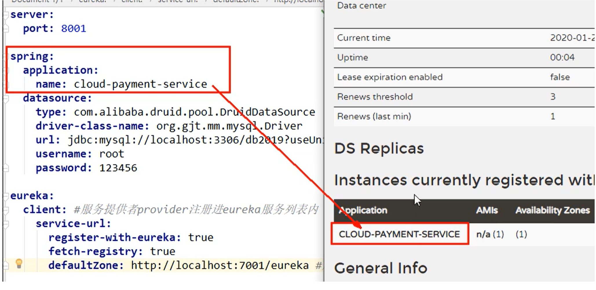


### 集群Eureka搭建和部署

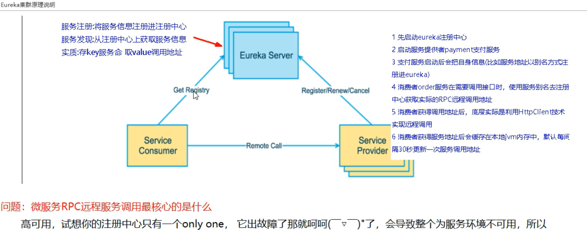


一句话概括 ： 互相守望，相互注册。	

需要在C盘搭建host中 加这个

C:\Windows\System32\drivers\etc

```
####### --------------------------SpringCloud-----------------------------

#配置eureka集群 这里是两台 要是三台往下面加就好
127.0.0.1   eureka7001.com
127.0.0.1   eureka7002.com
```


Eureka集群三个的话,在defaultzone 下面 设置两个 ，中间逗号隔开

```yml
eureka:
  instance:
    hostname: eureka7001.com #eureka服务端的实例名称
  client:
    # false表示不向注册中心注册自己(物业公司不向自己收费 当然想收也可以) 
    register-with-eureka: false
    # false表示自己端就是注册中心,我的职责就是维护服务实例,并不需要检索服务
    fetch-registry: false
    service-url:
      # 设置与Eureka Server交互的地址查询服务和注册服务都需要依赖这个地址
      # 相互注册 如果是三台机器，这个后面逗号分开 写另一个的地址 
      defaultZone: http://eureka7002.com:7002/eureka/,http://eureka7003.com:7003/eureka/

```


配置好了的话，是这个样子的

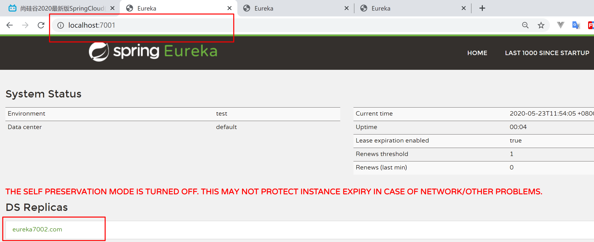


集群搞好了以后，启动顺序有讲究。需要先启动Eureka集群，两个都要启动，然后启动payment，然后启动消费者。


### 服务提供者集群

原来的8001，现在再加8002

application.yml 里面的 配置文件 端口改成8002

项目启动成功以后，注册中心服务提供者里面有两个服务。

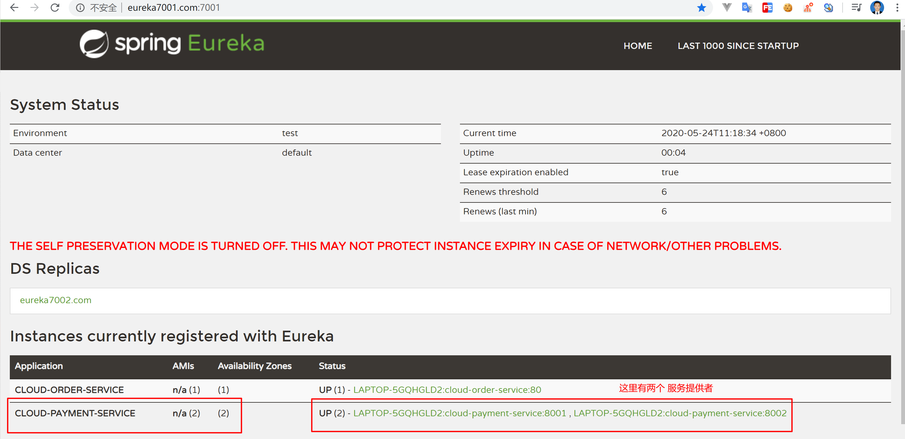


虽然配置好了服务提供者，但是消费者在调用服务提供者的时候，有个bug，

要想让服务提供者起到负载均衡的作用，需要配置一下这里的这个地址不能写死，需要写上注册中心的地址

```java
public static final String PAYMENT_URL = "http://CLOUD-PAYMENT-SERVICE";

```

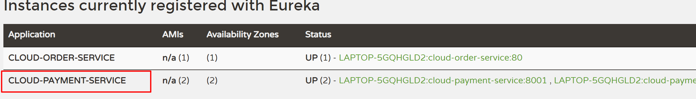

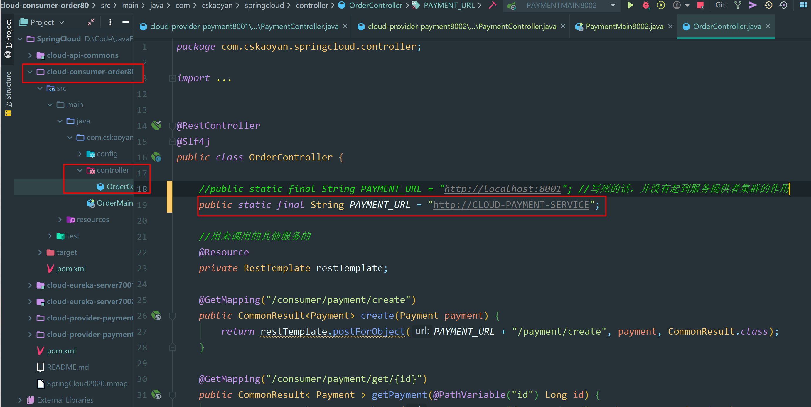


使用@LoadBalanced注解赋予RestTemplate负载均衡的能力

```java
@Configuration
public class ApplicationContextConfig {

    //将这个注入到容器中，用来调用其他
    @Bean
    @LoadBalanced  //负载均衡注解 不然找不到服务提供者
    public RestTemplate getRestTemplate() {
        return  new RestTemplate();
    }
}

```

加了这个注解以后，每次启动都会负载均衡啦，8001和8002端口会轮询调用。

现在的架构：

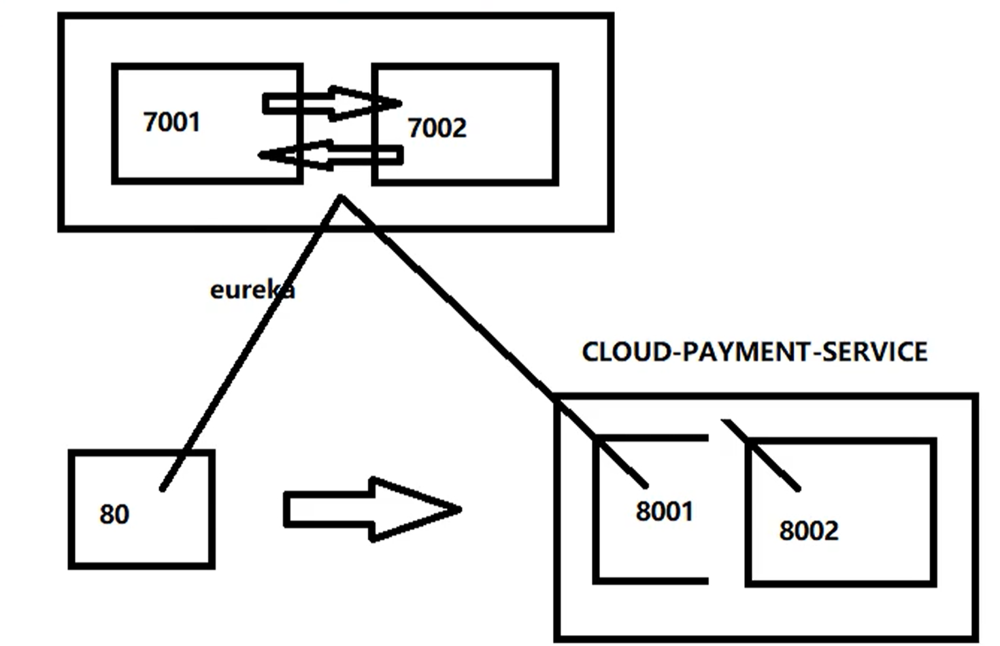

### 完善

在payment8001，和payment8002里面application.yml 加了

```yml
instance:
	instance-id: payment8002

```

这样的话 在注册中心 就可以看到  名称发生了变化

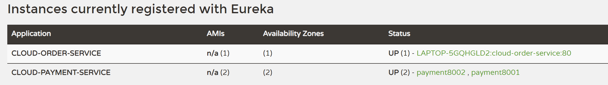


这里可以查看每个服务的健康状况 

```java
http://localhost:8001/actuator/health   //这个地址

```

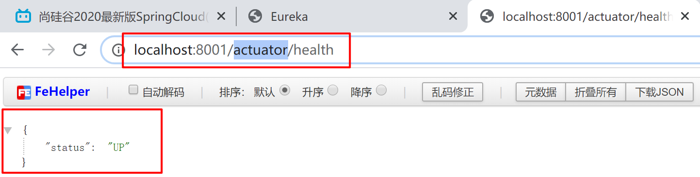


访问地址可以查看IP ，需要在application下面加这一句

```yml
instance:
    instance-id: payment8001
    prefer-ip-address: true #访问路径可以显示ip

```

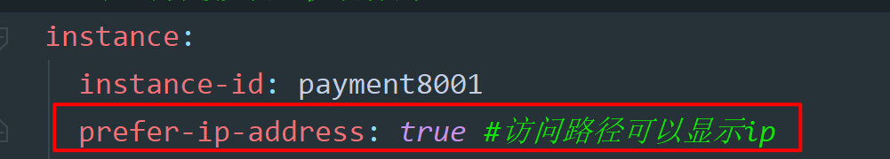


### 服务发现discover

在controller里面重新写了个方法 ，写好方法，然后调用，会将两个服务名字打印出来。

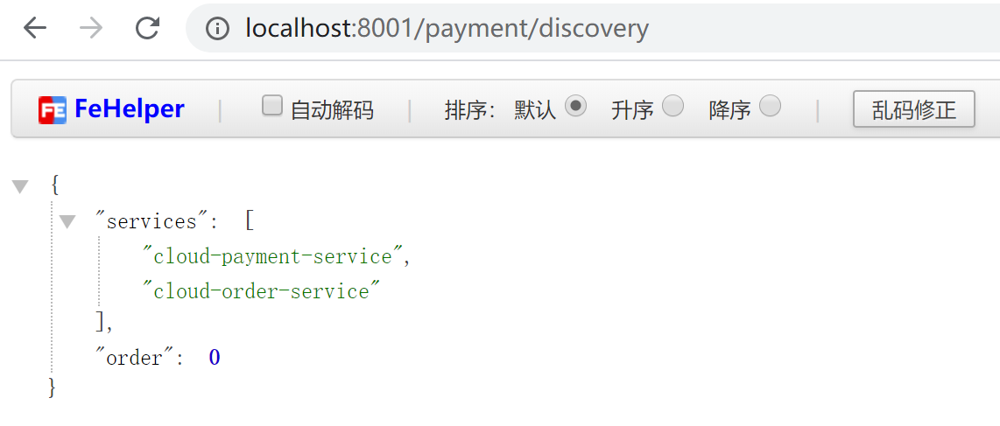

### Eureka自我保护

某时刻某一个微服务不可用了，Eureka不会立即清理，依旧会对该微服务的信息进行保存。

通俗举例子就是：因为疫情，如果你没交物业费，物业公司不会立即将你清退，迟几天交也行。


这是一种高可用的设计思想，如果出现网络延时，心跳暂时没有收到，也不会立即停止。


这就是把自我保护机制关掉以后：公司这个就是关掉的。

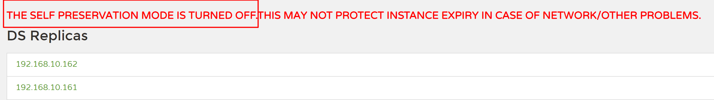


## Zookeeper服务注册与发现

### zookeeper注册中心

首先在linux上面部署zookeeper，在安全组里面开放2181端口。


如果在虚拟机中的CentOS里面安装zookeeper的话，需要双方可以ping通，同时要关闭虚拟机的防火墙。


### 服务提供者

启动项目发现 有时候会报错 

因为框架原来带来一个zookeeper包，版本是

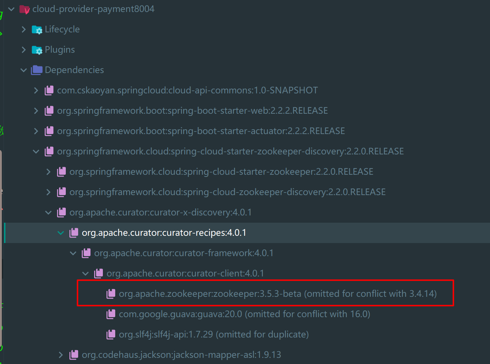


需要排除框架里面的版本：

```xml
<!--SpringBoot整合Zookeeper客户端-->
<dependency>
    <groupId>org.springframework.cloud</groupId>
    <artifactId>spring-cloud-starter-zookeeper-discovery</artifactId>
    <exclusions>
        <!--先排除自带的zookeeper3.5.3-->
        <exclusion>
            <groupId>org.apache.zookeeper</groupId>
            <artifactId>zookeeper</artifactId>
        </exclusion>
    </exclusions>
</dependency>
```


启动完成项目以后 

可以在阿里云服务器上面看一下,如果是下面这样 说明注册成功啦。

```
ls /
[services,zookeeper]
```


```
ls /services
[cloud-provider-payment]
```

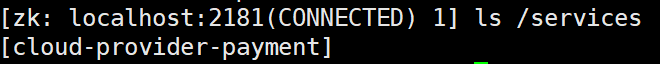

服务器访问这个 出现下面这个 就算成功啦

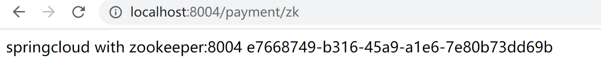

还可以访问里面：可以看到流水号

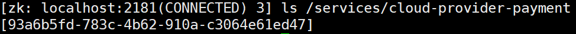


还可以继续往下操作：

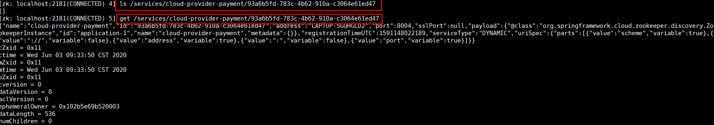


中间的那一部分json串，格式化以后是这样的：

```json
{"name":"cloud-provider-payment","id":"93a6b5fd-783c-4b62-910a-c3064e61ed47","address":"LAPTOP-5GQHGLD2","port":8004,"sslPort":null,"payload":{"@class":"org.springframework.cloud.zookeeper.discovery.ZookeeperInstance","id":"application-1","name":"cloud-provider-payment","metadata":{}},"registrationTimeUTC":1591148022189,"serviceType":"DYNAMIC","uriSpec":{"parts":[{"value":"scheme","variable":true},{"value":"://","variable":false},{"value":"address","variable":true},{"value":":","variable":false},{"value":"port","variable":true}]}}

```


```json
{
    "name":"cloud-provider-payment",
    "id":"93a6b5fd-783c-4b62-910a-c3064e61ed47",
    "address":"LAPTOP-5GQHGLD2",
    "port":8004,
    "sslPort":null,
    "payload":{
        "@class":"org.springframework.cloud.zookeeper.discovery.ZookeeperInstance",
        "id":"application-1",
        "name":"cloud-provider-payment",
        "metadata":{
        }
    },
    "registrationTimeUTC":1591148022189,
    "serviceType":"DYNAMIC",
    "uriSpec":{
        "parts":[
            {
                "value":"scheme",
                "variable":true
            },
            {
                "value":"://",
                "variable":false
            },
            {
                "value":"address",
                "variable":true
            },
            {
                "value":":",
                "variable":false
            },
            {
                "value":"port",
                "variable":true
            }]
    }
}
```


zookeeper 上面注册的节点是临时的，当吧8004服务关闭以后，过一会，zookeeper上面的注册没有啦，所以是临时的。

zookeeper算是渣男类型，他没有Eureka那样温情脉脉，还会等你。zookeeper相对无情一点，你关掉服务，他就会把你清理掉。


### 服务消费者

启动orderZK80  可以看到zookeeper上面有  新启动的服务消费者

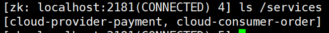


经过测试 可以调用服务消费者

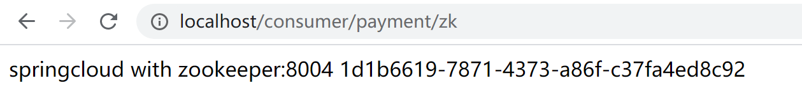

这里没有讲zookeeper部署集群，部署集群其实在后面加一个逗号，然后写另一个zookeeper就好。

主要的是后面的技术。


## Consul服务注册与发现 

学到这里学一下 docker 看一下 部署是否方便许多 

这里跳过啦，具体项目中如果用到的话，再学。

https://www.bilibili.com/video/BV18E411x7eT?p=32 


### 三个注册中心异同点：

CAP
		C：Consistency(强一致性)    数据必须一致，不一致就会报错
		A：Availability（可用性）
		P：Partition tolerance（分区容错性）  这个是一定要满足的一个
		CAP理论关注粒度是数据，而不是整体系统设计
经典CAP图
		AP(Eureka)   好死不如赖活着。只要可以用，出一点错没关系。
		CP(Zookeeper/Consul)   测试发现Zookeeper，心跳如果找不到，马上剔除。


老师举例子说的，一般系统先要保证可用，也就是先保证A，然后再用其他技术，什么柔性事务什么的，恢复数据不一致的问题。


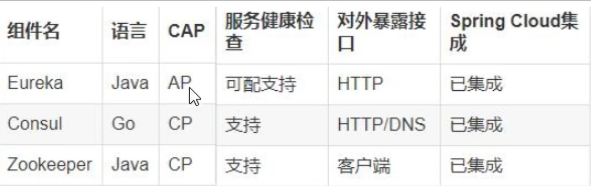


## Ribbon负载均衡服务调用

### 概述

这个负载均衡是进程内负载均衡。Nginx是服务器端负载均衡。


意思是什么呢？

就是说，比如你要进医院，医院为了避免人多，弄了10个分院，Nginx就干这个事情，他先把人按照一定比例分到十个医院，负载均衡。

而进去医院以后，每个医院人还是很多，还需要根据科室进行负载均衡（比如口腔科十个医生，怎么分开），每个科室怎么分，这就是Ribbon干的事情。


#### 一句话就是

负载均衡+RestTemplate调用


### Ribbon负载均衡演示

使用的时候 不用引入依赖。因为Eureka里面集成了ribbon。


打开order80，看导入的依赖，发现Eureka原来的里面已经继承了ribbon

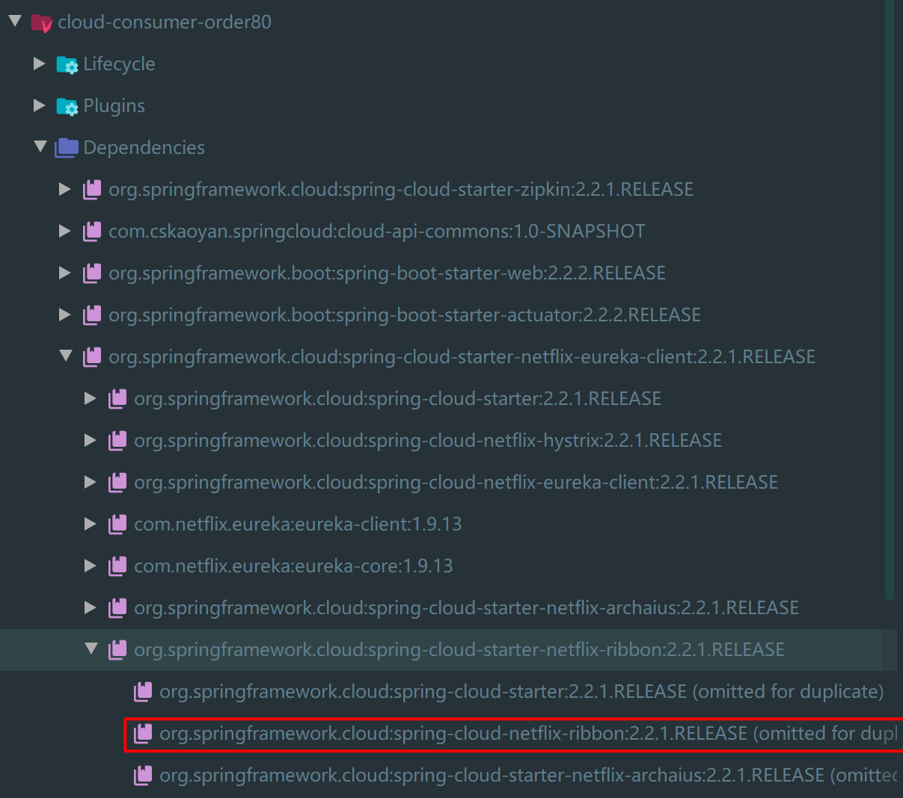


在order80的controller中加了接口，调用就是这个样子的：

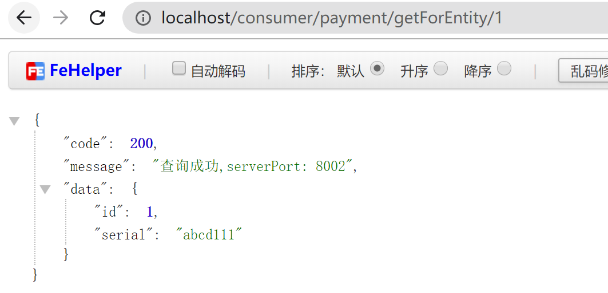


### Ribbon核心组件IRuleige

#### IRule 有七个

系统默认的是轮询的 


根据特定算法中从服务列表中选择一个要访问的服务
	com.netflix.loadbalancer.RoundRobinRule
		轮询
	com.netflix.loadbalancer.RandomRule
		随机
	com.netflix.loadbalancer.RetryRule
		先按照RoundRobinRule的策略获取服务，如果获取服务失败则再指定时间内重试，获取可用服务
	WeightResponseTimeRule
		对RoundRobinRule的扩展，响应速度越快的实例选择权重越大
	BestAvailableRule
		会先过滤掉由于多次访问故障而处于断路器跳闸状态的服务，然后选择一个并发量最小的服务
	AvailabilityFilterRule
		先过滤掉故障实例，再选择并发较小的实例
	ZoneAvoidanceRule
		默认规则，复合判断server所在区域的性能和server的可用性选择服务器


#### 替换

在替换的时候，有一个需要注意的：

就是不能放在@ComponentScan注解可以扫描的地方


也就是需要在外边新建立一个包，就是这个样子的。

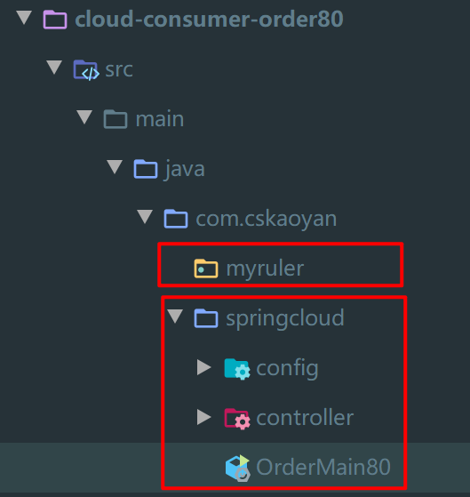


```java
package com.cskaoyan.myruler;

import com.netflix.loadbalancer.IRule;
import com.netflix.loadbalancer.RandomRule;
import org.springframework.context.annotation.Bean;
import org.springframework.context.annotation.Configuration;

/**
 * @author Steve
 * @date 2020/6/12-15:59
 */
@Configuration
public class MySelfRule {
	
	@Bean
	public IRule myRule(){ 
		return new RandomRule(); //定义为随机 
	}
}

```

将轮询改成随机，同时在主启动类上面加注解：

```java
@RibbonClient(name = "CLOUD-PAYMENT-SERVICE", configuration = MySelfRule.class)

```


```java
package com.cskaoyan.springcloud;

import com.cskaoyan.myruler.MySelfRule;
import org.springframework.boot.SpringApplication;
import org.springframework.boot.autoconfigure.SpringBootApplication;
import org.springframework.cloud.netflix.eureka.EnableEurekaClient;
import org.springframework.cloud.netflix.ribbon.RibbonClient;

@EnableEurekaClient
@SpringBootApplication
@RibbonClient(name = "CLOUD-PAYMENT-SERVICE", configuration = MySelfRule.class)
public class OrderMain80 {
	public static void main(String[] args) {
		SpringApplication.run(OrderMain80.class, args);
	}
}

```


这样的话 测试 结果就是随机的：


### Ribbon负载均衡算法

#### 原理

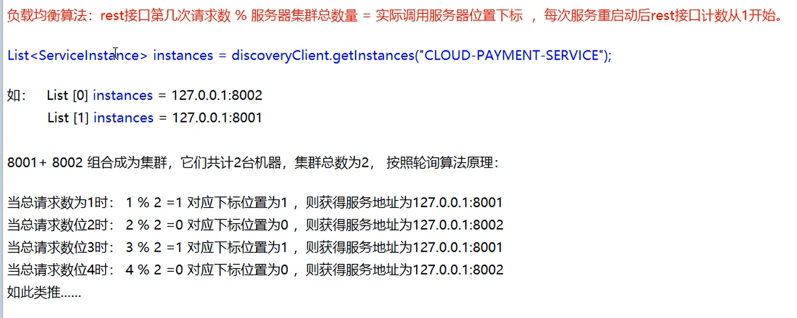


负载均衡算法：rest接口第几次请求数 % 服务器集群总数量 = 实际调用服务器位置下标，每次服务重启后rest接口技术从1开始。

```java
//假如现在有两台进行负载均衡 具体请求那一台？ 通过下面算出来的 

1 % 2 = 1  ---->  index = 1  list.get(incdex);
2 % 2 = 1  ---->  index = 0  list.get(incdex);
3 % 2 = 1  ---->  index = 1  list.get(incdex);

```


#### 源码

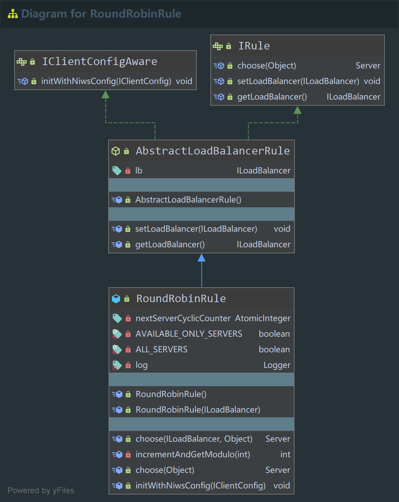

这个类里面有基本的是基本的轮询

```java
/*
 *
 * Copyright 2013 Netflix, Inc.
 *
 * Licensed under the Apache License, Version 2.0 (the "License");
 * you may not use this file except in compliance with the License.
 * You may obtain a copy of the License at
 *
 * http://www.apache.org/licenses/LICENSE-2.0
 *
 * Unless required by applicable law or agreed to in writing, software
 * distributed under the License is distributed on an "AS IS" BASIS,
 * WITHOUT WARRANTIES OR CONDITIONS OF ANY KIND, either express or implied.
 * See the License for the specific language governing permissions and
 * limitations under the License.
 *
 */
package com.netflix.loadbalancer;

import com.netflix.client.config.IClientConfig;
import org.slf4j.Logger;
import org.slf4j.LoggerFactory;

import java.util.List;
import java.util.concurrent.atomic.AtomicInteger;

/**
 * The most well known and basic load balancing strategy, i.e. Round Robin Rule.
 *
 * @author stonse
 * @author Nikos Michalakis <nikos@netflix.com>
 *
 */
public class RoundRobinRule extends AbstractLoadBalancerRule {

    private AtomicInteger nextServerCyclicCounter;
    private static final boolean AVAILABLE_ONLY_SERVERS = true;
    private static final boolean ALL_SERVERS = false;

    private static Logger log = LoggerFactory.getLogger(RoundRobinRule.class);

    public RoundRobinRule() {
        nextServerCyclicCounter = new AtomicInteger(0);
    }

    public RoundRobinRule(ILoadBalancer lb) {
        this();
        setLoadBalancer(lb);
    }

    public Server choose(ILoadBalancer lb, Object key) {
        if (lb == null) {
            log.warn("no load balancer");
            return null;
        }

        Server server = null;
        int count = 0;
        while (server == null && count++ < 10) {
            List<Server> reachableServers = lb.getReachableServers();
            List<Server> allServers = lb.getAllServers();
            int upCount = reachableServers.size();
            int serverCount = allServers.size();

            if ((upCount == 0) || (serverCount == 0)) {
                log.warn("No up servers available from load balancer: " + lb);
                return null;
            }

            int nextServerIndex = incrementAndGetModulo(serverCount);
            server = allServers.get(nextServerIndex);

            if (server == null) {
                /* Transient. */
                Thread.yield();
                continue;
            }

            if (server.isAlive() && (server.isReadyToServe())) {
                return (server);
            }

            // Next.
            server = null;
        }

        if (count >= 10) {
            log.warn("No available alive servers after 10 tries from load balancer: "
                    + lb);
        }
        return server;
    }

    /**
     * Inspired by the implementation of {@link AtomicInteger#incrementAndGet()}.
     *
     * @param modulo The modulo to bound the value of the counter.
     * @return The next value.
     */
    private int incrementAndGetModulo(int modulo) {
        for (;;) {
            int current = nextServerCyclicCounter.get();
            int next = (current + 1) % modulo;
            if (nextServerCyclicCounter.compareAndSet(current, next))
                return next;
        }
    }

    @Override
    public Server choose(Object key) {
        return choose(getLoadBalancer(), key);
    }

    @Override
    public void initWithNiwsConfig(IClientConfig clientConfig) {
    }
}


```


源码里面：

```java
if ((upCount == 0) || (serverCount == 0)) {
    log.warn("No up servers available from load balancer: " + lb);
    return null;
}

```

upCound 这里指的就是 Eureka 网页上面的，只有这里将服务注册进容器里面，才会有后续的2操作。

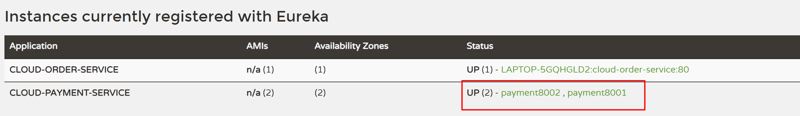


```java
/**
     * Inspired by the implementation of {@link AtomicInteger#incrementAndGet()}.
     *
     * @param modulo The modulo to bound the value of the counter.
     * @return The next value.
     */
private int incrementAndGetModulo(int modulo) {
    for (;;) {
        int current = nextServerCyclicCounter.get();
        int next = (current + 1) % modulo;
        if (nextServerCyclicCounter.compareAndSet(current, next)) //比较并交换，自旋锁 CAS
            return next;
    }
}

```


#### 手写一个负载算法

原理 + JUC （CAS + 自旋锁的复习）


首先去掉原来的order80  config里面的@LoadBalance的  这个注解，避免这个注解影响自己写的负载，


**在MyLB 类上面加一个注解   @component**                                                                        

1、@controller 控制器（注入服务）

2、@service 服务（注入dao）

3、@repository dao（实现dao访问）

4、@component （把普通pojo实例化到spring容器中，相当于配置文件中的<bean id="" class=""/>）

参考： https://www.cnblogs.com/lyjing/p/8427832.html


## OpenFeign服务接口调用

### 概况

#### 是什么

Feign是一个声明式的Web服务客户端，让编写Web服务客户端变得非常容易，**只需创建一个接口并在接口上申明注解**。


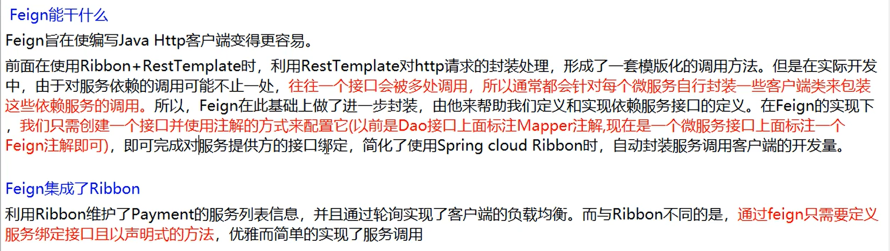


### OpenFeign使用步骤

#### 接口+注解

微服务调用接口+@FeignClient


#### 步骤

pom->yml->主启动->业务类->测试


#### 小总结

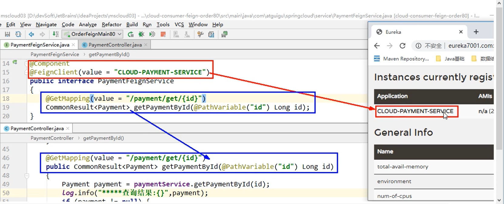


### OpenFeign超时控制

OpenFeign默认超时控制是1秒钟，如果在这之内请求不到就会报请求超时。

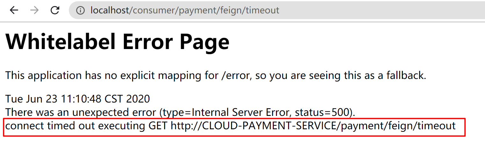


为了使OpenFeign默认时间长一点，需要在application.yml  中添加配置

```yml
#设置feign客户端超时时间（OpenFeign默认支持ribbon）
ribbon:
  #指的是建立连接所用的时间，适用于网络状况正常的情况下，两端连接所用的实际
  ReadTimeout: 5000
  #指的是建立连接后从服务器读取到可用资源所用的时间
  ConnectTimeout: 5000
```

这样的话就可以访问的到啦

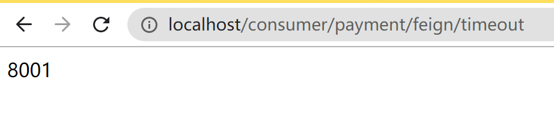

### OpenFeign日志打印功能

#### 日志级别


注意这里一定是类对应的包，不用自己写，复制

```yml
logging:
  level:
    #feign日志以什么级别监控那个接口   以dubug的形式打印full全日志
    com.cskaoyan.springcloud.service.PaymentFeignService: debug

```


## Hystrix断路器（服务降级）

发音：海思拽克斯

阳哥学习三板斧：理论 + 实操 + 小总结

### 概述

#### 分布式系统所面临的问题

服务雪崩


#### 是什么

基本介绍


### Hystrix重要概念

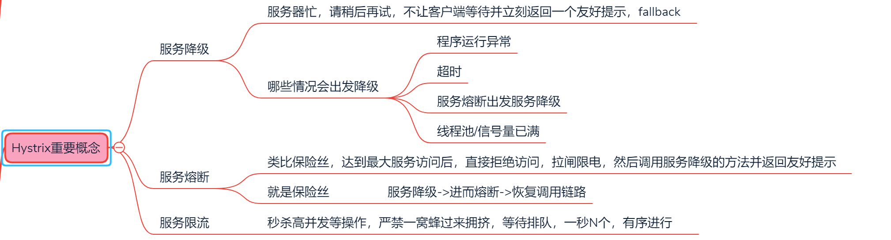


#### 服务降级 fallback

@PathVariable是spring3.0的一个新功能：接收请求路径中占位符的值，代码中用到这个注解


##### 服务降级指的是

服务器忙，请稍后重试，不让客户等待，并返回一个友好界面


##### 通常会出现降级的几种情况

- 程序运行异常
- 超时
- 服务熔断触发服务降级
- 线程池/信号已满


#### 服务熔断 break

类似于保险丝，当达到最大访问后，直接拒绝访问，拉闸限电，返回友好提示


#### 服务限流 flowlimit

秒杀高并发操作，严禁一窝蜂过来拥挤，等待排队，一秒N个，有序进行。


### Hystrix案例

#### 构建 cloud-provider-hystrix-payment8001

pom--yml--主启动--业务类--正常测试


##### 注意

还有一个，Hystrix里面的原理好像是利用tomcat的多线程，如果请求很多事是会消耗完tomcat里面的线程的。


#### 高并发测试

用 Jmeter直接弄20000个请求打payment8001，看两个方法怎么样。

测试结果是，请求确实慢了很多。


这里还有涉及到Jmeter的下载，安装，使用等。在笔记微服务秒杀里面。 

#### 故障现象和导致原因

8001同一个层次的其他服务被困死，因为tomcat线程池里面的工作线程已经被挤占完毕。

80此时调用8001，客户端访问缓慢，转圈圈。


#### 上诉结论

正因为有上诉故障或不佳表现，才有我们的降级/容错/限流等技术诞生


#### 如何解决？解决要求


#### 服务降级

##### 服务端8001 降级fallback

在业务类使用注解@HystrixCommand，设定红线为三分钟，如果时间到了还没有返回结果，则调用下面兜底方法。

```java
@HystrixCommand(fallbackMethod = "paymentInfo_TimeOutHandler", commandProperties = {
			@HystrixProperty(name = "execution.isolation.thread.timeoutInMilliseconds",value = "3000") //画定好红线三秒钟，超过三秒钟走下面的
	})
	public String paymentInfo_TimeOut(Integer id) {
		int timeNumber = 3;
		try {
			TimeUnit.SECONDS.sleep(timeNumber);
		} catch (Exception e) {
			e.printStackTrace();
		}
		return "线程池：" + Thread.currentThread().getName() + "  paymentInfo_TimeOut,id: " + id + "\t" + "(^-^)" + " 耗时：" + timeNumber + "秒";
	}

	/**
	 * 上面出问题啦 下面这个方法替你兜底
	 *
	 * @param id
	 * @return
	 */
	public String paymentInfo_TimeOutHandler(Integer id) {
		return "线程池：" + Thread.currentThread().getName() + "  paymentInfo_TimeOutHandler,id: " + id + "\t" + "o(╥﹏╥)o";
	}

```


同时主启动还需要加注解：

```java
@EnableCircuitBreaker  //Circuit 代表回路的意思

```


启动Eureka和payment8001，测试结果如下：返回服务降级信息

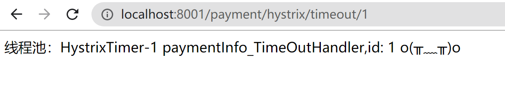

经过测试，如果将业务类中代码换成异常 10/0 ，代码也是会做服务降级的。 


##### 客户端80 降级 

一般服务降级是用到客户端的。

application中需要加这个   只加下面这几种

```yml
#原来老师的代码写的是下面这个 会出问题 客户端不管怎样都是兜底方法 加了下面ribbon超时 就可以啦
#feign:
#  hystrix:
#    enabled: true

#设置feign客户端超时时间（OpenFeign默认支持ribbon）
ribbon:
  #指的是建立连接所用的时间，适用于网络状况正常的情况下，两端连接所用的实际
  ReadTimeout: 5000
  #指的是建立连接后从服务器读取到可用资源所用的时间
  ConnectTimeout: 5000

```


在业务类中：

```java
@GetMapping("/consumer/payment/hystrix/timeout/{id}")
	@HystrixCommand(fallbackMethod = "paymentInfo_TimeOutFallbackMethod", commandProperties = {
			@HystrixProperty(name = "execution.isolation.thread.timeoutInMilliseconds", value = "1500") //画定好红线三秒钟，超过三秒钟走下面的
	})
	public String paymentInfo_Timeout(@PathVariable("id") Integer id){
		String result = paymentHystrixService.paymentInfo_Timeout(id);
		return  result;
	}
	
	public String paymentInfo_TimeOutFallbackMethod(@PathVariable("id") Integer id) {
		return "我是消费者80，对方支付系统繁忙请10秒钟后再试或者自己运行出错请检查自己，o(╥﹏╥)o";
	}
```


主启动中：

```java
@EnableHystrix
```


经过测试发现，如果是服务端有问题降级的话，也会报客户端这个错误，

如果是客户端里面的方法有问题的话，就是客户端自己这个兜底错误


-

##### 设置全局服务降级


#### 服务熔断


#### 服务限流


### Hystrix工作流程


### 服务监控Hystrix Dashboard


## Zuul路由网关 

 这个现在公司没用 用到再学


## Gateway新一代网关

### 概述简介

#### 官网

Spring官网上面的描述：https://cloud.spring.io/spring-cloud-gateway/2.2.x/reference/html/	


#### 是什么

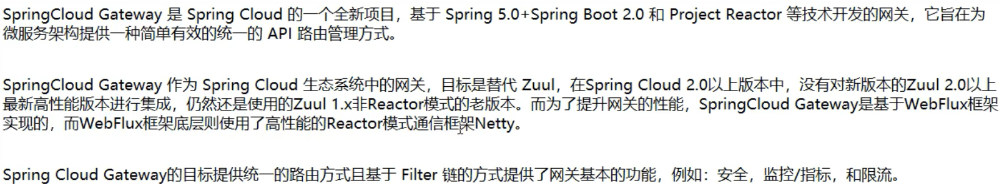

​	

#### 能干什么

反向代理，鉴权，流量控制，熔断，日志监控


#### 微服务中网关用在哪里

Spring官网这个图

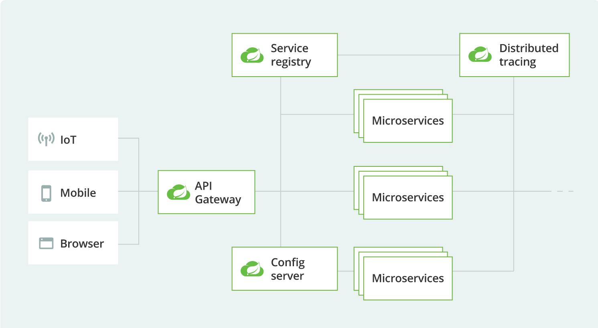

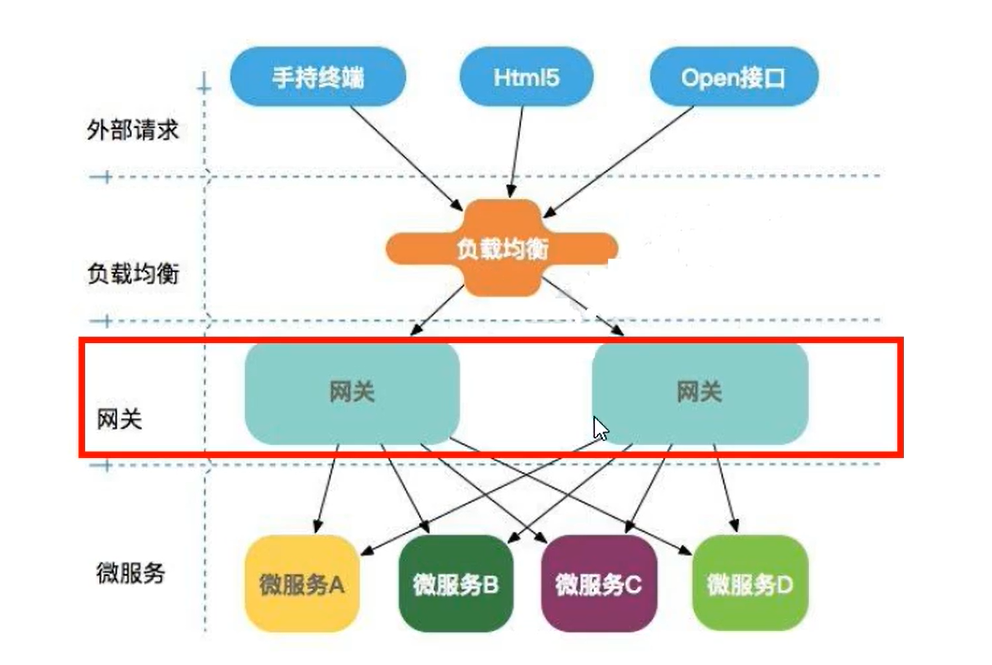


#### 有了zuul怎么又出来了gateway

##### 我们为什么要选择gateway？

###### zuul2.0x 一直不发布 不靠谱

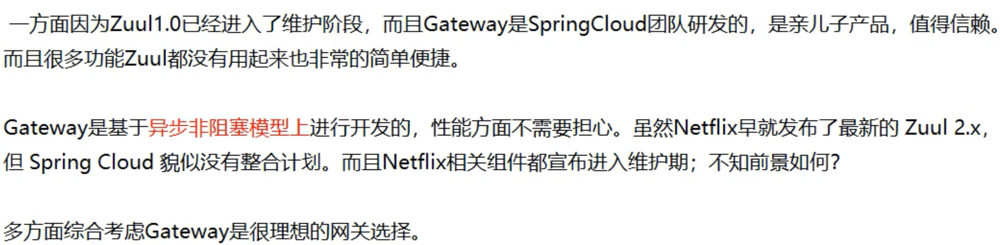

###### Spring gateway 新特性

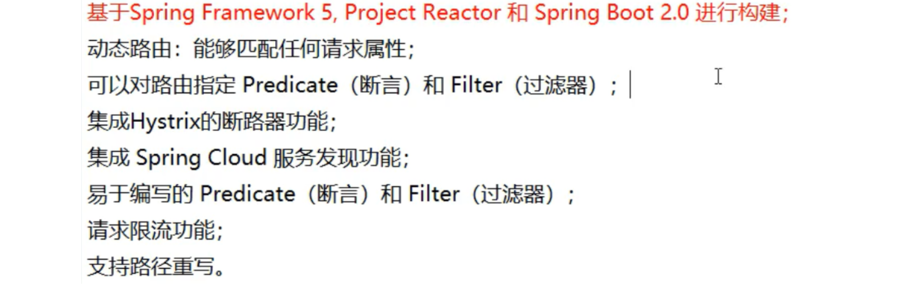

###### SpringCloud Gateway 与 Zuul的区别

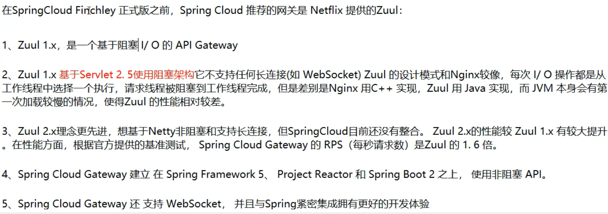

第五个里面有WebSocket 阳哥说 这是长连接


##### zuul 1.0模型

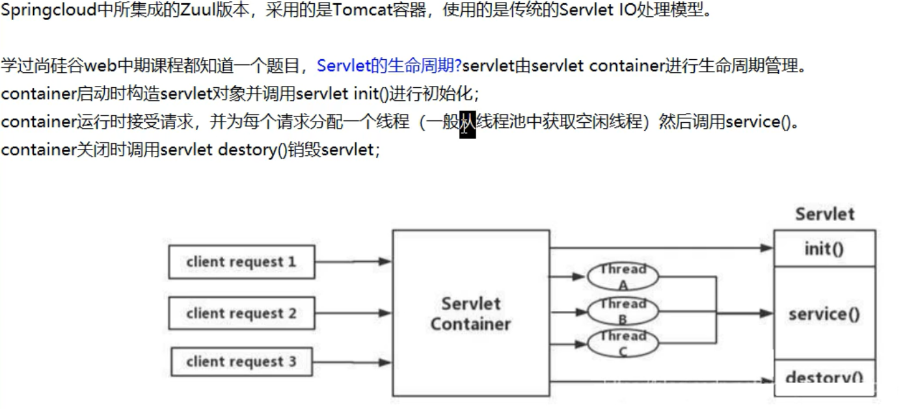

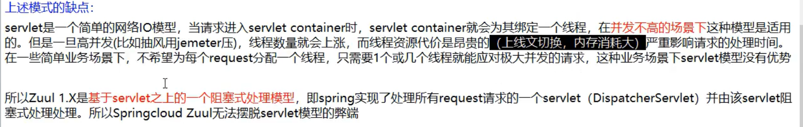

##### GateWay模型

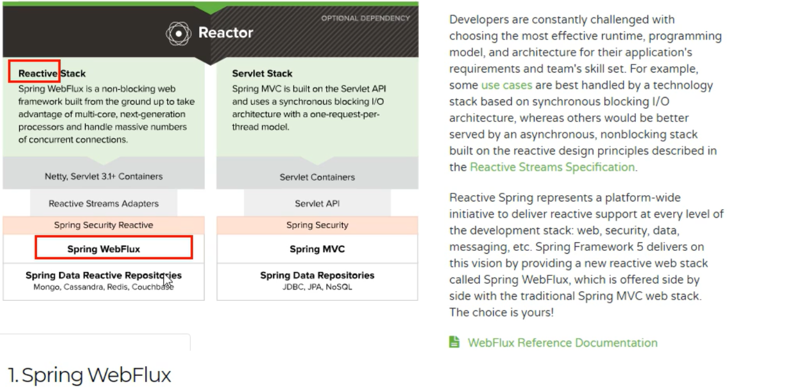

https://docs.spring.io/spring/docs/current/spring-framework-reference/web-reactive.html

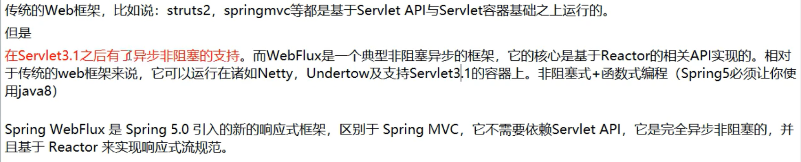


出场就是异步非阻塞，说白了就是Spring GateWay更牛逼


### 三大核心概念

举个栗子，你要找公司，

首先路由 告诉你在10号楼6楼，

然后断言来判断你又没有指纹或者胸卡，就是你能不能进，

最后，过滤器，你进是进来了，但是你这个月已经迟到三回啦，你这次是第四次迟到，就需要扣工资，迟到完了交一份检查（过滤器 就是可以在请求前或者后 进行拦截）


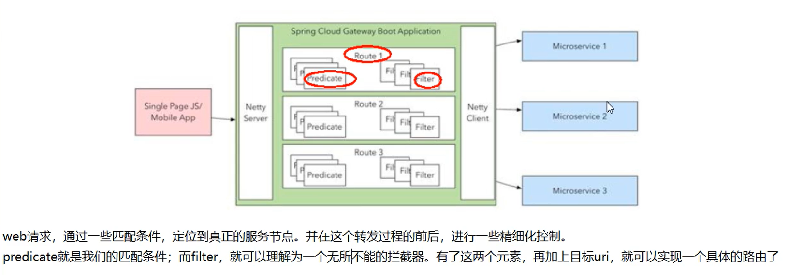

#### Route（路由）

路由是构建网关的基本模块，它由ID，目标URI,一系列的断言和过滤器组成，如果断言为true则匹配该路由

#### Predicate（断言）

参考java8的java.util.function.Predicate开发人员可以匹配HTTP请求中的所有内容（例如请求头和请求参数），如果请求与断言相匹配则进行路由

#### Filter（过滤）

指的是Spring框架中GatewayFilter的实例，使用过滤器，可以在请求被路由前或之后对请求进行修改


### Getway工作流程

#### 官网总结

官网上面的图

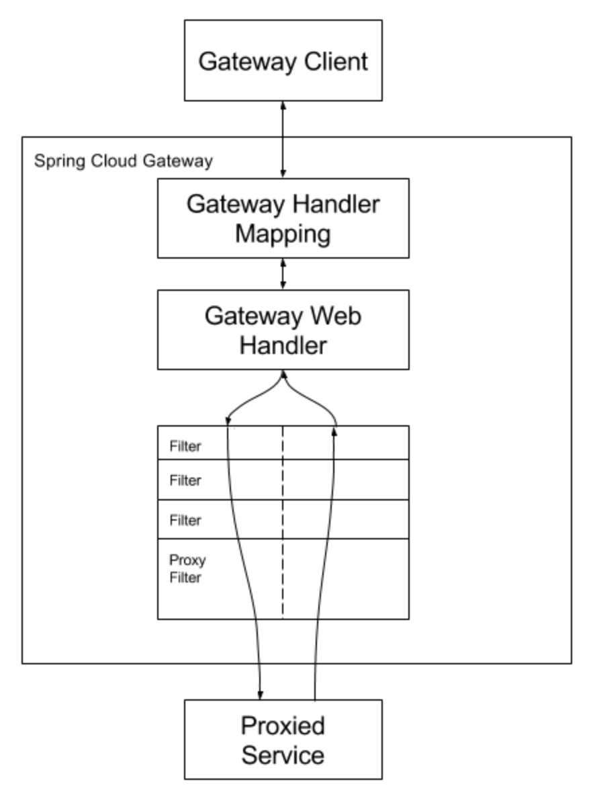

翻译： 

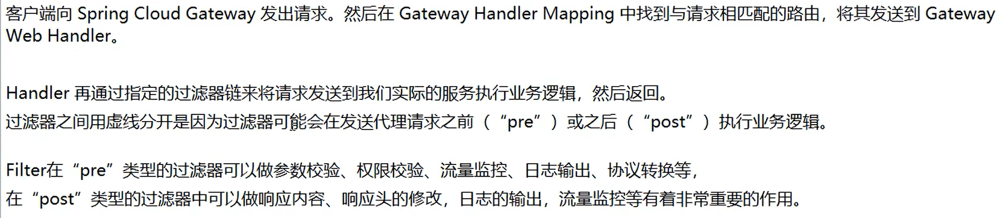


##### 核心逻辑

路由转发+执行过滤器链


### 入门配置

#### pom yml 主启动 业务类  

在gateway里面yml中：Spring cloud gateway中就是路由 可以一次配置多个路由

注释掉的是原来的静态路由，用微服务名的这种是动态路方式

```yml
server:
  port: 9527

spring:
  application:
    name: cloud-gateway
  cloud:
    gateway:
      discovery:
        locator:
          enabled: true # 开启从注册中心动态创建路由的功能，利用微服务名称进行路由
      #注意 路由是多个
      routes:
        - id: payment_route # 路由的id,没有规定规则但要求唯一,建议配合服务名
          #匹配后提供服务的路由地址  下面开启的是payment8001
          #uri: http://localhost:8001
          uri: lb://cloud-payment-service
          predicates:
            - Path=/payment/get/** # 断言，路径相匹配的进行路由

        - id: payment_route2
          #uri: http://localhost:8001
          uri: lb://cloud-payment-service
          predicates:
            - Path=/payment/lb/** #断言,路径相匹配的进行路由
            - After=2020-03-12T15:44:15.064+08:00[Asia/Shanghai]
          #- Cookie=username,eiletxie   #带Cookie，并且username的值为eiletxie
          #- Header=X-Request-Id,\d+ #请求头要有 X-Request-Id属性并且值为整数的正则表达式

eureka:
  instance:
    hostname: cloud-gateway-service
  client:
    fetch-registry: true
    register-with-eureka: true
    service-url:
      register-with-eureka: true
      fetch-registry: true
      defaultZone: http://eureka7001.com:7001/eureka

```

#### 配置了网关，开始测试

原来的接口也是可以访问的：

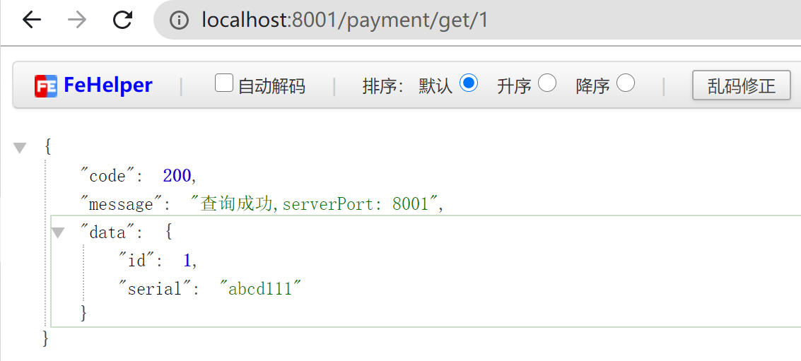

用网关访问9527也是可以的

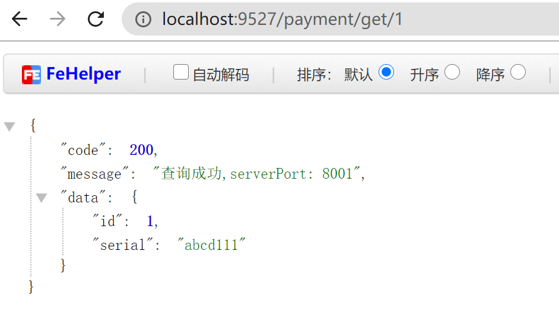

这个有一种可以隐藏原来服务端口的意思。

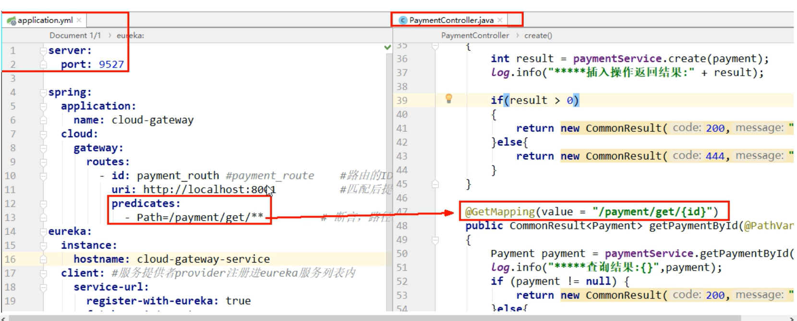

左边这个predicates是断言，判断请求路径是否正确

#### GateWay路由网关有两种配置方式

前面yml是一种。

还有一种：代码中注入RouteLocator的Bean

```java
@Configuration
public class GateWayConfig {
	/**
	 * 配置了一个id为route-name的路由规则
	 * 当访问地址 http://localhost:9527/guonei时会自动转发到地址： http://news.baidu.com/guonei
	 * @param builder
	 * @return
	 */
	@Bean
	public RouteLocator customRouteLocator(RouteLocatorBuilder builder) {
		RouteLocatorBuilder.Builder routes = builder.routes();
		routes.route("path_route_cskaoyan",     //这route里面第二个参数是java8 里面的新特性 Funaction函数
				r -> r.path("/guonei") 
						.uri("http://news.baidu.com/guonei")).build();   //这个是实际路由到的地址
		return routes.build();
	}

	@Bean
	public RouteLocator customRouteLocator2(RouteLocatorBuilder builder) {
		RouteLocatorBuilder.Builder routes = builder.routes();
		routes.route("path_route_cskaoyan",
				r -> r.path("/guoji")
						.uri("http://news.baidu.com/guoji")).build();
		return routes.build();
	}
}

```

则里面有用到lamda表达式，其中route（）函数，里面第二个参数是Java8新特性中的Funaction函数。


### 通过服务名实现动态路由

默认情况下Gateway会根据注册中心的服务列表，以注册中心上微服务名为路径创建动态路由进行转发，从而实现动态路由的功能


注意：需要注意的是uri的协议为lb，表示启用Gateway的负载均衡功能

要开启动态路由，首先上面discover里面 enable 是true

然后下面uri 后面是 lb://服务名

```yml
spring:
  application:
    name: cloud-gateway
  cloud:
    gateway:
      discovery:
        locator:
          enabled: true # 开启从注册中心动态创建路由的功能，利用微服务名称进行路由
      #注意 路由是多个
      routes:
        - id: payment_route # 路由的id,没有规定规则但要求唯一,建议配合服务名
          #匹配后提供服务的路由地址  下面开启的是payment8001
          #uri: http://localhost:8001
          uri: lb://cloud-payment-service
          predicates:
            - Path=/payment/get/** # 断言，路径相匹配的进行路由

        - id: payment_route2
          #uri: http://localhost:8001
          uri: lb://cloud-payment-service
          predicates:
            - Path=/payment/lb/** #断言,路径相匹配的进行路由
            - After=2020-03-12T15:44:15.064+08:00[Asia/Shanghai]
          #- Cookie=username,eiletxie   #带Cookie，并且username的值为eiletxie
          #- Header=X-Request-Id,\d+ #请求头要有 X-Request-Id属性并且值为整数的正则表达式

```

动态路由配置好了以后  调用这个方法，就会出现负载均衡。

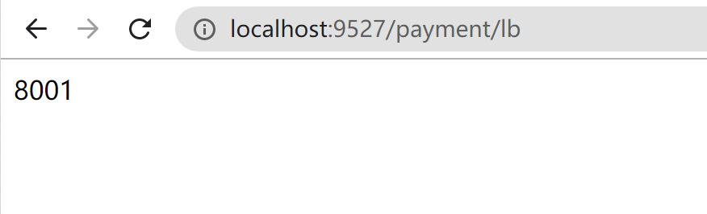

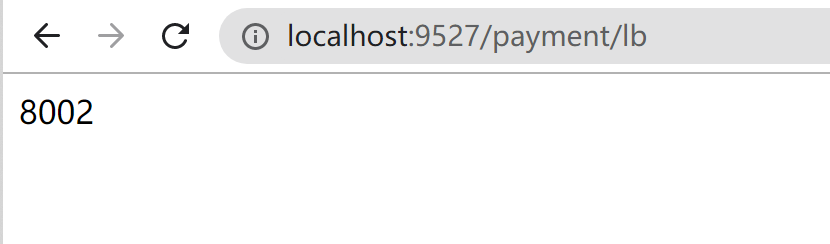


### Predicate的使用

#### 是什么

#### Route Predicate Factories 这个是什么东东？

Spring Cloud GateWay 官网文档

https://cloud.spring.io/spring-cloud-gateway/2.2.x/reference/html/#gateway-request-predicates-factories

#### 常用的Route Predicate

##### 1、After Route Predicate

下面设置了时间，获取时间在代码是test里T2中 ，时间没到，接口就执行不了

```yml
predicates:
   - Path=/payment/lb/** #断言,路径相匹配的进行路由
   - After=2020-07-02T16:11:57.895+08:00[Asia/Shanghai]

```

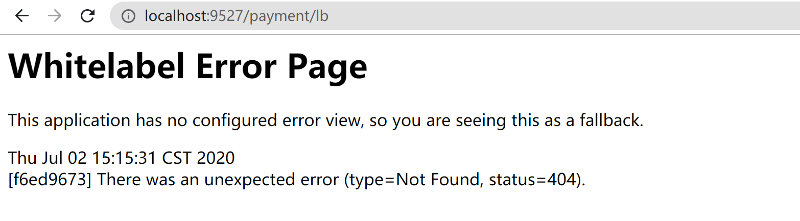

##### 2、Before Route Predicate

##### 3、Between Route Predicate

前三个都是时间级别的

##### 4、Cookie Route Predicate

一般的测试请求有三种：

1 jmeter

2 postman

3 curl   这个相当于命令版的postman

这三种方式都可以进行测试。

这里用curl进行测试 

```yml
predicates:
    - Path=/payment/lb/** #断言,路径相匹配的进行路由
    - After=2020-07-02T15:11:57.895+08:00[Asia/Shanghai]
    - Cookie=username,HappeSnail   #带Cookie，并且username的值为HappeSnail
```

在cmd里面测试或者在cmder里面测试

```shell
curl http://localhost:9527/payment/lb    //不带cookie
curl http://localhost:9527/payment/lb --cookie "username=HappeSnail"   //带cookie
```

如果没带cookie 会报错 404

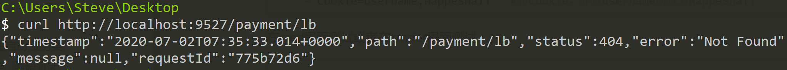

如果带了cookie就不会报错

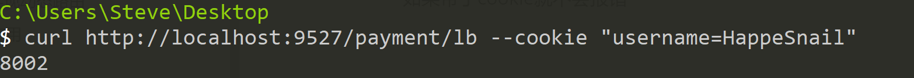


##### 5、 Header Route Predicate

```yml
predicates:
    - Path=/payment/lb/** #断言,路径相匹配的进行路由
	- Header=X-Request-Id,\d+  #请求头要有 X-Request-Id属性并且值为整数的正则表达式 后面的 \d+ 是正则表达式 表示整数
```


```shell
curl http://localhost:9527/payment/lb -H "X-Request-Id:123"
```

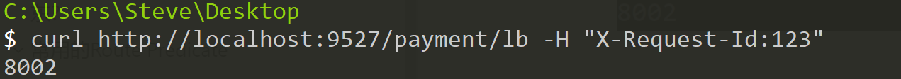

如果输入的是负数呢？肯定会报错

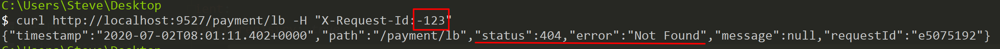

##### 6、 Host Route Predicate

##### 7、 Method Route Predicate

##### 8、 Path Route Predicate

##### 9、Query  Route Predicate

后面几种，有时间自己试一试


### Filter的使用

#### GatewayFilter 单一的过滤器

Spring 官网 有31种

https://cloud.spring.io/spring-cloud-gateway/2.2.x/reference/html/#gatewayfilter-factories


#### GlobalFilter 全局的过滤器

Spring 官网 有10种

https://cloud.spring.io/spring-cloud-gateway/2.2.x/reference/html/#global-filters


自定义全局过滤器，实现两个接口

```java
package com.cskaoyan.springcloud.filter;

import lombok.extern.slf4j.Slf4j;
import org.springframework.cloud.gateway.filter.GatewayFilterChain;
import org.springframework.cloud.gateway.filter.GlobalFilter;
import org.springframework.core.Ordered;
import org.springframework.http.HttpStatus;
import org.springframework.stereotype.Component;
import org.springframework.web.server.ServerWebExchange;
import reactor.core.publisher.Mono;

import java.util.Date;

/**
 * @author Steve
 * @date 2020/7/2-16:15
 */
@Component
@Slf4j
public class MyLogGateWayFilter implements GlobalFilter, Ordered {

	@Override
	public Mono<Void> filter(ServerWebExchange exchange, GatewayFilterChain chain) {
		//可以吧exchange 当做那些 Request 或者 Response   chain 就是一个过滤链
		log.info("****** come in MyLogGateWayFilter: " + new Date());

		String uname = exchange.getRequest().getQueryParams().getFirst("uname");
		if(uname == null) {
			log.info("*****用户名为null，非法用户，o(╥﹏╥)o");
			exchange.getResponse().setStatusCode(HttpStatus.NOT_ACCEPTABLE);  //不被接受的 
			return exchange.getResponse().setComplete();
		}
		//感觉这些exchange里面是一些条件 
		return chain.filter(exchange);
	}

	@Override
	public int getOrder() {
		return 0;
	}
}

```

测试 带着uname 是成功的

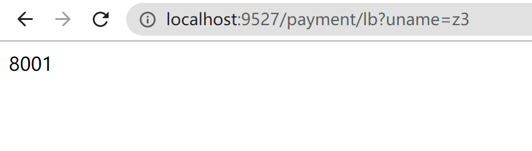

如果不带name   访问不了  相当于过滤器


## SpringCloud Config分布式配置中心

### 概述

#### 分布式 系统面临的配置问题

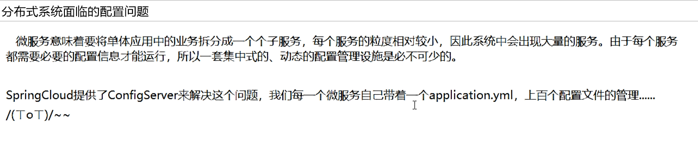

#### 是什么

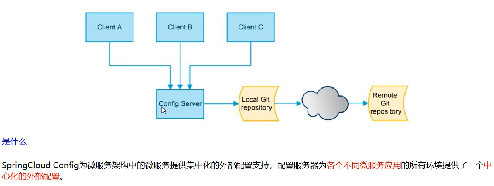


#### 能干嘛

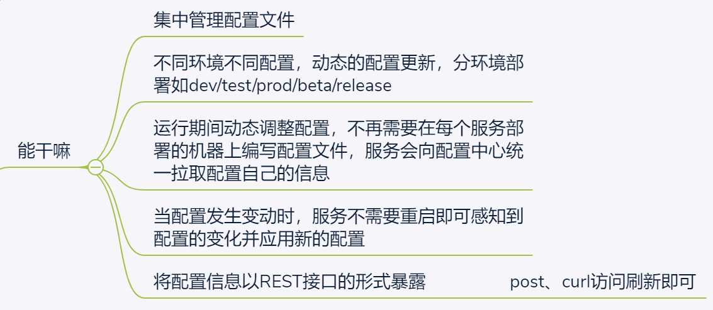


配置中心在整个服务中的位置

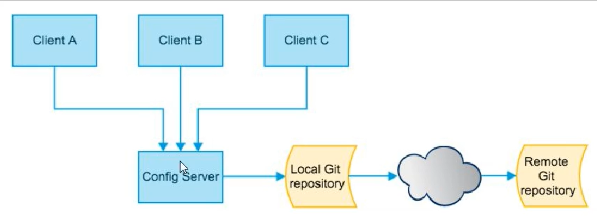

### Config服务端配置与测试

#### 在github上面新建一个springcloud-config仓库

github太慢啦，最后在gitee上面搞了一个，速度快多啦。

里面将阳哥的文件clone，然后放到自己仓库


#### 新建新模块配置中心

pom yml 主启动


#### 修改wins下hosts文件

```yml
C:\Windows\System32\drivers\etc

127.0.0.1 config-3344.com
```

#### 测试

启动7001，3344

看是否可以获取github上面配置中心的配置文件

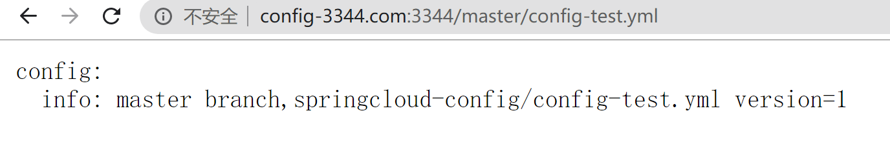


#### 配置读取规则

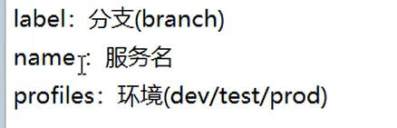

官网上写了五种，这里用三种。

官网 ：https://spring.io/projects/spring-cloud-config#learn 上面有五种，但是访问不了。


##### /{label}/{application-{profile}.yml}

中间有个 - 不能没有，否则读取不到

```
http://config-3344.com:3344/master/config-dev.yml
```

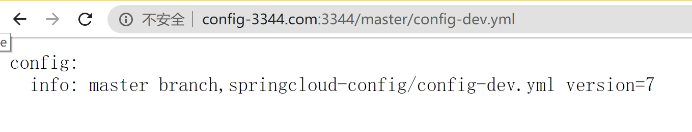


##### /{application-{profile}.yml}

```
http://config-3344.com:3344/config-test.yml
```

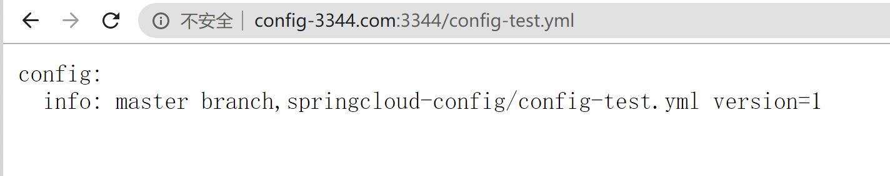

如果没有lable, 那么默认读取到的是master分支


##### /{application-{profile}{/{label}}

```
http://config-3344.com:3344/config/test/master

```

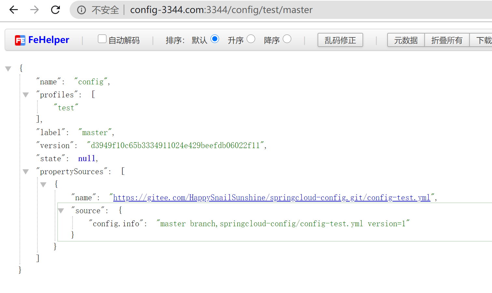

这种方式读取到的是Json串，和前两种不一样。

### Config客户端配置与测试

#### 新建module3355  pom bootstrap.yml 主启动 业务controller

这个服务请求的是服务3344，它并没有请求gitee


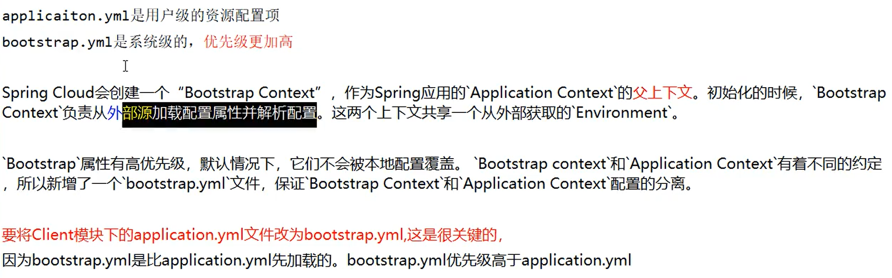

#### 测试

```
http://localhost:3355/configInfo

```

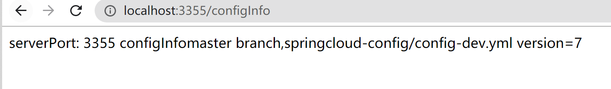

#### 问题随时而来，分布式配置的动态刷新问题


只有重启3355,3355读取到的配置才是最新的。


### Config客户端之动态刷新

#### 避免每次更新配置都要重启客户端微服务3355


#### 动态刷新

##### POM引入actuator监控

只有网关不需要引入监控，这里是需要的

```xml
<!--监控-->
<dependency>
    <groupId>org.springframework.boot</groupId>
    <artifactId>spring-boot-starter-actuator</artifactId>
</dependency>

```


##### 修改YML,暴露监控端口

```yml
#暴露监控端点
management:
  endpoints:
    web:
      exposure:
        include: "*"

```


##### @RefreshScope业务类Controller修改

```java
package com.cskaoyan.springcloud.controller;

import org.springframework.beans.factory.annotation.Value;
import org.springframework.cloud.context.config.annotation.RefreshScope;
import org.springframework.web.bind.annotation.GetMapping;
import org.springframework.web.bind.annotation.RestController;

/**
 * @Author steve
 * @Since 2020/7/3 15:09
 */
@RestController
@RefreshScope   //动态属性注解
public class ConfigClientController {

    // 因为config仓库以rest形式暴露，所以所有客户端都可以通过config服务端访问到github上对应的文件信息
    @Value("${config.info}")
    private String configInfo;

    @Value("${server.port}")
    private String serverPort;

    @GetMapping("/configInfo")
    public String getConfigInfo() {
        return "serverPort: " + serverPort + "\t\n\n configInfo" + configInfo;
    }
}


```


##### 测试

3344改变了，但是3355还是没有改变。这时候就需要运维工程师发送一个刷新请求

```
curl -X POST "http://localhost:3355/actuator/refresh"

```

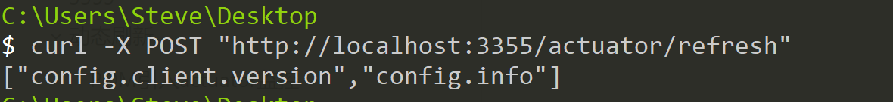

这时候3355就好了，和gitee上面配置一样

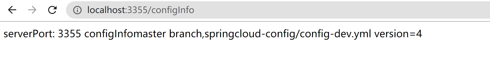

必须是改过gitee以后才能刷新。

#### 想想还有什么问题？

- 假设有多个微服务客户端3355,3356,3357
- 每个微服务都要执行一次post请求，手动刷新？
- 可否广播，一次通知，处处生效？
- 我们想大范围的自动刷新，求方法


## SpringCloud Bus消息总线

消息总线是对Config的加强。

### 概述

#### 是什么

Bus支持两种消息代理： RabbitMQ和Kafka


下图这一种方式是首先推给A，然后由A推给其他的服务。

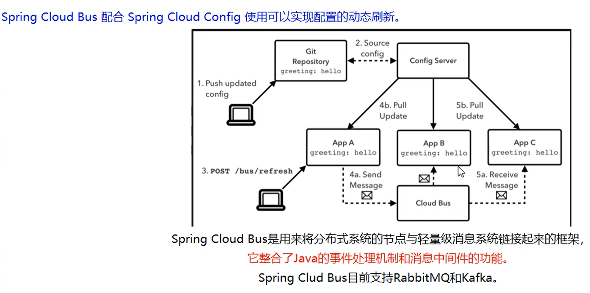


这张图和上面这个不一样，这个是首先推给server然后推给其他的。（推荐这种）

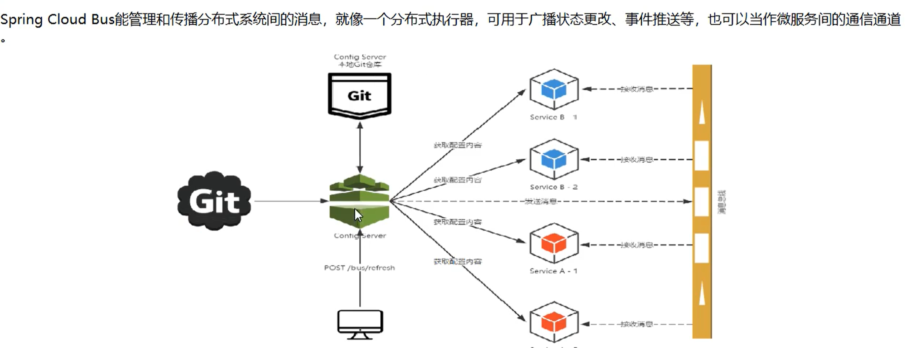


### RabbitMQ环境配置

这个笔记在RabbitMQ里面，是用Docker安装的。安装完开安全组，设置一下首页，不然访问不了。


### SpringCloud Bus动态刷新全局广播


#### 良好的RabbitMQ环境

#### 演示广播效果，增加复杂度 ，再以3355为模板，创建一个3366


#### 设计思想

- 1、利用消息总线触发一个客户端/bus/refresh,而刷新所有客户端的配置

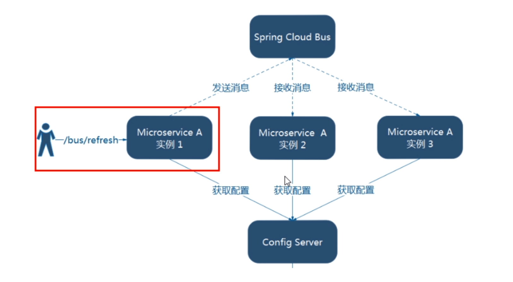

- 2、利用消息总线触发一个服务端ConfigServer的/bus/refresh端口，而刷新所有客户端的配置（更加推荐）

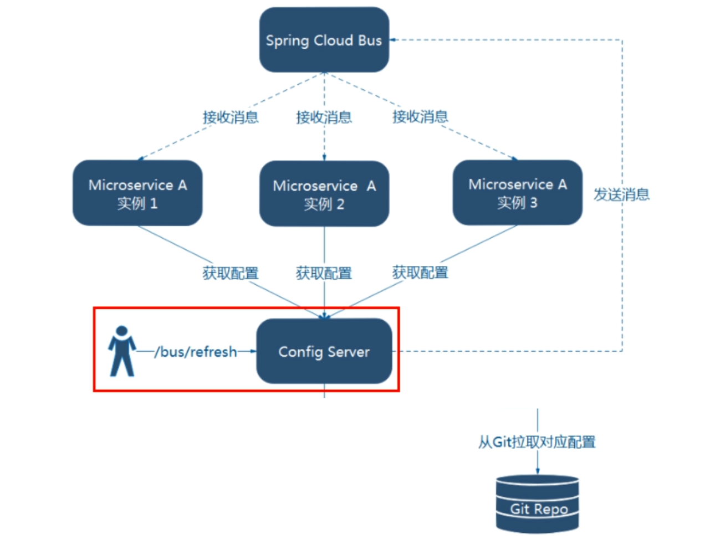

图二更加适合而图一不适合的原因：

- 打破了微服务的单一职责，因为微服务本身就是业务模块，它不应该承担配置刷新的职责
- 破坏了微服务各节点的对等性
- 有一定的局限性，例如微服务在迁移是，它的网络地址会发生变化，如果想做到自动刷新，那就需要增加更多的修改


#### 给3344配置

pom

```xml
<!-- 添加消息总线RabbitMQ支持 -->
<dependency>
    <groupId>org.springframework.cloud</groupId>
    <artifactId>spring-cloud-starter-bus-amqp</artifactId>
</dependency>

```

 yml

```yml
server:
  port: 3344

spring:
  application:
    name: cloud-config-center
  cloud:
    config:
      server:
        git:
          uri: https://gitee.com/HappySnailSunshine/springcloud-config.git  #阳哥这里用的是ssh 我这里用https
          ##搜索目录.这个目录指的是github上的目录
          search-paths:
            - config-repo
      ##读取分支
      label: master
      
#rabbit相关配置 15672是web管理界面的端口，5672是MQ访问的端口 注意这个在spring下
  rabbitmq:
    host: 47.92.208.93
    port: 5672
    username: guest
    password: guest

eureka:
  client:
    service-url:
      defaultZone: http://eureka7001.com:7001/eureka/

#rabbitmq相关设置 ，暴露 bus刷新配置的端点 和RabbitMQ刷新相关
management:
  endpoints:
    web:
      exposure:
        include: 'bus-refresh'

```

加了两个，Spring下的rabbitmq ,还有最下面的bus的刷新


#### 给3355配置

pom

```xml
 <!-- 添加消息总线RabbitMQ支持 -->
<dependency>
    <groupId>org.springframework.cloud</groupId>
    <artifactId>spring-cloud-starter-bus-amqp</artifactId>
</dependency>

```

yml

```yml
server:
  port: 3355

spring:
  application:
    name: config-client
  cloud:
    #Config客户端配置
    config:
      label: master #分支名称
      name: config #配置文件名称
      profile: dev #读取后缀名称 上诉3个综合就是 master分支上 config-dev.yml
      uri: http://localhost:3344
  #rabbit相关配置 15672是web管理界面的端口，5672是MQ访问的端口 注意这个在spring下
  rabbitmq:
    host: 47.92.208.93
    port: 5672
    username: guest
    password: guest

eureka:
  client:
    service-url:
      defaultZone: http://eureka7001.com:7001/eureka/

#暴露监控端点
management:
  endpoints:
    web:
      exposure:
        include: "*"


```

#### 给3366配置 

这个和3355一样。


#### 测试

修改gitee配置文件

刷新3344

```shell
curl -X post "http://localhost:3344/actuator/bus-refresh"

```

结果处处生效。

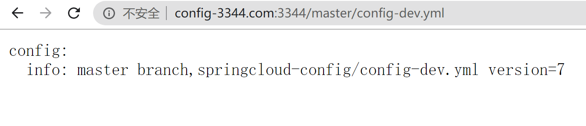

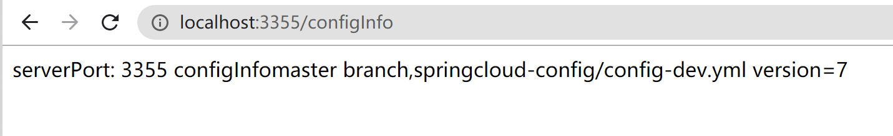


### SpringCloud Bus动态刷新定点通知


#### 只想定点通知，只通知3355，不通知3366

```SHELL
curl -X POST "http://localhost:3344/actuator/bus-refresh/config-client:3355"

```

```shell
公式：http://localhost:配置中心的端口号/actuator/bus-refresh/{destination}  
后面这是是微服务名+目标端口

```

#### 测试

只有3344和3355结果改变啦。


#### 通知总结

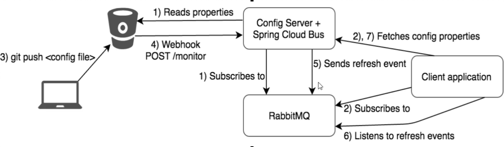

个人回顾：

- 首先3344一直在读取gitee上面的配置文件，只要gitee改变，3344就会读取到，3344相当于配置服务器
- 3355，和3366只是读取3344读取到的文件
- 加了消息总线以后，3355和3366一直在监听RabbitMQ，当运维刷新了server上面的配置以后，3355和3366就可以监听到，然后读取配置。

### 个人问题

为何配置了MQ后post请求发送给config-server端就会通知给所有的config-client微服务呢？


因为都订阅了RabbitMQ,并且监听了SpringCloudBus的频道，当server被post更新时会推送信息到MQ中，这样client监听就会响应更新数据


## SpringCloud Stream消息驱动

### 消息驱动概述

#### 是什么

##### 一句话 

屏蔽底层消息中间件的差异，降低切换成本，统一消息的编程模型

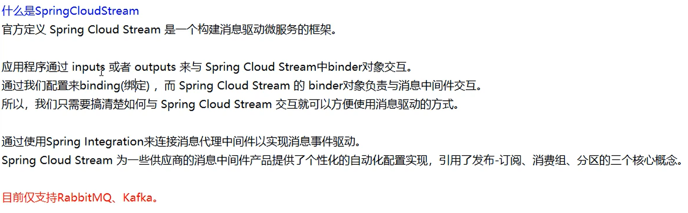

这上面的binder指的是绑定器。

#### 设计思想

##### 标准的MQ 

参考RabbitMQ的内容。

##### 为什么要用SpringCloudStream？

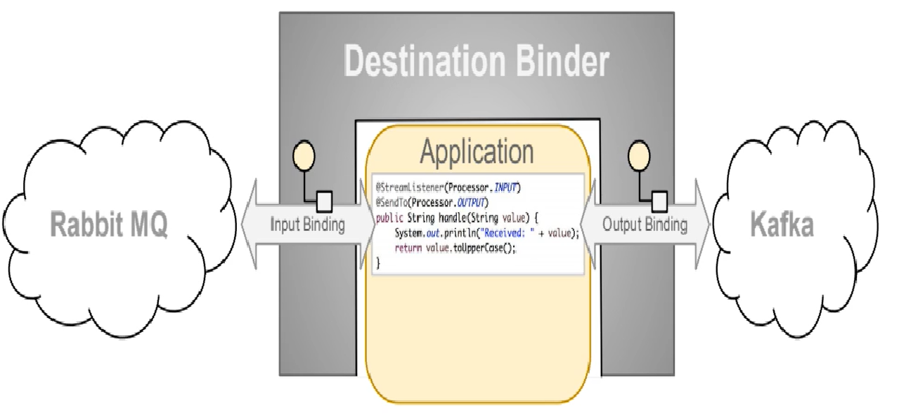


###### stream凭什么可以统一底层差异？


记住这个Binder是关键。

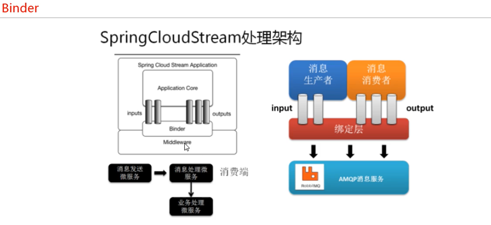


#### SpringCloud Stream标准流程套路

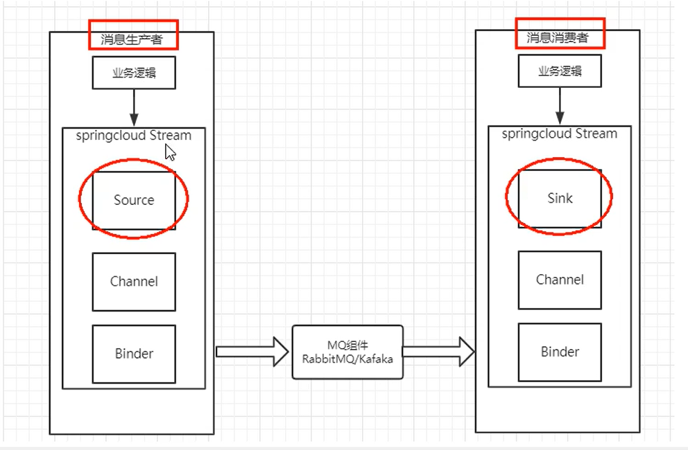 


#### 编码API和常用注解

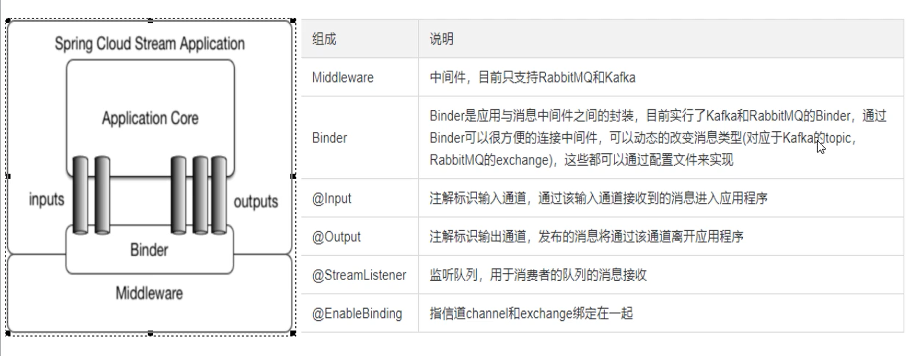

### 案例说明

8801作为生产者，8802作为消费者。


### 消息驱动之生产者

pom

yml

```yml
server:
  port: 8801

spring:
  application:
    name: cloud-stream-provider
  cloud:
    stream:
      binders: #在此处配置要绑定的rabbitmq的服务信息
       defaultRabbit: #表示定义的名称，用于binding整合
         type: rabbit #消息组件类型
         environment: #设置rabbitmq的相关环境配置
           spring:
             rabbitmq:
               host: 47.92.208.93
               port: 5672
               username: guest
               password: guest
      bindings: #服务的整合处理
        output: #这个名字是一个通道的名称
          destination: studyExchange #表示要使用的Exchange名称定义 
          content-type: application/json #设置消息类型，本次为json，本文要设置为“text/plain”
          binder: defaultRabbit #设置要绑定的消息服务的具体设置

eureka:
  client:
    service-url:
      defaultZone: http://eureka7001.com:7001/eureka/
  instance:
    lease-renewal-interval-in-seconds: 2 #设置心跳的时间间隔（默认是30S)
    lease-expiration-duration-in-seconds: 5 #如果超过5S间隔就注销节点 默认是90s
    instance-id: send-8801.com #在信息列表时显示主机名称
    prefer-ip-address: true #访问的路径变为IP地址


```


和MQ交互的service

```java
package com.cskaoyan.springcloud.service.impl;

import com.cskaoyan.springcloud.service.IMessageProvider;
import org.springframework.cloud.stream.annotation.EnableBinding;
import org.springframework.cloud.stream.messaging.Source;
import org.springframework.messaging.MessageChannel;
import org.springframework.messaging.support.MessageBuilder;
import org.springframework.stereotype.Service;

import javax.annotation.Resource;
import java.util.UUID;

/**
 * @Author Steve
 * @Since 2020/7/14 14:13
 */
@EnableBinding(Source.class)  //定义消息的推送管道
// @Service  //这里不需要这个注解，因为这里不是和controller dao 打交道。 这里这是是和MQ打交道的。c
public class MessageProviderImpl implements IMessageProvider {
    
    @Resource
    private MessageChannel output;   //消息发送管道

    @Override
    public String send() {
        String serial = UUID.randomUUID().toString();
        output.send(MessageBuilder.withPayload(serial).build());
        System.out.println("--------------------seial------------------:" + serial);
        return null;
    }
}


```

注意上面的@EnableBinding(Source.class) 


### 消息驱动之消费者

pom

yml

```yml
server:
  port: 8802

spring:
  application:
    name: cloud-stream-consumer
  cloud:
    stream:
      binders: #在此处配置要绑定的rabbitmq的服务信息
        defaultRabbit: #表示定义的名称，用于binding整合
          type: rabbit #消息组件类型
          environment: #设置rabbitmq的相关环境配置
            spring:
              rabbitmq:
                host: 47.92.208.93
                port: 5672
                username: guest
                password: guest
      bindings: #服务的整合处理
        input: #这个名字是一个通道的名称
          destination: studyExchange #表示要使用的Exchange名称定义
          content-type: application/json #设置消息类型，本次为json，本文要设置为“text/plain”
          binder: defaultRabbit #设置要绑定的消息服务的具体设置

eureka:
  client:
    service-url:
      defaultZone: http://eureka7001.com:7001/eureka/
  instance:
    lease-renewal-interval-in-seconds: 2 #设置心跳的时间间隔（默认是30S)
    lease-expiration-duration-in-seconds: 5 #如果超过5S间隔就注销节点 默认是90s
    instance-id: receive-8802.com #在信息列表时显示主机名称
    prefer-ip-address: true #访问的路径变为IP地址


```

接受消息的controller

```java
package com.cskaoyan.springcloud.controller;

import org.springframework.beans.factory.annotation.Value;
import org.springframework.cloud.stream.annotation.EnableBinding;
import org.springframework.cloud.stream.annotation.StreamListener;
import org.springframework.cloud.stream.messaging.Sink;
import org.springframework.messaging.Message;
import org.springframework.stereotype.Component;

/**
 * @Author Steve
 * @Since 2020/7/14 14:44
 */
@Component
@EnableBinding(Sink.class)  //消费者
public class ReceiverMessageListenerController {
    
    @Value("${server.port}")
    private String serverPort;
    
    @StreamListener(Sink.INPUT)   //这个很重要，刚才没加，报错啦
    public void input(Message<String> message){
        System.out.println("消费者1号，------>接受到的消息：" + message.getPayload() + "\t port:" + serverPort);
    }
}


```

注意最上面的@EnableBinding(Sink.class)  这个是绑定的意思。

接受消息的方法上面要写@StreamListener(Sink.INPUT)  开始没加这个会报错。这里是监听进入的消息。


### 分组消费与持久化

#### 复制8802，出来一个8803

#### 启动7001，8801，8802，8803

#### 运行后有两个问题

有重复消费问题，消息持久化问题


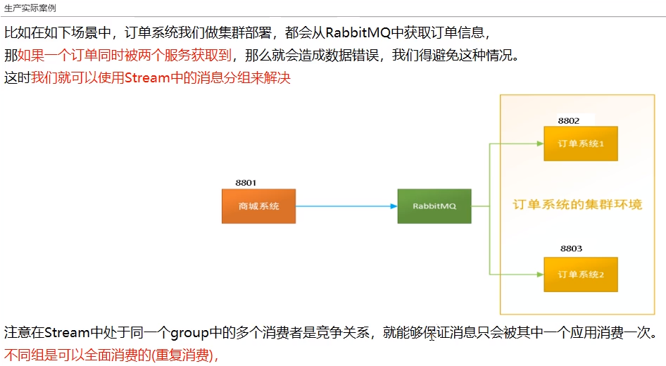

同一个组内会发生竞争关系，只有其中一个可以消费。


如果没有分组的话，每一个组的名字默认都不一样。

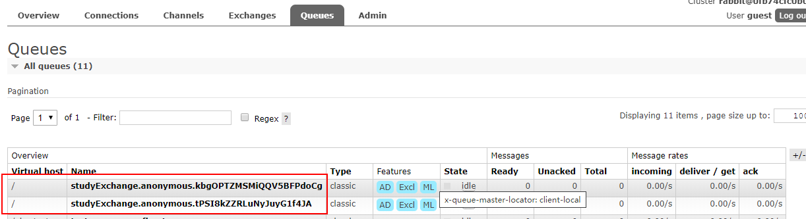


#### 消费

故障现象：重复消费

导致原因：默认分组group是不同的，组流水号不一样，被认为是不同组，可以消费


自定义配置分组，自定义配置分为一组，解决

重复消费问题


#### 分组

如果组名一样，假如豆角Steve，那么发两个消息，两个消费者会是竞争关系，轮询接受消息，不会重复消费。

**不同组广播，同组轮询。**


#### 持久化

如果8802将

```yml
group: Steve #分组组名

```

去掉。而8803不去掉。


将8802，和8803都关掉。用8801发送两条消息。

启动8802，8803， 发现8802丢失消息，没有收到任何消息。而8803是可以收到两条消息的。


所以group在RabbitMQ中解决重复消费问题，还可以解决持久化问题。


## SpringCloud Sleuth分布式请求链路跟踪

### 概述

#### 为什么会出现这个技术？需要解决什么问题？

问题

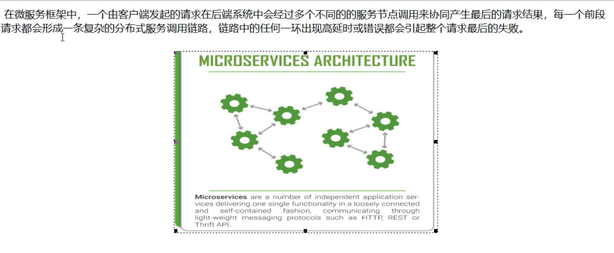

#### 是什么？

Spring Cloud ：https://spring.io/projects/spring-cloud-sleuth

#### 解决

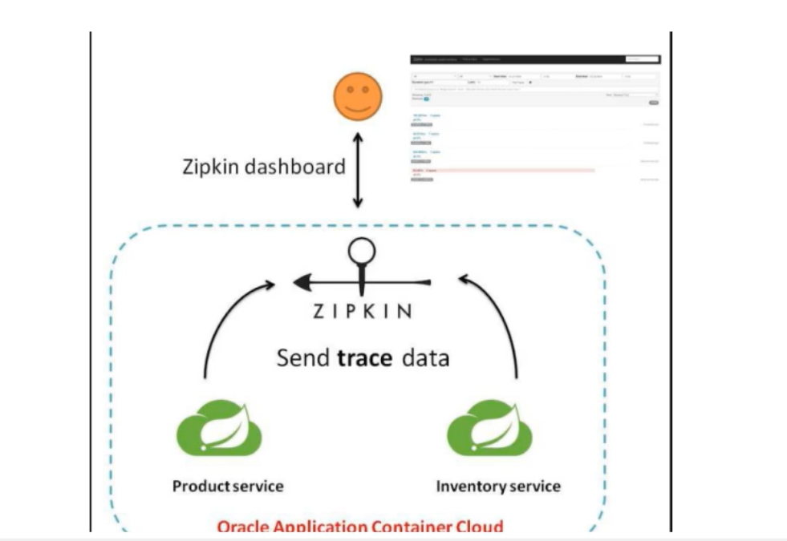

### 搭建链路监控步骤

#### zipkin

##### 下载

http://dl.bintray.com/openzipkin/maven/io/zipkin/java/zipkin-server

##### 运行jar

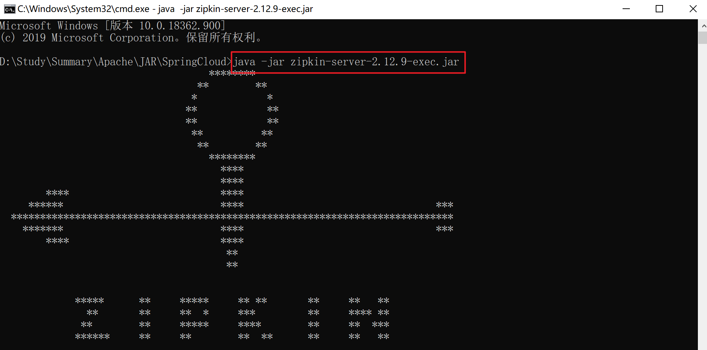

##### 运行控制台

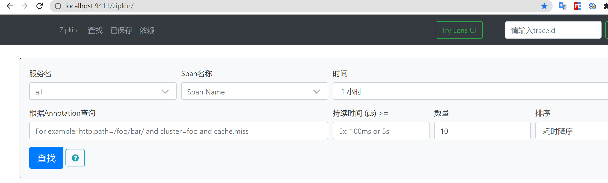

###### 术语

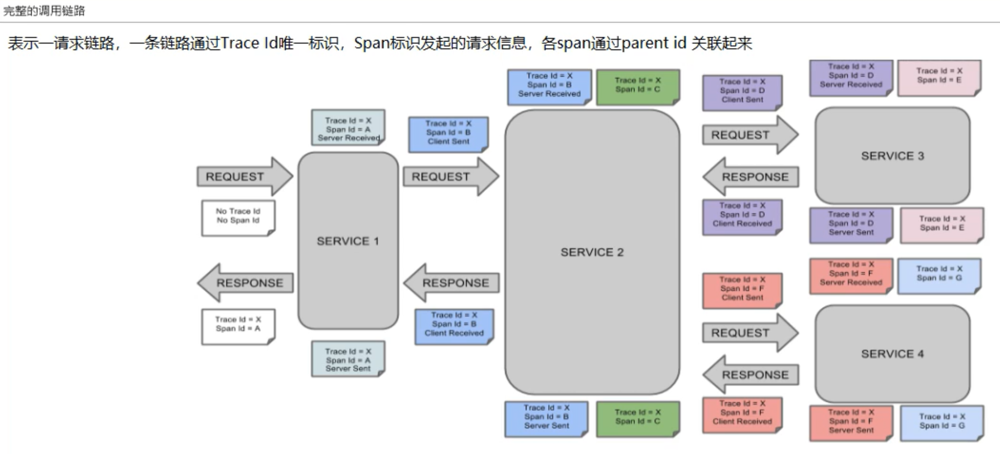

上图Trace Id = X 在全程都有。


上图精简以后的图

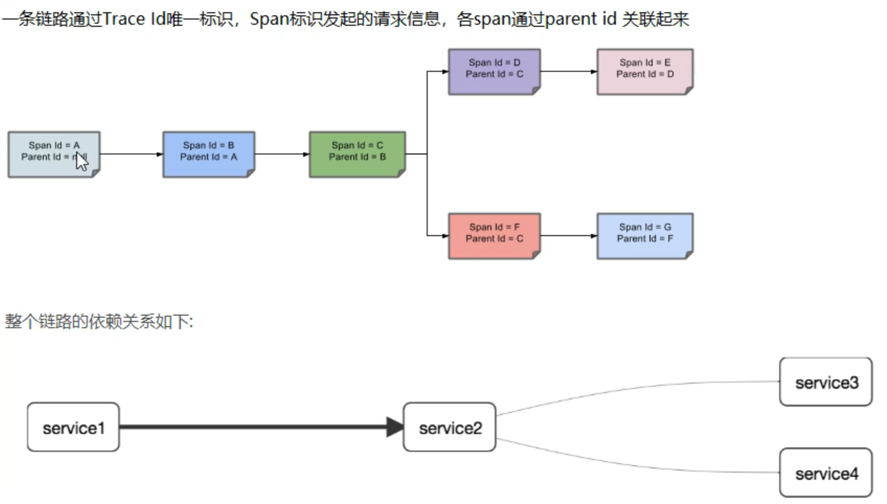


#### 服务提供者

pom

```xml
<!-- 包含了sleuth zipkin 数据链路追踪-->
<dependency>
    <groupId>org.springframework.cloud</groupId>
    <artifactId>spring-cloud-starter-zipkin</artifactId>
</dependency>

```

yml

```yml
spring:
  application:
    name: cloud-payment-service
  zipkin:
    base-url: http://localhost:9411
  sleuth:
    sampler:
      #采样取值介于 0到1之间，1则表示全部收集
      probability: 1

```

加了下面一部分

controller加了一些代码

```java
@GetMapping(value="/payment/zipkin")
	public String paymentZipkin() {
		return "hello,i am paymentZipkin server fallback,O(∩_∩)O哈哈~";
	}

```


#### 服务消费者（调用方）

pom 和上面一样

yml 一样

controller

```java
@GetMapping(value="/consumer/payment/zipkin")
	public String paymentZipkin() {
		return restTemplate.getForObject("http://localhost:8001/payment/zipkin/"
                                         ,String.class);
}

```


#### 依次启动eureka7001/8001/80


#### 打开浏览器访问： http://localhost:9411


**Zipkin客户端**

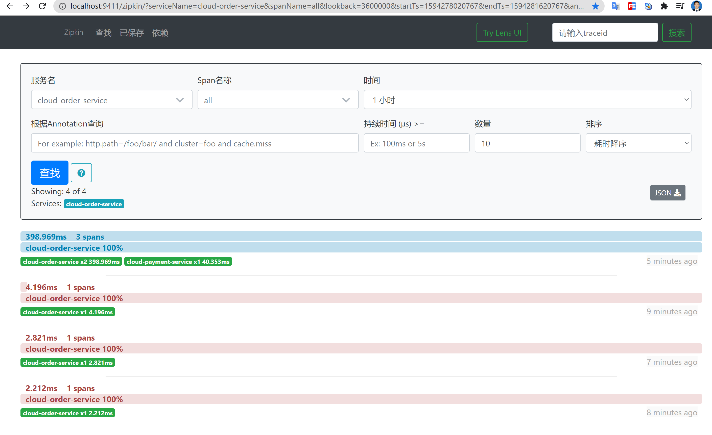


各模块依赖关系

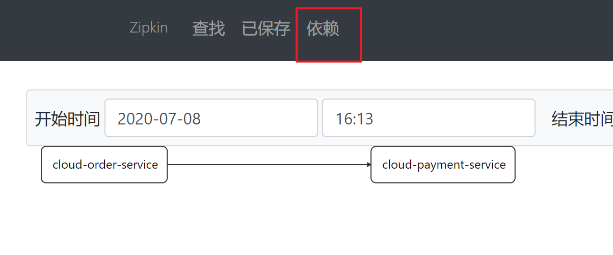

## SpringCloud Alibaba入门简介

### why会出现SpringCloud alibaba

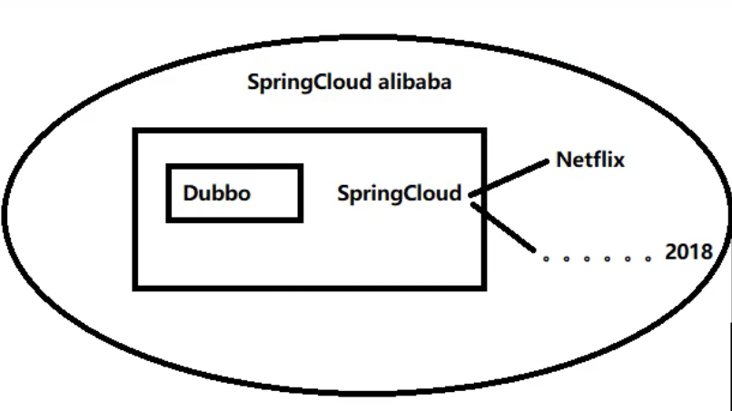

其实是相当于阿里整合进了SpringCloud，他两合作。

### SpringCloud alibaba带来了什么

### SpringCloud alibaba学习资料获取

https://github.com/alibaba/spring-cloud-alibaba/blob/master/README-zh.md

https://spring-cloud-alibaba-group.github.io/github-pages/greenwich/spring-cloud-alibaba.html

总是阿里牛逼。


## SpringCloud Alibaba Nacos服务注册和配置中心

### Nacos简介

#### 为什么叫Nacos？

前4个字母分别为Naming和Configuration的前两个字母，最后的s是Service


#### 是什么

Nacos=Eureka + Config + Bus


#### 哪里下

https://github.com/alibaba/Nacos


### 安装并运行Nacos


参考：[https://www.mxblog.com.cn/docker%E5%AE%89%E8%A3%85nacos%E6%8C%87%E5%8D%97.html](https://www.mxblog.com.cn/docker安装nacos指南.html)  

#### Nacos的docker化部署

本篇文章分享的是nacos1.0.0版本的docker化部署，方式为单机部署，后续会持续更新nacos的集群部署方式。

**从dockerHub仓库中拉取naocs镜像**

```java
//拉取nacos-server:1.0.0镜像
docker pull nacos/nacos-server:1.0.0
    
//如果要安装最新的
docker pull nacos/nacos-server

```

Java

**拉取后查看本地镜像**

```java
docker images
nacos/nacos-server                           1.0.0               00e14f790e63        10 weeks ago        697 MB

```

Java

**启动nacos镜像**

```java
//-env MODE=standalone 设置启动方式为单机模式
//--name 容器名称
//-p 端口映射为 8848
//nacos/nacos-server:1.0.0 本地镜像
docker run --env MODE=standalone --name nacos -d -p 8848:8848 nacos/nacos-server:1.0.0

```

Java

**查看容器**

```java
docker ps
c03f449b206e        nacos/nacos-server:1.0.0   "bin/docker-startup.s"   25 hours ago        Up 48 minutes       0.0.0.0:8848->8848/tcp                                           nacos1

```

Java

**进入naocs容器中**

```java
//通过/bin/bash方式进入nacos容器中
docker exec -it c03f449b206e /bin/bash
//进入容器中可以查看nacos的安装目录
[root@c03f449b206e nacos]# ls
LICENSE  NOTICE  bin  conf  data  derby.log  init.d  logs  plugins  target  work

```


Java

nacos服务安装好后，可以通过nacos的conf目录对nacos服务进行配置。
**注：如果系统所要注册的服务比较多的话，建议关闭nacos中的部分日志配置，工作中亲身经历nacos的日志如果没有进行有效管理的话，nacos的日志量是非常庞大的，毫不夸张的说nacos的日志量在一周内可达5GB+以上，时间一长就会撑爆物理机的容量存储，故而docker中的应用就会变为只读状态，无法进行服务注册与发现，导致系统崩溃。所以，我们需要对nacos的日志进行适当的屏蔽或者定时删除，可参考文章如何屏蔽Nacos日志输出？**

通过上述步骤，就完成了对nacos应用的docker化部署，使用docker run命令后就会自动启动nacos服务。

本地nacos服务访问地址：

http://127.0.0.1:8848/nacos/index.html#/

nacos的初始化用户名/密码 nacos/nacos 如下图：


进入管理页面后，可以使用配置列表、监听查询、服务列表等功能，如下图：


### Nacos作为服务注册中心演示

#### 建9001,9002

#### 建消费者83

为什么阿里的Nacos自出生就带了负载均衡呢？因为他继承了Ribbon

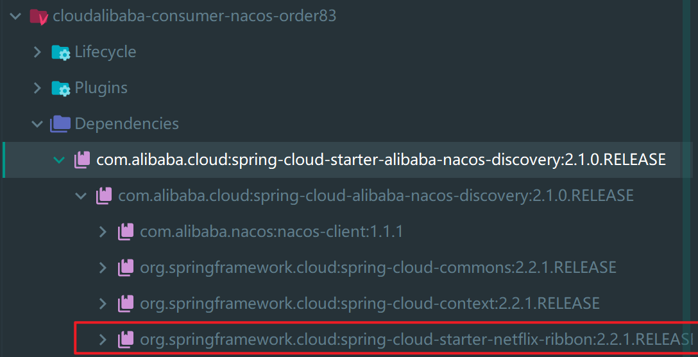


#### 测试 有负载均衡功能

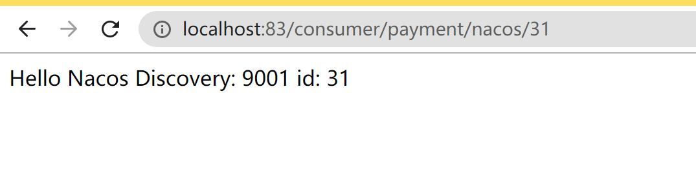

#### 服务注册中心对比

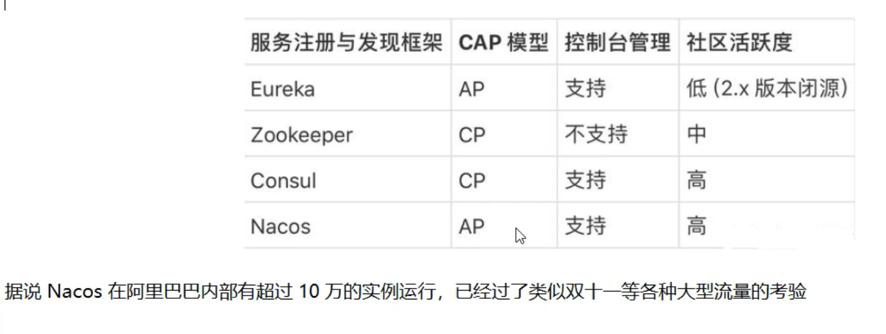


##### Nacos全景覆盖

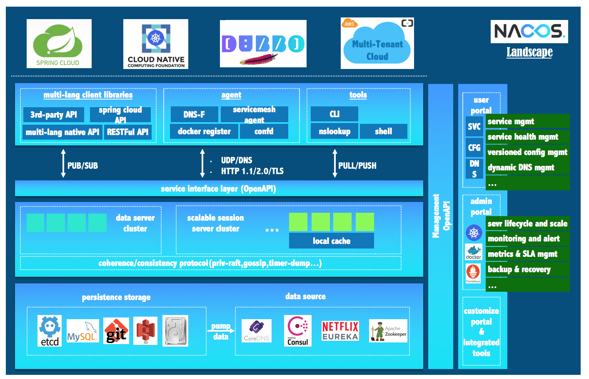


##### Nacos和CAP

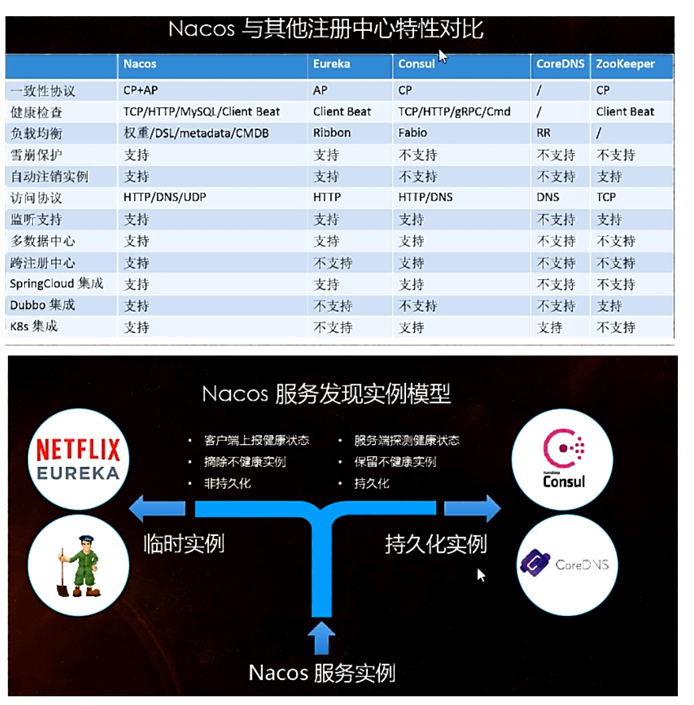


Nacos支持AP和CP的切换

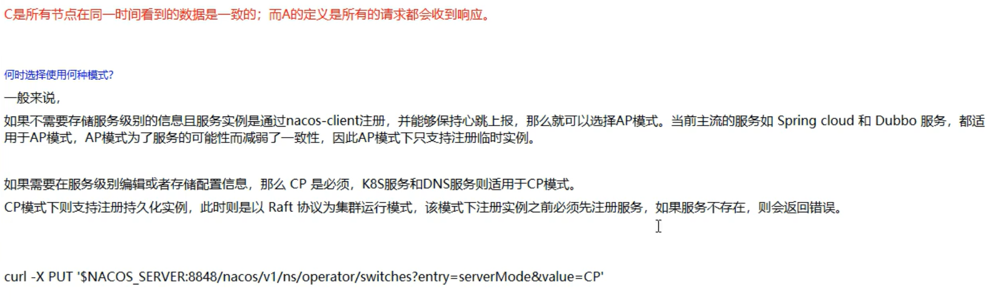


### Nacos作为服务配置中心演示

#### Nacos作为配置中心-基础配置

##### 新建配置模块3377

配置文件之所以既有application.yml 也有 bootstrap.yml 是为了和config接轨。

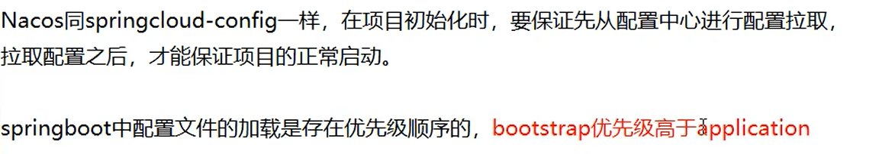


需要注意的是Controller上面需要加动态刷新的注解，千万注意

```java
@RefreshScope

```


##### 在Nacos中添加配置信息

###### 配置文件配置规则

参考官网 :  https://nacos.io/zh-cn/docs/quick-start-spring-cloud.html


公式：

```
 ${spring.application.name}-${spring.profile.active}.${file-extension}

```

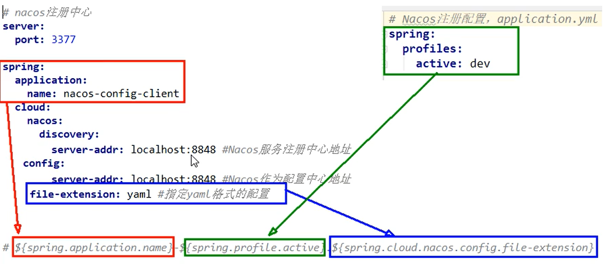


##### 测试

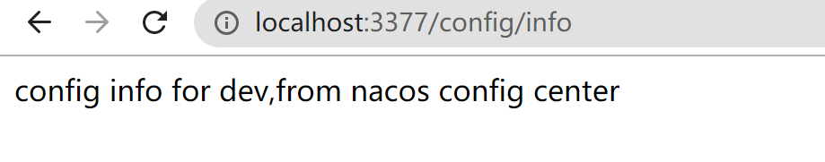

##### Nacos自带动态刷新，但是在Controller要加

```java
@RestController
@RefreshScope  // 支持Nacos的动态刷新功能
public class ConfigClientController {

    @Value("${config.info}")
    private String configInfo;

    @GetMapping("/config/info")
    public String getConfigInfo() {
        return configInfo;
    }
}

```

这里如果不加@RefreshScope 是不会动态刷新的，亲测。


#### Nacos作为配置中心-分类配置

##### 问题


##### Namespace + Group + DataID 三者关系？为什么这么设计？

###### 是什么？

类似Java 里面的package名和类名。

最外层的namespace是可以用于区分部署环境的，Group的DataID逻辑上区分这两个目标对象。

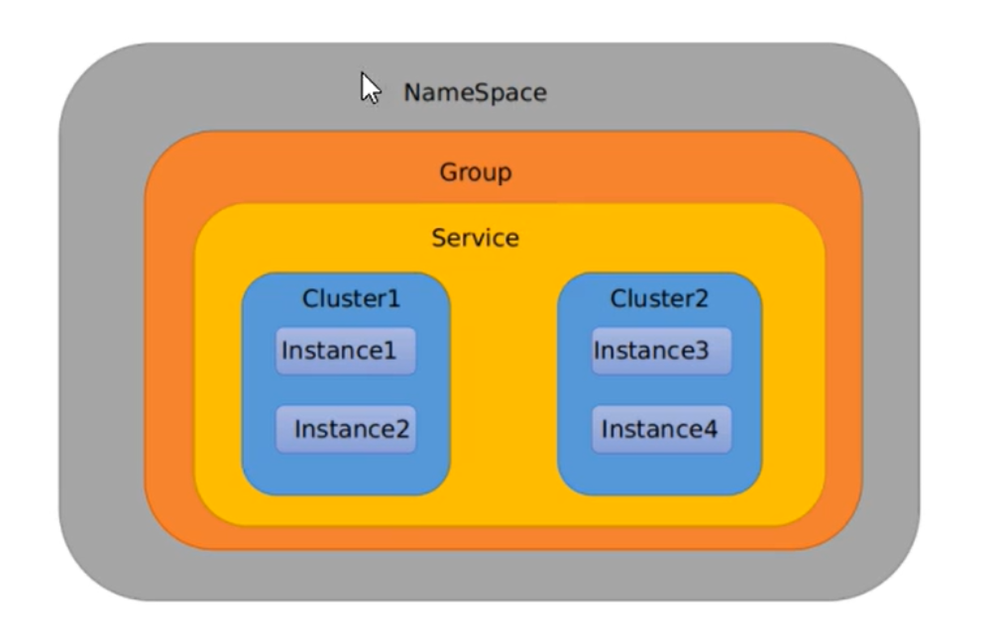

相当于三级目录NameSpace > Group > Service

### Nacos集群和持久化配置(重要)

#### 官网

集群官网： https://nacos.io/zh-cn/docs/cluster-mode-quick-start.html

不在用它自带的嵌入式的数据库。推荐用MySql。


#### Nacos持久化配置解释

将数据库换成Mysql。才能做持久化。

##### Mysql源文件

源文件地址：https://github.com/alibaba/nacos/blob/master/distribution/conf/nacos-mysql.sql

```sql
CREATE DATABASE nacos_config;
USE nacos_config;

/*   数据库全名 = nacos_config   */
/*   表名称 = config_info   */
/******************************************/
CREATE TABLE `config_info` (
  `id` bigint(20) NOT NULL AUTO_INCREMENT COMMENT 'id',
  `data_id` varchar(255) NOT NULL COMMENT    'data_id',
  `group_id` varchar(255) DEFAULT NULL,
  `content` longtext NOT NULL COMMENT 'content',
  `md5` varchar(32) DEFAULT NULL COMMENT 'md5',
  `gmt_create` datetime NOT NULL DEFAULT '2010-05-05 00:00:00' COMMENT '创建时间',
  `gmt_modified` datetime NOT NULL DEFAULT '2010-05-05 00:00:00' COMMENT '修改时间',
  `src_user` text COMMENT 'source user',
  `src_ip` varchar(20) DEFAULT NULL COMMENT 'source ip',
  `app_name` varchar(128) DEFAULT NULL,
  `tenant_id` varchar(128) DEFAULT '' COMMENT '租户字段',
  `c_desc` varchar(256) DEFAULT NULL,
  `c_use` varchar(64) DEFAULT NULL,
  `effect` varchar(64) DEFAULT NULL,
  `type` varchar(64) DEFAULT NULL,
  `c_schema` text,
  PRIMARY KEY (`id`),
  UNIQUE KEY `uk_configinfo_datagrouptenant` (`data_id`,`group_id`,`tenant_id`)
) ENGINE=InnoDB DEFAULT CHARSET=utf8 COLLATE=utf8_bin COMMENT='config_info';

/******************************************/
/*   数据库全名 = nacos_config   */
/*   表名称 = config_info_aggr   */
/******************************************/
CREATE TABLE `config_info_aggr` (
  `id` bigint(20) NOT NULL AUTO_INCREMENT COMMENT 'id',
  `data_id` varchar(255) NOT NULL COMMENT 'data_id',
  `group_id` varchar(255) NOT NULL COMMENT 'group_id',
  `datum_id` varchar(255) NOT NULL COMMENT 'datum_id',
  `content` longtext NOT NULL COMMENT '内容',
  `gmt_modified` datetime NOT NULL COMMENT '修改时间',
  `app_name` varchar(128) DEFAULT NULL,
  `tenant_id` varchar(128) DEFAULT '' COMMENT '租户字段',
  PRIMARY KEY (`id`),
  UNIQUE KEY `uk_configinfoaggr_datagrouptenantdatum` (`data_id`,`group_id`,`tenant_id`,`datum_id`)
) ENGINE=InnoDB DEFAULT CHARSET=utf8 COLLATE=utf8_bin COMMENT='增加租户字段';

/******************************************/
/*   数据库全名 = nacos_config   */
/*   表名称 = config_info_beta   */
/******************************************/
CREATE TABLE `config_info_beta` (
  `id` bigint(20) NOT NULL AUTO_INCREMENT COMMENT 'id',
  `data_id` varchar(255) NOT NULL COMMENT 'data_id',
  `group_id` varchar(128) NOT NULL COMMENT 'group_id',
  `app_name` varchar(128) DEFAULT NULL COMMENT 'app_name',
  `content` longtext NOT NULL COMMENT 'content',
  `beta_ips` varchar(1024) DEFAULT NULL COMMENT 'betaIps',
  `md5` varchar(32) DEFAULT NULL COMMENT 'md5',
  `gmt_create` datetime NOT NULL DEFAULT '2010-05-05 00:00:00' COMMENT '创建时间',
  `gmt_modified` datetime NOT NULL DEFAULT '2010-05-05 00:00:00' COMMENT '修改时间',
  `src_user` text COMMENT 'source user',
  `src_ip` varchar(20) DEFAULT NULL COMMENT 'source ip',
  `tenant_id` varchar(128) DEFAULT '' COMMENT '租户字段',
  PRIMARY KEY (`id`),
  UNIQUE KEY `uk_configinfobeta_datagrouptenant` (`data_id`,`group_id`,`tenant_id`)
) ENGINE=InnoDB DEFAULT CHARSET=utf8 COLLATE=utf8_bin COMMENT='config_info_beta';

/******************************************/
/*   数据库全名 = nacos_config   */
/*   表名称 = config_info_tag   */
/******************************************/
CREATE TABLE `config_info_tag` (
  `id` bigint(20) NOT NULL AUTO_INCREMENT COMMENT 'id',
  `data_id` varchar(255) NOT NULL COMMENT 'data_id',
  `group_id` varchar(128) NOT NULL COMMENT 'group_id',
  `tenant_id` varchar(128) DEFAULT '' COMMENT 'tenant_id',
  `tag_id` varchar(128) NOT NULL COMMENT 'tag_id',
  `app_name` varchar(128) DEFAULT NULL COMMENT 'app_name',
  `content` longtext NOT NULL COMMENT 'content',
  `md5` varchar(32) DEFAULT NULL COMMENT 'md5',
  `gmt_create` datetime NOT NULL DEFAULT '2010-05-05 00:00:00' COMMENT '创建时间',
  `gmt_modified` datetime NOT NULL DEFAULT '2010-05-05 00:00:00' COMMENT '修改时间',
  `src_user` text COMMENT 'source user',
  `src_ip` varchar(20) DEFAULT NULL COMMENT 'source ip',
  PRIMARY KEY (`id`),
  UNIQUE KEY `uk_configinfotag_datagrouptenanttag` (`data_id`,`group_id`,`tenant_id`,`tag_id`)
) ENGINE=InnoDB DEFAULT CHARSET=utf8 COLLATE=utf8_bin COMMENT='config_info_tag';

/******************************************/
/*   数据库全名 = nacos_config   */
/*   表名称 = config_tags_relation   */
/******************************************/
CREATE TABLE `config_tags_relation` (
  `id` bigint(20) NOT NULL COMMENT 'id',
  `tag_name` varchar(128) NOT NULL COMMENT 'tag_name',
  `tag_type` varchar(64) DEFAULT NULL COMMENT 'tag_type',
  `data_id` varchar(255) NOT NULL COMMENT 'data_id',
  `group_id` varchar(128) NOT NULL COMMENT 'group_id',
  `tenant_id` varchar(128) DEFAULT '' COMMENT 'tenant_id',
  `nid` bigint(20) NOT NULL AUTO_INCREMENT,
  PRIMARY KEY (`nid`),
  UNIQUE KEY `uk_configtagrelation_configidtag` (`id`,`tag_name`,`tag_type`),
  KEY `idx_tenant_id` (`tenant_id`)
) ENGINE=InnoDB DEFAULT CHARSET=utf8 COLLATE=utf8_bin COMMENT='config_tag_relation';

/******************************************/
/*   数据库全名 = nacos_config   */
/*   表名称 = group_capacity   */
/******************************************/
CREATE TABLE `group_capacity` (
  `id` bigint(20) unsigned NOT NULL AUTO_INCREMENT COMMENT '主键ID',
  `group_id` varchar(128) NOT NULL DEFAULT '' COMMENT 'Group ID，空字符表示整个集群',
  `quota` int(10) unsigned NOT NULL DEFAULT '0' COMMENT '配额，0表示使用默认值',
  `usage` int(10) unsigned NOT NULL DEFAULT '0' COMMENT '使用量',
  `max_size` int(10) unsigned NOT NULL DEFAULT '0' COMMENT '单个配置大小上限，单位为字节，0表示使用默认值',
  `max_aggr_count` int(10) unsigned NOT NULL DEFAULT '0' COMMENT '聚合子配置最大个数，，0表示使用默认值',
  `max_aggr_size` int(10) unsigned NOT NULL DEFAULT '0' COMMENT '单个聚合数据的子配置大小上限，单位为字节，0表示使用默认值',
  `max_history_count` int(10) unsigned NOT NULL DEFAULT '0' COMMENT '最大变更历史数量',
  `gmt_create` datetime NOT NULL DEFAULT '2010-05-05 00:00:00' COMMENT '创建时间',
  `gmt_modified` datetime NOT NULL DEFAULT '2010-05-05 00:00:00' COMMENT '修改时间',
  PRIMARY KEY (`id`),
  UNIQUE KEY `uk_group_id` (`group_id`)
) ENGINE=InnoDB DEFAULT CHARSET=utf8 COLLATE=utf8_bin COMMENT='集群、各Group容量信息表';

/******************************************/
/*   数据库全名 = nacos_config   */
/*   表名称 = his_config_info   */
/******************************************/
CREATE TABLE `his_config_info` (
  `id` bigint(64) unsigned NOT NULL,
  `nid` bigint(20) unsigned NOT NULL AUTO_INCREMENT,
  `data_id` varchar(255) NOT NULL,
  `group_id` varchar(128) NOT NULL,
  `app_name` varchar(128) DEFAULT NULL COMMENT 'app_name',
  `content` longtext NOT NULL,
  `md5` varchar(32) DEFAULT NULL,
  `gmt_create` datetime NOT NULL DEFAULT '2010-05-05 00:00:00',
  `gmt_modified` datetime NOT NULL DEFAULT '2010-05-05 00:00:00',
  `src_user` text,
  `src_ip` varchar(20) DEFAULT NULL,
  `op_type` char(10) DEFAULT NULL,
  `tenant_id` varchar(128) DEFAULT '' COMMENT '租户字段',
  PRIMARY KEY (`nid`),
  KEY `idx_gmt_create` (`gmt_create`),
  KEY `idx_gmt_modified` (`gmt_modified`),
  KEY `idx_did` (`data_id`)
) ENGINE=InnoDB DEFAULT CHARSET=utf8 COLLATE=utf8_bin COMMENT='多租户改造';

/******************************************/
/*   数据库全名 = nacos_config   */
/*   表名称 = tenant_capacity   */
/******************************************/
CREATE TABLE `tenant_capacity` (
  `id` bigint(20) unsigned NOT NULL AUTO_INCREMENT COMMENT '主键ID',
  `tenant_id` varchar(128) NOT NULL DEFAULT '' COMMENT 'Tenant ID',
  `quota` int(10) unsigned NOT NULL DEFAULT '0' COMMENT '配额，0表示使用默认值',
  `usage` int(10) unsigned NOT NULL DEFAULT '0' COMMENT '使用量',
  `max_size` int(10) unsigned NOT NULL DEFAULT '0' COMMENT '单个配置大小上限，单位为字节，0表示使用默认值',
  `max_aggr_count` int(10) unsigned NOT NULL DEFAULT '0' COMMENT '聚合子配置最大个数',
  `max_aggr_size` int(10) unsigned NOT NULL DEFAULT '0' COMMENT '单个聚合数据的子配置大小上限，单位为字节，0表示使用默认值',
  `max_history_count` int(10) unsigned NOT NULL DEFAULT '0' COMMENT '最大变更历史数量',
  `gmt_create` datetime NOT NULL DEFAULT '2010-05-05 00:00:00' COMMENT '创建时间',
  `gmt_modified` datetime NOT NULL DEFAULT '2010-05-05 00:00:00' COMMENT '修改时间',
  PRIMARY KEY (`id`),
  UNIQUE KEY `uk_tenant_id` (`tenant_id`)
) ENGINE=InnoDB DEFAULT CHARSET=utf8 COLLATE=utf8_bin COMMENT='租户容量信息表';

CREATE TABLE `tenant_info` (
  `id` bigint(20) NOT NULL AUTO_INCREMENT COMMENT 'id',
  `kp` varchar(128) NOT NULL COMMENT 'kp',
  `tenant_id` varchar(128) default '' COMMENT 'tenant_id',
  `tenant_name` varchar(128) default '' COMMENT 'tenant_name',
  `tenant_desc` varchar(256) DEFAULT NULL COMMENT 'tenant_desc',
  `create_source` varchar(32) DEFAULT NULL COMMENT 'create_source',
  `gmt_create` bigint(20) NOT NULL COMMENT '创建时间',
  `gmt_modified` bigint(20) NOT NULL COMMENT '修改时间',
  PRIMARY KEY (`id`),
  UNIQUE KEY `uk_tenant_info_kptenantid` (`kp`,`tenant_id`),
  KEY `idx_tenant_id` (`tenant_id`)
) ENGINE=InnoDB DEFAULT CHARSET=utf8 COLLATE=utf8_bin COMMENT='tenant_info';

CREATE TABLE users (
    username varchar(50) NOT NULL PRIMARY KEY,
    password varchar(500) NOT NULL,
    enabled boolean NOT NULL
);

CREATE TABLE roles (
    username varchar(50) NOT NULL,
    role varchar(50) NOT NULL
);

INSERT INTO users (username, password, enabled) VALUES ('nacos', '$2a$10$EuWPZHzz32dJN7jexM34MOeYirDdFAZm2kuWj7VEOJhhZkDrxfvUu', TRUE);

INSERT INTO roles (username, role) VALUES ('nacos', 'ROLE_ADMIN');

```

需要在MySQL上运行这个sql。 


上面那个是老师给的。目前git上面的SQL是下面这个。**前两句很重要，创建数据库**。git上面没有。sql 中间不要出现中文，不然会出错。要么创建好数据库，然后运行建表文件。

```sql
// 前两句创建数据库 使用这个数据库很重要。
CREATE DATABASE nacos_config;
USE nacos_config;

CREATE TABLE `config_info` (
  `id` bigint(20) NOT NULL AUTO_INCREMENT COMMENT 'id',
  `data_id` varchar(255) NOT NULL COMMENT 'data_id',
  `group_id` varchar(255) DEFAULT NULL,
  `content` longtext NOT NULL COMMENT 'content',
  `md5` varchar(32) DEFAULT NULL COMMENT 'md5',
  `gmt_create` datetime NOT NULL DEFAULT CURRENT_TIMESTAMP COMMENT '创建时间',
  `gmt_modified` datetime NOT NULL DEFAULT CURRENT_TIMESTAMP COMMENT '修改时间',
  `src_user` text COMMENT 'source user',
  `src_ip` varchar(20) DEFAULT NULL COMMENT 'source ip',
  `app_name` varchar(128) DEFAULT NULL,
  `tenant_id` varchar(128) DEFAULT '' COMMENT '租户字段',
  `c_desc` varchar(256) DEFAULT NULL,
  `c_use` varchar(64) DEFAULT NULL,
  `effect` varchar(64) DEFAULT NULL,
  `type` varchar(64) DEFAULT NULL,
  `c_schema` text,
  PRIMARY KEY (`id`),
  UNIQUE KEY `uk_configinfo_datagrouptenant` (`data_id`,`group_id`,`tenant_id`)
) ENGINE=InnoDB DEFAULT CHARSET=utf8 COLLATE=utf8_bin COMMENT='config_info';

 

CREATE TABLE `config_info_aggr` (
  `id` bigint(20) NOT NULL AUTO_INCREMENT COMMENT 'id',
  `data_id` varchar(255) NOT NULL COMMENT 'data_id',
  `group_id` varchar(255) NOT NULL COMMENT 'group_id',
  `datum_id` varchar(255) NOT NULL COMMENT 'datum_id',
  `content` longtext NOT NULL COMMENT '内容',
  `gmt_modified` datetime NOT NULL COMMENT '修改时间',
  `app_name` varchar(128) DEFAULT NULL,
  `tenant_id` varchar(128) DEFAULT '' COMMENT '租户字段',
  PRIMARY KEY (`id`),
  UNIQUE KEY `uk_configinfoaggr_datagrouptenantdatum` (`data_id`,`group_id`,`tenant_id`,`datum_id`)
) ENGINE=InnoDB DEFAULT CHARSET=utf8 COLLATE=utf8_bin COMMENT='增加租户字段';


CREATE TABLE `config_info_beta` (
  `id` bigint(20) NOT NULL AUTO_INCREMENT COMMENT 'id',
  `data_id` varchar(255) NOT NULL COMMENT 'data_id',
  `group_id` varchar(128) NOT NULL COMMENT 'group_id',
  `app_name` varchar(128) DEFAULT NULL COMMENT 'app_name',
  `content` longtext NOT NULL COMMENT 'content',
  `beta_ips` varchar(1024) DEFAULT NULL COMMENT 'betaIps',
  `md5` varchar(32) DEFAULT NULL COMMENT 'md5',
  `gmt_create` datetime NOT NULL DEFAULT CURRENT_TIMESTAMP COMMENT '创建时间',
  `gmt_modified` datetime NOT NULL DEFAULT CURRENT_TIMESTAMP COMMENT '修改时间',
  `src_user` text COMMENT 'source user',
  `src_ip` varchar(20) DEFAULT NULL COMMENT 'source ip',
  `tenant_id` varchar(128) DEFAULT '' COMMENT '租户字段',
  PRIMARY KEY (`id`),
  UNIQUE KEY `uk_configinfobeta_datagrouptenant` (`data_id`,`group_id`,`tenant_id`)
) ENGINE=InnoDB DEFAULT CHARSET=utf8 COLLATE=utf8_bin COMMENT='config_info_beta';


CREATE TABLE `config_info_tag` (
  `id` bigint(20) NOT NULL AUTO_INCREMENT COMMENT 'id',
  `data_id` varchar(255) NOT NULL COMMENT 'data_id',
  `group_id` varchar(128) NOT NULL COMMENT 'group_id',
  `tenant_id` varchar(128) DEFAULT '' COMMENT 'tenant_id',
  `tag_id` varchar(128) NOT NULL COMMENT 'tag_id',
  `app_name` varchar(128) DEFAULT NULL COMMENT 'app_name',
  `content` longtext NOT NULL COMMENT 'content',
  `md5` varchar(32) DEFAULT NULL COMMENT 'md5',
  `gmt_create` datetime NOT NULL DEFAULT CURRENT_TIMESTAMP COMMENT '创建时间',
  `gmt_modified` datetime NOT NULL DEFAULT CURRENT_TIMESTAMP COMMENT '修改时间',
  `src_user` text COMMENT 'source user',
  `src_ip` varchar(20) DEFAULT NULL COMMENT 'source ip',
  PRIMARY KEY (`id`),
  UNIQUE KEY `uk_configinfotag_datagrouptenanttag` (`data_id`,`group_id`,`tenant_id`,`tag_id`)
) ENGINE=InnoDB DEFAULT CHARSET=utf8 COLLATE=utf8_bin COMMENT='config_info_tag';


CREATE TABLE `config_tags_relation` (
  `id` bigint(20) NOT NULL COMMENT 'id',
  `tag_name` varchar(128) NOT NULL COMMENT 'tag_name',
  `tag_type` varchar(64) DEFAULT NULL COMMENT 'tag_type',
  `data_id` varchar(255) NOT NULL COMMENT 'data_id',
  `group_id` varchar(128) NOT NULL COMMENT 'group_id',
  `tenant_id` varchar(128) DEFAULT '' COMMENT 'tenant_id',
  `nid` bigint(20) NOT NULL AUTO_INCREMENT,
  PRIMARY KEY (`nid`),
  UNIQUE KEY `uk_configtagrelation_configidtag` (`id`,`tag_name`,`tag_type`),
  KEY `idx_tenant_id` (`tenant_id`)
) ENGINE=InnoDB DEFAULT CHARSET=utf8 COLLATE=utf8_bin COMMENT='config_tag_relation';


CREATE TABLE `group_capacity` (
  `id` bigint(20) unsigned NOT NULL AUTO_INCREMENT COMMENT '主键ID',
  `group_id` varchar(128) NOT NULL DEFAULT '' COMMENT 'Group ID，空字符表示整个集群',
  `quota` int(10) unsigned NOT NULL DEFAULT '0' COMMENT '配额，0表示使用默认值',
  `usage` int(10) unsigned NOT NULL DEFAULT '0' COMMENT '使用量',
  `max_size` int(10) unsigned NOT NULL DEFAULT '0' COMMENT '单个配置大小上限，单位为字节，0表示使用默认值',
  `max_aggr_count` int(10) unsigned NOT NULL DEFAULT '0' COMMENT '聚合子配置最大个数，，0表示使用默认值',
  `max_aggr_size` int(10) unsigned NOT NULL DEFAULT '0' COMMENT '单个聚合数据的子配置大小上限，单位为字节，0表示使用默认值',
  `max_history_count` int(10) unsigned NOT NULL DEFAULT '0' COMMENT '最大变更历史数量',
  `gmt_create` datetime NOT NULL DEFAULT CURRENT_TIMESTAMP COMMENT '创建时间',
  `gmt_modified` datetime NOT NULL DEFAULT CURRENT_TIMESTAMP COMMENT '修改时间',
  PRIMARY KEY (`id`),
  UNIQUE KEY `uk_group_id` (`group_id`)
) ENGINE=InnoDB DEFAULT CHARSET=utf8 COLLATE=utf8_bin COMMENT='集群、各Group容量信息表';


CREATE TABLE `his_config_info` (
  `id` bigint(64) unsigned NOT NULL,
  `nid` bigint(20) unsigned NOT NULL AUTO_INCREMENT,
  `data_id` varchar(255) NOT NULL,
  `group_id` varchar(128) NOT NULL,
  `app_name` varchar(128) DEFAULT NULL COMMENT 'app_name',
  `content` longtext NOT NULL,
  `md5` varchar(32) DEFAULT NULL,
  `gmt_create` datetime NOT NULL DEFAULT CURRENT_TIMESTAMP,
  `gmt_modified` datetime NOT NULL DEFAULT CURRENT_TIMESTAMP,
  `src_user` text,
  `src_ip` varchar(20) DEFAULT NULL,
  `op_type` char(10) DEFAULT NULL,
  `tenant_id` varchar(128) DEFAULT '' COMMENT '租户字段',
  PRIMARY KEY (`nid`),
  KEY `idx_gmt_create` (`gmt_create`),
  KEY `idx_gmt_modified` (`gmt_modified`),
  KEY `idx_did` (`data_id`)
) ENGINE=InnoDB DEFAULT CHARSET=utf8 COLLATE=utf8_bin COMMENT='多租户改造';


CREATE TABLE `tenant_capacity` (
  `id` bigint(20) unsigned NOT NULL AUTO_INCREMENT COMMENT '主键ID',
  `tenant_id` varchar(128) NOT NULL DEFAULT '' COMMENT 'Tenant ID',
  `quota` int(10) unsigned NOT NULL DEFAULT '0' COMMENT '配额，0表示使用默认值',
  `usage` int(10) unsigned NOT NULL DEFAULT '0' COMMENT '使用量',
  `max_size` int(10) unsigned NOT NULL DEFAULT '0' COMMENT '单个配置大小上限，单位为字节，0表示使用默认值',
  `max_aggr_count` int(10) unsigned NOT NULL DEFAULT '0' COMMENT '聚合子配置最大个数',
  `max_aggr_size` int(10) unsigned NOT NULL DEFAULT '0' COMMENT '单个聚合数据的子配置大小上限，单位为字节，0表示使用默认值',
  `max_history_count` int(10) unsigned NOT NULL DEFAULT '0' COMMENT '最大变更历史数量',
  `gmt_create` datetime NOT NULL DEFAULT CURRENT_TIMESTAMP COMMENT '创建时间',
  `gmt_modified` datetime NOT NULL DEFAULT CURRENT_TIMESTAMP COMMENT '修改时间',
  PRIMARY KEY (`id`),
  UNIQUE KEY `uk_tenant_id` (`tenant_id`)
) ENGINE=InnoDB DEFAULT CHARSET=utf8 COLLATE=utf8_bin COMMENT='租户容量信息表';


CREATE TABLE `tenant_info` (
  `id` bigint(20) NOT NULL AUTO_INCREMENT COMMENT 'id',
  `kp` varchar(128) NOT NULL COMMENT 'kp',
  `tenant_id` varchar(128) default '' COMMENT 'tenant_id',
  `tenant_name` varchar(128) default '' COMMENT 'tenant_name',
  `tenant_desc` varchar(256) DEFAULT NULL COMMENT 'tenant_desc',
  `create_source` varchar(32) DEFAULT NULL COMMENT 'create_source',
  `gmt_create` bigint(20) NOT NULL COMMENT '创建时间',
  `gmt_modified` bigint(20) NOT NULL COMMENT '修改时间',
  PRIMARY KEY (`id`),
  UNIQUE KEY `uk_tenant_info_kptenantid` (`kp`,`tenant_id`),
  KEY `idx_tenant_id` (`tenant_id`)
) ENGINE=InnoDB DEFAULT CHARSET=utf8 COLLATE=utf8_bin COMMENT='tenant_info';

CREATE TABLE `users` (
	`username` varchar(50) NOT NULL PRIMARY KEY,
	`password` varchar(500) NOT NULL,
	`enabled` boolean NOT NULL
);

CREATE TABLE `roles` (
	`username` varchar(50) NOT NULL,
	`role` varchar(50) NOT NULL,
	UNIQUE INDEX `idx_user_role` (`username` ASC, `role` ASC) USING BTREE
);

CREATE TABLE `permissions` (
    `role` varchar(50) NOT NULL,
    `resource` varchar(512) NOT NULL,
    `action` varchar(8) NOT NULL,
    UNIQUE INDEX `uk_role_permission` (`role`,`resource`,`action`) USING BTREE
);

INSERT INTO users (username, password, enabled) VALUES ('nacos', '$2a$10$EuWPZHzz32dJN7jexM34MOeYirDdFAZm2kuWj7VEOJhhZkDrxfvUu', TRUE);

INSERT INTO roles (username, role) VALUES ('nacos', 'ROLE_ADMIN');

```


##### nacos-server-1.1.4\nacos\conf目录下找到application.properties


##### 官网上面集群图解释

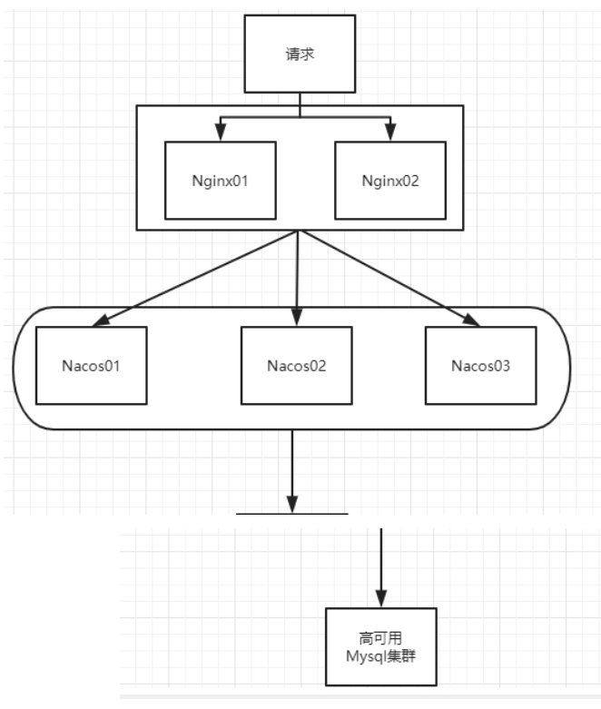


#### Linux版Nacos+MySQL生产环境配置

##### 预计需要，1个Nginx+3个nacos注册中心+1个mysql

##### 集群配置步骤(重点)

Docker官网给的，这种方式是伪集群，只是在一个Nacos里面文件脚本里面写了三个端口而已。

参考：https://nacos.io/zh-cn/docs/quick-start-docker.html

https://www.jianshu.com/p/00f30064fbae


###### 1、Linux服务器上mysql数据库配置

在Docker 上面搞了Mysql5.7 端口是3307.


###### 2、application.properties配置

修改application.properties

```properties
###########################  Mysql   ##############################

spring.datasource.platform=mysql

db.num=1
db.url.0=jdbc:mysql://47.92.208.93:3307/nacos_config?characterEncoding=utf8&connectTimeout=1000&socketTimeout=3000&autoReconnect=true&useUnicode=true&useSSL=false&serverTimezone=UTC
db.user=root
db.password=123456


```


这个可以在官网上找到：

https://github.com/alibaba/nacos/blob/master/distribution/conf/application.properties

官网有个小坑，就是数据库名不是nacos_config，要注意一下。


这里是docker中的nacos调用的docker的mysql中的nacas_config数据库。


搭建好了三个Nacos集群，都连上Mysql，在其中一个添加一条数据，其他三个都有。

记录激动人心的一刻：端口8848,8849,8859 

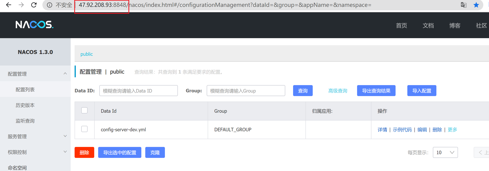


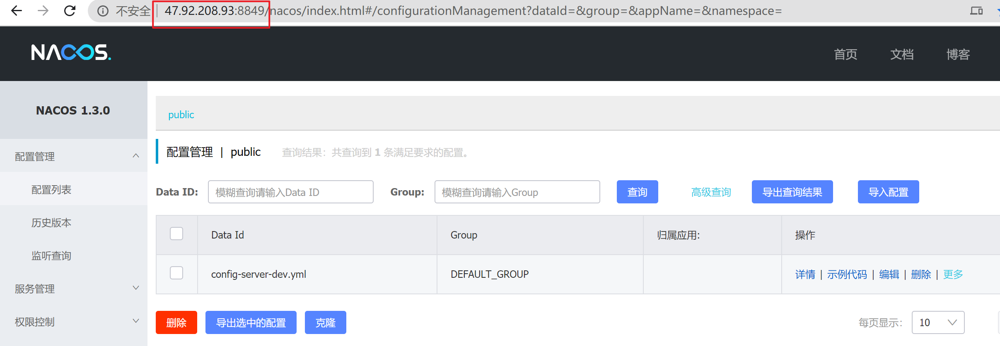


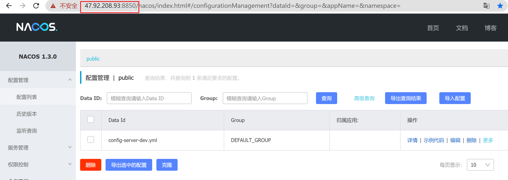

###### 3、Linux服务器上nacos的集群配置cluster.conf

###### 4、编辑Nacos的启动脚本startup.sh,使它能够接受不同的启动端

###### 5、Nginx的配置，由它作为负载均衡器

###### 6、截止到此处，1个Nginx+3个nacos注册中心+1个mysql


##### 测试

测试：nginx负载均衡起作用啦。庆祝一下。

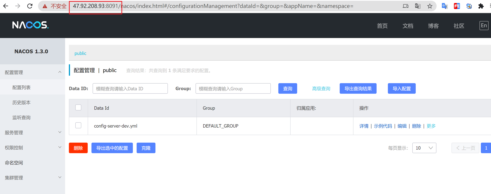

然后将9001，对应yml配置成nginx就可以试试啦。


成功：可用

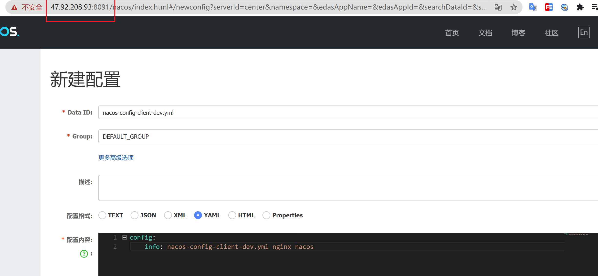

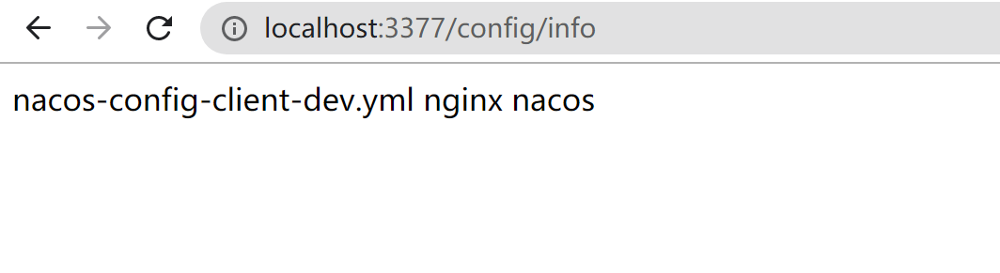

##### 高可用小总结

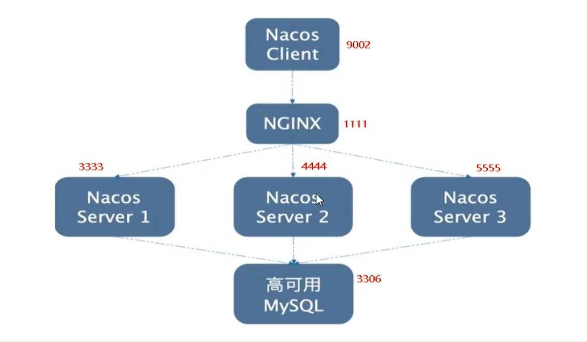


## SpringCloud Alibaba Sentinel实现熔断与限流


### Sentinel

### 安装Sentinel

### 初始化演示工程

### 流控规则

### 降级规则

### 热点key限流

### 系统规则

### @SentinelResource

### 服务熔断功能

### Sentinel规则持久化


# Interview

## 分布式

### 1.集群，分布式，微服务区别：

**集群是个物理形态，分布式是个工作方式。**

- 分布式：一个业务分拆多个子业务，部署在不同的服务器上
- 集群：同一个业务，部署在多个服务器上

1：**分布式是指将不同的业务分布在不同的地方。而集群指的是将几台服务器集中在一起，实现同一业务。**

分布式中的每一个节点，都可以做集群。而集群并不一定就是分布式的。

举例：就比如新浪网，访问的人多了，他可以做一个群集，前面放一个响应服务器，后面几台服务器完成同一业务，如果有业务访问的时候，响应服务器看哪台服务器的负载不是很重，就将给哪一台去完成。

而分布式，从窄意上理解，也跟集群差不多，但是它的组织比较松散，不像集群，有一个组织性，**一台服务器垮了，其它的服务器可以顶上来。**

**分布式的每一个节点，都完成不同的业务，一个节点垮了，那这个业务就不可访问了。**

2：简单说，**分布式是以缩短单个任务的执行时间来提升效率的，而集群则是通过提高单位时间内执行的任务数来提升效率。**

例如：如果一个任务由 10 个子任务组成，每个子任务单独执行需 1 小时，则在一台服务器上执行该任务需 10 小时。

采用分布式方案，提供 10 台服务器，每台服务器只负责处理一个子任务，不考虑子任务间的依赖关系，执行完这个任务只需一个小时。(这种工作模式的一个典型代表就是 Hadoop 的 Map/Reduce 分布式计算模型）

而采用集群方案，同样提供 10 台服务器，每台服务器都能独立处理这个任务。假设有 10 个任务同时到达，10 个服务器将同时工作，1 小时后，10 个任务同时完成，这样，整身来看，还是 1 小时内完成一个任务！

------

好的设计应该是分布式和集群的结合，先分布式再集群，具体实现就是业务拆分成很多子业务，然后针对每个子业务进行集群部署，这样每个子业务如果出了问题，整个系统完全不会受影响。

另外，还有一个概念和分布式比较相似，那就是**微服务。**

**微服务是一种架构风格，一个大型复杂软件应用由一个或多个微服务组成。系统中的各个微服务可被独立部署，各个微服务之间是松耦合的。每个微服务仅关注于完成一件任务并很好地完成该任务。在所有情况下，每个任务代表着一个小的业务能力。**


区别：

#### 1.分布式：


将一个大的系统划分为多个业务模块，业务模块分别部署到不同的机器上，各个业务模块之间通过接口进行数据交互。区别分布式的方式是根据不同机器不同业务。

**上面：service A、B、C、D 分别是业务组件，通过API Geteway进行业务访问。**

注：分布式需要做好事务管理。

分布式事务可参考：[微服务架构的分布式事务解决方案](https://my.oschina.net/838398/blog/761261)

#### **2.集群模式**


集群模式是不同服务器部署同一套服务对外访问，实现服务的负载均衡。区别集群的方式是根据部署多台服务器业务是否相同。

注：集群模式需要做好session共享，确保在不同服务器切换的过程中不会因为没有获取到session而中止退出服务。

一般配置Nginx*的负载容器实现：静态资源缓存、Session共享可以附带实现，Nginx支持5000个并发量。

#### 3.分布式是否属于微服务？

答案是肯定的。[微服务](http://lib.csdn.net/base/microservice)的意思也就是将模块拆分成一个独立的服务单元通过接口来实现数据的交互。

#### 4.微服务架构

微服务的设计是为了不因为某个模块的升级和BUG影响现有的系统业务。微服务与分布式的细微差别是，微服务的应用不一定是分散在多个服务器上，他也可以是同一个服务器。


通俗理解为：

去饭店吃饭就是一个完整的业务，饭店的厨师、配菜师、传菜员、服务员就是分布式；厨师、配菜师、传菜员和服务员都不止一个人，这就是集群；分布式就是微服务的一种表现形式，分布式是部署层面，微服务是设计层面。

参考：https://blog.csdn.net/qq_37788067/article/details/79250623?utm_medium=distribute.pc_relevant.none-task-blog-BlogCommendFromMachineLearnPai2-2.nonecase&depth_1-utm_source=distribute.pc_relevant.none-task-blog-BlogCommendFromMachineLearnPai2-2.nonecase


### 2.说一说分布式的结构或者实现原理


### 3.分布式事务相关

报装系统使用的是： https://www.jianshu.com/p/86b4ab4f2d18  这个分布式事务


#### 1.为什么要使用分布式事务？

答：当单个数据库的性能产生瓶颈的时候，我们需要对数据库分库或者是分区，那么这个时候数据库就处于不同的服务器上了，因此基于单个数据库所控制的传统型事务已经不能在适应这种情况了，故我们需要使用分布式事务来管理这种情况。

或者还有一些情况，需要在一次事务中操作两个不同的数据库。如果要用事务，那也算是分布式事务。


#### 2.什么叫分布式事务？

答：事务的资源分别位于不同的分布式系统的不同节点之上的事务，简单地说就是一个大的操作由两个或者更多的小的操作共同完成。而这些小的操作又分布在不同的网络主机上。这些操作，要么全部成功执行，要么全部不执行。


#### 3.分布式事务的原理？  


#### 4.分布式事务可以分为哪些?

答：两阶段提交（2PC），三阶段提交（3PC），补偿事务（TCC），本地消息表即消息队列（核心思想是将分布式事务拆分成本地事务进行处理）

分布式事务

参考：https://blog.csdn.net/weixin_40533111/article/details/85069536

参考：https://zhuanlan.zhihu.com/p/183753774

程序员小灰：https://blog.csdn.net/bjweimengshu/article/details/79607522


#### 5.熟悉分布式事务，那你说一下有哪几种使用方法？（二段式、三段式、TCC、MQ）？介绍一下二段式分布式事务的过程

#### 6.分布式事务中，幂等性问题？举个例子

参考：https://www.cnblogs.com/jajian/p/10926681.html


#### 7.钢性事务 柔性事务

1. 刚性事务：遵循ACID原则，强一致性。
2. 柔性事务：遵循BASE理论，最终一致性；与刚性事务不同，柔性事务允许一定时间内，不同节点的数据不一致，但要求最终一致。

参考：https://www.jianshu.com/p/d70df89665b9


#### 8.分布式事务是怎么处理的？你们项目如何实现分布式事务？

使用rocketMQ


**如何处理重复消费的问题**

让生产者发送每条数据的时候，里面加一个全局唯一的id，类似订单id之类的东西，然后你这里消费到了之后，先根据这个id去比如redis里查一下，之前消费过吗？如果没有消费过，你就处理，然后这个id写redis。如果消费过了，那你就别处理了，保证别重复处理相同的消息即可。


#### 9.介绍常见的分布式锁？介绍一下几种分布式锁?

单机环境下，我们用 Synchronized 关键字来修饰方法或者是修饰代码块，以此来保证方法内或者是代码块内的代码在同一时间只能被一个线程执行。但是如果到了分布式环境中，Synchronized 就不好使了，因为他是 JVM 提供的关键字，只能在一台 JVM 中保证同一时间
只有一个线程执行，那么假如现在有多台 JVM 了（项目有多个节点了），那么就需要分布式锁来保证同一时间，在多个节点内，只有一个线程在执行该代码。

基于数据库实现分布式锁 基于缓存（redis，memcached，tair）实现分布式锁 基于Zookeeper实现分布式锁（每个客户端对某个方法加锁时，在zookeeper上的与该方法对应的指定节点的目录下，生成一个唯一的瞬时有序节点。 判断是否获取锁的方式很简单，只需要判断有序节点中序号最小的一个。 当释放锁的时候，只需将这个瞬时节点删除即可。同时，其可以避免服务宕机导致的锁无法释放，而产生的死锁问题。）


##### 三种实现方式：

##### 1 基于数据库：

数据库自带的通过唯一性索引或者主键索引，通过它的唯一性，当某个节点来使用某个方法时就在数据库中添加固定的值，这样别的节点来使用这个方法就会因为不能添加这个唯一字段而失败。这样就实现了锁。一个节点执行完毕后就删除这一行数据，别的节点就又能访问这个方法了，这就是释放锁。但是一方面，数据库本身性能就低，而且这种形式非常容易死锁，虽然可以各种优化，但还是不推荐使用。数据库的乐观锁也是一个道理，一般不用

##### 2 Redis 分布式锁

SETNX 关键字，设置参数如果存在返回 0，如果不存在返回 value 和 1 expire 关键字，为 key 设置过期时间，解决死锁。delete 关键字，删除 key，释放锁

实现思想：
（1）获取锁的时候，使用 setnx 加锁，并使用 expire 命令为锁添加一个超时时间，超过该
时间则自动释放锁，锁的 value 值为一个随机生成的 UUID，通过此在释放锁的时候进行判
断。
（2）获取锁的时候还设置一个获取的超时时间，若超过这个时间则放弃获取锁。
（3）释放锁的时候，通过 UUID 判断是不是该锁，若是该锁，则执行 delete 进行锁释放。

##### 3 zookeeper 实现分布式锁

ZooKeeper 是一个为分布式应用提供一致性服务的开源组件，它内部是一个分层的文件系统
目录树结构，规定同一个目录下只能有一个唯一文件名。基于 ZooKeeper 实现分布式锁的
步骤如下：
（1）创建一个目录 mylock；
（2）线程 A 想获取锁就在 mylock 目录下创建临时顺序节点；
（3）获取 mylock 目录下所有的子节点，然后获取比自己小的兄弟节点，如果不存在，则说
明当前线程顺序号最小，获得锁；
（4）线程 B 获取所有节点，判断自己不是最小节点，设置监听比自己次小的节点；
（5）线程 A 处理完，删除自己的节点，线程 B 监听到变更事件，判断自己是不是最小的节
点，如果是则获得锁。
速度没有 redis 快，但是能够解决死锁问题，可用性高于 redis


#### 10.TCC相关 分布式事务

TCC的原理？如果进行分布式事务的时候，try阶段完成了，但是confirm阶段有一台服务器宕机了怎么办？进行事务的时候，如果TCC服务器宕机了，重新启动之后未完成的事务怎么办？

说一下对TCC（分布式事务）的理解？TCC的原理？你们用的TCC框架是什么？

参考：https://www.cnblogs.com/jajian/p/10014145.html


开局tcc ，了解分布式事务吗，如果a事务使用gcc的注解，里面调用b事务，如何保证事务的一致性

说一下你对分布式的了解？(说了dubbo)


#### 11.分布式事务的实现方式有哪些，两阶段提交的模式，即TCC会有什么问题


#### 12.分布式事务的ACP有了解吗？(原子性，一致性，可用性)

参考一篇很好的文章  公众号里面的https://mp.weixin.qq.com/s/EU1u6scpiPkTuoMbly-WSg

#### 14.你对分布式和微服务的理解?


#### 15.分布式和集群有什么区别，分布式有什么问题，TCC具体是怎么操作的？


#### 16.分布式并发产生的脏数据是怎么样处理的，有没有了解过分布式锁？


#### 17.分布式CAP理论

分布式系统不可能同时满足一致性 可用性 分区容忍性


#### 18.事务以及分布式事务


#### 19.分布式如何携带信息？


## 微服务

1.为什么有微服务架构以及与单体架构的区别，为什么要这样做，可以提前准备一些背景知识

2.为什么要采用微服务的架构？和传统的架构相比有哪些好处和缺点？

3.微服务的注册中心 熔断器用的是什么

4.微服务各个模块之间怎么样实现消息同步？

你对微服务有什么看法？

13微服务项目是前后端分离的吗？怎么解决跨域，那跨域的时候有需要在请求头里生成些什么东西吗？需要加什么请求头前端才能跨域访问后端


# SpringCloud常见问题汇总

https://blog.csdn.net/hjq_ku/article/details/89504229  

https://blog.csdn.net/qq_40117549/article/details/84944840 

https://www.cnblogs.com/aishangJava/p/11927311.html  这个也很好 

https://baijiahao.baidu.com/s?id=1654336657640346337&wfr=spider&for=pc

https://www.cnblogs.com/lingboweifu/p/11797840.html