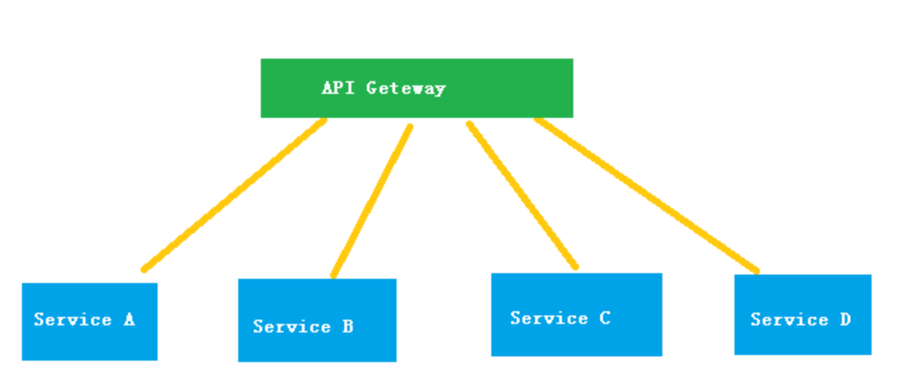
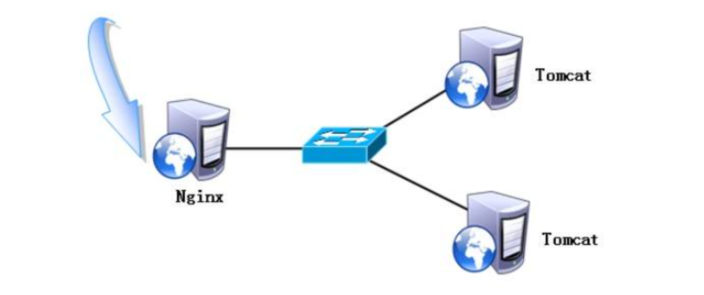
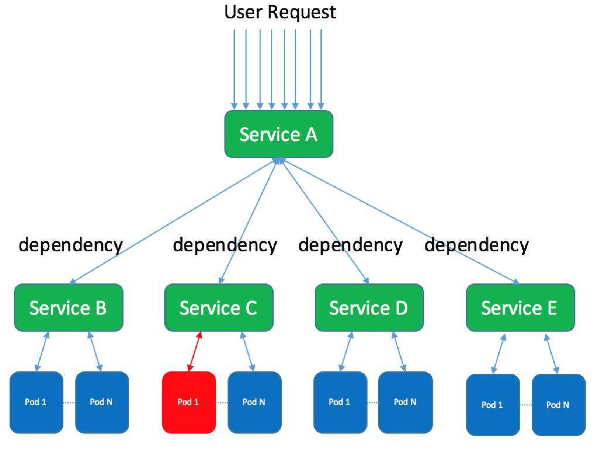
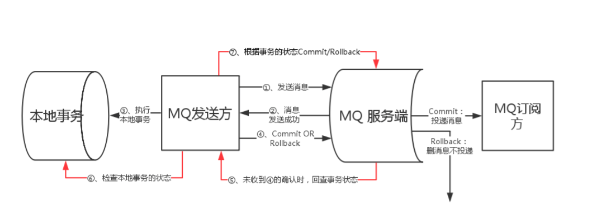
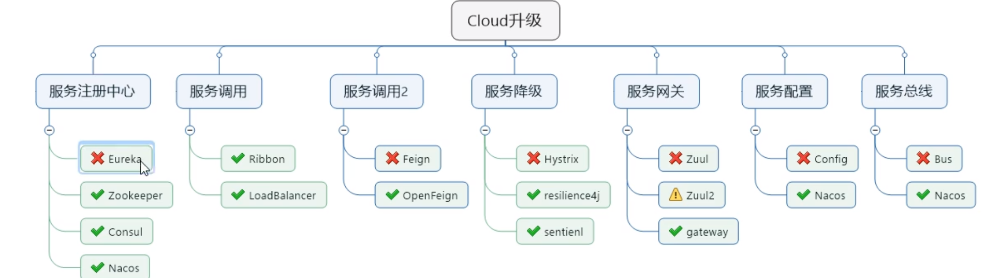

# SpringCloud

# Interview

## 分布式

### 1.集群，分布式，微服务区别：

**集群是个物理形态，分布式是个工作方式。**

- 分布式：一个业务分拆多个子业务，部署在不同的服务器上
- 集群：同一个业务，部署在多个服务器上

1：**分布式是指将不同的业务分布在不同的地方。而集群指的是将几台服务器集中在一起，实现同一业务。**

分布式中的每一个节点，都可以做集群。而集群并不一定就是分布式的。

举例：就比如新浪网，访问的人多了，他可以做一个群集，前面放一个响应服务器，后面几台服务器完成同一业务，如果有业务访问的时候，响应服务器看哪台服务器的负载不是很重，就将给哪一台去完成。

而分布式，从窄意上理解，也跟集群差不多，但是它的组织比较松散，不像集群，有一个组织性，**一台服务器垮了，其它的服务器可以顶上来。**

**分布式的每一个节点，都完成不同的业务，一个节点垮了，那这个业务就不可访问了。**

2：简单说，**分布式是以缩短单个任务的执行时间来提升效率的，而集群则是通过提高单位时间内执行的任务数来提升效率。**

例如：如果一个任务由 10 个子任务组成，每个子任务单独执行需 1 小时，则在一台服务器上执行该任务需 10 小时。

采用分布式方案，提供 10 台服务器，每台服务器只负责处理一个子任务，不考虑子任务间的依赖关系，执行完这个任务只需一个小时。(这种工作模式的一个典型代表就是 Hadoop 的 Map/Reduce 分布式计算模型）

而采用集群方案，同样提供 10 台服务器，每台服务器都能独立处理这个任务。假设有 10 个任务同时到达，10 个服务器将同时工作，1 小时后，10 个任务同时完成，这样，整身来看，还是 1 小时内完成一个任务！

------

好的设计应该是分布式和集群的结合，先分布式再集群，具体实现就是业务拆分成很多子业务，然后针对每个子业务进行集群部署，这样每个子业务如果出了问题，整个系统完全不会受影响。

另外，还有一个概念和分布式比较相似，那就是**微服务。**

**微服务是一种架构风格，一个大型复杂软件应用由一个或多个微服务组成。系统中的各个微服务可被独立部署，各个微服务之间是松耦合的。每个微服务仅关注于完成一件任务并很好地完成该任务。在所有情况下，每个任务代表着一个小的业务能力。**

区别：

#### 1.分布式：

将一个大的系统划分为多个业务模块，业务模块分别部署到不同的机器上，各个业务模块之间通过接口进行数据交互。区别分布式的方式是根据不同机器不同业务。

**上面：service A、B、C、D 分别是业务组件，通过API Geteway进行业务访问。**

注：分布式需要做好事务管理。

分布式事务可参考：[微服务架构的分布式事务解决方案](https://my.oschina.net/838398/blog/761261)

#### **2.集群模式**

集群模式是不同服务器部署同一套服务对外访问，实现服务的负载均衡。区别集群的方式是根据部署多台服务器业务是否相同。

注：集群模式需要做好session共享，确保在不同服务器切换的过程中不会因为没有获取到session而中止退出服务。

一般配置Nginx*的负载容器实现：静态资源缓存、Session共享可以附带实现，Nginx支持5000个并发量。

#### 3.分布式是否属于微服务？

答案是肯定的。[微服务](http://lib.csdn.net/base/microservice)的意思也就是将模块拆分成一个独立的服务单元通过接口来实现数据的交互。

#### 4.微服务架构

微服务的设计是为了不因为某个模块的升级和BUG影响现有的系统业务。微服务与分布式的细微差别是，微服务的应用不一定是分散在多个服务器上，他也可以是同一个服务器。

通俗理解为：

去饭店吃饭就是一个完整的业务，饭店的厨师、配菜师、传菜员、服务员就是分布式；厨师、配菜师、传菜员和服务员都不止一个人，这就是集群；分布式就是微服务的一种表现形式，分布式是部署层面，微服务是设计层面。

参考：https://blog.csdn.net/qq_37788067/article/details/79250623?utm_medium=distribute.pc_relevant.none-task-blog-BlogCommendFromMachineLearnPai2-2.nonecase&depth_1-utm_source=distribute.pc_relevant.none-task-blog-BlogCommendFromMachineLearnPai2-2.nonecase

### 2.说一说分布式的结构或者实现原理

### 3.分布式事务相关

报装系统使用的是： https://www.jianshu.com/p/86b4ab4f2d18  这个分布式事务

#### 1.为什么要使用分布式事务？

答：当单个数据库的性能产生瓶颈的时候，我们需要对数据库分库或者是分区，那么这个时候数据库就处于不同的服务器上了，因此基于单个数据库所控制的传统型事务已经不能在适应这种情况了，故我们需要使用分布式事务来管理这种情况。

或者还有一些情况，需要在一次事务中操作两个不同的数据库。如果要用事务，那也算是分布式事务。

#### 2.什么叫分布式事务？

答：事务的资源分别位于不同的分布式系统的不同节点之上的事务，简单地说就是一个大的操作由两个或者更多的小的操作共同完成。而这些小的操作又分布在不同的网络主机上。这些操作，要么全部成功执行，要么全部不执行。

#### 3.分布式事务的原理？  

#### 4.分布式事务可以分为哪些?

答：两阶段提交（2PC），三阶段提交（3PC），补偿事务（TCC），本地消息表即消息队列（核心思想是将分布式事务拆分成本地事务进行处理）

分布式事务

参考：https://blog.csdn.net/weixin_40533111/article/details/85069536

参考：https://zhuanlan.zhihu.com/p/183753774

程序员小灰：https://blog.csdn.net/bjweimengshu/article/details/79607522

#### 5.熟悉分布式事务，那你说一下有哪几种使用方法？（二段式、三段式、TCC、MQ）？介绍一下二段式分布式事务的过程

#### 6.分布式事务中，幂等性问题？举个例子

参考：https://www.cnblogs.com/jajian/p/10926681.html

#### 7.钢性事务 柔性事务

1. 刚性事务：遵循ACID原则，强一致性。
2. 柔性事务：遵循BASE理论，最终一致性；与刚性事务不同，柔性事务允许一定时间内，不同节点的数据不一致，但要求最终一致。

参考：https://www.jianshu.com/p/d70df89665b9

#### 8.分布式事务是怎么处理的？你们项目如何实现分布式事务？

使用rocketMQ

**如何处理重复消费的问题**

让生产者发送每条数据的时候，里面加一个全局唯一的id，类似订单id之类的东西，然后你这里消费到了之后，先根据这个id去比如redis里查一下，之前消费过吗？如果没有消费过，你就处理，然后这个id写redis。如果消费过了，那你就别处理了，保证别重复处理相同的消息即可。

#### 9.介绍常见的分布式锁？介绍一下几种分布式锁?

单机环境下，我们用 Synchronized 关键字来修饰方法或者是修饰代码块，以此来保证方法内或者是代码块内的代码在同一时间只能被一个线程执行。但是如果到了分布式环境中，Synchronized 就不好使了，因为他是 JVM 提供的关键字，只能在一台 JVM 中保证同一时间
只有一个线程执行，那么假如现在有多台 JVM 了（项目有多个节点了），那么就需要分布式锁来保证同一时间，在多个节点内，只有一个线程在执行该代码。

基于数据库实现分布式锁 基于缓存（redis，memcached，tair）实现分布式锁 基于Zookeeper实现分布式锁（每个客户端对某个方法加锁时，在zookeeper上的与该方法对应的指定节点的目录下，生成一个唯一的瞬时有序节点。 判断是否获取锁的方式很简单，只需要判断有序节点中序号最小的一个。 当释放锁的时候，只需将这个瞬时节点删除即可。同时，其可以避免服务宕机导致的锁无法释放，而产生的死锁问题。）

##### 三种实现方式：

##### 1 基于数据库：

数据库自带的通过唯一性索引或者主键索引，通过它的唯一性，当某个节点来使用某个方法时就在数据库中添加固定的值，这样别的节点来使用这个方法就会因为不能添加这个唯一字段而失败。这样就实现了锁。一个节点执行完毕后就删除这一行数据，别的节点就又能访问这个方法了，这就是释放锁。但是一方面，数据库本身性能就低，而且这种形式非常容易死锁，虽然可以各种优化，但还是不推荐使用。数据库的乐观锁也是一个道理，一般不用

##### 2 Redis 分布式锁

SETNX 关键字，设置参数如果存在返回 0，如果不存在返回 value 和 1 expire 关键字，为 key 设置过期时间，解决死锁。delete 关键字，删除 key，释放锁

实现思想：
（1）获取锁的时候，使用 setnx 加锁，并使用 expire 命令为锁添加一个超时时间，超过该
时间则自动释放锁，锁的 value 值为一个随机生成的 UUID，通过此在释放锁的时候进行判
断。
（2）获取锁的时候还设置一个获取的超时时间，若超过这个时间则放弃获取锁。
（3）释放锁的时候，通过 UUID 判断是不是该锁，若是该锁，则执行 delete 进行锁释放。

##### 3 zookeeper 实现分布式锁

ZooKeeper 是一个为分布式应用提供一致性服务的开源组件，它内部是一个分层的文件系统
目录树结构，规定同一个目录下只能有一个唯一文件名。基于 ZooKeeper 实现分布式锁的
步骤如下：
（1）创建一个目录 mylock；
（2）线程 A 想获取锁就在 mylock 目录下创建临时顺序节点；
（3）获取 mylock 目录下所有的子节点，然后获取比自己小的兄弟节点，如果不存在，则说
明当前线程顺序号最小，获得锁；
（4）线程 B 获取所有节点，判断自己不是最小节点，设置监听比自己次小的节点；
（5）线程 A 处理完，删除自己的节点，线程 B 监听到变更事件，判断自己是不是最小的节
点，如果是则获得锁。
速度没有 redis 快，但是能够解决死锁问题，可用性高于 redis

#### 10.TCC相关 分布式事务

TCC的原理？如果进行分布式事务的时候，try阶段完成了，但是confirm阶段有一台服务器宕机了怎么办？进行事务的时候，如果TCC服务器宕机了，重新启动之后未完成的事务怎么办？

说一下对TCC（分布式事务）的理解？TCC的原理？你们用的TCC框架是什么？

参考：https://www.cnblogs.com/jajian/p/10014145.html

开局tcc ，了解分布式事务吗，如果a事务使用gcc的注解，里面调用b事务，如何保证事务的一致性

说一下你对分布式的了解？(说了dubbo)

#### 11.分布式事务的实现方式有哪些，两阶段提交的模式，即TCC会有什么问题

#### 12.分布式事务的ACP有了解吗？(原子性，一致性，可用性)

参考一篇很好的文章  公众号里面的https://mp.weixin.qq.com/s/EU1u6scpiPkTuoMbly-WSg

#### 14.你对分布式和微服务的理解?

#### 15.分布式和集群有什么区别，分布式有什么问题，TCC具体是怎么操作的？

#### 16.分布式并发产生的脏数据是怎么样处理的，有没有了解过分布式锁？

#### 17.分布式CAP理论

分布式系统不可能同时满足一致性 可用性 分区容忍性

#### 18.事务以及分布式事务

#### 19.分布式如何携带信息？

## 微服务

1.为什么有微服务架构以及与单体架构的区别，为什么要这样做，可以提前准备一些背景知识

2.为什么要采用微服务的架构？和传统的架构相比有哪些好处和缺点？

3.微服务的注册中心 熔断器用的是什么

4.微服务各个模块之间怎么样实现消息同步？

你对微服务有什么看法？

13微服务项目是前后端分离的吗？怎么解决跨域，那跨域的时候有需要在请求头里生成些什么东西吗？需要加什么请求头前端才能跨域访问后端

##  SpringCloud相关

### 1.Springcloud介绍

家族介绍介绍

### 2.SpringCloud 和Dubbo比较

从下面几个方面来说：

社区活跃度，开发公司，未来发展，使用上手难易程度，性能，周边完善程度

**Spring相当于整机，而Dubbo需要自己去组装，整机的性能有保证，组装的机子更自由。**

#### 社区活跃度

SpringCloud社区活跃度高，也有专业团队在维护，常年很活跃。Dubbo阿里开发，中间停止更新过一段时间，2017年重新又更新，未来会不会持续更新，说不准，但是SpringCloud会应该一直更新。

#### 开发公司、未来发展

阿里和Spring团队还是有区别，阿里是商业公司，Spring团队致力于打造全球使用的开源框架，未来SpringCloud作为Spring的一个很重要的项目，Spring团队会好好去维护。Dubbo团队不一定。

#### 上手难度

SpringCloud上手容易，他里面包含的好多组件，需要什么，自己可以去使用。在我自己的公司，我们使用的是SpringCloud，只是将Dubbo是作为一个服务调用组件来使用的（Dubbo最开始的定位之一）而Dubbo上手难度大，需要公司有专业的中间件团队来修改和维护Dubbo，或者集成其他组件等，上手难度大。

#### 速度、性能方面

Dubbo由于是二进制的传输，占用带宽会更少

SpringCloud是HTTP协议传输，带宽会比较多，同时使用HTTP协议一般会使用JSON报文，消耗会更大

参考（这几篇文章写的比较全，从各个方面介绍）：

https://www.cnblogs.com/hmy-1365/p/11050265.html

https://www.cnblogs.com/just-for-beyond/p/9790227.html

知乎：https://www.zhihu.com/question/45413135/answer/128315403 

### 3.简述Springcloud核心组件及用途   

- 服务发现（服务注册中心）——Netflix Eureka、后来用Nacos
- 服务调用   ——  Ribbon、LoadBalancer，公司用的是Dubbo调用
- 客服端负载均衡—— Netflix Ribbon
- 断路器（服务降级）—— Netflix Hystrix，高级部分有sentienl
- 服务网关——Netflix Zuul（停更）、gateway（常用）
- 分布式配置——Spring Cloud Config 、后来用的Nacos

## SpringCloud常见问题汇总

https://blog.csdn.net/hjq_ku/article/details/89504229  

https://blog.csdn.net/qq_40117549/article/details/84944840 

https://www.cnblogs.com/aishangJava/p/11927311.html  这个也很好 

https://baijiahao.baidu.com/s?id=1654336657640346337&wfr=spider&for=pc

https://www.cnblogs.com/lingboweifu/p/11797840.html

