Utils


> 这一部分内容是一些比较碎的知识，有常用工具类，

## 目录

[TOC]


# BigDecimal

## 为什么要用这个？

既然要处理小数用 double 不可以吗，为什么要用这个？


**个人理解：**

- 不用double是因为在计算类似金额等要求精度非常高的数据是，double不精确。

- 由于我已经工作了一段时间了，对实际企业开发有了一些理解，我以前做过一个交易所项目，里面有很多钱的交易，有金额，冻结金额等等很多，工程款，缴纳金额，欠费金额等，每一分钱都不能少，所以需要一个精度很高的类型来记录金额。


> 参考：https://www.cnblogs.com/zhangyinhua/p/11545305.html
>
> https://blog.csdn.net/haiyinshushe/article/details/82721234

## Bigdecimal 初始化

**推荐用字符串初始化**

这里对比了两种形式，第一种直接value写数字的值，第二种用string来表示

```java
BigDecimal num1 = new BigDecimal(0.005);
BigDecimal num2 = new BigDecimal(1000000);
BigDecimal num3 = new BigDecimal(-1000000);
//尽量用字符串的形式初始化
BigDecimal num12 = new BigDecimal("0.005");
BigDecimal num22 = new BigDecimal("1000000");
BigDecimal num32 = new BigDecimal("-1000000");
```

## BigDecimal的加减乘除运算:


我们对其进行加减乘除绝对值的运算
我这里承接上面初始化Bigdecimal分别用string和数进行运算对比

```java
//加法
BigDecimal result1 = num1.add(num2);
BigDecimal result12 = num12.add(num22);

//减法
BigDecimal result2 = num1.subtract(num2);
BigDecimal result22 = num12.subtract(num22);

//乘法
BigDecimal result3 = num1.multiply(num2);
BigDecimal result32 = num12.multiply(num22);

//绝对值
BigDecimal result4 = num3.abs();
BigDecimal result42 = num32.abs();

//除法
BigDecimal result5 = num2.divide(num1,20,BigDecimal.ROUND_HALF_UP);
BigDecimal result52 = num22.divide(num12,20,BigDecimal.ROUND_HALF_UP);
```


从上到下分别输出：

```java
加法用value结果：1000000.005000000000000000104083408558608425664715468883514404296875
加法用string结果：1000000.005

减法value结果：-999999.994999999999999999895916591441391574335284531116485595703125
减法用string结果：-999999.995

乘法用value结果：5000.000000000000104083408558608425664715468883514404296875000000
乘法用string结果：5000.000

绝对值用value结果：1000000
绝对值用string结果：1000000

除法用value结果：199999999.99999999583666365766
除法用string结果：200000000.00000000000000000000
```


这里出现了差异，这也是为什么初始化建议使用string的原因。


### 注意

1）System.out.println()中的数字默认是double类型的，double类型小数计算不精准。

2）使用BigDecimal类构造方法传入double类型时，计算的结果也是不精确的！


因为不是所有的浮点数都能够被精确的表示成一个double 类型值，有些浮点数值不能够被精确的表示成 double 类型值，因此它会被表示成与它最接近的 double 类型的值。必须改用传入String的构造方法。这一点在BigDecimal类的构造方法注释中有说明。

完整的test代码如下：

```java
import java.math.BigDecimal;
import java.util.Scanner;

public class TestThree {
	public static void main(String[] args) {
 
        BigDecimal num1 = new BigDecimal(0.005);
        BigDecimal num2 = new BigDecimal(1000000);
        BigDecimal num3 = new BigDecimal(-1000000);
        //尽量用字符串的形式初始化
        BigDecimal num12 = new BigDecimal("0.005");
        BigDecimal num22 = new BigDecimal("1000000");
        BigDecimal num32 = new BigDecimal("-1000000");

        //加法
        BigDecimal result1 = num1.add(num2);
        BigDecimal result12 = num12.add(num22);
        //减法
        BigDecimal result2 = num1.subtract(num2);
        BigDecimal result22 = num12.subtract(num22);
        //乘法
        BigDecimal result3 = num1.multiply(num2);
        BigDecimal result32 = num12.multiply(num22);
        //绝对值
        BigDecimal result4 = num3.abs();
        BigDecimal result42 = num32.abs();
        //除法
        BigDecimal result5 = num2.divide(num1,20,BigDecimal.ROUND_HALF_UP);
        BigDecimal result52 = num22.divide(num12,20,BigDecimal.ROUND_HALF_UP);

        System.out.println("加法用value结果："+result1);
        System.out.println("加法用string结果："+result12);

        System.out.println("减法value结果："+result2);
        System.out.println("减法用string结果："+result22);

        System.out.println("乘法用value结果："+result3);
        System.out.println("乘法用string结果："+result32);

        System.out.println("绝对值用value结果："+result4);
        System.out.println("绝对值用string结果："+result42);

        System.out.println("除法用value结果："+result5);
        System.out.println("除法用string结果："+result52);
	}
}
```


### 乘法 

#### 保留两位小数

```java
//价税合计金额=金额+金额*税率  这里填负数（且保留两位小数） 这里不用计算啦 保存之前计算过啦
BigDecimal bigDecimal = new BigDecimal("65.4067");

BigDecimal bigDecimal2 = bigDecimal.setScale(2,BigDecimal.ROUND_HALF_UP);
System.out.println(bigDecimal2);
		
```


### 除法

**除法divide() 参数使用：**

使用除法函数在divide的时候要设置各种参数，要精确的小数位数和舍入模式，不然会出现报错

我们可以看到divide函数配置的参数如下

**即为 （BigDecimal divisor 除数， int scale 精确小数位，  int roundingMode 舍入模式）**
可以看到舍入模式有很多种BigDecimal.ROUND_XXXX_XXX, 具体都是什么意思呢？


计算1÷3的结果（最后一种ROUND_UNNECESSARY在结果为无限小数的情况下会报错）


#### 八种舍入模式解释如下

1、ROUND_UP

舍入远离零的舍入模式。

在丢弃非零部分之前始终增加数字(始终对非零舍弃部分前面的数字加1)。

注意，此舍入模式始终不会减少计算值的大小。

2、ROUND_DOWN

接近零的舍入模式。

在丢弃某部分之前始终不增加数字(从不对舍弃部分前面的数字加1，即截短)。

注意，此舍入模式始终不会增加计算值的大小。

3、ROUND_CEILING

接近正无穷大的舍入模式。

如果 BigDecimal 为正，则舍入行为与 ROUND_UP 相同;

如果为负，则舍入行为与 ROUND_DOWN 相同。

注意，此舍入模式始终不会减少计算值。

4、ROUND_FLOOR

接近负无穷大的舍入模式。

如果 BigDecimal 为正，则舍入行为与 ROUND_DOWN 相同;

如果为负，则舍入行为与 ROUND_UP 相同。

注意，此舍入模式始终不会增加计算值。

5、ROUND_HALF_UP

向“最接近的”数字舍入，如果与两个相邻数字的距离相等，则为向上舍入的舍入模式。

如果舍弃部分 >= 0.5，则舍入行为与 ROUND_UP 相同;否则舍入行为与 ROUND_DOWN 相同。

注意，这是我们大多数人在小学时就学过的舍入模式(四舍五入)。

6、ROUND_HALF_DOWN

向“最接近的”数字舍入，如果与两个相邻数字的距离相等，则为上舍入的舍入模式。

如果舍弃部分 > 0.5，则舍入行为与 ROUND_UP 相同;否则舍入行为与 ROUND_DOWN 相同(五舍六入)。

7、ROUND_HALF_EVEN

向“最接近的”数字舍入，如果与两个相邻数字的距离相等，则向相邻的偶数舍入。

如果舍弃部分左边的数字为奇数，则舍入行为与 ROUND_HALF_UP 相同;

如果为偶数，则舍入行为与 ROUND_HALF_DOWN 相同。

注意，在重复进行一系列计算时，此舍入模式可以将累加错误减到最小。

此舍入模式也称为“银行家舍入法”，主要在美国使用。四舍六入，五分两种情况。

如果前一位为奇数，则入位，否则舍去。

以下例子为保留小数点1位，那么这种舍入方式下的结果。

1.15>1.2 1.25>1.2

8、ROUND_UNNECESSARY

断言请求的操作具有精确的结果，因此不需要舍入。

如果对获得精确结果的操作指定此舍入模式，则抛出ArithmeticException。


## BigDecimal转换成int

```java
BigDecimal b=new BigDecimal(45.45);

int a = b.intValue();
```


## BigDecima比较大小

```java
BigDecimal a = new BigDecimal (101);
BigDecimal b = new BigDecimal (111);

//使用compareTo方法比较
//注意：a、b均不能为null，否则会报空指针
if(a.compareTo(b) == -1){
    System.out.println("a小于b");
}

if(a.compareTo(b) == 0){
    System.out.println("a等于b");
}

if(a.compareTo(b) == 1){
    System.out.println("a大于b");
}

if(a.compareTo(b) > -1){
    System.out.println("a大于等于b");
}

if(a.compareTo(b) < 1){
    System.out.println("a小于等于b");
}
```


## BigDecima 判断是否为0

**1.我之前用来判断Bigdecimal类型是否等于0的方法**

```java
equals(BigDecimal.ZERO)
```

用equals方法和BigDecimal.ZERO进行比较。


**2.上面方法存在的问题**

有一天，调用这个这句代码的时候，传入的确实是0，但却返回false

查看源代码发现：

Bigdecimal的equals方法不仅仅比较值的大小是否相等，首先比较的是scale（scale是bigdecimal的保留小数点位数，比如 new 

Bigdecimal("1.001"),scale为3），也就是说，不但值得大小要相等，保留位数也要相等，equals才能返回true。

Bigdecimal b = new Bigdecimal("0") 和 Bigdecimal c = new Bigdecimal("0.0"),用equals比较，返回就是false。

Bigdecimal.ZERO的scale为0。

所以，用equals方法要注意这一点。


**3.用b.compareTo(BigDecimal.ZERO)==0，可以比较是否等于0，返回true则等于0，返回false，则不等于0**


# 各种基本类型相互转换

## Short 转换为Integer

```java
Integer number = Integer.valueOf(orderGoods.getNumber());
```


## Double转换为long，int，float，byte，short

```java
System.out.println(new Double(3.5).longValue());
System.out.println(new Double(3.5).intValue());
System.out.println(new Double(3.5).floatValue());
System.out.println(new Double(3.5).byteValue());
System.out.println(new Double(3.5).shortValue());
```

结果：

```java
3
3
3.5
3
3
```


## 将Double转换为long（亲测有效）

```java
@Test
public void test6(){
    Double d = 11.91;
    Long l = Math.round(d);  //首先四舍五入 去掉小数后位数

    String str = String.valueOf(l);
    System.out.println(str);

    Long ll = Long.parseLong(str);
    System.out.println(ll);
}

@Test
public void test7(){
    Double d = 11.91;

    String str = String.valueOf(d);  //首先转换为string类型
    System.out.println(str);

    Long ll = new Double(str).longValue(); //然后将str转换为double类型，再用Double的方法，将其转换为long类型
    System.out.println(ll);
}
```


# 时间类相关

## LocalDateTime

商城项目目前用的是这个当前时间:

```
orderGoods.setAddTime(LocalDateTime.now());
```


LocalDateTime Java.time 处理时间的新类

处理日期 计算天数，推荐java.time 包 或者 org.joda

https://blog.csdn.net/wsywb111/article/details/86543637


### 时间戳和日期转换:

```java
import java.text.SimpleDateFormat;
import java.util.Date;

public class DateUtil {
    /** 
     * 时间戳转换成日期格式字符串 
     * @param seconds 精确到秒的字符串 
     * @param formatStr 
     * @return 
     */  
    public static String timeStamp2Date(String seconds,String format) {  
        if(seconds == null || seconds.isEmpty() || seconds.equals("null")){  
            return "";  
        }  
        if(format == null || format.isEmpty()){
            format = "yyyy-MM-dd HH:mm:ss";
        }   
        SimpleDateFormat sdf = new SimpleDateFormat(format);  
        return sdf.format(new Date(Long.valueOf(seconds+"000")));  
    }  
    /** 
     * 日期格式字符串转换成时间戳 
     * @param date 字符串日期 
     * @param format 如：yyyy-MM-dd HH:mm:ss 
     * @return 
     */  
    public static String date2TimeStamp(String date_str,String format){  
        try {  
            SimpleDateFormat sdf = new SimpleDateFormat(format);  
            return String.valueOf(sdf.parse(date_str).getTime()/1000);  
        } catch (Exception e) {  
            e.printStackTrace();  
        }  
        return "";  
    }  
      
    /** 
     * 取得当前时间戳（精确到秒） 
     * @return 
     */  
    public static String timeStamp(){  
        long time = System.currentTimeMillis();
        String t = String.valueOf(time/1000);  
        return t;  
    }  

    public static void main(String[] args) {  
        String timeStamp = timeStamp();  
        System.out.println("timeStamp="+timeStamp); //运行输出:timeStamp=1470278082
        System.out.println(System.currentTimeMillis());//运行输出:1470278082980
        //该方法的作用是返回当前的计算机时间，时间的表达格式为当前计算机时间和GMT时间(格林威治时间)1970年1月1号0时0分0秒所差的毫秒数
        
        String date = timeStamp2Date(timeStamp, "yyyy-MM-dd HH:mm:ss");  
        System.out.println("date="+date);//运行输出:date=2016-08-04 10:34:42
        
        String timeStamp2 = date2TimeStamp(date, "yyyy-MM-dd HH:mm:ss");  
        System.out.println(timeStamp2);  //运行输出:1470278082
    }  
}
```


Pgsql 需要根据时间段查创建时间是否在这个范围内：

```xml
//济宁报装这么写的
<if test="startDate != null and startDate != ''">
    and to_char(create_at,'yyyy-MM-dd') <![CDATA[>=]]> #{startDate}
</if>
<if test="endDate != null and endDate != ''">
    and to_char(create_at,'yyyy-MM-dd') <![CDATA[<=]]> #{endDate}
</if>

<if test="startMonth != null and startMonth != ''">
    and to_char(create_at,'yyyy-MM') <![CDATA[>=]]> #{startMonth}
</if>
<if test="endMonth != null and endMonth != ''">
    and to_char(create_at,'yyyy-MM') <![CDATA[<=]]> #{endMonth}
</if>

```


### 字符串和时间的转换

```java
//1.把日期转换成字符串
import java.text.SimpleDateFormat;
import java.util.Date;
 
public class Test01 {
    public static void main(String[] args) {
        Date date = new Date(); //获取当前时间
        System.out.println(date.getClass().getName());  //打印date数据类型
        System.out.println(date);           //打印当前时间
        SimpleDateFormat sdf = new SimpleDateFormat("yyyy-MM-dd HH:mm:ss");
        String format = sdf.format(date);       //将Date类型转换成String类型   
        System.out.println(format.getClass().getName());//打印format数据类型
        System.out.println(format);　　　　　　　　　　　　//打印当前时间
    }
}
 
 
结果：
java.util.Date
Tue Dec 26 19:31:48 CST 2017
java.lang.String
2017-12-26 19:31:48
    
    
//2，把字符串转换成日期
import java.text.ParseException;
import java.text.SimpleDateFormat;
import java.util.Date;
 
public class Test01 {
    public static void main(String[] args) {
        String time = "1994-11-24 07:11:24";   
        SimpleDateFormat sdf = new SimpleDateFormat("yyyy-MM-dd HH:mm:ss");
        try {
            Date date = sdf.parse(time);
            System.out.println(date);
        } catch (ParseException e) {
            // TODO Auto-generated catch block
            e.printStackTrace();
        }
    }
}
 
 
结果：
Thu Nov 24 07:11:24 CST 1994
    
    
    
//3.对日期加减操作，获得之前，之后的时间。
import java.text.SimpleDateFormat;
import java.util.Date;
 
public class DateTest {
    public static void main(String[] args) {
        SimpleDateFormat sdf = new SimpleDateFormat("yyyy-MM-dd HH:mm:ss");
        Date date = new Date();
        long dateTime = date.getTime(); //将date类型转换成long类型进行计算
        System.out.println(sdf.format(date));   //以字符串打印当前时间
         
        long time = (60*60+5)*1000;     //60个60分钟加5分钟，乘以1000，一小时零五分转换成毫秒
        dateTime = dateTime + time;     //将当前时间加上一小时零五分
        System.out.println(sdf.format(new Date(dateTime))); //打印一小时零五分之后的时间
    }
 
}
 
结果：
2018-01-07 08:52:21
2018-01-07 09:52:26
```


## 用时间年月日时分秒生成id

```java
//工单编号 年月日 时分秒
Date data = new Date();
SimpleDateFormat simpleDateFormat = new SimpleDateFormat("yyyyMMddHHmmss");
String code = simpleDateFormat.format(data);
```

参考:https://blog.csdn.net/qq_35077107/article/details/100898877?utm_medium=distribute.pc_relevant.none-task-blog-baidujs-1

https://www.cnblogs.com/zhengchenhui/p/6076442.html


# 日志相关

```java
private final Log logger = LogFactory.getLog(OrderJob.class);

logger.info("系统开启定时任务检查订单是否已经超期自动确认收货");
```


如果不想每次写代码的时候都写下面这句，**可以用注解@Slf4j;**

```java
private  final Logger logger = LoggerFactory.getLogger(当前类名.class); 
```

这个注解是lombok里面的注解，是可以少写一些代码。用这个 还需要在idea里面装lombok插件。

导入依赖

```xml
<dependency>
   <groupId>org.projectlombok</groupId>
   <artifactId>lombok</artifactId>
    <version>1.16.16</version><!--版本号自己选一个就行-->
</dependency>
```


然后就可以直接用啦：

```java
@RestController
@Slf4j
public class PaymentController {
	
	@Resource
	private PaymentService paymentService;
	
	@GetMapping("/payment/hystrix/ok/{id}")
	public String paymentInfo_Ok(@PathVariable("id") Integer id){ //这里的@PathVariable("id")意思是获取上面的路径中的id
		String result = paymentService.paymentInfo_OK(id);
		log.info("*******result:" + result);
		return result;
	}
}
```

参考：https://www.jianshu.com/p/6e137ee836a1


# 数据库相关

## bean 数据库和bean不对应

```java
@TableField(exist = false)   //注解 
```


## 数据库加锁

修改订单状态 加锁 乐观锁 避免  同时请求 修改数据库错误

```java
order.setOrderStatus(OrderUtil.STATUS_REFUND);
if (orderService.updateWithOptimisticLocker(order) == 0) {
    return ResponseUtil.updatedDateExpired();
}

```


# 加密相关

## MD5

```java
String pwd = SecureUtil.md5( StrUtil.addSuffixIfNot( password, AppConst.PASSWORD_ENCRYPTION));
```


## 验证电话号码,邮箱

```java
//发送验证码 判断是否是合适的电话号码
Object object = AuthUtils.isOkMobile(phoneNumber);
if (object != null){
    return object;
}

//发送验证码 判断是否是合适的邮箱
Object object = AuthUtils.isOkEmail(email);
if (object != null){
    return object;
}

//检查验证码 
Object object = AuthUtils.checkCode(captcha,code);
if (object != null) {
    return object;
}

//检查邮箱是否注册
Object emailRegistered = AuthUtils.checkEmailRegistered(litemallUser,email);
if (emailRegistered != null) {
    return emailRegistered;
}

//检查电话号码是否注册
Object mobileRegistered = AuthUtils.checkMobileRegistered(litemallUser,mobile);
if (mobileRegistered != null) {
    return mobileRegistered;
}
```


# Hutool

集合工具类:

 文档 :  http://hutool.mydoc.io/#text_319437   

1.集合是创建

```java
List<Map> rows = CollectionUtil.newArrayList();
```

2.密码加密

```java
user.setPassword(SecureUtil.md5(StrUtil.addSuffixIfNot(dto.getPassword(), BizConst.BIZ_SECRET_CODE))); 
```


# Guava

谷歌下面的一个类库 里面有很多方法  好像还挺强大 学一下

参考：http://ifeve.com/google-guava/  这个好

参考：https://www.cnblogs.com/wwxzdl/p/11150907.html


# Lombok

idea中需要安装插件lombok

## 1 Lombok背景介绍

官方介绍如下：

```
Project Lombok makes java a spicier language by adding 'handlers' that know how to build and compile simple, boilerplate-free, not-quite-java code.

```

大致意思是Lombok通过增加一些“处理程序”，可以让java变得简洁、快速。

## 2 Lombok使用方法

Lombok能以简单的注解形式来简化java代码，提高开发人员的开发效率。例如开发中经常需要写的javabean，都需要花时间去添加相应的getter/setter，也许还要去写构造器、equals等方法，而且需要维护，当属性多时会出现大量的getter/setter方法，这些显得很冗长也没有太多技术含量，一旦修改属性，就容易出现忘记修改对应方法的失误。

Lombok能通过注解的方式，在编译时自动为属性生成构造器、getter/setter、equals、hashcode、toString方法。出现的神奇就是在源码中没有getter和setter方法，但是在编译生成的字节码文件中有getter和setter方法。这样就省去了手动重建这些代码的麻烦，使代码看起来更简洁些。

Lombok的使用跟引用jar包一样，可以在官网（https://projectlombok.org/download）下载jar包，也可以使用maven添加依赖：

```
<dependency>
    <groupId>org.projectlombok</groupId>
    <artifactId>lombok</artifactId>
    <version>1.16.20</version>
    <scope>provided</scope>
</dependency>

```

接下来我们来分析Lombok中注解的具体用法。

### 2.1 @Data

**这个最牛皮,加了这个注解以后,就不再需要setter和getter方法啦!**

@Data注解在类上，会为类的所有属性自动生成setter/getter、equals、canEqual、hashCode、toString方法，如为final属性，则不会为该属性生成setter方法。

官方实例如下：

```java
import lombok.AccessLevel;
import lombok.Setter;
import lombok.Data;
import lombok.ToString;

@Data
public class DataExample {
  private final String name;
  @Setter(AccessLevel.PACKAGE) private int age;
  private double score;
  private String[] tags;
  
  @ToString(includeFieldNames=true)
  @Data(staticConstructor="of")
  public static class Exercise<T> {
    private final String name;
    private final T value;
  }
}
```

如不使用Lombok，则实现如下：

```java
import java.util.Arrays;

public class DataExample {
  private final String name;
  private int age;
  private double score;
  private String[] tags;
  
  public DataExample(String name) {
    this.name = name;
  }
  
  public String getName() {
    return this.name;
  }
  
  void setAge(int age) {
    this.age = age;
  }
  
  public int getAge() {
    return this.age;
  }
  
  public void setScore(double score) {
    this.score = score;
  }
  
  public double getScore() {
    return this.score;
  }
  
  public String[] getTags() {
    return this.tags;
  }
  
  public void setTags(String[] tags) {
    this.tags = tags;
  }
  
  	@Override 
    public String toString() {
    return "DataExample(" + this.getName() + ", " + this.getAge() + ", " + this.getScore() + ", " + Arrays.deepToString(this.getTags()) + ")";
  }
  
  protected boolean canEqual(Object other) {
    return other instanceof DataExample;
  }
  
  	@Override 
    public boolean equals(Object o) {
    if (o == this) return true;
    if (!(o instanceof DataExample)) return false;
    DataExample other = (DataExample) o;
    if (!other.canEqual((Object)this)) return false;
    if (this.getName() == null ? other.getName() != null : !this.getName().equals(other.getName())) return false;
    if (this.getAge() != other.getAge()) return false;
    if (Double.compare(this.getScore(), other.getScore()) != 0) return false;
    if (!Arrays.deepEquals(this.getTags(), other.getTags())) return false;
    return true;
  }
  
  	@Override 
    public int hashCode() {
    final int PRIME = 59;
    int result = 1;
    final long temp1 = Double.doubleToLongBits(this.getScore());
    result = (result*PRIME) + (this.getName() == null ? 43 : this.getName().hashCode());
    result = (result*PRIME) + this.getAge();
    result = (result*PRIME) + (int)(temp1 ^ (temp1 >>> 32));
    result = (result*PRIME) + Arrays.deepHashCode(this.getTags());
    return result;
  }
  
  public static class Exercise<T> {
    private final String name;
    private final T value;
    
    private Exercise(String name, T value) {
      this.name = name;
      this.value = value;
    }
    
    public static <T> Exercise<T> of(String name, T value) {
      return new Exercise<T>(name, value);
    }
    
    public String getName() {
      return this.name;
    }
    
    public T getValue() {
      return this.value;
    }
    
    @Override public String toString() {
      return "Exercise(name=" + this.getName() + ", value=" + this.getValue() + ")";
    }
    
    protected boolean canEqual(Object other) {
      return other instanceof Exercise;
    }
    
   	 @Override 
      public boolean equals(Object o) {
      if (o == this) return true;
      if (!(o instanceof Exercise)) return false;
      Exercise<?> other = (Exercise<?>) o;
      if (!other.canEqual((Object)this)) return false;
      if (this.getName() == null ? other.getValue() != null : !this.getName().equals(other.getName())) return false;
      if (this.getValue() == null ? other.getValue() != null : !this.getValue().equals(other.getValue())) return false;
      return true;
    }
    
   	  @Override 
      public int hashCode() {
      final int PRIME = 59;
      int result = 1;
      result = (result*PRIME) + (this.getName() == null ? 43 : this.getName().hashCode());
      result = (result*PRIME) + (this.getValue() == null ? 43 : this.getValue().hashCode());
      return result;
    }
  }
}

```


### 2.2 @Getter/@Setter

如果觉得@Data太过残暴（因为@Data集合了@ToString、@EqualsAndHashCode、@Getter/@Setter、@RequiredArgsConstructor的所有特性）不够精细，可以使用@Getter/@Setter注解，此注解在属性上，可以为相应的属性自动生成Getter/Setter方法，示例如下：


```java
import lombok.AccessLevel;
import lombok.Getter;
import lombok.Setter;

public class GetterSetterExample {

  @Getter @Setter private int age = 10;
  
  @Setter(AccessLevel.PROTECTED) private String name;
  
  @Override public String toString() {
    return String.format("%s (age: %d)", name, age);
  }
}

```

如果不使用Lombok：

```java
 public class GetterSetterExample {

  private int age = 10;

  private String name;
  
  @Override public String toString() {
    return String.format("%s (age: %d)", name, age);
  }
  
  public int getAge() {
    return age;
  }
  
  public void setAge(int age) {
    this.age = age;
  }
  
  protected void setName(String name) {
    this.name = name;
  }
}

```

### 2.3 @NonNull

该注解用在属性或构造器上，Lombok会生成一个非空的声明，可用于校验参数，能帮助避免空指针。

示例如下：

```java
import lombok.NonNull;

public class NonNullExample extends Something {
  private String name;
  
  public NonNullExample(@NonNull Person person) {
    super("Hello");
    this.name = person.getName();
  }
}

```


不使用Lombok：

```java
import lombok.NonNull;

public class NonNullExample extends Something {
  private String name;
  
  public NonNullExample(@NonNull Person person) {
    super("Hello");
    if (person == null) {
      throw new NullPointerException("person");
    }
    this.name = person.getName();
  }
}

```

### 2.4 @Cleanup

该注解能帮助我们自动调用close()方法，很大的简化了代码。

示例如下：

```java
import lombok.Cleanup;
import java.io.*;

public class CleanupExample {
  public static void main(String[] args) throws IOException {
    @Cleanup InputStream in = new FileInputStream(args[0]);
    @Cleanup OutputStream out = new FileOutputStream(args[1]);
    byte[] b = new byte[10000];
    while (true) {
      int r = in.read(b);
      if (r == -1) break;
      out.write(b, 0, r);
    }
  }
}

```


如不使用Lombok，则需如下：

```java
import java.io.*;

public class CleanupExample {
  public static void main(String[] args) throws IOException {
    InputStream in = new FileInputStream(args[0]);
    try {
      OutputStream out = new FileOutputStream(args[1]);
      try {
        byte[] b = new byte[10000];
        while (true) {
          int r = in.read(b);
          if (r == -1) break;
          out.write(b, 0, r);
        }
      } finally {
        if (out != null) {
          out.close();
        }
      }
    } finally {
      if (in != null) {
        in.close();
      }
    }
  }
}

```

### 2.5 @EqualsAndHashCode

默认情况下，会使用所有非静态（non-static）和非瞬态（non-transient）属性来生成equals和hasCode，也能通过exclude注解来排除一些属性。

示例如下：

```java
import lombok.EqualsAndHashCode;

@EqualsAndHashCode(exclude={"id", "shape"})
public class EqualsAndHashCodeExample {
  private transient int transientVar = 10;
  private String name;
  private double score;
  private Shape shape = new Square(5, 10);
  private String[] tags;
  private int id;
  
  public String getName() {
    return this.name;
  }
  
  @EqualsAndHashCode(callSuper=true)
  public static class Square extends Shape {
    private final int width, height;
    
    public Square(int width, int height) {
      this.width = width;
      this.height = height;
    }
  }
}
```

### 2.6 @ToString

类使用@ToString注解，Lombok会生成一个toString()方法，默认情况下，会输出类名、所有属性（会按照属性定义顺序），用逗号来分割。

通过将`includeFieldNames`参数设为true，就能明确的输出toString()属性。这一点是不是有点绕口，通过代码来看会更清晰些。

使用Lombok的示例：


```java
import lombok.ToString;

@ToString(exclude="id")
public class ToStringExample {
  private static final int STATIC_VAR = 10;
  private String name;
  private Shape shape = new Square(5, 10);
  private String[] tags;
  private int id;
  
  public String getName() {
    return this.getName();
  }
  
  @ToString(callSuper=true, includeFieldNames=true)
  public static class Square extends Shape {
    private final int width, height;
    
    public Square(int width, int height) {
      this.width = width;
      this.height = height;
    }
  }
}

```


不使用Lombok的示例如下：

```java
import java.util.Arrays;

public class ToStringExample {
  private static final int STATIC_VAR = 10;
  private String name;
  private Shape shape = new Square(5, 10);
  private String[] tags;
  private int id;
  
  public String getName() {
    return this.getName();
  }
  
  public static class Square extends Shape {
    private final int width, height;
    
    public Square(int width, int height) {
      this.width = width;
      this.height = height;
    }
    
    @Override public String toString() {
      return "Square(super=" + super.toString() + ", width=" + this.width + ", height=" + this.height + ")";
    }
  }
  
  @Override public String toString() {
    return "ToStringExample(" + this.getName() + ", " + this.shape + ", " + Arrays.deepToString(this.tags) + ")";
  }
}

```

### 2.7 @NoArgsConstructor, @RequiredArgsConstructor and @AllArgsConstructor

无参构造器、部分参数构造器、全参构造器。Lombok没法实现多种参数构造器的重载。

Lombok示例代码如下：

```java
import lombok.AccessLevel;
import lombok.RequiredArgsConstructor;
import lombok.AllArgsConstructor;
import lombok.NonNull;

@RequiredArgsConstructor(staticName = "of")
@AllArgsConstructor(access = AccessLevel.PROTECTED)
public class ConstructorExample<T> {
  private int x, y;
  @NonNull private T description;
  
  @NoArgsConstructor
  public static class NoArgsExample {
    @NonNull private String field;
  }
}

```

不使用Lombok的示例如下：

```java
 public class ConstructorExample<T> {
  private int x, y;
  @NonNull private T description;
  
  private ConstructorExample(T description) {
    if (description == null) throw new NullPointerException("description");
    this.description = description;
  }
  
  public static <T> ConstructorExample<T> of(T description) {
    return new ConstructorExample<T>(description);
  }
  
  @java.beans.ConstructorProperties({"x", "y", "description"})
  protected ConstructorExample(int x, int y, T description) {
    if (description == null) throw new NullPointerException("description");
    this.x = x;
    this.y = y;
    this.description = description;
  }
  
  public static class NoArgsExample {
   	 @NonNull 
      private String field;
    
    public NoArgsExample() {
    }
  }
}

```

## 3 Lombok工作原理分析

会发现在Lombok使用的过程中，只需要添加相应的注解，无需再为此写任何代码。自动生成的代码到底是如何产生的呢？

核心之处就是对于注解的解析上。JDK5引入了注解的同时，也提供了两种解析方式。

- 运行时解析

运行时能够解析的注解，必须将@Retention设置为RUNTIME，这样就可以通过反射拿到该注解。java.lang,reflect反射包中提供了一个接口AnnotatedElement，该接口定义了获取注解信息的几个方法，Class、Constructor、Field、Method、Package等都实现了该接口，对反射熟悉的朋友应该都会很熟悉这种解析方式。

- 编译时解析

编译时解析有两种机制，分别简单描述下：

1）Annotation Processing Tool

apt自JDK5产生，JDK7已标记为过期，不推荐使用，JDK8中已彻底删除，自JDK6开始，可以使用Pluggable Annotation Processing API来替换它，apt被替换主要有2点原因：

- api都在com.sun.mirror非标准包下
- 没有集成到javac中，需要额外运行

2）Pluggable Annotation Processing API

[JSR 269](https://jcp.org/en/jsr/detail?id=269)自JDK6加入，作为apt的替代方案，它解决了apt的两个问题，javac在执行的时候会调用实现了该API的程序，这样我们就可以对编译器做一些增强，这时javac执行的过程如下：

Lombok本质上就是一个实现了“[JSR 269 API](https://www.jcp.org/en/jsr/detail?id=269)”的程序。在使用javac的过程中，它产生作用的具体流程如下：

1. javac对源代码进行分析，生成了一棵抽象语法树（AST）
2. 运行过程中调用实现了“JSR 269 API”的Lombok程序
3. 此时Lombok就对第一步骤得到的AST进行处理，找到@Data注解所在类对应的语法树（AST），然后修改该语法树（AST），增加getter和setter方法定义的相应树节点
4. javac使用修改后的抽象语法树（AST）生成字节码文件，即给class增加新的节点（代码块）

拜读了Lombok源码，对应注解的实现都在HandleXXX中，比如@Getter注解的实现时HandleGetter.handle()。还有一些其它类库使用这种方式实现，比如[Google Auto](https://github.com/google/auto)、[Dagger](http://square.github.io/dagger/)等等。

## 4. Lombok的优缺点

优点：

1. 能通过注解的形式自动生成构造器、getter/setter、equals、hashcode、toString等方法，提高了一定的开发效率
2. 让代码变得简洁，不用过多的去关注相应的方法
3. 属性做修改时，也简化了维护为这些属性所生成的getter/setter方法等

缺点：

1. 不支持多种参数构造器的重载
2. 虽然省去了手动创建getter/setter方法的麻烦，但大大降低了源代码的可读性和完整性，降低了阅读源代码的舒适度

## 5. 总结

Lombok虽然有很多优点，但Lombok更类似于一种IDE插件，项目也需要依赖相应的jar包。Lombok依赖jar包是因为编译时要用它的注解，为什么说它又类似插件？因为在使用时，eclipse或IntelliJ IDEA都需要安装相应的插件，在编译器编译时通过操作AST（抽象语法树）改变字节码生成，变向的就是说它在改变java语法。它不像spring的依赖注入或者mybatis的ORM一样是运行时的特性，而是编译时的特性。这里我个人最感觉不爽的地方就是对插件的依赖！因为Lombok只是省去了一些人工生成代码的麻烦，但IDE都有快捷键来协助生成getter/setter等方法，也非常方便。

知乎上有位大神发表过对Lombok的一些看法：

```
这是一种低级趣味的插件，不建议使用。JAVA发展到今天，各种插件层出不穷，如何甄别各种插件的优劣？能从架构上优化你的设计的，能提高应用程序性能的 ，实现高度封装可扩展的...， 像lombok这种，像这种插件，已经不仅仅是插件了，改变了你如何编写源码，事实上，少去了代码你写上去又如何？ 如果JAVA家族到处充斥这样的东西，那只不过是一坨披着金属颜色的屎，迟早会被其它的语言取代。

```

虽然话糙但理确实不糙，试想一个项目有非常多类似Lombok这样的插件，个人觉得真的会极大的降低阅读源代码的舒适度。

虽然非常不建议在属性的getter/setter写一些业务代码，但在多年项目的实战中，有时通过给getter/setter加一点点业务代码，能极大的

简化某些业务场景的代码。所谓取舍，也许就是这时的舍弃一定的规范，取得极大的方便。

我现在非常坚信一条理念，任何编程语言或插件，都仅仅只是工具而已，即使工具再强大也在于用的人，就如同小米加步枪照样能赢飞机

大炮的道理一样。结合具体业务场景和项目实际情况，无需一味追求高大上的技术，适合的才是王道。

Lombok有它的得天独厚的优点，也有它避之不及的缺点，熟知其优缺点，在实战中灵活运用才是王道。


## @Resource注解

**@Resource和@Autowired注解都是用来实现依赖注入的。**只是@AutoWried按by type自动注入，而@Resource默认按byName自动注入。

@Resource有两个重要属性，分别是name和type

spring将name属性解析为bean的名字，而type属性则被解析为bean的类型。所以如果使用name属性，则使用byName的自动注入策略，如果使用type属性则使用byType的自动注入策略。如果都没有指定，则通过反射机制使用byName自动注入策略。

@Resource依赖注入时查找bean的规则：(以用在field上为例)

既不指定name属性，也不指定type属性，则自动按byName方式进行查找。如果没有找到符合的bean，则回退为一个原始类型进行查找，如果找到就注入。

此时name是变量名.


使用之前需要导入依赖:

```xml
<dependency>
    <groupId>org.projectlombok</groupId>
    <artifactId>lombok</artifactId>
    <optional>true</optional>
</dependency>

```

## 注解

Lombok中的@Builder注解,对象创建的无争论的花哨api(来自官方文档的翻译)

官方文档: https://projectlombok.org/features/all 


注解还要很多,常用下面这两种

@Data注解 省去了 添加setter,getter

@Builder 可以快速构 造对象  

```java
UserEntity entity = userService.findByCondition( UserDTO.builder()                                .username( dto.getUsername())  //用户名                               
         .state( BizConst.BIZ_STATUS_VALID).build());  //状态

```


## 使用

以前的Java项目中，充斥着太多不友好的代码：POJO的getter/setter/toString；异常处理；I/O流的关闭操作等等，这些样板代码既没有技术含量，又影响着代码的美观，Lombok应运而生。

任何技术的出现都是为了解决某一类问题，如果在此基础上再建立奇技淫巧，不如回归Java本身，应该保持合理使用而不滥用。

**Lombok的使用非常简单：**

### 1）引入相应的maven包

```xml
<dependency>
    <groupId>org.projectlombok</groupId>
    <artifactId>lombok</artifactId>
    <version>1.16.18</version>
    <scope>provided</scope>
</dependency>
```


Lombok的scope=provided，说明它只在编译阶段生效，不需要打入包中。事实正是如此，Lombok在编译期将带Lombok注解的Java文件正确编译为完整的Class文件。

## 2）添加IDE工具对Lombok的支持  

​    IDEA中引入Lombok支持如下：

​    点击File-- Settings设置界面，安装Lombok插件:

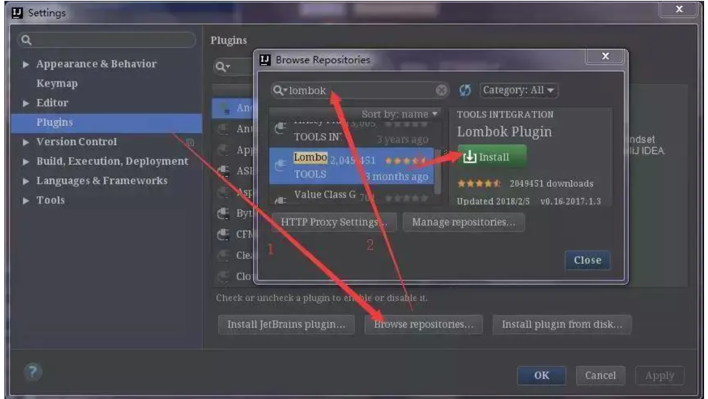


点击File-- Settings设置界面，开启 AnnocationProcessors：

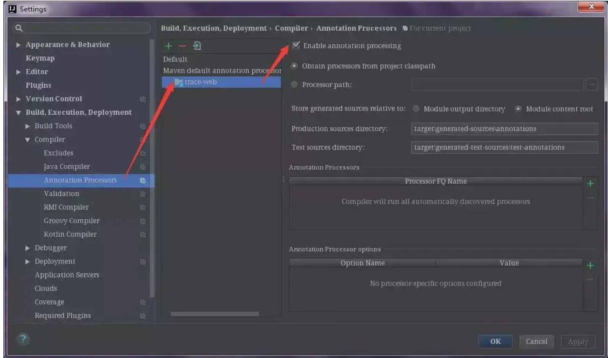


开启该项是为了让Lombok注解在编译阶段起到作用。

> Eclipse的Lombok插件安装可以自行百度，也比较简单，值得一提的是，由于Eclipse内置的编译器不是Oracle javac，而是eclipse自己实现的Eclipse Compiler for Java (ECJ).要让ECJ支持Lombok，需要在eclipse.ini配置文件中添加如下两项内容：
>
> ​    -Xbootclasspath/a:[lombok.jar所在路径

## 3）Lombok实现原理  

自从Java 6起，javac就支持“JSR 269 Pluggable Annotation Processing API”规范，只要程序实现了该API，就能在javac运行的时候得到调用。

Lombok就是一个实现了"JSR 269 API"的程序。在使用javac的过程中，它产生作用的具体流程如下：

------

\1. javac对源代码进行分析，生成一棵抽象语法树(AST)

\2. javac编译过程中调用实现了JSR 269的Lombok程序

\3. 此时Lombok就对第一步骤得到的AST进行处理，找到Lombok注解所在类对应的语法树       (AST)，然后修改该语法树(AST)，增加Lombok注解定义的相应树节点

\4. javac使用修改后的抽象语法树(AST)生成字节码文件

------

## 4) Lombok注解的使用

#### POJO类常用注解:

@Getter/@Setter: 作用类上，生成所有成员变量的getter/setter方法；作用于成员变量上，生成该成员变量的getter/setter方法。可以设定访问权限及是否懒加载等。

**@ToString：作用于类，覆盖默认的toString()方法，可以通过of属性限定显示某些字段，通过exclude属性排除某些字段。**


**@EqualsAndHashCode：作用于类，覆盖默认的equals和hashCode**

**@NonNull：主要作用于成员变量和参数中，标识不能为空，否则抛出空指针异常。**


**@NoArgsConstructor, @RequiredArgsConstructor, @AllArgsConstructor：作用于类上，用于生成构造函数。有staticName、access等属性。**

**staticName属性一旦设定，将采用静态方法的方式生成实例，access属性可以限定访问权限。**

**@NoArgsConstructor：生成无参构造器；**

**@RequiredArgsConstructor：生成包含final和@NonNull注解的成员变量的构造器；**

**@AllArgsConstructor：生成全参构造器**

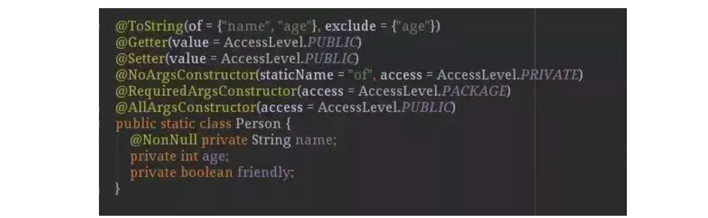

**@Data：作用于类上，是以下注解的集合：@ToString @EqualsAndHashCode @Getter @Setter @RequiredArgsConstructor**

**@Builder：作用于类上，将类转变为建造者模式**

**@Log：作用于类上，生成日志变量。针对不同的日志实现产品，有不同的注解：**

#### 其他重要注解：  

**@Cleanup：自动关闭资源，针对实现了java.io.Closeable接口的对象有效，如：典型的IO流对象**

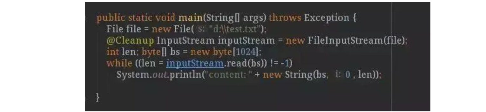

**编译后结果如下：**

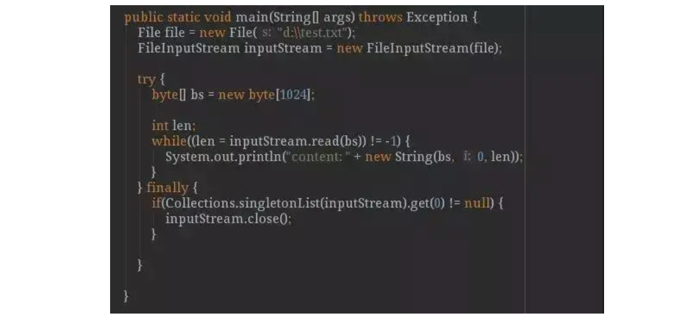

**@SneakyThrows：可以对受检异常进行捕捉并抛出，可以改写上述的main方法如下：**

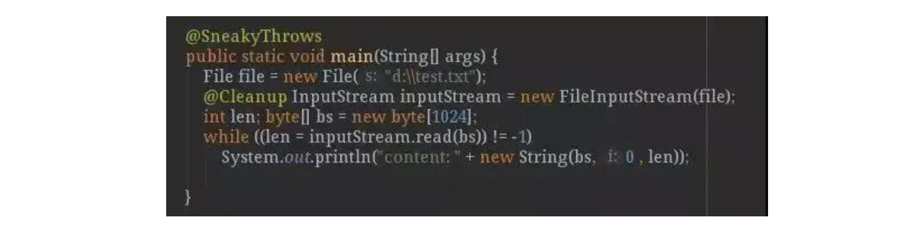

**@Synchronized：作用于方法级别，可以替换synchronize关键字或lock锁，用处不大.**


# Swagger

里面的一些注解，然后补充在这里。

还有网上有一些替代Swagger的东西，也总结一下。


# JSON 

## Json数据格式

参考文章：https://www.cnblogs.com/asdyzh/p/9833966.html

Json格式：Json对象属性必须加**双引号**

Json**对象必须由一组有序的键值对组成**

```json
{
  	{name:"中国",  
    province:[ 
   		 { name:"黑龙江", cities:{ city:["哈尔滨","大庆"] },
 		 {name:"广东", cities:{ city:["广州","深圳","珠海"
    ] } 
}
```


## Java 提取Json里面内容

Java每一个知识都很细的，今天是2020.6.17   写了个取出Json中里面的内容。

常用的是Hutool里面的 Json 

[https://hutool.cn/docs/#/json/%E6%A6%82%E8%BF%B0](https://hutool.cn/docs/#/json/概述)


用hutool工具只是把Json转换成了Object，如果需要获取到Json里面的内容，还是需要其他方法+

获取Json里面的内容：https://blog.csdn.net/oman001/article/details/79063278

```Json
{
  "paramz": {
    "feeds": [
      {
        "id": 299076,
        "oid": 288340,
        "category": "article",
        "data": {
          "subject": "荔枝新闻3.0：不止是阅读",
          "summary": "江苏广电旗下资讯类手机应用“荔枝新闻”于近期推出全新升级换代的3.0版。",
          "cover": "/Attachs/Article/288340/3e8e2c397c70469f8845fad73aa38165_padmini.JPG",
          "pic": "",
          "format": "txt",
          "changed": "2015-09-22 16:01:41"
        }
      }
    ],
    "PageIndex": 1,
    "PageSize": 20,
    "TotalCount": 53521,
    "TotalPage": 2677
  }
}

```


Java代码，注意看里面的细节。（在二供项目中工单处理用到现在的）

```Java
public class JsonUtils {

    /**
     * 根据json数据解析返回一个List<HashMap<String, Object>>集合
     * @param json  json数据
     * @return
     */
    public static List<HashMap<String, Object>> getJsonList(String json) {
        List<HashMap<String, Object>> dataList;
        dataList = new ArrayList<>();
        try {
            JSONObject rootObject = new JSONObject(json);
            JSONObject paramzObject = rootObject.getJSONObject("paramz");
            JSONArray feedsArray = paramzObject.getJSONArray("feeds");
            for (int i = 0; i < feedsArray.length(); i++) {
                JSONObject sonObject = feedsArray.getJSONObject(i);
                JSONObject dataObject = sonObject.getJSONObject("data");
                String subjectStr = dataObject.getString("subject");
                String summaryStr = dataObject.getString("summary");
                String coverStr = dataObject.getString("cover");
                HashMap<String, Object> map = new HashMap<>();
                map.put("subject", subjectStr);
                map.put("summary", summaryStr);
                map.put("cover", coverStr);
                dataList.add(map);
            }
            return dataList;
        } catch (JSONException e) {
            e.printStackTrace();
        }
        return null;
    }
}

```


自来水工程台账: 建筑情况 constructQK 处理的很细节 setter 和 getter


二供获取委派用户用到的解析json的：

```java
//从ocp系统查角色对应下面的  这是原来的从常量里面获取ip和路径
String path = WorkOrderConstants.OCP_HANDLE_USER_IP + WorkOrderConstants.OCP_HANDLE_USER_URL;
WorkOrdeHandleUserDTO dto = new WorkOrdeHandleUserDTO();
dto.setId(WorkOrderConstants.OCP_HANDLE_USER_ID);

HttpResponse result = HttpRequest.post(path)
    .header(Header.CONTENT_TYPE, WorkOrderConstants.RESPONSE_CONTENT_TYPE) //头信息，多个头信息多次调用此方法即可
    .header(Header.ACCEPT, "*/*")
    .body(JSON.toJSONString(dto))
    .execute();

JSONObject handleUser = JSONUtil.parseObj(result.body());
JSONArray dataArray = handleUser.getJSONArray("data");
LOGGER.info("获取到的ocp用户列表为:" + dataArray);

List<HandleUserVo> handleUserVoList = new ArrayList<>();
for (int i = 0; i < dataArray.size(); i++) {
    //从工单系统查对应角色的人 获取json串中的 realname
    JSONObject data = dataArray.getJSONObject(i);
    String realname = data.getStr("realname");
    String id = data.getStr("id");

    HandleUserVo handleUserVo = new HandleUserVo();
    handleUserVo.setName(realname);
    handleUserVo.setId(Long.valueOf(id));

    Map<String, Object> query = new HashMap<>();
    query.put("handleUser", realname);
    List<WorkOrderPO> workOrderPOList = workOrderDAO.listBy(query);

    if (workOrderPOList.size() > 0) {
        handleUserVo.setStatus(EWorkOrderStates.BUSY.getType());
    }
    handleUserVoList.add(handleUserVo);
}

return handleUserVoList;
```


## Fastjson 将Json转换为Object

扫码支付这里（获取预支付结果）

```java
String str = "{\"respCode\":\"0000000000\",\"respMsg\":\"交易成功		\",\"recordCount\":null,\"reqSeqNo\":null,\"token\":\"https://mail.scrcu.com:82/payweb/merCodeReceive?qrCode=https://qr.95516.com/00010000/01462410577035304057810240124827\",\"respTime\":\"20201030111618\",\"respSsn\":\"20103011160015186927\"}";

ProPayReceiveDTO proPayReceiveDTO = JSON.parseObject(str,ProPayReceiveDTO.class);
System.out.println(proPayReceiveDTO);
```


# JPush 消息推送

参考：https://blog.csdn.net/weixin_40461281/article/details/80969989?utm_medium=distribute.pc_relevant.none-task-blog-BlogCommendFromMachineLearnPai2-2.nonecase&depth_1-utm_source=distribute.pc_relevant.none-task-blog-BlogCommendFromMachineLearnPai2-2.nonecase


官方Java SDK

https://github.com/jpush/jpush-api-java-client

开发APi

http://docs.jiguang.cn/jpush/server/push/rest_api_v3_push/


自我理解是 ：   前端 --------- 极光推送------------后端     他们是通过appkey进行交互的。


在消息推送的时候，可以 选择设备id，然后按enter键 ,就可以推送啦。


# Apache POI  解析Excel

处理Excel的一个开源工具

```
官方主页： http://poi.apache.org/index.html
API文档： http://poi.apache.org/apidocs/index.html

```

参考：https://www.cnblogs.com/grasslucky/p/10613308.html


```java
//自来水 SpecialProjectService这个类下面 

//验收合格完成时间
cell = row.getCell(28);
cellType = cell.getCellTypeEnum();
if (cellType == CellType.NUMERIC) {

    //如果是日期类 接受到 转换成指定String类型
    Date date = cell.getDateCellValue();
    SimpleDateFormat format = new SimpleDateFormat("yyyy/MM/dd");
    format.format(date);

    planItemPO.setYshgwcsj(format.format(date));
} else if (cellType == CellType.STRING) {
    planItemPO.setYshgwcsj(String.valueOf(cell.getStringCellValue()));
}

```


如果单元格格式是日期，就需要用上面Date date = cell.getDateCellValue(); 来接收。

CellType.NUMERIC这个枚举的源码点开：

```java
/**
* Numeric cell type (whole numbers, fractional numbers, dates)
*/
NUMERIC(0),

//源码说的 这里包含dates日期类的，所以用这个枚举没错。

```

参考：https://blog.csdn.net/xuanjiewu/article/details/73239131?utm_medium=distribute.pc_relevant_t0.none-task-blog-BlogCommendFromMachineLearnPai2-1.nonecase&depth_1-utm_source=distribute.pc_relevant_t0.none-task-blog-BlogCommendFromMachineLearnPai2-1.nonecase


# Drools

Java各种规则引擎 ：

https://www.jianshu.com/p/41ea7a43093c


规则引擎 

参考:https://www.cnblogs.com/jpfss/p/10870002.html

[https://bugstack.cn/itstack-demo-drools/2020/03/07/%E8%BF%99%E7%A7%8D%E5%9C%BA%E6%99%AF%E4%BD%A0%E8%BF%98%E5%86%99ifelse%E4%BD%A0%E8%B7%9F%E5%AD%A9%E5%AD%90%E5%9D%90%E4%B8%80%E6%A1%8C%E5%8E%BB%E5%90%A7.html](https://bugstack.cn/itstack-demo-drools/2020/03/07/这种场景你还写ifelse你跟孩子坐一桌去吧.html)


# Jmeter测压

jmeter 测试系统能经受多大负载的开源jar,做性能测试的开源项目!

打开软件文件bin目录，然后点击ApacheJmeter.jar就可以打开窗口。 或者点击bin里面的jmter.bat 也可以打开软件。

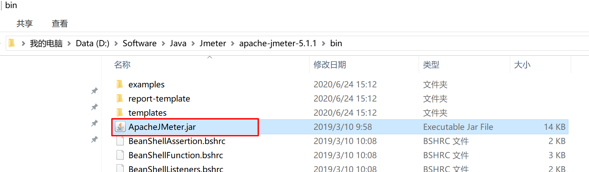


首先将这个软件修改成中文!

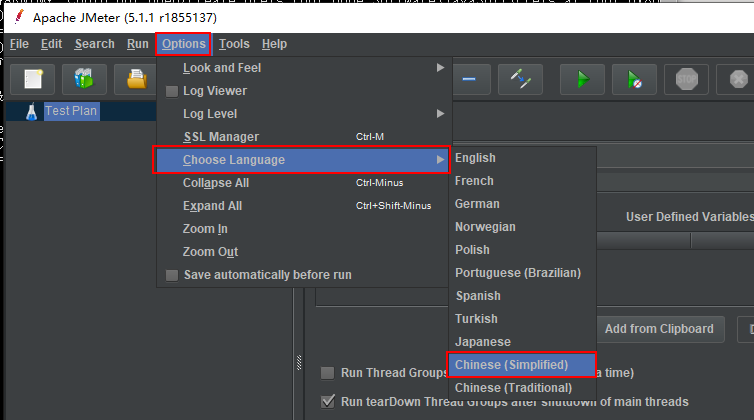


## 秒杀服务之秒杀项目构建

### 秒杀项目业务场景介绍

现该电影网站和各大影院合作，推出一个购买兑换码活动。用户参与流程如下

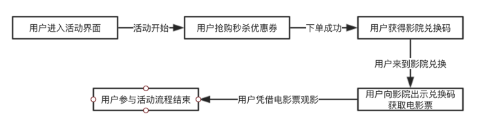

注意：优惠券是限量的

## 秒杀相关概念介绍

### 库存

参与秒杀活动商品的数量

这个项目中将秒杀的库存表放在另一个单独的表里面,是因为,秒杀的时候,库存这个数据需要一直更新,而数据库中其他数据不需要动,将库存放在一个单独的表中,是为了更新库存的速度变快! 

### 超卖问题

卖出的商品的数量大于活动库存的数量

造成超卖问题的原因？

库存并发更新

## 高并发相关概念介绍

### 并发

> 同时拥有两个或多个线程，如果程序在单核处理器上运行，多个线程将交替地换入或者换出内存，这些线程是同时「
> 存在
> 」的，每个线程都处于执行过程中的某个状态，如果运行在多核处理器上，此时，程序中每个线程都将分配到一个处理器核上，因此可以同时运行。也就是说，并发就是多个线程操作相同的物理机中的资源，保证其线程安全，合理的利用资源。

### 高并发

> 由于分布式系统的问世，高并发（High
> Concurrency）通常是指通过设计保证系统能够同时并行处理很多请求。通俗来讲，高并发是指在同一个时间点，有很多用户同时的访问同一
> API 接口或者 Url
> 地址。它经常会发生在有大活跃用户量，用户高聚集的业务场景中。（百度词条）

> 高并发中有如下概念：

#### QPS（Query Per Second）

> 每秒钟处理完请求的次数；注意这里是处理完。具体是指发出请求到服务器处理完成功返回结果。可以理解在server中有个counter，每处理一个请求加1，1秒后counter=QPS。

#### TPS（Transaction Per Second）

> 一般来说是针对整个系统来说的，指每秒能够处理完的事物数，针对单个接口来说一般用QPS

#### 并发量

> 系统能够同时处理的请求数

#### 响应时间

> 系统处理一次请求所需要的平均处理时间

#### 计算关系：

QPS = 并发量 / 平均响应时间

并发量 = QPS \* 平均响应时间

### 高可用

高可用（HighAvailability）是系统架构设计中必须考虑的因素之一，它通常是指，通过设计减少系统不能提供服务的时间。计量单位是百分比，常用99%,99.9%,99.99%来表示。一般讲4个9，5个9或者6个9。

举个例子：可用性为99%的系统，全年停机时间为3.5天；99.9%的系统；全年停机时间为8.5小时；99.99%的系统全年停机时间为53分钟；99.999%的系统全年停机时间仅仅约为5分钟。

## 如何设计高并发系统

### 提高并发量

如何提高并发量？也就是提高系统能够同时处理的请求数量，例如

### 提高物理机器性能

比如：增强单机硬件性能，例如：增加CPU核数如32核，升级更好的网卡如万兆，升级更好的硬盘如SSD，扩充硬盘容量如2T，扩充系统内存如128G；

### 增加能够同时处理请求的个数：

比如：增加节点、配置tomcat线程池 等等

### 缩短平均响应时间

等于如何提高接口响应速度？

缓存、异步、无锁等等

## 高并发系统的三把利器：

缓存、限流、降级

缓存：提升系统响应速度、增大系统能够处理的容量

降级：当服务出问题或者影响到核心流程的性能则需要暂时屏蔽掉，待高峰或者问题解决后再打开

限流：限流的目的是通过对并发访问/请求进行限速或者一个时间窗口内的的请求进行限速来保护系统，一旦达到限制速率则可以拒绝服务

## Jmeter的介绍

JMeter是Apache组织开发的开源项目，设计之初是用于做性能测试的，同时它在实现对各种接口的调用方面做的比较成熟，因此，常被用做接口功能测试和性能测试。

它能够很好的支持各种常见接口，如HTTP(S)、WebService、JDBC、JAVA、FTP等，并以多种形式与参数展现测试结果。

1. Jmeter的使用
   1. 安装JDK并且配置好环境变量
   2. 安装Jmeter

其实jmeter是免安装的，只需要下载解压即可。

安装包直接去jmeter官网下载即可（[http://jmeter.apache.org/down...](http://jmeter.apache.org/download_jmeter.cgi)），建议选择3.0或以上版本，我目前使用的是5.1.1的版本。下载后解压到非C盘的非中文目录即可。

1. 如何使用Jmter
   1. 添加测试计划
   2. 添加线程组


设置线程组

### 构建请求


以HTTP为例，我们需要设置以下请求参数

请求名称

协议

服务器IP/域名

端口号

HTTP请求方法、路径

添加请求参数

勾选☑️使用Keep-alive

点击高级 —\> 选择Java客户端实现

如果需要设置请求头参数，则需要点击如下设置：

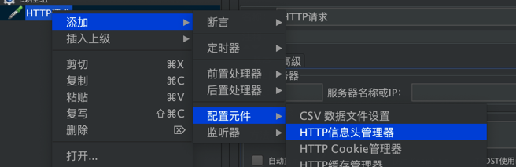

### 查看结果

> 添加查看结果树

> 添加聚合报告

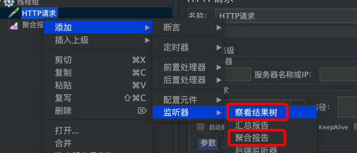

点击上方绿色执行箭头开始测试

1. 秒杀接口业务介绍
   1. 业务表设计
   2. 业务接口

> 1、查询秒杀活动接口

> 2、秒杀下单接口

> 生成订单 扣减库存

> 如何优化？优化之后会带来什么问题？


## 秒杀接口业务介绍

### 业务表设计

### 业务接口

查询秒杀活动接口

秒杀下单接口

​              生成订单 扣减库存

如何优化？优化之后会带来什么问题？


## Linux系统上面  Load Average 

网上查到相关信息:

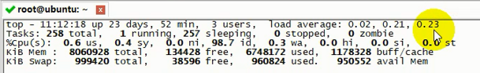

上面的load average 是记录系统一分钟,五分钟,十五分钟的平均负载的! 后面的数字是负载

一幅图秒懂LoadAverage（负载）


一、什么是Load Average？

系统负载（System Load）是系统CPU繁忙程度的度量，即有多少进程在等待被CPU调度（进程等待队列的长度）。

平均负载（Load Average）是一段时间内系统的平均负载，这个一段时间一般取1分钟、5分钟、15分钟。


二、如何查看Load？

top命令，w命令，uptime等命令都可以查看系统负载：

[shenjian@dev02 ~]$ uptime

13:53:39 up 130 days,  2:15,  1 user,  load average: 1.58, 2.58, 5.58

如上所示，dev02机器1分钟平均负载，5分钟平均负载，15分钟平均负载分别是1.58、2.58、5.58


三、Load的数值是什么含义？

把CPU比喻成一条（单核）马路，进程任务比喻成马路上跑着的汽车，Load则表示马路的繁忙程度：

Load小于1：表示完全不堵车，汽车在马路上跑得游刃有余：

[](http://www.habadog.com/wp-content/uploads/2015/02/load0.5.png)[ Load<1，单核]

Load等于1：马路已经没有额外的资源跑更多的汽车了：

[](http://www.habadog.com/wp-content/uploads/2015/02/load1.png)[Load==1，单核]

Load大于1：汽车都堵着等待进入马路：

[](http://www.habadog.com/wp-content/uploads/2015/02/load5.png)[Load>1，单核]

如果有两个CPU，则表示有两条马路，此时即使Load大于1也不代表有汽车在等待：

[](http://www.habadog.com/wp-content/uploads/2015/02/load2.png)[Load==2，双核，没有等待]


四、什么样的Load值得警惕（单核）？

Load < 0.7时：系统很闲，马路上没什么车，要考虑多部署一些服务

0.7 < Load < 1时：系统状态不错，马路可以轻松应对

Load == 1时：系统马上要处理不多来了，赶紧找一下原因

Load > 5时：马路已经非常繁忙了，进入马路的每辆汽车都要无法很快的运行


五、三个Load值要先看哪一个？

结合具体情况具体分析：

1）1分钟Load>5，5分钟Load<1，15分钟Load<1：短期内繁忙，中长期空闲，初步判断是一个“抖动”，或者是“拥塞前兆”

2）1分钟Load>5，5分钟Load>1，15分钟Load<1：短期内繁忙，中期内紧张，很可能是一个“拥塞的开始”

3）1分钟Load>5，5分钟Load>5，15分钟Load>5：短中长期都繁忙，系统“正在拥塞”

4）1分钟Load<1，5分钟Load>1，15分钟Load>5：短期内空闲，中长期繁忙，不用紧张，系统“拥塞正在好转”


六、Load总结

[](http://www.habadog.com/wp-content/uploads/2015/02/load0.5.png)[ Load<1，单核]

[](http://www.habadog.com/wp-content/uploads/2015/02/load1.png)[Load==1，单核]

[](http://www.habadog.com/wp-content/uploads/2015/02/load5.png)[Load>1，单核]

[](http://www.habadog.com/wp-content/uploads/2015/02/load2.png)[Load==2，双核]

希望上面一幅图对大家理解Load Average有帮助，赶快uptime一下，看一下自己系统的负载吧。


# Jenkins详细教程

## 一、jenkins是什么？

​        Jenkins是一个开源的、提供友好操作界面的持续集成(CI)工具，起源于Hudson（Hudson是商用的），主要用于持续、自动的构建/测试软件项目、监控外部任务的运行（这个比较抽象，暂且写上，不做解释）。Jenkins用Java语言编写，可在Tomcat等流行的servlet容器中运行，也可独立运行。通常与版本管理工具(SCM)、构建工具结合使用。常用的版本控制工具有SVN、GIT，构建工具有Maven、Ant、Gradle。


## 二、CI/CD是什么？

​         CI(Continuous integration，中文意思是持续集成)是一种软件开发时间。持续集成强调开发人员提交了新代码之后，立刻进行构建、（单元）测试。根据测试结果，我们可以确定新代码和原有代码能否正确地集成在一起。借用网络图片对CI加以理解。


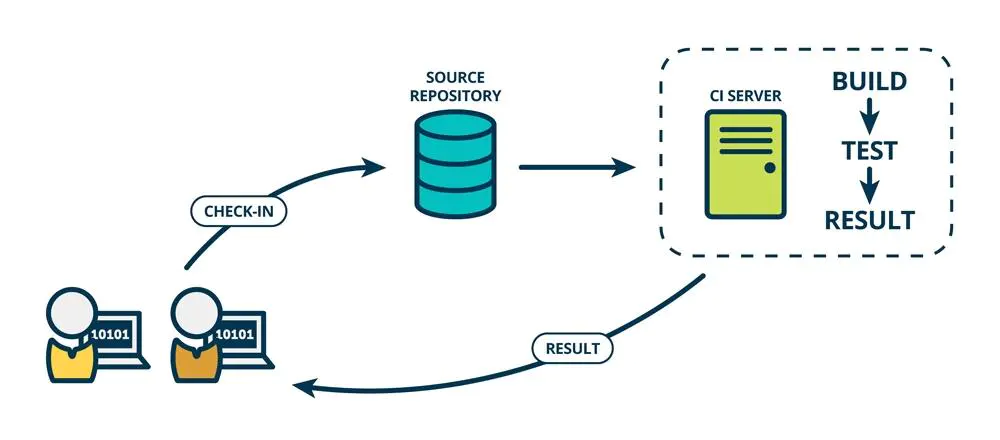

CI

​        CD(Continuous Delivery， 中文意思持续交付)是在持续集成的基础上，将集成后的代码部署到更贴近真实运行环境(类生产环境)中。比如，我们完成单元测试后，可以把代码部署到连接数据库的Staging环境中更多的测试。如果代码没有问题，可以继续手动部署到生产环境。下图反应的是CI/CD 的大概工作模式。


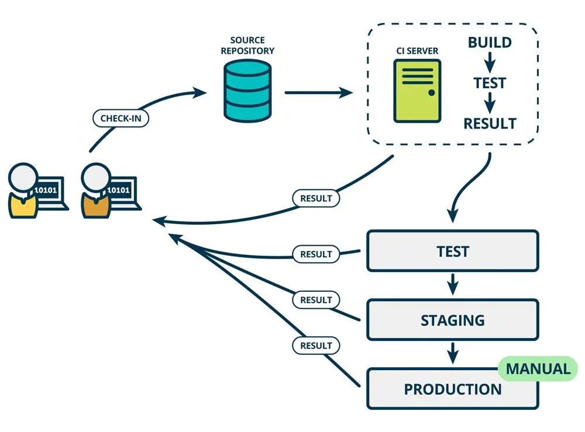

CI/CD


## 三、使用Jenkins进行PHP代码(单元)测试、打包。

​        Jenkins是一个强大的CI工具，虽然本身使用Java开发，但也能用来做其他语言开发的项目CI。下面讲解如何使用Jenkins创建一个构建任务。

 登录Jenkins， 点击左侧的新建，创建新的构建任务。


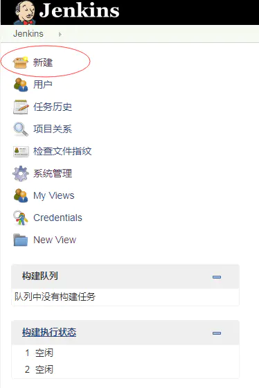

跳转到如下界面。任务名称可以自行设定，但需要全局唯一。输入名称后选择构建一个自由风格的软件项目(其他选项不作介绍)。并点击下方的确定按钮即创建了一个构建任务。之后会自动跳转到该job的配置页面。


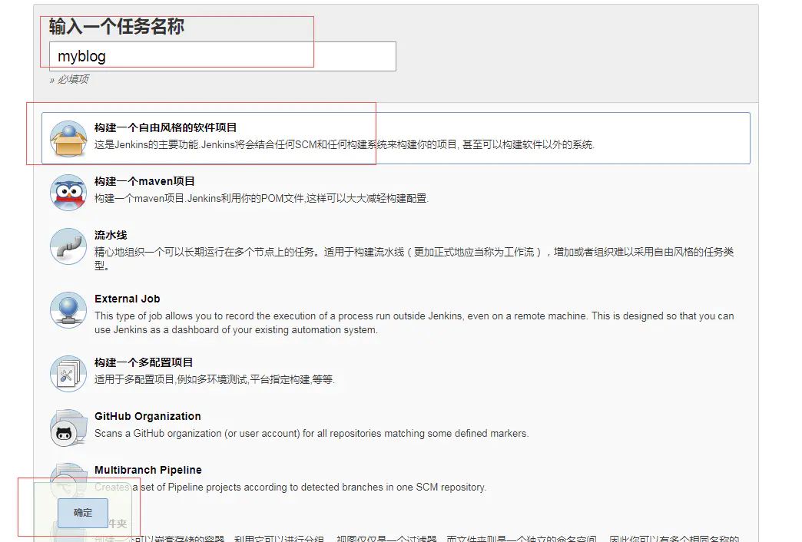

新建自由风格的软件项目


下图是构建任务设置界面，可以看到上方的几个选项**"General", "源码管理"， "构建触发器"，"构建环境"， "构建"， "构建后操作"**。下面逐一介绍。

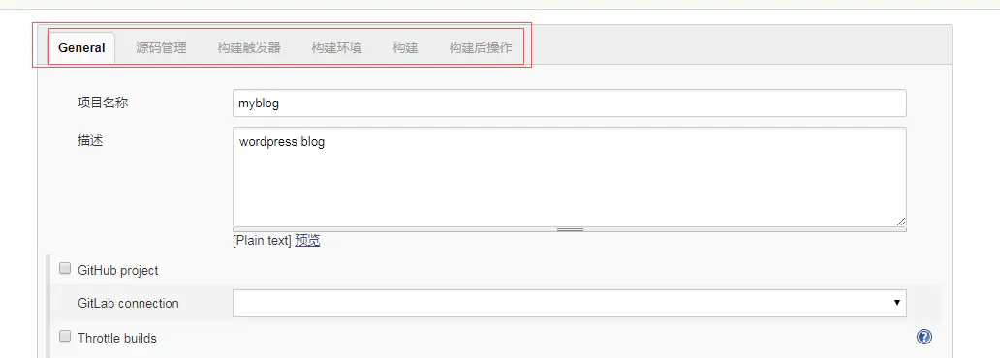

### 1.General

General是构建任务的一些基本配置。名称，描述之类的。


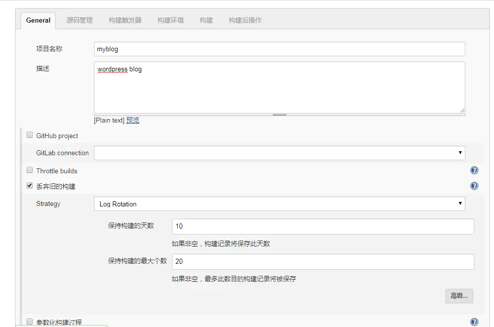

General

**项目名称:** 是刚才创建构建任务步骤设置的，当然在这里也可以更改。

**描述:** 对构建任务的描述。  

**丢弃旧的构建：** 服务器资源是有限的，有时候保存了太多的历史构建，会导致Jenkins速度变慢，并且服务器硬盘资源也会被占满。当然下方的"保持构建天数" 和 保持构建的最大个数是可以自定义的，需要根据实际情况确定一个合理的值。

其他几个选项在这里不做介绍，有兴趣的可以查看Jenkins"帮助信息"， 会有一个大概的介绍。不过这些"帮助信息"都是英文的。


点击右方的这些"问号"查看"帮助信息"


### 2.源码管理

源码管理就是配置你代码的存放位置。


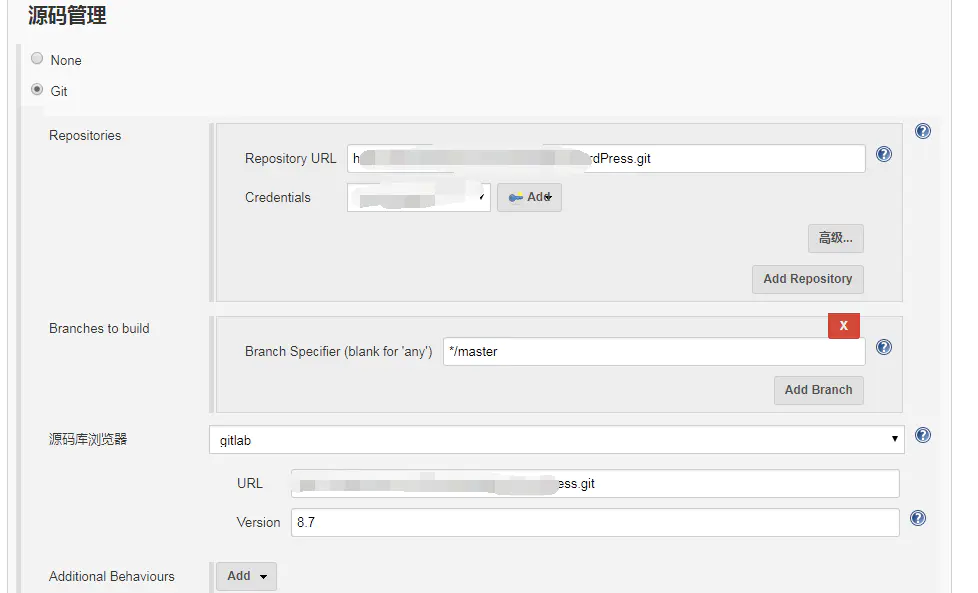

源码管理

 **Git:** 支持主流的github 和gitlab代码仓库。因我们的研发团队使用的是gitlab，所以下面我只会对该项进行介绍。

**Repository URL**：仓库地址

**Credentials**：凭证。可以使用HTTP方式的用户名密码，也可以是RSA文件。 但要通过后面的"ADD"按钮添加凭证。

**Branches to build**：构建的分支。*/master表示master分支，也可以设置为其他分支。

**源码浏览器**：你所使用的代码仓库管理工具，如github, gitlab.  

**URL**：填入上方的仓库地址即可。

**Version: 8.7**   这个是我们gitlab服务器的版本。

**Subversion：**就是SVN，这里不作介绍。


### **3.构建触发器**

构建触发器，顾名思义，就是构建任务的触发器。


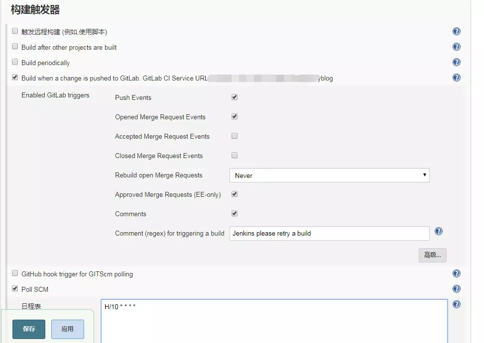

**触发远程构建(例如，使用脚本):** 该选项会提供一个接口，可以用来在代码层面触发构建。这里不做介绍，后期可能会用到。

**Build after other projects are built：** 该选项意思是"在其他projects构建后构建"。这里不作介绍，后期可能会用到该选项。

**Build periodically：** 周期性的构建。很好理解，就是每隔一段时间进行构建。日程表类似        linux crontab书写格式。如下图的设置，表示每隔30分钟进行一次构建。


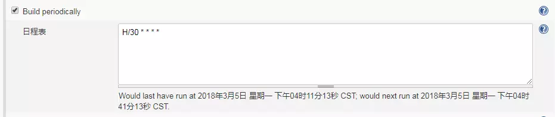

周期构建


**Build when a change is pushed to GitLab：**当有更改push到gitlab代码仓库，即触发构建。后面会有一个触发构建的地址，一般被称为webhooks。需要将这个地址配置到gitlab中，webhooks如何配置后面介绍。这个是常用的构建触发器。

**Poll SCM：**该选项是配合上面这个选项使用的。当代码仓库发生改动，jenkins并不知道。需要配置这个选项，周期性的去检查代码仓库是否发生改动。


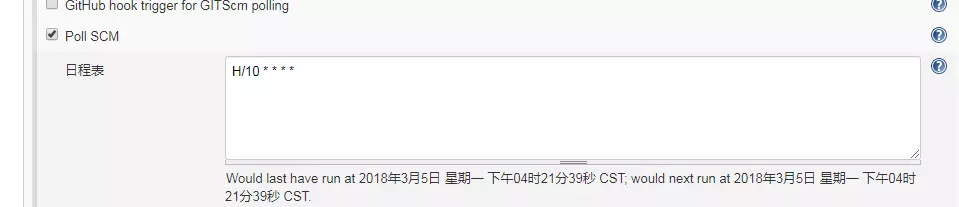

十分钟检查一次


### 4.构建环境

构建环境就是构建之前的一些准备工作，如指定构建工具(在这里我使用ant)。


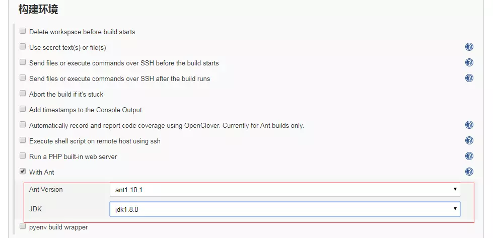

构建环境中的构建工具


**With Ant：**选择这个工具，并指定ant版本和jdk版本。这两个工具的版本我都事先在服务器上安装，并且在jenkins全局工具中配置好了。

其他选项不作介绍，同样可以查看"帮助信息" 获得使用帮助。


### 5.构建

​       选择下方的增加构建步骤。


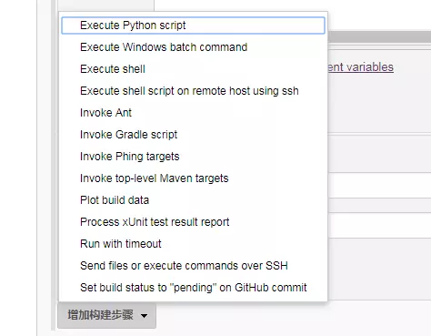

增加构建步骤

可以选择的项很多。这里就介绍"Invoke Ant" 和"Execute shell".

**Eexcute shell**： 执行shell命令，该工具是针对linux环境的，windows环境也有对应的工            具"Execute Windows batch command"。 在构建之前，可能我们需要执行一些命令，比如压缩包的解压之类的。为了演示，我就简单的执行  "echo $RANDOM" 这样的linux shell下生产随机数命令。

**Invoke Ant**：Ant是一款java项目构建工具，当然也能用来构建php。


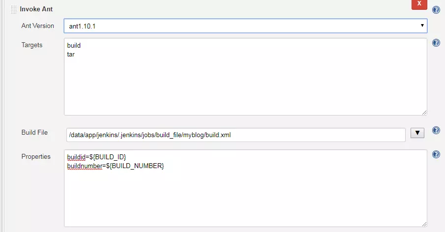


**Ant Version**： 选择Ant版本。这个ant版本是安装在jenkins服务器上的版本，并且需要在jenkins"系统工具"中设置好。

**Targets**：要执行的操作，一行一个操作任务。以上图为例，build是构建，tar是打包。

**Build File:** 是Ant构建的配置文件，如果不指定，则是在项目路径下的workspace目录中的build.xml。build.xml文件具体怎么配置，后面再细讲。

**properties:** 设定一些变量，这些变量可以在build.xml 中被引用。

**Send files or execute commands over SSH：**发送文件到远程主机或执行命令(脚本)


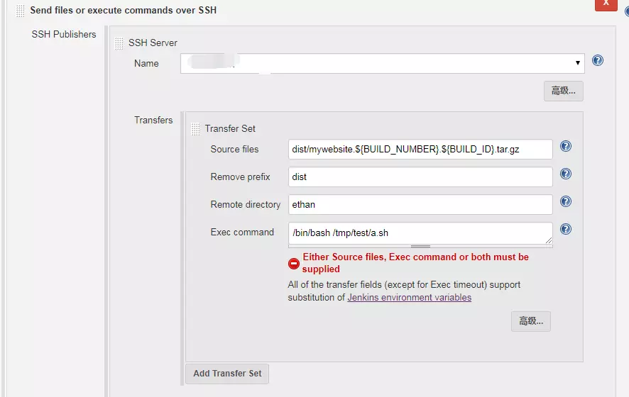

**Name**: SSH Server的名称。SSH Server可以在jenkins-系统设置中配置。

**source files**: 需要发送给远程主机的源文件。

**Remove prefix:** 移除前面的路径。如果不设置这个参数，则远程主机会自动创建构建源 source files 包含的那个路径。

**Remote directory**: 远程主机目录。

**Exec command**：在远程主机上执行的命令，或者执行的脚本。


### **6.构建后操作**

​        构建后操作，就是对project构建完成后的一些后续操作，比如生成相应的代码测试报告。


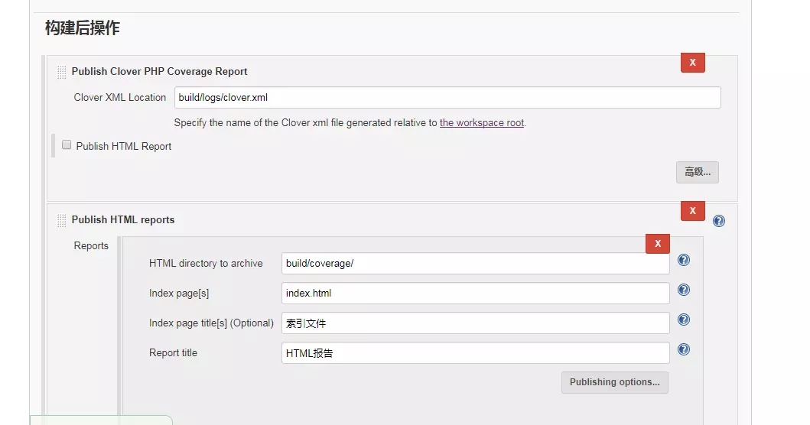


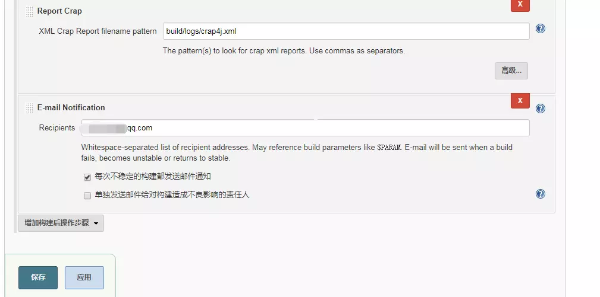

邮件通知

**Publish Clover PHP Coverage Report：**发布代码覆盖率xml格式的文件报告。路径会在"build.xml"文件中定义

**Publish HTML reports**：发布代码覆盖率的HTML报告。  

**Report Crap:** 发布crap报告**。**

**E-mail Notification:**  邮件通知，构建完成后发邮件到指定的邮箱。

**以上配置完成后，点击保存。**

**7.其他相关配置**

 **SSH Server配置**

登录jenkins -- 系统管理 -- 系统设置

配置请看下图


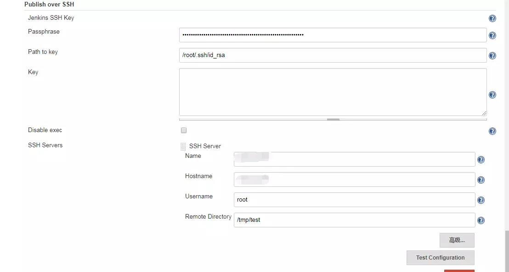

SSH SERVER

**SSH Servers:** 由于jenkins服务器公钥文件我已经配置好，所以之后新增SSH Servers 只需要配置这一项即可。 

**Name：** 自定义，需要全局唯一。

**HostName:** 主机名，直接用ip地址即可。

**Username:** 新增Server的用户名，这里配置的是root。

**Remote Directory:** 远程目录。jenkins服务器发送文件给新增的server默认是在这个目录。


### Ant 配置文件 "build.xml"

接下来讲解Ant 构建配置文件"build.xml"。 之所以是build.xml 这是因为官方惯例。就好比任何编程语言的入门都会是打印"Hello world".  你也可以用其他名称代替"build.xml" .

下面针对配置文件"build.xml" 关键配置进行说明。


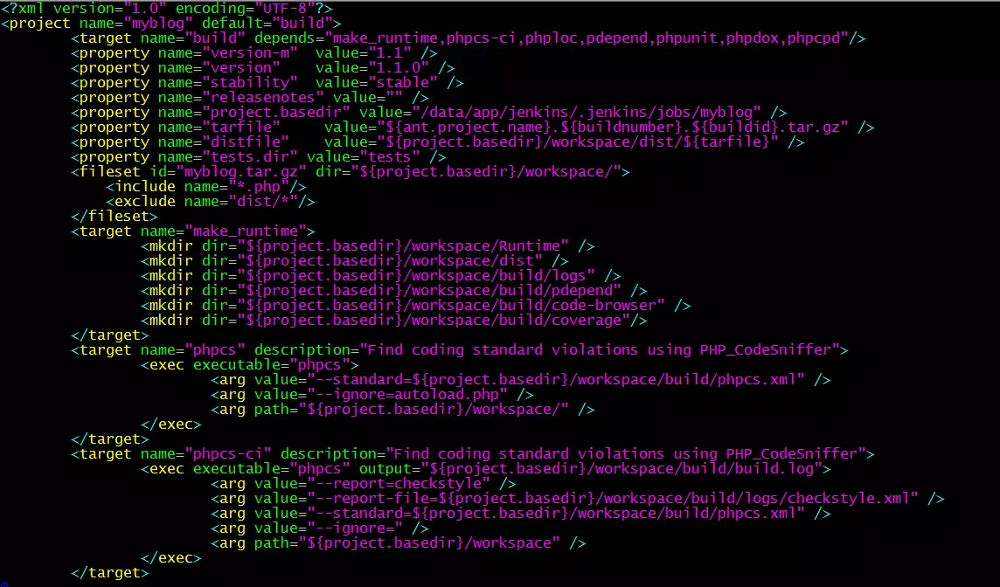

project name就是项目名称，和jenkins所创建的对应。

target name="build" 就是构建的名称，和jenkins构建步骤 那里的targets对应。depends指明构建需要进行的一些操作。

property 用来设置变量。

fileset 这一行指明了一个文件夹，用include来指明需要包含的文件，exclude指明不包含的文件，"tar"即是打包这个文件夹中匹配到的文件。

下面的这些target都是一些实际的操作步骤，比如make_runtime这个"target" 就是创建了一些目录。phpcs就是利用PHP_CodeSniffer这个工具 对PHP代码规范与质量检查工具。


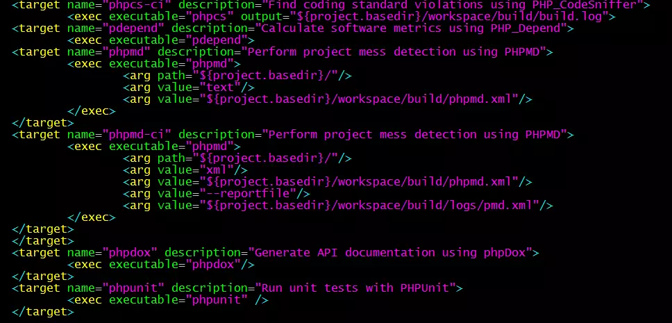


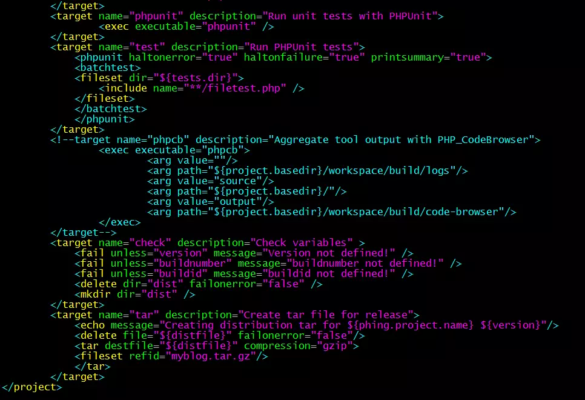

最后这个target "tar" 就是打包文件。因为上面的build 并没有包含这个target，所以默认情况下，执行build是不会打包文件的，所以在jenkins project配置界面，Ant构建那一步的targets，我们才会有"build" 和 "tar" 这两个targets。如果build.xml 中 "build"这个target depends中已经包含"tar" , 就不需要在jenkins中增加"tar"了。

其他一些target 都是利用一些工具对php代码的操作，比如phpunit是进行php单元测试。这一些方面我没有深入的研究，只是进行了一些简单的配置，毕竟不是这方面的专业人士。


### 配置 Gitlab webhooks

在gitlab的project页面 打开**settings**，再打开 **web hooks** 。点击**"ADD WEB HOOK"** 添加webhook。把之前jenkins配置中的那个url 添加到这里，添加完成后，点击**"TEST HOOK"**进行测试，如果显示SUCCESS 则表示添加成功。


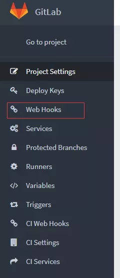


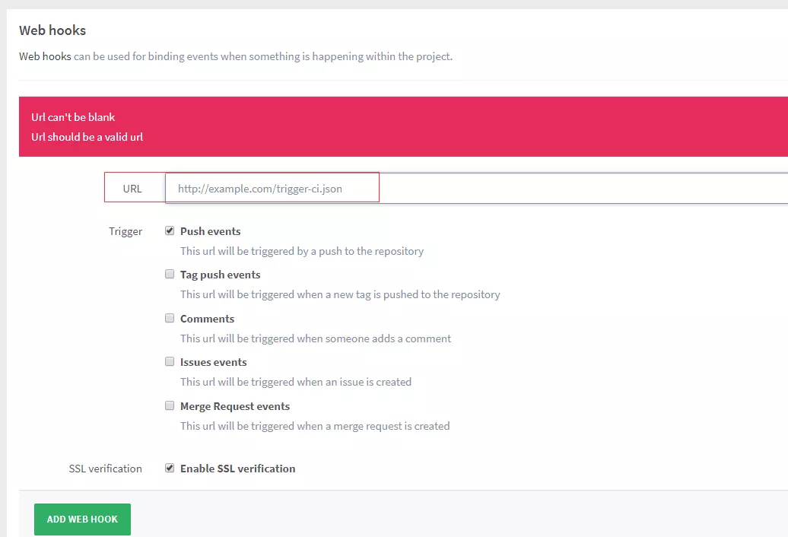


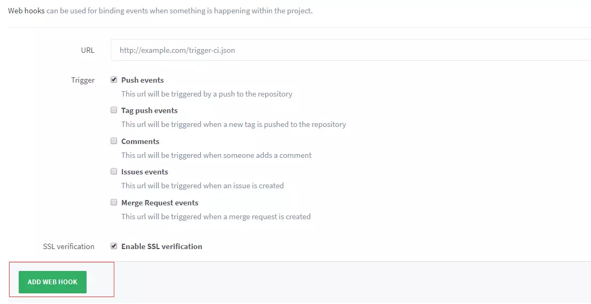


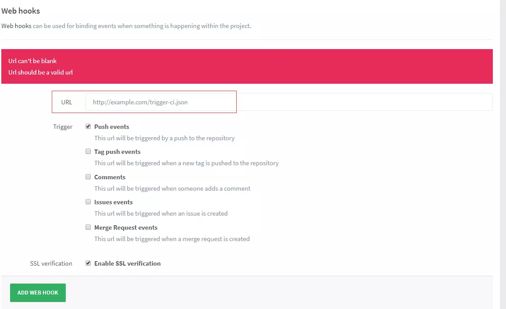

配置phpunit.xml

phpunit.xml是phpunit这个工具用来单元测试所需要的配置文件。这个文件的名称同样也是可以自定义的，但是要在"build.xml"中配置好名字就行。默认情况下，用"phpunit.xml", 则不需要在"build.xml"中配置文件名。


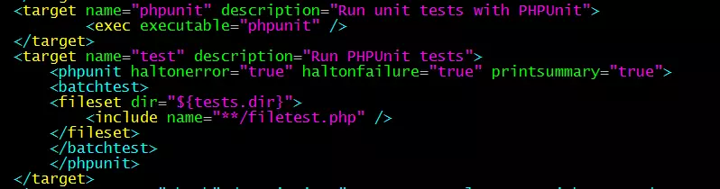

build.xml中phpunit配置

fileset dir 指定单元测试文件所在路径，include指定包含哪些文件，支持通配符匹配。当然也可以用exclude关键字指定不包含的文件。


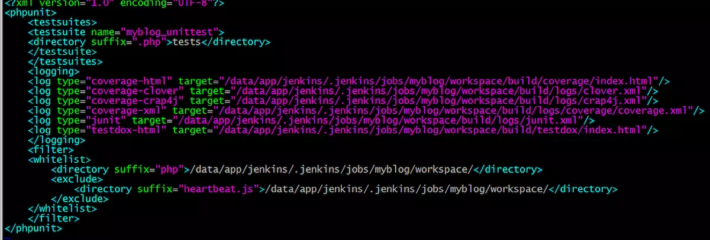

## 四、进行jenkins project 构建

第一次配置好jenkins project之后，会自动触发一次构建。此后，每当有commit 提交到master分支（前面设置的是master分支，也可以设置为其他分支），就会触发一次构建。当然也可以在project页面手动触发构建。点击左边的"立即构建" 手动触发构建。


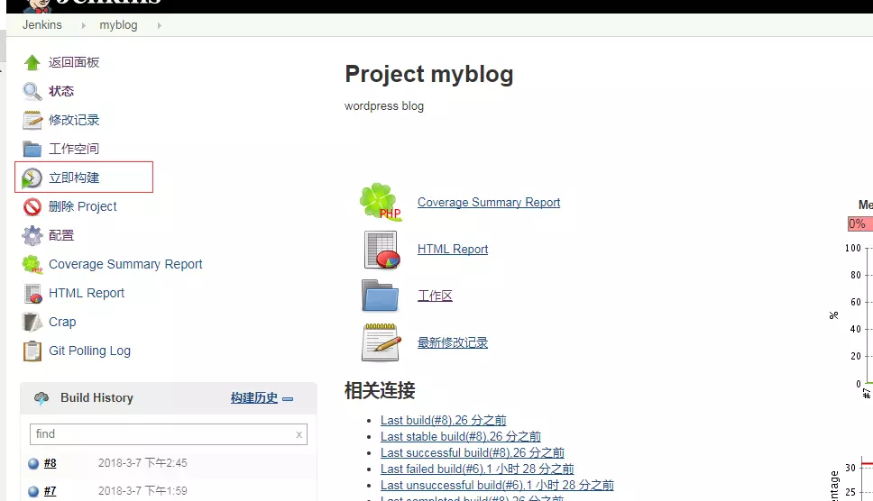

手动触发构建


## 五、构建结果说明

#### **构建状态**

**Successful蓝色**：构建完成，并且被认为是稳定的。

**Unstable黄色**：构建完成，但被认为是不稳定的。

**Failed红色**：构建失败。

**Disable灰色**：构建已禁用


#### 构建稳定性

构建稳定性用天气表示：**晴、晴转多云、多云、小雨、雷阵雨**。天气越好表示构建越稳定，反之亦然。


#### **构建历史界面**

 **console output：** 输出构建的日志信息

## **六、jenkins权限管理**

由于jenkins默认的权限管理体系不支持用户组或角色的配置，因此需要安装第三发插件来支持角色的配置，本文将使用Role Strategy Plugin。基于这个插件的权限管理设置请参考这篇文章:[http://blog.csdn.net/russ44/article/details/52276222](https://link.jianshu.com/?t=http%3A%2F%2Fblog.csdn.net%2Fruss44%2Farticle%2Fdetails%2F52276222)，这里不作详细介绍。


至此，就可以用jenkins周而复始的进行CI了，当然jenkins是一个强大的工具，功能绝不仅仅是以上这些，其他方面要是以后用到，我会更新到这篇文章中。有疑问欢迎在下方留言。

最后，放上一张Jenkins的思维导图


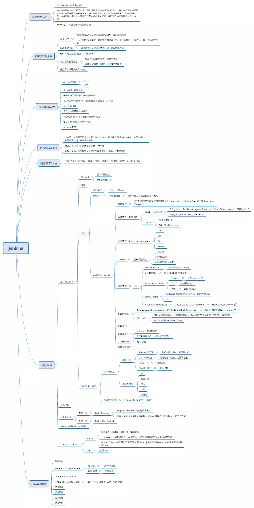


218人点赞


[CI/CD](https://www.jianshu.com/nb/22921970)


# 分页 PaperHelper

PapperHelper 和 手动分页  

手动分页 先查出所有 然后分页  这种方式计算总数方便。

PaperHelper 直接分。 这种方式可能快一点。


在成都自来水代办里面用到。


# Annontaion

搞笑的注释(^-^)

```java
/***
 *                 .-~~~~~~~~~-._       _.-~~~~~~~~~-.
 *             __.'    (^_^)    ~.    .~       (^_^)  `.__
 *           .'//   没有什么bug!    \./ 是一个微笑解决不了的!\\`.
 *         .'//                     |                     \\`.
 *       .'// .-~"""""""~~~~-._     |     _,-~~~~"""""""~-. \\`.
 *     .'//.-"                 `-.  |  .-'                 "-.\\`.
 *   .'//______.============-..   \ | /   ..-============.______\\`.
 * .'______________________________\|/______________________________`.
 *
 */

```

```
/***
 *              ,----------------,              ,---------,
 *         ,-----------------------,          ,"        ,"|
 *       ,"                      ,"|        ,"        ,"  |
 *      +-----------------------+  |      ,"        ,"    |
 *      |  .-----------------.  |  |     +---------+      |
 *      |  |                 |  |  |     | -==----'|      |
 *      |  |  I LOVE DOS!    |  |  |     |         |      |
 *      |  |  Bad command or |  |  |/----|`---=    |      |
 *      |  |  C:\>_          |  |  |   ,/|==== ooo |      ;
 *      |  |                 |  |  |  // |(((( [33]|    ,"
 *      |  `-----------------'  |," .;'| |((((     |  ,"
 *      +-----------------------+  ;;  | |         |,"
 *         /_)______________(_/  //'   | +---------+
 *    ___________________________/___  `,
 *   /  oooooooooooooooo  .o.  oooo /,   \,"-----------
 *  / ==ooooooooooooooo==.o.  ooo= //   ,`\--{)B     ,"
 * /_==__==========__==_ooo__ooo=_/'   /___________,"
 *
 */

```

```java
/***
 *                    _ooOoo_
 *                   o8888888o
 *                   88" . "88
 *                   (| -_- |)
 *                    O\ = /O
 *                ____/`---'\____
 *              .   ' \\| |// `.
 *               / \\||| : |||// \
 *             / _||||| -:- |||||- \
 *               | | \\\ - /// | |
 *             | \_| ''\---/'' | |
 *              \ .-\__ `-` ___/-. /
 *           ___`. .' /--.--\ `. . __
 *        ."" '< `.___\_<|>_/___.' >'"".
 *       | | : `- \`.;`\ _ /`;.`/ - ` : | |
 *         \ \ `-. \_ __\ /__ _/ .-` / /
 * ======`-.____`-.___\_____/___.-`____.-'======
 *                    `=---='
 *
 * .............................................
 *          佛祖保佑             永无BUG
 */

```

```java
/***                                                                          
 *          .,:,,,                                        .::,,,::.          
 *        .::::,,;;,                                  .,;;:,,....:i:         
 *        :i,.::::,;i:.      ....,,:::::::::,....   .;i:,.  ......;i.        
 *        :;..:::;::::i;,,:::;:,,,,,,,,,,..,.,,:::iri:. .,:irsr:,.;i.        
 *        ;;..,::::;;;;ri,,,.                    ..,,:;s1s1ssrr;,.;r,        
 *        :;. ,::;ii;:,     . ...................     .;iirri;;;,,;i,        
 *        ,i. .;ri:.   ... ............................  .,,:;:,,,;i:        
 *        :s,.;r:... ....................................... .::;::s;        
 *        ,1r::. .............,,,.,,:,,........................,;iir;        
 *        ,s;...........     ..::.,;:,,.          ...............,;1s        
 *       :i,..,.              .,:,,::,.          .......... .......;1,       
 *      ir,....:rrssr;:,       ,,.,::.     .r5S9989398G95hr;. ....,.:s,      
 *     ;r,..,s9855513XHAG3i   .,,,,,,,.  ,S931,.,,.;s;s&BHHA8s.,..,..:r:     
 *    :r;..rGGh,  :SAG;;G@BS:.,,,,,,,,,.r83:      hHH1sXMBHHHM3..,,,,.ir.    
 *   ,si,.1GS,   sBMAAX&MBMB5,,,,,,:,,.:&8       3@HXHBMBHBBH#X,.,,,,,,rr    
 *   ;1:,,SH:   .A@&&B#&8H#BS,,,,,,,,,.,5XS,     3@MHABM&59M#As..,,,,:,is,   
 *  .rr,,,;9&1   hBHHBB&8AMGr,,,,,,,,,,,:h&&9s;   r9&BMHBHMB9:  . .,,,,;ri.  
 *  :1:....:5&XSi;r8BMBHHA9r:,......,,,,:ii19GG88899XHHH&GSr.      ...,:rs.  
 *  ;s.     .:sS8G8GG889hi.        ....,,:;:,.:irssrriii:,.        ...,,i1,  
 *  ;1,         ..,....,,isssi;,        .,,.                      ....,.i1,  
 *  ;h:               i9HHBMBBHAX9:         .                     ...,,,rs,  
 *  ,1i..            :A#MBBBBMHB##s                             ....,,,;si.  
 *  .r1,..        ,..;3BMBBBHBB#Bh.     ..                    ....,,,,,i1;   
 *   :h;..       .,..;,1XBMMMMBXs,.,, .. :: ,.               ....,,,,,,ss.   
 *    ih: ..    .;;;, ;;:s58A3i,..    ,. ,.:,,.             ...,,,,,:,s1,    
 *    .s1,....   .,;sh,  ,iSAXs;.    ,.  ,,.i85            ...,,,,,,:i1;     
 *     .rh: ...     rXG9XBBM#M#MHAX3hss13&&HHXr         .....,,,,,,,ih;      
 *      .s5: .....    i598X&&A&AAAAAA&XG851r:       ........,,,,:,,sh;       
 *      . ihr, ...  .         ..                    ........,,,,,;11:.       
 *         ,s1i. ...  ..,,,..,,,.,,.,,.,..       ........,,.,,.;s5i.         
 *          .:s1r,......................       ..............;shs,           
 *          . .:shr:.  ....                 ..............,ishs.             
 *              .,issr;,... ...........................,is1s;.               
 *                 .,is1si;:,....................,:;ir1sr;,                  
 *                    ..:isssssrrii;::::::;;iirsssssr;:..                    
 *                         .,::iiirsssssssssrri;;:.                      
 */

```

```java
/***                                                                    
 *            .,,       .,:;;iiiiiiiii;;:,,.     .,,                   
 *          rGB##HS,.;iirrrrriiiiiiiiiirrrrri;,s&##MAS,                
 *         r5s;:r3AH5iiiii;;;;;;;;;;;;;;;;iiirXHGSsiih1,               
 *            .;i;;s91;;;;;;::::::::::::;;;;iS5;;;ii:                  
 *          :rsriii;;r::::::::::::::::::::::;;,;;iiirsi,               
 *       .,iri;;::::;;;;;;::,,,,,,,,,,,,,..,,;;;;;;;;iiri,,.           
 *    ,9BM&,            .,:;;:,,,,,,,,,,,hXA8:            ..,,,.       
 *   ,;&@@#r:;;;;;::::,,.   ,r,,,,,,,,,,iA@@@s,,:::;;;::,,.   .;.      
 *    :ih1iii;;;;;::::;;;;;;;:,,,,,,,,,,;i55r;;;;;;;;;iiirrrr,..       
 *   .ir;;iiiiiiiiii;;;;::::::,,,,,,,:::::,,:;;;iiiiiiiiiiiiri         
 *   iriiiiiiiiiiiiiiii;;;::::::::::::::::;;;iiiiiiiiiiiiiiiir;        
 *  ,riii;;;;;;;;;;;;;:::::::::::::::::::::::;;;;;;;;;;;;;;iiir.       
 *  iri;;;::::,,,,,,,,,,:::::::::::::::::::::::::,::,,::::;;iir:       
 * .rii;;::::,,,,,,,,,,,,:::::::::::::::::,,,,,,,,,,,,,::::;;iri       
 * ,rii;;;::,,,,,,,,,,,,,:::::::::::,:::::,,,,,,,,,,,,,:::;;;iir.      
 * ,rii;;i::,,,,,,,,,,,,,:::::::::::::::::,,,,,,,,,,,,,,::i;;iir.      
 * ,rii;;r::,,,,,,,,,,,,,:,:::::,:,:::::::,,,,,,,,,,,,,::;r;;iir.      
 * .rii;;rr,:,,,,,,,,,,,,,,:::::::::::::::,,,,,,,,,,,,,:,si;;iri       
 *  ;rii;:1i,,,,,,,,,,,,,,,,,,:::::::::,,,,,,,,,,,,,,,:,ss:;iir:       
 *  .rii;;;5r,,,,,,,,,,,,,,,,,,,,,,,,,,,,,,,,,,,,,,,,,,sh:;;iri        
 *   ;rii;:;51,,,,,,,,,,,,,,,,,,,,,,,,,,,,,,,,,,,,,,.:hh:;;iir,        
 *    irii;::hSr,.,,,,,,,,,,,,,,,,,,,,,,,,,,,,,,,,.,sSs:;;iir:         
 *     irii;;:iSSs:.,,,,,,,,,,,,,,,,,,,,,,,,,,,..:135;:;;iir:          
 *      ;rii;;:,r535r:...,,,,,,,,,,,,,,,,,,..,;sS35i,;;iirr:           
 *       :rrii;;:,;1S3Shs;:,............,:is533Ss:,;;;iiri,            
 *        .;rrii;;;:,;rhS393S55hh11hh5S3393Shr:,:;;;iirr:              
 *          .;rriii;;;::,:;is1h555555h1si;:,::;;;iirri:.               
 *            .:irrrii;;;;;:::,,,,,,,,:::;;;;iiirrr;,                  
 *               .:irrrriiiiii;;;;;;;;iiiiiirrrr;,.                    
 *                  .,:;iirrrrrrrrrrrrrrrrri;:.                        
 *                        ..,:::;;;;:::,,.                             
 */  

```

```java
/***
 *
 *
 *                                                    __----~~~~~~~~~~~------___
 *                                   .  .   ~~//====......          __--~ ~~
 *                   -.            \_|//     |||\\  ~~~~~~::::... /~
 *                ___-==_       _-~o~  \/    |||  \\            _/~~-
 *        __---~~~.==~||\=_    -_--~/_-~|-   |\\   \\        _/~
 *    _-~~     .=~    |  \\-_    '-~7  /-   /  ||    \      /
 *  .~       .~       |   \\ -_    /  /-   /   ||      \   /
 * /  ____  /         |     \\ ~-_/  /|- _/   .||       \ /
 * |~~    ~~|--~~~~--_ \     ~==-/   | \~--===~~        .\
 *          '         ~-|      /|    |-~\~~       __--~~
 *                      |-~~-_/ |    |   ~\_   _-~            /\
 *                           /  \     \__   \/~                \__
 *                       _--~ _/ | .-~~____--~-/                  ~~==.
 *                      ((->/~   '.|||' -_|    ~~-/ ,              . _||
 *                                 -_     ~\      ~~---l__i__i__i--~~_/
 *                                 _-~-__   ~)  \--______________--~~
 *                               //.-~~~-~_--~- |-------~~~~~~~~
 *                                      //.-~~~--\
 *                               神兽保佑
 *                              代码无BUG!
 */

```

```java
/***
 * http://www.freebuf.com/
 *           _.._        ,------------.
 *        ,'      `.    ( We want you! )
 *       /  __) __` \    `-,----------'
 *      (  (`-`(-')  ) _.-'
 *      /)  \  = /  (
 *     /'    |--' .  \
 *    (  ,---|  `-.)__`
 *     )(  `-.,--'   _`-.
 *    '/,'          (  Uu",
 *     (_       ,    `/,-' )
 *     `.__,  : `-'/  /`--'
 *       |     `--'  |
 *       `   `-._   /
 *        \        (
 *        /\ .      \.  freebuf
 *       / |` \     ,-\
 *      /  \| .)   /   \
 *     ( ,'|\    ,'     :
 *     | \,`.`--"/      }
 *     `,'    \  |,'    /
 *    / "-._   `-/      |
 *    "-.   "-.,'|     ;
 *   /        _/["---'""]
 *  :        /  |"-     '
 *  '           |      /
 *              `      |
 */

```

```java
/***
 *                    .::::.
 *                  .::::::::.
 *                 :::::::::::  
 *             ..:::::::::::'
 *           '::::::::::::'
 *             .::::::::::
 *        '::::::::::::::..
 *             ..::::::::::::.
 *           ``::::::::::::::::
 *            ::::``:::::::::'        .:::.
 *           ::::'   ':::::'       .::::::::.
 *         .::::'      ::::     .:::::::'::::.
 *        .:::'       :::::  .:::::::::' ':::::.
 *       .::'        :::::.:::::::::'      ':::::.
 *      .::'         ::::::::::::::'         ``::::.
 *  ...:::           ::::::::::::'              ``::.
 * ```` ':.          ':::::::::'                  ::::..
 *                    '.:::::'                    ':'````..
 */

```

```java
/***
 * _ooOoo_
 * o8888888o
 * 88" . "88
 * (| -_- |)
 *  O\ = /O
 * ___/`---'\____
 * .   ' \\| |// `.
 * / \\||| : |||// \
 * / _||||| -:- |||||- \
 * | | \\\ - /// | |
 * | \_| ''\---/'' | |
 * \ .-\__ `-` ___/-. /
 * ___`. .' /--.--\ `. . __
 * ."" '< `.___\_<|>_/___.' >'"".
 * | | : `- \`.;`\ _ /`;.`/ - ` : | |
 * \ \ `-. \_ __\ /__ _/ .-` / /
 * ======`-.____`-.___\_____/___.-`____.-'======
 * `=---='
 *          .............................................
 *           佛曰：bug泛滥，我已瘫痪！
 */

```

```java
/***
 *  佛曰:
 *          写字楼里写字间，写字间里程序员；
 *          程序人员写程序，又拿程序换酒钱。
 *          酒醒只在网上坐，酒醉还来网下眠；
 *          酒醉酒醒日复日，网上网下年复年。
 *          但愿老死电脑间，不愿鞠躬老板前；
 *          奔驰宝马贵者趣，公交自行程序员。
 *          别人笑我忒疯癫，我笑自己命太贱；
 *          不见满街漂亮妹，哪个归得程序员？
 */

```

```java
/***
 * 这个公司没有年终奖的,兄弟别指望了,也别来了,我准备辞职了
 * 另外这个项目有很多*Bug* 你坚持不了多久的,拜拜!
 */

```

```java
/***
 * 1只羊 == one sheep
 * 2只羊 == two sheeps
 * 3只羊 == three sheeps
 * 4只羊 == four sheeps
 * 5只羊 == five sheeps
 * 6只羊 == six sheeps
 * 7只羊 == seven sheeps
 * 8只羊 == eight sheeps
 * 9只羊 == nine sheeps
 * 10只羊 == ten sheeps
 * 11只羊 == eleven sheeps
 * 12只羊 == twelve sheeps
 * 13只羊 == thirteen sheeps
 * 14只羊 == fourteen sheeps
 * 15只羊 == fifteen sheeps
 * 16只羊 == sixteen sheeps
 * 17只羊 == seventeen sheeps
 * 18只羊 == eighteen sheeps
 * 19只羊 == nineteen sheeps
 * 20只羊 == twenty sheeps
 * 21只羊 == twenty one sheeps
 * 22只羊 == twenty two sheeps
 * 23只羊 == twenty three sheeps
 * 24只羊 == twenty four sheeps
 * 25只羊 == twenty five sheeps
 * 26只羊 == twenty six sheeps
 * 27只羊 == twenty seven sheeps
 * 28只羊 == twenty eight sheeps
 * 29只羊 == twenty nine sheeps
 * 30只羊 == thirty sheeps
 * 现在瞌睡了吧，好了，不要再改下面的代码了，睡觉咯~~
 */


```

```java
/***
 * You may think you know what the following code does.
 * But you dont. Trust me.
 * Fiddle with it, and youll spend many a sleepless
 * night cursing the moment you thought youd be clever
 * enough to "optimize" the code below.
 * Now close this file and go play with something else.
 */

```

```java
/***
 * 你可能会认为你读得懂以下的代码。但是你不会懂的，相信我吧。
 * 要是你尝试玩弄这段代码的话，你将会在无尽的通宵中不断地咒骂自己为什么会认为自己聪明到可以优化这段代码。
 * 现在请关闭这个文件去玩点别的吧。
 */

```

```java
/***
 * somedev1 -  6/7/02 Adding temporary tracking of Login screen
 * somedev2 -  5/22/07 Temporary my ass
 */

```

```java
/***
 * 一些修改1 - 2002/6/7 增加临时的跟踪登录界面
 * 一些修改2 - 2007/5/22 我临时的犯傻
 */

```

```java
/***
 * 程序员1（于2010年6月7日）：在这个坑临时加入一些调料
 * 程序员2（于2011年5月22日）：临你个屁啊
 * 程序员3（于2012年7月23日）：楼上都是狗屎，鉴定完毕
 * 程序员4（于2013年8月2日）：fuck 楼上，三年了，这坑还在！！！
 * 程序员5（于2014年8月21日）：哈哈哈，这坑居然坑了这么多人，幸好我也不用填了，系统终止运行了，you're died
 */

```

```java
/***
 * For the brave souls who get this far: You are the chosen ones,
 * the valiant knights of programming who toil away, without rest,
 * fixing our most awful code. To you, true saviors, kings of men,
 * I say this: never gonna give you up, never gonna let you down,
 * never gonna run around and desert you. Never gonna make you cry,
 * never gonna say goodbye. Never gonna tell a lie and hurt you.
 */

```

```java
/***
 * Dear maintainer:
 *
 * Once you are done trying to 'optimize' this routine,
 * and have realized what a terrible mistake that was,
 * please increment the following counter as a warning
 * to the next guy:
 *
 * total_hours_wasted_here = 42
 */

```

```java
/***
 * 亲爱的维护者：
 *
 * 如果你尝试了对这段程序进行'优化'
 * 下面这个计数器的个数用来对后来人进行警告
 *
 * 浪费在这里的总时间 = 42h
 */

```

```java
Exception up = new Exception("Something is really wrong.");
throw up;  //ha ha
/***
 * When I wrote this, only God and I understood what I was doing
 * Now, God only knows
 */

```

```java
/***

 * For the brave souls who get this far: You are the chosen ones,

 * the valiant knights of programming who toil away, without rest,

 * fixing our most awful code. To you, true saviors, kings of men,

 * I say this: never gonna give you up, never gonna let you down,

 * never gonna run around and desert you. Never gonna make you cry,

 * never gonna say goodbye. Never gonna tell a lie and hurt you.

 */

```

```java
/***
 * 致终于来到这里的勇敢的人：
 * 你是被上帝选中的人，是英勇的、不敌辛苦的、不眠不休的来修改我们这最棘手的代码的编程骑士。
 * 你，我们的救世主，人中之龙，我要对你说：永远不要放弃，永远不要对自己失望，永远不要逃走，辜负了自己，
 * 永远不要哭啼，永远不要说再见，永远不要说谎来伤害自己。
 */

```

```java
/***
* 写这段代码的时候，只有上帝和我知道它是干嘛的
* 现在，只有上帝知道
*/
stop(); // Hammertime!
// Autogenerated, do not edit. All changes will be undone.
// sometimes I believe compiler ignores all my comments
// 有时候我相信编译器忽略了我所有的注释

```

```java
/***
 * I dedicate all this code, all my work, to my wife, Darlene, who will
 * have to support me and our three children and the dog once it gets
 * released into the public.
 */


```

```
// drunk, fix later
// 有点晕了，以后再修改
// Magic. Do not touch.
// 麻鸡。勿动。
#define TRUE FALSE// Happy debugging suckers
// I'm sorry.
return 1; # returns 1


```

```java
// drunk, fix later
// 有点晕了，以后再修改
// Magic. Do not touch.
// 麻鸡。勿动。
#define TRUE FALSE// Happy debugging suckers
// I'm sorry.
return 1; # returns 1


```

```
/***
 * Always returns true.
 */
public boolean isAvailable() {
    return false;
}


```

```
At the bottom of the file:
// To understand recursion, see the top of this file
// 想要明白递归须看文件末尾
到了文末
// 想要明白递归须看文件顶部
/* Please work */


```

```
<!-- Here be dragons -->
<!-- 前方高能 -->
double penetration; // ouch
// 自行了解，不方便解释
/////////////////////////////////////// this is a well commented line
// To understand recursion, see the bottom of this file


```

```
long long ago; /* in a galaxy far far away */
// 很久很久以前 在一个遥远的银河中（出自星球大战）
// This code sucks, you know it and I know it.  
// Move on and call me an idiot later.
// 你我都知道这代码很烂
// 先不要骂我2B了，请先继续往下看


```

```
// I am not sure why this works but it fixes the problem.
// 虽然我不知道为什么这样管用，但它却是修复了问题


```

```
// If this comment is removed the program will blow up
// 如果删了此处注释程序就炸了


```

```
// This function has been here since 1987. DON'T FXXKING TOUCH IT
// 这函数1987年就这在了，别他娘动它


```

```
// if i ever see this again i'm going to start bringing guns to work
// 如果要是再让我看见这样的代码，也许我会带着一把枪来上班


```

```java
// no comments for you
// it was hard to write
// so it should be hard to read
// 难写的代码，肯定很难读。因此，我没有注释留给你。
// I will give you two of my seventy-two virgins if you can fix this.
// 要是你能修正这个问题的话，我会在我的七十二个处女中挑两个送你
// I am not responsible of this code.
// They made me write it, against my will.
// 下面的代码，我不负责。因为是他们逼我写的，违背了我的意愿。
/* You are not expected to understand this */
/* 你绝不会明白的 */
// I have to find a better job
// 看来我需要找份更好的工作了
/***
 * 这个类是Object的子类
 */


```


```
##     ## ######## ######## ######## ########          #### ##    ##  ######  ########    ###    ##       ##
###   ### ##          ##    ##       ##     ##          ##  ###   ## ##    ##    ##      ## ##   ##       ##
#### #### ##          ##    ##       ##     ##          ##  ####  ## ##          ##     ##   ##  ##       ##
## ### ## ######      ##    ######   ########  #######  ##  ## ## ##  ######     ##    ##     ## ##       ##
##     ## ##          ##    ##       ##   ##            ##  ##  ####       ##    ##    ######### ##       ##
##     ## ##          ##    ##       ##    ##           ##  ##   ### ##    ##    ##    ##     ## ##       ##
##     ## ########    ##    ######## ##     ##         #### ##    ##  ######     ##    ##     ## ######## ########
${spring-boot.version}:${spring-boot.formatted-version}


```

```
${AnsiColor.BRIGHT_YELLOW}
                   ${AnsiColor.BRIGHT_RED}_ooOoo_${AnsiColor.BRIGHT_WHITE}
                  ${AnsiColor.BRIGHT_RED}o8888888o${AnsiColor.BRIGHT_WHITE}
                  ${AnsiColor.BRIGHT_RED}88${AnsiColor.BRIGHT_WHITE}" . "${AnsiColor.BRIGHT_RED}88${AnsiColor.BRIGHT_WHITE}
                  (| -_- |)
                  O\  =  /O
               ____/`---'\____
             .'  \\|     |//  `.
            /  \\|||  :  |||//  \
           /  _||||| -:- |||||-  \
           |   | \\\  -  /// |   |
           | \_|  ''\---/''  |   |
           \  .-\__  `-`  ___/-. /
         ___`. .'  /--.--\  `. . __
      ."" '<  `.___\_<|>_/___.'  >'"".
     | | :  `- \`.;`\ _ /`;.`/ - ` : | |
     \  \ `-.   \_ __\ /__ _/   .-` /  /
======`-.____`-.___\_____/___.-`____.-'======
                   `=---='
^^^^^^^^^^^^^^^^^^^^^^^^^^^^^^^^^^^^^^^^^^^^^
         佛祖保佑       永无BUG
${spring-boot.version}:${spring-boot.formatted-version}

```


```
${AnsiColor.BRIGHT_RED}
                                                    __----~~~~~~~~~~~------___
                                   .  .   ~~//====......          __--~ ~~
                   -.            \_|//     |||\\  ~~~~~~::::... /~
                ___-==_       _-~o~  \/    |||  \\            _/~~-
        __---~~~.==~||\=_    -_--~/_-~|-   |\\   \\        _/~
    _-~~     .=~    |  \\-_    '-~7  /-   /  ||    \      /
  .~       .~       |   \\ -_    /  /-   /   ||      \   /
 /  ____  /         |     \\ ~-_/  /|- _/   .||       \ /
 |~~    ~~|--~~~~--_ \     ~==-/   | \~--===~~        .\
          '         ~-|      /|    |-~\~~       __--~~
                      |-~~-_/ |    |   ~\_   _-~            /\
                           /  \     \__   \/~                \__
                       _--~ _/ | .-~~____--~-/                  ~~==.
                      ((->/~   '.|||' -_|    ~~-/ ,              . _||
                                 -_     ~\      ~~---l__i__i__i--~~_/
                                 _-~-__   ~)  \--______________--~~
                               //.-~~~-~_--~- |-------~~~~~~~~
                                      //.-~~~--\
                               神兽保佑
                              代码无BUG!
  ${AnsiColor.BRIGHT_RED}
  ${AnsiColor.BRIGHT_WHITE}
  
  意思是 中间是红色 下面信息是白色

```


注释生成：

http://patorjk.com/software/taag/#p=testall&f=Graffiti&t=mianyang	

http://www.network-science.de/ascii/


